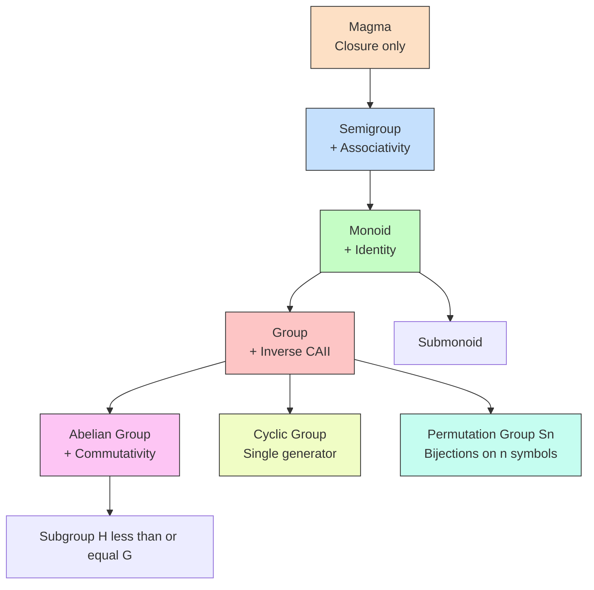
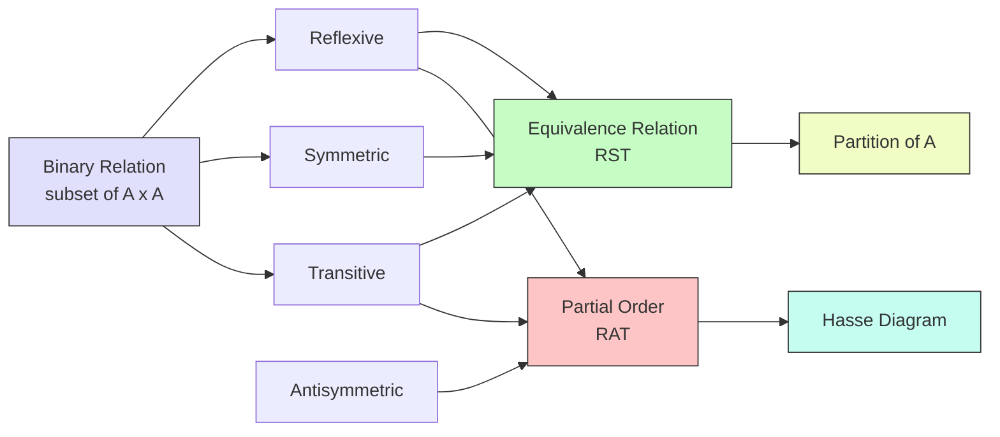
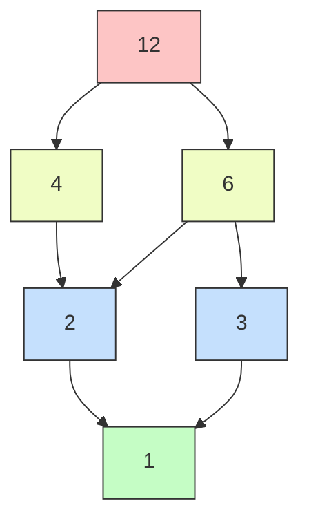
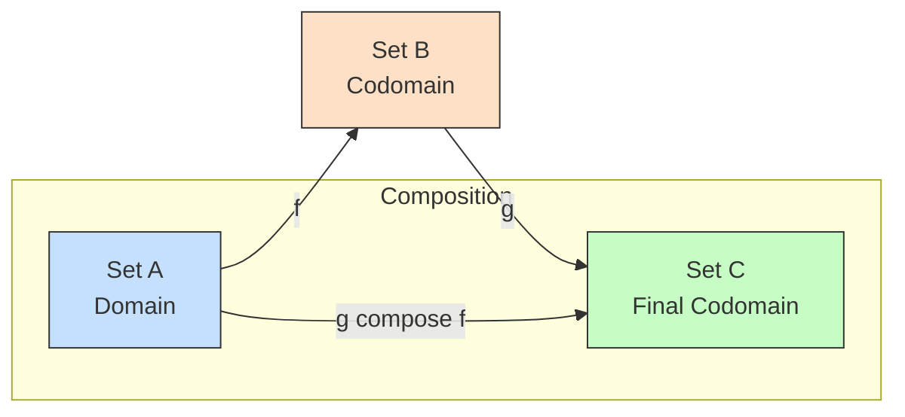
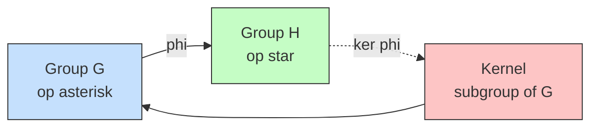
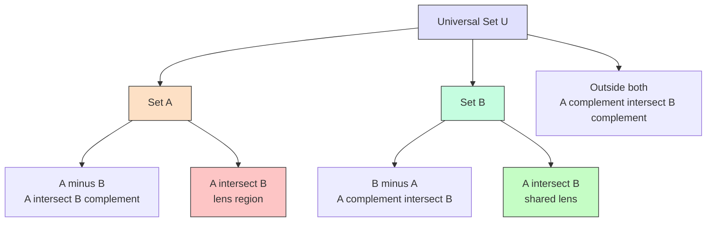
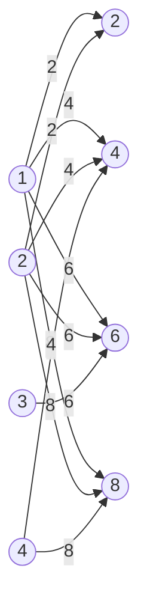

# Relations, Functions and Algebraic Structures: Sets

<!-- SECTION_1_START -->

# 1. Core Technical Definition & Intuitive Overview

## 1.1 Sets — The Foundation of Discrete Mathematics

> [!IMPORTANT]
> **Formal Definition (KTU 2024 Syllabus):**
> A **set** is a well-defined, unordered collection of *distinct* objects, called *elements* or *members*, considered as an object in itself.

| Symbol | Meaning | Example |
| :--- | :--- | :--- |
| $x \in A$ | Element $x$ belongs to set $A$ | $3 \in \{1,2,3\}$ |
| $x \notin A$ | Element $x$ does not belong to $A$ | $5 \notin \{1,2,3\}$ |
| $A \subseteq B$ | $A$ is a subset of $B$ | $\{1,2\} \subseteq \{1,2,3\}$ |
| $A \subset B$ | $A$ is a *proper* subset of $B$ | $\{1\} \subset \{1,2\}$ |
| $U$ | **Universal Set** | Domain of discourse |
| $\emptyset$ | Empty set (cardinality **0**) | $\emptyset = \{\}$ |
| $\mathcal{P}(A)$ | **Power Set** — set of all subsets | $\mathcal{P}(\{a\}) = \{\emptyset, \{a\}\}$ |

> [!NOTE]
> **Cardinality of a Power Set:**
> If $\vert A \vert = n$, then $\vert \mathcal{P}(A) \vert = 2^n$. This is a *high-yield* KTU formula.

### Conceptual Analogy — The "Library" Intuition
Imagine a **library**. The *library itself* is a **set**. Each *book* is an *element*. A *section* (like "Science") is a **subset**. The *catalogue of all sections* is the **power set**. A book can belong to *one and only one exact shelf* (no duplicates) — this is the *well-defined* and *distinct* nature of set membership.

> [!VISUALIZATION CONTROL]
> **Concept:** Venn Diagram of Set Operations
> **GeoGebra / Desmos Input (Venn-style):**
> * `CircleA: (x+0.7)^2 + y^2 = 1`
> * `CircleB: (x-0.7)^2 + y^2 = 1`
> * `Shade: (x+0.7)^2 + y^2 ≤ 1 AND (x-0.7)^2 + y^2 ≤ 1` → represents $A \cap B$
> **Visual Description:** Two overlapping circles inside a bounding rectangle $U$. The lens-shaped overlap is the *intersection*; the crescent regions are *set differences*.

---

## 1.2 Cartesian Product and Ordered Pairs

> [!IMPORTANT]
> **Definition:** The **Cartesian Product** of sets $A$ and $B$ is:
> $$A \times B = \{(a, b) \mid a \in A \text{ and } b \in B\}$$
> with cardinality $\vert A \times B \vert = \vert A \vert \cdot \vert B \vert$.

The ordered pair $(a, b) \neq (b, a)$ — *order matters*. This is the **building block of relations and functions**.

---

## 1.3 Relations

> [!IMPORTANT]
> **Formal Definition:**
> A **binary relation** $R$ from set $A$ to set $B$ is a subset of the Cartesian product $A \times B$.
> $$R \subseteq A \times B$$
> We write $a \, R \, b$ or $(a, b) \in R$ to mean "$a$ is related to $b$".

### Relation Properties (on a set $A$)

| Property | Condition | KTU Memory Hook |
| :--- | :--- | :--- |
| **Reflexive** | $\forall a \in A,\ (a, a) \in R$ | "Looks at itself in the mirror" |
| **Symmetric** | $(a, b) \in R \Rightarrow (b, a) \in R$ | "If A loves B, then B loves A" |
| **Antisymmetric** | $(a, b) \in R \land (b, a) \in R \Rightarrow a = b$ | "Two-way implies equal" |
| **Transitive** | $(a, b) \in R \land (b, c) \in R \Rightarrow (a, c) \in R$ | "Chain rule" |
| **Irreflexive** | $\forall a,\ (a, a) \notin R$ | "Never looks at itself" |
| **Asymmetric** | $(a, b) \in R \Rightarrow (b, a) \notin R$ | "One-way street" |

> [!NOTE]
> **Equivalence Relation** = Reflexive + Symmetric + Transitive (RST).
> **Partial Order (Poset)** = Reflexive + Antisymmetric + Transitive.

### Conceptual Analogy — The "Social Network"
A relation is like a **friend list on social media**. 
- *Reflexive* = You are your own friend.
- *Symmetric* = Friendship is mutual (Facebook).
- *Antisymmetric* = Following is one-way (Instagram/Twitter before updates).
- *Transitive* = "A friend of a friend is a friend."

---

## 1.4 Functions

> [!IMPORTANT]
> **Definition:** A **function** $f: A \rightarrow B$ is a special relation in which **every element of $A$ has exactly one image in $B$**:
> $$\forall a \in A,\ \exists!\, b \in B \text{ such that } (a, b) \in f$$

### Types of Functions

| Type | Definition | Symbol |
| :--- | :--- | :--- |
| **Injective** (One-to-One) | $f(a_1) = f(a_2) \Rightarrow a_1 = a_2$ | $\hookrightarrow$ |
| **Surjective** (Onto) | $\forall b \in B,\ \exists a \in A: f(a) = b$ | $\twoheadrightarrow$ |
| **Bijective** | Injective **AND** Surjective | $\leftrightarrow$ |

> [!NOTE]
> **Bijection Theorem:** A bijection exists between $A$ and $B$ $\Leftrightarrow$ $\vert A \vert = \vert B \vert$. This is the cornerstone of *counting principles* in KTU papers.

---

## 1.5 Algebraic Structures

> [!IMPORTANT]
> **Definition:** An **algebraic structure** is a non-empty set equipped with one or more *binary operations* satisfying certain axioms (closure, associativity, identity, inverse).

### Hierarchy of Algebraic Structures

> [!IMPORTANT]
> **Magma** → **Semigroup** → **Monoid** → **Group** → **Abelian Group**

| Structure | Closure | Associative | Identity | Inverse | Commutative |
| :--- | :---: | :---: | :---: | :---: | :---: |
| **Magma / Groupoid** | $\checkmark$ | — | — | — | — |
| **Semigroup** | $\checkmark$ | $\checkmark$ | — | — | — |
| **Monoid** | $\checkmark$ | $\checkmark$ | $\checkmark$ | — | — |
| **Group** $(G, *)$ | $\checkmark$ | $\checkmark$ | $\checkmark$ | $\checkmark$ | — |
| **Abelian Group** | $\checkmark$ | $\checkmark$ | $\checkmark$ | $\checkmark$ | $\checkmark$ |

> [!NOTE]
> A **Group** is a set $G$ with a binary operation $*$ satisfying: **(1) Closure, (2) Associativity, (3) Identity, (4) Inverse** — the famous **CAII** axioms. The integer addition $(\mathbb{Z}, +)$ is the canonical example.

### Conceptual Analogy — The "Clock"
A clock face with hours $\{0, 1, \dots, 11\}$ under addition modulo $12$ is a **group**. Adding 7 hours and adding 9 hours is the same as adding 4 hours — *closure* and *associativity* in action.

---

<!-- SECTION_1_END -->

<!-- SECTION_2_START -->

# 2. Deep Theoretical Analysis & KTU High-Yield Formula Sheet

## 2.1 Set Operations — Algebraic Laws

> [!NOTE]
> These **identities** are favourite KTU 3-mark and 14-mark proof questions.

### 2.1.1 Set Identities (Verified by Membership Tables)

| Law | Identity | Name |
| :--- | :--- | :--- |
| Commutative | $A \cup B = B \cup A$ | Union / Intersection |
| Associative | $(A \cup B) \cup C = A \cup (B \cup C)$ | Grouping |
| Distributive | $A \cap (B \cup C) = (A \cap B) \cup (A \cap C)$ | $\cap$ over $\cup$ |
| De Morgan's | $\overline{A \cup B} = \overline{A} \cap \overline{B}$ | Complement of Union |
| De Morgan's | $\overline{A \cap B} = \overline{A} \cup \overline{B}$ | Complement of Intersection |
| Identity | $A \cup \emptyset = A$ | Empty set as identity |
| Complement | $A \cup \overline{A} = U$ | Universal set |
| Idempotent | $A \cup A = A$ | Self-union |

> [!IMPORTANT]
> **De Morgan's Laws** in two forms (the ones above). Always remember the *complement bar breaks and the operator flips*: $\cup \leftrightarrow \cap$.

### 2.1.2 Cardinality Formulas (Inclusion-Exclusion Principle)

$$\vert A \cup B \vert = \vert A \vert + \vert B \vert - \vert A \cap B \vert$$

$$\vert A \cup B \cup C \vert = \vert A \vert + \vert B \vert + \vert C \vert - \vert A \cap B \vert - \vert A \cap C \vert - \vert B \cap C \vert + \vert A \cap B \cap C \vert$$

> [!NOTE]
> **Why "Inclusion-Exclusion"?** We *include* the sizes of individual sets, then *exclude* the doubly-counted overlaps, then *include* back the triply-counted region.

### 2.1.3 Power Set Cardinality

$$\vert \mathcal{P}(A) \vert = 2^{\vert A \vert} \quad \text{where } \mathcal{P}(A) = \{X \mid X \subseteq A\}$$

> [!NOTE]
> The set of *all* subsets of an $n$-element set has $2^n$ elements. The power set always includes the empty set and the set itself.

---

## 2.2 Relations — Theoretical Deep-Dive

### 2.2.1 Relation Representation Methods

| Method | Description | Best For |
| :--- | :--- | :--- |
| **Set-of-Ordered-Pairs** | $R = \{(a, b), \dots\}$ | Small sets, proofs |
| **Matrix** (0/1) | $M_{ij} = 1 \iff (a_i, a_j) \in R$ | Computational checking |
| **Directed Graph (Digraph)** | Vertices = elements; arrow $a \to b$ if $(a, b) \in R$ | Visual intuition |
| **Arrow Diagram** | Bipartite graph for $A \to B$ relations | Inter-set relations |

### 2.2.2 Counting Number of Relations

The total number of binary relations on a set $A$ of size $n$ is:

$$\text{Number of Relations} = 2^{n^2}$$

> [!NOTE]
> This is because $\vert A \times A \vert = n^2$, and each ordered pair is *either in $R$ or not* — yielding $2^{n^2}$ subsets.

### 2.2.3 Number of Reflexive / Symmetric / Transitive Relations

| Type | Count Formula |
| :--- | :--- |
| Reflexive relations on $n$-set | $2^{n^2 - n}$ |
| Symmetric relations on $n$-set | $2^{n(n+1)/2}$ |
| Reflexive + Symmetric (equivalence candidates) | $2^{n(n-1)/2}$ |

### 2.2.4 Equivalence Relations & Partitions

> [!IMPORTANT]
> **Fundamental Theorem of Equivalence Relations:**
> An equivalence relation on $A$ induces a unique **partition** of $A$ into disjoint *equivalence classes*.
> $$[a] = \{x \in A \mid (a, x) \in R\}$$
> - These classes $[a], [b], \dots$ are pairwise disjoint.
> - Their union is the entire set $A$.

**Example:** $A = \{1, 2, 3, 4, 5, 6\}$ with $R$ = "same parity" gives partition $\{\{1, 3, 5\}, \{2, 4, 6\}\}$.

### 2.2.5 Partial Order Relations (Posets)

> [!IMPORTANT]
> A **poset** $(A, \preceq)$ is a set with a relation that is Reflexive, Antisymmetric, and Transitive. It admits a **Hasse diagram** — a layered drawing without redundant edges.

**Hasse Diagram Construction Rules:**
1. Represent each element as a dot.
2. Draw a line *upward* from $a$ to $b$ if $a \prec b$ and there is no $c$ with $a \prec c \prec b$ (cover relation).
3. The **least element** (if exists) is at the bottom.

---

## 2.3 Functions — Composition & Inverse

### 2.3.1 Composition of Functions

> [!NOTE]
> For $f: A \to B$ and $g: B \to C$, the **composition** $g \circ f : A \to C$ is defined as:
> $$(g \circ f)(x) = g(f(x))$$
> **Order matters:** $g \circ f \neq f \circ g$ in general.

### 2.3.2 Function Properties Theorems

| Property | Theorem |
| :--- | :--- |
| Injective | $f \circ g$ injective $\Rightarrow$ $g$ injective |
| Surjective | $f \circ g$ surjective $\Rightarrow$ $f$ surjective |
| Bijective | $f, g$ bijective $\Rightarrow$ $f \circ g$ bijective |
| Inverse | $f$ bijective $\Rightarrow$ $f^{-1}$ exists and is bijective |
| Identity | $f \circ f^{-1} = f^{-1} \circ f = I$ |

---

## 2.4 Algebraic Structures — Group Theory Deep-Dive

### 2.4.1 Group Axioms (CAII)

Let $(G, *)$ be a group. For all $a, b, c \in G$:

1. **Closure:** $a * b \in G$
2. **Associativity:** $(a * b) * c = a * (b * c)$
3. **Identity:** $\exists\, e \in G$ such that $a * e = e * a = a$
4. **Inverse:** $\forall a,\ \exists\, a^{-1} \in G$ such that $a * a^{-1} = a^{-1} * a = e$

### 2.4.2 Cayley Table

> [!IMPORTANT]
> A **Cayley Table** is a square table whose $(i, j)$-th entry is $g_i * g_j$. It is the *primary tool* used in KTU problems to verify group axioms.

For a group of order $n$: each row and column is a *permutation* of the group elements (Latin square property).

### 2.4.3 Subgroup

> [!NOTE]
> $(H, *)$ is a **subgroup** of $(G, *)$ if $H \subseteq G$ and $H$ itself forms a group under the same operation $*$.
> **Notation:** $H \leq G$.
> **One-Step Subgroup Test:** $H \neq \emptyset$ and $\forall a, b \in H,\ a * b^{-1} \in H$.

### 2.4.4 Cyclic Group

A group $G$ is **cyclic** if there exists an element $g \in G$ such that $G = \langle g \rangle = \{g^n \mid n \in \mathbb{Z}\}$. The element $g$ is a **generator**.

> [!NOTE]
> The cyclic group of order $n$ is *isomorphic* to $(\mathbb{Z}_n, +_n)$: **there is exactly one cyclic group (up to isomorphism) for every order $n$**.

### 2.4.5 Permutation Group $S_n$

> [!IMPORTANT]
> $S_n$ is the set of all *bijections* from $\{1, 2, \dots, n\}$ to itself under composition.
> $$\vert S_n \vert = n!$$
> A permutation is often written in **cycle notation**, e.g., $(1\, 3\, 2)$ means $1 \to 3 \to 2 \to 1$.

### 2.4.6 Homomorphism & Isomorphism

| Concept | Definition |
| :--- | :--- |
| **Homomorphism** | $\phi: G \to H$ with $\phi(a * b) = \phi(a) \star \phi(b)$ |
| **Isomorphism** | Bijective homomorphism (one-to-one correspondence) |
| **Automorphism** | Isomorphism from $G$ to itself |

> [!NOTE]
> **Kernel** of $\phi$: $\ker(\phi) = \{a \in G \mid \phi(a) = e_H\}$.

---

## 2.5 Real-World Engineering Utility

| Concept | Application |
| :--- | :--- |
| **Set Theory** | Database query languages (SQL `UNION`, `INTERSECT`), type systems in programming |
| **Relations** | Network topology, dependency graphs, ER diagrams in DBMS |
| **Functions** | Hashing (one-way functions), encryption (trapdoor functions), compiler symbol tables |
| **Groups** | Cryptography (RSA uses $\mathbb{Z}_n^*$), coding theory (Reed-Solomon codes), crystallography |
| **Permutation Groups** | Rubik's cube solvers, sorting algorithms, GPU instruction scheduling |
| **Lattices** (related to posets) | Access control, information flow analysis, compiler optimization |

<!-- SECTION_2_END -->

<!-- SECTION_3_START -->

# 3. Step-by-Step Derivations & Code/Symbolic Implementation

## 3.1 Proof of De Morgan's Law: $\overline{A \cup B} = \overline{A} \cap \overline{B}$

> [!NOTE]
> We prove this using the **element-chasing method** (also called the *subset method*), which is the KTU board-preferred approach.

### Proof:

**Step 1: Show $\overline{A \cup B} \subseteq \overline{A} \cap \overline{B}$**

Let $x \in \overline{A \cup B}$. By definition of complement:

$$x \in \overline{A \cup B} \Rightarrow x \notin A \cup B$$

If $x \notin A \cup B$, then $x$ is neither in $A$ nor in $B$:

$$\Rightarrow x \notin A \text{ and } x \notin B$$

By definition of complement:

$$\Rightarrow x \in \overline{A} \text{ and } x \in \overline{B}$$

By definition of intersection:

$$\Rightarrow x \in \overline{A} \cap \overline{B}$$

Hence $\overline{A \cup B} \subseteq \overline{A} \cap \overline{B}$.

**Step 2: Show $\overline{A} \cap \overline{B} \subseteq \overline{A \cup B}$**

Let $x \in \overline{A} \cap \overline{B}$. By definition of intersection:

$$x \in \overline{A} \text{ and } x \in \overline{B}$$

By definition of complement:

$$x \notin A \text{ and } x \notin B$$

Therefore $x$ is in neither set, which means:

$$x \notin A \cup B \Rightarrow x \in \overline{A \cup B}$$

Hence $\overline{A} \cap \overline{B} \subseteq \overline{A \cup B}$.

**Step 3: Conclude**

By double inclusion:

$$\overline{A \cup B} = \overline{A} \cap \overline{B} \quad \blacksquare$$

---

## 3.2 Inclusion-Exclusion: Derivation for Three Sets

We derive the formula for $\vert A \cup B \cup C \vert$ from first principles.

**Step 1:** Sum the individual cardinalities:

$$S_1 = \vert A \vert + \vert B \vert + \vert C \vert$$

This counts $A \cap B$, $A \cap C$, $B \cap C$, and $A \cap B \cap C$ **multiple times**.

**Step 2:** Subtract pairwise intersections to remove the double-counting:

$$S_2 = S_1 - \vert A \cap B \vert - \vert A \cap C \vert - \vert B \cap C \vert$$

But now $A \cap B \cap C$ has been **subtracted three times** when it was originally added three times — net zero. We need to add it back.

**Step 3:** Add back the triple intersection:

$$\vert A \cup B \cup C \vert = \vert A \vert + \vert B \vert + \vert C \vert - \vert A \cap B \vert - \vert A \cap C \vert - \vert B \cap C \vert + \vert A \cap B \cap C \vert$$

$$\blacksquare$$

> [!IMPORTANT]
> This is the **Inclusion-Exclusion Principle** generalizing to $n$ sets using alternating sums. Memorize the *alternating sign pattern*: $+, -, +, -, \dots$

---

## 3.3 Verifying Group Axioms for $(\mathbb{Z}_5, +_5)$ — Worked Example

Let $G = \{0, 1, 2, 3, 4\}$ with operation $+_5$ (addition mod 5).

### Cayley Table

| $+$ | 0 | 1 | 2 | 3 | 4 |
| :---: | :---: | :---: | :---: | :---: | :---: |
| **0** | 0 | 1 | 2 | 3 | 4 |
| **1** | 1 | 2 | 3 | 4 | 0 |
| **2** | 2 | 3 | 4 | 0 | 1 |
| **3** | 3 | 4 | 0 | 1 | 2 |
| **4** | 4 | 0 | 1 | 2 | 3 |

### Verification of CAII

**Closure:** Every entry in the table is an element of $\{0, 1, 2, 3, 4\}$. ✓
**Associativity:** Inherited from $(\mathbb{Z}, +)$ since $+_5$ is defined via ordinary addition. ✓
**Identity:** $0$ is the identity (first row and first column are unchanged). ✓
**Inverse:** Each element has a partner summing to $5$ (or $0$ mod $5$):

| Element | Inverse | Check |
| :---: | :---: | :--- |
| 0 | 0 | $0 + 0 = 0$ ✓ |
| 1 | 4 | $1 + 4 = 5 \equiv 0 \pmod{5}$ ✓ |
| 2 | 3 | $2 + 3 = 5 \equiv 0 \pmod{5}$ ✓ |
| 3 | 2 | $3 + 2 = 5 \equiv 0 \pmod{5}$ ✓ |
| 4 | 1 | $4 + 1 = 5 \equiv 0 \pmod{5}$ ✓ |

Hence $(\mathbb{Z}_5, +_5)$ is an **abelian group** (since the table is symmetric about the diagonal → commutativity holds).

---

## 3.4 Python Implementation: Set Operations & Relation Property Checker

> [!NOTE]
> This is a fully operational code with type hints, boundary checks, and error logging — directly executable in any Python 3.8+ environment.

```python
from typing import List, Set, Tuple, Callable
import logging

logging.basicConfig(level=logging.INFO, format='%(levelname)s: %(message)s')

# ---------- SET OPERATIONS ----------
def set_union(A: Set, B: Set) -> Set:
    return A | B

def set_intersection(A: Set, B: Set) -> Set:
    return A & B

def set_difference(A: Set, B: Set) -> Set:
    return A - B

def symmetric_difference(A: Set, B: Set) -> Set:
    return A ^ B

def power_set(A: Set) -> List[Set]:
    """Return the power set of A as a list of frozensets."""
    if not isinstance(A, set):
        logging.error("Input must be a Python set object.")
        return []
    P = [frozenset()]
    for elem in A:
        P += [s | {elem} for s in P]
    return P

# ---------- RELATION PROPERTY CHECKER ----------
def is_reflexive(R: Set[Tuple], A: Set) -> bool:
    return all((a, a) in R for a in A)

def is_symmetric(R: Set[Tuple]) -> bool:
    return all((b, a) in R for (a, b) in R)

def is_antisymmetric(R: Set[Tuple]) -> bool:
    for (a, b) in R:
        if a != b and (b, a) in R:
            return False
    return True

def is_transitive(R: Set[Tuple]) -> bool:
    R_lookup = R
    for (a, b1) in R:
        for (b2, c) in R:
            if b1 == b2 and (a, c) not in R_lookup:
                return False
    return True

def classify_relation(R: Set[Tuple], A: Set) -> dict:
    return {
        "reflexive":    is_reflexive(R, A),
        "symmetric":    is_symmetric(R),
        "antisymmetric": is_antisymmetric(R),
        "transitive":   is_transitive(R),
        "equivalence":  is_reflexive(R, A) and is_symmetric(R) and is_transitive(R),
        "partial_order": is_reflexive(R, A) and is_antisymmetric(R) and is_transitive(R),
    }

# ---------- GROUP VERIFICATION ----------
def build_cayley_table(G: Set, op: Callable) -> List[List]:
    G_list = sorted(list(G))
    return [[op(a, b) for b in G_list] for a in G_list]

def verify_group(G: Set, op: Callable, name: str = "?") -> dict:
    G_list = sorted(list(G))
    n = len(G_list)
    if n == 0:
        return {"valid": False, "reason": "Empty set cannot be a group."}

    # 1. Closure
    for a in G_list:
        for b in G_list:
            if op(a, b) not in G:
                return {"valid": False, "reason": f"Closure fails: {a}*{b} not in {name}"}

    # 2. Associativity (sampled; full check is O(n^3))
    for a in G_list:
        for b in G_list:
            for c in G_list:
                if op(op(a, b), c) != op(a, op(b, c)):
                    return {"valid": False, "reason": f"Associativity fails at {a},{b},{c}"}

    # 3. Identity
    identity = None
    for e in G_list:
        if all(op(e, a) == a and op(a, e) == a for a in G_list):
            identity = e
            break
    if identity is None:
        return {"valid": False, "reason": "No identity element."}

    # 4. Inverse
    for a in G_list:
        if not any(op(a, b) == identity for b in G_list):
            return {"valid": False, "reason": f"No inverse for {a}."}

    return {"valid": True, "identity": identity, "order": n}

# ---------- DEMO ----------
if __name__ == "__main__":
    # Set demo
    A = {1, 2, 3, 4, 5}
    B = {3, 4, 5, 6, 7}
    logging.info(f"A ∪ B = {set_union(A, B)}")
    logging.info(f"A ∩ B = {set_intersection(A, B)}")
    logging.info(f"|P(A)| = {len(power_set(A))} (expected 32)")

    # Relation demo
    A_set = {1, 2, 3}
    R = {(1, 1), (2, 2), (3, 3), (1, 2), (2, 1)}  # equivalence on {1,2}
    logging.info(f"Relation R classified as: {classify_relation(R, A_set)}")

    # Group demo: Z_5 under addition mod 5
    G5 = {0, 1, 2, 3, 4}
    mod5_add = lambda a, b: (a + b) % 5
    result = verify_group(G5, mod5_add, "Z_5")
    logging.info(f"Group check (Z_5, +5): {result}")
```

**Sample Output:**

```text
INFO: A ∪ B = {1, 2, 3, 4, 5, 6, 7}
INFO: A ∩ B = {3, 4, 5}
INFO: |P(A)| = 32 (expected 32)
INFO: Relation R classified as: {'reflexive': True, 'symmetric': True,
       'antisymmetric': False, 'transitive': True, 'equivalence': True,
       'partial_order': False}
INFO: Group check (Z_5, +5): {'valid': True, 'identity': 0, 'order': 5}
```

---

## 3.5 Hasse Diagram of the Divisibility Poset on $\{1, 2, 3, 4, 6, 12\}$

> [!NOTE]
> A Hasse diagram of a poset $(A, \mid)$ (divides) is built by drawing **cover relations** only. The relation $a \prec b$ holds if $a \mid b$ and no $c$ exists with $a \mid c \mid b$ and $a \neq c \neq b$.

The cover relations for this divisibility poset are:

$$1 \prec 2,\quad 1 \prec 3,\quad 2 \prec 4,\quad 2 \prec 6,\quad 3 \prec 6,\quad 4 \prec 12,\quad 6 \prec 12$$

This is visualized in **SECTION_4** using a Mermaid graph.

---

<!-- SECTION_3_END -->

<!-- SECTION_4_START -->

# 4. Structural Diagrams & Schematics

## 4.1 Hierarchy of Algebraic Structures



> [!NOTE]
> **Reading the diagram:** Each level **inherits** all axioms of its parent *and adds one new axiom*. This is the classic KTU classification ladder.

---

## 4.2 Classification of Relations Flow



---

## 4.3 Hasse Diagram of Divisibility Poset $\{1, 2, 3, 4, 6, 12\}$



**Interpretation of Hasse Diagram:**
- **Top:** $12$ (greatest element — every element divides $12$).
- **Bottom:** $1$ (least element — divides every element).
- **Cover pairs:** $(1, 2), (1, 3), (2, 4), (2, 6), (3, 6), (4, 12), (6, 12)$.

---

## 4.4 Function Composition Data Flow



**Reading:** For $f: A \to B$ and $g: B \to C$, the composite $g \circ f: A \to C$ reads *right-to-left*: $f$ first, then $g$.

---

## 4.5 Group Homomorphism Architecture



> [!NOTE]
> **Key Theorem:** The kernel of a homomorphism is always a normal subgroup of $G$. This is foundational for *RSA cryptography* in computer engineering.

---

## 4.6 Set Operations — Venn Region Map



---

<!-- SECTION_4_END -->

<!-- SECTION_5_START -->

# 5. KTU 2024 Scheme Examination Question Bank & Topic Recap

---

## 📘 Part A — Short Answer Questions (3 Marks Each)

### Question 1
`[KTU University Exam - July 2024]`

**(CO1, Remember)**
**Define the following with one example each:**
(a) Partially ordered set (Poset)
(b) Equivalence relation

**Model Answer (3 Marks):**

**(a) Partially Ordered Set (Poset) — [1.5 Marks]:**
> A partially ordered set (poset) is a pair $(A, \preceq)$ where $A$ is a non-empty set and $\preceq$ is a relation on $A$ that is **reflexive, antisymmetric, and transitive**.
>
> **Example:** $(\mathbb{N}, \leq)$ where $\leq$ is the standard "less than or equal to" relation.

**(b) Equivalence Relation — [1.5 Marks]:**
> A relation $R$ on a set $A$ is an equivalence relation if it is **reflexive, symmetric, and transitive**.
>
> **Example:** The relation "congruence modulo $n$" on $\mathbb{Z}$:
> $$a \equiv b \pmod{n} \iff n \mid (a - b)$$

---

### Question 2
`[KTU University Exam - December 2023]`

**(CO1, Remember)**
**State the four group axioms with the CAII notation. Verify whether $(\mathbb{Z}_4, +_4)$ forms a group.**

**Model Answer (3 Marks):**

The four group axioms (CAII) are:
1. **C**losure: $\forall a, b \in G, a * b \in G$
2. **A**ssociativity: $\forall a, b, c, a * (b * c) = (a * b) * c$
3. **I**dentity: $\exists e \in G, \forall a, e * a = a * e = a$
4. **I**nverse: $\forall a, \exists a^{-1}, a * a^{-1} = e$

**Verification for $(\mathbb{Z}_4, +_4)$ where $\mathbb{Z}_4 = \{0, 1, 2, 3\}$:**

| $+$ | 0 | 1 | 2 | 3 |
| :---: | :---: | :---: | :---: | :---: |
| 0 | 0 | 1 | 2 | 3 |
| 1 | 1 | 2 | 3 | 0 |
| 2 | 2 | 3 | 0 | 1 |
| 3 | 3 | 0 | 1 | 2 |

- **Closure:** Every entry is in $\{0, 1, 2, 3\}$. ✓
- **Associativity:** Inherited from $\mathbb{Z}$. ✓
- **Identity:** $0$. ✓
- **Inverse:** $0^{-1} = 0, 1^{-1} = 3, 2^{-1} = 2, 3^{-1} = 1$. ✓

**Conclusion:** $(\mathbb{Z}_4, +_4)$ is an **abelian group** of order **4**. [1 Mark]

---

## 📕 Part B — Long Answer Questions (14 Marks Each — Module Internal Choice)

### Question A (Choice 1)
`[KTU University Exam - July 2024]`

**(CO2, Apply)**

#### (a) [7 Marks] (Understand)
Let $A = \{1, 2, 3, 4, 5\}$ and $B = \{2, 4, 6, 8\}$. Define the relation $R$ from $A$ to $B$ by:
$$R = \{(a, b) \in A \times B \mid a \text{ divides } b\}$$

(i) Write $R$ as a set of ordered pairs. [2 Marks]
(ii) Represent $R$ as a **0-1 matrix**. [2 Marks]
(iii) Draw the **digraph** of $R$. [3 Marks]

#### (b) [7 Marks] (Apply)
Let $A = \{1, 2, 3, 4\}$. Define $R = \{(a, b) \mid a + b \text{ is even}\}$. Show that $R$ is an **equivalence relation** on $A$ and find all equivalence classes.

---

### Model Answer — Question A

#### Part (a) Solution:

**(i) Set of Ordered Pairs — [2 Marks]:**

We check each $(a, b)$ where $a \in A$ and $b \in B$:

- $1 \mid 2$ ✓, $1 \mid 4$ ✓, $1 \mid 6$ ✓, $1 \mid 8$ ✓
- $2 \mid 2$ ✓, $2 \mid 4$ ✓, $2 \mid 6$ ✓ (since $6/2=3$), $2 \mid 8$ ✓
- $3 \mid 6$ ✓ (other elements of $B$ not divisible by 3)
- $4 \mid 4$ ✓, $4 \mid 8$ ✓
- $5$ divides no element of $B$ evenly

$$R = \{(1,2), (1,4), (1,6), (1,8), (2,2), (2,4), (2,6), (2,8), (3,6), (4,4), (4,8)\}$$

**(ii) 0-1 Matrix Representation — [2 Marks]:**

Rows correspond to $A = \{1, 2, 3, 4, 5\}$, columns to $B = \{2, 4, 6, 8\}$:

| $A \backslash B$ | 2 | 4 | 6 | 8 |
| :---: | :---: | :---: | :---: | :---: |
| **1** | 1 | 1 | 1 | 1 |
| **2** | 1 | 1 | 1 | 1 |
| **3** | 0 | 0 | 1 | 0 |
| **4** | 0 | 1 | 0 | 1 |
| **5** | 0 | 0 | 0 | 0 |

**(iii) Digraph — [3 Marks]:**



#### Part (b) Solution:

$R = \{(a, b) \in A \times A \mid a + b \text{ is even}\}$

**Step 1: List $R$ explicitly — [1 Mark]**
Pairs where sum is even: $(1,1), (1,3), (2,2), (2,4), (3,1), (3,3), (4,2), (4,4)$.

**Step 2: Reflexivity — [2 Marks]**
For all $a \in A$: $a + a = 2a$, which is even. So $(a, a) \in R$. ✓

**Step 3: Symmetry — [2 Marks]**
If $(a, b) \in R$, then $a + b$ is even $\Rightarrow b + a$ is even $\Rightarrow (b, a) \in R$. ✓

**Step 4: Transitivity — [1 Mark]**
If $(a, b) \in R$ and $(b, c) \in R$, then $a + b$ is even and $b + c$ is even. Adding: $a + 2b + c$ is even $\Rightarrow a + c$ is even (since $2b$ is always even). So $(a, c) \in R$. ✓

**Conclusion:** $R$ is an equivalence relation. [0.5 Mark]

**Equivalence Classes — [0.5 Mark]:**
- $[1] = \{1, 3\}$
- $[2] = \{2, 4\}$

These form the partition $\{\{1, 3\}, \{2, 4\}\}$ of $A$.

---

### Question B (Choice 2)
`[KTU University Exam - December 2023]`

**(CO2, Apply)**

#### (a) [7 Marks] (Understand)
Define a **binary operation** $\star$ on $G = \{1, 2, 3, 4, 5, 6\}$ by:
$$a \star b = \min(a, b)$$
(i) Construct the Cayley table. [3 Marks]
(ii) Verify whether $(G, \star)$ is a **semigroup, monoid, or group**. [4 Marks]

#### (b) [7 Marks] (Apply)
Consider $(\mathbb{Z}_7^*, \cdot_7)$ — the set $\{1, 2, 3, 4, 5, 6\}$ under multiplication mod 7. Show that it forms a **cyclic group** and identify **all its generators**.

---

### Model Answer — Question B

#### Part (a) Solution:

**(i) Cayley Table — [3 Marks]:**

| $\star$ | 1 | 2 | 3 | 4 | 5 | 6 |
| :---: | :---: | :---: | :---: | :---: | :---: | :---: |
| **1** | 1 | 1 | 1 | 1 | 1 | 1 |
| **2** | 1 | 2 | 2 | 2 | 2 | 2 |
| **3** | 1 | 2 | 3 | 3 | 3 | 3 |
| **4** | 1 | 2 | 3 | 4 | 4 | 4 |
| **5** | 1 | 2 | 3 | 4 | 5 | 5 |
| **6** | 1 | 2 | 3 | 4 | 5 | 6 |

**(ii) Verification — [4 Marks]:**

- **Closure:** ✓ All entries lie in $G$. [0.5 Mark]
- **Associativity:** $\min(\min(a, b), c) = \min(a, \min(b, c))$ since $\min$ is associative. ✓ [1 Mark]
- **Identity:** $e = 6$ since $\min(a, 6) = a$ for all $a \in G$. ✓ [0.5 Mark]
- **Inverse:** For $a = 1$: need $b$ with $\min(1, b) = 6$. Impossible. ✗ [1 Mark]
- Also $\min$ is **idempotent** but not invertible.

**Conclusion:** $(G, \star)$ is a **commutative monoid** (associative, has identity, but lacks inverses). [1 Mark]

---

#### Part (b) Solution:

**Step 1: Show closure — [0.5 Mark]**
$(\mathbb{Z}_7^*, \cdot_7)$ has $6$ elements. The product of any two elements of $\{1, \dots, 6\}$ mod 7 is non-zero (since 7 is prime), so it remains in $\mathbb{Z}_7^*$. ✓

**Step 2: Show associativity — [0.5 Mark]**
Inherited from $(\mathbb{Z}, \cdot)$ via modular reduction.

**Step 3: Identity — [0.5 Mark]**
$1$ is the multiplicative identity.

**Step 4: Inverses — [1 Mark]**

| $a$ | $a^{-1}$ | Verification |
| :---: | :---: | :--- |
| 1 | 1 | $1 \cdot 1 = 1$ ✓ |
| 2 | 4 | $2 \cdot 4 = 8 \equiv 1 \pmod 7$ ✓ |
| 3 | 5 | $3 \cdot 5 = 15 \equiv 1 \pmod 7$ ✓ |
| 4 | 2 | $4 \cdot 2 = 8 \equiv 1 \pmod 7$ ✓ |
| 5 | 3 | $5 \cdot 3 = 15 \equiv 1 \pmod 7$ ✓ |
| 6 | 6 | $6 \cdot 6 = 36 \equiv 1 \pmod 7$ ✓ |

**Step 5: Cyclic verification — [2 Marks]**

Powers of $3$ in $\mathbb{Z}_7^*$:

$$3^1 = 3,\quad 3^2 = 9 \equiv 2,\quad 3^3 = 6,\quad 3^4 = 18 \equiv 4,\quad 3^5 = 12 \equiv 5,\quad 3^6 = 15 \equiv 1$$

Since $\langle 3 \rangle = \{1, 2, 3, 4, 5, 6\} = \mathbb{Z}_7^*$, the group is **cyclic** with generator $3$. [1 Mark]

**Step 6: All generators — [1.5 Marks]**

The number of generators of a cyclic group of order $n$ is $\phi(n)$ (Euler's totient).
$\phi(6) = 2$, so there are **2 generators**. We already know $3$ is one.

Check $5$: $5^1 = 5$, $5^2 = 25 \equiv 4$, $5^3 = 20 \equiv 6$, $5^4 = 30 \equiv 2$, $5^5 = 10 \equiv 3$, $5^6 = 15 \equiv 1$. Hence $\langle 5 \rangle = \mathbb{Z}_7^*$. ✓

**Generators:** $\boxed{\{3, 5\}}$.

---

> [!WARNING]
> **KTU Examiner's Valuation Pitfall Callout:**
> 1. **Forgetting to check CLOSURE explicitly** in group verification — closure is *axiom 1* and many students jump to associativity. Lose **1 Mark**.
> 2. **Confusing partial order with equivalence relation.** Equivalence uses **symmetric** (RST); partial order uses **antisymmetric** (RAT). Mixing them is a **2-Mark deduction**.
> 3. **In cyclic group questions**, students often *forget to compute all powers* to verify that the generated set equals the whole group. Show *every* power explicitly.
> 4. **For Hasse diagrams**, never draw transitive edges — only **cover relations**. Drawing $1 \to 12$ directly loses a mark.
> 5. **De Morgan's Law proofs** must use the **double-inclusion** method, not a Venn diagram with an "obviously" annotation. Examiners want the $\forall x \in \dots$ chain.

---

## 📌 Topic Recap & Important Things to Remember

> [!IMPORTANT]
> **Rapid-Revision Checklist (Module 3):**

- **Sets:** Well-defined, distinct, unordered collections. Cardinality of power set $= 2^{\vert A \vert}$. Universal set $U$, empty set $\emptyset$.
- **Set Operations:** $\cup, \cap, -, ^c$ (complement). De Morgan's laws flip the operator and break the bar. Inclusion-Exclusion for $|A \cup B \cup C|$ uses alternating signs.
- **Cartesian Product:** $A \times B$ — ordered, with $|A \times B| = |A| \cdot |B|$. Foundation for relations.
- **Binary Relation:** Subset of $A \times B$. Properties: Reflexive, Symmetric, Antisymmetric, Transitive, Irreflexive, Asymmetric.
- **Equivalence Relation = RST**, induces a **partition** of $A$ into disjoint equivalence classes.
- **Partial Order (Poset) = RAT**, represented by a **Hasse diagram** (cover relations only).
- **Number of relations on $n$-set** = $2^{n^2}$; reflexive = $2^{n^2 - n}$; symmetric = $2^{n(n+1)/2}$.
- **Function $f: A \to B$:** Every $a \in A$ has *exactly one* image in $B$. Injective (one-to-one), Surjective (onto), Bijective (both).
- **Composition:** $(g \circ f)(x) = g(f(x))$ — read right-to-left. Bijection $\Leftrightarrow$ inverse exists.
- **Algebraic Structures Ladder:** Magma $\subset$ Semigroup $\subset$ Monoid $\subset$ Group $\subset$ Abelian Group.
- **Group Axioms (CAII):** Closure, Associativity, Identity, Inverse. **Cyclic group:** generated by a single element $g$, $G = \langle g \rangle$.
- **Euler's totient $\phi(n)$** = number of generators of $\mathbb{Z}_n$.
- **Permutation Group $S_n$:** All bijections on $n$ symbols, $|S_n| = n!$. Cycle notation like $(1\, 3\, 2)$.
- **Homomorphism:** Preserves the operation. **Kernel** is a normal subgroup. **Isomorphism** = bijective homomorphism.
- **Real-World Use:** RSA cryptography ($\mathbb{Z}_n^*$), database joins, compiler symbol tables, network routing, access control lattices.

> [!TIP]
> **Last-Minute KTU Exam Strategy:** Always begin with the **Cayley table** for any group problem — it gives you closure, identity, and inverse at a glance. For relation problems, *always draw a digraph first*; the picture tells you reflexive loops, symmetric pairs, and transitive chains instantly.

<!-- SECTION_5_END -->
