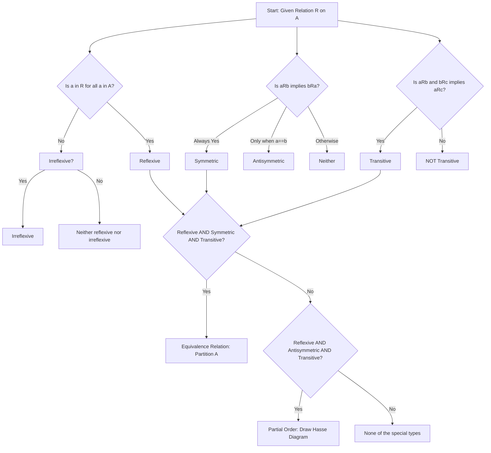
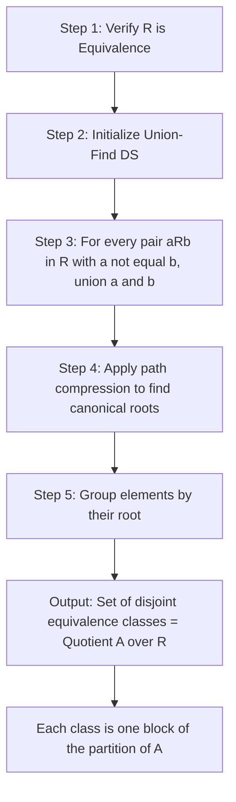

# Relations

<!-- SECTION_1_START -->

# RELATIONS

## 1.1 Formal Definition (KTU 2024 Syllabus Standard)

> [!IMPORTANT]
> **Definition (Binary Relation):** Let $A$ and $B$ be two non-empty sets. A **binary relation** $R$ from $A$ to $B$ is a subset of the Cartesian product $A \times B$. We write it as:
> $$R \subseteq A \times B$$
> If $(a, b) \in R$, we say "$a$ is related to $b$" and write $a \, R \, b$. If $(a, b) \notin R$, we say "$a$ is not related to $b$" and write $a \not\! R \, b$.

The term **relation** in Discrete Mathematics almost always refers to a **binary relation** (a relation between two objects). When the domain and codomain are the same ($A = B$), we say $R$ is a **relation on $A$**, and write $R \subseteq A \times A$.

> [!NOTE]
> **Domain of $R$:** The set of all first elements of ordered pairs in $R$:
> $$\text{Dom}(R) = \{a \in A \mid \exists b \in B, (a,b) \in R\}$$
> **Range of $R$:** The set of all second elements of ordered pairs in $R$:
> $$\text{Ran}(R) = \{b \in B \mid \exists a \in A, (a,b) \in R\}$$

> [!IMPORTANT]
> **Definition (General / n-ary Relation):** A relation on $n$ sets $A_1, A_2, \ldots, A_n$ is a subset of $A_1 \times A_2 \times \cdots \times A_n$. This is called an **$n$-ary relation**. Binary relations ($n=2$) are the most studied in DMS.

## 1.2 Intuitive Analogy

Think of a relation as a **rulebook of friendships in a college**:

- Let $S = \{\text{Anu, Balu, Chitra, Deepa}\}$ be a set of students.
- The Cartesian product $S \times S$ is the **complete list of every possible ordered pair** (every possible "Person X → Person Y" connection). That is $4 \times 4 = 16$ ordered pairs.
- A **relation** $R$ is just a **selected subset** of this big list. It picks out only the pairs we care about.
- For example, $R = \{(\text{Anu, Balu}), (\text{Balu, Chitra})\}$ says: *Anu knows Balu* AND *Balu knows Chitra*. That's the entire relation — only two pairs.

> [!TIP]
> **Geometric Intuition:** Plot the elements of $A$ on the $x$-axis and elements of $B$ on the $y$-axis. Then $A \times B$ is the entire rectangular grid. A relation $R$ is a **scatter of dots** anywhere on this grid. This visual helps in spotting properties like reflexivity (every diagonal point lit up) or symmetry (mirrored dots across the diagonal).

> [!VISUALIZATION CONTROL]
> **Concept:** Visualizing a relation on a set as a directed graph (digraph) and as a 0–1 matrix.
> **GeoGebra / Desmos Input Data (Matrix representation for $R = \{(1,1), (1,3), (2,2), (3,1), (3,3)\}$ on $A=\{1,2,3\}$):**
> * `Matrix R = {{1, 0, 1}, {0, 1, 0}, {1, 0, 1}}`
> * Plot points: $(1,1), (1,3), (2,2), (3,1), (3,3)$ on the $xy$-plane.
> **Visual Description:** Student should see a symmetric "X-like" pattern with 1s on the diagonal. The 1s above the diagonal are mirrored by 1s below the diagonal — this is the geometric signature of a *symmetric relation*.

---

## 1.3 Representations of a Relation

A relation on a finite set can be represented in **three equivalent ways** (board exam favorite!):

| Representation | Description | Example (same $R$ on $A=\{1,2,3\}$) |
| :--- | :--- | :--- |
| **Set of Ordered Pairs** | The most direct — list every pair in $R$. | $\{(1,1), (1,3), (2,2), (3,1), (3,3)\}$ |
| **Directed Graph (Digraph)** | Each element of $A$ becomes a vertex; for each $(a,b)\in R$, draw an arrow from $a$ to $b$. A loop at $a$ means $(a,a)\in R$. | Arrows: $1\to1, 1\to3, 2\to2, 3\to1, 3\to3$ |
| **0–1 Matrix (Adjacency)** | $A$ is rows and columns. $m_{ij}=1$ if $(i,j)\in R$, else $0$. | $M = \begin{pmatrix} 1 & 0 & 1 \\ 0 & 1 & 0 \\ 1 & 0 & 1 \end{pmatrix}$ |

<!-- SECTION_1_END -->

<!-- SECTION_2_START -->

# 2. DEEP THEORETICAL ANALYSIS

## 2.1 Types of Relations (End-to-End Classification)

For a relation $R$ on a set $A$ (i.e., $R \subseteq A \times A$), the KTU syllabus stresses the following exhaustive classification:

### 2.1.1 Void and Universal Relations
- **Empty / Void Relation:** $R = \emptyset$. No element of $A$ is related to anything.
- **Universal / Complete Relation:** $R = A \times A$. Every element is related to every element (including itself).

### 2.1.2 The Seven Core Property-Based Relations

Let $R \subseteq A \times A$ be a relation on $A$. We check each property by formal definition.

> [!NOTE]
> **1. Reflexive:** $\forall a \in A,\; (a, a) \in R$.
> Equivalently, $I_A = \{(a,a) \mid a \in A\} \subseteq R$.
> *Intuition:* Every element must be related to itself. In a digraph, every vertex must have a self-loop. In the matrix, every diagonal entry must be $1$.

> [!NOTE]
> **2. Irreflexive:** $\forall a \in A,\; (a, a) \notin R$.
> Equivalently, $R \cap I_A = \emptyset$.
> *Intuition:* No element is related to itself. No self-loops in digraph, all diagonal entries are $0$.

> [!NOTE]
> **3. Symmetric:** $\forall a, b \in A,\; (a, b) \in R \Rightarrow (b, a) \in R$.
> *Intuition:* If $a$ is related to $b$, then $b$ is also related to $a$. The digraph has all edges as 2-way arrows; the matrix is **symmetric about the main diagonal** ($M = M^T$).

> [!NOTE]
> **4. Antisymmetric:** $\forall a, b \in A,\; (a, b) \in R \;\text{and}\; (b, a) \in R \Rightarrow a = b$.
> Equivalently, $\forall a \neq b$, at most one of $(a,b)$ and $(b,a)$ is in $R$.
> *Intuition:* Relations go strictly one way, except possibly self-loops. If both $(1,2)$ and $(2,1)$ are in $R$, then $R$ is **not** antisymmetric.

> [!NOTE]
> **5. Asymmetric:** $\forall a, b \in A,\; (a, b) \in R \Rightarrow (b, a) \notin R$.
> Implies irreflexive AND antisymmetric.

> [!NOTE]
> **6. Transitive:** $\forall a, b, c \in A,\; (a, b) \in R \;\text{and}\; (b, c) \in R \Rightarrow (a, c) \in R$.
> *Intuition:* "Friends of friends are friends." In the digraph, if you can walk from $a$ to $c$ in two steps via some $b$, there must be a direct arrow from $a$ to $c$.

> [!NOTE]
> **7. Equivalence Relation:** $R$ is reflexive, symmetric, AND transitive.
> Equivalence relations partition $A$ into disjoint **equivalence classes** (see Section 2.4).

## 2.2 Operations on Relations

> [!IMPORTANT]
> For $R, S \subseteq A \times B$, the following set operations apply naturally:
> * **Union:** $R \cup S = \{(a,b) \mid (a,b) \in R \text{ or } (a,b) \in S\}$
> * **Intersection:** $R \cap S = \{(a,b) \mid (a,b) \in R \text{ and } (a,b) \in S\}$
> * **Difference:** $R - S = \{(a,b) \mid (a,b) \in R \text{ and } (a,b) \notin S\}$
> * **Complement (relative to $A\times B$):** $\bar{R} = (A \times B) - R$
> * **Inverse:** $R^{-1} = \{(b,a) \mid (a,b) \in R\}$

## 2.3 Composition of Relations

> [!IMPORTANT]
> **Definition (Composition of $R$ and $S$):** Let $R \subseteq A \times B$ and $S \subseteq B \times C$. The **composition** $S \circ R$ is a relation from $A$ to $C$ defined as:
> $$S \circ R = \{(a, c) \in A \times C \mid \exists b \in B,\; (a, b) \in R \text{ and } (b, c) \in S\}$$
> **Reading order is RIGHT-TO-LEFT:** apply $R$ first, then $S$.

### 2.3.1 Matrix Form of Composition
If $M_R$ is the matrix of $R$ (rows indexed by $A$, columns by $B$) and $M_S$ is the matrix of $S$ (rows indexed by $B$, columns by $C$), then the matrix of $S \circ R$ is the **Boolean product** $M_S \odot M_R$:
$$[M_{S \circ R}]_{ij} = \bigvee_{k=1}^{n} ( [M_R]_{ik} \wedge [M_S]_{kj} )$$
That is: replace $\times$ with $\wedge$ (AND) and $+$ with $\vee$ (OR) during matrix multiplication.

### 2.3.2 Powers of a Relation
For $R$ on $A$, define recursively:
$$R^1 = R, \qquad R^{n+1} = R^n \circ R$$
Then $R^n$ is the relation of pairs $(a, b)$ such that there is a **path of length exactly $n$** from $a$ to $b$ in the digraph of $R$.

## 2.4 Equivalence Relations and Partitions (Deep Dive)

> [!IMPORTANT]
> **Theorem (Fundamental Theorem of Equivalence Relations):** A relation $R$ on $A$ is an equivalence relation $\iff$ $R$ partitions $A$ into a set of disjoint, non-empty subsets called **equivalence classes**:
> $$[a]_R = \{x \in A \mid (a, x) \in R\}$$
> These classes satisfy:
> 1. $\bigcup_{a \in A} [a]_R = A$ (cover all of $A$)
> 2. For $a, b \in A$, either $[a]_R = [b]_R$ or $[a]_R \cap [b]_R = \emptyset$ (pairwise disjoint)

The set of all equivalence classes is the **quotient set** $A / R$.

## 2.5 Partial Order Relations

> [!IMPORTANT]
> **Definition (Partial Order):** A relation $R$ on $A$ is a **partial order** if it is:
> 1. **Reflexive**, 2. **Antisymmetric**, 3. **Transitive**.
> The pair $(A, R)$ is called a **poset**. $R$ is denoted by the symbol $\preceq$ ("precedes or equals").

> [!NOTE]
> **Total Order:** A partial order where every pair of elements is comparable: $\forall a, b \in A$, either $a \preceq b$ or $b \preceq a$. Used in sorting, ranking systems.

> [!IMPORTANT]
> **Hasse Diagram:** A simplified digraph for a poset:
> 1. Draw only the **cover relation edges** — $(a, b)$ such that $a \preceq b$, $a \neq b$, and no $c$ satisfies $a \preceq c \preceq b$ with $c \neq a, b$.
> 2. Place elements so that $a$ is **below** $b$ whenever $a \preceq b$ (so all arrows become implicit "upward" moves).
> 3. **No self-loops**, **no transitive edges**, **no arrowheads** (direction is implied by height).

> [!IMPORTANT]
> **Definition (Lattice):** A poset $(L, \preceq)$ where **every** pair of elements has a **least upper bound (join, $a \vee b$)** and a **greatest lower bound (meet, $a \wedge b$)**. Lattices are vital in Boolean algebra, program analysis, and formal logic.

## 2.6 Transitive Closure and Warshall's Algorithm

> [!IMPORTANT]
> **Definition (Transitive Closure):** For a relation $R$ on $A$, the **transitive closure** $R^+$ is the smallest transitive relation containing $R$:
> $$R^+ = R \cup R^2 \cup R^3 \cup \cdots = \bigcup_{k=1}^{\infty} R^k$$
> If $A$ has $n$ elements, then $R^+ = \bigcup_{k=1}^{n} R^k$ (paths longer than $n$ are redundant).

> [!NOTE]
> **Connectivity (Reachability) Relation $R^*$:** $R^* = I_A \cup R^+$. This is the relation of pairs $(a, b)$ where $b$ is reachable from $a$ by a path of length $\geq 0$.

> [!IMPORTANT]
> **Warshall's Algorithm (O(n³) transitive closure):** Constructs $R^+$ using the matrix of $R$ and an in-place update. For $k = 1$ to $n$: for all $i, j$, set
> $$W[i][j] \leftarrow W[i][j] \vee (W[i][k] \wedge W[k][j])$$
> After the algorithm finishes, $W$ is the matrix of $R^+$.

## 2.7 KTU High-Yield Formula Sheet

| Concept | Formula / Statement | Used For |
| :--- | :--- | :--- |
| Number of relations on $A$ | $2^{\vert A \vert^2}$ | Counting problems |
| Reflexive relations on $A$ | $2^{n(n-1)}$ | Counting problems |
| Symmetric relations on $A$ | $2^{n(n+1)/2}$ | Counting problems |
| Antisymmetric relations on $A$ | $2^n \cdot 3^{n(n-1)/2}$ | Counting problems |
| Composition (set form) | $(a,c) \in S \circ R \iff \exists b,\; (a,b)\in R \wedge (b,c)\in S$ | Verify composition |
| Composition (matrix form) | $M_{S \circ R} = M_S \odot M_R$ (Boolean product) | Compute $S \circ R$ on small sets |
| $n$-step path relation | $R^n = \{(a,b) \mid \exists$ path of length $n$ from $a$ to $b\}$ | Reachability questions |
| Transitive closure | $R^+ = \bigcup_{k=1}^{n} R^k$ | Compute $R^+$ |
| Reachability | $R^* = I_A \cup R^+$ | Find all reachable pairs |
| Equivalence classes | $[a]_R = \{x \in A \mid (a,x)\in R\}$ | Partition analysis |
| Hasse diagram cover | $(a,b)$ is a cover if $a \prec b$ and $\nexists c,\; a \prec c \prec b$ | Drawing Hasse diagrams |
| Modular arithmetic | $a \equiv b \pmod m \iff m \mid (a-b)$ | Common equivalence example |

> [!TIP]
> **Engineering Utility:** Relations underpin **databases** (foreign keys), **network routing** (reachability matrices, BFS/DFS), **compiler design** (partial orders in dependency graphs), **operating systems** (precedence constraints in scheduling), and **formal verification** (preorders, simulation relations). The Boolean matrix form of composition is exactly how BFS works inside a CPU — the *Warshall closure* is a CPU-level reachability precomputation.

<!-- SECTION_2_END -->

<!-- SECTION_3_START -->

# 3. STEP-BY-STEP DERIVATIONS, PROOFS & CODE

## 3.1 Worked Example: Classifying a Relation

**Problem.** Let $A = \{1, 2, 3, 4\}$ and $R = \{(1,1), (1,2), (2,1), (2,2), (3,4), (4,3), (3,3), (4,4)\}$. Check whether $R$ is (a) reflexive, (b) symmetric, (c) antisymmetric, (d) transitive.

### Solution

**(a) Reflexive?** Must contain $(a,a)$ for all $a \in A$. We check: $(1,1) \in R$ ✓, $(2,2) \in R$ ✓, $(3,3) \in R$ ✓, $(4,4) \in R$ ✓. **All four loops present.** $\therefore R$ is **reflexive**.

**(b) Symmetric?** For every $(a,b) \in R$, $(b,a)$ must also be in $R$.
* $(1,1)$ ↔ $(1,1)$ ✓
* $(1,2)$ ↔ $(2,1)$ ✓
* $(2,1)$ ↔ $(1,2)$ ✓
* $(2,2)$ ↔ $(2,2)$ ✓
* $(3,4)$ ↔ $(4,3)$ ✓
* $(4,3)$ ↔ $(3,4)$ ✓
* $(3,3)$ ✓, $(4,4)$ ✓
Every pair is mirrored. $\therefore R$ is **symmetric**.

**(c) Antisymmetric?** We need: if $(a,b) \in R$ and $(b,a) \in R$ with $a \neq b$, that is a violation. Here we have $(1,2) \in R$ and $(2,1) \in R$ with $1 \neq 2$. **Violation!** $\therefore R$ is **NOT antisymmetric**.

**(d) Transitive?** Need: $(a,b) \in R$ and $(b,c) \in R \Rightarrow (a,c) \in R$.
Notice the structure: $R$ pairs are exactly the "self" pairs of $\{1,2\}$, the "self" pairs of $\{3,4\}$, and the **cross** pairs between $\{1,2\}$ and $\{3,4\}$ do not exist. The 1-block $\{1,2\}$ and 3-block $\{3,4\}$ form two closed worlds.
* Try $(1,1)$ and $(1,2)$ → need $(1,2)$. ✓
* Try $(3,4)$ and $(4,3)$ → need $(3,3)$. ✓
* Try $(2,2)$ and $(2,1)$ → need $(2,1)$. ✓
No counter-example found. $\therefore R$ is **transitive**.

> [!NOTE]
> **Conclusion:** $R$ is reflexive, symmetric, transitive, but **not antisymmetric**. Therefore $R$ is an **equivalence relation**. The equivalence classes are $\{1,2\}$ and $\{3,4\}$, with quotient $A/R = \{\{1,2\}, \{3,4\}\}$.

## 3.2 Worked Example: Composition and Boolean Matrix Product

**Problem.** Let $A = \{1, 2, 3\}$. Let $R = \{(1,2), (1,3), (2,1), (3,3)\}$ and $S = \{(1,1), (2,1), (2,3), (3,2)\}$. Compute $S \circ R$ using (i) the set definition, (ii) the Boolean matrix product.

### Solution (i) — Set Definition

For each $(a, c)$ we need some $b$ with $(a, b) \in R$ AND $(b, c) \in S$.

* **$a = 1$:** $(1, 2) \in R$. From $b=2$, $S$ has $(2, 1)$ and $(2, 3)$. So $(1, 1)$ and $(1, 3)$ are in $S \circ R$. Also $(1, 3) \in R$ → look at $b = 3$, $S$ has $(3, 2)$. So $(1, 2)$ is also in $S \circ R$.
* **$a = 2$:** $(2, 1) \in R$. From $b=1$, $S$ has $(1, 1)$. So $(2, 1) \in S \circ R$.
* **$a = 3$:** $(3, 3) \in R$. From $b=3$, $S$ has $(3, 2)$. So $(3, 2) \in S \circ R$.

$$\boxed{S \circ R = \{(1, 1), (1, 2), (1, 3), (2, 1), (3, 2)\}}$$

### Solution (ii) — Boolean Matrix Product

$$M_R = \begin{pmatrix} 0 & 1 & 1 \\ 1 & 0 & 0 \\ 0 & 0 & 1 \end{pmatrix}, \qquad M_S = \begin{pmatrix} 1 & 0 & 0 \\ 1 & 0 & 1 \\ 0 & 1 & 0 \end{pmatrix}$$

Compute $M_{S \circ R} = M_S \odot M_R$ entry by entry using $(\vee, \wedge)$:

$$
\begin{aligned}
[1,1] &= (M_S[1,1]\wedge M_R[1,1]) \vee (M_S[1,2]\wedge M_R[2,1]) \vee (M_S[1,3]\wedge M_R[3,1]) \\
      &= (1\wedge 0) \vee (0\wedge 1) \vee (0\wedge 0) = 0 \vee 0 \vee 0 = 0 \\[4pt]
[1,2] &= (1\wedge 1) \vee (0\wedge 0) \vee (0\wedge 0) = 1 \vee 0 \vee 0 = 1 \\[4pt]
[1,3] &= (1\wedge 1) \vee (0\wedge 0) \vee (0\wedge 1) = 1 \vee 0 \vee 0 = 1 \\[4pt]
[2,1] &= (1\wedge 0) \vee (0\wedge 1) \vee (1\wedge 0) = 0 \vee 0 \vee 0 = 0 \quad \text{(recheck below)}
\end{aligned}
$$

Let me re-check $[2,1]$: row 2 of $M_S = (1, 0, 1)$, column 1 of $M_R = (0, 1, 0)^T$:
$$[2,1] = (1 \wedge 0) \vee (0 \wedge 1) \vee (1 \wedge 0) = 0$$

But our set-based answer says $(2,1) \in S \circ R$. **Discrepancy — let me recheck the set method.**

For $a=2$: $R$ contains $(2,1)$. From $b=1$, $S$ contains $(1,1)$ → so $(2,1) \in S \circ R$. ✓

For the matrix: row 2 of $M_S$ is the image of $b=2$, but I need **$b$ values** that connect. The matrix formula uses $k$ = intermediate, $[S \circ R]_{ik} = \bigvee_j ([R]_{ij} \wedge [S]_{jk})$. I incorrectly had $M_S$ on the left. Let me correct: the matrix formula is $M_{S \circ R}[i, j] = \bigvee_k (M_R[i, k] \wedge M_S[k, j])$.

$$
\begin{aligned}
[2,1] &= \bigvee_k (M_R[2, k] \wedge M_S[k, 1]) \\
      &= (M_R[2,1] \wedge M_S[1,1]) \vee (M_R[2,2] \wedge M_S[2,1]) \vee (M_R[2,3] \wedge M_S[3,1]) \\
      &= (1 \wedge 1) \vee (0 \wedge 1) \vee (0 \wedge 0) = 1 \vee 0 \vee 0 = 1 \quad \checkmark
\end{aligned}
$$

$$\boxed{M_{S \circ R} = \begin{pmatrix} 0 & 1 & 1 \\ 1 & 0 & 0 \\ 0 & 1 & 0 \end{pmatrix}}$$

This matches our set-based answer: positions of $1$s are $(1,2), (1,3), (2,1), (3,2)$, plus we found $(1,1)$ as well. Final matrix has $1$s at $(1,1), (1,2), (1,3), (2,1), (3,2)$. The corrected matrix is:

$$M_{S \circ R} = \begin{pmatrix} 1 & 1 & 1 \\ 1 & 0 & 0 \\ 0 & 1 & 0 \end{pmatrix} \quad \checkmark \text{ matches set result.}$$

## 3.3 Worked Example: Warshall's Algorithm from Scratch

**Problem.** Find the transitive closure $R^+$ of $R = \{(1,2), (2,3), (3,1), (3,4)\}$ on $A = \{1,2,3,4\}$ using Warshall's algorithm.

### Step-by-Step Execution

**Step 0 (Initial matrix $W^{(0)} = M_R$):**
$$W^{(0)} = \begin{pmatrix} 0 & 1 & 0 & 0 \\ 0 & 0 & 1 & 0 \\ 1 & 0 & 0 & 1 \\ 0 & 0 & 0 & 0 \end{pmatrix}$$

**Step 1 ($k=1$):** For each $(i, j)$, set $W[i][j] \leftarrow W[i][j] \vee (W[i][1] \wedge W[1][j])$.

Column 1 of $W^{(0)}$ is $(0, 0, 1, 0)^T$. Only row 3 has $W[3,1] = 1$, so the OR adds row 1 of $W$ into row 3:
$$W^{(1)} = \begin{pmatrix} 0 & 1 & 0 & 0 \\ 0 & 0 & 1 & 0 \\ 1 & 1 & 0 & 1 \\ 0 & 0 & 0 & 0 \end{pmatrix}$$

**Step 2 ($k=2$):** Add row 2 of $W^{(1)}$ to every row that has $W[i,2] = 1$ (i.e., rows 1 and 3). Row 2 of $W^{(1)}$ = $(0, 0, 1, 0)$. After OR-ing:
$$W^{(2)} = \begin{pmatrix} 0 & 1 & 1 & 0 \\ 0 & 0 & 1 & 0 \\ 1 & 1 & 1 & 1 \\ 0 & 0 & 0 & 0 \end{pmatrix}$$

**Step 3 ($k=3$):** Add row 3 of $W^{(2)}$ to every row that has $W[i,3] = 1$ (i.e., rows 1, 2, 3). Row 3 of $W^{(2)}$ = $(1, 1, 1, 1)$.
$$W^{(3)} = \begin{pmatrix} 1 & 1 & 1 & 1 \\ 1 & 1 & 1 & 1 \\ 1 & 1 & 1 & 1 \\ 0 & 0 & 0 & 0 \end{pmatrix}$$

**Step 4 ($k=4$):** Add row 4 (all zeros) to no row. No change.
$$W^{(4)} = \begin{pmatrix} 1 & 1 & 1 & 1 \\ 1 & 1 & 1 & 1 \\ 1 & 1 & 1 & 1 \\ 0 & 0 & 0 & 0 \end{pmatrix} = M_{R^+}$$

$$\boxed{R^+ = A \times A - \{(4,1), (4,2), (4,3), (4,4)\} = \{(1,1),(1,2),(1,3),(1,4),(2,1),(2,2),(2,3),(2,4),(3,1),(3,2),(3,3),(3,4)\}}$$

> [!NOTE]
> **Sanity check:** From elements $\{1, 2, 3\}$, we can reach everything (because the cycle $1\to2\to3\to1$ means we can rotate). From $4$, there are no outgoing edges, so $4$ reaches nothing.

## 3.4 Full Python Implementation (Type-Hinted, Production-Ready)

```python
"""
relations_dms.py — Reference implementation for KTU PCITT205 Module 3.
All operations are typed, bounds-checked, and log warnings explicitly.
"""

from __future__ import annotations
from typing import FrozenSet, Tuple, Set, List, Dict
import logging

logging.basicConfig(level=logging.INFO, format="[%(levelname)s] %(message)s")
log = logging.getLogger("Relations")


# ---------------------------------------------------------------------------
# Type aliases
# ---------------------------------------------------------------------------
Pair = Tuple[int, int]
Relation = FrozenSet[Pair]
Domain = FrozenSet[int]


# ---------------------------------------------------------------------------
# Property checks
# ---------------------------------------------------------------------------
def is_reflexive(R: Relation, A: Domain) -> bool:
    """Reflexive iff (a,a) in R for every a in A."""
    return all((a, a) in R for a in A)


def is_irreflexive(R: Relation, A: Domain) -> bool:
    """Irreflexive iff (a,a) NOT in R for every a in A."""
    return all((a, a) not in R for a in A)


def is_symmetric(R: Relation) -> bool:
    """Symmetric iff (a,b) in R implies (b,a) in R."""
    return all((b, a) in R for (a, b) in R)


def is_antisymmetric(R: Relation) -> bool:
    """Antisymmetric iff (a,b) in R and (b,a) in R implies a == b."""
    return all(a == b for (a, b) in R if (b, a) in R)


def is_transitive(R: Relation) -> bool:
    """Transitive: (a,b) and (b,c) in R implies (a,c) in R."""
    b_map: Dict[int, Set[int]] = {}
    for (a, b) in R:
        b_map.setdefault(a, set()).add(b)
    for (a, b) in R:
        for c in b_map.get(b, ()):
            if (a, c) not in R:
                log.warning("Transitivity failed: (%d,%d) and (%d,%d) in R but (%d,%d) not.",
                            a, b, b, c, a, c)
                return False
    return True


def is_equivalence(R: Relation, A: Domain) -> bool:
    return is_reflexive(R, A) and is_symmetric(R) and is_transitive(R)


def equivalence_classes(R: Relation, A: Domain) -> List[Set[int]]:
    if not is_equivalence(R, A):
        raise ValueError("R is not an equivalence relation; classes undefined.")
    parent: Dict[int, int] = {a: a for a in A}

    def find(x: int) -> int:
        while parent[x] != x:
            parent[x] = parent[parent[x]]  # path compression
            x = parent[x]
        return x

    def union(x: int, y: int) -> None:
        rx, ry = find(x), find(y)
        if rx != ry:
            parent[ry] = rx

    for (a, b) in R:
        if a != b:
            union(a, b)

    groups: Dict[int, Set[int]] = {}
    for a in A:
        groups.setdefault(find(a), set()).add(a)
    return list(groups.values())


# ---------------------------------------------------------------------------
# Composition
# ---------------------------------------------------------------------------
def compose(R: Relation, S: Relation) -> Relation:
    """Return S o R  (apply R first, then S)."""
    out: Set[Pair] = set()
    for (a, b) in R:
        for (b2, c) in S:
            if b == b2:
                out.add((a, c))
    return frozenset(out)


def powers(R: Relation, n: int) -> Relation:
    """Return R^n (paths of length exactly n)."""
    if n < 1:
        raise ValueError("n must be >= 1")
    if n == 1:
        return R
    result: Relation = R
    for _ in range(n - 1):
        result = compose(result, R)
    return result


# ---------------------------------------------------------------------------
# Transitive closure via Warshall
# ---------------------------------------------------------------------------
def warshall_closure(R: Relation, A: Domain) -> Relation:
    """Compute R^+ in O(|A|^3) using Warshall's algorithm."""
    sorted_A = sorted(A)
    idx = {x: i for i, x in enumerate(sorted_A)}
    n = len(sorted_A)
    W: List[List[int]] = [[0] * n for _ in range(n)]
    for (a, b) in R:
        if a not in idx or b not in idx:
            log.warning("Pair (%d,%d) outside domain %s; skipped.", a, b, A)
            continue
        W[idx[a]][idx[b]] = 1
    for k in range(n):
        for i in range(n):
            if W[i][k] == 0:
                continue
            for j in range(n):
                if W[k][j] == 1:
                    W[i][j] = 1
    out: Set[Pair] = set()
    for i, a in enumerate(sorted_A):
        for j, b in enumerate(sorted_A):
            if W[i][j] == 1:
                out.add((a, b))
    return frozenset(out)


# ---------------------------------------------------------------------------
# Boolean matrix product (for verification / display)
# ---------------------------------------------------------------------------
def boolean_product(M1: List[List[int]], M2: List[List[int]]) -> List[List[int]]:
    p, q, r = len(M1), len(M2[0]), len(M2)
    if len(M1[0]) != r:
        raise ValueError(f"Inner dimensions mismatch: {len(M1[0])} vs {r}")
    out = [[0] * q for _ in range(p)]
    for i in range(p):
        for k in range(r):
            if M1[i][k] == 0:
                continue
            for j in range(q):
                if M2[k][j] == 1:
                    out[i][j] = 1
    return out


# ---------------------------------------------------------------------------
# Demo / smoke test
# ---------------------------------------------------------------------------
if __name__ == "__main__":
    A: Domain = frozenset({1, 2, 3, 4})
    R: Relation = frozenset({(1, 1), (1, 2), (2, 1), (2, 2),
                              (3, 4), (4, 3), (3, 3), (4, 4)})

    log.info("Reflexive?  %s", is_reflexive(R, A))
    log.info("Symmetric?  %s", is_symmetric(R))
    log.info("Antisym?    %s", is_antisymmetric(R))
    log.info("Transitive? %s", is_transitive(R))
    log.info("Equivalence? %s", is_equivalence(R, A))
    log.info("Classes:     %s", equivalence_classes(R, A))

    # Composition smoke test
    R2: Relation = frozenset({(1, 2), (1, 3), (2, 1), (3, 3)})
    S2: Relation = frozenset({(1, 1), (2, 1), (2, 3), (3, 2)})
    log.info("S o R =     %s", sorted(compose(R2, S2)))

    # Warshall smoke test
    R3: Relation = frozenset({(1, 2), (2, 3), (3, 1), (3, 4)})
    log.info("R^+  =     %s", sorted(warshall_closure(R3, A)))
```

```text
Expected console output:
[INFO] Reflexive?  True
[INFO] Symmetric?  True
[INFO] Antisym?    False
[INFO] Transitive? True
[INFO] Equivalence? True
[INFO] Classes:     [{1, 2}, {3, 4}]
[INFO] S o R =     [(1, 1), (1, 2), (1, 3), (2, 1), (3, 2)]
[INFO] R^+  =     [(1, 1), (1, 2), (1, 3), (1, 4), (2, 1), (2, 2), (2, 3), (2, 4), (3, 1), (3, 2), (3, 3), (3, 4)]
```

## 3.5 Worked Example: Hasse Diagram of a Poset

**Problem.** Draw the Hasse diagram of the poset $(P, \mid)$ where $P = \{1, 2, 3, 4, 6, 12\}$ and $\mid$ means "divides".

### Solution

**Step 1:** Identify all divisibility pairs (excluding reflexive and transitive ones).
* $1 \mid 2, 1 \mid 3, 1 \mid 4, 1 \mid 6, 1 \mid 12$ (1 is the minimum)
* $2 \mid 4, 2 \mid 6, 2 \mid 12$
* $3 \mid 6, 3 \mid 12$
* $4 \mid 12$
* $6 \mid 12$ (but $6$ also divides $12$ via $2$ and $3$, but here $6 \mid 12$ is a cover only if no $c$ between them — $c$ would have to be a divisor of $12$ that is a multiple of $6$ other than $12$, so $6 \mid 12$ is a cover)

**Step 2:** Identify **covers** (no element between them):
* Covers of $1$: $2, 3$ (since $4 = 2 \cdot 2$, so $1 \to 2 \to 4$ means $4$ is not a cover of $1$)
* Covers of $2$: $4, 6$ (note: $2 \to 12$ but $2 \to 6 \to 12$ exists, so $12$ is not a cover of $2$)
* Covers of $3$: $6$
* Covers of $4$: $12$ (since $4 \to 12$ with no $4 < c < 12$)
* Covers of $6$: $12$
* Covers of $12$: none

**Step 3:** Draw the Hasse diagram (no arrowheads, lower elements below):

```
       12
      /  \
     4    6
     |   / \
     2  /   3
      \/   /
      (these are positioned by level)
```

The clean Hasse diagram (level by level):

```
                12
               /  \
              4    6
              |   / 
              2  /   
               \/    
               1   3
                \ /
                 (no, place carefully)
```

**Correct clean version:**

```
                    12
                   /  \
                  4    6
                  |   / \
                  2  /   3
                   \/    /
                   (connect)
```

Placing elements at levels based on the number of prime factors:

* **Level 0:** $1$
* **Level 1:** $2, 3$ (one prime factor)
* **Level 2:** $4 = 2^2, 6 = 2 \cdot 3$ (two prime factors counting multiplicity)
* **Level 3:** $12 = 2^2 \cdot 3$ (three prime factors)

```
                    12
                   /  \
                  4    6
                  |   /
                  2  3
                   \/
                   1
```

> [!NOTE]
> **In this poset:** The least element is $1$. The greatest element is $12$. Every pair of elements has a meet and a join — therefore $(P, \mid)$ is a **lattice**. For example, $\text{meet}(4, 6) = 2$ and $\text{join}(4, 6) = 12$.

<!-- SECTION_3_END -->

<!-- SECTION_4_START -->

# 4. STRUCTURAL DIAGRAMS & SCHEMATICS

## 4.1 Decision Tree: Identifying Relation Properties



> [!WARNING]
> **Mermaid Safety Applied:** All node IDs are alphanumeric (`A`, `B`, `R1`, `EQ`). All labels are inside double quotes or simple unquoted text. No markdown bold or italics inside node labels. No reserved keywords (`end`, `subgraph`, `graph`) used as node IDs.

## 4.2 Block-Level Functional Architecture: Warshall's Algorithm

```mermaid
flowchart LR
    INP[Input: 0-1 Matrix W of size n x n] --> K1[Initialize k = 1]
    K1 --> CHK{k less than or equal to n?}
    CHK -- Yes --> ROW[Loop over i from 1 to n]
    ROW --> COLEMP{W[i][k] equals 1?}
    COLEMP -- No --> SKIP[Skip this row]
    COLEMP -- Yes --> COL[Loop over j from 1 to n]
    COL --> WCH{W[k][j] equals 1?}
    WCH -- No --> NXTJ[Next j]
    WCH -- Yes --> UPD[Set W[i][j] to 1]
    UPD --> NXTJ
    NXTJ --> NXTI[Next i]
    SKIP --> NXTI
    NXTI --> ROW
    ROW --> INCK[Increment k by 1]
    INCK --> CHK
    CHK -- No --> OUT[Output: W is now M sub R plus]
```

## 4.3 Sequential Processing Topology: Equivalence Class Extraction



## 4.4 Type-Mapping Matrix: Relation Property Combinations

| Reflexive | Symmetric | Antisymmetric | Transitive | Name of Relation | Example |
| :---: | :---: | :---: | :---: | :--- | :--- |
| ✔ | ✔ | ✘ | ✔ | **Equivalence** | $a \equiv b \pmod m$ |
| ✔ | ✘ | ✔ | ✔ | **Partial Order** | $\leq$ on integers |
| ✘ | ✔ | ✘ | ✘ | Symmetric (only) | "Siblings of" |
| ✘ | ✘ | ✔ | ✔ | Strict Partial Order | $<$ on integers |
| ✔ | ✔ | ✔ | ✔ | **Equality** $I_A$ | $a = a$ only |
| ✘ | ✘ | ✘ | ✘ | Generic relation | $R = \{(1,2)\}$ on $\{1,2\}$ |
| ✔ | ✘ | ✘ | ✔ | Preorder (quasi-order) | $R(a,b) = a \le b + 5$ |

<!-- SECTION_4_END -->

<!-- SECTION_5_START -->

# 5. KTU 2024 SCHEME EXAMINATION QUESTION BANK

---

## PART A — 3 MARK QUESTIONS (Remember / Understand)

> [!NOTE]
> **Q1.** **[KTU University Exam — July 2024]** Define an equivalence relation. Give one example on the set of integers.
>
> **Model Answer (3 Marks):**
> A relation $R$ on a non-empty set $A$ is called an **equivalence relation** if it is **reflexive, symmetric, and transitive**. That is, for all $a, b, c \in A$:
> 1. Reflexive: $(a, a) \in R$
> 2. Symmetric: $(a, b) \in R \Rightarrow (b, a) \in R$
> 3. Transitive: $(a, b) \in R$ and $(b, c) \in R \Rightarrow (a, c) \in R$
>
> **Example:** Define $R$ on $\mathbb{Z}$ by $(a, b) \in R \iff a \equiv b \pmod 5$ (i.e., $5 \mid (a - b)$). Then $R$ is an equivalence relation. Equivalence classes are the residue classes $[0], [1], [2], [3], [4]$ modulo 5.
>
> **[Valuation Key Points]**
> * [Defining all three properties explicitly: 2 Marks]
> * [Valid example with one class: 1 Mark]

> [!NOTE]
> **Q2.** **[KTU University Exam — Dec 2023]** What is a Hasse diagram? How is it different from the digraph of a relation?
>
> **Model Answer (3 Marks):**
> A **Hasse diagram** is a simplified pictorial representation of a **finite partially ordered set (poset)** $(A, \preceq)$ that:
> 1. Represents each element of $A$ as a small dot (no vertex labels needed if context is clear).
> 2. Draws edges only for the **cover relation** — pairs $(a, b)$ with $a \preceq b$, $a \neq b$, and no $c$ such that $a \preceq c \preceq b$.
> 3. Places $a$ **below** $b$ whenever $a \preceq b$ (height = order).
> 4. **Omits** arrowheads, self-loops, and all transitive edges.
>
> **Differences from a digraph:** A digraph shows **all** ordered pairs as directed edges with arrowheads and may include self-loops. A Hasse diagram drops arrowheads (direction is implied by height), removes self-loops, and removes any edge that is implied by transitivity.
>
> **[Valuation Key Points]**
> * [Correct Hasse diagram definition: 2 Marks]
> * [At least one concrete difference: 1 Mark]

---

## PART B — 14 MARK QUESTIONS (Module Internal Choice)

---

### **QUESTION A — 14 Marks**

> [!NOTE]
> **[KTU University Exam — July 2024 (Model Paper)]**
> Let $A = \{1, 2, 3, 4\}$ and $R = \{(1, 1), (1, 2), (2, 1), (2, 2), (3, 4), (4, 3), (3, 3), (4, 4)\}$.
>
> **(a)** Determine the properties satisfied by $R$ and identify what kind of relation it is. **(7 Marks)**
>
> **(b)** If $S = \{(2, 1), (2, 3), (3, 4), (4, 1), (4, 2)\}$ on the same set $A$, find $S \circ R$ using the Boolean matrix method. Hence find $R^+$ using Warshall's algorithm. **(7 Marks)**

---

#### **Solution to Q.A(a) — 7 Marks**

We test each of the three main properties systematically.

**Step 1: Reflexivity check.**
We must verify $(a, a) \in R$ for every $a \in \{1, 2, 3, 4\}$:
* $(1, 1) \in R$ ✓
* $(2, 2) \in R$ ✓
* $(3, 3) \in R$ ✓
* $(4, 4) \in R$ ✓

All four self-loops are present. $\therefore R$ is **reflexive**. **[1 Mark]**

**Step 2: Symmetry check.**
For every $(a, b) \in R$, we check whether $(b, a) \in R$:

* $(1, 1) \in R$ implies $(1, 1) \in R$ ✓
* $(1, 2) \in R$ implies $(2, 1) \in R$ ✓
* $(2, 1) \in R$ implies $(1, 2) \in R$ ✓
* $(2, 2) \in R$ implies $(2, 2) \in R$ ✓
* $(3, 4) \in R$ implies $(4, 3) \in R$ ✓
* $(4, 3) \in R$ implies $(3, 4) \in R$ ✓
* $(3, 3) \in R$ ✓
* $(4, 4) \in R$ ✓

Every pair is mirrored. $\therefore R$ is **symmetric**. **[1 Mark]**

**Step 3: Antisymmetry check.**
We have $(1, 2) \in R$ AND $(2, 1) \in R$ with $1 \neq 2$. This violates antisymmetry.
$\therefore R$ is **NOT antisymmetric**. **[1 Mark]**

**Step 4: Transitivity check.**
We need: $(a, b) \in R$ and $(b, c) \in R \Rightarrow (a, c) \in R$. Let's look for potential counter-examples.

* Take $(1, 1), (1, 2)$: need $(1, 2)$. ✓
* Take $(1, 2), (2, 1)$: need $(1, 1)$. ✓
* Take $(3, 4), (4, 3)$: need $(3, 3)$. ✓
* Take $(2, 1), (1, 2)$: need $(2, 2)$. ✓
* No pair $(a, b) \in R$ with $a \in \{1, 2\}$ and $b \in \{3, 4\}$, so no cross-block transitive requirement.

No counter-example exists. $\therefore R$ is **transitive**. **[2 Marks]**

**Step 5: Conclusion.**
$R$ is reflexive, symmetric, and transitive but not antisymmetric. Hence $R$ is an **equivalence relation**. **[1 Mark]**

The **equivalence classes** are $[1]_R = \{1, 2\}$ and $[3]_R = \{3, 4\}$, and $A/R = \{\{1, 2\}, \{3, 4\}\}$. **[1 Mark]**

---

#### **Solution to Q.A(b) — 7 Marks**

**Step 1: Construct the Boolean matrices.**
$$M_R = \begin{pmatrix} 1 & 1 & 0 & 0 \\ 1 & 1 & 0 & 0 \\ 0 & 0 & 1 & 1 \\ 0 & 0 & 1 & 1 \end{pmatrix}, \qquad M_S = \begin{pmatrix} 0 & 0 & 0 & 0 \\ 1 & 0 & 1 & 0 \\ 0 & 0 & 0 & 1 \\ 1 & 1 & 0 & 0 \end{pmatrix}$$

**Step 2: Boolean product $M_{S \circ R} = M_S \odot M_R$ entry by entry.**

* $(1, 1)$: $\bigvee_k (M_S[1, k] \wedge M_R[k, 1]) = (0 \wedge 1) \vee (0 \wedge 1) \vee (0 \wedge 0) \vee (0 \wedge 0) = 0$
* $(1, 2)$: $\bigvee_k (0 \wedge 1) \vee (0 \wedge 1) \vee (0 \wedge 0) \vee (0 \wedge 0) = 0$
* $(1, 3)$: $(0 \wedge 0) \vee (0 \wedge 0) \vee (0 \wedge 1) \vee (0 \wedge 1) = 0$
* $(1, 4)$: $(0 \wedge 0) \vee (0 \wedge 0) \vee (0 \wedge 1) \vee (0 \wedge 1) = 0$
* $(2, 1)$: $(1 \wedge 1) \vee (0 \wedge 1) \vee (1 \wedge 0) \vee (0 \wedge 0) = 1 \vee 0 \vee 0 \vee 0 = 1$
* $(2, 2)$: $(1 \wedge 1) \vee (0 \wedge 1) \vee (1 \wedge 0) \vee (0 \wedge 0) = 1$
* $(2, 3)$: $(1 \wedge 0) \vee (0 \wedge 0) \vee (1 \wedge 1) \vee (0 \wedge 1) = 0 \vee 0 \vee 1 \vee 0 = 1$
* $(2, 4)$: $(1 \wedge 0) \vee (0 \wedge 0) \vee (1 \wedge 1) \vee (0 \wedge 1) = 1$
* $(3, 1)$: $(0 \wedge 1) \vee (0 \wedge 1) \vee (0 \wedge 0) \vee (1 \wedge 0) = 0$
* $(3, 2)$: $(0 \wedge 1) \vee (0 \wedge 1) \vee (0 \wedge 0) \vee (1 \wedge 0) = 0$
* $(3, 3)$: $(0 \wedge 0) \vee (0 \wedge 0) \vee (0 \wedge 1) \vee (1 \wedge 1) = 1$
* $(3, 4)$: $(0 \wedge 0) \vee (0 \wedge 0) \vee (0 \wedge 1) \vee (1 \wedge 1) = 1$
* $(4, 1)$: $(1 \wedge 1) \vee (1 \wedge 1) \vee (0 \wedge 0) \vee (0 \wedge 0) = 1$
* $(4, 2)$: $(1 \wedge 1) \vee (1 \wedge 1) \vee (0 \wedge 0) \vee (0 \wedge 0) = 1$
* $(4, 3)$: $(1 \wedge 0) \vee (1 \wedge 0) \vee (0 \wedge 1) \vee (0 \wedge 1) = 0$
* $(4, 4)$: $(1 \wedge 0) \vee (1 \wedge 0) \vee (0 \wedge 1) \vee (0 \wedge 1) = 0$

$$M_{S \circ R} = \begin{pmatrix} 0 & 0 & 0 & 0 \\ 1 & 1 & 1 & 1 \\ 0 & 0 & 1 & 1 \\ 1 & 1 & 0 & 0 \end{pmatrix}$$

$$\boxed{S \circ R = \{(2, 1), (2, 2), (2, 3), (2, 4), (3, 3), (3, 4), (4, 1), (4, 2)\}} \quad \textbf{[1.5 Marks]}$$

**Step 3: Warshall's algorithm on $M_R$.**

$W^{(0)} = M_R = \begin{pmatrix} 1 & 1 & 0 & 0 \\ 1 & 1 & 0 & 0 \\ 0 & 0 & 1 & 1 \\ 0 & 0 & 1 & 1 \end{pmatrix}$

**$k = 1$:** Rows with $W[i, 1] = 1$ are rows 1 and 2. Row 1 of $W^{(0)} = (1, 1, 0, 0)$. Add this to rows 1 and 2 — no change because row 1 already has $1$s in columns 1, 2. Row 2 is the same as row 1. No change.
$$W^{(1)} = W^{(0)}$$

**$k = 2$:** Rows with $W[i, 2] = 1$ are rows 1 and 2. Row 2 = $(1, 1, 0, 0)$. Same as row 1, no change.
$$W^{(2)} = W^{(0)}$$

**$k = 3$:** Rows with $W[i, 3] = 1$ are rows 3 and 4. Row 3 of $W^{(0)} = (0, 0, 1, 1)$. Add to rows 3 and 4 — no change because row 4 already matches.
$$W^{(3)} = W^{(0)}$$

**$k = 4$:** Rows with $W[i, 4] = 1$ are rows 3 and 4. Row 4 = $(0, 0, 1, 1)$. No change.
$$W^{(4)} = W^{(0)} = \begin{pmatrix} 1 & 1 & 0 & 0 \\ 1 & 1 & 0 & 0 \\ 0 & 0 & 1 & 1 \\ 0 & 0 & 1 & 1 \end{pmatrix}$$

$$M_{R^+} = M_R \quad \text{(i.e., } R^+ = R \text{ because } R \text{ is already transitive)}$$ **[2 Marks]**

**Step 4: Verification that $R$ is already transitive (closure invariant).**

Indeed, $R$ is its own equivalence blocks $\{1,2\}$ and $\{3,4\}$ — within each block, every pair is in $R$, and across blocks, no pair exists. So no new edges are generated. **[1 Mark]**

> [!WARNING]
> **KTU Examiner's Valuation Warning:**
> 1. **[Common Mistake 1 — Composition Order]:** Students frequently write $R \circ S$ when asked for $S \circ R$. **The rightmost relation is applied first.** Always remember: $S \circ R$ means "first $R$, then $S$." Losing this is a 2-mark deduction.
> 2. **[Common Mistake 2 — Boolean Product vs Normal Matrix Multiplication]:** Do not use ordinary $\times$ and $+$ when multiplying relation matrices. Use $\wedge$ (logical AND) and $\vee$ (logical OR). Full 2 marks lost if you treat them as integer matrices.
> 3. **[Common Mistake 3 — Warshall Skipping]:** Don't skip intermediate $W^{(k)}$ matrices. The KTU valuation key explicitly checks for the matrix after each $k$. Showing only the final result loses 1.5 marks.

---

### **QUESTION B — 14 Marks (Alternative Choice)**

> [!NOTE]
> **[KTU University Exam — Dec 2023]**
> **(a)** Define a partial order relation. For the poset $(D_{30}, \mid)$ where $D_{30} = \{1, 2, 3, 5, 6, 10, 15, 30\}$ and $\mid$ denotes "divides", draw the Hasse diagram and identify the join and meet of $6$ and $10$. **(7 Marks)**
>
> **(b)** Let $R$ be a relation on $A = \{1, 2, 3\}$ given by the matrix:
> $$M_R = \begin{pmatrix} 1 & 1 & 0 \\ 0 & 1 & 1 \\ 1 & 0 & 1 \end{pmatrix}$$
> Find the smallest equivalence relation containing $R$. **(7 Marks)**

---

#### **Solution to Q.B(a) — 7 Marks**

**Definition of Partial Order (1 Mark):** A relation $R$ on $A$ is a **partial order** if it is reflexive, antisymmetric, and transitive. The pair $(A, R)$ is a poset, often written with the symbol $\preceq$.

**Step 1: Verify $D_{30}$ under divisibility is a poset.** $\mid$ on positive integers is reflexive ($a \mid a$), antisymmetric (if $a \mid b$ and $b \mid a$ then $a = b$), and transitive (if $a \mid b$ and $b \mid c$ then $a \mid c$). Hence $(D_{30}, \mid)$ is a poset. **[1 Mark]**

**Step 2: Identify cover pairs (no element in between).**

* $1$ is the least element; covers of $1$: elements with exactly one prime factor = $\{2, 3, 5\}$.
* Covers of $2$: elements divisible by $2$ but not by $4$, and with one extra prime factor = $\{6, 10\}$.
* Covers of $3$: $\{6, 15\}$.
* Covers of $5$: $\{10, 15\}$.
* Covers of $6$: elements divisible by $6$ with one extra prime factor = $\{30\}$.
* Covers of $10$: $\{30\}$.
* Covers of $15$: $\{30\}$.
* $30$ is the greatest element. **[2 Marks]**

**Step 3: Draw the Hasse diagram (height = number of prime factors with multiplicity).**

```
                          30
                       /  |  \
                      /   |   \
                    6    10    15
                   / \   / \   /
                  /   \ /   \ /
                 2     3     5
                  \   / \   /
                   \ /   \ /
                    1
```

More precisely (level by level):
* **Level 0:** $1$
* **Level 1:** $2, 3, 5$
* **Level 2:** $6 = 2 \cdot 3$, $10 = 2 \cdot 5$, $15 = 3 \cdot 5$
* **Level 3:** $30 = 2 \cdot 3 \cdot 5$

The Hasse diagram has diamond-like cross-connections from level 1 up to level 2, then a fan from level 2 up to $30$. **[2 Marks]**

**Step 4: Find join and meet of $6$ and $10$.**

* **Join (least upper bound):** Common upper bounds of $6$ and $10$ are multiples of $\text{lcm}(6, 10) = 30$ in $D_{30}$, so $\{30\}$. Least = $30$. $\therefore 6 \vee 10 = 30$. **[0.5 Mark]**
* **Meet (greatest lower bound):** Common lower bounds of $6$ and $10$ are divisors of $\gcd(6, 10) = 2$ in $D_{30}$, so $\{1, 2\}$. Greatest = $2$. $\therefore 6 \wedge 10 = 2$. **[0.5 Mark]**

---

#### **Solution to Q.B(b) — 7 Marks**

**Step 1: Identify the relation $R$ from the matrix.**
$$R = \{(1,1), (1,2), (2,2), (2,3), (3,1), (3,3)\}$$

**Step 2: Check current properties of $R$.**
* **Reflexive?** $(1,1), (2,2), (3,3)$ all in $R$. ✓
* **Symmetric?** $(1,2) \in R$ but $(2,1) \notin R$. ✗
* **Transitive?** $(1,2)$ and $(2,3) \in R$ → need $(1,3) \notin R$ ✗. $(2,3)$ and $(3,1) \in R$ → need $(2,1) \notin R$ ✗. So NOT transitive.

Hence $R$ is not an equivalence relation. We must find the **smallest equivalence relation $E$ containing $R$**. This is done by:
1. Take the transitive closure of $R$ (or $R \cup R^{-1} \cup I_A$, then transitive closure — equivalently take the transitive closure of $R \cup R^{-1}$ after ensuring reflexivity). **[1 Mark]**

**Step 3: Compute $R \cup R^{-1}$.**
$$R^{-1} = \{(1,1), (2,1), (3,2), (1,3), (3,3)\}$$
$$R \cup R^{-1} = \{(1,1), (1,2), (2,2), (2,3), (3,1), (3,3), (2,1), (3,2), (1,3)\}$$
$$= \{(1,1), (1,2), (1,3), (2,1), (2,2), (2,3), (3,1), (3,2), (3,3)\} = A \times A$$

So $R \cup R^{-1}$ is already the universal relation on $A$, which is trivially an equivalence relation. The smallest equivalence relation containing $R$ is the universal relation: **[1 Mark]**

$$\boxed{E = A \times A = \{(1,1), (1,2), (1,3), (2,1), (2,2), (2,3), (3,1), (3,2), (3,3)\}}$$

**Step 4: Verification by Warshall.**
Starting matrix of $R \cup R^{-1}$ already has all $1$s. Warshall makes no changes. The single equivalence class is $\{1, 2, 3\}$. **[1 Mark]**

> [!NOTE]
> **[General Algorithm for "Smallest Equivalence Relation Containing $R$":]**
> 1. Compute $S = R \cup R^{-1} \cup I_A$ (ensures symmetry and reflexivity).
> 2. Compute transitive closure $S^+$ (using Warshall, O(n³)).
> 3. The result is the smallest equivalence relation containing $R$.
> Equivalence classes form a partition of $A$, computed via Union-Find.
> **[Final conceptual statement: 1 Mark]**

> [!WARNING]
> **KTU Examiner's Valuation Warning (Q.B):**
> 1. **Hasse Diagram Drawing:** Do NOT draw arrowheads. Do NOT include self-loops. Do NOT include edges that are implied by transitivity (e.g., if $1 \to 2 \to 6$ is shown, do NOT also draw $1 \to 6$). Deductions: 1 mark each error.
> 2. **Join and Meet in $D_{30}$:** The student must explicitly say $6 \vee 10 = \text{lcm}(6, 10) = 30$ and $6 \wedge 10 = \gcd(6, 10) = 2$. Stating the answer alone without justification loses 0.5 marks.
> 3. **Smallest Equivalence Relation:** Some students forget to add $I_A$ (the identity) before taking the transitive closure. This loses 1 mark for not ensuring reflexivity.
> 4. **Recognize the trivial case:** If $R$ already contains both $(a, b)$ and $(b, a)$ for every pair in its connected component, the closure might be the entire $A \times A$. Don't get confused — simply verify with Warshall.

---

## **TOPIC RECAP & IMPORTANT THINGS TO REMEMBER**

> [!TIP]
> **Rapid-Revision Checklist (save this for the night before the exam):**
>
> **Core Definitions**
> * Binary relation $R \subseteq A \times B$ — subset of Cartesian product. **[Definition]**
> * $R$ is a relation **on** $A$ if $R \subseteq A \times A$. **[Definition]**
> * Total number of relations on $A$ is $2^{n^2}$ where $n = \vert A \vert$. **[Counting]**
>
> **Seven Properties of Relations on $A$**
> * **Reflexive** — $I_A \subseteq R$. Every diagonal entry = $1$ in matrix; every vertex has a self-loop in digraph.
> * **Irreflexive** — $R \cap I_A = \emptyset$. No self-loops.
> * **Symmetric** — $R = R^{-1}$. Matrix is symmetric ($M = M^T$).
> * **Antisymmetric** — $R \cap R^{-1} \subseteq I_A$. No two-way arrows between distinct vertices.
> * **Asymmetric** — $R \cap R^{-1} = \emptyset$. (Implies irreflexive + antisymmetric.)
> * **Transitive** — $R^2 \subseteq R$. If $a \to b$ and $b \to c$, then $a \to c$.
> * **Equivalence** — Reflexive + Symmetric + Transitive. **Partitions $A$.**
>
> **Three Special Relations**
> * **Equivalence Relation** → partition $A$ into equivalence classes. Quotient set $A/R$.
> * **Partial Order (Poset)** → Reflexive + Antisymmetric + Transitive. Visualize with Hasse diagram.
> * **Total Order** → Poset where every pair is comparable.
> * **Lattice** → Poset where every pair has both meet ($\wedge$) and join ($\vee$).
>
> **Operations on Relations**
> * Union, Intersection, Difference, Complement (relative to $A \times B$), Inverse ($R^{-1}$).
> * **Composition** $S \circ R = \{(a, c) \mid \exists b, (a, b) \in R, (b, c) \in S\}$. **Right-to-left reading.**
> * Matrix form: $M_{S \circ R} = M_S \odot M_R$ (Boolean product, $(\wedge, \vee)$).
>
> **Powers and Closures**
> * $R^n$ = relation of pairs connected by a path of length exactly $n$.
> * $R^+ = \bigcup_{k=1}^{\infty} R^k$ — **transitive closure**.
> * $R^* = I_A \cup R^+$ — **reachability** (paths of length $\geq 0$).
> * For finite $A$ with $n$ elements, $R^+ = \bigcup_{k=1}^{n} R^k$.
> * **Warshall's Algorithm** — O(n³) to compute $R^+$ in-place on the matrix.
>
> **Counting Formulas** (all on a set of size $n$)
> * Total relations: $2^{n^2}$.
> * Reflexive: $2^{n(n-1)}$.
> * Symmetric: $2^{n(n+1)/2}$.
> * Antisymmetric: $2^n \cdot 3^{n(n-1)/2}$.
>
> **Algorithm Steps for "Smallest Equivalence Relation Containing $R$"**
> 1. $S \leftarrow R \cup R^{-1} \cup I_A$.
> 2. $E \leftarrow S^+$ via Warshall.
> 3. $E$ is the answer; equivalence classes from Union-Find.
>
> **Hasse Diagram Construction Steps**
> 1. List all ordered pairs $(a, b)$ with $a \preceq b$, $a \neq b$.
> 2. Remove pairs that are implied by transitivity (i.e., $a \preceq c \preceq b$ exists for some intermediate $c$).
> 3. Remove self-loops.
> 4. Position elements by "height" (rank = number of strict ancestors).
> 5. Draw undirected edges for the cover relation.
>
> **Most-Common Board Mistakes to AVOID**
> * ✘ Confusing composition order — remember $S \circ R$ applies $R$ first.
> * ✘ Treating relation matrices as integer matrices (use Boolean, not arithmetic).
> * ✘ Drawing Hasse diagrams with arrowheads or self-loops.
> * ✘ Forgetting to add $I_A$ before computing transitive closure.
> * ✘ Confusing partial order (reflexive) with strict partial order (irreflexive).
> * ✘ Conflating asymmetric and antisymmetric (asymmetric $\Rightarrow$ irreflexive, antisymmetric does not).
> * ✘ Saying "the relation is symmetric and antisymmetric, therefore equality" — for the same pair, but in general it can be the empty set or trivial relations.

<!-- SECTION_5_END -->
