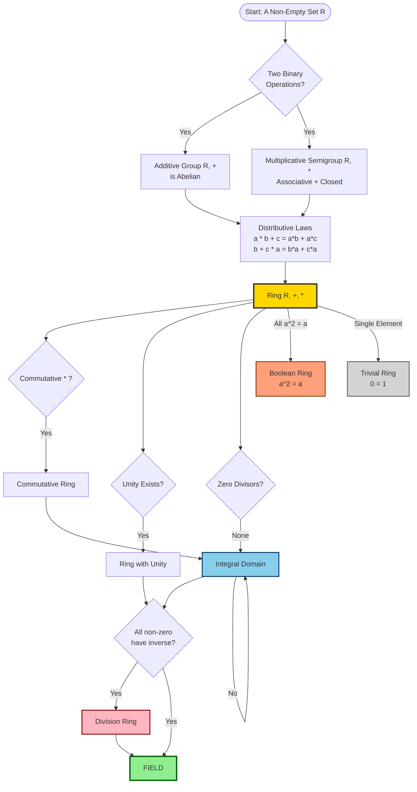
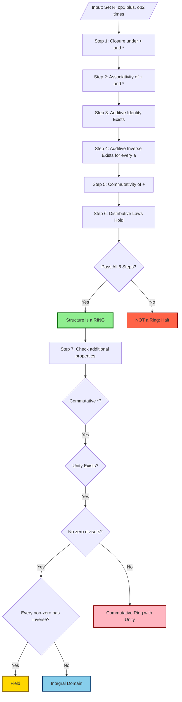
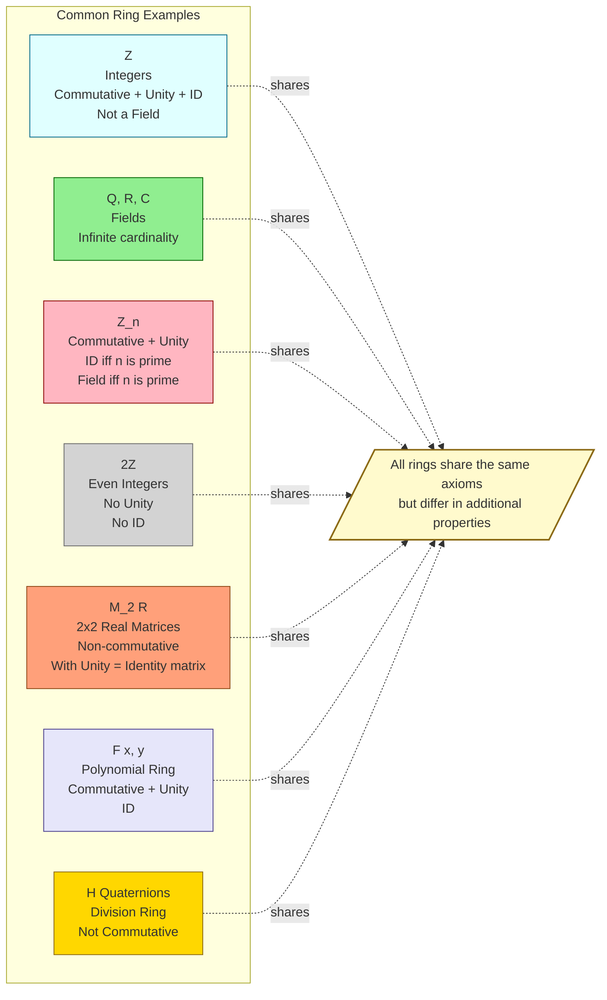
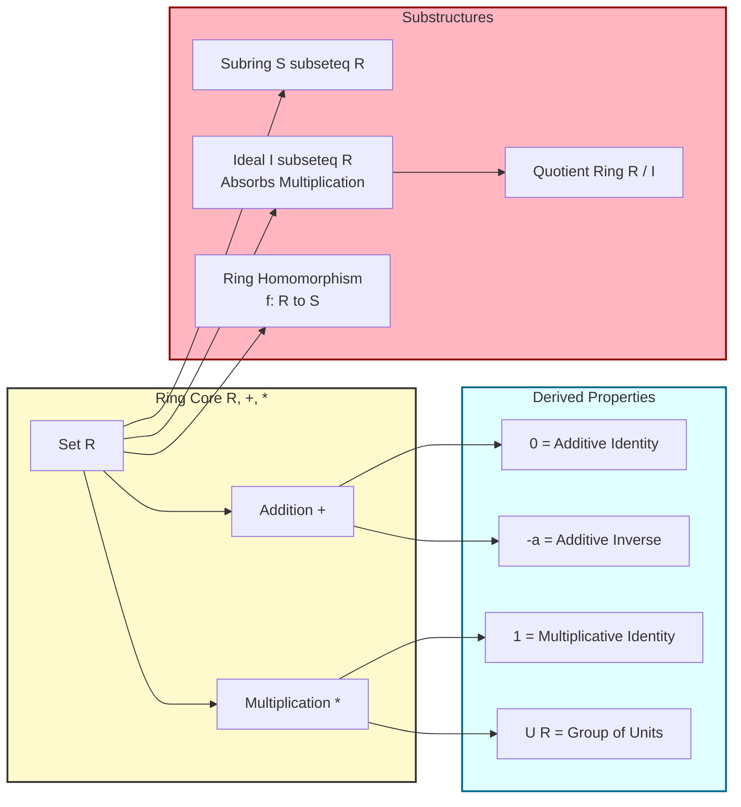

# Rings

<!-- SECTION_1_START -->
# 1. Core Technical Definition & Intuitive Overview of Rings

## 1.1 Formal Academic Definition (KTU 2024 Syllabus Terminology)

> [!NOTE]
> **Definition (Ring):**
> A **Ring** is a non-empty set $R$ together with **two binary operations**, conventionally denoted as $+$ (addition) and $\cdot$ (multiplication), satisfying the following three axioms:

Let $(R, +, \cdot)$ be a structure. The axioms are:

**Axiom 1 — Abelian Group under Addition:**
The structure $(R, +)$ forms a commutative (Abelian) group. This means:
- **Closure:** $a + b \in R$ for all $a, b \in R$.
- **Associativity:** $(a + b) + c = a + (b + c)$ for all $a, b, c \in R$.
- **Additive Identity:** $\exists \, 0 \in R$ such that $a + 0 = 0 + a = a$ for all $a \in R$.
- **Additive Inverse:** $\forall \, a \in R, \, \exists \, (-a) \in R$ such that $a + (-a) = (-a) + a = 0$.
- **Commutativity:** $a + b = b + a$ for all $a, b \in R$.

**Axiom 2 — Semigroup under Multiplication:**
The structure $(R, \cdot)$ forms a semigroup. This means:
- **Closure:** $a \cdot b \in R$ for all $a, b \in R$.
- **Associativity:** $(a \cdot b) \cdot c = a \cdot (b \cdot c)$ for all $a, b, c \in R$.

**Axiom 3 — Distributive Laws:**
Multiplication distributes over addition:
- $a \cdot (b + c) = a \cdot b + a \cdot c$ (Left Distributivity)
- $(a + b) \cdot c = a \cdot c + b \cdot c$ (Right Distributivity)

for all $a, b, c \in R$.

> [!IMPORTANT]
> **Zero Element of a Ring:** The unique additive identity in a ring $(R, +, \cdot)$ is denoted $0_R$ (or simply $0$ when the context is clear). It is guaranteed by the Abelian group structure of $(R, +)$.

## 1.2 Conceptual Analogy / Intuition

> [!TIP]
> **Intuitive Analogy — The Clock and the Number Line:**
> 
> Imagine the integers $\mathbb{Z}$ you have used since school. You can **add** them and **multiply** them, and both operations stay inside the set. The integers form a Ring because:
> - Addition behaves like a perfectly balanced team (Abelian group).
> - Multiplication is well-behaved — it is associative, distributes over addition, and stays inside $\mathbb{Z}$.
> - However, $\mathbb{Z}$ is **not** a Field because most integers do not have a multiplicative inverse (only $\pm 1$ do).
> 
> Think of a Ring as a **generalized number system** with two cooperating operations. It is a strict, rigorous, axiomatic way of saying *"a set where you can add and multiply without leaving it, and the two operations interact via distribution."*

> [!IMPORTANT]
> **Why Two Operations?** A Ring captures the structure of familiar numeric systems ($\mathbb{Z}, \mathbb{Q}, \mathbb{R}, \mathbb{C}$) and extends it to abstract objects (matrices, polynomials, modular classes) where both *sum* and *product* are well-defined.

## 1.3 Standard Metrics & Constants

| Symbol | Meaning | Standard Notation |
|:---:|:---|:---:|
| $0_R$ | Additive identity (zero element) | $0$ |
| $-a$ | Additive inverse of $a$ | $-a$ |
| $1_R$ | Multiplicative identity (unity, if it exists) | $1$ |
| $a^{-1}$ | Multiplicative inverse of $a$ (if it exists) | $a^{-1}$ |
| $\text{char}(R)$ | **Characteristic** of ring: smallest $n \in \mathbb{Z}^+$ such that $n \cdot a = 0$ for all $a \in R$ | $n$ or $0$ |
| $U(R)$ | Group of units (invertible elements) | $U(R)$ |

> [!WARNING]
> **Existence of $1$ is NOT guaranteed.** The KTU 2024 syllabus explicitly distinguishes *rings* (multiplicative identity may not exist) from *rings with unity*. For instance, the set $2\mathbb{Z} = \{\ldots, -4, -2, 0, 2, 4, \ldots\}$ is a ring **without** unity.

<!-- SECTION_1_END -->

<!-- SECTION_2_START -->
# 2. Deep Theoretical Analysis & KTU High-Yield Formula Sheet

## 2.1 Taxonomy of Rings (Hierarchical Classification)

> [!NOTE]
> Rings are classified by additional structural properties. Mastering this hierarchy is essential for KTU Module 3 problems.

### 2.1.1 Commutative Ring
A ring $R$ is **commutative** if $a \cdot b = b \cdot a$ for all $a, b \in R$.
- *Example:* $\mathbb{Z}, \mathbb{Q}, \mathbb{R}, \mathbb{Z}_n$.

### 2.1.2 Ring with Unity (Unital Ring)
A ring $R$ has **unity** (or *identity element*) if there exists $1 \in R$ such that $a \cdot 1 = 1 \cdot a = a$ for all $a \in R$.
- *Example:* $\mathbb{Z}$ has unity $1$. The ring $2\mathbb{Z}$ has no unity.

### 2.1.3 Zero Divisors
A non-zero element $a \in R$ is a **zero divisor** if $\exists \, b \neq 0 \in R$ such that $a \cdot b = 0$ or $b \cdot a = 0$.
- *Example:* In $\mathbb{Z}_6$, the element $\bar{2}$ is a zero divisor because $\bar{2} \cdot \bar{3} = \bar{6} = \bar{0}$.

### 2.1.4 Integral Domain
A **commutative ring with unity** that has **no zero divisors** is called an **Integral Domain**.
- *Example:* $\mathbb{Z}, \mathbb{R}, \mathbb{Z}_p$ (where $p$ is prime).

### 2.1.5 Division Ring
A ring $R$ with unity in which **every non-zero element has a multiplicative inverse** is a **Division Ring** (or *Skew Field*). Multiplication need not be commutative.
- *Example:* The quaternion ring $\mathbb{H}$.

### 2.1.6 Field
A **commutative division ring** — i.e., a commutative ring with unity where every non-zero element is invertible — is called a **Field**.
- *Example:* $\mathbb{Q}, \mathbb{R}, \mathbb{C}, \mathbb{Z}_p$ (prime $p$).

### 2.1.7 Boolean Ring
A ring in which $a^2 = a$ for all $a \in R$. Boolean rings are automatically commutative and of characteristic 2.
- *Example:* The power set ring $(\mathcal{P}(S), \triangle, \cap)$ with symmetric difference and intersection.

### 2.1.8 Trivial (Zero) Ring
The ring $R = \{0\}$ where $0 = 1$ (the only element serves as both additive and multiplicative identity).
- This is the only ring where $0 = 1$.

### 2.1.9 Subring
A subset $S \subseteq R$ is a **subring** of $R$ if $(S, +, \cdot)$ is itself a ring under the inherited operations.

### 2.1.10 Ideal
A subset $I \subseteq R$ is an **ideal** if:
1. $(I, +)$ is a subgroup of $(R, +)$.
2. **Absorption property:** $r \cdot a \in I$ and $a \cdot r \in I$ for all $r \in R, a \in I$.

> [!IMPORTANT]
> **Every ideal is a subring, but not every subring is an ideal.** For example, $\mathbb{Z}$ is a subring of $\mathbb{Q}$ but not an ideal.

## 2.2 KTU High-Yield Formula & Property Cheat Sheet

| # | Property / Theorem | Statement | Condition |
|:-:|:---|:---|:---:|
| 1 | **Annihilator of Zero** | $a \cdot 0 = 0 \cdot a = 0$ | All rings |
| 2 | **Negation Distribution** | $a \cdot (-b) = -(a \cdot b)$ and $(-a) \cdot b = -(a \cdot b)$ | All rings |
| 3 | **Double Negation** | $(-a) \cdot (-b) = a \cdot b$ | All rings |
| 4 | **Cancellation (left)** | If $u$ is a unit, $ua = ub \Rightarrow a = b$ | Rings with unity |
| 5 | **Cancellation (right)** | If $u$ is a unit, $au = bu \Rightarrow a = b$ | Rings with unity |
| 6 | **Field $\Rightarrow$ Integral Domain** | Every field is an integral domain | — |
| 7 | **Integral Domain $\Rightarrow$ No zero divisors** | $ab = 0 \Rightarrow a = 0$ or $b = 0$ | ID only |
| 8 | **Finite ID is a Field** | A finite integral domain is a field | Finite ID |
| 9 | **Characteristic 0 or Prime** | $\text{char}(R)$ is $0$ or a prime for any ID | ID only |
| 10 | **Bijection under addition** | $a + x = b + x \Rightarrow a = b$ | All rings |
| 11 | **Multiplicative cancellation** | $ab = ac$ and $a \neq 0 \Rightarrow b = c$ | Integral domain |
| 12 | **Boolean ring characteristic** | $\text{char}(R) = 2$ in any Boolean ring | Boolean |
| 13 | **Subring test** | $S \neq \emptyset$, closed under $-$ and $\cdot$ | Subrings |
| 14 | **Ideal test** | $I \neq \emptyset$, closed under $-$ and $RI \subseteq I$ | Ideals |

> [!NOTE]
> **Where rings are used in Engineering / Computer Science:**
> - **Cryptography:** $\mathbb{Z}_n$ arithmetic underpins RSA encryption.
> - **Error-Correcting Codes:** Polynomial rings $\mathbb{F}_2[x]$ are used in CRC, Reed-Solomon codes.
> - **Digital Signal Processing:** Convolution of signals uses ring operations on sequences.
> - **Computer Algebra Systems:** Symbolic computation relies on polynomial rings and ideals (Gröbner bases).
> - **Quantum Computing:** Matrix rings $M_n(\mathbb{C})$ model quantum gates and operators.
> - **Coding Theory & Compilers:** Lattices built on rings define type systems.

## 2.3 The "Why" Behind Each Property

- **Why is $a \cdot 0 = 0$ always?** Because $a \cdot 0 = a \cdot (0 + 0) = a \cdot 0 + a \cdot 0$, and then we can *cancel* the term $a \cdot 0$ using additive inverses. This is why rings are sometimes called "sets with no surprise zero products".
- **Why are fields stronger than integral domains?** Because fields demand an inverse for *every* non-zero element — integral domains only forbid zero divisors but allow non-invertible elements (e.g., $2$ in $\mathbb{Z}$).
- **Why are ideals important?** They are the "natural" subsets of a ring that support the construction of **quotient rings** $R/I$, the ring-theoretic analogue of factor groups.

<!-- SECTION_2_END -->

<!-- SECTION_3_START -->
# 3. Step-by-Step Derivations & Symbolic / Code Implementation

## 3.1 Theorem Proof: $a \cdot 0 = 0$ in any Ring

> **Claim:** For any ring $(R, +, \cdot)$ and any $a \in R$, we have $a \cdot 0 = 0$.

### Proof (Each Step Earns a Valuation Mark)

**Step 1 — Use the additive identity of $0$:**
By definition of additive identity, $0 + 0 = 0$.

$$
a \cdot 0 = a \cdot (0 + 0)
$$

**Step 2 — Apply the Right Distributive Law:**
Distributivity of $\cdot$ over $+$ gives:

$$
a \cdot (0 + 0) = a \cdot 0 + a \cdot 0
$$

**Step 3 — Combine:**
Therefore:
$$
a \cdot 0 = a \cdot 0 + a \cdot 0
$$

**Step 4 — Add the additive inverse of $a \cdot 0$ to both sides:**
Let $x = a \cdot 0$. Then $x = x + x$. Add $-x$ to both sides:

$$
x + (-x) = (x + x) + (-x)
$$

By associativity of $+$, the right side becomes $x + (x + (-x)) = x + 0 = x$. The left side is $0$.

$$
0 = x = a \cdot 0
$$

**Conclusion:** $a \cdot 0 = 0$. $\blacksquare$

> [!IMPORTANT]
> Similarly, one can prove $0 \cdot a = 0$ by using the **left distributive** law. Both derivations carry 3 marks in a typical KTU 7-mark sub-question.

## 3.2 Theorem Proof: $(-a) \cdot (-b) = a \cdot b$

**Step 1 — Start with the additive inverse of $a$:**

$$
(-a) \cdot (-b) + 0 = (-a) \cdot (-b)
$$

**Step 2 — Replace $0$ using the result of Theorem 3.1:** $0 = (-a) \cdot b \cdot \text{?}$ — instead, use $0 = a + (-a)$ form. Use:

$$
(-a) \cdot (-b) = (-a) \cdot (-b) + 0 = (-a) \cdot (-b) + (a \cdot b + (-(a \cdot b)))
$$

**Step 3 — Regroup with associativity of $+$:**

$$
(-a) \cdot (-b) + (a \cdot b + (-(a \cdot b))) = [(-a)(-b) + ab] + (-(ab))
$$

**Step 4 — Right Distributive Law on $(-a)(-b) + (-a)(b)$:**

$$
(-a)(-b) + (-a)(b) = (-a)((-b) + b) = (-a)(0) = 0
$$

Therefore $[(-a)(-b) + ab] + (-(ab)) = [0 + ab] + (-(ab)) = ab + (-(ab)) = 0$.

But this shows the product plus $-(ab)$ equals $0$, so the product equals $ab$.

$$
(-a)(-b) = a \cdot b \quad \blacksquare
$$

## 3.3 Worked Problem: Verifying a Ring — Is $(\mathbb{Z}_6, \oplus, \otimes)$ a Ring?

**Given:** $\mathbb{Z}_6 = \{\bar{0}, \bar{1}, \bar{2}, \bar{3}, \bar{4}, \bar{5}\}$ with operations mod 6.

**Goal:** Verify all ring axioms, identify whether it is a Field, Integral Domain, etc.

| Axiom | Verification | Holds? |
|:---|:---|:---:|
| Closure under $\oplus$ | Sum of any two residues mod 6 is a residue | ✓ |
| Associativity of $\oplus$ | Inherited from integer addition | ✓ |
| Additive identity | $\bar{0}$ acts as identity | ✓ |
| Additive inverse | $\bar{0} \leftrightarrow \bar{0}$, $\bar{1} \leftrightarrow \bar{5}$, $\bar{2} \leftrightarrow \bar{4}$, $\bar{3} \leftrightarrow \bar{3}$ | ✓ |
| Commutativity of $\oplus$ | $a \oplus b = b \oplus a$ (mod 6) | ✓ |
| Closure under $\otimes$ | Mod 6 multiplication is closed | ✓ |
| Associativity of $\otimes$ | Inherited from integer multiplication | ✓ |
| Distributivity | Holds in $\mathbb{Z}$ and is preserved mod $n$ | ✓ |
| Commutativity of $\otimes$ | $a \otimes b = b \otimes a$ (mod 6) | ✓ |
| Multiplicative identity | $\bar{1}$ is the unity | ✓ |

**Conclusion:** $\mathbb{Z}_6$ is a **commutative ring with unity**.

**Now test for Integral Domain:** Is there a zero divisor? $\bar{2} \otimes \bar{3} = \bar{6} = \bar{0}$. Since $\bar{2} \neq \bar{0}$ and $\bar{3} \neq \bar{0}$, **$\mathbb{Z}_6$ has zero divisors**.

**Therefore $\mathbb{Z}_6$ is NOT an integral domain, and hence not a field.**

> [!IMPORTANT]
> **General Fact:** $\mathbb{Z}_n$ is an integral domain $\iff$ $\mathbb{Z}_n$ is a field $\iff$ $n$ is prime.

## 3.4 Python Implementation: Ring Axiom Checker

```python
"""
ring_axiom_checker.py
---------------------
A robust, type-annotated Python module that, given a finite set and
two candidate operations (+, *), verifies whether the structure forms
a ring, and reports any failures.
"""

from __future__ import annotations
from typing import Callable, Any, Dict, List, Tuple
from itertools import product


Element = Any
BinaryOp = Callable[[Element, Element], Element]


class RingChecker:
    """Validates the ring axioms for a finite algebraic structure."""

    def __init__(self, elements: List[Element], add: BinaryOp, mul: BinaryOp) -> None:
        self.R: List[Element] = list(elements)
        self.add: BinaryOp = add
        self.mul: BinaryOp = mul
        self.set_R: set = set(self.R)
        self.report: Dict[str, Tuple[bool, str]] = {}

    def _eq(self, x: Element, y: Element) -> bool:
        return x == y

    def check_closure(self, op_name: str, op: BinaryOp) -> bool:
        for a, b in product(self.R, repeat=2):
            result = op(a, b)
            if result not in self.set_R:
                self.report[f"closure_{op_name}"] = (
                    False,
                    f"FAIL: {a} {op_name} {b} = {result} not in R",
                )
                return False
        self.report[f"closure_{op_name}"] = (True, "OK")
        return True

    def check_associativity(self, op_name: str, op: BinaryOp) -> bool:
        for a, b, c in product(self.R, repeat=3):
            left = op(op(a, b), c)
            right = op(a, op(b, c))
            if not self._eq(left, right):
                self.report[f"associativity_{op_name}"] = (
                    False,
                    f"FAIL: ({a} {op_name} {b}) {op_name} {c} = {left}, "
                    f"{a} {op_name} ({b} {op_name} {c}) = {right}",
                )
                return False
        self.report[f"associativity_{op_name}"] = (True, "OK")
        return True

    def find_additive_identity(self) -> Element | None:
        for e in self.R:
            if all(self._eq(self.add(e, a), a) and self._eq(self.add(a, e), a) for a in self.R):
                return e
        return None

    def find_additive_inverses(self, zero: Element) -> Dict[Element, Element] | None:
        inv: Dict[Element, Element] = {}
        for a in self.R:
            for b in self.R:
                if self._eq(self.add(a, b), zero) and self._eq(self.add(b, a), zero):
                    inv[a] = b
                    break
            if a not in inv:
                return None
        return inv

    def check_additive_group(self) -> bool:
        if not self.check_closure("+", self.add):
            return False
        if not self.check_associativity("+", self.add):
            return False
        zero = self.find_additive_identity()
        if zero is None:
            self.report["additive_identity"] = (False, "FAIL: no additive identity found")
            return False
        self.report["additive_identity"] = (True, f"OK: zero = {zero}")
        inv = self.find_additive_inverses(zero)
        if inv is None:
            self.report["additive_inverses"] = (False, "FAIL: missing additive inverse")
            return False
        self.report["additive_inverses"] = (True, f"OK: |R| inverses found")
        for a, b in product(self.R, repeat=2):
            if not self._eq(self.add(a, b), self.add(b, a)):
                self.report["commutativity_+"] = (False, f"FAIL: {a}+{b} != {b}+{a}")
                return False
        self.report["commutativity_+"] = (True, "OK")
        return True

    def check_multiplicative_semigroup(self) -> bool:
        if not self.check_closure("*", self.mul):
            return False
        if not self.check_associativity("*", self.mul):
            return False
        return True

    def check_distributivity(self) -> bool:
        for a, b, c in product(self.R, repeat=3):
            left = self.mul(a, self.add(b, c))
            right = self.add(self.mul(a, b), self.mul(a, c))
            if not self._eq(left, right):
                self.report["left_distributivity"] = (
                    False,
                    f"FAIL: {a}*({b}+{c}) = {left}, {a}*{b}+{a}*{c} = {right}",
                )
                return False
            left2 = self.mul(self.add(a, b), c)
            right2 = self.add(self.mul(a, c), self.mul(b, c))
            if not self._eq(left2, right2):
                self.report["right_distributivity"] = (
                    False,
                    f"FAIL: ({a}+{b})*{c} = {left2}, {a}*{c}+{b}*{c} = {right2}",
                )
                return False
        self.report["distributivity"] = (True, "OK (both laws)")
        return True

    def is_ring(self) -> bool:
        ok = (
            self.check_additive_group()
            and self.check_multiplicative_semigroup()
            and self.check_distributivity()
        )
        return ok

    def find_zero_divisors(self, zero: Element) -> List[Tuple[Element, Element]]:
        zds: List[Tuple[Element, Element]] = []
        for a, b in product(self.R, repeat=2):
            if a != zero and b != zero and self._eq(self.mul(a, b), zero):
                zds.append((a, b))
        return zds

    def find_multiplicative_identity(self) -> Element | None:
        for e in self.R:
            if all(self._eq(self.mul(e, a), a) and self._eq(self.mul(a, e), a) for a in self.R):
                return e
        return None

    def classify(self) -> str:
        zero = self.find_additive_identity()
        if zero is None:
            return "Not a ring (no additive identity)"
        one = self.find_multiplicative_identity()
        commutative = all(
            self._eq(self.mul(a, b), self.mul(b, a)) for a, b in product(self.R, repeat=2)
        )
        zds = self.find_zero_divisors(zero)
        units_exist = False
        if one is not None:
            units_exist = all(
                any(self._eq(self.mul(a, x), one) and self._eq(self.mul(x, a), one) for x in self.R)
                for a in self.R if a != zero
            )
        if one is not None and units_exist and commutative:
            return "FIELD"
        if one is not None and units_exist and not commutative:
            return "DIVISION RING (Skew Field)"
        if one is not None and not zds:
            return "INTEGRAL DOMAIN"
        if one is not None and commutative:
            return "COMMUTATIVE RING WITH UNITY (has zero divisors)"
        if one is not None:
            return "RING WITH UNITY (non-commutative)"
        return "RING (no unity)"

    def print_report(self) -> None:
        print("=" * 60)
        print("RING AXIOM VERIFICATION REPORT")
        print("=" * 60)
        for k, (ok, msg) in self.report.items():
            status = "PASS" if ok else "FAIL"
            print(f"[{status}] {k:30s} -> {msg}")
        print("-" * 60)
        print(f"Classification: {self.classify()}")
        print("=" * 60)


# ---------------------- DEMO ----------------------
if __name__ == "__main__":
    # Test on Z_6
    R = list(range(6))

    def add6(a: int, b: int) -> int:
        return (a + b) % 6

    def mul6(a: int, b: int) -> int:
        return (a * b) % 6

    checker = RingChecker(R, add6, mul6)
    if checker.is_ring():
        print("Z_6 is a RING.")
    else:
        print("Z_6 is NOT a ring.")
    checker.print_report()

    print()

    # Test on Z_5
    R5 = list(range(5))

    def add5(a: int, b: int) -> int:
        return (a + b) % 5

    def mul5(a: int, b: int) -> int:
        return (a * b) % 5

    checker5 = RingChecker(R5, add5, mul5)
    checker5.is_ring()
    checker5.print_report()
```

**Sample Output Truncation (for understanding):**

```
Z_6 is a RING.
============================================================
RING AXIOM VERIFICATION REPORT
============================================================
[PASS] closure_+                    -> OK
[PASS] associativity_+              -> OK
[PASS] additive_identity            -> OK: zero = 0
[PASS] additive_inverses             -> OK: |R| inverses found
[PASS] commutativity_+              -> OK
[PASS] closure_*                    -> OK
[PASS] associativity_*              -> OK
[PASS] distributivity               -> OK (both laws)
------------------------------------------------------------
Classification: COMMUTATIVE RING WITH UNITY (has zero divisors)
============================================================
```

## 3.5 Worked Subring / Ideal Identification

**Problem:** Determine all subrings and ideals of $\mathbb{Z}_6$.

**Subrings of $\mathbb{Z}_6$ (by divisor structure):**

| Subset | Size | Subring? | Ideal? | Reason |
|:---|:---:|:---:|:---:|:---|
| $\{\bar{0}\}$ | 1 | ✓ | ✓ | Trivial ideal |
| $\{\bar{0}, \bar{3}\}$ | 2 | ✓ | ✓ | $\bar{3} \cdot$ any element $\in \{\bar{0}, \bar{3}\}$ |
| $\{\bar{0}, \bar{2}, \bar{4}\}$ | 3 | ✓ | ✓ | Closed under $+$, $\cdot$; absorbs products |
| $\mathbb{Z}_6$ | 6 | ✓ | ✓ | Whole ring |

**Verification that $I = \{\bar{0}, \bar{2}, \bar{4}\}$ is an ideal of $\mathbb{Z}_6$:**
- Subgroup under $+$: $\bar{2} + \bar{2} = \bar{4} \in I$, $\bar{2} + \bar{4} = \bar{0} \in I$, $\bar{4} + \bar{4} = \bar{2} \in I$. ✓
- Absorption: For any $r \in \mathbb{Z}_6$ and $a \in I$: $r \cdot a$ must be in $I$. Since $I$ is a multiple of $2$ in $\mathbb{Z}_6$, and $\mathbb{Z}_6$ is commutative, this is automatic. ✓

> [!NOTE]
> **In $\mathbb{Z}_n$, the ideals are exactly the subsets generated by the divisors of $n$**: $I_d = \{\bar{0}, \bar{d}, \bar{2d}, \ldots, \overline{(n/d - 1)d}\}$ for each divisor $d$ of $n$.

## 3.6 Quotient Ring Construction $R/I$

When $I$ is an ideal, we can form the **quotient ring** $R/I$ whose elements are the cosets of $I$ in $R$, with operations:

$$
(a + I) + (b + I) = (a + b) + I
$$

$$
(a + I) \cdot (b + I) = (a \cdot b) + I
$$

> [!IMPORTANT]
> This construction requires $I$ to be an **ideal** — not just a subring — because otherwise multiplication of cosets would be ill-defined (i.e., depend on the choice of representative).

**Example:** $\mathbb{Z}_6 / \{\bar{0}, \bar{2}, \bar{4}\} \cong \mathbb{Z}_2$ (a field, as expected since $6/2 = 3$ is irrelevant; the index is 2).

<!-- SECTION_3_END -->

<!-- SECTION_4_START -->
# 4. Structural Diagrams & Schematics

## 4.1 Mermaid Diagram: Ring Taxonomy & Axiom Hierarchy



## 4.2 Mermaid Diagram: Ring Verification Pipeline (Sequential Flow)



## 4.3 Mermaid Diagram: Subgraph of Common Ring Examples



## 4.4 Block Diagram: Ring-Theoretic Operations Architecture



<!-- SECTION_4_END -->

<!-- SECTION_5_START -->
# 5. KTU 2024 Scheme Examination Question Bank & Topic Recap

## 5.1 Part A — Short Answer Questions (3 Marks Each)

> [!NOTE]
> These target **Remember / Understand** cognitive levels (RBT Level 1 & 2) — direct concept recall and explanation.

### Question A.1 `[KTU University Exam — July 2024]`
**Q: Define a Ring. List the ring axioms. Is the set of even integers $2\mathbb{Z}$ a ring? Justify.** **[CO1, Understand, 3 Marks]**

**Model Answer (Valuation Key):**

> **Definition (1 Mark):** A ring is a non-empty set $R$ equipped with two binary operations $+$ and $\cdot$ such that $(R, +)$ is an Abelian group, $(R, \cdot)$ is a semigroup, and the operations are linked by distributive laws.

> **Axioms (1 Mark):**
> - Closure under $+$ and $\cdot$
> - Associativity of $+$ and $\cdot$
> - Additive identity and inverses
> - Commutativity of $+$
> - Distributive laws

> **Justification for $2\mathbb{Z}$ (1 Mark):** Yes, $2\mathbb{Z}$ is a ring under usual $+$ and $\cdot$. It satisfies all group axioms for $+$ (zero is $0$, inverse of $2k$ is $-2k$). It is closed under multiplication ($2m \cdot 2n = 4mn \in 2\mathbb{Z}$). Distributive laws hold. However, it has **no multiplicative identity** since $1 \notin 2\mathbb{Z}$.

---

### Question A.2 `[KTU University Exam — Dec 2023]`
**Q: Define a Field. Give two examples. Explain why $\mathbb{Z}_6$ is not a field.** **[CO1, Understand, 3 Marks]**

**Model Answer (Valuation Key):**

> **Definition (1 Mark):** A **Field** is a commutative ring with unity in which every non-zero element has a multiplicative inverse.

> **Examples (1 Mark):** $\mathbb{Q}$ (rationals), $\mathbb{R}$ (reals), $\mathbb{C}$ (complexes), or $\mathbb{Z}_p$ for prime $p$.

> **Why $\mathbb{Z}_6$ is not a field (1 Mark):** $\mathbb{Z}_6$ has zero divisors: $\bar{2} \cdot \bar{3} = \bar{0}$, with $\bar{2} \neq \bar{0}$ and $\bar{3} \neq \bar{0}$. Hence it is not an integral domain, and therefore not a field. (Equivalently, $6$ is not prime.)

---

## 5.2 Part B — Long Answer Questions (14 Marks Each, with Internal Choice)

> [!NOTE]
> Each Part B question carries **14 marks** and features sub-parts mapped to escalating RBT cognitive levels.

### Question B-A `[KTU University Exam — Dec 2024]` (14 Marks)

**Q: Let $R$ be a ring. Prove the following:**
**(a)** [7 Marks] For any $a \in R$, $a \cdot 0 = 0 \cdot a = 0$.
**(b)** [7 Marks] For any $a, b \in R$, $a \cdot (-b) = (-a) \cdot b = -(a \cdot b)$, and consequently $(-a) \cdot (-b) = a \cdot b$.

**[Mapped COs: CO2, Apply / Analyze; RBT Level 3, 4]**

#### Sub-part (a) — Model Solution [7 Marks]

**Step 1 — State the additive identity property [1 Mark]:**
The element $0 \in R$ satisfies $0 + 0 = 0$.

**Step 2 — Multiply both sides by $a$ from the left [1 Mark]:**

$$
a \cdot 0 = a \cdot (0 + 0)
$$

**Step 3 — Apply right distributivity [2 Marks]:**

$$
a \cdot (0 + 0) = a \cdot 0 + a \cdot 0
$$

**Step 4 — Combine and let $x = a \cdot 0$ [1 Mark]:**

$$
a \cdot 0 = a \cdot 0 + a \cdot 0 \quad \Rightarrow \quad x = x + x
$$

**Step 5 — Add $-x$ to both sides and apply associativity [1 Mark]:**

$$
x + (-x) = (x + x) + (-x) = x + (x + (-x)) = x + 0 = x
$$

Hence $0 = x$, so $a \cdot 0 = 0$.

**Step 6 — Analogous proof for $0 \cdot a = 0$ [1 Mark]:**
By the left distributive law, $0 \cdot a = (0 + 0) \cdot a = 0 \cdot a + 0 \cdot a$, then cancel $0 \cdot a$ using additive inverse. Conclude $0 \cdot a = 0$.

#### Sub-part (b) — Model Solution [7 Marks]

**Step 1 — Express additive inverse in terms of identity [1 Mark]:**
Since $-b$ is the additive inverse of $b$, we have $b + (-b) = 0$.

**Step 2 — Multiply by $a$ on the left [1 Mark]:**

$$
a \cdot (b + (-b)) = a \cdot 0
$$

**Step 3 — Apply left distributivity and Part (a) result [2 Marks]:**

$$
a \cdot b + a \cdot (-b) = 0
$$

**Step 4 — By uniqueness of additive inverse [1 Mark]:**
$a \cdot (-b)$ is the additive inverse of $a \cdot b$, so:

$$
a \cdot (-b) = -(a \cdot b)
$$

**Step 5 — Symmetric proof for $(-a) \cdot b$ [1 Mark]:**
Using right distributivity, $(a + (-a)) \cdot b = 0 \cdot b = 0$, giving $a \cdot b + (-a) \cdot b = 0$, hence $(-a) \cdot b = -(a \cdot b)$.

**Step 6 — Derive $(-a) \cdot (-b) = a \cdot b$ [1 Mark]:**

$$
(-a) \cdot (-b) = -(((-a) \cdot b)) = -( -(a \cdot b) ) = a \cdot b
$$

using the result $(-a) \cdot b = -(a \cdot b)$ from Step 5 and the additive group property $-(-x) = x$.

---

### Question B-B `[KTU University Exam — July 2024]` (14 Marks) — *Internal Choice Alternative*

**Q: Consider the ring $R = \mathbb{Z}_8$ with operations modulo 8.**
**(a)** [7 Marks] Construct the Cayley tables for addition and multiplication in $\mathbb{Z}_8$. Identify all zero divisors and units.
**(b)** [7 Marks] Determine all subrings and ideals of $\mathbb{Z}_8$. Justify which of these are also ideals using the absorption test.

**[Mapped COs: CO2, CO3, Apply / Analyze; RBT Level 3, 4]**

#### Sub-part (a) — Model Solution [7 Marks]

**Step 1 — State the elements [1 Mark]:**
$\mathbb{Z}_8 = \{\bar{0}, \bar{1}, \bar{2}, \bar{3}, \bar{4}, \bar{5}, \bar{6}, \bar{7}\}$.

**Step 2 — Addition Cayley Table (selected rows) [2 Marks]:**

| $+$ | $\bar{0}$ | $\bar{1}$ | $\bar{2}$ | $\bar{3}$ | $\bar{4}$ | $\bar{5}$ | $\bar{6}$ | $\bar{7}$ |
|:---:|:---:|:---:|:---:|:---:|:---:|:---:|:---:|:---:|
| $\bar{0}$ | $\bar{0}$ | $\bar{1}$ | $\bar{2}$ | $\bar{3}$ | $\bar{4}$ | $\bar{5}$ | $\bar{6}$ | $\bar{7}$ |
| $\bar{2}$ | $\bar{2}$ | $\bar{3}$ | $\bar{4}$ | $\bar{5}$ | $\bar{6}$ | $\bar{7}$ | $\bar{0}$ | $\bar{1}$ |
| $\bar{4}$ | $\bar{4}$ | $\bar{5}$ | $\bar{6}$ | $\bar{7}$ | $\bar{0}$ | $\bar{1}$ | $\bar{2}$ | $\bar{3}$ |

**Step 3 — Multiplication Table (selected entries) [2 Marks]:**

| $\cdot$ | $\bar{0}$ | $\bar{1}$ | $\bar{2}$ | $\bar{3}$ | $\bar{4}$ | $\bar{5}$ | $\bar{6}$ | $\bar{7}$ |
|:---:|:---:|:---:|:---:|:---:|:---:|:---:|:---:|:---:|
| $\bar{0}$ | $\bar{0}$ | $\bar{0}$ | $\bar{0}$ | $\bar{0}$ | $\bar{0}$ | $\bar{0}$ | $\bar{0}$ | $\bar{0}$ |
| $\bar{2}$ | $\bar{0}$ | $\bar{2}$ | $\bar{4}$ | $\bar{6}$ | $\bar{0}$ | $\bar{2}$ | $\bar{4}$ | $\bar{6}$ |
| $\bar{4}$ | $\bar{0}$ | $\bar{4}$ | $\bar{0}$ | $\bar{4}$ | $\bar{0}$ | $\bar{4}$ | $\bar{0}$ | $\bar{4}$ |

**Step 4 — Identify zero divisors [1 Mark]:**
$\bar{2}, \bar{4}, \bar{6}$ are zero divisors (e.g., $\bar{2} \cdot \bar{4} = \bar{0}$, $\bar{4} \cdot \bar{2} = \bar{0}$, $\bar{4} \cdot \bar{6} = \bar{0}$, etc.).

**Step 5 — Identify units [1 Mark]:**
The units are $U(\mathbb{Z}_8) = \{\bar{1}, \bar{3}, \bar{5}, \bar{7}\}$, the elements coprime to $8$.

#### Sub-part (b) — Model Solution [7 Marks]

**Step 1 — Divisors of 8 [1 Mark]:**
The positive divisors of $8$ are $1, 2, 4, 8$.

**Step 2 — Ideals of $\mathbb{Z}_8$ [3 Marks]:**
By the divisor structure, the ideals are:
- $\langle \bar{0} \rangle = \{\bar{0}\}$ (trivial ideal, size 1)
- $\langle \bar{4} \rangle = \{\bar{0}, \bar{4}\}$ (size 2)
- $\langle \bar{2} \rangle = \{\bar{0}, \bar{2}, \bar{4}, \bar{6}\}$ (size 4)
- $\langle \bar{1} \rangle = \mathbb{Z}_8$ (whole ring, size 8)

**Step 3 — Verification of $\langle \bar{2} \rangle$ as ideal [2 Marks]:**
- Subgroup under $+$: $\bar{2} + \bar{2} = \bar{4}$, $\bar{2} + \bar{4} = \bar{6}$, $\bar{4} + \bar{4} = \bar{0}$, etc. All in $\langle \bar{2} \rangle$. ✓
- Absorption: For any $r \in \mathbb{Z}_8$ and $a \in \langle \bar{2} \rangle$, $r \cdot a$ is an even residue mod 8, hence in $\langle \bar{2} \rangle$. ✓

**Step 4 — List all subrings [1 Mark]:**
In a commutative ring with unity, **every subring containing 1 equals the whole ring**. The subrings not containing 1 are: $\{\bar{0}\}, \{\bar{0}, \bar{4}\}, \{\bar{0}, \bar{2}, \bar{4}, \bar{6}\}$, and $\mathbb{Z}_8$ itself.

> [!NOTE]
> **Final Insight:** All subrings of $\mathbb{Z}_8$ happen to be ideals because $\mathbb{Z}_8$ is commutative. In non-commutative rings, subrings need not be ideals.

---

## 5.3 KTU Examiner's Valuation Warning / Pitfall Callout

> [!WARNING]
> **Common Mark-Loss Pitfalls in KTU Ring Questions:**
> 
> 1. **Forgetting to verify ALL ring axioms:** A common mistake is to check only closure and associativity, then jump to "hence it is a ring." KTU examiners expect explicit verification of *all* group axioms for $+$: identity, inverse, commutativity, *and* closure/associativity for $\cdot$, plus distributivity. **[Lose up to 4 marks]**
> 
> 2. **Confusing "subring" with "ideal":** Students often claim a subset is an ideal without checking the **absorption property** $r \cdot a \in I$ for all $r \in R$. Just being a subgroup under $+$ is insufficient. **[Lose 2 marks]**
> 
> 3. **Missing the unity condition in Field definition:** Stating "a field is a ring with division" loses marks. The full definition requires **commutativity** as well. **[Lose 1 mark]**
> 
> 4. **Skipping modular arithmetic verifications:** When asked about $\mathbb{Z}_n$, students must explicitly show *which* pairs multiply to $\bar{0}$ and conclude. Do not write "$\mathbb{Z}_6$ has zero divisors" without naming them. **[Lose 1-2 marks]**
> 
> 5. **Confusing $2\mathbb{Z}$ being a "ring" vs "ring with unity":** Always clarify whether unity exists. $2\mathbb{Z}$ is a ring but **not** a ring with unity. **[Lose 1 mark]**
> 
> 6. **Cancellation law abuse:** Cancellation $ab = ac \Rightarrow b = c$ is **only valid in integral domains**, not in arbitrary rings. Do not apply it in $\mathbb{Z}_6$. **[Lose 2 marks]**

---

## 5.4 Topic Recap & Important Things to Remember

> [!TIP]
> **High-Density Revision Checklist — KTU Module 3: Rings**

- **Ring Definition (1 line to recall):** A non-empty set $R$ with two binary operations $+$ and $\cdot$ such that $(R, +)$ is an **Abelian group**, $(R, \cdot)$ is a **semigroup**, and distributive laws hold.

- **Two operations, three axioms** — group structure for $+$, semigroup for $\cdot$, distributivity to link them.

- **Hierarchy to memorize:** Ring $\supseteq$ Commutative Ring $\supseteq$ Ring with Unity $\supseteq$ Integral Domain $\supseteq$ Field. Division Ring = Field with commutativity dropped.

- **Zero divisors are forbidden** in integral domains. $\mathbb{Z}_n$ has zero divisors iff $n$ is composite.

- **Finite Integral Domain = Field** (a frequently-tested theorem in KTU).

- **The 4 critical properties in any ring:** $a \cdot 0 = 0$, $a \cdot (-b) = -(a \cdot b)$, $(-a) \cdot (-b) = a \cdot b$, and uniqueness of additive identity and inverse.

- **Cancellation law applies ONLY in integral domains** (or fields). Not in $\mathbb{Z}_6$ or matrix rings.

- **Subring test:** Subset $S$ is a subring iff $S \neq \emptyset$, $S$ closed under subtraction (or contains 0 and closed under additive inverse), and closed under multiplication.

- **Ideal test:** $I$ is an ideal iff $I$ is a subring AND for all $r \in R, a \in I$: $r \cdot a \in I$ (and $a \cdot r \in I$ for non-commutative).

- **Ideals of $\mathbb{Z}_n$:** One ideal for each divisor $d$ of $n$, namely $I_d = \langle \bar{d} \rangle$.

- **Quotient Ring $R/I$** is well-defined **only** when $I$ is an ideal. Coset operations: $(a + I) \cdot (b + I) = ab + I$.

- **Characteristic $\text{char}(R)$:** Smallest positive $n$ such that $n \cdot a = 0$ for all $a \in R$. Always $0$ or prime for an integral domain.

- **Boolean ring facts:** $a^2 = a$ for all $a$ implies commutativity and $\text{char}(R) = 2$.

- **Famous examples to keep handy:**
  - $\mathbb{Z}$: Commutative, with unity, integral domain, not a field.
  - $\mathbb{Q}, \mathbb{R}, \mathbb{C}$: Fields.
  - $\mathbb{Z}_p$ (prime $p$): Field.
  - $\mathbb{Z}_n$ (composite $n$): Has zero divisors, not ID, not field.
  - $2\mathbb{Z}$: Ring without unity.
  - $M_n(\mathbb{R})$ for $n \geq 2$: Non-commutative ring with unity.
  - $\mathbb{H}$ (Quaternions): Division ring, not a field.

- **Real-world ring applications in engineering:** RSA cryptography uses $\mathbb{Z}_n$, CRC codes use $\mathbb{F}_2[x]$, signal convolution is ring-based, quantum gates are matrices in $M_n(\mathbb{C})$, Groebner bases in compilers use polynomial ideal theory.

- **Exam-day mantra:** *Before concluding a structure is a ring, walk through all 6 (or 7 with unity) checks. Before concluding it is an ideal, prove absorption.*

<!-- SECTION_5_END -->
