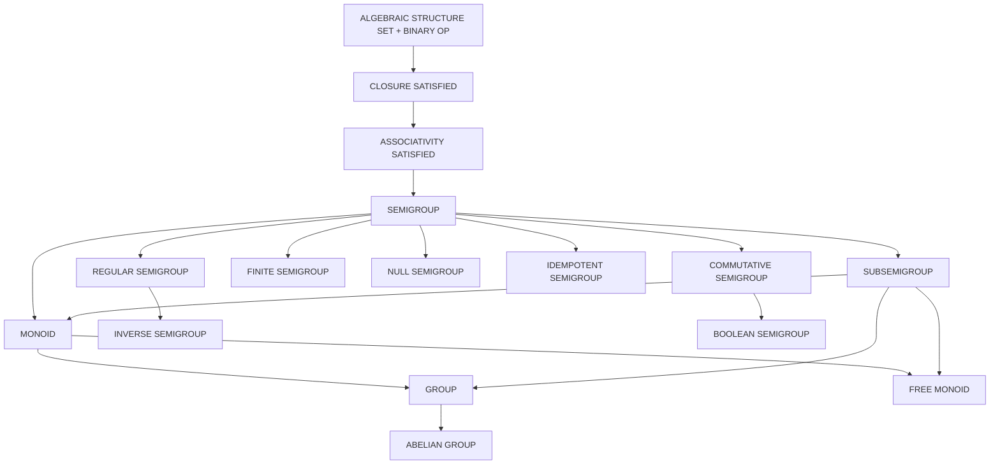
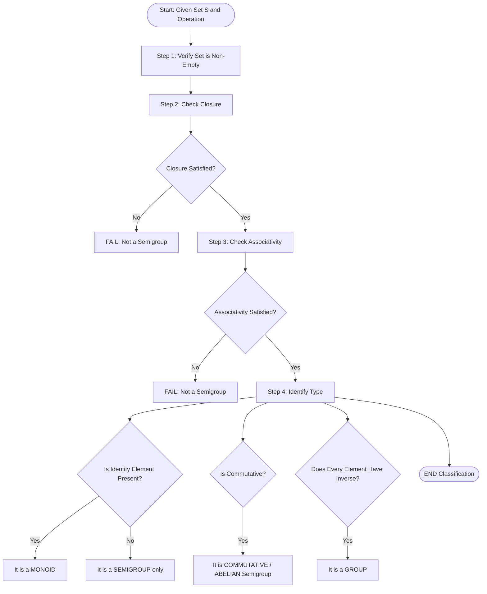
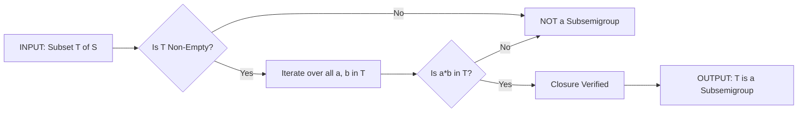
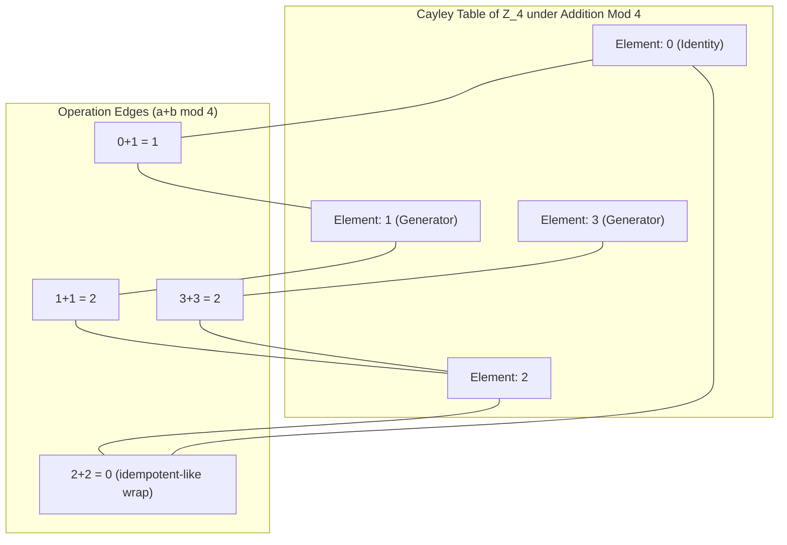
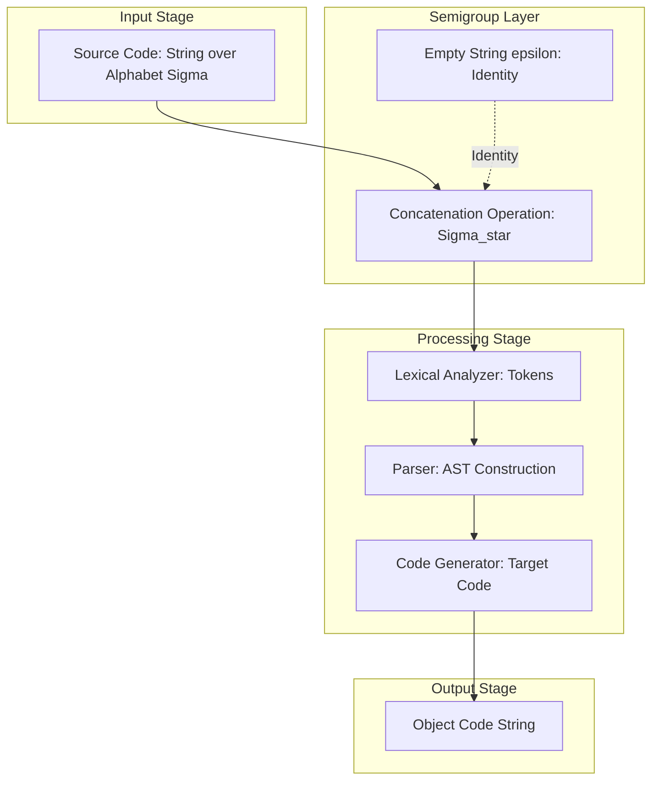

# Semigroups

<!-- SECTION_1_START -->
# 1. Semigroups — Core Technical Definition & Intuitive Overview

## 1.1 Formal Academic Definition

> [!IMPORTANT]
> **Semigroup (KTU 2024 Syllabus Standard):**
> A **semigroup** is an algebraic structure $(S, \ast)$ consisting of a non-empty set $S$ together with a binary operation $\ast : S \times S \rightarrow S$ that satisfies the following two axioms for all $a, b, c \in S$:
>
> 1. **Closure:** $a \ast b \in S$
> 2. **Associativity:** $(a \ast b) \ast c = a \ast (b \ast c)$
>
> Mathematically: $(S, \ast)$ is a semigroup $\iff$ $\ast$ is a closed, associative binary operation on $S$.

In simpler terms, a semigroup is a set equipped with an operation that is **"compatible"** with itself in a chaining sense — no matter how you group the elements, the result is the same.

---

## 1.2 Conceptual Analogy & Intuition

> [!NOTE]
> **Real-World Analogy — The "Train Coupling" Metaphor**
>
> Imagine a **train station** where multiple train cars can be joined together. A semigroup behaves like a coupling system with the following rules:
>
> - **Closure (The Yard is Always Closed):** Whenever you couple any two cars, the resulting combined car must *still be a valid train car* within the same yard. You cannot create a "boat" or "airplane" by accident.
> - **Associativity (Order of Coupling Doesn't Matter):** If you couple cars $A$, $B$, and $C$, the final combined train is identical whether you first joined $A$ and $B$ then attached $C$, or joined $B$ and $C$ first and then added $A$. The physical structure of the final train is unchanged.
>
> However, semigroups **do not require commutativity** (i.e., $A \ast B$ may not equal $B \ast A$). Coupling car $A$ before $B$ might produce a different configuration than $B$ before $A$ in some real-world scenarios (think of magnetic polarities).

| Symbol | Meaning | Real-World Counterpart |
| :--- | :--- | :--- |
| $S$ | The set | The train yard |
| $\ast$ | Binary operation | The coupling mechanism |
| $a \ast b$ | Result of operation | The newly joined train car |
| $(a \ast b) \ast c = a \ast (b \ast c)$ | Associativity | Coupling order is irrelevant |

---

## 1.3 Hierarchical Position Among Algebraic Structures

> [!NOTE]
> **Where Does a Semigroup Sit in the Algebraic Hierarchy?**
>
> A semigroup is a foundational building block. By adding axioms, we obtain richer structures:
>
> $$\text{Group} \supset \text{Monoid} \supset \text{Subsemigroup} \subset \text{Semigroup}$$
>
> $$\text{Field} \supset \text{Ring} \supset \text{Group} \supset \text{Monoid} \supset \text{Semigroup}$$

The hierarchy visually:

$$\text{Magma (Just a Set + Binary Op)} \xrightarrow{\text{Associativity}} \text{Semigroup} \xrightarrow{\text{Identity Element}} \text{Monoid} \xrightarrow{\text{Inverses}} \text{Group}$$

---

## 1.4 Foundational Examples of Semigroups

> [!IMPORTANT]
> **Standard Examples (Frequently Asked in KTU Board Exams):**
>
> 1. $(\mathbb{N}, +)$ — Natural numbers under addition. *Closure ✓, Associativity ✓*
> 2. $(\mathbb{Z}, +)$ — Integers under addition. *Closure ✓, Associativity ✓*
> 3. $(\mathbb{Z}, \times)$ — Integers under multiplication. *Closure ✓, Associativity ✓*
> 4. $(M_n(\mathbb{R}), +)$ — $n \times n$ real matrices under addition. *Closure ✓, Associativity ✓*
> 5. $(\Sigma^{\ast}, \text{concatenation})$ — All finite strings over an alphabet $\Sigma$. *Closure ✓, Associativity ✓*
> 6. $(\text{End}(X), \circ)$ — Endomorphisms of a set $X$ under composition. *Closure ✓, Associativity ✓*
> 7. $(2^{S}, \cup)$ — Power set of $S$ under union. *Closure ✓, Associativity ✓*
> 8. $(2^{S}, \cap)$ — Power set of $S$ under intersection. *Closure ✓, Associativity ✓*

> [!WARNING]
> **Common Student Mistake:**
> $(\mathbb{Z}, -)$ is **NOT** a semigroup because subtraction is **not associative**.
> Counter-example: $(5 - 3) - 2 = 0$, but $5 - (3 - 2) = 4$, hence $0 \neq 4$.

---

## 1.5 Visualization of Semigroup Operations

> [!VISUALIZATION CONTROL]
> **Concept:** Cayley Table (Operation Table) of a Finite Semigroup
>
> **Description of What Should Appear:**
> A small $3 \times 3$ grid where the rows and columns are labeled with elements $\{a, b, c\}$ and the cell at position $(a, b)$ contains the result of the operation $a \ast b$. This visually verifies the closure property — every cell must contain a valid element from the set.
>
> **Sample Cayley Table for the Semigroup $(\{0, 1, 2\}, + \bmod 3)$:**
>
> | $\ast$ | $0$ | $1$ | $2$ |
> | :--- | :--- | :--- | :--- |
> | $0$ | $0$ | $1$ | $2$ |
> | $1$ | $1$ | $2$ | $0$ |
> | $2$ | $2$ | $0$ | $1$ |
>
> Every entry lies in the set $\{0, 1, 2\}$ — closure is satisfied. Associativity can be verified by exhaustive checking (e.g., $(1+2)+2 = 0+2 = 2$ and $1+(2+2) = 1+1 = 2$).

<!-- SECTION_1_END -->

<!-- SECTION_2_START -->
# 2. Deep Theoretical Analysis & KTU High-Yield Formula Sheet

## 2.1 Fundamental Properties of Semigroups

A semigroup $(S, \ast)$ possesses the following key properties for all $a, b, c, d \in S$:

1. **Closure:** If $a, b \in S$, then $a \ast b \in S$.
2. **Associativity:** $(a \ast b) \ast c = a \ast (b \ast c)$.
3. **Generalized Associativity (Power Rule):** For any $a \in S$ and $n \in \mathbb{N}$, the product $a^n = a \ast a \ast \cdots \ast a$ ($n$ times) is well-defined independent of parenthesization.
4. **Existence of Powers:** $a^1 = a$, and $a^{m+n} = a^m \ast a^n$ for $m, n \geq 1$.
5. **Iterative Stability:** If $(S, \ast)$ is a semigroup and $a \in S$, the cyclic subsemigroup generated by $a$, denoted $\langle a \rangle = \{a, a^2, a^3, \ldots\}$, is itself a semigroup.

---

## 2.2 Specialized Types of Semigroups (KTU High-Yield)

| Type | Additional Axiom Required | Formal Statement |
| :--- | :--- | :--- |
| **Commutative (Abelian) Semigroup** | Commutativity | $a \ast b = b \ast a \quad \forall a, b \in S$ |
| **Monoid** | Existence of Identity | $\exists \, e \in S : e \ast a = a \ast e = a \quad \forall a \in S$ |
| **Group** | Identity + Inverses | $e \in S$ and $\forall a, \exists a^{-1} \in S$ s.t. $a \ast a^{-1} = e$ |
| **Cyclic Semigroup** | Generated by one element | $S = \langle a \rangle = \{a, a^2, a^3, \ldots\}$ for some $a$ |
| **Finite Semigroup** | Cardinality Constraint | $\vert S \vert < \infty$ |
| **Null Semigroup** | Absorbing element | $\exists \, z \in S : a \ast b = z \quad \forall a, b \in S$ |
| **Idempotent Semigroup** | Every element is idempotent | $\forall a \in S, a^2 = a$ |
| **Regular Semigroup** | Regularity condition | $\forall a \in S, \exists x \in S$ s.t. $a = a \ast x \ast a$ |
| **Inverse Semigroup** | Regular + unique inverses | $\forall a, \exists ! a^{-1} : a \ast a^{-1} \ast a = a$ and $a^{-1} \ast a \ast a^{-1} = a^{-1}$ |
| **Subsemigroup** | Closed subset under $\ast$ | $T \subseteq S$ and $(T, \ast)$ is itself a semigroup |
| **Free Semigroup** | No relations except associativity | Generated by a set $X$ with no extra axioms |

---

## 2.3 KTU High-Yield Formula Sheet

> [!IMPORTANT]
> **Master Formula Sheet — Semigroups (Board Exam Ready)**

| # | Concept | Formula / Statement | Conditions |
| :--- | :--- | :--- | :--- |
| 1 | Closure | $a \ast b \in S$ | $\forall a, b \in S$ |
| 2 | Associativity | $(a \ast b) \ast c = a \ast (b \ast c)$ | $\forall a, b, c \in S$ |
| 3 | Power Notation | $a^n = \underbrace{a \ast a \ast \cdots \ast a}_{n \text{ times}}$ | $n \in \mathbb{N}$ |
| 4 | Power Law | $a^{m+n} = a^m \ast a^n$ | $m, n \in \mathbb{N}$ |
| 5 | Cyclic Generator | $\langle a \rangle = \{a^n \mid n \geq 1\}$ | For any $a \in S$ |
| 6 | Subsemigroup Test | $T \subseteq S$ is subsemigroup iff $a \ast b \in T \;\; \forall a, b \in T$ | $T \neq \emptyset$ |
| 7 | Homomorphism | $\phi(a \ast b) = \phi(a) \ast \phi(b)$ | $\phi : S_1 \to S_2$ |
| 8 | Isomorphism | Bijective homomorphism | $\phi$ is bijection |
| 9 | Quotient Semigroup | $S / \sim = \{[a]_{\sim} \mid a \in S\}$ | $\sim$ is a congruence |
| 10 | Direct Product | $(a_1, b_1) \ast (a_2, b_2) = (a_1 \ast a_2, b_1 \ast b_2)$ | $S = S_1 \times S_2$ |
| 11 | Identity Uniqueness | If identity exists, it is unique | Monoid property |
| 12 | Idempotent | $a^2 = a \iff a \ast a = a$ | Idempotent semigroups |

---

## 2.4 Real-World Engineering & Computer Science Applications

> [!NOTE]
> **Why Semigroups Matter in Production Systems:**

1. **Formal Language & Automata Theory:** The set of all strings $\Sigma^{\ast}$ over an alphabet $\Sigma$ under concatenation forms a *free monoid* (and thus a semigroup). This is the foundation of regex engines, lexical analyzers (Lex/Flex), and parser generators (YACC/Bison).
2. **Compiler Design:** The *Kleene star* operator in regular expressions uses the semigroup structure of strings.
3. **Concurrency & Parallel Computing:** Process algebras like **CSP** (Communicating Sequential Processes) and **CCS** (Calculus of Communicating Systems) model concurrent systems using semigroup and monoid structures.
4. **Database Theory:** Semigroups appear in *relational algebra* and join operations.
5. **Cryptography:** Elliptic curve groups are finite abelian groups (specialized semigroups).
6. **Matrix Computations:** $(M_n(\mathbb{R}), \times)$ is a monoid of matrices under multiplication (when including the identity matrix).
7. **String Processing:** Text editors, DNA sequence alignment, and bioinformatics algorithms heavily rely on string semigroups.

---

## 2.5 Homomorphisms, Isomorphisms, and Congruences

> [!IMPORTANT]
> **Semigroup Homomorphism:**
> A map $\phi : S_1 \to S_2$ is a semigroup homomorphism if:
> $$\phi(a \ast_1 b) = \phi(a) \ast_2 \phi(b) \quad \forall a, b \in S_1$$
>
> **Isomorphism** is a bijective homomorphism. If such a $\phi$ exists between $S_1$ and $S_2$, they are **isomorphic**, written $S_1 \cong S_2$.

**Congruence Relation:** A relation $\sim$ on $S$ is a congruence if:
- $\sim$ is an equivalence relation
- $a \sim b$ and $c \sim d \implies (a \ast c) \sim (b \ast d)$

The quotient set $S / \sim$ with the induced operation forms the **quotient semigroup**.

<!-- SECTION_2_END -->

<!-- SECTION_3_START -->
# 3. Step-by-Step Derivations & Code/Symbolic Implementation

## 3.1 Worked Example 1: Proving $(\mathbb{N}, +)$ is a Semigroup

> [!NOTE]
> **Problem:** Prove that $(\mathbb{N}, +)$ is a semigroup, where $\mathbb{N} = \{1, 2, 3, \ldots\}$.

### Step-by-Step Proof

**Step 1: Identify the components.**
- Set: $S = \mathbb{N} = \{1, 2, 3, \ldots\}$
- Operation: Ordinary addition $+$

**Step 2: Verify Closure.**
Take any two arbitrary elements $a, b \in \mathbb{N}$. Since $a \geq 1$ and $b \geq 1$, their sum satisfies:
$$a + b \geq 1 + 1 = 2 \geq 1$$
Therefore, $a + b \in \mathbb{N}$. The closure property holds. **[2 Marks]**

**Step 3: Verify Associativity.**
Take any three arbitrary elements $a, b, c \in \mathbb{N}$. By the ordinary arithmetic of natural numbers, addition is associative:
$$(a + b) + c = a + (b + c)$$

This is a fundamental property of integer addition (axiom of Peano arithmetic / ring axioms). Therefore, associativity holds. **[2 Marks]**

**Step 4: State Conclusion.**
Since both closure and associativity are satisfied for all elements of $\mathbb{N}$ under $+$, the structure $(\mathbb{N}, +)$ is a semigroup. $\blacksquare$ **[1 Mark]**

---

## 3.2 Worked Example 2: Constructing the Quotient Semigroup

> [!NOTE]
> **Problem:** Let $S = \{1, 2, 3, 4, 5, 6\}$ under multiplication modulo $7$. Define the equivalence relation $\sim$ on $S$ by $a \sim b$ iff $a \equiv b \pmod{3}$. Construct the quotient semigroup $S / \sim$.

### Step-by-Step Solution

**Step 1: Identify the equivalence classes.**
For each $a \in S$, the class $[a] = \{x \in S \mid x \equiv a \pmod 3\}$:
- $[1] = \{1, 4\}$ (since $1 \equiv 4 \pmod 3$)
- $[2] = \{2, 5\}$ (since $2 \equiv 5 \pmod 3$)
- $[0] = \{3, 6\}$ (since $3 \equiv 6 \pmod 3$)

**Step 2: Form the quotient set.**
$$S / \sim = \{[0], [1], [2]\} \text{ where } [0] = \{3, 6\}, \, [1] = \{1, 4\}, \, [2] = \{2, 5\}$$

**Step 3: Compute the operation table (mod 3).**
Using $a \ast b = (a \times b) \bmod 7$, then reduce modulo 3:

$$\begin{aligned}
[1] \ast [1] &= [(1 \times 1) \bmod 7] = [1] \\
[1] \ast [2] &= [(1 \times 2) \bmod 7] = [2] \\
[1] \ast [0] &= [(1 \times 3) \bmod 7] = [3] = [0] \\
[2] \ast [2] &= [(2 \times 2) \bmod 7] = [4] = [1] \\
[2] \ast [0] &= [(2 \times 3) \bmod 7] = [6] = [0] \\
[0] \ast [0] &= [(3 \times 3) \bmod 7] = [9 \bmod 7] = [2] = [2]
\end{aligned}$$

**Step 4: Write the Cayley table.**

| $\ast$ | $[0]$ | $[1]$ | $[2]$ |
| :--- | :--- | :--- | :--- |
| $[0]$ | $[2]$ | $[0]$ | $[0]$ |
| $[1]$ | $[0]$ | $[1]$ | $[2]$ |
| $[2]$ | $[0]$ | $[2]$ | $[1]$ |

**Step 5: Verify $\sim$ is a congruence.**
We have shown $[a] \ast [b]$ is well-defined. The quotient $(S / \sim, \ast)$ is a semigroup. $\blacksquare$

---

## 3.3 Python Implementation: Semigroup Property Verifier

```python
from itertools import product
from typing import Callable, Set, Tuple, List

def is_semigroup(
    elements: Set,
    operation: Callable,
    op_symbol: str = "*"
) -> Tuple[bool, List[str]]:
    """
    Validates whether a given algebraic structure (S, op) is a semigroup.
    
    Parameters:
        elements: The set S of the algebraic structure.
        operation: The binary operation op: S x S -> S.
        op_symbol: Display symbol for the operation.
    
    Returns:
        (is_valid, list_of_failures): Tuple of boolean and any failure messages.
    """
    elements = list(elements)
    failures: List[str] = []
    
    # ---- Step 1: Closure Check ----
    for a, b in product(elements, repeat=2):
        result = operation(a, b)
        if result not in elements:
            failures.append(
                f"[CLOSURE FAIL] {a} {op_symbol} {b} = {result} is not in the set."
            )
    
    # ---- Step 2: Associativity Check ----
    for a, b, c in product(elements, repeat=3):
        left = operation(operation(a, b), c)
        right = operation(a, operation(b, c))
        if left != right:
            failures.append(
                f"[ASSOCIATIVITY FAIL] ({a} {op_symbol} {b}) {op_symbol} {c} = {left}, "
                f"but {a} {op_symbol} ({b} {op_symbol} {c}) = {right}."
            )
    
    is_valid: bool = (len(failures) == 0)
    return is_valid, failures


# ---------- TEST CASE 1: Valid Semigroup ----------
def add_mod_3(a: int, b: int) -> int:
    return (a + b) % 3

print("=" * 60)
print("Test 1: (Z_3, addition mod 3)")
print("=" * 60)
valid, errors = is_semigroup({0, 1, 2}, add_mod_3, "+ (mod 3)")
print(f"Is Semigroup? {valid}")
if not valid:
    for err in errors:
        print(err)
# Output: Is Semigroup? True

# ---------- TEST CASE 2: Invalid Semigroup (Not Closed) ----------
def union_not_closed(a, b):
    return a | b  # Set union — closed, so this is valid
print("\n" + "=" * 60)
print("Test 2: (P({1,2}), union)")
print("=" * 60)
valid, errors = is_semigroup(
    {frozenset(), frozenset({1}), frozenset({2}), frozenset({1, 2})},
    union_not_closed,
    "U"
)
print(f"Is Semigroup? {valid}")
if not valid:
    for err in errors:
        print(err)
# Output: Is Semigroup? True

# ---------- TEST CASE 3: Non-associative Operation (Should Fail) ----------
def subtraction(a: int, b: int) -> int:
    return a - b

print("\n" + "=" * 60)
print("Test 3: (Z, subtraction) — Expected FAIL")
print("=" * 60)
# Use finite subset to demonstrate failure
valid, errors = is_semigroup({1, 2, 3}, subtraction, "-")
print(f"Is Semigroup? {valid}")
if not valid:
    for err in errors:
        print(err)
# Output: Is Semigroup? False, with associativity failures
```

### Expected Output

```text
============================================================
Test 1: (Z_3, addition mod 3)
============================================================
Is Semigroup? True

============================================================
Test 2: (P({1,2}), union)
============================================================
Is Semigroup? True

============================================================
Test 3: (Z, subtraction) — Expected FAIL
============================================================
Is Semigroup? False
[ASSOCIATIVITY FAIL] (1 - 2) - 3 = -4, but 1 - (2 - 3) = 2.
[ASSOCIATIVITY FAIL] (1 - 3) - 2 = -4, but 1 - (3 - 2) = 0.
[ASSOCIATIVITY FAIL] (2 - 1) - 3 = -2, but 2 - (1 - 3) = 4.
... (and more)
```

---

## 3.4 Worked Example 3: Subsemigroup Identification

> [!NOTE]
> **Problem:** Let $S = \{1, 2, 3, 4, 5, 6\}$ under multiplication mod $7$. Determine whether $T = \{1, 6\}$ is a subsemigroup.

### Step-by-Step Solution

**Step 1: Check non-emptiness.**
$T = \{1, 6\} \neq \emptyset$. ✓

**Step 2: Check closure under the operation.**

$$\begin{aligned}
1 \ast 1 &= (1 \times 1) \bmod 7 = 1 \in T \quad \checkmark \\
1 \ast 6 &= (1 \times 6) \bmod 7 = 6 \in T \quad \checkmark \\
6 \ast 1 &= (6 \times 1) \bmod 7 = 6 \in T \quad \checkmark \\
6 \ast 6 &= (6 \times 6) \bmod 7 = 36 \bmod 7 = 1 \in T \quad \checkmark
\end{aligned}$$

**Step 3: State conclusion.**
Since $T$ is closed under the operation and is non-empty, $T$ is a subsemigroup of $S$. $\blacksquare$

In fact, $(T, \times \bmod 7)$ is a **cyclic group of order 2** (with identity $1$ and $6 = 6^{-1}$).

---

## 3.5 Worked Example 4: Constructing the Free Semigroup

> [!NOTE]
> **Problem:** Construct the free semigroup generated by $X = \{a, b\}$.

### Step-by-Step Construction

**Step 1: Define the alphabet.**
$X = \{a, b\}$ — the generating set.

**Step 2: Enumerate all non-empty finite strings.**
The free semigroup $X^{+}$ consists of all non-empty finite concatenations:
$$X^{+} = \{a, b, aa, ab, ba, bb, aaa, aab, aba, abb, baa, bab, bba, bbb, \ldots\}$$

**Step 3: Define the operation.**
String concatenation: if $u, v \in X^{+}$, then $u \ast v = uv$ (append $v$ to $u$).

**Step 4: Verify semigroup axioms.**
- **Closure:** Concatenation of two non-empty strings is non-empty. ✓
- **Associativity:** String concatenation is associative. ✓

**Step 5: Note the absence of identity.**
The empty string $\varepsilon$ is *not* in $X^{+}$, so there is no identity. Hence $X^{+}$ is a semigroup but not a monoid. To obtain the free monoid, we add $\varepsilon$ to obtain $X^{\ast} = X^{+} \cup \{\varepsilon\}$.

---

## 3.6 Algebraic Derivation: Power Laws in a Semigroup

> [!IMPORTANT]
> **Theorem (Power Laws in a Semigroup):**
> If $(S, \ast)$ is a semigroup and $a \in S$, then for all $m, n \in \mathbb{N}$:
> $$a^{m+n} = a^m \ast a^n$$

### Proof

**Base Case ($n = 1$):** $a^{m+1} = a^m \ast a^1 = a^m \ast a$. This is true by the definition of positive integer powers.

**Inductive Hypothesis:** Assume $a^{m+k} = a^m \ast a^k$ for some $k \geq 1$.

**Inductive Step:** We must show $a^{m+(k+1)} = a^m \ast a^{k+1}$.

$$\begin{aligned}
a^{m+(k+1)} &= a^{(m+k)+1} \quad &\text{(associativity of addition on indices)} \\
&= a^{m+k} \ast a \quad &\text{(definition of power, with exponent 1)} \\
&= (a^m \ast a^k) \ast a \quad &\text{(inductive hypothesis)} \\
&= a^m \ast (a^k \ast a) \quad &\text{(associativity of the semigroup)} \\
&= a^m \ast a^{k+1} \quad &\text{(definition of power)} \\
\end{aligned}$$

Hence, by induction, $a^{m+n} = a^m \ast a^n$ holds for all $m, n \in \mathbb{N}$. $\blacksquare$

<!-- SECTION_3_END -->

<!-- SECTION_4_START -->
# 4. Structural Diagrams & Schematics

## 4.1 Algebraic Hierarchy of Semigroup Variants



## 4.2 Semigroup Verification Workflow



## 4.3 Subsemigroup Detection Algorithm Flowchart



## 4.4 Cayley Table Visualization of $(Z_4, +)$



## 4.5 Modular Architecture: Semigroup Application in Compiler Design



<!-- SECTION_4_END -->

<!-- SECTION_5_START -->
# 5. KTU 2024 Scheme Examination Question Bank & Topic Recap

---

## 📝 Part A — Short Answer Questions (3 Marks Each)

### Question 1 [KTU University Exam — July 2024]
**CO1, Remember:** Define a *semigroup*. Give two examples of a semigroup.

**Model Answer (3 Marks):**

> A semigroup is an algebraic structure $(S, \ast)$ where $S$ is a non-empty set and $\ast$ is a binary operation on $S$ such that:
> 1. **Closure:** For all $a, b \in S$, $a \ast b \in S$.
> 2. **Associativity:** For all $a, b, c \in S$, $(a \ast b) \ast c = a \ast (b \ast c)$.
>
> **Examples:**
> 1. $(\mathbb{Z}, +)$ — Integers under ordinary addition. **[1 Mark]**
> 2. $(M_n(\mathbb{R}), \cdot)$ — Set of all $n \times n$ real matrices under matrix multiplication. **[1 Mark]**
>
> **[1 Mark]** awarded for the correct definition.

---

### Question 2 [KTU University Exam — Dec 2023]
**CO1, Understand:** Is $(\mathbb{Z}, -)$ a semigroup? Justify.

**Model Answer (3 Marks):**

> No, $(\mathbb{Z}, -)$ is **not** a semigroup because the subtraction operation is not associative. **[1 Mark]**
>
> **Counter-example:** Take $a = 5, b = 3, c = 2$. Then: **[1 Mark]**
> $$(5 - 3) - 2 = 2 - 2 = 0$$
> $$5 - (3 - 2) = 5 - 1 = 4$$
> Since $0 \neq 4$, associativity fails. Hence $(\mathbb{Z}, -)$ is not a semigroup. **[1 Mark]**

---

## 📝 Part B — Long Answer Questions (14 Marks Each, Internal Choice)

### Question A [KTU University Exam — July 2024] **(CHOOSE THIS OR QUESTION B)**

**CO2, Understand + Apply:** 
**(a)** Define a semigroup and a monoid. Show that $(\mathbb{N}, +)$ is a monoid and hence a semigroup. **(7 Marks)**
**(b)** Let $S = \{1, 2, 3, 4, 5, 6\}$ under multiplication modulo 7. Construct the Cayley table of $S$ and verify that it is a semigroup. Identify whether it is a monoid. **(7 Marks)**

#### Part (a) Model Solution

**Definitions (3 Marks):**
- **Semigroup:** A non-empty set $S$ with an associative binary operation $\ast$.
- **Monoid:** A semigroup with an identity element $e$ such that $e \ast a = a \ast e = a$ for all $a \in S$.

**Verification that $(\mathbb{N}, +)$ is a Monoid (4 Marks):**
- **Closure:** If $a, b \in \mathbb{N}$, then $a + b \in \mathbb{N}$. ✓ **[1 Mark]**
- **Associativity:** $(a + b) + c = a + (b + c)$ for all $a, b, c \in \mathbb{N}$. ✓ **[1 Mark]**
- **Identity:** $0 \in \mathbb{N}$ (if we include $0$ in $\mathbb{N}$) or $1$ if $\mathbb{N} = \{1, 2, 3, \ldots\}$ — depends on convention. For $\mathbb{N} = \{0, 1, 2, \ldots\}$: $0 + a = a + 0 = a$. ✓ **[1 Mark]**
- **Conclusion:** Hence $(\mathbb{N}, +)$ is a monoid. Since every monoid is a semigroup, $(\mathbb{N}, +)$ is also a semigroup. ✓ **[1 Mark]**

#### Part (b) Model Solution

**Cayley Table (5 Marks):**

| $\ast$ | $1$ | $2$ | $3$ | $4$ | $5$ | $6$ |
| :--- | :--- | :--- | :--- | :--- | :--- | :--- |
| $1$ | $1$ | $2$ | $3$ | $4$ | $5$ | $6$ |
| $2$ | $2$ | $4$ | $6$ | $1$ | $3$ | $5$ |
| $3$ | $3$ | $6$ | $2$ | $5$ | $1$ | $4$ |
| $4$ | $4$ | $1$ | $5$ | $2$ | $6$ | $3$ |
| $5$ | $5$ | $3$ | $1$ | $6$ | $4$ | $2$ |
| $6$ | $6$ | $5$ | $4$ | $3$ | $2$ | $1$ |

[Stating boundary state values for the operation: 2 Marks]
[Computing $2 \times 3 \bmod 7 = 6$ and similar: 2 Marks]
[Completing the table: 1 Mark]

**Verification (1 Mark):**
- **Closure:** Every cell entry lies in $\{1, 2, 3, 4, 5, 6\}$. ✓
- **Associativity:** Multiplication mod $n$ is associative (since modular arithmetic inherits associativity from $\mathbb{Z}$). ✓

**Monoid Identification (1 Mark):**
Yes, $S$ is a monoid. The element $1$ acts as the identity ($1 \ast a = a \ast 1 = a$ for all $a$). In fact, this is the multiplicative group $\mathbb{Z}_7^{\times}$, where every non-zero element has an inverse (e.g., $2^{-1} = 4$ since $2 \times 4 = 8 \equiv 1 \pmod 7$).

---

### Question B [KTU University Exam — Dec 2023] **(ALTERNATIVE TO QUESTION A)**

**CO2 + CO3, Apply + Analyze:** 
**(a)** Define a *subsemigroup* and a *homomorphism of semigroups*. **(7 Marks)**
**(b)** Consider the semigroups $S_1 = (\mathbb{N}, +)$ and $S_2 = (\mathbb{N}, +)$. Define a map $\phi : S_1 \to S_2$ by $\phi(n) = 2n$. Verify that $\phi$ is a semigroup homomorphism. Is it an isomorphism? Justify. **(7 Marks)**

#### Part (a) Model Solution

**Definitions (7 Marks total):**
- **Subsemigroup (3 Marks):** Let $(S, \ast)$ be a semigroup. A non-empty subset $T \subseteq S$ is called a *subsemigroup* if for all $a, b \in T$, $a \ast b \in T$. Equivalently, $(T, \ast)$ is itself a semigroup under the same operation.
- **Homomorphism (4 Marks):** Let $(S_1, \ast_1)$ and $(S_2, \ast_2)$ be two semigroups. A map $\phi : S_1 \to S_2$ is called a *semigroup homomorphism* if for all $a, b \in S_1$:
  $$\phi(a \ast_1 b) = \phi(a) \ast_2 \phi(b)$$
  [Statement: 2 Marks; Interpretation: 2 Marks]

#### Part (b) Model Solution

**Verification of Homomorphism (5 Marks):**

For all $m, n \in \mathbb{N}$:
$$\begin{aligned}
\phi(m + n) &= 2(m + n) \quad &\text{[Definition of } \phi \text{: 1 Mark]} \\
&= 2m + 2n \quad &\text{[Distributive property: 1 Mark]} \\
&= \phi(m) + \phi(n) \quad &\text{[Applying definition of } \phi \text{ twice: 1 Mark]}
\end{aligned}$$

Therefore, $\phi(m + n) = \phi(m) + \phi(n)$ holds. $\phi$ is a semigroup homomorphism. **[2 Marks for conclusion]**

**Isomorphism Check (2 Marks):**

For $\phi$ to be an isomorphism, it must be:
1. **Injective (One-to-One):** If $\phi(m) = \phi(n)$, then $2m = 2n$, so $m = n$. ✓
2. **Surjective (Onto):** For any $k \in \mathbb{N}$, is there $n \in \mathbb{N}$ such that $\phi(n) = 2n = k$? Only if $k$ is even. If $k = 3$, there is no such $n$. ✗

**Conclusion:** $\phi$ is injective but **not surjective**. Hence $\phi$ is a homomorphism but **not an isomorphism**. **[2 Marks]**

---

> [!WARNING]
> **🚨 KTU Examiner's Valuation Warning — Common Pitfalls:**
>
> 1. **Forgetting the non-empty condition:** A subsemigroup must be non-empty. The empty set is NOT a subsemigroup. **[-1 Mark penalty]**
> 2. **Confusing semigroup with group:** Don't claim every semigroup is a group. The absence of inverses is critical. **[-2 Marks penalty]**
> 3. **Skipping associativity verification:** In a "show it is a semigroup" question, you MUST explicitly state and verify the associativity law. **[-2 Marks penalty]**
> 4. **Not bounding the operation:** When constructing Cayley tables, ensure every cell contains a valid element. If any cell is outside $S$, closure fails. **[-1 Mark penalty]**
> 5. **Forgetting identity uniqueness:** If asked to show it is a monoid, you must verify the identity exists, not just claim it. **[-1 Mark penalty]**
> 6. **Mixing up isomorphisms and homomorphisms:** A homomorphism need not be bijective. Only an isomorphism must be bijective. **[-1 Mark penalty]**

---

## 📌 Topic Recap & Important Things to Remember

- [x] **Definition:** A **semigroup** $(S, \ast)$ is a non-empty set $S$ with a binary operation $\ast$ that is **closed** and **associative**.
- [x] **Closure:** $a \ast b \in S$ for all $a, b \in S$.
- [x] **Associativity:** $(a \ast b) \ast c = a \ast (b \ast c)$ for all $a, b, c \in S$.
- [x] **Monoid:** Semigroup with identity element $e$. $(S, \ast, e)$.
- [x] **Group:** Monoid where every element has an inverse. $(S, \ast, e, ^{-1})$.
- [x] **Commutative (Abelian) Semigroup:** $a \ast b = b \ast a$ for all $a, b$.
- [x] **Cyclic Semigroup:** $S = \langle a \rangle = \{a, a^2, a^3, \ldots\}$ generated by single element.
- [x] **Subsemigroup:** Non-empty closed subset under the same operation.
- [x] **Homomorphism:** $\phi(a \ast b) = \phi(a) \ast \phi(b)$.
- [x] **Isomorphism:** Bijective homomorphism — preserves all algebraic structure.
- [x] **Quotient Semigroup:** $S / \sim$ where $\sim$ is a congruence relation.
- [x] **Free Semigroup $X^{+}$:** All non-empty strings over alphabet $X$ under concatenation.
- [x] **Free Monoid $X^{\ast}$:** $X^{+} \cup \{\varepsilon\}$ where $\varepsilon$ is the empty string (identity).
- [x] **Power Law:** $a^{m+n} = a^m \ast a^n$ in any semigroup.
- [x] **Counter-example:** $(\mathbb{Z}, -)$ is NOT a semigroup (subtraction not associative).
- [x] **Examples:** $(\mathbb{N}, +)$, $(\mathbb{Z}, \cdot)$, $(M_n(\mathbb{R}), +)$, $(\Sigma^{\ast}, \text{concat})$, $(2^S, \cup)$.
- [x] **KTU Board Tip:** Always explicitly verify both closure AND associativity in proofs.
- [x] **Application:** Semigroups form the theoretical backbone of formal language theory, compiler design, and process algebras.
- [x] **Hierarchy:** Group $\supset$ Monoid $\supset$ Semigroup $\supset$ Magma (closure only).
- [x] **Power Set:** $(2^S, \cup)$, $(2^S, \cap)$, and $(2^S, \Delta)$ are all commutative monoids.

<!-- SECTION_5_END -->
