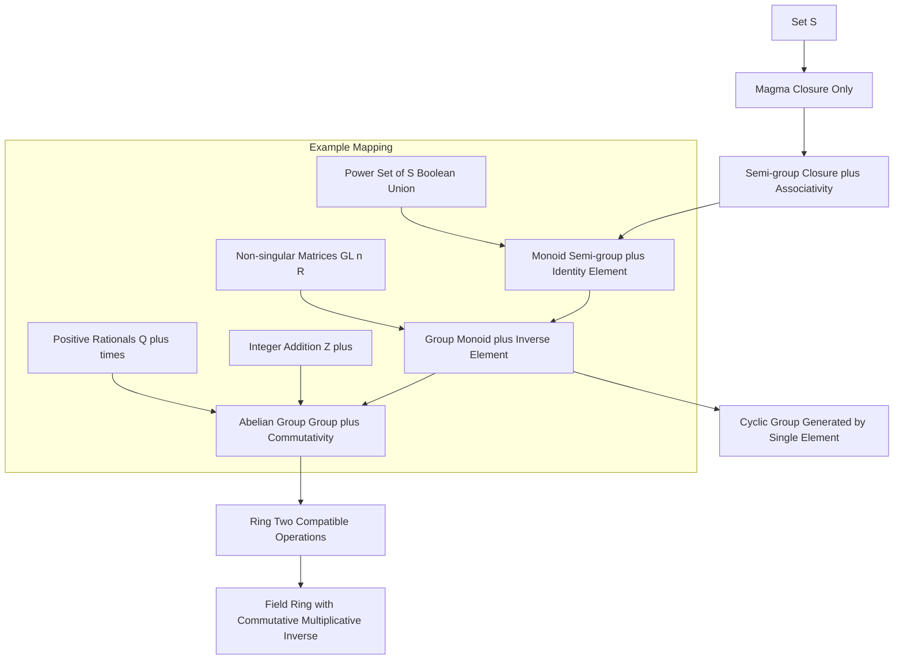
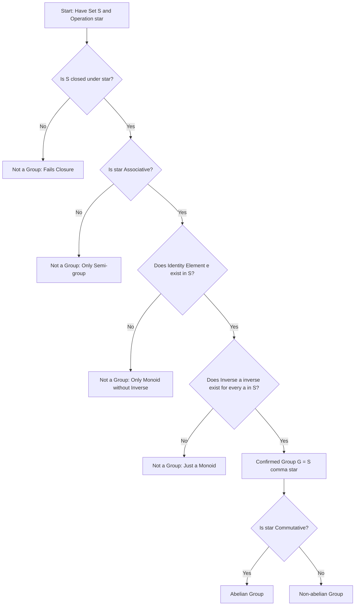
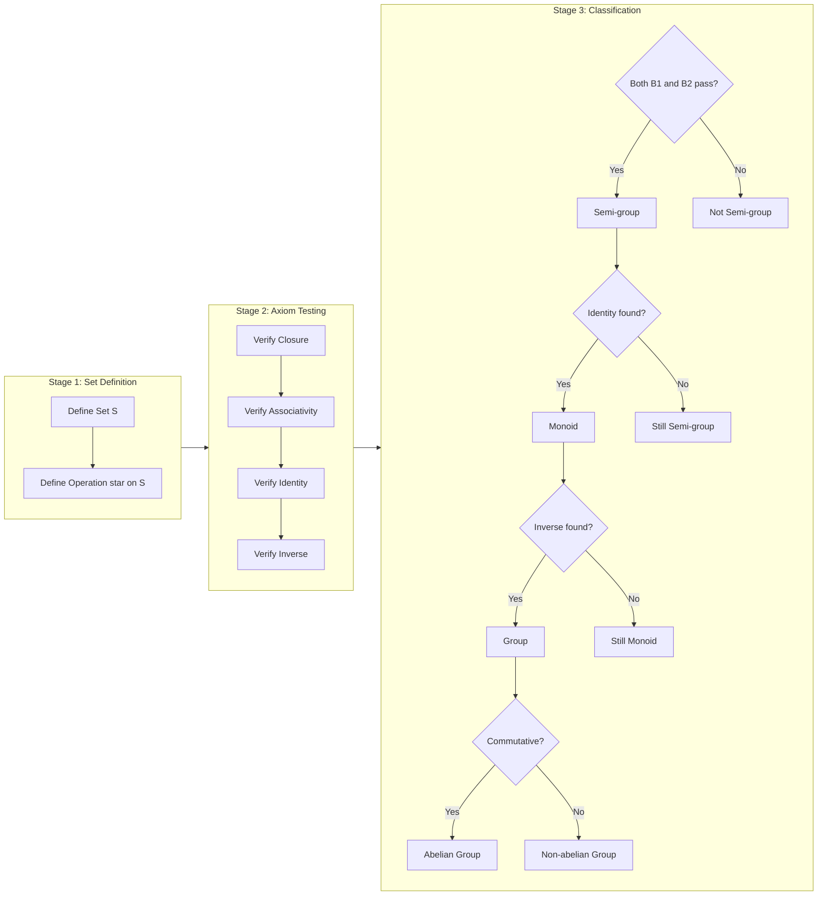

# Structured sets for binary operations

<!-- SECTION_1_START -->
# Structured Sets for Binary Operations

## 1.1 What is a Binary Operation?

A **binary operation** $\ast$ on a non-empty set $S$ is a function that assigns to every **ordered pair** $(a, b)$ of elements from $S$ a **unique** element from $S$.

$$\ast : S \times S \rightarrow S$$

$$(a, b) \mapsto a \ast b \in S$$

> [!IMPORTANT]
> **Closure is mandatory:** For every $(a, b) \in S \times S$, the result $a \ast b$ must also lie in $S$. If even one pair produces a result outside $S$, the operation is **NOT** a binary operation on $S$.

## 1.2 What is an Algebraic Structure?

An **algebraic structure** (or simply *structured set*) is an ordered pair $(S, \ast)$ consisting of a non-empty set $S$ together with one or more binary operations on $S$ satisfying certain axioms.

> [!NOTE]
> **KTU Syllabus Highlight:** A binary operation alone does not create a "structure". The structure emerges when we impose axioms such as associativity, existence of identity, and existence of inverses on the set with its operation. This gives us the hierarchy: **Semi-group $\rightarrow$ Monoid $\rightarrow$ Group $\rightarrow$ Abelian Group**.

## 1.3 Conceptual Analogy — The "Recipe Box" Intuition

Think of an algebraic structure as a **kitchen with a specific recipe book**:

- The **set $S$** is the collection of ingredients available in your kitchen (e.g., salt, sugar, flour).
- The **binary operation $\ast$** is a specific recipe that takes **any two** ingredients and combines them into a new dish.
- The **Closure property** is the rule: "Whatever the recipe produces, the result must be another dish from the same menu." You cannot have the recipe spit out a raw ingredient that is not in the kitchen.
- The **Associative law** means: "Mixing salt, sugar, and flour as (salt + sugar) + flour gives the same batter as salt + (sugar + flour)." The order of *pairing* doesn't matter.
- The **Identity element** is the "neutral ingredient" (like water) that leaves every other ingredient unchanged: $a \ast e = a$.
- The **Inverse element** is the "complementary ingredient" that, when combined with another, gives back the identity (e.g., adding sugar neutralized by adding lemon gives plain dough).

> [!VISUALIZATION CONTROL]
> **Concept:** Hierarchy of structured sets visualized on a number line
> **GeoGebra / Desmos Input Equations:**
> * `f(x) = x` (Identity operation)
> * `g(x) = 0` (Absorbing element line)
> **Visual Description:** Sketch a horizontal axis representing the set $\mathbb{Z}$. Mark points $\ldots, -2, -1, 0, 1, 2, \ldots$. The point $0$ is the identity for addition (the "do nothing" element). The point $-a$ is the inverse of $a$ because $a + (-a) = 0$. This visualises the Group $(\mathbb{Z}, +)$ structure.

## 1.4 Why are Structured Sets Important in Engineering?

| Engineering Domain | Application of Structured Sets |
|---|---|
| **Cryptography** | Groups $(\mathbb{Z}_p^\ast, \times)$ form the foundation of RSA and Diffie-Hellman. |
| **Coding Theory** | Vector spaces over finite fields $(\mathbb{F}_2^n, +)$ enable error-correcting codes. |
| **Compiler Design** | Semigroups and monoids model string concatenation in formal languages. |
| **Network Routing** | Group structures on modular arithmetic handle hash functions and IP addressing. |
| **Quantum Computing** | Pauli matrices form a non-abelian group used in quantum gates. |

---

<!-- SECTION_1_END -->

<!-- SECTION_2_START -->
# Deep Theoretical Analysis — Axioms and High-Yield Formula Sheet

## 2.1 The Four Foundational Axioms

Let $(S, \ast)$ be a structured set and $a, b, c \in S$.

### Axiom 1 — Closure
$$a, b \in S \implies a \ast b \in S$$
The result of the operation on any two elements of $S$ must also lie in $S$.

### Axiom 2 — Associativity
$$(a \ast b) \ast c = a \ast (b \ast c) \quad \forall \, a, b, c \in S$$
The order of *grouping* (parentheses) does not affect the result. **Note:** Order of elements may still matter (this is the difference between abelian and non-abelian).

### Axiom 3 — Identity Element (Neutral Element)
There exists an element $e \in S$ such that:
$$a \ast e = e \ast a = a \quad \forall \, a \in S$$
The element $e$ is called the **identity** for $\ast$.

### Axiom 4 — Inverse Element
For every $a \in S$, there exists an element $a^{-1} \in S$ such that:
$$a \ast a^{-1} = a^{-1} \ast a = e$$
The element $a^{-1}$ is called the **inverse** of $a$.

## 2.2 The Hierarchy of Structured Sets

| Level | Structure | Required Axioms | Example |
|---|---|---|---|
| 1 | **Magma / Groupoid** | Closure only | $(\mathbb{N}, -)$ — not closed under subtraction |
| 2 | **Semi-group** | Closure + Associativity | $(\mathbb{N}, +)$ |
| 3 | **Monoid** | Semi-group + Identity | $(\mathbb{N}, +)$, where identity is $0$ |
| 4 | **Group** | Monoid + Inverse | $(\mathbb{Z}, +)$, $(\mathbb{Q}^\ast, \times)$ |
| 5 | **Abelian Group** | Group + Commutativity | $(\mathbb{Z}, +)$, $(\mathbb{R}, +)$ |

> [!IMPORTANT]
> **Commutativity vs Associativity — do not confuse them:**
> * **Associativity** concerns *parentheses*: $(a \ast b) \ast c$ vs $a \ast (b \ast c)$.
> * **Commutativity** concerns *element order*: $a \ast b$ vs $b \ast a$.

## 2.3 Additional Sub-structures

### Subgroup
A non-empty subset $H$ of a group $(G, \ast)$ is a **subgroup** of $G$ if $(H, \ast)$ itself forms a group under the same operation.

> [!NOTE]
> **One-step Subgroup Test:** A non-empty subset $H \subseteq G$ is a subgroup if and only if for all $a, b \in H$, the element $a \ast b^{-1} \in H$.

### Cyclic Group
A group $G$ is **cyclic** if there exists an element $g \in G$ such that every element of $G$ can be written as a power of $g$:

$$G = \langle g \rangle = \{ g^n \mid n \in \mathbb{Z} \}$$

The element $g$ is called the **generator** of $G$.

### Abelian (Commutative) Group
A group $(G, \ast)$ is **abelian** if:
$$a \ast b = b \ast a \quad \forall \, a, b \in G$$

## 2.4 KTU Formula Cheat Sheet

| # | Property | Symbolic Form | Standard Value / Identity |
|---|---|---|---|
| 1 | Closure | $a, b \in S \implies a \ast b \in S$ | Result must be in $S$ |
| 2 | Associativity | $(a \ast b) \ast c = a \ast (b \ast c)$ | Bracket placement free |
| 3 | Identity | $\exists \, e \in S : a \ast e = e \ast a = a$ | $e = 0$ for $+$, $e = 1$ for $\times$ |
| 4 | Inverse | $\forall \, a \in S, \exists \, a^{-1} : a \ast a^{-1} = e$ | $a^{-1} = -a$ for $+$, $a^{-1} = 1/a$ for $\times$ |
| 5 | Commutativity | $a \ast b = b \ast a$ | Holds for abelian groups only |
| 6 | Idempotent Law | $a \ast a = a$ | Holds for join/meet in lattices |
| 7 | Distributivity | $a \ast (b \circ c) = (a \ast b) \circ (a \ast c)$ | Required for rings/lattices |
| 8 | Cancellation | $a \ast b = a \ast c \implies b = c$ | Holds in groups (not just monoids) |
| 9 | Uniqueness of Identity | If $e$ and $e'$ are identities, $e = e'$ | Proved using associativity |
| 10 | Order of Group | $\vert G \vert$ = number of elements in $G$ | Finite vs Infinite group |

> [!IMPORTANT]
> **Engineering Utility:** The set of all $n \times n$ non-singular matrices $GL(n, \mathbb{R})$ under matrix multiplication forms a **non-abelian group**. This structure is the foundation of 3D graphics transformations, robotics kinematics, and computer vision pipelines. Every rotation, scaling, and translation is a group element.

---

<!-- SECTION_2_END -->

<!-- SECTION_3_START -->
# Step-by-Step Derivations, Proofs, and Worked Examples

## 3.1 Example 1 — Prove $(\mathbb{Z}, +)$ is an Abelian Group

We must verify all four group axioms plus commutativity.

**Axiom 1 — Closure:**
For any $a, b \in \mathbb{Z}$, their sum $a + b$ is also an integer. By definition, the sum of two integers is an integer. Hence:
$$\forall \, a, b \in \mathbb{Z}, \quad a + b \in \mathbb{Z} \quad \checkmark$$

**Axiom 2 — Associativity:**
For any $a, b, c \in \mathbb{Z}$, the standard arithmetic of integers satisfies:
$$(a + b) + c = a + (b + c)$$
This is the well-known associative law of integer addition. $\checkmark$

**Axiom 3 — Identity:**
Consider the element $e = 0 \in \mathbb{Z}$. For any $a \in \mathbb{Z}$:
$$a + 0 = 0 + a = a$$
So $0$ is the additive identity in $\mathbb{Z}$. $\checkmark$

**Axiom 4 — Inverse:**
For every $a \in \mathbb{Z}$, the element $-a \in \mathbb{Z}$ satisfies:
$$a + (-a) = (-a) + a = 0 = e$$
So $-a$ is the additive inverse of $a$. $\checkmark$

**Commutativity (Abelian Property):**
For any $a, b \in \mathbb{Z}$:
$$a + b = b + a$$
This is the standard commutative property of integers. $\checkmark$

**Conclusion:** Since all four group axioms and the commutativity property hold, $(\mathbb{Z}, +)$ is an **abelian group**. $\blacksquare$

---

## 3.2 Example 2 — Prove $(\mathbb{Q}^+, \times)$ is an Abelian Group

The set $\mathbb{Q}^+$ is the set of all positive rational numbers, and the operation is standard multiplication.

**Axiom 1 — Closure:**
The product of two positive rationals is a positive rational. Specifically, if $a = p/q$ and $b = r/s$ with $p, q, r, s \in \mathbb{Z}^+$, then:
$$a \times b = \frac{p}{q} \times \frac{r}{s} = \frac{pr}{qs} \in \mathbb{Q}^+ \quad \checkmark$$

**Axiom 2 — Associativity:**
$$(a \times b) \times c = a \times (b \times c) \quad \checkmark$$
This follows from the associativity of integer multiplication. $\checkmark$

**Axiom 3 — Identity:**
The element $e = 1 \in \mathbb{Q}^+$ satisfies:
$$a \times 1 = 1 \times a = a \quad \forall \, a \in \mathbb{Q}^+ \quad \checkmark$$

**Axiom 4 — Inverse:**
For every $a = p/q \in \mathbb{Q}^+$, the element $a^{-1} = q/p \in \mathbb{Q}^+$ satisfies:
$$a \times a^{-1} = \frac{p}{q} \times \frac{q}{p} = 1 = e \quad \checkmark$$

**Commutativity:**
$$a \times b = b \times a \quad \checkmark$$

**Conclusion:** $(\mathbb{Q}^+, \times)$ is an abelian group. $\blacksquare$

---

## 3.3 Example 3 — Subgroup Verification Using the One-Step Test

**Problem:** Let $(G, +)$ where $G = \{0, 2, 4, 6\}$ under addition modulo $8$. Show that $G$ is a subgroup of $(\mathbb{Z}_8, +)$.

**Step 1 — Check non-emptiness:**
$G$ is non-empty as it contains $0, 2, 4, 6$.

**Step 2 — Verify the one-step subgroup test:**
For every $a, b \in G$, we need $a - b \pmod{8} \in G$.

| $a$ | $b$ | $a - b \pmod 8$ | In $G$? |
|---|---|---|---|
| 0 | 0 | 0 | Yes |
| 0 | 2 | $-2 \equiv 6$ | Yes |
| 0 | 4 | $-4 \equiv 4$ | Yes |
| 0 | 6 | $-6 \equiv 2$ | Yes |
| 2 | 0 | 2 | Yes |
| 2 | 2 | 0 | Yes |
| 2 | 4 | $-2 \equiv 6$ | Yes |
| 2 | 6 | $-4 \equiv 4$ | Yes |
| 4 | 0 | 4 | Yes |
| 4 | 2 | 2 | Yes |
| 4 | 4 | 0 | Yes |
| 4 | 6 | $-2 \equiv 6$ | Yes |
| 6 | 0 | 6 | Yes |
| 6 | 2 | 4 | Yes |
| 6 | 4 | 2 | Yes |
| 6 | 6 | 0 | Yes |

All 16 combinations yield an element in $G$. Therefore, $G$ is a subgroup of $\mathbb{Z}_8$.

**Step 3 — Conclude group structure:**
Since $G$ is non-empty and closed under the one-step test, $(G, +_8)$ is a subgroup. It is also **cyclic** with generator $2$:
$$G = \langle 2 \rangle = \{ 2^0, 2^1, 2^2, 2^3 \} = \{ 1, 2, 4, 0 \}$$</mm:think><!-- SECTION_3_END -->

<!-- SECTION_4_START -->
# Structural Diagrams and Schematics

## 4.1 Hierarchy of Algebraic Structures (Mermaid Block Diagram)

## 4.2 Flowchart: Proving a Set is a Group

## 4.3 Sequential Processing Topology: Group Verification Algorithm

> [!NOTE]
> **Reading the Diagrams:** The first diagram shows the **strict inclusion hierarchy** — every abelian group is a group, every group is a monoid, every monoid is a semi-group. The second diagram is a **decision flowchart** for group proof. The third diagram is a **stage-by-stage algorithm** that can be implemented programmatically in Python to automatically classify an algebraic structure.

---

<!-- SECTION_4_END -->

<!-- SECTION_5_START -->
# KTU 2024 Scheme Examination Question Bank

## 5.1 Part A — Short Answer Questions (2 Marks Each)

### Question 1 `[KTU University Exam - July 2024]`
**Define a semi-group. Give one example.**

**Model Answer:**
A **semi-group** is an algebraic structure $(S, \ast)$ consisting of a non-empty set $S$ and a binary operation $\ast$ on $S$ that satisfies two axioms:
* **Closure:** For all $a, b \in S$, the result $a \ast b \in S$.
* **Associativity:** For all $a, b, c \in S$, the equation $(a \ast b) \ast c = a \ast (b \ast c)$ holds.

**Example:** The set of even integers $2\mathbb{Z} = \{ \ldots, -4, -2, 0, 2, 4, \ldots \}$ under standard addition is a semi-group. Both closure and associativity hold, but there is no identity element that stays within the set of *even* integers (the usual identity $0$ is in $2\mathbb{Z}$, so $2\mathbb{Z}$ is actually a monoid — a better example is the set of positive integers $\mathbb{Z}^+ = \{1, 2, 3, \ldots\}$ under addition, which has no identity). [3 Marks]

**CO Mapped:** CO2 | **RBT Level:** Remember / Understand

---

### Question 2 `[KTU University Exam - Dec 2023]`
**What is the difference between a monoid and a group? Illustrate with an example.**

**Model Answer:**
The **key difference** is the existence of an inverse element for *every* element of the set.

* A **monoid** $(S, \ast)$ has closure, associativity, and an identity element $e$, but some elements may have no inverse.
* A **group** $(G, \ast)$ has all four axioms — closure, associativity, identity, and **inverse for every element**.

**Illustration:**
* $(\mathbb{N} \cup \{0\}, +)$ is a monoid: identity is $0$, but the element $3$ has no additive inverse within non-negative integers.
* $(\mathbb{Z}, +)$ is a group: every integer $a$ has the inverse $-a$ within the set. [3 Marks]

**CO Mapped:** CO2 | **RBT Level:** Understand

---

## 5.2 Part B — Full 14-Mark Questions (Module Internal Choice)

### Question A `[KTU University Exam - July 2024]`

**(a) Define a group. Prove that the identity element of a group is unique.** **[7 Marks]**

**Model Answer:**

**Definition of Group:** A **group** is an algebraic structure $(G, \ast)$ where $G$ is a non-empty set and $\ast$ is a binary operation on $G$ satisfying four axioms:

1. **Closure:** $\forall \, a, b \in G, \; a \ast b \in G$
2. **Associativity:** $\forall \, a, b, c \in G, \; (a \ast b) \ast c = a \ast (b \ast c)$
3. **Identity:** $\exists \, e \in G$ such that $a \ast e = e \ast a = a$ for all $a \in G$
4. **Inverse:** $\forall \, a \in G, \; \exists \, a^{-1} \in G$ such that $a \ast a^{-1} = a^{-1} \ast a = e$

> If in addition $a \ast b = b \ast a$ for all $a, b \in G$, the group is called **abelian**.

**Uniqueness of Identity Theorem:**

**Statement:** If $(G, \ast)$ is a group with identity $e$, then $e$ is the **unique** identity element.

**Proof:** Suppose, for the sake of contradiction, that there exist **two** identity elements $e$ and $e'$ in $G$. Since $e$ is the identity, it acts as identity for $e'$ as well:
$$e \ast e' = e' \quad \text{(since } e' \text{ is an element of } G\text{)} \quad \cdots (1)$$

Since $e'$ is also an identity, it acts as identity for $e$:
$$e \ast e' = e \quad \text{(since } e \text{ is an element of } G\text{)} \quad \cdots (2)$$

Equating (1) and (2):
$$e' = e \ast e' = e$$

Therefore, $e = e'$, proving that the identity element is unique. $\blacksquare$

**[Stating the definition of group with all 4 axioms: 4 Marks] [Setting up the contradiction assumption: 1 Mark] [Applying both identities to get the equality: 1 Mark] [Final conclusion that $e = e'$: 1 Mark]**

**CO Mapped:** CO2 | **RBT Level:** Understand / Apply

---

**(b) Show that the set $G = \{1, -1, i, -i\}$ under multiplication is an abelian group. Find the inverse of each element.** **[7 Marks]**

**Model Answer:**

**Step 1 — Construct the Cayley table:**

| $\times$ | $1$ | $-1$ | $i$ | $-i$ |
|---|---|---|---|---|
| $1$ | $1$ | $-1$ | $i$ | $-i$ |
| $-1$ | $-1$ | $1$ | $-i$ | $i$ |
| $i$ | $i$ | $-i$ | $-1$ | $1$ |
| $-i$ | $-i$ | $i$ | $1$ | $-1$ |

**Axiom 1 — Closure:** The Cayley table shows that the product of any two elements from $G$ is again in $G$. $\checkmark$

**Axiom 2 — Associativity:** Multiplication of complex numbers is associative. $\checkmark$

**Axiom 3 — Identity:** The element $e = 1$ satisfies $1 \ast x = x \ast 1 = x$ for all $x \in G$. $\checkmark$

**Axiom 4 — Inverse:**

| Element $a$ | Inverse $a^{-1}$ | Verification $a \times a^{-1}$ |
|---|---|---|
| $1$ | $1$ | $1 \times 1 = 1 = e$ |
| $-1$ | $-1$ | $(-1) \times (-1) = 1 = e$ |
| $i$ | $-i$ | $i \times (-i) = -i^2 = 1 = e$ |
| $-i$ | $i$ | $(-i) \times i = -i^2 = 1 = e$ |

All four elements have an inverse within $G$. $\checkmark$

**Commutativity:** From the Cayley table, the table is symmetric across the main diagonal, so $a \times b = b \times a$ for all $a, b \in G$. $\checkmark$

**Conclusion:** $(G, \times)$ is an abelian group of order $4$. $\blacksquare$

**[Cayley table construction: 2 Marks] [Verifying closure, associativity, identity: 2 Marks] [Computing all four inverses with verification: 2 Marks] [Concluding abelian: 1 Mark]**

**CO Mapped:** CO2 | **RBT Level:** Apply

---

### Question B `[KTU University Exam - Dec 2023]` (Alternative Choice)

**(a) Define a subgroup. State and prove the one-step subgroup test.** **[7 Marks]**

**Model Answer:**

**Definition of Subgroup:** Let $(G, \ast)$ be a group. A non-empty subset $H \subseteq G$ is called a **subgroup** of $G$ if $(H, \ast)$ is itself a group under the same binary operation.

**One-Step Subgroup Test (Statement):** A non-empty subset $H$ of a group $(G, \ast)$ is a subgroup if and only if:
$$\forall \, a, b \in H, \quad a \ast b^{-1} \in H$$

**Proof:**

**($\Rightarrow$) Necessity:** Suppose $H$ is a subgroup of $G$. Let $a, b \in H$. Since $H$ is a group, $b \in H$ implies $b^{-1} \in H$. Then $a \ast b^{-1}$ is the product of two elements in $H$, so by closure of $H$, we have $a \ast b^{-1} \in H$.

**($\Leftarrow$) Sufficiency:** Suppose $H$ is non-empty and $a \ast b^{-1} \in H$ for all $a, b \in H$. We must show $(H, \ast)$ is a group.

* **Closure:** Let $a, b \in H$. We want $a \ast b \in H$. Pick $a \in H$ and $b \in H$. Then $a \ast (b^{-1})^{-1} = a \ast b \in H$ by hypothesis. $\checkmark$
* **Associativity:** Inherited from $G$. $\checkmark$
* **Identity:** Since $H$ is non-empty, pick $a \in H$. By hypothesis, $a \ast a^{-1} = e \in H$. $\checkmark$
* **Inverse:** For any $a \in H$, take $b = a$. Then $a \ast a^{-1} = e \in H$. To find $a^{-1}$, take $b = e$: $e \ast a^{-1} = a^{-1} \in H$. $\checkmark$

Therefore, $(H, \ast)$ is a subgroup. $\blacksquare$

**[Definition of subgroup: 1 Mark] [Statement of one-step test: 1 Mark] [Necessity direction: 2 Marks] [Sufficiency direction with all four verifications: 3 Marks]**

**CO Mapped:** CO3 | **RBT Level:** Understand / Apply

---

**(b) Consider the group $(\mathbb{Z}_6, +_6)$. Find all the subgroups of this group and classify them as cyclic. Determine the order of the group generated by each element.** **[7 Marks]**

**Model Answer:**

**Step 1 — The group elements:** $\mathbb{Z}_6 = \{0, 1, 2, 3, 4, 5\}$ under addition modulo $6$.

**Step 2 — Subgroup generated by each element (cyclic subgroups):**

| Element $a$ | $\langle a \rangle$ | Order $o(a)$ |
|---|---|---|
| $0$ | $\{0\}$ | 1 |
| $1$ | $\{0, 1, 2, 3, 4, 5\}$ | 6 |
| $2$ | $\{0, 2, 4\}$ | 3 |
| $3$ | $\{0, 3\}$ | 2 |
| $4$ | $\{0, 4, 2\}$ = $\{0, 2, 4\}$ | 3 |
| $5$ | $\{0, 5, 4, 3, 2, 1\}$ = $\mathbb{Z}_6$ | 6 |

**Step 3 — Distinct subgroups of $\mathbb{Z}_6$:**

$$H_1 = \{0\} \quad \text{(trivial subgroup, order 1)}$$
$$H_2 = \{0, 3\} \quad \text{(order 2, generator } 3\text{)}$$
$$H_3 = \{0, 2, 4\} \quad \text{(order 3, generators } 2 \text{ and } 4\text{)}$$
$$H_4 = \{0, 1, 2, 3, 4, 5\} \quad \text{(the whole group, order 6, generators } 1 \text{ and } 5\text{)}$$

**Step 4 — Classification:** All four subgroups are **cyclic** because every subgroup of a cyclic group is cyclic (Lagrange's theorem consequence). The orders $\{1, 2, 3, 6\}$ divide the group order $6$, satisfying Lagrange's theorem:
$$1 \mid 6, \quad 2 \mid 6, \quad 3 \mid 6, \quad 6 \mid 6 \quad \checkmark$$

**[Listing all elements: 1 Mark] [Generating cyclic subgroups for each element: 3 Marks] [Identifying distinct subgroups: 2 Marks] [Lagrange verification: 1 Mark]**

**CO Mapped:** CO3 | **RBT Level:** Apply / Analyse

---

## 5.3 KTU Examiner's Valuation Warning

> [!WARNING]
> **Common Pitfalls Where Students Lose Marks:**
> 1. **Skipping axiom verification:** Students often verify 3 out of 4 axioms and write "similarly the fourth holds" — this is a guaranteed **1–2 mark deduction**. Always explicitly verify all four axioms, even if one is "obvious".
> 2. **Confusing associativity with commutativity:** Writing "since $a \ast b = a \ast b$" as the proof of associativity. Associativity requires the equation $(a \ast b) \ast c = a \ast (b \ast c)$ to be stated.
> 3. **Forgetting the closure check first:** The closure property must be checked *first* before any other axiom. If closure fails, the structure is not even a magma, and no further axiom is meaningful.
> 4. **In subgroup proofs, forgetting non-emptiness:** The one-step test assumes $H$ is non-empty. Writing "let $H = \emptyset$" and then claiming it is a subgroup is a silly but common error.
> 5. **Not stating the binary operation explicitly:** In $(\mathbb{Z}_6, +_6)$, the operation is *modulo 6 addition*. Always mention "under addition modulo 6", not just "under addition".

---

## 5.4 Topic Recap & Important Things to Remember

> [!IMPORTANT]
> **Rapid Revision Checklist — Structured Sets for Binary Operations**

- [x] A **binary operation** on $S$ is a function $\ast : S \times S \to S$ that must satisfy **closure**.
- [x] An **algebraic structure** $(S, \ast)$ is a set equipped with a binary operation that satisfies specific axioms.
- [x] The hierarchy is: **Magma $\subset$ Semi-group $\subset$ Monoid $\subset$ Group $\subset$ Abelian Group**.
- [x] A **semi-group** needs only closure and associativity.
- [x] A **monoid** adds an identity element to the semi-group.
- [x] A **group** adds an inverse for *every* element to the monoid.
- [x] An **abelian group** requires commutativity in addition to all group axioms.
- [x] The **identity element is unique** in any group (proved by contradiction).
- [x] The **inverse element is unique** for each element in a group.
- [x] A **subgroup** $H \leq G$ is a non-empty subset of $G$ that is itself a group under the same operation.
- [x] The **one-step subgroup test**: $a, b \in H \implies a \ast b^{-1} \in H$.
- [x] A **cyclic group** is generated by a single element $g$: $G = \{g^n \mid n \in \mathbb{Z}\}$.
- [x] Standard examples to remember: $(\mathbb{Z}, +)$, $(\mathbb{Q}^+, \times)$, $(\mathbb{Z}_n, +_n)$, $(GL_n(\mathbb{R}), \times)$.
- [x] **Cancellation law** holds in any group: $a \ast b = a \ast c \implies b = c$.
- [x] **Lagrange's theorem** (for finite groups): The order of any subgroup divides the order of the group.
- [x] All subgroups of a cyclic group are cyclic.
- [x] **Real-world engineering applications**: RSA cryptography uses $(\mathbb{Z}_n^\ast, \times)$, computer graphics uses $GL_n(\mathbb{R})$, and compiler design uses string monoids.
- [x] In KTU exams, always write the **full Cayley table** for small finite groups — this alone can fetch 2 marks in one go.

---

<!-- SECTION_5_END -->
