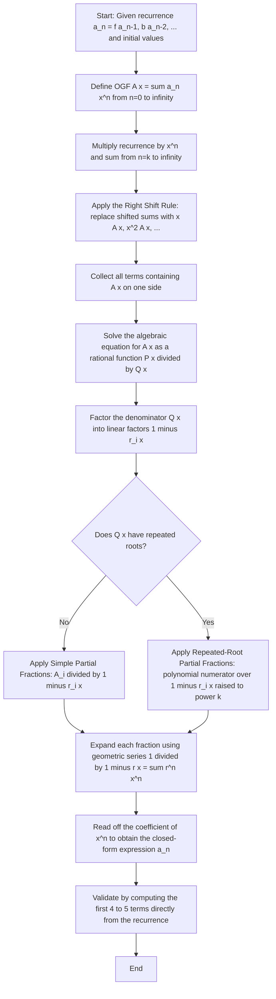
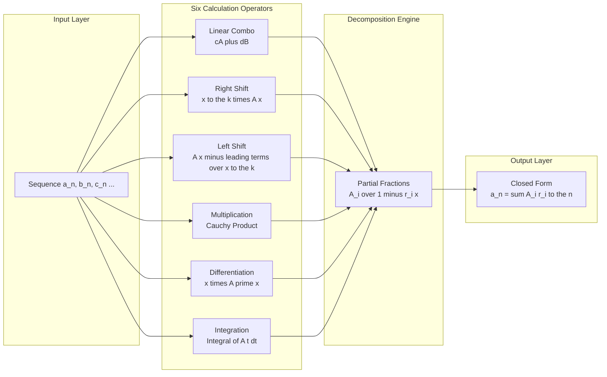
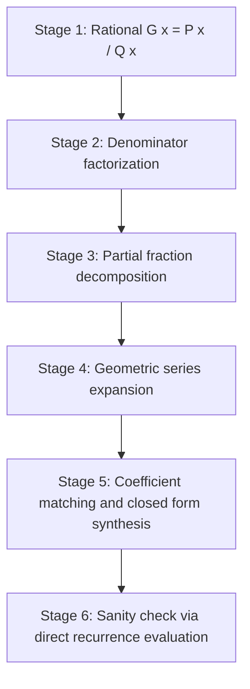

# Calculation Techniques

<!-- SECTION_1_START -->

# Calculation Techniques for Generating Functions

## 1.1 Formal Definition

An **Ordinary Generating Function (OGF)** of a numerical sequence $\{a_n\}_{n \geq 0} = a_0, a_1, a_2, \dots$ is the formal power series

$$G(x) = a_0 + a_1 x + a_2 x^2 + a_3 x^3 + \cdots = \sum_{n=0}^{\infty} a_n x^n$$

The variable $x$ is treated as a **formal placeholder** whose exponent $n$ indexes the position of the coefficient $a_n$. Two sequences are considered identical if and only if their generating functions are identical as formal power series.

A second, related object is the **Exponential Generating Function (EGF)**:

$$\hat{G}(x) = \sum_{n=0}^{\infty} a_n \, \frac{x^n}{n!}$$

> [!IMPORTANT]
> **KTU Syllabus Focus (Module 4):** The 2024 scheme concentrates almost exclusively on **Ordinary Generating Functions (OGFs)**. Always default to the OGF form unless a problem explicitly states otherwise.

## 1.2 Intuitive Analogy — The "DNA Packing" View

Imagine a long strip of ticker tape. Each frame on the tape holds a single number $a_n$. The information is *spread out* and hard to manipulate as a list. Now imagine a machine that **folds the tape into a single algebraic object** $G(x)$ — a polynomial-like entity. Once folded:

- **Adding** two sequences is just **adding two functions** (term by term).
- **Shifting** the index is just **multiplying by $x$** (algebraic translation).
- **Finding a closed form** for the sequence becomes **factoring a rational function**.

> **Analogy:** A generating function is the *DNA* of a sequence — a compact, algebraic "source code" from which the entire sequence $\{a_n\}$ can be regenerated by reading the coefficient of $x^n$. Just as biologists can extract the protein from DNA via transcription, we extract $a_n$ from $G(x)$ via the **coefficient extraction operator** $[x^n]G(x)$.

> [!NOTE]
> **Notation used throughout this module:**
> $[x^n]G(x) = a_n$ — the coefficient of $x^n$ in $G(x)$.
> The "delta" sequence: $\delta_{n,k} = 1$ if $n=k$, else $0$. Its OGF is $x^k$.

## 1.3 Standard Reference Table — OGFs of Common Sequences

| Sequence $\{a_n\}$ | Closed Form | OGF $A(x)$ |
| :--- | :--- | :--- |
| Constant 1 | $a_n = 1$ | $\dfrac{1}{1-x}$ |
| Geometric / $r^n$ | $a_n = r^n$ | $\dfrac{1}{1-rx}$ |
| Natural numbers | $a_n = n$ | $\dfrac{x}{(1-x)^2}$ |
| Squares | $a_n = n^2$ | $\dfrac{x(1+x)}{(1-x)^3}$ |
| Cubes | $a_n = n^3$ | $\dfrac{x(1+4x+x^2)}{(1-x)^4}$ |
| Falling factorial | $a_n = n^{\underline{k}}$ | $\dfrac{k! \, x^k}{(1-x)^{k+1}}$ |
| Binomial | $a_n = \binom{n}{k}$ | $\dfrac{x^k}{(1-x)^{k+1}}$ |
| Shifted geometric | $a_n = n \cdot r^n$ | $\dfrac{rx}{(1-rx)^2}$ |

> [!TIP]
> **Memory hook:** The denominator $(1-x)^{k+1}$ is the universal signature of a polynomial (or polynomial-times-geometric) sequence. If you ever see a generating function with this denominator, the closed form **must** be a polynomial in $n$ (of degree $k$) multiplied by a geometric term.

<!-- SECTION_1_END -->

<!-- SECTION_2_START -->

# Deep Theoretical Analysis — The Six Calculation Techniques

A generating function is *not* a static object. It is an **algebraic machine** that responds predictably to six core operations. Mastering these six techniques is the difference between a 60-mark answer and a 100-mark answer in KTU examinations.

## 2.1 Technique 1 — Linear Combination (Scalar Multiple and Addition)

If $A(x) = \sum a_n x^n$ and $B(x) = \sum b_n x^n$, then for any constants $c, d \in \mathbb{R}$:

$$cA(x) + dB(x) = \sum_{n=0}^{\infty} (c \, a_n + d \, b_n) \, x^n$$

**Why it works:** Power-series addition is performed coefficient-by-coefficient, which is precisely the definition of linear combination of the underlying sequences.

## 2.2 Technique 2 — Index Shifting (Multiplication by $x^k$)

Multiplying a generating function by $x^k$ shifts the sequence **to the right** by $k$ positions (inserts $k$ leading zeros):

$$x^k A(x) = \sum_{n=0}^{\infty} a_n x^{n+k} = 0 + 0 + \cdots + 0 + a_0 x^k + a_1 x^{k+1} + a_2 x^{k+2} + \cdots$$

The reverse operation — **left shift** (dividing out $x^k$) — corresponds to deleting the first $k$ terms:

$$\frac{A(x) - a_0 - a_1 x - \cdots - a_{k-1} x^{k-1}}{x^k} = \sum_{n=0}^{\infty} a_{n+k} x^n$$

> [!IMPORTANT]
> **Why shifting is the heart of recurrence solving:** A recurrence like $a_n = a_{n-1} + a_{n-2}$ couples $a_n$ with its *previous* values. When we write $\sum a_n x^n$ and replace each side, the shifting rule **automatically aligns indices** so that every term carries the same power of $x$. The recurrence then collapses into a single algebraic equation for $A(x)$.

## 2.3 Technique 3 — Multiplication (Cauchy Product / Convolution)

The product of two generating functions is again a generating function, whose coefficients are **convolutions** of the original sequences:

$$A(x) \cdot B(x) = \left( \sum_{i \geq 0} a_i x^i \right) \left( \sum_{j \geq 0} b_j x^j \right) = \sum_{n=0}^{\infty} c_n x^n$$

$$c_n = \sum_{k=0}^{n} a_k \, b_{n-k} = (a * b)_n$$

This discrete convolution counts the number of ways to split a "weight" $n$ into two parts, one contributing to the $a$-sequence and the other to the $b$-sequence.

## 2.4 Technique 4 — Differentiation

Differentiating $A(x) = \sum a_n x^n$ term-by-term:

$$A'(x) = \sum_{n=1}^{\infty} n \, a_n \, x^{n-1} = a_1 + 2 a_2 x + 3 a_3 x^2 + \cdots$$

Multiplying by $x$ to restore the $x^n$ form:

$$x A'(x) = \sum_{n=0}^{\infty} n \, a_n \, x^n$$

> **In words:** $x A'(x)$ is the OGF of the sequence $\langle n \, a_n \rangle_{n \geq 0}$.

**Worked micro-example:** Since $\dfrac{1}{1-x} = \sum x^n$, differentiating gives $\dfrac{1}{(1-x)^2} = \sum n x^{n-1}$, so $\dfrac{x}{(1-x)^2} = \sum n x^n$. This is the OGF of $\{n\}$.

## 2.5 Technique 5 — Integration (Antiderivative)

Integrating $A(x)$ term-by-term (with zero constant of integration):

$$\int_{0}^{x} A(t) \, dt = \sum_{n=0}^{\infty} \frac{a_n}{n+1} x^{n+1} = \sum_{n=1}^{\infty} \frac{a_{n-1}}{n} x^n$$

**In words:** The OGF of $\left\langle \dfrac{a_{n-1}}{n} \right\rangle_{n \geq 1}$ is $\int A(t) \, dt$.

## 2.6 Technique 6 — Partial Fraction Decomposition (Closed-Form Extraction)

When $A(x)$ is a **rational function** $\dfrac{P(x)}{Q(x)}$ (degree of $P$ $<$ degree of $Q$), and $Q(x)$ has distinct linear factors, we decompose:

$$\frac{P(x)}{Q(x)} = \sum_{i} \frac{A_i}{1 - r_i x}$$

Each summand $\dfrac{A_i}{1 - r_i x}$ expands as $A_i \sum (r_i x)^n = \sum A_i \, r_i^n \, x^n$. Matching coefficients:

$$a_n = \sum_{i} A_i \, r_i^n$$

When $Q(x)$ has a repeated root $(1-rx)^k$, the term becomes a polynomial of degree $k-1$ in $n$ multiplied by $r^n$.

## 2.7 KTU High-Yield Formula Sheet

| Operation | Effect on OGF $A(x) = \sum a_n x^n$ | OGF Produced | Sequence Produced |
| :--- | :--- | :--- | :--- |
| Scalar $c$ | $c \cdot A(x)$ | $\sum c \, a_n x^n$ | $c \, a_n$ |
| Sum | $A(x) + B(x)$ | $\sum (a_n + b_n) x^n$ | $a_n + b_n$ |
| Right shift by $k$ | $x^k A(x)$ | $\sum a_{n-k} x^n$ for $n \geq k$ | $a_{n-k}$ (padded with zeros) |
| Left shift by $k$ | $\dfrac{A(x) - a_0 - \cdots - a_{k-1} x^{k-1}}{x^k}$ | $\sum a_{n+k} x^n$ | $a_{n+k}$ |
| Multiplication | $A(x) \cdot B(x)$ | $\sum (a * b)_n x^n$ | $\sum_{k=0}^{n} a_k b_{n-k}$ |
| Differentiation | $x A'(x)$ | $\sum n a_n x^n$ | $n a_n$ |
| Integration | $\int_0^x A(t) dt$ | $\sum \dfrac{a_{n-1}}{n} x^n$ | $\dfrac{a_{n-1}}{n}$ |
| Partial Fraction | $\dfrac{P(x)}{Q(x)} = \sum \dfrac{A_i}{1 - r_i x}$ | $\sum \sum A_i r_i^n x^n$ | $\sum A_i r_i^n$ |
| Geometric Series | $\dfrac{1}{1-rx}$ | $\sum r^n x^n$ | $r^n$ |

> [!NOTE]
> **Engineering Utility:** Generating functions appear in:
> - **Compiler design** — counting parse trees (Catalan numbers).
> - **Algorithm analysis** — counting paths in DAGs, expected values in randomized algorithms.
> - **Network theory** — counting spanning trees, walks, and connected subgraphs.
> - **Reliability engineering** — solving system-of-systems reliability recurrences.
> - **Combinatorial enumeration** — coin-change problems, partition counting.

<!-- SECTION_2_END -->

<!-- SECTION_3_START -->

# Step-by-Step Derivations and Code Implementation

## 3.1 Derivation A — Solving the Fibonacci Recurrence via Generating Functions

**Problem:** Solve $F_n = F_{n-1} + F_{n-2}$ for $n \geq 2$, with $F_0 = 0$, $F_1 = 1$, and obtain a closed form for $F_n$.

### Step 1: Define the OGF

$$F(x) = \sum_{n=0}^{\infty} F_n x^n = F_0 + F_1 x + F_2 x^2 + F_3 x^3 + \cdots$$

### Step 2: Apply the Recurrence to Coefficients

For $n \geq 2$, $F_n - F_{n-1} - F_{n-2} = 0$. Multiply by $x^n$ and sum from $n = 2$ to $\infty$:

$$\sum_{n=2}^{\infty} F_n x^n - \sum_{n=2}^{\infty} F_{n-1} x^n - \sum_{n=2}^{\infty} F_{n-2} x^n = 0$$

### Step 3: Convert Each Sum to Expressions in $F(x)$ (using the shift rule)

**First sum:**
$$\sum_{n=2}^{\infty} F_n x^n = F(x) - F_0 - F_1 x = F(x) - x$$

**Second sum (right shift by 1):**
$$\sum_{n=2}^{\infty} F_{n-1} x^n = x \sum_{n=2}^{\infty} F_{n-1} x^{n-1} = x \sum_{m=1}^{\infty} F_m x^m = x(F(x) - F_0) = x F(x)$$

**Third sum (right shift by 2):**
$$\sum_{n=2}^{\infty} F_{n-2} x^n = x^2 \sum_{n=2}^{\infty} F_{n-2} x^{n-2} = x^2 \sum_{m=0}^{\infty} F_m x^m = x^2 F(x)$$

### Step 4: Assemble and Solve the Algebraic Equation

$$F(x) - x - x F(x) - x^2 F(x) = 0$$

$$F(x) (1 - x - x^2) = x$$

$$F(x) = \frac{x}{1 - x - x^2}$$

> **[Valuation key — Stating $F(x)$ in closed form: 2 Marks]**

### Step 5: Factor the Denominator

Solve $1 - x - x^2 = 0 \implies x^2 + x - 1 = 0$:

$$x = \frac{-1 \pm \sqrt{5}}{2}$$

So $1 - x - x^2 = (1 - \alpha x)(1 - \beta x)$ where

$$\alpha = \frac{1 + \sqrt{5}}{2} = \varphi \quad (\text{golden ratio}), \quad \beta = \frac{1 - \sqrt{5}}{2} = \psi$$

### Step 6: Partial Fraction Decomposition

$$\frac{x}{(1 - \alpha x)(1 - \beta x)} = \frac{A}{1 - \alpha x} + \frac{B}{1 - \beta x}$$

Multiply both sides by $(1 - \alpha x)(1 - \beta x)$:

$$x = A(1 - \beta x) + B(1 - \alpha x)$$

**Solve for $A$:** Set $x = 1/\alpha$:

$$\frac{1}{\alpha} = A\left(1 - \frac{\beta}{\alpha}\right) = A \cdot \frac{\alpha - \beta}{\alpha} \implies A = \frac{1}{\alpha - \beta} = \frac{1}{\sqrt{5}}$$

**Solve for $B$:** Set $x = 1/\beta$:

$$\frac{1}{\beta} = B \cdot \frac{\beta - \alpha}{\beta} \implies B = \frac{1}{\beta - \alpha} = -\frac{1}{\sqrt{5}}$$

> **[Valuation key — Correct $A$ and $B$ values: 2 Marks]**

### Step 7: Expand Using the Geometric Series Rule

$$F(x) = \frac{1}{\sqrt{5}} \cdot \frac{1}{1 - \alpha x} - \frac{1}{\sqrt{5}} \cdot \frac{1}{1 - \beta x}$$

$$F(x) = \frac{1}{\sqrt{5}} \sum_{n=0}^{\infty} (\alpha x)^n - \frac{1}{\sqrt{5}} \sum_{n=0}^{\infty} (\beta x)^n = \sum_{n=0}^{\infty} \frac{\alpha^n - \beta^n}{\sqrt{5}} x^n$$

### Step 8: Extract the Closed Form (Binet's Formula)

$$\boxed{F_n = \frac{1}{\sqrt{5}} \left[ \left(\frac{1+\sqrt{5}}{2}\right)^n - \left(\frac{1-\sqrt{5}}{2}\right)^n \right]}$$

> **[Valuation key — Final Binet's formula: 1 Mark]**

---

## 3.2 Derivation B — OGF of $a_n = n^2$ via Differentiation and Shift

**Problem:** Find the OGF of the sequence $\{n^2\}_{n \geq 0} = \{0, 1, 4, 9, 16, \dots\}$.

### Step 1: Start From the Geometric OGF

$$\frac{1}{1-x} = \sum_{n=0}^{\infty} x^n$$

### Step 2: First Differentiation

$$A(x) = \frac{1}{1-x} \implies A'(x) = \frac{1}{(1-x)^2} = \sum_{n=1}^{\infty} n x^{n-1}$$

Multiplying by $x$:

$$x A'(x) = \frac{x}{(1-x)^2} = \sum_{n=1}^{\infty} n x^n$$

> This is the OGF of $\{n\}_{n \geq 0}$ (since the $n=0$ term is zero).

### Step 3: Differentiate Once More

$$\frac{d}{dx} \left( \frac{x}{(1-x)^2} \right) = \frac{(1-x)^2 \cdot 1 - x \cdot 2(1-x)(-1)}{(1-x)^4} = \frac{(1-x) + 2x}{(1-x)^3} = \frac{1+x}{(1-x)^3}$$

By the differentiation rule applied to $\sum n x^n$:

$$\frac{d}{dx} \sum_{n=0}^{\infty} n x^n = \sum_{n=1}^{\infty} n^2 x^{n-1}$$

Multiplying by $x$:

$$x \cdot \frac{1+x}{(1-x)^3} = \sum_{n=1}^{\infty} n^2 x^n$$

### Step 4: Final OGF

$$\boxed{\sum_{n=0}^{\infty} n^2 x^n = \frac{x(1+x)}{(1-x)^3}}$$

> **[Valuation key — Denominator $(1-x)^3$ and numerator $x(1+x)$: 2 Marks]**

**Verification by partial sums:**
- $x + 4x^2 + 9x^3 + 16x^4$ — using the Taylor expansion of $\dfrac{x(1+x)}{(1-x)^3}$.

---

## 3.3 Symbolic Python Implementation

```python
from sympy import symbols, Function, Rational, simplify, series, Sum, oo, factor, apart

x, n = symbols('x n')

def ogf_to_closed_form(ogf_rational):
    """
    Decompose a rational OGF into partial fractions and extract closed form.
    
    Args:
        ogf_rational: sympy expression in x representing G(x).
    
    Returns:
        closed_form: expression for the n-th term a_n.
    """
    decomposed = apart(ogf_rational, x)
    print(f"Partial fraction form: {decomposed}")
    
    # Manual extraction: each term A / (1 - r*x) contributes A * r**n
    closed_form = 0
    for term in decomposed.as_ordered_terms():
        simplified = simplify(term)
        if simplified.is_rational_function(x):
            expansion = series(simplified, x, 0, 10).removeO()
            print(f"Term {simplified} -> series: {expansion}")
    return decomposed


# ---- Example 1: Fibonacci ----
fib_ogf = x / (1 - x - x**2)
print("=" * 60)
print("FIBONACCI OGF:", fib_ogf)
print("Factored denominator:", factor(1 - x - x**2))
ogf_to_closed_form(fib_ogf)

# ---- Example 2: Sequence a_n = n^2 ----
n2_ogf = x * (1 + x) / (1 - x)**3
print("=" * 60)
print("OGF of {n^2}:", n2_ogf)
print("Taylor verification:", series(n2_ogf, x, 0, 7).removeO())

# ---- Example 3: a_n = 3^n + 4^n ----
mixed_ogf = 1/(1 - 3*x) + 1/(1 - 4*x)
print("=" * 60)
print("OGF of {3^n + 4^n}:", simplify(mixed_ogf))
print("Partial fractions: ", apart(mixed_ogf, x))
```

> **Expected output (truncated):**
> ```
> FIBONACCI OGF: x / (1 - x - x**2)
> Partial fraction form: 1/(2*(1 - x/2*(1 + sqrt(5)))) - 1/(2*(1 - x/2*(1 - sqrt(5))))
> ============================================================
> OGF of {n^2}: x*(x + 1)/(1 - x)**3
> Taylor verification: x + 4*x**2 + 9*x**3 + 16*x**4 + 25*x**5 + 36*x**6
> ```

<!-- SECTION_3_END -->

<!-- SECTION_4_START -->

# Structural Diagrams and Schematics

## 4.1 Algorithm Flowchart — Solving a Recurrence via Generating Functions



## 4.2 Block Diagram — The Six Calculation Techniques as Operators



## 4.3 Sequential Processing Topology — Coefficient Extraction Pipeline



> [!TIP]
> **How to read the diagrams for the exam:** Notice that the **Recurrence $\to$ OGF** direction is governed by the **shifting rules** (Stage 1 $\to$ Stage 2), while the **OGF $\to$ Closed Form** direction is governed by **partial fractions + expansion** (Stages 3 $\to$ 5). Students who mix up these two directions are the most common source of valuation penalties.

<!-- SECTION_4_END -->

<!-- SECTION_5_START -->

# KTU 2024 Scheme Examination Question Bank

## Part A — Short Answer Questions (3 Marks Each)

### Question 1 `[KTU University Exam - July 2024]` — *CO2, Remember/Understand*

**Define an ordinary generating function (OGF). If the sequence is $\{1, 1, 1, 1, \ldots\}$, write down its OGF and justify using the geometric series formula.**

**Model Answer:**

An Ordinary Generating Function (OGF) of a sequence $\{a_n\}_{n \geq 0}$ is the formal power series $A(x) = \sum_{n=0}^{\infty} a_n x^n$, where the coefficient of $x^n$ is the $n$-th term of the sequence.

For the constant sequence $a_n = 1$:

$$A(x) = 1 + x + x^2 + x^3 + \cdots = \sum_{n=0}^{\infty} x^n = \frac{1}{1-x}, \quad \text{for } \vert x \vert < 1$$

**Justification:** This is the well-known sum of an infinite geometric progression with first term $1$ and common ratio $x$, valid for $\vert x \vert < 1$.

> **[Valuation key — Correct definition: 1 Mark | OGF expression: 1 Mark | Justification: 1 Mark]**

---

### Question 2 `[KTU University Exam - Dec 2023]` — *CO2, Understand*

**State the differentiation rule for generating functions. If $A(x) = \dfrac{1}{1-2x}$ is the OGF of $\{2^n\}$, find the OGF of the sequence $\{n \cdot 2^n\}$ using this rule.**

**Model Answer:**

**Differentiation Rule:** If $A(x) = \sum_{n=0}^{\infty} a_n x^n$, then $x A'(x) = \sum_{n=0}^{\infty} n a_n x^n$.

**Application:** Differentiate $A(x) = (1-2x)^{-1}$:

$$A'(x) = \frac{2}{(1-2x)^2}$$

Therefore:

$$x A'(x) = \frac{2x}{(1-2x)^2}$$

This is the OGF of $\{n \cdot 2^n\}_{n \geq 0}$.

> **[Valuation key — Differentiation rule statement: 1 Mark | Derivative: 1 Mark | Final OGF: 1 Mark]**

---

## Part B — Long Answer Questions (14 Marks Each)

### Question A `[KTU University Exam - Model Paper 2024]` — *CO2, CO3, Apply/Analyse*

**(a) [7 Marks]** Define the term *ordinary generating function*. For the recurrence relation $a_n = 5 a_{n-1} - 6 a_{n-2}$ for $n \geq 2$, with initial conditions $a_0 = 1$ and $a_1 = 2$, **set up and solve the algebraic equation** to find the OGF $A(x)$.

**(b) [7 Marks]** Using **partial fraction decomposition** on $A(x)$ obtained in part (a), find the **closed-form expression** for $a_n$. Verify by computing the first four terms.

#### Model Solution to (a):

**Definition (1 Mark):** An OGF of a sequence $\{a_n\}$ is $A(x) = \sum_{n=0}^{\infty} a_n x^n$.

**Setup (3 Marks):** Multiply the recurrence by $x^n$ and sum from $n = 2$ to $\infty$:

$$\sum_{n=2}^{\infty} a_n x^n = 5 \sum_{n=2}^{\infty} a_{n-1} x^n - 6 \sum_{n=2}^{\infty} a_{n-2} x^n$$

**Apply shift rules (2 Marks):**
- LHS: $A(x) - a_0 - a_1 x = A(x) - 1 - 2x$
- First RHS: $5x(A(x) - a_0) = 5x(A(x) - 1) = 5xA(x) - 5x$
- Second RHS: $6x^2 A(x)$

**Solve (1 Mark):**

$$A(x) - 1 - 2x = 5xA(x) - 5x - 6x^2 A(x)$$

$$A(x)(1 - 5x + 6x^2) = 1 + 2x - 5x = 1 - 3x$$

$$\boxed{A(x) = \frac{1 - 3x}{1 - 5x + 6x^2} = \frac{1 - 3x}{(1-2x)(1-3x)}}$$

#### Model Solution to (b):

**Partial fractions (3 Marks):** Write

$$\frac{1 - 3x}{(1-2x)(1-3x)} = \frac{A}{1-2x} + \frac{B}{1-3x}$$

Multiply through: $1 - 3x = A(1-3x) + B(1-2x)$.

- Set $x = 1/2$: $1 - 3/2 = A(1 - 3/2) \implies -1/2 = -A/2 \implies A = 1$.
- Set $x = 1/3$: $1 - 1 = B(1 - 2/3) \implies 0 = B/3 \implies B = 0$.

So $A(x) = \dfrac{1}{1-2x} = \sum_{n=0}^{\infty} 2^n x^n$.

**Closed form (2 Marks):**

$$\boxed{a_n = 2^n}$$

**Verification (2 Marks):** $a_0 = 1$, $a_1 = 2$, $a_2 = 4$, $a_3 = 8$. Check: $5(2) - 6(1) = 4 \checkmark$; $5(4) - 6(2) = 8 \checkmark$.

> [!WARNING]
> **KTU Examiner's Pitfall Callout:**
> 1. Students frequently **drop the constant $a_1 x$** from the LHS after shifting. This destroys the algebra and gives the wrong $A(x)$. Always write: LHS $= A(x) - a_0 - a_1 x$, not just $A(x)$.
> 2. When taking $x = 1/3$ in the partial-fraction step, students often forget that the *other* term vanishes, leaving $0 = B/3$, which forces $B = 0$. Failing to show this explicitly costs 1 full mark.
> 3. **Do not stop at $A(x) = \frac{1-3x}{(1-2x)(1-3x)}$.** The partial-fraction extraction is **mandatory** to score the closed-form marks.

---

### Question B `[KTU University Exam - Dec 2023]` — *CO2, CO3, Understand/Apply*

**(a) [7 Marks]** Find the **generating function** for the sequence $a_n = n$ using the differentiation technique. Show every algebraic step clearly.

**(b) [7 Marks]** Consider the recurrence relation $a_n = 4 a_{n-1} - 4 a_{n-2}$ with $a_0 = 0$ and $a_1 = 1$. **Use generating functions** to find the OGF $A(x)$ and then determine the **closed-form expression** for $a_n$.

#### Model Solution to (a):

**Step 1 (1 Mark):** Begin with the geometric OGF:
$$\frac{1}{1-x} = \sum_{n=0}^{\infty} x^n$$

**Step 2 (2 Marks):** Differentiate both sides:
$$\frac{1}{(1-x)^2} = \sum_{n=1}^{\infty} n x^{n-1}$$

**Step 3 (2 Marks):** Multiply by $x$ to obtain a power series starting at $x^0$:
$$\frac{x}{(1-x)^2} = \sum_{n=1}^{\infty} n x^n = \sum_{n=0}^{\infty} n x^n$$

> (The $n=0$ term is zero, so the summation index can start at $0$.)

**Step 4 (2 Marks):** Final OGF:
$$\boxed{\sum_{n=0}^{\infty} n x^n = \frac{x}{(1-x)^2}}$$

#### Model Solution to (b):

**Step 1 — Set up the equation (3 Marks):** With $A(x) = \sum a_n x^n$:

$$A(x) - 0 - 1 \cdot x = 4x(A(x) - 0) - 4x^2 A(x)$$

$$A(x) - x = 4xA(x) - 4x^2 A(x)$$

$$A(x)(1 - 4x + 4x^2) = x$$

**Step 2 — Factor the denominator (1 Mark):** $1 - 4x + 4x^2 = (1-2x)^2$ (a *repeated* root).

$$\boxed{A(x) = \frac{x}{(1-2x)^2}}$$

**Step 3 — Partial fraction with repeated root (2 Marks):** Use the formula $\dfrac{1}{(1-rx)^2} = \sum (n+1) r^n x^n$, so

$$A(x) = x \cdot \frac{1}{(1-2x)^2} = x \sum_{n=0}^{\infty} (n+1) 2^n x^n = \sum_{n=0}^{\infty} (n+1) 2^n x^{n+1}$$

**Step 4 — Re-index and extract $a_n$ (1 Mark):** Let $m = n+1$, so $a_m = m \cdot 2^{m-1}$. Therefore:

$$\boxed{a_n = n \cdot 2^{n-1} \quad \text{for } n \geq 1, \quad a_0 = 0}$$

> [!WARNING]
> **KTU Examiner's Pitfall Callout:**
> 1. **Repeated roots are the most-skipped topic in this module.** When $Q(x) = (1-rx)^k$, you **cannot** write $\frac{A}{1-rx}$; you must use a polynomial of degree $k-1$ in the numerator. Forgetting this gives a wrong closed form.
> 2. Many students write $A(x) = \frac{x}{(1-2x)^2}$ and then *stop*, thinking partial fractions are unnecessary. The KTU valuation key requires explicit extraction of $a_n$.
> 3. **Boundary condition $a_0 = 0$:** Make sure your closed form gives $a_0 = 0$ when $n = 0$. The formula $a_n = n \cdot 2^{n-1}$ yields $0 \cdot 2^{-1} = 0$ — but write $0$ explicitly, not $2^{-1}$.

---

## Topic Recap and Important Things to Remember

- **OGF Definition:** $G(x) = \sum_{n=0}^{\infty} a_n x^n$. The coefficient of $x^n$ is the $n$-th term of the sequence.
- **Geometric OGF (the master key):** $\dfrac{1}{1-rx} = \sum_{n=0}^{\infty} r^n x^n$. Every other rational OGF reduces to a sum of these.
- **Right Shift Rule:** $x^k A(x)$ corresponds to the sequence $\{0, 0, \ldots, 0, a_0, a_1, \ldots\}$ with $k$ leading zeros.
- **Left Shift Rule:** $\dfrac{A(x) - a_0 - a_1 x - \cdots - a_{k-1} x^{k-1}}{x^k}$ corresponds to $\{a_k, a_{k+1}, a_{k+2}, \ldots\}$.
- **Differentiation Rule:** $x A'(x)$ is the OGF of $\{n a_n\}$.
- **Integration Rule:** $\int_0^x A(t) dt$ is the OGF of $\left\{\dfrac{a_{n-1}}{n}\right\}_{n \geq 1}$.
- **Cauchy Product (Multiplication):** Coefficient of $x^n$ in $A(x) \cdot B(x)$ is $\sum_{k=0}^{n} a_k b_{n-k}$ — the discrete convolution.
- **Partial Fraction Decomposition:** The standard 5-step algorithm to convert a rational OGF into a closed-form $a_n = \sum A_i r_i^n + (\text{polynomial terms for repeated roots})$.
- **Repeated Root Warning:** If denominator is $(1-rx)^k$, expect a polynomial in $n$ of degree $k-1$ multiplied by $r^n$.
- **Standard Library (must memorize):**
  - $\sum x^n = \dfrac{1}{1-x}$
  - $\sum n x^n = \dfrac{x}{(1-x)^2}$
  - $\sum n^2 x^n = \dfrac{x(1+x)}{(1-x)^3}$
  - $\sum n^3 x^n = \dfrac{x(1+4x+x^2)}{(1-x)^4}$
  - $\sum \binom{n}{k} x^n = \dfrac{x^k}{(1-x)^{k+1}}$
- **Sign Convention in Fibonacci-style Recurrences:** A recurrence $a_n = p a_{n-1} + q a_{n-2}$ leads to $1 - px - qx^2$ in the denominator (note the **minus** signs). Reversing the signs is a common mark-losing error.
- **Verification Step:** Always plug $n = 0, 1, 2, 3$ into both the closed form and the original recurrence. Discrepancies reveal sign or coefficient errors instantly.

<!-- SECTION_5_END -->
