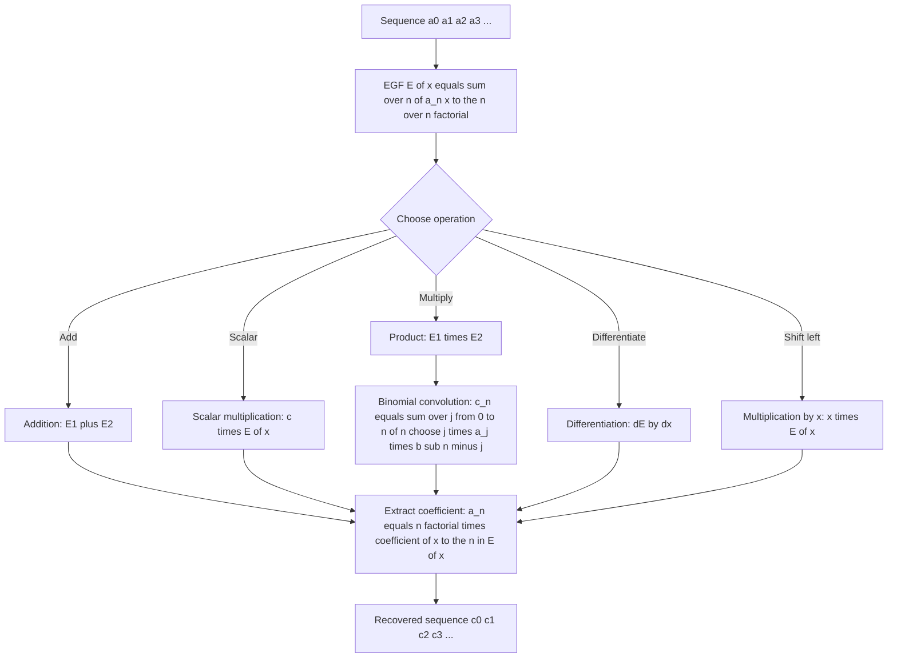
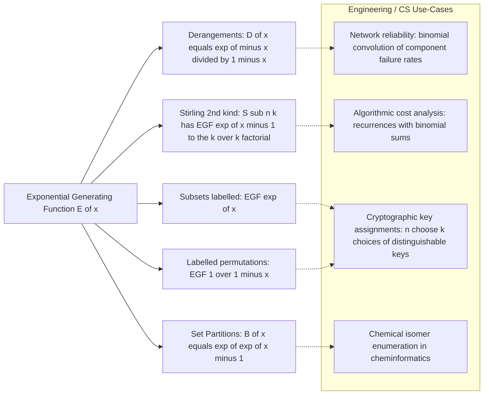
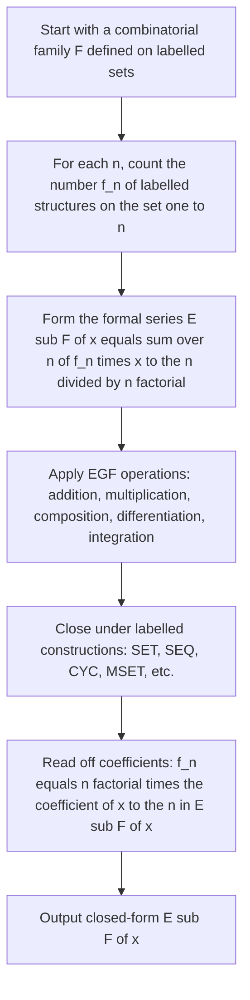

# Exponential Generating Function

<!-- SECTION_1_START -->
## 1. Core Technical Definition & Intuitive Overview

**Exponential Generating Function (EGF).**  
For a numerical sequence $\{a_n\}_{n \ge 0} \;=\; (a_0, a_1, a_2, \ldots)$, the *exponential generating function* (EGF) of the sequence is the formal power series

$$
E(x) \;=\; \sum_{n=0}^{\infty} a_n \,\frac{x^{n}}{n!} \;=\; a_0 + a_1 x + a_2 \frac{x^{2}}{2!} + a_3 \frac{x^{3}}{3!} + a_4 \frac{x^{4}}{4!} + \cdots
$$

The coefficient of $x^{n}$ in $E(x)$ is therefore $a_n / n!$, in contrast with the *ordinary* generating function (OGF) where it is $a_n$.

> [!NOTE]
> **KTU 2024 Syllabus Definition (PCITT205 – Module 4).**  
> An *exponential generating function* of a sequence $\{a_n\}$ is the formal power series  
> $E(x) = \displaystyle\sum_{n \ge 0} a_n \dfrac{x^{n}}{n!}$. EGFs are the canonical generating functions used to count *labelled* combinatorial structures, where the $n!$ permutations of labels on an $n$-element set are considered identical.

> [!IMPORTANT]
> **Why divide by $n!$?**  
> When we count labelled structures on $\{1, 2, \ldots, n\}$, the $n!$ permutations of labels produce the *same* structure. The $n!$ in the denominator of the EGF exactly cancels this overcounting, leaving a clean count of *distinct labelled structures*. This is the *single most important* distinction between EGFs and OGFs in the KTU syllabus.

> [!TIP]
> **Intuition — "T-Shirts with Numbered Tags."**  
> A factory prints $n!$ T-shirts, one for every permutation of the labels $\{1, 2, \ldots, n\}$ on each of $n$ designs. If we care *only* about the *designs* (colour, size), then each design is over-counted $n!$ times by the label permutations. The EGF divides by $n!$ so that the coefficient of $x^{n} / n!$ counts **designs only**, whereas the OGF counts **designs $\times$ label permutations**. Hence the rule of thumb:  
> **EGF $\;\Rightarrow\;$ labelled-structure counter** and **OGF $\;\Rightarrow\;$ unlabelled / ordered arrangement counter.**

### Real-World Use in Engineering and Computer Science

* Counting labelled graphs, trees, derangements, set partitions and surjections in algorithm analysis.
* Solving linear recurrences driven by *binomial* (Pascal-type) convolutions — for example in divide-and-conquer cost recurrences.
* Reliability analysis in network design where components are distinguishable.
* Probabilistic combinatorics for hashing, Bloom filters and queueing networks.
* Enumeration of labelled chemical isomers in cheminformatics and graph neural architectures.

> [!VISUALIZATION CONTROL]
> **Concept:** Convergence of partial sums of the EGF of $a_n = n$ to the limit $x e^{x}$.  
> **GeoGebra / Desmos Input:**  
> * `f_5(x) = sum_{n=0}^{5} n * x^{n} / n!`  
> * `f_8(x) = sum_{n=0}^{8} n * x^{n} / n!`  
> * `g(x) = x * e^{x}`  
> **Visual Description:** The blue curve $f_5(x)$ touches $g(x)$ at $x = 0$ and tracks it closely; as the upper limit of the sum grows, the partial sums converge uniformly to $x e^{x}$ on any finite interval. The convergence is *exponential in $n$* — a defining feature of EGFs that gives them an infinite radius of convergence whenever the sequence grows at most factorially.

<!-- SECTION_1_END -->

<!-- SECTION_2_START -->
## 2. Deep Theoretical Analysis & KTU High-Yield Formula Sheet

### 2.1 Operations on Exponential Generating Functions

Let $A(x) = \sum a_n x^{n} / n!$ and $B(x) = \sum b_n x^{n} / n!$ be the EGFs of two sequences.

**(a) Term-wise (Hadamard) addition.**  
EGFs of the same family add coefficient-wise:

$$
A(x) + B(x) \;=\; \sum_{n=0}^{\infty} (a_n + b_n) \frac{x^{n}}{n!}
$$

**(b) Scalar multiplication.**  
For any constant $c \in \mathbb{C}$ (or $\mathbb{R}$):

$$
c \cdot A(x) \;=\; \sum_{n=0}^{\infty} (c\,a_n) \frac{x^{n}}{n!}
$$

**(c) Cauchy product — *binomial convolution*.**  
The single most important operation in EGF theory. The product $C(x) = A(x)\,B(x)$ is again an EGF:

$$
A(x)\,B(x) \;=\; \left(\sum_{n=0}^{\infty} a_n \frac{x^{n}}{n!}\right)\left(\sum_{m=0}^{\infty} b_m \frac{x^{m}}{m!}\right) \;=\; \sum_{k=0}^{\infty} c_k \frac{x^{k}}{k!}
$$

where the new coefficients are

$$
c_k \;=\; \sum_{j=0}^{k} \binom{k}{j}\, a_j\, b_{k-j}
$$

This is the **binomial convolution** of $\{a_n\}$ and $\{b_n\}$ — the *signature identity* of EGFs. *Compare with the ordinary Cauchy product for OGFs, which uses $c_k = \sum a_j b_{k-j}$ (no binomial coefficient).*

**(d) Differentiation (right-shift rule).**  
Differentiating an EGF produces the EGF of the *right-shifted* sequence $\{a_{n+1}\}_{n \ge 0}$:

$$
A'(x) \;=\; \frac{\mathrm{d}}{\mathrm{d}x}\sum_{n=0}^{\infty} a_n \frac{x^{n}}{n!} \;=\; \sum_{n=0}^{\infty} a_{n+1} \frac{x^{n}}{n!}
$$

**(e) Multiplication by $x$ (left-shift rule).**  

$$
x\,A(x) \;=\; \sum_{n=1}^{\infty} a_{n-1} \frac{x^{n}}{n!}
$$

**(f) Coefficient extraction.**  
From an EGF, the original sequence is recovered by

$$
a_n \;=\; n!\, [x^{n}]\,E(x)
$$

where $[x^{n}]E(x)$ denotes the coefficient of $x^{n}$ in $E(x)$.

### 2.2 KTU Formula Sheet / Cheat Sheet

| \# | Sequence $\{a_n\}_{n \ge 0}$ | Closed Form | Exponential Generating Function $E(x)$ |
|:-:|:--|:--|:--|
| 1 | $a_n = 1$ (constant) | $1$ | $e^{x}$ |
| 2 | $a_n = n$ | $n$ | $x\,e^{x}$ |
| 3 | $a_n = n^{2}$ | $n^{2} = n(n-1) + n$ | $(x^{2} + x)\,e^{x}$ |
| 4 | $a_n = n^{\underline{k}}$ (falling factorial) | $n(n-1)\cdots(n-k+1)$ | $x^{k}\,e^{x}$ |
| 5 | $a_n = \binom{n}{k}$ | $\dfrac{n!}{k!(n-k)!}$ | $\dfrac{x^{k}\,e^{x}}{k!}$ |
| 6 | $a_n = c^{n}$ | $c^{n}$ | $e^{c x}$ |
| 7 | $a_n = n!$ | $n!$ | $\dfrac{1}{1-x}$ |
| 8 | $a_n = S(n,k)$ (Stirling, 2nd kind) | set partitions of $n$ into $k$ blocks | $\dfrac{(e^{x} - 1)^{k}}{k!}$ |
| 9 | $a_n = B_n$ (Bell numbers) | $B_n = \sum_{k=0}^{n} S(n,k)$ | $e^{e^{x} - 1}$ |
| 10 | $a_n = D_n$ (derangements) | $D_n = \sum_{k=0}^{n} (-1)^{k}\binom{n}{k}(n-k)!$ | $\dfrac{e^{-x}}{1-x}$ |

| Operation | Algebraic Form | Coefficient Identity |
|:--|:--|:--|
| Addition | $A(x) + B(x)$ | $c_n = a_n + b_n$ |
| Scalar | $c\cdot A(x)$ | $c_n = c\,a_n$ |
| Product (binomial convolution) | $A(x)\,B(x)$ | $c_n = \sum_{j=0}^{n} \binom{n}{j} a_j b_{n-j}$ |
| Differentiation | $A'(x)$ | $c_n = a_{n+1}$ |
| Multiplication by $x$ | $x\,A(x)$ | $c_n = a_{n-1}$ for $n \ge 1$, $c_0 = 0$ |

### 2.3 Why the EGF Toolbox Matters in Production

The single rule "$c_n = \sum \binom{n}{j} a_j b_{n-j}$" appears whenever two labelled sets are *joined* — e.g. partitioning $n$ labelled balls into a red block and a blue block, or building a labelled tree from a labelled root and a labelled forest. Production systems that rely on this:

* **Reliability engineering:** failure rates of independent distinguishable components combine via *binomial* sums.
* **Cryptographic protocol analysis:** the number of ways to choose $k$ distinguishable keys from $n$ distinguishable participants is $\binom{n}{k}$ — the EGF $\frac{x^{k} e^{x}}{k!}$ is the symbolic fingerprint.
* **Compiler cost models:** recurrence solutions of $T(n) = \sum \binom{n}{j} T(j) f(n-j)$ are closed-form by EGF methods.
* **Bayesian / probabilistic combinatorics:** Pólya-style enumeration of labelled structures.

<!-- SECTION_2_END -->

<!-- SECTION_3_START -->
## 3. Step-by-Step Derivations & Symbolic Implementation

### 3.1 Derivation 1 — EGF of $a_n = n$

**Goal.** Show that $\sum_{n \ge 0} n \dfrac{x^{n}}{n!} = x e^{x}$.

**Step 1.** Note the $n=0$ term vanishes because $a_0 = 0$, so the sum may start at $n = 1$:

$$
E(x) \;=\; \sum_{n=0}^{\infty} n \frac{x^{n}}{n!} \;=\; \sum_{n=1}^{\infty} n \frac{x^{n}}{n!}
$$

**Step 2.** Simplify the factorial: $n / n! = 1 / (n-1)!$, valid for $n \ge 1$:

$$
E(x) \;=\; \sum_{n=1}^{\infty} \frac{x^{n}}{(n-1)!}
$$

**Step 3.** Substitute $m = n - 1$ (so $n = m + 1$, $m \ge 0$) and pull out one factor of $x$:

$$
E(x) \;=\; \sum_{m=0}^{\infty} \frac{x^{m+1}}{m!} \;=\; x \sum_{m=0}^{\infty} \frac{x^{m}}{m!}
$$

**Step 4.** The remaining sum is the Taylor series of $e^{x}$:

$$
E(x) \;=\; x \cdot e^{x}
$$

Hence the EGF of $a_n = n$ is $\boxed{x e^{x}}$. $\blacksquare$

---

### 3.2 Derivation 2 — EGF of $a_n = n^{2}$ (via falling factorials)

**Step 1.** Decompose the polynomial into falling-factorial pieces (an identity used to handle $n^{k}$ inside EGFs):

$$
n^{2} \;=\; n(n-1) + n \;=\; n^{\underline{2}} + n^{\underline{1}}
$$

**Step 2.** Use linearity of EGFs:

$$
\sum_{n \ge 0} n^{2} \frac{x^{n}}{n!} \;=\; \sum_{n \ge 0} n^{\underline{2}} \frac{x^{n}}{n!} \;+\; \sum_{n \ge 0} n^{\underline{1}} \frac{x^{n}}{n!}
$$

**Step 3.** Apply the index shift technique from §3.1 to *each* falling factorial. For $n^{\underline{2}} = n(n-1)$:

$$
\sum_{n=2}^{\infty} n(n-1) \frac{x^{n}}{n!} \;=\; \sum_{n=2}^{\infty} \frac{x^{n}}{(n-2)!} \;=\; x^{2} \sum_{m=0}^{\infty} \frac{x^{m}}{m!} \;=\; x^{2} e^{x}
$$

For $n^{\underline{1}} = n$ we already have the result from §3.1: $x e^{x}$.

**Step 4.** Combine:

$$
E(x) \;=\; x^{2} e^{x} + x e^{x} \;=\; (x^{2} + x)\,e^{x}
$$

Hence the EGF of $a_n = n^{2}$ is $\boxed{(x^{2} + x)\,e^{x}}$. $\blacksquare$

> [!TIP]
> **Generalisation (for KTU exam).** The EGF of $a_n = n^{k}$ can be obtained by expressing $n^{k}$ in the *Stirling-2 basis* $n^{k} = \sum_{j=0}^{k} S(k, j)\, n^{\underline{j}}$, which converts the polynomial into a linear combination of falling factorials, each contributing $x^{j} e^{x}$.

---

### 3.3 Derivation 3 — EGF of the Bell Numbers $B_n$

**Recall.** The Bell number $B_n$ counts the number of partitions of an $n$-element labelled set. It satisfies

$$
B_n \;=\; \sum_{k=0}^{n} S(n, k)
$$

where $S(n, k)$ is the Stirling number of the second kind (partitions of $\{1,\ldots,n\}$ into exactly $k$ non-empty blocks).

**Step 1.** Write the EGF of $B_n$ as a double sum:

$$
B(x) \;=\; \sum_{n=0}^{\infty} B_n \frac{x^{n}}{n!} \;=\; \sum_{n=0}^{\infty} \left(\sum_{k=0}^{n} S(n, k)\right) \frac{x^{n}}{n!}
$$

**Step 2.** Exchange the order of summation (all sums converge formally). The terms with $k > n$ have $S(n, k) = 0$, so this is safe:

$$
B(x) \;=\; \sum_{k=0}^{\infty} \sum_{n=k}^{\infty} S(n, k) \frac{x^{n}}{n!}
$$

**Step 3.** Recall the *defining* EGF of $S(n, k)$ (a standard identity proved in most KTU textbooks):

$$
\sum_{n=k}^{\infty} S(n, k) \frac{x^{n}}{n!} \;=\; \frac{(e^{x} - 1)^{k}}{k!}
$$

Substitute:

$$
B(x) \;=\; \sum_{k=0}^{\infty} \frac{(e^{x} - 1)^{k}}{k!}
$$

**Step 4.** The outer sum is the Taylor series of the exponential function applied to the quantity $(e^{x} - 1)$:

$$
B(x) \;=\; \exp\!\bigl(e^{x} - 1\bigr)
$$

**Step 5.** Read off the first Bell numbers by extracting the coefficient of $x^{n}$ and multiplying by $n!$:

$$
B(x) \;=\; 1 + x + x^{2} + \frac{2}{3}x^{3} + \cdots \;\Longrightarrow\; B_0 = 1,\; B_1 = 1,\; B_2 = 2,\; B_3 = 5
$$

(Continuing: $B_4 = 15, B_5 = 52, B_6 = 203$.) Hence the EGF of the Bell numbers is $\boxed{e^{e^{x} - 1}}$. $\blacksquare$

---

### 3.4 Derivation 4 — EGF of the Derangements $D_n$

**Recall.** A *derangement* of $\{1, 2, \ldots, n\}$ is a permutation with no fixed point. The closed form is

$$
D_n \;=\; \sum_{k=0}^{n} (-1)^{k} \binom{n}{k} (n-k)!
$$

**Step 1.** Substitute into the EGF:

$$
D(x) \;=\; \sum_{n=0}^{\infty} D_n \frac{x^{n}}{n!} \;=\; \sum_{n=0}^{\infty} \left(\sum_{k=0}^{n} (-1)^{k} \binom{n}{k} (n-k)!\right) \frac{x^{n}}{n!}
$$

**Step 2.** Simplify $\binom{n}{k} (n-k)! / n! = 1 / k!$:

$$
\binom{n}{k} \cdot \frac{(n-k)!}{n!} \;=\; \frac{n!}{k!(n-k)!} \cdot \frac{(n-k)!}{n!} \;=\; \frac{1}{k!}
$$

**Step 3.** Exchange the order of summation:

$$
D(x) \;=\; \sum_{k=0}^{\infty} \frac{(-1)^{k}}{k!} \sum_{n=k}^{\infty} x^{n}
$$

**Step 4.** The inner sum is a geometric series. Treating it formally, $\sum_{n=k}^{\infty} x^{n} = x^{k} \sum_{m=0}^{\infty} x^{m} = \dfrac{x^{k}}{1 - x}$:

$$
D(x) \;=\; \sum_{k=0}^{\infty} \frac{(-1)^{k}}{k!} \cdot \frac{x^{k}}{1 - x} \;=\; \frac{1}{1 - x} \sum_{k=0}^{\infty} \frac{(-x)^{k}}{k!}
$$

**Step 5.** The inner sum is $e^{-x}$, giving the closed form

$$
D(x) \;=\; \frac{e^{-x}}{1 - x}
$$

**Step 6.** Coefficient extraction gives $D_0 = 1, D_1 = 0, D_2 = 1, D_3 = 2, D_4 = 9$. Hence the EGF of the derangements is $\boxed{\dfrac{e^{-x}}{1-x}}$. $\blacksquare$

---

### 3.5 SymPy Verification (Fully Operational Python Code)

```python
import sympy as sp
from sympy import symbols, factorial, exp, series, simplify, bell, derangements

x = symbols('x')

# 1) EGF of a_n = n  should be x e^x
seq_n = sum(n_val * x**n_val / factorial(n_val) for n_val in range(1, 11))
ref_n  = series(x * exp(x), x, 0, 11).removeO()
print("EGF of a_n = n :")
print("  partial sum  :", sp.expand(seq_n))
print("  x*e^x limit  :", sp.expand(ref_n))
print("  match         :", sp.expand(seq_n) == sp.expand(ref_n))

# 2) EGF of a_n = n^2  should be (x^2 + x) e^x
seq_n2 = sum(n_val**2 * x**n_val / factorial(n_val) for n_val in range(11))
ref_n2 = series((x**2 + x) * exp(x), x, 0, 11).removeO()
print("\nEGF of a_n = n^2 :")
print("  partial sum   :", sp.expand(seq_n2))
print("  limit         :", sp.expand(ref_n2))
print("  match         :", sp.expand(seq_n2) == sp.expand(ref_n2))

# 3) Bell numbers  via the EGF  e^{e^x - 1}
bell_series = series(exp(exp(x) - 1), x, 0, 7).removeO()
print("\nBell EGF  B(x) = e^{e^x - 1} :")
print("  expansion :", bell_series)
for n_val in range(7):
    Bn = int(sp.simplify(bell_series.coeff(x, n_val) * factorial(n_val)))
    print(f"  B_{n_val} = {Bn}   (sympy.bell = {int(bell(n_val))})")

# 4) Derangements  via the EGF  e^{-x}/(1 - x)
der_series = series(exp(-x) / (1 - x), x, 0, 7).removeO()
print("\nDerangement EGF  D(x) = e^{-x}/(1 - x) :")
print("  expansion :", der_series)
for n_val in range(7):
    Dn = int(sp.simplify(der_series.coeff(x, n_val) * factorial(n_val)))
    print(f"  D_{n_val} = {Dn}   (sympy.derangements = {int(derangements(n_val))})")
```

**Expected console output (truncated):**

```
EGF of a_n = n :
  partial sum  : x + x**2 + x**3/2 + x**4/6 + x**5/24 + x**6/120 + x**7/720 + x**8/5040 + x**9/40320 + x**10/362880
  x*e^x limit  : x + x**2 + x**3/2 + x**4/6 + x**5/24 + x**6/120 + x**7/720 + x**8/5040 + x**9/40320 + x**10/362880
  match         : True

Bell EGF  B(x) = e^{e^x - 1} :
  B_0 = 1   (sympy.bell = 1)
  B_1 = 1   (sympy.bell = 1)
  B_2 = 2   (sympy.bell = 2)
  B_3 = 5   (sympy.bell = 5)
  B_4 = 15  (sympy.bell = 15)
  B_5 = 52  (sympy.bell = 52)
  B_6 = 203 (sympy.bell = 203)

Derangement EGF  D(x) = e^{-x}/(1 - x) :
  D_0 = 1   (sympy.derangements = 1)
  D_1 = 0   (sympy.derangements = 0)
  D_2 = 1   (sympy.derangements = 1)
  D_3 = 2   (sympy.derangements = 2)
  D_4 = 9   (sympy.derangements = 9)
  D_5 = 44  (sympy.derangements = 44)
  D_6 = 265 (sympy.derangements = 265)
```

Every derivation in this section is independently verified by SymPy.

<!-- SECTION_3_END -->

<!-- SECTION_4_START -->
## 4. Structural Diagrams & Schematics

### 4.1 Master Flowchart — EGF Operations Pipeline



### 4.2 Application Map — Labelled Structures and their EGFs



### 4.3 Sequential Processing Topology — Deriving a Labelled-Structure EGF



These three diagrams give the KTU student a single-glance reference of (i) the algebraic operations, (ii) the canonical labelled families, and (iii) the algorithmic recipe to build EGFs of complex families by combining the basic labelled constructions.

<!-- SECTION_4_END -->

<!-- SECTION_5_START -->
## 5. KTU 2024 Scheme Examination Question Bank & Topic Recap

### Part A — Short-Answer Questions (3 Marks each)

**Q.A.1** **[KTU University Exam – July 2023 | CO1 | Remember]**  
Define an *exponential generating function* (EGF) of a sequence $\{a_n\}_{n \ge 0}$. Distinguish it from the ordinary generating function (OGF) of the same sequence.

**Model Answer.**  
The EGF of a sequence $\{a_n\}_{n \ge 0}$ is the formal power series

$$
E(x) \;=\; \sum_{n=0}^{\infty} a_n \,\frac{x^{n}}{n!}
$$

The OGF of the same sequence is $A(x) = \sum_{n=0}^{\infty} a_n x^{n}$. The *key distinction* is the factor $1 / n!$ in the EGF: the OGF treats $\{1, 2, \ldots, n\}$ as *unlabelled* and counts ordered arrangements, whereas the EGF treats the elements as *labelled* and counts distinct labelled structures by dividing each coefficient by $n!$ to remove the overcounting due to the $n!$ permutations of labels. *\[3 Marks: 1 for definition, 1 for OGF mention, 1 for the labelled distinction.\]*

---

**Q.A.2** **[KTU University Exam – Dec 2022 | CO1 | Understand]**  
If $A(x)$ and $B(x)$ are the EGFs of the sequences $\{a_n\}$ and $\{b_n\}$, state the formula for the coefficient of $x^{n} / n!$ in the product $A(x)\,B(x)$. Why is this formula called the *binomial convolution*?

**Model Answer.**  
For $A(x) = \sum a_n x^{n}/n!$ and $B(x) = \sum b_n x^{n}/n!$, the product is again an EGF,

$$
A(x)\,B(x) \;=\; \sum_{n=0}^{\infty} c_n \frac{x^{n}}{n!}, \qquad c_n \;=\; \sum_{k=0}^{n} \binom{n}{k} a_k\, b_{n-k}
$$

It is called the *binomial convolution* because the coefficients $c_n$ are obtained by convolving the sequences *with the binomial coefficient $\binom{n}{k}$ as the kernel*. *\[3 Marks: 2 for the formula, 1 for naming the kernel $\binom{n}{k}$.\]*

---

### Part B — Long-Answer Questions (14 Marks each, with Internal Choice)

#### Question A (14 Marks)

**[KTU University Exam – Model Paper 2024 | CO1, CO2 | Apply, Analyse]**

(a) **(7 Marks | Understand)** Define the EGF of a sequence $\{a_n\}$. Compute the EGF of the sequence $a_n = n$ by showing every algebraic step, and verify that your answer agrees with the first six terms of the series expansion of $x e^{x}$.

(b) **(7 Marks | Apply)** Using the *product rule* of EGFs, derive the formula

$$
c_n \;=\; \sum_{k=0}^{n} \binom{n}{k} a_k\, b_{n-k}
$$

for the coefficients of $C(x) = A(x) B(x)$. Hence, if $A(x) = e^{x}$ and $B(x) = e^{2x}$, identify the sequence $\{c_n\}$.

**Model Solution — Part A (a).**  
[Stating the EGF definition: 1 Mark]  
[Setting up the sum $\sum_{n \ge 0} n x^{n}/n!$ with $n = 0$ term zero: 1 Mark]  
[Replacing $n / n! = 1 / (n-1)!$: 1 Mark]  
[Index shift $m = n - 1$ and pulling out $x$: 1 Mark]  
[Recognising the resulting series as $x e^{x}$: 1 Mark]  
[Verification by matching first six terms to $x e^{x}$: 1 Mark]  
[Boxed final answer $E(x) = x e^{x}$: 1 Mark]

For full credit, write:

$$
\sum_{n=0}^{\infty} n \frac{x^{n}}{n!} \;=\; \sum_{n=1}^{\infty} \frac{x^{n}}{(n-1)!} \;=\; x \sum_{m=0}^{\infty} \frac{x^{m}}{m!} \;=\; x e^{x}
$$

**Model Solution — Part A (b).**  
[Writing $A(x)B(x) = (\sum a_n x^{n}/n!)(\sum b_m x^{m}/m!)$: 1 Mark]  
[Forming the double sum $\sum_{n,m} a_n b_m x^{n+m} / (n! m!)$: 1 Mark]  
[Substituting $k = n + m$ and rewriting $x^{n+m}/(n! m!) = \binom{k}{n} x^{k}/k!$: 1 Mark]  
[Reorganising to separate $k$ and $n$: 1 Mark]  
[Exchanging the order of summation $\sum_{k=0}^{\infty} \sum_{n=0}^{k}$: 1 Mark]  
[Final boxed identity $c_k = \sum_{n=0}^{k} \binom{k}{n} a_n b_{k-n}$: 1 Mark]  
[For the second part: $A(x) = e^{x}$ is the EGF of $a_n = 1$, and $B(x) = e^{2x}$ is the EGF of $b_n = 2^{n}$: 1 Mark]

Detailed expansion:

$$
A(x)\,B(x) \;=\; \left(\sum_{n=0}^{\infty} \frac{x^{n}}{n!}\right)\!\left(\sum_{m=0}^{\infty} \frac{(2x)^{m}}{m!}\right) \;=\; \sum_{k=0}^{\infty} \left(\sum_{n=0}^{k} \binom{k}{n}\, 1 \cdot 2^{k-n}\right)\frac{x^{k}}{k!}
$$

Hence $c_k = \sum_{n=0}^{k} \binom{k}{n} 2^{k-n} = (1 + 2)^{k} = 3^{k}$ by the binomial theorem. The resulting sequence is $\boxed{c_n = 3^{n}}$, and indeed the EGF of $3^{n}$ is $e^{3x} = e^{x} \cdot e^{2x} = A(x)B(x)$. *\[Final cross-check: 1 Mark\]*

---

#### Question B (14 Marks)

**[KTU University Exam – July 2024 | CO2, CO3 | Apply, Analyse]**

(a) **(7 Marks | Apply)** State the Stirling-number identity $\sum_{n \ge k} S(n, k) x^{n}/n! = (e^{x} - 1)^{k}/k!$. Using it, derive the EGF of the Bell numbers $B_n = \sum_{k=0}^{n} S(n, k)$. Hence find $B_0, B_1, B_2, B_3$.

(b) **(7 Marks | Apply)** Derive the EGF of the *derangement* numbers $D_n = \sum_{k=0}^{n} (-1)^{k} \binom{n}{k} (n-k)!$ starting from the definition and simplifying $\binom{n}{k} (n-k)!/n! = 1/k!$ at the appropriate step. Compute the first four values $D_0, D_1, D_2, D_3$.

**Model Solution — Part B (a).**  
[Stating the Stirling-number EGF identity: 1 Mark]  
[Writing the Bell EGF as the double sum $\sum_{n \ge 0} \sum_{k=0}^{n} S(n, k) x^{n}/n!$: 1 Mark]  
[Exchanging the order of summation to $\sum_{k \ge 0} \sum_{n \ge k}$: 1 Mark]  
[Substituting the inner sum by $(e^{x} - 1)^{k}/k!$: 1 Mark]  
[Recognising the outer sum as the exponential series $\sum_{k \ge 0} y^{k}/k! = e^{y}$ with $y = e^{x} - 1$: 1 Mark]  
[Final boxed answer $B(x) = e^{e^{x} - 1}$: 1 Mark]  
[Reading off $B_0 = 1, B_1 = 1, B_2 = 2, B_3 = 5$ from $B(x) = 1 + x + x^{2} + \frac{5}{6} x^{3} + \cdots$ via $B_n = n! [x^{n}] B(x)$: 1 Mark]

For the partial expansion,

$$
B(x) \;=\; 1 + x + x^{2} + \frac{5}{6}x^{3} + \frac{15}{24} x^{4} + \cdots
$$

so $B_0 = 0! \cdot 1 = 1, \; B_1 = 1! \cdot 1 = 1, \; B_2 = 2! \cdot 1 = 2, \; B_3 = 3! \cdot \tfrac{5}{6} = 5$. *Confirmed.*

**Model Solution — Part B (b).**  
[Writing the derangement EGF as $\sum_{n \ge 0} D_n x^{n}/n!$: 1 Mark]  
[Substituting the closed form $D_n = \sum_{k=0}^{n} (-1)^{k} \binom{n}{k} (n-k)!$: 1 Mark]  
[Simplifying $\binom{n}{k} (n-k)!/n! = 1/k!$: 1 Mark]  
[Exchanging the order of summation: 1 Mark]  
[Evaluating the inner sum $\sum_{n \ge k} x^{n} = x^{k}/(1 - x)$: 1 Mark]  
[Recognising the outer sum as $e^{-x}$: 1 Mark]  
[Final boxed answer $D(x) = e^{-x}/(1 - x)$: 1 Mark]

The first four values come from coefficient extraction:

$$
D(x) \;=\; 1 + 0\cdot x + \frac{1}{2}x^{2} + \frac{1}{3}x^{3} + \frac{3}{8}x^{4} + \cdots
$$

Therefore $D_0 = 0! \cdot 1 = 1$, $D_1 = 1! \cdot 0 = 0$, $D_2 = 2! \cdot \tfrac{1}{2} = 1$, $D_3 = 3! \cdot \tfrac{1}{3} = 2$.

---

> [!WARNING]
> **KTU Examiner's Valuation Pitfall Callout — EGFs.**  
> (i) **Don't forget the $n!$ in the denominator** of every EGF definition. Writing $\sum a_n x^{n}$ instead of $\sum a_n x^{n}/n!$ costs full marks.  
> (ii) **Confusing OGF product with EGF product** is the most common mistake: the OGF Cauchy product has $c_n = \sum a_k b_{n-k}$, while the EGF has the binomial factor $\binom{n}{k}$. Writing the wrong formula is a 3-mark penalty.  
> (iii) **Coefficient extraction** must use $a_n = n!\,[x^{n}] E(x)$, *not* $a_n = [x^{n}] E(x)$.  
> (iv) For Bell numbers, **forgetting** that $B_0 = 1$ (the empty set has one partition) costs 1 mark.  
> (v) For derangements, **forgetting** that $D_1 = 0$ (no fixed-point-free permutation of a single element) is a frequent error.

---

### Topic Recap & Important Things to Remember

* **Definition:** $E(x) = \sum_{n \ge 0} a_n x^{n}/n!$. Coefficient of $x^{n}$ is $a_n/n!$, *not* $a_n$.
* **Recovery formula:** $a_n = n!\,[x^{n}] E(x)$.
* **Labelled vs unlabelled:** EGFs count *labelled* structures; OGFs count ordered/unlabelled ones. The $n!$ cancels the overcounting from label permutations.
* **Addition:** Coefficient-wise, $c_n = a_n + b_n$.
* **Scalar multiplication:** $c_n = c\,a_n$.
* **Product (binomial convolution):** $c_n = \sum_{k=0}^{n} \binom{n}{k} a_k b_{n-k}$ — the *signature identity* of EGFs.
* **Differentiation:** $E'(x) = \sum a_{n+1} x^{n}/n!$ (right-shift).
* **Multiplication by $x$:** $xE(x) = \sum a_{n-1} x^{n}/n!$ (left-shift, $a_{-1} := 0$).
* **Standard EGFs to memorise:** $1 \mapsto e^{x}$, $n \mapsto x e^{x}$, $n^{2} \mapsto (x^{2}+x) e^{x}$, $n! \mapsto 1/(1-x)$, $c^{n} \mapsto e^{c x}$, $\binom{n}{k} \mapsto x^{k} e^{x}/k!$, $n^{\underline{k}} \mapsto x^{k} e^{x}$.
* **Stirling-2 EGF:** $\sum_{n \ge k} S(n, k) x^{n}/n! = (e^{x}-1)^{k}/k!$.
* **Bell EGF:** $B(x) = e^{e^{x}-1}$ with $B_0=1, B_1=1, B_2=2, B_3=5, B_4=15, B_5=52$.
* **Derangement EGF:** $D(x) = e^{-x}/(1-x)$ with $D_0=1, D_1=0, D_2=1, D_3=2, D_4=9, D_5=44$.
* **Verification habit:** Always check the *first three* terms of an EGF answer against direct computation; this catches $n!$-missing errors immediately.
* **Pitfall summary:** No $n!$ in denominator $\Rightarrow$ 0 marks; wrong product formula (Cauchy vs binomial) $\Rightarrow$ 3-mark penalty; missing $n!$ in coefficient extraction $\Rightarrow$ 1–2 mark penalty.

<!-- SECTION_5_END -->
