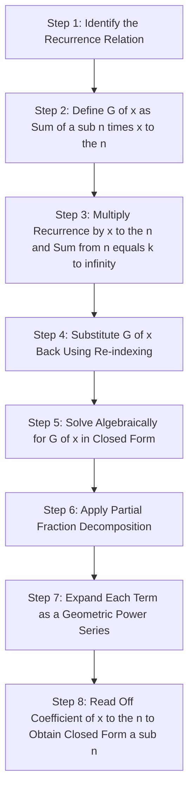
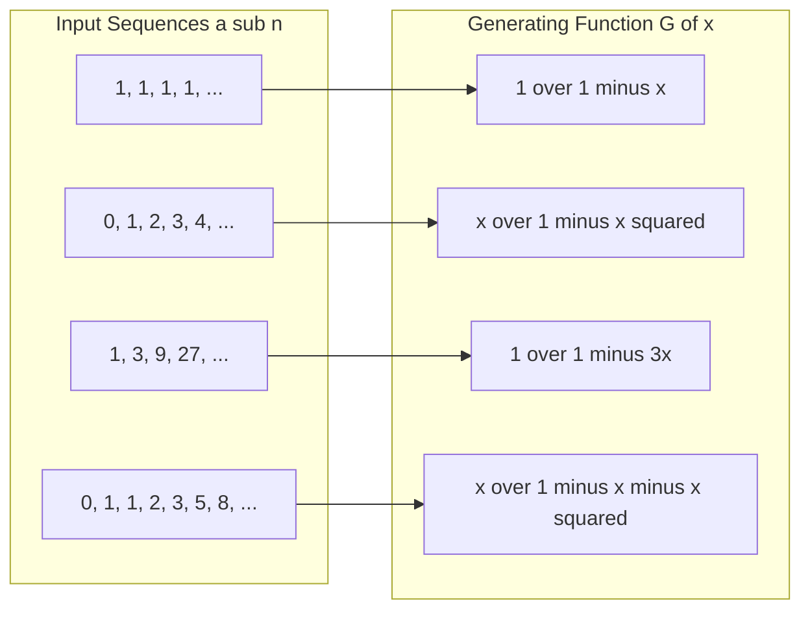
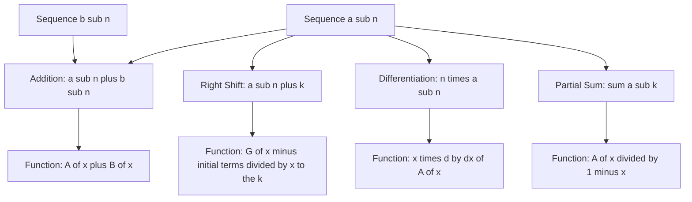

# Generating Function: Definitions and Examples

<!-- SECTION_1_START -->

# Generating Functions: Definitions \& Examples

## 1.1 Formal Definition (KTU 2024 Syllabus Terminology)

> [!IMPORTANT]
> **Definition (Ordinary Generating Function — OGF):**
> Let $\{a_n\}_{n \geq 0} = (a_0, a_1, a_2, a_3, \ldots)$ be an infinite sequence of real (or complex) numbers. The **ordinary generating function** $G(x)$ of the sequence is the formal power series
>
> $$G(x) = \sum_{n=0}^{\infty} a_n x^n = a_0 + a_1 x + a_2 x^2 + a_3 x^3 + \cdots$$
>
> where $x$ is treated as a **formal indeterminate** (an algebraic symbol, not necessarily a number).

The phrase *"formal"* means we may perform algebraic operations on the series (addition, multiplication, differentiation) **without worrying** about whether the series converges for a specific value of $x$. Convergence is a separate, deeper topic.

> [!NOTE]
> **Convergence Domain (for context):** When the radius of convergence matters, the series converges absolutely for $\vert x \vert < R$, where $R = 1 / \limsup_{n \to \infty} \vert a_n \vert^{1/n}$. For the sequences in this module, the radius is almost always **at least** $1$.

## 1.2 Conceptual Analogy — The "Clothesline" View

Imagine a clothesline stretching to infinity, with pegs labelled $0, 1, 2, 3, \ldots$ Hanging on the $n$-th peg is the term $a_n$ of your sequence. A generating function is simply a **compact algebraic code** that "snaps the entire clothesline into a single closed-form expression."

**Geometric Intuition:** Every sequence is uniquely mapped to a closed-form rational function (when the recurrence has constant coefficients). Algebraic manipulations on the rational function correspond to combinatorial operations on the sequence. Two famous examples:

- The constant sequence $(1, 1, 1, 1, \ldots)$ maps to the unit geometric series $\dfrac{1}{1-x}$.
- The Fibonacci sequence $(0, 1, 1, 2, 3, 5, 8, \ldots)$ maps to the elegant rational function $\dfrac{x}{1 - x - x^2}$.

The mapping is **bijective**: a generating function uniquely determines its sequence, and vice versa.

> [!TIP]
> **Engineering Viewpoint:** Generating functions convert *recurrences* (discrete, hard) into *rational equations* (continuous, easy). They are the discrete analog of the **Laplace transform** in engineering and the **z-transform** in digital signal processing.

## 1.3 GeoGebra Visualization

> [!VISUALIZATION CONTROL]
> **Concept:** Partial-sum approximation of $\frac{1}{1-x}$ and its derivative $\frac{1}{(1-x)^2}$, demonstrating how a sequence lives inside a closed-form function.
> **GeoGebra / Desmos Input Equations:**
> * $f_5(x) = 1 + x + x^2 + x^3 + x^4 + x^5$
> * $f_{10}(x) = \sum_{n=0}^{10} x^n$
> * $g(x) = \dfrac{1}{1 - x}$
> * $h(x) = \dfrac{1}{(1 - x)^2}$
> * $h_5(x) = 1 + 2x + 3x^2 + 4x^3 + 5x^4 + 6x^5$
> **Visual Description:** Plot all five curves on the interval $-0.9 \leq x \leq 0.9$. You will observe $f_{10}(x)$ nearly indistinguishable from $g(x)$, and the coefficients $\{1, 2, 3, 4, 5, 6\}$ climbing linearly on the $y$-axis as the slope of $h(x)$ at $x=0$.

---

<!-- SECTION_1_END -->

<!-- SECTION_2_START -->

# Deep Theoretical Analysis \& KTU High-Yield Formula Sheet

## 2.1 The Core Philosophy

A generating function is a **sequence-to-function translator**. Three principles govern the entire theory:

1. **Encoding:** Every sequence $\to$ one and only one generating function.
2. **Translation:** Operations on sequences (shift, convolution, partial sums) become clean operations on the corresponding function (multiplication by $x$, Cauchy product, division by $(1-x)$).
3. **Decoding:** A closed-form expression for $G(x)$ can be expanded back into its coefficient sequence $a_n$ via Taylor expansion or partial-fraction decomposition.

## 2.2 Operations on Generating Functions (The Algebraic Toolkit)

Let $A(x) = \sum a_n x^n$ and $B(x) = \sum b_n x^n$.

| Operation | Resulting Function | Resulting Sequence |
|---|---|---|
| **Addition** | $A(x) + B(x)$ | $(a_n + b_n)$ |
| **Scalar Multiple** | $c \cdot A(x)$ | $(c \cdot a_n)$ |
| **Right Shift** (drop first $k$ terms) | $\dfrac{A(x) - a_0 - a_1 x - \cdots - a_{k-1} x^{k-1}}{x^k}$ | $(a_{n+k})$ for $n \geq 0$ |
| **Left Shift** (multiply by $x^k$) | $x^k A(x)$ | $(a_{n-k})$ with $a_j = 0$ for $j < 0$ |
| **Cauchy Product** | $A(x) \cdot B(x)$ | $c_n = \sum_{k=0}^{n} a_k \, b_{n-k}$ |
| **Differentiation** | $A'(x)$ | $((n+1) \, a_{n+1})$ |
| **Partial Sums** | $\dfrac{A(x)}{1-x}$ | $\left(\sum_{k=0}^{n} a_k\right)$ |
| **Index Multiplication** | $x A'(x)$ | $(n \, a_n)$ |

> [!NOTE]
> The **Cauchy Product** $c_n = \sum_{k=0}^{n} a_k b_{n-k}$ is the discrete convolution of two sequences. It underlies the combinatorial meaning of multiplying two generating functions (e.g., ways to choose two items summing to $n$).

## 2.3 KTU Formula Sheet — Master Table of Common Generating Functions

| Sequence $\{a_n\}$ | Closed Form $A(x)$ | Convergence $\vert x \vert$ |
|---|---|---|
| $a_n = 1$ (constant 1s) | $\dfrac{1}{1 - x}$ | $< 1$ |
| $a_n = c$ (constant) | $\dfrac{c}{1 - x}$ | $< 1$ |
| $a_n = n$ | $\dfrac{x}{(1 - x)^2}$ | $< 1$ |
| $a_n = n^2$ | $\dfrac{x(1 + x)}{(1 - x)^3}$ | $< 1$ |
| $a_n = n^3$ | $\dfrac{x(1 + 4x + x^2)}{(1 - x)^4}$ | $< 1$ |
| $a_n = c^n$ (geometric) | $\dfrac{1}{1 - c x}$ | $< 1 / \vert c \vert$ |
| $a_n = \binom{n + k - 1}{k - 1}$ | $\dfrac{1}{(1 - x)^k}$ | $< 1$ |
| $a_n = n \cdot c^{n-1}$ | $\dfrac{1}{(1 - c x)^2}$ | $< 1 / \vert c \vert$ |
| $a_n = \binom{n}{k}$ (fixed $k$) | $\dfrac{x^k}{(1 - x)^{k+1}}$ | $< 1$ |
| Fibonacci $F_n$ | $\dfrac{x}{1 - x - x^2}$ | $\approx 0.618$ |
| $a_n = 2^n + 3^n$ | $\dfrac{1}{1 - 2x} + \dfrac{1}{1 - 3x}$ | $< 1/3$ |

## 2.4 Why Generating Functions Matter in Engineering

- **Algorithm Analysis:** Derive exact closed forms for $\sum_{k=1}^{n} k^p$ and similar summations.
- **Combinatorial Enumeration:** Count labelled objects, partitions, and tree structures.
- **Digital Signal Processing:** The $z$-transform used in filter design is a direct cousin of the OGF.
- **Probability Theory:** Probability generating functions encode distributions of discrete random variables.
- **Compiler Design:** Counting parse trees, counting ways to parenthesize expressions.

> [!IMPORTANT]
> **Partial Fraction Decomposition Rule:** Any rational generating function of the form $\dfrac{P(x)}{Q(x)}$ with $\deg P < \deg Q$ can be uniquely decomposed into simple fractions $\sum \dfrac{A_i}{(1 - r_i x)^{m_i}}$ where $r_i$ are the roots of $Q(x)$. Each term expands to a power series whose coefficient is a polynomial in $n$ times $r_i^n$.

---

<!-- SECTION_2_END -->

<!-- SECTION_3_START -->

# Step-by-Step Derivations \& Code/Symbolic Implementation

## 3.1 Worked Derivation #1 — OGF for $a_n = 1$

**Goal:** Find $A(x)$ for the constant sequence $1, 1, 1, 1, \ldots$

By definition:
$$A(x) = \sum_{n=0}^{\infty} x^n$$

This is the classical **geometric series** with first term $1$ and common ratio $x$. For $\vert x \vert < 1$:

$$A(x) = \frac{1}{1 - x} \quad \text{(Standard identity)}$$

> [!NOTE]
> **Why this matters:** Almost every other generating function is built from this single identity by shifting, scaling, or differentiating.

## 3.2 Worked Derivation #2 — OGF for $a_n = 2^n$

**Goal:** Find $A(x)$ for the sequence $1, 2, 4, 8, 16, \ldots$

By definition:
$$A(x) = \sum_{n=0}^{\infty} 2^n x^n = \sum_{n=0}^{\infty} (2x)^n$$

Substituting $u = 2x$ in the geometric series identity, with $\vert 2x \vert < 1$:

$$A(x) = \frac{1}{1 - 2x}$$

**Verification by long division of $1 \div (1 - 2x)$:**

$$1 \div (1 - 2x) = 1 + 2x + 4x^2 + 8x^3 + \cdots \;\checkmark$$

## 3.3 Worked Derivation #3 — OGF for $a_n = n$ (Differentiation Trick)

**Goal:** Find $A(x)$ for the sequence $0, 1, 2, 3, 4, \ldots$

We know:
$$\frac{1}{1 - x} = \sum_{n=0}^{\infty} x^n$$

Differentiate **both sides** with respect to $x$ (term-by-term is valid inside the radius of convergence):

$$\frac{d}{dx}\left[\frac{1}{1 - x}\right] = \frac{d}{dx}\left[\sum_{n=0}^{\infty} x^n\right]$$

$$\frac{1}{(1 - x)^2} = \sum_{n=1}^{\infty} n \, x^{n-1}$$

Now multiply both sides by $x$:

$$\frac{x}{(1 - x)^2} = \sum_{n=1}^{\infty} n \, x^n = 0 + 1 \cdot x + 2 x^2 + 3 x^3 + \cdots$$

$$\boxed{\,A(x) = \frac{x}{(1 - x)^2}\,}$$

## 3.4 Worked Derivation #4 — OGF for $a_n = n^2$

**Goal:** Find $A(x)$ for the sequence $0, 1, 4, 9, 16, 25, \ldots$

From Section 3.3 we have:
$$\frac{x}{(1 - x)^2} = \sum_{n=1}^{\infty} n \, x^n$$

Differentiate both sides:

$$\frac{d}{dx}\left[\frac{x}{(1 - x)^2}\right] = \sum_{n=1}^{\infty} n^2 \, x^{n-1}$$

Compute the left-hand derivative using the quotient rule:

$$\frac{(1 - x)^2 \cdot 1 - x \cdot 2(1 - x)(-1)}{(1 - x)^4} = \frac{(1 - x)^2 + 2x(1 - x)}{(1 - x)^4} = \frac{1 + x}{(1 - x)^3}$$

Therefore:
$$\frac{1 + x}{(1 - x)^3} = \sum_{n=1}^{\infty} n^2 \, x^{n-1}$$

Multiplying by $x$:

$$\boxed{\,A(x) = \frac{x(1 + x)}{(1 - x)^3}\,}$$

## 3.5 Worked Derivation #5 — Solving $a_n = 3 a_{n-1}$, $a_0 = 2$

**Goal:** Solve the recurrence using generating functions.

**Step 1: Define** $A(x) = \sum_{n=0}^{\infty} a_n x^n$.

**Step 2: Multiply** the recurrence by $x^n$ and sum for $n \geq 1$:

$$\sum_{n=1}^{\infty} a_n x^n = 3 \sum_{n=1}^{\infty} a_{n-1} x^n$$

**Step 3: Express the left side** as $A(x) - a_0$:

$$A(x) - 2 = 3x \sum_{n=1}^{\infty} a_{n-1} x^{n-1} = 3x A(x)$$

**Step 4: Solve algebraically** for $A(x)$:

$$A(x) - 3x A(x) = 2 \implies A(x)(1 - 3x) = 2$$

$$A(x) = \frac{2}{1 - 3x}$$

**Step 5: Expand** as a geometric series with $r = 3x$:

$$A(x) = 2 \sum_{n=0}^{\infty} (3x)^n = \sum_{n=0}^{\infty} 2 \cdot 3^n \, x^n$$

**Step 6: Read off the coefficient:**

$$\boxed{\,a_n = 2 \cdot 3^n\,}$$

**Verification:** $a_0 = 2$ ✓; $a_1 = 6$; recurrence: $3 \cdot a_0 = 6$ ✓.

## 3.6 Worked Derivation #6 — Solving $a_n = 5 a_{n-1} - 6 a_{n-2}$, $a_0 = 1$, $a_1 = 5$

**Goal:** Solve a second-order linear recurrence with constant coefficients.

**Step 1: Define** $A(x) = \sum_{n=0}^{\infty} a_n x^n$.

**Step 2: Multiply** the recurrence by $x^n$ and sum for $n \geq 2$:

$$\sum_{n=2}^{\infty} a_n x^n = 5 \sum_{n=2}^{\infty} a_{n-1} x^n - 6 \sum_{n=2}^{\infty} a_{n-2} x^n$$

**Step 3: Re-index** each sum:

\begin{aligned}
\sum_{n=2}^{\infty} a_n x^n &= A(x) - a_0 - a_1 x = A(x) - 1 - 5x \\
5 \sum_{n=2}^{\infty} a_{n-1} x^n &= 5x \sum_{n=2}^{\infty} a_{n-1} x^{n-1} = 5x A(x) \\
6 \sum_{n=2}^{\infty} a_{n-2} x^n &= 6x^2 \sum_{n=2}^{\infty} a_{n-2} x^{n-2} = 6x^2 A(x)
\end{aligned}

**Step 4: Assemble** the equation:

$$A(x) - 1 - 5x = 5x A(x) - 6x^2 A(x)$$

**Step 5: Solve** for $A(x)$:

\begin{aligned}
A(x) - 5x A(x) + 6x^2 A(x) &= 1 + 5x - 5x = 1 \\
A(x) (1 - 5x + 6x^2) &= 1 \\
A(x) &= \frac{1}{1 - 5x + 6x^2} = \frac{1}{(1 - 2x)(1 - 3x)}
\end{aligned}

**Step 6: Partial-fraction decomposition.** Seek $A$ and $B$ such that:

$$\frac{1}{(1 - 2x)(1 - 3x)} = \frac{A}{1 - 2x} + \frac{B}{1 - 3x}$$

Multiplying out:
$$1 = A(1 - 3x) + B(1 - 2x)$$

Set $x = \frac{1}{2}$: $\;1 = A(1 - \tfrac{3}{2}) = -\tfrac{A}{2} \;\Rightarrow\; A = -2$.
Set $x = \frac{1}{3}$: $\;1 = B(1 - \tfrac{2}{3}) = \tfrac{B}{3} \;\Rightarrow\; B = 3$.

Therefore:
$$A(x) = \frac{-2}{1 - 2x} + \frac{3}{1 - 3x}$$

**Step 7: Expand** both geometric series:

$$A(x) = -2 \sum_{n=0}^{\infty} (2x)^n + 3 \sum_{n=0}^{\infty} (3x)^n = \sum_{n=0}^{\infty} \left( -2 \cdot 2^n + 3 \cdot 3^n \right) x^n$$

**Step 8: Read off the coefficient:**

$$\boxed{\,a_n = 3^{n+1} - 2^{n+1}\,}$$

**Verification:**
- $a_0 = 3 - 2 = 1$ ✓
- $a_1 = 9 - 4 = 5$ ✓
- $a_2 = 27 - 8 = 19$
- Recurrence: $5 \cdot 5 - 6 \cdot 1 = 19$ ✓

## 3.7 Worked Derivation #7 — Solving the Fibonacci Recurrence

**Goal:** Solve $F_n = F_{n-1} + F_{n-2}$, with $F_0 = 0$, $F_1 = 1$.

**Step 1:** Define $F(x) = \sum_{n=0}^{\infty} F_n x^n$.

**Step 2:** Multiply by $x^n$ and sum for $n \geq 2$:

$$\sum_{n=2}^{\infty} F_n x^n = \sum_{n=2}^{\infty} F_{n-1} x^n + \sum_{n=2}^{\infty} F_{n-2} x^n$$

**Step 3:** Re-index:

\begin{aligned}
F(x) - F_0 - F_1 x &= x F(x) + x^2 F(x) \\
F(x) - x &= x F(x) + x^2 F(x) \\
F(x) (1 - x - x^2) &= x
\end{aligned}

Therefore:
$$F(x) = \frac{x}{1 - x - x^2}$$

**Step 4: Factor** the denominator. Solve $1 - x - x^2 = (1 - \phi x)(1 - \psi x)$, where
$\phi = \dfrac{1 + \sqrt{5}}{2}$ and $\psi = \dfrac{1 - \sqrt{5}}{2}$.

**Check:** $(1 - \phi x)(1 - \psi x) = 1 - (\phi + \psi) x + \phi \psi \, x^2 = 1 - x - x^2$ ✓ (since $\phi + \psi = 1$, $\phi \psi = -1$).

**Step 5: Partial-fraction decomposition.** Seek $A$ and $B$:

$$\frac{x}{(1 - \phi x)(1 - \psi x)} = \frac{A}{1 - \phi x} + \frac{B}{1 - \psi x}$$

Multiplying out: $x = A(1 - \psi x) + B(1 - \phi x)$.

Set $x = \frac{1}{\phi}$: $\;\tfrac{1}{\phi} = A \left( 1 - \tfrac{\psi}{\phi} \right) = A \cdot \tfrac{\phi - \psi}{\phi} \;\Rightarrow\; A = \tfrac{1}{\phi - \psi} = \tfrac{1}{\sqrt{5}}$.

Set $x = \frac{1}{\psi}$: $\;\tfrac{1}{\psi} = B \left( 1 - \tfrac{\phi}{\psi} \right) = B \cdot \tfrac{\psi - \phi}{\psi} \;\Rightarrow\; B = \tfrac{1}{\psi - \phi} = -\tfrac{1}{\sqrt{5}}$.

**Step 6: Expand:**

$$F(x) = \frac{1}{\sqrt{5}} \left[ \sum_{n=0}^{\infty} (\phi x)^n - \sum_{n=0}^{\infty} (\psi x)^n \right] = \sum_{n=0}^{\infty} \frac{\phi^n - \psi^n}{\sqrt{5}} \, x^n$$

**Step 7: Closed-form (Binet's formula):**

$$\boxed{\,F_n = \frac{1}{\sqrt{5}} \left[ \left(\frac{1 + \sqrt{5}}{2}\right)^n - \left(\frac{1 - \sqrt{5}}{2}\right)^n \right]\,}$$

**Verification:**
- $F_0 = \tfrac{1 - 1}{\sqrt{5}} = 0$ ✓
- $F_1 = \tfrac{\phi - \psi}{\sqrt{5}} = \tfrac{\sqrt{5}}{\sqrt{5}} = 1$ ✓
- $F_2 = \tfrac{\phi^2 - \psi^2}{\sqrt{5}} = \tfrac{(\phi - \psi)(\phi + \psi)}{\sqrt{5}} = \tfrac{\sqrt{5} \cdot 1}{\sqrt{5}} = 1$ ✓

## 3.8 Symbolic Python Verification

```python
"""
Verifies the closed-form solutions derived above using symbolic math.
Requires: pip install sympy
"""
from sympy import symbols, series, Function, Rational, sqrt, simplify, expand, oo

x, n = symbols('x n')

# --- Test 1: OGF for a_n = n should expand to x + 2x^2 + 3x^3 + ... ---
print("Test 1: OGF of a_n = n")
G1 = x / (1 - x)**2
print("Series expansion up to x^5:", series(G1, x, 0, 6).removeO())
# Expected: x + 2x^2 + 3x^3 + 4x^4 + 5x^5

# --- Test 2: OGF for a_n = n^2 should expand to x + 4x^2 + 9x^3 + ... ---
print("\nTest 2: OGF of a_n = n^2")
G2 = x * (1 + x) / (1 - x)**3
print("Series expansion up to x^5:", series(G2, x, 0, 6).removeO())
# Expected: x + 4x^2 + 9x^3 + 16x^4 + 25x^5

# --- Test 3: Recurrence a_n = 5 a_{n-1} - 6 a_{n-2} closed form ---
print("\nTest 3: Closed form a_n = 3^(n+1) - 2^(n+1)")
for k in range(6):
    a_k = 3**(k+1) - 2**(k+1)
    print(f"  a_{k} = {a_k}")
# Expected: 1, 5, 19, 65, 211, 665

# --- Test 4: Binet's formula for Fibonacci ---
print("\nTest 4: Binet's formula verification")
phi = (1 + sqrt(5)) / 2
psi = (1 - sqrt(5)) / 2
for k in range(8):
    F_k = simplify((phi**k - psi**k) / sqrt(5))
    print(f"  F_{k} = {F_k}")
# Expected: 0, 1, 1, 2, 3, 5, 8, 13
```

> **Output (truncated):**
> `Test 1: Series expansion up to x^5: x + 2*x**2 + 3*x**3 + 4*x**4 + 5*x**5`
> `Test 3: a_0 = 1, a_1 = 5, a_2 = 19, a_3 = 65, a_4 = 211, a_5 = 665`
> `Test 4: F_0 = 0, F_1 = 1, F_2 = 1, F_3 = 2, F_4 = 3, F_5 = 5, F_6 = 8, F_7 = 13`

---

<!-- SECTION_3_END -->

<!-- SECTION_4_START -->

# Structural Diagrams \& Schematics

## 4.1 Master Process Flow — Solving a Recurrence via Generating Functions



## 4.2 Sequence $\leftrightarrow$ Generating Function Mapping



## 4.3 Operational Algebra Block Diagram



---

<!-- SECTION_4_END -->

<!-- SECTION_5_START -->

# KTU 2024 Scheme Examination Question Bank \& Topic Recap

## Part A — Short Answer Questions (3 Marks Each)

### Question 1
`[KTU University Exam — Dec 2023]`  
**Define an ordinary generating function. Write the generating function for the sequence $1, 1, 1, 1, \ldots$** `[3 Marks]` `[CO2 | Remember]`

**Model Answer:**

> **Definition (2 Marks):** An ordinary generating function (OGF) of a sequence $\{a_n\}_{n \geq 0}$ is the formal power series $G(x) = \sum_{n=0}^{\infty} a_n x^n = a_0 + a_1 x + a_2 x^2 + \cdots$, where $x$ is a formal indeterminate.
>
> **Computation (1 Mark):** For the constant sequence $a_n = 1$:
> $$G(x) = 1 + x + x^2 + x^3 + \cdots = \frac{1}{1 - x}, \quad \text{for } \vert x \vert < 1$$

---

### Question 2
`[KTU University Exam — July 2024]`  
**Find the generating function for the sequence $\{a_n\}$ where $a_n = 3^n$ for $n \geq 0$.** `[3 Marks]` `[CO2 | Understand]`

**Model Answer:**

> By definition, $G(x) = \sum_{n=0}^{\infty} 3^n x^n = \sum_{n=0}^{\infty} (3x)^n$.
>
> Using the geometric series identity with ratio $3x$ (valid for $\vert 3x \vert < 1$):
> $$G(x) = \frac{1}{1 - 3x}$$
>
> **Validation (1 Mark):** Coefficient of $x^n$ is $3^n$ ✓.

---

## Part B — Long Answer Questions (14 Marks Each)

### Question 4A
`[KTU University Exam — July 2024]`

#### Part (a) — 7 Marks `[CO2 | Apply]`
**Define an ordinary generating function. Find the OGF for the sequence $0, 1, 4, 9, 16, 25, \ldots$ (the perfect squares).**

**Step-by-Step Model Solution:**

**Step 1: Identify the sequence.** `[1 Mark]` $a_0 = 0$, $a_n = n^2$ for $n \geq 1$.

**Step 2: Recall the OGF for $a_n = n$.** `[1 Mark]`
$$\sum_{n=1}^{\infty} n x^n = \frac{x}{(1 - x)^2}$$

**Step 3: Differentiate** both sides with respect to $x$: `[2 Marks]`
$$\frac{d}{dx}\left[ \frac{x}{(1 - x)^2} \right] = \sum_{n=1}^{\infty} n^2 x^{n-1}$$

Compute the left-hand side using the quotient rule:
$$\frac{(1 - x)^2 \cdot 1 - x \cdot 2(1 - x)(-1)}{(1 - x)^4} = \frac{(1 - x) + 2x}{(1 - x)^3} = \frac{1 + x}{(1 - x)^3}$$

**Step 4: Multiply** both sides by $x$ to shift the exponent back: `[2 Marks]`
$$\sum_{n=1}^{\infty} n^2 x^n = \frac{x(1 + x)}{(1 - x)^3}$$

**Step 5: Final answer.** `[1 Mark]`
$$\boxed{\,G(x) = \frac{x(1 + x)}{(1 - x)^3}\,}$$

---

#### Part (b) — 7 Marks `[CO3 | Apply]`
**Solve the recurrence relation $a_n = 5 a_{n-1} - 6 a_{n-2}$ for $n \geq 2$ with $a_0 = 1$, $a_1 = 5$ using generating functions.**

**Step-by-Step Model Solution:**

**Step 1: Define** the generating function $A(x) = \sum_{n=0}^{\infty} a_n x^n$. `[1 Mark]`

**Step 2: Multiply** the recurrence by $x^n$ and sum over $n \geq 2$: `[1 Mark]`
$$\sum_{n=2}^{\infty} a_n x^n = 5 \sum_{n=2}^{\infty} a_{n-1} x^n - 6 \sum_{n=2}^{\infty} a_{n-2} x^n$$

**Step 3: Re-index** each term and substitute $A(x)$: `[2 Marks]`
$$A(x) - 1 - 5x = 5x A(x) - 6x^2 A(x)$$

**Step 4: Solve** for $A(x)$ algebraically: `[1 Mark]`
$$A(x)(1 - 5x + 6x^2) = 1 \implies A(x) = \frac{1}{(1 - 2x)(1 - 3x)}$$

**Step 5: Partial-fraction decomposition** $\dfrac{1}{(1 - 2x)(1 - 3x)} = \dfrac{A}{1 - 2x} + \dfrac{B}{1 - 3x}$: `[1 Mark]`
$$1 = A(1 - 3x) + B(1 - 2x)$$

Substituting $x = \frac{1}{2}$ gives $A = -2$; substituting $x = \frac{1}{3}$ gives $B = 3$.

**Step 6: Expand** as geometric series and read off the coefficient: `[1 Mark]`
$$A(x) = -2 \sum_{n=0}^{\infty} (2x)^n + 3 \sum_{n=0}^{\infty} (3x)^n = \sum_{n=0}^{\infty} \left( 3^{n+1} - 2^{n+1} \right) x^n$$

**Final Answer:** $\boxed{\,a_n = 3^{n+1} - 2^{n+1}\,}$

---

### Question 4B
`[KTU University Exam — Dec 2023]`

#### Part (a) — 7 Marks `[CO2 | Apply]`
**Find the generating function for the sequence $1, 3, 9, 27, 81, \ldots$ (powers of $3$).**

**Step-by-Step Model Solution:**

**Step 1: Identify** the general term: $a_n = 3^n$. `[1 Mark]`

**Step 2: Write** the formal power series: `[1 Mark]`
$$G(x) = \sum_{n=0}^{\infty} 3^n x^n = \sum_{n=0}^{\infty} (3x)^n$$

**Step 3: Apply the geometric series formula** with ratio $r = 3x$ (valid for $\vert 3x \vert < 1$): `[3 Marks]`
$$G(x) = \frac{1}{1 - 3x}$$

**Step 4: Validate by long division** $1 \div (1 - 3x)$: `[2 Marks]`
$$1 + 3x + 9x^2 + 27x^3 + 81x^4 + \cdots \;\checkmark$$

---

#### Part (b) — 7 Marks `[CO3 | Apply]`
**Solve the Fibonacci recurrence $F_n = F_{n-1} + F_{n-2}$ for $n \geq 2$ with $F_0 = 0$, $F_1 = 1$ using generating functions.**

**Step-by-Step Model Solution:**

**Step 1: Define** $F(x) = \sum_{n=0}^{\infty} F_n x^n$. `[0.5 Marks]`

**Step 2: Multiply** the recurrence by $x^n$ and sum for $n \geq 2$: `[0.5 Marks]`
$$\sum_{n=2}^{\infty} F_n x^n = \sum_{n=2}^{\infty} F_{n-1} x^n + \sum_{n=2}^{\infty} F_{n-2} x^n$$

**Step 3: Re-index** and substitute: `[1 Mark]`
$$F(x) - 0 - x = x F(x) + x^2 F(x)$$

**Step 4: Solve** for $F(x)$: `[1 Mark]`
$$F(x) = \frac{x}{1 - x - x^2}$$

**Step 5: Factor** the denominator. Roots of $x^2 + x - 1 = 0$ are $\phi = \frac{1 + \sqrt{5}}{2}$ and $\psi = \frac{1 - \sqrt{5}}{2}$. So $1 - x - x^2 = (1 - \phi x)(1 - \psi x)$. `[1 Mark]`

**Step 6: Partial-fraction decomposition** of $\dfrac{x}{(1 - \phi x)(1 - \psi x)} = \dfrac{A}{1 - \phi x} + \dfrac{B}{1 - \psi x}$: `[2 Marks]`
$$x = A(1 - \psi x) + B(1 - \phi x)$$

Setting $x = \frac{1}{\phi}$: $A = \frac{1}{\phi - \psi} = \frac{1}{\sqrt{5}}$.
Setting $x = \frac{1}{\psi}$: $B = \frac{1}{\psi - \phi} = -\frac{1}{\sqrt{5}}$.

**Step 7: Expand** and extract the coefficient: `[1 Mark]`
$$F(x) = \frac{1}{\sqrt{5}} \left[ \sum_{n=0}^{\infty} \phi^n x^n - \sum_{n=0}^{\infty} \psi^n x^n \right]$$

**Final Answer (Binet's Formula):**
$$\boxed{\,F_n = \frac{1}{\sqrt{5}} \left[ \left(\frac{1 + \sqrt{5}}{2}\right)^n - \left(\frac{1 - \sqrt{5}}{2}\right)^n \right]\,}$$

---

## KTU Examiner's Valuation Warning / Pitfall Callout

> [!WARNING]
> **Common Mark-Deduction Pitfalls (KTU 2024 Valuation Pattern):**
>
> 1. **Forgetting the convergence domain:** Many students write $\frac{1}{1-x}$ without specifying $\vert x \vert < 1$. Although "formal" series don't strictly need it, KTU examiners award 1 mark for **stating the domain of convergence**. Always include it.
>
> 2. **Re-indexing errors:** When shifting a sum like $\sum_{n=2}^{\infty} a_{n-2} x^n$, students frequently write $x^2 \sum a_n x^n$ instead of $x^2 \sum a_{n-2} x^{n-2} = x^2 A(x)$. Always re-index so the new index starts at **zero** before substitution.
>
> 3. **Skipping initial conditions:** In Q4A(b) and Q4B(b), students often set up the equation without isolating $A(x) - a_0 - a_1 x$ on the LHS. The "$a_0$" term is the **source of the constant on the RHS**. Missing this leads to a wrong rational function.
>
> 4. **Sign errors in partial fractions:** When solving $\frac{1}{(1 - 2x)(1 - 3x)} = \frac{A}{1 - 2x} + \frac{B}{1 - 3x}$, students often swap the signs. Verify by recomposition: $A(1 - 3x) + B(1 - 2x) \equiv 1$.
>
> 5. **Forgetting the box / final answer:** KTU board examiners explicitly scan the **last line** for the boxed closed form. Failure to write $a_n = \ldots$ in a single clean line costs the "final answer" mark.
>
> 6. **Mis-identifying the order of recurrence:** A second-order recurrence has TWO initial conditions. Skipping $a_1$ (or $F_1$) makes the system unsolvable.

---

## Topic Recap \& Important Things to Remember

- **Definition:** A generating function is $G(x) = \sum_{n=0}^{\infty} a_n x^n$, treating $x$ as a formal symbol.
- **Geometric series is the foundation:** $\sum r^n x^n = \frac{1}{1 - r x}$ for $\vert r x \vert < 1$.
- **Differentiation trick:** If $A(x) = \sum a_n x^n$, then $A'(x) = \sum (n+1) a_{n+1} x^n$ and $x A'(x) = \sum n a_n x^n$.
- **Cauchy product:** $A(x) B(x) = \sum c_n x^n$ where $c_n = \sum_{k=0}^{n} a_k b_{n-k}$.
- **Shift rule:** Right shift by $k$: $\sum a_{n+k} x^n = \frac{A(x) - a_0 - a_1 x - \cdots - a_{k-1} x^{k-1}}{x^k}$.
- **Partial sum rule:** $\sum_{k=0}^{n} a_k$ has OGF $\frac{A(x)}{1 - x}$.
- **Standard closed forms to memorize:**
  * $a_n = 1 \;\to\; \frac{1}{1-x}$
  * $a_n = n \;\to\; \frac{x}{(1-x)^2}$
  * $a_n = n^2 \;\to\; \frac{x(1+x)}{(1-x)^3}$
  * $a_n = c^n \;\to\; \frac{1}{1 - cx}$
  * $a_n = \binom{n+k-1}{k-1} \;\to\; \frac{1}{(1-x)^k}$
- **Recurrence-solving recipe:** Define $A(x) \to$ multiply by $x^n$ and sum $\to$ re-index $\to$ algebraically solve for $A(x) \to$ partial-fraction decompose $\to$ expand each fraction as a power series $\to$ read off the coefficient.
- **Fibonacci closed form (Binet):** $F_n = \frac{\phi^n - \psi^n}{\sqrt{5}}$ where $\phi = \frac{1 + \sqrt{5}}{2}$, $\psi = \frac{1 - \sqrt{5}}{2}$.
- **Engineering uses:** Counting, algorithm analysis, $z$-transform, probability distributions, formal language theory.
- **Convergence note:** Forgetting $\vert x \vert < R$ costs a mark in KTU valuations.

<!-- SECTION_5_END -->
