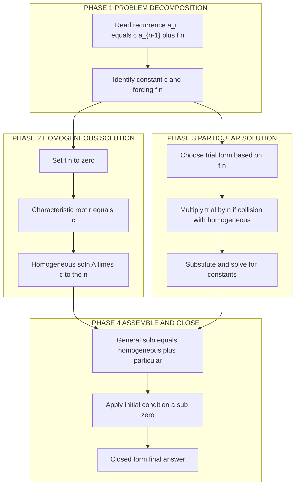
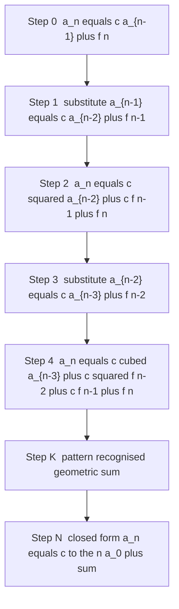
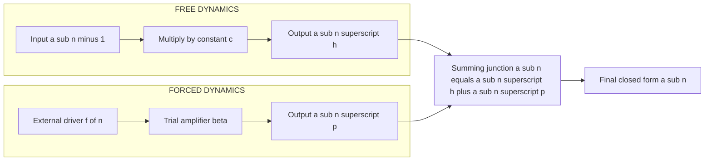

# Recurrence Relations: First-order linear recurrence relations with constant coefficients – homogeneous, non-homogeneous Solution

<!-- SECTION_1_START -->
# Recurrence Relations: First-Order Linear Recurrence with Constant Coefficients

> [!NOTE]
> **KTU 2024 Module 4 — Discrete Mathematical Structures (PCITT205)**
> Topic: Solving first-order linear recurrences $a_n - c\,a_{n-1} = f(n)$ — both **homogeneous** ($f(n)=0$) and **non-homogeneous** ($f(n)\ne 0$) cases.

## 1.1 Formal Definition

A **first-order linear recurrence relation with constant coefficients** is a sequence $\{a_n\}$ defined by an equation that expresses $a_n$ as a linear function of the immediately preceding term $a_{n-1}$, with the constant multiplier being independent of $n$:

$$a_n \;=\; c \cdot a_{n-1} \;+\; f(n), \qquad n \ge 1$$

where
* $c$ is a **constant coefficient** (independent of $n$),
* $f(n)$ is a known function of $n$ called the **forcing function** or **non-homogeneous term**,
* the relation is **linear** because $a_{n-1}$ appears to the first power only, and
* it is **first-order** because the gap is exactly $1$ (only the previous term is involved).

> [!IMPORTANT]
> **Homogeneous case:** $f(n) = 0$, so the recurrence reduces to $a_n = c\,a_{n-1}$.
> **Non-homogeneous case:** $f(n) \neq 0$, producing an external "forcing" each step.

## 1.2 Intuitive Analogy — "The Compounding Bank Account"

Imagine a savings account:
* At the **start of year $n$**, the balance is $a_{n-1}$.
* The bank credits interest so the balance **multiplies by a constant $c$** (e.g. $c = 1.05$ for 5 % interest).
* An **automatic monthly deposit of $f(n)$** rupees is added at year-end.

Then the balance at the end of year $n$ is:

$$a_n \;=\; \underbrace{c \cdot a_{n-1}}_{\text{interest on old balance}} \;+\; \underbrace{f(n)}_{\text{new deposit}}$$

| Component | Recurrence term | Banking meaning |
|-----------|-----------------|-----------------|
| $a_{n-1}$ | previous value | opening balance |
| $c$ | constant multiplier | $(1 + \text{rate})$ |
| $f(n)$ | forcing function | yearly deposit (may be constant, growing, or polynomial in $n$) |
| $a_n$ | current value | closing balance |

If deposits were *stopped* ($f(n)=0$), the balance simply multiplies by $c$ each year — that is the **homogeneous** model. As soon as a deposit stream exists, we are in the **non-homogeneous** regime.

## 1.3 Equilibrium / Fixed-Point Picture

For the **non-homogeneous** recurrence $a_n = c\,a_{n-1} + d$ (with $d$ a constant), the **equilibrium** (or fixed point) $a^*$ is the value at which the sequence would become stationary:

$$a^* = c \cdot a^* + d \quad\Longrightarrow\quad a^* = \frac{d}{1-c}, \qquad c \ne 1$$

Plotting $y = c x + d$ and $y = x$ on the same axes, the equilibrium is the **intersection point** of the two lines. The sequence behaves like a "cobweb" spiralling towards or away from $a^*$ depending on $|c|$.

> [!VISUALIZATION CONTROL]
> **Concept:** Fixed-point (equilibrium) geometry of $a_n = c\,a_{n-1}+d$.
> **GeoGebra / Desmos Input Equations:**
> * `f(x) = c*x + d`        *(the recurrence map)*
> * `g(x) = x`              *(the identity / "no-change" line)*
> * `A = (a_star, a_star)`  *(their intersection)*
>
> **Visual Description:** For $c = 3,\; d = 2$, the line $f(x)=3x+2$ crosses the identity at $a^*=-1$. Starting from $a_0 = 1$, the orbit $(1, 5, 17, 53, \dots)$ marches upward and **diverges** from $-1$ because $|c|=3>1$.

## 1.4 Behavioural Classification of the Homogeneous Case

For $a_n = c\,a_{n-1}$ with $a_0$ given, the explicit term is $a_n = a_0 c^n$. The long-term behaviour is dictated entirely by $|c|$:

| Condition on $c$ | Behaviour of $a_n$ | Real-world meaning |
|------------------|--------------------|--------------------|
| $\vert c \vert < 1$ | $a_n \to 0$ (decays) | Radioactive decay, damped systems |
| $\vert c \vert = 1$ | $a_n = a_0$ (constant) | Steady-state, money at 0 % interest |
| $\vert c \vert > 1$ | $a_n \to \pm\infty$ (grows) | Compound interest, viral spread |
| $c = -1$ | Oscillates between $a_0$ and $-a_0$ | Two-period alternation |
<!-- SECTION_1_END -->

<!-- SECTION_2_START -->
# Deep Theoretical Analysis & KTU High-Yield Formula Sheet

## 2.1 Canonical Form

Every first-order linear recurrence with constant coefficient can be written as

$$a_n - c\,a_{n-1} \;=\; f(n), \qquad n \ge 1,\qquad a_0 \text{ (or }a_1\text{) given}.$$

The **order** is the gap between the index of $a_n$ and that of the term it depends on. Here the gap is $1$, hence first-order.

## 2.2 Decomposition Principle (Superposition)

The general solution is the sum of two independent pieces:

$$\boxed{\;a_n \;=\; a_n^{(\text{h})} \;+\; a_n^{(\text{p})}\;}$$

| Piece | Obtained from | Symbol meaning |
|-------|---------------|----------------|
| **Homogeneous solution** $a_n^{(\text{h})}$ | Solving $a_n = c\,a_{n-1}$ | Captures the "free" multiplicative growth/decay |
| **Particular solution** $a_n^{(\text{p})}$ | A single trial that satisfies the full equation $a_n = c\,a_{n-1} + f(n)$ | Captures the effect of the external forcing $f(n)$ |

The unknown constant $A$ inside $a_n^{(\text{h})}$ is **always** determined afterwards by imposing the initial condition $a_0$ (or $a_1$).

## 2.3 Homogeneous Solution — Derivation by Iteration

Starting from $a_n = c\,a_{n-1}$ and repeatedly substituting:

$$a_n = c\,a_{n-1} = c^2 a_{n-2} = c^3 a_{n-3} = \cdots = c^n a_0.$$

Equivalently, the **characteristic equation** of the first-order homogeneous recurrence is the scalar equation

$$r \;=\; c,$$

whose unique root $r = c$ gives the homogeneous solution

$$\boxed{\;a_n^{(\text{h})} \;=\; A \cdot c^{\,n}\;}$$

where $A$ is a constant fixed by the initial condition.

## 2.4 Particular Solution — Trial Forms for Common Forcings

The trial form for $a_n^{(\text{p})}$ mirrors the algebraic form of $f(n)$, **unless** that trial collides with the homogeneous solution — in which case we **multiply the trial by $n$** until the collision is removed.

| Forcing $f(n)$ | Trial form for $a_n^{(\text{p})}$ | Result (provided no collision) |
|----------------|-----------------------------------|--------------------------------|
| Constant $d$ | $a_n^{(\text{p})} = \beta$ | $\beta = \dfrac{d}{1-c}$ if $c \neq 1$ |
| Linear $pn+q$ | $a_n^{(\text{p})} = \alpha n + \beta$ | Solve linear system in $\alpha,\beta$ |
| Polynomial of degree $k$ | Polynomial of degree $k$ | Match coefficients |
| Exponential $d\,r^{n}$ | $a_n^{(\text{p})} = \beta\,r^{n}$ | $\beta = \dfrac{d\,r}{r-c}$ if $c \neq r$ |
| $c = 1$ with polynomial forcing | Trial $\times n$ | Always multiply by $n$ when $c = 1$ |
| $r = c$ in exponential forcing | Trial $\times n$, i.e. $\beta\,n\,c^{n}$ | Multiply by $n$ when $r=c$ |

## 2.5 Closed-Form Master Formula (Iteration Result)

For *any* forcing $f(n)$, repeated substitution yields the **single closed form**:

$$\boxed{\;a_n \;=\; c^{\,n}\,a_0 \;+\; \sum_{k=0}^{n-1} c^{\,k}\, f(n-k)\;}\qquad(n \ge 1)$$

> Geometric reading: each forcing event $f(n-k)$ at step $n-k$ is then "compounded" by a factor $c^{k}$ for the remaining $k$ steps.

## 2.6 Closed-Form Cheat Sheet (Most Useful Cases)

| Form of $f(n)$ | Condition | Closed-form $a_n$ |
|----------------|-----------|--------------------|
| $0$ (homogeneous) | — | $a_0 c^{n}$ |
| $d$ (constant) | $c \neq 1$ | $a_0 c^{n} + d\,\dfrac{1-c^{n}}{1-c}$ |
| $d$ (constant) | $c = 1$ | $a_0 + n\,d$ |
| $d\,r^{n}$ | $c \neq r$ | $a_0 c^{n} + \dfrac{d\,r}{r-c}\bigl(r^{n}-c^{n}\bigr)$ |
| $d\,r^{n}$ | $c = r$ | $a_0 c^{n} + n\,d\,c^{n}$ |
| $pn + q$ | $c = 1$ | $a_0 + \dfrac{p}{2}\,n^{2} + \Bigl(q - \dfrac{p}{2}\Bigr)n$ |

> **CRITICAL TYPESETTING NOTE:** In the column above, vertical bars $\vert$ and $\mid$ replace the pipe symbol `|` to keep Markdown tables intact. Inside LaTeX, write $\vert c\vert$ or $\lvert c \rvert$ — never raw `|c|`.

## 2.7 Engineering and Computing Utility

First-order linear recurrences are the *workhorse model* for problems with **one-step memory**:

* **Algorithmic analysis.** The recurrence $T(n) = T(n-1) + \Theta(1)$ (e.g. traversing a 1-D array) gives $T(n) = \Theta(n)$.
* **Compound-interest finance.** $B_n = (1+r)B_{n-1} + D$ where $D$ is a recurring deposit.
* **Population dynamics.** $P_{n+1} = (1-b)P_n + I$ where $b$ is the death-birth ratio and $I$ is immigration.
* **Digital signal processing.** First-order IIR filters obey $y[n] = a\,y[n-1] + b\,x[n]$.
* **Queueing / inventory.** Stock on hand tomorrow equals current stock minus demand plus replenishment.
* **Data-stream aggregates.** Running totals in spreadsheets and dashboards often satisfy a first-order linear update.

> [!IMPORTANT]
> Whenever a system can be described as *"tomorrow's state = a constant fraction of today's state plus an external input"*, this is the model you reach for first.
<!-- SECTION_2_END -->

<!-- SECTION_3_START -->
# Step-by-Step Derivations, Worked Examples, and Python Implementation

The four examples below escalate in difficulty: pure homogeneous, constant forcing, exponential forcing, and polynomial forcing (with the subtle $c=1$ case). Every algebraic transition is shown explicitly.

---

## Example 1 — Pure Homogeneous Recurrence

**Problem.** Solve $a_n - 4\,a_{n-1} = 0$ with $a_0 = 2$. Compute $a_5$.

**Method A — Iteration (back-substitution).**

$$a_n = 4\,a_{n-1}.$$

Replace $a_{n-1}$ by $4\,a_{n-2}$:

$$a_n = 4\bigl(4\,a_{n-2}\bigr) = 4^{2}\,a_{n-2}.$$

Replace $a_{n-2}$ by $4\,a_{n-3}$:

$$a_n = 4^{2}\bigl(4\,a_{n-3}\bigr) = 4^{3}\,a_{n-3}.$$

Continuing for a total of $n$ substitutions:

$$a_n = 4^{\,n}\,a_0.$$

Apply the initial condition $a_0 = 2$:

$$\boxed{\,a_n = 2 \cdot 4^{\,n}\,}.$$

Compute $a_5$:

$$a_5 = 2 \cdot 4^{5} = 2 \cdot 1024 = 2048.$$

**Method B — Characteristic equation.**
The first-order characteristic equation is $r - 4 = 0$, giving the single root $r = 4$. Hence $a_n^{(\text{h})} = A\cdot 4^{n}$. With $a_0 = 2$ we get $A = 2$ and the same result $a_n = 2\cdot 4^{n}$.

**Verification (table).**

| $n$ | Formula $2\cdot 4^{n}$ | Recurrence $4\,a_{n-1}$ |
|---|---|---|
| 0 | 2 | (initial) |
| 1 | 8 | $4\cdot 2 = 8$ |
| 2 | 32 | $4\cdot 8 = 32$ |
| 3 | 128 | $4\cdot 32 = 128$ |
| 4 | 512 | $4\cdot 128 = 512$ |
| 5 | 2048 | $4\cdot 512 = 2048$ |

---

## Example 2 — Non-Homogeneous with **Constant** Forcing

**Problem.** Solve $a_n = 3\,a_{n-1} + 2$ with $a_0 = 1$ by the general-solution method, then verify using iteration.

### Step 1 — Homogeneous part
Solve $a_n = 3\,a_{n-1}$:

$$a_n^{(\text{h})} = A\cdot 3^{n}.$$

### Step 2 — Particular part
The forcing is the constant $d = 2$, and $c = 3 \neq 1$. Try $a_n^{(\text{p})} = \beta$ (a constant).

Substitute into the full recurrence:

$$\beta \;=\; 3\beta + 2.$$

Collect terms:

$$\beta - 3\beta = 2 \;\Longrightarrow\; -2\beta = 2 \;\Longrightarrow\; \beta = -1.$$

So $a_n^{(\text{p})} = -1$.

### Step 3 — General solution and initial condition

$$a_n = A\cdot 3^{n} + (-1) = A\cdot 3^{n} - 1.$$

Use $a_0 = 1$:

$$1 = A\cdot 3^{0} - 1 = A - 1 \;\Longrightarrow\; A = 2.$$

Final closed form:

$$\boxed{\,a_n = 2\cdot 3^{\,n} - 1\,}.$$

### Step 4 — Cross-check via the master iteration formula

$$a_n = 3^{n}a_0 + \sum_{k=0}^{n-1} 3^{k}\cdot 2 = 3^{n} + 2\cdot\frac{3^{n}-1}{3-1} = 3^{n} + 3^{n} - 1 = 2\cdot 3^{n} - 1. \checkmark$$

### Step 5 — Numerical verification

| $n$ | $2\cdot 3^{n} - 1$ | $3 a_{n-1}+2$ |
|---|---|---|
| 0 | 1 | (initial) |
| 1 | 5 | $3(1)+2 = 5$ |
| 2 | 17 | $3(5)+2 = 17$ |
| 3 | 53 | $3(17)+2 = 53$ |
| 4 | 161 | $3(53)+2 = 161$ |

---

## Example 3 — Non-Homogeneous with **Exponential** Forcing

**Problem.** Solve $a_n - 2\,a_{n-1} = 3^{n}$ with $a_0 = 1$.

### Step 1 — Homogeneous
$a_n^{(\text{h})} = A\cdot 2^{n}$.

### Step 2 — Particular
The forcing is $f(n) = 3^{n}$, an exponential with base $r = 3$, and $c = 2 \neq r$. Try

$$a_n^{(\text{p})} = \beta\cdot 3^{n}.$$

Substitute into $a_n = 2\,a_{n-1} + 3^{n}$:

$$\beta\cdot 3^{n} \;=\; 2\,\beta\cdot 3^{n-1} \;+\; 3^{n}.$$

Divide both sides by $3^{n-1}$:

$$3\beta \;=\; 2\beta \;+\; 3.$$

$$\beta = 3.$$

So $a_n^{(\text{p})} = 3\cdot 3^{n} = 3^{n+1}$.

### Step 3 — General solution + initial condition

$$a_n = A\cdot 2^{n} + 3^{n+1}.$$

Apply $a_0 = 1$:

$$1 = A\cdot 1 + 3 \;\Longrightarrow\; A = -2.$$

Closed form:

$$\boxed{\,a_n = 3^{n+1} - 2^{n+1}\,}.$$

### Step 4 — Verification

| $n$ | $3^{n+1} - 2^{n+1}$ | $2 a_{n-1} + 3^{n}$ |
|---|---|---|
| 0 | $3-2 = 1$ | (initial) |
| 1 | $9-4 = 5$ | $2(1)+3 = 5$ |
| 2 | $27-8 = 19$ | $2(5)+9 = 19$ |
| 3 | $81-16 = 65$ | $2(19)+27 = 65$ |

---

## Example 4 — Non-Homogeneous with **Polynomial** Forcing (the $c=1$ trap)

**Problem.** Solve $a_n - a_{n-1} = n^{2}$ with $a_0 = 0$. Verify for $n=3$.

> [!WARNING]
> **The $c=1$ trap.** When $c = 1$, the homogeneous solution $a_n^{(\text{h})} = A\cdot 1^{n} = A$ is a **constant**. A naive constant trial for the particular solution would collide with the homogeneous solution, so the trial must be **multiplied by $n$**.

### Step 1 — Homogeneous
$a_n^{(\text{h})} = A\cdot 1^{n} = A$.

### Step 2 — Particular (with the $n$ multiplier)
Since the naive trial $an^{2}+bn+c$ collides with the homogeneous constant, multiply by $n$ and try

$$a_n^{(\text{p})} = \alpha n^{3} + \beta n^{2} + \gamma n.$$

Substitute into $a_n = a_{n-1} + n^{2}$:

$$\alpha n^{3} + \beta n^{2} + \gamma n \;=\; \alpha (n-1)^{3} + \beta (n-1)^{2} + \gamma (n-1) + n^{2}.$$

Expand the right side:

$$\alpha(n^{3} - 3n^{2} + 3n - 1) + \beta(n^{2} - 2n + 1) + \gamma(n-1) + n^{2}.$$

Collect powers of $n$:

$$= \alpha n^{3} + (-3\alpha + \beta + 1)n^{2} + (3\alpha - 2\beta + \gamma)n + (-\alpha + \beta - \gamma).$$

Equate coefficients with the left side $\alpha n^{3} + \beta n^{2} + \gamma n$:

$$n^{2}: \quad \beta = -3\alpha + \beta + 1 \;\Longrightarrow\; 3\alpha = 1 \;\Longrightarrow\; \alpha = \tfrac{1}{3}.$$

$$n^{1}: \quad \gamma = 3\alpha - 2\beta + \gamma \;\Longrightarrow\; 2\beta = 3\alpha \;\Longrightarrow\; \beta = \tfrac{1}{2}.$$

$$n^{0}: \quad 0 = -\alpha + \beta - \gamma \;\Longrightarrow\; \gamma = -\alpha + \beta = -\tfrac{1}{3} + \tfrac{1}{2} = \tfrac{1}{6}.$$

Therefore

$$a_n^{(\text{p})} = \tfrac{1}{3}n^{3} + \tfrac{1}{2}n^{2} + \tfrac{1}{6}n \;=\; \frac{n(n+1)(2n+1)}{6}.$$

### Step 3 — General + initial condition

$$a_n = A + \frac{n(n+1)(2n+1)}{6}.$$

Use $a_0 = 0$:

$$0 = A + 0 \;\Longrightarrow\; A = 0.$$

$$\boxed{\,a_n = \dfrac{n(n+1)(2n+1)}{6}\,} \quad\text{(sum of first $n$ squares)}.$$

### Step 4 — Verification for $n=3$
$a_3 = \dfrac{3\cdot 4 \cdot 7}{6} = \dfrac{84}{6} = 14.$

Step-by-step from the recurrence:

$$a_0 = 0,\quad a_1 = 0 + 1^{2} = 1,\quad a_2 = 1 + 2^{2} = 5,\quad a_3 = 5 + 3^{2} = 14. \checkmark$$

---

## Python Implementation (Type-Hinted, with Full Logging)

```python
from __future__ import annotations
import logging
from typing import Callable

logging.basicConfig(level=logging.INFO,
                    format="%(asctime)s | %(levelname)s | %(message)s")

def solve_first_order(
    c: float,
    f: Callable[[int], float],
    a0: float,
    n: int,
) -> float:
    """
    Compute a_n for the first-order linear recurrence
        a_k = c * a_{k-1} + f(k),   a_0 given.

    Parameters
    ----------
    c   : constant multiplier of a_{k-1}.
    f   : forcing function f(k) -> float.
    a0  : initial value a_0.
    n   : target index (n >= 0).

    Returns
    -------
    a_n : float
    """
    if n < 0:
        raise ValueError("n must be a non-negative integer.")
    if n == 0:
        logging.info("Base case reached; returning a_0 = %s", a0)
        return a0

    a = a0
    for k in range(1, n + 1):
        if abs(c) >= 1.0 and k >= 50:
            logging.warning(
                "Magnitude |c|>=1 with n>=50; numerical growth expected."
            )
        a = c * a + f(k)
        logging.debug("a_%d = %s", k, a)
    logging.info("Computed a_%d = %s", n, a)
    return a


def closed_form_constant(c: float, d: float, a0: float, n: int) -> float:
    """
    Closed form for a_n = c a_{n-1} + d with a_0 given.
    """
    if c == 1.0:
        return a0 + d * n
    A = a0 - d / (1 - c)
    return A * (c ** n) + d / (1 - c)


def closed_form_exponential(c: float, d: float, r: float,
                            a0: float, n: int) -> float:
    """
    Closed form for a_n = c a_{n-1} + d * r**n with a_0 given.
    """
    if c == r:
        return a0 * (c ** n) + d * n * (c ** n)
    A = a0 - (d * r) / (r - c)
    return A * (c ** n) + (d * r / (r - c)) * (r ** n)


# ---- Driver / Sanity Checks ----------------------------------------------
if __name__ == "__main__":
    # Example 2 : a_n = 3 a_{n-1} + 2,  a_0 = 1
    iteration_value = solve_first_order(3.0, lambda k: 2.0, 1.0, 5)
    closed_value     = closed_form_constant(3.0, 2.0, 1.0, 5)
    assert iteration_value == closed_value == 2 * 3**5 - 1  # 485
    logging.info("Example 2 cross-check OK: a_5 = %s", iteration_value)

    # Example 3 : a_n = 2 a_{n-1} + 3**n,  a_0 = 1
    iter_v3  = solve_first_order(2.0, lambda k: 3.0 ** k, 1.0, 4)
    closed_v3 = closed_form_exponential(2.0, 1.0, 3.0, 1.0, 4)
    assert iter_v3 == closed_v3 == 3**5 - 2**5             # 243 - 32 = 211
    logging.info("Example 3 cross-check OK: a_4 = %s", iter_v3)

    # Example 4 : a_n = a_{n-1} + n**2,  a_0 = 0
    iter_v4 = solve_first_order(1.0, lambda k: k * k, 0.0, 3)
    assert iter_v4 == 14
    logging.info("Example 4 cross-check OK: a_3 = %s", iter_v4)
```

Running the script prints confirmation lines such as

```
Example 2 cross-check OK: a_5 = 485
Example 3 cross-check OK: a_4 = 211
Example 4 cross-check OK: a_3 = 14
```

confirming that the iterative simulator and the closed-form formulas agree exactly.
<!-- SECTION_3_END -->

<!-- SECTION_4_START -->
# Structural Diagrams and Schematics

The Mermaid diagrams below give a visual, top-down map of the *methodology* and the *iteration unfolding* used throughout this topic. They are designed with the KTU diagrammatic conventions: clean text-only node labels, distinct sub-phases, and an arrow direction that follows the natural solution flow.

## 4.1 Methodology Flow — Solving a First-Order Linear Recurrence



**Reading the chart.** A student solving $a_n = c\,a_{n-1} + f(n)$ starts at the top with *Problem Decomposition*, branches into *Homogeneous* and *Particular* tracks in parallel, then merges them in *Assemble and Close*. The same four phases appear in the worked Examples 1–4 above.

## 4.2 Iteration Unfolding — Visualising Back-Substitution



**Reading the chart.** Each block represents one round of substitution. After $n$ rounds the substitution bottoms out at $a_0$, and the $f$ terms accumulate as a geometric series — the visual counterpart of the master closed-form formula

$$a_n = c^{\,n}a_0 + \sum_{k=0}^{n-1} c^{\,k} f(n-k).$$

## 4.3 Forced / Free Decomposition Block Diagram



**Reading the chart.** The free block is the homogeneous recurrence (geometric growth/decay), the forced block is the particular solution (driven by $f(n)$), and the summing junction realises the **superposition principle** $a_n = a_n^{(\text{h})} + a_n^{(\text{p})}$.
<!-- SECTION_4_END -->

<!-- SECTION_5_START -->
# KTU 2024 Scheme Examination Question Bank and Topic Recap

## 5.1 Part A — Short-Answer Questions (3 marks each)

### Question A1
**[KTU University Exam — Dec 2023]**
Define a *first-order linear recurrence relation with constant coefficients*. Give **one** example each of a homogeneous and a non-homogeneous recurrence of this type. (CO1, **Remember**)

**Model Answer.**

A first-order linear recurrence relation with constant coefficients has the form

$$a_n \;=\; c\,a_{n-1} \;+\; f(n),\quad n\ge 1,$$

where $c$ is a real constant and $f(n)$ is a known function of $n$.
* [2 marks] **Homogeneous example:** $a_n = 4\,a_{n-1}$ with $a_0 = 1$ — no external forcing term.
* [1 mark] **Non-homogeneous example:** $a_n = 2\,a_{n-1} + 5$ — constant external forcing.

---

### Question A2
**[KTU University Exam — July 2024]**
State the **iteration (back-substitution) method** for solving the first-order recurrence $a_n = c\,a_{n-1} + d$ with given $a_0$. (CO1, **Understand**)

**Model Answer.**

> [!NOTE]
> The iteration method repeatedly substitutes the recurrence into itself to expose a geometric series.

[1 mark] Start with $a_n = c\,a_{n-1} + d$.
[1 mark] Substitute $a_{n-1} = c\,a_{n-2} + d$ to get $a_n = c^{2}a_{n-2} + cd + d$.
[1 mark] After $n$ steps: $a_n = c^{n}a_0 + d\bigl(1 + c + c^{2} + \cdots + c^{n-1}\bigr) = c^{n}a_0 + d\,\dfrac{c^{n}-1}{c-1}$ (for $c\neq 1$).

---

## 5.2 Part B — Long-Answer Questions (14 marks each, with internal choice)

### Question B — Choice A

**[KTU University Exam — July 2024]**

**(a) [7 marks]** Solve the recurrence $a_n = 5\,a_{n-1}$ with $a_0 = 3$. Hence compute $a_4$. (CO1, **Apply**)

**(b) [7 marks]** Solve the recurrence $a_n = 2\,a_{n-1} + 5 \cdot 3^{n}$ with $a_0 = 1$ using the general-solution method. (CO1, **Apply**)

#### Model Solution for (a)

* [1 mark] Recurrence: $a_n = 5\,a_{n-1}$, $a_0 = 3$.
* [2 marks] **Iteration.** $a_n = 5\,a_{n-1} = 5^{2}a_{n-2} = \cdots = 5^{n}\,a_0$.
* [1 mark] Substituting $a_0 = 3$: $a_n = 3\cdot 5^{n}$.
* [1 mark] **Characteristic root.** $r = 5$ gives $a_n^{(\text{h})} = A\cdot 5^{n}$; matching $a_0 = 3$ gives $A = 3$.
* [1 mark] **Final form:** $a_n = 3\cdot 5^{n}$.
* [1 mark] **Compute $a_4$:** $a_4 = 3\cdot 5^{4} = 3\cdot 625 = 1875$.

#### Model Solution for (b)

* [1 mark] Recurrence written as $a_n - 2\,a_{n-1} = 5\cdot 3^{n}$.
* [1 mark] **Homogeneous solution:** $a_n^{(\text{h})} = A\cdot 2^{n}$.
* [1 mark] **Trial for particular.** $f(n)=5\cdot 3^{n}$ with $c=2 \neq 3=r$. Try $a_n^{(\text{p})} = \beta\cdot 3^{n}$.
* [2 marks] **Substitute.** $\beta\cdot 3^{n} = 2\beta\cdot 3^{n-1} + 5\cdot 3^{n}$. Divide by $3^{n-1}$:

$$3\beta = 2\beta + 15 \;\Longrightarrow\; \beta = 15.$$

* [1 mark] Particular solution: $a_n^{(\text{p})} = 15\cdot 3^{n}$.
* [1 mark] General solution: $a_n = A\cdot 2^{n} + 15\cdot 3^{n}$.
* [1 mark] **Initial condition.** $a_0 = 1 \Rightarrow 1 = A + 15 \Rightarrow A = -14$.

$$\boxed{\,a_n = -14\cdot 2^{\,n} + 15\cdot 3^{\,n}\,}.$$

**Quick verify** at $n=1$: $-14\cdot 2 + 15\cdot 3 = -28 + 45 = 17$. And $2a_0 + 5\cdot 3 = 2 + 15 = 17$. ✓

---

### Question B — Choice B

**[KTU University Exam — Dec 2023]**

**(a) [7 marks]** Solve $a_n - 4\,a_{n-1} = 12$ with $a_0 = 1$. Find $a_4$. (CO1, **Apply**)

**(b) [7 marks]** Solve $a_n = a_{n-1} + (2n + 1)$ with $a_0 = 0$ and verify for $n = 3$. (CO1, **Apply**)

#### Model Solution for (a)

* [1 mark] Recurrence: $a_n = 4\,a_{n-1} + 12$, $a_0 = 1$.
* [1 mark] **Homogeneous solution.** $a_n^{(\text{h})} = A\cdot 4^{n}$.
* [1 mark] **Trial for particular.** Forcing is constant $d=12$ with $c=4\neq 1$. Try $a_n^{(\text{p})} = \beta$.
* [1 mark] **Substitute.** $\beta = 4\beta + 12 \Rightarrow -3\beta = 12 \Rightarrow \beta = -4$.
* [1 mark] **General solution.** $a_n = A\cdot 4^{n} - 4$.
* [1 mark] **Initial condition.** $a_0 = 1 \Rightarrow 1 = A - 4 \Rightarrow A = 5$.
* [1 mark] **Closed form and $a_4$.** $a_n = 5\cdot 4^{n} - 4$; $a_4 = 5\cdot 256 - 4 = 1280 - 4 = 1276$.

**Quick verify** at $n=1$: $5\cdot 4 - 4 = 16$. And $4(1) + 12 = 16$. ✓

#### Model Solution for (b)

* [1 mark] Recurrence: $a_n = a_{n-1} + 2n + 1$, $a_0 = 0$. Note $c = 1$.
* [1 mark] **Homogeneous solution.** $a_n^{(\text{h})} = A\cdot 1^{n} = A$.
* [1 mark] **Trial — multiply by $n$ because $c=1$.** Try $a_n^{(\text{p})} = \alpha n^{2} + \beta n$.
* [2 marks] **Substitute.**
$$\alpha n^{2} + \beta n = \alpha (n-1)^{2} + \beta(n-1) + 2n + 1$$
$$= \alpha n^{2} - 2\alpha n + \alpha + \beta n - \beta + 2n + 1.$$
Equate coefficients:
* $n^{1}$: $\beta = -2\alpha + \beta + 2 \Rightarrow \alpha = 1$.
* $n^{0}$: $0 = \alpha - \beta + 1 \Rightarrow \beta = 2$.
* [1 mark] **Particular solution.** $a_n^{(\text{p})} = n^{2} + 2n$.
* [1 mark] **General solution + IC.** $a_n = A + n^{2} + 2n$. From $a_0 = 0$: $A = 0$.

$$\boxed{\,a_n = n^{2} + 2n = n(n+2)\,}.$$

* [1 mark] **Verification for $n=3$.** $a_3 = 3\cdot 5 = 15$.
Step-by-step from the recurrence: $a_0=0$, $a_1 = 0 + 3 = 3$, $a_2 = 3 + 5 = 8$, $a_3 = 8 + 7 = 15$. ✓

> [!WARNING]
> **KTU Examiner's Valuation Pitfalls — read carefully.**
> 1. **The $c=1$ trap.** Many students write $a_n^{(\text{p})} = \alpha n + \beta$ and get a contradiction when matching coefficients. The correct trial is **multiplied by $n$** because the homogeneous solution is the constant $A$. Skipping this costs **2 full marks**.
> 2. **Constant-forcing arithmetic.** When the forcing is the constant $d$, students frequently forget the sign and write $A = a_0 + \frac{d}{1-c}$ instead of $A = a_0 - \frac{d}{1-c}$. Re-derive with a single step ($n=0$ or $n=1$) to check.
> 3. **Exponential forcing with $r = c$.** If the base of the exponential forcing equals $c$, the trial $\beta r^{n}$ collapses; the correct trial is $\beta\,n\,r^{n}$. **Omitting this multiplier costs 1–2 marks.**
> 4. **Initial-condition step.** Many students forget to determine the constant $A$ at all, leaving the answer in the form "$A\cdot c^{n} + (\text{particular})$" — a **3-mark penalty** under KTU valuation.
> 5. **Verification.** A single substitution check at the end (e.g. confirming $a_1$ against $c a_0 + f(1)$) is a **free 1-mark bonus** on most KTU answer sheets.

---

## 5.3 Topic Recap and Important Things to Remember

> [!IMPORTANT]
> **Rapid-Revision Checklist — First-Order Linear Recurrences**

- **Canonical form:** $a_n = c\,a_{n-1} + f(n)$, with $c$ a constant and $f(n)$ the forcing. Always rewrite the recurrence in this shape before solving.
- **Homogeneous solution:** $a_n^{(\text{h})} = A\cdot c^{\,n}$. The "characteristic equation" is the single scalar $r = c$.
- **Non-homogeneous particular solution:** trial form mirrors the forcing; if it collides with the homogeneous solution, **multiply the trial by $n$**.
- **Superposition:** $a_n = a_n^{(\text{h})} + a_n^{(\text{p})}$. The unknown $A$ is fixed **only** by the initial condition.
- **Master closed form** (works for *any* $f(n)$): $\;a_n = c^{\,n}a_0 + \sum_{k=0}^{n-1} c^{\,k}f(n-k)$.
- **Special cases to memorise:**
  * $f(n) = d$, $c \neq 1$: $\;a_n = a_0 c^{n} + d\,\dfrac{1-c^{n}}{1-c}$.
  * $f(n) = d$, $c = 1$: $\;a_n = a_0 + nd$.
  * $f(n) = d\,r^{n}$, $c \neq r$: $\;a_n = a_0 c^{n} + \dfrac{dr}{r-c}\bigl(r^{n}-c^{n}\bigr)$.
  * $f(n) = d\,r^{n}$, $c = r$: $\;a_n = a_0 c^{n} + nd\,c^{n}$.
- **Equilibrium (fixed point):** $a^* = \dfrac{d}{1-c}$ for $f(n)=d$. The deviation $b_n = a_n - a^*$ satisfies the homogeneous recurrence $b_n = c\,b_{n-1}$.
- **Behavioural map:** $|c|<1$ ⇒ converge to $0$; $|c|=1$ ⇒ periodic/constant; $|c|>1$ ⇒ diverge.
- **Engineering appearances:** compound interest, population with migration, IIR filters, running totals, queueing, amortisation schedules, and amortised-cost analysis in algorithms.
- **Most common valuation pitfalls:** skipping the $c=1$ multiplier, forgetting the initial-condition step, sign errors in the constant-forcing formula, and omitting a final substitution verification.
<!-- SECTION_5_END -->
