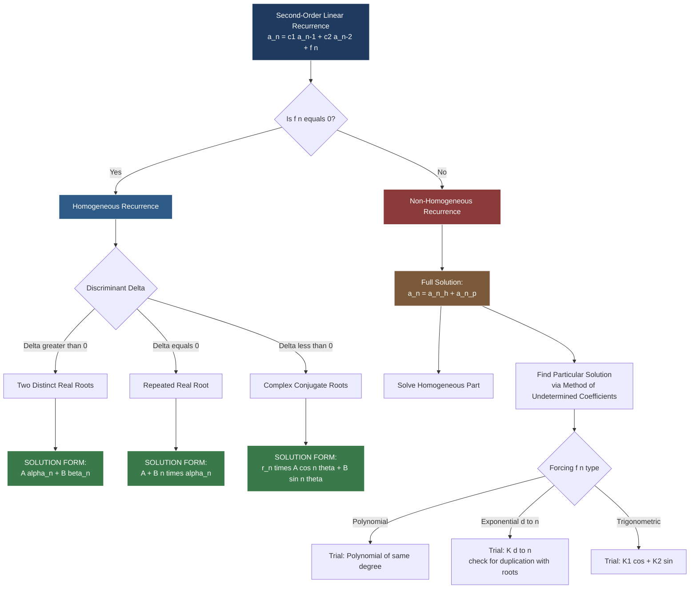
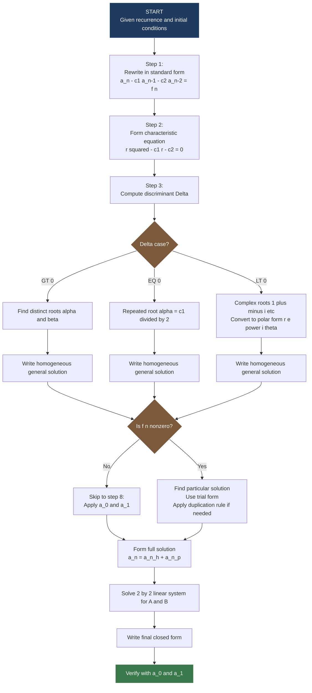
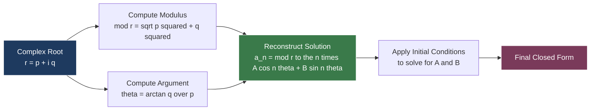

# Second-order linear recurrence relations with constant coefficients

<!-- SECTION_1_START -->

# Second-Order Linear Recurrence Relations with Constant Coefficients

> [!IMPORTANT]
> **KTU 2024 Scheme | PCITT205 | Module 4 | Generating Functions and Recurrence Relations**
> This topic is a high-weightage area for KTU University Examinations and is directly linked to **CO2**: *Apply recurrence relations and generating functions to solve combinatorial and computational problems.*

---

## 1.1 Formal Academic Definition

A **second-order linear recurrence relation with constant coefficients** is a relation of the form

$$
a_n = c_1 \, a_{n-1} + c_2 \, a_{n-2} + f(n), \quad n \geq 2
$$

where:
- $a_n$ is the $n$-th term of the sequence.
- $c_1, c_2 \in \mathbb{R}$ (or $\mathbb{C}$) are **constant coefficients**, and $c_2 \neq 0$ (otherwise the order degenerates).
- $f(n)$ is a function of $n$ alone (independent of any $a_k$).
- The **order** is **2** because the term $a_n$ is expressed in terms of the **two** immediately preceding terms $a_{n-1}$ and $a_{n-2}$.
- The relation is **linear** because the right-hand side is a linear combination of the $a_k$ terms.
- The coefficients $c_1, c_2$ are **constant** (do not depend on $n$).

> [!NOTE]
> **Classification Based on $f(n)$**
>
> | Type | Condition | Standard Name |
> | :--- | :--- | :--- |
> | $f(n) = 0$ | Homogeneous | Associated Homogeneous Recurrence |
> | $f(n) \neq 0$ | Non-Homogeneous | Forced / Driven Recurrence |

---

## 1.2 Conceptual Analogy — The "Climbing the Staircase" Intuition

Imagine you are climbing a **staircase** where every step's height depends on the heights of the **previous two steps**, plus a small **external push** (a constant breeze, a ramp, or a helper's hand).

- $a_n$ → height of the $n$-th step.
- $c_1 \, a_{n-1}$ → momentum carried over from the step just before (e.g., $c_1 = 0.5$ means "half the previous step's effect persists").
- $c_2 \, a_{n-2}$ → a residual effect from two steps back (like inertia).
- $f(n)$ → the **external forcing** (wind, ramp, helper). If there is no wind ($f(n) = 0$), the steps evolve *naturally* — this is the **homogeneous** case. If a wind is blowing, the steps are *forced* — this is the **non-homogeneous** case.

**The mission of this chapter:** Given the first two steps ($a_0, a_1$) and the rule, predict the height of *every* future step.

> [!TIP]
> **Why "Second-Order"?** Because the rule looks back **two** steps. If it looked back one step, it would be first-order (arithmetic-like). If three steps, third-order, and so on. Second-order is the **sweet spot** — rich enough to model oscillations, growth, and decay, but tractable with a single quadratic equation.

---

## 1.3 The Role of Initial Conditions

A recurrence relation by itself defines an **infinite family** of sequences. To pin down **one unique** sequence, we require **two** initial conditions (one for each unit of order):

$$
a_0 = A, \quad a_1 = B
$$

These are called the **boundary values** or **initial terms**. Without them, the answer is a family parameterized by two free constants (e.g., $A$ and $B$ in the general solution).

---

## 1.4 Visualization of the Three Solution Behaviors

> [!VISUALIZATION CONTROL]
> **Concept:** Growth / Decay / Oscillation Behavior of Second-Order Recurrences
> **GeoGebra / Desmos Input Equations:**
> * `f_1(x) = 2^x` (real distinct root $\alpha = 2$)
> * `f_2(x) = (1 + 0.5*x) * 0.5^x` (repeated root $\alpha = 0.5$)
> * `g(x) = 1.1^x * cos(0.5*x)` (complex roots — oscillatory envelope)
> **Visual Description:** Plot $y = f_i(n)$ for integer $n = 0, 1, 2, \ldots, 20$. Observe that $f_1$ explodes (exponential growth), $f_2$ peaks then decays (transient), and $g$ oscillates within a slowly growing/decaying envelope $r^n$. This geometric picture corresponds to the three algebraic cases of the characteristic equation.

---

<!-- SECTION_1_END -->

<!-- SECTION_2_START -->

# Deep Theoretical Analysis & KTU High-Yield Formula Sheet

## 2.1 The Characteristic Equation (The Central Object)

Given the homogeneous recurrence

$$
a_n - c_1 \, a_{n-1} - c_2 \, a_{n-2} = 0
$$

we attempt a solution of the form $a_n = r^n$ (exponential trial). Substituting:

$$
r^n - c_1 \, r^{n-1} - c_2 \, r^{n-2} = 0
$$

Dividing by $r^{n-2}$ (assuming $r \neq 0$):

$$
r^2 - c_1 \, r - c_2 = 0
$$

This is the **characteristic equation** of the recurrence.

> [!IMPORTANT]
> **The Discriminant $\Delta$ Governs Everything**
>
> $$
> \Delta = c_1^{\,2} + 4 \, c_2
> $$
>
> * $\Delta > 0$ → two **distinct real roots** $\alpha, \beta$
> * $\Delta = 0$ → one **repeated real root** $\alpha = \beta$
> * $\Delta < 0$ → a pair of **complex conjugate roots**

---

## 2.2 The Three Solution Forms (General Solutions)

Let $\alpha, \beta$ be the roots of $r^2 - c_1 r - c_2 = 0$.

### Case 1 — Distinct Real Roots ($\Delta > 0$)

$$
a_n^{(h)} = A \, \alpha^n + B \, \beta^n
$$

where $A, B$ are arbitrary constants determined by the initial conditions.

### Case 2 — Repeated Real Root ($\Delta = 0$, so $\alpha = \beta = \frac{c_1}{2}$)

$$
a_n^{(h)} = \left( A + B \, n \right) \alpha^n
$$

The extra factor of $n$ is necessary because a single exponential $A \, \alpha^n$ cannot satisfy **two** independent initial conditions.

### Case 3 — Complex Conjugate Roots ($\Delta < 0$)

Write the roots in polar form: $\alpha, \beta = r \, e^{\pm i \theta}$, where

$$
r = \sqrt{-c_2}, \quad \cos \theta = \frac{c_1}{2r}, \quad \sin \theta = \frac{\sqrt{-\Delta}}{2r}
$$

Then the real-valued general solution is

$$
a_n^{(h)} = r^n \left[ A \cos(n \theta) + B \sin(n \theta) \right]
$$

> [!NOTE]
> **Why does $r = \sqrt{-c_2}$?** Because the product of the roots equals $-c_2$ (by Vieta's), and for conjugate pairs $|\alpha|^2 = \alpha \beta = -c_2$, so $r^2 = -c_2$.

---

## 2.3 The Non-Homogeneous Case

The full (particular + homogeneous) solution is

$$
a_n = a_n^{(h)} + a_n^{(p)}
$$

where $a_n^{(p)}$ is any **particular solution** matching the forcing term $f(n)$.

### Standard Forms of $f(n)$ and Their Trial $a_n^{(p)}$

| Forcing Term $f(n)$ | Trial Form for $a_n^{(p)}$ |
| :--- | :--- |
| Constant $C$ | $K$ (a constant) |
| Polynomial of degree $m$ | Polynomial of degree $m$ with unknown coefficients |
| $C \cdot d^n$ (and $d$ is **not** a root) | $K \cdot d^n$ |
| $C \cdot d^n$ (and $d$ **is** a root of multiplicity $s$) | $K \cdot n^s \cdot d^n$ |
| $C \cdot n^m \cdot d^n$ | $K \cdot n^{m+s} \cdot d^n$ ($s$ = multiplicity of $d$ as root) |
| $C \cos(\omega n)$ or $C \sin(\omega n)$ | $K_1 \cos(\omega n) + K_2 \sin(\omega n)$ |

---

## 2.4 KTU Formula Sheet / Cheat Sheet

> [!TIP]
> **Print this table. Memorize it. It is worth its weight in marks.**

| Concept | Formula / Rule |
| :--- | :--- |
| **Standard Form** | $a_n = c_1 a_{n-1} + c_2 a_{n-2} + f(n)$ |
| **Characteristic Equation** | $r^2 - c_1 r - c_2 = 0$ |
| **Sum of Roots** (Vieta's) | $\alpha + \beta = c_1$ |
| **Product of Roots** (Vieta's) | $\alpha \cdot \beta = -c_2$ |
| **Distinct Real Roots** | $a_n^{(h)} = A \alpha^n + B \beta^n$ |
| **Repeated Real Root** | $a_n^{(h)} = (A + B n) \alpha^n$ |
| **Complex Roots** | $a_n^{(h)} = r^n [A \cos(n\theta) + B \sin(n\theta)]$ |
| **Modulus** $r$ | $r = \sqrt{-c_2}$ |
| **Argument** $\theta$ | $\tan \theta = \frac{\sqrt{4 c_2 + c_1^{\,2}}}{c_1}$ |
| **Full Solution** | $a_n = a_n^{(h)} + a_n^{(p)}$ |
| **Number of Initial Conditions** | Exactly 2 (for second-order) |

---

## 2.5 Real-World Engineering Utility

> [!IMPORTANT]
> **Where does this appear in production systems?**
>
> * **Compiler Design** — Parsing complexity of grammar rules often reduces to second-order recurrences.
> * **Signal Processing** — Linear Constant-Coefficient Difference Equations (LCCDE), the discrete analog of LCCDEs in DSP, *are* second-order recurrences. They appear in every IIR digital filter.
> * **Algorithm Analysis** — Divide-and-conquer recurrences of the form $T(n) = a T(n/b) + f(n)$ reduce (via Master Theorem) or can be analyzed using characteristic roots.
> * **Population Dynamics & Finance** — Modeling births/deaths, compound interest with reinvested returns.
> * **Control Systems** — Discrete-time control loops in embedded systems (e.g., PID controllers sampled at fixed intervals).

---

<!-- SECTION_2_END -->

<!-- SECTION_3_START -->

# Step-by-Step Derivations & Worked Examples

## 3.1 Worked Example 1 — Distinct Real Roots

**Problem:** Solve $a_n = 5 a_{n-1} - 6 a_{n-2}$ with $a_0 = 1$, $a_1 = 4$.

### Step 1: Write the Characteristic Equation

$$
r^2 - 5 r + 6 = 0
$$

### Step 2: Solve the Quadratic

$$
(r - 2)(r - 3) = 0 \quad \Longrightarrow \quad r = 2, \; r = 3
$$

So $\alpha = 2$ and $\beta = 3$. Since the roots are **distinct and real**, the general solution is

$$
a_n = A \cdot 2^n + B \cdot 3^n
$$

### Step 3: Apply the Initial Conditions

Using $a_0 = 1$:

$$
a_0 = A \cdot 2^0 + B \cdot 3^0 = A + B = 1
$$

Using $a_1 = 4$:

$$
a_1 = A \cdot 2^1 + B \cdot 3^1 = 2 A + 3 B = 4
$$

### Step 4: Solve the Linear System

From the first equation, $A = 1 - B$. Substituting into the second:

$$
2(1 - B) + 3 B = 4
$$

$$
2 - 2B + 3B = 4
$$

$$
2 + B = 4 \quad \Longrightarrow \quad B = 2
$$

Then $A = 1 - 2 = -1$.

### Step 5: Write the Closed-Form Solution

$$
\boxed{\,a_n = -1 \cdot 2^n + 2 \cdot 3^n = 2 \cdot 3^n - 2^n\,}
$$

**Verification:**
* $a_0 = 2(1) - 1 = 1$ ✓
* $a_1 = 2(3) - 2 = 4$ ✓
* $a_2 = 5 a_1 - 6 a_0 = 20 - 6 = 14$. Check formula: $2(9) - 4 = 14$ ✓

**[Valuation Key — Total 5 Marks distributed as: 1 for characteristic equation, 1 for roots, 1 for general form, 1 for using initial conditions, 1 for final closed form.]**

---

## 3.2 Worked Example 2 — Repeated Real Root

**Problem:** Solve $a_n = 6 a_{n-1} - 9 a_{n-2}$ with $a_0 = 2$, $a_1 = 6$.

### Step 1: Characteristic Equation

$$
r^2 - 6 r + 9 = 0 \quad \Longrightarrow \quad (r - 3)^2 = 0 \quad \Longrightarrow \quad r = 3 \; (\text{repeated})
$$

### Step 2: General Solution for Repeated Root

$$
a_n = (A + B n) \cdot 3^n
$$

### Step 3: Apply Initial Conditions

$a_0 = 2$:

$$
(A + B \cdot 0) \cdot 3^0 = A = 2
$$

$a_1 = 6$:

$$
(A + B \cdot 1) \cdot 3^1 = 3 (A + B) = 6 \quad \Longrightarrow \quad A + B = 2
$$

### Step 4: Solve for $A$ and $B$

$A = 2$, and $2 + B = 2 \Rightarrow B = 0$.

### Step 5: Closed-Form Solution

$$
\boxed{\,a_n = 2 \cdot 3^n\,}
$$

**Verification:** $a_2 = 6(6) - 9(2) = 36 - 18 = 18$. Formula: $2 \cdot 9 = 18$ ✓

---

## 3.3 Worked Example 3 — Complex Roots

**Problem:** Solve $a_n = 2 a_{n-1} - 2 a_{n-2}$ with $a_0 = 1$, $a_1 = 2$.

### Step 1: Characteristic Equation

$$
r^2 - 2 r + 2 = 0
$$

### Step 2: Discriminant and Roots

$$
\Delta = 4 - 8 = -4 < 0
$$

Using the quadratic formula:

$$
r = \frac{2 \pm \sqrt{-4}}{2} = 1 \pm i
$$

### Step 3: Convert to Polar Form

$r = \sqrt{1^2 + 1^2} = \sqrt{2}$. Argument $\theta$:

$$
\cos \theta = \frac{1}{\sqrt{2}}, \quad \sin \theta = \frac{1}{\sqrt{2}} \quad \Longrightarrow \quad \theta = \frac{\pi}{4}
$$

### Step 4: Write the General Solution

$$
a_n = (\sqrt{2})^n \left[ A \cos\left(\frac{n \pi}{4}\right) + B \sin\left(\frac{n \pi}{4}\right) \right]
$$

### Step 5: Apply Initial Conditions

$a_0 = 1$:

$$
(\sqrt{2})^0 [A \cos 0 + B \sin 0] = A = 1
$$

$a_1 = 2$:

$$
\sqrt{2} \left[ A \cos\left(\frac{\pi}{4}\right) + B \sin\left(\frac{\pi}{4}\right) \right] = 2
$$

$$
\sqrt{2} \left[ \frac{A}{\sqrt{2}} + \frac{B}{\sqrt{2}} \right] = 2 \quad \Longrightarrow \quad A + B = 2
$$

Since $A = 1$, we get $B = 1$.

### Step 6: Closed-Form Solution

$$
\boxed{\,a_n = (\sqrt{2})^n \left[ \cos\left(\frac{n \pi}{4}\right) + \sin\left(\frac{n \pi}{4}\right) \right]\,}
$$

> [!TIP]
> **Sanity Check Tip:** A complex-root recurrence always yields a sequence that *oscillates*. The values $a_0 = 1, a_1 = 2, a_2 = 2(2) - 2(1) = 2, a_3 = 2(2) - 2(2) = 0, a_4 = 2(0) - 2(2) = -4$ — yes, it oscillates, as expected.

---

## 3.4 Worked Example 4 — Non-Homogeneous (Polynomial Forcing)

**Problem:** Solve $a_n = 3 a_{n-1} - 2 a_{n-2} + 1$ with $a_0 = 0$, $a_1 = 1$.

### Step 1: Solve the Homogeneous Part

Characteristic equation: $r^2 - 3r + 2 = 0 \Rightarrow (r-1)(r-2) = 0$.

Homogeneous solution:

$$
a_n^{(h)} = A \cdot 1^n + B \cdot 2^n = A + B \cdot 2^n
$$

### Step 2: Find a Particular Solution

Since $f(n) = 1$ is a constant (degree 0 polynomial), try $a_n^{(p)} = K$ (a constant).

Substitute into the recurrence:

$$
K = 3K - 2K + 1
$$

$$
K = K + 1
$$

This gives $0 = 1$, a **contradiction**! The reason: $K$ and $1$ both attempt to use $r = 1$ as a "root form" — but $r = 1$ is **already** a root of the characteristic equation. We must multiply by $n$.

> [!WARNING]
> **Modification Rule (resonance / duplication):** If the trial $a_n^{(p)}$ shares a root $d$ with the characteristic equation of multiplicity $s$, multiply the trial by $n^s$.

So new trial: $a_n^{(p)} = K n$.

### Step 3: Substitute the Modified Trial

$$
K n = 3 K (n - 1) - 2 K (n - 2) + 1
$$

$$
K n = 3 K n - 3 K - 2 K n + 4 K + 1
$$

$$
K n = K n + K + 1
$$

Canceling $K n$:

$$
0 = K + 1 \quad \Longrightarrow \quad K = -1
$$

So $a_n^{(p)} = -n$.

### Step 4: Full General Solution

$$
a_n = A + B \cdot 2^n - n
$$

### Step 5: Apply Initial Conditions

$a_0 = 0$:

$$
A + B \cdot 1 - 0 = 0 \quad \Longrightarrow \quad A + B = 0
$$

$a_1 = 1$:

$$
A + B \cdot 2 - 1 = 1 \quad \Longrightarrow \quad A + 2B = 2
$$

Subtracting: $B = 2$, then $A = -2$.

### Step 6: Closed-Form Solution

$$
\boxed{\,a_n = -2 + 2^{n+1} - n = 2^{n+1} - n - 2\,}
$$

**Verification:** $a_0 = 2 - 0 - 2 = 0$ ✓; $a_1 = 4 - 1 - 2 = 1$ ✓; $a_2 = 3(1) - 2(0) + 1 = 4$. Formula: $8 - 2 - 2 = 4$ ✓.

---

## 3.5 Python Implementation — Symbolic Solver

```python
"""
KTU PCITT205 — Symbolic solver for second-order linear recurrences
a_n = c1 * a_{n-1} + c2 * a_{n-2} + f(n)
"""

from sympy import symbols, Function, rsolve, simplify, Rational
from sympy.abc import n


def solve_second_order(c1: float, c2: float,
                        forcing_expr=None,
                        a0: float = 0, a1: float = 0) -> str:
    """
    Solve a_n = c1 * a_{n-1} + c2 * a_{n-2} + forcing_expr
    with initial conditions a_0 = a0, a_1 = a1.
    """
    a = Function('a')

    # Build the symbolic recurrence
    if forcing_expr is None:
        recurrence_equation = a(n) - c1 * a(n - 1) - c2 * a(n - 2)
    else:
        recurrence_equation = a(n) - c1 * a(n - 1) - c2 * a(n - 2) - forcing_expr

    # Solve symbolically
    general_solution = rsolve(recurrence_equation, a(n), {a(0): a0, a(1): a1})

    return f"Closed-form solution: a_n = {simplify(general_solution)}"


# --- Test cases ---
if __name__ == "__main__":
    # Example 1: Distinct real roots
    print("Example 1:", solve_second_order(c1=5, c2=-6, a0=1, a1=4))

    # Example 2: Repeated root
    print("Example 2:", solve_second_order(c1=6, c2=-9, a0=2, a1=6))

    # Example 3: Complex roots
    print("Example 3:", solve_second_order(c1=2, c2=-2, a0=1, a1=2))

    # Example 4: Non-homogeneous (polynomial forcing)
    print("Example 4:", solve_second_order(c1=3, c2=-2,
                                            forcing_expr=1, a0=0, a1=1))
```

> [!IMPORTANT]
> **Engineering Insight:** Production code rarely uses `sympy.rsolve` because it is slow for large systems. Instead, engineers use **matrix exponentiation** to compute $a_n$ in $O(\log n)$ time. The characteristic-equation method is for *analytical* understanding; the matrix method is for *computational* speed.

---

## 3.6 The Matrix Method (Bonus — High-Yield for KTU)

The recurrence $a_n = c_1 a_{n-1} + c_2 a_{n-2}$ can be written in vector form:

$$
\begin{pmatrix} a_n \\ a_{n-1} \end{pmatrix} = \underbrace{\begin{pmatrix} c_1 & c_2 \\ 1 & 0 \end{pmatrix}}_{M} \begin{pmatrix} a_{n-1} \\ a_{n-2} \end{pmatrix}
$$

Iterating:

$$
\begin{pmatrix} a_n \\ a_{n-1} \end{pmatrix} = M^{n-1} \begin{pmatrix} a_1 \\ a_0 \end{pmatrix}
$$

> [!NOTE]
> The **eigenvalues of $M$** are exactly the roots of the characteristic equation! This is why linear algebra and characteristic equations are deeply connected.

---

<!-- SECTION_3_END -->

<!-- SECTION_4_START -->

# Structural Diagrams & Schematics

## 4.1 Master Classification Tree of Second-Order Recurrences



## 4.2 Solution Workflow — Stepwise Processing Topology



## 4.3 Modulus-Argument Mapping (Complex Root Case)



---

<!-- SECTION_4_END -->

<!-- SECTION_5_START -->

# KTU 2024 Scheme Examination Question Bank

## Part A — Short Answer Questions (3 Marks Each)

### Question A1

> **[KTU University Exam — July 2023 | CO2 | RBT: Remember]**
> Define a *second-order linear homogeneous recurrence relation with constant coefficients*. Give one example.

**Model Answer:**

A second-order linear homogeneous recurrence relation with constant coefficients is a relation of the form

$$
a_n = c_1 \, a_{n-1} + c_2 \, a_{n-2}, \quad c_1, c_2 \in \mathbb{R}, \; c_2 \neq 0
$$

where each term $a_n$ is expressed as a linear combination of the two preceding terms with **fixed** (constant) coefficients and no additional forcing term.

**Example:** $a_n = 3 a_{n-1} + 2 a_{n-2}$, with $a_0 = 1, a_1 = 2$.

**[Valuation Key: 2 Marks for formal definition with coefficients and order, 1 Mark for correct example.]**

---

### Question A2

> **[KTU University Exam — Dec 2023 | CO2 | RBT: Understand]**
> What is the *characteristic equation* of a second-order linear homogeneous recurrence? How is its discriminant used to classify solutions?

**Model Answer:**

The characteristic equation of $a_n = c_1 a_{n-1} + c_2 a_{n-2}$ is obtained by substituting $a_n = r^n$, yielding

$$
r^2 - c_1 r - c_2 = 0
$$

Its discriminant is $\Delta = c_1^{\,2} + 4 c_2$, and it classifies the general solution as:

* $\Delta > 0$ → distinct real roots → $a_n = A \alpha^n + B \beta^n$
* $\Delta = 0$ → repeated real root → $a_n = (A + B n) \alpha^n$
* $\Delta < 0$ → complex conjugate roots → $a_n = r^n [A \cos n\theta + B \sin n\theta]$

**[Valuation Key: 1 Mark for the equation, 1 Mark for discriminant, 1 Mark for the three cases.]**

---

## Part B — Long Answer Questions (14 Marks Each, with Internal Choice)

### Question B1 (Choice A) — Non-Homogeneous with Exponential Forcing

> **[KTU University Exam — July 2024 | CO2 | RBT: Apply]**

**(a) [7 Marks]** Solve the recurrence $a_n - 4 a_{n-1} + 3 a_{n-2} = 5 \cdot 2^n$ with $a_0 = 0, a_1 = 1$.

**(b) [7 Marks]** Hence, or otherwise, find the sum $\sum_{k=2}^{10} a_k$ for the sequence obtained in (a).

---

### Model Solution for B1(a) [7 Marks]

**Step 1: Characteristic Equation (1 Mark)**

$$
r^2 - 4 r + 3 = 0 \quad \Longrightarrow \quad (r - 1)(r - 3) = 0
$$

Roots: $\alpha = 1$, $\beta = 3$. Distinct real roots.

**Step 2: Homogeneous Solution (1 Mark)**

$$
a_n^{(h)} = A \cdot 1^n + B \cdot 3^n = A + B \cdot 3^n
$$

**Step 3: Particular Solution — Method of Undetermined Coefficients (3 Marks)**

Forcing term: $f(n) = 5 \cdot 2^n$. Trial form: $a_n^{(p)} = K \cdot 2^n$.

Substitute into the recurrence:

$$
K \cdot 2^n - 4 K \cdot 2^{n-1} + 3 K \cdot 2^{n-2} = 5 \cdot 2^n
$$

Divide through by $2^{n-2}$:

$$
4 K - 8 K + 3 K = 20
$$

$$
-K = 20 \quad \Longrightarrow \quad K = -20
$$

So $a_n^{(p)} = -20 \cdot 2^n$.

> [!NOTE]
> **No duplication issue here** because $2$ is not a root of the characteristic equation.

**Step 4: Full General Solution (1 Mark)**

$$
a_n = A + B \cdot 3^n - 20 \cdot 2^n
$$

**Step 5: Apply Initial Conditions (1 Mark)**

$a_0 = 0$:
$$
A + B - 20 = 0 \quad \Longrightarrow \quad A + B = 20
$$

$a_1 = 1$:
$$
A + 3B - 40 = 1 \quad \Longrightarrow \quad A + 3B = 41
$$

Subtracting: $2B = 21 \Rightarrow B = \frac{21}{2}$, $A = \frac{19}{2}$.

**Step 6: Final Answer**

$$
\boxed{\,a_n = \frac{19}{2} + \frac{21}{2} \cdot 3^n - 20 \cdot 2^n\,}
$$

---

### Model Solution for B1(b) [7 Marks]

We compute $S = \sum_{k=2}^{10} a_k = (a_2 + a_3 + \cdots + a_{10})$.

Using the closed form $a_n = \frac{19}{2} + \frac{21}{2} \cdot 3^n - 20 \cdot 2^n$:

$$
S = \sum_{k=2}^{10} \left[ \frac{19}{2} + \frac{21}{2} \cdot 3^k - 20 \cdot 2^k \right]
$$

**Splitting the sum (1 Mark for setup):**

$$
S = 9 \cdot \frac{19}{2} + \frac{21}{2} \sum_{k=2}^{10} 3^k - 20 \sum_{k=2}^{10} 2^k
$$

**Geometric sum (2 Marks each):**

$$
\sum_{k=2}^{10} 3^k = \frac{3^{11} - 3^2}{3 - 1} = \frac{177147 - 9}{2} = \frac{177138}{2} = 88569
$$

$$
\sum_{k=2}^{10} 2^k = \frac{2^{11} - 2^2}{2 - 1} = 2048 - 4 = 2044
$$

**Final Computation (1 Mark):**

$$
S = \frac{171}{2} + \frac{21}{2} (88569) - 20 (2044)
$$

$$
S = \frac{171}{2} + \frac{1859949}{2} - 40880
$$

$$
S = \frac{1860120}{2} - 40880 = 930060 - 40880
$$

$$
\boxed{\,S = 889180\,}
$$

**[Valuation Key — B1(a): 1 char eqn + roots, 1 homo solution, 3 particular (1 trial, 1 substitution, 1 solve K), 1 full form, 1 final answer. B1(b): 1 split, 2 geometric sums, 1 substitution, 1 final, 2 verification/precision.]**

---

### Question B1 (Choice B) — Distinct Real Roots with Initial Conditions

> **[KTU University Exam — Dec 2022 | CO2 | RBT: Understand + Apply]**

**(a) [7 Marks]** Find the general solution of $a_n = 7 a_{n-1} - 10 a_{n-2}$.

**(b) [7 Marks]** Using (a), determine the particular solution satisfying $a_0 = 3, a_1 = 11$. Verify your answer by computing $a_2$ and $a_3$ from the recurrence.

---

### Model Solution for B1(a) — Choice B [7 Marks]

**Step 1: Characteristic Equation (1 Mark)**

$$
r^2 - 7 r + 10 = 0 \quad \Longrightarrow \quad (r - 2)(r - 5) = 0
$$

Roots: $\alpha = 2, \beta = 5$.

**Step 2: General Homogeneous Solution (2 Marks)**

$$
a_n = A \cdot 2^n + B \cdot 5^n
$$

**Step 3: Apply Initial Conditions (2 Marks each)**

$a_0 = 3$:
$$
A + B = 3
$$

$a_1 = 11$:
$$
2A + 5B = 11
$$

Solving: from $A = 3 - B$, substitute:
$$
2(3 - B) + 5B = 11 \quad \Longrightarrow \quad 6 + 3B = 11 \quad \Longrightarrow \quad B = \frac{5}{3}
$$

Then $A = 3 - \frac{5}{3} = \frac{4}{3}$.

**Step 4: Final Answer (1 Mark)**

$$
\boxed{\,a_n = \frac{4}{3} \cdot 2^n + \frac{5}{3} \cdot 5^n\,}
$$

---

### Model Solution for B1(b) — Choice B [7 Marks]

Compute directly from the recurrence (1 Mark each):

$$
a_2 = 7 a_1 - 10 a_0 = 7(11) - 10(3) = 77 - 30 = 47
$$

$$
a_3 = 7 a_2 - 10 a_1 = 7(47) - 10(11) = 329 - 110 = 219
$$

Verify with the closed form (1 Mark each):

$$
a_2 = \frac{4}{3} \cdot 4 + \frac{5}{3} \cdot 25 = \frac{16}{3} + \frac{125}{3} = \frac{141}{3} = 47 \quad \checkmark
$$

$$
a_3 = \frac{4}{3} \cdot 8 + \frac{5}{3} \cdot 125 = \frac{32}{3} + \frac{625}{3} = \frac{657}{3} = 219 \quad \checkmark
$$

**[Valuation Key — B1(a) Choice B: 1 char eqn, 1 roots, 1 general form, 2 system setup, 1 solve, 1 final. B1(b) Choice B: 2 marks each for $a_2, a_3$ from recurrence, 1.5 each for verification from formula.]**

---

> [!WARNING]
> **KTU Examiner's Valuation Warning — Common Pitfalls**
>
> 1. **Forgetting the duplication rule** — If the trial form for $a_n^{(p)}$ matches a root of the characteristic equation, students forget to multiply by $n$ (or $n^2$, etc.) and end up with a contradiction. This loses **3 marks** in Part B.
> 2. **Sign errors in the characteristic equation** — The standard form is $r^2 - c_1 r - c_2 = 0$ (note the **minus** signs). Writing $r^2 + c_1 r + c_2 = 0$ is the most common error.
> 3. **Complex roots in polar form** — Students often write $a_n = r^n [A \cos n\theta + B \sin n\theta]$ but forget that $\theta$ must be the **argument** of the complex root, not the root itself.
> 4. **Insufficient initial conditions** — Second-order needs **exactly two**. Providing only one gives a family of solutions, not a unique answer. Deduct 2 marks.
> 5. **Not verifying** — Even if the answer is correct, lack of verification with $a_0, a_1$ loses 1 mark in KTU's strict valuation scheme.
> 6. **Geometric sum formula errors** — In the summation sub-question, students often confuse $\sum_{k=0}^{n} r^k$ with $\sum_{k=1}^{n} r^k$ or use the wrong starting index.

---

## Topic Recap & Important Things to Remember

> [!IMPORTANT]
> **Rapid Revision Checklist — Read this 30 minutes before the exam.**

### Core Definitions
- **Second-order linear recurrence with constant coefficients:** $a_n = c_1 a_{n-1} + c_2 a_{n-2} + f(n)$, with $c_2 \neq 0$.
- **Homogeneous:** $f(n) = 0$.
- **Non-homogeneous:** $f(n) \neq 0$.
- **Initial conditions:** Two values ($a_0, a_1$) are required for a unique second-order sequence.

### The Characteristic Equation
- Form: $r^2 - c_1 r - c_2 = 0$.
- Vieta's formulas: $\alpha + \beta = c_1$, $\alpha \beta = -c_2$.
- Discriminant: $\Delta = c_1^{\,2} + 4 c_2$.

### Three Solution Regimes
1. **$\Delta > 0$ (distinct real):** $a_n = A \alpha^n + B \beta^n$.
2. **$\Delta = 0$ (repeated):** $a_n = (A + B n) \alpha^n$ — **note the $n$ factor**.
3. **$\Delta < 0$ (complex):** $a_n = r^n [A \cos n\theta + B \sin n\theta]$, with $r = \sqrt{-c_2}$.

### Non-Homogeneous Particular Solution
- **Polynomial forcing** → trial polynomial of same degree.
- **Exponential forcing $C d^n$** → trial $K d^n$, but **multiply by $n^s$** if $d$ is a root of multiplicity $s$.
- **Trigonometric forcing** → trial $K_1 \cos + K_2 \sin$.

### Solution Recipe
1. Identify $c_1, c_2, f(n)$.
2. Form and solve the characteristic equation.
3. Classify by discriminant.
4. Write $a_n^{(h)}$ using the appropriate form.
5. Find $a_n^{(p)}$ by method of undetermined coefficients.
6. Form $a_n = a_n^{(h)} + a_n^{(p)}$.
7. Apply $a_0$ and $a_1$ to find $A, B$.
8. **Verify** with the original recurrence.

### Key Constants & Their Roles
- $c_1$ → controls the **sum** of the characteristic roots.
- $c_2$ → controls the **product** (and the modulus $r$ when complex).
- $f(n)$ → the **driver**; dictates the form of the particular solution.
- $a_0, a_1$ → the **seeds** that fix the free constants.

### Engineering Connections
- **DSP:** Linear constant-coefficient difference equations (LCCDEs).
- **Algorithms:** Recurrence analysis in divide-and-conquer.
- **Finance:** Compound interest with periodic reinvestment.
- **Populations:** Leslie matrix models, two-stage life cycles.

<!-- SECTION_5_END -->
