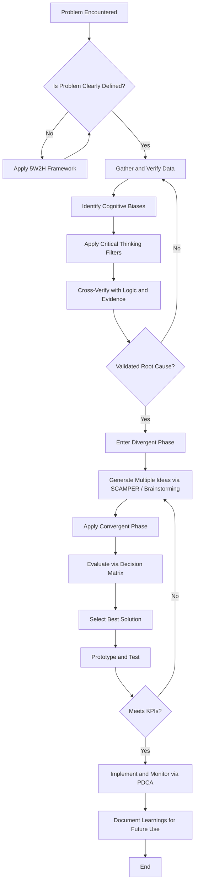
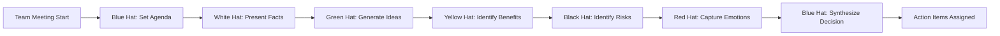
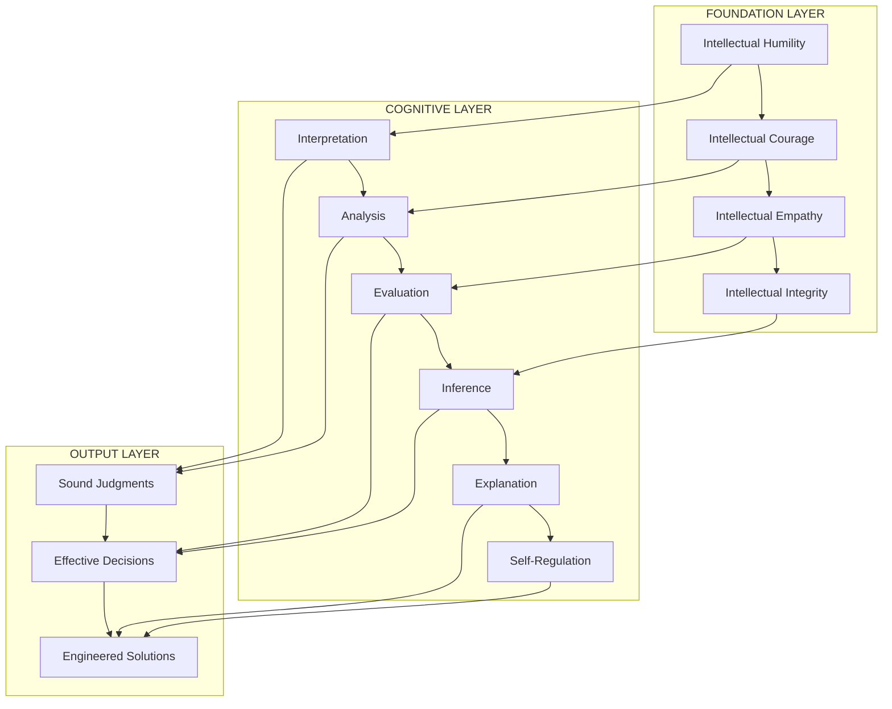
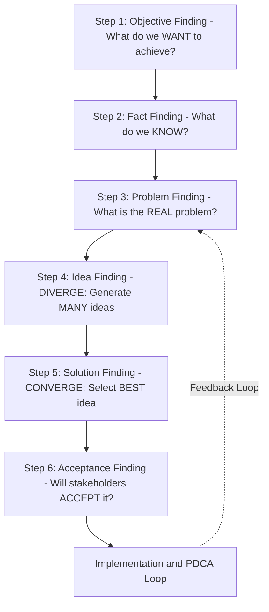
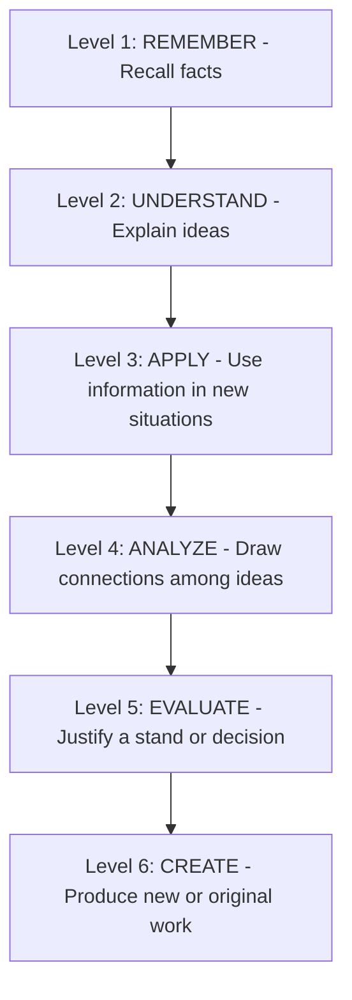

# Critical thinking and creative problem solving

<!-- SECTION_1_START -->
# Critical Thinking and Creative Problem Solving

## 1.1 Core Technical Definition

> [!IMPORTANT]
> **Critical Thinking** is the intellectually disciplined process of actively and skilfully conceptualizing, applying, analysing, synthesizing, and/or evaluating information gathered from, or generated by, observation, experience, reflection, reasoning, or communication, as a guide to belief and action.

> [!IMPORTANT]
> **Creative Problem Solving (CPS)** is a structured, systematic, and collaborative process used to identify and develop effective solutions to open-ended, ambiguous, or complex problems by combining logical analysis with imaginative ideation.

In KTU 2024 Scheme terminology, this topic falls under **Module 1: Self-Awareness and Emotional Intelligence**, and bridges cognitive psychology with engineering decision-making. It is a foundational "life skill" mandated by the **NEP 2020** framework to produce holistically developed engineering graduates.

## 1.2 Conceptual Analogy / Intuition

**The "Mechanic vs. The Inventor" Analogy:**

Imagine a car breakdown on a highway.

- A **mechanic** applies *Critical Thinking*. He follows a diagnostic checklist — checks the battery, fuel line, spark plugs — uses prior knowledge, identifies the *root cause*, and applies a proven fix. He is analytical, logical, and rules-based.
- An **inventor** applies *Creative Problem Solving*. She looks at the broken car and asks: *"What if I use the car's own battery to power a temporary electric motor using the wheel's rotation as a generator?"* She is imaginative, exploratory, and rule-bending.

A great engineer — the one KTU wants to produce — must be **both**: diagnose like a mechanic (Critical Thinking) **AND** innovate like an inventor (Creative Problem Solving).

> [!NOTE]
> **Standard KTU Metric:** The synergy of these two skills is often mapped to the **Bloom's Taxonomy upper levels** — *Analyse, Evaluate, and Create* — which together constitute the **highest cognitive demand (RBT Level 5 & 6)** in the KTU 2024 assessment rubric.

## 1.3 The Engineer's Triad of Thought

| Thought Mode | Primary Question | Core Strength |
|---|---|---|
| **Logical Thinking** | *Is this fact correct?* | Accuracy, validation |
| **Critical Thinking** | *Is this argument sound? Why?* | Evaluation, reasoning |
| **Creative Thinking** | *What if we tried something new?* | Innovation, ideation |

## 1.4 The Six Core Skills of Critical Thinking

According to the **Foundation for Critical Thinking (Paul-Elder Framework)**, every engineer must master:

1. **Interpretation** — Decoding the meaning of data, diagrams, or problem statements.
2. **Analysis** — Identifying the logical relationships between statements.
3. **Evaluation** — Assessing the credibility of arguments and evidence.
4. **Explanation** — Stating results clearly with justified reasoning.
5. **Self-Regulation** — Monitoring one's own cognitive biases.
6. **Inference** — Drawing logical conclusions from evidence.

> [!VISUALIZATION CONTROL]
> **Concept:** The "Critical Thinking Wheel" — showing how the six Paul-Elder skills interlock.
> **Visual Description:** Imagine a hexagonal wheel rotating clockwise: *Interpretation → Analysis → Evaluation → Explanation → Self-Regulation → Inference → back to Interpretation*. Each vertex feeds the next, representing the iterative, non-linear nature of rigorous thought.

<!-- SECTION_1_END -->

<!-- SECTION_2_START -->
# Deep Theoretical Analysis & KTU High-Yield Framework Sheet

## 2.1 The Two Pillars: Deconstructing the Concepts

### Pillar 1 — Critical Thinking (The "Judge")

Critical thinking is fundamentally a **gatekeeping process**. It filters weak ideas, false data, and faulty logic.

**Operational Sub-Processes:**

- **Observation** → Gathering raw data (e.g., a software bug report, a circuit failure log).
- **Questioning** → Applying the **Socratic Method** (*Who? What? When? Where? Why? How?*).
- **Cross-Verification** → Triangulating data with multiple sources.
- **Assumption Hunting** → Surfacing hidden premises in any argument.
- **Conclusion Drawing** → Forming judgments based on *evidence*, not emotion.

### Pillar 2 — Creative Problem Solving (The "Artist")

Creative problem solving is fundamentally a **generative process**. It produces new possibilities.

**Operational Sub-Processes (based on Osborn-Parnes CPS Model):**

- **Objective Finding** — What are we really trying to achieve?
- **Fact Finding** — What do we know? What do we need to know?
- **Problem Finding** — What is the *real* problem beneath the surface problem?
- **Idea Finding** — Generating many ideas (divergent thinking).
- **Solution Finding** — Selecting and refining the best idea (convergent thinking).
- **Acceptance Finding** — Ensuring the solution is feasible and implementable.

## 2.2 KTU High-Yield Framework Sheet

> [!NOTE]
> This is the **master reference table** for answering any KTU question on this topic. Memorize the models and their inventors.

| Framework / Model | Inventor / Year | Core Function | Engineering Application |
|---|---|---|---|
| **Paul-Elder Critical Thinking Framework** | Richard Paul & Linda Elder, 1992 | Structures reasoning via 8 elements | Evaluating technical design proposals |
| **Bloom's Taxonomy (Revised)** | Anderson & Krathwohl, 2001 | Hierarchizes cognitive skills (Remember → Create) | Setting course outcomes and exam questions |
| **Osborn-Parnes CPS Model** | Alex Osborn & Sidney Parnes, 1957 | 6-stage creative problem solving | R\&D brainstorming sessions |
| **SCAMPER Technique** | Bob Eberle, 1971 | 7-letter creative ideation trigger | Product redesign, feature innovation |
| **Six Thinking Hats** | Edward de Bono, 1985 | Parallel thinking using 6 perspectives | Team decision-making in projects |
| **Design Thinking (5 Stages)** | IDEO / Stanford d.school, 2008 | Empathize → Define → Ideate → Prototype → Test | UX design, product development |
| **4Cs of Critical Thinking** | Swiniarski & Swiniarski | Communication, Collaboration, Creativity, Critical Thinking | 21st-century skill benchmarking |

## 2.3 The SCAMPER Technique — High-Yield Expansion

SCAMPER is one of the most **exam-favoured** creative frameworks because of its memorable acronym.

| Letter | Action Verb | Engineering Question Example |
|---|---|---|
| **S** | Substitute | What if we replaced copper with aluminium in this transmission line? |
| **C** | Combine | Can we merge the cooling and lubrication systems into one? |
| **A** | Adapt | How can we adapt smartphone haptic feedback for prosthetic limbs? |
| **M** | Modify / Magnify | What if we 3x the sensor range — what new use cases emerge? |
| **P** | Put to other uses | Can this AI model trained for traffic also detect potholes? |
| **E** | Eliminate | What is the minimum feature set that still delivers value? |
| **R** | Reverse / Rearrange | What if the user controls the system, not the other way around? |

## 2.4 Six Thinking Hats — De Bono's Method in Detail

Each "hat" represents a distinct mode of thinking. Teams explicitly "wear" one hat at a time to avoid chaos.

| Hat Colour | Thinking Mode | Typical Output |
|---|---|---|
| **White** | Facts, data, information | "The server latency is **320 ms**." |
| **Red** | Emotions, intuitions, gut feelings | "I feel this design is unsafe." |
| **Black** | Caution, risks, critical judgment | "What if the battery overheats?" |
| **Yellow** | Optimism, benefits, feasibility | "This will cut energy costs by 40%." |
| **Green** | Creativity, alternatives, new ideas | "What if we used solar-assisted charging?" |
| **Blue** | Process control, meta-thinking | "Let's focus: we've spent 10 mins on Green." |

## 2.5 Real-World Utility in Engineering

- **Software Engineering:** Critical thinking is used in *code review* and *debugging*; creative problem solving is used in *algorithm design* and *architecture decisions*.
- **Civil Engineering:** Critical thinking evaluates *structural safety reports*; creative problem solving devises *novel load-distribution geometries*.
- **Electrical Engineering:** Critical thinking applies *Kirchhoff's laws* rigorously; creative problem solving re-imagines *circuit topologies*.
- **Project Management:** Critical thinking handles *risk analysis*; creative problem solving handles *resource-constrained innovation*.
- **AI / Machine Learning:** Critical thinking is needed to identify *model bias*; creative problem solving invents *new loss functions*.

<!-- SECTION_2_END -->

<!-- SECTION_3_START -->
# Step-by-Step Application: Engineering Case Frameworks

## 3.1 Case Study Framework 1 — Solving a Real Engineering Dilemma

> [!NOTE]
> This section presents a **comparative analysis matrix** mapping a real engineering problem to the critical + creative problem-solving frameworks. This format aligns with the KTU 2024 Humanities/Management module's emphasis on **case-based reasoning**.

### The Case: "Campus Wi-Fi Dead Zones"

A B.Tech student team at a Kerala engineering college is tasked with solving persistent Wi-Fi dead zones in the **Mechanical Block** (concrete-heavy, RF-unfriendly environment).

### Mapping the Case to the Frameworks

| Stage | Critical Thinking Action (The "Judge") | Creative Problem Solving Action (The "Artist") | Combined Output |
|---|---|---|---|
| **1. Problem Identification** | Analyse signal strength maps; identify exact dead zones (rooms, corridors). | Question the *given* problem: "Is it really Wi-Fi, or is it user-device capability?" | Reframed problem statement: *"Provide seamless connectivity across all learning spaces, regardless of device."* |
| **2. Data Gathering** | Survey students, measure dBm levels, study building blueprints. | Interview non-engineering stakeholders (peons, cleaning staff) for hidden patterns. | A multi-dimensional dataset combining technical + human insights. |
| **3. Root Cause Analysis** | Apply **5-Whys** technique; identify concrete walls + metal ducting as primary causes. | Hypothesize lateral causes: *"Could the canteen's microwave be interfering?"* | A root-cause tree with both primary and contributing factors. |
| **4. Idea Generation** | Filter out non-feasible options using cost/benefit logic. | Run a **SCAMPER** session: Substitutes (mesh vs. repeaters), Combines (Wi-Fi + Li-Fi). | A ranked list of 5+ feasible solutions. |
| **5. Solution Selection** | Evaluate each option using a weighted scoring matrix (cost, speed, scalability). | Imagine the *future state*: "What if this system could be AI-self-healing?" | A chosen solution: **AI-managed mesh network with Li-Fi hotspots**. |
| **6. Implementation & Reflection** | Monitor KPIs (latency, coverage) post-deployment. | Reflect: "What did we learn that could apply to the hostel block next?" | Continuous improvement loop established. |

## 3.2 Case Study Framework 2 — The Software Bug Crisis

A startup's payment gateway crashes every Friday at 6 PM. Critical + Creative analysis:

| Step | Critical Thinking | Creative Problem Solving | Resulting Action |
|---|---|---|---|
| Log Analysis | Identify the 6 PM spike → correlate with payroll processing. | Hypothesize: "Is it a human-pattern, not a code-pattern?" | Realized the issue is a *user behaviour pattern*, not a bug. |
| Stakeholder Mapping | List all parties: developers, payroll vendors, end-users. | Imagine: "What if we redesigned the user journey itself?" | Proposed a *throttled, scheduled payroll window*. |
| Solution Prototyping | A/B test the throttle with 10% of users. | Brainstorm: "Could gamification reduce Friday-evening traffic?" | Final solution: *Throttled API + user-incentivized rescheduling*. |
| Validation | Compare crash metrics pre- and post-deployment. | Reflect: "What other 'time-clustered' services might face this?" | Built a **reusable pattern library** for the company. |

## 3.3 Step-by-Step Methodology: The KTU-Recommended 5-Step Process

For any problem in an engineering context, KTU expects students to demonstrate the following structured approach. **Every step is mandatory for full marks.**

### Step 1: Define the Problem (with Precision)

> "A problem well-stated is a problem half-solved." — Charles Kettering

- Use the **5W2H** framework:
  - **What** is the problem?
  - **Why** is it happening?
  - **Who** is affected?
  - **When** does it occur?
  - **Where** does it occur?
  - **How** did it start?
  - **How much** is the impact (quantified)?

### Step 2: Gather & Verify Information

- Distinguish between **facts** (verifiable), **inferences** (logical conclusions), and **assumptions** (unverified beliefs).
- Use the **"F-I-A Test"** on every piece of data.

### Step 3: Generate Multiple Solutions (Divergent Phase)

- Apply **SCAMPER**, **Brainstorming**, or **Mind Mapping**.
- Aim for **quantity over quality** at this stage — judgment is suspended.

### Step 4: Evaluate and Select (Convergent Phase)

- Use a **Decision Matrix** with weighted criteria.

| Solution Option | Cost (Weight 30%) | Feasibility (Weight 25%) | Innovation (Weight 20%) | Scalability (Weight 25%) | Total Score |
|---|---|---|---|---|---|
| Option A (Status Quo + Patch) | 9/10 | 8/10 | 2/10 | 4/10 | **6.05** |
| Option B (Mesh Network Redesign) | 6/10 | 6/10 | 8/10 | 9/10 | **7.15** |
| Option C (Full Infrastructure Overhaul) | 2/10 | 4/10 | 9/10 | 10/10 | **5.80** |

- **Option B** wins → proceed to Step 5.

### Step 5: Implement, Monitor, and Iterate

- Use **PDCA (Plan-Do-Check-Act)** cycles.
- Document *learnings* for future problems — this is what differentiates an engineer from a technician.

## 3.4 Cognitive Biases That Engineers Must Defend Against

Critical thinking is incomplete without awareness of mental traps. KTU expects students to recognize these:

| Bias Name | Definition | Engineering Trap Example |
|---|---|---|
| **Confirmation Bias** | Seeking only data that supports your belief | "This bridge design is safe" → ignoring crack data |
| **Anchoring Bias** | Over-relying on the first piece of information | "The professor said this method works" → never exploring alternatives |
| **Sunk Cost Fallacy** | Continuing because of past investment | "We've spent 6 months on this code, can't abandon it now" |
| **Groupthink** | Conforming to team opinion | Silent senior blocks honest junior input |
| **Availability Heuristic** | Overweighting recent/memorable events | "That server failed last month" → assuming all servers are unreliable |
| **Dunning-Kruger Effect** | Overconfidence from low competence | New coder assumes their untested code is production-ready |

<!-- SECTION_3_END -->

<!-- SECTION_4_START -->
# Structural Diagrams & Schematics

## 4.1 The Critical + Creative Thinking Workflow

## 4.2 The Six Thinking Hats — Parallel Thinking Flow

## 4.3 Paul-Elder Critical Thinking Model — Functional Block Architecture

## 4.4 Creative Problem Solving — Osborn-Parnes Sequential Topology Matrix

## 4.5 Bloom's Taxonomy — Cognitive Hierarchy Block

> [!NOTE]
> **Engineering Implication:** Critical Thinking primarily operates at **Levels 4–5 (Analyse + Evaluate)**. Creative Problem Solving primarily operates at **Level 6 (Create)**. Mastering both allows a student to achieve the highest **RBT (Revised Bloom's Taxonomy)** cognitive tier required by KTU outcomes.

<!-- SECTION_4_END -->

<!-- SECTION_5_START -->
# KTU 2024 Scheme Examination Question Bank & Topic Recap

## Part A — Short Answer Questions (3 Marks Each)

### Question 1 (3 Marks) [KTU University Exam – July 2024]

**Q: Define Critical Thinking. List any four skills involved in critical thinking.**

**Model Answer:**

> **Definition (2 Marks):** Critical Thinking is the disciplined, self-directed thinking that aims to *interpret, evaluate, and infer* information to guide beliefs and actions. It involves questioning assumptions, analysing arguments, and judging the validity of evidence rather than accepting information at face value.

> **Four Skills (1 Mark — 0.25 each):**
> 1. Interpretation
> 2. Analysis
> 3. Evaluation
> 4. Inference

> [Bonus point for mentioning Explanation or Self-Regulation.]

---

### Question 2 (3 Marks) [KTU University Exam – Dec 2023]

**Q: What is Creative Problem Solving? Explain the SCAMPER technique briefly.**

**Model Answer:**

> **Definition (1.5 Marks):** Creative Problem Solving (CPS) is a structured methodology used to generate innovative solutions to open-ended or complex problems through a balance of *divergent* (idea-generation) and *convergent* (idea-selection) thinking.

> **SCAMPER (1.5 Marks — 0.25 per letter minimum):** SCAMPER is a creative ideation tool where each letter prompts a specific transformation:
> - **S** – Substitute
> - **C** – Combine
> - **A** – Adapt
> - **M** – Modify
> - **P** – Put to other uses
> - **E** – Eliminate
> - **R** – Rearrange / Reverse

---

## Part B — Long Answer Questions (14 Marks — Module Internal Choice)

### Question A (14 Marks) [KTU University Exam – July 2024]

**Q (a)** Explain the **Paul-Elder Critical Thinking Framework** in detail. Discuss its eight elements and how an engineering student can apply it to evaluate a technical project proposal. **(7 Marks)**

**Q (b)** Discuss the **Six Thinking Hats** method by Edward de Bono. How does it improve team-based decision-making in engineering projects? Illustrate with an example. **(7 Marks)**

---

#### Model Solution for Q (a) — 7 Marks

**Step 1 — Framework Introduction (1.5 Marks):**
The **Paul-Elder Critical Thinking Framework**, developed by Richard Paul and Linda Elder in 1992, is one of the most widely used structures for analysing and improving thought processes. It identifies **eight interrelated elements** that together form rigorous reasoning.

**Step 2 — Eight Elements (4 Marks — 0.5 per element):**

| # | Element | Purpose | Application to Project Proposal |
|---|---|---|---|
| 1 | **Purpose** | Clarify the goal | "Is this proposal solving the *right* problem?" |
| 2 | **Question at Issue** | Frame the central question | "What problem is the proposal truly addressing?" |
| 3 | **Information** | Use credible data | "Are the load-test results from a reliable source?" |
| 4 | **Interpretation** | Decode meaning | "What does 'high efficiency' actually mean in numbers?" |
| 5 | **Concepts** | Identify guiding theories | "Does the proposal align with known engineering principles?" |
| 6 | **Assumptions** | Surface hidden premises | "What is assumed about user behaviour or environment?" |
| 7 | **Implications** | Trace consequences | "What are the long-term maintenance implications?" |
| 8 | **Point of View** | Recognize perspective | "Whose interests are being served by this proposal?" |

**Step 3 — Application to Engineering (1.5 Marks):**
An engineering student evaluating a project proposal should:
- Use the **Purpose** and **Question at Issue** to verify the proposal addresses a real, well-defined need.
- Cross-check **Information** against independent technical literature.
- Expose **Assumptions** that may not hold in real deployment (e.g., "assumed unlimited budget").
- Weigh **Implications** for safety, cost, sustainability, and ethics.

> [Stating the eight elements correctly: 4 Marks]
> [Defining each with engineering examples: 2 Marks]
> [Concluding with practical application: 1 Mark]

---

#### Model Solution for Q (b) — 7 Marks

**Step 1 — Introduction to Six Thinking Hats (1 Mark):**
The **Six Thinking Hats** is a parallel-thinking technique developed by **Edward de Bono** in 1985. It allows a team to deliberately adopt one thinking mode at a time, avoiding the chaos of unstructured debate.

**Step 2 — The Six Hats Explained (3 Marks — 0.5 per hat):**

| Hat | Mode | Purpose |
|---|---|---|
| **White** | Objective | Focuses on facts, data, and missing information |
| **Red** | Emotional | Captures intuitions, feelings, gut reactions |
| **Black** | Cautious | Identifies risks, weaknesses, critical flaws |
| **Yellow** | Optimistic | Highlights benefits, opportunities, value |
| **Green** | Creative | Generates new ideas, alternatives, possibilities |
| **Blue** | Process | Manages the thinking process itself, sets agenda |

**Step 3 — Benefits in Engineering Teams (1.5 Marks):**
- **Parallel thinking:** Everyone thinks in the same direction at the same time → no conflict.
- **Full-spectrum analysis:** Ensures facts, risks, emotions, and creativity are all addressed.
- **Time efficiency:** Each hat is allotted a fixed time → avoids endless debate.
- **Inclusive participation:** Even introverts contribute meaningfully when assigned a specific hat.

**Step 4 — Illustrative Example (1.5 Marks):**
*A team is designing a new electric vehicle charging station for the campus.*

- **White Hat:** "Current load is **50 kW**; station can handle **100 kW**."
- **Red Hat:** "I worry about student safety at night near the station."
- **Black Hat:** "Risk of overloading the campus grid during peak hours."
- **Yellow Hat:** "Reduces carbon footprint by 30%; aligns with NEP 2020 sustainability goals."
- **Green Hat:** "Add solar canopy + battery storage for off-peak charging."
- **Blue Hat:** "Let's focus 10 minutes on Green to finalize the design."

> [Naming all six hats correctly with one-line meaning: 3 Marks]
> [Explaining benefits for engineering teams: 2 Marks]
> [Providing a relevant engineering illustration: 2 Marks]

---

### Question B (14 Marks) [KTU University Exam – Dec 2023] — Alternative Choice

**Q (a)** What is **Design Thinking**? Explain its five stages with reference to a real engineering product development scenario. **(7 Marks)**

**Q (b)** Differentiate between **Critical Thinking** and **Creative Thinking**. Why are both essential for an engineer? Provide two examples. **(7 Marks)**

---

#### Model Solution for Q (a) — 7 Marks

**Step 1 — Definition (1 Mark):**
Design Thinking is a human-centred, iterative problem-solving approach developed at **Stanford d.school (IDEO)**. It combines empathy, creativity, and rationality to develop solutions that are *desirable* (user wants), *feasible* (technically possible), and *viable* (business-sustainable).

**Step 2 — Five Stages (4 Marks — 0.8 per stage):**

| Stage | Description | Engineering Example — Smart Water Bottle for Cyclists |
|---|---|---|
| **1. Empathize** | Understand user needs, pains, and contexts through observation and interviews. | Survey cyclists: "I forget to drink water on long rides." |
| **2. Define** | Synthesize observations into a clear *Problem Statement* (POV). | "Cyclists in Kerala need a lightweight, leak-proof bottle that tracks intake." |
| **3. Ideate** | Generate a wide range of ideas without judgment. | Brainstorm 20+ ideas: sensor caps, app sync, glow-in-dark material, etc. |
| **4. Prototype** | Build low-cost, functional models for testing. | 3D-print a cap with an embedded flow sensor. |
| **5. Test** | Validate with real users; iterate based on feedback. | Cyclists test for 1 week; 70% report increased hydration. |

**Step 3 — Why It Matters (2 Marks):**
- Reduces risk of building "the wrong product."
- Encourages cross-functional collaboration.
- Promotes user empathy — a core 21st-century engineering skill.

> [Correctly listing five stages: 2 Marks]
> [Applying each stage to one product: 2 Marks]
> [Concluding with relevance to engineering: 1 Mark]
> [Including the *Desirable-Feasible-Viable* trinity: 1 Mark]
> [Mentioning iteration: 1 Mark]

---

#### Model Solution for Q (b) — 7 Marks

**Step 1 — Concept Definitions (1.5 Marks):**
- **Critical Thinking** is the *analytical, evaluative* process of assessing information, arguments, and decisions based on evidence and logic. It aims to find the *best* answer among existing options.
- **Creative Thinking** is the *generative, exploratory* process of producing novel, original, and useful ideas. It aims to create *new* options that did not previously exist.

**Step 2 — Tabular Differentiation (3 Marks):**

| Parameter | Critical Thinking | Creative Thinking |
|---|---|---|
| **Primary Goal** | Evaluate & judge | Generate & innovate |
| **Direction** | Convergent (narrowing down) | Divergent (expanding options) |
| **Question Asked** | *Is this correct?* | *What else is possible?* |
| **Basis** | Logic, evidence, reason | Imagination, intuition, analogy |
| **Bloom's Level** | Analyse + Evaluate | Create |
| **Risk Profile** | Risk-averse, cautious | Risk-tolerant, experimental |
| **Output** | A well-supported decision | A pool of new ideas |
| **Tools Used** | Logic trees, decision matrices, Socratic questioning | Brainstorming, SCAMPER, mind mapping, lateral thinking |

**Step 3 — Why Both Are Essential (1.5 Marks):**
An engineer who only **critically thinks** will be a competent troubleshooter but never an innovator. An engineer who only **creatively thinks** will generate exciting ideas that may be impractical, unsafe, or unprofitable. **The synergy of both produces engineers who are both visionary and rigorous.**

**Step 4 — Two Examples (1 Mark):**
- **Critical Thinking Example:** A civil engineer reviews a structural report, finds inconsistent load data, and rejects the unsafe design.
- **Creative Thinking Example:** The same engineer proposes a new composite material that is 30% lighter yet equally strong.
- **Combined Example:** The engineer tests the new material rigorously, evaluates it against safety codes, and integrates it into the final blueprint.

> [Defining both clearly: 1.5 Marks]
> [Tabular comparison with 6+ valid points: 3 Marks]
> [Justifying the synergy: 1.5 Marks]
> [Providing two contrasting examples: 1 Mark]

---

## KTU Examiner's Valuation Warning / Pitfall Callout

> [!WARNING]
> **Common Reasons Students Lose Marks in This Module:**
>
> 1. **Mere Definition, No Application** — Writing the textbook definition of Critical Thinking or CPS without applying it to an engineering context loses **up to 3 marks** out of 7 in Part B sub-questions. *Always tie theory to a real engineering scenario.*
> 2. **Missing the Synergy** — Treating Critical and Creative thinking as *opposites* or *alternatives* is a common error. The correct KTU stance: they are **complementary halves** of the same cognitive process.
> 3. **Skipping the Framework Names and Inventors** — Examiners award **0.5 to 1 mark** specifically for naming the *inventor* and *year* of each model (e.g., *Edward de Bono, 1985*). Memorize these.
> 4. **Ignoring Bloom's Taxonomy Linkage** — KTU examiners love mapping life-skill topics to cognitive levels. If asked to "analyse", explicitly state: *"This operates at RBT Level 5: Evaluate."*
> 5. **No Tabular Presentation in Long Answers** — A 14-mark answer without a **comparison table** is considered incomplete. Always include at least one well-structured table.
> 6. **Ignoring the "Engineer" Lens** — Answers framed purely in psychological terms (e.g., "Critical thinking helps people make better decisions") score lower than engineering-specific answers (e.g., "Critical thinking helps a structural engineer detect flawed load calculations").

---

## Topic Recap & Important Things to Remember

- **Critical Thinking** is the *evaluative* process: it asks *"Is this sound?"* — driven by logic, evidence, and Socratic questioning.
- **Creative Problem Solving** is the *generative* process: it asks *"What else is possible?"* — driven by imagination, ideation, and experimentation.
- The **two are complementary**, not opposites; together they enable *rigorous innovation*.
- **Paul-Elder Framework (1992)** structures critical thinking into **8 elements**: Purpose, Question at Issue, Information, Interpretation, Concepts, Assumptions, Implications, Point of View.
- **Bloom's Revised Taxonomy (2001)** ranks cognitive skills from Remember → Understand → Apply → Analyse → Evaluate → Create. Critical = Levels 4–5; Creative = Level 6.
- **Osborn-Parnes CPS Model (1957)** has 6 stages: Objective Finding, Fact Finding, Problem Finding, Idea Finding, Solution Finding, Acceptance Finding.
- **SCAMPER (Eberle, 1971)** = Substitute, Combine, Adapt, Modify, Put to other uses, Eliminate, Reverse.
- **Six Thinking Hats (de Bono, 1985)** = White (facts), Red (emotions), Black (risks), Yellow (benefits), Green (creativity), Blue (process).
- **Design Thinking (IDEO / Stanford d.school, 2008)** = Empathize → Define → Ideate → Prototype → Test (iterative).
- **4Cs of 21st-Century Skills** = Communication, Collaboration, Creativity, Critical Thinking.
- **Cognitive Biases to Defend Against:** Confirmation Bias, Anchoring, Sunk Cost Fallacy, Groupthink, Availability Heuristic, Dunning-Kruger.
- **Engineer's Toolkit:** The 5W2H framework, F-I-A Test (Fact-Inference-Assumption), Decision Matrix, and PDCA cycle are the operational tools.
- **Real-World Application Domains:** Code review (software), structural audits (civil), circuit design (electrical), risk analysis (project management), model bias detection (AI).
- **NEP 2020 Alignment:** This topic directly addresses the *Holistic Development* and *Critical Thinking* pillars of India's National Education Policy, making it a high-priority outcome area.
- **KTU Assessment Pattern:** Part A (3 marks) tests definitions + lists; Part B (14 marks) tests frameworks + engineering application + comparative analysis. Always include **at least one table, one diagram reference, and one engineering example** in Part B answers.

<!-- SECTION_5_END -->
