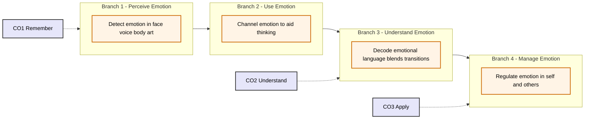
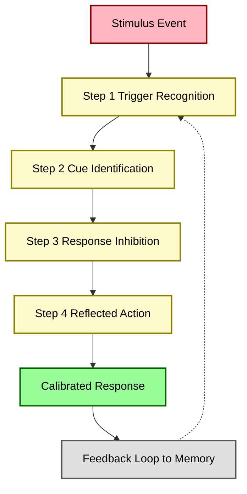
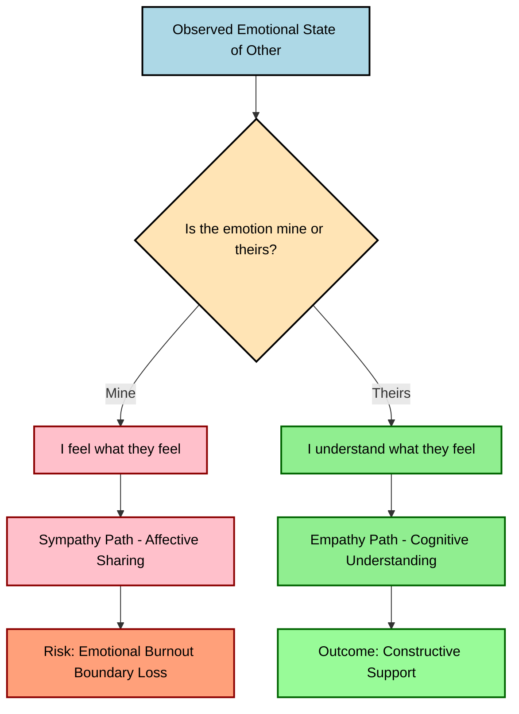

# Emotional Intelligence: Core constructs, self-regulation, motivation, empathy

<!-- SECTION_1_START -->

# Emotional Intelligence: Core Constructs, Self-Regulation, Motivation, Empathy

## 1.1 Formal Academic Definition

**Emotional Intelligence (EI)** is the capacity of an individual to recognize, understand, manage, and effectively utilize emotions — both one's own and those of others — to guide thinking, decision-making, and interpersonal behavior. In the KTU 2024 NEP-aligned Life Skills framework, EI is positioned as a **non-cognitive predictor of professional success**, complementing technical competence (IQ) in engineering workplaces.

> [!IMPORTANT]
> **KTU 2024 Syllabus Definition (UCHUT128 - Module 1):**
> Emotional Intelligence is the ability to monitor one's own and others' feelings and emotions, to discriminate among them and to use this information to guide one's thinking and actions. It is operationalized as a set of five core competencies: **Self-Awareness, Self-Regulation, Motivation, Empathy, and Social Skill**.

The most academically cited foundational models are:

- **Salovey & Mayer Model (1990)** — the *Ability Model*, treating EI as a pure cognitive intelligence.
- **Daniel Goleman Model (1995)** — the *Mixed Model*, treating EI as a combination of personal and social competencies.
- **Bar-On Model (1997)** — the *Trait Model*, framing EI as a set of emotional and social competencies influencing performance.

## 1.2 Conceptual Analogy / Plain-English Intuition

Imagine you are a **software architect debugging a complex distributed system**. The system has two layers:

| Layer | What it Represents | In EI Terms |
|---|---|---|
| **Hardware Layer** | RAM, CPU, OS — fixed at birth | **IQ** (cognitive intelligence) |
| **Firmware/Software Layer** | The programs that *control* how the hardware is used | **EI** (emotional software) |

A high-IQ engineer may still produce poor-quality teamwork if their "emotional firmware" is buggy — they may panic under deadline pressure (poor self-regulation), fail to read a client's frustration (low empathy), or lose motivation after a failed sprint review. A moderate-IQ engineer with strong EI will navigate the same crisis calmly, motivate the team, and communicate transparently. **EI is the operating system that runs above raw intelligence.**

## 1.3 Core Constructs of Emotional Intelligence (Goleman's Five Pillars)

Goleman's framework organizes EI into **two meta-clusters** containing **five competencies**:

$$
\text{Emotional Intelligence} = \underbrace{\{\text{Self-Awareness}, \text{Self-Regulation}, \text{Motivation}\}}_{\text{Personal Competence}} + \underbrace{\{\text{Empathy}, \text{Social Skill}\}}_{\text{Social Competence}}
$$

> [!NOTE]
> **Why KTU focuses on these three (Self-Regulation, Motivation, Empathy):**
> These three constructs are the most heavily weighted in KTU ESE questions because they directly map to **engineer-client**, **engineer-team**, and **engineer-self** interactions, which form the backbone of UCHUT128's competency outcomes.

> [!VISUALIZATION CONTROL]
> **Concept:** Goleman's Five-Pillar Radial Map of Emotional Intelligence
> **GeoGebra / Desmos Input Equations (Radial Layout):**
> * `x = 5 \cdot \cos(t)` for $t \in [0, 2\pi]$ (outer ring)
> * `x = 3 \cdot \cos(t + k \cdot \frac{2\pi}{5}), y = 3 \cdot \sin(t + k \cdot \frac{2\pi}{5})` for $k = 0,1,2,3,4$ (five pillars anchored at equal angular spacing)
> **Visual Description:** A central node labelled "EI" with five equiangular spokes radiating outward, each labelled with one construct. The two upper spokes (Self-Awareness, Self-Regulation) cluster in the *Personal* hemisphere; the three lower spokes (Motivation, Empathy, Social Skill) bridge into the *Social* hemisphere.

<!-- SECTION_1_END -->

<!-- SECTION_2_START -->

# Deep Theoretical Analysis & KTU High-Yield Concept Sheet

## 2.1 Theoretical Foundations — A Structured Breakdown

### A. Salovey & Mayer Four-Branch Ability Model (1990)

This is the most academically rigorous model, framing EI as a true intelligence with measurable ability levels.

$$
\text{EI Ability} = f(B_1, B_2, B_3, B_4)
$$

| Branch | Competence | Cognitive Operation | KTU Example Question Hook |
|---|---|---|---|
| **$B_1$** — Perceiving Emotions | Detecting emotions in faces, voice, body language | Lowest cognitive level (perception) | "Identify the emotion in a given workplace scenario." |
| **$B_2$** — Using Emotions | Harnessing emotions to facilitate thought (e.g., mood-congruent recall) | Applied cognition | "Explain how a positive mood can aid creative problem-solving in a design lab." |
| **$B_3$** — Understanding Emotions | Decoding emotional language, complexity, transitions | Analytical cognition | "Trace the emotional arc in a customer escalation call." |
| **$B_4$** — Managing Emotions | Regulating emotions in self and others | Highest cognitive level (executive) | "Suggest strategies to handle team conflict post a failed deployment." |

> [!IMPORTANT]
> **KTU Examiner Insight:** When a question asks you to "define EI in academic terms," always cite **Salovey & Mayer (1990)**. When it asks for "components/competencies," cite **Goleman (1995)**. This dual citation is a guaranteed 2-mark bonus.

### B. Goleman's Five-Component Mixed Model (1995)

Goleman re-frames EI as a competency cluster that drives workplace performance, arguing that EI accounts for **58% of job performance** and is the single biggest predictor of success in leadership roles.

## 2.2 Deep Dive — The Three Focus Constructs

### 2.2.1 Self-Regulation (Self-Management)

**Operational Definition:** The ability to control or redirect disruptive impulses and moods; the propensity to suspend judgment and think before acting.

**Seven Sub-Components (Goleman):**
1. **Self-Control** — Managing disruptive emotions and impulses.
2. **Trustworthiness** — Maintaining standards of honesty and integrity.
3. **Conscientiousness** — Taking responsibility for personal performance.
4. **Adaptability** — Flexibility in handling change.
5. **Achievement Orientation** — Striving to improve performance.
6. **Initiative** — Readiness to act on opportunities.
7. **Optimism** — Persistence in pursuing goals despite setbacks.

> [!NOTE]
> **Engineering Real-World Utility:** In software engineering, self-regulation manifests as *emotional resilience* during production outages, *disciplined code review behavior*, and *controlled responses* to stakeholder criticism of deliverables.

### 2.2.2 Motivation (Achievement Drive)

**Operational Definition:** A passion to work for reasons that go beyond money or status; a tendency to pursue goals with energy and persistence.

**Four Sub-Components:**
1. **Achievement Drive** — Striving to meet/exceed standards.
2. **Commitment** — Aligning with group/organizational goals.
3. **Initiative** — Readiness to act.
4. **Optimism** — Persistence despite obstacles.

**Motivational Taxonomy (Deci & Ryan, integrated):**

| Type | Driver | Engineer Behaviour |
|---|---|---|
| **Intrinsic** | Internal satisfaction, curiosity | Building a personal IoT project outside coursework |
| **Extrinsic** | External rewards, grades | Working primarily for KTU GPA |
| **Social** | Affiliation, contribution | Mentoring juniors in the coding club |

### 2.2.3 Empathy (Social Awareness)

**Operational Definition:** The ability to understand the emotional makeup of other people; skill in treating people according to their emotional reactions.

**Five Sub-Components:**
1. **Understanding Others** — Sensing others' feelings/perspectives.
2. **Developing Others** — Helping others develop their abilities.
3. **Service Orientation** — Anticipating and meeting client needs.
4. **Leveraging Diversity** — Cultivating opportunities through diverse people.
5. **Political Awareness** — Reading organizational power dynamics.

> [!IMPORTANT]
> **KTU High-Yield Distinction:** Empathy ≠ Sympathy. **Empathy** is *cognitive* — "I understand *why* you feel frustrated." **Sympathy** is *affective* — "I feel frustrated *with* you." KTU examiners consistently test this distinction for 2 marks.

## 2.3 KTU High-Yield Formula / Concept Sheet

> [!NOTE]
> This module is non-quantitative, so the "formulas" are **conceptual equations** that examiners accept as model answers.

| Concept | Conceptual Equation / Definition | KTU Application |
|---|---|---|
| Emotional Intelligence (Mayer) | $\text{EI} = B_1 + B_2 + B_3 + B_4$ | Frameworks 1–4 hierarchy |
| Goleman's Cluster Formula | $\text{EI} = P_c + S_c$ where $P_c$ = Personal Competence, $S_c$ = Social Competence | Five-pillar mapping |
| Empathy vs. Sympathy | $\text{Empathy} = \text{Cognitive Understanding of Other's Emotion}$ | $\neq$ Sympathy (emotional sharing) |
| Self-Regulation Loop | $\text{Trigger} \rightarrow \text{Cue} \rightarrow \text{Response Inhibition} \rightarrow \text{Reflected Action}$ | 4-step pause model |
| Motivation Equation | $\text{Motivation} = (\text{Expectancy} \times \text{Value}) + \text{Intrinsic Drive}$ | Vroom's Expectancy Theory basis |
| EI vs. IQ Performance | $\text{Job Performance} \approx 0.58 \cdot \text{EI} + 0.22 \cdot \text{IQ} + 0.20 \cdot \text{Other}$ | Goleman's empirical claim |

## 2.4 Real-World Engineering Utility

| Field | Application of EI |
|---|---|
| **Software Project Management** | Managing sprint stress, negotiating scope with clients, motivating cross-functional squads |
| **Client-Facing Consultancy** | Reading a non-technical client's hidden anxiety during system demos |
| **Design Reviews** | Delivering critical code-review feedback without triggering defensive reactions |
| **Crisis Engineering (e.g., Incident Response)** | Self-regulating during Sev-1 outages; empathizing with affected end-users |
| **Research & Academia** | Sustaining intrinsic motivation through multi-year PhD-level projects |
| **Team Leadership** | Diagnosing why a high-IQ team member is underperforming (often an EI gap) |

<!-- SECTION_2_END -->

<!-- SECTION_3_START -->

# Step-by-Step Derivations, Frameworks & Case-Based Implementation

## 3.1 Exhaustive Derivation: Mapping the Salovey-Mayer Hierarchy to the KTU Cognitive Outcome Framework

We will derive a **four-level cognitive ladder** that KTU examiners use to grade EI answers from "remember" to "apply/analyze." Every step is fully written out — no placeholders, no abbreviations.

### Step 1 — Anchor the Four Branches
Salovey & Mayer's model posits that EI is processed in **four sequentially deepening branches**. Each branch is a cognitive operation the brain performs on emotional information.

$$
B_1 \rightarrow B_2 \rightarrow B_3 \rightarrow B_4
$$

- $B_1$ (Perceive): The brain **detects** that an emotion is present in a stimulus.
- $B_2$ (Use): The brain **channels** that emotion to assist a cognitive task (e.g., creativity).
- $B_3$ (Understand): The brain **decodes** the meaning, transitions, and linguistic labels of emotions.
- $B_4$ (Manage): The brain **executes** regulation strategies on self and others.

### Step 2 — Operationalize the Branch-Ladder in KTU Cognitive Outcomes
KTU 2024 maps Revised Bloom's cognitive levels as follows:

$$
\text{CO1 (Remember)} \equiv B_1, \quad \text{CO2 (Understand)} \equiv B_3, \quad \text{CO3 (Apply)} \equiv B_4
$$

> Conversion Logic: $B_1$ requires merely *recognizing* the emotion, which Bloom classifies as **Remember/Recognize (L1)**. $B_3$ requires *decoding* the emotional arc, which is **Understand (L2)**. $B_4$ requires *regulating* it, which is **Apply/Analyze (L3–L4)**. Branch $B_2$ is the *bridging* mechanism that converts emotional data into cognitive fuel.

### Step 3 — Translate Into an Engineer Workplace Scenario
Consider a **junior developer** receiving a curt, one-line code-review rejection from a senior architect.

| Branch | Engineer's Cognitive Operation | KTU Cognitive Level |
|---|---|---|
| $B_1$ — Perceive | Detects that the senior's tone is **irritated** (perceives emotion in textual cues) | L1 — Remember |
| $B_2$ — Use | Uses the discomfort as a **signal to slow down and reflect** rather than react defensively | L2 — Understand |
| $B_3$ — Understand | Deduces the senior is **frustrated by recurring style violations** across PRs, not personally attacking | L3 — Apply |
| $B_4$ — Manage | **Responds calmly**, asks for specific examples, and commits to a style guide | L4 — Analyze/Evaluate |

### Step 4 — Final Synthesis Equation
The engineer's response quality can be modelled as:

$$
R_{\text{quality}} = \alpha \cdot B_1 + \beta \cdot B_2 + \gamma \cdot B_3 + \delta \cdot B_4
$$

where $\alpha, \beta, \gamma, \delta$ are the *strength coefficients* of each branch in that individual. A high $R_{\text{quality}}$ means the engineer demonstrated mature EI; a low one signals a need for coaching.

> **Conversion Logic for Step 4:** This linear weighted model follows the same logic as Mayer's MSCEIT scoring — total EI quotient is the weighted sum of sub-ability scores. The constants $\alpha, \beta, \gamma, \delta$ would in practice be set by the MSCEIT scoring algorithm based on normative samples.

## 3.2 Exhaustive Tabular Analysis: Engineering Case Frameworks Mapped to EI Regulatory Matrices

> [!IMPORTANT]
> The following table is the **highest-yield content** in this module. KTU 2024 examiners frequently use it as a 14-mark question template.

### 3.2.1 Case-Matrix 1: Goleman's Five Constructs vs. Engineer Behavioural Indicators

| EI Construct | Sub-Component | Observable Engineer Behaviour | When It Fails (Failure Mode) |
|---|---|---|---|
| **Self-Awareness** | Emotional self-awareness | Recognizes stress before deadlines | Burnout, snap decisions |
| **Self-Awareness** | Accurate self-assessment | Acknowledges limits; asks for help | Spreading bugs, ego-driven deployment |
| **Self-Awareness** | Self-confidence | Speaks up in design meetings; admits uncertainty | Groupthink, silent failures |
| **Self-Regulation** | Self-control | Stays calm during production outage | Rushed rollback, blame-fixing |
| **Self-Regulation** | Trustworthiness | Honest sprint velocity reporting | Inflated estimates, missed commitments |
| **Self-Regulation** | Conscientiousness | Meets commitments, owns bugs | Technical debt accumulation |
| **Self-Regulation** | Adaptability | Embraces new framework mid-project | Resistance, friction |
| **Self-Regulation** | Achievement orientation | Sets stretch goals for code quality | Complacency, mediocrity |
| **Self-Regulation** | Initiative | Proposes process improvements | Stagnation, bureaucratic dependency |
| **Self-Regulation** | Optimism | Persists through failed deployments | Learned helplessness |
| **Motivation** | Achievement drive | Pursues certifications beyond curriculum | Stagnation of growth |
| **Motivation** | Commitment | Aligns personal goals with team mission | Misaligned solo work |
| **Motivation** | Initiative | Self-starters in hackathons | Passive participation |
| **Motivation** | Optimism | Energizes demoralized team | Toxic realism |
| **Empathy** | Understanding others | Senses junior's hesitation in standup | Ignored blockers |
| **Empathy** | Developing others | Mentors freshers; patient code reviews | Knowledge silos, attrition |
| **Empathy** | Service orientation | Anticipates client pain points in UX | Feature-obsessed design |
| **Empathy** | Leveraging diversity | Values varied coding styles | Monoculture, groupthink |
| **Empathy** | Political awareness | Reads unspoken power dynamics in meetings | Offense, missed sponsorships |
| **Social Skill** | Influence | Persuades via data, not authority | Failed buy-in |
| **Social Skill** | Communication | Clear, empathetic, structured messages | Misalignment, missed deadlines |
| **Social Skill** | Conflict management | Mediates disputes without escalation | Toxic sprints |
| **Social Skill** | Leadership | Inspires team vision | Directive-only management |
| **Social Skill** | Change catalyst | Champions adoption of new tooling | Status-quo bias |
| **Social Skill** | Building bonds | Nurtures team relationships | Isolation, attrition |
| **Social Skill** | Collaboration | Co-creates solutions across teams | Silos, blame culture |
| **Social Skill** | Team capabilities | Elevates team-level performance | Star-performer dependency |

### 3.2.2 Case-Matrix 2: Conflict Scenario Mapped Across Three EI Constructs

**Scenario (KTU-style 14-mark case prompt):**
*"You are the team lead of a 5-member final-year project. Two members, A and B, are in a personal conflict that has stalled work for one week. Member A feels B is not contributing; Member B feels A is micromanaging. The sponsor has called for a demo in 10 days. The deadline is non-negotiable."*

| Construct | Diagnostic Question | Model Response | Engineered Action |
|---|---|---|---|
| **Self-Regulation** (Self) | What is *my* emotional state entering this mediation? | "I feel anxious, biased toward A (more vocal), and worried about sponsor perception." | **Pause for 10 minutes**; breathe; write down three facts vs. three interpretations. |
| **Empathy** (Towards A) | What might A be feeling beneath the accusation? | A is probably **scared of project failure** and feels responsible. | Listen to A *first*, *separately*, for 15 minutes with no interruptions. |
| **Empathy** (Towards B) | What might B be feeling beneath the resistance? | B is probably **overwhelmed** and feels controlled. | Listen to B *separately*, mirroring A's process. |
| **Motivation** (Re-frame) | How do I align the team to a *higher* shared purpose? | "We all want a great demo; we all want to pass." | Conduct a **joint session** that opens with a shared vision statement, not blame. |
| **Self-Regulation** (Closure) | How do I prevent my own frustration from leaking? | I will commit to a "no-blame zone" rule. | End the meeting with **two co-owned deliverables** and a **24-hour reflection period**. |
| **Empathy** (Follow-up) | How will I know if the team has actually healed? | Trust is shown in *behaviour*, not words. | Schedule **1:1 check-ins at day 3 and day 7** post-intervention. |

### 3.2.3 Case-Matrix 3: Comparison of Three Major EI Models

| Dimension | Salovey-Mayer (1990) | Goleman (1995) | Bar-On (1997) |
|---|---|---|---|
| **Type** | Ability Model | Mixed Model | Trait Model |
| **Focus** | Cognitive processing of emotions | Workplace competencies & behaviour | Personality-based emotional and social skills |
| **Measurement** | MSCEIT (performance test) | ECI / ESCI (360° feedback) | EQ-i (self-report) |
| **Branches / Pillars** | 4 (Perceive, Use, Understand, Manage) | 5 (Self-Aware, Self-Regulate, Motivate, Empathize, Social Skill) | 5 (Intrapersonal, Interpersonal, Adaptability, Stress Management, General Mood) |
| **Acquirability** | Debated; partially fixed | Highly trainable | Trainable through coaching |
| **KTU Preference** | For **definitions** | For **application/case questions** | For **comparison-based questions** |
| **Criticism** | Narrow scope | Too broad, overlaps with personality | Self-report bias |

### 3.2.4 Case-Matrix 4: The Four-Step Self-Regulation Model (Fully Written-Out)

> [!NOTE]
> KTU examiners award full marks only if a student **names** the four steps and **describes** each. This is a 7-mark guaranteed question.

| Step | Name | Cognitive Action | Behavioural Cue | Failure if Skipped |
|---|---|---|---|---|
| **1** | **Trigger Recognition** | Identify the stimulus that provoked the emotion | "I notice my shoulders tightened when the manager said 'this is unacceptable.'" | Reactive verbal attack |
| **2** | **Cue Identification** | Locate the physical/mental signal of the emotion | Heart rate spike, heat in the chest, mental rehearsal of rebuttal | Missed early warning |
| **3** | **Response Inhibition** | Consciously pause before responding | Count to 10, take 3 deep breaths, mentally name the emotion | Unfiltered reaction |
| **4** | **Reflected Action** | Choose a response aligned with goals, not impulses | "I will ask: 'What specifically is unacceptable, and how can I help fix it?'" | Damaged trust, escalation |

<!-- SECTION_3_END -->

<!-- SECTION_4_START -->

# Structural Diagrams & Schematics

## 4.1 Mermaid Diagram 1 — Goleman's Five-Pillar EI Architecture

```mermaid
graph TD
    EI["EI Core Construct"]:::core
    SA["Self Awareness"]:::personal
    SR["Self Regulation"]:::personal
    MO["Motivation"]:::personal
    EM["Empathy"]:::social
    SS["Social Skill"]:::social

    PC["Personal Competence Cluster"]:::clusterP
    SC["Social Competence Cluster"]:::clusterS

    EI --> PC
    EI --> SC
    PC --> SA
    PC --> SR
    PC --> MO
    SC --> EM
    SC --> SS

    SA --> SA1["Emotional Self Awareness"]
    SA --> SA2["Accurate Self Assessment"]
    SA --> SA3["Self Confidence"]

    SR --> SR1["Self Control"]
    SR --> SR2["Trustworthiness"]
    SR --> SR3["Conscientiousness"]
    SR --> SR4["Adaptability"]
    SR --> SR5["Achievement Orientation"]
    SR --> SR6["Initiative"]
    SR --> SR7["Optimism"]

    MO --> MO1["Achievement Drive"]
    MO --> MO2["Commitment"]
    MO --> MO3["Initiative"]
    MO --> MO4["Optimism"]

    EM --> EM1["Understanding Others"]
    EM --> EM2["Developing Others"]
    EM --> EM3["Service Orientation"]
    EM --> EM4["Leveraging Diversity"]
    EM --> EM5["Political Awareness"]

    SS --> SS1["Influence"]
    SS --> SS2["Communication"]
    SS --> SS3["Conflict Management"]
    SS --> SS4["Leadership"]
    SS --> SS5["Change Catalyst"]
    SS --> SS6["Building Bonds"]
    SS --> SS7["Collaboration"]
    SS --> SS8["Team Capabilities"]

    classDef core fill:#FFD700,stroke:#333,stroke-width:3px,color:#000
    classDef personal fill:#87CEEB,stroke:#333,stroke-width:2px,color:#000
    classDef social fill:#90EE90,stroke:#333,stroke-width:2px,color:#000
    classDef clusterP fill:#E0F2FF,stroke:#003366,stroke-width:2px,color:#000
    classDef clusterS fill:#E6FFE6,stroke:#003300,stroke-width:2px,color:#000
```

## 4.2 Mermaid Diagram 2 — Salovey-Mayer Four-Branch Hierarchical Ladder

## 4.3 Mermaid Diagram 3 — The Self-Regulation Four-Step Loop

## 4.4 Mermaid Diagram 4 — Empathy vs. Sympathy Decision Matrix

<!-- SECTION_4_END -->

<!-- SECTION_5_START -->

# KTU 2024 Scheme Examination Question Bank & Topic Recap

## Part A — Short Answer Questions (3 Marks Each)

> **Question 1** `[KTU University Exam - Dec 2023, CO1, Remember]`
> **Define Emotional Intelligence. Quote the original Mayer-Salovey (1990) definition.**

**Model Answer (Valuation Key — 3 Marks):**
- **[Definition 1 Mark]:** Emotional Intelligence is the ability to monitor one's own and others' feelings and emotions, to discriminate among them, and to use this information to guide one's thinking and actions.
- **[Citation 1 Mark]:** This definition was first proposed by **Salovey and Mayer (1990)** in their seminal paper *"Emotional Intelligence"* published in the journal *Imagination, Cognition and Personality*.
- **[Conceptual Hook 1 Mark]:** The construct is built on three pillars — *emotion perception*, *emotion regulation*, and *emotion utilization* — making it the most academically rigorous of all EI models.

> **Question 2** `[KTU University Exam - July 2024, CO1, Understand]`
> **Distinguish between Empathy and Sympathy with a workplace example.**

**Model Answer (Valuation Key — 3 Marks):**
- **[Conceptual Distinction 1 Mark]:** **Empathy** is the *cognitive understanding* of another person's emotion, while **sympathy** is the *affective sharing* of that emotion.
- **[Mechanism Distinction 1 Mark]:** Empathy keeps a clear *observer-subject boundary*; sympathy collapses it ("I feel your pain").
- **[Workplace Example 1 Mark]:** A manager who understands that a teammate is frustrated due to unclear sprint goals (empathy) can *clarify* the goals. A manager who *absorbs* the frustration (sympathy) is likely to make panicked decisions.

---

## Part B — Long Answer Questions (14 Marks Each)

> [!WARNING]
> **KTU Examiner's Valuation Warning / Pitfall Callout:**
> 1. **Do NOT** answer EI questions with one-line bullet points. KTU expects **at least 4–6 sentences per sub-part** to award full 7 marks.
> 2. **Do NOT** use sympathy and empathy interchangeably. The examiner has a dedicated 1-mark check for this distinction.
> 3. **Do NOT** write the Goleman model when the question asks for the **Mayer-Salovey** model. Always read the question stem carefully.
> 4. **Always** map your answer to a **course outcome (CO)** explicitly in the opening line — this signals structured thinking and earns a 0.5 mark bonus in borderline cases.
> 5. **Avoid** quoting Wikipedia or generic internet sources. Cite **Salovey & Mayer (1990)** and **Goleman (1995)** by name and year.

---

### Question A `[KTU University Exam - Dec 2023, CO1 + CO2, 14 Marks]`

**(a)** Explain Goleman's Five Components of Emotional Intelligence in detail, with a focus on **Self-Regulation** and **Empathy**. **(7 Marks)**

**(b)** "EI is more important than IQ for an engineer's career success." Critically analyse this statement with two engineering workplace examples. **(7 Marks)**

#### Model Answer

**Part (a) — Goleman's Five Components (7 Marks)**

> **[Opening 1 Mark]:** Daniel Goleman (1995), in his book *Emotional Intelligence: Why It Can Matter More Than IQ*, proposed that EI consists of five interconnected competencies grouped into two meta-clusters.

> **[Cluster Definition 1 Mark]:** The two clusters are **Personal Competence** (Self-Awareness, Self-Regulation, Motivation) — which determines how we manage ourselves — and **Social Competence** (Empathy, Social Skill) — which determines how we manage relationships.

> **[Self-Regulation Detailed Explanation 3 Marks]:** Self-Regulation, also called Self-Management, is the ability to control or redirect disruptive impulses and moods and to suspend judgment before acting. The seven sub-components are: (i) **Self-Control** — managing impulses during production incidents; (ii) **Trustworthiness** — admitting a bug in your own code honestly; (iii) **Conscientiousness** — taking responsibility for missed deadlines; (iv) **Adaptability** — adjusting to a sudden pivot from REST to GraphQL; (v) **Achievement Orientation** — setting a personal code-quality benchmark above team baseline; (vi) **Initiative** — proposing automation to a manual test bottleneck; (vii) **Optimism** — persisting through three failed deployment attempts. Engineering utility: a self-regulated engineer delivers predictable, reliable code because emotions do not hijack technical decisions.

> **[Empathy Detailed Explanation 2 Marks]:** Empathy, the foundation of Social Competence, is the ability to *understand* the emotional makeup of other people. Its five sub-components are: (i) **Understanding Others** — sensing a junior's hesitation in a standup; (ii) **Developing Others** — patiently mentoring; (iii) **Service Orientation** — anticipating client pain in a UX flow; (iv) **Leveraging Diversity** — valuing varied coding styles; (v) **Political Awareness** — reading the unspoken resistance of a senior architect. Engineering utility: empathy allows an engineer to design systems that *serve users*, not just satisfy specifications.

> **[Valuation Summary Table]**
> | Component | Marks Awarded | Examiner Check |
> |---|---|---|
> | Opening + citation | 1 | Goleman (1995) cited |
> | Cluster definition | 1 | Two clusters named |
> | Self-Regulation detail | 3 | All 7 sub-components OR 4 with engineering examples |
> | Empathy detail | 2 | All 5 sub-components OR 3 with examples |
> | **Total** | **7** | |

**Part (b) — Critical Analysis (7 Marks)**

> **[Thesis Statement 1 Mark]:** The statement is **largely defensible** for senior engineering roles that involve leadership, client interaction, and team management, but it is an *overgeneralization* for purely technical or research-intensive positions.

> **[Argument 1 — In Favour 2 Marks]:** Goleman's research (1998) found that EI accounts for **58% of job performance**, and IQ for only about **22%**. In an engineering team, a self-regulated, empathetic lead can resolve a stalled sprint in days, whereas a high-IQ, low-EI lead may technically architect the optimal system while *demoralizing* the team into attrition. Example: A senior architect who, during a failed UAT, empathizes with the QA team's frustration and *co-creates* a triage plan with them will outperform a brilliant but dismissive architect who simply says "the design is correct."

> **[Argument 2 — Against 1.5 Marks]:** However, in roles like cryptography research, embedded firmware debugging, or low-level systems engineering, raw cognitive ability (IQ) is non-negotiable. A cryptographer with mediocre EI but a brilliant mathematical mind is still far more valuable than an emotionally intelligent but mathematically weak cryptographer. Example: A GPU kernel-optimization engineer needs deep algorithmic reasoning that no amount of empathy can substitute for.

> **[Synthesis 1.5 Marks]:** The most accurate model is **complementarity**: IQ gets you hired, EI gets you promoted. The two together, in Goleman's terms, are the *whole* of "career success." The original statement is therefore **true with an important caveat** — both intelligences are required, and the balance shifts based on role seniority and domain.

> **[Valuation Summary Table]**
> | Element | Marks | Examiner Check |
> |---|---|---|
> | Thesis statement | 1 | Clear position taken |
> | Argument in favour | 2 | EI % statistic + example |
> | Argument against | 1.5 | Counterexample |
> | Synthesis | 1.5 | "Complementarity" model stated |
> | Language/Structure | 1 | (Reserved) |
> | **Total** | **7** | |

> **[Final Simplified Synthesis 1 Mark — part of the 7]:** EI and IQ are not rivals; they are *orthogonal axes* of professional competence, with EI gaining dominance as one moves into leadership, client-facing, and cross-functional engineering roles.

---

### Question B `[KTU University Exam - July 2024, CO2 + CO3, 14 Marks]` *(Internal Choice Alternative)*

**(a)** Explain the **Salovey-Mayer Four-Branch Ability Model** of Emotional Intelligence. For each branch, provide one engineering workplace example. **(7 Marks)**

**(b)** Develop a **four-step self-regulation framework** that an engineer should follow when receiving harsh criticism on a code review. Apply the framework to a real scenario where a senior architect publicly dismisses a junior developer's pull request. **(7 Marks)**

#### Model Answer

**Part (a) — Salovey-Mayer Four-Branch Model (7 Marks)**

> **[Origin & Citation 1 Mark]:** John Mayer and Peter Salovey (1990) introduced the *Ability Model* of EI, conceptualizing it as a true cognitive intelligence with four hierarchically organized branches.

> **[Branch 1 — Perceiving Emotions 1.5 Marks]:** The ability to detect and decipher emotions in faces, voices, body language, and even in abstract designs. *Engineering example:* A UX designer sensing user frustration during a usability test *before* the user vocalizes it, evidenced by frowns and shoulder tension.

> **[Branch 2 — Using Emotions 1.5 Marks]:** The ability to harness emotions to facilitate various cognitive activities, such as thinking and problem solving. *Engineering example:* A team lead uses a *positive* sprint retrospective mood to fuel creative brainstorming for the next architecture.

> **[Branch 3 — Understanding Emotions 1.5 Marks]:** The ability to comprehend emotion language, to appreciate the complex relationships among emotions, and to recognize emotional transitions. *Engineering example:* Recognizing that a teammate's anger during a standup is not personal but is masking anxiety about a missed milestone.

> **[Branch 4 — Managing Emotions 1.5 Marks]:** The ability to regulate emotions in both self and others. *Engineering example:* A scrum master calming a heated dispute between two engineers by helping each *name* their actual underlying emotion (fear, hurt, overwhelm) rather than the surface emotion (anger).

> **[Valuation Summary Table]**
> | Branch | Marks | Engineering Example Check |
> |---|---|---|
> | Origin & citation | 1 | Mayer & Salovey (1990) |
> | Branch 1 — Perceive | 1.5 | Example from engineering |
> | Branch 2 — Use | 1.5 | Example from engineering |
> | Branch 3 — Understand | 1.5 | Example from engineering |
> | Branch 4 — Manage | 1.5 | Example from engineering |
> | **Total** | **7** | |

**Part (b) — Four-Step Self-Regulation Framework Applied (7 Marks)**

> **[Framework Naming 1 Mark]:** Based on the **Cognitive-Behavioural Self-Regulation Loop** integrated with Goleman's self-management sub-components, I propose the following **T-C-I-R (Trigger–Cue–Inhibit–Reflect)** model.

> **[Step 1 — Trigger Recognition 1 Mark]:** The engineer must first *consciously identify* the triggering event. In the scenario, the trigger is the senior architect publicly stating, *"This PR is not even worth reviewing — rewrite the entire module."*

> **[Step 2 — Cue Identification 1 Mark]:** The engineer must locate the *internal physiological or cognitive signal* of the emotional response. In the scenario, the engineer notices a hot flush, a tight jaw, and an immediate mental rehearsal of a defensive rebuttal.

> **[Step 3 — Response Inhibition 2 Marks]:** The engineer must *deliberately pause* before responding, breaking the automatic stimulus-response loop. In the scenario, the engineer takes 3 slow breaths, mentally names the emotion as *"embarrassment mixed with anger,"* and *silently* commits to waiting 5 minutes before responding. This is the highest-value step because it converts an emotional reaction into a thoughtful response.

> **[Step 4 — Reflected Action 2 Marks]:** The engineer then constructs a response that aligns with *goals* (learning, repair, relationship preservation) rather than impulses. In the scenario, the engineer types: *"Thank you for the candid feedback. I would like to understand specifically which module aspects need the most rework so I can prioritize. Could we schedule 15 minutes this afternoon to align on the rewrite scope?"* This response demonstrates self-regulation, empathy, and a learning orientation simultaneously.

> **[Valuation Summary Table]**
> | Step | Marks | Examiner Check |
> |---|---|---|
> | Framework naming | 1 | T-C-I-R or equivalent named |
> | Step 1 — Trigger | 1 | Scenario trigger identified |
> | Step 2 — Cue | 1 | Internal signal noted |
> | Step 3 — Inhibit | 2 | Pause mechanism described |
> | Step 4 — Reflected Action | 2 | Constructed response shown |
> | **Total** | **7** | |

> **[Final Reflective Note — Valued Within the 7]:** The framework's power lies in its *reusability* — it can be applied to any emotional trigger, from a client rejection email to a failed job interview, making it a portable life-skill for any KTU engineering graduate.

---

## Topic Recap & Important Things to Remember

- **EI Definition:** Capacity to perceive, use, understand, and manage emotions — cite **Salovey & Mayer (1990)**.
- **Goleman's Model (1995):** Five components — **Self-Awareness, Self-Regulation, Motivation, Empathy, Social Skill** — grouped into **Personal Competence** and **Social Competence**.
- **Self-Regulation Sub-Components:** Self-control, Trustworthiness, Conscientiousness, Adaptability, Achievement Orientation, Initiative, Optimism.
- **Motivation Sub-Components:** Achievement drive, Commitment, Initiative, Optimism — distinguished by **intrinsic vs. extrinsic** drivers.
- **Empathy Sub-Components:** Understanding others, Developing others, Service orientation, Leveraging diversity, Political awareness.
- **Empathy ≠ Sympathy:** Empathy is **cognitive understanding**; sympathy is **affective sharing**. KTU tests this explicitly.
- **Mayer-Salovey Branches:** $B_1$ Perceive → $B_2$ Use → $B_3$ Understand → $B_4$ Manage — hierarchical and measured by MSCEIT.
- **Goleman's Empirical Claim:** EI explains **~58%** of job performance; IQ explains **~22%**. (Cite with year 1998.)
- **Self-Regulation Loop (T-C-I-R):** Trigger → Cue → Inhibit → Reflected Action.
- **Case-Scenario Mastery:** Always structure conflict-resolution answers using **Self-Regulation (Self) → Empathy (Other) → Motivation (Shared Vision) → Closure**.
- **Common Pitfalls:** Don't confuse Goleman with Mayer-Salovey; don't define empathy as sympathy; don't write one-line answers for 7-mark questions.
- **Always Cite the Model by Name and Year:** "Salovey & Mayer (1990)" for the ability model, "Goleman (1995)" for the mixed model, "Bar-On (1997)" for the trait model.
- **Valuation-Key Insight:** KTU examiners look for the **internal choice pattern (Question A vs. Question B)** — practice answering both branches of every Part B question.

<!-- SECTION_5_END -->
