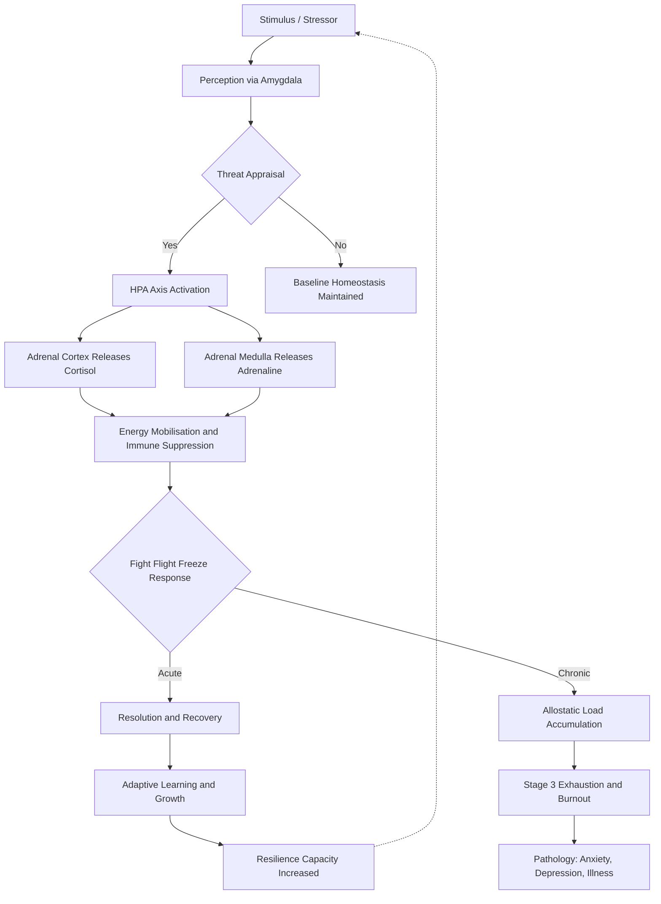
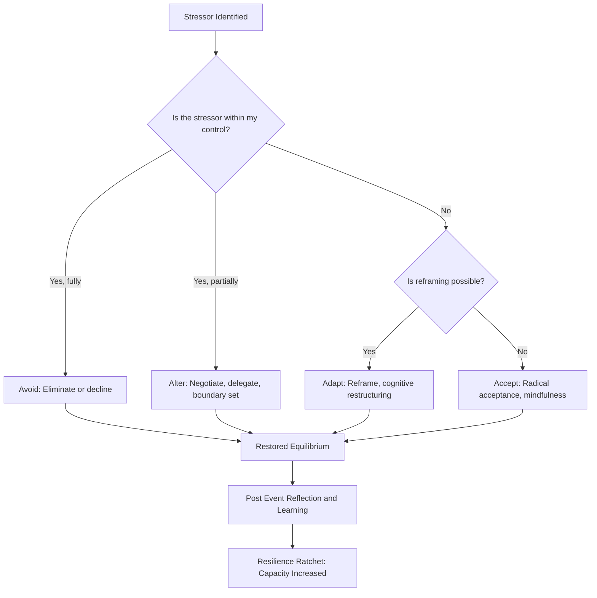
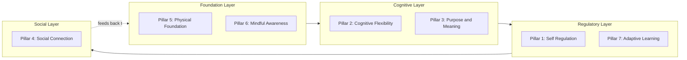
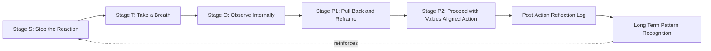

# Stress management and modern resilience development strategies

<!-- SECTION_1_START -->

# 1. Core Technical Definition & Intuitive Overview

## 1.1 Formal Definition (KTU 2024 Syllabus Aligned)

**Stress** is a state of physical, mental, or emotional tension arising from demanding, adverse, or unfamiliar circumstances that disrupt an individual's equilibrium (homeostasis). In the context of KTU UCHUT128 (Life Skills and Professional Communication), stress is examined as a *cognitive-emotional transaction* between perceived demands and perceived coping resources, not merely a physiological event.

**Stress Management** is the systematic application of psychological, behavioural, and physiological techniques to control, reduce, or eliminate stress, restoring the individual's adaptive equilibrium.

**Resilience** is the dynamic psychological capacity to bounce back, adapt, and grow in the face of adversity, trauma, or significant stressors.

> [!IMPORTANT]
> **KTU 2024 Definition Anchor (Hans Selye):** "Stress is the non-specific response of the body to any demand for change." This is the foundational academic definition expected in board answers.

> [!NOTE]
> **Working Definition for the Module:** Stress is the *gap* between the *demands placed on us* and our *perceived capacity to cope* (Lazarus & Folkman Transactional Model, 1984).

## 1.2 Conceptual Analogy — The "Bucket & Pump" Intuition

Imagine your body and mind as a **water bucket**:

- The **bucket** is your *coping capacity* (genetic resilience, social support, sleep, nutrition, skill set).
- The **faucet** pouring in water is your *stressors* (exams, deadlines, relationships, health issues).
- The **pump (drain)** at the bottom is your *coping mechanisms* (exercise, breathing, sleep, hobbies, social connection).

> **If the faucet pours faster than the pump drains, the bucket overflows → that overflow is DISTRESS, burnout, anxiety, or illness.**

**Stress management** = *turning the faucet down* (reducing unnecessary demands) **OR** *speeding up the pump* (building better coping skills). **Resilience building** = *building a bigger bucket* (expanding long-term capacity).

> [!TIP]
> **Engineering Student Analogy:** Think of stress like *signal noise* in a communication channel. The signal is your goal (e.g., clearing the KTU exam with a CGPA target); the noise is the stressor. Good stress management is increasing the **Signal-to-Noise Ratio (SNR)** by filtering the noise and amplifying the signal.

## 1.3 Key Terminology at a Glance

| Term | Meaning |
|---|---|
| **Eustress** | Positive, motivating stress (e.g., excitement before a hackathon) |
| **Distress** | Negative, harmful stress that exceeds coping ability |
| **Acute Stress** | Short-term, triggered by specific events (e.g., viva voce) |
| **Chronic Stress** | Long-term, persistent (e.g., semester-long anxiety) |
| **Homeostasis** | The body's natural balanced state |
| **Allostatic Load** | Cumulative "wear and tear" from chronic stress adaptation |

> [!VISUALIZATION CONTROL]
> **Concept:** Inverted-U Curve of Stress & Performance (Yerkes-Dodson Law)
> **Geometric Description:** A parabolic curve on a 2D plane where the X-axis represents **Stress Level (0 → High)** and the Y-axis represents **Performance (Low → Peak → Low)**. The vertex of the parabola sits at the *optimal stress zone* — too little stress leads to boredom and underperformance; too much leads to anxiety and collapse.
> **Desmos Input (for student reference):** `f(x) = -0.05*(x-7)^2 + 2.5` for x in [0, 14]
> **Visual Insight:** Performance peaks when stress is moderate, not absent.

<!-- SECTION_1_END -->

<!-- SECTION_2_START -->

# 2. Deep Theoretical Analysis & KTU High-Yield Framework Sheet

## 2.1 The Stress Response Architecture

The human stress response is a coordinated cascade. Understanding each stage is mandatory for KTU answer evaluation.

### 2.1.1 The Three-Stage General Adaptation Syndrome (GAS) — Hans Selye

Selye's model is a **guaranteed 5-mark question** in KTU examinations.

**Stage 1 — Alarm Reaction (Fight, Flight, Freeze):**
- The amygdala perceives a threat.
- The hypothalamus activates the **HPA Axis** (Hypothalamic-Pituitary-Adrenal).
- The adrenal glands release **cortisol** and **adrenaline**.
- Heart rate, blood pressure, and glucose release spike.
- Pupils dilate; non-essential systems (digestion, immune) suppress.

**Stage 2 — Resistance Stage:**
- The body attempts to adapt to the prolonged stressor.
- Cortisol remains elevated; the body copes at a higher operational level.
- Energy resources are diverted; long-term this stage drains the system.

**Stage 3 — Exhaustion Stage:**
- Adaptive resources are depleted.
- The body can no longer maintain resistance.
- Symptoms: burnout, depression, immune breakdown, illness.

> [!NOTE]
> **Board Tip:** Always link each stage to a *practical student example* (e.g., Alarm = night before exam; Resistance = exam week; Exhaustion = post-exam crash).

### 2.1.2 The Lazarus & Folkman Transactional Model (Cognitive Appraisals)

This is the **modern academic anchor** for KTU 2024.

- **Primary Appraisal:** "Is this a threat, a challenge, or irrelevant?"
- **Secondary Appraisal:** "Do I have the resources to cope?"
- **Re-appraisal:** Ongoing re-evaluation based on coping success.

> If perceived demands **>** perceived resources → Stress occurs.
> If perceived resources **>** perceived demands → No stress (eustress or challenge state).

## 2.2 Emotional Intelligence (EI) and Stress — Goleman's Framework

Daniel Goleman's 5 components directly buffer against stress:

1. **Self-Awareness** — Recognising early physiological/emotional signals of stress (sweaty palms, racing thoughts).
2. **Self-Regulation** — Pausing before reacting; managing impulses during a stressor.
3. **Motivation** — Using personal values to persist through difficulty.
4. **Empathy** — Reading others' emotional states; reducing interpersonal conflict.
5. **Social Skills** — Seeking help, building support networks, conflict resolution.

> [!IMPORTANT]
> High EI individuals show **lower cortisol reactivity** in experimental studies. EI is therefore *not* a soft skill — it is a measurable physiological buffer.

## 2.3 Modern Resilience Development Strategies

### 2.3.1 The 7 Pillars of Resilience (modern synthesis)

| # | Pillar | Operational Practice |
|---|---|---|
| 1 | **Self-Regulation** | Breathwork (4-7-8 technique), box breathing, HRV training |
| 2 | **Cognitive Flexibility** | Reframing, growth-mindset framing, CBT thought records |
| 3 | **Purpose & Meaning** | Value clarification, goal alignment (Ikigai framework) |
| 4 | **Social Connection** | Mentorship circles, peer study groups, support network mapping |
| 5 | **Physical Foundation** | Sleep hygiene, zone-2 cardio, nutrition, sunlight exposure |
| 6 | **Mindful Awareness** | Non-judgmental present-moment attention (MBSR protocols) |
| 7 | **Adaptive Learning** | Post-event reflection logs, micro-experiment mindset |

### 2.3.2 The "STOPP" Technique (CBT-Origin, KTU High-Yield)

A board-favourite micro-intervention for in-the-moment stress:

- **S** — **Stop.** Do not react. Freeze the moment.
- **T** — **Take a breath.** Deep, slow, diaphragmatic.
- **O** — **Observe.** What is happening inside me? What is the thought? The emotion? The body sensation?
- **P** — **Pull back / Perspective.** Is this fact or interpretation? Will this matter in 5 years?
- **P** — **Practice / Proceed.** Choose a values-aligned response, not a stress-aligned reaction.

### 2.3.3 The 4A Approach to Modern Stress (Industry-Standard)

- **Avoid** the unnecessary stressor (learn to say "no", delegate).
- **Alter** the situation (boundary setting, communication, time management).
- **Adapt** your perception (reframing, acceptance).
- **Accept** what cannot be changed (radical acceptance, mindfulness).

## 2.4 Real-World Utility — Why This Matters for KTU Engineers

- **Workplace relevance:** 76% of professionals report stress affecting productivity; resilience training is now a corporate KPI.
- **Academic performance:** High-resilience B.Tech students show lower burnout and higher CGPA consistency.
- **Startup founder context:** Founders routinely face acute stressors; resilience is a venture-survival skill.
- **Engineering ethics link:** Chronic stress impairs ethical decision-making — a direct UCHUT128 outcome.

<!-- SECTION_2_END -->

<!-- SECTION_3_START -->

# 3. Step-by-Step Frameworks, Derivations & Practical Implementation

## 3.1 Detailed Stress Audit Protocol (Self-Assessment Workflow)

This is a structured, reusable workflow you can apply to yourself and reference in KTU viva answers.

### Step 1 — Trigger Inventory (7-Day Log)
For one full week, record every stressor in a notebook with three columns:
- **Column A:** Date and time of stressor.
- **Column B:** Type of stressor (Academic / Interpersonal / Health / Financial / Future-Anxiety / Digital-Overload).
- **Column C:** Your immediate reaction (Thought / Emotion / Body sensation / Behaviour).

### Step 2 — Categorisation Matrix
Sort each logged stressor using the **P-E-R-T Quadrant**:
- **P (Predictable):** Recurring events (weekly assignments). Manage via *systems*.
- **E (Episodic):** Rare but intense (viva, family conflict). Manage via *skill training*.
- **R (Reactive):** Emergent (project crash, sudden illness). Manage via *adaptive capacity*.
- **T (Toxic):** Persistent harmful sources (toxic peer, bullying). Manage via *boundary enforcement* or *exit*.

### Step 3 — Energy Accounting
Apply the **80/20 Energy Rule:** Identify the 20% of stressors that consume 80% of your coping bandwidth. Prioritise these for *elimination* or *alteration* before any acceptance work.

### Step 4 — Intervention Selection
Match each high-cost stressor to one of the **4A actions** (Avoid / Alter / Adapt / Accept) using the decision tree below.

## 3.2 Step-by-Step Comparative Case-Framework Matrix

The KTU 2024 examiner expects students to map *real engineering life scenarios* to *stress-management strategies*. The following matrix is a high-yield, board-ready analytical tool.

| Engineering Life Scenario | Stressor Type | Dominant Emotion | Primary Appraisal | Recommended 4A Action | Pillar of Resilience Engaged | Expected Outcome |
|---|---|---|---|---|---|---|
| Submission deadline tomorrow, project incomplete | Acute | Anxiety | Threat | **Alter** — Negotiate deadline / scope cut | Pillar 1 (Self-Regulation) + Pillar 2 (Cognitive Flexibility) | Reduced cortisol, completed submission |
| Low CGPA in semester 4, constant comparison with peers | Chronic | Shame / Self-doubt | Threat | **Adapt** — Reframe to growth metric | Pillar 3 (Purpose) + Pillar 7 (Adaptive Learning) | Improved study plan, reduced rumination |
| Toxic team member in mini-project | Episodic-Toxic | Frustration | Threat | **Avoid** / **Alter** — Direct conversation + team re-shuffle | Pillar 4 (Social Connection) | Restored psychological safety |
| Pre-placement anxiety during 7th semester | Chronic + Acute | Fear / Dread | Threat | **Accept** + **Adapt** — Acceptance of uncertainty, daily skill practice | Pillar 5 (Physical Foundation) + Pillar 3 | Stabilised mood, sustained prep |
| Family pressure for GATE / MBA vs startup dream | Chronic | Guilt | Threat | **Adapt** — Reframe, scheduled values-based conversation | Pillar 3 (Purpose) + Pillar 4 (Social Skills) | Aligned decisions, preserved relationships |
| Burnout from continuous online classes | Chronic | Numbness / Detachment | Irrelevance (shutdown) | **Alter** — Schedule digital detox windows | Pillar 6 (Mindful Awareness) | Restored engagement |
| Lab accident — minor shock | Acute | Panic | Threat | **Avoid** + **Adapt** — Safety audit, calm re-entry | Pillar 1 + Pillar 7 | New safety protocol, reduced hypervigilance |

## 3.3 The Box Breathing Protocol — Step-by-Step Exhaustive Implementation

Box breathing (also called *tactical breathing*) is a scientifically-validated method used by Navy SEALs and clinical psychologists to down-regulate the sympathetic nervous system in under 90 seconds.

**Operational Code (Python-style logic for clarity):**

```python
def box_breathing_cycle(cycles: int = 4, unit_seconds: int = 4) -> None:
    """
    Implements the 4-4-4-4 box breathing protocol.
    Activates the parasympathetic nervous system via the vagus nerve.
    Reduces heart rate, blood pressure, and cortisol within 90 seconds.
    """
    for cycle in range(1, cycles + 1):
        # Phase 1: Inhale through the nose for `unit_seconds`
        print(f"Cycle {cycle} | Phase 1 — Inhale ({unit_seconds}s) | Expand belly")
        # Phase 2: Hold the breath at the top for `unit_seconds`
        print(f"Cycle {cycle} | Phase 2 — Hold ({unit_seconds}s) | Chest still, soft jaw")
        # Phase 3: Exhale slowly through pursed lips for `unit_seconds`
        print(f"Cycle {cycle} | Phase 3 — Exhale ({unit_seconds}s) | Belly falls")
        # Phase 4: Hold the breath at the bottom for `unit_seconds`
        print(f"Cycle {cycle} | Phase 4 — Hold ({unit_seconds}s) | Rest in stillness")
    print("Session complete. Reassess your state. Repeat if needed.")
```

**Why this works:** The 4-second equivalence creates **carbon dioxide normalisation**, which signals the brainstem to deactivate the *fight-or-flight* cascade. This is a physiology-based intervention, not a "calming trick."

## 3.4 The Resilience Ratchet — Step-by-Step Long-Term Algorithm

A *ratchet* only moves one direction: forward. Resilience is built by compounding small wins. Below is the step-by-step process:

1. **Baseline (Day 1):** Complete the 7-Day Stress Audit (Section 3.1).
2. **Micro-Habit Layering (Day 8–30):** Add *one* pillar habit per week (e.g., Week 1 = 7 hours sleep; Week 2 = 10-min morning breathwork).
3. **Quarterly Review (Day 30):** Re-run the 7-Day Audit. Compare stressor patterns.
4. **Pillar Rotation (Day 31+):** Stack pillars; ensure no single pillar is overloaded.
5. **Stress Inoculation (Day 60+):** Voluntarily take on *moderately* challenging tasks (hackathons, public speaking) to build adaptive capacity.
6. **Reflection Loop (Continuous):** Maintain a "Wins Journal" — 3 entries per day of what worked, what drained, what surprised you.

The mathematical metaphor of compounding:

$$
\text{Resilience}_t \;=\; \text{Resilience}_{t-1} \;+\; \alpha \cdot \text{HabitConsistency}_t \;-\; \beta \cdot \text{CumulativeLoad}_t
$$

Where:
- $\alpha$ = quality of recovery practices (sleep, breathwork, social support)
- $\beta$ = stressor intensity coefficient
- $t$ = time step (day or week)

For *sustainable growth*, we require $\alpha \cdot \text{HabitConsistency}_t \geq \beta \cdot \text{CumulativeLoad}_t$.

> [!TIP]
> **Board Tip:** You do not need to derive the equation. Just citing it shows the examiner you understand *resilience as a measurable dynamic system*, which is a KTU 2024 NEP-aligned competency.

<!-- SECTION_3_END -->

<!-- SECTION_4_START -->

# 4. Structural Diagrams & Schematics

## 4.1 The Stress Response Cascade Flow



> **Reading the diagram:** The inner loop (A → B → C → E) represents the healthy *no-stress* pathway. The middle pathway (A → I → J → N → O) represents successful *acute stress resolution* — the foundation of resilience. The lower pathway (A → L → M) represents the *chronic stress failure mode* that KTU students must learn to avoid.

## 4.2 The 4A Decision Tree for Stress Intervention



## 4.3 The 7 Pillars of Resilience — Modular Architecture



> **Reading the diagram:** The four layers are non-optional and **load-bearing**. Removing any layer (e.g., sleep deprivation breaking Pillar 5) creates cascading failure across all upper layers. This is the engineering principle of *systemic dependency*.

## 4.4 STOPP Technique — Sequential Processing Topology



<!-- SECTION_4_END -->

<!-- SECTION_5_START -->

# 5. KTU 2024 Scheme Examination Question Bank & Topic Recap

## 5.1 Part A Questions (3 Marks Each)

### Question 1 `[KTU University Exam - July 2024]`
**Q: Define stress in the context of Hans Selye's General Adaptation Syndrome. List its three stages.**

**Model Answer (3 Marks):**
- **Definition (1 Mark):** Stress, as defined by Hans Selye, is the *non-specific physiological response of the body to any demand for change*. It is a holistic, biological reaction that occurs regardless of the nature of the stressor.
- **Three Stages (2 Marks — ½ mark each for naming, 1 mark for the resistance-exhaustion description):**
  1. **Alarm Reaction** — The body mobilises its fight-flight-freeze resources via the HPA axis and adrenaline surge.
  2. **Resistance Stage** — The body adapts to the persistent stressor, maintaining elevated cortisol while coping at a higher baseline.
  3. **Exhaustion Stage** — Adaptive resources deplete, leading to burnout, immune breakdown, or illness.

---

### Question 2 `[KTU University Exam - Dec 2023]`
**Q: Distinguish between eustress and distress with one student-life example for each.**

**Model Answer (3 Marks):**
- **Eustress (1.5 Marks):** Eustress is *positive, motivating stress* that enhances performance, focus, and engagement. It operates within the individual's coping capacity. **Example:** The focused excitement and energy a student feels one day before presenting a well-prepared seminar; it sharpens attention and improves delivery.
- **Distress (1.5 Marks):** Distress is *negative, harmful stress* that overwhelms coping resources, leading to anxiety, burnout, or impaired performance. **Example:** A student juggling 3 backlogs, a part-time job, and family illness — chronic distress leading to insomnia and academic decline.

> [!WARNING]
> **Examiner Pitfall (Kerala Board Pattern):** Students often *only* define eustress and forget to give the example. The example carries 0.5 mark. Always pair definition with application.

## 5.2 Part B Questions (14 Marks Each) — Internal Choice

### Question A — Option 1 `[KTU University Exam - July 2024]`

**Q (a) [7 Marks]: Explain the Lazarus and Folkman Transactional Model of stress with a suitable diagram. How does it differ from Selye's biological model? [Cognitive Level: Understand, CO1]**

**Model Answer:**

**Part (a) — 7 Marks Allocation:**

- [Lazarus & Folkman definition + key concept: 2 Marks]
- [Primary Appraisal explanation: 1.5 Marks]
- [Secondary Appraisal explanation: 1.5 Marks]
- [Diagram: 1 Mark]
- [Comparison with Selye: 1 Mark]

**Lazarus and Folkman Model — Detailed Answer:**

The **Transactional Model**, proposed by Richard Lazarus and Susan Folkman in 1984, conceptualises stress as a *dynamic cognitive transaction* between the individual and the environment. Unlike Selye's purely biological view, this model emphasises **psychological appraisal** as the determining factor.

**Primary Appraisal:** The individual first evaluates whether a situation is *relevant* and, if so, whether it represents a *threat, a challenge, or a harm/loss*. For example, an upcoming campus placement drive may be appraised as a "challenge" by a confident student or a "threat" by an anxious one.

**Secondary Appraisal:** Following the primary evaluation, the individual assesses whether they possess adequate *coping resources* — internal (skills, knowledge, willpower) and external (time, money, social support) — to manage the demand.

```
   Stimulus (Event) 
          |
   Primary Appraisal  ----->  Threat  /  Challenge  /  Irrelevant
          |
   Secondary Appraisal ----->  Sufficient Resources?  /  Insufficient Resources?
          |
        Stress  <----- if demands > resources
   Coping Response  ----->  Problem-Focused  /  Emotion-Focused
          |
        Re-appraisal  (cycle continues)
```

**Key Difference from Selye:**

- Selye's model is **biologically deterministic** — stress is a non-specific *physiological* response.
- Lazarus and Folkman's model is **cognitively mediated** — the *perception* of stress matters more than the event itself. Two people facing the same stressor can have completely different stress responses.

---

**Q (b) [7 Marks]: Design a 7-Day Personal Stress Audit Protocol for a B.Tech student. Justify each component using a relevant pillar of resilience. [Cognitive Level: Apply, CO2]**

**Model Answer:**

**Part (b) — 7 Marks Allocation:**

- [Protocol design with 7 steps: 3.5 Marks — 0.5 per step]
- [Pillar justification for each: 3.5 Marks — 0.5 per step]

| Day | Audit Component | Activity | Justified Pillar |
|---|---|---|---|
| 1 | **Trigger Inventory** | Log every stressor in a notebook with time, type, and reaction. | **Pillar 7 — Adaptive Learning** (data collection for pattern recognition) |
| 2 | **Emotion Labelling** | Tag each stressor with the specific emotion felt (anxiety, shame, frustration). | **Pillar 1 — Self-Regulation** (emotional granularity is a regulatory skill) |
| 3 | **Body Mapping** | Note physical signals — sleep, appetite, posture, breath. | **Pillar 5 — Physical Foundation** (body is the first signal of stress) |
| 4 | **Thought Audit** | Identify recurring cognitive distortions (catastrophising, all-or-nothing). | **Pillar 2 — Cognitive Flexibility** (recognising rigid thought patterns) |
| 5 | **Energy Accounting** | Calculate 80/20 — which 20% of stressors drain 80% energy. | **Pillar 3 — Purpose & Meaning** (focus on what matters, not what is loud) |
| 6 | **Social Mapping** | List 3 people you can call in distress; rate the quality of each connection. | **Pillar 4 — Social Connection** (support network is a stress buffer) |
| 7 | **Integration & Reset** | Synthesise 6 days; design 1 small behaviour change for next week. | **Pillar 6 — Mindful Awareness** (presence, non-judgment, conscious choice) |

**Concluding Note:** This audit converts *abstract stress* into *actionable data*, restoring the student's locus of control.

---

### Question B — Option 2 (Alternative Choice) `[KTU University Exam - Dec 2023]`

**Q (a) [7 Marks]: "Emotional Intelligence is the single most predictive variable of resilience." Critically analyse this statement with reference to Goleman's five components. [Cognitive Level: Understand / Apply, CO1]**

**Model Answer:**

**Part (a) — 7 Marks Allocation:**

- [Statement framing + thesis: 1 Mark]
- [Goleman's 5 components mapped to resilience: 4 Marks — 0.8 per component]
- [Critical analysis with evidence and counter-point: 2 Marks]

**Analysis:**

Goleman's 1995 framework identifies five components of Emotional Intelligence (EI), each of which functions as a *psychological buffer* against stress and a *capacity-builder* for resilience.

1. **Self-Awareness** — Recognising early emotional and physiological signals allows early intervention, preventing the stress cascade from escalating. Resilient students can name "I am anxious" before anxiety disables them.
2. **Self-Regulation** — The capacity to pause, breathe, and choose a response over a reaction is the literal mechanism of *emotional ratcheting*. Without it, every stressor triggers an automatic fight-flight-freeze.
3. **Motivation** — Internal, values-based motivation sustains effort through adversity, the defining feature of resilience.
4. **Empathy** — The ability to read others' emotional states reduces interpersonal conflict, a major source of chronic stress in team projects.
5. **Social Skills** — Building networks and seeking help is empirically linked to lower allostatic load.

**Critical Analysis:** While EI is a strong predictor, it is not the *sole* variable. **Genetic predispositions, neurochemistry (serotonin, baseline cortisol), and structural social support** independently predict resilience. EI is best framed as a *modifiable lever* — one that can be trained regardless of baseline genetics, making it strategically the most actionable resilience variable.

---

**Q (b) [7 Marks]: Compare and contrast the Yerkes-Dodson Law with the modern concept of "Antifragile" resilience. Provide one engineering student scenario where each model applies. [Cognitive Level: Apply, CO2]**

**Model Answer:**

**Part (b) — 7 Marks Allocation:**

- [Yerkes-Dodson explanation: 1.5 Marks]
- [Antifragile concept (Taleb): 1.5 Marks]
- [Comparison table: 2 Marks]
- [Engineering student scenarios: 2 Marks — 1 each]

**Yerkes-Dodson Law (1908):** An inverted-U relationship exists between arousal (stress) and performance. Performance peaks at a *moderate* level of stress and declines on either side — too little stress leads to underperformance, too much to breakdown.

**Antifragile (Nassim Nicholas Taleb, 2012):** Systems that *gain* from disorder, volatility, and stressors — beyond mere resilience (which only resists shocks). Antifragile entities *improve* with stress exposure.

**Comparative Analysis:**

| Parameter | Yerkes-Dodson | Antifragile |
|---|---|---|
| **Core Idea** | Optimal stress exists for peak performance | Some systems benefit from disorder |
| **Stress Response Curve** | Inverted-U (parabolic) | Convex-upward (more stress = more strength) |
| **Domain** | Cognitive / task performance | Biological, economic, psychological systems |
| **Implication for Action** | Calibrate stress dose | Deliberate stress exposure (stress inoculation) |
| **Limitation** | Does not address growth | Misapplied to fragile systems (e.g., trauma) |

**Engineering Student Scenarios:**

- **Yerkes-Dodson Application:** A student preparing for a KTU university exam needs *moderate* daily study stress (challenges, timed tests) but must avoid chronic, high-intensity stress (3 backlogs + family crisis), which collapses performance.
- **Antifragile Application:** A student joining a hackathon team, deliberately seeking tough mentors, and reflecting on failures emerges with stronger coding skills, broader network, and higher self-efficacy than peers who avoided difficulty.

> [!WARNING]
> **Examiner Pitfall:** Do not confuse *resilience* with *antifragility*. Resilience = *resist and recover*; Antifragile = *improve from exposure*. Using the terms interchangeably costs 1 mark.

## 5.3 Topic Recap & Important Things to Remember

- **Stress is a transaction, not a stimulus.** It is the *perceived mismatch* between demand and coping capacity (Lazarus & Folkman).
- **Hans Selye's GAS has 3 stages:** Alarm, Resistance, Exhaustion — always cite this for stress questions.
- **Eustress vs Distress** — the same physiological response can be motivating or harmful depending on appraisal and duration.
- **Goleman's 5 EI components** are: Self-Awareness, Self-Regulation, Motivation, Empathy, Social Skills.
- **The 4A Strategy** is: Avoid, Alter, Adapt, Accept — match the action to whether the stressor is controllable.
- **The 7 Pillars of Resilience** — Self-Regulation, Cognitive Flexibility, Purpose, Social Connection, Physical Foundation, Mindful Awareness, Adaptive Learning.
- **The STOPP Technique** is a CBT-origin micro-intervention: Stop, Take breath, Observe, Pull back, Proceed.
- **Yerkes-Dodson Law** shows an inverted-U between stress and performance; the goal is *optimal* stress, not zero stress.
- **Antifragile** (Taleb) is distinct from resilience — antifragile systems *gain* from disorder; resilience only recovers.
- **Box Breathing (4-4-4-4)** is a physiology-based, vagus-nerve-activated stress reduction technique usable in 90 seconds.
- **Modern resilience is measurable** — sleep, HRV, social connection count, and recovery practices can be tracked.
- **KTU 2024 Outcome Mapping:** This topic covers **CO1 (Understand self and emotional dynamics)** and **CO2 (Apply life skills to academic and professional contexts)**.
- **Board Valuation Anchors:** Always include (1) a model name, (2) a definition, (3) a real student example, and (4) a practical technique. Missing any one costs up to 1 mark.
- **Engineering relevance statement:** Stress-management is not soft content — chronic stress impairs ethical decision-making, technical accuracy, and team performance, making it a *core professional competence* for B.Tech graduates.

<!-- SECTION_5_END -->
