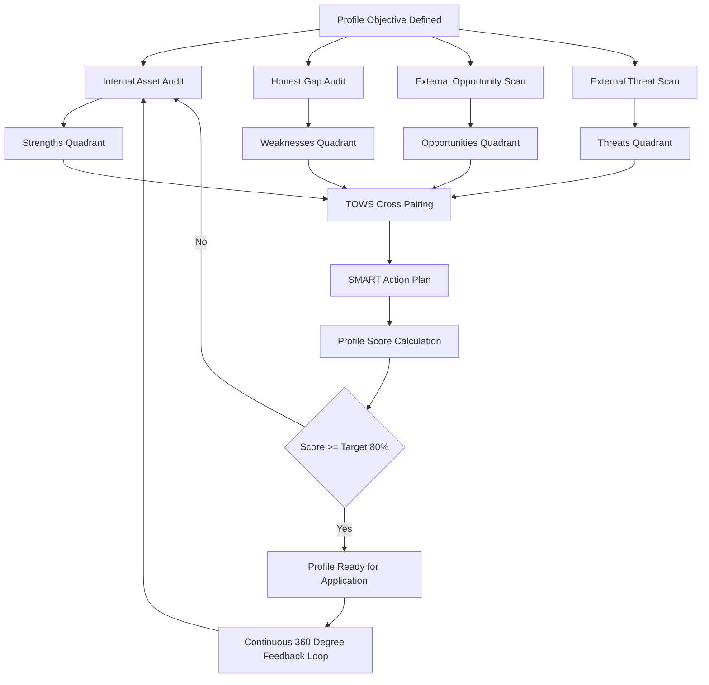
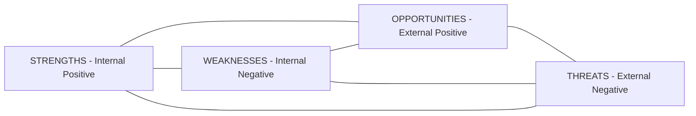
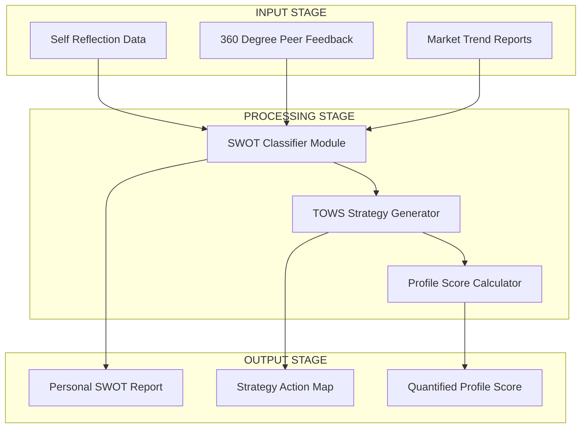

# SWOT Analysis applied to profile development metrics

<!-- SECTION_1_START -->
# SWOT Analysis Applied to Profile Development Metrics

## 1.1 Formal Academic Definition (KTU 2024 Syllabus Terminology)

> [!IMPORTANT]
> **SWOT Analysis** is a strategic planning and reflective framework that evaluates an individual's **profile development** potential by categorising internal and external factors into four quadrants: **S**trengths, **W**eaknesses, **O**pportunities, and **T**hreats. In the context of the UCHUT128 (Life Skills and Professional Communication) syllabus, it is positioned as a **self-awareness diagnostic tool** under Module 1, bridging personal introspection with professional competency mapping.

The term was conceptualised by **Albert Humphrey** during the Stanford Research Institute studies (1960s) and is now a cornerstone instrument in **career engineering**, **employability skill audits**, and **professional branding**.

> [!NOTE]
> **Profile Development Metrics** refers to the quantifiable and qualitative parameters used by recruiters, HR analysts, and career counsellors to benchmark a candidate's readiness for a specific role or industry vertical. The four classic metrics assessed are: **Knowledge Index**, **Skill Quotient (SQ)**, **Attitude Compass**, and **Experience Vector**.

---

## 1.2 Conceptual Analogy & Intuition

Think of a **SWOT analysis of your personal profile** as a **medical diagnostic scan combined with a weather forecast**:

* **Strengths** = Your body's healthy organs (internal, positive, controllable).
* **Weaknesses** = Your body's health concerns that need attention (internal, negative, controllable).
* **Opportunities** = A sunny week ahead with a marathon open for registration (external, positive, partially controllable).
* **Threats** = An incoming storm or competitive race with elite runners (external, negative, mostly uncontrollable).

Just as a doctor combines a **CT scan (internal)** with an **environment report (external)** to give a complete health prescription, a B.Tech student combines their **internal competencies** with **external industry signals** to engineer a career prescription.

> [!TIP]
> **Engineering Parallel:** If your B.Tech project is a system, then SWOT is the **Feasibility Analysis Report (FAR)** + **Risk Assessment Matrix (RAM)** rolled into one, applied to the *engineer* instead of the *engineered product*.

---

## 1.3 The 2x2 Strategic Matrix (Visualisation Control Block)

> [!VISUALIZATION CONTROL]
> **Concept:** SWOT Internal-External Quadrant Map
> **GeoGebra / Desmos Input Equations:**
> * `x = 0` (Vertical Axis: Internal <-> External)
> * `y = 0` (Horizontal Axis: Helpful <-> Harmful)
> * Quadrant I (Top-Right): `x > 0, y > 0`  Label: "STRENGTHS"
> * Quadrant II (Top-Left):  `x < 0, y > 0`  Label: "WEAKNESSES"
> * Quadrant III (Bottom-Left): `x < 0, y < 0`  Label: "THREATS"
> * Quadrant IV (Bottom-Right): `x > 0, y < 0`  Label: "OPPORTUNITIES"
> **Visual Description:** A standard 2x2 Cartesian plane where the y-axis separates *Helpful* (top) from *Harmful* (bottom) factors, and the x-axis separates *Internal* (origin attributes) from *External* (environment attributes). The student should observe that Strengths and Weaknesses are mirrored across the vertical axis, while Opportunities and Threats are mirrored across the horizontal axis.

---
<!-- SECTION_1_END -->

<!-- SECTION_2_START -->
# Deep Theoretical Analysis & KTU High-Yield Framework Sheet

## 2.1 Deconstructing the Four Quadrants

### **S — Strengths (Internal, Helpful)**
* **Definition:** Inherent capabilities, acquired skills, certifications, personality traits, and resources that give you a competitive edge.
* **Why it matters:** Strengths are the *building blocks* of your personal brand. They answer the question, *"What do I do better than 80\% of my peer group?"*
* **Engineering Example:** Proficiency in Python, strong GPA in Data Structures, leadership as a student council member, published IEEE paper, multilingual communication.

### **W — Weaknesses (Internal, Harmful)**
* **Definition:** Internal limitations, skill gaps, behavioural patterns, or resource constraints that impede performance.
* **Why it matters:** Honest identification of weaknesses is the *first step* in self-correction. Unacknowledged weaknesses are blind spots that recruiters and interviewers always detect.
* **Engineering Example:** Stage fear, weak quantitative aptitude, poor time management, lack of industry internships, no LinkedIn presence.

### **O — Opportunities (External, Helpful)**
* **Definition:** Favourable external conditions, trends, or events in the job market or industry that you can leverage if prepared.
* **Why it matters:** Opportunities are *time-bound*. A B.Tech student must scan the industry horizon every semester to align skills with demand.
* **Engineering Example:** AI/ML hiring boom in Kerala startups, government *Kerala Knowledge Economy Mission* (KKEM) fellowships, free AWS certifications, KTU-hackathon circuits.

### **T — Threats (External, Harmful)**
* **Definition:** Unfavourable external conditions such as market saturation, automation, economic downturns, or competitive pressure that can derail career goals.
* **Why it matters:** Threats are usually *not under your control*, but *your response* to them is. Threat awareness builds **resilience**.
* **Engineering Example:** Mass layoffs in IT sector, automation of entry-level coding jobs via LLMs, recession reducing campus placements, aggressive competition from Tier-1 NIT/IIT graduates.

---

## 2.2 The TOWS Strategic Matrix (Weihrich, 1982)

The true power of SWOT emerges when quadrants are *cross-paired* to generate actionable strategies. This is called the **TOWS Matrix**:

| Generated Strategy | Pairing | Strategic Question | Career Action Example |
| :--- | :--- | :--- | :--- |
| **SO — Maxi-Maxi (Growth)** | Strengths $\times$ Opportunities | "How do I use my strengths to grab available opportunities?" | Use strong Python skills (S) to apply for an AI internship posted on Internshala (O). |
| **WO — Mini-Maxi (Re-engineering)** | Weaknesses $\times$ Opportunities | "How do I overcome weaknesses using external opportunities?" | Overcome weak public speaking (W) by joining the KTU-mandated *Toastmasters* club on campus (O). |
| **ST — Maxi-Mini (Defensive)** | Strengths $\times$ Threats | "How do I use strengths to neutralise threats?" | Use my strong aptitude (S) to crack GATE 2026 and bypass the campus placement slowdown (T). |
| **WT — Mini-Mini (Diversification)** | Weaknesses $\times$ Threats | "How do I minimise both to survive?" | With low coding skills (W) and layoff threats (T), pivot to a management trainee (MT) programme via campus placement. |

---

## 2.3 KTU High-Yield Framework Sheet (Cheat Sheet)

> [!NOTE]
> Use this table as the **last-page revision sheet** for Module 1 ESE preparation.

| Parameter | Strengths (S) | Weaknesses (W) | Opportunities (O) | Threats (T) |
| :--- | :--- | :--- | :--- | :--- |
| **Nature** | Internal | Internal | External | External |
| **Orientation** | Positive | Negative | Positive | Negative |
| **Control Level** | Fully controllable | Fully controllable | Partially controllable | Mostly uncontrollable |
| **Time Horizon** | Present-focused | Present-focused | Future-oriented | Future-oriented |
| **Data Source** | Self-reflection, 360° feedback | Self-reflection, peer review | Market research, LinkedIn trends | Industry reports, news |
| **Profile Metric** | Skill Quotient $\uparrow$ | Skill Quotient $\downarrow$ | Market Alignment $\uparrow$ | Risk Exposure $\uparrow$ |
| **Example Tool** | SWOC template, MBTI | Johari Window | PESTLE analysis | Porter's Five Forces |
| **Engineering Use** | Resume highlights | Skill-gap remediation plan | Internship scouting | Career pivot planning |

> [!TIP]
> **Mnemonic for Exam Hall:** **"I-HEal"** — **I**nternal vs **H**armful vs **E**xternal — read the quadrants clockwise from top-right.

---

## 2.4 Real-World Utility in Engineering and Computer Science

* **Recruitment Pipelines:** Companies like TCS (TCS iON), Infosys (InfyTQ), and Wipro use SWOT-style competency rubrics during campus placement shortlisting.
* **Startup Founding:** Y Combinator and Kerala Startup Mission (KSUM) require founders to present a personal SWOT alongside the product SWOT during incubation pitches.
* **Personal Branding:** LinkedIn algorithm rewards profiles that demonstrate clear **strengths + opportunity alignment** through keyword-rich skill endorsements.
* **Higher Education:** GATE, GRE, and CAT aspirants use SWOT to allocate the 6-month preparation budget across weak and strong subjects.
* **HR Analytics:** Modern ATS (Applicant Tracking Systems) parse resumes and compare them against a *job-SWOT profile* the recruiter has built.

---
<!-- SECTION_2_END -->

<!-- SECTION_3_START -->
# Step-by-Step Application, Derivations & Implementation

## 3.1 The 7-Step Personal SWOT Protocol (Profile Development Workflow)

Below is the **exhaustive, sequential protocol** that a KTU B.Tech student must follow to convert a SWOT template into a measurable profile development instrument.

### **Step 1 — Define the Profile Objective (The "Why")**
Before listing any factor, articulate the *target role or academic outcome*. Without a target, SWOT becomes a list, not a strategy.
* **Example Target:** "Secure a 6-month AI/ML internship at a Kerala-based startup by December 2026."

### **Step 2 — Brainstorm Strengths (The "Internal Asset Audit")**
List **5 to 8** specific strengths. Each strength must be *evidence-backed* (a certificate, project, award, or measurable outcome).
* **Example Strengths:**
    1. **Python proficiency** — Solved 200+ LeetCode problems (verified profile).
    2. **Project leadership** — Led a 4-member team in the KTU Hackathon 2024.
    3. **Communication** — Anchored the college tech fest (audience: 500+).
    4. **Academic record** — 8.7 CGPA up to Semester 5.

### **Step 3 — Brainstorm Weaknesses (The "Honest Gap Audit")**
List **3 to 5** weaknesses. Avoid *false modesty* (e.g., "I work too hard") and *defensive denial*. Use peer feedback to validate.
* **Example Weaknesses:**
    1. **No industry internship** exposure yet.
    2. **Fear of cold-emailing** recruiters.
    3. **Limited cloud computing** knowledge (AWS/Azure).

### **Step 4 — Scan the External Environment for Opportunities**
Use platforms such as LinkedIn Job Insights, Naukri, Internshala, and KTU's Career Guidance Cell to extract 5 to 8 macro-level opportunities.
* **Example Opportunities:**
    1. **KSUM Innovation Grant** of ₹2 lakh for student AI prototypes.
    2. **Free AWS Cloud Practitioner** voucher via KTU MoU.
    3. **Google Developer Student Clubs (GDSC)** workshops on campus.

### **Step 5 — Scan the External Environment for Threats**
List 3 to 5 macro-level threats. Cite sources (news article, placement report, etc.) to make the threat *defensible* in interviews.
* **Example Threats:**
    1. **AI-driven automation** of entry-level coding roles (per WEF Future of Jobs 2025 report).
    2. **Placement crunch** in Kerala IT sector in 2024-25 (per Manorama news dated 12-Mar-2024).

### **Step 6 — Cross-Pair into the TOWS Matrix**
Map each Strength, Weakness, Opportunity, and Threat to generate the **four strategy rows** as shown in Section 2.2.

### **Step 7 — Convert Strategy into a Measurable Action Plan**
Every TOWS cell must yield **one SMART action** (Specific, Measurable, Achievable, Relevant, Time-bound).
* **Example SMART Action:** "Complete AWS Cloud Practitioner certification by **30 November 2026** (Measurable) using the KTU free voucher (Achievable) to address the cloud-computing weakness (Relevant) and leverage the AWS MoU opportunity (Time-bound)."

---

## 3.2 Tabular Comparative Analysis: Engineering Case Frameworks vs Systemic Matrices

> [!IMPORTANT]
> The following table maps **real-world engineering student scenarios** to **systemic diagnostic matrices** that recruiters and academic counsellors use. This is a high-yield KTU Part B answer component.

| Real-World Engineering Case Framework | Systemic Diagnostic Matrix Used | Parameters Evaluated | Outcome Metric |
| :--- | :--- | :--- | :--- |
| Final-year B.Tech student targeting **software product companies** | Personal SWOT + PESTLE | Skills, GPA, projects, market trends, geopolitics | Resume shortlist rate |
| Aspiring **GATE 2026** candidate aiming for IIT M.Tech | SWOT + Time-Allocation Matrix | Subject-wise strength, weak topics, coaching availability | Expected GATE score (out of 1000) |
| Student **founder** pitching to KSUM incubator | Personal SWOT + Lean Canvas | Domain expertise, team gaps, market size, competitor density | Funding approval probability |
| **Career pivot** from core electrical to data science | SWOT + Skill-Gap Heatmap | Transferable strengths, missing certifications, family support | Transition timeline (months) |
| Student preparing for **civil services** (UPSC) alongside B.Tech | SWOT + Pomodoro Discipline Matrix | Reading speed, optional subject, peer group, peer pressure | Prelims clearance rank band |
| Campus placement for **non-coding roles** (consulting, banking) | SWOT + Communication Rubric | Aptitude, GD/PI skills, extra-curriculars, current market | Interview conversion rate |
| **Freelancing** during B.Tech (Fiverr, Upwork) | SWOT + Portfolio Audit | Niche skill, English fluency, client reviews, payment risk | Monthly revenue (USD) |

---

## 3.3 Symbolic / Schematic Representation of the SWOT-to-Profile Pipeline

The following LaTeX block expresses the SWOT-to-Profile conversion as a **functional equation**, where the final Profile Score is a function of internal and external factors.

$$
P_{score} = f(S, W, O, T, \alpha, \beta)
$$

$$
P_{score} = \left( \alpha \cdot \frac{S - W}{S + W + 1} \right) + \left( \beta \cdot \frac{O - T}{O + T + 1} \right)
$$

$$
\alpha + \beta = 1, \quad \alpha, \beta \in [0, 1]
$$

**Where:**
* $P_{score}$ = Personal Profile Development Score (range: $-1$ to $+1$, then normalised to $0$–$100$).
* $S$ = Numerical weight of strengths (sum of evidence-backed strengths, 0–10 scale).
* $W$ = Numerical weight of weaknesses (sum of acknowledged weaknesses, 0–10 scale).
* $O$ = Numerical weight of opportunities (count of validated opportunities, 0–10 scale).
* $T$ = Numerical weight of threats (count of validated threats, 0–10 scale).
* $\alpha$ = Importance weight given to *internal* factors (typical value: $0.6$).
* $\beta$ = Importance weight given to *external* factors (typical value: $0.4$).

> [!TIP]
> The **+1 in the denominator** prevents division by zero when both S and W (or O and T) are zero — a common edge-case students miss in viva voce.

**Worked Numerical Example:**
Let $S = 8$, $W = 3$, $O = 6$, $T = 4$, $\alpha = 0.6$, $\beta = 0.4$.

$$
\alpha \cdot \frac{S - W}{S + W + 1} = 0.6 \cdot \frac{8 - 3}{8 + 3 + 1} = 0.6 \cdot \frac{5}{12} = 0.6 \cdot 0.4167 = 0.250
$$

$$
\beta \cdot \frac{O - T}{O + T + 1} = 0.4 \cdot \frac{6 - 4}{6 + 4 + 1} = 0.4 \cdot \frac{2}{11} = 0.4 \cdot 0.1818 = 0.0727
$$

$$
P_{score} = 0.250 + 0.0727 = 0.3227
$$

Normalised to a 0–100 scale: $P_{norm} = (0.3227 + 1) \times 50 = \mathbf{66.13 / 100}$.

This quantifies the student's profile readiness as **66.13\%**, which can be benchmarked against a target of 80\% for top-tier placements.

---
<!-- SECTION_3_END -->

<!-- SECTION_4_START -->
# Structural Diagrams & Schematics

## 4.1 Mermaid Diagram: The SWOT-to-Profile Development Pipeline

> [!NOTE]
> **Mermaid Safety Applied:** All node IDs are alphanumeric (e.g., `node1`-style substituted with descriptive alphanumerics like `A`, `B`, `F`). All labels are double-quoted, uppercase, and contain no markdown formatting tags. No reserved keywords (`end`, `subgraph`) are used as standalone node IDs.

---

## 4.2 Mermaid Diagram: Quadrant Relationships (Internal vs External)

**Reading Guide for the Student:**
* The **vertical axis** separates *Internal* (S, W) from *External* (O, T) factors.
* The **horizontal axis** separates *Helpful* (S, O) from *Harmful* (W, T) factors.
* **Diagonal relationships** (S-T and W-O) generate the *defensive* and *re-engineering* strategies in the TOWS matrix.

---

## 4.3 Block-Level Functional Architecture Flow: SWOT Engine

**Subgraph Justification (Block Diagram Fallback for Physical Drawing):**
* The Input Stage accepts three data streams: introspective (I1), peer-validated (I2), and market-sourced (I3).
* The Processing Stage contains the three computational modules of a SWOT engine: classifier, strategy generator, and score calculator.
* The Output Stage delivers three deliverables: qualitative report, action map, and quantitative benchmark.

---
<!-- SECTION_4_END -->

<!-- SECTION_5_START -->
# KTU 2024 Scheme Examination Question Bank & Topic Recap

## 5.1 Part A Questions (3 Marks Each)

### **Question 1** `[KTU University Exam - July 2024]`
**Define SWOT analysis. List any four internal factors that a B.Tech student should consider while conducting a personal SWOT for campus placement preparation. (CO1, Remember)**

**Model Answer (Valuation Key):**
* **SWOT Definition [1 Mark]:** SWOT is a strategic self-awareness framework that classifies personal and professional factors into **S**trengths (internal, positive), **W**eaknesses (internal, negative), **O**pportunities (external, positive), and **T**hreats (external, negative).
* **Four Internal Factors [2 Marks, 0.5 each]:**
    1. Technical proficiency in core subjects (e.g., Data Structures, Digital Electronics).
    2. Communication and presentation skills.
    3. Academic record (CGPA, backlogs).
    4. Leadership and teamwork experience (e.g., project lead, club coordinator).

---

### **Question 2** `[KTU University Exam - Dec 2023]`
**Differentiate between 'Strengths' and 'Opportunities' in a personal SWOT analysis. Give one example of each from an engineering student's profile. (CO1, Understand)**

**Model Answer (Valuation Key):**
* **Conceptual Difference [1.5 Marks]:**
    * **Strengths** are *internal* attributes that reside within the individual (e.g., a skill you possess, a trait you exhibit). They are **fully under your control**.
    * **Opportunities** are *external* favourable conditions in the environment (e.g., a job opening, a scholarship, a market trend). They are **partially under your control** — you can choose to act on them, but you cannot create them out of nothing.
* **Engineering Examples [1.5 Marks, 0.75 each]:**
    * **Strength Example:** "Proficiency in Python and TensorFlow demonstrated through a final-year AI project."
    * **Opportunity Example:** "The Kerala Startup Mission (KSUM) Innovation Grant announced in October 2024 for student AI prototypes."

---

## 5.2 Part B Questions (14 Marks Each — Module Internal Choice)

### **Question A** `[KTU University Exam - July 2024]`

#### **Part (a) — 7 Marks** (CO2, Understand)
**Explain the four quadrants of a personal SWOT analysis in detail. Using a 2x2 matrix, clearly label the Internal/External and Helpful/Harmful axes. (7 Marks)**

**Model Answer (Valuation Key):**

**[Defining the Internal/External axis: 1 Mark]**
The Internal axis includes factors that originate from within the individual (skills, traits, knowledge). The External axis includes factors that originate from the environment (market, industry, economy).

**[Defining the Helpful/Harmful axis: 1 Mark]**
The Helpful axis includes factors that contribute positively to the goal. The Harmful axis includes factors that obstruct the goal.

**[Four Quadrant Descriptions: 4 Marks, 1 each]**
* **Strengths (Internal + Helpful):** Positive traits and capabilities that you control. *Example:* Strong programming skills in Java.
* **Weaknesses (Internal + Harmful):** Negative traits and gaps that you control. *Example:* Stage fear during presentations.
* **Opportunities (External + Helpful):** Favourable environmental conditions you can leverage. *Example:* On-campus recruitment drive by a top IT firm.
* **Threats (External + Harmful):** Unfavourable environmental conditions that can derail goals. *Example:* Industry-wide layoffs in the IT sector.

**[2x2 Matrix Diagram: 1 Mark]**
Draw a 2x2 grid with *Internal/External* on the x-axis and *Helpful/Harmful* on the y-axis. Place S in top-right, W in top-left, O in bottom-right, T in bottom-left.

---

#### **Part (b) — 7 Marks** (CO3, Apply)
**A final-year B.Tech (CSE) student 'Riya' aspires to secure an AI/ML internship by December 2026. Conduct a personal SWOT analysis for Riya and present at least one TOWS strategy for each of the four cross-pairings (SO, WO, ST, WT). (7 Marks)**

**Model Answer (Valuation Key):**

**[Riya's SWOT Listing: 4 Marks, 1 each quadrant]**
* **S:** Strong Python and statistics foundation; completed an NPTEL AI course; led a 4-member ML project team.
* **W:** No industry internship; limited exposure to cloud deployment; weak cold-emailing skills.
* **O:** KSUM Innovation Grant available; free AWS certification via KTU MoU; campus placement cell referrals.
* **T:** AI internship market is competitive; layoffs in entry-level roles; final-year academic workload.

**[TOWS Strategies: 3 Marks, 0.75 each strategy]**
* **SO Strategy:** Riya should apply her NPTEL certification (S) to the KSUM Innovation Grant (O) to fund a deployed ML prototype.
* **WO Strategy:** Riya should use the KTU free AWS voucher (O) to complete a cloud certification, which directly addresses her cloud-deployment weakness (W).
* **ST Strategy:** Riya should leverage her ML project leadership (S) to stand out in campus placement interviews, mitigating the competitive threat (T).
* **WT Strategy:** Riya should minimise her cold-emailing weakness (W) and the competitive threat (T) by focusing on *referral-based* applications via the placement cell (defensive move).

---

### **Question B** `[KTU University Exam - Dec 2023]` (Alternative Choice)

#### **Part (a) — 7 Marks** (CO2, Understand)
**Discuss the significance of SWOT analysis as a tool for self-awareness and profile development among engineering students. How does it differ from a generic goal-setting exercise? (7 Marks)**

**Model Answer (Valuation Key):**

**[Significance in Self-Awareness: 2 Marks]**
SWOT forces a structured confrontation with one's internal reality (S and W) and an honest scan of the external environment (O and T). Unlike journaling, it forces a *binary classification* (helpful vs harmful), which clarifies decision-making.

**[Significance in Profile Development: 2 Marks]**
By cross-pairing quadrants, SWOT generates *concrete strategies* that can be encoded into a resume, a LinkedIn profile, or a placement pitch. It aligns the student's personal brand with industry demand signals.

**[Difference from Generic Goal-Setting: 3 Marks]**
* Generic goal-setting (e.g., SMART goals) is **forward-looking and prescriptive** — it states *what* to achieve.
* SWOT is **diagnostic and reflective** — it audits the *current state* before the goal is set.
* SMART answers "How will I get there?"; SWOT answers "Where am I starting from, and what is the terrain?"
* SWOT must precede SMART in the workflow.

---

#### **Part (b) — 7 Marks** (CO3, Apply)
**Design a personal SWOT analysis framework for a B.Tech (EEE) student 'Arjun' who wishes to transition into a renewable-energy consulting role. Include the TOWS matrix and convert at least two TOWS cells into SMART action items. (7 Marks)**

**Model Answer (Valuation Key):**

**[Arjun's SWOT: 4 Marks]**
* **S:** Strong foundation in power systems; published a paper on solar microgrids; excellent report-writing skills.
* **W:** No business/management coursework; weak networking on LinkedIn; limited exposure to policy frameworks.
* **O:** Kerala State Electricity Board (KSEB) renewable internships; MNRE (Ministry of New & Renewable Energy) fellowships; growing solar market in Kerala.
* **T:** Slow hiring in core consultancies; competition from MBA graduates; volatile policy changes in subsidies.

**[Two SMART Action Items: 3 Marks, 1.5 each]**
* **SMART Action 1 (WO Cell):** "Enrol in the **NPTEL 'Renewable Energy and Smart Grid' course** (free) by **15 September 2026** to address the policy-framework weakness (W) using the NPTEL opportunity (O). Achieve a certificate with $\geq 75\%$ score to strengthen the consulting profile."
* **SMART Action 2 (SO Cell):** "Submit the published solar-microgrid paper (S) to the **KSEB annual research symposium 2026** (O) by **30 August 2026**, targeting acceptance as a stepping stone to a renewable-energy consulting interview."

---

> [!WARNING]
> **KTU Examiner's Valuation Warning — Common Pitfalls:**
> 1. **Do NOT** mix internal and external factors in the same quadrant. A "good college" is a strength; a "booming job market" is an opportunity — never interchange them. **[2-mark penalty risk]**
> 2. **Do NOT** write vague weaknesses such as "I am lazy" or "I work too hard." The examiner expects *specific, evidence-validated* weaknesses. **[1-mark penalty risk]**
> 3. **Do NOT** skip the 2x2 matrix diagram in the 7-mark questions. KTU examiners allocate a dedicated **1 mark for the labelled diagram** in Part (a) questions. **[1-mark penalty risk]**
> 4. **Do NOT** confuse TOWS with SWOT. TOWS is the *strategy-generation* phase, not a separate framework. Mentioning only TOWS without SWOT data loses 2 marks.
> 5. **Always** cite an example from an engineering context in Part B answers. Generic HR-style examples fetch only partial credit.

---

## 5.3 Topic Recap & Important Things to Remember

> [!NOTE]
> **High-Density Revision Checklist — Read this 30 minutes before the exam.**

* **SWOT** = **S**trengths + **W**eaknesses + **O**pportunities + **T**hreats.
* **Origin:** Albert Humphrey, Stanford Research Institute, 1960s — frequently asked 1-mark question.
* **Two Internal Quadrants:** Strengths and Weaknesses — *under the individual's control*.
* **Two External Quadrants:** Opportunities and Threats — *outside the individual's direct control*.
* **Helpful axis (S, O) vs Harmful axis (W, T)** is the second dimension of the matrix.
* **TOWS Matrix (Weihrich, 1982)** generates four strategies: **SO (Growth), WO (Re-engineering), ST (Defensive), WT (Diversification)**.
* **The 7-Step Protocol:** Define objective $\rightarrow$ Audit strengths $\rightarrow$ Audit weaknesses $\rightarrow$ Scan opportunities $\rightarrow$ Scan threats $\rightarrow$ TOWS pairing $\rightarrow$ SMART action plan.
* **SMART** = **S**pecific, **M**easurable, **A**chievable, **R**elevant, **T**ime-bound.
* **Profile Score Formula:** $P_{score} = \alpha \cdot (S - W) / (S + W + 1) + \beta \cdot (O - T) / (O + T + 1)$ with $\alpha + \beta = 1$.
* **Engineering Relevance:** Campus placement shortlisting, GATE preparation, startup incubation, career pivots, and ATS resume parsing.
* **Complementary Tools:** **PESTLE** (for Opportunities/Threats deep-dive), **Johari Window** (for Strengths/Weaknesses validation), **Porter's Five Forces** (for Threat analysis).
* **Exam Weight:** Module 1 contributes **15-20\%** of UCHUT128 ESE marks; expect one 14-mark or two 7-mark questions on SWOT.
* **Common Mnemonic:** **"I-HEal"** (Internal vs Harmful vs External) for quadrant axis recall.
* **Pitfall to Avoid:** Never treat SWOT as a one-time exercise — it must be **re-run every semester** as the external environment (O and T) changes rapidly.
* **Linkage to Course Outcomes:** CO1 = Remember/Understand definitions; CO2 = Apply SWOT to self; CO3 = Analyse and Evaluate using TOWS; CO4 = Create SMART action plans from SWOT.
* **Visual Reminder:** Always draw the 2x2 matrix with **Internal on x-axis, Helpful on y-axis, S in top-right, W in top-left, O in bottom-right, T in bottom-left.**
<!-- SECTION_5_END -->
