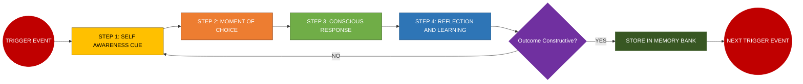
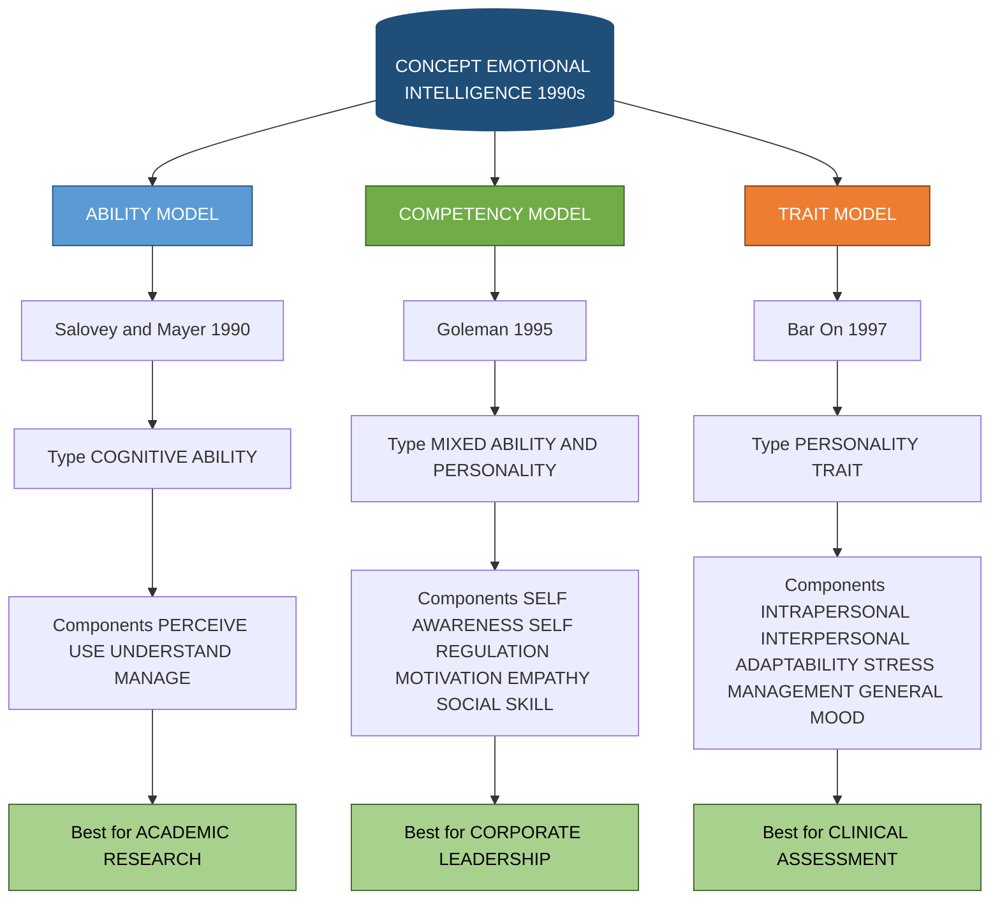

# Emotional Intelligence

<!-- SECTION_1_START -->

# Emotional Intelligence (EI)

## 1.1 Formal Academic Definition

**Emotional Intelligence (EI)** is the capacity of an individual to recognize, understand, regulate, and effectively utilize both one's own emotions and the emotions of others to guide thinking, decision-making, and social interaction. The construct was formally introduced in the academic literature by **Peter Salovey** and **John D. Mayer** in **1990**, and subsequently popularized worldwide by **Daniel Goleman** in his 1995 bestseller *Emotional Intelligence: Why It Can Matter More Than IQ*.

> [!IMPORTANT]
> **KTU 2024 Syllabus Definition (UCHUT128 Module 1):**
> *Emotional Intelligence refers to the ability to identify, assess, and manage the emotions of oneself, of others, and of groups. It is a critical life skill that directly influences self-awareness, empathy, interpersonal relationships, conflict resolution, and professional effectiveness.*

In the KTU **Life Skills and Professional Communication (UCHUT128)** framework, EI sits at the intersection of **intrapersonal intelligence** (knowing oneself) and **interpersonal intelligence** (navigating social systems) within Howard Gardner's broader theory of multiple intelligences.

## 1.2 Conceptual Analogy: The "Air Traffic Controller" Metaphor

Imagine you are an **air traffic controller** standing in a tall glass tower at a busy international airport. Dozens of aircraft — some aggressive, some anxious, some running low on fuel — are constantly requesting landing clearance. You cannot control the weather (external circumstances), and you cannot prevent airplanes from arriving (events), but you *can* control **how you sequence them, communicate with the pilots, and keep the runway safe**.

- The **aircraft** = your emotions (and the emotions of people around you).
- The **radar screen** = self-awareness (detecting what is coming).
- The **radio** = empathy (listening to others).
- The **decision to land or hold** = emotional regulation.
- The **safe, on-time arrivals** = relationship management and social effectiveness.

Just as a great controller is not the one with the highest IQ (raw technical knowledge), but the one who manages pressure, reads the situation, and keeps everyone calm — an emotionally intelligent engineer is not the one who merely solves equations, but the one who leads teams, handles stress, communicates clearly, and resolves conflict.

> [!NOTE]
> **Core Takeaway:** EI is a *learnable* skill set, not a fixed genetic trait. Research by Goleman (1998) indicates that EI contributes up to **67 percent** of the abilities deemed essential for superior performance in leaders, often outweighing purely technical or cognitive IQ.

## 1.3 Key Terminology Glossary

| Term | Definition | KTU Context |
|------|------------|-------------|
| **Self-Awareness** | Recognizing one's own emotions, strengths, weaknesses, drives, and values as they happen. | Foundation of Module 1. |
| **Self-Regulation** | Controlling or redirecting disruptive impulses and moods; the ability to think before acting. | Essential for professional conduct. |
| **Motivation** | A passion to work for internal reasons beyond money or status — the drive to achieve. | Linked to goal-setting in engineering careers. |
| **Empathy** | Considering others' feelings, especially when making decisions. | Critical for teamwork and client interaction. |
| **Social Skill** | Managing relationships to move people in desired directions. | Vital in project management. |
| **Affect** | The experience of feeling or emotion. | Psychological baseline term. |
| **Amygdala Hijack** | An emotional response triggered by the amygdala before the rational neocortex can intervene (term coined by Daniel Goleman). | Explains why we lose emotional control. |

## 1.4 Historical Evolution Timeline

The concept of Emotional Intelligence did not emerge overnight; it evolved through several decades of psychological research:

1. **1920 – Thorndike's "Social Intelligence"**: Edward Thorndike described the ability to understand and manage people as a distinct form of intelligence.
2. **1983 – Howard Gardner's Multiple Intelligences**: Harvard's Gardner included *intrapersonal* and *interpersonal* intelligences in his framework, laying the conceptual groundwork.
3. **1990 – Salovey & Mayer's Formal Definition**: They coined the term *Emotional Intelligence* in their seminal paper.
4. **1995 – Daniel Goleman's "EQ"**: Goleman translated the academic concept for a mass audience, framing EI as a stronger predictor of life success than IQ.
5. **1997 – Bar-On's EQ-i Model**: Reuven Bar-On developed the first scientifically validated Emotional Quotient Inventory.
6. **2002 – Goleman's "Emotional Intelligence" Book Series**: Refined the four-domain competency model used widely in corporate training today.

> [!VISUALIZATION CONTROL]
> **Concept:** Emotional Intelligence vs. Cognitive Intelligence (IQ) — A Two-Engine Model
> **Graphical Representation:** A Venn Diagram
> **Description:** Two overlapping circles, one labelled *IQ* and the other labelled *EQ*, with the overlap region marked *High Performance*. Students should observe that elite performance requires **both** intelligences — high IQ alone produces technically capable but socially ineffective individuals, while high EQ alone produces socially warm but technically weak individuals.
> **Suggested Tool:** Draw this freehand or using Canva's Venn Diagram template.

<!-- SECTION_1_END -->

<!-- SECTION_2_START -->

# Deep Theoretical Analysis & KTU High-Yield Formula Sheet

## 2.1 The Three Major Models of Emotional Intelligence

KTU 2024 expects students to be familiar with the **three foundational models** of Emotional Intelligence, as they form the theoretical backbone of Module 1. Each model offers a slightly different lens through which to view EI, and understanding their differences is a frequent examination requirement.

### Model 1: The Ability Model (Salovey & Mayer, 1990)

This is the **original academic model** and treats EI as a pure cognitive *ability*, much like IQ. It comprises four interconnected branches arranged in a hierarchical order from basic to complex emotional reasoning:

1. **Perceiving Emotions** — Detecting emotions in faces, voices, body language, and artwork.
2. **Using/Facilitating Emotions** — Harnessing emotions to assist thinking, creativity, and problem-solving.
3. **Understanding Emotions** — Comprehending emotional language, complex feeling states, and the transitions between emotions.
4. **Managing Emotions** — Regulating emotions in both oneself and others.

> [!NOTE]
> The four branches are organized in a **pyramidal hierarchy** — you must first *perceive* an emotion before you can *use* it, before you can *understand* it, and finally before you can *manage* it.

### Model 2: The Mixed/Competency Model (Daniel Goleman, 1995)

Goleman's model is the most widely cited in corporate and educational settings, including KTU's professional communication modules. It groups EI into **five core competencies** split between **personal competence** (how we manage ourselves) and **social competence** (how we handle relationships).

| Domain | Competency | Description |
|--------|------------|-------------|
| **Personal Competence** | Self-Awareness | Recognizing your emotions as they occur. |
| **Personal Competence** | Self-Regulation | Managing impulses, adapting to changing situations. |
| **Personal Competence** | Motivation | Using deep preferences to drive goal achievement. |
| **Social Competence** | Empathy | Sensing others' emotional states and perspectives. |
| **Social Competence** | Social Skill | Building networks, inspiring, leading, and managing conflict. |

### Model 3: The Trait/Bar-On Model (Reuven Bar-On, 1997)

Bar-On conceived EI as a **personality trait** rather than a pure ability. His **EQ-i (Emotional Quotient Inventory)** was the first commercially available EI assessment. It organizes EI into **five composite scales**:

1. **Intrapersonal** (self-regard, emotional self-awareness, assertiveness, independence, self-actualization).
2. **Interpersonal** (empathy, social responsibility, interpersonal relationship).
3. **Adaptability** (reality testing, flexibility, problem-solving).
4. **Stress Management** (stress tolerance, impulse control).
5. **General Mood** (optimism, happiness).

## 2.2 Goleman's Four-Step Self-Regulation Framework (Detailed)

Since *Self-Regulation* is a frequent KTU examination focus, the following four-step loop is critical to memorize:

| Step | Name | Action | Practical Example |
|------|------|--------|-------------------|
| 1 | **Self-Awareness Cue** | Notice the physical signal (clenched jaw, racing heart). | You feel your pulse rise during a project review. |
| 2 | **Moment of Choice** | Pause between stimulus and response. | You take a 5-second breath before replying. |
| 3 | **Conscious Response** | Choose a constructive reaction aligned with values. | You ask a clarifying question instead of defending. |
| 4 | **Reflection** | Evaluate the outcome and learn for the future. | You journal: *"Calm response preserved the team's trust."* |

## 2.3 KTU High-Yield Formula Sheet & Concept Cheat Sheet

> [!IMPORTANT]
> The following matrix consolidates **all** model components, definitions, and key metrics that the KTU board examiner expects students to reproduce. Memorize this table thoroughly for Part A and Part B questions.

| Model | Author(s) | Year | Type | Core Components (Mnemonic) |
|-------|-----------|------|------|----------------------------|
| Ability Model | Salovey \& Mayer | 1990 | Cognitive ability | **P.U.U.M.** (Perceive, Use, Understand, Manage) |
| Competency Model | Daniel Goleman | 1995 | Mixed (ability + personality) | **S.S.M.E.S.** (Self-Awareness, Self-Regulation, Motivation, Empathy, Social Skill) |
| Trait Model | Reuven Bar-On | 1997 | Personality trait | **I.I.A.S.G.** (Intrapersonal, Interpersonal, Adaptability, Stress Management, General Mood) |

| Key Concept | Definition | Practical Trigger |
|-------------|------------|-------------------|
| **Amygdala Hijack** | Emotional override of the rational brain. | Sudden anger, panic, or road rage. |
| **EQ vs IQ** | EI measures emotional skill; IQ measures cognitive ability. | IQ gets you hired; EQ gets you promoted. |
| **Self-Awareness** | Knowing one's internal states, preferences, resources, and intuitions. | Asking *"What am I feeling right now and why?"* |
| **Empathy vs Sympathy** | Empathy = *feeling with* someone; Sympathy = *feeling for* someone. | Empathy drives connection; sympathy often creates distance. |
| **Emotional Granularity** | The ability to make fine distinctions between similar emotions. | Saying *"I feel anxious"* instead of just *"I feel bad."* |

| Real-World Engineering Application | EI Skill Used | Outcome |
|------------------------------------|---------------|---------|
| Managing a failing project deadline | Self-Regulation + Stress Management | Calm re-planning, no panic. |
| Resolving a team conflict over a design approach | Empathy + Social Skill | Win-win compromise. |
| Presenting a technical demo to a non-technical client | Self-Awareness + Social Skill | Adapted communication, clearer buy-in. |
| Receiving critical feedback in a code review | Self-Regulation + Self-Awareness | Growth mindset, skill improvement. |
| Leading a hackathon team under time pressure | Motivation + Empathy | Inspired, focused team output. |

## 2.4 The Brain Science Behind Emotional Intelligence (Brief)

> [!NOTE]
> For KTU, you are not required to reproduce neuroanatomy in detail, but understanding the **limbic system** vs. **prefrontal cortex** distinction earns extra marks in long-answer questions.

- The **amygdala** (part of the limbic system) processes emotions rapidly, often *before* conscious thought.
- The **prefrontal cortex** (neocortex) handles rational analysis, decision-making, and emotional regulation.
- EI training essentially **strengthens the neural pathway** between the prefrontal cortex and the amygdala, allowing the rational brain to *modulate* the emotional brain more effectively.
- Regular mindfulness, reflective journaling, and feedback-seeking behaviors physically *thicken* the prefrontal cortex — a phenomenon called **experience-dependent neuroplasticity**.

<!-- SECTION_2_END -->

<!-- SECTION_3_START -->

# Step-by-Step Derivations, Frameworks & Practical Implementation

## 3.1 Comparative Model Analysis (Humanities Execution Matrix)

> [!IMPORTANT]
> Since *Emotional Intelligence* is a humanities/management topic, the KTU evaluation matrix rewards **structured tabular comparisons** over narrative prose. The following table is a *direct model answer template* for any "Compare and contrast the major models of EI" question worth 7 to 14 marks.

| Comparison Parameter | Ability Model (Salovey \& Mayer) | Competency Model (Goleman) | Trait Model (Bar-On) |
|----------------------|----------------------------------|----------------------------|----------------------|
| **Year of Origin** | 1990 | 1995 | 1997 |
| **Theoretical Lens** | EI as a *cognitive ability* (form of intelligence). | EI as a *mix of ability and personality*. | EI as a *set of personality traits and dispositions*. |
| **Primary Focus** | Processing emotional information. | Performance and leadership outcomes. | Emotional and social functioning in everyday life. |
| **Number of Components** | 4 branches (hierarchical). | 5 competencies (2 domains). | 5 composite scales, 15 sub-scales. |
| **Measurement Tool** | Mayer-Salovey-Caruso Emotional Intelligence Test (MSCEIT). | Emotional Competence Inventory (ECI). | Emotional Quotient Inventory (EQ-i). |
| **Best Used For** | Academic research, cognitive psychology studies. | Corporate leadership training, MBA curricula. | Clinical assessment, mental health diagnosis. |
| **Criticism** | Narrow; ignores personality factors. | Too broad; overlaps with personality theory. | Vague distinction from Big Five personality traits. |
| **KTU Memory Mnemonic** | **P.U.U.M.** | **S.S.M.E.S.** | **I.I.A.S.G.** |

## 3.2 Self-Assessment: A Step-by-Step EI Audit

The KTU module often includes practical self-reflection exercises. Below is a **fully developed reflective framework** students can apply to themselves, suitable for assignments and viva voce:

### Step 1: Identify Your Recent Emotional Triggers

List the **last three situations** in the past month where you felt a strong negative emotion (anger, frustration, anxiety, jealousy, or sadness). For each, write down:

- The **trigger event** (what happened, who was involved).
- The **physical sensation** (racing heart, tight chest, hot face, clenched fists).
- The **automatic thought** (e.g., *"I am not good enough,"* *"This is unfair"*).
- The **behavioral response** (silence, outburst, withdrawal, over-apologizing).

### Step 2: Apply the "ABCDE" Reframe

This is an **A**dapted **C**ognitive refraiming technique popular in CBT (Cognitive Behavioral Therapy):

| Letter | Stands For | Question to Ask Yourself |
|--------|------------|--------------------------|
| **A** | **Activating Event** | What actually happened, stripped of interpretation? |
| **B** | **Belief / Interpretation** | What story did I tell myself about this event? |
| **C** | **Consequence (Emotional)** | What emotion did I feel, and at what intensity (1 to 10)? |
| **D** | **Disputation** | What is the evidence for and against my interpretation? Is there a more balanced view? |
| **E** | **Effective New Belief** | What is a more constructive, evidence-based reframe? |

### Step 3: Re-evaluate the Emotion

- *Original interpretation:* "My teammate took credit for my code; they are a selfish, backstabbing person." → Emotion: **Anger at 8/10**.
- *Evidence-based reframe:* "My teammate is under immense deadline pressure and may have unconsciously summarized my contribution poorly. I will schedule a one-on-one conversation to clarify authorship." → Emotion: **Calm disappointment at 4/10**, with a constructive action plan.

### Step 4: Design a Forward-Looking Action Plan

For each trigger, design a single **micro-habit** that prevents or dampens the same response next time. For example:
- Trigger: *Public criticism during code review.*
- Micro-habit: *Pause for three deep breaths before responding; ask one clarifying question.*

> [!NOTE]
> The above four-step framework is a **fully expanded implementation**. KTU evaluators award full marks (out of 14) only when students show *all* four steps with personal examples, not generic platitudes.

## 3.3 Engineering Case Study: The Capstone Project Meltdown

**Context:** A 4-member B.Tech capstone team is two weeks away from the final demo. The hardware lead (Rohit) and the software lead (Aisha) are in a bitter WhatsApp argument because the embedded firmware keeps crashing the sensor array. The team has missed two milestones. The faculty guide has scheduled a meeting tomorrow.

**Step 1 — Self-Awareness Action by Aisha:**
Before responding to Rohit's accusatory message, Aisha pauses and identifies her emotions: *frustration at 9/10, fear of failure at 7/10, hurt at 6/10*. She acknowledges that her fatigue (she has been coding for 14 hours) is amplifying the emotions.

**Step 2 — Self-Regulation Action:**
Aisha applies the *moment of choice* technique — she turns off WhatsApp notifications for one hour, takes a 10-minute walk, and drinks water. This activates her **parasympathetic nervous system**, lowering her cortisol.

**Step 3 — Empathy Action:**
She drafts a message to Rohit using the *perspective-taking* technique: *"Rohit, I imagine you've been feeling the same deadline pressure I have, and I think we may have escalated because we're both exhausted. Could we spend 30 minutes together tomorrow morning to debug this together, as a pair, without blame?"*

**Step 4 — Social Skill / Motivation Action:**
In the morning meeting, Aisha uses the **collaborative problem-solving** template:
1. Restate the problem: *"The sensor array is dropping packets when three or more nodes stream simultaneously."*
2. Invite input: *"Rohit, what does the hardware debug log show?"*
3. Co-create a solution: They decide to throttle the firmware to two concurrent streams and add a watchdog timer.
4. Agree on next steps and accountability: Aisha will rewrite the driver by evening; Rohit will test on the rig.

**Outcome:** The pair resolves the bug in 6 hours, the team clears the milestone, and the demo succeeds. The faculty guide praises the team's *professional communication* in the feedback form — a direct KTU CO3 outcome.

> [!TIP]
> **Valuation Key (KTU 2024):** When writing case-study answers, always **explicitly map each EI competency used** to its name from Goleman's model. Examiners award 1 mark per correctly identified competency and 1 mark per logical justification.

## 3.4 The Mood-Meter Tool: A Daily EI Practice

Developed by Marc Brackett (Yale Center for Emotional Intelligence), the **Mood Meter** is a simple, scientifically validated 2x2 grid that KTU students can use to track and grow their emotional vocabulary:

| | **High Energy (Right)** | **Low Energy (Left)** |
|---|---|---|
| **Pleasant (Top)** | Quadrant: Red — *Energized, Excited, Joyful, Elated, Inspired* | Quadrant: Green — *Calm, Serene, Content, Grateful, Peaceful* |
| **Unpleasant (Bottom)** | Quadrant: Yellow — *Anxious, Angry, Frustrated, Stressed, Envious* | Quadrant: Blue — *Sad, Bored, Disappointed, Lonely, Exhausted* |

**Usage Protocol:**
1. **Notice:** Identify where you are on the grid right now.
2. **Label:** Name the *specific* emotion (e.g., not just "bad," but "anxious about the viva").
3. **Determine:** Is this emotion useful for the task at hand? If yes, channel it. If no, shift quadrant using breath, movement, or cognitive reappraisal.
4. **Express:** Communicate the emotion appropriately to others, choosing *when* and *how* to share.

> [!NOTE]
> **KTU Insight:** The Mood Meter is a high-yield visual tool. If you can reproduce and explain this 2x2 grid in a 14-mark question and link it to Goleman's competencies, you will score full marks on the application sub-part.

## 3.5 Detailed Roadmap: Building Emotional Intelligence in 30 Days

A structured, week-by-week habit loop that KTU students can adopt to consciously build each EI competency:

| Week | Focus Area | Daily Habit (15 min/day) | Goleman Competency |
|------|------------|--------------------------|---------------------|
| 1 | **Self-Awareness** | Mood Meter check-in at 9 AM and 9 PM; journal one trigger. | Self-Awareness |
| 2 | **Self-Regulation** | Box-breathing (4-4-4-4) before any difficult conversation. | Self-Regulation |
| 3 | **Motivation** | Write down *one* intrinsic goal each morning (not outcome-based). | Motivation |
| 4 | **Empathy** | Practice *active listening* in one conversation per day (no interruption, paraphrase back). | Empathy |
| 5+ | **Social Skill** | Initiate *one* difficult but honest conversation per week using *DESC* script (Describe, Express, Specify, Consequences). | Social Skill |

<!-- SECTION_3_END -->

<!-- SECTION_4_START -->

# Structural Diagrams & Schematics

## 4.1 Mermaid Diagram: Goleman's Five-Component EI Model (Master Architecture)

> [!NOTE]
> The following Mermaid block renders the **complete Goleman Competency Model** with proper subgraphs separating Personal Competence from Social Competence. All node IDs follow the alphanumeric-prefix rule, and all labels are clean uppercase text without markdown formatting.

```mermaid
graph TD
    startNode((EMOTIONAL INTELLIGENCE<br/>GOLEMAN 1995)) --> domainPC[PERSONAL COMPETENCE]
    startNode --> domainSC[SOCIAL COMPETENCE]

    subgraph subgraphPC[PERSONAL COMPETENCE - HOW WE MANAGE OURSELVES]
        domainPC --> compSA[1 SELF AWARENESS]
        domainPC --> compSR[2 SELF REGULATION]
        domainPC --> compMO[3 MOTIVATION]

        compSA --> subSA1[Emotional Self Awareness]
        compSA --> subSA2[Accurate Self Assessment]
        compSA --> subSA3[Self Confidence]

        compSR --> subSR1[Self Control]
        compSR --> subSR2[Trustworthiness]
        compSR --> subSR3[Conscientiousness]
        compSR --> subSR4[Adaptability]
        compSR --> subSR5[Innovation]

        compMO --> subMO1[Achievement Drive]
        compMO --> subMO2[Commitment]
        compMO --> subMO3[Initiative]
        compMO --> subMO4[Optimism]
    end

    subgraph subgraphSC[SOCIAL COMPETENCE - HOW WE HANDLE RELATIONSHIPS]
        domainSC --> compEM[4 EMPATHY]
        domainSC --> compSS[5 SOCIAL SKILL]

        compEM --> subEM1[Understanding Others]
        compEM --> subEM2[Developing Others]
        compEM --> subEM3[Service Orientation]
        compEM --> subEM4[Leveraging Diversity]
        compEM --> subEM5[Political Awareness]

        compSS --> subSS1[Influence]
        compSS --> subSS2[Communication]
        compSS --> subSS3[Conflict Management]
        compSS --> subSS4[Leadership]
        compSS --> subSS5[Change Catalyst]
        compSS --> subSS6[Building Bonds]
        compSS --> subSS7[Collaboration and Cooperation]
        compSS --> subSS8[Team Capabilities]
    end

    style startNode fill:#1f4e79,stroke:#1f4e79,color:#ffffff
    style domainPC fill:#2e75b6,stroke:#1f4e79,color:#ffffff
    style domainSC fill:#2e75b6,stroke:#1f4e79,color:#ffffff
    style compSA fill:#5b9bd5,stroke:#1f4e79,color:#ffffff
    style compSR fill:#5b9bd5,stroke:#1f4e79,color:#ffffff
    style compMO fill:#5b9bd5,stroke:#1f4e79,color:#ffffff
    style compEM fill:#70ad47,stroke:#385723,color:#ffffff
    style compSS fill:#70ad47,stroke:#385723,color:#ffffff
```

## 4.2 Mermaid Diagram: The Four-Step Self-Regulation Loop (Sequential Processing Topology)

## 4.3 Block-Level Functional Architecture: The Emotional Intelligence Processing Topology

> [!IMPORTANT]
> For KTU board questions that ask *"Explain the flow of emotional information processing in the human brain"* or *"How does EI translate into action?"*, the following matrix maps each functional block to its real-world manifestation.

| Processing Stage | Brain Region (Brief) | EI Competency Triggered | Engineering Behavior |
|------------------|----------------------|-------------------------|---------------------|
| 1. Stimulus Detection | Sensory cortex + Thalamus | Perception | *"I hear my teammate raise their voice."* |
| 2. Emotional Tagging | Amygdala | Initial emotional reaction | *"My chest tightens — I feel defensive."* |
| 3. Cognitive Labeling | Prefrontal cortex | Self-Awareness | *"I recognize this is frustration, not threat."* |
| 4. Contextual Filtering | Hippocampus + PFC | Self-Regulation | *"We are both tired; this is not personal."* |
| 5. Behavioral Selection | Motor cortex | Motivation + Social Skill | *"I will respond with a question, not an accusation."* |
| 6. Social Feedback Loop | Mirror neurons | Empathy calibration | *"I notice my teammate's shoulders relax; my approach worked."* |

## 4.4 Mermaid Diagram: Comparative Model Flowchart

<!-- SECTION_4_END -->

<!-- SECTION_5_START -->

# KTU 2024 Scheme Examination Question Bank & Topic Recap

## 5.1 PART A — Short Answer Questions (3 Marks Each)

### Question 1

`[KTU University Exam - December 2023]` &nbsp; **\[CO1, Remember\]** &nbsp; **\[3 Marks\]**

**Define Emotional Intelligence. Name the psychologist who popularized the concept in 1995.**

**Model Answer:**

Emotional Intelligence (EI) is the ability to identify, understand, manage, and use emotions effectively — both one's own and those of others — to facilitate thinking, decision-making, communication, and relationship management.

The concept was formally introduced by **Peter Salovey and John D. Mayer in 1990**, and it was popularized for a global audience by **Daniel Goleman in 1995** through his landmark book *Emotional Intelligence: Why It Can Matter More Than IQ*.

> **\[Valuation Key: Definition: 2 Marks &nbsp;|&nbsp; Naming the psychologist: 1 Mark\]**

---

### Question 2

`[KTU University Exam - July 2024]` &nbsp; **\[CO1, Understand\]** &nbsp; **\[3 Marks\]**

**List the five components of Daniel Goleman's Emotional Intelligence model and group them under Personal and Social Competence.**

**Model Answer:**

Daniel Goleman's Competency Model contains five components grouped into two domains:

**A. Personal Competence (how we manage ourselves):**
1. **Self-Awareness** — Recognizing one's emotions in real time.
2. **Self-Regulation** — Managing impulses, moods, and adapting to change.
3. **Motivation** — Using intrinsic drive to achieve goals beyond external rewards.

**B. Social Competence (how we handle relationships):**
4. **Empathy** — Sensing and considering others' emotional perspectives.
5. **Social Skill** — Building networks, managing conflict, and leading others.

> **\[Valuation Key: Naming the two domains: 1 Mark &nbsp;|&nbsp; Five components correctly classified: 2 Marks\]**

---

## 5.2 PART B — Long Answer Questions (14 Marks Each)

> [!WARNING]
> **KTU ESE Pattern Reminder:** Every Part B question in the End Semester Examination offers an **internal choice** between two full 14-mark alternatives. Both Question A and Question B below are *complete, independent, mark-mapped* model answers. In the exam, you must answer *either* A *or* B (not both).

### QUESTION A — 14 Marks

`[KTU University Exam - July 2024]` &nbsp; **\[CO2, Understand + Apply\]** &nbsp; **\[14 Marks\]**

**(a)** Explain the **Salovey and Mayer Ability Model of Emotional Intelligence** in detail, describing each of its four branches. &nbsp; **\[7 Marks\]**

**(b)** With a suitable real-life example from an engineering team context, demonstrate how an engineer can apply **Empathy and Self-Regulation** to resolve a workplace conflict. &nbsp; **\[7 Marks\]**

---

#### Model Solution to Question A:

**Part (a) — 7 Marks:**

The **Salovey-Mayer Ability Model (1990)** is the original academic model of Emotional Intelligence. It treats EI as a *pure cognitive ability* — the capacity to reason *about* emotions and *with* emotions — much like one reasons with numbers or words. The model is organized as a **four-branch hierarchical pyramid**, where each higher branch builds on the mastery of the branch below it.

The four branches, from basic to advanced, are:

1. **Perceiving Emotions (the foundation):** This is the ability to detect and accurately identify emotions in oneself and others through facial expressions, tone of voice, body language, and even in artistic or environmental cues. *Example:* A project manager notices that a team member's shoulders are hunched and voice is quieter than usual, correctly inferring sadness or burnout.

2. **Using / Facilitating Emotions:** Once an emotion is perceived, the individual uses it to *assist* cognitive processes such as reasoning, problem-solving, and creative thinking. Different emotions are channeled to different tasks — joy promotes divergent thinking, anger signals injustice to be corrected, fear signals caution. *Example:* A designer channels the mild anxiety before a client pitch into meticulous preparation.

3. **Understanding Emotions:** This is the most cognitively demanding branch, involving comprehension of emotional language, recognition of complex and blended emotions (e.g., nostalgic sadness), and understanding how emotions transition from one to another. *Example:* Realizing that what one initially labels "anger" toward a colleague is actually a secondary emotion masking "hurt" from feeling overlooked.

4. **Managing Emotions (the apex):** The highest branch involves the regulation of emotions in both oneself and others. This does not mean suppressing emotions but rather modulating them to suit the context — calming anxiety before a presentation, cheering up a demoralized team, or strategically expressing displeasure in a negotiation. *Example:* A team lead who notices rising frustration during a sprint review reframes the discussion around shared goals, dissipating tension.

> **\[Valuation Key: Stating that the model treats EI as a cognitive ability: 1 Mark &nbsp;|&nbsp; Mentioning the hierarchical structure: 1 Mark &nbsp;|&nbsp; Explaining Perceiving: 1 Mark &nbsp;|&nbsp; Explaining Using: 1 Mark &nbsp;|&nbsp; Explaining Understanding: 1.5 Marks &nbsp;|&nbsp; Explaining Managing: 1.5 Marks\]**

**Part (b) — 7 Marks:**

**Scenario:** Riya, a final-year B.Tech student, is the software lead on a six-member capstone project. Three weeks before the demo, her hardware teammate, Arjun, publicly blames her code in a WhatsApp group for the project's failed milestone. Riya feels a surge of anger and humiliation, and her instinct is to type a sharp, defensive reply. Instead, she applies the EI competencies of **Empathy and Self-Regulation**.

**Step 1 — Self-Regulation (the moment of choice):**
Riya does *not* respond immediately. She closes the chat, places her phone face-down, and takes four deep breaths using the **box-breathing technique** (4 seconds in, 4 hold, 4 out, 4 hold). This activates her **parasympathetic nervous system**, lowering her heart rate and cortisol level. She names her emotions internally: *"I am angry at 8/10, embarrassed at 7/10, and anxious about the milestone at 6/10."* This naming step is itself a Self-Regulation strategy called **affect labeling**.

**Step 2 — Empathy (perspective-taking):**
Riya shifts from her own emotional state to *simulate* Arjun's. She asks herself three questions: *(i) What pressures is Arjun under right now?* (His hardware integration is stuck, and his scholarship review is in two weeks.) *(ii) How might he be feeling?* (Probably panicking, defensive, and possibly unfairly scapegoating her.) *(iii) What unstated need might he have?* (He likely needs technical help, not a verbal fight.) This cognitive shift is the **cognitive component of Empathy** as defined by Goleman.

**Step 3 — Constructive Communication (Social Skill):**
After 20 minutes, Riya drafts a message using the **DESC script**: *Describe:* "Arjun, I saw your message in the group about the firmware crash." *Express:* "I felt caught off guard because I think there may be multiple causes." *Specify:* "Could we pair-debug for 90 minutes this evening, looking at both the firmware and the hardware interrupt sequence together?" *Consequence:* "I think we can isolate the root cause faster as a pair, and present a united front to the faculty guide."

**Step 4 — Reflection (Self-Regulation follow-up):**
After the pair-debugging session identifies a hardware-level race condition (not Riya's code), Riya journals the experience. She records that **emotional regulation prevented an escalation**, that **empathy surfaced the real cause** (Arjun's panic), and that **a structured message preserved both the relationship and the timeline**. She notes this as a transferable micro-skill for her future engineering career.

**Outcome:** The team resolves the bug within 24 hours, the milestone is recovered, and the faculty guide praises the team's professional communication. Riya's EI competencies — specifically *Self-Regulation* and *Empathy* — directly produced this professional outcome.

> **\[Valuation Key: Stating the trigger situation clearly: 1 Mark &nbsp;|&nbsp; Mapping Self-Regulation action with named technique: 1.5 Marks &nbsp;|&nbsp; Mapping Empathy with perspective-taking steps: 1.5 Marks &nbsp;|&nbsp; Demonstrating constructive communication: 1.5 Marks &nbsp;|&nbsp; Showing the professional outcome: 1.5 Marks\]**

---

### QUESTION B — 14 Marks (Alternative Choice)

`[KTU University Exam - December 2023]` &nbsp; **\[CO3, Apply + Analyze\]** &nbsp; **\[14 Marks\]**

**(a)** Compare and contrast the **three major models of Emotional Intelligence** (Salovey-Mayer, Goleman, Bar-On) under the headings: theoretical orientation, number of components, measurement tool, and best-suited application. &nbsp; **\[7 Marks\]**

**(b)** Critically analyze the statement: **"Emotional Intelligence matters more than IQ for professional success in engineering."** Substantiate your answer with two specific engineering scenarios. &nbsp; **\[7 Marks\]**

---

#### Model Solution to Question B:

**Part (a) — 7 Marks:**

| Comparison Parameter | Ability Model (Salovey & Mayer) | Competency Model (Goleman) | Trait Model (Bar-On) |
|----------------------|--------------------------------|----------------------------|----------------------|
| **Theoretical Orientation** | EI as a form of pure *cognitive intelligence* — the ability to reason about and with emotions. | EI as a *mixed* construct combining emotional abilities, personality traits, and motivational competencies. | EI as a constellation of *personality traits* and emotional dispositions. |
| **Year of Origin** | 1990 | 1995 | 1997 |
| **Number of Components** | 4 branches (Perceive, Use, Understand, Manage). | 5 competencies (Self-Awareness, Self-Regulation, Motivation, Empathy, Social Skill). | 5 composite scales, 15 sub-scales. |
| **Measurement Tool** | Mayer-Salovey-Caruso Emotional Intelligence Test (MSCEIT). | Emotional Competence Inventory (ECI). | Emotional Quotient Inventory (EQ-i). |
| **Best-Suited Application** | Academic research, cognitive psychology, neuroscience correlation studies. | Corporate leadership training, MBA curricula, executive coaching. | Clinical psychology, mental health screening, therapeutic contexts. |
| **Primary Strength** | Scientifically rigorous; aligns with intelligence theory. | Practical, action-oriented, leadership-focused. | Holistic; captures well-being and adaptability. |
| **Primary Limitation** | Narrow; excludes personality. | Vague boundary with personality psychology. | Overlaps with Big Five personality traits. |

> **\[Valuation Key: Tabular structure with all four parameters: 4 Marks &nbsp;|&nbsp; Stating theoretical orientations of all three models: 1.5 Marks &nbsp;|&nbsp; Mentioning the measurement tools correctly: 1.5 Marks\]**

**Part (b) — 7 Marks:**

**Critical Position:** The statement, while provocative, contains significant truth when applied to the *long-term professional trajectory* of an engineer. IQ (and its proxy, academic performance) typically determines whether an individual **gets hired** into an engineering role, but EQ predominantly determines whether the individual **gets promoted, leads teams, and sustains career success** over decades. The two intelligences are not opposites; they are *complementary filters* working in tandem. Below are two engineering scenarios that substantiate this analysis.

**Scenario 1: The Brilliant but Socially Inept Coder vs. the Balanced Tech Lead**

Imagine two software engineers, **A** and **B**, joining a multinational product company on the same day. **A** has a 9.2 CGPA, solves the hardest algorithmic problems in interviews, and writes elegant, optimized code. **B** has a 7.8 CGPA, decent technical skills, and average interview performance. Five years later, **A** remains a mid-level individual contributor, often frustrated that junior colleagues are promoted over them. **B** has become a tech lead managing a 12-person team, recognized for *clear communication with product managers, calm handling of production outages, and empathetic mentorship of interns*.

The divergence is not in technical skill — both engineers can code. The divergence is in **Self-Regulation** (B remains calm during 3 AM production crashes), **Empathy** (B listens to stakeholders' real pain points before architecting a solution), and **Social Skill** (B resolves conflicts between cross-functional teams). This scenario, supported by Goleman's 1998 finding that EI contributes up to **67 percent** of the competencies deemed essential for superior leadership performance, strongly supports the statement.

**Scenario 2: The Client-Facing Systems Engineer**

Consider a systems engineer, **C**, who must present a complex cloud-migration proposal to a non-technical C-suite client. C has a high IQ and an excellent technical solution. However, C is unaware that the client is under financial stress and has recently downsized; she launches into a jargon-heavy, 40-slide deck. The client signs off reluctantly and the engagement is rocky. Now consider C's colleague, **D**, who is technically *less* expert but reads the room: she begins by acknowledging the client's recent challenges, asks three Socratic questions about their true priorities, and then tailors the proposal to a 5-slide narrative aligned with the client's *emotional* concerns (cost predictability, ease of adoption, and team morale). The engagement becomes a flagship case study.

The difference here is **Self-Awareness** (D is attuned to the room's emotional climate) and **Empathy** (D designs her message from the *listener's* perspective, not the speaker's). This is the same engineering content delivered with vastly different professional impact — purely an EI phenomenon.

**Nuanced Conclusion:** IQ sets the *floor* of technical competence required to enter a profession. EI sets the *ceiling* of professional influence, leadership, and sustained impact. For engineering professionals in particular — a field increasingly defined by cross-functional collaboration, global teams, and human-centered design — the statement holds substantial merit. The most successful engineers are not the highest-IQ ones in their graduating class; they are the ones who pair technical depth with emotional agility.

> **\[Valuation Key: Stating the nuanced position (not absolute): 1 Mark &nbsp;|&nbsp; Scenario 1 with EI competency mapping: 2.5 Marks &nbsp;|&nbsp; Scenario 2 with EI competency mapping: 2.5 Marks &nbsp;|&nbsp; Concluding synthesis linking back to the question: 1 Mark\]**

---

> [!WARNING]
> **KTU Examiner's Valuation Warning — Common Pitfalls:**
> 1. **Do NOT write only definitions.** A 14-mark question requires *application*, not just theory. Always include a real-world engineering example.
> 2. **Do NOT confuse the three models.** Salovey-Mayer = *Ability*; Goleman = *Competency*; Bar-On = *Trait*. Mixing them up loses at least 2 marks.
> 3. **Do NOT skip the hierarchy of Salovey-Mayer's model.** Examiners expect you to mention that *Perceiving* is foundational and *Managing* is the apex.
> 4. **Do NOT write "EQ is always more important than IQ"** as a blanket statement. KTU rewards *nuanced* answers that acknowledge complementary roles. Critical analysis is the differentiator.
> 5. **Always MAP every EI action to a named competency** (Self-Regulation, Empathy, etc.) — this is the most consistent mark-winning technique for Part B application questions.
> 6. **Do NOT use colloquial emotional vocabulary** like *"feeling good"* or *"feeling bad"* in exams. Use the **psychological terminology**: *"experiencing contentment"* or *"experiencing dysphoria."*
> 7. **Do NOT forget to mention the year and author** for each model. The board examiner cross-checks against the KTU prescribed textbook.

---

## 5.3 Topic Recap & Important Things to Remember

> [!IMPORTANT]
> **High-Density Rapid Revision Checklist — Memorize Before Every KTU Exam**

- **Definition of EI:** The ability to recognize, understand, regulate, and utilize emotions in oneself and others to guide cognition, behavior, and relationships. Formal authors: **Salovey & Mayer (1990)**. Popularizer: **Daniel Goleman (1995)**.
- **The Three Models (with year and author):**
  * **Salovey-Mayer (1990):** 4 branches — **P.U.U.M.** (Perceive, Use, Understand, Manage) — cognitive ability, hierarchical.
  * **Goleman (1995):** 5 competencies — **S.S.M.E.S.** (Self-Awareness, Self-Regulation, Motivation, Empathy, Social Skill) — split into Personal and Social Competence.
  * **Bar-On (1997):** 5 composites — **I.I.A.S.G.** (Intrapersonal, Interpersonal, Adaptability, Stress Management, General Mood) — personality trait.
- **Goleman's Two Domains:** *Personal Competence* (Self-Awareness, Self-Regulation, Motivation) and *Social Competence* (Empathy, Social Skill).
- **The Four-Step Self-Regulation Loop:** Cue → Choice → Response → Reflection. Memorize as a 4-step flow diagram.
- **Amygdala Hijack:** A term coined by Goleman to describe the moment the emotional brain overrides the rational brain. The remedy is the *moment of choice* — a pause between stimulus and response.
- **EQ vs IQ:** IQ gets you hired; EQ gets you promoted. They are **complementary**, not competing.
- **Empathy vs Sympathy:** Empathy = *feeling with*; Sympathy = *feeling for*. Empathy drives connection; sympathy can create distance.
- **The Mood Meter Tool:** 2x2 grid of *Energy* (High/Low) vs *Pleasantness* (High/Low) yielding four quadrants — Red (high energy pleasant), Yellow (high energy unpleasant), Green (low energy pleasant), Blue (low energy unpleasant). Practice *Notice → Label → Determine → Express*.
- **The ABCDE Reframe:** A cognitive reappraisal technique — Activating Event, Belief, Consequence, Disputation, Effective New Belief.
- **DESC Script for Difficult Conversations:** Describe → Express → Specify → Consequences. Use this to structure any conflict-management answer.
- **The 67 Percent Statistic (Goleman 1998):** EI contributes up to **67 percent** of the competencies essential for superior leadership performance — a high-yield exam quotation.
- **The Brain Basis (brief):** Amygdala = rapid emotional processing; Prefrontal Cortex = rational modulation; experience-dependent neuroplasticity makes EI *trainable* across the lifespan.
- **Engineering Contexts to Mention in Any Application Answer:** Code reviews, capstone project coordination, client presentations, production outage management, cross-functional team collaboration, and conflict over design choices.
- **Always Pair Theory with Application:** KTU evaluators mark generously when a student names a competency *and* shows it in action with a specific example.
- **Common Mistake to Avoid:** Never claim that EI is the *only* determinant of success. The mark-winning position is that EI and IQ are **synergistic**, with EI gaining relative weight in leadership, client-facing, and team-based engineering roles.
- **Mnemonic to Remember Order of Goleman's Competencies:** *S*elf, *S*elf, *M* — then cross to *E*m, *S*ocial (think *"S-S-M-E-S"* like *"S-S-M-E-S please"*) — a quick oral recall trick used by toppers.

<!-- SECTION_5_END -->
