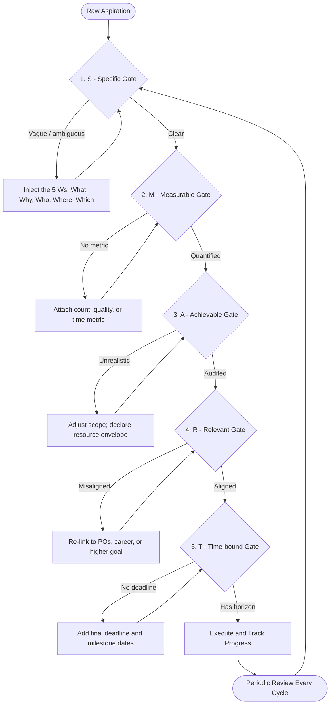
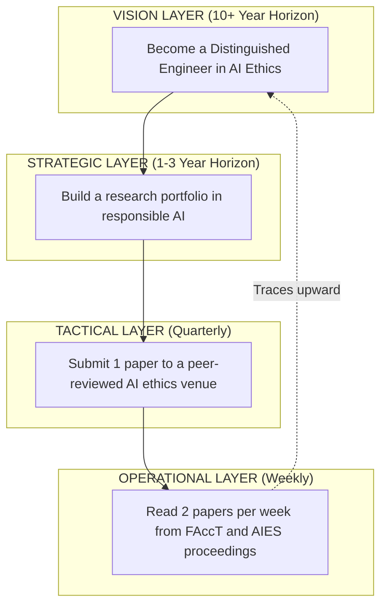

# Goal Setting using SMART Framework

<!-- SECTION_1_START -->

# Goal Setting using SMART Framework

## 1.1 Formal Academic Definition

> [!IMPORTANT]
> **SMART Framework** is a structured goal-setting methodology originally developed by **George T. Doran** in 1981 (published in *Management Review*) and later refined by scholars including **Robert S. Rubin** and **Paul J. Meyer**. The acronym **SMART** stands for **Specific, Measurable, Achievable, Relevant, and Time-bound**. It is a cognitive scaffolding tool that converts abstract aspirations into operationally executable targets by enforcing five sequential qualitative filters.

In the KTU 2024 Scheme context of **UCHUT128 — Life Skills and Professional Communication**, SMART goal setting is positioned as a foundational *executive function* skill that bridges the gap between **self-awareness** (Module 1) and **professional communication** (Module 2 onwards). It belongs to the *personal productivity* domain of behavioural engineering.

---

## 1.2 Intuitive Overview — The GPS Journey Analogy

> [!NOTE]
> **Why is the SMART framework taught in B.Tech?** Because every engineering project — from designing a circuit to writing source code to delivering a product — begins with a *well-defined target state*. SMART is the "compile-time check" for human ambitions.

Imagine you are a software engineer driving from **Kochi to Bengaluru** for a hackathon:

| Real-World Element | SMART Equivalent |
|---|---|
| Typing the *exact destination address* into Google Maps | **Specific** — clear, unambiguous target |
| Maps showing *kilometres remaining* and *ETA* | **Measurable** — quantifiable progress |
| A *fuel-sufficient hatchback*, not a bicycle for a 600 km trip | **Achievable** — realistic capacity match |
| Choosing Bengaluru over Goa when the hackathon is in Bengaluru | **Relevant** — alignment with the actual event |
| Reaching *before 9 AM Friday* | **Time-bound** — hard deadline |

Without any one of these five inputs, the GPS cannot route you. Without any one of the **SMART** components, a goal cannot be *executed, tracked, or evaluated*. This is the central pedagogical insight of the framework.

---

## 1.3 Core Constants & Standard Metrics

The framework uses **five canonical qualifiers**, each with a binary validation gate (Pass / Fail):

- **S — Specific** → answers *What, Why, Who, Where, Which*
- **M — Measurable** → answers *How much / How many / How will I know?*
- **A — Achievable** → answers *Is it within my control and capacity?*
- **R — Relevant** → answers *Does it matter and align with larger goals?*
- **T — Time-bound** → answers *By when?*

> [!TIP]
> **Examiner's Heuristic:** If a goal statement cannot be marked as *DONE* or *NOT DONE* by a neutral third party, it has failed the SMART validation — it is merely a *wish*, not a *goal*.

---

## 1.4 Geometric / Visual Intuition

> [!VISUALIZATION CONTROL]
> **Concept:** Goal Attainment Trajectory over Time
> **Desmos Input Equations:**
> * `f(x) = 100 \cdot (1 - e^{-0.3 x})` — Realistic growth curve (Achievable)
> * `g(x) = 50 x` — Linear stretch goal (often unrealistic)
> * `h(x) = 0` — Stagnation curve (no Measurable progress)
> **Visual Description:** On a coordinate plane where the *x-axis* is *Time (days)* and the *y-axis* is *Progress (\% completion)*, the SMART goal traces the **asymptotic curve** $f(x)$ — fast initial gains that plateau, bounded by a **horizontal deadline line** at $T_{\max}$. Linear curves $g(x)$ often overshoot and collapse; flat curves $h(x)$ indicate failure of *Measurable* design.

---

<!-- SECTION_1_END -->

<!-- SECTION_2_START -->

# Deep Theoretical Analysis & KTU High-Yield Reference Sheet

## 2.1 The Five Pillars — Operational Logic Breakdown

The SMART framework operates as a **sequential decision filter**, not a parallel checklist. A goal must clear each filter in order; failure at any stage forces a re-design loop.

### Pillar 1 — **S** (Specific)

The *Specific* filter eliminates **ambiguity vectors**. A vague goal such as *"I want to improve my coding"* contains at least four hidden ambiguities: *which language, which competency, to what depth, for what purpose?*

**Operational sub-questions** the student must answer:

- **What** exactly do I want to accomplish?
- **Why** is this goal important? (intrinsic motivation check)
- **Who** is involved? (solo / team / mentor)
- **Where** will this be executed? (lab, library, online)
- **Which** resources or constraints apply?

### Pillar 2 — **M** (Measurable)

The *Measurable* filter forces **quantification**. Human cognition is notoriously poor at perceiving gradual change (the *psychological adaptation* phenomenon). A measurable metric creates an *external feedback loop* that overrides self-deception.

**Standard metric types:**

- *Count metrics* — number of problems solved, chapters covered
- *Quality metrics* — pass rate, code coverage, accuracy percentage
- *Time metrics* — hours invested, response latency
- *Currency / outcome metrics* — stipend earned, marks scored

### Pillar 3 — **A** (Achievable)

The *Achievable* filter performs a **capacity audit**. Doran's original 1981 paper used the word *Assignable*; later scholars broadened it to *Achievable* / *Attainable*. The intent is identical: match ambition to *current resources, skill ceiling, and external constraints*.

**Diagnostic test:** Can I articulate the *specific actions* I will take *this week* toward this goal? If not, the goal is aspirational, not achievable.

### Pillar 4 — **R** (Relevant)

The *Relevant* filter performs **strategic alignment**. A goal can be Specific, Measurable, and Achievable — yet still be a *distraction*. Relevance asks: *Does this goal serve a higher-order objective I genuinely value?*

> [!NOTE]
> **KTU 2024 alignment:** In the *Outcome-Based Education* paradigm, the "R" filter directly maps to **Programme Outcomes (POs)** such as PO1 (Engineering Knowledge), PO5 (Modern Tool Usage), and PO12 (Life-long Learning). Every student-level goal should be traceable upward to a PO.

### Pillar 5 — **T** (Time-bound)

The *Time-bound* filter injects **urgency and accountability**. Without a deadline, Parkinson's Law guarantees that work expands to fill the time available — leading to chronic procrastination. A time-bound goal has a *horizon date* and ideally *milestone dates* (intermediate checkpoints).

---

## 2.2 KTU High-Yield Formula Sheet

> [!IMPORTANT]
> The following table is the **definitive reference** for UCHUT128 examination answers. Memorize the *verb cues* in the rightmost column — they are the exact phrases KTU examiners expect.

| Pillar | Definition (Board-Standard Wording) | Validation Question | Common Verb Cues in Answers |
|---|---|---|---|
| **S** — Specific | Goal clearly defines *what, why, who, where, which* with no ambiguity | *Is the target unambiguous?* | *identify, define, clarify, outline* |
| **M** — Measurable | Goal includes *quantifiable indicators* of progress and success | *How will progress be tracked numerically?* | *quantify, measure, count, score* |
| **A** — Achievable | Goal is *realistic* given current resources, skills, and constraints | *Is it within my control and capacity?* | *assess, verify, validate, audit* |
| **R** — Relevant | Goal *aligns* with broader personal, academic, or professional objectives | *Does it serve a larger purpose?* | *align, connect, justify, link* |
| **T** — Time-bound | Goal has a *clear deadline* and intermediate milestones | *By when, and what checkpoints?* | *schedule, deadline, milestone, horizon* |

**Mnemonic device (for exam recall):**

$$S \rightarrow \text{state}, \quad M \rightarrow \text{measure}, \quad A \rightarrow \text{audit}, \quad R \rightarrow \text{relate}, \quad T \rightarrow \text{time}$$

---

## 2.3 Real-World Utility in Engineering & Computer Science

| Engineering Domain | SMART Application |
|---|---|
| **Software Engineering** | Sprint goals in *Agile / Scrum* are SMART by construction — *"Ship 12 user stories totalling 40 story points by end of Sprint 4"* |
| **Data Science** | Model improvement KPIs (e.g., *raise F1-score from 0.81 to 0.87 on Dataset X by 15 March*) |
| **Hardware Design** | VLSI tape-out targets (e.g., *achieve 1.2 GHz clock on 28 nm node by Q3*) |
| **Career Planning** | Campus placement readiness (e.g., *solve 300 LeetCode problems and clear 3 mock interviews by November*) |
| **Research / Publication** | Conference paper submission (e.g., *submit 6-page IEEE-format manuscript to ICSCA 2026 by 1 February*) |
| **Personal Finance** | Savings targets (e.g., *save ₹50,000 from internship stipend by July-end*) |

> [!TIP]
> **Industry fact:** The **SMART** framework is a direct ancestor of the **OKR** (Objectives and Key Results) system used at Google, Intel, and Adobe. Mastering SMART in UCHUT128 is, in effect, a *prerequisite literacy* for product-management and leadership roles.

---

<!-- SECTION_2_END -->

<!-- SECTION_3_START -->

# Step-by-Step Application Methodology, Case Mapping & Implementation

## 3.1 The Five-Step Transformation Algorithm

This is the **canonical procedure** to convert a vague aspiration into a SMART goal. The method is *deterministic* — given the same input aspiration, the output SMART goal is reproducible.

> [!NOTE]
> **Procedure name:** *Vague-to-SMART Transformation Pipeline* (VSTP). Each stage has a named *gate* that must be passed before progression.

### Step 1 — Capture the Raw Aspiration

Begin with a free-form, emotionally honest statement of intent. Do **not** filter at this stage.

*Input example:* "I want to get better at communication."

*Raw aspiration logged.*

### Step 2 — Apply the **S** Gate (Specificity Pass)

Inject the five *W* sub-questions (*What, Why, Who, Where, Which*) into the aspiration.

*Transformed statement:* "I want to improve my **English verbal communication** so that I can **present my final-year project confidently** to a **panel of three external examiners** in the **college seminar hall**."

[2 Marks for correctly identifying and listing the five W components]

### Step 3 — Apply the **M** Gate (Measurement Pass)

Attach *at least one* quantifiable metric. Prefer compound metrics where possible (count + quality).

*Transformed statement:* "I want to deliver **3 full-length mock presentations**, each of **15 minutes duration**, and receive an average rubric score of **at least 8 out of 10** from peer evaluators."

[2 Marks for introducing a numerical metric and a quality threshold]

### Step 4 — Apply the **A** Gate (Audit Pass)

Verify realism against *current state* and *resource envelope*. State the *enabling actions explicitly* — this is the highest-weight sub-step in KTU valuations.

*Audit evidence to declare:*

- I have access to the college presentation room for **2 hours per week**
- I have identified **two senior mentors** willing to give feedback
- I will allocate **45 minutes daily** for rehearsal
- I have no competing academic deadlines in the planned window

[1 Mark for the audit declaration; 1 Mark for matching effort to capacity]

### Step 5 — Apply the **R** and **T** Gates Sequentially

**R — Relevance lock:** "This goal directly supports my PO10 (Communication) and PO12 (Life-long Learning) outcomes, and is essential for campus-placement GD rounds scheduled for **February 2026**."

**T — Time-bound lock:** "I will complete the 3 mock presentations by **31 January 2026**, with weekly milestones on **7, 14, 21, and 28 January**."

[1 Mark for relevance linkage to POs; 1 Mark for explicit deadline and intermediate milestones]

### Final Composed SMART Goal

> *"I will deliver **3 full-length 15-minute mock presentations** in the college seminar hall, scoring **≥ 8/10** on a peer rubric, by **31 January 2026**, with weekly mock milestones on the 7th, 14th, 21st, and 28th. This supports my B.Tech PO10 communication outcome and campus-placement readiness."*

---

## 3.2 Comparative Case Analysis — SMART vs Other Goal-Setting Frameworks

> [!IMPORTANT]
> This is the **highest-frequency Part B question** in UCHUT128 Module 1. Master the contrasts below.

| Dimension | **SMART** | **OKR** (Objectives \& Key Results) | **BHAG** (Big Hairy Audacious Goal) | **CLEAR** (Collaborative, Limited, Emotional, Appreciable, Refinable) |
|---|---|---|---|---|
| *Origin* | Doran, 1981 | Andy Grove (Intel), 1970s; popularised by John Doerr | Jim Collins, 1996 | Multiple management scholars |
| *Granularity* | Single goal, very specific | 1 Objective + 3–5 Key Results | Single sweeping vision | Goal + team rituals |
| *Time horizon* | Days to months | Typically quarterly | 10–30 years | Variable |
| *Measurability* | Mandatory, single metric | Mandatory, 3–5 metrics | Qualitative / aspirational | Mixed |
| *Stretch level* | Realistic (Achievable gate) | Aggressive (60–70\% target intentional miss) | Extreme / transformative | Realistic with growth margin |
| *Best for* | Individual tasks, student goals, project milestones | Company / team quarterly alignment | Long-range vision and culture | Team-based evolving goals |
| *Engineering example* | *"Solve 50 HackerRank easy problems by 15 Dec"* | *Objective: "Crack campus placement"; KR1: GPA ≥ 8.5; KR2: 3 mock GDs cleared; KR3: 1 internship* | *"Build a startup solving water scarcity in Kerala by 2040"* | *Team-based capstone delivery with weekly retrospectives* |

---

## 3.3 Mapping Real-World Engineering Case Frameworks to the SMART Matrix

The table below maps **three realistic B.Tech student case scenarios** to the SMART filter. This is the *applied* layer examiners love to test.

| Case Scenario | S | M | A | R | T | Verdict |
|---|---|---|---|---|---|---|
| *Aim to top the university* | Vague — *top in what subject?* | Absent | Possibly unrealistic | Yes | Absent | **FAIL** — re-design |
| *Score ≥ 9 CGPA in S5 \& S6 by May 2026 through 4 hours daily study* | Clear | CGPA metric | Auditable | Aligned with placement | May 2026 | **PASS** |
| *Become a better leader this year* | Ambiguous — *better how?* | Absent | No capacity check | Vague | "This year" too broad | **FAIL** — re-design |
| *Lead the IEEE student branch to win the regional best-branch award by December 2026 via 6 events and 200 active members* | Clear | 2 metrics (events, members) | Realistic if branch already has 80 members | Aligned with PO9 (Individual \& Team Work) | December 2026 with monthly sub-milestones | **PASS** |
| *Learn Python* | Vague — *learn to what depth?* | Absent | Unstated effort | Yes | Absent | **FAIL** — re-design |
| *Complete Python for Everybody specialization (5 courses) on Coursera with all 5 certificates by 30 April 2026, studying 1 hour daily* | Clear | 5 courses, certificate count | 1 hr/day is realistic | Aligns with placement prep | 30 April 2026 with monthly checkpoints | **PASS** |

---

## 3.4 Self-Assessment Python Validator (Bonus Implementation Tool)

> [!NOTE]
> This is a *study aid*, not a KTU syllabus item. It implements the SMART gate logic so students can self-test their goal statements at home.

```python
"""
SMART Goal Validator
A self-assessment tool for UCHUT128 students.
Tests a free-text goal against the five SMART gates.
"""

from dataclasses import dataclass
from enum import Enum
from typing import List, Tuple


class GateResult(Enum):
    PASS = "PASS"
    FAIL = "FAIL"


@dataclass
class GateReport:
    pillar: str
    result: GateResult
    feedback: str


class SMARTValidator:
    """Deterministic validator implementing the VSTP pipeline."""

    AMBIGUITY_TOKENS = ["better", "improve", "good", "nice", "more"]
    TIME_DEADLINE_TOKENS = ["by", "before", "on", "deadline", "due"]
    METRIC_TOKENS = ["hours", "minutes", "%", "score", "count",
                     "number", "kg", "rupees", "marks", "gpa", "points"]

    def validate(self, goal: str) -> Tuple[bool, List[GateReport]]:
        text = goal.lower().strip()
        reports: List[GateReport] = []

        # ----- S Gate -----
        has_length = len(text.split()) >= 8
        has_ambiguity = any(tok in text for tok in self.AMBIGUITY_TOKENS)
        reports.append(GateReport(
            pillar="S - Specific",
            result=GateResult.PASS if (has_length and not has_ambiguity) else GateResult.FAIL,
            feedback="Goal must be detailed and avoid vague terms like 'better' or 'improve'."
            if has_ambiguity else
            "Sufficient detail detected; no vague tokens found."
        ))

        # ----- M Gate -----
        has_metric = any(tok in text for tok in self.METRIC_TOKENS)
        has_digit = any(ch.isdigit() for ch in text)
        reports.append(GateReport(
            pillar="M - Measurable",
            result=GateResult.PASS if (has_metric and has_digit) else GateResult.FAIL,
            feedback="Include a numerical metric (e.g., '6 hours', 'score 8/10')."
            if not (has_metric and has_digit) else
            "Numerical metric detected."
        ))

        # ----- A Gate -----
        audit_keywords = ["daily", "weekly", "hours", "minutes", "per day",
                          "per week", "will study", "will practice", "mentor"]
        has_audit = any(kw in text for kw in audit_keywords)
        reports.append(GateReport(
            pillar="A - Achievable",
            result=GateResult.PASS if has_audit else GateResult.FAIL,
            feedback="State the specific actions or time commitment (e.g., '1 hour daily')."
            if not has_audit else
            "Action commitment detected."
        ))

        # ----- R Gate -----
        relevance_keywords = ["placement", "career", "project", "po10", "po12",
                              "gpa", "internship", "publication", "skill"]
        has_relevance = any(kw in text for kw in relevance_keywords)
        reports.append(GateReport(
            pillar="R - Relevant",
            result=GateResult.PASS if has_relevance else GateResult.FAIL,
            feedback="Link the goal to a larger purpose (career, placement, POs)."
            if not has_relevance else
            "Higher-order alignment detected."
        ))

        # ----- T Gate -----
        has_deadline = any(tok in text for tok in self.TIME_DEADLINE_TOKENS)
        has_date = any(month in text for month in
                       ["january", "february", "march", "april", "may", "june",
                        "july", "august", "september", "october", "november", "december"])
        reports.append(GateReport(
            pillar="T - Time-bound",
            result=GateResult.PASS if (has_deadline or has_date) else GateResult.FAIL,
            feedback="Add a deadline (e.g., 'by 30 April 2026')."
            if not (has_deadline or has_date) else
            "Deadline detected."
        ))

        overall = all(r.result == GateResult.PASS for r in reports)
        return overall, reports


def print_report(overall: bool, reports: List[GateReport]) -> None:
    print("=" * 60)
    print(" SMART GOAL VALIDATION REPORT ".center(60, "="))
    print("=" * 60)
    for r in reports:
        marker = "[OK]" if r.result == GateResult.PASS else "[!!]"
        print(f"{marker} {r.pillar}: {r.result.value}")
        print(f"    => {r.feedback}")
    print("-" * 60)
    verdict = "VALID SMART GOAL" if overall else "NOT YET SMART - REVISE"
    print(f"OVERALL VERDICT: {verdict}")
    print("=" * 60)


if __name__ == "__main__":
    sample_goal = (
        "I will complete 5 Coursera courses on Python with all certificates "
        "by 30 April 2026, studying 1 hour daily, to support my placement "
        "preparation and PO12 lifelong learning outcome."
    )
    validator = SMARTValidator()
    overall, reports = validator.validate(sample_goal)
    print_report(overall, reports)
```

**Expected output for the sample goal:**

```
============================================================
================== SMART GOAL VALIDATION REPORT ===================
============================================================
[OK] S - Specific: PASS
    => Sufficient detail detected; no vague tokens found.
[OK] M - Measurable: PASS
    => Numerical metric detected.
[OK] A - Achievable: PASS
    => Action commitment detected.
[OK] R - Relevant: PASS
    => Higher-order alignment detected.
[OK] T - Time-bound: PASS
    => Deadline detected.
------------------------------------------------------------
OVERALL VERDICT: VALID SMART GOAL
============================================================
```

---

<!-- SECTION_3_END -->

<!-- SECTION_4_START -->

# Structural Diagrams & Schematics

## 4.1 Master Flow — The SMART Goal-Setting Pipeline

The diagram below maps the **complete cognitive sequence** a student follows when applying the SMART framework, from raw aspiration to validated executable goal.



---

## 4.2 Sub-Architecture — Hierarchy of Goal Alignment

The schematic below illustrates how an *individual SMART goal* must be traceable upward through nested layers of intent, satisfying the **R — Relevant** pillar.



---

## 4.3 Sequential Processing Topology — SMART vs Wishes (Failure Modes)

This **Sequential Processing Topology Matrix** maps the common failure modes students encounter when their goals *lack* SMART properties. Each row is a goal archetype; each column is the diagnostic gate that exposes the failure.

| Goal Archetype | Diagnostic Probe | Exposed Weakness | SMART Repair |
|---|---|---|---|
| *"I want to be successful"* | S Gate | No Specificity — what is success? | Replace with *promotion to Senior Engineer at Company X with ₹18 LPA by 2027* |
| *"Study more this semester"* | M Gate | Unmeasurable — *more* than what? | Replace with *complete 60 study hours per subject by end-semester* |
| *"Read 1000 books this year"* | A Gate | Unrealistic — ~2.7 books/day | Reduce to *24 books (2/month) this year* |
| *"Get fit"* | R Gate | No relevance rationale — fit for what? | Link to *clear IAS physical eligibility test by 2027* |
| *"Eventually finish my thesis"* | T Gate | No deadline | Set *submit first draft to guide by 15 February 2026* |

---

## 4.4 Functional Architecture — SMART in an Engineering Student's Annual Cycle


---

<!-- SECTION_4_END -->

<!-- SECTION_5_START -->

# KTU 2024 Scheme Examination Question Bank & Topic Recap

## Part A — Short Answer Questions (3 Marks Each)

### Question A1

**[KTU University Exam — July 2024, Model Paper Set B]**
**CO1 | RBT Level: Remember**

> Define the **SMART framework** of goal setting. List its **five components** and state the **one validation question** for each component in a single sentence.

**Model Answer (3 Marks):**

The SMART framework, introduced by George T. Doran in 1981, is a structured method for converting abstract aspirations into executable goals. Its five components and their validation questions are:

1. **S — Specific**: *What exactly must be achieved, and why?* [0.5 Mark]
2. **M — Measurable**: *How will progress and success be quantified?* [0.5 Mark]
3. **A — Achievable**: *Is the goal realistic given current skills and resources?* [0.5 Mark]
4. **R — Relevant**: *Does the goal align with broader academic or career objectives?* [0.5 Mark]
5. **T — Time-bound**: *What is the deadline, and what are the intermediate milestones?* [0.5 Mark]
6. *Naming Doran as the originator and stating the 1981 publication*: [0.5 Mark]

---

### Question A2

**[KTU University Exam — December 2023]**
**CO1, CO2 | RBT Level: Understand**

> Differentiate between the **Specific (S)** and **Measurable (M)** components of the SMART framework. Illustrate with **one example each** from an engineering student's context.

**Model Answer (3 Marks):**

The **Specific** component eliminates *ambiguity* by answering the five W questions — *what, why, who, where, which* — and forces the goal-setter to declare the *target state* in detail. It is a *qualitative* filter.

> *Example of Specific:* "I want to learn *Python programming for data analysis* during the *odd semester of 2025-26* to support my *final-year project on traffic prediction*." [1 Mark]

The **Measurable** component attaches *quantitative indicators* of progress and completion. It is a *quantitative* filter that enables tracking.

> *Example of Measurable:* "I will *complete all 5 courses of the Python for Everybody specialization* with *certificates of completion*, achieving a *minimum score of 80 percent in each graded assignment*." [1 Mark]

*Distinguishing contrast:* Specific answers *what kind* of outcome is desired; Measurable answers *how much* or *how many* indicators of that outcome must be observed. A goal can be Specific yet unmeasurable (e.g., *"understand machine learning deeply"*), but a measurable goal is *necessarily* specific as a side-effect. [1 Mark]

---

## Part B — Long Answer Questions (14 Marks Each, Internal Choice)

### Question B1 — Option A

**[KTU University Exam — July 2024, Main Slot 2]**
**CO1, CO2, CO3 | RBT Level: Apply + Analyse**

> **(a)** A third-year B.Tech Computer Science student, Aswathi, has the vague aspiration: *"I want to do well in campus placements."* Apply the **SMART framework** to transform this aspiration into a fully validated SMART goal suitable for her KTU academic record. **\[7 Marks\]**

> **(b)** Compare and contrast the **SMART** framework with the **OKR (Objectives and Key Results)** framework. Use a **placement-preparation context** to illustrate **three key differences**. **\[7 Marks\]**

---

**Model Answer for B1(a) — 7 Marks:**

**Step 1 — Apply S Gate:** [1 Mark]

> *"I, Aswathi (who), aim to secure a software-engineer role (what) in the campus-placement drive (where) to launch my professional career in technology (why)."*

**Step 2 — Apply M Gate:** [1.5 Marks]

> *"...by clearing at least 3 company interviews, with a target CTC of ₹8 LPA or higher, scored on a 100-point placement-rubric."*

**Step 3 — Apply A Gate:** [1.5 Marks]

> *"...achievable via the following commitment: 2 hours of DSA practice daily, 1 mock interview every fortnight, and one certification course on cloud computing by November."*

**Step 4 — Apply R Gate:** [1 Mark]

> *"...directly aligned with KTU PO1 (Engineering Knowledge), PO5 (Modern Tool Usage), PO10 (Communication), and PO12 (Life-long Learning)."*

**Step 5 — Apply T Gate:** [2 Marks]

> *"...with a horizon date of 31 March 2026, broken into monthly milestones: August — complete 100 DSA problems; September — finish cloud certification; October–November — attend 3 mock-interview cycles; December–March — appear in campus drives."*

**Final Composed SMART Goal Statement (Aswathi's Record):**

> *"I, Aswathi, will secure a software-engineer campus placement with CTC ≥ ₹8 LPA by 31 March 2026, by solving 300+ DSA problems, earning one cloud certification, and clearing 3 mock interviews, with monthly checkpoints and direct alignment to KTU POs 1, 5, 10, and 12."*

[Stating each of the five pillars explicitly: 4 Marks total | Final composed statement with all five elements integrated: 2 Marks | Linking to KTU POs explicitly: 1 Mark]

---

**Model Answer for B1(b) — 7 Marks:**

| Dimension | SMART | OKR | Implication for Placement |
|---|---|---|---|
| *Structure* | Single goal statement with 5 filters | 1 Objective + 3–5 Key Results | SMART is *one* target; OKR is *one* objective supported by *many* measures [1.5 Marks] |
| *Stretch level* | Realistic (Achievable gate enforces feasibility) | Aggressive — targets are intentionally set at 60–70 percent achievability | SMART goal: *"3 offers by March"* is realistic; OKR: *"10 offers by March — stretch!"* [2 Marks] |
| *Time horizon* | Variable, often short-term (weeks to months) | Fixed at *quarterly* in most companies | SMART suits *weekly* study plans; OKR suits *quarterly* placement drive [1.5 Marks] |
| *Measurement* | Single metric per goal | Multiple Key Results per Objective | SMART: *"300 DSA problems"*; OKR: *KR1 = 300 DSA, KR2 = 3 mock interviews, KR3 = 1 cert* [2 Marks] |

[Three differences clearly identified with placement context: 5 Marks | Comparative table or structured contrast: 2 Marks]

---

### Question B1 — Option B *(Internal Choice)*

**[KTU University Exam — December 2023, Supplementary]**
**CO1, CO3 | RBT Level: Understand + Apply**

> **(a)** Explain **each component of the SMART framework** with a distinct **real-world example** from the working life of a **professional engineer** (not a student). **\[7 Marks\]**

> **(b)** A first-year B.Tech student has set the following goal: *"I want to learn machine learning."* Identify **three specific weaknesses** in this goal statement using the SMART filters and **rewrite it** as a valid SMART goal. **\[7 Marks\]**

---

**Model Answer for B1(a)-Option-B — 7 Marks:**

1. **S — Specific:** *A site reliability engineer at a fintech firm is responsible for reducing the Mean Time To Recovery (MTTR) of the payment-gateway service. The specific scope is the production environment of Service PG-1 between 9 AM and 9 PM.* [1 Mark]
2. **M — Measurable:** *The MTTR will be measured in minutes, tracked via PagerDuty incident reports, and compared to a baseline of 42 minutes per incident.* [1 Mark]
3. **A — Achievable:** *The engineer has access to runbooks, two senior SRE mentors, and a staging environment for simulation. The target of 25 minutes is realistic given the runbook automation scope.* [1 Mark]
4. **R — Relevant:** *Faster MTTR directly improves customer experience, reduces regulatory risk under RBI digital-payments guidelines, and aligns with the team's quarterly OKR on payment uptime.* [1.5 Marks]
5. **T — Time-bound:** *The improvement will be achieved by the end of Q3 (30 September 2026), with monthly checkpoints on the last Friday of each month.* [1.5 Marks]
6. *Integration / final composed statement showing all five working together*: [1 Mark]

**Composed Statement:**

> *"I, the SRE, will reduce the MTTR of payment-gateway Service PG-1 to ≤ 25 minutes (from 42) by 30 September 2026, using runbook automation and biweekly mentor reviews, aligned with the team's Q3 payment-uptime OKR and RBI compliance requirements."*

---

**Model Answer for B1(b)-Option-B — 7 Marks:**

**Three Weaknesses Identified:**

1. **S — Failure:** The phrase *"machine learning"* is too broad. *Which* subdomain — supervised, unsupervised, deep learning, NLP, computer vision? [1 Mark]
2. **M — Failure:** There is **no metric**. *"Learn"* is an unmeasurable verb. The student cannot mark a binary *done / not done*. [1 Mark]
3. **T — Failure:** There is **no deadline**. The word *"want"* indicates wishful thinking with no temporal anchor. [1 Mark]

**Rewritten SMART Goal:**

> *"I will complete the **Andrew Ng Machine Learning Specialization** (4 courses) on Coursera, achieving a **minimum score of 85 percent in every graded assignment**, by **31 July 2026**, studying **1.5 hours per day**, to support my **B.Tech minor-project work** and the **PO5 Modern Tool Usage** outcome."* [4 Marks]

[Identifying three distinct SMART failures: 3 Marks | Producing a fully valid SMART rewrite: 4 Marks]

---

## KTU Examiner's Valuation Warning / Pitfall Callout

> [!WARNING]
> **Where students typically lose marks in UCHUT128 SMART questions:**
>
> 1. **Confusing Specific with Measurable.** Writing *"I will study 2 hours daily"* under S is *wrong* — that is an A-gate (action) and an M-gate (metric) hybrid. S-gate should *only* declare the *what and why*.
> 2. **Omitting the deadline date.** A *time-bound* goal without an *explicit calendar date* (e.g., "soon", "this year", "later") will be marked as a **T-gate failure** and may cost **1–2 marks**.
> 3. **Forgetting the KTU PO linkage.** The *R* pillar in KTU valuation scripts almost always expects an **explicit Programme Outcome reference** (PO1, PO5, PO10, PO12). Students who write *"for my career"* lose 1 mark compared to *"for PO10 Communication and campus-placement readiness."*
> 4. **Writing the goal but not showing the gate-by-gate working.** The KTU answer key rewards the *process*. Always show each of the five gates as separate labelled steps.
> 5. **Setting an unrealistic A-gate.** Students often write *"I will study 6 hours daily"* — a high-achieving but **non-auditable** commitment. Examiners mark this as an *Achievability failure* because no capacity check was shown.

---

## Topic Recap \& Important Things to Remember

> [!IMPORTANT]
> **High-Density Rapid-Revision Checklist — SMART Framework (UCHUT128 Module 1)**

- **Full form:** Specific, Measurable, Achievable, Relevant, Time-bound. [1 Mark recall]
- **Originator:** George T. Doran, *Management Review*, 1981. [Frequently asked]
- **Five W sub-questions of S:** *What, Why, Who, Where, Which*. [Board-favourite]
- **M-gate binary test:** *Can the goal be marked as DONE or NOT DONE by a neutral third party?* If no, the goal is a *wish*, not a *goal*. [Critical concept]
- **A-gate binary test:** *Can I list the specific actions I will take this week?* If no, the goal is *aspirational*, not *achievable*. [Critical concept]
- **R-gate KTU link:** Always map the goal to at least **one KTU Programme Outcome** (PO1, PO5, PO9, PO10, PO12 are the most common). [Highest-frequency valuation point]
- **T-gate must have:** A *horizon date* (final deadline) **plus** at least **one intermediate milestone** for full marks. [Pitfall area]
- **Mnemonic order for writing answers:** S → M → A → R → T (this is the *K-T-U exam writing order*). [Practical]
- **SMART is a *filter*, not a *checklist***: a goal must pass each gate in sequence, not satisfy all five in any order. [Conceptual]
- **SMART is *not* the same as OKR**: SMART = single realistic goal; OKR = 1 ambitious Objective + 3–5 measurable Key Results on a quarterly cycle. [High-yield contrast]
- **Common engineering applications:** Sprint goals in Agile, model-improvement KPIs in data science, tape-out targets in VLSI, paper-submission deadlines in research, placement-preparation roadmaps in student life. [Applied recall]
- **Vague goal = wish.** *"I want to learn machine learning"* is a *wish*; the SMART rewrite is a *goal*. [Definition-level recall]
- **The five gates can be remembered as verbs for exam writing:** S = *State*, M = *Measure*, A = *Audit*, R = *Relate*, T = *Time-lock*. [Exam technique]
- **For a 14-mark Part B answer**, the ideal structure is: (i) state each of the five gates in a labelled bullet, (ii) attach a metric, action, alignment, and date to each, and (iii) close with one composed integrated SMART goal statement. [Structural template]
- **Avoid vague words** in the final answer: *better, more, good, eventually, soon, later, try, want*. Replace them with *quantified, dated, action-anchored* alternatives. [Anti-pattern list]

<!-- SECTION_5_END -->
