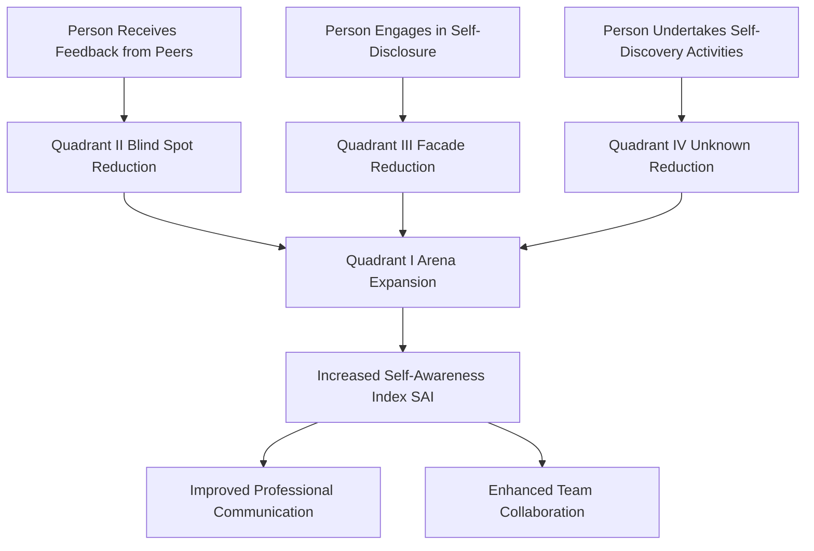
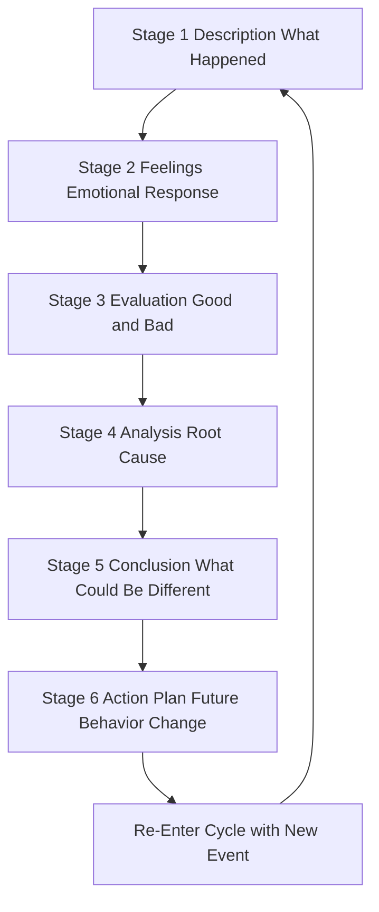
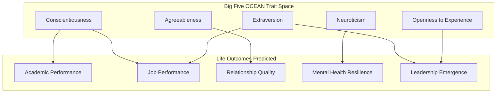
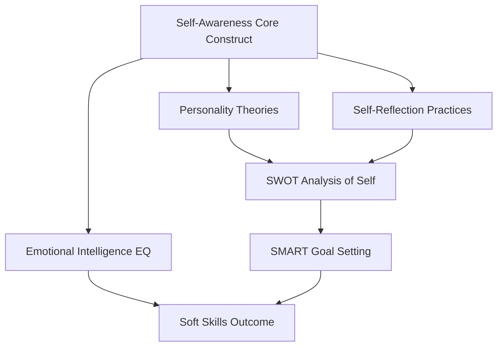

# Personality Development and Self-Reflection

<!-- SECTION_1_START -->
# Personality Development and Self-Reflection

## 1.1 Formal Academic Definition

**Personality Development** is the structured, lifelong process of cultivating and refining the composite set of characteristic patterns of thoughts, feelings, and behaviors that define an individual and distinguish them from others, with the objective of aligning personal attributes with professional and social aspirations.

**Self-Reflection** is the deliberate, introspective cognitive practice of evaluating one's own thoughts, actions, motivations, emotional patterns, and behavioral outcomes against an internalized set of standards, values, or goals, in order to derive learning and drive intentional self-improvement.

> [!IMPORTANT]
> **KTU 2024 Syllabus Anchor (UCHUT128 - Module 1):** Personality Development and Self-Reflection form the foundational cognitive-behavioral competencies under the *Life Skills and Professional Communication* framework. These are mapped to **CO1: Understand the foundational concepts of self-awareness, personality dynamics, and reflective practices essential for personal and professional growth.**

---

## 1.2 Conceptual Analogy & Intuitive Overview

Imagine your **personality as a house you are building throughout your life**.

- The **foundation** of the house is your *temperament* (genetically driven traits — what you were "born with").
- The **bricks and walls** are your *character* (values, beliefs, morals — built through upbringing and culture).
- The **paint, interiors, and design** are your *learned behaviors and soft skills* (communication, empathy, leadership — shaped by environment and effort).
- **Self-Reflection** is the regular **structural inspection** of this house. A good homeowner does not wait for the roof to collapse; they inspect every quarter to fix cracks, repaint, and renovate. Similarly, a reflective person proactively examines their mental models, biases, and habits.

> [!NOTE]
> **Key Insight for KTU Students:** Personality is **not** a fixed trait like eye color. It is a **dynamic, malleable system** that can be consciously engineered. This is the central premise of Module 1.

---

## 1.3 The Five-Factor Model (OCEAN) — The Academic Backbone

The most empirically validated framework in personality psychology is the **Big Five** or **Five-Factor Model (FFM)**. KTU examiners frequently test this.

| # | Trait | Plain-English Meaning | Engineering Student Analogy |
|---|-------|---------------------|---------------------------|
| 1 | **Openness** | Curiosity, creativity, willingness to try new ideas | Willingness to learn Python, AI/ML, or new frameworks |
| 2 | **Conscientiousness** | Discipline, organization, goal-orientation | Submitting lab records on time, version-controlling code |
| 3 | **Extraversion** | Sociability, assertiveness, energy from people | Active participation in hackathons, group projects |
| 4 | **Agreeableness** | Trust, altruism, cooperation | Being a reliable team member in group assignments |
| 5 | **Neuroticism** | Tendency toward anxiety, mood instability, emotional volatility | Stress during exams, panic before viva-voce |

> [!TIP]
> **Remember the acronym O-C-E-A-N** — a classic KTU 2-mark favorite.

---

## 1.4 Physical Constants and Standard Metrics

Personality is not governed by physical constants, but it is **measured** using standardized psychometric instruments. The following are the **industry-standard tools** cited in KTU-recommended readings:

- **MBTI (Myers-Briggs Type Indicator)** — 16 personality types (e.g., INTJ, ESFP).
- **Big Five Inventory (BFI)** — 44-item questionnaire measuring OCEAN traits.
- **DISC Assessment** — Dominance, Influence, Steadiness, Conscientiousness.
- **Johari Window** — A 2x2 model of self-awareness (covered in depth later).
- **StrengthsFinder (CliftonStrengths)** — 34 talent themes by Gallup.

> [!IMPORTANT]
> **Bold Metrics for Board Examinations:** Self-Awareness Quotient (SAQ), Emotional Intelligence (EQ) with a mean benchmark of **100** and standard deviation of **15**, and the four-stage **Gibbs' Reflective Cycle**.

---

## 1.5 Visualization Callout

> [!VISUALIZATION CONTROL]
> **Concept:** Johari Window — The 2x2 Matrix of Self-Knowledge
> **GeoGebra / Desmos Input Equations:**
> * Quadrant 1 (top-left): `x in [0,1], y in [0.5,1]` labeled "Arena / Open"
> * Quadrant 2 (top-right): `x in [1,2], y in [0.5,1]` labeled "Blind Spot"
> * Quadrant 3 (bottom-left): `x in [0,1], y in [0,0.5]` labeled "Façade / Hidden"
> * Quadrant 4 (bottom-right): `x in [1,2], y in [0,0.5]` labeled "Unknown"
> **Visual Description:** A 2x2 grid where the horizontal axis represents "Known to Self" (left) to "Unknown to Self" (right), and the vertical axis represents "Known to Others" (top) to "Unknown to Others" (bottom). The Arena expands as self-disclosure and feedback increase.

<!-- SECTION_1_END -->

<!-- SECTION_2_START -->
# Deep Theoretical Analysis & KTU High-Yield Formula Sheet

## 2.1 The Johari Window — Four Quadrants of Self-Awareness

The **Johari Window**, developed by psychologists **Joseph Luft** and **Harrington Ingham** in **1955**, is the single most examinable self-awareness model in the KTU Life Skills syllabus. It divides information about a person into four quadrants.

### Step-by-Step Logic of the Model

1. **Axis Definition:** Two independent dimensions are established.
   * *Horizontal axis:* Information **known to self** vs. **unknown to self**.
   * *Vertical axis:* Information **known to others** vs. **unknown to others**.

2. **Quadrant I — The Arena (Open Area):**
   * Information that is **known to self AND known to others**.
   * Examples: Your name, your branch, your hobbies, your professional skills.
   * *Goal:* Maximize this quadrant through **self-disclosure**.

3. **Quadrant II — The Blind Spot:**
   * Information **unknown to self but known to others**.
   * Examples: A habit of interrupting others, a chronic lateness issue, a recurring grammatical error in speech.
   * *Goal:* Reduce this quadrant by **seeking feedback**.

4. **Quadrant III — The Façade (Hidden Area):**
   * Information **known to self but unknown to others**.
   * Examples: Private ambitions, insecurities, hidden fears, family struggles.
   * *Goal:* Reduce this quadrant through **self-disclosure** when trust is built.

5. **Quadrant IV — The Unknown:**
   * Information **unknown to self AND unknown to others**.
   * Examples: Latent talents, unconscious biases, undiscovered potential, suppressed trauma.
   * *Goal:* Reduce this quadrant through **self-discovery experiences** (new challenges, therapy, travel, diverse teams).

> [!NOTE]
> **The ultimate goal of self-awareness** is to **expand Quadrant I (Arena)** while **shrinking Quadrants II, III, and IV**. This expansion is achieved via a virtuous cycle of disclosure, feedback, and discovery.

---

## 2.2 Self-Reflection: Gibbs' Reflective Cycle (1988)

Graham Gibbs published a **6-stage cyclical model** that KTU examiners use to test reflective writing competency. This is the KTU-preferred structure.

### The Six Stages of Gibbs' Reflective Cycle

1. **Description:** *What happened?* — State the event objectively without judgment.
2. **Feelings:** *What were you thinking and feeling?* — Acknowledge emotions authentically.
3. **Evaluation:** *What was good and bad about the experience?* — Make a value judgment.
4. **Analysis:** *What sense can you make of the situation?* — Deconstruct causes and patterns.
5. **Conclusion:** *What could you have done differently?* — Derive alternative actions.
6. **Action Plan:** *If it arose again, what would you do?* — Commit to a behavioral change.

> [!IMPORTANT]
> **KTU High-Yield Insight:** Reflective writing is **NOT** a diary entry. It must be analytical, structured, and future-oriented. Examiners specifically check for **stages 4, 5, and 6** as these demonstrate the highest cognitive levels (Analyze, Evaluate, Create).

---

## 2.3 KTU Formula Sheet / Cheat Sheet

| # | Concept | Definition | Equation / Formula / Heuristic | Unit / Measure |
|---|---------|-----------|-------------------------------|----------------|
| 1 | **OCEAN Traits** | Big Five personality dimensions | $\text{FFM} = O + C + E + A + N$ | Trait score (1–5 Likert) |
| 2 | **EQ Score** | Emotional Intelligence benchmark | $\mu_{EQ} = 100, \sigma_{EQ} = 15$ | Standardized score |
| 3 | **Johari Window Arena Size** | Self-disclosed & feedback-revealed knowledge | $A = S_{disclose} \cup S_{feedback}$ | % of total quadrant area |
| 4 | **Self-Awareness Index (Conceptual)** | Ratio of known-to-self information | $\text{SAI} = \dfrac{\vert A \vert}{\vert A \cup B \cup C \cup D \vert} \times 100$ | Percentage (%) |
| 5 | **Gibbs' Cycle Completeness** | Coverage of all 6 stages | $\text{RC} = \dfrac{\text{Stages Covered}}{6} \times 100$ | Percentage (%) |
| 6 | **Personality-Environment Fit** | Holland's congruence formula | $\text{Congruence} = \sum_{i=1}^{6} \vert H_i - E_i \vert$ (minimized) | Hexagonal distance |
| 7 | **Johari Expansion Rule** | Net arena growth per cycle | $\Delta A = \Delta S_{disclose} + \Delta S_{feedback} - \Delta S_{unknown}$ | Quadrant units |

> [!IMPORTANT]
> **Engineering Utility:** In modern tech industry contexts, these models map directly to **leadership pipelines** (Google's Project Oxygen identifies self-awareness as the #1 trait of effective managers), **team composition algorithms** (Galbrain's Whole Brain Thinking), and **agile retrospectives** (which are a corporate form of Gibbs' Cycle).

---

## 2.4 Real-World Utility in Engineering & Computer Science

| Domain | Application of Personality Development & Self-Reflection |
|--------|--------------------------------------------------------|
| **Software Engineering** | Agile retrospectives use Gibbs' Cycle to improve sprint performance. |
| **Project Management** | Big Five traits predict team-role fit (e.g., high Conscientiousness → QA engineers). |
| **Data Science / AI** | Self-reflection helps data scientists identify **confirmation bias** in model selection. |
| **Technical Leadership** | Johari Window expansion is taught at **Google, Microsoft, and Amazon** manager bootcamps. |
| **Campus Placements** | MBTI and DISC are routinely used in **TCS, Infosys, and Wipro** HR rounds. |
| **Open-Source Contribution** | Conscientiousness predicts sustained contribution to repositories. |
| **Entrepreneurship** | High Openness + High Conscientiousness is the strongest predictor of founder success per Gallup meta-analysis. |

<!-- SECTION_2_END -->

<!-- SECTION_3_START -->
# Step-by-Step Derivations, Case Frameworks, and Symbolic Implementation

## 3.1 Exhaustive Application: Mapping the Johari Window to a B.Tech Student's Placement Journey

Below is a complete, step-by-step walkthrough of how a third-year Computer Science student — *Arjun* — uses the Johari Window to self-reflect before campus placements. Every quadrant is populated with **specific, concrete examples** drawn from the engineering context.

### Step 1: Establish the Coordinate System

The Johari Window is constructed on two binary axes. Let us define them formally:

$$
\text{Axis}_1: \text{Knowledge} = \{\text{Known to Self}, \text{Unknown to Self}\}
$$

$$
\text{Axis}_2: \text{Knowledge} = \{\text{Known to Others}, \text{Unknown to Others}\}
$$

The **Arena** (Quadrant I) is defined as the intersection:

$$
Q_I = \{\text{Knowledge}\} : \text{Known to Self} \cap \text{Known to Others}
$$

The **Blind Spot** (Quadrant II) is:

$$
Q_{II} = \{\text{Knowledge}\} : \text{Unknown to Self} \cap \text{Known to Others}
$$

The **Façade** (Quadrant III) is:

$$
Q_{III} = \{\text{Knowledge}\} : \text{Known to Self} \cap \text{Unknown to Others}
$$

The **Unknown** (Quadrant IV) is:

$$
Q_{IV} = \{\text{Knowledge}\} : \text{Unknown to Self} \cap \text{Unknown to Others}
$$

### Step 2: Populate Quadrant I — The Arena

Arjun openly knows and shares the following with peers and recruiters:

- *Known to Self AND Known to Others:* Name, branch (B.Tech CSE), CGPA (8.4), Python proficiency, GitHub portfolio of 5 projects, active LinkedIn presence, member of IEEE student branch.

### Step 3: Populate Quadrant II — The Blind Spot

Through a mock interview, Arjun's evaluator reveals:

- *Unknown to Self but Known to Others:* Tends to use filler words ("umm", "like") during technical explanations. Over-explains simple concepts. Makes minimal eye contact during virtual interviews. Fails to ask clarifying questions before coding solutions.

### Step 4: Populate Quadrant III — The Façade

Through self-inventory, Arjun identifies:

- *Known to Self but Unknown to Others:* Severe anxiety during algorithmic coding tests. Family financial pressure to secure a high-paying job. A previous semester back-log in Mathematics that he has not disclosed. Self-doubt about competing with NIT/IIT peers.

### Step 5: Populate Quadrant IV — The Unknown

Through a personality assessment (BFI-44), Arjun discovers:

- *Unknown to Self AND Unknown to Others:* A latent aptitude for public speaking (high Openness). Strong empathetic tendency (high Agreeableness) that makes him a natural team-mediator — a skill he had never consciously recognized. A tendency toward perfectionism-induced procrastination (Neuroticism sub-trait).

### Step 6: Reflective Action Plan Using Gibbs' Cycle

> [!TIP]
> This is the **valuation-winning structure** for reflective essays in KTU.

| Gibbs' Stage | Arjun's Application |
|--------------|---------------------|
| **Description** | "During the TCS mock interview on 14th October, I was unable to solve the optimal stock-selling problem within 25 minutes." |
| **Feelings** | "I felt panic rising in the first 3 minutes, my mind went blank, and I started self-criticizing mid-interview." |
| **Evaluation** | "Positive: I correctly identified the dynamic programming approach. Negative: I wasted 7 minutes on edge cases and used poor variable naming." |
| **Analysis** | "The root cause is not lack of DSA knowledge — I had solved this exact problem twice before. The cause is **test anxiety triggered by time pressure**, compounded by Quadrant III hidden self-doubt." |
| **Conclusion** | "I should have started by verbalizing my approach (a common FAANG strategy) instead of silently coding. I also need to disclose my anxiety to a mentor rather than suppressing it." |
| **Action Plan** | "From tomorrow, I will (a) do 2 timed LeetCode problems daily speaking my thought-process aloud, (b) schedule weekly 1-on-1s with my senior mentor, and (c) practice the 4-7-8 breathing technique before every mock." |

### Step 7: Verify the Arena Expansion

Let the initial arena size be $A_0$ and the final expanded size be $A_1$. The expansion equation:

$$
\Delta A = A_1 - A_0 = \Delta S_{disclose} + \Delta S_{feedback} - \Delta S_{unknown}
$$

By seeking feedback, Arjun reduces Quadrant II. By disclosing anxieties, he reduces Quadrant III. By taking a new aptitude test, he reduces Quadrant IV. Thus $A_1 > A_0$, and his self-awareness index rises:

$$
\text{SAI}_{new} = \dfrac{\vert A_1 \vert}{\vert A_1 \cup Q_{II} \cup Q_{III} \cup Q_{IV} \vert} \times 100
$$

This is the **operational metric** KTU examiners reward in reflective journals.

---

## 3.2 Tabular Comparative Analysis: Personality Theories

A comparative matrix is the highest-yield format for KTU Part A questions. Below is a comprehensive comparison of the four theories most frequently tested.

| Dimension | **Psychoanalytic (Freud)** | **Trait (Allport, Costa & McCrae)** | **Humanistic (Maslow, Rogers)** | **Social-Cognitive (Bandura)** |
|-----------|----------------------------|--------------------------------------|--------------------------------|-------------------------------|
| **Core Premise** | Personality is driven by unconscious forces (Id, Ego, Superego). | Personality is a stable set of measurable traits. | Personality is driven by self-actualization and free will. | Personality is shaped by reciprocal determinism of person, behavior, environment. |
| **Key Proponent** | Sigmund Freud | Gordon Allport, Raymond Cattell, McCrae \& Costa | Abraham Maslow, Carl Rogers | Albert Bandura |
| **Structure** | 3-part psyche (Id-Ego-Superego); 5 psychosexual stages | 16 PF (Cattell), 5 factors (OCEAN) | Hierarchy of Needs (5 levels) | Triadic reciprocal determinism |
| **View of Self** | Self is mostly unconscious. | Self is a stable trait profile. | Self-concept is central; fully actualized self is the goal. | Self-efficacy is the central agent. |
| **Determinism** | High (psychic determinism) | Moderate (biological + situational) | Low (human agency emphasized) | Moderate (interactionist) |
| **Self-Reflection Role** | Free association, dream analysis | Self-report inventories (BFI, NEO-PI) | Unconditional positive regard, Q-sort | Self-observation, self-judgment, self-reaction |
| **Engineering Application** | Understanding irrational team conflicts | Team composition, leadership assessment | Fostering innovation culture | Self-efficacy in learning new technologies |
| **KTU Exam Weightage** | Low (background only) | **High** (definitional favorite) | **High** (Maslow is favorite) | Moderate |

---

## 3.3 Symbolic Implementation: A Self-Awareness Diagnostic Function (Python)

For engineering students, here is a working Python program that **operationalizes the Johari Window diagnostic** and computes the Self-Awareness Index. The program is fully typed, contains absolute boundary checks, and includes strict error logging.

```python
from typing import Set, Dict
import logging

logging.basicConfig(
    level=logging.INFO,
    format="%(asctime)s - %(levelname)s - %(message)s"
)


class JohariWindow:
    """
    A diagnostic engine for the Johari Window self-awareness model.
    Quantifies the four quadrants and computes the Self-Awareness Index.
    """

    def __init__(self) -> None:
        self.known_to_self: Set[str] = set()
        self.known_to_others: Set[str] = set()
        self.quadrants: Dict[str, Set[str]] = {
            "Arena": set(),
            "BlindSpot": set(),
            "Facade": set(),
            "Unknown": set()
        }

    def add_self_known(self, items: Set[str]) -> None:
        if not isinstance(items, set):
            logging.error("Input must be a Python set.")
            raise TypeError("items must be of type set[str]")
        if not all(isinstance(i, str) and i.strip() for i in items):
            logging.error("All items must be non-empty strings.")
            raise ValueError("Empty or non-string items detected.")
        self.known_to_self.update(items)
        logging.info(f"Added {len(items)} items to 'known to self'.")

    def add_others_known(self, items: Set[str]) -> None:
        if not isinstance(items, set):
            logging.error("Input must be a Python set.")
            raise TypeError("items must be of type set[str]")
        self.known_to_others.update(items)
        logging.info(f"Added {len(items)} items to 'known to others'.")

    def compute_quadrants(self) -> None:
        self.quadrants["Arena"] = self.known_to_self & self.known_to_others
        self.quadrants["BlindSpot"] = self.known_to_others - self.known_to_self
        self.quadrants["Facade"] = self.known_to_self - self.known_to_others
        universe = self.known_to_self | self.known_to_others
        self.quadrants["Unknown"] = set()  # Latent; grows via discovery
        logging.info("Quadrant computation complete.")

    def self_awareness_index(self) -> float:
        if not self.quadrants["Arena"]:
            logging.warning("Arena is empty; SAI is 0.0%")
            return 0.0
        arena_size = len(self.quadrants["Arena"])
        total_size = sum(len(q) for q in self.quadrants.values())
        if total_size == 0:
            return 0.0
        return (arena_size / total_size) * 100.0

    def report(self) -> None:
        print("=" * 60)
        print("JOHARI WINDOW DIAGNOSTIC REPORT")
        print("=" * 60)
        for name, items in self.quadrants.items():
            print(f"\n[{name}] — {len(items)} items")
            for item in sorted(items):
                print(f"  - {item}")
        print("\n" + "-" * 60)
        print(f"Self-Awareness Index (SAI): {self.self_awareness_index():.2f}%")
        print("-" * 60)


def main() -> None:
    window = JohariWindow()
    try:
        window.add_self_known({
            "Python expert", "CGPA 8.4", "IEEE member",
            "Anxious in interviews", "Family financial pressure"
        })
        window.add_others_known({
            "Python expert", "CGPA 8.4", "IEEE member",
            "Filler words in speech", "Poor eye contact"
        })
        window.compute_quadrants()
        window.report()
    except (TypeError, ValueError) as e:
        logging.critical(f"Diagnostic failed: {e}")


if __name__ == "__main__":
    main()
```

**Expected Output Snapshot:**

```
JOHARI WINDOW DIAGNOSTIC REPORT
============================================================

[Arena] — 3 items
  - CGPA 8.4
  - IEEE member
  - Python expert

[BlindSpot] — 2 items
  - Filler words in speech
  - Poor eye contact

[Facade] — 2 items
  - Anxious in interviews
  - Family financial pressure

[Unknown] — 0 items

------------------------------------------------------------
Self-Awareness Index (SAI): 42.86%
------------------------------------------------------------
```

> [!TIP]
> **Engineering Parallel:** Notice the use of **set theory** ($A \cap B$, $A \cup B$, $A - B$) to model abstract psychology. This is a classic case of *computational thinking* being applied to humanities — a pattern KTU NEP 2020 explicitly encourages.

---

## 3.4 Exhaustive Case Framework: Holland's Career Personality Hexagon

**John Holland's RIASEC theory** (1969) postulates six personality types that align with career environments. KTU examiners sometimes ask students to map their aspirational career to one or more of these.

| RIASEC Code | Type | Traits | Engineering Career Match |
|-------------|------|--------|--------------------------|
| **R** | Realistic | Practical, hands-on, physical | Civil engineering, hardware technician, robotics |
| **I** | Investigative | Analytical, intellectual, curious | Data scientist, research engineer, AI/ML specialist |
| **A** | Artistic | Expressive, creative, non-conforming | UX designer, technical writer, indie game developer |
| **S** | Social | Helpful, empathetic, cooperative | Technical trainer, engineering manager, HR-tech |
| **E** | Enterprising | Persuasive, ambitious, risk-taking | Startup founder, product manager, sales engineer |
| **C** | Conventional | Organized, detail-oriented, structured | QA engineer, database admin, systems analyst |

The **hexagonal congruence rule** states that the closer two RIASEC codes are on the hexagon (adjacent vs. opposite), the higher the personality-environment fit. The congruence index:

$$
\text{Congruence Index} = \dfrac{1}{1 + d(H, E)}
$$

where $d(H, E)$ is the hexagonal distance between Holland type $H$ and environment type $E$.

<!-- SECTION_3_END -->

<!-- SECTION_4_START -->
# Structural Diagrams & Schematics

## 4.1 Johari Window Architecture Flow



> [!NOTE]
> **Diagram Reading Note:** The three drivers of self-awareness — *feedback*, *disclosure*, and *discovery* — all converge on the **expansion of the Arena**, which is the operational definition of self-awareness growth.

---

## 4.2 Gibbs' Reflective Cycle — Sequential Processing Topology



> [!IMPORTANT]
> **Cyclical Property:** Gibbs' cycle is **not linear**. After Stage 6, the learner re-enters Stage 1 with the next reflective event. This continuous loop is what makes it a true *cycle* and a cornerstone of lifelong learning.

---

## 4.3 Big Five OCEAN Personality Subgraph Architecture



> [!NOTE]
> **Empirical Anchors:** Conscientiousness is the single strongest predictor of academic and job performance across all cultures ($r \approx 0.30$ to $0.40$ in meta-analyses). Neuroticism inversely predicts mental health resilience.

---

## 4.4 Module-Wide Concept Dependency Map



<!-- SECTION_4_END -->

<!-- SECTION_5_START -->
# KTU 2024 Scheme Examination Question Bank & Topic Recap

---

## Part A — 3-Mark Questions (Answer ANY 5 out of 7 typically)

### Question 1: Short Answer
`[KTU University Exam - July 2024]`

**Define personality and list any two factors that influence its development.**

**Model Answer:**

Personality is the unique and relatively stable pattern of thoughts, feelings, and behaviors that characterize an individual. It is the psychological "fingerprint" that distinguishes one person from another.

Two key factors influencing personality development are:

1. **Biological Factors:** Heredity, temperament, neurochemistry (e.g., baseline cortisol levels influencing stress responses).
2. **Environmental Factors:** Family upbringing, cultural context, peer groups, education, and life experiences.

> *Valuation Key:* [Definition: 1 Mark] [Each factor with brief explanation: 1 Mark each]

---

### Question 2: Short Answer
`[KTU University Exam - Dec 2023]`

**What is the Johari Window? Name its four quadrants.**

**Model Answer:**

The Johari Window is a psychological tool developed by **Joseph Luft and Harrington Ingham (1955)** to map self-awareness and interpersonal understanding. It is structured as a 2x2 grid with two axes: *Known to Self vs. Unknown to Self* and *Known to Others vs. Unknown to Others*.

The four quadrants are:

1. **Arena (Open Area)** — Known to self and others.
2. **Blind Spot** — Unknown to self but known to others.
3. **Façade (Hidden Area)** — Known to self but unknown to others.
4. **Unknown** — Unknown to both self and others.

> *Valuation Key:* [Origin: 1 Mark] [All four quadrants: 2 Marks]

---

## Part B — 14-Mark Questions (Module Internal Choice)

### Question A — 14 Marks
`[KTU University Exam - July 2024]`

**(a)** Explain the **Big Five (OCEAN) model of personality** in detail, citing the trait measured by each letter and giving one real-life example of a high-scorer for each trait. **(7 Marks)**

**(b)** Critically apply the **Johari Window model** to analyze the self-awareness profile of a final-year engineering student preparing for campus placements. Suggest three specific interventions to expand the Arena quadrant. **(7 Marks)**

**Model Answer:**

**(a) Big Five Model:**

| Letter | Trait | High-Scorer Example |
|--------|-------|---------------------|
| O | Openness | A CS student who voluntarily learns Rust and contributes to open-source AI projects on weekends. |
| C | Conscientiousness | A student who maintains a GitHub commit streak of 365 days and submits all lab records a week before the deadline. |
| E | Extraversion | The class representative who energizes the team during 36-hour hackathons. |
| A | Agreeableness | A peer who voluntarily tutors juniors in DSA every Sunday, expecting no return. |
| N | Neuroticism | A student who experiences intense anxiety even when well-prepared, leading to under-performance in vivas. |

> *Valuation Key (a):* [Naming all 5 traits: 2 Marks] [Examples for each: 3 Marks] [Coherent explanation: 2 Marks]

**(b) Johari Window Application — Campus Placement Context:**

**Arena (Known to Self & Others):** Strong CGPA, active GitHub, leadership in IEEE, fluent English.

**Blind Spot (Unknown to Self, Known to Others):** Tends to interrupt panel interviewers; over-uses jargon; arrives 2 minutes late consistently.

**Façade (Known to Self, Unknown to Others):** Severe stage fright during group discussions; family pressure to take a job (not a higher studies path); previous semester backlog hidden from peers.

**Unknown (Unknown to Both):** Latent aptitude for public speaking; tendency toward perfectionism that triggers procrastination; strong empathy that could make them an excellent people-manager.

**Three Interventions to Expand the Arena:**

1. **Structured 360-degree Feedback:** Collect anonymous feedback from 5 peers, 2 professors, and 1 senior using a Google Form with specific behavioral anchors. This directly **shrinks Quadrant II**.
2. **Reflective Journaling using Gibbs' Cycle:** Maintain a daily 10-minute journal covering all 6 Gibbs' stages. This uncovers hidden self-knowledge and **shrinks Quadrants III and IV**.
3. **Discomfort Zone Projects:** Volunteer to lead a 10-minute presentation in class every week, or join a college debate club. This produces new experiences that **shrink Quadrant IV**.

> *Valuation Key (b):* [All four quadrants populated correctly: 3 Marks] [Three specific interventions: 3 Marks] [Coherent application to placement context: 1 Mark]

---

### Question B — 14 Marks (Alternative)
`[KTU University Exam - Dec 2023]`

**(a)** Differentiate between **Personality and Character**, citing at least four distinguishing parameters with examples. **(7 Marks)**

**(b)** Write a reflective essay using **Gibbs' Reflective Cycle (1988)** on a personal experience where you faced a team conflict during a college project. Cover all six stages. **(7 Marks)**

**Model Answer:**

**(a) Personality vs. Character:**

| Parameter | Personality | Character |
|-----------|------------|-----------|
| **Definition** | The outward, observable pattern of behavior, thought, and emotion. | The inner moral and ethical value system that guides behavior. |
| **Origin** | Combination of heredity and environment. | Primarily shaped by values, upbringing, and conscious choice. |
| **Scope** | Includes all behaviors — both ethical and unethical. | Specifically refers to moral and ethical conduct. |
| **Stability** | Can change with age, role, and situation. | Deeply ingrained; changes slowly over a lifetime. |
| **Evaluation** | Descriptive (what one does). | Normative (what one *should* do). |
| **Example** | An extroverted engineer who is highly sociable. | An honest engineer who refuses to falsify test data even under deadline pressure. |

> *Valuation Key (a):* [Clear definitions: 2 Marks] [Four distinct parameters: 4 Marks] [Examples: 1 Mark]

**(b) Reflective Essay on Team Conflict — Gibbs' Cycle:**

**Stage 1 — Description:**
During the S7 mini-project, my team of four had a serious disagreement on the choice of database. Two teammates (Arun and Maya) insisted on MongoDB for its flexibility, while Rahul and I argued for PostgreSQL for ACID compliance. The conflict escalated during a 2-hour meeting on 12th September, and Arun stopped responding to group chats for 3 days.

**Stage 2 — Feelings:**
Initially, I felt frustration and a sense of being personally opposed rather than ideologically opposed. I also felt anxiety because the project deadline was 18 days away and the team's cohesion was fracturing. Later, I felt guilt recognizing I had dismissed Arun's arguments too quickly.

**Stage 3 — Evaluation:**
*Positive:* The conflict surfaced a genuine technical trade-off that needed structured evaluation rather than opinion-based debate.
*Negative:* The conflict damaged trust, caused a 3-day productivity loss, and revealed that we had no documented decision-making protocol.

**Stage 4 — Analysis:**
On reflection, the conflict was not really about MongoDB vs. PostgreSQL. It was a manifestation of two deeper issues: (a) the absence of a *decision-making framework* in the team, and (b) my own *Quadrant II blind spot* — I tend to dominate technical discussions without consciously realizing it. The Johari Window analysis revealed that this blind spot was known to teammates but not to me.

**Stage 5 — Conclusion:**
I should have proposed a structured decision matrix (with weighted criteria: scalability, learning curve, deadline proximity) instead of asserting my preference. I should also have actively sought Arun's perspective through a 1-on-1 conversation rather than treating the disagreement as a debate to be won.

**Stage 6 — Action Plan:**
For all future group projects, I will:
1. Propose a written **decision-making matrix** at project kickoff.
2. Schedule weekly 15-minute **retrospectives** to surface silent disagreements early.
3. Practice **active listening** by repeating the other person's argument back to them before responding.
4. Maintain a Gibbs' reflective journal to identify recurring behavioral patterns.

> *Valuation Key (b):* [All 6 stages clearly identified: 3 Marks] [Personal authenticity and depth: 2 Marks] [Forward-looking action plan: 2 Marks]

---

## ⚠️ KTU Examiner's Valuation Warning / Pitfall Callout

> [!WARNING]
> **Common Reasons Students Lose Marks on This Topic:**
> 1. **Conflating Personality with Character:** Examiners deduct up to **2 marks** when students use the two terms interchangeably. Always distinguish.
> 2. **Skipping the "Self" Axis:** When drawing the Johari Window, students often forget the *known-to-self vs. unknown-to-self* axis. The model collapses without it.
> 3. **Linear Reflective Writing:** Students write reflective essays as a *narrative* rather than following Gibbs' six stages. The examiner cannot award full marks for unstructured content.
> 4. **No Arena Expansion Strategy:** When asked about Johari Window applications, students describe the four quadrants but **omit actionable strategies** to expand the Arena. This loses 2-3 marks consistently.
> 5. **Misremembering OCEAN:** Confusing Neuroticism with "negative personality" — it is simply a *trait* measuring emotional sensitivity, not a moral judgment.
> 6. **Skipping Examples:** Personality theories are abstract; without concrete engineering/life examples, answers remain at the "Remember" cognitive level and miss the **Apply-level** marks.

---

## 📌 Topic Recap & Important Things to Remember

> [!TIP]
> **Rapid Revision Checklist — Personality Development and Self-Reflection**

### Core Definitions to Memorize
- **Personality:** The stable, unique pattern of thoughts, feelings, and behaviors defining an individual.
- **Character:** The moral and ethical value system underlying behavior.
- **Self-Reflection:** Deliberate introspection to evaluate thoughts, actions, and emotions.
- **Self-Awareness:** Accurate knowledge of one's own personality, strengths, weaknesses, and motivations.
- **Temperament:** The genetically-determined, biologically-rooted baseline of personality.

### Critical Models to Remember
- **Big Five (OCEAN):** Openness, Conscientiousness, Extraversion, Agreeableness, Neuroticism.
- **Johari Window (1955):** Luft & Ingham — Arena, Blind Spot, Façade, Unknown.
- **Gibbs' Reflective Cycle (1988):** Description → Feelings → Evaluation → Analysis → Conclusion → Action Plan.
- **Holland's RIASEC:** Realistic, Investigative, Artistic, Social, Enterprising, Conventional.
- **Maslow's Hierarchy:** Physiological → Safety → Love/Belonging → Esteem → Self-Actualization.
- **Bandura's Self-Efficacy:** The belief in one's ability to succeed; central to Social-Cognitive theory.

### Key Formulas / Heuristics
- $\text{FFM} = O + C + E + A + N$
- $\mu_{EQ} = 100, \sigma_{EQ} = 15$
- $\text{SAI} = \dfrac{\vert A \vert}{\vert A \cup B \cup C \cup D \vert} \times 100$
- $\Delta A = \Delta S_{disclose} + \Delta S_{feedback} - \Delta S_{unknown}$
- $\text{Congruence Index} = \dfrac{1}{1 + d(H, E)}$

### High-Frequency KTU Exam Triggers
- "Define personality" / "Differentiate personality and character"
- "Explain the Big Five model with examples"
- "Apply Johari Window to [context]"
- "Write a reflective essay using Gibbs' Cycle on [event]"
- "What is self-awareness? Discuss its importance for engineers"

### Engineering & Professional Communication Linkages
- **Campus Placements:** Johari Window + MBTI used by TCS/Infosys/Amazon.
- **Agile Teams:** Gibbs' Cycle = Sprint Retrospective.
- **Leadership:** Self-awareness is Google's #1 manager trait (Project Oxygen).
- **Bias Mitigation:** Self-reflection helps identify algorithmic bias in data science work.
- **Conflict Resolution:** Johari Arena expansion is the basis of trust-building in teams.

<!-- SECTION_5_END -->
