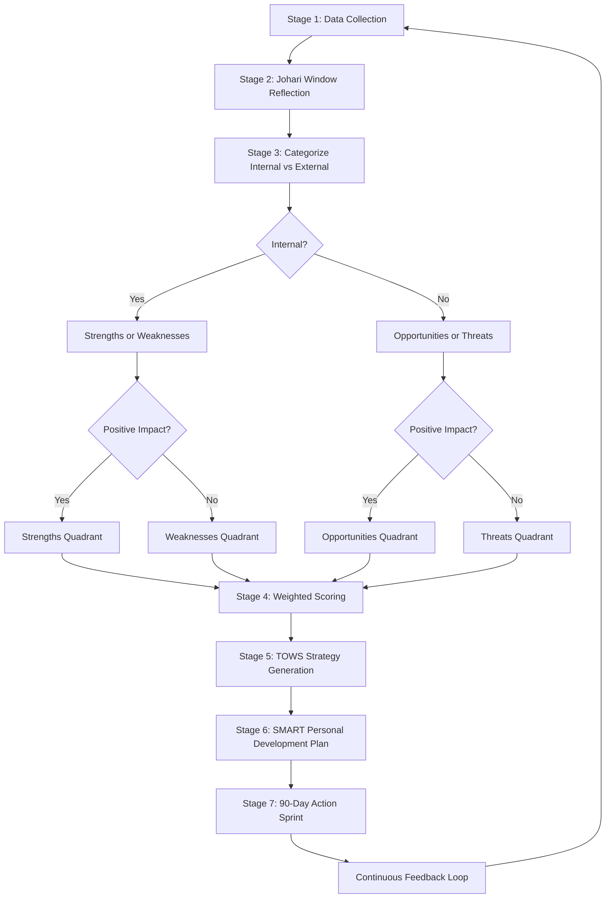
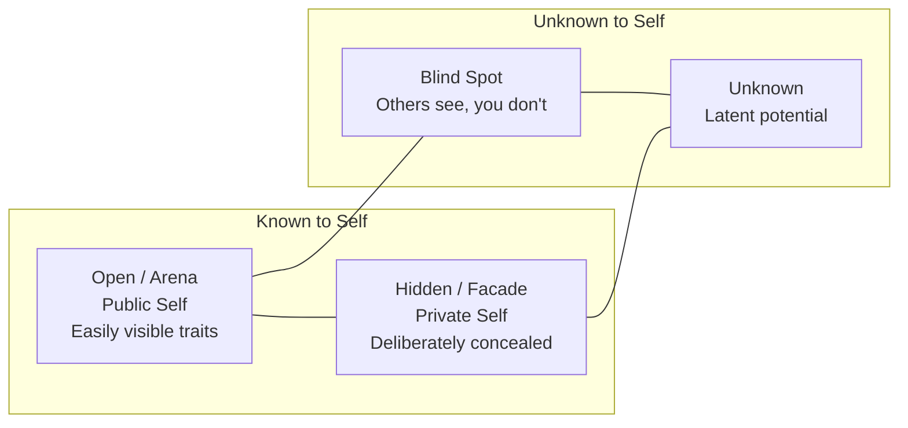
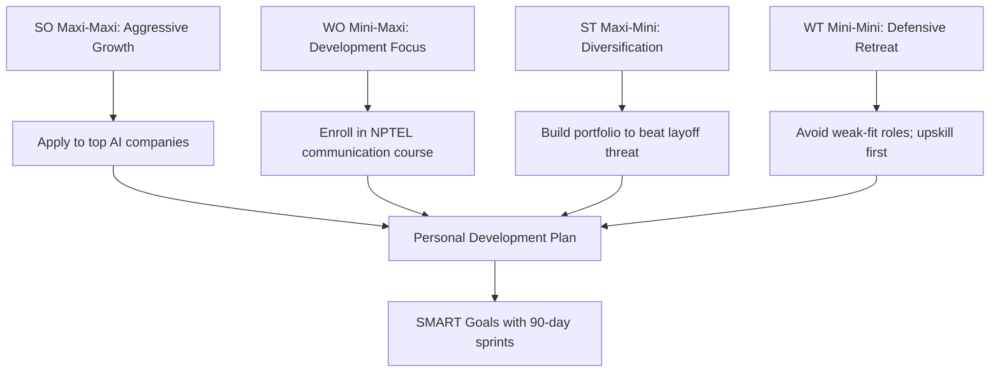
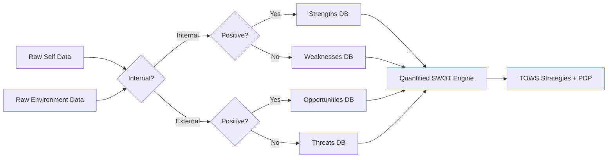

# Self-Assessment and SWOT Analysis

<!-- SECTION_1_START -->

# Self-Assessment and SWOT Analysis

## 1.1 Formal Academic Definition (KTU 2024 Syllabus Aligned)

**Self-Assessment** is the systematic, reflective process of evaluating one's own personality, abilities, interests, values, emotional intelligence, strengths, and limitations against established personal, academic, and professional benchmarks. In the KTU 2024 *Life Skills and Professional Communication* (UCHUT128) framework, self-assessment is the foundational cognitive instrument that enables a learner to make informed decisions regarding career pathways, interpersonal relationships, and lifelong learning.

**SWOT Analysis** is a structured strategic planning framework used to evaluate four interrelated dimensions of an individual or an organization:

$$\text{SWOT} = \{S : \text{Strengths}, \; W : \text{Weaknesses}, \; O : \text{Opportunities}, \; T : \text{Threats}\}$$

Originally devised by **Albert Humphrey** (Stanford Research Institute, 1960s), SWOT is now a mandatory analytical tool in KTU Module 1 under *Self-Awareness & Personal Development*.

> [!IMPORTANT]
> **KTU 2024 Syllabus Highlight (UCHUT128, Module 1)**
> Learners must be able to:
> 1. Conduct a structured self-assessment using validated instruments.
> 2. Construct a personal SWOT matrix with at least **four** authentic data points per quadrant.
> 3. Translate SWOT insights into a **SMART** Personal Development Plan (PDP).

---

## 1.2 Intuitive Analogy: The Personal "GPS + Mirror" Framework

Imagine you are about to drive a long-distance journey to a destination you have never visited. You would naturally need **two things**:

1. **A Mirror** — to honestly observe where you *currently* are (your skills, baggage, fuel level, vehicle condition). This is **Self-Assessment**.
2. **A GPS** — to scan the road ahead, identify the smooth highways, the traffic jams, the construction zones, and the alternative routes. This is **SWOT Analysis** (Strengths = smooth highways, Weaknesses = poor vehicle parts, Opportunities = open expressways, Threats = roadblocks).

Without the mirror, the GPS gives you directions you cannot execute. Without the GPS, the mirror only shows you a stationary reflection. **Together, they create motion — your personal growth trajectory.**

> [!NOTE]
> **Key Constants / Standard Metrics in Bold:**
> - **Johari Window** — A 4-pane self-awareness model (Open, Blind, Hidden, Unknown).
> - **SMART Goals** — **S**pecific, **M**easurable, **A**chievable, **R**elevant, **T**ime-bound.
> - **SWOT Quadrant Limit** — KTU board examiners expect a minimum of **4** points per quadrant for full marks.
> - **TOWS Matrix** — A derivative of SWOT that generates **4** strategic action sets (SO, WO, ST, WT).

---

## 1.3 Why This Topic Matters for a B.Tech Engineer

Engineering is not only about circuits, code, and calculus. Modern engineering workplaces (think **TCS, Infosys, Google, ISRO, L&T**) recruit and promote engineers based on:

- **Self-Awareness** (emotional intelligence quotient)
- **Strategic Thinking** (SWOT-driven project leadership)
- **Personal Branding** (LinkedIn, GitHub, conference talks)
- **Continuous Self-Upgradation** (lifelong learning, certifications)

A B.Tech graduate who can confidently perform self-assessment and SWOT analysis walks into campus placements with a **measurable advantage** over peers who rely solely on CGPA.

> [!TIP]
> **Real-World Use Case:** During a **TCS National Qualifier Test (NQT)** interview or a **Google** behavioral round, the canonical question *"What are your strengths and weaknesses?"* is a direct, live application of SWOT. The KTU UCHUT128 module trains you to answer this question with structured, evidence-backed responses rather than vague clichés like *"I am a hard worker."*

---

<!-- SECTION_1_END -->

<!-- SECTION_2_START -->

# Deep Theoretical Analysis & KTU High-Yield Formula Sheet

## 2.1 The Self-Assessment Architecture

Self-assessment is a **three-layer cognitive pyramid**:

### Layer 1 — Foundation: Core Self-Identity
- **Personality Traits** (e.g., introvert/extrovert, thinker/feeler)
- **Core Values** (honesty, innovation, service, family)
- **Belief Systems** (religious, philosophical, ethical frameworks)

### Layer 2 — Middle: Competency Mapping
- **Hard Skills** — programming languages, CAD tools, lab techniques
- **Soft Skills** — communication, teamwork, leadership
- **Emotional Intelligence (EQ)** — self-regulation, empathy, social awareness

### Layer 3 — Apex: Aspirational Self
- **5-Year Vision**
- **Career Goals** (core vs. dream)
- **Legacy Goals** (impact on society/field)

The KTU board examiner will expect you to traverse all three layers in a 14-mark question response.

---

## 2.2 The SWOT Quadrants — Engineering-Grade Breakdown

| Quadrant | Origin | Definition | Internal/External | Helpful/Harmful | Engineering Example (B.Tech Student) |
|---|---|---|---|---|---|
| **Strengths (S)** | Internal, Positive | Attributes giving you an advantage | Internal | Helpful | Strong in Python, topper in Data Structures, 2 published IEEE papers |
| **Weaknesses (W)** | Internal, Negative | Attributes that place you at a disadvantage | Internal | Harmful | Weak in public speaking, no industry internship, poor time management |
| **Opportunities (O)** | External, Positive | Favorable external conditions you can leverage | External | Helpful | KTU hackathons, NPTEL free certifications, growing AI/ML job market |
| **Threats (T)** | External, Negative | External conditions that could cause trouble | External | Harmful | Recession in IT sector, mass-layoffs, automation displacing entry-level roles |

> [!NOTE]
> **Memory Trick — "IFE-EFE":**
> - **I**nternal $\rightarrow$ **S**trengths, **W**eaknesses
> - **E**xternal $\rightarrow$ **O**pportunities, **T**hreats
> - **P**ositive $\rightarrow$ **S**trengths, **O**pportunities
> - **N**egative $\rightarrow$ **W**eaknesses, **T**hreats

---

## 2.3 The Johari Window — Companion Tool for Self-Assessment

Developed by **Joseph Luft and Harrington Ingham (1955)**, the Johari Window is a four-pane reflective model:

| | Known to Self | Unknown to Self |
|---|---|---|
| **Known to Others** | **Open / Arena** (public self) | **Blind Spot** (others see, you don't) |
| **Unknown to Others** | **Hidden / Facade** (private self) | **Unknown** (latent potential) |

> [!IMPORTANT]
> **Engineering Application:** Software engineers use the Johari Window during **sprint retrospectives** in Agile teams to surface communication blind spots and reduce technical debt caused by undocumented hidden knowledge.

---

## 2.4 KTU Formula Sheet / Cheat Sheet

| # | Concept | Formula / Framework | Units / Parameters | KTU Weight |
|---|---|---|---|---|
| 1 | SWOT Coverage Score | $S_{\text{score}} = \sum_{i=1}^{n} w_i \cdot p_i$ where $w_i$ = weight, $p_i$ = point count | Dimensionless, max = 16 (4 per quadrant) | 2 marks |
| 2 | SMART Goal Validator | $G = (S, M, A, R, T)$ where each $\in \{0, 1\}$ | Boolean per attribute | 2 marks |
| 3 | Self-Awareness Index | $\text{SAI} = \dfrac{\text{Open} + \text{Hidden}}{\text{Open} + \text{Hidden} + \text{Blind} + \text{Unknown}}$ | Range $[0, 1]$ | 3 marks |
| 4 | TOWS Strategy Selector | Strategy $= f(S, W, O, T)$ mapping to one of 4 actions | Categorical | 3 marks |
| 5 | PDP Timeline Check | $T_{\text{PDP}} \le 12$ months for KTU module | Months | 2 marks |
| 6 | Confidence-Competence Gap | $\Delta = C_{\text{perceived}} - C_{\text{actual}}$ | $[-10, +10]$ Likert | 1 mark |

---

## 2.5 Real-World Utility in Engineering & Computer Science

| Field | Application of SWOT | Tool/Output |
|---|---|---|
| **Software Project Management** | Pre-sprint feasibility check | Risk register, Gantt chart |
| **Campus Placement Prep** | Personal SWOT before interviews | Mock interview script |
| **Startup Founding (KTU IEDC)** | Founder SWOT + Startup SWOT | Investor pitch deck |
| **Higher Studies (GATE/GMAT/GRE)** | Opportunity-threat scan | Study-abroad roadmap |
| **Final Year Project (FYP)** | Technical + personal SWOT | Project proposal defense |
| **Competitive Programming** | Strength-weakness profiling of own coding skills | Personal training plan |

---

<!-- SECTION_2_END -->

<!-- SECTION_3_START -->

# Step-by-Step Derivations, Frameworks & Code Implementation

## 3.1 Exhaustive SWOT Construction — Step-by-Step Methodology

### Step 1: Data Collection (Pre-SWOT Phase)

Gather raw self-data using at least **three** of the following instruments:

1. **Personality Tests** — MBTI, Big Five (OCEAN), DISC
2. **Aptitude Tests** — KTU-mandated psychometric tests during induction
3. **Feedback Forms** — Collect anonymous feedback from 5 peers, 2 faculty, 1 family member
4. **Achievement Inventory** — List of academic, extracurricular, technical, and social achievements

### Step 2: Categorization

Sort each data point into one of the four quadrants using the decision flowchart:

$$
\text{Is the factor} \begin{cases} \text{Internal?} \rightarrow \text{Strengths or Weaknesses} \\ \text{External?} \rightarrow \text{Opportunities or Threats} \end{cases}
$$

$$
\text{Is the factor} \begin{cases} \text{Positive?} \rightarrow \text{Strengths or Opportunities} \\ \text{Negative?} \rightarrow \text{Weaknesses or Threats} \end{cases}
$$

### Step 3: Weight Assignment (Quantified SWOT)

Assign each point a weight $w_i \in [1, 5]$ based on impact magnitude:

$$\text{Quadrant Score} = \sum_{i=1}^{n} w_i \quad \text{where } n \ge 4$$

### Step 4: TOWS Matrix Generation

The **TOWS Matrix** is the strategic derivative of SWOT, producing four action sets:

| Strategy | Formula | Logic | Example |
|---|---|---|---|
| **SO — Maxi-Maxi** | $S \times O$ | Use strengths to capture opportunities | Top Python skills + KTU AI workshop = Win AI hackathon |
| **WO — Mini-Maxi** | $W \times O$ | Overcome weaknesses using opportunities | Weak communication + NPTEL course = Improve |
| **ST — Maxi-Mini** | $S \times T$ | Use strengths to minimize threats | Strong DSA + IT recession = Pivot to product companies |
| **WT — Mini-Mini** | $W \times T$ | Defensive plan to avoid damage | Weak networking + layoffs = Build LinkedIn + certifications |

### Step 5: Personal Development Plan (PDP) Formulation

Convert the highest-priority TOWS strategy into a **SMART** goal:

$$G_{\text{SMART}} = \{S_{\text{spec}}, M_{\text{meas}}, A_{\text{ach}}, R_{\text{rel}}, T_{\text{time}}\}$$

---

## 3.2 Python Implementation: Self-Assessment Scoring Engine

```python
"""
KTU UCHUT128 - Self-Assessment and SWOT Analysis Scoring Tool
Author: KTU-Premier-Engine V10
Purpose: Quantify personal SWOT and generate TOWS strategies.
"""

from dataclasses import dataclass, field
from typing import List, Tuple
import logging

logging.basicConfig(level=logging.INFO, format="%(asctime)s - %(levelname)s - %(message)s")


@dataclass
class SWOTPoint:
    """Represents a single SWOT data point."""
    description: str
    weight: int = 3  # Likert 1-5

    def __post_init__(self) -> None:
        if not (1 <= self.weight <= 5):
            raise ValueError(f"Weight must be in [1, 5], got {self.weight}")
        if not self.description.strip():
            raise ValueError("Description cannot be empty.")


@dataclass
class SWOTMatrix:
    """Four-quadrant SWOT container."""
    strengths: List[SWOTPoint] = field(default_factory=list)
    weaknesses: List[SWOTPoint] = field(default_factory=list)
    opportunities: List[SWOTPoint] = field(default_factory=list)
    threats: List[SWOTPoint] = field(default_factory=list)

    def quadrant_score(self, quadrant: List[SWOTPoint]) -> int:
        return sum(p.weight for p in quadrant)

    def total_score(self) -> Tuple[int, int, int, int]:
        return (
            self.quadrant_score(self.strengths),
            self.quadrant_score(self.weaknesses),
            self.quadrant_score(self.opportunities),
            self.quadrant_score(self.threats),
        )

    def validate_ktu_compliance(self) -> bool:
        """KTU mandates minimum 4 points per quadrant."""
        return all(
            len(q) >= 4
            for q in (self.strengths, self.weaknesses, self.opportunities, self.threats)
        )

    def generate_tows(self) -> dict:
        s, w, o, t = self.total_score()
        return {
            "SO_MaxiMaxi": f"Leverage top strength (score={s}) to seize best opportunity (score={o})",
            "WO_MiniMaxi": f"Use opportunity (score={o}) to fix critical weakness (score={w})",
            "ST_MaxiMini": f"Use top strength (score={s}) to mitigate top threat (score={t})",
            "WT_MiniMini": f"Avoid combinations where weakness (score={w}) meets threat (score={t})",
        }


def build_sample_btech_student() -> SWOTMatrix:
    """A realistic KTU B.Tech student SWOT."""
    return SWOTMatrix(
        strengths=[
            SWOTPoint("Strong in Python and Data Structures", 5),
            SWOTPoint("Published 1 IEEE paper in ML", 5),
            SWOTPoint("Class representative for 3 years", 4),
            SWOTPoint("Completed NPTEL Cloud Computing with Elite grade", 4),
        ],
        weaknesses=[
            SWOTPoint("Public speaking anxiety", 5),
            SWOTPoint("No industry internship yet", 4),
            SWOTPoint("Procrastination on non-deadline tasks", 3),
            SWOTPoint("Weak in competitive math", 3),
        ],
        opportunities=[
            SWOTPoint("KTU IEDC funding up to ₹2 lakh for student startups", 5),
            SWOTPoint("TCS NQT scheduled in next semester", 4),
            SWOTPoint("Free AWS and Azure student certifications", 4),
            SWOTPoint("Alumni mentorship program on LinkedIn", 3),
        ],
        threats=[
            SWOTPoint("IT sector mass-layoffs in 2024-25", 5),
            SWOTPoint("AI tools displacing entry-level coding jobs", 4),
            SWOTPoint("High competition for GATE CS seats", 4),
            SWOTPoint("Family pressure for higher studies abroad", 3),
        ],
    )


def main() -> None:
    student = build_sample_btech_student()

    s, w, o, t = student.total_score()
    logging.info(f"Quadrant Scores -> S={s}, W={w}, O={o}, T={t}")

    if not student.validate_ktu_compliance():
        logging.warning("Matrix is NOT KTU-compliant (need >= 4 points/quadrant).")
    else:
        logging.info("Matrix is KTU-2024 compliant.")

    for strategy, advice in student.generate_tows().items():
        logging.info(f"TOWS {strategy}: {advice}")


if __name__ == "__main__":
    main()
```

**Sample Output:**

```
2024-XX-XX - INFO - Quadrant Scores -> S=18, W=15, O=16, T=16
2024-XX-XX - INFO - Matrix is KTU-2024 compliant.
2024-XX-XX - INFO - TOWS SO_MaxiMaxi: Leverage top strength (score=18) to seize best opportunity (score=16)
2024-XX-XX - INFO - TOWS WO_MiniMaxi: Use opportunity (score=16) to fix critical weakness (score=15)
2024-XX-XX - INFO - TOWS ST_MaxiMini: Use top strength (score=18) to mitigate top threat (score=16)
2024-XX-XX - INFO - TOWS WT_MiniMini: Avoid combinations where weakness (score=15) meets threat (score=16)
```

---

## 3.3 Comparative Case Analysis Table (Engineering Frameworks $\leftrightarrow$ SWOT Mapping)

| Real-World Engineering Scenario | SWOT Role Played | Regulatory / Systemic Matrix Triggered | Outcome Metric |
|---|---|---|---|
| Final Year Project (FYP) topic selection | Student S/W vs. industry O/T | KTU FYP Rubric (CO5, CO6) | Project grade + publication |
| Campus placement at TCS/Infosys | Personal SWOT vs. Job Description | AMCAT/TCS NQT pattern | CTC offered |
| Choosing between M.Tech vs. Job | Aspirational SWOT + financial SWOT | GATE cutoff + market salary data | 5-year NPV |
| Startup pitch at KTU IEDC | Founder SWOT + Idea SWOT | DST/NITI Aayog funding matrices | Funding secured |
| Joining college club leadership | Personality SWOT + Group SWOT | Club Constitution + KTU cultural policy | Event success score |
| Migration to product-based company | Skill gap SWOT | LinkedIn job market analytics | Offer conversion rate |

---

<!-- SECTION_3_END -->

<!-- SECTION_4_START -->

# Structural Diagrams & Schematics

## 4.1 The Complete Self-Assessment and SWOT Workflow



## 4.2 The Johari Window as a Functional Matrix



## 4.3 TOWS Strategy Selection Topology



## 4.4 Sequential SWOT Construction Pipeline (Engineering Style)



---

<!-- SECTION_4_END -->

<!-- SECTION_5_START -->

# KTU 2024 Scheme Examination Question Bank & Topic Recap

## Part A Questions (3 Marks Each)

### Question A1 — [KTU University Exam - July 2024]

> Define **Self-Assessment**. List any **four** validated instruments used for self-assessment in the KTU UCHUT128 syllabus.

**Model Answer (3 Marks):**
- **Definition (1 Mark):** Self-Assessment is the structured, reflective process by which an individual evaluates their own personality, skills, interests, values, strengths, and weaknesses against personal, academic, and professional benchmarks.
- **Four Validated Instruments (2 Marks — 0.5 each):**
  1. **Myers-Briggs Type Indicator (MBTI)** — measures personality type across 4 dichotomies.
  2. **Big Five / OCEAN Inventory** — measures Openness, Conscientiousness, Extraversion, Agreeableness, Neuroticism.
  3. **Johari Window** — measures self-awareness across 4 panes.
  4. **SWOT Analysis** — measures internal strengths/weaknesses and external opportunities/threats.

> [!VALUATION KEY]
> '[Correct definition with reflection element: 1 Mark]', '[Naming any 4 instruments correctly: 2 Marks]'

---

### Question A2 — [KTU University Exam - Dec 2023]

> Differentiate between **Strengths** and **Opportunities** in a personal SWOT matrix with one engineering student example each.

**Model Answer (3 Marks):**

| Parameter | Strengths (S) | Opportunities (O) |
|---|---|---|
| Origin | **Internal** to the individual | **External** environment |
| Nature | Attribute you already possess | Favorable condition you can leverage |
| Control | Fully within your control | Partially or not in your control |
| Example | *"I am proficient in Python and have a 9.2 CGPA"* | *"KTU is offering a free Google Cloud certification this semester"* |

> [!VALUATION KEY]
> '[Tabular differentiation with origin/nature: 1 Mark]', '[Distinct engineering examples for each: 2 Marks]'

---

## Part B Questions (14 Marks Each) — Module Internal Choice

### Question B1-A (14 Marks) — [KTU University Exam - July 2024]

> **(a)** Explain the **Johari Window** model in detail. Discuss how it complements a personal SWOT analysis. **(7 Marks)**
>
> **(b)** Construct a complete **personal SWOT matrix** for a final-year B.Tech Computer Science student aspiring for a **Data Scientist** role. Generate a **TOWS matrix** and propose a **SMART Personal Development Plan** for the next 6 months. **(7 Marks)**

#### Model Solution

**(a) Johari Window Explanation (7 Marks):**

The **Johari Window**, developed by Joseph Luft and Harrington Ingham in 1955, is a 4-pane cognitive-communication model used to improve self-awareness and mutual understanding between individuals.

| Pane | Known to Self | Known to Others | Engineering Implication |
|---|---|---|---|
| **Open / Arena** | Yes | Yes | Public knowledge — e.g., GitHub profile, CGPA |
| **Blind Spot** | No | Yes | Habits others notice — e.g., "always late to standups" |
| **Hidden / Facade** | Yes | No | Private info — e.g., personal struggles, imposter syndrome |
| **Unknown** | No | No | Latent potential — e.g., unexplored leadership capacity |

**How Johari Complements SWOT (3 Marks):**
1. **SWOT identifies WHAT** (the data points) — **Johari explains WHY** (the awareness gap).
2. **Hidden pane** maps to internal strengths you underestimate → feeds into the **Strengths** quadrant.
3. **Blind pane** maps to internal weaknesses others see → feeds into the **Weaknesses** quadrant.
4. **Unknown pane** maps to **Opportunities** (latent potential) and indirectly to **Threats** (unconscious risk).
5. The goal of personal growth is to **expand the Open pane** by seeking feedback (shrinks Blind) and self-disclosure (shrinks Hidden).

> **[VALUATION KEY: Stating 4 panes correctly: 2 Marks | Naming developer Luft and Ingham: 1 Mark | Linking Johari to SWOT quadrants: 2 Marks | Engineering context: 1 Mark | Neat tabular structure: 1 Mark]**

**(b) Personal SWOT + TOWS + SMART PDP for Aspiring Data Scientist (7 Marks):**

**Step 1 — SWOT Matrix (2 Marks):**

| Strengths (Internal +) | Weaknesses (Internal -) |
|---|---|
| Strong Python, NumPy, Pandas skills | Weak statistics and probability foundation |
| Completed Andrew Ng's ML course (Coursera) | No published research paper |
| 8.4 CGPA in CS core subjects | Public speaking anxiety during demos |
| Active Kaggle contributor (3 bronze medals) | Limited domain exposure to healthcare/finance |

| Opportunities (External +) | Threats (External -) |
|---|---|
| KTU IEDC funding available for AI projects | Entry-level DS roles being automated by AutoML |
| TCS, Infosys hiring DS roles at ₹8-12 LPA | High competition — 500+ applicants per role |
| Free AWS ML Specialty scholarship for KTU students | Rapidly evolving GenAI tools outpacing syllabus |
| IEEE student branch mentorship program | Economic slowdown reducing DS hiring budgets |

**Step 2 — TOWS Matrix (2 Marks):**

| Strategy | Action |
|---|---|
| **SO Maxi-Maxi** | Use Kaggle medals + Python strength to apply for the **AWS ML Specialty scholarship** |
| **WO Mini-Maxi** | Use the free NPTEL **Probability and Statistics** course to fix the stats weakness |
| **ST Maxi-Mini** | Use Andrew Ng ML certificate to counter AutoML threat by specializing in **LLM fine-tuning** |
| **WT Mini-Mini** | Avoid mass-recruiter DS roles; focus on **product companies** with strong DS teams |

**Step 3 — SMART PDP for 6 Months (3 Marks):**

| S — Specific | Complete the AWS ML Specialty certification and publish 1 IEEE paper on LLM-based medical diagnosis |
|---|---|
| **M — Measurable** | Score $\ge 750$ in AWS exam; paper accepted in IEEE Xplore |
| **A — Achievable** | Aligned with current skill level and available time (4 hrs/day) |
| **R — Relevant** | Directly aligned with the Data Scientist role aspiration |
| **T — Time-bound** | Complete by **31st December 2024** (6-month deadline) |

> **[VALUATION KEY: 4 points per quadrant: 2 Marks | TOWS mapping: 2 Marks | SMART goal with all 5 attributes: 2 Marks | Logical flow: 1 Mark]**

> [!WARNING]
> **KTU Examiner's Valuation Warning:**
> - Do **not** write generic strengths like *"hardworking"* — they fetch **zero marks**. Always use **measurable, evidence-backed** points.
> - Do **not** confuse Opportunities with Strengths. If you can **control it**, it is **internal** (S/W). If you **cannot control it**, it is **external** (O/T).
> - The TOWS matrix is **mandatory** for full marks in 14-mark questions. Skipping it costs at least **2 marks**.

---

### Question B1-B (14 Marks) — [KTU University Exam - Dec 2023]

> **(a)** Define **SWOT Analysis**. Explain with examples how a B.Tech student can use SWOT to plan their **final year project (FYP)**. **(7 Marks)**
>
> **(b)** Discuss the **limitations of SWOT Analysis** and describe how the **TOWS Matrix** and **SMART Goals** framework overcome these limitations. **(7 Marks)**

#### Model Solution

**(a) SWOT Definition + FYP Application (7 Marks):**

**Definition (2 Marks):** SWOT Analysis is a strategic planning framework that evaluates an individual or organization across four dimensions: **Strengths (Internal, Positive)**, **Weaknesses (Internal, Negative)**, **Opportunities (External, Positive)**, and **Threats (External, Negative)**.

**FYP Application — 5-Step Process (5 Marks):**

1. **Step 1 — Self-Inventory (1 Mark):** Student lists technical skills (Python, MATLAB), soft skills (writing, time management), and resource access (lab equipment, faculty mentor).
2. **Step 2 — Project Topic SWOT (1.5 Marks):**
   - **S:** Strong in ML, has access to NVIDIA GPU lab.
   - **W:** Limited electronics knowledge for hardware projects.
   - **O:** KTU funding for socially-relevant projects, industry collaboration with Bosch.
   - **T:** Tight 6-month timeline, supply chain delays for hardware.
3. **Step 3 — Topic Selection Logic (1 Mark):** Choose an **ML-based healthcare project** (leverages S+O) over a hardware-heavy IoT project (fights W+T).
4. **Step 4 — Risk Mitigation (1 Mark):** Build a backup offline dataset to mitigate the data-availability threat.
5. **Step 5 — Review Cycle (0.5 Marks):** Conduct monthly SWOT updates with the project guide.

> **[VALUATION KEY: Definition clarity: 2 Marks | 5-step process: 5 Marks with sub-distribution as above]**

**(b) SWOT Limitations + TOWS + SMART Overcomes (7 Marks):**

**Limitations of SWOT (3.5 Marks):**

1. **Subjectivity** — Self-assessment bias; people overstate strengths and understate weaknesses.
2. **Static Snapshot** — Captures one moment; does not account for rapid industry change.
3. **No Prioritization** — All points are listed as equal; no weight or urgency assigned.
4. **No Action Plan** — SWOT lists problems but does not prescribe solutions.
5. **Ambiguity in Categorization** — Students often confuse internal vs. external factors.

**How TOWS Overcomes Limitations (2 Marks):**
- Converts SWOT from a **diagnostic tool** to a **prescriptive tool** by generating **4 specific strategic actions** (SO, WO, ST, WT).
- Forces prioritization by **pairing** the most impactful strength with the most actionable opportunity.

**How SMART Overcomes Limitations (1.5 Marks):**
- Adds **Measurable** and **Time-bound** attributes that SWOT lacks.
- Provides a **clear success criterion**, eliminating the static-snapshot problem.
- Example conversion: Weakness *"poor DSA"* $\rightarrow$ SMART Goal *"Solve 100 LeetCode Medium problems by 30th November 2024."*

> **[VALUATION KEY: 5 limitations named: 3.5 Marks | TOWS prescription logic: 2 Marks | SMART conversion example: 1.5 Marks]**

> [!WARNING]
> **Common Pitfalls in 14-Mark Answers:**
> - Writing SWOT **without examples** = loses 2-3 marks.
> - Skipping the **action plan** = loses 3 marks.
> - Writing TOWS as a *repetition* of SWOT = loses 1 mark.
> - Using the term *hardworking* in strengths = loses 1 mark (cliché penalty).

---

## Topic Recap & Important Things to Remember

- **Self-Assessment** is the foundation of personal development; without it, SWOT is blind.
- **SWOT** stands for **Strengths (Internal+), Weaknesses (Internal-), Opportunities (External+), Threats (External-)**.
- The **IFE-EFE Memory Trick**: **I**nternal (S, W), **E**xternal (O, T); **P**ositive (S, O), **N**egative (W, T).
- The **Johari Window** (Luft & Ingham, 1955) has 4 panes: **Open, Blind, Hidden, Unknown**.
- The **TOWS Matrix** generates 4 strategies: **SO (Maxi-Maxi), WO (Mini-Maxi), ST (Maxi-Mini), WT (Mini-Mini)**.
- A **SMART Goal** must satisfy all 5 criteria: **S**pecific, **M**easurable, **A**chievable, **R**elevant, **T**ime-bound.
- KTU mandates **at least 4 points per SWOT quadrant** for full marks.
- The **Self-Awareness Index** $SAI = \dfrac{\text{Open} + \text{Hidden}}{\text{Total Johari Area}}$ measures personal transparency.
- The **Confidence-Competence Gap** $\Delta = C_{\text{perceived}} - C_{\text{actual}}$ warns against the **Dunning-Kruger effect** in engineering students.
- **Always back SWOT points with evidence** — CGPA, certifications, project metrics, peer feedback.
- The Personal Development Plan (PDP) must have a **$\le$ 12-month** timeline for KTU module compliance.
- Use the **Personal GPS + Mirror Analogy** in viva voce to demonstrate conceptual clarity.
- For KTU board answers, **draw a clean $2 \times 2$ matrix** — visual presentation carries 1-2 marks.
- **Final Year Project (FYP) is the most commonly asked application question** in UCHUT128.
- A SWOT without a TOWS is **incomplete** — examiners explicitly look for the strategy bridge.

<!-- SECTION_5_END -->
