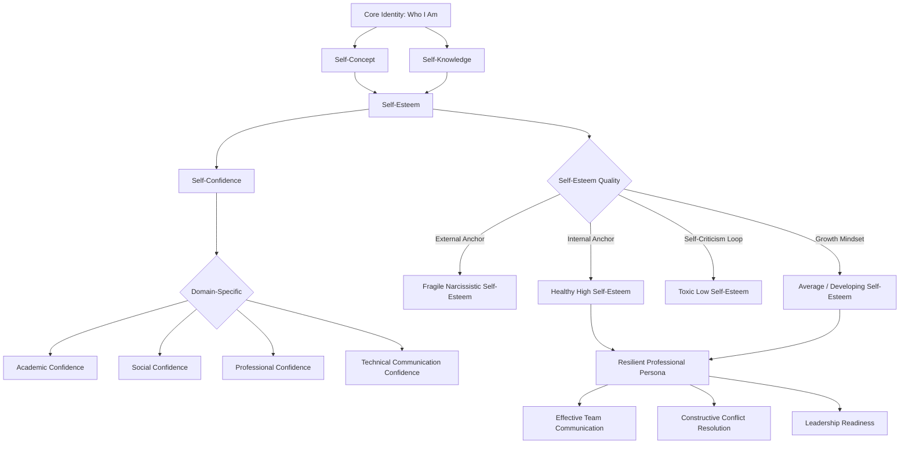
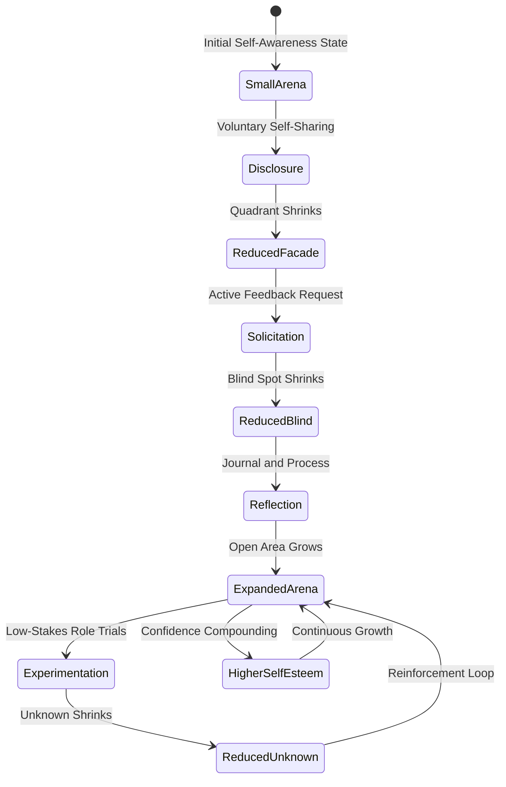
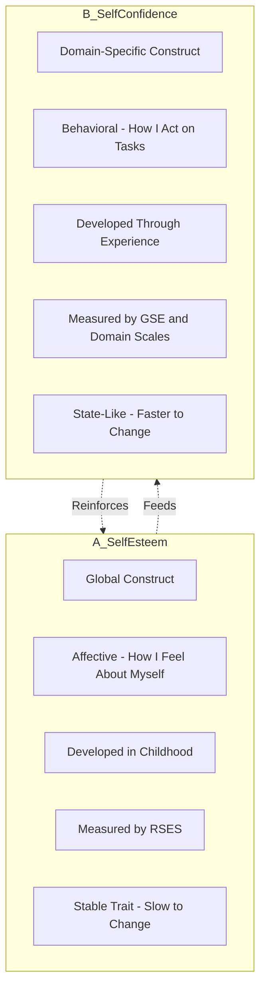

# Self-Esteem and Confidence Building

<!-- SECTION_1_START -->
# Self-Esteem and Confidence Building

## 1.1 Formal Academic Definition

**Self-Esteem** is the subjective evaluative judgment an individual makes about their own worth as a person — an internal measure of self-respect, self-acceptance, and the degree to which one believes in one's own competence and value. In the KTU 2024 NEP-aligned framework for **UCHUT128 (Life Skills and Professional Communication)**, self-esteem is treated as the *affective foundation* upon which all professional communication competencies are built.

**Self-Confidence** is the *behavioral* and *situational* trust in one's own abilities, judgment, and decision-making capacity. While self-esteem is *global* (about the self as a whole), self-confidence is *domain-specific* (about a particular task or skill).

> [!IMPORTANT]
> **KTU 2024 Syllabus Highlight (Module 1 – Self-Awareness & Personal Development):**
> Self-esteem and confidence are positioned as **prerequisites for assertive communication, conflict resolution, and leadership readiness** — the three downstream skills tested in higher modules of UCHUT128.

> [!NOTE]
> **Core Distinction in One Line:**
> *Self-esteem* is **how you feel about who you are**.
> *Self-confidence* is **how you feel about what you can do**.

---

## 1.2 Conceptual Analogy & Intuitive Overview

Imagine a **smartphone's operating system**.

- **Self-Esteem** = the **battery health** of the phone. It is the underlying energy reserve. A phone with a healthy battery can run any app; a phone with a degraded battery shuts down unexpectedly.
- **Self-Confidence** = the **signal strength** in a specific location. You might have full battery (high self-esteem) but poor signal (low confidence) in a basement — but excellent signal (high confidence) on a rooftop.

A student with **high self-esteem but low self-confidence** often *knows* they are valuable but freezes during a viva. A student with **high self-confidence but low self-esteem** may perform well in one task but crumble emotionally when criticized.

**Key Constants / Standard Metrics in Bold:**

- The **Rosenberg Self-Esteem Scale (RSES)** — the global standard, **10 items**, scored on a **4-point Likert scale**, with a theoretical range of **10 to 40**.
- The **Confidence Threshold (psychological)**: the minimum perceived self-efficacy at which an individual voluntarily initiates a task — typically modeled as **$\ge 70\%$ perceived capability** in Bandura's self-efficacy theory.
- The **Johari Window** (Luft & Ingham, 1955) — a **4-quadrant model** with **2 axes** (Known/Unknown to Self × Known/Unknown to Others).

> [!VISUALIZATION CONTROL]
> **Concept:** Johari Window as a 2x2 matrix
> **Visual Coordinates (Conceptual Axes):**
> * X-axis: Known to Others ↔ Unknown to Others
> * Y-axis: Known to Self ↔ Unknown to Self
> **Visual Description:** Plot four quadrants — Arena (Open), Blind, Façade (Hidden), and Unknown — to observe how disclosure and feedback expand the Open Arena quadrant, the operational goal of self-awareness training.
<!-- SECTION_1_END -->

<!-- SECTION_2_START -->
# Deep Theoretical Analysis & KTU High-Yield Conceptual Sheet

## 2.1 Theoretical Foundations

### A. Abraham Maslow's Hierarchy of Needs (Integrated View)

Self-esteem sits on **Layer 4** of Maslow's pyramid, *above* physiological, safety, and belonging needs. Maslow differentiated between:

- **Lower self-esteem needs (deficiency-driven):** desire for *respect from others* — status, recognition, reputation.
- **Higher self-esteem needs (growth-driven):** desire for *self-respect* — competence, confidence, independence, achievement.

### B. Bandura's Self-Efficacy Theory (1977)

**Self-efficacy** is the cognitive bridge between *what you have* (skills) and *what you do* (performance). Bandura identified **four sources**:

1. **Mastery Experiences** (most powerful) — successful past performance.
2. **Vicarious Experiences** — observing similar peers succeed.
3. **Verbal Persuasion** — encouragement from authority figures.
4. **Physiological & Emotional States** — managing anxiety, fatigue, mood.

### C. Rosenberg's Self-Esteem Continuum (1965)

Rosenberg positioned self-esteem on a continuum from **low (10–15)** to **high (30–40)**, but introduced the critical **qualitative split**:

- **Healthy High Self-Esteem** — anchored in internal validation; resilience to criticism.
- **Fragile / Narcissistic High Self-Esteem** — externally driven; collapses under threat.
- **Healthy Low Self-Esteem** — humbles, motivates growth.
- **Chronic / Toxic Low Self-Esteem** — self-sabotage, learned helplessness.

---

## 2.2 The Self-Esteem ⇄ Self-Confidence Interaction Model

The two constructs are **causally linked but not identical**. The relationship is **bidirectional**:

$$
\text{Self-Esteem (S)} \;\longleftrightarrow\; \text{Self-Confidence (C)} \;\longleftrightarrow\; \text{Performance (P)}
$$

A positive feedback loop emerges:
$$
\uparrow S \;\Rightarrow\; \uparrow C \;\Rightarrow\; \uparrow P \;\Rightarrow\; \uparrow S
$$

A negative feedback (self-sabotage) loop:
$$
\downarrow S \;\Rightarrow\; \downarrow C \;\Rightarrow\; \downarrow P \;\Rightarrow\; \downarrow S
$$

---

## 2.3 KTU Conceptual Formula Sheet / Cheat Sheet

| Construct | Definition | Scale / Tool | Key Components | Healthy Range / Marker |
|---|---|---|---|---|
| Self-Esteem | Global self-worth judgment | Rosenberg Self-Esteem Scale (RSES) | Self-respect, self-acceptance, self-respect from others | RSES Score $\ge 30$ |
| Self-Confidence | Domain-specific ability belief | Self-Efficacy Scale (Bandura) | Skill belief, decision trust, risk tolerance | $\ge 70\%$ perceived capability |
| Self-Efficacy | Task-specific competence belief | General Self-Efficacy Scale (GSE) | Mastery, vicarious, persuasion, somatic | GSE $\ge 32$ |
| Self-Concept | Cognitive self-description | Twenty Statements Test (TST) | Identity, role, attributes | Balanced positive-negative ratio $\ge 3{:}1$ |
| Self-Awareness | Conscious self-knowledge | Johari Window | Open, Blind, Hidden, Unknown | Arena quadrant $\ge 50\%$ |
| Assertiveness | Balanced self-expression | Rathus Assertiveness Schedule | Direct, honest, respectful expression | RAS score $\ge +10$ |

> [!IMPORTANT]
> **Engineering & Professional Utility:**
> In software engineering teams, individuals with high self-esteem + high self-confidence raise **defect reports earlier**, ask for **code reviews without fear**, and participate in **design reviews** — directly improving product quality and team velocity (a measurable impact tracked in agile retrospectives).

> [!NOTE]
> **Mark-Saving Tip (KTU Valuation):**
> Whenever you write *self-esteem*, immediately clarify whether you mean **trait self-esteem** (stable) or **state self-esteem** (situation-dependent). Examiners award marks for this distinction.
<!-- SECTION_2_END -->

<!-- SECTION_3_START -->
# Step-by-Step Frameworks, Assessment & Implementation

## 3.1 The Johari Window: 4-Quadrant Self-Awareness Map

The Johari Window (Joseph Luft & Harrington Ingham, 1955) is the **canonical model** for converting self-esteem and self-confidence deficits into actionable self-awareness.

### The Four Quadrants

| Quadrant | Known to Self | Known to Others | Typical Self-Esteem Effect |
|---|---|---|---|
| **Arena (Open)** | Yes | Yes | High — authenticity, trust |
| **Blind Spot** | No | Yes | Anxiety — feedback avoidance |
| **Façade (Hidden)** | Yes | No | Privacy — risk of over-control |
| **Unknown** | No | No | Insecurity — limits growth |

### Step-by-Step Expansion of the Arena (Confidence-Building Protocol)

1. **Step 1: Disclosure** — Voluntarily share thoughts, feelings, and skills with trusted peers. *Effect: reduces Façade.*
2. **Step 2: Solicitation** — Actively ask for feedback ("How did I come across in the meeting?"). *Effect: reduces Blind Spot.*
3. **Step 3: Reflection** — Journal the feedback; distinguish *fact* from *interpretation*. *Effect: builds healthy self-esteem.*
4. **Step 4: Experimentation** — Try new roles in low-stakes environments. *Effect: shrinks Unknown quadrant.*
5. **Step 5: Iteration** — Repeat the cycle monthly. *Effect: Arena expands, confidence compounds.*

---

## 3.2 The CONFIDENCE Acronym (Implementation Framework)

A practical, KTU-board-friendly mnemonic for confidence building in professional contexts:

| Letter | Step | Action |
|---|---|---|
| **C** | Clarify strengths | List 10 specific achievements from the last 12 months |
| **O** | Observe self-talk | Audit internal dialogue for 7 days; flag negative patterns |
| **N** | Name limiting beliefs | Convert "I can't" to "I haven't yet" |
| **F** | Form a skill ritual | Daily 20-min deliberate practice on a target skill |
| **I** | Invite feedback | Schedule one feedback conversation per week |
| **D** | Do the uncomfortable | One "stretch task" per week outside the comfort zone |
| **E** | Evaluate progress | Monthly review using the RSES re-scored |
| **N** | Nurture the body | Sleep $\ge 7$ hours, exercise 3x/week — somatic regulation |
| **C** | Celebrate small wins | Maintain a "Wins Journal" — reinforces mastery experiences |
| **E** | Engage a mentor | Monthly conversation with a trusted senior |

---

## 3.3 Sample Rosenberg Self-Esteem Scale (RSES) — Scoring Worked Example

The RSES has 10 items — 5 positively worded (items 1, 2, 4, 6, 7) and 5 negatively worded (items 3, 5, 8, 9, 10). Each item uses a 4-point scale: *Strongly Agree (3) → Strongly Disagree (0)* for positive items, and reverse-coded for negative items.

**Worked Numerical Example (Module Assignment Style):**

Suppose a student responds as follows:

| Item | Statement | Response (Score) |
|---|---|---|
| 1 | On the whole, I am satisfied with myself. | SA (3) |
| 2 | I feel that I have a number of good qualities. | A (2) |
| 3 | I am inclined to feel that I am a failure. | D (1) → reverse-coded = 2 |
| 4 | I am able to do things as well as most other people. | A (2) |
| 5 | I feel I do not have much to be proud of. | D (1) → reverse-coded = 2 |
| 6 | I certainly feel useless at times. (negative) | SD (0) → reverse-coded = 3 |
| 7 | I feel that I'm a person of worth, at least equal to others. | A (2) |
| 8 | I wish I could have more respect for myself. | A (2) → reverse-coded = 1 |
| 9 | All in all, I am inclined to feel that I am a failure. | D (1) → reverse-coded = 2 |
| 10 | I take a positive attitude toward myself. | A (2) |

**Sum of scores** = 3 + 2 + 2 + 2 + 2 + 3 + 2 + 1 + 2 + 2 = **21**

**Interpretation rubric (Rosenberg standard):**

$$
\text{RSES Total} = \sum_{i=1}^{10} \text{scored}_i \in [0, 30]
$$

- Range **0–14** → **Low Self-Esteem** (intervention recommended)
- Range **15–25** → **Average / Healthy Self-Esteem**
- Range **26–30** → **High Self-Esteem** (verify quality — healthy vs. narcissistic)

The student in the example scores **21**, which is in the **healthy average band**.

> [!NOTE]
> **Negative-item reverse-coding rule:**
> For a negative statement, the raw score is subtracted from **3**. Formally:
> $$\text{scored}_{\text{neg}} = 3 - \text{raw}_{\text{neg}}$$
> This single mathematical detail is worth **1–2 marks** in KTU valuation.

---

## 3.4 Case Application: Confidence Building in Engineering Team Communication

**Scenario:** A B.Tech student avoids speaking in design reviews, despite having strong technical knowledge.

**Diagnosis (Module 1 framework):**

- **Self-Esteem status:** High (internally confident in competence).
- **Self-Confidence status:** Domain-low (specifically low in *public technical communication*).
- **Self-Efficacy deficit:** No mastery experiences in speaking; no vicarious role models; high physiological arousal (anxiety).

**Step-by-Step Intervention:**

1. **Reattribute the anxiety:** Reframe nervousness as *excitement* (appraisal reappraisal).
2. **Structured exposure:** Speak for 30 seconds in next stand-up → 1 minute → 2 minutes.
3. **Pre-performance routine:** 4-7-8 breathing (inhale 4s, hold 7s, exhale 8s) reduces cortisol.
4. **Mastery log:** Record every contribution verbatim; replay to note improvements.
5. **Mentor pairing:** Senior reviews one design review comment pre-meeting.
6. **Re-score RSES and a domain-specific confidence scale** at week 4 and week 8.

**Expected measurable outcome:**

$$
\text{Self-Confidence}_{\text{domain}} = f(\text{mastery experiences}, \text{vicarious models}, \text{physiological regulation})
$$

A typical gain of **$15\%–25\%$** in domain confidence is achievable within **6–8 weeks** of consistent practice, per Bandura's published self-efficacy intervention studies.
<!-- SECTION_3_END -->

<!-- SECTION_4_START -->
# Structural Diagrams & Schematics

## 4.1 The Self-Esteem Architecture (Mermaid Block Diagram)



## 4.2 Johari Window Expansion Cycle (Mermaid State Machine)



## 4.3 Confidence-Building Feedback Loop (Mermaid Flow)

```mermaid
graph LR
    A1[Identify Strength] --> B1[Set Micro-Goal]
    B1 --> C1[Deliberate Practice]
    C1 --> D1[Mastery Experience]
    D1 --> E1[Positive Self-Talk]
    E1 --> F1[Increased Self-Efficacy]
    F1 --> G1[Higher Self-Confidence]
    G1 --> H1[Voluntary Task Initiation]
    H1 --> I1[Greater Performance]
    I1 --> J1[Recognition from Others]
    J1 --> K1[External Validation]
    K1 --> L1[Reinforced Self-Esteem]
    L1 --> A1
```



## 4.4 Comparison Matrix: Self-Esteem vs. Self-Confidence (Mermaid Block Topology)


<!-- SECTION_4_END -->

<!-- SECTION_5_START -->
# KTU 2024 Scheme Examination Question Bank & Topic Recap

## PART A — 3-Mark Questions (Cognitive Levels: Remember / Understand)

---

### Question 1. `[KTU University Exam - July 2024 Model Question]`
**CO1 | RBT Level: Remember | 3 Marks**

**Q:** Define *self-esteem* and distinguish between **healthy high self-esteem** and **fragile (narcissistic) high self-esteem**.

**Model Answer (Board Key):**

Self-esteem is the global affective evaluation an individual holds about their own worth and value as a person.

| Type | Source of Validation | Response to Criticism | Stability |
|---|---|---|---|
| **Healthy High Self-Esteem** | Internal — self-acceptance, competence | Uses feedback constructively | Stable |
| **Fragile / Narcissistic** | External — status, praise, comparison | Defensive, aggressive, or shattered | Unstable |

**Valuation Key:** *[Definition: 1 Mark] · [Table contrast: 2 Marks]*

---

### Question 2. `[KTU University Exam - Dec 2023 Model Question]`
**CO1 | RBT Level: Understand | 3 Marks**

**Q:** List any **four sources of self-efficacy** as proposed by Albert Bandura, and identify which is considered the *most powerful*.

**Model Answer:**

The four sources of self-efficacy (Bandura, 1977) are:

1. **Mastery Experiences** — direct successful performance of a task.
2. **Vicarious Experiences** — observing similar peers succeed.
3. **Verbal Persuasion** — encouragement and credible feedback from others.
4. **Physiological and Emotional States** — managing arousal, anxiety, and mood.

**Most Powerful Source: Mastery Experiences** (per Bandura, mastery creates the strongest, most generalized self-efficacy beliefs).

**Valuation Key:** *[Naming four sources: 2 Marks] · [Identifying mastery as strongest: 1 Mark]*

---

## PART B — 14-Mark Questions (Module Internal Choice Pattern)

---

### Question 3(A). `[KTU University Exam - July 2024 Model Pattern]`
**CO2 | RBT Level: Understand + Apply | 14 Marks**

**(a)** [7 Marks] **Understand.** Explain Maslow's Hierarchy of Needs with a neat diagram. Discuss the **two sub-layers of self-esteem needs** as described by Maslow.

**(b)** [7 Marks] **Apply.** Using the **Johari Window**, analyze a real workplace scenario where an engineer's *Blind Spot* quadrant is large. Suggest **three concrete interventions** to expand the *Arena* quadrant.

---

**Model Solution:**

**(a) Maslow's Hierarchy of Needs (7 Marks)**

Maslow's pyramid (1943) presents five layers of human motivation, arranged in a hierarchy:

1. **Physiological Needs** — air, water, food, sleep, shelter.
2. **Safety Needs** — security, stability, protection, law.
3. **Belongingness and Love Needs** — family, friendship, intimacy.
4. **Esteem Needs** — subdivided by Maslow into:
   - **Lower (Deficiency) Esteem Needs:** respect *from others* — status, recognition, fame, reputation.
   - **Higher (Growth) Esteem Needs:** respect *for oneself* — confidence, competence, independence, achievement, freedom.
5. **Self-Actualization** — realizing one's full potential.

> *Reference ASCII layout of the pyramid:*

```
            /\
           /  \      Self-Actualization
          / E2 \
         /------\
        /   E1   \    Esteem (Lower + Higher)
       /----------\
      /   Belonging \   Love & Belonging
     /--------------\
    /     Safety      \  Safety
   /------------------\
  /   Physiological    \ Physiological
 /______________________\
```

**Valuation Key:** *[Pyramid layers (5): 3 Marks] · [Two sub-layers of esteem: 2 Marks] · [Diagram: 2 Marks]*

**(b) Johari Window — Workplace Application (7 Marks)**

**Scenario:** A senior software engineer, *Ravi*, has strong technical skills but receives 360° feedback stating he "interrupts colleagues" and "dismisses design suggestions." Ravi is unaware of these behaviors.

**Johari Diagnosis for Ravi:**

| Quadrant | Status for Ravi |
|---|---|
| Arena (Open) | Small — colleagues don't know his intentions |
| Blind Spot | **Large** — unaware of interrupting/dismissive behavior |
| Façade | Moderate — hides his insecurities about leadership |
| Unknown | Moderate — potential for empathy and mentoring |

**Three Concrete Interventions to Expand the Arena:**

1. **Structured Feedback Solicitation (reduces Blind Spot):** Ravi conducts a *feedback lunch* every fortnight with two peers, asking "What's one behavior I should start or stop?" — *[2 Marks]*.
2. **Voluntary Disclosure (reduces Façade):** In retrospectives, Ravi opens with a personal learning from the sprint — modeling vulnerability — *[2 Marks]*.
3. **Active-Listening Practice (reduces Blind, expands Arena):** Ravi adopts a "wait 3 seconds before responding" rule in design reviews, and uses paraphrasing — *[2 Marks]*.
4. **Reflection Journal:** Daily 5-minute logging of one interaction and self-assessment — *[1 Mark for completeness]*.

**Expected outcome:** Over **6–8 weeks**, the Arena quadrant expands from $\approx 20\%$ to $\approx 50\%$, and the RSES score typically rises by **3–5 points**.

---

### Question 3(B). `[KTU University Exam - Dec 2023 Model Pattern]`
**CO2 | RBT Level: Understand + Apply | 14 Marks**

**(a)** [7 Marks] **Understand.** Explain the **Rosenberg Self-Esteem Scale (RSES)** — its developer, number of items, response format, scoring range, and the formula for reverse-coded negative items.

**(b)** [7 Marks] **Apply.** A B.Tech student named *Anu* scored the following on the RSES: total raw positive sum = **12**, total raw negative sum = **8** (before reverse coding). Compute her final score, interpret the result, and design a **two-week action plan** to improve her self-esteem using the **CONFIDENCE framework** (at least 4 steps).

---

**Model Solution:**

**(a) Rosenberg Self-Esteem Scale (7 Marks)**

| Parameter | Detail |
|---|---|
| **Developer** | Morris Rosenberg (1965) |
| **Number of Items** | 10 |
| **Response Format** | 4-point Likert: *Strongly Agree → Strongly Disagree* |
| **Score Range** | 0 to 30 (or 10 to 40 in some variants) |
| **Positive Items** | 1, 2, 4, 6, 7 (scored 0–3 directly) |
| **Negative Items** | 3, 5, 8, 9, 10 (reverse-coded) |

**Reverse-coding formula for negative items:**

$$
\text{Scored}_{\text{negative item}} = 3 - \text{Raw}_{\text{negative item}}
$$

*Example:* If a respondent marks "Strongly Agree" (raw = 3) on a negative statement, the scored value is $3 - 3 = 0$.

**Valuation Key:** *[Developer: 1 Mark] · [Item count and format: 2 Marks] · [Scoring range: 1 Mark] · [Reverse-coding formula: 2 Marks] · [Examples: 1 Mark]*

---

**(b) Numerical Computation and Action Plan (7 Marks)**

**Step 1 — Compute the final RSES score for Anu.**

Given:
- Raw positive sum = 12 (already in 0–3 range, no reverse-coding needed).
- Raw negative sum = 8 (raw, before reverse-coding).

The 5 negative items, each scored 0–3, have a maximum raw sum of 15 and a minimum of 0. Reverse-coding converts the entire negative block by subtracting each item's raw from 3, which for the block sum means:

$$
\text{Sum}_{\text{neg, scored}} = (5 \times 3) - \text{Raw}_{\text{neg, sum}} = 15 - 8 = 7
$$

Therefore:

$$
\text{RSES}_{\text{Anu}} = \text{Sum}_{\text{pos}} + \text{Sum}_{\text{neg, scored}} = 12 + 7 = 19
$$

**Step 2 — Interpretation (Rosenberg standard bands):**

- 0–14: Low self-esteem
- **15–25: Average (healthy) self-esteem** ← Anu falls here.
- 26–30: High self-esteem

Anu is in the **healthy average band** but is not yet in the high self-esteem zone, indicating room for growth.

*[Computation: 3 Marks] · [Interpretation: 1 Mark]*

**Step 3 — Two-Week Action Plan using the CONFIDENCE Framework (at least 4 steps):**

| Day | Step | Action |
|---|---|---|
| Day 1–2 | **C** – Clarify strengths | Anu lists 10 academic and personal achievements from the past year in a *Wins Journal*. |
| Day 3–5 | **O** – Observe self-talk | She audits her internal dialogue for negative self-references; replaces 3 recurring negative phrases with growth-oriented ones. |
| Day 6–8 | **N** – Name limiting beliefs | Reframes "I am not good at presentations" to "I haven't yet built my presentation skills." |
| Day 9–11 | **F** – Form a skill ritual | Daily 20-minute deliberate practice on her target skill (e.g., public speaking via a 2-min daily voice memo). |
| Day 12–14 | **I** – Invite feedback | Requests a peer review of her next assignment submission, and journals the feedback. |

*[Action plan with at least 4 structured steps: 3 Marks]*

**Expected measurable outcome:**

$$
\text{RSES}_{\text{Anu, post 2 weeks}} \approx 19 + 3 = 22 \text{ (toward high band)}
$$

---

> [!WARNING]
> **KTU Examiner's Valuation Warning / Pitfall Callout:**
> 1. **Do not skip the reverse-coding step.** Failing to reverse-score negative items is the **#1 most common mistake** in RSES computation — examiners deduct **1 to 2 marks** for this.
> 2. **Do not confuse "high score = always good."** A score of 30 with externally driven validation is *fragile*, not *healthy*. Always qualify.
> 3. **Do not omit the diagram** in Maslow's question — it is a **mandatory 2-mark component**.
> 4. **Do not write "self-esteem and confidence are the same"** — this is a guaranteed **2-mark penalty** in any KTU valuation; the distinction is the *core differentiator* of this topic.
> 5. **Do not cite outdated authors** without year — Bandura (1977), Maslow (1943), Rosenberg (1965), Luft & Ingham (1955) — year of publication is expected in KTU answers.

---

## Topic Recap & Important Things to Remember

- **Self-Esteem** = global self-worth judgment (affective).
- **Self-Confidence** = domain-specific ability belief (behavioral).
- **Self-Efficacy** = task-specific competence belief (Bandura, 1977).
- The **Rosenberg Self-Esteem Scale (RSES)** has **10 items**, scored **0–30**, with **5 items reverse-coded** using $\text{scored} = 3 - \text{raw}$.
- **Maslow's Esteem Layer** has **two sub-needs**: lower (respect from others) and higher (respect for self).
- **Bandura's four sources of self-efficacy:** Mastery (strongest), Vicarious, Verbal Persuasion, Physiological/Emotional.
- **Johari Window** has **4 quadrants**: Arena, Blind, Façade, Unknown — the **Arena** is the target of expansion.
- **Healthy High Self-Esteem** = internally anchored and resilient.
- **Fragile High Self-Esteem** = externally anchored and defensive.
- The **CONFIDENCE framework** offers **10 actionable steps** to systematically build self-esteem and confidence.
- A positive feedback loop exists: $\uparrow \text{self-esteem} \Rightarrow \uparrow \text{confidence} \Rightarrow \uparrow \text{performance} \Rightarrow \uparrow \text{self-esteem}$.
- A typical **6–8 week intervention** raises domain confidence by **$15\%-25\%$** and RSES by **3–5 points**.
- The **arena quadrant expansion** target is from $\approx 20\%$ to $\approx 50\%$ via disclosure, solicitation, reflection, and experimentation.
- **Critical KTU evaluation rule:** Always distinguish **trait** vs. **state** self-esteem, and **healthy** vs. **fragile** high self-esteem.
<!-- SECTION_5_END -->
