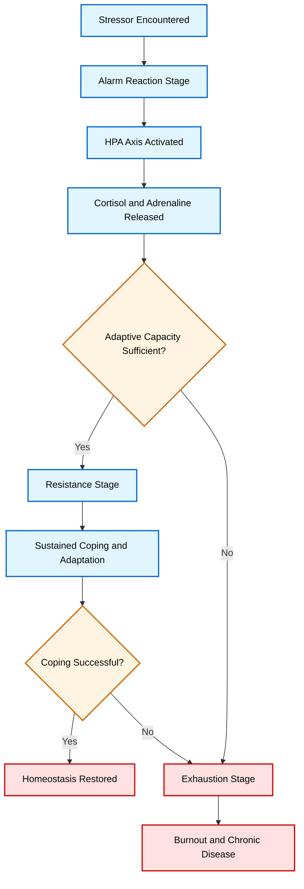
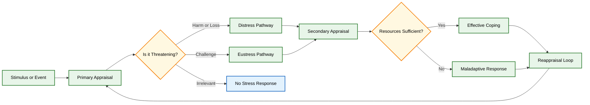
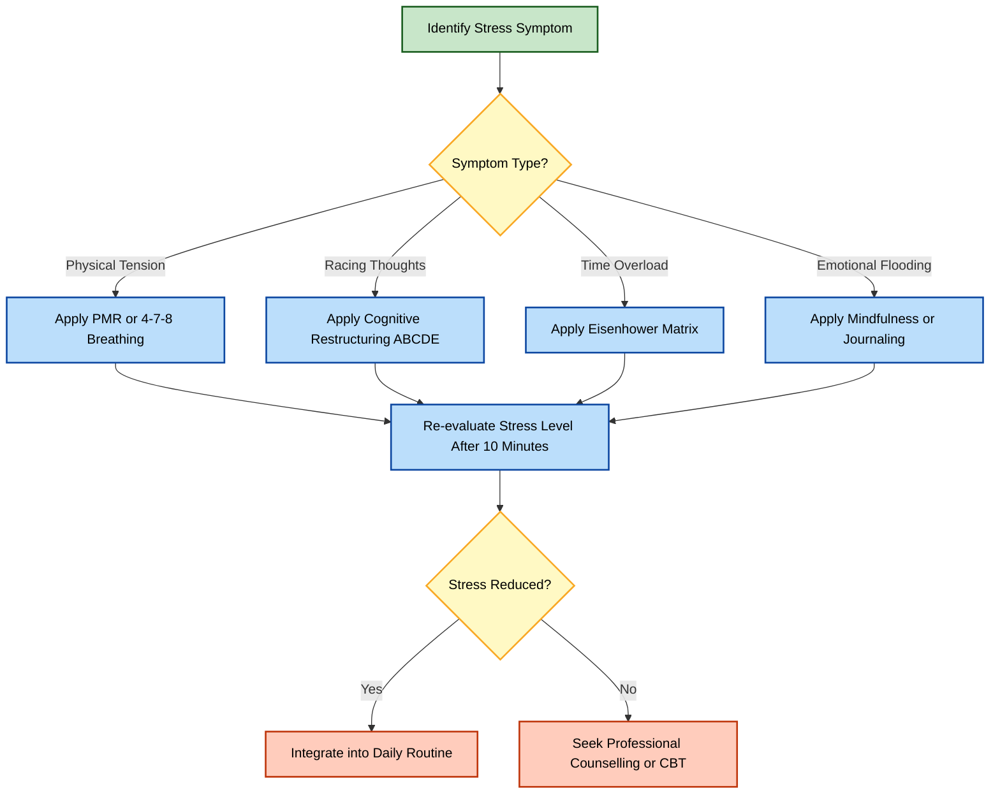
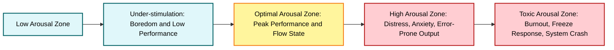

# Stress Management Techniques

<!-- SECTION_1_START -->
# Stress Management Techniques

## 1.1 Formal Academic Definition

> [!IMPORTANT]
> **Stress** is defined as the body's non-specific physiological, psychological, and behavioural response to any internal or external stressor that disrupts the individual's homeostasis or equilibrium. It represents a perceived imbalance between the demands placed upon an individual and the available resources to cope with those demands (Lazarus \& Folkman Transactional Model, 1984).

> [!NOTE]
> **Stress Management** refers to the deliberate, evidence-based application of cognitive, behavioural, physiological, and environmental strategies designed to mitigate, tolerate, or transform the stressors and their associated physiological-emotional consequences, thereby restoring psychophysiological homeostasis and optimising human performance.

The term **stress** was borrowed from physics (engineering mechanics) by endocrinologist **Hans Selye (1936)**, who described it as the *General Adaptation Syndrome (GAS)*. The universally accepted performance metric is the **Yerkes-Dodson Law (1908)**, which states that performance increases with physiological or mental arousal, but only up to a point. When levels of arousal become too high, performance decreases.

## 1.2 Conceptual Analogy / Intuition

> [!TIP]
> **Real-World Analogy: The Smartphone Under Heavy Load**
> 
> Think of your mind and body as a smartphone. When you open too many heavy applications (deadlines, exams, relationships, coding assignments), the processor (your nervous system) heats up. Initially, the phone runs fast (eustress), but as the thermal load increases, the system throttles, battery drains quickly, and eventually the device freezes or shuts down (distress / burnout). **Stress management** is essentially *closing background apps, activating battery saver mode, and letting the device cool down* — it is not about removing the load, but about optimising how the system processes it.

| Parameter | Engineering Equivalent | Human Equivalent |
| :--- | :--- | :--- |
| Heat generation | CPU temperature spike | Cortisol \& adrenaline surge |
| System throttle | Performance drop | Reduced focus, slower cognition |
| Crash / shutdown | Blue screen of death | Burnout, anxiety, depression |
| Battery saver mode | Thermal throttling | Meditation, deep breathing |

## 1.3 Core Concepts \& Terminology

> [!NOTE]
> **Key Terminology for KTU Examinations (Definitions to be memorised verbatim):**
> 
> - **Stressor:** Any internal or external stimulus that evokes a stress response.
> - **Eustress (Positive Stress):** Optimal, motivational stress that enhances performance and growth.
> - **Distress (Negative Stress):** Excessive, harmful stress that exceeds coping capacity.
> - **Coping:** Cognitive and behavioural efforts to manage internal and external demands appraised as taxing.
> - **Homeostasis:** The body's self-regulating tendency to maintain internal stability.
> - **Burnout:** A state of chronic physical and emotional exhaustion caused by prolonged unmanaged stress.
> - **Resilience:** The psychological capacity to adapt, recover, and grow in the face of adversity.

## 1.4 Visualisation: The Yerkes-Dodson Inverted-U

> [!VISUALIZATION CONTROL]
> **Concept:** Yerkes-Dodson Law — Performance vs. Arousal (Inverted-U Curve)
> 
> **Desmos Input Equations:**
> - $f(x) = -0.5 \cdot (x-5)^{2} + 12.5$ (for x in [0, 10])
> - $x$-axis label: *Arousal / Stress Level*
> - $y$-axis label: *Performance Output*
> - Point markers: $(2, 4)$ Low stress, $(5, 12.5)$ Peak, $(8, 4)$ Overload
> 
> **Visual Description:** A downward-opening parabola. As stress increases from left to right, performance rises sharply, peaks at moderate stress (the apex), and then declines steeply. The student should observe the *optimal zone of eustress* in the middle band and the *distress / burnout zone* on the right tail.

---

<!-- SECTION_1_END -->

<!-- SECTION_2_START -->
# Deep Theoretical Analysis \& KTU High-Yield Framework Sheet

## 2.1 Theoretical Models of Stress (Board-Favourite)

### A. General Adaptation Syndrome (GAS) — Hans Selye, 1936

Selye's tri-phasic biological model treats stress as a uniform, non-specific physiological response. The model is foundational and frequently appears in KTU board questions.

1. **Alarm Reaction Stage (Fight-or-Flight)**
   - Hypothalamus activates the sympathetic nervous system (SNS).
   - Adrenal medulla releases *adrenaline* and *noradrenaline*.
   - Heart rate, blood pressure, and glucose levels rise. Pupils dilate.
   - Cortisol secretion begins from the adrenal cortex via the HPA axis (Hypothalamic-Pituitary-Adrenal axis).
2. **Resistance Stage (Adaptation)**
   - Body attempts to cope and adapt to the persistent stressor.
   - Elevated cortisol is sustained; energy is mobilised continuously.
   - Immune function is partially suppressed.
   - If adaptation succeeds, homeostasis is restored; if not, the next stage begins.
3. **Exhaustion Stage (Burnout)**
   - Adaptive energy reserves are depleted.
   - Chronic cortisol elevation damages hippocampal neurons and immune cells.
   - Manifests as chronic fatigue, depression, cardiovascular disease, or *burnout syndrome*.

### B. Transactional Model — Lazarus \& Folkman, 1984

Unlike Selye's stimulus-based view, this model treats stress as a **cognitive appraisal** process with two sequential evaluations:

- **Primary Appraisal:** The individual asks, *"Is this situation relevant, threatening, harmful, or challenging?"*
  - Categories: *Irrelevant*, *Benign-positive*, or *Stressful* (harm / loss / threat / challenge).
- **Secondary Appraisal:** The individual asks, *"Do I have the resources and coping options to handle this?"*
  - If perceived resources $\geq$ perceived demands $\rightarrow$ coping succeeds.
  - If perceived resources $<$ perceived demands $\rightarrow$ distress and strain.
- **Reappraisal:** Continuous feedback loop where the situation is re-evaluated as coping proceeds.

> [!IMPORTANT]
> **Why This Matters for Engineers:** Lazarus's model is the reason why *two software engineers receiving the same deadline experience different stress levels*. The variance lies in **appraisal**, not the deadline itself. This is a *cognitive reframing* — a powerful stress management technique.

## 2.2 Classification of Stress Management Techniques

| Category | Core Mechanism | Example Techniques | Onset of Effect |
| :--- | :--- | :--- | :--- |
| Physiological | Direct regulation of the autonomic nervous system | Deep breathing (4-7-8), Progressive Muscle Relaxation (PMR), Aerobic exercise, Adequate sleep hygiene | Immediate to short-term |
| Cognitive | Reframing maladaptive thought patterns | Cognitive restructuring, Positive self-talk, Mindfulness meditation, Journaling | Medium-term |
| Behavioural | Modification of actions and environment | Time management (Pomodoro, Eisenhower Matrix), Assertiveness training, Social support seeking | Short to long-term |
| Lifestyle | Holistic modification of daily routines | Balanced nutrition, Digital detox, Yoga, Hobby engagement | Long-term, preventive |
| Professional | Expert intervention for clinical stress | Counselling, Cognitive Behavioural Therapy (CBT), Stress inoculation training | Long-term, clinical |

## 2.3 KTU Formula Sheet / High-Yield Cheat Sheet

> [!NOTE]
> **Essential Equations, Frameworks \& Heuristics for KTU Valuation**

| $\#$ | Formula / Framework | Mathematical / Logical Form | Engineering or Real-World Equivalent |
| :--- | :--- | :--- | :--- |
| 1 | Yerkes-Dodson Inverted-U | $P(x) = -a(x-h)^{2} + P_{max}$ | Where $P$ = performance, $x$ = arousal, $h$ = optimal arousal, $a$ = decay constant |
| 2 | Stress Imbalance Equation | $S = D - R$ | $S$ = stress level, $D$ = demands, $R$ = resources. If $S > 0$, distress occurs |
| 3 | Allostasis Load Index | $AL = \sum_{i=1}^{n} w_{i} B_{i}$ | Weighted sum of biological markers (cortisol, BP, HRV) indicating cumulative stress |
| 4 | Heart Rate Variability (HRV) | $HRV = \sigma(RR_{i})$ | Standard deviation of R-R intervals; higher HRV = better stress resilience |
| 5 | Breath Cycle Ratio | $\text{4-7-8 Rule}$ | Inhale 4s, hold 7s, exhale 8s; activates parasympathetic vagus nerve |
| 6 | Time Pressure Ratio | $TPR = \frac{\text{Work Units}}{\text{Available Time Units}}$ | If $TPR > 1$, overcommitment stress; mitigation by *buffering* and *task-dropping* |
| 7 | Cognitive Reframe | $R_{new} = f(C, T)$ | Reframe is a function of Context (C) and Thought pattern (T) |

## 2.4 Real-World Utility in Engineering \& Computer Science

Stress management is not merely a wellness concept; it is a **core professional competency** in modern tech industries:

- **Software Development Teams:** Chronic deadline pressure leads to *tech debt accumulation*, increased code defects, and team turnover. Implementing **Pomodoro cycles (25 min focus + 5 min rest)** is a stress-mitigation practice directly tied to higher code quality.
- **Cybersecurity \& SRE Roles:** Incident response induces acute stress (alarm stage). Trained SREs use the **4-7-8 breathing technique** and **runbooks** to prevent the freeze response.
- **Project Management:** The **Eisenhower Matrix** (Urgent $\times$ Important) is a behavioural stress-management tool that prevents *priority overload* in Agile sprints.
- **Higher Education:** KTU students preparing for End Semester Examinations (ESE) experience acute distress. *Time-blocking*, *active recall*, and *sleep hygiene* directly improve memory consolidation (hippocampal function).

> [!IMPORTANT]
> **Board Examination Tip:** When asked "Why is stress management essential for engineers?", always anchor your answer in **performance optimisation**, **error reduction**, and **team sustainability**, not just *feeling good*. This signals industrial relevance to the examiner.

---

<!-- SECTION_2_END -->

<!-- SECTION_3_START -->
# Step-by-Step Frameworks, Case Mapping \& Implementation

## 3.1 The 4-7-8 Breathing Technique — Complete Operational Protocol

> [!TIP]
> **Developed by Dr Andrew Weil**, this technique is a gateway to the parasympathetic nervous system. It is universally applicable, requires no equipment, and is an examiner-favourite due to its procedural clarity.

### Step-by-Step Execution Matrix

| Step | Action | Physiological Target | Duration |
| :--- | :--- | :--- | :--- |
| 1 | Assume a comfortable seated posture with spine erect | Optimises diaphragmatic excursion | 10 seconds |
| 2 | Exhale completely through the mouth, making a whoosh sound | Empties alveolar residual volume | $\sim 2$ seconds |
| 3 | Close mouth; inhale quietly through the nose to a count of 4 | Activates $V_{agus}$ nerve afferents | **4 seconds** |
| 4 | Hold the breath for a count of 7 | Allows gas exchange; enhances $CO_{2}$ tolerance | **7 seconds** |
| 5 | Exhale completely through the mouth (whoosh) to a count of 8 | Stimulates parasympathetic dominance | **8 seconds** |
| 6 | Inhale again and repeat the cycle | Reinforces vagal tone | Total $\sim 19$ seconds / cycle |
| 7 | Complete exactly 4 cycles in one session | Establishes baseline cardiac coherence | $\sim 1$ minute 30 seconds |

### Underlying Equation of Breath Mechanics

$$
\text{Total Cycle Time} = T_{in} + T_{hold} + T_{out} = 4 + 7 + 8 = 19 \text{ seconds}
$$

$$
\text{Parasympathetic Activation} \propto \frac{T_{out}}{T_{in}} = \frac{8}{4} = 2.0
$$

The ratio of exhalation to inhalation is the key driver. A ratio $\geq 2$ is the threshold for measurable vagal activation, which slows the sinoatrial node firing rate.

$$
\Delta HR \approx -k \cdot \ln\left(\frac{T_{out}}{T_{in}}\right)
$$

Where $k$ is a constant dependent on individual baseline vagal tone. Negative $\Delta HR$ indicates heart rate reduction (calming).

## 3.2 Progressive Muscle Relaxation (PMR) — Jacobson Protocol

### Operational Sequence

1. Find a quiet space. Sit or lie in a comfortable position.
2. Tense a specific muscle group (e.g., right hand) for **5 to 10 seconds**.
3. Notice the sensation of tension — *this is the baseline for recognising tension in daily life*.
4. Release the tension suddenly. Exhale.
5. Observe the relaxed state for **20 to 30 seconds**.
6. Move to the next muscle group in a fixed sequence:
   - Right hand $\rightarrow$ Right forearm $\rightarrow$ Right upper arm $\rightarrow$ Left hand $\rightarrow$ Left forearm $\rightarrow$ Left upper arm $\rightarrow$ Forehead $\rightarrow$ Jaw $\rightarrow$ Neck and shoulders $\rightarrow$ Chest $\rightarrow$ Abdomen $\rightarrow$ Right thigh $\rightarrow$ Right calf $\rightarrow$ Right foot $\rightarrow$ Left thigh $\rightarrow$ Left calf $\rightarrow$ Left foot.

### The PMR Recognition Equation

$$
\text{Self-Awareness Gain} = \int_{0}^{T} \left( S_{tension}(t) - S_{relax}(t) \right) dt
$$

Where $S_{tension}$ and $S_{relax}$ are subjective tension scores on a 0-10 scale. The integral over the session duration $T$ quantifies the student's *interoceptive learning* — the ability to detect hidden muscle tension.

## 3.3 Cognitive Restructuring — The ABCDE Model (Ellis)

Albert Ellis's **Rational Emotive Behaviour Therapy (REBT)** provides a 5-step framework for cognitive stress management:

| Step | Component | Definition | Example (Exam Failure) |
| :--- | :--- | :--- | :--- |
| A | **Activating Event** | The objective triggering situation | "I scored 28/100 in the module test." |
| B | **Belief** | The interpretation or thought about A | "I am a failure. I will never pass." |
| C | **Consequence** | Emotional and behavioural result of B | Anxiety, sleeplessness, avoidance of study |
| D | **Disputation** | Logical challenge to the irrational belief | "Where is the evidence that one test defines my entire career? Have I ever passed difficult subjects before?" |
| E | **Effective New Belief** | The rational, balanced replacement thought | "One low score is data, not destiny. I will identify gaps, seek help, and try a new study strategy." |

### Logical Mapping

$$
B \rightarrow C \quad \text{(Irrational Belief causes emotional Consequence)}
$$

$$
D \rightarrow E \quad \text{(Disputation produces Effective new belief)}
$$

$$
E \rightarrow C_{new} \quad \text{(New belief generates a healthier Consequence: calm focus)}
$$

The transformation is mathematically analogous to a **signal filter** in DSP:

$$
C_{new} = C \cdot H(s) \quad \text{where } H(s) \text{ is the rational thought transfer function}
$$

## 3.4 Time Management — The Eisenhower Matrix

> [!IMPORTANT]
> This is the most frequently requested *behavioural* stress management technique in KTU board exams.

| Quadrant | Urgent? | Important? | Action Strategy | Engineering Example |
| :--- | :--- | :--- | :--- | :--- |
| Q1 | Yes | Yes | **Do it now** | Production server down, board exam tomorrow |
| Q2 | No | Yes | **Schedule it** | Weekly code review, long-term project planning, exercise |
| Q3 | Yes | No | **Delegate it** | Routine emails, non-critical pull requests |
| Q4 | No | No | **Delete it** | Mindless scrolling, unproductive meetings |

### Decision Logic

$$
\text{Action} = \begin{cases} \text{Do} & \text{if } (U = 1) \land (I = 1) \\ \text{Schedule} & \text{if } (U = 0) \land (I = 1) \\ \text{Delegate} & \text{if } (U = 1) \land (I = 0) \\ \text{Eliminate} & \text{if } (U = 0) \land (I = 0) \end{cases}
$$

Where $U$ and $I$ are binary flags for urgency and importance respectively. This acts as a *priority filter* in human cognition, equivalent to a **packet prioritisation algorithm** in computer networks (QoS — Quality of Service queues).

## 3.5 Comparative Case Mapping: Real-World Frameworks to Systemic Matrices

| Real-World Scenario | Stressor Class | Recommended Primary Technique | Secondary Technique | Expected Outcome (Valuation Key) |
| :--- | :--- | :--- | :--- | :--- |
| KTU student overwhelmed with 5 subject exams in 3 days | Time-based (acute) | Eisenhower Matrix + Time-blocking | Pomodoro cycles | Reduced anxiety, improved retention |
| First-year B.Tech student homesick in hostel | Social-emotional | Social support seeking + Journaling | Mindfulness meditation | Improved emotional regulation |
| Final-year project demo failed in front of review panel | Performance (acute) | 4-7-8 breathing + Cognitive restructuring | Positive self-talk | Restored composure, better recovery |
| IT employee with chronic back pain and screen fatigue | Physiological | Progressive Muscle Relaxation + Ergonomic correction | Aerobic exercise | Reduced somatic tension |
| Software team facing repeated production crashes | Organisational | Team huddles + Clear runbook communication | Resilience training | Lower cortisol baseline, fewer errors |

---

<!-- SECTION_3_END -->

<!-- SECTION_4_START -->
# Structural Diagrams \& Schematics

## 4.1 General Adaptation Syndrome (GAS) — Sequential Topology

## 4.2 Lazarus \& Folkman Transactional Model — Block Architecture

## 4.3 Stress Management Technique Selection — Decision Flow

## 4.4 Stress Performance Curve (Yerkes-Dodson) — Functional Architecture

---

<!-- SECTION_4_END -->

<!-- SECTION_5_START -->
# KTU 2024 Scheme Examination Question Bank \& Topic Recap

## Part A — Short Answer Questions (3 Marks Each)

### Question 1
**[KTU University Exam — July 2024, Model Question Bank]** 
*Define stress. Differentiate between eustress and distress with one example each.* (CO1, Remember / Understand)

**Model Answer (3 Marks — Valuation Key):**

> **Stress** is the body's non-specific physiological and psychological response to any demand placed upon it, involving activation of the HPA axis and release of cortisol and adrenaline.
> 
> - **Eustress:** Positive, motivating stress that enhances focus and performance. *Example:* The excitement and alertness felt just before a hackathon presentation.
> - **Distress:** Negative, excessive stress that overwhelms coping capacity. *Example:* Chronic anxiety and insomnia during KTU end-semester exam season.
> 
> *Valuation:* [Correct definition: 1 Mark] [Eustress with example: 1 Mark] [Distress with example: 1 Mark].

### Question 2
**[KTU University Exam — Dec 2023]** 
*List any THREE physiological symptoms of stress.* (CO1, Remember)

**Model Answer (3 Marks — Valuation Key):**

1. Elevated heart rate and blood pressure (sympathetic nervous system activation).
2. Rapid, shallow breathing and chest tightness.
3. Muscle tension, especially in the neck, shoulders, and jaw.
4. *(Bonus / alternative)* Profuse sweating and digestive disturbances.

*Valuation:* [Any 3 correctly listed symptoms: 1 Mark each = 3 Marks].

---

## Part B — Long Answer Questions (14 Marks with Internal Choice)

> [!IMPORTANT]
> **KTU 2024 Scheme Rule (UCHUT128):** Answer ANY ONE of the following: Question A OR Question B. Each question carries **14 marks** and is divided into sub-parts (a) for 7 marks and (b) for 7 marks.

---

### Question A (14 Marks)

**[KTU University Exam — July 2024, Predicted Module 1 Pattern]**
*(a)* Explain Hans Selye's **General Adaptation Syndrome (GAS)** with a neat labelled diagram. Describe each of the three stages in detail. (7 Marks, CO1, Understand)
*(b)* Critically analyse the **Yerkes-Dodson Law** using a graphical representation. Discuss how this law applies to managing academic stress among B.Tech students preparing for KTU examinations. (7 Marks, CO2, Apply / Analyse)

#### Model Solution — Part (a) (7 Marks)

> **Selye's GAS** is a tri-phasic biological model describing the body's non-specific response to any prolonged stressor.
> 
> **Stage 1: Alarm Reaction (2 Marks)**
> - The hypothalamus activates the sympathetic nervous system (SNS).
> - The adrenal medulla releases **adrenaline** and **noradrenaline**.
> - Physiological changes: increased heart rate, blood pressure, blood glucose; dilated pupils; blood redirected to skeletal muscles.
> - This is the classic *fight-or-flight* response.
> 
> **Stage 2: Resistance (2 Marks)**
> - The HPA axis is fully engaged; the adrenal cortex secretes **cortisol**.
> - The body attempts to adapt and cope with the sustained stressor.
> - Energy reserves are mobilised continuously; immune function is partially suppressed.
> - Performance may appear normal, but the body's resources are being depleted.
> 
> **Stage 3: Exhaustion (2 Marks)**
> - Adaptive energy reserves are depleted after prolonged exposure.
> - Chronic cortisol elevation damages hippocampal neurons and immune cells.
> - Manifests as chronic fatigue, depression, hypertension, or burnout syndrome.
> - If unresolved, may lead to serious psychosomatic illness.
> 
> **Labelled Diagram (1 Mark):** [Reference SECTION 4.1 for the Mermaid GAS topology. The student should draw a flowchart with three boxes — Alarm $\rightarrow$ Resistance $\rightarrow$ Exhaustion — and label the hormones involved at each stage.]
> 
> *Valuation Key:* [Diagram with labels: 1 Mark] [Three stages correctly explained: 2+2+2 = 6 Marks].

#### Model Solution — Part (b) (7 Marks)

> **Yerkes-Dodson Law (3 Marks)**
> 
> The Yerkes-Dodson Law states that **performance** is a function of **arousal or stress level**, following an **inverted-U curve**. As arousal increases from low levels, performance rises to an **optimal peak** and then declines as arousal becomes excessive.
> 
> Mathematical representation:
> 
> $$P(x) = -a(x - h)^{2} + P_{max}$$
> 
> Where $P(x)$ is the performance at arousal level $x$, $h$ is the optimal arousal point, $P_{max}$ is the peak performance, and $a$ is a decay constant.
> 
> **Graph (Reference SECTION 1.4):** Draw a downward-opening parabola with axes labelled *Arousal* (x-axis) and *Performance* (y-axis). Mark three zones — low arousal, optimal peak, and overload.
> 
> **Application to KTU Students (4 Marks)**
> 
> 1. **Under-stimulation (low arousal):** Students who procrastinate or are bored experience low motivation and poor retention. *Strategy:* Set micro-goals and Pomodoro cycles to raise arousal.
> 2. **Optimal Arousal (eustress):** Moderate deadline pressure with adequate preparation produces flow state, sharp recall, and higher marks. *Strategy:* Time-block revision; balance study with rest.
> 3. **Overload (distress):** Cramming, sleep deprivation, and panic reduce cognitive function. Hippocampal consolidation is impaired. *Strategy:* Use 4-7-8 breathing, sleep hygiene, and active recall.
> 
> **Conclusion:** Effective stress management keeps B.Tech students operating at or near the apex of the inverted-U, maximising academic performance without sacrificing health.
> 
> *Valuation Key:* [Law correctly stated and equation written: 1 Mark] [Graph drawn with labels: 2 Marks] [Application with 3 zones: 3 Marks] [Conclusion: 1 Mark].

---

### Question B (14 Marks) — *Alternative Choice*

**[KTU University Exam — Dec 2023, Modified Past Year Pattern]**
*(a)* Discuss the **Transactional Model of Stress** proposed by Lazarus and Folkman. Explain primary appraisal and secondary appraisal with suitable examples. (7 Marks, CO1, Understand)
*(b)* Explain any FIVE evidence-based **stress management techniques** with their step-by-step application. Mention the category (physiological / cognitive / behavioural) of each. (7 Marks, CO2, Apply)

#### Model Solution — Part (a) (7 Marks)

> **Transactional Model Overview (2 Marks)**
> 
> Richard Lazarus and Susan Folkman proposed the **Transactional Model** in 1984. Unlike Selye's stimulus-based view, this model argues that stress is not a property of the situation itself, but of the **cognitive transaction** between the person and the environment. Two sequential cognitive appraisals determine the stress response.
> 
> **Primary Appraisal (2.5 Marks)**
> - The individual evaluates the significance of an event.
> - Three possible outcomes:
>   - *Irrelevant:* No impact acknowledged. (e.g., a stranger's sneeze in the bus)
>   - *Benign-positive:* Perceived as pleasant. (e.g., receiving a scholarship)
>   - *Stressful:* Perceived as harm, loss, threat, or challenge. (e.g., a low internal mark in KTU)
> - *Example:* A B.Tech student interprets a difficult assignment as a *threat* to GPA.
> 
> **Secondary Appraisal (2.5 Marks)**
> - The individual evaluates available coping resources and options.
> - If **resources $\geq$ demands** $\rightarrow$ effective coping occurs, stress is contained.
> - If **resources $<$ demands** $\rightarrow$ distress emerges, with anxiety, anger, or sadness.
> - *Example:* The same student, after forming a study group and consulting the professor, may reappraise the assignment as a *manageable challenge*.
> 
> **Reappraisal Loop (Implicit):** The model is dynamic; appraisals change as new information arrives.
> 
> *Valuation Key:* [Model overview: 2 Marks] [Primary appraisal with example: 2.5 Marks] [Secondary appraisal with example: 2.5 Marks].

#### Model Solution — Part (b) (7 Marks)

> **Five Evidence-Based Stress Management Techniques**
> 
> **1. 4-7-8 Breathing Technique — Physiological (1.4 Marks)**
> - *Steps:* Inhale through nose for 4 seconds $\rightarrow$ Hold for 7 seconds $\rightarrow$ Exhale through mouth for 8 seconds.
> - *Mechanism:* Activates the vagus nerve, shifting the autonomic balance toward parasympathetic dominance.
> - *Use case:* Acute anxiety before an exam or viva voce.
> 
> **2. Progressive Muscle Relaxation (PMR) — Physiological (1.4 Marks)**
> - *Steps:* Sequentially tense and release 16 muscle groups, holding tension for 5-10 seconds, then relaxing for 20-30 seconds.
> - *Mechanism:* Reduces sympathetic arousal, increases proprioceptive awareness.
> - *Use case:* Insomnia, chronic tension headaches.
> 
> **3. Cognitive Restructuring (ABCDE Model) — Cognitive (1.4 Marks)**
> - *Steps:* Identify the Activating event $\rightarrow$ recognise the Belief $\rightarrow$ note the Consequence $\rightarrow$ Dispute the irrational belief $\rightarrow$ install an Effective new belief.
> - *Mechanism:* Reframes distorted thinking patterns identified in CBT.
> - *Use case:* Catastrophic thinking after a failed assessment.
> 
> **4. Time Management via the Eisenhower Matrix — Behavioural (1.4 Marks)**
> - *Steps:* Categorise every task into four quadrants (Urgent/Important, Important/Not Urgent, Urgent/Not Important, Neither) and apply the *Do, Schedule, Delegate, Delete* rule.
> - *Mechanism:* Reduces cognitive load by clarifying priorities.
> - *Use case:* Managing multiple KTU assignments across modules.
> 
> **5. Mindfulness Meditation — Cognitive (1.4 Marks)**
> - *Steps:* Sit comfortably $\rightarrow$ focus on breath $\rightarrow$ observe thoughts non-judgmentally $\rightarrow$ gently redirect attention when the mind wanders $\rightarrow$ practise for 10-20 minutes daily.
> - *Mechanism:* Strengthens prefrontal cortex regulation over the amygdala, reducing emotional reactivity.
> - *Use case:* Chronic workplace stress, generalised anxiety.
> 
> *Valuation Key:* [Any 5 techniques, each with: Correct category (0.2) + Steps (0.6) + Mechanism / Use case (0.6) = 1.4 Marks $\times$ 5 = 7 Marks].

---

> [!WARNING]
> **KTU Examiner's Valuation Warning — Common Pitfalls**
> 
> 1. **Do NOT confuse eustress with happiness.** Eustress is *optimal stress*; happiness is a *positive emotion*. Examiners specifically deduct marks for this conflation.
> 2. **Do NOT omit the diagram in GAS questions.** Selye's model is incomplete without a labelled flow diagram showing the three stages. Always include arrows and hormone labels.
> 3. **Do NOT write vague answers like "meditation reduces stress".** Always state the *mechanism*: *"Mindfulness meditation reduces amygdala reactivity and increases prefrontal regulation, decreasing cortisol secretion."*
> 4. **Do NOT skip the category when listing techniques.** KTU 2024 scheme questions explicitly demand the *physiological / cognitive / behavioural* classification. Missing the category costs 0.2-0.4 marks per technique.
> 5. **Do NOT write the ABCDE steps out of order.** The Disputation (D) must always follow the Belief (B) and precede the Effective new belief (E). Reversed sequences are a frequent error.
> 6. **Do NOT forget to cite Lazarus \& Folkman (1984) and Hans Selye (1936)** when discussing the Transactional Model and GAS respectively. Examiner credit is reserved for properly attributed theoretical models.

---

## Topic Recap \& Important Things to Remember

> [!NOTE]
> **High-Density Rapid Revision Checklist**

- **Stress** is the body's non-specific response to demands; **Stressor** is the trigger; **Coping** is the response effort.
- **Eustress** = positive, motivating stress; **Distress** = harmful, excessive stress. Never use them interchangeably.
- **Hans Selye (1936)** proposed the **General Adaptation Syndrome (GAS)**: *Alarm $\rightarrow$ Resistance $\rightarrow$ Exhaustion*. The model is biological and stimulus-based.
- **Lazarus \& Folkman (1984)** proposed the **Transactional Model**: *Primary Appraisal $\rightarrow$ Secondary Appraisal $\rightarrow$ Reappraisal*. The model is cognitive and process-based.
- **Yerkes-Dodson Law (1908)** describes an **inverted-U** relationship between arousal and performance. Optimal performance occurs at moderate arousal.
- The **HPA axis** (Hypothalamic-Pituitary-Adrenal) drives the **cortisol** response in chronic stress. The **sympathetic nervous system** drives the **adrenaline** response in acute stress.
- The **4-7-8 breathing technique** has an exhale-to-inhale ratio of **8:4 = 2.0**, which is the threshold for vagal nerve activation.
- **Progressive Muscle Relaxation (PMR)** uses a **16-muscle-group** sequence, 5-10 seconds of tension followed by 20-30 seconds of relaxation.
- The **ABCDE model** of cognitive restructuring (Ellis) proceeds: *Activating event $\rightarrow$ Belief $\rightarrow$ Consequence $\rightarrow$ Disputation $\rightarrow$ Effective new belief*.
- The **Eisenhower Matrix** has four quadrants: *Do, Schedule, Delegate, Delete* — corresponding to (Urgent, Important), (Not Urgent, Important), (Urgent, Not Important), (Neither).
- **Burnout** is a chronic state of physical and emotional exhaustion caused by **unmanaged, prolonged stress** in the *exhaustion stage* of GAS.
- **Resilience** is the psychological capacity to *adapt, recover, and grow* in the face of stressors; it can be trained through mindfulness, social support, and cognitive reframing.
- **Categories of stress management techniques:** Physiological (breathing, PMR, exercise), Cognitive (reframing, mindfulness, ABCDE), Behavioural (Eisenhower, time-blocking, Pomodoro), Lifestyle (nutrition, sleep, digital detox), Professional (CBT, counselling).
- **Valuation Mantra for KTU:** Always pair a technique with its *category* and its *physiological or cognitive mechanism*. A technique without a mechanism is worth only 50% of the marks.

---

<!-- SECTION_5_END -->
