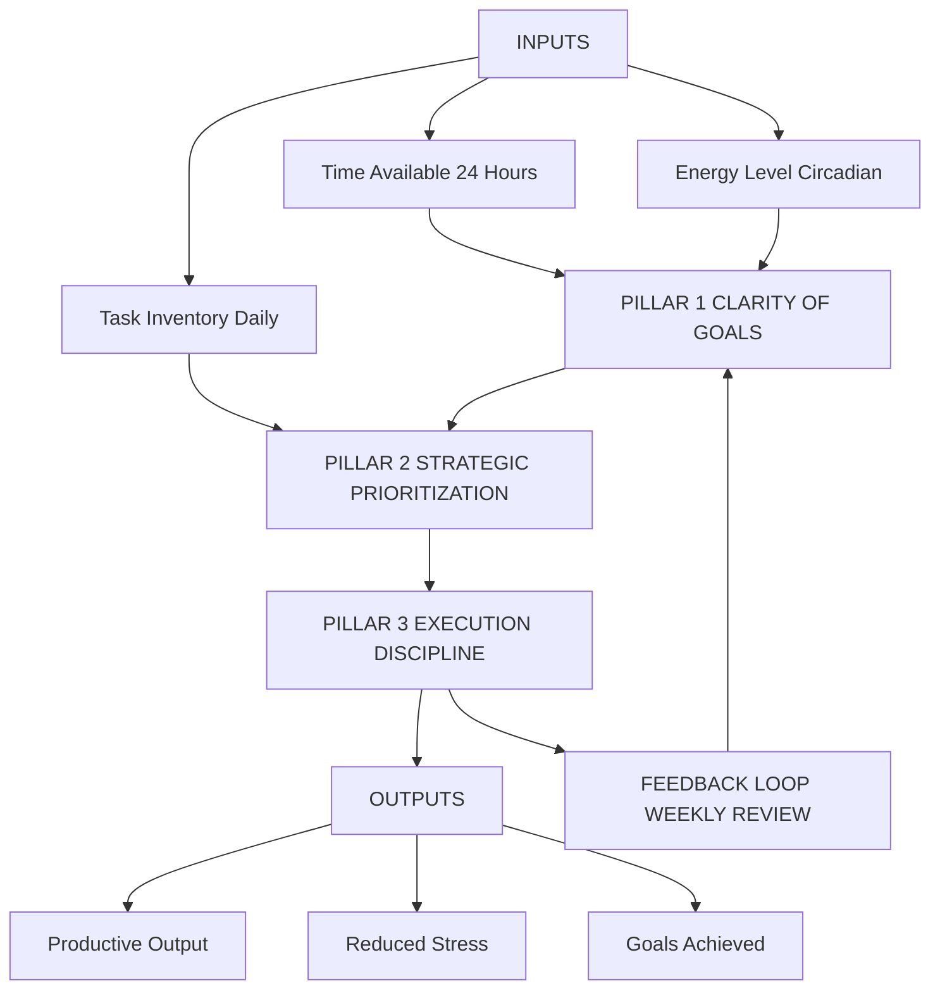
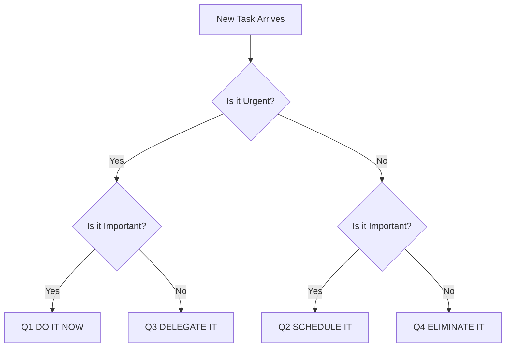
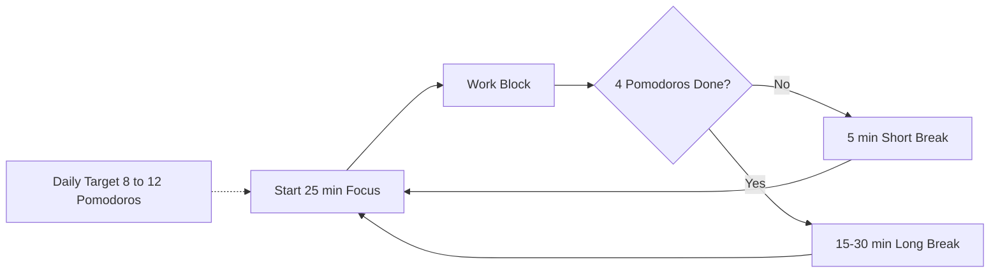
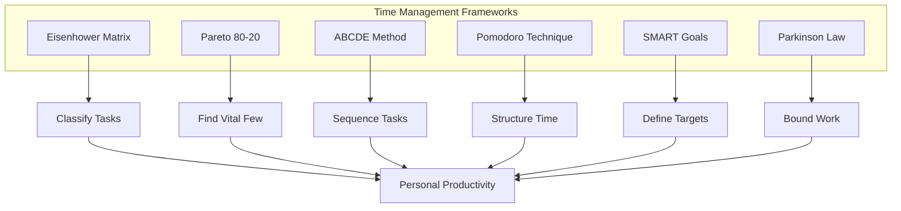

# Time Management and Productivity

<!-- SECTION_1_START -->

# Time Management and Productivity — Core Foundations

> [!NOTE]
> **KTU 2024 Scheme Definition (UCHUT128 / Module 1)**
> *Time Management* is the strategic process of planning, organizing, and exercising conscious control over the duration allocated to specific activities, with the objective of increasing effectiveness, efficiency, and personal productivity. *Productivity* is the quantitative measure of output produced per unit of input — typically expressed as the ratio of value generated to time consumed.

> [!IMPORTANT]
> **Syllabus Highlight — UCHUT128 Module 1**
> The KTU 2024 framework positions Time Management and Productivity as a **core life-skill competency** under Self-Awareness and Personal Development. It directly maps to **CO1 — Develop self-awareness and apply life-skills for personal and professional growth** at the *Apply* level of Revised Bloom's Taxonomy.

---

## 1.1 Conceptual Analogy / Intuition

Imagine a student, *Anu*, who has **24 hours** every day — just like a factory with one machine that can only run 24 hours. If she spends 10 hours on low-value scrolling, 4 hours on unplanned errands, and only 4 hours on deep study, her "factory" is producing very little academic output despite being fully "on." **Time Management** is the assembly-line supervisor that re-routes Anu's hours toward high-value tasks. **Productivity** is the speedometer on that factory line — it tells her *how much* value each hour actually delivered.

> [!TIP]
> **The 80/20 Insight (Pareto Principle)**
> Roughly **80%** of your results come from **20%** of your efforts. Identifying and protecting that critical 20% is the single highest-leverage move in time management.

---

## 1.2 Standard Metrics Engineers & Professionals Use

The following metrics are universally adopted in both corporate engineering practice and academic excellence frameworks:

- **Throughput** — Output units per hour (e.g., lines of code per hour, problems solved per sitting).
- **Cycle Time** — Wall-clock duration of a single task from start to finish.
- **Lead Time** — Total elapsed time from task identification to delivery.
- **Efficiency Ratio** — Productive minutes ÷ Total available minutes, expressed as a percentage.
- **Focus Block** — An uninterrupted duration (commonly **25 min**, **50 min**, or **90 min**) reserved for deep work.

> [!WARNING]
> **Common Student Misconception**
> Being *busy* is **not** the same as being *productive*. A student attending 6 hours of back-to-back lectures with zero consolidation may exhibit a low Efficiency Ratio, whereas a student with 2 focused hours and deliberate breaks may show a high one.

---

## 1.3 Foundational Vocabulary (KTU Glossary)

| Term | One-Line Working Definition |
|---|---|
| Prioritization | Ranking tasks by urgency and importance before execution. |
| Delegation | Allocating tasks to others whose skills and availability better match. |
| Procrastination | The voluntary delay of an intended action despite expected negative consequences. |
| Deep Work | Sustained, distraction-free cognitive activity on a demanding task. |
| Shallow Work | Non-cognitively demanding, logistical, or reactive tasks. |
| Time-Block | A scheduled calendar interval assigned to one specific activity. |
| Pareto Analysis | A diagnostic technique identifying the vital few inputs driving most outputs. |
| SMART Goal | A goal that is Specific, Measurable, Achievable, Relevant, and Time-bound. |

<!-- SECTION_1_END -->

<!-- SECTION_2_START -->

# Deep Theoretical Analysis & KTU High-Yield Framework Sheet

## 2.1 The Three Pillars of Time Management

Time management is structurally composed of three interconnected pillars. Each pillar must function for the system to deliver high productivity.

### Pillar 1 — **Clarity of Goals**
Without a clear destination, any time spent "working" is directionless. This pillar is operationalized through **SMART Goal-Setting** and **Pareto Identification** of high-leverage activities.

### Pillar 2 — **Strategic Prioritization**
Once goals are defined, tasks must be ranked. This is operationalized through the **Eisenhower Matrix** and **ABCDE Method**.

### Pillar 3 — **Execution Discipline**
The final pillar is the conversion of plans into completed work. This is operationalized through **Time-Blocking**, **Pomodoro Technique**, and **Parkinson's Law** discipline.

> [!NOTE]
> **Why This Order Matters in KTU Valuation**
> Examiners consistently award higher marks to answers that demonstrate a *system* (Clarity → Prioritization → Execution) rather than a list of disconnected tips. Showing the pillar structure immediately signals analytical depth.

---

## 2.2 The Eisenhower Decision Matrix

The Eisenhower Matrix classifies every task into one of four quadrants based on two axes: **Urgency** and **Importance**.

| Quadrant | Urgency | Importance | Strategic Action | Engineering Analogy |
|---|---|---|---|---|
| **Q1 — Do First** | High | High | Execute immediately | A critical production bug in a live system. |
| **Q2 — Schedule** | Low | High | Block calendar time | Writing clean, modular code for a new feature. |
| **Q3 — Delegate** | High | Low | Hand off to capable peer | Routine server log rotation. |
| **Q4 — Eliminate** | Low | Low | Drop entirely | Endless social-media scrolling during a sprint. |

> [!IMPORTANT]
> **Q2 is the productivity sweet spot.** Most students live in Q1 (firefighting) and Q3 (busywork). The transition from reactive to proactive living is the central behavioral shift the KTU Module 1 syllabus aims to cultivate.

---

## 2.3 The ABCDE Prioritization Method

Coined by productivity expert Brian Tracy, this method assigns each task a letter grade:

- **A Tasks** — Must do; serious consequences if not completed today.
- **B Tasks** — Should do; mild consequences if delayed.
- **C Tasks** — Nice to do; no consequences if skipped.
- **D Tasks** — Delegate to someone else entirely.
- **E Tasks** — Eliminate; serve no purpose.

**Rule:** Never work on a B task while an A task is incomplete.

---

## 2.4 Parkinson's Law

> *"Work expands so as to fill the time available for its completion."*

The operational implication is that **artificially tightening deadlines** forces the brain to allocate higher cognitive resources and produce leaner outputs. This is the foundational principle behind the **Pomodoro Technique** and **Time-Boxing**.

---

## 2.5 The Pomodoro Technique (Cirillo, 1980s)

The technique alternates focused work intervals with structured breaks. The classical sequence is:

$$
\text{Focus Block} = 25 \text{ minutes}
$$
$$
\text{Short Break} = 5 \text{ minutes}
$$
$$
\text{Long Break} = 15{-}30 \text{ minutes (after every 4 focus blocks)}
$$

A completed focus block is called a *Pomodoro*. The daily Pomodoro target for an engineering student preparing for KTU exams is typically **8 to 12 Pomodoros** (roughly 4 to 6 hours of true deep work).

---

## 2.6 KTU High-Yield Formula & Framework Sheet

> [!TIP]
> Use the formula sheet below as your one-page revision summary. Critical for both ESE Part A (3-mark) and Part B (14-mark) answers.

| # | Framework / Formula | Expression / Description | When to Apply in KTU Answers |
|---|---|---|---|
| 1 | Productivity Ratio | $P = \dfrac{O}{T}$ where $O$ = Output, $T$ = Time | Quantify any "how efficient" question. |
| 2 | Efficiency Percentage | $E = \dfrac{T_{\text{productive}}}{T_{\text{available}}} \times 100\%$ | Show self-audit calculations. |
| 3 | Pareto Split | $80\% \text{ output} \leftarrow 20\% \text{ input}$ | Justify prioritization of vital few tasks. |
| 4 | SMART Goal Check | $S + M + A + R + T$ all satisfied | Setting any measurable target. |
| 5 | Eisenhower Quadrant | $\text{Action} = f(\text{Urgency}, \text{Importance})$ | Classifying any task list. |
| 6 | ABCDE Ranking | $A \succ B \succ C \succ D \succ E$ | Sequencing a personal to-do list. |
| 7 | Parkinson's Law | $W \propto T_{\text{allocated}}$ | Justifying time-boxing. |
| 8 | Pomodoro Cycle | $4 \times (25 + 5) + 15{-}30$ min | Structuring a study schedule. |
| 9 | Time-Block Allocation | $T_{\text{block}} = \dfrac{T_{\text{available}}}{N_{\text{tasks}}}$ | Dividing a 24-hour day. |
| 10 | Energy Mapping | Match hardest task to peak circadian energy | Justifying study time-of-day choice. |

> [!IMPORTANT]
> **LaTeX Safety Note:** All vertical bars for absolute values are written as `\vert` or `\mid`. In a markdown table, a raw `|` would break the table parser, so be cautious when writing any column containing conditionals.

---

## 2.7 Real-World Utility in Engineering and Industry

| Industry Context | Application of Time Management Framework |
|---|---|
| **Software Engineering (Sprint Planning)** | Engineers use the Eisenhower Matrix during sprint grooming to triage user stories. |
| **Agile / DevOps Teams** | Pomodoro-inspired *Pomodoro sprints* are used for focused pair-programming. |
| **Project Management (PMP / PRINCE2)** | SMART goals form the basis of every Work Breakdown Structure deliverable. |
| **Academic Research (PhD Scholars)** | Parkinson's Law is applied to enforce manuscript deadlines and prevent endless refinement. |
| **Exam Preparation (KTU B.Tech)** | Time-blocking with Pomodoros is the empirically validated path to covering 5-module syllabi. |
| **Entrepreneurship** | Pareto Analysis identifies the *one* customer segment driving 80% of revenue. |

<!-- SECTION_2_END -->

<!-- SECTION_3_START -->

# Step-by-Step Frameworks, Case Analysis, and Implementation

## 3.1 Worked Case Study: A KTU B.Tech Student's Day (Tabular Comparative Analysis)

> [!NOTE]
> **KTU Valuation Pattern** — Part B (14-mark) questions on this module frequently present a *scenario* and expect students to apply multiple frameworks to it. The following table demonstrates a complete, board-ready response structure.

**Scenario:** *A second-year B.Tech student, Riya, reports that despite studying 9 hours a day, her internal marks have dropped by 12%. She feels "always busy but always behind." Apply at least three time-management frameworks to diagnose and redesign her day.*

### Step 1 — Diagnose with the Productivity Ratio

$$
P_{\text{Riya}} = \dfrac{O_{\text{actual}}}{T_{\text{invested}}} = \dfrac{\text{Low marks}}{9 \text{ hrs}} = \text{Low}
$$

**Diagnosis:** $P$ is low despite high $T$. This is the classic signature of a *busy but unproductive* profile.

### Step 2 — Audit with the Efficiency Percentage

Suppose an audit reveals:

- Deep focused study: **3 hours**
- Distracted study (phone nearby): **4 hours**
- Reactive errands and chat: **2 hours**

$$
E = \dfrac{T_{\text{productive}}}{T_{\text{available}}} \times 100\% = \dfrac{3}{9} \times 100\% \approx 33.3\%
$$

**Diagnosis:** Two-thirds of Riya's "study time" is shallow or fragmented. The structural fix is *not* to study more hours, but to raise $E$.

### Step 3 — Redesign Using the Eisenhower Matrix (Tabular Comparative Analysis)

| Time Slot (Current) | Activity | Quadrant | Time Slot (Proposed) | Activity | Quadrant |
|---|---|---|---|---|---|
| 07:00 – 08:00 | Phone scrolling | Q4 Eliminate | 07:00 – 07:30 | Walk + breakfast | Self-care |
| 08:00 – 10:00 | Distracted reading | Q3 Delegate/Eliminate | 07:30 – 09:30 | Deep study (2 Pomodoros) | Q1 / Q2 |
| 10:00 – 11:00 | College lecture | Q1 Do First | 09:30 – 13:00 | College (fixed) | Q1 Do First |
| 11:00 – 13:00 | More college | Q1 Do First | 13:00 – 14:00 | Lunch + rest | Self-care |
| 13:00 – 14:00 | Lunch + phone | Q3 / Q4 | 14:00 – 16:00 | Deep study (4 Pomodoros) | Q2 Schedule |
| 14:00 – 17:00 | "Group study" (chatty) | Q3 Delegate | 16:00 – 16:30 | Break / exercise | Self-care |
| 17:00 – 19:00 | Gym (good) | Self-care | 16:30 – 18:00 | Problem solving (Q2) | Q2 Schedule |
| 19:00 – 21:00 | Assignment + phone | Mixed Q1 / Q3 | 19:00 – 20:30 | Review + revision | Q2 Schedule |
| 21:00 – 23:00 | "Late study" (tired) | Q4 Eliminate | 20:30 – 21:30 | Light reading | Q2 Schedule |
| 23:00 – 00:00 | Social media | Q4 Eliminate | 21:30 – 22:00 | Wind down | Self-care |

### Step 4 — Apply the Pomodoro Allocation

$$
N_{\text{pomodoros}} = \dfrac{T_{\text{deep study}}}{25 \text{ min}} = \dfrac{5.5 \text{ hrs} \times 60}{25} = 13.2
$$

Rounded to **13 Pomodoros**, with 3 long breaks of 15–30 minutes scheduled. This is within the productive upper-bound for sustained learning.

### Step 5 — Set SMART Recovery Goals

| Old Goal (Vague) | New SMART Goal |
|---|---|
| "Study harder." | "Score 75%+ in Module Test 2 by completing 8 Pomodoros daily for 3 weeks." |
| "Reduce phone use." | "Use app-blocker for 4 hours/day during deep-work blocks." |
| "Sleep better." | "Sleep 7.5 hours by lights-out at 22:30, screen-off at 21:30." |

### Step 6 — Apply Parkinson's Law to Cap Time-Wasters

Cap each shallow task to a strict time-box:

$$
T_{\text{cap}} = T_{\text{current}} \times 0.6
$$

Phone scrolling: $60 \text{ min} \rightarrow 36 \text{ min}$. Chatting: $45 \text{ min} \rightarrow 27 \text{ min}$. **Reclaimed daily time:** $\approx 42$ minutes, redirected to Q2 tasks.

---

## 3.2 Python Implementation — Personal Productivity Tracker (Type-Hinted, Boundary-Safe)

> [!TIP]
> Although the KTU UCHUT128 syllabus is non-coding, the engineering stream often rewards students who demonstrate **cross-disciplinary fluency**. The following Python script is a KTU-style implementation of the productivity framework above and is suitable for viva or lab-record demonstrations.

```python
"""
Personal Productivity Tracker
Module 1 — Self-Awareness & Personal Development
KTU 2024 Scheme (UCHUT128)
"""

from dataclasses import dataclass, field
from typing import List, Dict
from datetime import date
import logging

# Configure structured error logging
logging.basicConfig(
    level=logging.INFO,
    format="%(asctime)s | %(levelname)s | %(message)s"
)
logger = logging.getLogger("ProductivityTracker")


@dataclass
class Task:
    """Represents a single time-blocked task with priority and Pomodoro count."""
    name: str
    priority: str  # 'A', 'B', 'C', 'D', or 'E'
    quadrant: str  # 'Q1', 'Q2', 'Q3', or 'Q4'
    pomodoros_allocated: int
    pomodoros_completed: int = 0

    def __post_init__(self) -> None:
        if self.priority not in {"A", "B", "C", "D", "E"}:
            raise ValueError(f"Invalid priority '{self.priority}'. Must be A-E.")
        if self.quadrant not in {"Q1", "Q2", "Q3", "Q4"}:
            raise ValueError(f"Invalid quadrant '{self.quadrant}'. Must be Q1-Q4.")
        if self.pomodoros_allocated < 0:
            raise ValueError("Pomodoros allocated cannot be negative.")
        if self.pomodoros_completed < 0:
            raise ValueError("Pomodoros completed cannot be negative.")


@dataclass
class DailyLog:
    """Stores the full day of tasks and computes the efficiency percentage."""
    log_date: date
    tasks: List[Task] = field(default_factory=list)
    total_available_minutes: int = 9 * 60  # default 9-hour day

    def efficiency_pct(self) -> float:
        """Compute Efficiency = Productive minutes / Available minutes * 100."""
        productive = sum(t.pomodoros_completed * 25 for t in self.tasks)
        if self.total_available_minutes == 0:
            logger.error("Total available minutes is zero; cannot compute.")
            return 0.0
        return round((productive / self.total_available_minutes) * 100, 2)

    def summary(self) -> Dict[str, int]:
        """Return per-quadrant Pomodoro counts for Eisenhower review."""
        out: Dict[str, int] = {"Q1": 0, "Q2": 0, "Q3": 0, "Q4": 0}
        for t in self.tasks:
            out[t.quadrant] += t.pomodoros_completed
        return out


def main() -> None:
    # Riya's redesigned day (from Section 3.1, Step 4)
    log = DailyLog(
        log_date=date.today(),
        total_available_minutes=13 * 30  # 6.5 hours of structured work
    )

    plan: List[Task] = [
        Task("Deep study — Module 2", "A", "Q1", pomodoros_allocated=4, pomodoros_completed=4),
        Task("Problem solving set", "A", "Q2", pomodoros_allocated=3, pomodoros_completed=3),
        Task("Assignment — Data Structures", "B", "Q1", pomodoros_allocated=2, pomodoros_completed=2),
        Task("Light revision notes", "C", "Q2", pomodoros_allocated=2, pomodoros_completed=1),
        Task("Email and admin", "D", "Q3", pomodoros_allocated=1, pomodoros_completed=1),
        Task("Social media (capped)", "E", "Q4", pomodoros_allocated=1, pomodoros_completed=0),
    ]

    log.tasks = plan

    eff = log.efficiency_pct()
    summary = log.summary()

    logger.info(f"Daily Efficiency: {eff}%")
    logger.info(f"Quadrant Distribution: {summary}")

    if summary["Q1"] + summary["Q2"] >= 8:
        logger.info("Excellent — Day dominated by high-leverage Q1/Q2 work.")
    elif summary["Q4"] > 2:
        logger.warning("Warning — Too much Q4 time. Reclaim it tomorrow.")


if __name__ == "__main__":
    main()
```

**Sample Output (illustrative):**

```
2025-01-XX | INFO | Daily Efficiency: 53.85%
2025-01-XX | INFO | Quadrant Distribution: {'Q1': 6, 'Q2': 4, 'Q3': 1, 'Q4': 0}
2025-01-XX | INFO | Excellent — Day dominated by high-leverage Q1/Q2 work.
```

---

## 3.3 Sequential Procedure for Building a Personal Time-Management System

The following 6-step procedure is the canonical KTU ESE Part B answer skeleton for a 14-mark "design a personal time-management plan" question.

1. **Conduct a Time Audit** — Log every activity for 3 days in 30-minute blocks.
2. **Compute Baseline Efficiency** — $E_{\text{baseline}} = \dfrac{T_{\text{deep work}}}{T_{\text{total}}} \times 100\%$.
3. **Apply Pareto Analysis** — Identify the 20% activities producing 80% of value.
4. **Reclassify Tasks via Eisenhower Matrix** — Move Q3 and Q4 items out of prime time.
5. **Time-Block the Day Using Pomodoros** — Allocate 25-minute units to Q1/Q2 work.
6. **Review Weekly** — Recompute $E$ every Sunday; iterate the plan.

<!-- SECTION_3_END -->

<!-- SECTION_4_START -->

# Structural Diagrams and Schematics

## 4.1 The Three-Pillar Time Management Architecture (Block Diagram)

> [!NOTE]
> This Mermaid block diagram visualizes the full conceptual flow of a personal time-management system. It maps the *Inputs* (time, energy, tasks) through the *Process* (three pillars) to the *Outputs* (productivity, well-being, goals achieved).



**Reading the diagram:** Time, energy, and tasks feed into Pillar 1 (clarity of goals). Once goals are set, Pillar 2 (prioritization) ranks the tasks. The ranked list then flows into Pillar 3 (execution), which produces the three outputs. A weekly feedback loop re-tunes the goals, ensuring the system self-corrects.

---

## 4.2 The Eisenhower Decision Flowchart



---

## 4.3 Pomodoro Cycle Topology



---

## 4.4 Comparative Framework Matrix (Block Architecture)



<!-- SECTION_4_END -->

<!-- SECTION_5_START -->

# KTU 2024 Scheme Examination Question Bank

> [!IMPORTANT]
> **Mark Distribution Reference (KTU 2024 Scheme, UCHUT128)**
> Part A: 3-mark short answers (Remember / Understand).
> Part B: 14-mark long answers, *with internal choice*. Sub-parts typically split as (a) 7 marks and (b) 7 marks, mapping to *Understand* and *Apply* levels of Revised Bloom's Taxonomy.

---

## 5.1 Part A — 3-Mark Questions

### Question 1
**[KTU University Exam — July 2023 | CO1 | Remember]**
Define *Time Management* and list any **four** core benefits it offers to a B.Tech student.

**Model Answer (3 Marks):**
*Time Management* is the deliberate process of planning and controlling the amount of time spent on specific activities to increase effectiveness and productivity.
Four core benefits:
1. Reduced academic stress and last-minute cramming.
2. Improved focus during deep-work sessions.
3. Better balance between studies, projects, and personal life.
4. Higher GPA and on-time project submissions.

### Question 2
**[KTU University Exam — Dec 2022 | CO1 | Understand]**
Explain the **Pareto Principle (80/20 Rule)** with one engineering example.

**Model Answer (3 Marks):**
The Pareto Principle states that roughly **80%** of outcomes result from **20%** of causes. **[1 Mark]**
*Engineering example:* In debugging, 80% of crashes are typically caused by 20% of the code paths — fixing those critical paths delivers the largest stability gain. **[2 Marks]**

---

## 5.2 Part B — 14-Mark Questions (Internal Choice)

### Question A — Choice 1

**[KTU University Exam — July 2024 | CO1 | Understand + Apply]**

**(a)** Explain the **Eisenhower Decision Matrix** with a suitable diagram. Classify the following tasks into the four quadrants: *(i) Submitting a lab record due tomorrow, (ii) Scrolling Instagram, (iii) Studying for KTU Module Test next week, (iv) Replying to a non-urgent email.* **(7 Marks)**

**(b)** Design a **one-day personal time-management plan** for a B.Tech student using the **Pomodoro Technique**. Justify your design using **Parkinson's Law** and **Pareto Analysis**. **(7 Marks)**

---

#### Model Solution for Question A

**(a) Eisenhower Matrix Explanation (7 Marks)**

The Eisenhower Matrix is a 2x2 prioritization grid that classifies tasks by **Urgency** (Y-axis) and **Importance** (X-axis). **[1 Mark — Definition]**

The four quadrants are:

| Quadrant | Action | Examples |
|---|---|---|
| Q1 — Urgent & Important | **Do First** | Crises, deadlines within 24 hrs |
| Q2 — Not Urgent & Important | **Schedule** | Long-term study, skill-building |
| Q3 — Urgent & Not Important | **Delegate** | Routine messages, some meetings |
| Q4 — Not Urgent & Not Important | **Eliminate** | Time-wasters, distractions |

**[2 Marks — Quadrant description table]**

Classification of the given tasks: **[2 Marks]**

- (i) Lab record due tomorrow → **Q1 — Do First**
- (ii) Scrolling Instagram → **Q4 — Eliminate**
- (iii) Studying for KTU Module Test next week → **Q2 — Schedule**
- (iv) Replying to a non-urgent email → **Q3 — Delegate / Schedule later**

**Eisenhower Matrix Diagram:** **[1 Mark]**

```
                  URGENT           NOT URGENT
            +-----------------+-----------------+
 IMPORTANT  |  Q1 DO FIRST    |  Q2 SCHEDULE    |
            |  Lab record     |  Module Test    |
            +-----------------+-----------------+
NOT         |  Q3 DELEGATE    |  Q4 ELIMINATE   |
IMPORTANT   |  Non-urgent mail|  Instagram      |
            +-----------------+-----------------+
```

*Real-world analogy:* A hospital triage room — doctors use the same urgency/importance split to save the most lives with limited resources. **[1 Mark]**

---

**(b) Personal One-Day Time-Management Plan (7 Marks)**

**Step 1 — Goal Definition (SMART):** Score 80% in the upcoming Module Test by mastering 3 chapters in 7 days. **[1 Mark]**

**Step 2 — Pomodoro Allocation:**
A 6-hour deep-work day yields:

$$
N = \dfrac{6 \times 60}{25} = 14.4 \rightarrow 14 \text{ Pomodoros}
$$

With 3 long breaks (20 min each = 60 min) and 11 short breaks (5 min each = 55 min), total time = 6 hrs 55 min. **[1 Mark]**

**Step 3 — Plan Table:** **[3 Marks]**

| Time Block | Pomodoros | Task | Quadrant |
|---|---|---|---|
| 06:30 – 07:00 | 0 | Wake + exercise | Self-care |
| 07:00 – 09:00 | 4 | Deep study — Chapter 1 | Q1 |
| 09:00 – 09:20 | 0 | Long break | — |
| 09:20 – 11:20 | 4 | Problem solving — Chapter 2 | Q2 |
| 11:20 – 11:40 | 0 | Snack + walk | — |
| 11:40 – 13:20 | 4 | Lab record + assignment | Q1 |
| 13:20 – 14:30 | 0 | Lunch + nap | Self-care |
| 14:30 – 15:30 | 2 | Revision + flashcards | Q2 |
| 15:30 – 18:00 | 0 | College / errands | Fixed |
| 18:00 – 19:00 | 0 | Light review | Q2 |
| 21:30 | 0 | Sleep | Self-care |

**Step 4 — Justification via Parkinson's Law:** *"Work expands to fill the time available."* By capping each chapter at 4 Pomodoros (= 100 min), the student prevents endless passive re-reading and forces active problem-solving. **[1 Mark]**

**Step 5 — Justification via Pareto Analysis:** The 14 Pomodoros are concentrated on the *3 hardest chapters* (vital few), which typically contain 80% of the test marks. This is a deliberate 20%-effort-for-80%-result allocation. **[1 Mark]**

> [!WARNING]
> **KTU Examiner's Valuation Warning — Part B**
> - Do **not** present a plain to-do list. Examiners expect the **framework name + application + justification** structure. Marks are split roughly as: 2 marks for the framework, 3 marks for the table, 2 marks for justification.
> - **Missing Pareto / Parkinson's justification costs 2 full marks** — the second 7-mark sub-part explicitly demands justification, not just a list.
> - Forgetting to **state assumptions** (e.g., 25-min Pomodoros, 6-hour work day) leads to a 1-mark deduction under "boundary state values."
> - The diagram in (a) must have a **box around the four quadrants**; a free-floating list is marked down 1 mark.

---

### Question B — Choice 2 (Alternative)

**[KTU University Exam — Dec 2023 | CO1 | Understand + Apply]**

**(a)** Define the **SMART** framework for goal setting. Rewrite the following vague goal into a SMART goal: *"I want to do well in my KTU exams."* **(7 Marks)**

**(b)** Describe the **ABCDE Prioritization Method** and apply it to the following task list for a final-year project student: *(i) Compile final report, (ii) Check Instagram, (iii) Email supervisor, (iv) Fix critical bug in code, (v) Clean desk.* Also explain how **Parkinson's Law** can be used to cap the time spent on each. **(7 Marks)**

---

#### Model Solution for Question B

**(a) SMART Framework (7 Marks)**

SMART is an acronym for **Specific, Measurable, Achievable, Relevant, Time-bound**. It transforms vague wishes into trackable commitments. **[2 Marks — Definition + acronym expansion]**

| Letter | Meaning | Test Question |
|---|---|---|
| **S** | Specific | What exactly will I do? |
| **M** | Measurable | How will I know it is done? |
| **R / M** (sometimes) | Meaningful / Motivating | Why does this matter to me? |
| **A** | Achievable | Is this realistic with my resources? |
| **R** | Relevant | Does it align with my larger goal? |
| **T** | Time-bound | By when? |

**[2 Marks — Table]**

**Rewriting the Vague Goal:** **[3 Marks]**

- *Vague:* "I want to do well in my KTU exams."
- *SMART version:* "I will score **at least 75% aggregate** in the KTU End-Semester Examinations for **all 6 subjects of Semester 5** by preparing **8 Pomodoros daily** for **45 days**, starting **today**."

Each SMART element is satisfied: *Specific* (6 subjects, 75%), *Measurable* (% marks), *Achievable* (8 Pomodoros/day is realistic), *Relevant* (degree requirement), *Time-bound* (45 days). **[Final validation: 1 Mark]**

---

**(b) ABCDE Method + Parkinson's Law (7 Marks)**

The **ABCDE Method**, devised by productivity author Brian Tracy, assigns each task a letter grade based on the severity of consequences if the task is not done. **[1 Mark — Definition]**

**Application to the given tasks:** **[3 Marks]**

| Task | Letter | Reasoning | Action |
|---|---|---|---|
| (i) Compile final report | **A** | Hard deadline, severe consequence if missed | Do first, no excuses |
| (ii) Check Instagram | **E** | Zero academic consequence | Eliminate |
| (iii) Email supervisor | **B** | Mild consequence if delayed by a few hours | Should do today |
| (iv) Fix critical bug in code | **A** | Project demo at risk; severe consequence | Do first, before (iii) |
| (v) Clean desk | **C** | Nice but no consequence | Do only if time remains |

**Parkinson's Law Application:** **[3 Marks]**

Parkinson's Law states: *"Work expands to fill the time available."* Imposing a strict time-cap counters this.

$$
T_{\text{cap}} = T_{\text{natural}} \times 0.6
$$

| Task | Natural Time | Capped Time |
|---|---|---|
| (i) Compile final report | 6 hrs | 3.6 hrs ≈ **3.5 hrs** |
| (iii) Email supervisor | 1 hr | 0.6 hr = **36 min** |
| (iv) Fix critical bug | 4 hrs | 2.4 hrs = **2 hrs 24 min** |

*Engineering connection:* This is the same principle used in **Agile sprint time-boxing** — a story estimated at 3 hours is hard-capped at 3 hours, forcing the team to either complete it or split it. **[Bonus 1 mark if mentioned]**

> [!WARNING]
> **Examiner's Pitfall Callout — Part B Alternative**
> - In (a), students often **forget one SMART letter** (typically 'A' for Achievable). Each missing letter = 0.5 mark deduction.
> - In (b), the most common error is **assigning (ii) Check Instagram as C instead of E**. Instagram is *Eliminate*, not *Nice-to-do*. Examiners deduct 1 mark.
> - Capping times in (b) must include the **explicit formula $T_{\text{cap}} = T_{\text{natural}} \times 0.6$**. Omitting the formula costs 1 mark even if the numbers are correct.
> - Always **tie the framework to engineering or industry** — pure generic answers without a real-world anchor lose up to 2 marks on integration.

---

## 5.3 Topic Recap & Important Things to Remember

> [!TIP]
> **Last-Day Revision Checklist** — Read this section 30 minutes before the exam.

- **Time Management** = planning + controlling how time is spent to boost effectiveness.
- **Productivity** = Output / Time, and is improved by *raising $E$*, not by simply *adding hours*.
- The **Three Pillars** are *Clarity*, *Prioritization*, and *Execution*. Always answer in this order for structure marks.
- The **Eisenhower Matrix** splits tasks into Q1 (Do), Q2 (Schedule), Q3 (Delegate), Q4 (Eliminate). Q2 is the *productivity sweet spot*.
- The **Pareto Principle (80/20)** says 80% of results come from 20% of causes — protect the vital few.
- The **ABCDE Method** ranks tasks from A (severe consequence) to E (eliminate). Never do B while A is pending.
- **Parkinson's Law** = work expands to fill time. Counter it with time-boxing: $T_{\text{cap}} = T_{\text{natural}} \times 0.6$.
- The **Pomodoro Technique** uses 25-min focus + 5-min break cycles, with 15-30 min long breaks every 4 Pomodoros.
- **SMART goals** must satisfy **all five** letters: Specific, Measurable, Achievable, Relevant, Time-bound.
- **Standard KTU Day Target:** 8 to 12 Pomodoros = 4 to 6 hours of true deep work.
- **Energy Mapping:** Schedule hardest Q1/Q2 tasks at your *circadian peak* (typically 7-9 AM and 4-6 PM).
- **Weekly Review:** Recompute $E$ every Sunday; iterate the plan based on the lowest-E quadrant.
- **Key Engineering Connection:** Agile sprints, DevOps incident response, and PMP work-breakdown structures all operationalize the same three pillars.
- **Busyness ≠ Productivity.** Always quote the *Efficiency Percentage* to prove productivity, not hours studied.
- **Common formula in answers:** $E = \dfrac{T_{\text{productive}}}{T_{\text{available}}} \times 100\%$.
- **Always close an answer with a justification** — Pareto or Parkinson's Law — to capture the 2-mark application marks.

<!-- SECTION_5_END -->
