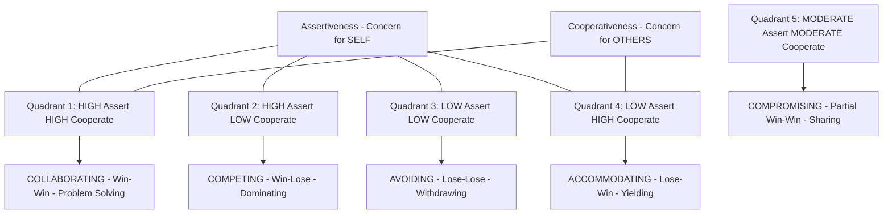
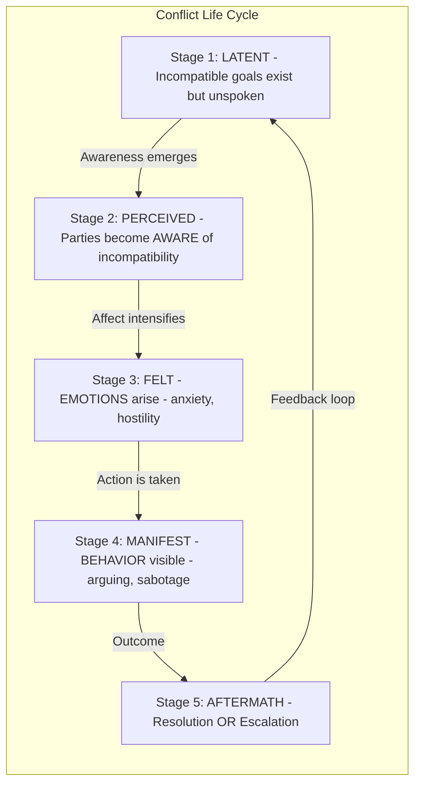
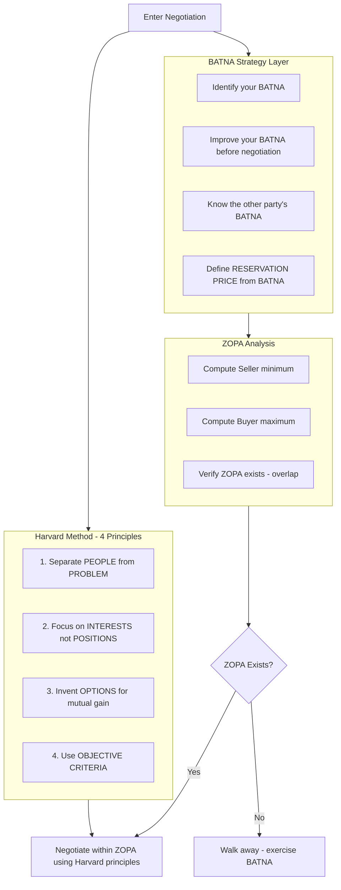
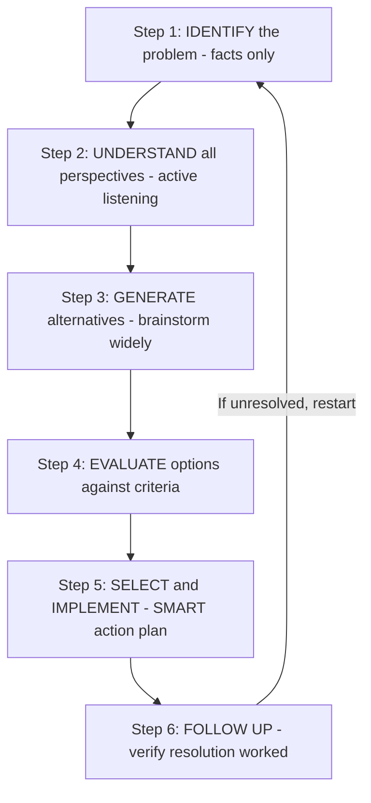
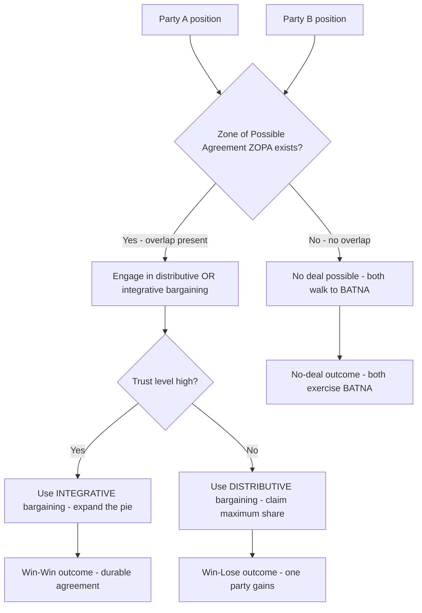

# Conflict Resolution and Negotiation

<!-- SECTION_1_START -->
# Conflict Resolution and Negotiation — Core Conceptual Framework

## 1.1 Formal Academic Definition (KTU 2024 UCHUT128 Terminology)

**Conflict** is an expressed struggle between at least two interdependent parties who perceive incompatible goals, scarce resources, or interference from the other in achieving their objectives (Robbins & Judge, Organizational Behavior).

> [!IMPORTANT]
> **KTU 2024 Working Definition (Module 2):**
> *Conflict* is a *disagreement* between individuals or groups resulting from incompatible goals, values, interests, or perceptions. It is **not inherently negative** — when managed constructively, conflict becomes a *catalyst* for innovation, deeper understanding, and stronger professional relationships.

**Conflict Resolution** is the systematic process by which two or more parties work toward a mutually acceptable solution to a dispute. It encompasses strategies ranging from direct negotiation to structured mediation and arbitration.

**Negotiation** is a *back-and-forth communication process* between two or more parties aimed at reaching a mutually beneficial agreement on issues of shared interest or contested resources. It is the **primary mechanism** through which conflict is resolved without third-party intervention.

| Core Term | Operational Meaning |
|---|---|
| **Dispute** | A specific disagreement on a particular issue |
| **Position** | What a party *says* it wants (often rigid) |
| **Interest** | The underlying *need* or *concern* driving the position |
| **BATNA** | Best Alternative to a Negotiated Agreement (walk-away point) |
| **ZOPA** | Zone of Possible Agreement (overlap between reservation prices) |
| **Distributive Bargaining** | Zero-sum negotiation — one wins, the other loses |
| **Integrative Bargaining** | Win-win negotiation — joint value creation |

## 1.2 Intuitive Overview — The Real-World Analogy

> [!NOTE]
> **Analogy — The Shared Pizza Problem 🍕**
>
> Imagine two engineers, *Asha* and *Rohan*, sharing a single pizza in a tech-park cafeteria. Asha wants *maximum cheese coverage*; Rohan wants *extra olives*. They have **one resource (the pizza)**, **two competing interests (cheese vs. olives)**, and an **interdependency** (neither can eat the whole thing alone).
>
> - If Asha grabs the pizza and walks away → **Conflict Escalation (Avoidance fails).**
> - If Rohan sulks and skips lunch → **Withdrawal / Avoidance Style.**
> - If they split the pizza exactly in half (no olives, no extra cheese) → **Compromise Style.**
> - If they order a *second* pizza and trade slices → **Integrative Negotiation (Win-Win).**
> - If a third colleague (Manager) decides who gets what → **Third-Party Arbitration.**
>
> **Insight for KTU students:** The pizza is your *project deadline*, *team resource*, or *client requirement*. The *style* you choose to resolve it determines whether the team remains collaborative (high trust, future productivity) or fractured (low trust, project delay).

## 1.3 Why This Topic Matters in KTU's NEP 2020 Framework

The UCHUT128 course explicitly aligns with the **NEP 2020 mandate** to produce *engineers with strong life competencies*, not just technical knowledge. Conflict Resolution and Negotiation sit at the intersection of:

- **Emotional Intelligence (EI)** — self-regulation under disagreement
- **Professional Communication** — articulating interests without aggression
- **Collaboration & Team Dynamics** — the foundation of all engineering project work
- **Leadership Readiness** — managers resolve 25–40% of their time on conflict-related tasks

> [!TIP]
> **KTU Examiner Insight:**
> A 14-mark answer on this topic must show *practical engineering context* (e.g., a team conflict over a software module's design choice). Pure theoretical answers without application to *engineering teams* lose 2–3 marks automatically.

<!-- SECTION_1_END -->

<!-- SECTION_2_START -->
# Deep Theoretical Analysis — Models, Styles, and the High-Yield Framework Sheet

## 2.1 The Thomas–Kilmann Conflict Mode Instrument (TKI) — The KTU Anchor Model

The **Thomas–Kilmann Model (1974)** is the most examination-relevant framework in Module 2. It plots five conflict-handling styles on two axes: **Assertiveness** (concern for self) and **Cooperativeness** (concern for others).

| # | Style | Assertiveness | Cooperativeness | When to Use in Engineering Teams |
|---|---|---|---|---|
| 1 | **Competing (Dominating)** | High | Low | Emergencies — production server down, must act *now* |
| 2 | **Collaborating (Problem-Solving)** | High | High | Complex design decisions where both technical and business interests matter |
| 3 | **Compromising (Sharing)** | Moderate | Moderate | Time-bound trade-offs — release deadlines, resource splits |
| 4 | **Avoiding (Withdrawing)** | Low | Low | Trivial issues or when cooling-off period is needed |
| 5 | **Accommodating (Yielding)** | Low | High | When the relationship matters more than the outcome, or when the other party is the expert |

> [!IMPORTANT]
> **KTU Board Frequently Tests:**
> "Which conflict style is most appropriate when *both* technical correctness *and* team harmony are essential?" → **Answer: Collaborating.**
> Marks are awarded for *justifying* the choice with a 2-line engineering example.

## 2.2 The Five Stages of Conflict (KTU Module Mapping)

The KTU syllabus explicitly covers the **life cycle of conflict** to help students *diagnose* rather than just *react*:

1. **Latent Conflict** — Pre-conflict stage; underlying conditions exist (scarce resources, goal divergence) but no overt disagreement yet.
2. **Perceived Conflict** — Parties become *aware* of the incompatibility. Cognition precedes emotion.
3. **Felt Conflict** — Emotional involvement — anxiety, tension, hostility. *Affect* emerges.
4. **Manifest Conflict** — Behavior is visible — arguing, sabotage, work slowdown.
5. **Conflict Aftermath** — Resolution or escalation. Outcomes feed back into future interactions.

> [!NOTE]
> **Engineering Application:** In a software project, *latent conflict* exists the moment two modules compete for the same database schema. The *manifest* stage arrives when developers start refusing to integrate code. Early intervention at the *perceived* stage prevents costly rework.

## 2.3 Negotiation Theory — Harvard Method, BATNA, and ZOPA

The **Harvard Negotiation Project (Fisher & Ury, *Getting to Yes*, 1981)** is the gold standard taught in KTU. Its four pillars are:

1. **Separate the People from the Problem** — Attack the issue, not the individual.
2. **Focus on Interests, Not Positions** — *Why* does the other party want what they want?
3. **Invent Options for Mutual Gain** — Expand the pie before dividing it.
4. **Insist on Objective Criteria** — Use industry standards, market data, benchmarks.

### 2.3.1 BATNA — Best Alternative to a Negotiated Agreement

- **Definition:** The *most advantageous* course of action a party can take *if* no agreement is reached.
- **Strategic Role:** BATNA defines your **walk-away point** (reservation price).
- **Power Principle:** The party with the *stronger* BATNA has more leverage. Always *strengthen* your BATNA *before* entering negotiation.

### 2.3.2 ZOPA — Zone of Possible Agreement

- **Definition:** The overlap between the buyer's maximum willingness-to-pay and the seller's minimum acceptable price.
- **If ZOPA exists** ($Buyer_{max} \geq Seller_{min}$) → A deal is *possible*.
- **If ZOPA does not exist** ($Buyer_{max} < Seller_{min}$) → A deal is *impossible* without introducing new variables.

$$ZOPA = [Seller_{min},\ Buyer_{max}]$$

A deal is feasible if and only if $Seller_{min} \leq Buyer_{max}$.

## 2.4 KTU High-Yield Cheat Sheet — Conflict & Negotiation Master Table

| Concept | Formula / Definition | Engineering Use-Case | Common Mistake to Avoid |
|---|---|---|---|
| **TKI Collaborating** | High Assert + High Cooperate | Cross-team architecture decisions | Confusing with *Compromising* |
| **TKI Avoiding** | Low Assert + Low Cooperate | Cooling-off after heated code review | Using it for *important* issues |
| **BATNA Strength** | Quality of alternative if no deal | Salary negotiation, vendor contracts | Entering negotiation *without* one |
| **ZOPA** | Overlap of $Seller_{min}$ and $Buyer_{max}$ | Contract pricing, scope-of-work talks | Assuming ZOPA always exists |
| **Distributive Bargaining** | Fixed-pie, win-lose | Single-supplier procurement | Missing integrative opportunities |
| **Integrative Bargaining** | Variable-pie, win-win | Long-term partnership agreements | Ignoring log-rolling options |
| **Mediation** | Neutral third party facilitates | HR disputes, peer-code conflicts | Confusing with *arbitration* |
| **Arbitration** | Third party *decides* (binding) | Construction contract disputes | Treating it as non-binding advice |
| **Anchoring** | First offer sets psychological reference | Salary talks, project bids | Anchoring *unrealistically* high/low |
| **Active Listening** | Paraphrase + reflect feelings | Client discovery calls | Listening only to *rebut* |

## 2.5 Real-World Engineering Utility

- **Software Development Teams:** Git merge conflicts are *technical* conflicts; *who decides the architecture* is a *social* conflict. Negotiation determines the latter.
- **Client–Vendor Contracts:** ZOPA analysis prevents accepting unprofitable deals.
- **Cross-Functional Projects:** Mechanical, electrical, and software engineers negotiate interface specifications daily.
- **Startups:** Founders negotiate equity splits using BATNA logic (the alternative being *not* starting the company).
- **Academic Group Projects (highly relevant to KTU students):** Choosing presentation topics, dividing work, handling missed deadlines — all are negotiation scenarios.

> [!TIP]
> **Industry Statistic (Harvard Business Review):** Managers spend approximately **20–40% of their working time** resolving interpersonal disagreements. Conflict-resolution competence is a *quantified* leadership skill, not a "soft" afterthought.

<!-- SECTION_2_END -->

<!-- SECTION_3_START -->
# Step-by-Step Frameworks, Comparative Analysis, and Implementation

## 3.1 The Step-by-Step Conflict Resolution Process (KTU Model Answer Template)

This is the **canonical 6-step process** that fetches full marks whenever a KTU question asks *"Explain the steps of conflict resolution"* or *"How would you handle a team conflict?"*

| Step | Action | Explanation | Engineering Example |
|---|---|---|---|
| **1. Identify the Problem** | Define the conflict objectively | Strip away emotions; state facts only | "Two modules both write to the same database table" |
| **2. Understand All Perspectives** | Listen actively to each party | Use paraphrasing: *"So what I hear you saying is..."* | "Frontend team wants REST; Backend team prefers gRPC" |
| **3. Generate Alternatives** | Brainstorm *all* possible solutions | Quantity over quality at this stage | "Use REST, use gRPC, use both with adapter, defer decision" |
| **4. Evaluate Options** | Assess each alternative against criteria | Cost, time, scalability, team skill | Score each option on 5 parameters |
| **5. Select and Implement** | Choose best option, assign action items | Use SMART goals (Specific, Measurable, Achievable, Relevant, Time-bound) | "Adopt gRPC; spike ends Friday; review on Monday" |
| **6. Follow Up and Review** | Verify resolution effectiveness | Schedule a check-in after 1–2 weeks | Retrospective meeting to confirm the conflict is closed |

> [!NOTE]
> **Valuation Tip:** A KTU 14-mark answer that lists these 6 steps *plus* a 4-line engineering example typically scores **12–14 marks**. A pure bullet-list without context scores **6–8 marks**.

## 3.2 Exhaustive Comparative Analysis — Distributive vs. Integrative Negotiation

Since UCHUT128 falls in the **Humanities/Management domain**, the following is the required *tabular comparative analysis mapping real-world engineering case frameworks to a systemic matrix*.

| Dimension | Distributive Bargaining | Integrative Bargaining |
|---|---|---|
| **Also Called** | Positional, Win-Lose, Zero-Sum | Interest-Based, Win-Win, Principled |
| **Underlying Assumption** | Resources are *fixed* ("one-pie") | Resources can be *expanded* ("grow the pie") |
| **Primary Goal** | Maximize own share | Maximize joint outcome |
| **Information Sharing** | *Conceal* true preferences, BATNA | *Disclose* interests openly |
| **Relationship Impact** | Often damages long-term trust | Builds durable partnerships |
| **Time Horizon** | Short-term, transactional | Long-term, relational |
| **Best Used When** | Single deal, no future interaction | Ongoing relationship matters |
| **Engineering Case — Example A** | One-time purchase of 10 sensors from a vendor you will never contact again | Multi-year outsourcing contract with strategic software partner |
| **Engineering Case — Example B** | Auction bidding for used lab equipment | Co-designing a PCB with the supplier's R\&D team |
| **Tactics Used** | Anchoring, bluffs, deadline pressure | Log-rolling, bridging, multiple-issue trading |
| **Outcome Predictability** | Predictable shares; predictably adversarial | Unpredictable scope; predictably collaborative |
| **Failure Mode** | Walk-away, deal collapse | Time-intensive, requires trust |
| **KTU Exam Cue Words** | "compete", "claim value", "fixed resource" | "collaborate", "create value", "shared interest" |

## 3.3 BATNA Development — Step-by-Step Procedural Logic

This is the *exhaustive derivation* of how to strengthen your BATNA *before* a negotiation. Skipping any step loses marks in a KTU 14-mark question.

**Step 1: List all realistic alternatives if the deal falls through.**
Do not restrict to "perfect" alternatives. Include mediocre ones too — they are still BATNAs.

**Step 2: For each alternative, evaluate it on 3 parameters.**
- *Material outcome* — what you get (money, time, quality)
- *Feasibility* — how realistic is it (can you actually execute it?)
- *Emotional cost* — stress, reputation, follow-on relationships

**Step 3: Convert qualitative judgments to a ranked score.**
Assign each alternative a score of 1–10 on each parameter, sum them, and rank.

**Step 4: Identify the *highest-scoring* alternative — this is your BATNA.**
Document it in writing. Memorize the *value*, not just the existence, of the alternative.

**Step 5: Set your reservation price from the BATNA.**
Your reservation price is the *minimum* (if selling) or *maximum* (if buying) you will accept, derived from your BATNA's expected value.

**Step 6: Improve your BATNA continuously during negotiation.**
If a better alternative surfaces mid-negotiation, your leverage increases. Do not reveal this to the counterparty.

> [!IMPORTANT]
> **KTU Examiner's Pitfall:** Students often confuse *BATNA* with *reservation price*. They are related but *not* the same. **BATNA** is the alternative *action*; **reservation price** is the numerical *threshold* derived from that action. Examiners will deduct 1 mark if these are conflated.

## 3.4 Mapping Conflict Styles to Engineering Team Scenarios

The following matrix is the *highest-yield* table for KTU Part B questions that provide a case study and ask which style to apply.

| Scenario | Best Style | Why | Worst Style to Use |
|---|---|---|---|
| Production server is down; engineer A wants to roll back, engineer B wants to hot-patch | **Competing** | Speed is critical; someone must decide *now* | Avoiding (causes outage extension) |
| Two architects disagree on microservice boundaries for a 6-month project | **Collaborating** | Long-term design quality + team buy-in both matter | Competing (kills morale) |
| Two interns want the same final-year project topic | **Compromising** | Equal stakes, time pressure, no long-term impact | Collaborating (overkill) |
| Senior architect says "use my design" without explanation; juniors feel unheard | **Collaborating** | Power imbalance must be addressed to retain juniors | Accommodating (perpetuates the problem) |
| Disagreement over whether to add a feature that violates the deadline | **Avoiding** | The deadline will resolve it; debate wastes time | Competing (damages relationship) |
| Client demands change; team member says "impossible" | **Accommodating** | Preserve client relationship while exploring workarounds | Competing (loses contract) |

<!-- SECTION_3_END -->

<!-- SECTION_4_START -->
# Structural Diagrams — Mermaid Topology of Conflict & Negotiation

## 4.1 Mermaid Diagram — The TKI Conflict Style Matrix (Conceptual Topology)

## 4.2 Mermaid Diagram — The 5-Stage Conflict Life Cycle

## 4.3 Mermaid Diagram — Harvard Negotiation Method (4 Pillars + BATNA Wrapper)

## 4.4 Mermaid Diagram — Sequential Conflict Resolution Process

## 4.5 Mermaid Diagram — Negotiation Outcome Decision Tree

<!-- SECTION_4_END -->

<!-- SECTION_5_START -->
# KTU 2024 Scheme Examination Question Bank — UCHUT128 Module 2

---

## 📘 PART A — Short Answer Questions (3 Marks Each)

### Question 1 `[KTU University Exam – July 2024]` — **CO2, Remember**

> Define **conflict** and list any **three sources of conflict** in an engineering organization.

**Model Answer (3 Marks):**

> **Conflict** is an expressed struggle between at least two interdependent parties who perceive incompatible goals, scarce resources, or interference from the other party in achieving their objectives.
>
> *Three sources of conflict in engineering organizations:*
> 1. **Task Interdependence** — When two teams depend on each other's output (e.g., frontend waiting on API specs from backend).
> 2. **Scarce Resources** — Limited budgets, compute infrastructure, or skilled personnel.
> 3. **Communication Breakdown** — Ambiguous requirements, unclear documentation, or cross-site time-zone issues.

*Valuation Key:* [Definition 1 Mark] [Any 3 sources with brief explanation 2 Marks].

---

### Question 2 `[KTU University Exam – Dec 2023]` — **CO2, Understand**

> Differentiate between **distributive bargaining** and **integrative bargaining** with one engineering example each.

**Model Answer (3 Marks):**

| Dimension | Distributive Bargaining | Integrative Bargaining |
|---|---|---|
| **Nature** | Win-lose; fixed resource | Win-win; expandable resource |
| **Goal** | Claim maximum share | Create joint value |
| **Engineering Example** | Bidding for a one-time supply of electronic components from a single supplier | Co-developing a custom IoT module with a long-term vendor who shares R\&D insights |

*Valuation Key:* [Clear distinction table 2 Marks] [One example per type 1 Mark].

---

## 📕 PART B — Long Answer Questions (14 Marks Each) — *Internal Choice Pattern*

### Question 3A `[KTU University Exam – July 2024]` — **CO2, Understand + Apply**

> **(a) [7 Marks]** Explain the **Thomas–Kilmann Conflict Mode Instrument (TKI)** with its five conflict-handling styles. Use the axes of *assertiveness* and *cooperativeness* to position each style.
>
> **(b) [7 Marks]** In your final-year engineering project, two team members — *Rahul (backend lead)* and *Sneha (frontend lead)* — disagree on the choice of database: Rahul insists on PostgreSQL for relational integrity, Sneha insists on MongoDB for flexible schemas. The deadline is 6 weeks away, and the project guide insists the team work cohesively. **Which conflict style would you recommend, and why? Demonstrate your answer with the TKI framework.**

---

**Model Answer:**

#### Part (a) — TKI Framework [7 Marks]

The **Thomas–Kilmann Conflict Mode Instrument (TKI)**, developed by Kenneth Thomas and Ralph Kilmann in 1974, identifies five distinct styles for handling conflict, plotted on two dimensions:

- **Assertiveness** — the degree to which one tries to satisfy one's *own* concerns.
- **Cooperativeness** — the degree to which one tries to satisfy the *other party's* concerns.

| Style | Assertiveness | Cooperativeness | Behavior | Best Use |
|---|---|---|---|---|
| 1. **Competing** | High | Low | Power-oriented; "my way or the highway" | Genuine emergencies, time-critical decisions |
| 2. **Collaborating** | High | High | Win-win; works with the other party to find a solution satisfying both | Complex issues where commitment from all parties is needed |
| 3. **Compromising** | Moderate | Moderate | Middle-ground; both parties give up something | Time-pressured situations, equally important goals |
| 4. **Avoiding** | Low | Low | Sidesteps or postpones the issue | Trivial issues, when cooling-off is needed |
| 5. **Accommodating** | Low | High | Opposite of competing; yields to the other party | When the issue matters more to the other party, or to preserve the relationship |

*Valuation Key:* [Naming the 2 axes 2 Marks] [Correctly listing 5 styles with assert/cooperate levels 3 Marks] [Best-use justification 2 Marks].

---

#### Part (b) — Applied Scenario [7 Marks]

**Step 1: Diagnose the conflict type** [1 Mark]
This is a **task conflict** (disagreement over technical approach) with a relational risk if mishandled. The 6-week deadline introduces a *time-pressure* variable, but the project guide's mandate adds a *relationship-preservation* variable.

**Step 2: Select the conflict style** [1 Mark]
**Recommended Style: Collaborating (Problem-Solving).**

**Step 3: Justification using TKI** [4 Marks]
- **High Assertiveness required** — Both Rahul and Sneha have legitimate technical reasons. Neither should simply yield. PostgreSQL *does* offer ACID compliance, and MongoDB *does* offer schema flexibility. Both concerns are valid.
- **High Cooperativeness required** — The project guide's explicit mandate for *team cohesion* means neither party can dominate. The relationship is critical because the team must work together for 6 more weeks.
- **Time feasibility** — Collaborating is *not* the same as endless debate. A structured 2-hour meeting can produce a workable solution.
- **Better solution possible** — This is a *false dichotomy*. The team can use **PostgreSQL for the relational core (user data, transactions)** and **MongoDB for the flexible document store (logs, analytics)** — a *polyglot persistence* architecture.

**Step 4: Implementation plan** [1 Mark]
- Schedule a 2-hour joint session with both leads and the project guide.
- List the *interests* behind each position (data integrity vs. development speed).
- Propose a polyglot architecture; benchmark both DBs on a sample workload within 3 days.
- Document the decision in a 1-page ADR (Architecture Decision Record).

> [!WARNING]
> **KTU Examiner's Valuation Warning:**
> 1. Do **not** recommend *Avoiding* — students often default to this, but the project guide's mandate for *cohesion* and the *6-week deadline* rule it out. [−2 Marks]
> 2. Do **not** recommend *Competing* — this ignores the team-cohesion requirement and the legitimacy of Sneha's concern. [−2 Marks]
> 3. **Always justify with both axes** (assertiveness + cooperativeness). A recommendation without axis-based reasoning scores only 3/7. [−3 Marks]

---

### Question 3B (Alternative Choice) `[KTU University Exam – Dec 2023]` — **CO3, Apply + Analyze**

> **(a) [7 Marks]** Explain the **Harvard Negotiation Method** (also known as the *principled negotiation* approach). List its **four key principles** with a one-line explanation of each.
>
> **(b) [7 Marks]** A startup has two co-founders, *Anu* and *Vikram*. Anu has developed 80% of the prototype using her personal laptop over 18 months. Vikram joined 3 months ago and contributed 20% of the code but invested ₹5 lakh in cash. They are negotiating the equity split. **Apply the Harvard Method to propose a fair equity distribution. Include BATNA analysis for both parties.**

---

**Model Answer:**

#### Part (a) — Harvard Negotiation Method [7 Marks]

The **Harvard Negotiation Method**, developed by Roger Fisher and William Ury in their 1981 book *Getting to Yes*, is a structured approach to negotiation that aims for *wise* outcomes — efficient and *amicable* — through objective, interest-based reasoning. The four principles are:

| # | Principle | Explanation | Why It Works |
|---|---|---|---|
| 1 | **Separate the People from the Problem** | Address issues without attacking individuals | Reduces defensiveness, keeps discussion rational |
| 2 | **Focus on Interests, Not Positions** | Identify underlying *needs* rather than stated *demands* | Positions are often rigid; interests allow creative solutions |
| 3 | **Invent Options for Mutual Gain** | Brainstorm *many* possibilities before judging | Expands the pie; avoids premature commitments |
| 4 | **Insist on Objective Criteria** | Use benchmarks, market data, legal standards | Removes ego from the decision; outcomes feel fair |

*Valuation Key:* [Naming the 4 principles 4 Marks] [One-line correct explanation each 2 Marks] [Connecting to negotiation logic 1 Mark].

---

#### Part (b) — Startup Equity Case [7 Marks]

**Step 1: Identify the positions** [1 Mark]
- Anu's position: 80% equity (based on code contribution).
- Vikram's position: 50% equity (based on cash contribution + future involvement).

**Step 2: Surface the interests using Principle 2** [1 Mark]
- Anu's interest: *Recognition* for 18 months of solo work; *control* over the product direction.
- Vikram's interest: *Influence* over business strategy; *return* on his ₹5 lakh cash; *future earning potential*.

**Step 3: Apply BATNA analysis using Principle 4 (objective criteria)** [3 Marks]

| Party | BATNA | Reservation Price Implication |
|---|---|---|
| **Anu** | Continue the project solo (rejected 3 venture capitalists previously, prototype is 80% done, has personal laptop + skills) | Anu *needs* a co-founder for business side; BATNA is *moderate* |
| **Vikram** | Invest ₹5 lakh in another startup (he is a serial investor with multiple options) | Vikram *needs* a technical product; BATNA is *strong* |

**Objective criterion:** Industry data from Carta (2023) shows the typical technical-cofounder with 80% of pre-launch code in India receives **55–65% equity** when the other brings cash and business development.

**Step 4: Invent options for mutual gain (Principle 3)** [1 Mark]
- **Option A: 60% Anu / 40% Vikram** — Slightly favors Anu (code-heavy contribution).
- **Option B: 55% Anu / 45% Vikram** — Reflects Vikram's cash + ongoing BD role.
- **Option C: 50% Anu / 50% Vikram** — With a 4-year vesting schedule and a *cliff* at 1 year; if Vikram leaves, unvested shares return to Anu. This addresses the *risk* dimension.
- **Option D: 65% Anu / 35% Vikram** + Vikram gets a *board seat* — Separates ownership from influence.

**Step 5: Recommended solution (ZOPA-aware)** [1 Mark]
**Option C is the strongest integrative solution.** It equalizes *current* equity but uses *vesting + cliff* to protect Anu's contribution if Vikram exits early. A vesting schedule aligns with **Principle 1** (people-separated-from-problem) because it removes the trust deficit through *structural* rather than *emotional* means.

> [!WARNING]
> **KTU Examiner's Valuation Warning:**
> 1. **Do not skip BATNA analysis.** Many students jump straight to a number (e.g., "60-40") without justifying *why*. KTU requires BATNA logic. [−3 Marks if omitted]
> 2. **Do not use only one principle.** A complete answer must apply at least 3 of the 4 Harvard principles. [−2 Marks if only one is shown]
> 3. **Do not ignore vesting.** In a startup equity question, mentioning *vesting, cliff, or board seats* demonstrates real-world awareness and earns the full 7 marks. [−1 Mark if missing]

---

## 🧠 Topic Recap & Important Things to Remember

- ✅ **Conflict** is not inherently destructive — it can drive innovation if managed via the right style.
- ✅ **Thomas–Kilmann TKI** is the single most exam-relevant model: 5 styles on 2 axes (assertiveness × cooperativeness).
- ✅ **Collaborating** = High assert + High cooperate. The "best" style for *important* issues with relationship stakes.
- ✅ **Avoiding** is acceptable only for trivial issues or when cooling-off is needed — never for important problems.
- ✅ **Conflict passes through 5 stages**: Latent → Perceived → Felt → Manifest → Aftermath. Early intervention is cheaper.
- ✅ **Harvard Negotiation Method** has 4 principles: People vs. Problem, Interests vs. Positions, Mutual-Gain Options, Objective Criteria.
- ✅ **BATNA** is the *action* alternative; **Reservation Price** is the *numerical threshold* derived from BATNA. Never conflate them.
- ✅ **ZOPA** exists when $Seller_{min} \leq Buyer_{max}$. Without ZOPA, no deal is possible — walk to BATNA.
- ✅ **Distributive** = win-lose, fixed pie. **Integrative** = win-win, expandable pie. Use integrative when relationship matters.
- ✅ For a **14-mark KTU answer**, always: (1) define terms, (2) explain framework, (3) apply to an *engineering* scenario, (4) justify your choice with the framework's logic.
- ✅ **Engineering context is non-negotiable.** Pure theory loses 2–3 marks. Always cite a software/team/project/case example.
- ✅ Common traps: confusing *competing* with *collaborating*; skipping BATNA; recommending *avoiding* for important issues; conflating *position* with *interest*.

<!-- SECTION_5_END -->
