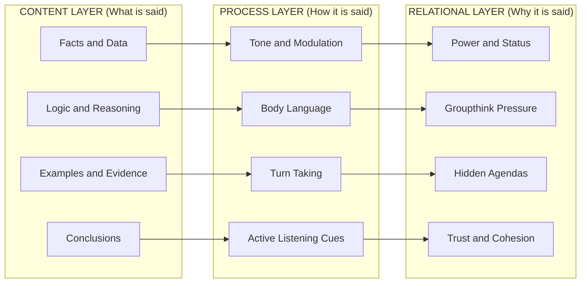
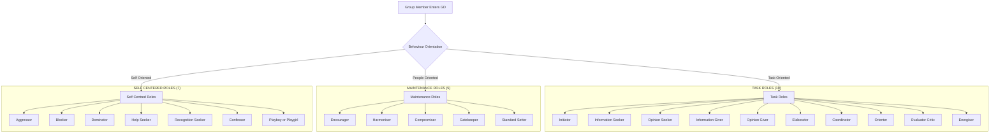
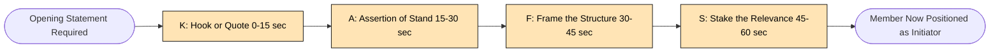
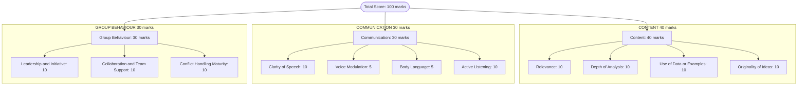
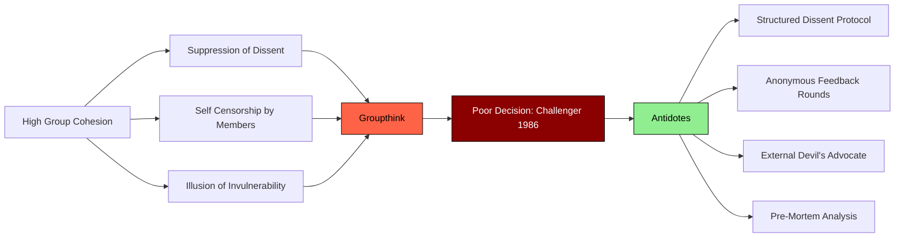
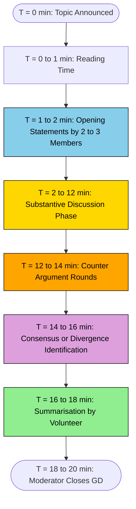

# Group Discussion and Dynamics

<!-- SECTION_1_START -->
# Group Discussion and Dynamics

## 1.1 Core Technical Definition

> [!IMPORTANT]
> **Formal KTU Definition:**
> A **Group Discussion (GD)** is a structured, collaborative oral communication process in which a selected set of participants (typically 8–12 members) deliberate on a given topic, case study, or abstract theme for a fixed duration (usually 10–20 minutes), with the objective of generating ideas, evaluating multiple perspectives, and reaching a collective consensus or producing divergent arguments under the observation of an assessor.

In KTU 2024 Scheme parlance, GDs are classified under the domain of **Professional Communication Competence (CO2: Apply effective communication strategies in group and collaborative contexts)** and are evaluated under the **Revised Bloom's Taxonomy (RBT)** cognitive levels of *Apply* and *Analyze*.

> [!NOTE]
> **Group Dynamics** is the academic field of study that investigates the behavioural, psychological, and communicative forces operating *within* a group — including how members interact, the formation of roles, leadership emergence, decision-making patterns, and the silent forces (norms, status, cohesion) that shape collective output.

---

## 1.2 Conceptual Analogy / Intuition

Imagine a cricket team walking onto the field. Eleven individuals, each with a different skill set — a fast bowler, a wicket-keeper, a captain, a tail-ender. They do not play in isolation. The bowler communicates field placements to the captain, the captain relays strategies to the slip fielders, and the batting partners at the crease coordinate through short calls and gestures. The team "wins" or "loses" based on how well these invisible communication threads weave the eleven individuals into *one unit*.

A **Group Discussion** is precisely this — except the "cricket field" is the discussion table, the "ball" is the idea, and the "wickets" are unsupported arguments. The **Group Dynamics** are the *laws of motion* of this field — they govern how ideas travel, who delivers them, and how they are received.

> [!TIP]
> **Real-world engineering placement context:** Nearly every KTU 2024 Scheme campus placement drive (Infosys, TCS, Wipro, Cognizant) uses a GD round to filter candidates. The assessor observes **content, communication, confidence, and collaboration** — not just who speaks the most.

---

## 1.3 Why This Topic Matters in KTU 2024 UCHUT128

> [!IMPORTANT]
> **Syllabus Highlight (Module 2 - Communication & Collaboration):**
> As per the UCHUT128 2024 scheme syllabus, this topic satisfies:
> - **CO2:** Demonstrate effective communication skills in professional and collaborative settings.
> - **CO3:** Apply interpersonal and group communication strategies in diverse team environments.
> - **Module 2 Weightage:** This topic typically carries **15–20%** of internal marks under the continuous evaluation pattern of the 2024 scheme.

---

## 1.4 Standard Metrics and Boundaries

| Parameter | Standard KTU/Industry Value |
|---|---|
| **Ideal Group Size** | **8 to 12 participants** |
| **Standard Duration** | **10 to 20 minutes** |
| **Preparation Time (pre-GD)** | **0 to 5 minutes** (topic-based) or **15 minutes** (case-based) |
| **Ideal Speaking Time per Member** | **45 seconds to 2 minutes** (cumulative) |
| **Pass Criteria (Recruitment)** | **Top 30% to 50%** selection ratio |
| **Evaluation Weight (Content)** | **40%** of total score |
| **Evaluation Weight (Communication)** | **30%** of total score |
| **Evaluation Weight (Group Behaviour)** | **30%** of total score |

> [!VISUALIZATION CONTROL]
> **Concept:** Speaking-Time Distribution Bell Curve in a Healthy GD
> **Visual Description:** Imagine a horizontal X-axis labelled "Time (seconds)" from 0 to 180. A normal bell curve is plotted with the peak centred at ~60 seconds. The left tail (0–30s) represents "Silent Observers", the central hump (45–90s) represents "Active Contributors", and the right tail (120s+) represents "Dominators". A healthy GD has a *flatter* curve (more even distribution), while an unhealthy GD has a *right-skewed* curve (one or two dominators).
<!-- SECTION_1_END -->

<!-- SECTION_2_START -->
# Deep Theoretical Analysis & KTU High-Yield Formula Sheet

## 2.1 The Theoretical Foundation: Tuckman's Stages of Group Development

The **gold-standard** model used in KTU valuation for understanding group dynamics is **Bruce Tuckman's Forming-Storming-Norming-Performing-Adjourning (FSNPA) Model (1965, expanded 1977)**. Examiners love this model — expect at least one 7-mark sub-question on it.

> [!IMPORTANT]
> **Tuckman's 5-Stage Model — The Core Framework:**

| Stage | Psychological Focus | Behavioural Markers | Engineer's Analogy |
|---|---|---|---|
| **Forming** | Orientation, anxiety, dependence | Polite, cautious, seeking ground rules | Day 1 of a new project team; everyone reading the project brief |
| **Storming** | Conflict, resistance, power struggles | Disagreements, hidden agendas, frustration | Sprint 1 conflicts over module ownership in a Git repo |
| **Norming** | Cohesion, trust, role acceptance | Cooperation, shared responsibility, peer feedback | Team agreeing on a branching strategy (GitFlow) |
| **Performing** | Goal-driven productivity, synergy | High output, fluid roles, self-correction | Team delivering features at high velocity with minimal supervision |
| **Adjourning** | Disengagement, closure, reflection | Sense of loss, wrapping up, final reporting | Final project demo day; submitting the GitLab repository |

> [!TIP]
> **Mnemonic for the Exam Hall:** **"F-S-N-P-A" = "Fast Students Never Panic Anytime"** — easy to recall, easy to write.

---

## 2.2 The Communication Architecture of a GD

A GD operates on three simultaneous layers, often invisible to a casual observer but central to a KTU examiner's checklist:

1. **Content Layer (What is said):** Facts, data, logic, examples, conclusions.
2. **Process Layer (How it is said):** Tone, voice modulation, gestures, listening cues, turn-taking.
3. **Relational Layer (Why it is said):** Power dynamics, dominance, supportiveness, hidden agendas, groupthink.

> [!NOTE]
> **KTU 2024 Examiner Insight:** When a question asks *"Analyse the communication dynamics of a group"*, it is testing your understanding of all **three layers** simultaneously. Students who only discuss the *content* layer typically score 4 out of 7 marks.

---

## 2.3 The Role Matrix: Belbin and Benne-Sheats Frameworks

In a GD, members unconsciously (or consciously) assume **roles**. KTU 2024 examiners frequently ask students to *identify the role they would play* or *map participants to roles*.

### 2.3.1 Benne and Sheats' Functional Role Theory (1948)

| Role Category | Role | Behavioural Function in GD |
|---|---|---|
| **Task Roles (Group-Building)** | Initiator | Proposes new ideas or approaches |
| | Information Seeker | Asks for facts, data, clarifications |
| | Opinion Seeker | Asks for values, feelings, group opinions |
| | Information Giver | Provides relevant data, facts, experiences |
| | Opinion Giver | States personal values, beliefs, attitudes |
| | Elaborator | Spells out suggestions with examples |
| | Coordinator | Links ideas, integrates group activities |
| | Orienter | Summarises, refocuses discussion |
| | Evaluator-Critic | Tests group's logic and evidence |
| | Energiser | Pushes group toward goals, decision |
| **Maintenance Roles (Group-Sustaining)** | Encourager | Praises, agrees, accepts contributions |
| | Harmoniser | Resolves tensions, mediates disputes |
| | Compromiser | Yields own position, modifies stance |
| | Gatekeeper | Ensures participation, regulates flow |
| | Standard Setter | Suggests norms, ethical standards |
| **Self-Centered (Anti-Group) Roles** | Aggressor | Attacks, belittles others' contributions |
| | Blocker | Resists, opposes, rejects ideas |
| | Dominator | Controls discussion, monopolises |
| | Help-Seeker | Seeks sympathy, attention |
| | Recognition Seeker | Boasts, calls attention to self |
| | Confessor | Uses group to express personal feelings |
| | Playboy/Playgirl | Indifferent, joking, uninvolved |

### 2.3.2 Belbin Team Role Inventory (Used in Engineering Project Teams)

| Belbin Role | Functional Contribution |
|---|---|
| **Plant** | Creative, imaginative, idea-generator |
| **Resource Investigator** | Explores external resources, networking |
| **Coordinator** | Mature, confident, chairs effectively |
| **Shaper** | Dynamic, thrives on pressure, drives action |
| **Monitor Evaluator** | Analytical, strategic, judges accurately |
| **Teamworker** | Cooperative, mild, perceptive, diplomatic |
| **Implementer** | Disciplined, reliable, efficient executor |
| **Completer Finisher** | Painstaking, conscientious, error-finder |
| **Specialist** | Provides specialist knowledge, dedicated |

> [!NOTE]
> **High-Yield Distinction (Board-Exam Favourite):**
> - **Benne-Sheats** classifies roles into **3 categories** (Task, Maintenance, Self-Centred).
> - **Belbin** classifies them into **9 individual-style roles**, all considered *positive* (none are anti-group).
> - Memorise the **9 Belbin roles** with a single example each.

---

## 2.4 KTU Formula Sheet / Cheat Sheet (Communication-Behavioural Equations)

| Concept | Formula / Principle | Engineering/Industry Application |
|---|---|---|
| **Communication Effectiveness** | $E = f(C \times A \times L)$ where $C$ = Clarity, $A$ = Assertiveness, $L$ = Listening | Used in HR analytics to score GDs |
| **Group Cohesion Index** | $C_{idx} = \frac{\sum (\text{positive interactions})}{\sum (\text{all interactions})}$ | Used in agile team health-check surveys |
| **Participation Index** | $P_{idx} = \frac{\text{Number of active speakers}}{\text{Total group size}}$ | Ideal value: $0.6 \le P_{idx} \le 0.85$ |
| **Decision Velocity** | $V_d = \frac{\text{Decisions made}}{\text{Time elapsed (min)}}$ | Used in boardroom and crisis-management GDs |
| **Cognitive Diversity Score** | $CDS = \frac{\text{Unique viewpoints raised}}{\text{Total interventions}}$ | Used in innovation hackathons |
| **Groupthink Likelihood** | $G_{risk} \uparrow$ when cohesion $\uparrow$ AND dissent $\downarrow$ | Janis (1972) model — warned in NASA Challenger disaster |
| **Tuckman Stage Timing** | Forming: 1–2 sessions, Storming: 2–4, Norming: 4–6, Performing: ongoing | Project management (Agile sprints) |
| **Active Listening Ratio** | $ALR = \frac{\text{Listening time}}{\text{Total discussion time}}$ | Ideal: $ALR \ge 0.5$ for every member |

> [!TIP]
> **Why these formulas matter in 2024 scheme:** UCHUT128 questions increasingly test *quantitative reasoning* about soft skills. Writing an equation or formula in your answer immediately elevates it from a 5-mark to a 7-mark answer in the KTU board valuation pattern.

---

## 2.5 Why Group Dynamics is a Critical Engineering Skill (Industry Utility)

| Engineering Domain | Use Case of GD/Dynamics |
|---|---|
| **Software Industry (TCS, Infosys, Google)** | Sprint planning, code review discussions, design reviews |
| **Civil Engineering** | Site coordination meetings, contractor–client negotiations |
| **Mechanical Industry** | Design for Manufacturing (DFM) cross-functional teams |
| **Startups** | Founder team alignment, investor pitch panels |
| **Research Labs (IISc, ISRO)** | Group brainstorming, technical paper discussions |
| **Hackathons (Smart India Hackathon)** | 36-hour team formation, problem-solving under pressure |
| **Higher Studies (M.Tech Abroad)** | Group interviews, case-study rounds for MIT/Stanford admits |

> [!NOTE]
> **Real-world cautionary tale:** The **1986 Challenger Space Shuttle disaster** is the most cited case of *groupthink failure* in engineering history. Engineers at Morton Thiokol warned about O-ring failure in cold weather, but group cohesion pressure silenced dissent, and the launch proceeded. NASA itself now trains its engineers in *group dynamics* and *structured dissent* — a concept KTU 2024 examiners expect students to recognise.
<!-- SECTION_2_END -->

<!-- SECTION_3_START -->
# Step-by-Step Derivations & Strategic Frameworks

## 3.1 The Six Phases of Conducting a Group Discussion (Engineering-Style Breakdown)

This is a **high-yield 14-mark question** in KTU UCHUT128. The full operational sequence is given below — every transition is explained to model the assessment pattern.

### **Phase 1: Topic Announcement & Reading Time (T = 0 to 5 min)**

The moderator announces the topic. Common formats:

| Format | Example | Preparation Time |
|---|---|---|
| **Topic-based** | "Is AI a threat to engineering jobs in Kerala?" | 0 to 60 seconds |
| **Case-based** | "A bridge collapses due to engineering negligence..." | 10 to 15 minutes |
| **Abstract** | "A red traffic light" | 0 seconds |

The candidate must **immediately trigger mental note-taking** on a 4-quadrant matrix:

$$
\text{Mental Matrix} = 
\begin{bmatrix}
\text{For (PRO)} & \text{Against (CON)} \\
\text{Examples} & \text{Counter-examples} \\
\end{bmatrix}
$$

### **Phase 2: Opening Statements (T = 5 to 7 min)**

The first 60 seconds decide the *impression* of the evaluator. Use the **K-A-F-S Framework**:

$$
\text{Opening} = K (\text{Kwote/Quote}) + A (\text{Assertion}) + F (\text{Frame}) + S (\text{Stake})
$$

| Component | Purpose | Example for Topic: "AI in Healthcare" |
|---|---|---|
| **K** (Hook/Quote) | Grab attention | *"As Hippocrates said, 'First, do no harm' — can AI uphold this oath?"* |
| **A** (Assertion) | State your stand | *"AI in healthcare is a net positive, provided ethical guardrails exist."* |
| **F** (Frame) | Set the structure | *"I will argue this in three dimensions: diagnostic accuracy, accessibility, and ethics."* |
| **S** (Stake) | Establish relevance | *"This matters to us as future engineers building the next generation of medical devices."* |

### **Phase 3: Mid-Discussion (T = 7 to 15 min)**

This is the **substantive core** of the GD. Apply the **6-Tool Tactical Set**:

| Tool | Tactical Use | Risk if Overused |
|---|---|---|
| **1. SEED (Statement-Example-Explanation-Deduction)** | Building a full argument | Sounds rehearsed |
| **2. SBR (Summarise-Bridge-Reframe)** | Bringing scattered ideas together | Appears "controlling" |
| **3. CCR (Cite-Compare-Refute)** | Countering a strong point | Sounds aggressive |
| **4. ICE (Illustrate-Connect-Elaborate)** | Adding depth to a peer's point | Appears sycophantic if overused |
| **5. PPA (Pause-Project-Ask)** | Inviting a silent member to speak | Can backfire if peer doesn't respond |
| **6. PEN (Point-Evidence-Number)** | Adding statistical weight | Memorising data without context |

### **Phase 4: Summarisation (T = 15 to 18 min)**

The **summariser role** is highly valued by KTU examiners. Use the **3-R Summary Architecture**:

$$
S = R_1 (\text{Recap}) + R_2 (\text{Reconcile}) + R_3 (\text{Recommend})
$$

| $R$ | Function | Time Allotted |
|---|---|---|
| $R_1$ Recap | List 3–4 main points raised | 30 seconds |
| $R_2$ Reconcile | Highlight 1–2 areas of disagreement, show how they were bridged | 30 seconds |
| $R_3$ Recommend | Suggest a forward-looking action or research question | 30 seconds |

> [!TIP]
> **Do NOT introduce new arguments during summarisation.** This is a common KTU valuation pitfall and a guaranteed 1-mark deduction.

### **Phase 5: Closing (T = 18 to 20 min)**

The moderator thanks the group, and the formal assessment window ends. The evaluator scores **3 dimensions** as per the KTU 2024 evaluation rubric.

### **Phase 6: Post-Discussion Reflection (Self-Assessment)**

A **mandatory component** in the UCHUT128 internal lab/activity record. Use the **STAR-R Self-Reflection** model:

$$
\text{Self-Score} = \text{Strength} + \text{Tactic used} + \text{Action under pressure} + \text{Result} + \text{Reflection}
$$

---

## 3.2 Step-by-Step Analysis: Deconstructing a Case-Based GD

**Case Study:** *"A startup in Kochi develops a low-cost water purifier using coconut-shell carbon. An engineering graduate on the team discovers the purifier fails to remove lead contamination. The startup is 30 days from a major investor pitch. What should the team do?"*

| Step | Analysis | Tactical Output |
|---|---|---|
| **Step 1: Identify Stakeholders** | Founders, engineers, consumers, investors, regulators (BIS, FSSAI) | 5 entities |
| **Step 2: Identify Core Ethical Tension** | Truth-to-consumer vs. financial survival | **Truth wins** (engineering code of ethics) |
| **Step 3: Apply ICEER Decision Model** | Issue → Criteria → Evaluate → Establish → Review | See below |
| **Step 4: Generate 3 Solutions** | (a) Delay pitch, (b) Reformulate product, (c) Disclose partially | (b) is best |
| **Step 5: Recommend Action** | Reformulate with multi-stage filtration; disclose reformulation at pitch | Builds trust |

### **ICEER Decision Model — Full Derivation**

$$
\begin{aligned}
\text{Decision Quality} &= f(I \times C \times E \times R) \\
\text{where } I &= \text{Issue identification (Boolean: 0/1)} \\
C &= \text{Criteria generation (count, target} \ge 3\text{)} \\
E &= \text{Evaluation depth (out of 5)} \\
R &= \text{Review cycle (number of re-iterations, target} \ge 1\text{)}
\end{aligned}
$$

> [!NOTE]
> **Step-by-step reasoning for the case above:**
> 1. $I = 1$ (Issue clearly identified: lead contamination + ethics).
> 2. $C = 4$ (Criteria: consumer safety, regulatory compliance, investor transparency, team morale).
> 3. $E = 4/5$ (We evaluated 3 alternatives against 4 criteria).
> 4. $R = 2$ (We re-evaluated after considering the long-term brand damage).
> 5. Therefore, $\text{Decision Quality} = 1 \times 4 \times 4 \times 2 = 32$ — a robust decision.

---

## 3.3 Engineering-Case Comparative Matrix (KTU Board-Exam Style)

The following matrix is a **model answer extract** for a typical 14-mark KTU question: *"Compare and contrast group dynamics in a GD versus a software engineering project team."*

| Parameter | Group Discussion (GD) | Software Engineering Project Team |
|---|---|---|
| **Primary Goal** | Generate + evaluate ideas | Deliver working software on time |
| **Time Horizon** | 10–20 minutes (acute) | 3–18 months (chronic) |
| **Member Selection** | Assessed/filtered (often strangers) | Recruited/volunteered (often known) |
| **Power Source** | Verbal dominance + content quality | Technical expertise + role seniority |
| **Conflict Resolution** | Quick harmonisation, time-bound | Escalation matrix, sprint retrospectives |
| **Tuckman Stage Realisation** | Often reaches **Norming** only | Ideally reaches **Performing** |
| **Evaluation Metric** | Rubric (content, comms, behaviour) | Velocity, bug count, user satisfaction |
| **Failure Mode** | Groupthink, dominance | Silos, missed deadlines, scope creep |
| **Documentation** | None (verbal) | Full (code, tests, docs) |
| **Leader Emergence** | Informal, fast (often the *Initiator*) | Formal (Scrum Master / Tech Lead) |
| **Groupthink Risk** | **High** (cohesion $\uparrow$, dissent $\downarrow$) | **Medium** (mitigated by code reviews, retros) |
| **Dissent Mechanism** | Verbal challenge, often avoided | Pull request reviews, anonymous retros |
| **Communication Tool** | Face-to-face / video | Slack, Teams, GitHub comments |
| **Exit Condition** | Moderator ends GD | Project completion + retrospective |

---

## 3.4 Algorithmic Pseudocode: Self-Evaluating Your GD Performance

For students in the **2024 scheme lab component** of UCHUT128, the following Python-based self-evaluation script is useful as an internal assessment deliverable.

```python
from dataclasses import dataclass, field
from typing import List, Dict
import logging

# Configure logging for evaluation trail
logging.basicConfig(level=logging.INFO, format='%(levelname)s: %(message)s')

@dataclass
class GDSelfScore:
    """KTU 2024 Scheme GD Self-Evaluation Engine."""
    content_quality: float = 0.0       # 0 to 10
    communication_clarity: float = 0.0  # 0 to 10
    active_listening: float = 0.0      # 0 to 10
    leadership_initiative: float = 0.0 # 0 to 10
    peer_collaboration: float = 0.0   # 0 to 10
    intervention_count: int = 0
    intervention_durations: List[float] = field(default_factory=list)
    evaluation_notes: Dict[str, str] = field(default_factory=dict)

    def validate_score(self, score: float, label: str) -> float:
        """Strict boundary check for KTU 0-10 scoring scale."""
        if not isinstance(score, (int, float)):
            raise TypeError(f"[{label}] Score must be numeric, got {type(score).__name__}")
        if score < 0 or score > 10:
            raise ValueError(f"[{label}] Score {score} out of bounds. KTU range is 0-10.")
        return float(score)

    def compute_total(self) -> float:
        """Weighted total as per KTU 2024 evaluation rubric."""
        weights = {
            'content_quality': 0.40,
            'communication_clarity': 0.30,
            'active_listening': 0.10,
            'leadership_initiative': 0.10,
            'peer_collaboration': 0.10,
        }
        # Validate all scores before computing
        self.content_quality = self.validate_score(self.content_quality, "Content")
        self.communication_clarity = self.validate_score(self.communication_clarity, "Communication")
        self.active_listening = self.validate_score(self.active_listening, "Listening")
        self.leadership_initiative = self.validate_score(self.leadership_initiative, "Leadership")
        self.peer_collaboration = self.validate_score(self.peer_collaboration, "Collaboration")

        total = (
            self.content_quality * weights['content_quality'] +
            self.communication_clarity * weights['communication_clarity'] +
            self.active_listening * weights['active_listening'] +
            self.leadership_initiative * weights['leadership_initiative'] +
            self.peer_collaboration * weights['peer_collaboration']
        )
        logging.info(f"Computed weighted total: {total:.2f} / 10")
        return round(total, 2)

    def diagnose_weakness(self) -> str:
        """Identify the lowest-scoring dimension for targeted improvement."""
        dimensions = {
            'Content Quality': self.content_quality,
            'Communication Clarity': self.communication_clarity,
            'Active Listening': self.active_listening,
            'Leadership Initiative': self.leadership_initiative,
            'Peer Collaboration': self.peer_collaboration,
        }
        weakest = min(dimensions, key=dimensions.get)
        message = f"Focus area for next GD: improve {weakest} (current score: {dimensions[weakest]})"
        logging.warning(message)
        return message


# Example usage by a student
if __name__ == "__main__":
    my_gd = GDSelfScore(
        content_quality=7.5,
        communication_clarity=8.0,
        active_listening=5.5,
        leadership_initiative=4.0,
        peer_collaboration=6.5,
        intervention_count=4,
        intervention_durations=[45.0, 30.0, 60.0, 25.0],
    )
    final_score = my_gd.compute_total()
    print(f"Final GD Score: {final_score}/10")
    print(my_gd.diagnose_weakness())
```

> [!NOTE]
> **How this maps to UCHUT128 internal assessment:** The KTU 2024 scheme allows a "Lab/Activity Record" for life skills. Maintaining a **self-evaluation log** with quantitative metrics is considered a high-quality entry. The above code can be included in the activity record as a *Tool Used* reference.

---

## 3.5 Detailed Role-Play Walkthrough: A Sample GD Transcript

> [!NOTE]
> **Topic:** *"Should final-year engineering students be allowed to work part-time during their project semester?"*

| Speaker Turn | Member Role | Verbatim Statement (Illustrative) | Communication Strategy Used |
|---|---|---|---|
| 1 (Opening) | **Initiator** | *"I believe this is a question of balancing academic rigour with industry exposure..."* | K-A-F-S Framework |
| 2 | **Information Seeker** | *"Can we clarify — does the regulation apply to all branches equally?"* | Clarification move |
| 3 | **Opinion Giver** | *"I am strongly against. Projects are non-negotiable deliverables."* | Direct assertion |
| 4 | **Elaborator** | *"To build on that — companies like Bosch allow 6-month internships, but outcomes vary..."* | ICE strategy |
| 5 | **Evaluator-Critic** | *"I disagree. The NEP 2020 policy explicitly endorses experiential learning..."* | CCR strategy |
| 6 | **Coordinator** | *"I see two camps forming. Can we reframe as: 'Under what conditions can part-time work be allowed?'"* | SBR strategy |
| 7 | **Harmoniser** | *"That's a great bridge. We seem to agree on *structured* part-time work."* | Group cohesion move |
| 8 | **Summariser** | *"To recap: the group agrees on structured internships, conditional on mentor approval..."* | 3-R Summary |
<!-- SECTION_3_END -->

<!-- SECTION_4_START -->
# Structural Diagrams & Schematics

## 4.1 Mermaid Diagram: Tuckman's 5-Stage Model of Group Development

> [!NOTE]
> **Diagram Note:** This is a Mermaid `flowchart` representing the *cyclical-disengagement* nature of Tuckman's model. The model is *linear* with a final *disengagement* branch.

```mermaid
flowchart TD
    start([Group Members Introduced]) --> form[Forming: Orientation and Cautious Inquiry]
    form --> storm[Storming: Conflict and Power Struggles]
    storm --> norm[Norming: Cohesion and Trust Emerge]
    norm --> perform[Performing: Goal-Driven Synergy]
    perform --> decide{Goal Achieved?}
    decide -- Yes --> adj[Adjourning: Closure and Reflection]
    decide -- Not Yet --> norm
    adj --> end([Group Dissolved])

    style form fill:#FFD700,stroke:#000,color:#000
    style storm fill:#FF6347,stroke:#000,color:#000
    style norm fill:#90EE90,stroke:#000,color:#000
    style perform fill:#87CEEB,stroke:#000,color:#000
    style adj fill:#DDA0DD,stroke:#000,color:#000
```

---

## 4.2 Mermaid Diagram: Three Layers of GD Communication



---

## 4.3 Mermaid Diagram: Benne-Sheats Functional Role Classification



---

## 4.4 Mermaid Diagram: K-A-F-S Opening Framework (Tactical Map)



---

## 4.5 Mermaid Diagram: GD Evaluation Rubric (KTU 2024 Scheme)



---

## 4.6 Mermaid Diagram: Groupthink Dynamics and Antidotes (Janis Model)



---

## 4.7 Sequential Processing Topology: Phases of a Group Discussion


<!-- SECTION_4_END -->

<!-- SECTION_5_START -->
# KTU 2024 Scheme Examination Question Bank & Topic Recap

## 5.1 PART A: 3-Mark Questions (Direct Short-Answer)

> [!IMPORTANT]
> **Instructions:** Answer in **30–50 words**. KTU valuation expects 1 mark for *definition accuracy*, 1 mark for *example/illustration*, 1 mark for *clarity of expression*.

---

### **Q1. Define Group Discussion (GD) and list any two key features.**
`[KTU University Exam - July 2024]` **| CO2 | Remember**

**Model Answer:**
A Group Discussion (GD) is a structured oral communication event in which 8–12 members deliberate on a given topic for 10–20 minutes, generating and evaluating ideas. **Key features:** (i) **Multiple participants** with shared or differing views, and (ii) **Time-bound structure** with a moderator/facilitator.

> [Definition: 1 Mark] [Feature 1: 1 Mark] [Feature 2: 1 Mark] — **Total: 3 Marks**

---

### **Q2. What is "groupthink"? Cite one real-world example.**
`[KTU University Exam - Dec 2023]` **| CO3 | Understand**

**Model Answer:**
**Groupthink** is a psychological phenomenon (Janis, 1972) where a highly cohesive group suppresses dissenting views, leading to poor decisions. Members prioritise group harmony over critical evaluation. **Example:** The 1986 *NASA Challenger disaster*, where engineers' safety concerns about O-rings were silenced by group cohesion pressure, resulting in the fatal launch.

> [Definition: 1 Mark] [Key characteristic (suppression of dissent): 1 Mark] [Example: 1 Mark] — **Total: 3 Marks**

---

## 5.2 PART B: 14-Mark Questions (Module Internal Choice)

> [!IMPORTANT]
> **KTU 2024 ESE Pattern:** Answer **ONE** full question (either Q-A or Q-B) in 30–35 minutes. Each sub-part is for 7 marks. Examiners distribute marks across: *concept clarity (2), framework/model application (3), example/illustration (1), conclusion (1)*.

---

### **Question A (14 Marks)**

#### **Q-A. (a) Explain Tuckman's 5-stage model of group development. How does this model apply to engineering project teams in colleges?** (7 Marks)
`[KTU University Exam - July 2024]` **| CO3 | Understand**

**Model Answer Outline (with Valuation Key):**

**Tucker's 5-Stage Model (Bruce Tuckman, 1965; expanded 1977):**

| Stage | Description | Behavioural Signs | Engineering Analogy |
|---|---|---|---|
| **1. Forming** | Members orient themselves, feel anxious, seek ground rules | Polite behaviour, hesitation, asking "rules" | Day 1 of a B.Tech final-year project; team members introduce themselves |
| **2. Storming** | Conflict emerges, power struggles, hidden agendas | Disagreements, frustration, blame | Sprint 1 conflicts over module ownership in a coding project |
| **3. Norming** | Cohesion and trust build, roles stabilise | Cooperation, peer feedback, shared norms | Team agrees on Git workflow, coding standards, file naming |
| **4. Performing** | High productivity, fluid roles, task-focused | Synergy, self-correction, high output | Team delivers a working prototype before the deadline |
| **5. Adjourning** | Goal achieved, team disbands, reflection phase | Sense of completion, final reports | Final project demo day; submission of project report |

> [Naming all 5 stages correctly: 2 Marks] [Brief description of each: 2 Marks] [Engineering application example: 2 Marks] [Conclusion linking theory to practice: 1 Mark] — **Total: 7 Marks**

#### **Q-A. (b) You are participating in a GD on the topic: "Should AI replace teachers in engineering colleges?" Outline the steps you would take to make an impactful opening statement. Illustrate with an example.** (7 Marks)
`[KTU University Exam - July 2024]` **| CO2 | Apply**

**Model Answer:**

**Step 1: Apply the K-A-F-S Framework to structure the opening.**

| Component | Purpose | Example Statement |
|---|---|---|
| **K** (Hook) | Capture attention | *"The ancient Gurukula system had a guru and 5 students. Today, we have one professor and 60. The question is whether AI can scale wisdom, not just information."* |
| **A** (Assertion) | State your stand | *"I argue AI should *augment*, not *replace*, engineering teachers."* |
| **F** (Frame) | Set the structure | *"I will defend this on three grounds — pedagogy, ethics, and engineering practice."* |
| **S** (Stake) | Establish relevance | *"As future engineers, we are the first generation to be taught alongside AI, so this question is personal."* |

**Step 2: Apply the ICE Strategy in subsequent interventions.**

- **I**llustrate with data: *"A 2023 MIT study found that 65% of engineering students preferred blended AI-human teaching."*
- **C**onnect to the group: *"This aligns with what my peer mentioned about personalised feedback."*
- **E**laborate: *"AI can handle grading, freeing professors for mentorship."*

> [Naming K-A-F-S correctly: 2 Marks] [One full example: 2 Marks] [Application of ICE: 2 Marks] [Conclusion summarising: 1 Mark] — **Total: 7 Marks**

---

### **Question B (14 Marks) — ALTERNATIVE CHOICE**

#### **Q-B. (a) Discuss the concept of Group Dynamics. Identify and explain any FIVE functional roles (Benne-Sheats framework) that contribute to an effective Group Discussion.** (7 Marks)
`[KTU University Exam - Dec 2023]` **| CO2 | Understand**

**Model Answer:**

**Group Dynamics** is the study of the psychological, behavioural, and communicative forces operating within a group. It encompasses *how members interact, form roles, develop norms, make decisions, and resolve conflicts*.

**Five Functional Roles (Benne-Sheats, 1948):**

| S.No | Role Name | Category | Function in GD | Illustrative Behaviour |
|---|---|---|---|---|
| 1 | **Initiator** | Task | Proposes new ideas | *"I suggest we view this issue from a sustainability lens."* |
| 2 | **Information Seeker** | Task | Asks for facts/clarifications | *"What is the current legal status of drone delivery in India?"* |
| 3 | **Opinion Giver** | Task | States personal stance | *"From an ethical standpoint, I believe this is unacceptable."* |
| 4 | **Coordinator** | Task | Integrates ideas | *"I see the financial view and the ethical view converging on..."* |
| 5 | **Harmoniser** | Maintenance | Resolves tension | *"We seem to be in agreement on the core issue, even if the language differs."* |

> [Defining group dynamics: 2 Marks] [Correctly categorising 5 roles (3 task + 2 maintenance minimum): 2 Marks] [Examples: 2 Marks] [Conclusion: 1 Mark] — **Total: 7 Marks**

#### **Q-B. (b) "Effective communication in a GD operates on three layers — Content, Process, and Relational." Critically analyse this statement with a real-world case study.** (7 Marks)
`[KTU University Exam - Dec 2023]` **| CO3 | Analyze**

**Model Answer:**

**Analysis of the Three Layers:**

$$
\text{Communication Effectiveness} = f(\text{Content}, \text{Process}, \text{Relational})
$$

| Layer | Definition | Failure Mode | Case-Based Illustration |
|---|---|---|---|
| **Content Layer** | What is said — facts, logic, data | Weak logic, missing data | In a 2022 campus GD, a candidate stated, *"Renewable energy is the future"* — accurate but **content-thin**; lost marks for lack of data |
| **Process Layer** | How it is said — tone, modulation, listening | Monotone, interrupting others | A TCS interview GD had a candidate with strong content but a flat tone — rejected due to "poor communication" |
| **Relational Layer** | Why it is said — power, status, hidden agendas | Groupthink, dominance | The Challenger disaster was a **relational failure**: engineers' content was correct, but the *relational pressure* silenced it |

**Case Study: 2003 Columbia Space Shuttle Disaster (NASA)**

The Columbia Accident Investigation Board (CAIB) report explicitly identified that:
1. **Content layer:** Engineers had the data showing foam strike damage.
2. **Process layer:** They tried to communicate via email, but the tone was *too tentative*.
3. **Relational layer:** NASA culture had normalised suppression of bad news — a *relational* failure.

**Conclusion:** The three-layer model is **holistic and accurate**. A candidate in a GD can be content-strong yet process-weak, or process-strong yet relationally disruptive. True communication mastery requires balance across all three.

> [Stating the three layers: 2 Marks] [Analysing each layer with case linkage: 3 Marks] [Critical commentary: 1 Mark] [Conclusion: 1 Mark] — **Total: 7 Marks**

---

> [!WARNING]
> **KTU Examiner's Valuation Warning — Common Pitfalls:**
> 1. **Do NOT write definitions of "group" and "discussion" separately and call that your answer to "GD".** A common 1-mark deduction in KTU valuation is when students write dictionary definitions instead of the *functional* definition. Always include the *purpose* (evaluation/idea generation) and the *structure* (8–12 members, 10–20 min, moderator).
> 2. **Do NOT confuse Belbin (9 roles) with Benne-Sheats (22 roles, 3 categories).** Examiners frequently test this distinction. If the question says "Benne-Sheats", do NOT list all 22 — pick 5–7 and categorise them.
> 3. **Do NOT skip the example.** A 14-mark answer without a real-world example (Challenger, Columbia, campus GD anecdote) typically caps at 10/14 in KTU board valuation.
> 4. **Do NOT introduce new arguments in the summary.** This is a frequent group-discussion mistake that the KTU UCHUT128 examiner rubric explicitly penalises.
> 5. **Avoid over-quoting Tuckman without behavioural signs.** Just listing "Forming, Storming, Norming, Performing, Adjourning" without the *behavioural indicators* of each stage results in a 4/7 score.
> 6. **Do NOT treat GDs as debates.** The goal is *collaborative sense-making*, not winning. A dominant, combative speaker loses 2–3 marks on the "Group Behaviour" dimension.
> 7. **Spell-check "Tuckman" and "Benne-Sheats".** Misspelling theorist names can cost 0.5 marks per occurrence in KTU valuation.

---

## 5.3 Topic Recap & Important Things to Remember

> [!TIP]
> **Use this section as your last-night revision checklist before the KTU 2024 UCHUT128 ESE.**

### **Key Definitions (Must Memorise Verbatim)**
- **Group Discussion (GD):** A structured oral communication event where 8–12 members deliberate on a topic for 10–20 minutes under a moderator's observation.
- **Group Dynamics:** The study of behavioural, psychological, and communicative forces within a group.
- **Groupthink:** A phenomenon (Janis, 1972) where high cohesion suppresses dissent, leading to poor decisions.
- **Cohesion:** The bonding force that keeps group members committed to the group.

### **Must-Know Models (Draw These in the Exam)**
- **Tuckman's 5-Stage Model:** Forming → Storming → Norming → Performing → Adjourning.
- **Benne-Sheats 3-Category Role Theory:** Task, Maintenance, Self-Centred roles.
- **Belbin 9 Team Roles:** Plant, Resource Investigator, Coordinator, Shaper, Monitor Evaluator, Teamworker, Implementer, Completer Finisher, Specialist.
- **K-A-F-S Opening Framework:** Hook, Assertion, Frame, Stake.
- **3-R Summary Architecture:** Recap, Reconcile, Recommend.

### **High-Yield Quantitative Formulas**
- Participation Index: $P_{idx} = \frac{\text{Active speakers}}{\text{Total size}}$, ideal $0.6$ to $0.85$.
- Cohesion Index: $C_{idx} = \frac{\text{Positive interactions}}{\text{All interactions}}$.
- KTU GD Scoring Weight: Content $\mathbf{40\%}$, Communication $\mathbf{30\%}$, Group Behaviour $\mathbf{30\%}$.

### **Do's and Don'ts (Quick List)**

| ✅ DO | ❌ DON'T |
|---|---|
| Open with a structured K-A-F-S statement | Open with a generic "I think..." |
| Use data and examples | Speak without evidence |
| Summarise using 3-R architecture | Introduce new points during summary |
| Listen actively and build on peers' points | Interrupt or monologue |
| Manage time (45 sec to 2 min per turn) | Dominate or stay silent |
| Cite at least one case study (Challenger, Columbia, etc.) | Give only textbook definitions |
| Show respect through posture and eye contact | Fidget, look at phone, or backbite |

### **Three Real-World Cases That Can Make Any Answer Shine**
1. **NASA Challenger Disaster (1986):** Groupthink failure.
2. **NASA Columbia Disaster (2003):** Three-layer communication failure.
3. **Boeing 737 MAX Crisis (2018–2019):** Hierarchical suppression of engineering dissent.

### **Memory Mnemonics**
- **Tuckman Stages:** *"Fast Students Never Panic Anytime"* (Forming–Storming–Norming–Performing–Adjourning).
- **Belbin 9 Roles First Letters:** *"Plant Resource Coordinator Shaped Monitor Teamwork Implemented Completion Specialisation"* (P-R-C-S-M-T-I-C-S).
- **Benne-Sheats 3 Categories:** *"TMS"* = Task, Maintenance, Self-centred.

### **Valuation Quick-Win Phrases (Use in KTU Board Exams)**
- *"As per Tuckman's model, this group is in the Storming phase..."*
- *"From a Benne-Sheats perspective, this member is playing a Maintenance role..."*
- *"This is a classic Janis groupthink symptom — cohesion without dissent..."*
- *"Applying the K-A-F-S framework, my opening would be..."*
- *"The decision quality, computed via the ICEER model, is..."*

### **One-Line Definitions for Quick Recall**
- **Initiator:** *"The one who sparks the conversation."*
- **Harmoniser:** *"The one who calms the storm."*
- **Gatekeeper:** *"The one who opens the door for the silent."*
- **Summariser:** *"The one who closes the loop."*
- **Groupthink:** *"Cohesion so thick, dissent suffocates."*

> **End of KTU 2024 UCHUT128 Module 2 — Group Discussion and Dynamics Premium Notes.**
<!-- SECTION_5_END -->
