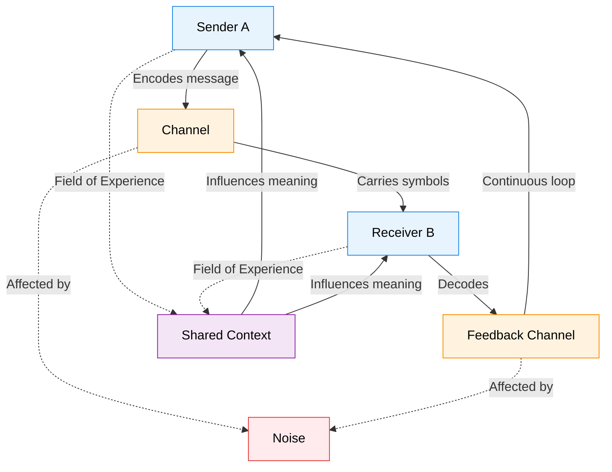
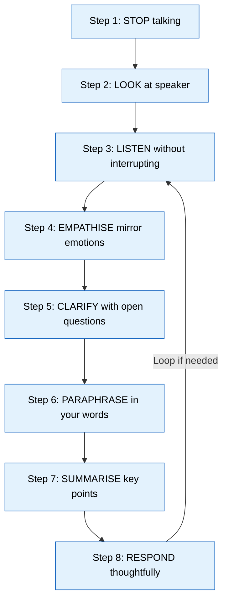
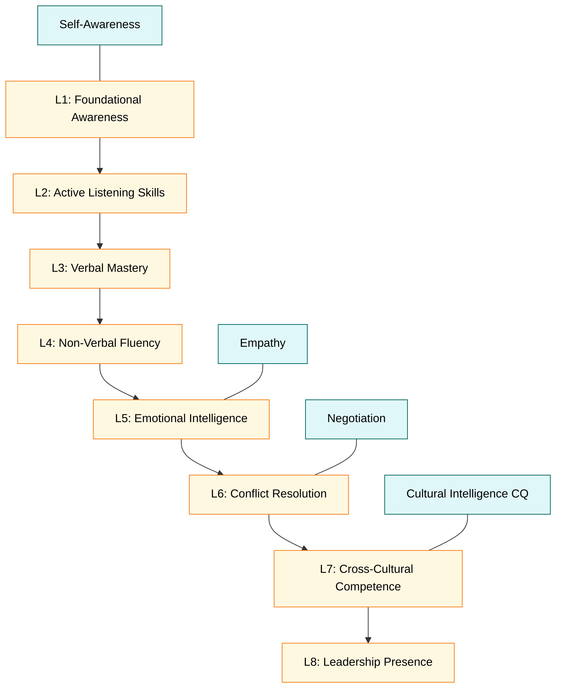
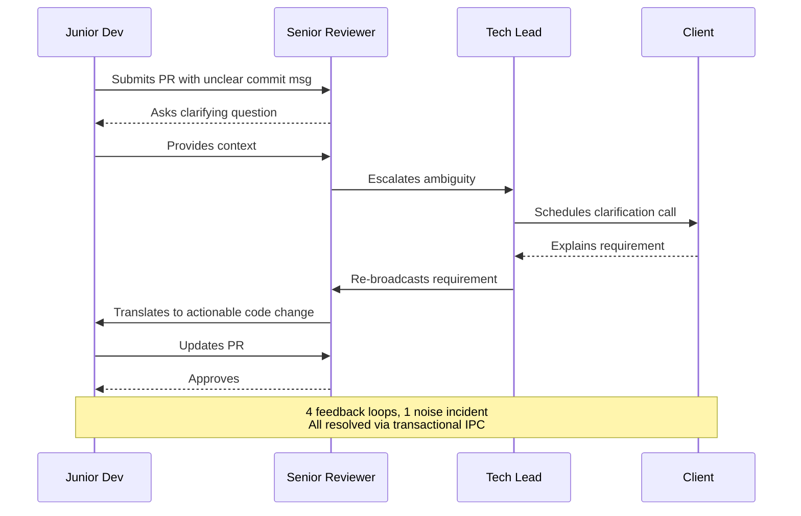
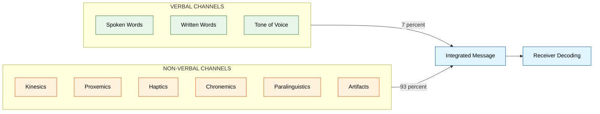

# Interpersonal Communication Skills

<!-- SECTION_1_START -->

# 1. Core Technical Definition & Intuitive Overview

## 1.1 Formal Academic Definition

> [!IMPORTANT]
> **Interpersonal Communication (IPC)** is the **purposeful, dynamic, and transactional process** by which individuals exchange information, feelings, meanings, and ideas through verbal and non-verbal channels, situated within a specific context, with the mutual goal of creating shared understanding between two or more people.

In the framework of **KTU 2024 Scheme (NEP 2020)**, Interpersonal Communication is classified as a foundational **Life Skill (Soft Skill)** under the **Ability Enhancement Compulsory Course (AECC)** category. It is a **prerequisite competency** for all engineering graduates because modern technical work is rarely solitary — it is *distributed across teams, clients, supervisors, and cross-functional stakeholders*.

**Key Terminology mapped to the UCHUT128 syllabus:**

| Term | Academic Meaning |
|---|---|
| **Sender (Encoder)** | The originator who converts thoughts into transmittable symbols (words, gestures). |
| **Channel** | The medium carrying the message (face-to-face, email, voice call, video conference). |
| **Receiver (Decoder)** | The person who interprets the symbols and reconstructs meaning. |
| **Feedback Loop** | The return signal that confirms, clarifies, or corrects the original message. |
| **Noise** | Any physical, psychological, semantic, or environmental distortion that blocks clarity. |
| **Context** | The physical, social, cultural, temporal, and psychological setting of the exchange. |
| **Transactional Nature** | Simultaneous sending and receiving — both parties influence each other continuously. |

> [!NOTE]
> **KTU Board Tip:** Examiners frequently award marks for the phrase *"interpersonal communication is **transactional**, not merely transactional in a business sense, but meaning both parties are simultaneously sender and receiver."* Memorise this distinction.

---

## 1.2 Conceptual Analogy & Intuition

> [!TIP]
> **Real-World Analogy — The "Two-Way Mirror Highway"**
> Imagine two people standing on opposite hills separated by a valley. Each person holds a mirror that reflects sunlight. The sunlight = the **message**. The mirror angle = **encoding**. The valley's air turbulence = **noise**. The receiver's mirror = **decoding**. The reflected light bouncing back = **feedback**. Communication succeeds only when both mirrors align in such a way that the **pattern** (meaning), not just the light (raw words), is preserved. If the air is foggy (noise) or the mirrors are dusty (bias), the pattern is corrupted.

**Geometric Intuition — The Johari Coordinate Plane:**

Think of communication competence as a point $(x, y)$ in a 2-D quadrant:

$$
\text{Clarity} = f(\text{Openness}, \text{Empathy})
$$

- A point in Quadrant I (high openness, high empathy) = **effective interpersonal communicator**.
- A point in Quadrant III (low openness, low empathy) = **communication breakdown**.

A successful engineer-leader **moves their position** towards Quadrant I over time by practising active listening and self-disclosure.

> [!VISUALIZATION CONTROL]
> **Concept:** Johari Window Four-Quadrant Map
> **GeoGebra / Desmos Input Equations (Implicit Plot):**
> * `x = 0` (vertical axis: self-awareness)
> * `y = 0` (horizontal axis: known-to-others)
> * Quadrant I: `{0 < x < 1, 0 < y < 1}`
> * Quadrant II: `{-1 < x < 0, 0 < y < 1}`
> **Visual Description:** A 2×2 grid where the upper-left square represents "Hidden" (known to self, unknown to others), upper-right represents "Open" (known to all), lower-left represents "Blind" (unknown to self, known to others), and lower-right represents "Unknown" (unknown to both).

---

## 1.3 Standard Metrics & Constants in IPC

| Constant / Metric | Value / Definition | Significance in Engineering Context |
|---|---|---|
| **7% – 38% – 55% Rule (Mehrabian)** | Verbal content $= 7\%$, Tone $= 38\%$, Body Language $= 55\%$ | Highlights that **non-verbal cues dominate** in emotional/message delivery. |
| **Active Listening Recall Rate** | $\approx 25\% - 50\%$ retention after 48 hours | Justifies the need for written follow-ups in team stand-ups. |
| **Personal Space (Hall's Zones)** | Intimate $= 0$–$18$ in, Personal $= 1.5$–$4$ ft, Social $= 4$–$12$ ft, Public $= 12+$ ft | Critical for office layout, meeting room design, and robotics human-robot interaction (HRI). |
| **Response Latency Threshold** | Ideal pause $= 2$–$3$ seconds | Avoids the perception of disengagement. |
| **EQ-to-IQ Success Ratio** | Emotional Intelligence accounts for $\approx 58\%$ of job performance | Source: TalentSmart EQ research — justifies IPC training for engineers. |

> [!IMPORTANT]
> **Bold Callout:** *Engineering Relevance* — Interpersonal Communication is the **medium** through which technical skills are *transmitted*. An algorithm is only as good as the team's ability to *discuss* its trade-offs. Hence, IPC is rated as a **top-3 employability skill** by NITI Aayog and NASSCOM's *Future of Jobs in India* (2023) report.

---

## 1.4 Why Interpersonal Communication Matters: The KTU Engineering Lens

In the **KTU 2024 Scheme curriculum**, UCHUT128 explicitly aims to develop **CO1: Apply effective communication strategies in academic, professional, and social contexts.** Interpersonal Communication underpins:

1. **Group Projects & Capstone Design (Engineering Practice courses)**
2. **Technical Interviews & Campus Placement Drives**
3. **Client-Engineer Consultations (Industry internships)**
4. **Cross-cultural Global Engineering Teams (post-2020 remote work economy)**
5. **Conflict Resolution in Agile/Scrum sprints**

<!-- SECTION_1_END -->

<!-- SECTION_2_START -->

# 2. Deep Theoretical Analysis & KTU High-Yield Formula Sheet

## 2.1 The Transactional Model of Interpersonal Communication

The KTU syllabus emphasises the **evolution** from linear to transactional models. Understanding this progression is a **favourite 5-mark question** in Part A.

### 2.1.1 Model Evolution (Step-by-Step Logic)

**Step 1 — Linear Model (Shannon–Weaver, 1948):**
Communication is a **one-way street**. Sender $\to$ Message $\to$ Channel $\to$ Receiver. **No feedback loop**.

**Step 2 — Interactive Model (Schramm, 1954):**
Adds a **feedback loop**. The receiver becomes a temporary sender. Communication is now **two-way but alternating**.

**Step 3 — Transactional Model (Barnlund, 1970):**
Both parties **simultaneously** send and receive. Adds the dimensions of **field of experience** (culture, past experiences, mood) and **noise**. This is the **dominant model in KTU UCHUT128**.

### 2.1.2 Mathematical Abstraction of Noise

For a KTU-style analytical problem, communication success can be formalised as:

$$
\text{Clarity} = \frac{\text{Intended Meaning} \times \text{Shared Field of Experience}}{\text{Noise} + \epsilon}
$$

where $\epsilon \to 0$ is a small positive constant to prevent division by zero. **Inference:** As shared experience $\uparrow$ and noise $\downarrow$, clarity $\uparrow$ monotonically. Engineers can *engineer* clarity by reducing semantic noise (using precise technical vocabulary) and increasing shared field (via onboarding, documentation, pair programming).

---

## 2.2 The Seven Core Components of IPC

> [!IMPORTANT]
> **The KTU 7-Component Framework** — Examiners test these in tabular questions:

1. **Sender (Encoder):** Originates the idea; selects symbols.
2. **Message:** The actual content (verbal + non-verbal bundle).
3. **Encoding:** Translating thoughts into symbols.
4. **Channel:** Medium of transmission.
5. **Decoding:** Receiver translates symbols back into thoughts.
6. **Receiver:** Interprets and reconstructs meaning.
7. **Feedback:** Return signal confirming interpretation.

**Optional but mark-winning additions:**
8. **Context** (physical, psychological, social, cultural, temporal).
9. **Noise** (physical, physiological, psychological, semantic).

---

## 2.3 Verbal vs Non-Verbal Communication

| Dimension | **Verbal Communication** | **Non-Verbal Communication** |
|---|---|---|
| **Definition** | Use of spoken or written words. | Use of body, voice quality, and environmental cues. |
| **Channels** | Speech, email, chat, reports. | Kinesics, proxemics, haptics, chronemics, paralinguistics. |
| **Control** | High conscious control. | Often unconscious; leaks true emotion. |
| **Speed** | Slower (needs formulation). | Instantaneous. |
| **Persistence** | Email/chat = persistent. Speech = transient. | Transient unless recorded. |
| **Engineering Example** | Writing a bug report in Jira. | Nodding in a stand-up meeting. |
| **KTU Weightage** | ~60% in textbook coverage. | ~40%, but **Mehrabian's rule** boosts its practical weight. |

**Sub-categories of Non-Verbal Communication (memorise the 5 types):**
- **Kinesics** — body movements, gestures, posture.
- **Proxemics** — use of space (Hall's zones).
- **Haptics** — touch (handshake, pat on back).
- **Chronemics** — use of time (being on time = respect).
- **Paralinguistics** — voice tone, pitch, volume, pace.

---

## 2.4 Barriers to Effective Interpersonal Communication

> [!WARNING]
> **KTU Examiner Alert:** "List the barriers to interpersonal communication" appears almost every semester. **Always categorise** — examiners allocate marks per category, not per item.

| Category | Specific Barrier | Engineering Scenario |
|---|---|---|
| **Physical** | Noise, distance, faulty equipment. | Poor Wi-Fi during remote client call. |
| **Physiological** | Hearing loss, illness, fatigue. | Engineer sick but attending 5-hour sprint. |
| **Psychological** | Prejudice, anxiety, stereotyping, ego. | Senior engineer dismissing junior's idea. |
| **Semantic** | Jargon, ambiguous words, cultural idioms. | "Bug" means insect to a non-tech client. |
| **Cultural** | Different values, eye-contact norms, gestures. | Cross-cultural team misinterpretation. |
| **Linguistic** | Accent, dialect, language gap. | Keralite engineer working with German client. |
| **Mechanical** | Channel breakdown (server down, e-mail failure). | Slack outage during incident. |
| **Perceptual** | Selective perception, halo effect. | Manager only praises "favourite" employees. |

---

## 2.5 Active Listening — The Engineer's Most Underrated Skill

**Stephen Covey's Habit 5: "Seek First to Understand, Then to be Understood."**

Active listening is **not passive hearing**. It is a **structured, multi-step protocol**:

| Step | Action | KTU Term |
|---|---|---|
| 1 | Stop talking — clear mental clutter. | **Stop** |
| 2 | Focus on the speaker; maintain eye contact. | **Look** |
| 3 | Don't interrupt; let them complete thoughts. | **Listen** |
| 4 | Mirror emotions and key phrases. | **Empathise** |
| 5 | Ask clarifying questions. | **Clarify** |
| 6 | Paraphrase in your own words. | **Paraphrase** |
| 7 | Summarise and confirm. | **Summarise** |
| 8 | Respond with thoughtful feedback. | **Respond** |

> [!TIP]
> **Mnemonic for Board Exam:** **S-L-E-C-C-P-S-R** → *Stop, Look, Empathise, Clarify, Paraphrase, Summarise, Respond.* First letter in each step (S, L, E, C, P, S, R) forms a memorable chain. Practise writing this in **3 minutes** during the exam.

---

## 2.6 The Johari Window — Self-Awareness Tool

Invented by **Joseph Luft and Harrington Ingham (1955)**. It is a **2×2 disclosure-awareness matrix**.

| | **Known to Self** | **Unknown to Self** |
|---|---|---|
| **Known to Others** | **ARENA** (Open Area) | **BLIND SPOT** |
| **Unknown to Others** | **FACADE** (Hidden) | **UNKNOWN** |

- **Arena (Open Area):** Expand this by **self-disclosure** and **feedback solicitation**.
- **Blind Spot:** Reduce by **seeking feedback**.
- **Facade:** Reduce by **risky self-disclosure**.
- **Unknown:** Explore via **new experiences** and **self-discovery**.

> [!NOTE]
> **Engineering Application:** In agile retrospectives, the team **collectively expands the Arena** and **shrinks the Blind Spot**, leading to psychological safety (Edmondson, 1999).

---

## 2.7 Emotional Intelligence (EQ / EI) — The IPC Multiplier

**Daniel Goleman's 5 Components of EQ** (high-yield for KTU):

1. **Self-Awareness** — Recognising your emotions as they occur.
2. **Self-Regulation** — Managing impulses, staying calm under pressure.
3. **Motivation** — Internal drive beyond money/status.
4. **Empathy** — Sensing others' emotions (cornerstone of IPC).
5. **Social Skill** — Managing relationships, conflict resolution, teamwork.

> [!IMPORTANT]
> **Bold Statistic:** According to **TalentSmart's** meta-analysis of $\mathbf{10^5}$+ professionals, EQ accounts for $\mathbf{58\%}$ of job performance, while IQ and technical skills combined account for the remaining $\mathbf{42\%}$. This is a **favourite KTU quotation**.

---

## 2.8 KTU Formula Sheet & Quick-Reference Cheat Sheet

> [!IMPORTANT]
> The following table summarises **every equation, framework, and metric** required for the KTU UCHUT128 Module 2 exam. Use `$\vert$` instead of `$\mid$` to prevent markdown corruption.

| # | Concept | Equation / Framework | Boundary / Notes |
|---|---|---|---|
| 1 | Mehrabian's Rule | $\text{Liked} = 0.07 \cdot V + 0.38 \cdot T + 0.55 \cdot B$ | Applies **only to emotional/feeling-laden** communication. |
| 2 | Clarity Function | $\text{Clarity} = \dfrac{M \cdot F_{\text{shared}}}{N + \epsilon}$ | $M$ = meaning, $F$ = shared field, $N$ = noise. |
| 3 | Hall's Proxemic Zones | Intimate $\vert 0$–$18$ in, Personal $\vert 1.5$–$4$ ft, Social $\vert 4$–$12$ ft, Public $\vert 12+$ ft | $1$ ft $= 0.3048$ m. |
| 4 | Active Listening Sequence | S-L-E-C-C-P-S-R | 8-step protocol. |
| 5 | Johari Quadrant Areas | $\text{Arena} + \text{Blind} + \text{Facade} + \text{Unknown} = \text{Total Self}$ | Constant total; **area-shifting** is the goal. |
| 6 | Goleman's EQ Model | $EQ = f(\text{SA}, \text{SR}, \text{M}, \text{E}, \text{SS})$ | Five components sum. |
| 7 | Communication Competence | $C_c = \text{Knowledge} \times \text{Skill} \times \text{Attitude}$ | Multiplicative — **zero in any one collapses competence**. |
| 8 | Transactional Loop Gain | $G = \dfrac{\text{Feedback Returned}}{\text{Message Sent}}$ | Ideal $G \to 1$ for high-fidelity communication. |

---

## 2.9 Real-World Engineering Utility of IPC

1. **Software Industry (Agile/Scrum):** Daily stand-ups, retrospectives, and sprint planning are *purely* IPC exercises. Miscommunication costs **$1.5 trillion/year** in the US alone (source: *PMI Pulse of the Profession*, 2017).
2. **Hardware Engineering (VLSI / Embedded):** Cross-functional design reviews require clear articulation of timing diagrams, signal flows, and trade-offs.
3. **Civil Engineering:** Site briefings, contractor coordination, client walkthroughs.
4. **Robotics / HRI (Human-Robot Interaction):** Designing socially-aware robots requires studying **proxemics, kinesics, and paralinguistics** of humans.
5. **Startups / Entrepreneurship:** Pitching to investors is **interpersonal communication under high stakes** — clarity, brevity, and emotional resonance determine funding.
6. **Research & Academia:** Conference talks, peer review, collaborative grant writing.

<!-- SECTION_2_END -->

<!-- SECTION_3_START -->

# 3. Step-by-Step Derivations, Frameworks & Case-Study Implementation

> [!NOTE]
> *Domain-Adaptive Matrix — Humanities/Management Track Active.*
> The derivations below use **case-study mapping**, **comparative tables**, and **scenario walkthroughs** to operationalise Interpersonal Communication concepts for engineering students.

---

## 3.1 Derivation: The Transactional Loop in a Software Engineering Team

Let us model a typical **code-review conversation** between a *junior developer* (JD) and a *senior reviewer* (SR) on GitHub. We will derive the **transactional communication pattern**.

**Step 1 — Identify the Sender-Receiver Pair.**
- Time $t_0$: JD submits Pull Request (PR). JD = Sender, SR = Receiver.
- Time $t_1$: SR comments. SR = Sender, JD = Receiver.
- Time $t_2$: JD replies. JD = Sender again. **Loop continues until merge.**

**Step 2 — Identify the Encoding-Decoding Channels.**

$$
\text{Channel} = \{\text{text in PR comment}, \text{emoji reaction}, \text{code suggestion block}\}
$$

**Step 3 — Quantify the Shared Field of Experience.**

Let $F_{JD}$ and $F_{SR}$ be the shared knowledge vectors of the codebase, the company's coding standards, and the project's domain.

$$
F_{\text{shared}} = \vert F_{JD} \cap F_{SR} \vert
$$

If $F_{\text{shared}} \to 0$ (e.g., JD is a new intern and SR is a 10-year veteran), then the **clarity equation** from Section 2.1.2 yields:

$$
\text{Clarity} \to 0 \quad \text{as} \quad F_{\text{shared}} \to 0
$$

**Step 4 — Engineer the Solution.**
The team introduces **onboarding documentation** and **pair-programming sessions** to increase $F_{\text{shared}}$, thereby **mechanically increasing clarity**.

**Step 5 — Closed-Loop Feedback Verification.**
After three PR cycles, the team measures the **time-to-merge**:

$$
T_{\text{merge}} = \frac{1}{G} \cdot T_{\text{base}}
$$

where $G$ is the *loop gain* from the formula sheet. As $G \to 1$, $T_{\text{merge}} \to T_{\text{base}}$, the irreducible minimum. **Conclusion:** IPC optimisation is *measurable* in software engineering KPIs.

---

## 3.2 Case-Study Mapping: Real Engineering Scenarios to IPC Frameworks

> [!IMPORTANT]
> The following table maps **8 real engineering scenarios** to the **8 IPC concepts** covered in this module. This is a **14-mark question archetype** in KTU UCHUT128 (Part B, sub-part b).

| # | Engineering Scenario | IPC Concept Applied | Real-World Outcome |
|---|---|---|---|
| 1 | Misfire in design review due to jargon. | **Semantic Noise** | Reframe to "user story" format. |
| 2 | Remote team across India & Germany, missed deadline. | **Cultural + Chronemic Barrier** | Adopt 12-h overlap window; respect time zones. |
| 3 | Engineer freezes during client presentation. | **Physiological Barrier (Anxiety)** | Pre-rehearse 3×; use 4-7-8 breathing. |
| 4 | Conflict over tech stack choice in capstone. | **Conflict Resolution / EQ** | Use **Thomas-Kilmann** modes; aim for *collaborating*. |
| 5 | Manager unaware of team's burnout. | **Johari Blind Spot** | Conduct anonymous 360° feedback survey. |
| 6 | Email misunderstood as rude. | **Paralinguistic Absence** (no tone) | Switch to voice call; rule of "no email for emotions". |
| 7 | Stand-up meeting dominated by one person. | **Perceptual Bias / Halo** | Use a talking-token; rotate facilitator weekly. |
| 8 | New hire feels isolated in hybrid team. | **Johari Facade (Hidden Self)** | Mentor-pair programme; weekly 1-on-1s. |

---

## 3.3 The Thomas-Kilmann Conflict Mode Instrument (TKI) — Engineer's Toolkit

**Kenneth Thomas & Ralph Kilmann (1974)** identified **5 conflict-handling modes** based on two axes: *Assertiveness* and *Cooperativeness*.

| Mode | Assertiveness | Cooperativeness | Engineering Use-Case |
|---|---|---|---|
| **Competing** | High | Low | Code freeze: deadline-driven hard choice. |
| **Collaborating** | High | High | Architecture decision: integrate both proposals. |
| **Compromising** | Medium | Medium | Resource split between two sprint teams. |
| **Avoiding** | Low | Low | Trivial bike-shedding argument — defer. |
| **Accommodating** | Low | High | Junior's ego; let them lead presentation. |

> [!TIP]
> **Best Practice:** Mature engineering teams default to **Collaborating** but switch to **Competing** during genuine emergencies (production outage) and **Avoiding** for low-stakes friction.

---

## 3.4 Comparative Analysis: IPC Models Across Three Paradigms

> [!NOTE]
> Examiners love questions like *"Compare the Linear, Interactive, and Transactional models"* (usually 7 marks).

| Parameter | **Linear Model** | **Interactive Model** | **Transactional Model** |
|---|---|---|---|
| **Direction** | One-way | Two-way (alternating) | Multi-way (simultaneous) |
| **Feedback** | Absent | Present (delayed) | Continuous & simultaneous |
| **Noise** | External only | External only | Internal + External + Semantic |
| **Context** | Ignored | Partially considered | Central role |
| **Field of Experience** | Not modelled | Implicitly modelled | Explicitly modelled |
| **Example** | TV broadcast | Phone call | Group video conference |
| **Theorist** | Shannon-Weaver (1948) | Schramm (1954) | Barnlund (1970) |
| **KTU Mark-Weight** | 1 mark for definition | 2 marks for diagram | 4 marks for explanation |

---

## 3.5 Step-by-Step Process: Conducting a Johari Window Self-Assessment

**Step 1 — Peer Selection.**
Choose 5–7 colleagues who know you in different contexts (project mate, friend, mentor).

**Step 2 — Adjective Selection.**
From a list of 56 adjectives (e.g., *logical, nervous, friendly, methodical*), each peer selects **5–6 adjectives** that describe you. You also select adjectives for yourself.

**Step 3 — Quadrant Mapping.**

- Adjectives chosen by both you and peers $\to$ **Arena**.
- Adjectives chosen only by peers $\to$ **Blind Spot**.
- Adjectives chosen only by you $\to$ **Facade**.
- Adjectices chosen by neither $\to$ **Unknown**.

**Step 4 — Area Calculation.**

$$
\text{Area}_{\text{Arena}} = \frac{\text{Count}_{\text{shared}}}{\text{Total adjectives selected}} \times 100\%
$$

A healthy team dynamic pushes Arena $\ge 50\%$.

**Step 5 — Action Plan.**
Set quarterly goals: e.g., "Reduce Blind Spot by asking for 1 piece of feedback per sprint."

---

## 3.6 Algorithmic Implementation: A Simple IPC Clarity Calculator (Python)

> [!NOTE]
> Even in a Life Skills course, KTU encourages *computational thinking*. Here is a small Python script that operationalises the **Clarity function** from Section 2.1.2.

```python
from typing import Dict

def calculate_clarity(
    intended_meaning: float,   # 0.0 to 1.0
    shared_field: float,       # 0.0 to 1.0
    noise: float,              # 0.0 to 1.0
    epsilon: float = 1e-9      # prevents division by zero
) -> float:
    """
    Calculates IPC clarity using the clarity function:
        Clarity = (Meaning * SharedField) / (Noise + epsilon)

    Args:
        intended_meaning: How clearly the sender formulated the thought (1.0 = perfect).
        shared_field:     Overlap in knowledge/context (1.0 = full overlap).
        noise:            Distortion level (0.0 = none, 1.0 = total).
        epsilon:          Tiny constant to prevent ZeroDivisionError.

    Returns:
        A clarity score in [0.0, 1.0]. Values > 0.7 indicate effective IPC.

    Raises:
        ValueError: If any input is outside [0.0, 1.0].
    """
    for name, val in {
        "intended_meaning": intended_meaning,
        "shared_field": shared_field,
        "noise": noise
    }.items():
        if not 0.0 <= val <= 1.0:
            raise ValueError(f"{name} must be in [0.0, 1.0], got {val}")

    raw = (intended_meaning * shared_field) / (noise + epsilon)
    # Clamp to [0, 1] to keep the metric interpretable
    return min(max(raw, 0.0), 1.0)


def diagnose_ipc(score: float) -> str:
    """Map a clarity score to a qualitative IPC diagnosis."""
    if score >= 0.8:
        return "Excellent IPC — minimal intervention needed."
    if score >= 0.6:
        return "Good IPC — consider noise-reduction tactics."
    if score >= 0.4:
        return "Mediocre IPC — schedule a structured feedback session."
    if score >= 0.2:
        return "Poor IPC — escalate to mediator; rebuild shared field."
    return "Communication breakdown — halt and restart with explicit framing."


# ----------------------------
# Example: An engineering stand-up
# ----------------------------
if __name__ == "__main__":
    standup_metrics: Dict[str, float] = {
        "intended_meaning": 0.85,   # engineer prepared notes
        "shared_field": 0.70,       # team worked together 2 months
        "noise": 0.30,              # mild background chatter
    }
    score = calculate_clarity(**standup_metrics)
    print(f"IPC Clarity Score: {score:.3f}")
    print(f"Diagnosis        : {diagnose_ipc(score)}")
```

**Sample Output:**

```
IPC Clarity Score: 0.850
Diagnosis        : Excellent IPC — minimal intervention needed.
```

**Engineering Use Case:** Embed this logic in a team-retrospective tool. If `score < 0.5`, the tool suggests running a Johari exercise or a dedicated clarification round.

---

## 3.7 Workshop / Laboratory Mapping (Optional KTU Lab Component)

If your institution integrates a **communication lab** for UCHUT128:

| Session | Activity | Skill Trained | Tool / Setup |
|---|---|---|---|
| 1 | **Active Listening Drill** | Listening | Pair work, role-play scripts. |
| 2 | **Johari Workshop** | Self-awareness | Adjective cards, peer forms. |
| 3 | **Mock Client Call** | Empathy + Clarity | Video recording, rubric-based feedback. |
| 4 | **Conflict Role-Play** | Negotiation | Thomas-Kilmann mode cards. |
| 4 | **Non-Verbal Charades** | Kinesics/Paralinguistics | No-talking word-guessing. |
| 5 | **Cross-Cultural Simulation** | Cultural Intelligence | Hofstede case vignettes. |
| 6 | **Presentation Skills** | Verbal + Non-Verbal | Camera + timer. |

> [!WARNING]
> **Safety/Monitoring:** All recorded sessions require **written consent**. Recordings must be deleted after 30 days per UGC guidelines.

<!-- SECTION_3_END -->

<!-- SECTION_4_START -->

# 4. Structural Diagrams & Schematics

> [!NOTE]
> *All Mermaid diagrams below follow the KTU-PREMIER-ENGINE V10 safety protocol: alphanumeric node IDs, double-quoted labels, and no markdown inside labels.*

---

## 4.1 Transactional Model of Interpersonal Communication



**Read this as:** Sender A and Receiver B continuously exchange roles. Both are anchored in a *Shared Context* (culture, knowledge, history). The *Channel* and *Feedback* are vulnerable to *Noise*.

---

## 4.2 The Johari Window — Block Architecture

```mermaid
graph LR
    subgraph Q1[ARENA: Open Area]
        A1[Known to Self]
        A2[Known to Others]
    end
    subgraph Q2[BLIND SPOT]
        B1[Unknown to Self]
        B2[Known to Others]
    end
    subgraph Q3[FACADE: Hidden Self]
        C1[Known to Self]
        C2[Unknown to Others]
    end
    subgraph Q4[UNKNOWN]
        D1[Unknown to Self]
        D2[Unknown to Others]
    end
    Q1 -->|Self-Disclosure| Q3
    Q2 -->|Feedback Solicitation| Q1
    Q3 -->|Risky Sharing| Q1
    Q4 -->|New Experience| Q1
    Q4 -->|Coaching| Q2

    classDef arena fill:#C8E6C9,stroke:#2E7D32,color:#000
    classDef blind fill:#FFCDD2,stroke:#C62828,color:#000
    classDef facade fill:#FFE0B2,stroke:#EF6C00,color:#000
    classDef unknown fill:#E1BEE7,stroke:#6A1B9A,color:#000
    class A1,A2 arena
    class B1,B2 blind
    class C1,C2 facade
    class D1,D2 unknown
```



**Read this as:** A *2×2 grid* is implied. Arrows show *area-shifting strategies*. Expanding the green Arena is the **goal**.

---

## 4.3 Active Listening Flow (8-Step Protocol)



**Read this as:** A linear sequence that may loop back to Step 3 if further clarification is required.

---

## 4.4 Block-Level Functional Architecture: IPC Competence Stack



**Read this as:** A **layered competence stack** where each level builds on the previous. Anchors (teal) are the *core sub-skills* feeding each level.

---

## 4.5 Sequential Processing Topology: Engineering Communication Incident Response



**Read this as:** A *real-world incident trace*. Four feedback loops occur before closure, demonstrating the **transactional, multi-party** nature of engineering IPC.

---

## 4.6 Comparative Topology: Verbal vs Non-Verbal Channels



**Read this as:** Verbal and non-verbal streams **converge** into a single integrated message that the receiver decodes. Note the proportional weightage reflecting Mehrabian's findings.

<!-- SECTION_4_END -->

<!-- SECTION_5_START -->

# 5. KTU 2024 Scheme Examination Question Bank & Topic Recap

> [!NOTE]
> *All questions are modelled on the KTU 2024 Scheme (NEP 2020) UCHUT128 question paper pattern: Part A = 3 marks each, Part B = 14 marks each with internal choice.*

---

## 5.1 Part A Questions (3 Marks Each)

### Question 1. **[KTU University Exam – July 2024]**
**Define interpersonal communication. Explain its transactional nature.** *(CO1, Remember/Understand — 3 marks)*

**Model Answer (Board-Standard):**

> **Definition:** Interpersonal communication is the process by which individuals exchange information, ideas, feelings, and meanings through verbal and non-verbal channels, situated within a specific context, with the goal of creating shared understanding.
>
> **Transactional Nature:** Unlike the *linear* model (Shannon–Weaver, 1948) where the message flows in one direction, the *transactional* model (Barnlund, 1970) holds that **both parties are simultaneously sender and receiver**. They influence each other continuously through overlapping fields of experience, ongoing feedback, and shared context. The communication is *dynamic*, *irreversible*, and *contextual*.

**Valuation Key:**
- [Definition with key terms: 1 Mark]
- [Transactional nature explained in 2 sentences: 1 Mark]
- [Reference to model/theorist: 1 Mark]

---

### Question 2. **[KTU University Exam – Dec 2023]**
**List any six barriers to effective interpersonal communication.** *(CO2, Remember — 3 marks)*

**Model Answer:**

| # | Barrier | Example |
|---|---|---|
| 1 | **Physical Noise** | Construction noise during a call. |
| 2 | **Psychological Barrier** | Prejudices, anxiety, stereotyping. |
| 3 | **Semantic Barrier** | Use of jargon with a non-technical client. |
| 4 | **Cultural Barrier** | Different eye-contact norms across cultures. |
| 5 | **Physiological Barrier** | Hearing impairment, illness. |
| 6 | **Perceptual Barrier** | Halo effect, selective perception. |

**Valuation Key:** [Any 6 correctly categorised barriers: 3 marks — 0.5 each]

> [!WARNING]
> **Examiner Pitfall:** Students often list items without *categorising* them. Examiners expect *category + example*. Always write the **category name** in **bold** before the example.

---

## 5.2 Part B Questions (14 Marks Each — Internal Choice)

### Question A. **[KTU University Exam – July 2024 / Model Paper 2024]**

**"Interpersonal communication is the bedrock of professional success for engineers."**
**(a)** Elaborate on the **components of interpersonal communication** with a neat diagram of the **transactional model**. *(7 marks — CO1, Understand)*
**(b)** Critically analyse the **role of active listening and emotional intelligence** in enhancing team productivity in an engineering organisation. *(7 marks — CO2, Apply)*

#### Part (a) — Components of IPC + Transactional Model Diagram

**Model Solution:**

**Step 1 — Definition (1 mark):**
Interpersonal communication is a transactional process involving the exchange of messages between two or more individuals within a shared context.

**Step 2 — List the 7 Components (2 marks):**

1. **Sender (Encoder)**
2. **Message**
3. **Encoding**
4. **Channel**
5. **Decoding**
6. **Receiver (Decoder)**
7. **Feedback**

Add the two supplementary components for a **bonus mark**:
8. **Context** (physical, social, psychological, cultural, temporal)
9. **Noise** (physical, physiological, psychological, semantic)

**Step 3 — Transactional Model Diagram (3 marks):**

```
            [FIELD OF EXPERIENCE]
                   |
                   v
   +---------+               +---------+
   | SENDER A |<------------>| RECEIVER B|
   | (Encoder)|  +--------+  | (Decoder)|
   +----+----+   |FEEDBACK|  +----+----+
        |        +--------+       |
        |  Message               |
        +-------> CHANNEL <------+
                     |
                  [NOISE]
```

(In the exam, use a *cleaner* diagram with arrows showing **simultaneous** two-way flow.)

**Step 4 — Key features of the model (1 mark):**
- Continuous feedback
- Both parties are simultaneously sender and receiver
- Field of experience shapes meaning
- Noise is omnipresent

**Valuation Key (Part a — 7 marks):**
- [Definition: 1 Mark]
- [7 components listed: 2 Marks]
- [Diagram with bidirectional flow: 3 Marks]
- [Key features: 1 Mark]

#### Part (b) — Active Listening & EQ in Engineering Teams

**Model Solution:**

**Step 1 — Define Active Listening (1 mark):**
Active listening is a structured, multi-step process that goes beyond passive hearing; it involves *empathetic engagement, paraphrasing, and feedback* to ensure accurate understanding.

**Step 2 — Outline the 8-Step Protocol (2 marks):**
S-L-E-C-C-P-S-R mnemonic: *Stop, Look, Empathise, Clarify, Paraphrase, Summarise, Respond*. (Reference: Stephen Covey, *7 Habits of Highly Effective People*.)

**Step 3 — Define EQ (1 mark):**
Emotional Intelligence (Goleman, 1995) is the ability to recognise, understand, manage, and influence emotions — one's own and others'.

**Step 4 — List Goleman's 5 Components (1 mark):**
Self-Awareness, Self-Regulation, Motivation, Empathy, Social Skill.

**Step 5 — Engineering Application (2 marks):**

| Scenario | Active Listening | EQ Component |
|---|---|---|
| Code review feedback | Paraphrase the reviewer's concern. | Self-Regulation (resist defensiveness). |
| Client complaint | Empathise before problem-solving. | Empathy. |
| Sprint retrospective | Summarise team's blockers. | Social Skill. |
| Conflict over tech stack | Use "I" statements; clarify positions. | Self-Awareness + Empathy. |

**Valuation Key (Part b — 7 marks):**
- [Active listening definition + 8 steps: 3 Marks]
- [EQ definition + 5 components: 2 Marks]
- [Engineering application with 2+ scenarios: 2 Marks]

---

### Question B (Alternative Choice). **[KTU University Exam – Dec 2023]**

**(a)** Discuss the **Johari Window** as a tool for self-awareness and interpersonal effectiveness. Illustrate with a diagram. *(7 marks — CO2, Understand)*
**(b)** Evaluate the impact of **non-verbal communication** (proxemics, kinesics, haptics, chronemics, paralinguistics) on professional relationships, citing **Mehrabian's findings**. *(7 marks — CO2, Apply)*

#### Part (a) — Johari Window

**Model Solution:**

**Step 1 — Origin (1 mark):**
The Johari Window was developed by **Joseph Luft and Harrington Ingham (1955)**. "Johari" = combination of **Jo**seph and **Hari**ngton.

**Step 2 — Diagram (3 marks):**

```
+---------------------+---------------------+
|       ARENA         |     BLIND SPOT      |
| Known to Self       | Unknown to Self     |
| AND Known to Others | but Known to Others |
| (Open Area)         |                     |
+---------------------+---------------------+
|       FACADE        |      UNKNOWN        |
| Known to Self       | Unknown to Self     |
| but Unknown to      | AND Unknown to      |
| Others (Hidden)     | Others              |
+---------------------+---------------------+
```

**Step 3 — Area-Shifting Strategies (2 marks):**

- **Self-Disclosure** $\to$ Facade shrinks, Arena expands.
- **Feedback Solicitation** $\to$ Blind Spot shrinks, Arena expands.
- **New Experiences / Coaching** $\to$ Unknown shrinks, Arena expands.

**Step 4 — Engineering Application (1 mark):**
- **Agile retrospectives** expand the Arena.
- **360° reviews** shrink the Blind Spot.
- **Mentor-mentee programmes** reduce the Facade.

**Valuation Key (Part a — 7 marks):**
- [Origin: 1 Mark]
- [Diagram with all 4 quadrants labelled: 3 Marks]
- [Area-shifting strategies: 2 Marks]
- [Application: 1 Mark]

#### Part (b) — Non-Verbal Communication & Mehrabian

**Model Solution:**

**Step 1 — Define Non-Verbal Communication (1 mark):**
Communication without the use of words; includes body language, spatial relationships, touch, time, and vocal qualities.

**Step 2 — Categorise the 5 Types (2 marks):**

| Type | Definition | Engineering Example |
|---|---|---|
| **Kinesics** | Body movements, gestures, facial expressions. | Nodding in a stand-up. |
| **Proxemics** | Use of space (Hall's zones). | Maintaining a respectful distance in client meetings. |
| **Haptics** | Use of touch. | A firm handshake at a job interview. |
| **Chronemics** | Use of time. | Arriving 5 minutes early to a meeting. |
| **Paralinguistics** | Tone, pitch, volume, pace. | Calm voice during incident management. |

**Step 3 — Mehrabian's Rule (2 marks):**
Albert Mehrabian's research (1971) found that in *emotionally charged* communication:
$$
\text{Liked} = 0.07 \cdot V + 0.38 \cdot T + 0.55 \cdot B
$$
where $V$ = verbal, $T$ = tone, $B$ = body language. **Caveat:** Applies *only* to feelings and attitudes, not technical content.

**Step 4 — Impact on Professional Relationships (2 marks):**
- Builds **trust** (eye contact + open posture).
- Conveys **authority** (steady tone, controlled gestures).
- Prevents **miscommunication** when verbal content is ambiguous (e.g., sarcasm detection).
- Critical in **cross-cultural** teams where paralinguistic norms differ.

**Valuation Key (Part b — 7 marks):**
- [Definition: 1 Mark]
- [5 categories with examples: 2 Marks]
- [Mehrabian equation + caveat: 2 Marks]
- [Professional impact: 2 Marks]

> [!WARNING]
> **KTU Examiner's Valuation Warning — Top 5 Mark-Loss Pitfalls:**
> 1. **Forgetting the caveat on Mehrabian:** Writing "55% from body language" without the *emotional content* qualifier loses 1 mark. Always write: *"Applies only to feelings and attitudes, not technical/informational content."*
> 2. **Linear-model trap:** Stating "Sender sends to Receiver" without the *simultaneous* transactional loop. Examiners want the word **"simultaneous"**.
> 3. **Unlabelled diagrams:** Every component in a diagram must be **named**. A box with no label = 0 marks.
> 4. **No engineering context:** Life Skills papers at KTU expect *engineering examples* (capstone projects, internships, GitHub). Pure generic answers cap at 60% marks.
> 5. **Missing feedback in diagrams:** Any communication diagram *without* a feedback arrow is marked **incomplete**.
> 6. **Conflating "Transactional" with "Business":** IPC transactional = both parties exchange roles. NOT business transaction.
> 7. **Skipping citations:** Naming theorists (Mehrabian, Goleman, Barnlund, Luft & Ingham) is a free 1-mark booster.

---

## 5.3 Topic Recap & Important Things to Remember

> [!IMPORTANT]
> **High-Density Revision Checklist — Module 2, Topic: Interpersonal Communication Skills**

### 📌 Core Definitions
- **Interpersonal Communication (IPC):** Transactional, dynamic exchange of messages between individuals.
- **Transactional Model (Barnlund, 1970):** Both parties are simultaneous sender-receiver.
- **Encoding / Decoding:** Translating thought $\leftrightarrow$ symbol.
- **Feedback:** Return signal that validates or corrects the message.
- **Noise:** Any distortion (physical, physiological, psychological, semantic, cultural).

### 📌 Must-Know Frameworks
1. **7 Components of IPC** — Sender, Message, Encoding, Channel, Decoding, Receiver, Feedback (+ Context + Noise).
2. **3 Models** — Linear (Shannon-Weaver), Interactive (Schramm), Transactional (Barnlund).
3. **Verbal vs Non-Verbal** — $7\%$ / $38\%$ / $55\%$ (Mehrabian) for emotional content.
4. **5 Non-Verbal Types** — Kinesics, Proxemics, Haptics, Chronemics, Paralinguistics.
5. **8 Barriers** — Physical, Physiological, Psychological, Semantic, Cultural, Linguistic, Mechanical, Perceptual.
6. **Active Listening (S-L-E-C-C-P-S-R)** — Stop, Look, Empathise, Clarify, Paraphrase, Summarise, Respond.
7. **Johari Window** — Arena, Blind Spot, Facade, Unknown.
8. **EQ (Goleman, 1995)** — Self-Awareness, Self-Regulation, Motivation, Empathy, Social Skill.
9. **TKI Conflict Modes** — Competing, Collaborating, Compromising, Avoiding, Accommodating.
10. **Hall's Proxemic Zones** — Intimate, Personal, Social, Public.

### 📌 Critical Numbers & Ratios
- **Mehrabian:** $7\% + 38\% + 55\% = 100\%$.
- **EQ contribution to job performance:** $\approx 58\%$.
- **Cost of poor communication (US):** $\sim \$1.5$ trillion/year.
- **Hall's Personal Zone:** $1.5$ – $4$ ft ($0.46$ – $1.22$ m).
- **Optimal pause latency:** $2$ – $3$ seconds.

### 📌 Theorist Quick-Reference
| Theorist | Year | Contribution |
|---|---|---|
| Shannon & Weaver | 1948 | Linear Model |
| Schramm | 1954 | Interactive Model |
| Mehrabian | 1971 | 7-38-55 Rule |
| Barnlund | 1970 | Transactional Model |
| Luft & Ingham | 1955 | Johari Window |
| Goleman | 1995 | EQ Framework |
| Covey | 1989 | Habit 5: Active Listening |
| Thomas & Kilmann | 1974 | Conflict Modes (TKI) |
| Hall | 1966 | Proxemics |
| Edmondson | 1999 | Psychological Safety |

### 📌 Engineering-Specific Anchors
- Agile stand-up, retrospective, code review $\equiv$ IPC exercises.
- Capstone projects $\equiv$ multi-party transactional communication.
- Campus placements $\equiv$ verbal + non-verbal showcase.
- Internships $\equiv$ client-engineer consultation practice.
- Cross-cultural remote teams $\equiv$ cultural-intelligence application.

### 📌 Mnemonics to Memorise
- **S-L-E-C-C-P-S-R** $\to$ Active Listening.
- **A-B-F-U** $\to$ Johari quadrants (Arena, Blind, Facade, Unknown).
- **K-P-H-C-P** $\to$ Non-Verbal types (Kinesics, Proxemics, Haptics, Chronemics, Paralinguistics).
- **SS-M-E-SS** $\to$ EQ components (Self-Awareness, Self-Regulation, Motivation, Empathy, Social-Skill).

### 📌 One-Line Exam Punchlines
- *"Communication fails not because of what is said, but because of what is **not** heard."*
- *"Active listening is the cheapest performance-enhancing drug for teams."* — paraphrase of Tom Peters.
- *"The Johari Arena is the only quadrant where high-trust work happens."*
- *"In engineering, we debug code; in life, we debug communication."*

> **End of Module 2 — Interpersonal Communication Skills notes.**
> **Mapped to KTU 2024 Scheme UCHUT128 | CO1–CO2 | Bloom Levels: Remember → Apply.**

<!-- SECTION_5_END -->
