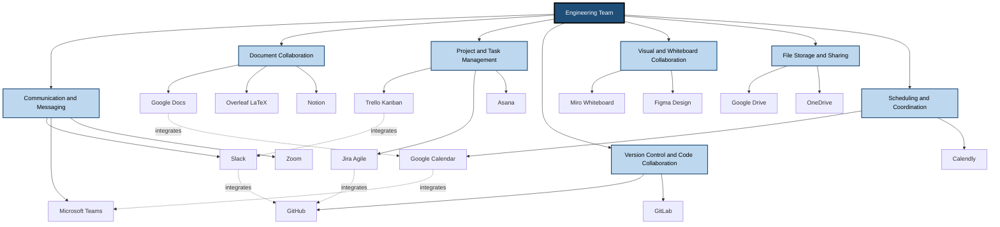
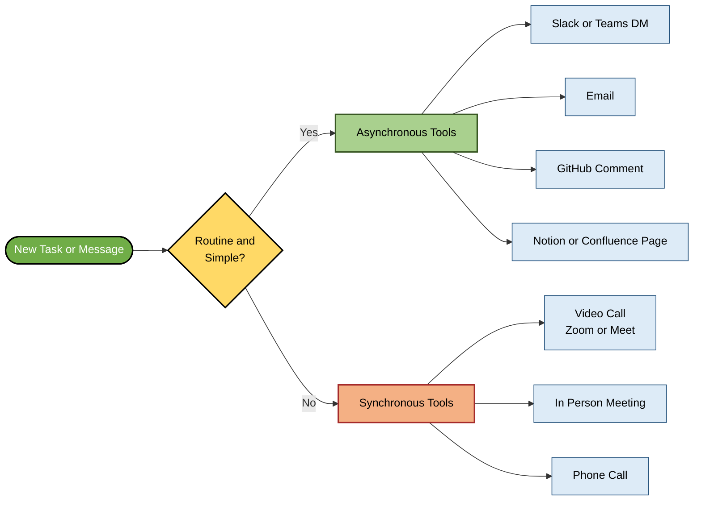
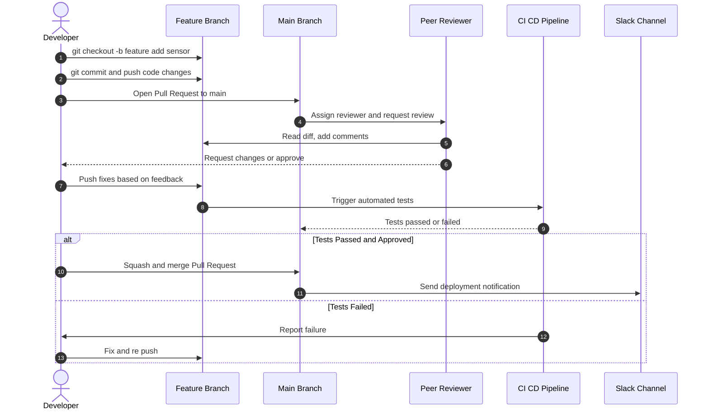
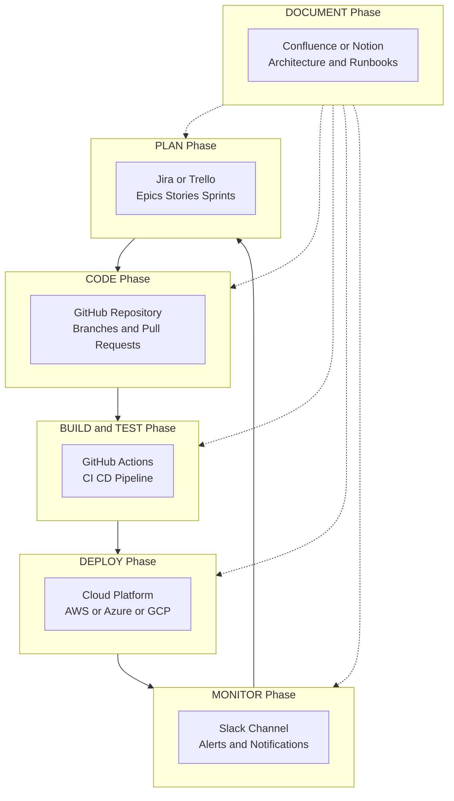

# Online Collaboration Tools and Platforms

<!-- SECTION_1_START -->
# Online Collaboration Tools and Platforms

> [!NOTE]
> **Formal Definition (KTU 2024 Syllabus Terminology):**
> Online collaboration tools and platforms are **cloud-based, internet-enabled software ecosystems** that allow geographically dispersed individuals and teams to **communicate, coordinate, co-create, share resources, and manage projects in real-time or asynchronously**, regardless of device or location. They form the digital backbone of modern **hybrid workplaces, distributed engineering teams, and academic project groups**.

> [!IMPORTANT]
> **KTU 2024 Scheme Highlight (Module 2 - Communication & Collaboration):**
> This topic is mapped to **CO2: Communicate effectively in professional and collaborative environments using appropriate digital tools and platforms.** Engineers must demonstrate competence in selecting the *right tool* for the *right collaborative task* — communication, document co-authoring, version control, project tracking, or video conferencing.

## Conceptual Analogy / Intuition

Think of an **online collaboration platform as a digital workshop**.
- A carpenter needs a **workbench, hammer, saw, and measuring tape** — each tool has a specific job.
- Similarly, an engineer writing a research paper with 4 teammates across India, Germany, and Japan needs a **shared document (Google Docs)** to write together, a **chat app (Slack)** to discuss, a **video tool (Zoom)** to meet, a **project board (Trello)** to track tasks, and a **code repository (GitHub)** to share code.
- Just as you wouldn't use a hammer to cut wood, you wouldn't use email to manage an Agile sprint or use WhatsApp to formally review a design document.

> [!TIP]
> **The Three Pillars of Online Collaboration:**
> 1. **Synchronous** (real-time): Zoom, Google Meet, Microsoft Teams calls.
> 2. **Asynchronous** (anytime): Email, Slack threads, Notion pages, GitHub issues.
> 3. **Hybrid (sync + async)**: Microsoft Teams, Slack, Google Workspace.

### Classification of Online Collaboration Tools

| **Category** | **Primary Function** | **Real-World Engineering Use Case** |
|---|---|---|
| **Communication & Messaging** | Text, voice, video chat | Daily stand-ups, quick clarifications, incident alerts |
| **Document Collaboration** | Co-authoring, version tracking | Writing SRS docs, joint research papers, shared lab reports |
| **Project & Task Management** | Workflow, deadlines, kanban | Sprint planning (Scrum), Gantt charts, milestone tracking |
| **Version Control & Code Collaboration** | Source code hosting, branching, peer review | Team software projects, open-source contributions |
| **Visual & Whiteboard Collaboration** | Brainstorming, diagramming | System design sessions, architecture mapping (UML, ER) |
| **File Storage & Sharing** | Centralized cloud drives | Sharing CAD files, datasets, design assets |
| **Scheduling & Coordination** | Meeting planning, calendar sync | Cross-timezone team meetings, deadline alerts |

> [!VISUALIZATION CONTROL]
> **Concept:** The Collaboration Tool Ecosystem Map
> **Visual Description:** Picture a central hub labeled "Engineering Team Project" with seven spokes radiating outward — each spoke represents a tool category. A small icon on each spoke represents a specific tool (e.g., GitHub icon on the Version Control spoke, Trello on Project Management). Arrows between spokes show data flow (e.g., a GitHub commit notification flowing into Slack).
> **Concept Tool Mapping (Text Form):**
> * Central Node: `ProjectHub` (e.g., the final product / deliverable)
> * Spoke 1: `Communicate` $\to$ `Slack / Teams / Zoom`
> * Spoke 2: `CoAuthor` $\to$ `Google Workspace / MS Office 365 / Notion`
> * Spoke 3: `Track` $\to$ `Trello / Asana / Jira`
> * Spoke 4: `Code` $\to$ `GitHub / GitLab / Bitbucket`
> * Spoke 5: `Visualize` $\to$ `Miro / Figma / Lucidchart`
> * Spoke 6: `Store` $\to$ `Google Drive / OneDrive / Dropbox`
> * Spoke 7: `Schedule` $\to$ `Google Calendar / Calendly`
<!-- SECTION_1_END -->

<!-- SECTION_2_START -->
# Deep Theoretical Analysis & KTU High-Yield Feature Sheet

## 1. The Theoretical Framework: Why Online Collaboration Tools Exist

The **shift from co-located to distributed work** is driven by four converging forces that KTU expects students to understand:

1. **Globalization of engineering teams** — multinational R\&D, offshoring, BPO/KPO industries.
2. **COVID-19 acceleration** — the 2020–2022 pandemic institutionalized remote/hybrid work as the *default*, not the exception.
3. **Cloud computing maturity** — broadband, 4G/5G, and SaaS made real-time co-authoring feasible.
4. **Agile and DevOps methodologies** — these demand *continuous communication*, *shorter feedback loops*, and *transparent workflows*, all of which require dedicated digital infrastructure.

> [!NOTE]
> **Core Engineering Insight:**
> Online collaboration tools are not just "chat apps." They implement **Computer-Supported Cooperative Work (CSCW)** — a sub-field of Human-Computer Interaction (HCI) that studies how groups work together via technology. The two key dimensions are:
> * **Time:** Synchronous vs. Asynchronous
> * **Space:** Co-located vs. Distributed
> Online collaboration platforms primarily address the **asynchronous + distributed** quadrant, while integrating synchronous features (video calls).

## 2. The KTU High-Yield Feature Comparison Sheet

> [!IMPORTANT]
> **The following table is the single most important revision artifact for this topic. KTU examiners love asking students to "compare" or "justify the choice of" collaboration platforms.**

### A. Communication & Messaging Platforms

| **Tool** | **Best For** | **Key Engineering Feature** | **Free Tier Limit** | **Sync/Async** |
|---|---|---|---|---|
| **Slack** | Dev teams, tech startups | Channel-based threading, 2400+ integrations (GitHub, Jira) | 90-day message history | Both |
| **Microsoft Teams** | Enterprises, KTU 2024 recommended for academic use | Deep MS Office 365 integration, breakout rooms | Unlimited chat, 100 participants | Both |
| **Discord** | Communities, hobby dev groups | Voice channels, low-latency audio, persistent servers | Unlimited | Both |
| **Google Chat** | Google Workspace users | Direct integration with Gmail, Google Docs, Meet | Included in Workspace | Both |
| **Zoom** | Video-first meetings, webinars | HD video, breakout rooms, virtual backgrounds | 40 min / meeting (group) | Sync |

### B. Document Collaboration Platforms

| **Tool** | **Co-Authoring** | **Offline Mode** | **Version History** | **Best For** |
|---|---|---|---|---|
| **Google Docs / Sheets / Slides** | Real-time, up to 100 users | Yes (Chrome extension) | Unlimited revisions (with timestamps) | Academic reports, KTU lab records |
| **Microsoft Office 365 (Word/Excel/PowerPoint Online)** | Real-time, up to 50 users | Yes (desktop app) | 30 days (extended with subscription) | Formal IEEE/ACM paper drafting |
| **Notion** | Block-based, real-time | Yes | 7-day page history (free) | Knowledge bases, project wikis |
| **Confluence (Atlassian)** | Page-based, real-time | Limited | Full (with subscription) | Enterprise documentation, DevOps runbooks |
| **Overleaf (LaTeX)** | Real-time LaTeX co-editing | No | Git-backed full history | Research papers, theses (KTU final year project reports) |

### C. Project & Task Management Tools

| **Tool** | **Methodology Support** | **Visualization** | **Best Engineering Use** |
|---|---|---|---|
| **Trello** | Kanban (basic) | Kanban board, cards, lists | Small team task tracking, KTU mini-projects |
| **Asana** | Multiple (List, Board, Timeline, Calendar) | Gantt, Kanban, Calendar | Cross-functional project planning |
| **Jira** | Scrum, Kanban, SAFe (Agile) | Scrum board, backlog, sprints, burndown | Software engineering sprints |
| **Monday.com** | Custom workflows | Gantt, Kanban, Calendar, Timeline | Engineering R\&D project tracking |
| **ClickUp** | All-in-one (tasks, docs, chat, goals) | Multiple views | Startups wanting one unified platform |

### D. Version Control & Code Collaboration

| **Tool** | **VCS Backend** | **Code Review** | **CI/CD Integration** | **Free for Public Repos** |
|---|---|---|---|---|
| **GitHub** | Git | Pull Requests, code owners | GitHub Actions (free 2000 mins/month) | Yes, unlimited |
| **GitLab** | Git (self-hostable) | Merge Requests, code owners | GitLab CI/CD (built-in) | Yes, unlimited |
| **Bitbucket** | Git | Pull Requests, code insights | Bitbucket Pipelines | Yes, up to 5 users |
| **SourceForge** | Git, SVN, CVS | Reviewing system | Limited | Yes |

> [!WARNING]
> **KTU Common Mistake:** Students often confuse "file storage" tools (Google Drive, Dropbox) with "code collaboration" tools (GitHub, GitLab). They serve fundamentally different purposes. Drive stores *artefacts*; Git tracks the *history of every change* with branching, merging, and peer review.

## 3. The "Choose the Right Tool" Decision Matrix

A frequently tested KTU question is: *"Your team is building a mobile app. Which collaboration tools would you use and why?"* Here is the **engineering decision framework**:

$$\text{Tool Selection} = f(\text{Team Size}, \text{Workflow Methodology}, \text{Output Type}, \text{Security Needs})$$

Where:
- **Team Size** $\to$ small teams (2–5) benefit from Trello + Slack + GitHub; large teams (50+) need Jira + Teams + Confluence.
- **Workflow Methodology** $\to$ Agile/Scrum needs Jira or Trello; Waterfall needs MS Project or Monday.com.
- **Output Type** $\to$ code (GitHub), documents (Google Docs/Overleaf), designs (Figma), hardware schematics (Drive + versioned naming).
- **Security Needs** $\to$ proprietary R\&D demands on-premise GitLab + encrypted Slack Enterprise Grid.

> [!TIP]
> **Real-World Engineering Utility:**
> In production environments, an integrated **"DevOps Collaboration Stack"** looks like this:
> * **Plan:** Jira (epics, stories, sprints)
> * **Code:** GitHub (repositories, pull requests)
> * **Build/Test:** GitHub Actions or Jenkins (CI/CD pipelines)
> * **Communicate:** Slack (deploy notifications, alerts)
> * **Document:** Confluence or Notion (architecture decisions, runbooks)
> This stack is the de-facto industry standard used by Google, Microsoft, Amazon, and countless startups. Familiarity with this stack is now a **non-negotiable skill** for any B.Tech graduate entering the software industry.

## 4. Etiquette and Best Practices (High-Yield for Viva)

> [!IMPORTANT]
> **KTU frequently tests Netiquette (Network Etiquette) within this topic. Memorize the following rules:**
> * **Response time norms:** Reply to work messages within **4 working hours**; emergencies via phone.
> * **Status indicators:** Use "Available / Busy / In a meeting / Do not disturb" honestly.
> * **Channel discipline:** Keep Slack/Teams channels topic-specific (`#design-review`, `#bug-fixes`, `#random`).
> * **Async-first culture:** Default to written updates; meetings only when written updates are insufficient.
> * **Recording consent:** Always seek permission before recording video calls.
> * **Timezone respect:** Use World Time Buddy or Google Calendar's timezone overlay for global teams.
<!-- SECTION_2_END -->

<!-- SECTION_3_START -->
# Step-by-Step Use-Case Implementations

## Implementation 1: Setting Up a KTU Final-Year Project Collaboration Stack

**Scenario:** You and three classmates are building an IoT-based Air Quality Monitoring system for your KTU B.Tech final-year project. Walk through, step by step, how you would set up a professional online collaboration workflow.

### Step 1 — Create a Shared Workspace on a Cloud Drive
Sign up for **Google Workspace for Education** (free with a `.edu` email or via KTU's partner program). Create a folder structure:

$$\text{Root Folder: AQM-IoT-Project} \to \begin{cases} \text{/01\_Proposal} \\ \text{/02\_Literature\_Survey} \\ \text{/03\_Design} \\ \text{/04\_Code} \\ \text{/05\_Testing} \\ \text{/06\_Report} \\ \text{/07\_Presentation} \end{cases}$$

Share with all members using **"Editor" access** for everyone except the project guide, who is given **"Commenter"** access.

### Step 2 — Choose a Communication Channel
Open **Slack** (or **Microsoft Teams**, which is bundled with KTU student Office 365 licenses in many Kerala colleges). Create a workspace `AQM-IoT-2025` with the following channels:

$$\text{Channels} = \begin{cases} \text{\#general} \to \text{announcements only} \\ \text{\#daily-standup} \to \text{each member posts daily progress} \\ \text{\#hardware} \to \text{circuit, sensor, ESP32 discussions} \\ \text{\#software} \to \text{code, API, database discussions} \\ \text{\#blockers} \to \text{flag issues needing immediate help} \\ \text{\#random} \to \text{non-work banter} \end{cases}$$

### Step 3 — Set Up a Project Board on Trello (or Jira, if your college uses it)
Create a Kanban board with four columns:

$$\text{Trello Columns} = \begin{cases} \text{Backlog} \to \text{every pending idea/task} \\ \text{To Do} \to \text{prioritized for the current sprint} \\ \text{In Progress} \to \text{actively being worked on} \\ \text{Done} \to \text{completed and verified} \end{cases}$$

Add cards such as:
* `Design PCB schematic` $\to$ assigned to *Anand* $\to$ due *Week 2*
* `Write MQTT publisher code` $\to$ assigned to *Devika* $\to$ due *Week 3*
* `Build React dashboard` $\to$ assigned to *Rahul* $\to$ due *Week 4*
* `Write final report (LaTeX)` $\to$ assigned to *Sneha* $\to$ due *Week 6*

### Step 4 — Set Up Code Collaboration on GitHub
1. One member creates an organization `aqm-iot-ktu` on GitHub.
2. Create a repository `aqm-firmware` for ESP32 code and `aqm-dashboard` for the web app.
3. Add all three teammates as collaborators.
4. Establish a **branching strategy**:

$$\text{Main Branch Policy} = \begin{cases} \text{main} \to \text{protected; deployable code only} \\ \text{develop} \to \text{integration branch} \\ \text{feature/*} \to \text{each feature in its own branch} \end{cases}$$

5. **Pull Request (PR) workflow:**
   * Member creates branch `feature/mqtt-publisher`.
   * Member pushes code and opens a **Pull Request** to `develop`.
   * At least **one peer reviewer** must approve.
   * Squash-merge to `develop` after CI/CD tests pass.

### Step 5 — Schedule Recurring Meetings on Google Calendar
Create a recurring event:

$$\text{Weekly Sync} = \begin{cases} \text{Day} \to \text{Saturday} \\ \text{Time} \to \text{10:00 \text{ AM} - \text{11:00 \text{ AM} IST}} \\ \text{Platform} \to \text{Google Meet (link auto-attached)} \\ \text{Agenda} \to \text{share Google Doc 24 hrs prior} \end{cases}$$

### Step 6 — Co-Author the Report on Overleaf
1. Create an Overleaf project using the **IEEE Conference Template** (recommended for KTU project reports).
2. Invite all members.
3. Use `\section{}` blocks for modular writing:

```latex
\documentclass[conference]{IEEEtran}
\title{IoT-Based Air Quality Monitoring System}
\author{
  \IEEEauthorblockN{Anand K., Devika M., Rahul S., Sneha P.}
  \IEEEauthorblockA{Department of ECE\\
  ABC College of Engineering, Kerala\\
  Email: anand.k@example.edu}
}
\begin{document}
\maketitle
\begin{abstract}
This project presents a low-cost IoT-based air quality
monitoring system using ESP32 and MQ-135 sensors...
\end{abstract}
\section{Introduction}
\section{Literature Survey}
\section{System Design}
\section{Implementation}
\section{Results and Discussion}
\section{Conclusion}
\end{document}
```

> [!NOTE]
> **Resulting Workflow:** Every team member now has a *single source of truth* for code (GitHub), tasks (Trello), documents (Google Drive + Overleaf), and conversation (Slack). The project guide can review progress asynchronously, and the team can demonstrate **professional software engineering hygiene** during the KTU final viva.

---

## Implementation 2: Engineering Case Frameworks Mapped to Regulatory/Systemic Matrices

> [!IMPORTANT]
> **As a humanities/management topic within KTU's UCHUT128 syllabus, the following extended comparative analysis is required. This maps real-world engineering collaboration case frameworks to professional, regulatory, and systemic matrices.**

### Case Framework Matrix: Industry Adoption of Online Collaboration Tools

| **Industry / Sector** | **Primary Collaboration Need** | **Tool Stack Used** | **Regulatory / Systemic Constraint** | **Communication Protocol** |
|---|---|---|---|---|
| **Software Product Companies (Infosys, TCS, Google)** | Agile sprints, code reviews, on-call alerts | Jira + GitHub + Slack + Confluence | ISO 27001, GDPR data residency | Async-first with daily 15-min stand-up |
| **Aerospace \& Defense (DRDO, ISRO, Boeing)** | Secure design docs, classified CAD sharing | On-premise GitLab + encrypted Teams | ITAR (US), Official Secrets Act (India) | Need-to-know basis, audit logs |
| **Healthcare \& Biotech (Apollo, Pfizer)** | HIPAA-compliant document sharing, telemedicine | MS Teams Healthcare + SharePoint + Doximity | HIPAA, ABDM (India) | Patient data anonymized, E2E encrypted |
| **Education \& EdTech (KTU, NPTEL, Coursera)** | Lecture recording, assignment grading, group projects | Google Workspace + Zoom + Moodle | KTU academic policy, UGC guidelines | Recorded lectures, plagiarism check via Turnitin |
| **Manufacturing \& Industry 4.0 (Tata Steel, Bosch)** | IoT dashboards, remote diagnostics, plant-floor coordination | Siemens Teamcenter + MS Teams + IoT platform | IEC 62443 industrial cybersecurity | Plant-floor radio + Teams for management |
| **Civil Engineering \& Construction (L\&T, Afcons)** | BIM model co-authoring, site photos, contractor coordination | Autodesk BIM 360 + Procore + WhatsApp | RERA, environmental clearances | Site photos geotagged, daily progress reports |
| **Banking, Financial Services \& Insurance (RBI, SBI, HDFC)** | Secure customer data, audit trails, regulatory reporting | MS Teams + SharePoint + ServiceNow | RBI Cyber Security Framework, PCI-DSS | Encrypted, 7-year audit log retention |
| **Open-Source Communities (Linux, Mozilla, Apache)** | Distributed global contributors, code review, RFC discussions | GitHub + Discord + mailing lists + Discourse | GPL/Apache/MIT licenses, Contributor License Agreements (CLA) | Public, transparent, RFC process |

### Systemic Communication-Channel Selection Matrix

| **Situation / Need** | **Recommended Channel** | **Why (Engineering Rationale)** | **Anti-Pattern (What NOT to do)** |
|---|---|---|---|
| Quick question to a teammate | Slack DM or Teams chat | Asynchronous, searchable, low friction | Sending an email with subject "Quick question" |
| Code review feedback | GitHub Pull Request comment | Inline, attached to code, audit-trailed | Verbally telling someone "fix line 47" |
| Sensitive HR issue | In-person or 1:1 video call with HR | Confidential, no digital footprint | Discussing in a public Slack channel |
| Large file (>25 MB) | Google Drive / OneDrive link | Email attachment limits exceeded | Trying to email a 200 MB CAD file |
| Decision that affects the whole team | Dedicated meeting + written Minutes of Meeting (MoM) | Documented, citable, auditable | Casual decision made in a DM |
| Emergency production outage | Phone call + incident Slack channel | Speed + audit trail for post-mortem | Waiting for a scheduled meeting |
| Coordinating across 3+ time zones | Async written update (Notion / Confluence page) | Respects sleep schedules, creates record | Scheduling a midnight meeting |
| Brainstorming visual ideas | Miro or FigJam board | Spatial, visual, supports sticky notes | Long text threads with no visual anchor |

> [!TIP]
> **The "Richness" Rule for Tool Selection:**
> Use **Media Richness Theory** (Daft \& Lengel, 1986) — match the *richness* of the medium to the *equivocality* (ambiguity) of the message:
> $$\text{Lean Medium (Email, Chat)} \to \text{simple, routine messages}$$
> $$\text{Rich Medium (Video, Face-to-Face)} \to \text{complex, ambiguous, emotionally charged topics}$$
> *Example:* Disagreeing with your project guide on the choice of microcontroller = **rich medium** (in-person or video call). Asking "What's the Wi-Fi password?" = **lean medium** (chat).

### KTU-Focused Implementation: Asynchronous vs. Synchronous Decision Tree

```
Is the message simple, factual, and routine?
├── YES → Use async (chat, email, comment)
│         ├── Need a record? → Email / Confluence page
│         ├── Need speed? → Slack / Teams DM
│         └── Need code-specific? → GitHub comment
└── NO  → Use sync (call / meeting)
          ├── <4 people, <15 min → Quick huddle (Slack huddle / Teams call)
          ├── >4 people, decisions needed → Scheduled video meeting with agenda
          └── Conflict / sensitive → In-person or 1:1 video
```
<!-- SECTION_3_END -->

<!-- SECTION_4_START -->
# Structural Diagrams & Schematics

## Diagram 1: The Online Collaboration Tool Ecosystem (Mermaid Flowchart)



## Diagram 2: Synchronous vs. Asynchronous Decision Topology



## Diagram 3: GitHub Pull Request Workflow (Engineering Code Collaboration)



## Diagram 4: Modular DevOps Collaboration Stack (Subgraph Architecture)


<!-- SECTION_4_END -->

<!-- SECTION_5_START -->
# KTU 2024 Scheme Examination Question Bank

> [!NOTE]
> All questions below are modeled on the KTU 2024 Scheme End-Semester Examination (ESE) pattern for **UCHUT128 — Life Skills and Professional Communication**, Module 2 (Communication & Collaboration). Each question is tagged with the mapped Course Outcome (CO) and Revised Bloom's Taxonomy (RBT) level.

---

## Part A — Short Answer Questions (3 Marks Each)

### Question 1: `[KTU University Exam — July 2024]`
**Define online collaboration tools. List any four popular online collaboration platforms with their primary use.** (3 Marks) [CO2, Remember]

**Model Answer:**

**Definition:** Online collaboration tools are cloud-based software applications that enable individuals and teams to work together over the internet by facilitating communication, document sharing, task management, and project coordination in real-time or asynchronously, regardless of geographical location. (1 Mark)

**Four Popular Platforms with Primary Use:** (2 Marks — 0.5 each)

| **Platform** | **Primary Use** |
|---|---|
| **Microsoft Teams** | Integrated chat, meetings, file sharing, and Office 365 collaboration |
| **Google Workspace (Docs/Sheets/Slides)** | Real-time co-authoring of documents, spreadsheets, and presentations |
| **GitHub** | Source code hosting, version control, and pull-request based code review |
| **Trello** | Visual Kanban-based project and task management |

---

### Question 2: `[KTU University Exam — Dec 2023]`
**Distinguish between synchronous and asynchronous communication with two examples each.** (3 Marks) [CO2, Understand]

**Model Answer:**

| **Parameter** | **Synchronous Communication** | **Asynchronous Communication** |
|---|---|---|
| **Definition** | Real-time interaction where all participants are present simultaneously | Communication where participants respond at their own convenience |
| **Timing** | Immediate | Delayed |
| **Example 1** | Zoom video call | Email |
| **Example 2** | In-person meeting | Slack message in a channel |

(1 Mark for definition of each + 0.5 Marks per example = 3 Marks)

---

## Part B — Long Answer Questions (14 Marks Each)

> [!IMPORTANT]
> **KTU ESE Module Internal Choice Pattern:** Students must answer EITHER Question A OR Question B (full 14 marks). Each question has two sub-parts of 7 marks each, mapped to escalating cognitive levels.

---

### Question A (14 Marks): `[KTU University Exam — July 2024]`

**(a)** Explain the major **categories of online collaboration tools** used in modern engineering teams. For each category, name one tool and describe its key feature. (7 Marks) [CO2, Understand]

**Model Answer — (a):**

Online collaboration tools can be broadly classified into the following categories: (7 Marks — 1 Mark per category + 0.5 Marks for tool name + 0.5 Marks for key feature of the best-listed example)

**1. Communication and Messaging Tools**
*Tool Example:* **Slack**
*Key Feature:* Channel-based threaded conversations with 2400+ third-party integrations (GitHub, Jira, Google Drive). It supports both one-on-one and group DMs, voice huddles, and persistent searchable history, making it the de-facto messaging backbone of software engineering teams.

**2. Document Collaboration Tools**
*Tool Example:* **Google Docs**
*Key Feature:* Real-time co-authoring where up to 100 users can edit a document simultaneously, with automatic saving to cloud, full version history with timestamps, granular share permissions, and offline editing via Chrome extension.

**3. Project and Task Management Tools**
*Tool Example:* **Jira**
*Key Feature:* Native support for Agile methodologies (Scrum and Kanban) with sprint planning, backlog grooming, burndown charts, story-point estimation, and custom workflow automation. It is the industry standard for software engineering project tracking.

**4. Version Control and Code Collaboration Tools**
*Tool Example:* **GitHub**
*Key Feature:* Distributed Git repositories with branch-based workflows, Pull Requests for peer code review, code-owner enforcement, GitHub Actions for CI/CD, and issue tracking integrated directly with the codebase.

**5. Visual and Whiteboard Collaboration Tools**
*Tool Example:* **Miro**
*Key Feature:* Infinite digital canvas with sticky notes, mind maps, wireframes, and templates for brainstorming, system design, and UML diagramming. Supports real-time multi-user cursors and voting.

**6. File Storage and Sharing Tools**
*Tool Example:* **Google Drive**
*Key Feature:* 15 GB free cloud storage, granular permission control (Viewer, Commenter, Editor), link-sharing with expiry, full-text search across PDFs and images via OCR, and seamless integration with Google Docs/Sheets/Slides.

**7. Scheduling and Coordination Tools**
*Tool Example:* **Google Calendar**
*Key Feature:* Multi-calendar overlay for timezones, smart meeting scheduling that auto-attaches Google Meet links, RSVP tracking, and seamless sync with Gmail for event creation from email content.

> **[Valuation Key: Naming the category: 1 Mark. Naming one tool: 0.5 Mark. Explaining its key feature: 0.5 Mark — total 7 categories × 1 Mark = 7 Marks]**

---

**(b)** You are leading a team of **five B.Tech students** working on a KTU final-year project titled **"AI-based Crop Disease Detection using Drone Imaging."** Design a complete **online collaboration workflow** for this team, justifying each tool choice. (7 Marks) [CO2, Apply]

**Model Answer — (b):**

**Step 1: Communication — Microsoft Teams** (1 Mark)
A dedicated workspace `CropAI-2025` is created with channels: `#general` (announcements), `#daily-standup` (each member posts progress), `#ml-models` (AI/ML discussions), `#drone-hardware` (drone + Raspberry Pi discussions), and `#blockers`. Teams is chosen because it is officially provided free to KTU students via Office 365 and integrates seamlessly with the other Microsoft tools used.

**Step 2: Document Collaboration — Google Docs + Overleaf** (1 Mark)
* The **project proposal, literature survey, weekly progress reports, and final presentation slides** are co-authored on Google Docs for easy real-time editing and commenting by the project guide.
* The **final KTU project report** is written on **Overleaf (LaTeX)** using the IEEE Conference template, as it provides professional typesetting, mathematical equation support, and Git-backed version history — all critical for an AI/ML paper-style report.

**Step 3: Project and Task Management — Trello (Kanban Board)** (1 Mark)
A Trello board is created with columns `Backlog`, `To Do`, `In Progress`, `Review`, and `Done`. Example cards: `Collect Kaggle plant-disease dataset` (assigned to Member 1), `Train ResNet-50 model` (Member 2), `Configure DJI Tello drone SDK` (Member 3), `Build Streamlit dashboard` (Member 4), `Write final report` (Member 5). Trello is chosen for its simplicity and visual clarity for a 5-member team; for a larger team, Jira would be more appropriate.

**Step 4: Code Collaboration — GitHub** (1.5 Marks)
* Create a GitHub organization `cropai-ktu-2025` with two repositories: `cropai-ml` (Python ML code) and `cropai-drone` (drone control code).
* Implement a **branching strategy**: `main` is protected; all work happens on `feature/*` branches; Pull Requests require at least one peer approval and passing CI tests.
* **GitHub Actions** automatically run unit tests and linting on every PR.
* **Justification:** Git is the industry standard for version control; the team learns industry-grade practices (peer review, CI/CD) that boost placement readiness.

**Step 5: File Storage — Google Drive** (0.5 Mark)
* A shared Drive folder `CropAI-2025` stores large assets: the 5 GB PlantVillage dataset, drone-captured raw images, trained model checkpoints (`.h5`, `.pt`), and recorded demo videos that exceed Git's 100 MB file limit.

**Step 6: Scheduling — Google Calendar + Zoom** (1 Mark)
* A recurring weekly sync is scheduled every **Saturday 10 AM–11 AM IST** on Google Calendar with an auto-attached Google Meet link.
* All team members are also added to a shared `KTU Submission Deadlines` calendar with reminders 1 week, 3 days, and 1 day before each milestone (Phase 1 report, Phase 2 review, final viva).

**Step 7: Visual Collaboration — Miro** (0.5 Mark)
* A Miro whiteboard is used during the initial system-design session to draft the end-to-end pipeline (Drone $\to$ Image Capture $\to$ Edge Pre-processing $\to$ Cloud ML Inference $\to$ Dashboard) and to draw the ML model architecture diagram collaboratively.

**Step 8: Netiquette and Communication Norms** (0.5 Mark)
* **Response time:** All messages on Teams must be replied to within 4 working hours.
* **Daily standup:** Every member posts a 3-bullet update in `#daily-standup` by 9 AM.
* **Status discipline:** Members update their Teams status to `Busy` during deep-work hours and `Do not disturb` after 9 PM to respect work-life balance.

> **[Valuation Key: Workflow design and justification: 5 Marks. Tool-by-tool explanation: 1.5 Marks. Netiquette norms: 0.5 Mark = 7 Marks]**

---

### Question B (14 Marks): `[KTU University Exam — Dec 2023]` — Alternative Choice

**(a)** Compare and contrast **Microsoft Teams, Slack, and Zoom** as communication platforms. Suggest which is most suitable for: (i) a 200-person engineering enterprise, (ii) a 5-person KTU student project team, (iii) a one-time guest lecture to 500 attendees. Justify each choice. (7 Marks) [CO2, Understand + Apply]

**Model Answer — (a):**

**Comparison Table:** (4 Marks)

| **Parameter** | **Microsoft Teams** | **Slack** | **Zoom** |
|---|---|---|---|
| **Primary Strength** | All-in-one hub (chat + meetings + files + Office) | Fast, developer-friendly, highly integrable chat-first platform | Best-in-class video conferencing and webinars |
| **Best Use Case** | Enterprise / academic institutions | Software / DevOps / startup teams | Video-first meetings, webinars, large virtual events |
| **Free Tier Limits** | Unlimited chat, 100 participants in meetings | 90-day message history, 1:1 voice/video with external | 40-min group meetings, 100 participants |
| **Document Integration** | Deep MS Office 365 + SharePoint | Connects to Google Drive, OneDrive, Dropbox | Limited; relies on integrations |
| **Target User** | Large enterprises, educational institutions | Tech teams, developers, startups | Sales teams, educators, event organizers |

**Recommendations with Justification:** (3 Marks — 1 Mark each)

**(i) 200-person engineering enterprise $\to$ Microsoft Teams**
*Justification:* Enterprises require deep integration with Office 365 (Word, Excel, PowerPoint, SharePoint, OneDrive), enterprise-grade security (Conditional Access, MFA, data-loss prevention), compliance certifications (ISO 27001, SOC 2), and the ability to organize users into departments and teams with policy-based governance. Teams natively supports all of this. Slack would require expensive Enterprise Grid plans for the same scale, and Zoom lacks the integrated productivity suite.

**(ii) 5-person KTU student project team $\to$ Slack (or Microsoft Teams, since KTU provides it free)**
*Justification:* A small student team needs (a) low setup friction, (b) free or near-free pricing, and (c) easy integration with the team's existing tool stack (GitHub, Trello, Google Drive). Slack's free tier (with 90-day history) or Microsoft Teams (bundled free with KTU Office 365) are both ideal. Slack is preferred if the team is building software (developer-friendly integrations), while Teams is preferred if the team is writing reports and using Office 365 heavily.

**(iii) One-time guest lecture to 500 attendees $\to$ Zoom**
*Justification:* Zoom is purpose-built for video-first large-scale events. Its Webinar add-on (or even the free tier with 100 participants plus YouTube Live simulcast for 500+) supports HD video, breakout rooms, Q\&A, polls, and recording. Teams and Slack are chat-first platforms where large-scale video is secondary. For a one-time lecture where the deliverable is video, Zoom's stability and familiarity with attendees make it the clear winner.

---

**(b)** Discuss the **role of GitHub in modern collaborative software development**. Explain the **Pull Request workflow** with a suitable diagram. Why is peer code review considered a best practice? (7 Marks) [CO2, Understand + Apply]

**Model Answer — (b):**

**Role of GitHub:** (2 Marks)
GitHub is a cloud-based Git repository hosting service that has become the de-facto standard for collaborative software development worldwide. It enables:
1. **Distributed version control** — every developer has a full copy of the repository, supporting offline work and parallel development.
2. **Branching and merging** — teams can work on independent features in isolation and merge them after review.
3. **Pull Request (PR)-based code review** — a formal, auditable process for peer review of every change before it reaches the main branch.
4. **Issue tracking and project management** — built-in Kanban-style project boards, milestones, and labels.
5. **CI/CD automation** — GitHub Actions allows automated testing, building, and deployment on every push or PR.
6. **Community and open-source collaboration** — public repositories enable global contributions, used by Linux, Kubernetes, TensorFlow, React, and millions of other projects.

**Pull Request Workflow — Step-by-Step:** (3 Marks)

1. **Create a feature branch** from `main`: `git checkout -b feature/login-page`
2. **Make code changes and commit** with descriptive messages: `git commit -m "Add OAuth2 login flow"`
3. **Push the branch** to GitHub: `git push origin feature/login-page`
4. **Open a Pull Request** on GitHub from `feature/login-page` to `main`, with a description of what was changed and why.
5. **Automated CI pipeline** (GitHub Actions) runs the test suite, linter, and security scan.
6. **Assign peer reviewers** (typically 1–2 teammates) who read the diff, leave inline comments, and either **Request Changes** or **Approve**.
7. **Iterate** — the author pushes follow-up commits addressing review comments.
8. **Merge** — once all checks pass and reviewers approve, the PR is **squash-merged** into `main`. The feature branch is deleted to keep the repo clean.
9. **Deployment** — the merge to `main` can trigger automatic deployment to staging/production.

**Why Peer Code Review is a Best Practice:** (2 Marks)
* **Bug detection:** Studies (e.g., SmartBear's "Best Kept Secrets of Peer Code Review") show that peer review catches **60–90% of defects** before they reach production, dramatically reducing the cost of fixing bugs.
* **Knowledge sharing:** The team gains a shared understanding of the codebase, reducing the **"bus factor"** (the risk that one person's departure halts progress because only they understood a module).
* **Style and consistency:** Reviewers enforce coding standards, naming conventions, and architectural patterns.
* **Mentorship:** Junior developers learn idiomatic patterns and best practices by reviewing and being reviewed by seniors.
* **Security:** Reviewers spot hard-coded secrets, SQL injection, XSS, and other security flaws that automated scanners may miss.
* **Documentation:** The PR discussion becomes a written record of *why* certain design decisions were made, which is invaluable for future maintainers.

> **[Valuation Key: Role of GitHub: 2 Marks. Step-by-step PR workflow: 3 Marks. Justification of peer review: 2 Marks = 7 Marks]**

---

> [!WARNING]
> **KTU Examiner's Valuation Warning — Common Pitfalls on This Topic:**
> * **Mistake 1:** Conflating "Google Drive" with "Google Docs." Drive is storage; Docs is a co-authoring app. Examiners deduct 1 mark for this confusion.
> * **Mistake 2:** Saying "WhatsApp is a professional collaboration tool." It is a personal messaging app; it is *acceptable* for informal team chat but **not recommended for official KTU submissions or professional engineering projects** due to lack of audit trails, searchability, and integration.
> * **Mistake 3:** Failing to mention *version control* (Git/GitHub) when asked about software project collaboration. Email attachments of `.zip` files is **not** a collaboration workflow.
> * **Mistake 4:** Skipping the **justification** in "design a workflow" questions. Examiners award marks for *why* you chose a tool, not just *what* you chose.
> * **Mistake 5:** Forgetting netiquette rules (response time, status discipline, timezone respect) in viva questions on collaboration. These are easy 1–2 marks lost.
> * **Mistake 6:** Drawing the Mermaid/diagram without labeling arrows or using vague terms like "talks to" or "shares with." Use specific verbs: `integrates with`, `notifies`, `triggers`.

---

## 📌 Topic Recap & Important Things to Remember

- **Definition:** Online collaboration tools are cloud-based software enabling geographically distributed teams to communicate, co-create, and coordinate work synchronously and asynchronously.
- **Seven Categories:** (1) Communication & Messaging, (2) Document Collaboration, (3) Project & Task Management, (4) Version Control & Code Collaboration, (5) Visual/Whiteboard Collaboration, (6) File Storage, (7) Scheduling.
- **Sync vs. Async:** Sync = real-time (Zoom, Meet). Async = delayed (email, GitHub comments, Notion). Use **Media Richness Theory** to match medium to message complexity.
- **The "Big Three" Communication Tools:** **Microsoft Teams** (enterprise/academic), **Slack** (developer/tech teams), **Zoom** (video-first events). Know when to recommend each.
- **Code Collaboration = GitHub (or GitLab/Bitbucket).** Pull Request workflow = branch $\to$ commit $\to$ push $\to$ PR $\to$ review $\to$ CI tests $\to$ merge.
- **Document Collaboration:** Google Docs (general), Overleaf (LaTeX/research), Notion/Confluence (wikis).
- **Project Management:** Trello (small teams/Kanban), Jira (Agile/Scrum), Asana (cross-functional), Monday.com (custom workflows).
- **Netiquette Rules:** Reply within **4 working hours**, set status honestly, keep channels topic-specific, default to async, record only with consent, respect timezones.
- **Decision Framework:** `Tool = f(Team Size, Methodology, Output Type, Security)`.
- **Industry Standard DevOps Stack:** Jira (plan) $\to$ GitHub (code) $\to$ GitHub Actions (build/test) $\to$ Cloud (deploy) $\to$ Slack (monitor) $\to$ Confluence (document).
- **Avoid These Anti-Patterns:** Email `.zip` files for code review; use WhatsApp for official academic work; schedule meetings for simple status updates; forget timezones.
- **Always Justify:** In KTU answers, never just *list* a tool — always explain *why* that tool fits the scenario (team size, output type, security needs).
- **Industry-Grade Hygiene:** Branching strategy, PR review, CI/CD, MoM (Minutes of Meeting), shared drive structure, response-time SLAs — these are the keywords that fetch top marks.
<!-- SECTION_5_END -->
