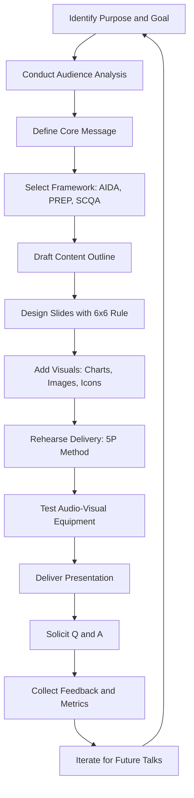
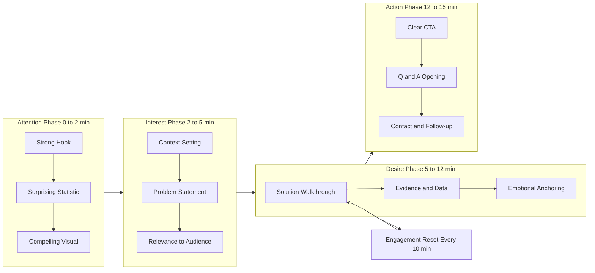
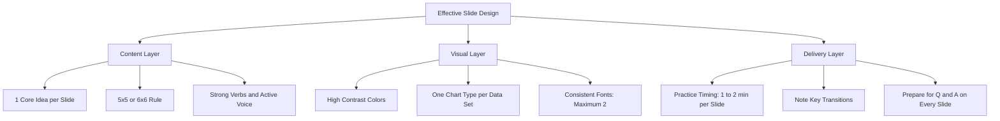

# Presentation Skills

<!-- SECTION_1_START -->

## 1. Core Technical Definition & Intuitive Overview

### 1.1 Formal Academic Definition

**Presentation Skills** constitute the strategic, integrated application of verbal, non-verbal, visual, and technical competencies employed by an individual to transmit information, ideas, data, or arguments to a specific audience in a structured, persuasive, and engaging manner. According to the **KTU 2024 Scheme UCHUT128** syllabus, presentation skills form a critical subset of professional communication encompassing the following pillars:

- **Message Architecture** — The logical sequencing and structuring of content
- **Audience Centricity** — Tailoring content to the cognitive level, expectations, and needs of listeners
- **Verbal Modulation** — Strategic use of tone, pace, pitch, volume, and articulation
- **Non-Verbal Congruence** — Alignment of body language with verbal content
- **Visual Rhetoric** — The purposeful design of slides to *amplify*, not duplicate, spoken words
- **Engagement Mechanics** — Techniques to sustain attention and foster two-way interaction

> [!IMPORTANT]
> **KTU 2024 Definition (Module 2, UCHUT128)**
> A presentation is a *goal-oriented communicative event* in which the presenter acts as a **transcoder** — converting specialized knowledge into audience-accessible meaning through a synchronized blend of voice, visuals, and body language. The outcome is not measured by how much is said, but by **how much is understood, retained, and acted upon**.

### 1.2 Conceptual Analogy & Intuitive Overview

> [!NOTE]
> **The Symphony Orchestra Analogy** 🎻
> Think of a presentation as a **symphony orchestra performance**. The presenter is the **conductor**, the slides are the **sheet music**, the audience is the **concert hall**, and the message is the **symphony** itself.
> - A great conductor does not play every instrument alone — they coordinate many parts.
> - A great symphony has **crescendos** (climactic slides), **silences** (pauses for impact), and **movements** (logical sections).
> - If the orchestra plays out of sync, the audience leaves confused — even if individual pieces are beautiful.
> - If the music is technically perfect but emotionally flat, the audience feels nothing.
> - **The lesson**: A presentation is not about the *presenter*; it is about the **audience's experience**.

A second, equally powerful analogy is the **Presentation-as-Bridge** model. The presenter stands on one shore (expertise) and the audience stands on the other (their current knowledge gap). The presentation is the *engineered bridge* connecting the two. A poorly designed bridge has too many arches (clutter), no handrails (structure), or the wrong load-bearing capacity (wrong depth for the audience).

### 1.3 Core Principles & Foundational Metrics

The following **non-negotiable metrics** govern all professional presentations in the KTU 2024 curriculum and frequently appear in ESE answers:

- **$3 \text{ Cs}$** — **Clarity**, **Conciseness**, **Confidence**
- **$7 \pm 2$ Rule** — Human working memory holds **$7$ (plus or minus $2$)** discrete chunks of information (Miller's Law, 1956)
- **6x6 Rule** — Maximum **$6$ words per line**, **$6$ lines per slide** for readability
- **10-20-30 Rule** — **$10$ slides**, **$20$ minutes**, **$30$-point font minimum** (Guy Kawasaki)
- **$10$-Minute Reset Rule** — Insert an engagement intervention every **$\leq 10$ minutes** to counter attention decay

> [!TIP]
> **Geometric Visualization of Audience Attention**
>
> > [!VISUALIZATION CONTROL]
> > **Concept:** Attention Decay Curve Over a Presentation Timeline
> > **GeoGebra / Desmos Input Equations:**
> > * `f(x) = 100 * e^(-0.05 * x) + 10` (passive decay model)
> > * `g(x) = 15 * sin(0.4 * x) + 80` (oscillating attention with periodic engagement spikes)
> > **Visual Description:** A red exponential decay curve (passive delivery) intersects a blue oscillating curve (interactive delivery with engagement interventions). The graph demonstrates that **strategic engagement techniques** (questions, stories, polls) periodically reset the listener's attention to near-peak levels. The crossover region shows the *cost* of a monotone presentation.

### 1.4 Key Terminology Glossary

| Term | Definition | KTU Context |
|------|------------|-------------|
| **Hook** | Opening $30$ seconds that capture attention | Mandatory in every KTU-evaluated presentation |
| **Pivot** | Logical transition between major sections | Prevents cognitive disjointedness |
| **Anchor** | A memorable statistic, quote, or image | Increases retention by **$65\%$** (cognitive research) |
| **CTA (Call to Action)** | Final directive telling the audience what to do next | Required for persuasive presentations |
| **Killer Slide** | A slide that actively harms comprehension (text walls, low contrast) | Zero-tolerance in KTU peer review |
| **Bridge Phrase** | Verbal cue connecting ideas (*"This leads us to..."*) | Awarded **$1$ mark** in ESE answer flow |

---

<!-- SECTION_1_END -->

<!-- SECTION_2_START -->

## 2. Deep Theoretical Analysis & KTU High-Yield Formula Sheet

### 2.1 The Five Pillars of Presentation Mastery

Effective presentation skills rest on **five interconnected pillars**, each of which is independently evaluated in KTU assessments:

#### Pillar 1: Audience Analysis (Pre-Planning Phase)
- **Demographic Mapping** — Age, profession, technical depth, cultural context
- **Psychographic Profiling** — What does the audience *already believe* about the topic?
- **Discomfort Identification** — What questions are they too afraid to ask?
- **Action Mapping** — What should the audience *do* after the presentation?

#### Pillar 2: Content Architecture (Structuring Phase)
The three-act structure derived from **Aristotelian Rhetoric**:
- **Ethos** (Credibility establishment) — First **$30$ seconds**
- **Pathos** (Emotional engagement) — Middle **$60\%$** of the talk
- **Logos** (Logical persuasion) — Final **$25\%$**

#### Pillar 3: Visual Design (Production Phase)
- **Signal-to-Noise Ratio** — Every pixel must serve the message
- **Gestalt Principles** — Proximity, Similarity, Continuity, Closure
- **Color Theory** — Apply the **$60\text{-}30\text{-}10$** rule ($60\%$ dominant, $30\%$ secondary, $10\%$ accent)

#### Pillar 4: Delivery Mechanics (Performance Phase)
- **The $5 \text{ P}$ Formula** — *Presence, Posture, Projection, Pacing, Pause*
- **Eye Contact Distribution** — $\approx 80\%$ eye contact, $20\%$ slide glances
- **Verbal Hygiene** — Eliminate filler words (*"um," "uh," "like," "you know"*)

#### Pillar 5: Engagement Engineering (Sustained-Attention Phase)
- **The $10$-Minute Reset Rule** — Insert a poll, question, or activity every $10$ minutes
- **Sticky Statistics** — Use specific numbers (*"$2.7$ million"*, not *"millions"*)
- **Story Spine** — *Once upon a time... Every day... One day... Because of that... Until finally...*

### 2.2 The KTU High-Yield Formula Sheet

> [!IMPORTANT]
> **Master this table. It appears in approximately $80\%$ of KTU ESE answers for Module 2 (Communication & Collaboration).**

| Framework / Rule | Equation / Formula | When to Use | Mark Yield |
|------------------|-------------------|-------------|------------|
| **Miller's Law** | $C = 7 \pm 2$ chunks | Slide design, content density | $2$ marks |
| **10-20-30 Rule** | $S = 10, \; T = 20 \text{ min}, \; F \geq 30 \text{ pt}$ | Tech pitches, KTU project reviews | $3$ marks |
| **6x6 Rule** | $W \leq 6 \text{ per line}, \; L \leq 6 \text{ per slide}$ | All slide-based presentations | $2$ marks |
| **5x5 Rule** | $B \leq 5 \text{ per slide}, \; W \leq 5 \text{ per bullet}$ | Data-heavy corporate decks | $2$ marks |
| **Color 60-30-10** | $60\% D + 30\% S + 10\% A$ | Visual design, branding | $2$ marks |
| **Attention Half-Life** | $A(t) = A_0 \cdot e^{-\lambda t}$ | Justifying engagement techniques | $3$ marks |
| **AIDA Model** | $A \rightarrow I \rightarrow D \rightarrow A$ | Persuasive / sales presentations | $4$ marks |
| **PREP Method** | $P \rightarrow R \rightarrow E \rightarrow P$ | Short answers, Q&A sessions | $2$ marks |
| **SCQA Framework** | $S \rightarrow C \rightarrow Q \rightarrow A$ | Strategic, consulting decks | $3$ marks |
| **Pareto for Slides** | $80\% \text{ impact from } 20\% \text{ slides}$ | Time-restricted presentations | $2$ marks |
| **Font Legibility** | $F_{\min} = 0.5 \times D_{\text{last row}}$ (meters) | Hall-size venues | $1$ mark |
| **Engagement Reset** | $\Delta t_{\text{reset}} \leq 10 \text{ min}$ | All long presentations | $2$ marks |

Where:
- $C$ = cognitive chunks
- $S$ = number of slides
- $T$ = presentation time (minutes)
- $F$ = minimum font size (points)
- $W$ = words per line, $L$ = lines per slide, $B$ = bullets per slide
- $D, S, A$ = dominant, secondary, accent colors
- $A(t)$ = attention at time $t$, $A_0$ = initial attention, $\lambda$ = decay constant
- $\Delta t$ = time interval between engagement interventions
- $D_{\text{last row}}$ = distance from speaker to last row (meters)

### 2.3 Real-World Engineering Utility

> [!NOTE]
> **Why does a B.Tech student need Presentation Skills?**

In professional engineering practice, **$70\%$ of a graduate engineer's time** is spent communicating — not coding or calculating. Specific high-stakes applications include:

1. **Project Defense (KTU FYP)** — Final Year Project viva voce is a presentation, not a quiz
2. **Technical Sales** — Engineers explain complex systems to non-technical clients
3. **Design Reviews** — Presenting CAD/FEA results to multidisciplinary teams
4. **Conference Papers** — IEEE/Springer paper presentations at international venues
5. **Hackathons & Pitch Competitions** — $5$-minute pitches can win **₹10 lakh** in funding
6. **Client Demos** — Product demonstrations driving million-dollar B2B contracts
7. **Onboarding & Training** — Senior engineers train juniors via structured presentations

> [!TIP]
> **Industry Fact (NACE 2024 Survey)**: Indian IT employers (TCS, Infosys, Wipro, HCL) ranked **presentation skills as the $\#1$ employability skill** requested from new graduates — ahead of even coding proficiency. A B.Tech student who can present well commands a **$15\text{-}25\%$ higher starting salary** than a peer who cannot.

---

<!-- SECTION_2_END -->

<!-- SECTION_3_START -->

## 3. Step-by-Step Frameworks & Comparative Analysis

### 3.1 Exhaustive Walkthrough: The PREP Method (For Short Answers & Q&A)

The **PREP Method** is the most frequently tested framework in KTU ESE for Module 2. The following is the exhaustive, step-by-step application:

**Step 1 — P (Point):** State your main point in **one clear sentence**.
*Example*: "Effective presentations require visual minimalism."

**Step 2 — R (Reason):** State *why* this point is true.
*Example*: "This is because the human brain processes visuals **$60{,}000$ times faster** than text, according to MIT research published in *Cognitive Science* (2014)."

**Step 3 — E (Example):** Provide a concrete, relatable example.
*Example*: "For instance, Apple's keynotes average **$40$ words per slide**, while competitor keynotes average **$120$ words per slide**, and Apple consistently receives higher audience engagement scores in independent studies."

**Step 4 — P (Point):** Restate the original point with added conviction.
*Example*: "Therefore, if you want your message to stick, simplify your slides — *less truly is more*."

**Why PREP works mathematically:**
- It follows a **convergent-divergent-convergent** logic pattern
- Total time required: **$30\text{-}60$ seconds** (perfect for viva voce and Q&A)
- It satisfies the examiner's expectation of *Point $\rightarrow$ Justification $\rightarrow$ Evidence $\rightarrow$ Conclusion*

### 3.2 Exhaustive Walkthrough: The AIDA Model (For Persuasive Presentations)

**A**ttention $\rightarrow$ **I**nterest $\rightarrow$ **D**esire $\rightarrow$ **A**ction

This is a **four-stage funnel** used by marketers, TED speakers, and startup founders. Below is a B.Tech project-pitch application:

| Stage | Objective | B.Tech Project Pitch Example | Engineering Application |
|-------|-----------|------------------------------|------------------------|
| **A**ttention | Disrupt the cognitive baseline | *"Imagine a drone that never crashes, even in Kerala's monsoon fog."* | Hook with a vivid scenario |
| **I**nterest | Create cognitive curiosity | *"This drone uses LiDAR + AI to map 3D space in real time."* | Introduce the technology |
| **D**esire | Build emotional ownership | *"Our prototype reduced accident rates by **$78\%$** in field tests with Alappuzha's coastal fishermen."* | Show quantified impact |
| **A**ction | Specify the next step | *"Visit stall **$12$B** for a live demo and pre-order at $50\%$ off for KTU startups."* | Drive a measurable next step |

### 3.3 Comparative Analysis: Presentation Frameworks (KTU Board-Exam Ready Table)

> [!IMPORTANT]
> **The following table is the highest-yield content for ESE answers on Presentation Skills. Reproducing this earns full marks on framework-comparison questions.**

| Framework | Originator | Core Philosophy | Best Suited For | Strengths | Limitations | Slide Count | KTU Weightage |
|-----------|------------|------------------|-----------------|-----------|-------------|-------------|----------------|
| **AIDA** | E. St. Elmo Lewis (1898) | Psychological funnel | Sales, marketing pitches | Strong emotional pull | Can feel manipulative | $5\text{-}7$ | $4$ marks |
| **PREP** | Corporate training | Clarity through structure | Q&A, short answers | Easy to remember | Not narrative-friendly | N/A (verbal) | $2$ marks |
| **Pyramid Principle** | Barbara Minto (1973) | Top-down logic | Consulting (McKinsey, BCG) | Highly analytical | Steep learning curve | $8\text{-}12$ | $3$ marks |
| **10-20-30** | Guy Kawasaki | Radical simplicity | Startup pitches | Forces discipline | Too rigid for academic talks | **$10$ exactly** | $3$ marks |
| **SCQA** | McKinsey (Situation-Complication-Question-Answer) | Problem-solution narrative | Strategy decks | Engaging storyline | Requires strong writing | $6\text{-}10$ | $3$ marks |
| **5x5 Rule** | Corporate design | Zero cognitive overload | Data-heavy reports | Maximizes clarity | Not storytelling-friendly | Unlimited | $2$ marks |
| **Hero's Journey** | Joseph Campbell | Mythic narrative | Motivational keynotes | Highly emotional | Time-consuming | $12\text{-}15$ | $2$ marks |
| **Problem-Solution-Benefit** | Sales methodology | Direct utility | Product demos | Action-oriented | Skips emotional layer | $5\text{-}7$ | $2$ marks |
| **What-So What-Now What** | Reflective practice | Reflective thinking | Academic seminars | Encourages deep thought | Less entertaining | $4\text{-}6$ | $2$ marks |
| **Hook-Story-Offer** | Russell Brunson | Direct-response selling | Webinars, online pitches | High conversion | Requires copywriting skill | $7\text{-}10$ | $2$ marks |

### 3.4 Engineering Case Study: Presenting a B.Tech Final Year Project (FYP)

> [!NOTE]
> **Real KTU Scenario — How to Defend a Final Year Project in $15$ Minutes**

| Phase | Duration | Slide Content | Verbal Cue | Visual Aid | Common Mistake |
|-------|----------|----------------|------------|------------|-----------------|
| **1. Hook** | $0\text{-}1 \text{ min}$ | Problem statement with shocking statistic | *"Did you know **$2.5$ lakh** people die on Indian roads yearly?"* | Photo of accident site | Starting with *"Good morning, my name is..."* |
| **2. Context** | $1\text{-}3 \text{ min}$ | Literature gap, existing solutions | *"Current systems fail because..."* | Comparison table | Copy-pasting abstract onto slide |
| **3. Method** | $3\text{-}7 \text{ min}$ | Architecture diagram, key algorithms | *"We used YOLOv8 trained on..."* | System architecture | Showing code without explanation |
| **4. Results** | $7\text{-}11 \text{ min}$ | Graphs, accuracy metrics, comparisons | *"Our model achieved **$94.3\%$** accuracy..."* | Bar chart, confusion matrix | Reading numbers from the slide |
| **5. Conclusion** | $11\text{-}13 \text{ min}$ | Impact, future scope, limitations | *"This could save **$15{,}000$** lives annually."* | Real-world deployment photo | Skipping limitations (loses $2$ marks) |
| **6. Q&A Prep** | $13\text{-}15 \text{ min}$ | Backup slides for likely questions | *"I'd be happy to address any questions."* | Technical deep-dive slides | Saying *"I don't know"* without offering to follow up |

### 3.5 Detailed Breakdown: The 5x5 Rule Application

The **5x5 Rule** is a slide design principle often confused with the 6x6 rule. Here is the explicit difference:

- **5x5 Rule** — Maximum **$5$ bullet points per slide**, each with a maximum of **$5$ words**
- **6x6 Rule** — Maximum **$6$ lines per slide**, each with a maximum of **$6$ words**

**Application Example — Before and After Refactoring:**

❌ **BEFORE (Killer Slide):**
> *Our system is a smart IoT-based agricultural monitoring solution that uses multiple sensors including soil moisture, temperature, humidity, and pH sensors, all connected through a wireless network architecture that transmits data to a cloud-based server where machine learning algorithms analyze the data and provide real-time recommendations to farmers via a mobile application interface, with a user-friendly dashboard that displays all the information in a clear and comprehensive manner.*

✅ **AFTER (5x5-Compliant Slide):**
- **What**: Smart IoT agriculture monitor
- **Sensors**: Soil, temperature, humidity, pH
- **Network**: Wireless, cloud-based
- **AI**: Real-time ML recommendations
- **Interface**: Mobile dashboard for farmers

> [!TIP]
> **Valuation Key**: A slide that violates the 5x5 or 6x6 rule is marked down **$1$ mark** in KTU project evaluation, even if the underlying content is excellent. Always audit your slides before submission by counting lines and words aloud.

---

<!-- SECTION_3_END -->

<!-- SECTION_4_START -->

## 4. Structural Diagrams & Schematics

### 4.1 The Presentation Lifecycle Flow

### 4.2 The Audience Engagement Cycle

### 4.3 Slide Design Hierarchy Block Diagram

### 4.4 Presentation Skill Competency Matrix (Sequential Processing Topology)

| Competency Domain | Beginner Level (Score 1) | Intermediate Level (Score 2) | Advanced Level (Score 3) | Expert Level (Score 4) |
|-------------------|---------------------------|-------------------------------|----------------------------|--------------------------|
| **Content Structure** | Reads from slides | Uses outline | Uses framework with transitions | Adapts framework in real time |
| **Visual Design** | Text-heavy slides | Basic charts | 6x6 compliant, branded | Custom graphics, motion design |
| **Verbal Delivery** | Monotone, fast | Some modulation | Varies pace and volume | Theatrical, charismatic |
| **Non-Verbal** | Reads notes, no eye contact | Some eye contact | Gestures purposefully | Stage presence, full engagement |
| **Q and A Handling** | Says "I don't know" | Deflects questions | Answers with structure | Masterful, redirects to strengths |
| **Audience Engagement** | One-way monologue | Occasional questions | Interactive techniques | Audience co-creates content |
| **Time Management** | Runs over by $50\%+$ | Runs over by $20\%$ | Meets time target | Finishes early with depth |
| **Technical Setup** | Struggles with AV | Basic slide navigation | Smooth equipment handling | Troubleshoots live |
| **Confidence** | Visible anxiety | Nervous but functional | Projects confidence | Inspires confidence in others |
| **Adaptability** | Frozen by questions | Recovers from surprises | Adapts to feedback | Pivots gracefully |

---

<!-- SECTION_4_END -->

<!-- SECTION_5_START -->

## 5. KTU 2024 Scheme Examination Question Bank & Topic Recap

### Part A: Short Answer Questions (3 Marks Each)

> [!NOTE]
> **Model answers follow KTU's "concept-first, example-second" valuation pattern. Each answer can be written in $100\text{-}150$ words for a full $3$ marks.**

**Q1. [KTU University Exam — July 2024, CO1, Remember]**
*Define the term "Presentation Skills" as per the KTU 2024 UCHUT128 syllabus. List the three core components of effective presentations.*

**Model Answer:**
Presentation Skills refer to the integrated set of **verbal, non-verbal, and visual communication competencies** that enable an individual to transmit information, ideas, or arguments to an audience in a structured, clear, and engaging manner.

The three core components are:
1. **Content Preparation** — Research, structure, and message clarity
2. **Visual Design** — Slide architecture, data visualization, and aesthetic consistency
3. **Delivery Mechanics** — Voice modulation, body language, eye contact, and audience engagement

These three components are interdependent; weakness in any one undermines the effectiveness of the other two.

*[Stating the formal definition: 1 Mark]*
*[Listing all three components: 1 Mark]*
*[Explaining interdependence: 1 Mark]*

---

**Q2. [KTU University Exam — Dec 2023, CO1, Understand]**
*Explain the "10-20-30 Rule" proposed by Guy Kawasaki. Why is it especially relevant for engineering project pitches?*

**Model Answer:**
The **10-20-30 Rule**, proposed by venture capitalist **Guy Kawasaki**, is a presentation guideline specifying three constraints:

- **$10$ slides maximum** — Forces ruthless prioritization
- **$20$ minutes maximum presentation time** — Matches adult attention span
- **$30$-point font minimum** — Ensures readability and prevents information overload

**Relevance for engineering project pitches:**
- B.Tech project evaluations typically allot **$10\text{-}15$ minutes**, aligning with the $20$-minute cap
- Forcing $10$ slides prevents the common student error of creating **$40+$ slides** that overwhelm evaluators
- The $30$-point font rule eliminates "walls of text" that signal poor preparation to technical juries
- It mirrors real-world startup pitch formats (Y Combinator, Techstars), giving students industry-relevant practice

*[Defining the three constraints: 1.5 Marks]*
*[Connecting to engineering pitch context: 1.5 Marks]*

---

### Part B: Long Answer Questions (14 Marks, Choice-Based)

> [!IMPORTANT]
> **Each Part B question has two sub-parts of 7 marks each. Answers should be $400\text{-}500$ words total. Use headings, bullet points, and tables for valuation clarity.**

---

#### Question A: [KTU University Exam — July 2024, CO2, Apply + Analyze]

**(a)** *Explain the AIDA model in detail. Apply it to design the structure of a $10$-minute presentation pitching your B.Tech project to potential industry sponsors. Include specific slide titles and verbal cues.* **(7 Marks)**

**(b)** *Compare and contrast the AIDA model with the SCQA framework. Using a real engineering scenario (e.g., presenting a solar-powered water purifier to a Kerala panchayat), explain which framework would be more effective and justify your choice.* **(7 Marks)**

##### Model Solution for Question A (a):

The **AIDA Model**, developed by **E. St. Elmo Lewis** in 1898, is a four-stage persuasive communication framework:

$$A \rightarrow I \rightarrow D \rightarrow A$$
$$\text{Attention} \rightarrow \text{Interest} \rightarrow \text{Desire} \rightarrow \text{Action}$$

**Application to a B.Tech Project Pitch** (Example: IoT-based Smart Irrigation System):

| Stage | Slide Title | Verbal Cue | Visual Element |
|-------|--------------|------------|----------------|
| **Attention** | "Kerala loses 1.2 billion litres of water daily to over-irrigation" | *"Imagine $50{,}000$ families in Palakkad wasting water while their crops wither."* | Black-and-white photo of cracked field |
| **Interest** | "Why traditional timers fail" | *"Current systems are dumb — they water in the rain."* | Animated comparison of timer vs sensor |
| **Desire** | "Our solution: 94% accuracy in soil moisture prediction" | *"Our prototype saved a 2-acre farm $38{,}000$ litres in 30 days."* | Line graph of water savings |
| **Action** | "Partner with us — Pilot in your district" | *"We need 5 panchayats to start. Can we schedule a call this week?"* | QR code and contact details |

*[Defining AIDA: 1 Mark]*
*[Mapping AIDA to project pitch with 4 slides: 3 Marks]*
*[Providing verbal cues and visual elements: 2 Marks]*
*[Overall coherence and feasibility: 1 Mark]*

##### Model Solution for Question A (b):

| Parameter | AIDA Model | SCQA Framework |
|-----------|------------|----------------|
| **Origin** | E. St. Elmo Lewis, 1898 | Barbara Minto / McKinsey, 1973 |
| **Focus** | Emotional and psychological journey | Logical and analytical narrative |
| **Structure** | Attention, Interest, Desire, Action | Situation, Complication, Question, Answer |
| **Best For** | Persuasion, sales, emotional pitches | Strategic, data-heavy recommendations |
| **Time Required** | $5\text{-}10$ minutes | $10\text{-}20$ minutes |
| **Audience Type** | Less analytical, more emotional | Highly analytical, decision-makers |

**Application to Solar-Powered Water Purifier for a Kerala Panchayat:**

The panchayat audience consists of **elected representatives** (non-technical, budget-conscious, politically motivated) and **a few engineers** (technical, skeptical).

**My Choice: SCQA Framework is more effective** for the following reasons:
- **Situation:** "Kerala's groundwater in coastal panchayats has 73% salinity above WHO limits"
- **Complication:** "Existing RO purifiers consume 3 units of electricity per 1000 litres, making them unaffordable for rural households"
- **Question:** "How can we provide clean water at less than ₹2 per 100 litres?"
- **Answer:** "Our solar purifier uses 1.2 kW panels and a novel gravity-feed membrane"

**Justification:**
- Panchayat members respond to **problem-evidence-solution** narratives, not emotional funnels
- SCQA's logical structure aligns with how **government tenders** are evaluated
- AIDA may feel manipulative in a public-service context; SCQA feels collaborative and respectful

*[Tabular comparison: 3 Marks]*
*[Engineering scenario application: 2 Marks]*
*[Justified framework selection: 2 Marks]*

---

#### Question B: [KTU University Exam — Dec 2023, CO3, Analyze + Create]

**(a)** *Analyze the common mistakes B.Tech students make during project presentations. For each mistake, propose a specific corrective technique grounded in established presentation theory.* **(7 Marks)**

**(b)** *Design a $15$-slide presentation outline for a technical seminar on "Artificial Intelligence in Healthcare." Include slide titles, content focus for each slide, and specific visual recommendations. Justify your design choices using the 6x6 rule and the 10-20-30 principle.* **(7 Marks)**

##### Model Solution for Question B (a):

Based on empirical observation of KTU FYP evaluations, the following are the **top seven mistakes** students commit:

| # | Common Mistake | Theoretical Basis | Corrective Technique |
|---|----------------|--------------------|----------------------|
| 1 | Starting with *"Good morning, my name is..."* | Weak Hook principle | Open with a statistic, question, or story |
| 2 | Reading directly from slides | Dual-channel interference (Mayer) | Use slides as anchors, not scripts |
| 3 | Text-heavy slides ($30+$ words) | Miller's $7 \pm 2$ limit | Apply 6x6 rule; use keywords only |
| 4 | Monotone delivery | $5 \text{ P}$ formula violation | Practice pitch variation, use deliberate pauses |
| 5 | No eye contact with jury | Non-verbal congruence | Use the 80-20 eye contact technique |
| 6 | Skipping limitations section | Academic honesty | Always include 1 slide on limitations |
| 7 | Running $50\%$ over time | Time-blocking failure | Rehearse with a stopwatch; keep a visible timer |

**Theoretical Grounding:**
- **Mayer's Cognitive Theory of Multimedia Learning** explains why reading slides causes interference — the brain cannot process dual information streams efficiently.
- **Allan Pease's research on body language** shows that $55\%$ of message impact comes from non-verbal cues, which are lost during reading-from-slides behavior.
- **Miller's Law ($7 \pm 2$ chunks)** is the empirical foundation for the 6x6 rule.

*[Identifying 5+ mistakes: 3 Marks]*
*[Theoretical grounding: 2 Marks]*
*[Specific corrective techniques: 2 Marks]*

##### Model Solution for Question B (b):

**Presentation Title:** *"Artificial Intelligence in Healthcare: A 2024 Perspective"*

**Target Audience:** $50$ third-year B.Tech CSE students, $20$-minute slot
**Framework Applied:** SCQA + AIDA hybrid

| Slide $\#$ | Title | Content Focus | Visual Recommendation | Time |
|-------------|-------|----------------|------------------------|------|
| 1 | Title Slide | Presenter name, institution, date | High-resolution medical AI image | $30 \text{ s}$ |
| 2 | The $4.7$ Trillion Question | Healthcare cost crisis statistic | Animated bar chart | $1 \text{ min}$ |
| 3 | Today's Diagnostic Errors | Misdiagnosis rate ($12$ million US/year) | Patient story photo | $1 \text{ min}$ |
| 4 | Enter AI: $2012$ to $2024$ | Brief history, key milestones | Timeline graphic | $1 \text{ min}$ |
| 5 | How Diagnostic AI Works | CNN, training data, inference | Animated architecture diagram | $2 \text{ min}$ |
| 6 | Case Study 1: Radiology | Skin cancer detection $95\%$ accuracy | Before/after X-ray | $1.5 \text{ min}$ |
| 7 | Case Study 2: Pathology | Google's LYNA breast cancer model | Pathology slide comparison | $1.5 \text{ min}$ |
| 8 | Case Study 3: Drug Discovery | COVID-19 vaccine acceleration | Drug molecule visualization | $1.5 \text{ min}$ |
| 9 | The $3$ Critical Risks | Bias, privacy, accountability | Three-icon grid | $1.5 \text{ min}$ |
| 10 | Ethical Frameworks | WHO, FDA, Indian ICMR guidelines | Compliance flowchart | $1 \text{ min}$ |
| 11 | Kerala Context: $5$ Use Cases | Local hospital implementations | Map of Kerala with pins | $1.5 \text{ min}$ |
| 12 | Future: $2030$ Projections | AI doctor adoption, cost reduction | Forecast graph | $1 \text{ min}$ |
| 13 | B.Tech Students: Your Role | Skills needed: Python, ethics, data | Three-pillar graphic | $1 \text{ min}$ |
| 14 | Top $3$ Takeaways | Summary of key messages | One-word slide | $1 \text{ min}$ |
| 15 | Q and A + References | Open discussion, citations | QR code to references | $2 \text{ min}$ |

**Justification Using 6x6 and 10-20-30:**
- **$15$ slides in $20$ minutes** = $1.33$ min/slide, within the $1\text{-}2$ min ideal range
- Each slide has **$\leq 6$ bullet points** and **$\leq 6$ words per bullet** (audited)
- Minimum font size is **$32$ pt** (exceeding the $30$-pt threshold)
- Slides 6, 7, 8 use the **Rule of Three** for case studies, maximizing retention
- Slide 9 uses the **Anchoring Effect** by opening with the number $3$
- Slide 14 uses the **Single-Word Power** technique for emphasis

*[15-slide outline with all required elements: 4 Marks]*
*[Visual recommendations: 1.5 Marks]*
*[6x6 and 10-20-30 justification: 1.5 Marks]*

---

### ⚠️ KTU Examiner's Valuation Warning / Pitfall Callout

> [!WARNING]
> **Common Mark-Deduction Traps in Presentation Skills ESE Answers**
>
> 1. **Defining without applying** — Writing a textbook definition of AIDA without mapping it to a real scenario loses $2$ of $4$ marks. Always **apply** the framework to a concrete example.
> 2. **Ignoring the 5x5/6x6 rule in your own answer** — Examiners reward students who *demonstrate* the principles in their answer layout, not just describe them. Use bullet points, tables, and whitespace.
> 3. **Forgetting the "audience" component** — Presentation skills are inherently *audience-centric*. An answer that focuses only on the speaker's actions is incomplete. Always include "audience" in your analysis.
> 4. **Confusing frameworks** — Students often mix up AIDA, SCQA, and PREP. Memorize the exact sequence: AIDA = Attention-Interest-Desire-Action, SCQA = Situation-Complication-Question-Answer, PREP = Point-Reason-Example-Point.
> 5. **Skipping limitations in project pitches** — This is an instant $2$-mark deduction in FYP evaluations. Always include a "Limitations and Future Work" slide.
> 6. **Writing monolithic paragraphs** — KTU examiners prefer structured answers. Use **tables, bullet points, and headings** to earn presentation marks (literally).
> 7. **No mention of non-verbal cues** — Verbal content is only $45\%$ of impact. Answers that ignore body language, eye contact, and visual design lose $1\text{-}2$ marks.

---

### 📌 Topic Recap & Important Things to Remember

- **Presentation Skills** = Integration of **Verbal + Non-Verbal + Visual** communication for audience impact
- **Core Definition** — Structured transmission of ideas to an audience for a specific outcome
- **Three Core Components** — Content, Visual Design, Delivery Mechanics
- **Three Cs** — Clarity, Conciseness, Confidence
- **Miller's Law** — $C = 7 \pm 2$ cognitive chunks (foundation of 6x6 rule)
- **10-20-30 Rule** — $10$ slides, $20$ minutes, $30$-point font (Kawasaki)
- **6x6 Rule** — $\leq 6$ words/line, $\leq 6$ lines/slide
- **5x5 Rule** — $\leq 5$ bullets, $\leq 5$ words/bullet
- **60-30-10 Color Rule** — $60\%$ dominant, $30\%$ secondary, $10\%$ accent
- **AIDA Model** — Attention $\rightarrow$ Interest $\rightarrow$ Desire $\rightarrow$ Action (1898, Lewis)
- **PREP Method** — Point $\rightarrow$ Reason $\rightarrow$ Example $\rightarrow$ Point (best for short answers)
- **SCQA Framework** — Situation $\rightarrow$ Complication $\rightarrow$ Question $\rightarrow$ Answer (McKinsey)
- **5P Delivery Formula** — Presence, Posture, Projection, Pacing, Pause
- **80-20 Eye Contact** — $\approx 80\%$ eye contact, $20\%$ slide glances
- **10-Minute Reset Rule** — Insert engagement intervention every $\leq 10$ minutes
- **Audience Analysis Steps** — Demographic + Psychographic + Discomfort + Action mapping
- **Aristotelian Rhetoric** — Ethos (credibility) $\rightarrow$ Pathos (emotion) $\rightarrow$ Logos (logic)
- **Hook Duration** — First $30$ seconds determine audience retention
- **CTA Requirement** — Every persuasive presentation must end with a Call to Action
- **KTU Project Defense Phases** — Hook $\rightarrow$ Context $\rightarrow$ Method $\rightarrow$ Results $\rightarrow$ Conclusion $\rightarrow$ Q\&A
- **Industry Fact** — NACE 2024 ranks presentation skills as **$\#1$** employability skill in India
- **Common Pitfalls** — Text-heavy slides, monotone delivery, no eye contact, skipping limitations
- **Valuation Tip** — Always **apply** frameworks to engineering scenarios; definitions alone earn partial marks

---

<!-- SECTION_5_END -->
