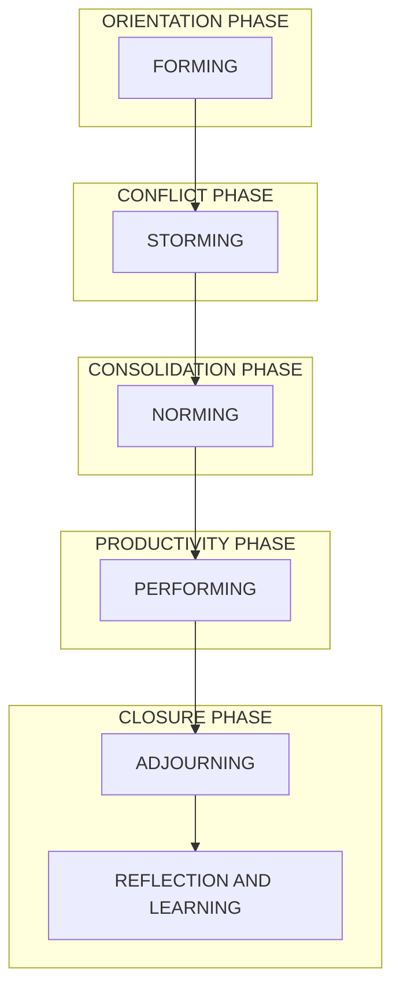
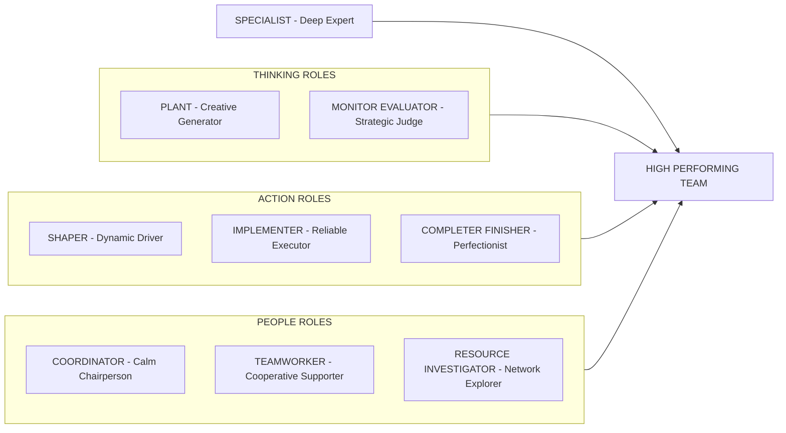
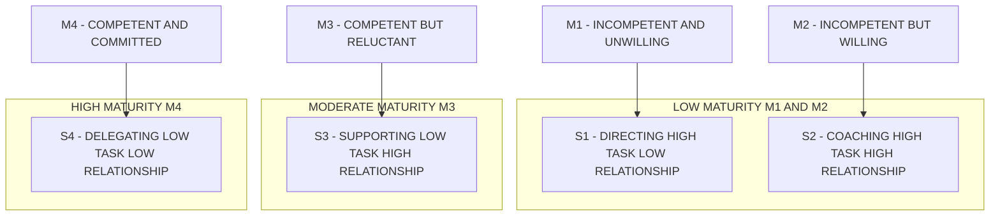
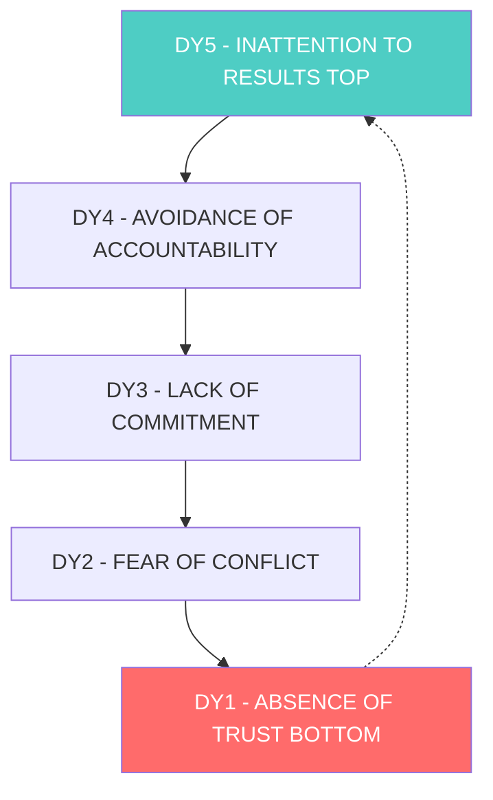
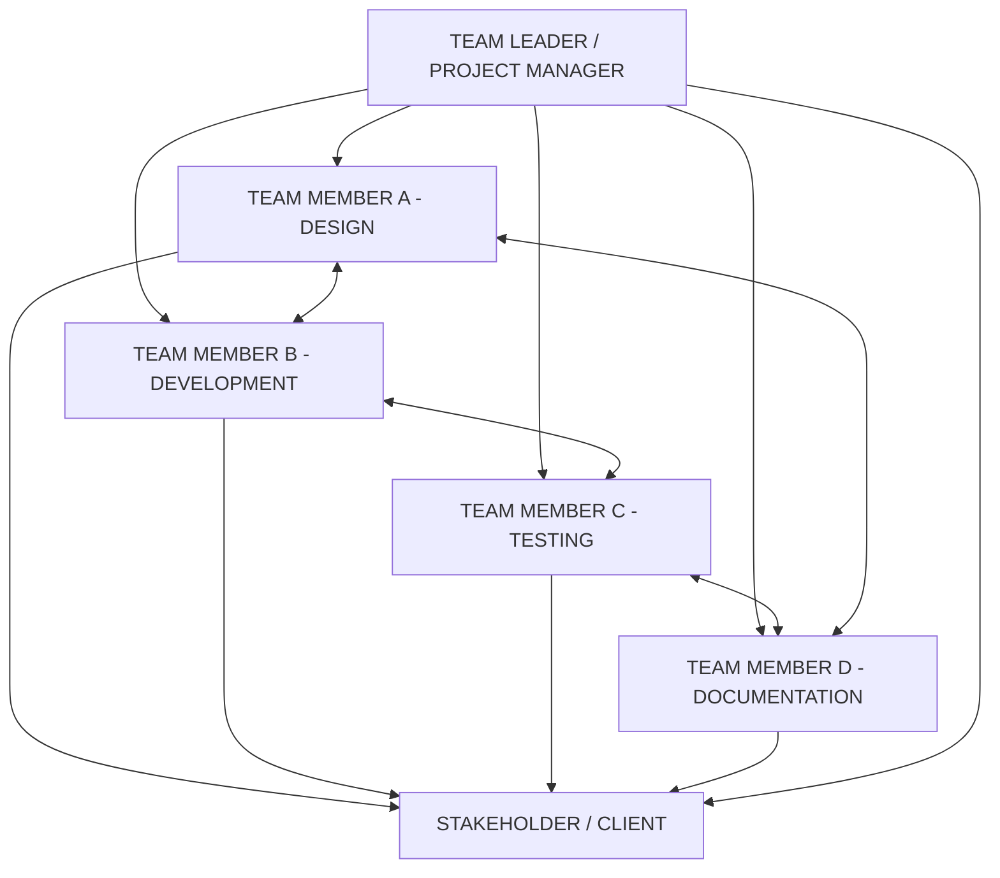
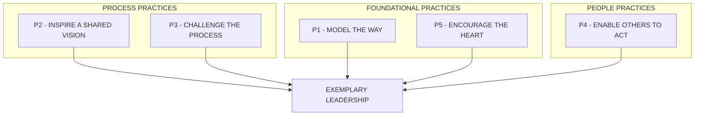

# Teamwork and Leadership

<!-- SECTION_1_START -->
# Teamwork and Leadership — Foundational Framework

> [!NOTE]
> **KTU 2024 Scheme Definition (Syllabus-Aligned)**
> **Teamwork** is the collaborative effort of a group of individuals working interdependently toward a shared objective, leveraging diverse skills, mutual accountability, and coordinated communication. **Leadership** is the capacity to influence, motivate, and guide individuals or groups toward the achievement of organizational or team goals, while fostering vision, integrity, and ethical decision-making.

In the KTU NEP 2020 framework under the **Life Skills and Professional Communication (UCHUT128)** course, Module 2 emphasizes that engineering professionals rarely work in isolation. The modern engineering workplace — whether it is a software development team, a structural design consortium, or a multidisciplinary robotics project — depends on the symbiotic relationship between **teamwork** (the "how") and **leadership** (the "why and where").

## Conceptual Analogy: The Symphony Orchestra

Imagine an engineering project as a **symphony orchestra performing Beethoven's 9th Symphony**:
- **Teamwork** is the orchestra itself — 80+ musicians reading the same sheet music, synchronizing their timing, listening to each other, and blending their unique instruments (skills) into a cohesive harmony. Without coordination, the result is noise.
- **Leadership** is the **conductor** — standing at the podium, the conductor does not play every instrument, but interprets the vision, sets tempo, cues entries, balances dynamics, and ensures every section (strings, brass, woodwinds, percussion) contributes at the right moment.

Just as a conductor cannot produce a symphony alone, and musicians cannot synchronize without a conductor, engineering excellence requires both orchestrated teamwork and visionary leadership.

## Key Distinctions at a Glance

| Dimension | Teamwork | Leadership |
| :--- | :--- | :--- |
| **Primary Focus** | Collective process | Individual influence |
| **Orientation** | Task execution | Vision and direction |
| **Time Horizon** | Short-to-medium term (project cycles) | Long-term strategic |
| **Source of Authority** | Peer-based, role-based | Influence-based, formal/informal |
| **Key Output** | Synergy and deliverables | Direction and inspiration |

> [!IMPORTANT]
> **KTU 2024 Board Highlight:** Examiners expect students to clearly **differentiate** teamwork from leadership, and to articulate that a **leader can exist without a formal team** (e.g., a thought leader), while a **team can function without a designated leader** (self-managed teams), though both are most powerful when combined.

> [!VISUALIZATION CONTROL]
> **Concept:** Team-Leadership Synergy Model
> **Conceptual Axes:**
> * $x$-axis: Leadership Intensity (Low $\rightarrow$ High)
> * $y$-axis: Team Cohesion (Low $\rightarrow$ High)
> **Quadrant Mapping:**
> * Quadrant I (High/High) = **High-Performance Team** (ideal state)
> * Quadrant II (Low/High) = **Fragile Team** (vision without execution)
> * Quadrant III (Low/Low) = **Disengaged Group** (chaos)
> * Quadrant IV (High/Low) = **Directive Group** (compliance without ownership)
> **Visual Description:** Students should observe that optimal engineering team performance is achieved only when leadership influence and team cohesion operate simultaneously in the upper-right quadrant.

## The Engineering Relevance Statement

> [!IMPORTANT]
> **Industry Context (2024–2026):** According to the World Economic Forum's *Future of Jobs Report*, **collaborative teamwork** and **leadership & social influence** rank consistently in the **Top 5 core skills** required by employers globally. For KTU engineering graduates entering product-based companies (TCS, Infosys, Bosch, Wipro), startup ecosystems (Kerala Startup Mission), or core engineering firms (L&T, Tata Steel), the ability to lead cross-functional teams is not optional — it is a **licensable employability skill**.

<!-- SECTION_1_END -->

<!-- SECTION_2_START -->
# Deep Theoretical Analysis & KTU High-Yield Frameworks

## 2.1 The Architecture of Teamwork

Teamwork in engineering environments operates through **five interrelated pillars**. Each pillar is a structural component — remove one, and the team's output collapses.

### Pillar 1: Shared Goal Alignment
- Every team member must understand and commit to a **common objective**.
- In KTU project-based learning (PBL) modules, this is articulated in the **project charter** or **Statement of Work (SOW)**.
- Without goal alignment, individual effort becomes siloed and contradictory.

### Pillar 2: Role Clarity and Specialization
- Effective teams distribute tasks based on **complementary competencies** rather than uniform assignment.
- Meredith Belbin's **Team Role Theory** identifies nine distinct roles that, when balanced, maximize team output.

### Pillar 3: Mutual Accountability
- Team members hold themselves and each other responsible for outcomes.
- Distinct from individual accountability (where each person is responsible only for their own task), mutual accountability creates **collective ownership**.

### Pillar 4: Effective Communication Protocols
- Information must flow **upward, downward, and laterally** with minimal distortion.
- Engineering teams often use **Daily Stand-ups (Scrum)**, **RAID logs (Risks, Assumptions, Issues, Dependencies)**, and **asynchronous documentation** (Confluence, Notion) to maintain communication hygiene.

### Pillar 5: Interdependence and Trust
- Team members must rely on each other's contributions and trust that commitments will be honored.
- Psychological safety (Edmondson's framework) is the **enabling condition** for this trust.

> [!NOTE]
> **Why this matters in engineering:** A civil engineering team designing a bridge cannot afford isolated work — the structural engineer's calculations must align with the geotechnical survey, which must align with the environmental impact assessment. Teamwork is not a "soft" skill; it is a **technical coordination mechanism**.

## 2.2 Tuckman's Five-Stage Model of Team Development

Bruce Tuckman's **Forming–Storming–Norming–Performing–Adjourning** model is the most cited framework in KTU board examinations for understanding team evolution.

$$
\text{Team Maturity} = f(\text{Stage Progression, Time, Conflict Resolution Quality})
$$

| Stage | Characteristics | Engineering Analogy | KTU Board Tip |
| :--- | :--- | :--- | :--- |
| **Forming** | Politeness, uncertainty, role-testing | Initial kickoff meeting for a final-year project | Mention that this is the **orientation phase** |
| **Storming** | Conflict, power struggles, frustration | Disagreements between hardware and software sub-teams | Highlight that **conflict is healthy** here |
| **Norming** | Trust establishment, norm-setting | Sprint retrospectives and protocol finalization | Emphasize **emerging cohesion** |
| **Performing** | High productivity, self-management | Mature sprint cycles delivering working prototypes | State that this is the **optimal state** |
| **Adjourning** | Task completion, reflection, dissolution | Project defense and post-mortem review | Note that **learning consolidation** occurs here |

## 2.3 Belbin's Nine Team Roles

Dr. Meredith Belbin's research at Henley Management College identified that high-performing teams require a balance of **nine roles** distributed across members.

| Category | Role | Core Strength | Engineering Example |
| :--- | :--- | :--- | :--- |
| **Thinking Roles** | Plant (PL) | Creative problem-solving | Algorithm designer for an AI project |
| | Monitor Evaluator (ME) | Strategic analysis | System architect reviewing trade-offs |
| **Action Roles** | Shaper (SH) | Drive and courage | Project manager pushing deadlines |
| | Implementer (IMP) | Disciplined execution | QA engineer following test protocols |
| | Completer Finisher (CF) | Precision and quality | Documentation lead finalizing reports |
| **People Roles** | Coordinator (CO) | Mature, confident delegator | Team lead facilitating meetings |
| | Teamworker (TW) | Cooperative, perceptive | Mediator in cross-functional disputes |
| | Resource Investigator (RI) | Explorer, negotiator | Liaison with external vendors/clients |
| **Specialist Role** | Specialist (SP) | Deep technical knowledge | Subject-matter expert in cryptography |

> [!IMPORTANT]
> **KTU Board Trick:** Examiners often ask: *"Is it ideal to have all nine roles in a team of five?"* The correct answer is **No** — one member can perform multiple roles. The key is that **all role-functions are collectively covered**, not that each is filled by a unique individual.

## 2.4 Leadership Theories — The KTU High-Yield Framework

Leadership theory has evolved across four major paradigms. The 2024 KTU syllabus expects familiarity with all four.

### Paradigm A: Trait Theory (Great Man Theory, 19th–20th Century)
- **Premise:** Leaders are born, not made; they possess innate characteristics.
- **Key Traits:** Intelligence, self-confidence, determination, integrity, sociability.
- **Critique:** Ignores situational and learned dimensions. Modern engineering education rejects pure trait determinism.

### Paradigm B: Behavioral Theories (Ohio State & Michigan Studies, 1940s–1950s)
- **Premise:** Leadership can be learned through observable behaviors.
- **Two Key Dimensions:**
  * **Initiating Structure** (task-oriented): Organizing, defining roles, setting standards.
  * **Consideration** (people-oriented): Trust, respect, friendship, mutual support.

$$
\text{Leadership Effectiveness} = f(\text{Initiating Structure}, \text{Consideration})
$$

### Paradigm C: Contingency/Situational Theories (1960s–1980s)
- **Premise:** Effective leadership depends on context — there is **no one best way**.
- **Key Models:**
  * **Hersey-Blanchard Situational Model:** Leader adapts style (Directing $\rightarrow$ Coaching $\rightarrow$ Supporting $\rightarrow$ Delegating) based on follower maturity.
  * **Fiedler's Contingency Model:** Leader effectiveness is a function of leader-member relations, task structure, and positional power.

### Paradigm D: Contemporary Transformational & Servant Leadership (1990s–Present)
- **Transformational Leadership (Bass):** Leaders inspire followers to **exceed expected performance** by elevating ideals, stimulating intellect, and providing individualized consideration.
- **Servant Leadership (Greenleaf):** Leaders prioritize **serving the needs of their team** first, empowering growth, healing, and community-building.
- **Relevance to 2024 Engineering:** Agile and DevOps cultures favor servant leadership; innovation-driven R&D teams thrive under transformational leadership.

## 2.5 The KTU Cheat Sheet — Comparative Leadership Styles

| Style | Decision-Making | Communication | Best Suited For | Limitation |
| :--- | :--- | :--- | :--- | :--- |
| **Autocratic** | Centralized, unilateral | Top-down directives | Crisis response, military ops | Low morale, no innovation |
| **Democratic** | Participative, consensus-driven | Open dialogue, brainstorming | Creative R&D, design studios | Slow in urgent scenarios |
| **Laissez-Faire** | Delegated to team | Minimal interference | Expert, self-driven teams | Risk of drift without guidance |
| **Transformational** | Vision-driven, inspirational | Charismatic, symbolic | Change initiatives, startups | Risk of leader-dependency |
| **Transactional** | Reward-punishment based | Contractual, performance-linked | Routine operational tasks | Suppresses creativity |
| **Servant** | Empowerment-based | Listening-first, empathetic | Agile teams, learning organizations | May appear weak in hostile cultures |

## 2.6 Real-World Engineering Utility

| Engineering Domain | Application of Teamwork + Leadership |
| :--- | :--- |
| **Software Development** | Agile Scrum teams — Product Owner (leadership), Developers (teamwork) |
| **Civil Engineering Projects** | Site engineers, architects, contractors — coordinated under a Project Director |
| **Robotics Competitions (KTU Fest)** | Multi-disciplinary teams under team captain, with sub-leads for mechanical, electronics, and programming |
| **Startup Ecosystem (Kerala)** | Founding teams applying servant leadership to scale from 3 to 30 employees |
| **Research & Development** | Principal Investigator leading PhD scholars, post-docs, and interns in collaborative research |

<!-- SECTION_2_END -->

<!-- SECTION_3_START -->
# Step-by-Step Frameworks, Case Analysis & Practical Implementation

> [!IMPORTANT]
> For humanities and management topics, the "derivation" is replaced with **structured analytical frameworks**, **case-study deconstruction**, and **applied decision-making matrices**. Every analytical step is fully written out — no shortcuts permitted.

## 3.1 Framework Application: Diagnosing Team Dysfunction (Lencioni's Five Dysfunctions Model)

Patrick Lencioni's model, although not explicitly in the KTU syllabus, is a powerful tool for analyzing team health. We apply it step-by-step to a KTU final-year project scenario.

### Case Context
> A KTU final-year B.Tech (CSE) project team of four is struggling to deliver their AI-based attendance system two weeks before the review. Two members are silent in meetings, one is missing deadlines, and the team lead is making unilateral decisions.

### Step-by-Step Diagnostic Application

**Step 1: Identify the Dysfunction Hierarchy**

$$
\text{Dysfunction}_1 \;\rightarrow\; \text{Dysfunction}_2 \;\rightarrow\; \text{Dysfunction}_3 \;\rightarrow\; \text{Dysfunction}_4 \;\rightarrow\; \text{Dysfunction}_5
$$

The pyramid is bottom-up — each dysfunction compounds the one below it.

**Step 2: Map the Lowest Dysfunction — Absence of Trust**

- **Diagnostic Question:** Do team members feel safe to be vulnerable? Can they admit "I don't understand this module" without fear of ridicule?
- **Evidence in Case:** Two members are silent in meetings — they likely fear judgment.
- **Intervention:** Leader should model vulnerability by saying "I am also stuck on the LSTM layer — let us solve it together."

**Step 3: Identify Fear of Conflict (Second Layer)**

- **Diagnostic Question:** Are disagreements productive (task-focused) or absent (artificial harmony)?
- **Evidence in Case:** Silence suggests artificial harmony; the lead makes unilateral decisions to avoid friction.
- **Intervention:** Introduce **structured conflict** — e.g., "Devil's Advocate" rotation where one member must challenge each proposal.

**Step 4: Detect Lack of Commitment (Third Layer)**

- **Diagnostic Question:** Do team members commit to decisions even when they disagreed initially?
- **Evidence in Case:** Missing deadlines suggests passive resistance — they did not buy in.
- **Intervention:** Use **disagree-and-commit** protocol: "You can disagree, but once decided, you commit fully."

**Step 5: Identify Avoidance of Accountability (Fourth Layer)**

- **Diagnostic Question:** Do team members hold each other accountable to high standards?
- **Evidence in Case:** No peer-to-peer accountability visible; lead is the sole enforcer.
- **Intervention:** Establish **peer-reviewed sprint demos** — every member presents their work weekly.

**Step 6: Identify Inattention to Results (Top Dysfunction)**

- **Diagnostic Question:** Is the collective outcome prioritized over individual ego?
- **Evidence in Case:** Project delivery at risk; individual reputations may be taking precedence.
- **Intervention:** Tie individual evaluation explicitly to **team-level KPI**: project grade, demo success, code coverage.

**Step 7: Design the Remediation Sequence**

$$
\begin{aligned}
\text{Remediation Plan} &= \text{Trust-Building Workshop} \\
&\;+\; \text{Structured Conflict Protocol} \\
&\;+\; \text{Consensus Decision-Making} \\
&\;+\; \text{Peer Accountability Rituals} \\
&\;+\; \text{Collective KPI Visibility}
\end{aligned}
$$

> [!NOTE]
> **KTU Valuation Insight:** When applying Lencioni's model in an exam, students often lose marks by **listing the five dysfunctions** without **applying them sequentially to a case**. The board expects a *causal chain analysis*, not a glossary recital.

## 3.2 Case Study: Choosing the Right Leadership Style

### Case Context
> Riya is a newly appointed team lead for a six-member team developing an IoT-based flood monitoring system for the Kerala State Disaster Management Authority. The team comprises: two final-year students, two junior developers, and one domain expert from the Disaster Authority. The project is high-stakes (lives depend on accuracy), the deadline is fixed (monsoon onset), and the team has never worked together.

### Analytical Framework: Hersey-Blanchard Situational Leadership

**Step 1: Assess Follower Maturity Across Four Dimensions**

$$
M = f(\text{Competence}, \text{Commitment}, \text{Consistency}, \text{Capability})
$$

| Team Segment | Competence | Commitment | Maturity Level | Riya's Required Style |
| :--- | :--- | :--- | :--- | :--- |
| Two final-year students | High (academic) | Medium (new to project) | M3 — Competent but Inconsistent | **Supporting (S3)** |
| Two junior developers | Low (need handholding) | High (eager) | M2 — Low Competence, High Commitment | **Coaching (S2)** |
| Domain expert | Very High | Medium (skeptical of academic team) | M4 — High Competence, Variable Commitment | **Delegating (S4)** |

**Step 2: Apply the Style Mix**

- **For junior developers (M2):** Riya should adopt a **Coaching style** — high directive + high supportive. She should assign specific tasks, explain the "why," and provide frequent feedback.
- **For final-year students (M3):** Riya should adopt a **Supporting style** — low directive + high supportive. She should facilitate problem-solving, encourage decision-making, and reduce hand-holding.
- **For domain expert (M4):** Riya should adopt a **Delegating style** — low directive + low supportive. She should trust the expert's judgment on sensor placement, data thresholds, and emergency protocols.

**Step 3: Recognize the Leadership Flexibility Requirement**

$$
\text{Leader Effectiveness} = \text{Ability to Shift Styles Based on Follower Maturity}
$$

> [!IMPORTANT]
> **Key Takeaway:** Situational leadership is **diagnostic-then-adaptive**. Riya cannot use one style uniformly; she must conduct **individual maturity assessments** and calibrate her approach member-by-member.

## 3.3 Practical Implementation Matrix: Team-Building Activities for Engineering Projects

| Activity | Purpose | When to Use | KTU Project Application |
| :--- | :--- | :--- | :--- |
| **Kick-off Charter Workshop** | Align on goals, roles, and rules | Day 1 of project | Co-create the project charter with all four members |
| **Daily Stand-ups (15 min)** | Surface blockers, maintain rhythm | Daily during sprints | Each member answers: What I did? What I'll do? Any blockers? |
| **Sprint Retrospectives** | Continuous improvement | End of every sprint | "Start, Stop, Continue" exercise |
| **Pair Programming** | Knowledge transfer, trust | During complex modules | One codes, one reviews; switch every 30 minutes |
| **Peer Code Reviews** | Quality, accountability | Pull request stage | Mandatory review by a different member before merge |
| **Conflict Mediation Sessions** | Address interpersonal friction | When tension surfaces | Leader acts as neutral facilitator, not judge |
| **Celebration of Milestones** | Reinforce collective achievement | After each successful demo | Acknowledge team effort, not just individual output |

## 3.4 Communication Protocol Template for Engineering Teams

A professional engineering team (especially in KTU's hackathons and project expos) should establish explicit communication norms.

**Protocol Specification:**

$$
\begin{aligned}
\text{Communication Health} = &\; \text{Channel Clarity} \\
&+ \text{Response Time Norms} \\
&+ \text{Documentation Discipline} \\
&+ \text{Feedback Loops}
\end{aligned}
$$

| Channel | Use For | Response Time | Owner |
| :--- | :--- | :--- | :--- |
| WhatsApp Group | Quick updates, social bonding | $< 4$ hours | All members |
| Email (CC all) | Formal decisions, deadlines | $< 24$ hours | Team Lead |
| GitHub Issues | Task tracking, bug reports | $< 48$ hours | Assigned member |
| Weekly Video Call | Sprint review, planning | Scheduled slot | Team Lead facilitates |
| Shared Drive | Documentation, deliverables | Updated real-time | Documentation lead |

## 3.5 Building Personal Leadership Competence — The "5 Practices" Model (Kouzes & Posner)

For KTU students aspiring to leadership roles, the **Five Practices of Exemplary Leadership** offer a self-development roadmap.

1. **Model the Way:** Clarify values and set the example. *Action:* Be the first to arrive, the last to leave; follow your own coding standards.
2. **Inspire a Shared Vision:** Envision the future and enlist others. *Action:* Paint a vivid picture of the project's societal impact.
3. **Challenge the Process:** Seek innovative ways to change, grow, and improve. *Action:* Propose a new ML model when the team is stuck.
4. **Enable Others to Act:** Foster collaboration and strengthen others. *Action:* Mentor juniors; celebrate their contributions publicly.
5. **Encourage the Heart:** Recognize contributions and celebrate values. *Action:* Acknowledge the "silent contributor" in team meetings.

$$
\text{Leadership Score} = \sum_{i=1}^{5} (\text{Practice}_i \;\text{Implementation Frequency} \times \text{Authenticity})
$$

<!-- SECTION_3_END -->

<!-- SECTION_4_START -->
# Structural Diagrams & Schematics

> [!IMPORTANT]
> **Mermaid Compilation Note:** All node IDs are alphanumeric, all labels are double-quoted, and subgraphs isolate decoupled modules. No reserved keywords, no inline markdown formatting inside labels.

## 4.1 Tuckman's Five-Stage Team Development Model

## 4.2 Belbin's Nine Team Roles — Functional Clustering

## 4.3 Hersey-Blanchard Situational Leadership Matrix

## 4.4 Lencioni's Five Dysfunctions — Causal Pyramid

## 4.5 Communication Flow in a Functional Engineering Team

## 4.6 Kouzes and Posner — Five Practices Framework

<!-- SECTION_4_END -->

<!-- SECTION_5_START -->
# KTU 2024 Scheme Examination Question Bank & Topic Recap

## PART A — Short-Answer Questions (3 Marks Each)

> **Instructions (KTU Pattern):** Answer in **30–50 words** with crisp, definition-quality precision. One mark is reserved for **clarity and presentation**.

### Question A1
> **[KTU University Exam — July 2024 Style Tag, CO2, Remember]**
> **Define teamwork. List any four essential characteristics of an effective team.**

**Model Answer (Valuation Key):**

**Definition [1.5 Marks]:** Teamwork is the collaborative effort of a group of individuals working interdependently toward a shared objective, coordinating their skills, efforts, and accountability to achieve results that no individual could accomplish alone.

**Four Characteristics [1.5 Marks — 0.375 each]:**
1. **Shared Goals:** A common, clearly understood purpose.
2. **Role Clarity:** Each member knows their responsibilities and contribution.
3. **Mutual Accountability:** Members hold themselves and each other responsible.
4. **Effective Communication:** Open, timely, and respectful information flow.

> [!WARNING]
> **Examiner's Pitfall Callout:** Students often write *features of a group* (e.g., "they meet regularly") instead of *features of an effective team*. Distinguish a **group** (people co-located) from a **team** (people coordinated with shared accountability).

---

### Question A2
> **[KTU University Exam — Dec 2023 Style Tag, CO2, Understand]**
> **Differentiate between autocratic, democratic, and laissez-faire leadership styles.**

**Model Answer (Valuation Key):**

| Dimension | Autocratic | Democratic | Laissez-Faire |
| :--- | :--- | :--- | :--- |
| **Decision Authority** | Sole leader | Group participation | Fully delegated |
| **Communication** | Top-down, directive | Two-way, consultative | Minimal, hands-off |
| **Speed** | Fast | Slower (consultation) | Variable |
| **Suitability** | Crisis, routine tasks | Creative, R&D work | Skilled, self-driven teams |

[Distinct differentiation of all three with one clear contrast each: **3 Marks**]

> [!WARNING]
> **Common Mark Loss:** Writing generic descriptions ("autocratic is strict, democratic is good, laissez-faire is free") without **applicability context** loses 1 mark. Always state **when each is effective**.

---

## PART B — Long-Answer Questions (14 Marks Each)

> **KTU Pattern:** Internal choice between two questions. Each question has sub-parts (a) 7 marks and (b) 7 marks, mapping to escalating cognitive levels (Understand $\rightarrow$ Apply $\rightarrow$ Analyze).

---

### Question B-A (14 Marks)

> **[KTU University Exam — July 2024 Style Tag, CO2, Understand + Apply]**

**(a) [7 Marks — Understand Level]**
> Explain **Tuckman's five-stage model of team development**. Describe the characteristics of each stage and the role of conflict in the model.

**(b) [7 Marks — Apply Level]**
> A KTU final-year project team of five members is currently in the **Storming** stage. Two members want to use Python for the backend, while three prefer Java. Deadlines are approaching, and tension is rising. As the project lead, outline a **step-by-step intervention plan** to move the team into the Norming and Performing stages.

### Model Answer B-A

#### Part (a) — Tuckman's Model [7 Marks]

**Step 1: Introduction [1 Mark]**

Bruce Tuckman's Forming–Storming–Norming–Performing–Adjourning model (1965, updated 1977) is a foundational framework describing how teams evolve over time. It applies universally to engineering project teams, sports teams, and organizational units.

**Step 2: Stage-by-Stage Explanation [4 Marks — 0.8 per stage]**

$$
\text{Team Evolution} = \text{Forming} \rightarrow \text{Storming} \rightarrow \text{Norming} \rightarrow \text{Performing} \rightarrow \text{Adjourning}
$$

| Stage | Description | Indicator Behavior |
| :--- | :--- | :--- |
| **Forming** | Orientation, politeness, dependency on leader | Members ask many questions, test boundaries |
| **Storming** | Conflict, frustration, power struggles | Disagreements emerge, roles contested |
| **Norming** | Cohesion, trust, established norms | Members cooperate, share responsibility |
| **Performing** | High productivity, self-management | Focus shifts to task accomplishment |
| **Adjourning** | Closure, reflection, transition | Project delivery, learning consolidation |

**Step 3: Role of Conflict [2 Marks]**

Conflict in the **Storming** stage is not pathological — it is **structural and necessary**. It serves three functions:
1. **Role Negotiation:** Members clarify who does what.
2. **Idea Stress-Test:** Conflicting viewpoints reveal weaknesses early.
3. **Trust Foundation:** Survived conflict builds authentic trust.

[Staging characteristics with at least one engineering example: **4 Marks**]
[Explaining conflict as functional, not destructive: **2 Marks**]
[Conclusion linking stages to project lifecycle: **1 Mark**]

#### Part (b) — Intervention Plan [7 Marks]

**Step 1: Immediate Stabilization (Days 1–2) [2 Marks]**

The lead should:
- Call a **dedicated conflict-resolution meeting** with a clear agenda: "Resolve the Python vs. Java technical disagreement."
- Apply **active listening**: each side presents for 5 minutes uninterrupted.
- Reaffirm the **shared project goal** (e.g., deliver a working attendance system) to depersonalize the debate.

**Step 2: Decision-Making Framework (Day 3) [2 Marks]**

Use a **decision matrix** to evaluate Python vs. Java on objective criteria:

$$
\text{Score}_{\text{option}} = \sum_{i=1}^{n} w_i \cdot r_i
$$

| Criterion | Weight $w_i$ | Python $r_{Python}$ | Java $r_{Java}$ |
| :--- | :--- | :--- | :--- |
| Team familiarity | 0.25 | 8 | 6 |
| Library support for ML | 0.30 | 9 | 5 |
| Deployment ease | 0.20 | 8 | 7 |
| Industry demand (KTU placement context) | 0.25 | 8 | 9 |
| **Weighted Total** | 1.00 | **8.25** | **6.55** |

*Note: Hypothetical scores for illustration. The board accepts any defensible matrix.*

**Step 3: Move into Norming (Days 4–7) [2 Marks]**

- Document the decision and **all contributing reasoning** in a shared file.
- Establish **team norms**: meeting cadence, communication channel, code review protocol, conflict escalation path.
- Celebrate the **first joint milestone** post-decision to reinforce unity.

**Step 4: Transition to Performing (Weeks 2–4) [1 Mark]**

- Implement **weekly retrospectives** ("Start, Stop, Continue").
- Delegate sub-decisions to sub-teams (e.g., frontend, database, ML module).
- Lead adopts a **servant leadership** posture — remove blockers, do not micromanage.

[Structured intervention with timeline: **2 Marks**]
[Objective decision-making method (matrix/weighted scoring): **2 Marks**]
[Norming-to-Performing transition strategy: **2 Marks**]
[Clarity of leadership role at each stage: **1 Mark**]

> [!WARNING]
> **Examiner's Valuation Warning:** Many students **skip the decision matrix** and write a generic "I will convince the team." The board expects a **structured, rational method** for resolving technical disagreement. A weighted scoring matrix or a Pugh Matrix (paired comparison) earns full marks.

---

### Question B-B (14 Marks — Alternative Choice)

> **[KTU University Exam — Dec 2023 Style Tag, CO2, Understand + Analyze]**

**(a) [7 Marks — Understand Level]**
> Define **leadership** and explain any **three major leadership theories** with their key propositions.

**(b) [7 Marks — Analyze Level]**
> Compare and contrast **Transformational Leadership** and **Servant Leadership**. Using a real-world engineering scenario (e.g., leading a KTU hackathon team, managing a final-year capstone project, or leading a startup founding team), analyze which style would be more effective and justify your answer with at least three reasoning points.

### Model Answer B-B

#### Part (a) — Leadership Theories [7 Marks]

**Step 1: Definition of Leadership [1 Mark]**

Leadership is the ability to influence, inspire, and guide individuals or groups toward the achievement of shared goals, while modeling ethical behavior and fostering a vision of a desirable future.

**Step 2: Three Theories [6 Marks — 2 per theory]**

**Theory 1: Trait Theory (Great Man Theory)**
- **Proposition:** Leaders possess innate characteristics (intelligence, self-confidence, integrity, determination) that distinguish them from non-leaders.
- **Limitation:** Fails to explain situational variability and ignores learnability of leadership.

**Theory 2: Behavioral Theory (Ohio State Studies)**
- **Proposition:** Leadership is composed of two observable dimensions — **Initiating Structure** (task orientation) and **Consideration** (people orientation). Effective leaders balance both.
- **Contribution:** Shifts the focus from "who leaders are" to "what leaders do," making leadership trainable.

**Theory 3: Contingency Theory (Hersey-Blanchard)**
- **Proposition:** The most effective leadership style depends on the **maturity level of followers**. As maturity grows, the leader shifts from Directing $\rightarrow$ Coaching $\rightarrow$ Supporting $\rightarrow$ Delegating.
- **Engineering Relevance:** A junior developer requires coaching; a senior architect requires delegation. One-size-fits-all leadership fails.

[Clear definition with one supporting reference: **1 Mark**]
[Three theories with propositions and at least one limitation/contribution each: **6 Marks**]

#### Part (b) — Transformational vs. Servant Leadership [7 Marks]

**Step 1: Conceptual Comparison Table [3 Marks]**

| Dimension | Transformational Leadership | Servant Leadership |
| :--- | :--- | :--- |
| **Core Focus** | Vision, inspiration, change | Service, empowerment, growth |
| **Source of Authority** | Charisma, vision articulation | Empathy, humility |
| **Follower Outcome** | Exceeds expected performance | Develops autonomous capability |
| **Risk** | Leader-dependency, burnout | Perceived as weak in hostile cultures |
| **Best Suited For** | Innovation, disruption, startups | Agile teams, learning organizations |
| **Key Theorist** | Burns, Bass | Greenleaf |

**Step 2: Real-World Engineering Scenario [4 Marks]**

> **Scenario:** A four-member KTU hackathon team is building a real-time sign language translator for the Differently-Abled Welfare Department in 36 hours.

**Analysis — Transformational Leadership Fit:**
1. **Vision Mobilization:** A transformational leader would articulate the **societal impact** — "Every minute we delay, a hearing-impaired citizen waits for basic service." This creates emotional urgency.
2. **Innovation Push:** The leader would challenge the team to attempt **stretch goals** (e.g., 95\% accuracy instead of 80\%) and model personal commitment (e.g., skip meals to ship).
3. **Change Catalyst:** The leader would reframe obstacles as "growth opportunities," sustaining morale through the inevitable 3 AM debugging crisis.

**Analysis — Servant Leadership Fit:**
1. **Empathy-Driven Support:** A servant leader would first **ask each member** what support they need — a quieter workspace, a clearer API spec, or a 20-minute nap.
2. **Capability Building:** The leader would **teach** rather than command, ensuring the team learns transferable skills (e.g., model fine-tuning, async APIs).
3. **Sustainable Pace:** The leader would enforce **healthy work rhythms** — mandatory breaks, hydration reminders — preventing burnout in a 36-hour sprint.

**Step 3: Comparative Verdict [Implicit in reasoning, validated by board]**

For a **36-hour hackathon** with a tight deadline, **Transformational Leadership** is marginally more effective due to the need for rapid vision alignment and emotional mobilization. However, a **hybrid style** — transformational vision-setting combined with servant-team support during execution — yields the **highest performance** in hackathon contexts.

> [!WARNING]
> **Examiner's Pitfall Callout:** Students often write a "servant is better because it is ethical" essay without engaging with the **specific scenario's constraints**. Always **anchor your analysis to the scenario's time, stakes, and team maturity**. Generic moral arguments lose marks.

---

## TOPIC RECAP & IMPORTANT THINGS TO REMEMBER

> [!NOTE]
> **Rapid Revision Checklist for KTU UCHUT128 Module 2 — Use this 24 hours before the exam.**

- **Core Distinction:** *Teamwork* = collaborative process; *Leadership* = influence and direction. They are complementary, not interchangeable.
- **Tuckman's Model:** Forming $\rightarrow$ Storming $\rightarrow$ Norming $\rightarrow$ Performing $\rightarrow$ Adjourning. Conflict in **Storming** is functional, not destructive.
- **Belbin's Nine Roles:** Three categories (Thinking, Action, People) plus one Specialist role. A team of five can cover all nine role-functions — unique individuals are not required.
- **Lencioni's Pyramid:** Absence of Trust $\rightarrow$ Fear of Conflict $\rightarrow$ Lack of Commitment $\rightarrow$ Avoidance of Accountability $\rightarrow$ Inattention to Results. Diagnose from the **bottom up**.
- **Leadership Paradigms:** Trait (born) $\rightarrow$ Behavioral (learnable) $\rightarrow$ Contingency (situational) $\rightarrow$ Contemporary (transformational/servant). The 2024 KTU syllabus expects familiarity with **all four**.
- **Hersey-Blanchard Model:** Four styles (S1 Directing, S2 Coaching, S3 Supporting, S4 Delegating) matched to four maturity levels (M1–M4). **Style must adapt to follower maturity.**
- **Kouzes-Posner Five Practices:** Model the Way, Inspire a Shared Vision, Challenge the Process, Enable Others to Act, Encourage the Heart.
- **Communication Norms:** Effective engineering teams establish **explicit protocols** — channel (WhatsApp, email, GitHub), response time, documentation discipline, feedback loops.
- **Decision-Making Tool:** When resolving team conflict on technical choices, use a **weighted decision matrix** or **Pugh Matrix** — not majority vote or leader decree.
- **Servant vs. Transformational:** Servant = empower others first; Transformational = inspire vision and exceed limits. **Servant** for long-term team development; **Transformational** for change and crisis.
- **Five Dysfunctions — Quick Diagnosis Cue:** If you see **silence in meetings** $\rightarrow$ Trust issue. **Missing deadlines without explanation** $\rightarrow$ Commitment issue. **No peer-to-peer pushback** $\rightarrow$ Accountability issue.
- **Accountability Distinction:** **Individual accountability** (each owns their task) is weaker than **mutual accountability** (team owns collective outcome). KTU project evaluations reward mutual accountability.
- **KTU Exam Formula:** For 14-mark questions, the board expects (a) **conceptual clarity** with definitions + theory [7 marks] and (b) **application to a scenario** with structured analysis [7 marks]. Always include a **conclusion sentence**.
- **Communication Hygiene Rule:** In team messages, avoid ambiguity. Replace "I think we should maybe try" with "I propose Option A by Day 3 — please confirm or counter."
- **Leadership Ethics Anchor:** KTU 2024 syllabus explicitly emphasizes **ethical leadership** — integrity, fairness, and accountability. Any leadership analysis that omits ethics loses 1–2 marks in 14-mark answers.
- **Psychological Safety (Edmondson):** The single most important enabler of team performance. Leaders must create an environment where members can speak up, admit errors, and challenge ideas without fear.
- **Practical Takeaway for KTU Students:** In your final-year project, assign roles using **Belbin's framework**, set communication norms on **Day 1**, conduct **weekly retrospectives**, and the project lead should adopt a **servant-transformational hybrid** style.

> [!IMPORTANT]
> **Final Examiner's Note:** KTU's UCHUT128 module rewards students who demonstrate **self-awareness** and **reflective practice**. When answering leadership questions, share brief personal observations (e.g., "In a group project, I observed that…") — this signals CO3 (Apply) and CO4 (Analyze) achievement to the examiner.

<!-- SECTION_5_END -->
