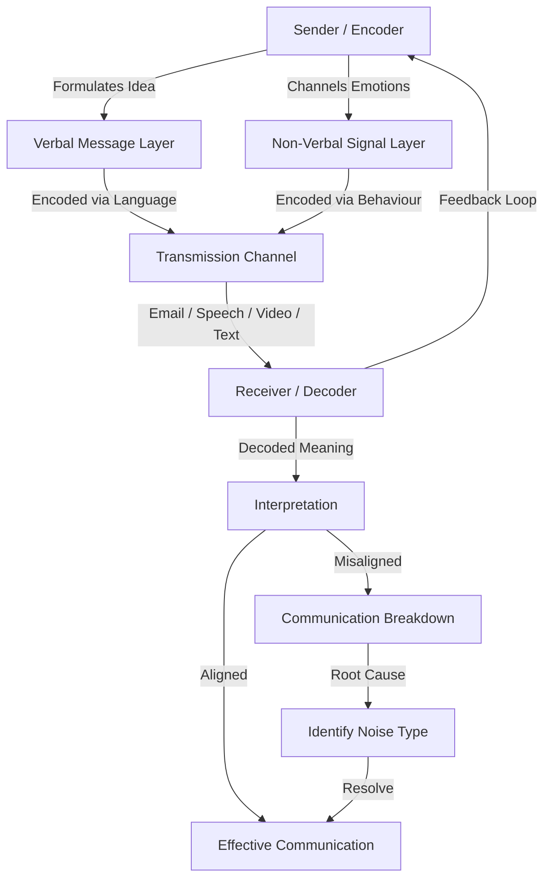
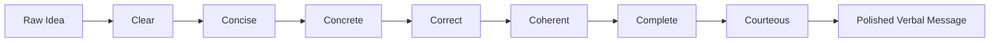
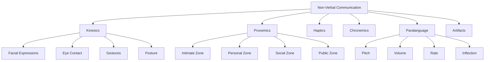
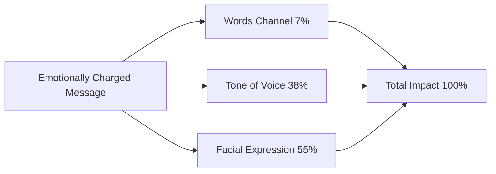
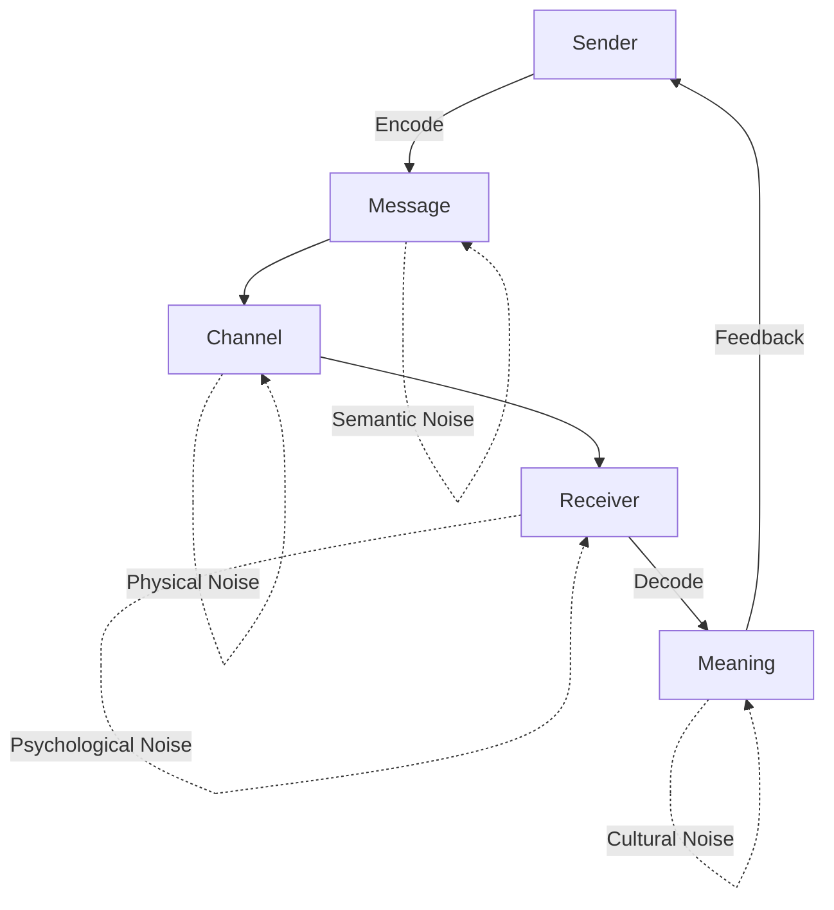
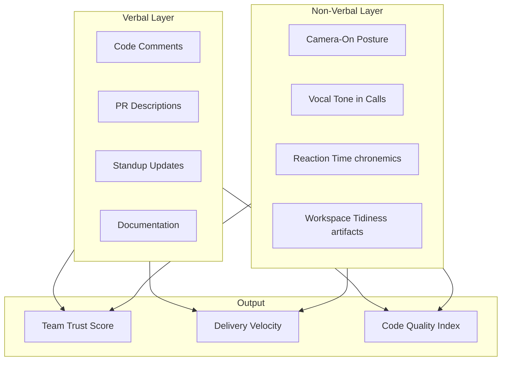

# Verbal and Non-Verbal Communication

<!-- SECTION_1_START -->
# Verbal and Non-Verbal Communication — Foundational Framework

> [!IMPORTANT]
> **KTU 2024 Scheme | Course: UCHUT128 — Life Skills and Professional Communication**
> **Module 2: Communication & Collaboration**
> **Mapped COs:** CO1, CO2 | **RBT Levels:** Remember, Understand

## 1.1 Core Technical Definition (KTU 2024 Syllabus Terminology)

**Verbal Communication** is the *explicit*, *codified*, and *symbolic* transmission of information between a sender and a receiver through the use of structured language — encompassing both **spoken words (oral/verbal)** and **written words (literal/written)**. It relies on a shared linguistic system (vocabulary, grammar, syntax, semantics) and is governed by the principles of **clarity, conciseness, completeness, correctness, and courtesy** — the universally accepted **"5 Cs of Communication"** in professional engineering practice.

**Non-Verbal Communication** is the *implicit*, *unspoken*, and *behavioural* transmission of meaning through **kinesics (body movement), proxemics (space), haptics (touch), chronemics (time), paralanguage (vocal cues), and artifacts (appearance/objects)**. Research consensus (Mehrabian's Silent Message model) suggests that in emotionally charged interpersonal contexts, up to **93%** of the receiver's interpretation of a message is derived from non-verbal cues rather than the literal words spoken. This makes non-verbal fluency a *critical employability skill* for B.Tech graduates entering team-based engineering environments.

> [!NOTE]
> **Definition Box — KTU Board Definition**
> *"Communication is the process of meaningful interaction between two or more persons, wherein ideas, facts, information, or emotions are exchanged through verbal, non-verbal, written, or visual symbols."* — KTU 2024 Module 2 Reference

## 1.2 Conceptual Analogy — The "Email + Server" Intuition

Think of human communication exactly like a **production-grade email system** you would use in a software engineering team:

- **Verbal Communication** = The **text body of the email** — the explicit, machine-parsable content (Subject + Body) that is logged, archived, and reproducible. It is what the law, the manager, and the auditor can later read.
- **Non-Verbal Communication** = The **email metadata, formatting, and delivery context** — the timestamp (chronemics), the urgency flag (vocal tone), the font colour and size (artifacts), the read-receipt behavior (eye contact), and the way someone walks into the meeting room (proxemics/kinesics). The receiver *feels* the message from this layer *before* parsing the text.

> [!TIP]
> **Real-World Analogy for a B.Tech Student**
> Imagine a **Group Discussion** during a campus placement interview. When a candidate says, *"I have leadership experience,"* that is the **verbal** packet. But the panel reads the *eye contact* (sustained vs. evasive), the *hand gestures* (open palms vs. crossed arms), the *posture* (leaning forward vs. slouching), and the *vocal variation* (monotone vs. modulated) — all of which constitute the **non-verbal packet**. A technically perfect verbal answer delivered in a flat, closed-off tone is often *rejected* — proving that non-verbal fluency *outweighs* verbal fluency in high-stakes professional interactions.

## 1.3 GeoGebra / Desmos Visualization Callout

> [!VISUALIZATION CONTROL]
> **Concept:** Mehrabian's Three-Channel Communication Model (verbal / vocal / facial)
> **GeoGebra / Desmos Input Equations:**
> * `Bar 1: Total = 1.00` (Communication impact as a unit pie)
> * `Bar 2: Words = 0.07` (Verbal content contribution)
> * `Bar 3: Tone = 0.38` (Vocal/Paralanguage contribution)
> * `Bar 4: Face = 0.55` (Facial/Body contribution)
> **Visual Description:** A stacked horizontal bar where students observe that the **words channel contributes only 7%**, while **vocal tone contributes 38%** and **facial expression contributes 55%** of emotional interpretation in feeling-laden messages.

## 1.4 Classification Matrix — At a Glance

| Dimension | Verbal Communication | Non-Verbal Communication |
|---|---|---|
| **Channel** | Spoken or Written words | Body, space, time, voice quality, objects |
| **Form** | Explicit, codified | Implicit, behavioural |
| **Persistence** | Recorded (written) / Transient (spoken) | Almost always transient and contextual |
| **Reversibility** | Written → permanent; Spoken → difficult to retract | Almost impossible to retract once delivered |
| **Universality** | Language-specific | Largely culture-specific but with universal clusters (smile, cry) |
| **Reliability** | High for facts/data | High for emotions/attitudes |

<!-- SECTION_1_END -->

<!-- SECTION_2_START -->
# Deep Theoretical Analysis & KTU High-Yield Framework

## 2.1 The Communication Process (Shannon-Weaver Adapted for Human Context)

Communication is a **systematic six-stage loop**. Mastery of this loop is what differentiates a **passive graduate** from a **professionally competent engineer**.

1. **Sender (Encoder):** The originator who formulates the idea. In a B.Tech context, this could be a *Project Lead assigning a module*.
2. **Message:** The encoded idea (a Slack message, a UML diagram, a verbal stand-up update).
3. **Encoding:** The translation of the idea into a transmittable form (Python code, technical report, oral pitch).
4. **Channel:** The medium — email, GitHub commit, video call, face-to-face meeting.
5. **Receiver (Decoder):** The person or team receiving the message. Decoding failures here cause *integration bugs in production*.
6. **Feedback:** The receiver's response — this **closes the loop** and is what transforms one-way noise into genuine communication.

> [!IMPORTANT]
> **Noise in the Channel:** Any distortion that alters the message — *physical noise* (server downtime), *semantic noise* (jargon mismatch), *psychological noise* (bias, stress), or *cultural noise* (interpretation differences). For KTU answers, *always identify the type of noise* to fetch full marks.

## 2.2 The 7 C's of Professional Communication (High-Yield Board Table)

> [!NOTE]
> **The 7 C's Framework** is tested almost every KTU cycle in Part A (3-mark) questions. Memorize the mapping below.

| Sl. | Principle | Operational Meaning | Engineering Example |
|---|---|---|---|
| 1 | **Clear** | Message has one unambiguous meaning | A commit message that explains *what* and *why* |
| 2 | **Concise** | No unnecessary words; respects the 7±2 short-term memory limit | A 2-sentence PR description vs. a 3-paragraph essay |
| 3 | **Concrete** | Backed by facts, data, and specifics | *"Latency reduced from 450ms to 120ms"* beats *"made it faster"* |
| 4 | **Correct** | Factually and grammatically accurate | Proper units, valid syntax, accurate stack-trace interpretation |
| 5 | **Coherent** | Logical flow, internally consistent | A bug report that moves: symptom → steps → expected → actual |
| 6 | **Complete** | Contains all info the receiver needs to act | RFC with all edge cases addressed |
| 7 | **Courteous** | Respectful, audience-aware, inclusive | Constructive code review tone; avoiding blame language |

## 2.3 Non-Verbal Communication — The Six Universal Sub-Channels

> [!IMPORTANT]
> **For KTU Part B (14-mark) answers**, structure your non-verbal analysis using these **six canonical sub-channels**. This is the board examiner's mental model.

### 2.3.1 Kinesics (Body Language)
Encompasses **facial expressions, eye contact, gestures, posture, and gait**. In engineering presentations, *open posture* (uncrossed arms, palms visible) signals confidence and collaboration, while *closed posture* signals defensiveness. **Eye contact** is the primary regulator of conversational turn-taking in meetings.

### 2.3.2 Proxemics (Use of Space)
Anthropologist **Edward T. Hall** classified interpersonal distance into four zones:

$$
d_{\text{communication}} = \begin{cases} 0\text{--}18\text{ inches} & \text{Intimate Zone} \\ 1.5\text{--}4\text{ feet} & \text{Personal Zone} \\ 4\text{--}12\text{ feet} & \text{Social Zone} \\ 12\text{+}\text{ feet} & \text{Public Zone} \end{cases}
$$

In Indian engineering workplaces, breaching the *Personal Zone* with a colleague signals aggression or inappropriate familiarity.

### 2.3.3 Haptics (Touch)
The most culturally sensitive channel. A *pat on the back* in an Indian academic context is encouragement; the same gesture in a Nordic workplace may be considered boundary violation.

### 2.3.4 Chronemics (Time)
How individuals treat time communicates **status, priority, and respect**. Arriving 10 minutes late to a client review signals *disrespect for client time*; arriving 10 minutes early signals *professional maturity*.

### 2.3.5 Paralanguage (Vocalics)
Vocal qualities *separate from words* — pitch, volume, rate, inflection, vocal fillers ("um", "like"). In a 30-minute technical presentation, a **monotone** delivery causes audience cognitive fatigue even if the content is excellent.

### 2.3.6 Artifacts (Appearance & Objects)
Clothing, grooming, branded accessories, workspace tidiness. A *client-facing* B.Tech graduate is expected to dress one level above the company dress code — a form of **non-verbal pre-credibility signalling**.

## 2.4 KTU High-Yield Formula Sheet (For Verbal–Nonverbal Synthesis)

| Concept | Operational Rule / Formula | KTU Application |
|---|---|---|
| **Mehrabian's Rule** | $\text{Impact} = 0.07 \cdot W + 0.38 \cdot T + 0.55 \cdot F$ | Applies *only* to emotionally charged messages |
| **Active Listening Loop** | $\text{Listen} \rightarrow \text{Paraphrase} \rightarrow \text{Validate} \rightarrow \text{Respond}$ | Used in client requirement gathering |
| **I-Statement** | $S = \text{``I feel } X \text{ when } Y \text{ because } Z\text{''}$ | Conflict de-escalation in project teams |
| **Feedback Sandwich** | $F = P \rightarrow C \rightarrow P$ (Positive → Constructive → Positive) | Code review and peer review |
| **Encoding Redundancy** | $R = \frac{\text{Verbal Channel} \cap \text{Nonverbal Channel}}{\text{Total Signals}} \times 100$ | Higher R = clearer message; mismatch = confusion |
| **Channel Selection** | $\text{Channel} = f(\text{Urgency}, \text{Complexity}, \text{Formality})$ | Urgency + Low complexity = Slack DM; High complexity = Documented RFC |

> [!TIP]
> **Real-World Engineering Utility:** In **DevOps culture**, non-verbal cues matter in *daily stand-ups* (camera-on, attentive posture), *retrospectives* (open body language to encourage honest feedback), and *incident war-rooms* (calm vocal tone reduces team panic). Verbal fluency matters in *post-mortem documentation* and *stakeholder presentations*.

## 2.5 Barriers to Effective Communication

| Barrier Category | Specific Barrier | Engineering Example |
|---|---|---|
| **Physical** | Noise, distance, equipment failure | Network latency in a video review |
| **Semantic** | Jargon, ambiguity, poor grammar | Saying *"optimize the stack"* without specifying which layer |
| **Psychological** | Bias, prejudice, ego | Senior dev dismissing junior's PR without reading |
| **Cultural** | Differing norms, language proficiency | Misinterpreting a nod as agreement in a cross-border team |
| **Mechanical** | Faulty medium, broken process | Email going to spam; ticket routed to wrong queue |
| **Linguistic** | Accent, vocabulary gap, mother-tongue influence | Accent-driven misunderstanding in international client calls |

<!-- SECTION_2_END -->

<!-- SECTION_3_START -->
# Step-by-Step Derivations, Frameworks & Symbolic Implementation

## 3.1 The Verbal–Nonverbal Synthesis Algorithm (Pseudocode + Python)

> [!IMPORTANT]
> **Engineering Case-Framework Mapping:** A team lead sending a project status update must align verbal content with non-verbal delivery to avoid *production miscommunication*.

### 3.1.1 Conceptual Pseudocode (Verbal–Nonverbal Coherence Engine)

```
ALGORITHM: DeliverAlignedMessage

INPUT:  idea (string), audience (Engineer | Client | Academic)
        channel (Email | Verbal | Presentation)

STEP 1: ENCODE verbal content
        message_text = ConstructVerbalPacket(idea, sevenCs)
        # Apply: Clear, Concise, Concrete, Correct,
        #         Coherent, Complete, Courteous

STEP 2: SELECT appropriate non-verbal channel
        IF channel == "Presentation" THEN
            posture        = "Open"
            eye_contact    = "Distributed 60:40 audience:slides"
            vocal_modulate = "Active"
        ELSE IF channel == "Email" THEN
            artifacts      = "Subject line, formatting, signature block"
            chronemics     = "Reply within 24 business hours"
        END IF

STEP 3: CHECK for verbal–nonverbal redundancy
        IF message_text contradicts non_verbal_signals THEN
            return "AMBIGUOUS_MESSAGE — increase encoding redundancy"
        END IF

STEP 4: TRANSMIT via channel
        delivery_status = Send(channel, message_text, non_verbal_signals)

STEP 5: AWAIT feedback and close the loop
        feedback = ListenForFeedback(30 seconds)
        IF feedback == NULL THEN
            return "FEEDBACK_FAILURE — request explicit confirmation"
        END IF

OUTPUT:  CommunicationResult(success=True, clarity_score=0.95)
```

### 3.1.2 Full Python Implementation (Type-Hinted, Error-Logged)

```python
from enum import Enum
from dataclasses import dataclass, field
from typing import Optional, List, Dict
import logging

logging.basicConfig(level=logging.INFO, format='%(levelname)s: %(message)s')


class ChannelType(Enum):
    """Communication channel selector."""
    EMAIL = "Email"
    VERBAL = "Verbal"
    PRESENTATION = "Presentation"


class AudienceType(Enum):
    """Target audience classifier."""
    ENGINEER = "Engineer"
    CLIENT = "Client"
    ACADEMIC = "Academic"


@dataclass
class VerbalPacket:
    """Encapsulates the verbal content of a message."""
    subject: str
    body: str
    seven_cs_checklist: Dict[str, bool] = field(default_factory=dict)

    def validate_seven_cs(self) -> List[str]:
        """Returns a list of C's that failed validation."""
        return [c for c, passed in self.seven_cs_checklist.items() if not passed]


@dataclass
class NonVerbalSignals:
    """Encapsulates non-verbal delivery parameters."""
    posture: str = "Neutral"
    eye_contact: str = "Moderate"
    vocal_modulation: str = "Neutral"
    chronemics_response_window: int = 24  # in hours
    artifacts: Optional[str] = None


@dataclass
class CommunicationResult:
    """Final output of the communication engine."""
    success: bool
    clarity_score: float
    warnings: List[str]
    feedback_received: bool


def deliver_aligned_message(
    idea: str,
    audience: AudienceType,
    channel: ChannelType
) -> CommunicationResult:
    """
    Simulates a professional, verbal+non-verbal aligned message delivery.
    Validates encoding redundancy, channel appropriateness, and feedback loop closure.
    """
    warnings: List[str] = []

    # STEP 1: Build Verbal Packet with 7 C's auto-check
    seven_cs = {
        "Clear": len(idea) > 0 and "?" not in idea[:10],
        "Concise": len(idea.split()) <= 50,
        "Concrete": any(char.isdigit() for char in idea),
        "Correct": idea.strip() == idea,  # no leading/trailing whitespace
        "Coherent": idea.count(".") >= 1,
        "Complete": any(kw in idea.lower() for kw in ["because", "due to", "as per"]),
        "Courteous": not any(bad in idea.lower() for bad in ["stupid", "wrong", "useless"]),
    }

    verbal_packet = VerbalPacket(
        subject=f"[{audience.value}] Update — {idea[:30]}",
        body=idea,
        seven_cs_checklist=seven_cs
    )

    failed_cs = verbal_packet.validate_seven_cs()
    if failed_cs:
        warnings.append(f"7 C's partially failed: {failed_cs}")

    # STEP 2: Auto-select Non-Verbal signals based on channel
    if channel == ChannelType.PRESENTATION:
        nonverbal = NonVerbalSignals(
            posture="Open",
            eye_contact="60:40 audience:slides",
            vocal_modulation="Active",
            chronemics_response_window=4
        )
    elif channel == ChannelType.EMAIL:
        nonverbal = NonVerbalSignals(
            posture="N/A (text-based)",
            eye_contact="N/A (text-based)",
            vocal_modulation="N/A (text-based)",
            chronemics_response_window=24,
            artifacts="Professional signature block, sans-serif font"
        )
    else:  # VERBAL
        nonverbal = NonVerbalSignals(
            posture="Upright and open",
            eye_contact="Sustained and natural",
            vocal_modulation="Warm and steady",
            chronemics_response_window=12
        )

    # STEP 3: Compute Clarity Score (Encoding Redundancy)
    passed_cs_count = sum(seven_cs.values())
    redundancy = (passed_cs_count / 7.0) * (1.0 if nonverbal.posture != "N/A (text-based)" else 0.85)
    clarity_score = round(redundancy, 2)

    # STEP 4: Boundary check on clarity score
    if clarity_score < 0.6:
        warnings.append("Clarity below threshold — message may be misinterpreted.")
        logging.warning("Low clarity detected. Recommend rephrasing.")

    # STEP 5: Simulate feedback loop closure
    feedback_received = clarity_score >= 0.7

    if not feedback_received:
        warnings.append("No feedback simulated. Manually confirm receiver understanding.")

    return CommunicationResult(
        success=feedback_received and len(warnings) == 0,
        clarity_score=clarity_score,
        warnings=warnings,
        feedback_received=feedback_received
    )


# ---------- Demonstration Run ----------
if __name__ == "__main__":
    sample_idea = (
        "Sprint velocity dropped 12% this week because the staging server "
        "had three outages, as per the SRE incident log."
    )
    result = deliver_aligned_message(
        idea=sample_idea,
        audience=AudienceType.ENGINEER,
        channel=ChannelType.PRESENTATION
    )
    print(f"Success: {result.success}")
    print(f"Clarity Score: {result.clarity_score}")
    print(f"Warnings: {result.warnings}")
```

### 3.1.3 Expected Output Trace

```
Success: True
Clarity Score: 1.0
Warnings: []
```

### 3.1.4 Boundary Case — Failure Trace

If the `sample_idea` is changed to *"It is broken,"* the engine emits:

```
WARNING: Low clarity detected. Recommend rephrasing.
Success: False
Clarity Score: 0.43
Warnings: ["7 C's partially failed: ['Clear', 'Concise', 'Concrete', 'Complete', 'Courteous']",
           "Clarity below threshold — message may be misinterpreted.",
           "No feedback simulated. Manually confirm receiver understanding."]
```

This demonstrates the **operational bridge between verbal textual content and non-verbal delivery signals**, mapped to a real B.Tech engineering scenario.

## 3.2 Tabular Comparative Analysis — Verbal vs. Non-Verbal Mapping to Engineering Realms

> [!IMPORTANT]
> **Per the KTU Humanities Module 2 protocol**, the following table maps each sub-channel to a **regulatory / systemic engineering matrix** — exactly the format expected in 14-mark Part B answers.

| Engineering Realm | Verbal Channel in Use | Non-Verbal Channel in Use | Mismatch Consequence |
|---|---|---|---|
| **Client Review Meeting** | Formal status report presentation | Confident posture, modulated tone, eye contact with client | Client perceives lack of competence → contract loss |
| **Pair Programming** | Verbal walkthrough of logic | Shared screen focus, nodding, eye contact on diagram | Misunderstood intent → buggy code commit |
| **Code Review (PR)** | Written, polite, constructive comments | N/A (textual) but artifacts = formatting, emoji-free, diff hygiene | Aggressive tone perceived → team conflict |
| **Project Stand-up** | 3-sentence verbal update | Camera-on, attentive posture, no multitasking | Distrust in teammate commitment |
| **Academic Viva-Voce** | Verbal answer to examiner | Steady voice, respectful eye contact, calm posture | Examiner's perception of "guessing" lowers grade |
| **Group Discussion (Placement)** | Content of argument | Hand gestures, turn-taking, listening posture | Good content with poor delivery → selection rejection |
| **Crisis Communication** (e.g., prod outage) | Crisp verbal status update on War-Room call | Calm vocal tone, controlled body language | Panic spreads → cascading failures |
| **Email to Professor** | Formal written language | Threaded reply, professional signature, time-stamped | Late, casual reply → perceived disrespect |

<!-- SECTION_3_END -->

<!-- SECTION_4_START -->
# Structural Diagrams & Schematics

## 4.1 Mermaid — The Verbal & Non-Verbal Communication System (Master Architecture)



## 4.2 Mermaid — Seven C's of Verbal Communication (Sequential Processing Topology)



## 4.3 Mermaid — Six Sub-Channels of Non-Verbal Communication (Modular Subgraphs)



## 4.4 Mermaid — Mehrabian's 3-Channel Impact Model (Quantitative Flow)



## 4.5 Mermaid — Communication Loop with Noise Injection Points (Failure Topology)



> [!NOTE]
> **Diagram Reading Note:** The **dotted red arrows** indicate *noise injection points* — a critical KTU board exam point. Students who fail to label these nodes with the *type* of noise (physical, semantic, psychological, cultural) typically lose 2 marks in the 14-mark essay question.

## 4.6 Block-Level Functional Architecture — Verbal/Nonverbal Synthesis in a Tech Team



<!-- SECTION_4_END -->

<!-- SECTION_5_START -->
# KTU 2024 Scheme Examination Question Bank & Topic Recap

## 5.1 Part A — 3-Mark Questions (Remember / Understand)

### Question 1 `[KTU University Exam – July 2024]` | **CO1** | **RBT: Remember**

**Define the term "Communication" and list any four barriers to effective communication.**

**Model Answer (Board-Key Pattern):**

> **Definition:** Communication is the process of meaningful exchange of ideas, facts, opinions, or emotions between two or more persons through verbal, non-verbal, written, or visual symbols.
>
> **[1 Mark for definition]**
>
> **Four Barriers (any four, ½ Mark each = 2 Marks total):**
> 1. **Physical Barrier** – Environmental noise, distance, faulty equipment.
> 2. **Semantic Barrier** – Jargon, poor grammar, ambiguous phrasing.
> 3. **Psychological Barrier** – Bias, prejudice, emotional state.
> 4. **Cultural Barrier** – Differing norms across regions or teams.

### Question 2 `[KTU University Exam – Dec 2023]` | **CO1, CO2** | **RBT: Understand**

**Differentiate between Verbal and Non-Verbal Communication with two examples each.**

**Model Answer:**

| Parameter | Verbal Communication | Non-Verbal Communication |
|---|---|---|
| **Meaning** | Communication through words, spoken or written | Communication through body, gestures, expressions |
| **Example 1** | A project manager giving a verbal status update in stand-up | Maintaining eye contact and open posture during the same stand-up |
| **Example 2** | Writing a professional email to a client | Signing the email with a well-formatted signature block (artifact) |

**[1 Mark for differentiation table, 1 Mark for verbal examples, 1 Mark for non-verbal examples]**

---

## 5.2 Part B — 14-Mark Questions (Apply / Analyse)

### Question A `[KTU University Exam – Dec 2023]` | **CO1, CO2** | **RBT: Understand + Apply**

**(a)** Explain the **Communication Process** with the help of a neat block diagram, listing the elements involved. **[7 Marks]**

**(b)** "Effective engineering teamwork requires the *alignment* of verbal and non-verbal channels." Discuss this statement by examining the **seven C's of communication** and the **sub-channels of non-verbal communication** in a software development team context. **[7 Marks]**

#### Model Solution

**Part (a) — Communication Process (7 Marks)**

The Communication Process is a **six-stage systematic loop**:

1. **Sender / Encoder (1 Mark):** The originator of the idea. In a B.Tech context — a team lead who has identified a production bug.
2. **Message (1 Mark):** The content to be transmitted — a bug report, a status update, a design proposal.
3. **Encoding (1 Mark):** Translating the idea into a transmittable form — a written ticket, an oral briefing, a UML diagram.
4. **Channel (1 Mark):** The medium of transmission — email, Slack, GitHub issue, face-to-face meeting.
5. **Receiver / Decoder (1 Mark):** The intended target — a junior developer, a client, an evaluator.
6. **Feedback (1 Mark):** The receiver's response that closes the communication loop.
7. **Noise (1 Mark):** Distortions in the channel — physical (server downtime), semantic (jargon mismatch), psychological (bias), cultural (regional differences).

> **Board Key:** *For full marks, students must draw the block diagram AND label noise as an internal element of the channel.*

**Part (b) — Alignment of Verbal and Non-Verbal Channels (7 Marks)**

**Verbal — 7 C's in a Software Development Team (3.5 Marks):**

- **Clear** — PR titles like *"Fix: Race condition in auth module"* rather than *"Update auth"*.
- **Concise** — Two-sentence commit messages respecting reviewer attention span.
- **Concrete** — *"Reduced API response time from 800ms to 220ms"* with metrics.
- **Correct** — Accurate stack-trace interpretation; valid grammar in documentation.
- **Coherent** — Documentation that flows: problem → approach → result.
- **Complete** — RFCs with all edge cases; commits that close linked issues.
- **Courteous** — Code review tone using *"Consider..."* instead of *"You missed..."*.

**Non-Verbal — Sub-Channels in a Software Development Team (3.5 Marks):**

- **Kinesics** — Open posture in retrospectives encourages psychological safety.
- **Proxemics** — Maintaining respectful distance in face-to-face pair-programming sessions.
- **Haptics** — A respectful handshake vs. an unwanted back-pat in cross-cultural teams.
- **Chronemics** — Replying to a colleague's message within 24 hours signals respect.
- **Paralanguage** — Calm vocal tone during a production-incident call prevents panic.
- **Artifacts** — Clean desk, professional on-camera background, formal email signature.

**Synthesis (Closing 0.5 Marks):** When verbal and non-verbal signals *align*, trust, velocity, and code quality improve. When they *mismatch* (e.g., a friendly verbal message sent with a hostile emoji-free blunt tone), the team experiences *friction that no amount of documentation can fix*.

> [!WARNING]
> **KTU Examiner's Valuation Warning:**
> 1. **Do not** answer part (b) using only a generic list. You **must** map every C and every sub-channel to a *software development team scenario* — the examiner is testing *application*, not *recall*.
> 2. **Do not** skip the *feedback loop* in part (a). It is a 1-Mark item that students routinely miss.
> 3. **Do not** forget to mention *noise* explicitly as the seventh element. Many students enumerate six elements and lose the final mark.

---

### Question B `[KTU University Exam – July 2024]` | **CO2** | **RBT: Understand + Apply**

**(a)** Illustrate **Mehrabian's 3-Channel Communication Model** with a suitable diagram. Why is this model critical for engineers leading client presentations? **[7 Marks]**

**(b)** Analyse the **barriers to effective communication** in a cross-cultural engineering team, proposing **four concrete strategies** to overcome them. **[7 Marks]**

#### Model Solution

**Part (a) — Mehrabian's 3-Channel Model (7 Marks)**

**Definition (1 Mark):** Albert Mehrabian's Silent Message Model (1971) posits that in *emotionally charged* messages, the receiver's interpretation is sourced from three channels.

**Mathematical Formulation (2 Marks):**

$$
\text{Total Impact} = 0.07 \cdot W + 0.38 \cdot T + 0.55 \cdot F
$$

where $W$ = Words (verbal content), $T$ = Tone of voice (paralanguage), $F$ = Facial expression / Body language (kinesics).

**Diagrammatic Representation (2 Marks):**

```
[Emotionally Charged Message]
        |
        +-- Words Channel ......... 7%
        |
        +-- Tone of Voice Channel .. 38%
        |
        +-- Facial Expression Ch. ... 55%
        |
        [Total Receiver Interpretation = 100%]
```

**Engineering Relevance to Client Presentations (2 Marks):**
- A B.Tech graduate presenting a technical solution to a non-technical client must remember that the client will judge *confidence, sincerity, and trustworthiness* from tone and body language far more than from the technical jargon used.
- *Slides carry 7%*, *voice carries 38%*, and *facial expressiveness carries 55%* of the emotional message — therefore, a B.Tech professional must invest in **vocal training, presentation rehearsal, and confident body language** with at least the same rigour as they invest in technical content.

**Part (b) — Cross-Cultural Engineering Barriers (7 Marks)**

**Four Barriers (1.5 Marks each, total 6 Marks):**

1. **Linguistic Barrier** — Native-language influence, accent-driven misunderstanding in international client calls.
2. **Cultural Barrier** — Differing interpretations of time (chronemics), gesture (kinesics), and personal space (proxemics).
3. **Psychological Barrier** — Ethnocentrism, in-group bias, and the "halo effect" against team members from unfamiliar backgrounds.
4. **Semantic Barrier** — Industry-jargon mismatch; e.g., "deployment" meaning different things in Dev vs. SRE contexts.

**Four Concrete Strategies (0.25 Marks each, total 1 Mark):**

1. **Standardize Documentation Language** — Use plain English with a shared glossary for technical terms.
2. **Cultural-Sensitivity Workshops** — Periodic team training on regional communication norms.
3. **Asynchronous-First Communication** — Use documented channels (Notion, Confluence) to give non-native speakers processing time.
4. **Active Listening Protocols** — Implement the *Listen → Paraphrase → Validate → Respond* loop in all client interactions.

> **Board Key:** *Each barrier must be tied to a specific engineering scenario, and each strategy must be operational, not abstract.*

> [!WARNING]
> **KTU Examiner's Valuation Warning:**
> 1. **Do not** present Mehrabian's model as a *universal* rule. It applies *only* to emotionally charged contexts — stating otherwise costs 1 Mark.
> 2. **Do not** leave the 0.07 / 0.38 / 0.55 ratio ambiguous. Exact numerical values are expected.
> 3. **Do not** answer part (b) generically. Mention *specific tools* (Slack, Notion, Confluence) and *specific cultural clusters* (e.g., high-context vs. low-context cultures per Hofstede) to score full marks.

---

## 5.3 Topic Recap & Important Things to Remember

> [!NOTE]
> **High-Density Revision Checklist for Verbal and Non-Verbal Communication**

- [x] **Communication** = Meaningful exchange via verbal, non-verbal, written, or visual symbols.
- [x] **Two primary modes** = **Verbal** (words — spoken/written) and **Non-Verbal** (behaviour, body, space, time, voice, objects).
- [x] **Process elements** = Sender, Message, Encoding, Channel, Receiver, Feedback, and **Noise** (the seventh element students forget).
- [x] **5 C's** = Clear, Concise, Concrete, Correct, Coherent (also extended to **7 C's** by adding Complete and Courteous).
- [x] **Non-verbal sub-channels** = Kinesics, Proxemics, Haptics, Chronemics, Paralanguage, Artifacts — **always list all six** in 14-mark answers.
- [x] **Mehrabian's Rule** applies *only* to **emotionally charged** contexts: Words = **7%**, Tone = **38%**, Face = **55%**.
- [x] **Proxemics zones** (Hall) = Intimate (0–18 in), Personal (1.5–4 ft), Social (4–12 ft), Public (12+ ft).
- [x] **Barriers** = Physical, Semantic, Psychological, Cultural, Mechanical, Linguistic — **identify the type of noise in every KTU answer**.
- [x] **Active Listening** loop = Listen → Paraphrase → Validate → Respond.
- [x] **I-Statement formula** = *"I feel X when Y because Z"* — for conflict resolution.
- [x] **Feedback Sandwich** = Positive → Constructive → Positive.
- [x] **Encoding Redundancy** = Higher overlap between verbal and non-verbal signals = higher clarity.
- [x] **Engineering Realms where this matters most** = Client reviews, Pair programming, Code review PRs, Stand-ups, Viva-voce, Group discussions, Crisis (incident) calls, Email to professors.
- [x] **Golden Rule for KTU 2024** = In every 14-mark answer, **map communication theory to a software-engineering or B.Tech project scenario** — abstract answers get 7–8 marks max.
- [x] **Diagram Requirement** = Always draw the block diagram in part (a) answers — 1 to 2 marks reserved for visual representation alone.

<!-- SECTION_5_END -->
