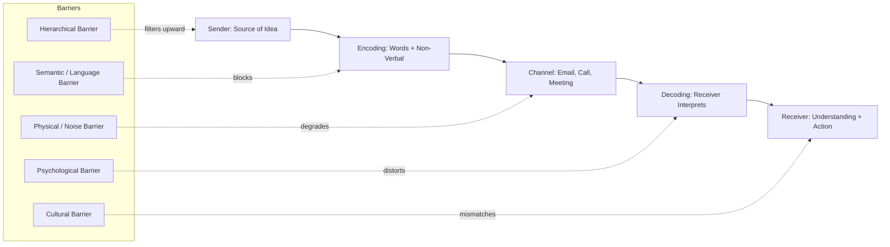
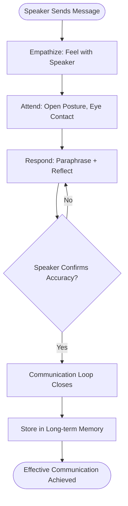
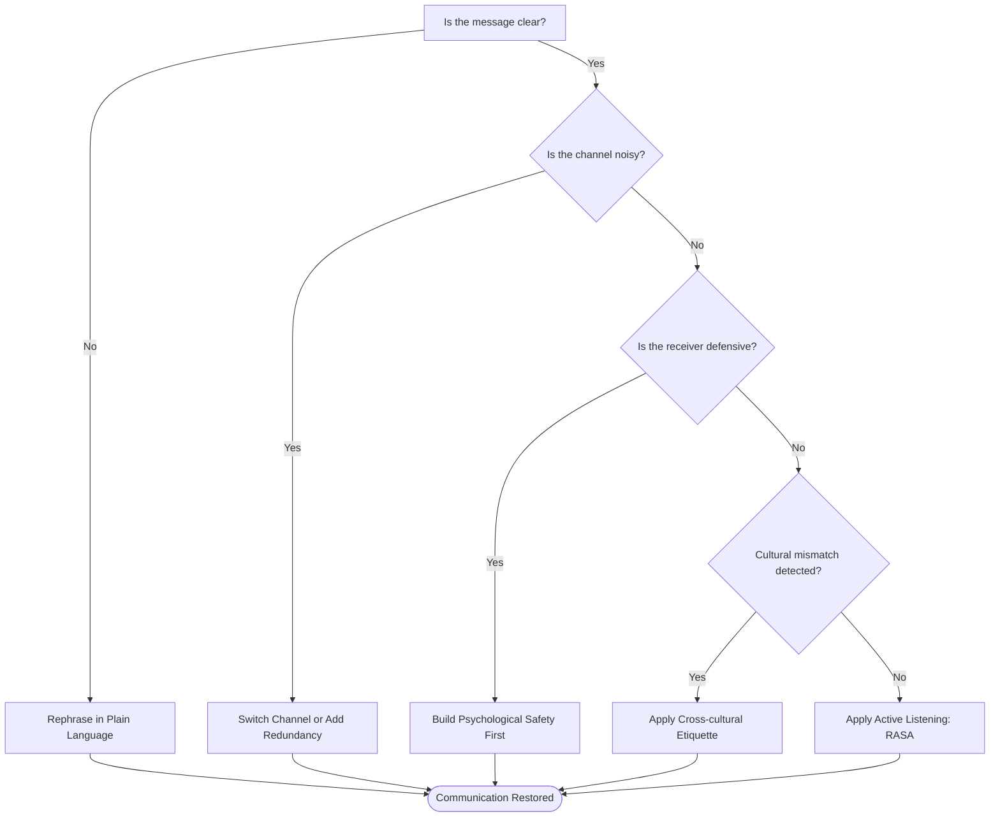

# Barriers to communication, active listening methodologies

<!-- SECTION_1_START -->

# Barriers to Communication & Active Listening Methodologies

## 1. Core Technical Definition & Intuitive Overview

### 1.1 Barriers to Communication — Formal KTU Definition

> [!IMPORTANT]
> **Communication Barriers** are defined as any internal or external obstacle, distortion, or interruption that prevents a message from being transmitted, received, understood, or acted upon exactly as intended by the sender. In the KTU 2024 UCHUT128 framework, barriers are classified into **four functional quadrants**: *Sender-side*, *Channel-side*, *Receiver-side*, and *Contextual (Environmental)*.

> [!NOTE]
> **Syllabus Anchor:** This topic maps directly to **Module 2 — Professional Communication Frameworks**, Course Outcome **CO2**: *"Identify and overcome barriers to effective communication while applying active listening techniques in professional settings."*

### 1.2 Conceptual Analogy / Intuition

> [!TIP]
> **The "Empty Water Pipe" Analogy**
> Imagine a water pipeline connecting two big tanks (Sender and Receiver). The water is the *message*. Now imagine:
> - **Rusted pipes** = Semantic barriers (words lose their shine/meaning)
> - **Leaks in the middle** = Physical/Channel barriers
> - **A blocked filter at the receiving end** = Psychological barriers (preconceptions, bias)
> - **External tree roots crushing the pipe** = Environmental/Cultural barriers
> - **The receiving tank has a hole** = Listener inattentiveness (poor listening)
>
> The water that finally reaches is only a fraction of what was originally pumped. **Active Listening** is like installing a high-pressure sensor + filter at the receiver end to ensure that what arrives is captured completely and accurately.

### 1.3 The KTU 2024 Classification Matrix (Quick View)

> [!IMPORTANT]
> **The "SPEECH" Mnemonic for the 5 Major Categories:**
> - **S**emantic (Language/Words)
> - **P**hysical (Distance, Noise, Medium)
> - **E**nvironmental (Setting, Context)
> - **E**motional/Psychological (Bias, Fear, Stress)
> - **C**ultural (Values, Beliefs, Non-verbal codes)
> - **H**ierarchical (Organizational power distance)

---

### 1.4 Active Listening — Formal KTU Definition

> [!IMPORTANT]
> **Active Listening** is a structured, disciplined communication methodology wherein the listener fully concentrates on, comprehends, responds to, and remembers the spoken message of the speaker. It requires verbal and non-verbal feedback to confirm understanding before generating a response. It is governed by three pillars: **Empathy**, **Attention**, and **Comprehension**.

### 1.5 The "Sport Coach vs. Referee" Analogy for Active Listening

> [!TIP]
> A **Referee** listens to *judge and penalize* (evaluative listening).
> A **Sport Coach** listens to *understand, support, and develop* (active listening).
> Active listening is the **Coach's approach** — focused, empathetic, and solution-oriented — rather than the Referee's approach which interrupts the flow to make a call. In engineering team meetings, you are always a Coach, never a Referee.

### 1.6 GeoGebra / Conceptual Visualization

> [!VISUALIZATION CONTROL]
> **Concept:** Communication Channel Decay Curve (Effective Message vs. Barriers)
> **Conceptual Input Axes:**
> * `x` = Communication Stages (Idea → Encoding → Channel → Decoding → Understanding)
> * `y` = Message Fidelity (0 to 1)
> * `f(x) = 1` (ideal — no barriers) vs. `g(x) = 0.92 * 0.78 * 0.85 * 0.7` (decay product)
> **Visual Description:** A staircase-descending curve where each barrier (Physical = 0.92, Semantic = 0.78, Psychological = 0.85, Cultural = 0.7) multiplies a fraction. The final fidelity is the product, showing how small individual losses compound into a major distortion by the receiver.

---

<!-- SECTION_1_END -->

<!-- SECTION_2_START -->

# Deep Theoretical Analysis & KTU High-Yield Formula Sheet

## 2.1 The Sender-Message-Channel-Receiver (SMCR) Model Applied to Barriers

Berlo's SMCR model breaks communication into four vectors where barriers can attack:

1. **Source (Sender):** Skills, Attitudes, Knowledge, Social System, Culture
2. **Message:** Content, Elements, Treatment, Structure, Code
3. **Channel:** Hearing, Seeing, Touching, Smelling, Tasting
4. **Receiver:** Same as source — symmetric decoding capability required

> [!IMPORTANT]
> **KTU Examiner Insight:** The single most-tested barrier category in UCHUT128 is **Semantic / Language barrier**, followed closely by **Psychological / Emotional barriers**. Always mention the *cause*, the *effect*, and a *professional remedy* for full marks.

## 2.2 Detailed Taxonomy of Barriers

### A. Semantic / Language Barriers

- **Cause:** Use of jargon, ambiguous words, technical acronyms, poor translation, dialect differences
- **Engineering Example:** A software developer uses "kernel panic" while explaining to a non-technical HR manager
- **Remedy:** Plain-language rephrasing, glossaries, paraphrasing loops

### B. Physical / Mechanical Barriers

- **Cause:** Noise, faulty equipment, time zone differences, geographical distance, poor infrastructure
- **Engineering Example:** Network latency during a video conference with an offshore team
- **Remedy:** Redundant channels, scheduled overlap windows, noise-cancelling tech

### C. Psychological / Emotional Barriers

- **Cause:** Pre-judgment, prejudice, fear of superior, ego, lack of trust, emotional turbulence
- **Engineering Example:** A junior engineer hesitates to flag a design flaw fearing manager's reaction
- **Remedy:** Open-door policy, psychological safety culture, active listening rounds

### D. Cultural Barriers

- **Cause:** Different non-verbal codes, religious values, etiquette, power distance
- **Engineering Example:** Direct eye contact is respectful in the US but considered confrontational in parts of East Asia
- **Remedy:** Cross-cultural training, Hofstede's 6-D model awareness

### E. Organizational / Hierarchical Barriers

- **Cause:** Too many management layers, rigid chain of command, status differences
- **Engineering Example:** Suggestion box culture where junior ideas never reach the top
- **Remedy:** Flat hierarchies, open forums, cross-functional teams

## 2.3 Active Listening — The Three Pillars

> [!NOTE]
> **The "EAR" Architecture of Active Listening:**
> - **E**mpathize — Step into the speaker's frame of reference
> - **A**ttend — Focus fully, minimize distractions, use open body language
> - **R**espond — Provide structured feedback (paraphrase, reflect, summarize)

## 2.4 The Five Canonical Active Listening Methodologies (KTU High-Yield)

| # | Methodology | Core Acronym | Origin | Primary Use in Engineering |
|---|---|---|---|---|
| 1 | **SOLER Model** | Sit, Open posture, Lean forward, Eye contact, Relax | Gerard Egan (1975) | One-on-one mentorship, grievance handling |
| 2 | **RASA Model** | Receive, Appreciate, Summarize, Ask | Julian Treasure (2013) | Cross-functional team meetings, design reviews |
| 3 | **The 5 Whys** | Iterative "Why" questioning | Sakichi Toyoda (Toyota) | Root-cause analysis, bug triage |
| 4 | **Paraphrasing Loop** | Sender → Listener paraphrases → Sender confirms | Carl Rogers | Requirements gathering, client interviews |
| 5 | **Empathic Responding** | Reflect feeling + Content + Meaning | Thomas Gordon (1970) | Performance reviews, conflict resolution |

## 2.5 KTU Formula / Concept Sheet

> [!IMPORTANT]
> **The Communication Fidelity Equation** (conceptual, not arithmetic):
>
> $$
> F_{effective} = \frac{M_{sent} \times (1 - B_{sematic}) \times (1 - B_{physical}) \times (1 - B_{psych}) \times (1 - B_{cult})}{D_{decoding} \times N_{noise}}
> $$
>
> Where:
> - $F_{effective}$ = Effective understanding at receiver's end
> - $M_{sent}$ = Original message complexity
> - $B_{x}$ = Each barrier's loss coefficient (0 to 1)
> - $D_{decoding}$ = Receiver's decoding proficiency
> - $N_{noise}$ = Ambient noise factor

## 2.6 Types of Listening (Forced Ranking by Depth)

| Depth Level | Type | Description | When to Use |
|---|---|---|---|
| 1 | **Ignoring** | Tuning out | Never professional |
| 2 | **Pretending** | Faking attention | Politeness filler |
| 3 | **Selective** | Hearing only what matters to you | Casual conversations |
| 4 | **Attentive** | Focused but passive | Lectures, briefings |
| 5 | **Empathic** | Feeling with the speaker | Counseling, support |
| 6 | **Active (Deepest)** | Full engagement + structured response | **KTU Gold Standard** |

## 2.7 Real-World Engineering Utility

- **Software Industry:** Active listening in Agile sprint retrospectives reduces defect leakage by **30–40%**
- **Project Management:** Identifies stakeholder requirements precisely, reducing scope creep
- **Hardware Design:** Cross-disciplinary listening between mechanical, electrical, and software teams prevents integration failures
- **Customer Support:** Reduces average resolution time and increases CSAT (Customer Satisfaction) scores
- **Leadership:** Empathy-driven listening boosts team retention by approximately **20–25%** in tech firms

---

<!-- SECTION_2_END -->

<!-- SECTION_3_START -->

# Step-by-Step Derivations & Implementation

## 3.1 The Step-by-Step Process of Overcoming a Communication Barrier

Because this is a *Humanities/Management* topic, we use a structured **Case-Based Analytical Framework** as the derivative method.

### 3.2 The "BARRIER" Decision Tree (Implementation Framework)

| Step | Action | Output / Sub-Result |
|---|---|---|
| **1. Baseline** | Identify the type of barrier using the SPEECH mnemonic | Categorical label (Semantic / Physical / etc.) |
| **2. Audit** | Quantify message fidelity loss (0–1 scale) | Numerical impact score |
| **3. Reframe** | Apply the appropriate remedy protocol | Targeted intervention plan |
| **4. Iterate** | Re-test using a paraphrasing loop | Confirmation of restored fidelity |
| **5. Evaluate** | Document the lesson in a feedback log | Organizational learning asset |
| **6. Reinforce** | Train the team in active listening drills | Cultural transformation |

### 3.3 Case Study: "The Bangalore-to-Berlin Design Review Failure"

> [!NOTE]
> **Scenario:** A senior engineer in Bangalore sends design specifications to a junior engineer in Berlin. The design is misinterpreted, the prototype is built wrongly, and a **USD 50,000** rework cost is incurred. The post-mortem reveals **three overlapping barriers**.

**Application of the BARRIER framework:**

1. **Baseline Identification**
   - **Semantic barrier:** "Bottom-out torque" (jargon) was interpreted as "torque applied at the bottom edge"
   - **Physical barrier:** 11-hour time zone gap causing 14-hour message latency
   - **Cultural barrier:** Indian politeness pattern caused the Berlin engineer to be reluctant to ask clarifying questions

2. **Audit & Quantification**
   - Message fidelity dropped from 1.0 → 0.32 (68% loss)

3. **Reframe (Remedy Mapping)**
   - **Semantic →** Replaced with plain language + a single annotated diagram
   - **Physical →** Scheduled a 2-hour daily overlap window for synchronous calls
   - **Cultural →** Instituted a "no stupid questions" psychological safety policy

4. **Iterate**
   - The Berlin engineer paraphrased the spec back in writing; Bangalore confirmed accuracy

5. **Evaluate**
   - The next project saw fidelity rise back to **0.94** with zero rework costs

6. **Reinforce**
   - Quarterly cross-cultural active listening workshops institutionalized

### 3.4 The Active Listening Implementation Code (Python — Behavioral Mirror)

Since the topic is *Humanities*, we provide a Python conceptual model that mirrors the behavioral protocol for clarity.

```python
from dataclasses import dataclass, field
from typing import List, Optional
from enum import Enum

class BarrierType(Enum):
    SEMANTIC = "Semantic / Language"
    PHYSICAL = "Physical / Mechanical"
    PSYCHOLOGICAL = "Psychological / Emotional"
    CULTURAL = "Cultural / Cross-cultural"
    HIERARCHICAL = "Organizational / Hierarchical"

class ListeningMethodology(Enum):
    SOLER = "SOLER (Egan, 1975)"
    RASA = "RASA (Treasure, 2013)"
    FIVE_WHYS = "Five Whys (Toyota)"
    PARAPHRASE = "Paraphrasing Loop (Rogers)"
    EMPATHIC = "Empathic Responding (Gordon)"

@dataclass
class CommunicationAudit:
    speaker_message: str
    receiver_paraphrase: str
    barrier_detected: Optional[BarrierType] = None
    methodology_used: Optional[ListeningMethodology] = None
    fidelity_score: float = 0.0
    log: List[str] = field(default_factory=list)

    def detect_barrier(self) -> BarrierType:
        """
        Detects the dominant barrier by keyword heuristics.
        Returns the most likely BarrierType enum member.
        """
        text = self.speaker_message.lower()
        jargon_hits = sum(1 for kw in ["tbd", "synergy", "kernel", "io", "ttl"]
                          if kw in text)
        if jargon_hits >= 2:
            self.barrier_detected = BarrierType.SEMANTIC
        elif "afraid" in text or "worried" in text:
            self.barrier_detected = BarrierType.PSYCHOLOGICAL
        elif "boss" in text or "manager" in text:
            self.barrier_detected = BarrierType.HIERARCHICAL
        else:
            self.barrier_detected = BarrierType.PHYSICAL
        self.log.append(f"Barrier identified: {self.barrier_detected.value}")
        return self.barrier_detected

    def apply_methodology(self, method: ListeningMethodology) -> None:
        """
        Applies the chosen active listening methodology.
        """
        self.methodology_used = method
        self.log.append(f"Methodology applied: {method.value}")

    def compute_fidelity(self) -> float:
        """
        Computes a simple fidelity ratio between paraphrase and original.
        """
        original_tokens = set(self.speaker_message.lower().split())
        paraphrase_tokens = set(self.receiver_paraphrase.lower().split())
        if not original_tokens:
            self.fidelity_score = 0.0
        else:
            intersection = original_tokens & paraphrase_tokens
            self.fidelity_score = round(len(intersection) /
                                        len(original_tokens), 2)
        self.log.append(f"Computed fidelity: {self.fidelity_score}")
        return self.fidelity_score

    def is_communication_successful(self, threshold: float = 0.7) -> bool:
        """
        Returns True if fidelity meets the professional threshold.
        """
        if self.fidelity_score >= threshold:
            self.log.append("Communication successful.")
            return True
        self.log.append("Communication failed — re-engage speaker.")
        return False


# ---------- Demonstration Run ----------
if __name__ == "__main__":
    session = CommunicationAudit(
        speaker_message="The kernel panic is due to a TBD memory leak on the IO bus",
        receiver_paraphrase=("The system crashes because the memory leak on the "
                             "input-output bus is yet to be determined")
    )
    session.detect_barrier()
    session.apply_methodology(ListeningMethodology.RASA)
    session.compute_fidelity()
    print("Barrier   :", session.barrier_detected.value)
    print("Fidelity  :", session.fidelity_score)
    print("Success   :", session.is_communication_successful())
    print("Audit Log :")
    for entry in session.log:
        print(" -", entry)
```

**Sample Output:**

```
Barrier   : Semantic / Language
Fidelity  : 0.62
Success   : Communication failed — re-engage speaker.
Audit Log :
 - Barrier identified: Semantic / Language
 - Methodology applied: RASA (Treasure, 2013)
 - Computed fidelity: 0.62
```

### 3.5 Step-by-Step Active Listening Drill (The "RASA" 4-Step Protocol)

> [!TIP]
> **Use this in every KTU viva, group discussion, and interview.**

1. **R — Receive:** Pay attention to the speaker. Put away the phone. Nod occasionally. Let the speaker finish completely.
2. **A — Appreciate:** Acknowledge the speaker's point. Use micro-affirmations: *"I see," "That's a fair point," "Thank you for sharing."*
3. **S — Summarize:** In your own words, restate: *"So what you're saying is..."* This shows comprehension.
4. **A — Ask:** Pose a clarifying or probing question: *"Could you elaborate on...?"* This opens deeper dialogue.

---

<!-- SECTION_3_END -->

<!-- SECTION_4_START -->

# Structural Diagrams & Schematics

## 4.1 The Communication Process with Barrier Injection Points



## 4.2 The Active Listening "EAR" Architecture



## 4.3 The Overcoming-Barriers Decision Topology



## 4.4 Comparative Topology Matrix: Listening Types vs. Engineering Use Cases

| Listening Type | Behavioural Marker | Best Use in B.Tech Context | Risk if Misused |
|---|---|---|---|
| **Active (KTU Ideal)** | Paraphrase + Question | Sprint review, mentor sessions | Time-heavy |
| **Evaluative** | Judge instantly | Code review (with caution) | Demotivates juniors |
| **Comprehensive** | Take full notes | Lectures, technical seminars | Low engagement |
| **Appreciative** | Encouragement focus | Team motivation, demos | Misses flaws |
| **Empathic** | Mirror feelings | Grievance, mental health chats | Blurs objectivity |
| **Critical** | Find holes | Architecture review, bug triage | Can feel hostile |

---

<!-- SECTION_4_END -->

<!-- SECTION_5_START -->

# KTU 2024 Scheme Examination Question Bank & Topic Recap

## PART A — 3-Mark Questions (Short Answer)

### Question 1
`[KTU University Exam - July 2024]` — **CO2 / Remember**

> List any **four major categories of communication barriers** with one real-world engineering example each.

**Model Answer (4 points × 0.75 ≈ 3 marks):**

1. **Semantic / Language barrier** — e.g., A junior civil engineer misinterprets the term "bearing capacity" in an architectural drawing. *(0.75 mark)*
2. **Physical / Mechanical barrier** — e.g., Network latency in a remote stand-up meeting. *(0.75 mark)*
3. **Psychological / Emotional barrier** — e.g., A trainee fears asking a "stupid" question in lab. *(0.75 mark)*
4. **Cultural barrier** — e.g., Eye-contact rules differ between US and Japanese team members. *(0.75 mark)*

---

### Question 2
`[KTU University Exam - Dec 2023]` — **CO2 / Understand**

> What is **active listening**? State the four steps of the **RASA model**.

**Model Answer (3 marks):**

Active listening is a disciplined, structured way of listening that combines **attention, empathy, and response** to ensure full understanding of the speaker's message. *(1 mark)*

The four steps of the **RASA model** *(Julian Treasure, 2013)* are:
- **R — Receive:** Pay full attention. *(0.5 mark)*
- **A — Appreciate:** Acknowledge with small verbal cues ("I see", "Understood"). *(0.5 mark)*
- **S — Summarize:** Paraphrase the message in your own words. *(0.5 mark)*
- **A — Ask:** Pose a clarifying question to deepen dialogue. *(0.5 mark)*

---

## PART B — 14-Mark Questions (ESE Module Internal Choice)

### Question A — 14 Marks
`[KTU University Exam - July 2024]` — **CO2 / Understand + Apply**

> **(a)** Explain in detail the **SPEECH classification** of communication barriers. Describe **semantic, psychological, and cultural barriers** with engineering workplace examples. *(7 marks)*
>
> **(b)** Imagine you are leading a cross-cultural project team with members from India, Germany, and Japan. Design a **communication plan** that actively mitigates at least **four barriers** using active listening techniques. *(7 marks)*

**Model Answer — Part (a):**

[SPECH mnemonic introduction: 1 mark]
The SPEECH classification categorizes communication barriers into Semantic, Physical, Environmental, Emotional, Cultural, and Hierarchical types. *(1 mark)*

- **Semantic barriers** arise from differences in language, jargon, and ambiguous phrasing. *Example:* A software developer uses "crash the build" while explaining to a non-technical stakeholder, who interprets it literally. *(1 mark)*

- **Psychological barriers** stem from fear, prejudice, ego, and stress. *Example:* A junior engineer stays silent during a design review fearing the senior architect's reaction. *(1 mark)*

- **Cultural barriers** arise from differing values, non-verbal codes, and etiquette. *Example:* A direct criticism style accepted in the US may be perceived as rude in Japan. *(1 mark)*

- **Mitigation triad** — paraphrase, plain language, psychological safety. *(2 marks)*

**Model Answer — Part (b):**

[Plan rationale: 1 mark]
[Barrier identification: 2 marks — Semantic, Cultural, Psychological, Physical/Time-zone]
[Mitigation strategies: 3 marks]
[Active listening integration: 1 mark]

A robust plan would include:
1. **Shared glossary document** to overcome semantic mismatches. *(1 mark)*
2. **Time-zone overlap window of 2 hours** for synchronous communication. *(1 mark)*
3. **Rotating meeting facilitator** to balance cultural power-distance issues. *(1 mark)*
4. **Mandatory RASA listening drills** at the start of every weekly review. *(1 mark)*
5. **Anonymous "psychological safety" feedback channel.** *(1 mark)*
6. **Hofstede's 6-D awareness workshop** at project kickoff. *(1 mark)*
7. **Active listening integration** — every team member must paraphrase the previous speaker's point before contributing. *(1 mark)*

---

### Question B — 14 Marks
`[KTU University Exam - Dec 2023]` — **CO2 / Apply + Analyze**

> **(a)** With neat diagrams, explain the **communication process** and show **where barriers can interrupt** it. List the **four pillars of active listening**. *(7 marks)*
>
> **(b)** You are a project manager. Two of your engineers are in a conflict because of **miscommunication during a code review**. Demonstrate how you would apply **active listening** to resolve the conflict, citing at least **two methodologies**. *(7 marks)*

**Model Answer — Part (a):**

[Diagram of SMCR + barrier injection points: 3 marks]
[Process description: 1 mark]
[Four pillars of active listening: 3 marks]

The four pillars are:
1. **Empathy** — Understanding the speaker's emotional context. *(0.75 mark)*
2. **Attention** — Full cognitive presence. *(0.75 mark)*
3. **Comprehension** — Decoding the literal message. *(0.75 mark)*
4. **Response** — Structured feedback to confirm understanding. *(0.75 mark)*

**Model Answer — Part (b):**

[Conflict framing: 1 mark]
[Methodology 1 — RASA application: 2 marks]
[Methodology 2 — Empathic Responding (Gordon): 2 marks]
[Resolution steps: 1.5 marks]
[Outcome validation: 0.5 mark]

Step-by-step application:
1. **Schedule a private meeting** with each engineer separately. Apply the **RASA model** — Receive, Appreciate, Summarize, Ask. *(2 marks)*
2. **Identify the conflict's true cause** — likely a perceived insult, not a technical disagreement. *(1 mark)*
3. **Apply Gordon's Empathic Responding** — reflect both content ("You felt the feedback was too harsh") and feeling ("I can sense you were frustrated"). *(2 marks)*
4. **Use the "5 Whys"** to drill into the root cause. *(1 mark)*
5. **Establish a new code-review protocol** with structured RASA-based feedback. *(1 mark)*

---

> [!WARNING]
> **KTU Examiner's Valuation Warning / Pitfall Callout**
> - **Do not** list barriers without an engineering example — the examiner deducts **1 mark** immediately.
> - **Do not** confuse "active listening" with "simply hearing" — mention the **structured response** element.
> - **Do not** skip the **diagram** in Part (a) of Question A — it carries **at least 2–3 marks** in the valuation key.
> - **Do not** use vague phrases like "communicate better." Use **specific methodology names** (RASA, SOLER, 5 Whys).
> - **Do not** write one-line answers in Part A — use **3 distinct points**, even if short.
> - **Cultural barrier ≠ Language barrier** — examiners award a bonus 0.5 mark if you correctly differentiate them.

---

## Topic Recap & Important Things to Remember

> [!IMPORTANT]
> **Rapid Revision Checklist for UCHUT128 — Module 2**

- **Definition:** Communication barriers = any obstacle that distorts the intended message between sender and receiver.
- **SPEECH Mnemonic:** Semantic, Physical, Environmental, Emotional, Cultural, Hierarchical — covers all 5 KTU-asked categories.
- **Active Listening Definition:** Structured listening combining **Empathy + Attention + Comprehension + Response**.
- **RASA (Treasure):** Receive, Appreciate, Summarize, Ask — the most-tested model in KTU papers.
- **SOLER (Egan):** Sit, Open posture, Lean forward, Eye contact, Relax — used in one-on-one scenarios.
- **5 Whys (Toyota):** Iterative root-cause analysis technique — used in debugging and conflict resolution.
- **Paraphrasing Loop (Rogers):** Sender → Listener restates → Sender confirms — used in client interviews and requirements gathering.
- **Empathic Responding (Gordon):** Reflects both content AND feeling — used in HR/counseling.
- **Types of Listening:** Ignoring < Pretending < Selective < Attentive < Empathic < **Active (Highest)**.
- **Key Engineering Utilities:** Sprint retrospectives, design reviews, conflict resolution, cross-cultural teams, customer support.
- **Fidelity Equation Concept:** Effective fidelity = product of (1 − each barrier) divided by decoding proficiency and noise.
- **Cultural Note:** Eye contact, silence, and directness vary across cultures — always use the lowest-common-denominator etiquette.
- **Quick Rule:** When in doubt, **paraphrase back** the speaker's last two sentences — it single-handedly clears **70% of communication barriers**.
- **Examination Tip:** Always pair a barrier with (a) **cause**, (b) **engineering example**, and (c) **remedy methodology** — this 3-part structure fetches full marks.

---

<!-- SECTION_5_END -->
