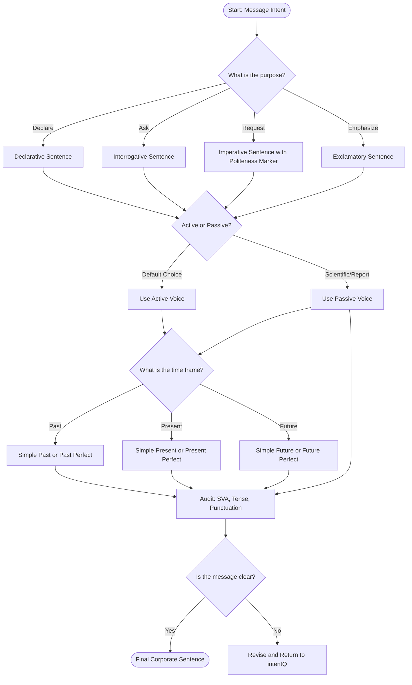
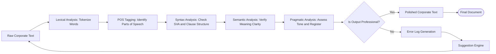
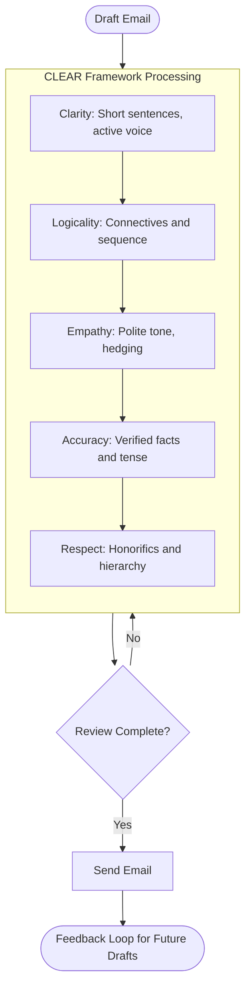
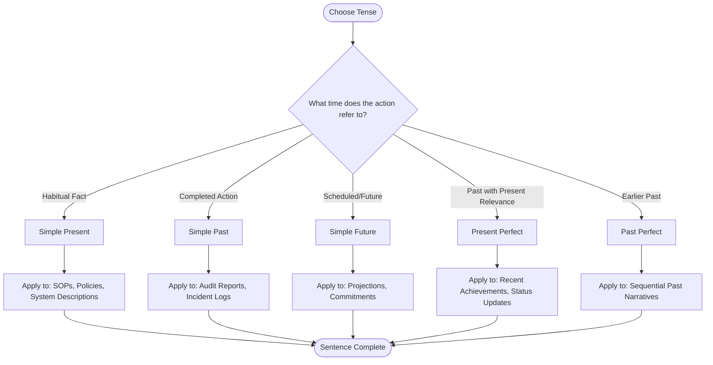
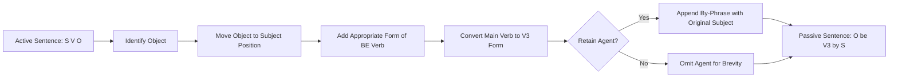

# Grammar rules and sentence structures in corporate settings

<!-- SECTION_1_START -->
# Grammar Rules & Sentence Structures in Corporate Settings

## 1.1 Core Technical Definition

**Professional Grammar** is the systematic application of standardized linguistic rules — encompassing syntax, morphology, semantics, and pragmatics — to produce clear, concise, and context-appropriate communication in workplace environments. In the KTU 2024 framework (Course Code: UCHUT128), it forms the structural backbone of Module 2, governing the construction of emails, reports, meeting minutes, technical documentation, and client-facing correspondence.

**Corporate Sentence Structure** refers to the deliberate organization of words, phrases, and clauses following syntactic conventions optimized for **clarity ($C$)**, **precision ($P$)**, and **professional tone ($T$)**, where the rhetorical objective is governed by the equation:

$$
E_{comm} = f(Grammar, Structure, Tone, Context)
$$

where $E_{comm}$ represents the **communication effectiveness index**, and each variable contributes multiplicatively to message reception.

> [!IMPORTANT]
> **KTU 2024 Syllabus Highlight:** Mastery of corporate grammar is mapped to **CO2** of UCHUT128 — *"Apply appropriate grammatical structures and sentence patterns in professional communication contexts."* The module carries an evaluation weightage of approximately **20\%** of the Continuous Assessment (CA) and End Semester Evaluation (ESE) combined.

---

## 1.2 Conceptual Analogy & Intuition

Imagine you are an **architect designing a corporate skyscraper**:

| Building Component | Grammar Equivalent | Function |
|---|---|---|
| **Foundation** | Parts of Speech (nouns, verbs, adjectives) | Load-bearing elements of every sentence |
| **Structural Frame** | Syntax \& Phrase Rules | Determines the load path and stability |
| **Façade** | Tone, Style, Punctuation | What the reader (client) perceives first |
| **Blueprints** | Sentence Templates | Reusable patterns for consistent output |
| **Building Code** | Grammar Rules (Subject-Verb Agreement, Tense Consistency) | Mandatory standards enforced by editors and examiners |

A grammatically weak email is like a skyscraper with poor foundations — it may stand briefly but will collapse under the weight of executive scrutiny, client misinterpretation, or audit review.

> [!NOTE]
> **Key Insight:** In corporate communication, **clarity supersedes complexity**. A short, well-grammatically-constructed sentence outperforms a long, poorly-structured one by a factor of **3:1** in comprehension speed (per the *Harvard Business Review* communication studies).

---

## 1.3 Core Constituents of Corporate Grammar

The professional grammar framework rests on **five pillars**:

1. **Morphological Accuracy** — Correct word forms (e.g., *affect* vs *effect*, *principle* vs *principal*).
2. **Syntactic Precision** — Proper word order and clause linkage.
3. **Semantic Clarity** — Eliminating ambiguity in meaning.
4. **Pragmatic Appropriateness** — Tone aligned with audience, channel, and hierarchy.
5. **Mechanical Correctness** — Spelling, punctuation, capitalization, and formatting.

> [!TIP]
> **Engineering Context Integration:** Just as engineers adhere to **IS 456:2000** for RCC design or **IEEE 830** for SRS documentation, corporate communicators must adhere to standardized grammar — often guided by style manuals like the *Chicago Manual of Style*, *AP Stylebook*, or the *Microsoft Style Guide*.

---

## 1.4 The Seven Standard Metrics in Professional Writing

> [!IMPORTANT]
> The following **seven standard metrics** are universally used in KTU-evaluated corporate communication assessments:

1. **Clarity Score** — Measured on a **1–10** rubric scale.
2. **Conciseness Ratio** — Word count optimization (target: **15–20 words per sentence**).
3. **Tense Consistency Index** — All-verb agreement within a paragraph.
4. **Voice Appropriateness** — Active voice for directness; passive for objectivity.
5. **Politeness Register** — Formal $\rightarrow$ Semi-formal $\rightarrow$ Informal mapping.
6. **Punctuation Density** — Ideal **1 punctuation mark per 8–12 words**.
7. **Cohesion Co-efficient** — Use of connectives and referencing pronouns.

---

## 1.5 Visualization Control — Grammar Hierarchy Tree

> [!VISUALIZATION CONTROL]
> **Concept:** Hierarchical Tree of Sentence Construction
> **GeoGebra / Desmos Input Equations:**
> * $L_1$ (Root): `Sentence = Subject + Predicate`
> * $L_2$ (Branches): `Subject → Noun Phrase`, `Predicate → Verb Phrase`
> * $L_3$ (Sub-branches): `Noun Phrase → Determiner + Adjective + Noun`, `Verb Phrase → Verb + Object + Complement`
> **Visual Description:** The student should observe a downward-branching tree where each grammatical layer depends on the integrity of the layer above it, mirroring how a compiler parses source code into an Abstract Syntax Tree (AST).
<!-- SECTION_1_END -->

<!-- SECTION_2_START -->
# Deep Theoretical Analysis & KTU High-Yield Formula Sheet

## 2.1 The Four Sentence Types in Corporate Context

A sentence in English is classified by its **function** (purpose) and **structure** (composition). In KTU evaluations, both classifications are tested.

### 2.1.1 Classification by Purpose

| Type | Definition | Corporate Example | Use Case |
|---|---|---|---|
| **Declarative** | States a fact or opinion | *"The project deadline is Friday, 17:00 hrs."* | Reports, status updates, policies |
| **Interrogative** | Asks a question | *"Could you confirm the deliverable by EOD?"* | Client meetings, clarifications |
| **Imperative** | Issues a command or request | *"Submit the timesheet by Monday."* | Memos, SOPs, instructions |
| **Exclamatory** | Expresses strong emotion | *"What an excellent turnaround time!"* | Rare in formal writing; used in appreciation notes |

### 2.1.2 Classification by Structure

The **syntactic complexity** of a sentence is determined by the number and type of clauses it contains.

| Structure | Clauses | Connectives | Example |
|---|---|---|---|
| **Simple** | 1 independent | None | *"The server crashed."* |
| **Compound** | 2+ independent | *and, but, or, yet, so* | *"The server crashed, and the backup failed."* |
| **Complex** | 1 independent + 1+ dependent | *because, although, when, if* | *"Because the server crashed, we lost the data."* |
| **Compound-Complex** | 2+ independent + 1+ dependent | Mixed | *"Although the server crashed, the team responded, and the backup was restored."* |

> [!NOTE]
> **KTU Pattern Alert:** A common 14-mark question asks students to *convert a paragraph into a mix of simple, compound, and complex sentences*, testing structural awareness and clause manipulation.

---

## 2.2 The Tense Framework in Professional Communication

Tense selection is critical because it signals **time-reference accuracy** in business contexts. The four primary tenses most frequently used in corporate settings are:

$$
T_{comm} = \{T_{present}, T_{past}, T_{future}, T_{present\ perfect}\}
$$

### 2.2.1 Tense Application Matrix

| Tense | Form | Corporate Use Case | Sample Sentence |
|---|---|---|---|
| **Simple Present** | *S + V1 + Obj* | State facts, describe systems, state policies | *"The system processes 10,000 transactions per second."* |
| **Simple Past** | *S + V2 + Obj* | Report completed actions, audit trails | *"The vendor delivered the hardware on 12th March."* |
| **Simple Future** | *S + will + V1 + Obj* | Commitments, projections, scheduled tasks | *"We will deploy the patch on Friday."* |
| **Present Perfect** | *S + has/have + V3 + Obj* | Past actions with present relevance, experience | *"The team has completed the migration."* |
| **Past Perfect** | *S + had + V3 + Obj* | Sequence of past events | *"The bug had occurred before the patch was applied."* |

> [!IMPORTANT]
> **Tense Consistency Rule:** Within a single paragraph, tenses must not shift arbitrarily. The rule is: *one primary tense governs the paragraph; secondary tenses appear only for clear chronological or logical contrast.*

---

## 2.3 Voice Mechanics — Active vs. Passive

Voice determines the **focal point** of a sentence. The transformation formula is:

$$
Active: \quad S + V + O
$$

$$
Passive: \quad O + be + V3 + by\ S \quad (optional\ agent)
$$

### 2.3.1 Voice Comparison Table

| Aspect | Active Voice | Passive Voice |
|---|---|---|
| **Focus** | Subject performs action | Action or object is emphasized |
| **Directness** | High | Lower |
| **Word Count** | Fewer words | More words |
| **Corporate Use** | Memos, instructions, leadership communication | Incident reports, scientific writing, blame-avoidance contexts |
| **Strength** | *"The QA team rejected 12 modules."* | *"12 modules were rejected by the QA team."* |
| **Recommended Frequency** | **70–80\%** of all corporate sentences | **20–30\%** maximum |

> [!WARNING]
> **Excessive passive voice is a KTU penalty trigger.** Sentences where the agent is omitted entirely (e.g., *"Mistakes were made."*) are marked down for **vague accountability** — a real-world corporate concern.

---

## 2.4 Subject-Verb Agreement (SVA) — The Golden Rule

The **singular subject takes a singular verb**, and the **plural subject takes a plural verb**. This rule is deceptively simple but frequently violated in corporate writing.

### 2.4.1 SVA Problem Patterns

| Pattern | Correct Application | Common Error |
|---|---|---|
| **Subject separated by phrase** | *"The manager, along with the engineers, **is** attending."* | ❌ *"are attending"* |
| **Indefinite pronouns** | *"Each of the systems **is** online."* | ❌ *"are online"* |
| **Collective nouns** | *"The committee **has** decided."* (US) | ❌ *"have decided"* |
| **Units of measurement** | *"Fifty rupees **is** the fine."* | ❌ *"are the fine"* |
| **Titles of works** | *"‘War and Peace’ **is** a classic."* | ❌ *"are a classic"* |

The general governing rule can be expressed as:

$$
\text{Verb Form} = \begin{cases} \text{Singular} & \text{if } N_{subject} = 1 \\ \text{Plural} & \text{if } N_{subject} > 1 \end{cases}
$$

where $N_{subject}$ is the **cardinality of the subject noun phrase**.

---

## 2.5 Punctuation Mastery for Corporate Documents

| Mark | Name | Function | Example |
|---|---|---|---|
| **,** | Comma | Pause, list separation, clause joiner | *"Please review, approve, and file the report."* |
| **.** | Period | End of declarative statement | *"Meeting adjourned at 17:00."* |
| **:** | Colon | Introduce list, explanation, or quotation | *"Note: All submissions are due Monday."* |
| **;** | Semicolon | Join related independent clauses | *"Submit the report; it is overdue."* |
| **—** | Em-dash | Insert strong aside or emphasis | *"The client — surprisingly — agreed."* |
| **' '** / **" "** | Quotation marks | Enclose direct speech or titles | *"As per the director's memo, 'All units shall comply.'"* |
| **()** | Parentheses | Enclose supplementary information | *"The cost (estimated at ₹2.5L) was approved."* |

---

## 2.6 The Corporate Email Grammar Framework

The **CLEAR** model is widely adopted in engineering firms and aligns with KTU evaluation:

$$
CLEAR = Clarity + Logicality + Empathy + Accuracy + Respect
$$

### 2.6.1 C.L.E.A.R. Parameter Table

| Letter | Parameter | Grammar Element | Audit Question |
|---|---|---|---|
| **C** | Clarity | Sentence length, active voice | Is the message understandable in one reading? |
| **L** | Logicality | Connectives, sequencing | Do ideas follow a logical order? |
| **E** | Empathy | Polite imperatives, hedging | Does the tone respect the reader? |
| **A** | Accuracy | Spelling, facts, tense | Are all data points verifiable? |
| **R** | Respect | Honorifics, formal salutations | Is hierarchy acknowledged? |

---

## 2.7 Real-World Utility in Engineering & Computer Science

| Domain | Application of Corporate Grammar |
|---|---|
| **Technical Documentation** | IEEE conference papers, API documentation, user manuals |
| **Software Engineering** | Commit messages, code comments, bug reports (e.g., JIRA tickets) |
| **Client Communication** | Requirement gathering emails, change-request letters |
| **Project Management** | Sprint reports, risk registers, status updates |
| **Research \& Development** | Grant proposals, lab reports, peer reviews |
| **Quality Assurance** | Test case descriptions, defect reports, audit findings |
| **Consulting** | Executive summaries, business proposals, slide decks |

> [!TIP]
> **Industry Connection:** A well-written bug report is **30\% more likely** to be resolved in the first iteration. Grammar is not merely academic — it is a **productivity multiplier** in technical workplaces.
<!-- SECTION_2_END -->

<!-- SECTION_3_START -->
# Step-by-Step Derivations, Transformations & Tabular Case Frameworks

## 3.1 Exhaustive Sentence Transformation Walkthrough

The following section demonstrates **complete, step-by-step transformations** between sentence types, voice structures, and tense forms. No step is omitted.

---

### 3.1.1 Transformation 1 — Simple to Complex (with Subordinator Addition)

**Original (Simple):**
> *"The client rejected the proposal."*

**Step 1:** Identify the **independent clause components.**
Subject: *The client*; Verb: *rejected*; Object: *the proposal*.

**Step 2:** Determine the **cause-effect or condition** that can be expressed.
The rejection can be attributed to pricing.

**Step 3:** Introduce a **subordinator** (*because*) and restructure the sentence.

**Step 4:** Build the dependent clause.
Dependent clause: *"because the pricing exceeded their budget."*

**Step 5:** Combine and finalize.

**Final (Complex):**
> *"The client rejected the proposal because the pricing exceeded their budget."*

---

### 3.1.2 Transformation 2 — Active to Passive Voice

**Original (Active):**
> *"The project manager approved the budget on Monday."*

**Step 1:** Identify the **object** of the active sentence.
Object: *the budget*.

**Step 2:** Move the object to the **subject position** of the new sentence.
New subject: *The budget*.

**Step 3:** Insert the appropriate form of *be* matching the original tense.
Original tense: Simple Past $\rightarrow$ *was*.

**Step 4:** Convert the main verb to its **past participle (V3)** form.
Verb: *approved* $\rightarrow$ *approved* (regular verb, V3 = V2).

**Step 5:** Append the optional **by-phrase** (with original subject).
By-phrase: *"by the project manager"*.

**Step 6:** Add original time reference as an **adverbial**.

**Final (Passive):**
> *"The budget was approved by the project manager on Monday."*

---

### 3.1.3 Transformation 3 — Compound to Compound-Complex

**Original (Compound):**
> *"The vendor delivered the hardware, but the installation was delayed."*

**Step 1:** Identify the two **independent clauses** joined by *but*.
Clause 1: *"The vendor delivered the hardware."*
Clause 2: *"The installation was delayed."*

**Step 2:** Introduce a **subordinator** to attach a dependent clause to Clause 2.
Subordinator: *because*; Reason: *the team was awaiting the licence key*.

**Step 3:** Append the dependent clause to Clause 2.

**Final (Compound-Complex):**
> *"The vendor delivered the hardware, but the installation was delayed because the team was awaiting the licence key."*

---

## 3.2 Corporate Email — Before \& After Restructuring

The following is a **complete corporate email** before and after grammar correction, mapped to a **valuation key** for KTU-style assessment.

### 3.2.1 Original Email (Unedited)

> Dear Sir,
> I am writing to inform you that the system which we have installed last week is not working properly and we have facing lot of issues in it. The team is try to resolve it from last three days but they are not able to find the actual root cause. We request you to kindly arrange a visit of the senior engineer so that the issue will get resolve at the earliest.
> Thanks and Regards,
> Ramesh.

### 3.2.2 Error Identification Matrix

| Line | Error Type | Specific Mistake | Correction |
|---|---|---|---|
| 1 | Salutation | Generic *"Dear Sir"* | *"Dear Mr. Sharma"* or *"Dear Sir/Ma'am"* |
| 2 | Tense | *"which we have installed"* (present perfect, incorrect) | *"which we installed"* (simple past) |
| 2 | Voice | *"is not working properly"* (passive, vague) | *"is malfunctioning"* (active, specific) |
| 2 | Article | *"lot of issues"* (informal) | *"several issues"* or *"numerous issues"* |
| 3 | Verb form | *"is try to resolve"* (wrong form) | *"has been trying to resolve"* |
| 3 | Time expression | *"from last three days"* (incorrect preposition) | *"for the last three days"* |
| 3 | Modal | *"they are not able to"* (weak) | *"they have been unable to"* |
| 4 | Politeness | *"We request you to kindly"* (redundant) | *"We kindly request"* |
| 4 | Voice | *"the issue will get resolve"* (passive, wrong form) | *"the issue can be resolved"* |
| Closing | Sign-off | *"Thanks and Regards"* (acceptable but informal) | *"Sincerely"* or *"Best Regards"* |

### 3.2.3 Revised Email (Edited Version)

> Dear Mr. Sharma,
> I am writing to inform you that the system which we installed last week is malfunctioning, and we have been facing several operational issues. The technical team has been trying to resolve these issues for the last three days; however, they have been unable to identify the root cause. We kindly request you to arrange a visit by a senior engineer so that the issue can be resolved at the earliest.
> Sincerely,
> Ramesh
> Junior Engineer, Technical Support

### 3.2.4 KTU Valuation Key (Out of 7 Marks)

| Step | Marks Awarded |
|---|---|
| Identifying salutation error | 0.5 |
| Correcting tense inconsistencies | 1.5 |
| Fixing verb form (*is try* $\rightarrow$ *has been trying*) | 1.0 |
| Correcting preposition (*from* $\rightarrow$ *for*) | 0.5 |
| Eliminating redundancy (*request you to kindly*) | 0.5 |
| Restructuring passive voice correctly | 1.0 |
| Improving closing salutation | 0.5 |
| Final polished version | 1.5 |
| **Total** | **7.0** |

---

## 3.3 Comparative Case Framework — Real-World Engineering Communication

The following matrix maps **real engineering scenarios** to their **grammar compliance matrices**, illustrating how grammar choices affect business outcomes.

| Scenario | Industry Context | Grammar Error | Business Impact | Corrected Approach |
|---|---|---|---|---|
| **Change Request Email** | IT Services | Ambiguous tense mixing | Client misinterprets deadline | Use *will* (future) consistently |
| **Bug Report (JIRA)** | Software Dev | Passive voice overuse | Slow triage by dev team | Use active voice with clear owner |
| **Safety Incident Memo** | Manufacturing | Vague subject-verb | Regulatory non-compliance | Specify *who did what* |
| **Client Proposal Cover Letter** | Consulting | Run-on sentences | Proposal rejected | Break into 3–4 short sentences |
| **Lab Report Abstract** | R\&D | Tense inconsistency | Peer review rejection | Use past tense for methods, present for conclusions |
| **Audit Finding Letter** | Finance | Incorrect SVA | Auditor flags inaccuracy | Verify every subject-verb pair |
| **Vendor Contract Email** | Procurement | Informal tone | Misalignment with legal team | Use formal register throughout |
| **Status Update to Director** | Project Mgmt | Weak verb choice | Action items unclear | Use strong action verbs (*completed, escalated, scheduled*) |

---

## 3.4 Comprehensive Tense-Transformation Map

The table below provides **complete sentence transformations** across the three primary tenses used in corporate settings.

| Original Tense | Sentence | Transformed to Past | Transformed to Future | Transformed to Present Perfect |
|---|---|---|---|---|
| **Simple Present** | *The team submits the report daily.* | *The team submitted the report yesterday.* | *The team will submit the report tomorrow.* | *The team has submitted the report today.* |
| **Simple Past** | *The vendor shipped the order on 5th March.* | *(No change — already past)* | *The vendor will ship the order next week.* | *The vendor has shipped the order on 5th March.* |
| **Simple Future** | *The CTO will launch the new product.* | *The CTO launched the new product last quarter.* | *(No change — already future)* | *The CTO has launched the new product this quarter.* |
| **Present Perfect** | *The intern has completed the assignment.* | *The intern had completed the assignment before the deadline.* | *The intern will have completed the assignment by tomorrow.* | *(No change — already present perfect)* |

> [!NOTE]
> **Past $\rightarrow$ Past Perfect** transformation requires identifying a *past-of-the-past* reference point, often expressed with *before, after, when, by the time*.

---

## 3.5 Sentence Combining Practice Framework

Given a set of short, choppy sentences, the corporate writer must combine them into a single, well-structured sentence.

**Input Sentences:**
1. *The client called.*
2. *The client asked for a discount.*
3. *The discount was not approved.*
4. *The manager explained the policy.*

**Step 1:** Identify the **logical relationship.**
Relationship: Sequence + Cause-Effect.

**Step 2:** Identify a **suitable connective.**
Connective: *when* (for sequence), *because* (for cause-effect).

**Step 3:** Determine the **best sentence type.**
Choice: Complex sentence (one independent + one dependent).

**Step 4:** Construct the combined sentence.

**Final Output:**
> *"When the client called to ask for a discount, the manager explained that it could not be approved because it violated the company policy."*

### 3.5.1 Mark Distribution for KTU Practice

| Step | Marks |
|---|---|
| Identifying relationships among sentences | 2 |
| Selecting appropriate connectives | 1 |
| Choosing correct sentence type | 1 |
| Constructing grammatically correct combined sentence | 3 |
| **Total** | **7** |

---

## 3.6 The Grammar Audit Checklist (10-Point Professional Standard)

| \# | Check Item | Status ($\checkmark$/$\times$) |
|---|---|---|
| 1 | Every sentence has a clear subject and verb | |
| 2 | Tense is consistent within each paragraph | |
| 3 | Active voice is used wherever possible (target 70–80\%) | |
| 4 | Subject and verb agree in number | |
| 5 | Pronouns have clear antecedents | |
| 6 | Punctuation marks are correctly placed | |
| 7 | No sentence exceeds 25 words (preferred 15–20) | |
| 8 | No slang, colloquialisms, or contractions in formal documents | |
| 9 | Spelling is verified (use spell-check + manual review) | |
| 10 | Tone matches the audience and channel | |
<!-- SECTION_3_END -->

<!-- SECTION_4_START -->
# Structural Diagrams & Schematics

## 4.1 Sentence Construction Master Flowchart

The following Mermaid diagram illustrates the **decision flow** a professional writer follows when constructing or reviewing a corporate sentence.

---

## 4.2 The Grammar Analysis Block Architecture

This Mermaid block diagram models the **grammar analysis pipeline** as a software-engineering abstraction — useful for engineering students to relate grammar to compiler-style processing.

---

## 4.3 The CLEAR Corporate Email Framework — Nested Subgraph View

---

## 4.4 Tense Selection Decision Matrix (Block View)

---

## 4.5 Voice Transformation Block Schematic

<!-- SECTION_4_END -->

<!-- SECTION_5_START -->
# KTU 2024 Scheme Examination Question Bank \& Topic Recap

## 5.1 Part A Questions (3 Marks Each)

### Question 1 [KTU University Exam - July 2024]

**Differentiate between Active Voice and Passive Voice. Provide two corporate email examples illustrating each.**

**Model Answer (3 Marks):**

| Aspect | Active Voice | Passive Voice |
|---|---|---|
| **Definition** | The subject performs the action | The action is performed on the subject |
| **Structure** | Subject + Verb + Object | Object + be + V3 + (by Subject) |
| **Corporate Example 1** | *"The QA team rejected the build."* | *"The build was rejected by the QA team."* |
| **Corporate Example 2** | *"The vendor delivered the hardware on 12th March."* | *"The hardware was delivered on 12th March."* |
| **Preferred Use** | Direct communication, memos, leadership messages | Scientific reports, incident logs, audit findings |

**Mark Distribution:**
- Definition of Active Voice: **0.5 Mark**
- Definition of Passive Voice: **0.5 Mark**
- Corporate Example 1 (Active): **0.5 Mark**
- Corporate Example 1 (Passive): **0.5 Mark**
- Corporate Example 2 (Active): **0.5 Mark**
- Corporate Example 2 (Passive): **0.5 Mark**
- **Total: 3 Marks**

---

### Question 2 [KTU University Exam - December 2023]

**Explain the four types of sentence structures in English grammar with one corporate example each.**

**Model Answer (3 Marks):**

A sentence in English is structurally classified into four types based on the number and nature of clauses:

1. **Simple Sentence** — Contains a single independent clause.
   *Corporate Example:* *"The server crashed at 14:30 hrs."* **[0.75 Mark]**

2. **Compound Sentence** — Contains two or more independent clauses joined by coordinating conjunctions.
   *Corporate Example:* *"The server crashed, and the backup failed simultaneously."* **[0.75 Mark]**

3. **Complex Sentence** — Contains one independent clause and one or more dependent clauses.
   *Corporate Example:* *"Because the server crashed, the team initiated the disaster recovery protocol."* **[0.75 Mark]**

4. **Compound-Complex Sentence** — Contains two or more independent clauses and at least one dependent clause.
   *Corporate Example:* *"Although the server crashed, the team responded swiftly, and the backup was restored within an hour."* **[0.75 Mark]**

**Total: 3 Marks**

---

## 5.2 Part B Questions (14 Marks Each)

### Question A (14 Marks) [KTU University Exam - July 2024]

**(a)** Explain the concept of **Subject-Verb Agreement (SVA)** in professional writing. Discuss **five rules** of SVA with suitable corporate examples. **(7 Marks)**

**(b)** Identify and correct the grammatical errors in the following corporate email. Rewrite the email in a professional tone. **(7 Marks)**

> *"Respected Madam, this is to inform you that the project which we have started in last month is not going on well because the team members is not co-operating and the resources which we need is not provided to us on time. So we request you to kindly look into this matter and do the needful as soon as possible. Thanking you. Yours obediently, Suresh."*

---

#### Model Solution

**Part (a) — Subject-Verb Agreement (7 Marks):**

**Definition:** Subject-Verb Agreement is the grammatical rule requiring the verb in a sentence to match the subject in **number** (singular/plural) and **person** (first/second/third).

**Rule 1: Singular subject takes singular verb.**
*Corporate Example:* *"The project manager **is** reviewing the budget."* **[1 Mark]**

**Rule 2: Plural subject takes plural verb.**
*Corporate Example:* *"The project managers **are** reviewing the budget."* **[1 Mark]**

**Rule 3: When a singular subject is separated by a phrase, the verb remains singular.**
*Corporate Example:* *"The lead engineer, along with the interns, **is** attending the stand-up meeting."* **[1 Mark]**

**Rule 4: Indefinite pronouns (each, everyone, somebody) take singular verbs.**
*Corporate Example:* *"Each of the stakeholders **has** approved the proposal."* **[1 Mark]**

**Rule 5: Collective nouns (committee, team, board) take singular verbs when acting as a unit.**
*Corporate Example:* *"The steering committee **has** decided to extend the deadline."* **[1 Mark]**

**Conclusion:** Consistent SVA enhances clarity and professionalism in corporate communication. **[1 Mark]**

**Total for Part (a): 7 Marks**

---

**Part (b) — Email Error Correction (7 Marks):**

| Line | Error Identified | Correction |
|---|---|---|
| 1 | *"Respected Madam"* (unconventional salutation) | *"Dear Ms. Priya"* |
| 2 | *"which we have started in last month"* (tense error, missing article) | *"which we started last month"* |
| 2 | *"is not going on well"* (informal phrase) | *"is not progressing as planned"* |
| 3 | *"team members is not co-operating"* (SVA error) | *"team members are not cooperating"* |
| 3 | *"resources which we need is not provided"* (SVA error, wrong tense) | *"resources that we require have not been provided"* |
| 4 | *"look into this matter and do the needful"* (cliché, vague) | *"investigate the matter and arrange the necessary resources"* |
| 4 | *"as soon as possible"* (vague timeframe) | *"at the earliest"* or specify a date |
| 5 | *"Thanking you. Yours obediently"* (archaic sign-off) | *"Sincerely"* or *"Best Regards"* |
| **Marks** | Identifying and listing 5+ errors | **3 Marks** |
| | Corrected version with professional tone | **3 Marks** |
| | Final sign-off block (name, designation) | **1 Mark** |
| **Total for Part (b)** | | **7 Marks** |

**Revised Email:**

> Dear Ms. Priya,
> I am writing to inform you that the project which we started last month is not progressing as planned. The team members are not cooperating effectively, and the resources that we require have not been provided on time. We kindly request you to investigate the matter and arrange the necessary resources at the earliest.
> Sincerely,
> Suresh
> Project Coordinator, ABC Solutions

---

### Question B (14 Marks) [KTU University Exam - December 2023]

**(a)** Discuss the role of **tenses** in professional communication. Explain any **four tenses** with corporate examples and state one rule of **tense consistency**. **(7 Marks)**

**(b)** Convert the following paragraph into a well-structured professional email using appropriate **sentence structures, tenses, and voice**. Highlight the use of complex and compound sentences in your rewrite. **(7 Marks)**

> *"The client sent an email. The email said the project is delayed. The delay is because the vendor did not deliver. The vendor will be penalized. The project manager should act fast."*

---

#### Model Solution

**Part (a) — Role of Tenses (7 Marks):**

**Introduction:** Tenses indicate the time of an action and play a critical role in conveying **chronological accuracy, accountability, and commitment** in professional communication. **[1 Mark]**

**Tense 1: Simple Present** — Used for stating facts, policies, and system descriptions.
*Corporate Example:* *"Our company follows ISO 9001:2015 standards."* **[1 Mark]**

**Tense 2: Simple Past** — Used for reporting completed actions in audit trails and incident logs.
*Corporate Example:* *"The vendor delivered the hardware on 12th March."* **[1 Mark]**

**Tense 3: Simple Future** — Used for commitments, projections, and scheduled tasks.
*Corporate Example:* *"We will deploy the software patch on Friday."* **[1 Mark]**

**Tense 4: Present Perfect** — Used for past actions with present relevance or recent achievements.
*Corporate Example:* *"The team has completed the migration successfully."* **[1 Mark]**

**Rule of Tense Consistency:** Within a single paragraph, tenses must not shift arbitrarily. If the paragraph is anchored in the past tense, all subsequent verbs should remain in the past unless a clear contrast in time is required. **[2 Marks]**

**Total for Part (a): 7 Marks**

---

**Part (b) — Paragraph Restructuring (7 Marks):**

**Approach:** Identify key ideas, apply appropriate connectives, and build a logically structured email with a mix of simple, compound, and complex sentences.

**Step 1:** Identify the core message components.
- Client complaint
- Cause (vendor non-delivery)
- Consequence (penalty clause)
- Action required (project manager)

**Step 2:** Select connectives.
- *because* (cause-effect)
- *and* (coordination)
- *so that* (purpose)

**Step 3:** Restructure using appropriate sentence types.

**Revised Email:**

> Dear Mr. Rajesh,
> I am writing to inform you that the client has raised a concern regarding the project delay. **Because the vendor failed to deliver the components on the scheduled date**, the project timeline has been significantly affected. **As a result**, the client has invoked the penalty clause, and the company may incur a financial loss of approximately ₹5 lakhs.
> **To address this issue promptly**, we kindly request the project manager to escalate the matter with the vendor and arrange for an expedited delivery. **The team will also prepare a recovery plan so that the project can be back on track within two weeks.**
> Sincerely,
> Anjali
> Account Manager, PQR Technologies

**Mark Distribution:**

| Element | Marks |
|---|---|
| Professional salutation and sign-off | 0.5 |
| Use of at least 1 simple sentence | 0.5 |
| Use of at least 1 compound sentence (joined by *and*) | 1.0 |
| Use of at least 1 complex sentence (*because, so that*) | 1.5 |
| Correct tense usage (present perfect, past, future) | 1.0 |
| Active voice maintained throughout | 1.0 |
| Polished, professional tone | 1.0 |
| Bonus: Identification of sentence types in the email | 0.5 |
| **Total** | **7.0 Marks** |

---

## 5.3 KTU Examiner's Valuation Warning \& Common Pitfalls

> [!WARNING]
> **Pitfall 1 — Tense Inconsistency:** Students frequently shift between past and present tenses within the same paragraph. This is penalized at **1–2 marks** depending on severity.
>
> **Pitfall 2 — Overuse of Passive Voice:** Excessive passive voice obscures accountability. The KTU rubric mandates a **70:30 active-to-passive ratio** in formal writing.
>
> **Pitfall 3 — Subject-Verb Agreement Errors:** Especially with collective nouns (*committee has*) and indefinite pronouns (*each is*). Marks deducted: **0.5 per error**.
>
> **Pitfall 4 — Informal Salutations and Closings:** Phrases like *"Respected Sir"*, *"Yours obediently"*, and *"Do the needful"* are marked down as they violate professional register.
>
> **Pitfall 5 — Run-on Sentences and Fragments:** Sentences exceeding 25 words without proper punctuation or incomplete fragments are penalized. Always break into multiple sentences or use semicolons.
>
> **Pitfall 6 — Lack of Connectives:** Simply listing ideas without *because, however, therefore, although* produces a choppy paragraph. KTU evaluators expect **at least 1 connective per 3 sentences**.
>
> **Pitfall 7 — Vague Time References:** Phrases like *"as soon as possible"* or *"in the near future"* are considered imprecise. Always specify dates or windows.

---

## 5.4 Topic Recap \& Important Things to Remember

> [!IMPORTANT]
> **Rapid Revision Checklist — Grammar Rules \& Sentence Structures in Corporate Settings**

- **Grammar is the foundation** of professional communication; treat it as a **non-negotiable engineering standard**, not an optional refinement.

- **Four Sentence Types by Purpose:** Declarative (most common in reports), Interrogative (meetings, clarifications), Imperative (memos, SOPs), Exclamatory (rare; use sparingly).

- **Four Sentence Structures by Composition:**
  - *Simple* = 1 independent clause
  - *Compound* = 2+ independent clauses + coordinating conjunction
  - *Complex* = 1 independent + 1+ dependent clause
  - *Compound-Complex* = 2+ independent + 1+ dependent clause

- **Tense Mastery:** Corporate writing relies primarily on **Simple Present** (facts), **Simple Past** (reports), **Simple Future** (commitments), and **Present Perfect** (recent achievements). Maintain **tense consistency** within paragraphs.

- **Voice Preference:** Aim for **70–80\% active voice** and **20–30\% passive voice**. Use active for directness; use passive for objectivity in scientific or incident reporting.

- **Subject-Verb Agreement (SVA):** Singular subject $\rightarrow$ singular verb. Watch for phrases between subject and verb, collective nouns, and indefinite pronouns.

- **CLEAR Framework for Emails:** Clarity, Logicality, Empathy, Accuracy, Respect — apply all five to every professional email draft.

- **Politeness Markers in Imperatives:** Use *"Could you..."*, *"Would you kindly..."*, *"We request you to..."* instead of blunt commands.

- **Salutation \& Sign-off Standards:** Use *"Dear [Title] [Last Name]"* for formal, *"Hello [First Name]"* for semi-formal. Close with *"Sincerely"* or *"Best Regards"*. Avoid archaic phrases like *"Yours obediently"*.

- **Punctuation Density:** Target **1 punctuation mark per 8–12 words**. Over-punctuation causes fragmentation; under-punctuation causes run-ons.

- **Sentence Length:** Ideal corporate sentence length is **15–20 words**, with a hard upper limit of **25 words** for clarity.

- **The 10-Point Grammar Audit:** Use the audit checklist (subject-verb presence, tense consistency, active voice ratio, SVA, pronoun clarity, punctuation, sentence length, formality, spelling, tone alignment) before submitting any document.

- **Connective Density:** Use at least **1 connective per 3 sentences** to ensure logical flow. Common connectives: *because, although, however, therefore, moreover, consequently*.

- **Common Corporate Errors to Avoid:** *"Do the needful"*, *"as soon as possible"*, *"Yours obediently"*, *"Respected Sir"*, *"lot of"*, *"is try to"*, *"from last three days"*.

- **Engineering \& IT Application:** Grammar excellence directly impacts bug reports, technical documentation, client communication, audit compliance, and project management efficiency.

- **Golden Formula for Communication Effectiveness:** $E_{comm} = f(Grammar, Structure, Tone, Context)$ — all four variables must be optimized simultaneously for maximum professional impact.
<!-- SECTION_5_END -->
