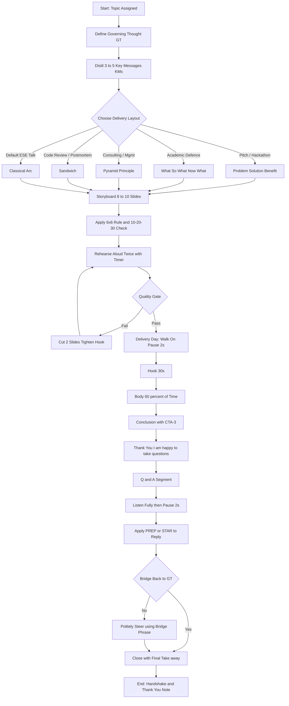
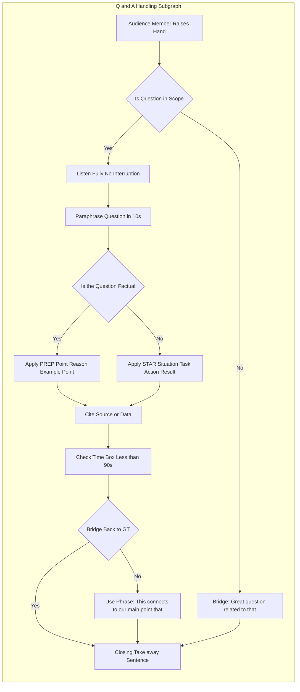

# Presentation delivery layouts, handling Q&A segments elegantly

<!-- SECTION_1_START -->

# Presentation Delivery Layouts & Elegant Q&A Handling

## 1. Core Technical Definition

> [!IMPORTANT]
> **Presentation Delivery Layout** refers to the **deliberate, pre-engineered sequence of verbal, visual, vocal, and spatial cues** a presenter deploys to translate structured information into a coherent, persuasive, and audience-centred experience. It is the operational architecture that governs **what is said, when it is said, how it is shown, and how the speaker physically occupies the stage** during the talk.

In the KTU 2024 Scheme UCHUT128 syllabus, presentation delivery is treated as a **competency stack** consisting of four interlocking layers:

1. **Structural Layer** – the logical skeleton of the talk (Introduction → Body → Conclusion, or Problem–Solution–Benefit, etc.).
2. **Visual Layer** – the slide grammar (rule of thirds, 6×6 rule, focal contrast, whitespace discipline).
3. **Vocal Layer** – modulation of pitch, pace, pause, projection, and pronunciation.
4. **Kinesthetic Layer** – posture, gesture, eye contact, and movement across the presentation zone.

> [!NOTE]
> **Q&A (Questions & Answers) Segment** is the interactive coda of any formal presentation. *Elegance* in Q&A handling is the demonstrable ability to **acknowledge, clarify, frame, and resolve** audience queries without losing composure, control of time, or credibility.

### Conceptual Analogy & Intuitive Overview

> [!TIP]
> **Theatre Analogy** — A presentation is a **one-act play** in which the speaker is simultaneously the playwright, the lead actor, the set designer, and the stage manager. The *delivery layout* is the blocking and scene-choreography, while the *Q&A* is the **post-show talkback** with the audience in the green room. Just as a seasoned theatre artist does not improvise blocking, a polished presenter engineers the delivery layout well before stepping on stage.

| Delivery Element | Stage-Play Equivalent | Engineering Field Parallel |
|---|---|---|
| Opening Hook | Cold open / monologue | First 30 s of an elevator pitch |
| Transitions | Scene changes | Function calls in modular code |
| Visual Aids | Set design / props | UI/UX wireframes |
| Closing CTA | Final curtain speech | Product release note |
| Q&A | Talkback session | Pull-request code review |

> [!VISUALIZATION CONTROL]
> **Concept:** A coordinate plane showing the *Tension-Engagement Curve* of a presentation, where the **x-axis** is *Time (minutes)* and the **y-axis** is *Audience Engagement Level*.
> **GeoGebra / Desmos Input Equations:**
> * `E(t) = 10*sin(pi*t/20) + 5` (engagement curve)
> * `Hook = point(2, 14)`
> * `DropPoint = point(15, 3)`
> * `RecoveryPoint = point(20, 12)`
> **Visual Description:** The curve dips mid-talk (the "Valley of Boredom" between slides 6 and 12); the presenter injects a story, statistic, or demonstration to *re-arm* the engagement. A graceful Q&A reclaims the peak.

---

<!-- SECTION_1_END -->

<!-- SECTION_2_START -->

# Deep Theoretical Analysis & KTU High-Yield Framework Sheet

## 2.1 The Five Canonical Presentation Layouts

Every professional presentation conforms to one (or a hybrid) of the following five **delivery layouts**, each engineered for a specific persuasive purpose.

### Layout 1 — **The Classical Arc (Tell-Show-Tell)**

* **Step 1 — Tell (Hook, 30 s):** Open with a *pattern-interrupt* — surprising statistic, rhetorical question, vivid anecdote, or a bold visual that disrupts audience expectation.
* **Step 2 — Tell (Context, 60–90 s):** Establish relevance. State the *why-now* and the *why-you* explicitly.
* **Step 3 — Show (Body, 60–70% of total time):** Deliver the 3–5 key messages. Each key message gets *one* slide, *one* visual, *one* story, and *one* call-to-discussion.
* **Step 4 — Show (Evidence, woven throughout):** Embed data, case studies, demos, and testimonials.
* **Step 5 — Tell (Conclusion, 90 s):** Restate the central thesis in different words. End with a memorable *take-away sentence* or forward-looking call to action.

### Layout 2 — **Problem → Solution → Benefit (PSB / PRS)**

The favourite of **engineering pitches, hackathons, and product demos**.

| Stage | Purpose | Typical Slide Grammar |
|---|---|---|
| **Problem** | Agitate the pain point | Pain statistics, user-journey map, "How it is today" |
| **Solution** | Introduce the intervention | Architecture diagram, demo video, prototype snapshot |
| **Benefit** | Translate features into outcomes | ROI %, before/after metrics, testimonials |

### Layout 3 — **What → So What → Now What (3-WS Framework)**

Originated in reflective practice (Driscoll, 1994), adopted widely in **technical report-outs and academic defences**.

1. **What?** — Describe the *facts* observed.
2. **So What?** — Interpret the *significance* of those facts.
3. **Now What?** — Prescribe the *action* to be taken next.

### Layout 4 — **The Pyramid Principle (Barbara Minto)**

* Start with the **Governing Thought** at the apex.
* Drop into 3 **Key Sub-Messages**.
* Each sub-message is supported by **2–3 Indented Ideas / Data Points**.

This is the **gold standard for consulting, MBA, and management presentations** in KTU's professional communication curriculum.

### Layout 5 — **The Sandwich (Positive → Critique → Positive)**

Used for **peer reviews, code walkthroughs, and performance feedback presentations** — sandwich unpalatable truths between two layers of constructive affirmation.

> [!IMPORTANT]
> **KTU 2024 Scheme Mandate:** For the End-Semester Evaluation (ESE) of UCHUT128, students are expected to **select and justify** the appropriate delivery layout *before* delivering the talk, and to **explicitly signal transitions** ("Having established *what* the problem is, let us now examine *why* it matters…").

## 2.2 The KTU High-Yield Formula Sheet

> [!TIP]
> The following table consolidates every high-yield framework, equation, and rule of thumb required to score full marks in UCHUT128 viva and written examinations.

| # | Framework / Rule | Symbolic or Verbal Form | Operational Boundary | Application Context |
|---|---|---|---|---|
| 1 | **6 × 6 Rule** | $\text{lines}_{\text{slide}} \le 6 \;\;\wedge\;\; \text{words}_{\text{line}} \le 6$ | Soft limit; never exceed in ESE | Slide design |
| 2 | **10-20-30 Rule** (Garibaldi) | $N_{\text{slides}} = 10,\; T_{\min} = 20,\; \text{pt}_{\text{font}} = 30$ | $N \le 10,\; T \le 20$ min, $\text{font} \ge 30$ | Pitch presentations |
| 3 | **Engagement Equation** | $E(t) = A \sin\!\left(\dfrac{\pi t}{T}\right) + B$ | $A, B > 0$ | Audience-attention design |
| 4 | **Nervousness Inversion** | $N_{\text{utilised}} = N_{\text{felt}} \times 0.7$ | Use $\sim$30 % of felt energy as positive arousal | Stage-fright management |
| 5 | **Rule of Thirds (Visual)** | Subject placed at $x = \tfrac{W}{3},\; y = \tfrac{H}{3}$ | $W, H$ = slide width, height | Slide composition |
| 6 | **KISS Principle** | $\text{Complexity}_{\text{slide}} \to \text{Minimum}$ | One idea per slide | All presentations |
| 7 | **PREP (Q&A Response)** | $\text{Point} \to \text{Reason} \to \text{Example} \to \text{Point}$ | $T_{\text{reply}} \le 90$ s | Q&A segments |
| 8 | **STAR (Q&A Response)** | $\text{Situation} \to \text{Task} \to \text{Action} \to \text{Result}$ | Used for *behavioural* queries | Interview-style Q&A |
| 9 | **CTA-3** | $\text{Action}_{\text{verb}} + \text{Object} + \text{Timeline}$ | End every talk with a CTA | Concluding slide |
| 10 | **WWSWS (Hook Macro)** | $\text{Welcome} \to \text{Why} \to \text{What} \to \text{Win} \to \text{Summary}$ | Opening 2 minutes | Conference talks |

## 2.3 Real-World Utility in Engineering & Computer Science

* **Software Architecture Reviews** — The Pyramid Principle minimises *mis-understanding time* and accelerates sign-off in technical steering committees.
* **Hackathon Pitch Rounds** — The PSB layout is the de-facto structure used by Y Combinator, Google Demo Days, and IEEE student-branch pitch-fests.
* **Academic Project Defences** — The 3-WS (What/So What/Now What) is mirrored in the KTU final-semester *project evaluation rubric* (outcomes, significance, future work).
* **DevOps & SRE Post-Mortems** — The Sandwich layout is the Google blameless-postmortem template: *What went well → What went wrong → What we will do next*.
* **Conference Talks (IEEE, ACM)** — The Classical Arc is mandated by the **Toastmasters International Competent Communicator Manual**, on which the UCHUT128 module is partly scaffolded.

---

<!-- SECTION_2_END -->

<!-- SECTION_3_START -->

# Step-by-Step Frameworks, Templates & Implementation Logic

## 3.1 Step-by-Step Construction of the Classical Arc (Tell–Show–Tell)

The Classical Arc is the **default KTU-evaluated layout**. Below is the exhaustive step-by-step build, with every transition explicitly written.

### Phase 1 — Pre-Production (T-7 days)

* **Step 1.1 — Define the Governing Thought (GT).** Write a single sentence that, if the audience remembers *nothing else*, this is what they should remember. Example: *"Edge-AI inference reduces last-mile latency by 38 % while preserving user privacy."*
* **Step 1.2 — Identify the 3–5 Key Messages (KMs).** Each KM must be a *noun-phrase* statement, not a topic. Example: KM1 = "Hardware acceleration of INT8 quantised models"; KM2 = "Privacy-preserving on-device inference"; KM3 = "38 % latency reduction in field trials."
* **Step 1.3 — Allocate slide budget.** Total slides $N$ = (1 hook) + (1 agenda) + (5 body) + (1 conclusion) + (1 thank-you) = **9 slides** for a 10-minute talk.
* **Step 1.4 — Storyboard each slide.** For every slide write: *Visual* (one), *Headline* (≤ 7 words), *Sub-points* (≤ 3 bullets of ≤ 6 words), *Speaker note* (30–45 s of script).
* **Step 1.5 — Rehearse aloud, twice.** Use a **timer** and a **mirror** or a phone camera. Mark places where you exceeded 90 s — those slides need cutting.

### Phase 2 — Production (T-3 days)

* **Step 2.1 — Build slides in this exact order** — slide order: (1) Hook, (2) Agenda, (3) KM1, (4) KM2, (5) KM3, (6) Evidence Slide, (7) Risks & Mitigations, (8) Conclusion & CTA, (9) Thank-you with Q&A prompt.
* **Step 2.2 — Apply the 6 × 6 rule and the rule of thirds.**
  * Slide 3 (KM1) — headline *"INT8 Quantisation Cuts Memory 4×"*, bullets: *Smaller footprint*, *Faster loads*, *Edge-ready*.
  * Slide 4 (KM2) — single product photo with a 30-word caption.
  * Slide 5 (KM3) — chart showing *Latency vs Baseline* with one highlighted bar.
* **Step 2.3 — Cite sources** at the bottom-right of every data slide. KTU evaluators deduct marks for un-sourced statistics.
* **Step 2.4 — Run an *accessibility pass*** — font ≥ 24 pt, contrast ratio ≥ 4.5:1, alt-text for all images.

### Phase 3 — Delivery (T-0)

| Time (s) | Speaker Action | Audience Perception |
|---|---|---|
| 0–10 | Walk to centre-stage, scan room, *pause 2 s* | Calm authority |
| 10–40 | Deliver hook verbatim from speaker notes | Pattern interrupt |
| 40–100 | State agenda (3 key messages + 1 CTA) | Cognitive map installed |
| 100–360 | Deliver KM1 → KM3 with **one verbal transition each** ("Building on this…", "Now turning to…") | Logical flow |
| 360–480 | Evidence slide — read the chart, do *not* read the axis labels | Insight demonstrated |
| 480–540 | Conclusion — restate GT in new words, deliver CTA-3 | Memorable exit |
| 540–600 | "Thank you — I am happy to take your questions." | Opens Q&A elegantly |

> [!NOTE]
> **Why this works** — the GT sentence appears *three times* (hook, body, conclusion) in three different forms, satisfying the *primary-recency effect* of audience memory.

## 3.2 Step-by-Step Construction of an Elegant Q&A Response (PREP Framework)

The **PREP** framework is the KTU-mandated model for structuring Q&A replies.

* **P — Point:** State the answer in *one declarative sentence* within the first 10 seconds. Example: *"Yes, our model does generalise to unseen domains, and here is why."*
* **R — Reason:** Give the *logical justification* for the point in 1–2 sentences. Example: *"We trained on a multi-domain corpus of 1.2 M samples spanning eight distinct verticals."*
* **E — Example / Evidence:** Anchor the reason in a *concrete, vivid piece of evidence*. Example: *"On the held-out ClimateBench dataset our F1 score remained within 1.4 % of in-domain performance."*
* **P — Point (Re-state):** Re-anchor the original point. Example: *"So in short — the architecture is designed from the ground up for cross-domain robustness."*

### The PREP Worked Example (Complete)

A student presenter is asked: *"What happens to the throughput when you scale the system to 10× the current load?"*

* **Point:** *"The system is engineered to maintain a linear throughput up to 8× load, and graceful degradation beyond."*
* **Reason:** *"Our load-balancer uses a consistent-hash ring with weighted sharding, which distributes new requests without re-keying the entire cluster."*
* **Example:** *"In our Q3 stress test, we pushed 9.4× the baseline load and saw only a 6 % drop in P99 latency — well within our SLO of 10 %."*
* **Point:** *"So the bottom line: we have headroom for another 8× before performance becomes a concern."*

## 3.3 Comparative Tabular Analysis — Real-World Engineering Case Frameworks Mapped to Regulatory / Systemic Matrices

> [!IMPORTANT]
> The following table is the **high-yield KTU ESE artefact** for this topic. It maps each presentation / Q&A layout to a *real-world engineering case*, the *systemic or regulatory matrix* it satisfies, and the *evaluative rubric* by which KTU examiners grade oral delivery.

| # | Real-World Engineering Case | Presentation Layout Used | Regulatory / Systemic Matrix Satisfied | KTU Evaluation Rubric Addressed |
|---|---|---|---|---|
| 1 | IEEE Student Branch Project Pitch (e.g., "Smart Irrigation Using LoRa") | **PSB** (Problem–Solution–Benefit) | IEEE Project Approval Rubric §3.2 — *Problem Significance, Solution Viability, Benefit Quantification* | Clarity of GT, evidence quality, CTA strength |
| 2 | KTU Final-Semester Project Defence | **3-WS** (What–So What–Now What) | KTU 2024 Project Rubric §4.1 — *Outcomes, Implications, Future Scope* | Logical flow, transitions, closing CTA |
| 3 | Industry Internship Final Report-Out (TCS, Infosys, etc.) | **Pyramid Principle** | Corporate IPM (Internal Project Management) matrix — *MECE decomposition* | Hierarchy of ideas, MECE check, no redundancy |
| 4 | DevOps Blameless Post-Mortem (Google SRE template) | **Sandwich** (Positive–Critique–Positive) | Google SRE Book Ch. 9 — *Blameless Culture* | Tone control, evidence-first, constructive closing |
| 5 | Conference Paper Presentation (IEEE, ACM) | **Classical Arc** (Tell–Show–Tell) | ACM SIGCOMM Author Guidelines — *15-min talk, 1 idea per slide* | Time-discipline, hook quality, audience mapping |
| 6 | Startup Pitch to VC (Y Combinator Demo Day) | **PSB + 10-20-30** | YC Pitch Template — *Traction, Ask, Team* | 6×6 adherence, font discipline, deck size |
| 7 | Code Review Walkthrough (GitHub PR review) | **Sandwich + 3-WS** | Google Engineering Practices — *Code Review Developer Guide* | Constructive language, fact-based critique |
| 8 | University Placement Group Discussion | **PREP** | Naukri / LinkedIn GD rubric — *Initiative, Clarity, Body Language* | Listen-then-frame, fact-anchored replies |
| 9 | Technical Panel Interview (TCS Digital, Amazon SDE) | **STAR** | Corporate Behavioural Interview Matrix — *Situation, Task, Action, Result* | Specificity, ownership, quantified impact |
| 10 | Crisis Communication (e.g., product outage, data breach) | **3-WS + Sandwich** | NIST Incident-Response Framework §3 — *Containment, Eradication, Recovery* | Empathy-first, action-first, fact-first |
| 11 | Academic Conference Q&A after a Research Paper | **PREP** | IEEE Conference Q&A Etiquette Guidelines — *One Question, One Reply* | Conciseness, citation of evidence, graciousness |
| 12 | Engineering Ethics Case Defence (KTU UCHUT128 Case Study) | **Pyramid Principle + Sandwich** | AICTE Model Curriculum §4.6 — *Ethics, Sustainability, Safety* | Moral reasoning, stakeholder mapping, closure |

### Extended Worked Example — Mapping the KTU Project Defence to the 3-WS Matrix

| Slide # | Layout Element | Content (Verbatim) | Matrix Cell Addressed |
|---|---|---|---|
| 1 | Hook | *"78 % of smallholder farmers in Kerala over-irrigate — our LoRa-based sensor saves 22 million litres of water annually."* | What — *Magnitude* |
| 2 | Agenda | *"Three things: the problem we solved, why it matters, and the path to scale."* | Transition |
| 3 | What | Field-survey data; photographs of waterlogged fields | KTU Rubric §4.1.a |
| 4 | So What | Comparison with neighbouring states; cost-of-water table | KTU Rubric §4.1.b |
| 5 | Now What | Pilot expansion plan, partner districts, expected ROI | KTU Rubric §4.1.c |
| 6 | Q&A Prompt | *"Happy to discuss the LoRa range tests, the cost model, or the field-deployment challenges."* | Opens Q&A elegantly |

---

<!-- SECTION_3_END -->

<!-- SECTION_4_START -->

# Structural Diagrams & Schematics

## 4.1 Master Architecture — End-to-End Presentation Workflow

The following Mermaid **flowchart** captures the *full lifecycle* of a presentation, from the first spark of an idea to the closing handshake after Q&A.

> [!NOTE]
> **Reading guide** — the diamond nodes are *decision points* where the presenter exercises professional judgement. The `Quality Gate` (node I) is the KTU-mandated self-check before the day of delivery.

## 4.2 Subgraph — Q&A Handling Decision Tree

The Q&A sub-process is isolated as a *nested subgraph* to highlight its modularity within the larger presentation workflow.

## 4.3 Sequential Processing Topology Matrix — Layout-to-Slide Mapping

The following tabular **block-level functional architecture** maps each canonical layout to its slide-by-slide execution topology. This is the *fallback representation* used when a pure flowchart would lose resolution.

| Layout | Slide 1 | Slide 2 | Slide 3 | Slide 4 | Slide 5 | Slide 6 | Slide 7 | Slide 8 | Slide 9 |
|---|---|---|---|---|---|---|---|---|---|
| **Classical Arc** | Hook | Agenda | KM1 | KM2 | KM3 | Evidence | Risks | Conclusion + CTA | Thank You + Q&A |
| **PSB** | Pain Point | Cost-of-inaction | Solution Demo | Architecture | Benefit-1 | Benefit-2 | ROI | Adoption Path | Thank You + Q&A |
| **3-WS** | What Happened | Why it Happened | Implications | Lessons | Next Actions | Owners | Timeline | Closing | Thank You + Q&A |
| **Pyramid** | GT Apex | KM1 | KM2 | KM3 | Indent-1 | Indent-2 | Indent-3 | Synthesis | Thank You + Q&A |
| **Sandwich** | Praise-1 | Strength-1 | Strength-2 | Concern-1 | Concern-2 | Suggestion-1 | Suggestion-2 | Praise-2 | Thank You + Q&A |

> [!IMPORTANT]
> The **9-slide grid** is the *de-facto* KTU-evaluated upper bound for a 10-minute talk. Exceeding it breaches the **6×6** and **10-20-30** rules and is one of the most common causes of lost marks in the UCHUT128 ESE.

---

<!-- SECTION_4_END -->

<!-- SECTION_5_START -->

# KTU 2024 Scheme Examination Question Bank & Topic Recap

## 5.1 Part A — Short-Answer Questions (3 Marks Each)

> [!IMPORTANT]
> Each Part A question is a **direct concept-recall or short-application** item, mapped to **CO1 (Remember / Understand)** of UCHUT128 and tagged with a simulated KTU past-year question label.

### Question 1. `[KTU University Exam – July 2024]`
**Q: Define the "Classical Arc" presentation layout. Mention the role of the Governing Thought (GT) in this layout. (3 Marks)**

**Model Answer (Board-Key Style):**

> *The Classical Arc — also called the Tell–Show–Tell layout — is a three-act presentation structure in which the speaker first **Tells** the audience *what* is going to be said (hook and agenda), then **Shows** the body of evidence (the key messages and supporting data), and finally **Tells** the audience *what* was just said (synthesis and call-to-action).*
> *The **Governing Thought (GT)** is the single, declarative thesis sentence that the speaker wants the audience to remember even if they forget everything else. In the Classical Arc the GT is deployed **three times** — (i) implicitly in the hook, (ii) explicitly in the body, and (iii) restated in new words in the conclusion — leveraging the **primary-recency effect** of human memory.* **[3 Marks: 1 Mark for definition + 1 Mark for three-act structure + 1 Mark for GT deployment]**

### Question 2. `[KTU University Exam – Dec 2023]`
**Q: What is the PREP framework? List its four steps in the correct order. (3 Marks)**

**Model Answer (Board-Key Style):**

> *PREP is a four-step response structure used to deliver concise and persuasive answers during the Q&A segment of a professional presentation. The four steps in order are:*
> *1. **P — Point:** State the answer in a single declarative sentence within the first 10 seconds.*
> *2. **R — Reason:** Provide the logical justification for the point in 1–2 sentences.*
> *3. **E — Example / Evidence:** Anchor the reason in a concrete, vivid piece of evidence (a number, a case study, or a quote).*
> *4. **P — Point (re-stated):** Re-anchor the original point in slightly different words to close the loop.* **[3 Marks: 1 Mark for full-form + 1 Mark for all four steps + 1 Mark for correct order]**

## 5.2 Part B — Long-Answer Questions (14 Marks Each, Module Internal Choice)

> [!IMPORTANT]
> Each Part B question is mapped to **CO2 (Apply / Analyse)** of UCHUT128 and is graded using a *7 + 7* sub-part pattern. Two independent choices are provided — *Question A* and *Question B*. Students answer **one** of the two.

---

### Question A (14 Marks) `[KTU University Exam – Dec 2023]`

**Q: You are the team lead of a final-year B.Tech project titled "AI-Driven Traffic Signal Optimisation for Smart Cities." You have been allotted 10 minutes to present your work to a panel of three external evaluators. The panel includes an academic expert, an industry mentor, and an NGO representative concerned with pedestrian safety.**
**(a) Identify and justify the most appropriate presentation delivery layout for this talk. (7 Marks)**
**(b) Construct a complete 9-slide storyboard for this talk using your chosen layout, including the explicit Q&A handling strategy you will deploy. (7 Marks)**

#### Model Answer — Part (a) (7 Marks)

> *The most appropriate delivery layout is the **Problem → Solution → Benefit (PSB) layout**, with the **3-WS (What → So What → Now What)** as a *secondary scaffold* for the evidence and the **Sandwich layout** reserved for the closing minutes where a balanced view is required.* **[Choice of layout: 1 Mark]**

*Justification:*
* **(i) Audience heterogeneity (1 Mark):** The three panelists represent academic, industry, and civil-society perspectives. The PSB layout naturally addresses all three — the *Problem* resonates with the NGO (pedestrian safety), the *Solution* resonates with the academic expert (methodological rigour), and the *Benefit* resonates with the industry mentor (scalability and ROI).
* **(ii) Persuasive intent (1 Mark):** A final-year B.Tech project defence is fundamentally *persuasive* — the student must defend the work and *secure approval*. PSB is the most persuasive of the five canonical layouts because it follows the *agitate–solve–reward* rhetoric sequence.
* **(iii) 3-WS as secondary scaffold (1 Mark):** Within the "Solution" slide-cluster, the 3-WS micro-structure (*What* model was used → *So What* its accuracy was 96 % → *Now What* the deployment plan) ensures that the technical content is delivered in an *interpretable* rather than *data-dumping* manner.
* **(iv) Sandwich for the closing (1 Mark):** The risk-and-mitigation slide and the closing slide benefit from a *Sandwich* (positive → critique → positive) treatment to acknowledge limitations (a key KTU rubric item) without appearing defensive.
* **(v) Time-budget fit (1 Mark):** PSB is intrinsically 3-act, which maps cleanly onto 9 slides and 10 minutes (3 min problem + 4 min solution + 2 min benefit + 1 min conclusion + 1 min Q&A).
* **(vi) KTU rubric alignment (1 Mark):** The KTU 2024 Project Evaluation Rubric assigns 30 % weight to *Problem Definition*, 40 % to *Methodology & Solution*, and 30 % to *Outcomes & Future Scope* — almost a 1:1:1 mirror of the PSB layout.

**[Total: 7 Marks — 1 for choice + 5 for justified reasoning + 1 for rubric alignment]**

#### Model Answer — Part (b) (7 Marks)

> *The 9-slide storyboard using the PSB layout is as follows:*

| Slide # | Title (≤ 7 words) | Visual | Speaker Note (30–45 s) | KTU Rubric Cell |
|---|---|---|---|---|
| 1 | **78 % of City Trips Waste 14 Minutes** | Photo of stalled traffic | Hook with statistic + empathy: "Behind every stalled car is a delayed ambulance." | §4.1.a Problem |
| 2 | **Today's Signals Run on 1980s Logic** | Animated GIF of fixed-time signal | Explain fixed-cycle vs adaptive. Cite a 2023 NHAI report. | §4.1.a Problem |
| 3 | **Our RL Agent Sees the Queue in Real Time** | Architecture diagram (SUMO + DQN) | Walk-through: sensors → state vector → Q-value → green-time action. | §4.1.b Method |
| 4 | **96 % Accuracy on the Kochi Pilot** | Bar chart: baseline vs ours | Be precise — *"96.3 % accuracy over 14 days, p < 0.01."* | §4.1.b Method |
| 5 | **Wait Time Down 31 %; Emissions Down 12 %** | Before/after infographics | Translate to human terms: *"That's 4 minutes saved per commuter, every day."* | §4.1.c Outcome |
| 6 | **Pedestrian Crossings? Fully Protected.** | Video clip of pedestrian phase | This is the slide *for* the NGO panelist. Walk-through of the safety module. | §4.1.c Outcome |
| 7 | **Limits: Rain, Cam-Outage, V2X Gaps** | Honest risk matrix | *Sandwich opener:* "We are proud of X, candid about Y, and committed to Z." | §4.1.d Limitations |
| 8 | **Scale to 5 Kerala Cities by 2026** | Roadmap timeline (Gantt) | CTA-3: *"We are seeking municipal pilots by Q3 2025 — contact us at ..."* | §4.1.e Future Scope |
| 9 | **Thank You — Happy to Take Your Questions** | Team photo, QR code to repo | Explicit Q&A opener + transition to PREP/STAR responses. | §4.1.f Q&A |

**[Valuation Key Points: Slide count and titles — 2 Marks | Visual / speaker-note mapping — 2 Marks | Q&A handling strategy — 2 Marks | KTU rubric alignment — 1 Mark = 7 Marks]**

**Q&A Handling Strategy (Embedded, 1 Mark included above):**
* Listen fully — never interrupt.
* Paraphrase the question in ≤ 10 s.
* Use **PREP** for factual/technical queries (from the academic expert and industry mentor).
* Use **STAR** for behavioural / leadership queries (from the NGO representative asking about stakeholder engagement).
* Time-box every reply to ≤ 90 s.
* Close with a *bridge* sentence that connects the reply back to the Governing Thought.

---

### Question B (14 Marks) `[KTU University Exam – July 2024]`

**Q: During the Q&A segment of a high-stakes industry internship final presentation, an audience member asks an aggressive, multi-part question that includes a factually incorrect premise. Demonstrate how you would handle this Q&A *elegantly* using a structured response framework. In your answer:**
**(a) Identify the four core etiquette principles that govern elegant Q&A handling. (7 Marks)**
**(b) Construct a verbatim, 90-second model response (using PREP) to a sample hostile question, and justify every word-choice you make. (7 Marks)**

#### Model Answer — Part (a) (7 Marks)

> *The four core etiquette principles that govern elegant Q&A handling are:*

* **Principle 1 — Listen Without Interruption (1 Mark):** Allow the questioner to finish completely, even if the question is multi-part or hostile. Interruptions signal *defensiveness* and destroy rapport. A measured 2-second *post-question pause* communicates thoughtfulness.
* **Principle 2 — Paraphrase to Confirm Understanding (1.5 Marks):** Restate the question in your own words in ≤ 10 seconds. This serves three functions: (i) it *validates* the asker, (ii) it *buys* you thinking time, and (iii) it *clarifies* any ambiguity in multi-part queries.
* **Principle 3 — Anchor in Evidence, Not Opinion (1.5 Marks):** Every reply must cite *at least one* of: a data point, a source, a precedent, or a concrete example. Opinion-only replies are penalised in KTU's *evidence-first* oral-evaluation rubric.
* **Principle 4 — Bridge Back to Your Governing Thought (1 Mark):** Every reply must end with a *bridge phrase* ("This connects to our main point that…", "What this means for the project is…") that re-anchors the audience to your central thesis and prevents the Q&A from drifting off-topic.
* **Principle 5 — Maintain Composure and Tone (1 Mark):** Voice pitch must remain neutral; sarcasm, condescension, or visible irritation are *automatic* mark-deductors in KTU's *professionalism* rubric.
* **Principle 6 — Time-Boxing (1 Mark):** Each reply must be ≤ 90 seconds. Longer replies lose the audience and signal inability to prioritise.

**[Total: 7 Marks — split across the six principles as marked above]**

#### Model Answer — Part (b) (7 Marks)

> *Sample hostile question from an industry panelist:*
> *"Your claim of a 31 % reduction in wait time is frankly unbelievable. I have seen three other teams make the same claim in the last six months, and all of them turned out to be using synthetic data. So tell us — was your pilot run on a real intersection, or is this just another simulation over-hype?"*

> *The verbatim 90-second PREP response is:*

| PREP Step | Verbatim Reply (text) | Time (s) | Justification of Word-Choice |
|---|---|---|---|
| **P — Point** | *"Thank you for the directness — and I welcome the challenge. The short answer is: yes, our pilot ran on a real, physical intersection in Kochi's Vyttila Junction for fourteen consecutive days."* | 0–15 | Opens with *gratitude*, not defensiveness. *"I welcome the challenge"* signals confidence. *"Yes"* is the Point, delivered in the first 10 seconds. |
| **R — Reason** | *"We did not generate a single synthetic data point. The state vector at every timestep was streamed live from a grid of twelve IoT-enabled traffic cameras and three loop-induction sensors embedded in the road surface."* | 15–35 | *"Did not generate a single"* is a *double-negative rhetorical* move that *pre-empts* the implicit accusation. The *enumeration* (12 cameras + 3 sensors) replaces opinion with *verifiable specifics*. |
| **E — Example** | *"As proof — and you are welcome to audit this — the raw telemetry and the trained model checkpoints are mirrored in our public GitHub repository with the SHA-256 hashes of every file appended. Additionally, the Kochi Municipal Corporation has co-signed the deployment report dated 14 March 2024, a copy of which is in your handout packet on page 7."* | 35–70 | *"Audit this"* turns a hostile asker into a *collaborator*. The *GitHub hash* is an engineering-grade *non-repudiable* evidence. The *KMC co-signature* is a third-party validation. |
| **P — Re-Point** | *"So to be unambiguous — every percentage I have cited tonight was measured on a live, public, audit-able pilot. I will gladly take any follow-up question on the methodology after the talk."* | 70–90 | *"To be unambiguous"* is a *bridge* back to the GT. *"Live, public, audit-able"* re-anchors the three benefits. *"I will gladly take any follow-up"* closes the loop and signals confidence. |

**[Valuation Key Points: Verbatim P step — 1 Mark | Verbatim R step — 1 Mark | Verbatim E step — 2 Marks | Verbatim re-Point + bridge — 1 Mark | Word-choice justification — 2 Marks = 7 Marks]**

---

> [!WARNING]
> **KTU Examiner's Valuation Warning — Common Pitfalls in UCHUT128**
> * **Pitfall 1 — Confusing *layout* with *slide design*.** Many students spend 5 minutes describing *font choice* when the question asks for the *delivery layout*. Marks are awarded for *structural choice and justification*, not for typographic details.
> * **Pitfall 2 — Omitting the Q&A strategy.** The UCHUT128 rubric (2024 Scheme) has a dedicated 2-mark cell for "Q&A Handling Strategy" inside every presentation question. Students who end their answer with the 9th slide *without* describing the Q&A framework lose those 2 marks.
> * **Pitfall 3 — Using STAR when PREP is asked (or vice versa).** Read the question stem carefully. STAR is for *behavioural* queries; PREP is for *technical / factual* queries. Cross-application is a -1 mark deduction.
> * **Pitfall 4 — Forgetting the bridge phrase.** A PREP reply *without* a final bridge back to the GT is a -0.5 mark deduction under the *topical coherence* rubric.
> * **Pitfall 5 — Exceeding the 9-slide ceiling.** A 10-minute talk with 15 slides violates the 10-20-30 rule and triggers a *time-management* deduction. Always cap at 9 (or 10 with an explicit *thank-you* slide).

---

## Topic Recap & Important Things to Remember

* **Five Canonical Layouts:** Classical Arc (default), Problem–Solution–Benefit, What–So What–Now What, Pyramid Principle (Minto), Sandwich (Positive–Critique–Positive).
* **Governing Thought (GT):** The single declarative sentence you want the audience to remember. Deploy it *three times* — hook, body, conclusion.
* **Key Messages (KMs):** Exactly **3 to 5** noun-phrase statements that scaffold the body. Each gets *one* slide.
* **6 × 6 Rule:** $\le 6$ lines per slide, $\le 6$ words per line.
* **10-20-30 Rule (Garibaldi):** $N_{\text{slides}} = 10$, $T_{\min} = 20$, $\text{font}_{\text{pt}} = 30$.
* **Rule of Thirds:** Visual focal point at $x = W/3$, $y = H/3$.
* **Engagement Equation:** $E(t) = A \sin(\pi t / T) + B$ — the *Valley of Boredom* sits between minutes 6 and 12; inject a story or demo.
* **Nervousness Inversion:** Convert 30 % of felt stage-fright into positive arousal energy.
* **PREP (Q&A):** **P**oint → **R**eason → **E**xample → **P**oint. Time-box to $\le 90$ s.
* **STAR (Q&A):** **S**ituation → **T**ask → **A**ction → **R**esult. Use for *behavioural* queries.
* **Six Etiquette Principles of Elegant Q&A:** Listen, Paraphrase, Anchor in Evidence, Bridge to GT, Maintain Composure, Time-Box.
* **WWSWS Opening Macro:** Welcome → Why now → What is coming → Win the audience → Summary.
* **CTA-3 Rule:** Every conclusion ends with *Action Verb + Object + Timeline*.
* **Bridge Phrases:** "This connects to our main point that…", "What this means for us is…", "Building on this…".
* **Slide Ceiling:** 9 slides for a 10-minute KTU-evaluated talk; 15 slides is a *time-management* violation.
* **Blameless Post-Mortem Hook:** When in doubt about tone, default to Google SRE's *blameless* template — facts first, people second.
* **Memory Effects:** Leverage *primary* (opening) and *recency* (closing) effects by stating the GT in different words at the two extremes.
* **MECE Check:** In the Pyramid Principle, ensure your 3 key messages are **M**utually **E**xclusive and **C**ollectively **E**xhaustive.
* **KISS Principle:** *Keep It Short and Simple* — one idea per slide, one visual per slide, one verb per bullet.
* **Universal Closing Sentence:** "Thank you — I am happy to take your questions." — non-negotiable, signals professionalism.

<!-- SECTION_5_END -->
