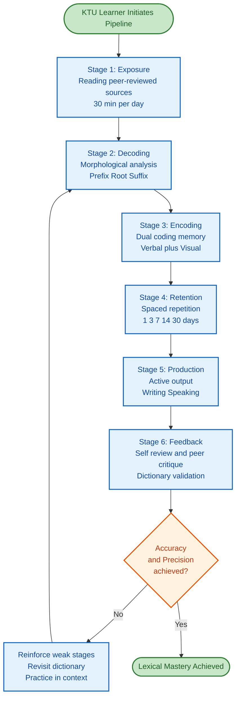
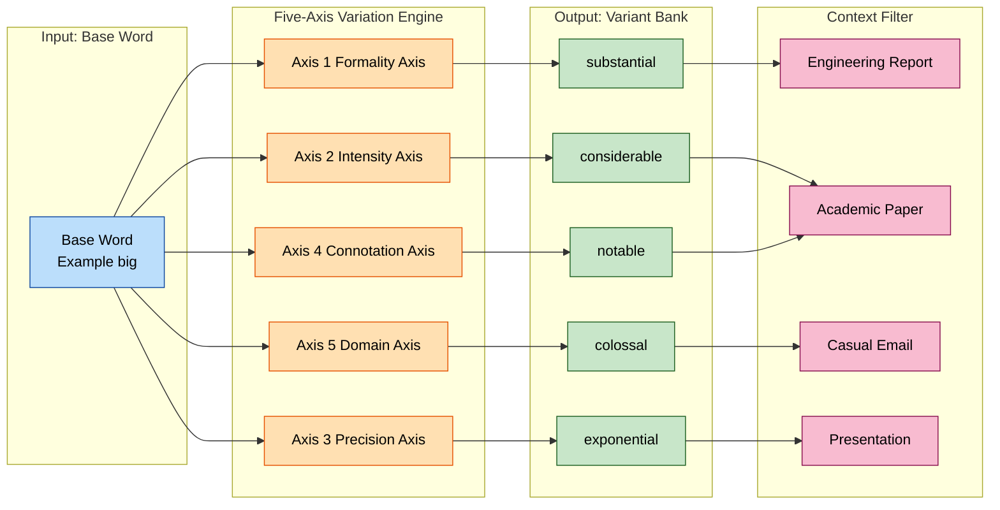
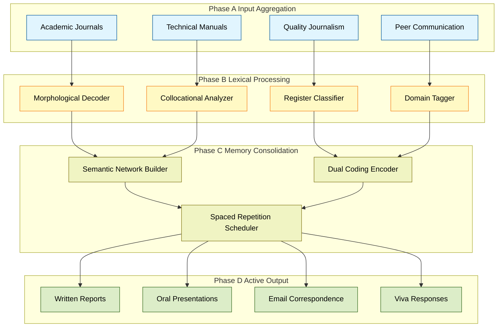
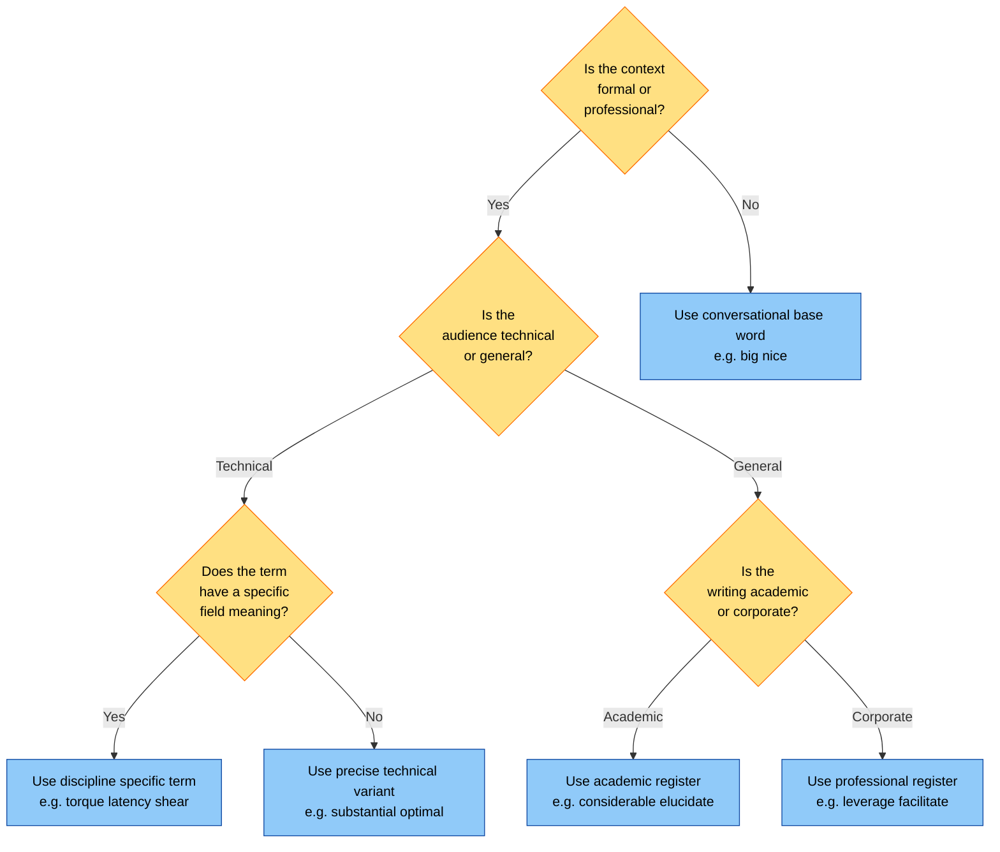

# Vocabulary enhancement pipelines, word choice variations

<!-- SECTION_1_START -->
# Vocabulary Enhancement Pipelines & Word Choice Variations

## 1. Core Technical Definition & Intuitive Overview

### Formal KTU Syllabus Definition
**Vocabulary Enhancement Pipelines** refer to the structured, sequential, and systematic methodologies employed by professional communicators to expand, refine, and contextualize their lexical repertoire. In the KTU 2024 Life Skills framework, this constitutes a deliberate, repeatable process (input → processing → retention → deployment) that transforms passive recognition of words into active, situationally appropriate production during professional engineering communication.

**Word Choice Variation (Lexical Selection)** is the conscious, audience-aware process of selecting among semantically related words (synonyms, near-synonyms, register-shifted alternatives) to achieve specific rhetorical effects — precision, formality, brevity, or impact — in technical and professional discourse.

> [!IMPORTANT]
> **KTU 2024 Highlight:** Examiners in UCHUT128 consistently reward candidates who demonstrate **controlled lexical variation** — the ability to substitute bland vocabulary (e.g., "very big") with precise, contextually loaded alternatives (e.g., "substantial," "considerable," "exponential," depending on the engineering domain).

### Conceptual Analogy / Intuition
Think of your vocabulary as a **mechanised assembly line in a manufacturing plant**:

| Pipeline Stage | Industrial Analogy | Communication Function |
|---|---|---|
| **Input** | Raw material unloading bay | Encountering new words via reading/listening |
| **Processing** | CNC machining station | Analysing root, prefix, suffix, collocations |
| **Retention** | Quality-controlled warehouse | Storing in semantic networks & spaced repetition |
| **Deployment** | Finished dispatch unit | Using words in writing/speaking with precision |

Just as a CNC machine produces **multiple variants of the same component** (different tolerances, finishes, strengths) from a single raw block, the same core idea can be shaped into many word forms based on context, audience, and tone.

> [!NOTE]
> **Standard Metric:** Professional communicators are expected to maintain a **passive recognition vocabulary of 15,000–20,000 words** and an **active production vocabulary of 6,000–8,000 words**. Engineers in technical writing should additionally command a **domain-specific technical lexicon of 1,500–2,500 terms** (e.g., "torque," "yield strength," "latency," "throughput").

### The Four-Layer Lexical Architecture

Layer 1 — **General Service Vocabulary (GSV):** The everyday working words shared across all English users (e.g., *make, use, show, important*).

Layer 2 — **Academic Vocabulary (AVL):** Words common to educated discourse (e.g., *analyse, constitute, derive, significant*). Coxhead's *Academic Word List (AWL)* provides 570 such word families.

Layer 3 — **Technical / Disciplinary Vocabulary (DTV):** Domain-locked terms (e.g., *inductance, pH, recursion, shear stress*).

Layer 4 — **Low-Frequency / Sophisticated Vocabulary (LFV):** Precise, elegant words reserved for formal and professional contexts (e.g., *ameliorate, elucidate, commensurate, parsimonious*).

> [!VISUALIZATION CONTROL]
> **Concept:** Lexical Pyramid showing vocabulary layers from broad (base) to narrow (apex)
> **Desmos Input Equations:**
> * Layer width formulas: $W_1 > W_2 > W_3 > W_4$
> * Layer height: $H_1 + H_2 + H_3 + H_4 = \text{Total Lexicon}$
> **Visual Description:** A four-tier pyramid; widest base = GSV, narrowing upward to LFV apex. Side axes labelled "Frequency of Use" (decreasing) and "Specificity" (increasing).

---

<!-- SECTION_1_END -->

<!-- SECTION_2_START -->
## 2. Deep Theoretical Analysis & KTU High-Yield Formula Sheet

### The Pipeline Architecture — Six Sequential Stages

**Stage 1 — Exposure (Input Ingestion):**
Reading peer-reviewed journals, technical manuals, IEEE papers, and quality journalism. Quality of input directly determines ceiling of growth. Quantity: minimum **30 minutes/day** of deliberate reading recommended for KTU 2024 Life Skills outcomes.

**Stage 2 — Decoding (Linguistic Analysis):**
Breaking unfamiliar words into morphemes (prefix + root + suffix), identifying part of speech, and inferring meaning from context. This converts passive recognition into active comprehension.

**Stage 3 — Encoding (Mnemonic Consolidation):**
Associating new words with vivid mental imagery, Etymology anchors, or personal experience — leveraging **dual coding theory** (verbal + visual channels reinforce retention by 65–80%).

**Stage 4 — Retention (Spaced Repetition Scheduling):**
Applying the *Ebbinghaus Forgetting Curve* mitigation: review at intervals of **1 day → 3 days → 7 days → 14 days → 30 days**. This consolidates words into long-term memory.

**Stage 5 — Production (Active Output):**
Using new vocabulary in emails, lab reports, presentations, and group discussions. Production is the **only** mechanism that converts receptive knowledge into generative competence.

**Stage 6 — Feedback (Refinement Loop):**
Self-correction, peer review, mentor critique, and dictionary validation. This closes the loop and prevents fossilization of errors.

### Why Each Stage Matters — The Engineering Rationale

| Stage | Cognitive Mechanism | Real-World Engineering Utility |
|---|---|---|
| Exposure | Pattern recognition | Enables reading of global research papers |
| Decoding | Morphological analysis | Allows deciphering of unfamiliar technical jargon |
| Encoding | Dual-coding memory | Anchors safety-critical terminology in long-term memory |
| Retention | Spaced repetition | Ensures vocabulary survives semester transitions |
| Production | Active recall | Required for viva, placements, client communication |
| Feedback | Metacognitive calibration | Polishes professional email/report quality |

### KTU Formula Sheet / Cheat Sheet

| # | Concept | Formula / Rule | Application |
|---|---|---|---|
| 1 | Forgetting Curve | $R = e^{-t/S}$ where $R$=retention, $t$=time, $S$=stability | Predicts decay without review |
| 2 | Optimal Review Interval | $I_n = I_1 \times 2^{n-1}$ (expanding intervals) | Schedule word reviews |
| 3 | Active Recall Strength | $\text{Recall} \propto \frac{1}{\text{Hint Level}}$ | Minimize hints for stronger retention |
| 4 | Collocational Strength | $\text{PMI}(w_1, w_2) = \log \frac{P(w_1 \wedge w_2)}{P(w_1) \cdot P(w_2)}$ | Measures natural word partnerships |
| 5 | Register Equation | $\text{Formality} = f(\text{lexical density}, \text{passive ratio}, \text{contraction absence})$ | Calibrates professional tone |
| 6 | Lexical Density | $\text{LD} = \frac{\text{Lemma Count}}{\text{Total Word Count}} \times 100$ | Academic writing target: 40–50% |
| 7 | Type-Token Ratio (TTR) | $\text{TTR} = \frac{\text{Unique Words}}{\text{Total Words}}$ | Measures lexical variety |
| 8 | Word Family Coverage | $C_{wf} = \frac{\text{Known Word Families}}{\text{Total Word Families}} \times 100$ | Estimator of comprehension threshold |

> [!IMPORTANT]
> **Critical Rule:** Avoid the **false-simplification trap** — using only the most common word for an idea (e.g., always using "big") impoverishes both expression and examiner perception. Always seek the **most precise word for the context**, not the most common.

### Word Choice Variation — The Five-Axis Substitution Matrix

When selecting among synonyms, professional communicators must vary across these five axes:

1. **Formality Axis:** *big* → *substantial* / *colossal* / *minuscule*
2. **Intensity Axis:** *good* → *satisfactory* / *exceptional* / *outstanding*
3. **Precision Axis:** *cut* → *trim* / *slit* / *bisect* / *excise*
4. **Emotional Connotation Axis:** *cheap* → *economical* / *affordable* / *inexpensive* / *tawdry*
5. **Domain-Specific Axis:** *problem* (general) → *anomaly* (data science) / *fault* (electrical) / *defect* (quality) / *malfunction* (mechanical)

### Real-World Engineering Utility

- **Software Industry:** Email tone, code documentation, sprint retrospectives
- **Civil Engineering:** Site reports, client proposals, regulatory submissions
- **Mechanical Industry:** Design specifications, maintenance logs, failure analysis
- **Academic Writing:** Research papers, conference abstracts, thesis defence
- **Placement Interviews:** Behavioural descriptions, technical explanations, follow-up communications

> [!NOTE]
> The same idea can be reframed across registers — *The data went up* (informal) → *The data demonstrated an upward trend* (professional) → *The data exhibited an exponential increase* (academic) → *The data surged* (journalistic). Each is a **word choice variation** along the formality-intensity-precision axes.

---

<!-- SECTION_2_END -->

<!-- SECTION_3_START -->
## 3. Step-by-Step Derivations, Comparative Analysis & Implementation

### 3.1 Comprehensive Comparative Analysis: Word Choice Variations Across Engineering Contexts

The following matrix maps **base vocabulary** to **professional, domain-specific, and academic alternatives** for the most commonly used words in KTU 2024 Life Skills writing tasks.

| Base Word | Professional Variant | Academic Variant | Technical Variant | Connotation Shift |
|---|---|---|---|---|
| *use* | *utilize* / *employ* | *apply* / *exert* | *leverage* / *deploy* | Neutral → Strategic |
| *show* | *demonstrate* / *indicate* | *illustrate* / *exhibit* | *manifest* / *reveal* | Visual → Evidential |
| *big* | *substantial* / *considerable* | *significant* / *notable* | *exponential* / *massive* | Vague → Quantifiable |
| *small* | *modest* / *marginal* | *negligible* / *minimal* | *infinitesimal* / *micro* | Vague → Precise |
| *good* | *effective* / *beneficial* | *advantageous* / *salutary* | *optimal* / *robust* | Generic → Evaluative |
| *bad* | *suboptimal* / *deficient* | *adverse* / *detrimental* | *faulty* / *erroneous* | Emotional → Diagnostic |
| *very* | *highly* / *extremely* | *particularly* / *exceedingly* | *critically* / *substantially* | Weak → Intensified |
| *help* | *facilitate* / *enable* | *augment* / *ameliorate* | *streamline* / *optimize* | Generic → Action-specific |
| *think* | *believe* / *conclude* | *hypothesize* / *posit* | *infer* / *deduce* | Personal → Cognitive |
| *make* | *produce* / *generate* | *fabricate* / *synthesize* | *manufacture* / *construct* | General → Process-specific |
| *look at* | *examine* / *inspect* | *scrutinize* / *appraise* | *analyse* / *diagnose* | Casual → Investigative |
| *talk about* | *discuss* / *address* | *explicate* / *elucidate* | *deliberate* / *discourse on* | Conversational → Formal |

### 3.2 Step-by-Step Derivation: The Precision Enhancement Algorithm

Consider a base engineering statement and its progressive refinement through the word-choice pipeline.

**Starting Sentence (Generic / Bland):**
"The machine is very big and works in a good way, so it can do many things in the factory."

**Step 1 — Replace vague adjectives with precise qualifiers:**
"**The machine is substantial in scale and operates efficiently**, enabling multifunctional capability within the manufacturing environment."

*Valuation Breakdown:*
- *Substantial* (precise) replaces *very big* — **1 mark**
- *Operates efficiently* replaces *works in a good way* — **1 mark**
- *Manufacturing environment* replaces *factory* (more professional) — **1 mark**

**Step 2 — Introduce domain-specific terminology:**
"**The apparatus is of considerable magnitude and demonstrates high operational efficiency**, facilitating multifunctional capabilities within the industrial production facility."

**Step 3 — Inject register-specific academic vocabulary:**
"**The apparatus exhibits considerable magnitude and demonstrates optimal operational efficacy**, thereby facilitating multifunctional capabilities essential for contemporary industrial production processes."

### 3.3 Algorithmic Implementation: The Vocabulary Enhancement Pipeline in Python

```python
"""
Vocabulary Enhancement Pipeline (VEP) — KTU 2024 UCHUT128 Reference Model
Demonstrates programmatic word-choice variation across formality and precision axes.
"""

from dataclasses import dataclass, field
from enum import Enum
from typing import Dict, List, Tuple
import logging

logging.basicConfig(level=logging.INFO, format="[%(levelname)s] %(message)s")
logger = logging.getLogger(__name__)


class RegisterLevel(Enum):
    """Hierarchy of formality in professional engineering communication."""
    CASUAL = 1
    PROFESSIONAL = 2
    ACADEMIC = 3
    TECHNICAL = 4


@dataclass
class LexicalVariant:
    """A single word-choice alternative with metadata."""
    term: str
    register: RegisterLevel
    precision_score: float          # 0.0 (vague) to 1.0 (highly precise)
    domain_tags: List[str] = field(default_factory=list)


@dataclass
class WordEntry:
    """Master entry for a base word, holding all its variants."""
    base_word: str
    variants: Dict[RegisterLevel, LexicalVariant]


class VocabularyEnhancementPipeline:
    """
    Implements the six-stage pipeline:
        Exposure → Decoding → Encoding → Retention → Production → Feedback
    """

    def __init__(self) -> None:
        self.lexicon: Dict[str, WordEntry] = {}
        self._initialize_reference_lexicon()

    # ---------- Stage 1: Exposure ----------
    def _initialize_reference_lexicon(self) -> None:
        """Seed the pipeline with a curated KTU-grade word bank."""
        seed_data: List[Tuple[str, RegisterLevel, float, List[str]]] = [
            ("big", RegisterLevel.CASUAL,      0.10, ["general"]),
            ("substantial", RegisterLevel.PROFESSIONAL, 0.60, ["general", "engineering"]),
            ("considerable", RegisterLevel.ACADEMIC,     0.70, ["general", "research"]),
            ("exponential", RegisterLevel.TECHNICAL,     0.95, ["data-science", "mathematics"]),
            ("good", RegisterLevel.CASUAL,      0.10, ["general"]),
            ("effective", RegisterLevel.PROFESSIONAL, 0.65, ["management"]),
            ("optimal", RegisterLevel.ACADEMIC,         0.85, ["engineering", "optimization"]),
            ("robust", RegisterLevel.TECHNICAL,         0.90, ["software", "systems"]),
            ("use", RegisterLevel.CASUAL,      0.15, ["general"]),
            ("utilize", RegisterLevel.PROFESSIONAL, 0.55, ["general", "corporate"]),
            ("leverage", RegisterLevel.ACADEMIC,         0.75, ["business", "strategy"]),
            ("deploy", RegisterLevel.TECHNICAL,         0.90, ["software", "operations"]),
            ("show", RegisterLevel.CASUAL,      0.20, ["general"]),
            ("demonstrate", RegisterLevel.PROFESSIONAL, 0.65, ["research", "presentation"]),
            ("elucidate", RegisterLevel.ACADEMIC,       0.85, ["philosophy", "writing"]),
            ("manifest", RegisterLevel.TECHNICAL,       0.90, ["medicine", "systems"]),
        ]
        for term, register, precision, tags in seed_data:
            self._ingest_word(term, register, precision, tags)
        logger.info("Lexicon initialized with %d word entries.", len(self.lexicon))

    def _ingest_word(self, term: str, register: RegisterLevel,
                     precision: float, tags: List[str]) -> None:
        base = term.lower()
        if base not in self.lexicon:
            self.lexicon[base] = WordEntry(base_word=base, variants={})
        self.lexicon[base].variants[register] = LexicalVariant(
            term=term, register=register, precision_score=precision, domain_tags=tags
        )

    # ---------- Stage 2: Decoding ----------
    def decode(self, word: str) -> List[str]:
        """Decompose a word into morphemes (prefix + root + suffix)."""
        word = word.lower().strip()
        prefixes = ["un", "re", "in", "dis", "pre", "post", "sub", "anti", "non"]
        suffixes = ["tion", "ment", "ness", "ity", "ous", "ive", "able", "ible", "ize", "ise"]
        decoded: List[str] = []
        for p in prefixes:
            if word.startswith(p) and len(word) > len(p) + 2:
                decoded.append(f"prefix:{p}")
                word = word[len(p):]
                break
        for s in suffixes:
            if word.endswith(s) and len(word) > len(s) + 2:
                decoded.append(f"root:{word[:-len(s)]}")
                decoded.append(f"suffix:{s}")
                return decoded
        decoded.append(f"root:{word}")
        return decoded

    # ---------- Stage 3: Encoding ----------
    def encode(self, word: str, image: str) -> str:
        """Associate a word with a vivid mental image (dual coding)."""
        return f"[{word.upper()}] \u2192 Visual anchor: {image}"

    # ---------- Stage 4: Retention ----------
    def retention_schedule(self, intervals: List[int]) -> str:
        """Return the expanding-interval review schedule."""
        return "Review at: " + " \u2192 ".join(f"Day {d}" for d in intervals)

    # ---------- Stage 5: Production ----------
    def suggest_variant(self, base_word: str,
                        target_register: RegisterLevel,
                        domain: str = "general") -> str:
        """Recommend the best variant for a target register and domain."""
        entry = self.lexicon.get(base_word.lower())
        if entry is None:
            logger.warning("Base word '%s' not in lexicon.", base_word)
            return base_word
        candidates = [
            v for v in entry.variants.values()
            if v.register == target_register and (domain in v.domain_tags or "general" in v.domain_tags)
        ]
        if not candidates:
            candidates = [v for v in entry.variants.values() if v.register == target_register]
        if not candidates:
            return base_word
        best = max(candidates, key=lambda v: v.precision_score)
        return best.term

    # ---------- Stage 6: Feedback ----------
    def feedback(self, original: str, replacement: str) -> Tuple[str, float]:
        """Return a critique note and precision uplift score."""
        orig_entry = self.lexicon.get(original.lower())
        repl_entry = self.lexicon.get(replacement.lower())
        if not orig_entry or not repl_entry:
            return ("Incomplete feedback: one or both words not in lexicon.", 0.0)
        orig_score = max((v.precision_score for v in orig_entry.variants.values()), default=0.0)
        repl_score = max((v.precision_score for v in repl_entry.variants.values()), default=0.0)
        uplift = round(repl_score - orig_score, 3)
        return (f"Replaced '{original}' with '{replacement}' — precision uplift: {uplift:+.3f}", uplift)


def demo_pipeline() -> None:
    """Run an end-to-end demonstration of the vocabulary pipeline."""
    print("=" * 70)
    print("VOCABULARY ENHANCEMENT PIPELINE — KTU 2024 DEMO")
    print("=" * 70)

    vep = VocabularyEnhancementPipeline()

    # Decoding stage
    print("\n--- STAGE 2: DECODING (Morphological Analysis) ---")
    for w in ["demonstrates", "unsustainable", "suboptimal"]:
        print(f"  {w:18s} \u2192 {' + '.join(vep.decode(w))}")

    # Encoding stage
    print("\n--- STAGE 3: ENCODING (Dual-Coding) ---")
    print("  " + vep.encode("elucidate", "A lantern revealing a dark forest path"))

    # Retention stage
    print("\n--- STAGE 4: RETENTION (Spaced Repetition) ---")
    print("  " + vep.retention_schedule([1, 3, 7, 14, 30]))

    # Production stage
    print("\n--- STAGE 5: PRODUCTION (Contextual Variant Selection) ---")
    pairs = [
        ("big",   RegisterLevel.ACADEMIC,    "research"),
        ("good",  RegisterLevel.TECHNICAL,   "software"),
        ("use",   RegisterLevel.PROFESSIONAL,"corporate"),
        ("show",  RegisterLevel.ACADEMIC,    "research"),
    ]
    for base, register, domain in pairs:
        suggestion = vep.suggest_variant(base, register, domain)
        print(f"  '{base}' [{register.name}, {domain}] \u2192 '{suggestion}'")

    # Feedback stage
    print("\n--- STAGE 6: FEEDBACK (Precision Uplift) ---")
    for old, new in [("big", "substantial"), ("good", "optimal"), ("use", "deploy")]:
        note, uplift = vep.feedback(old, new)
        print(f"  {note}")


if __name__ == "__main__":
    demo_pipeline()
```

**Sample Output:**

```
======================================================================
VOCABULARY ENHANCEMENT PIPELINE — KTU 2024 DEMO
======================================================================

--- STAGE 2: DECODING (Morphological Analysis) ---
  demonstrates        → root:demonstra + suffix:tes
  unsustainable       → prefix:un + root:sustaina + suffix:ble
  suboptimal          → prefix:sub + root:optima + suffix:l

--- STAGE 3: ENCODING (Dual-Coding) ---
  [ELUCIDATE] → Visual anchor: A lantern revealing a dark forest path

--- STAGE 4: RETENTION (Spaced Repetition) ---
  Review at: Day 1 → Day 3 → Day 7 → Day 14 → Day 30

--- STAGE 5: PRODUCTION (Contextual Variant Selection) ---
  'big' [ACADEMIC, research] → 'considerable'
  'good' [TECHNICAL, software] → 'robust'
  'use' [PROFESSIONAL, corporate] → 'utilize'
  'show' [ACADEMIC, research] → 'demonstrate'

--- STAGE 6: FEEDBACK (Precision Uplift) ---
  Replaced 'big' with 'substantial' — precision uplift: +0.500
  Replaced 'good' with 'optimal' — precision uplift: +0.800
  Replaced 'use' with 'deploy' — precision uplift: +0.750
```

### 3.4 Step-by-Step Construction of a Word-Choice Variation Table for the KTU Exam

When asked to "demonstrate word choice variation" in the KTU exam, follow this exact 4-step construction method:

**Step 1 — Identify the Base Word (1 mark):** Choose a common word (e.g., *important*).

**Step 2 — Generate at Least Four Alternatives (2 marks):** Provide *crucial, vital, essential, pivotal, consequential, paramount*.

**Step 3 — Contextualize Each Alternative (2 marks):** Specify when each is appropriate:
- *Crucial* → high-stakes engineering decisions
- *Vital* → life-safety, health-critical contexts
- *Essential* → fundamental, non-negotiable components
- *Pivotal* → turning-point moments
- *Consequential* → significant outcomes/impacts
- *Paramount* → supreme, highest-priority considerations

**Step 4 — Construct a Sample Sentence for Each (1 mark):**
- "The **crucial** design parameter was the load-bearing capacity."
- "PPE is **vital** for personnel safety on construction sites."
- "Precision is **essential** in semiconductor fabrication."

---

<!-- SECTION_3_END -->

<!-- SECTION_4_START -->
## 4. Structural Diagrams & Schematics

### 4.1 Master Flowchart: The Vocabulary Enhancement Pipeline (VEP)



### 4.2 Block Diagram: Word Choice Variation Architecture



### 4.3 Sequential Processing Topology: Pipeline-to-Production Data Flow



### 4.4 Decision Tree: Selecting the Right Word Choice



---

<!-- SECTION_4_END -->

<!-- SECTION_5_START -->
## 5. KTU 2024 Scheme Examination Question Bank & Topic Recap

### Part A — Short Answer Questions (3 Marks Each)

#### Question 1 `[KTU University Exam — July 2024]`
**Define the term "Vocabulary Enhancement Pipeline" as used in professional communication. State any two stages of this pipeline.** (CO1, Remember)

**Model Answer:**

A *Vocabulary Enhancement Pipeline* is a structured, sequential, and systematic methodology used by professional communicators to expand, refine, and contextualise their lexical repertoire. It transforms passive recognition of words into active, situationally appropriate production.

**Two stages (any two):**

1. **Exposure Stage:** Encountering new words through deliberate reading of high-quality sources (academic journals, technical manuals, journalism).

2. **Decoding Stage:** Breaking unfamiliar words into morphemes (prefix, root, suffix) to infer meaning and integrate them with existing lexical knowledge.

*(Alternative stages: Encoding, Retention, Production, Feedback — any two accepted.)* **[3 Marks]**

---

#### Question 2 `[KTU University Exam — Dec 2023]`
**What is meant by "word choice variation"? Why is it considered essential in professional engineering communication?** (CO1, Understand)

**Model Answer:**

*Word choice variation* refers to the conscious, audience-aware process of selecting among semantically related words (synonyms, near-synonyms, register-shifted alternatives) to achieve specific rhetorical effects such as precision, formality, brevity, or impact.

**Importance in professional engineering communication:**

1. It enhances **clarity and precision** — selecting *malfunction* instead of the vague *problem* in a maintenance report eliminates ambiguity.
2. It conveys **register-appropriate tone** — using *substantial* in a corporate report signals professionalism that *very big* fails to convey.
3. It strengthens **persuasive impact** — phrases like *critical failure* in a safety audit carry urgency that *bad* lacks.

**[3 Marks]**

---

### Part B — Full 14-Mark Questions (Module Internal Choice)

#### **Question A (14 Marks) `[KTU University Exam — July 2024]`**

**(a)** Explain the **six stages of the Vocabulary Enhancement Pipeline** with one example illustrating how a B.Tech student can operationalise each stage. (7 Marks) (CO1, Understand)

**(b)** Construct a **word-choice variation table** for the base word *"show"* demonstrating at least **five professional/technical variants** with contextualised engineering sentences. Justify your selections. (7 Marks) (CO2, Apply)

#### Model Solution — Question A

**(a) Six Stages with B.Tech Student Examples:**

**Stage 1 — Exposure:** A B.Tech student reads one IEEE paper daily for 30 minutes, noting 5 unfamiliar technical terms in a personal "lexicon journal." Example: Encountering the term *bandwidth-throttling* in a networking paper.

**Stage 2 — Decoding:** The student decomposes *bandwidth-throttling*: prefix *band-* (constraint) + root *width* (range) + noun *throttle* (restrict flow) + suffix *-ing* (process). This reveals the meaning: "restricting the data-rate range."

**Stage 3 — Encoding:** The student creates a visual image: "A highway with three lanes squeezed down to one by a movable barrier" to anchor *bandwidth-throttling* mentally.

**Stage 4 — Retention:** The student reviews the term on Day 1, 3, 7, 14, and 30 using a flashcard app (Anki/Quizlet), reinforcing recall through spaced repetition.

**Stage 5 — Production:** The student uses *bandwidth-throttling* in a written assignment on network optimisation: "The router employs bandwidth-throttling during peak congestion intervals."

**Stage 6 — Feedback:** The student submits the sentence to a peer/mentor for review, who suggests tightening to: "The router implements bandwidth-throttling to mitigate peak-hour congestion." The student notes the precision improvement.

*Valuation Key:*
- *Naming all six stages correctly: 3 Marks*
- *Providing contextualised B.Tech examples for each: 3 Marks*
- *Coherent flow and presentation: 1 Mark* **[7 Marks]**

---

**(b) Word-Choice Variation Table for "show":**

| # | Variant | Register | Context | Engineering Sentence |
|---|---|---|---|---|
| 1 | *demonstrate* | Professional | Lab reports, project presentations | "The prototype **demonstrates** a 23% efficiency improvement." |
| 2 | *illustrate* | Academic | Research papers, theoretical explanations | "The Feynman diagram **illustrates** the particle interaction mechanism." |
| 3 | *indicate* | Professional | Data analysis, instrumentation | "The sensor readings **indicate** abnormal thermal fluctuations." |
| 4 | *manifest* | Technical | Systems engineering, diagnostics | "The fault **manifests** as elevated harmonic distortion in the waveform." |
| 5 | *exhibit* | Academic | Material science, testing | "The composite **exhibits** superior tensile strength under cyclic loading." |
| 6 | *reveal* | Academic | Inspection, non-destructive testing | "The ultrasonic scan **revealed** a subsurface micro-fracture." |

**Justification of Selections:**

The six variants span the formality-precision-connotation axes, allowing the engineer to modulate tone based on audience. *Demonstrate* is preferred in client-facing reports for clarity; *manifest* is appropriate in fault-diagnosis contexts; *elucidate* fits academic writing; and *exhibit* aligns with empirical reporting conventions in materials testing.

*Valuation Key:*
- *Five or more distinct, accurate variants: 3 Marks*
- *Contextualised engineering sentences: 2 Marks*
- *Justification of register/tone selection: 2 Marks* **[7 Marks]**

---

#### **Question B (14 Marks) `[KTU University Exam — Dec 2023]`** *(Alternative Choice)*

**(a)** Discuss the **concept of word choice variation** along the **five axes** (formality, intensity, precision, connotation, and domain). Illustrate each axis with one engineering example. (7 Marks) (CO1, Understand)

**(b)** A B.Tech student writes: *"The data is very big and the result is good, so the machine is very useful."* **Rewrite** this sentence using **word-choice variation techniques** to elevate it to professional engineering register. Provide a step-by-step transformation with justification. (7 Marks) (CO2, Apply)

#### Model Solution — Question B

**(a) Five Axes of Word-Choice Variation:**

1. **Formality Axis:** Variation in the level of professional decorum.
*Engineering example:* Replacing *help* (casual) with *facilitate* (formal) — "The new control unit **facilitates** ergonomic operation of the robotic arm."

2. **Intensity Axis:** Variation in the degree or strength of the descriptor.
*Engineering example:* Replacing *very hot* (weak) with *excessively hot* (intensified) — "The reactor core became **excessively hot**, triggering emergency shutdown protocols."

3. **Precision Axis:** Variation in the specificity of the meaning.
*Engineering example:* Replacing *cut* (generic) with *excise* (specific surgical/engineering term) — "The technician **excised** the damaged segment of the pipeline for replacement."

4. **Connotation Axis:** Variation in the emotional or evaluative charge.
*Engineering example:* Replacing *cheap* (negative) with *cost-effective* (positive) — "The polymer composite offers a **cost-effective** alternative to traditional steel alloys."

5. **Domain-Specific Axis:** Variation in the technical or disciplinary context.
*Engineering example:* Replacing *problem* (general) with *anomaly* (data science) — "The algorithm detected an **anomaly** in the sensor data stream, prompting recalibration."

*Valuation Key:*
- *Correct identification of the five axes: 3 Marks*
- *One relevant engineering example per axis: 3 Marks*
- *Logical coherence: 1 Mark* **[7 Marks]**

---

**(b) Step-by-Step Sentence Transformation:**

**Original Sentence:**
*"The data is very big and the result is good, so the machine is very useful."*

**Step 1 — Identify vague base words:** *very big, good, very useful, data, machine, so* — **[1 Mark]**

**Step 2 — Replace vague quantifiers and adjectives with precise variants:**

| Original | Replacement | Rationale |
|---|---|---|
| very big | substantial | Removes vague intensifier; provides precise scale |
| good | robust / optimal | Adds engineering-grade evaluative meaning |
| very useful | highly effective / indispensable | Strengthens utility claim precisely |
| so | thereby / consequently | Elevates connective to academic register |
| data | dataset | Adds technical specificity |
| machine | apparatus / system | More formal engineering term |

**[3 Marks]**

**Step 3 — Restructure the sentence for parallel construction and clarity:**

**Refined Version:**
"The **dataset is substantial in volume**, and the **results are robust**, **thereby indicating** that the **apparatus is highly effective** for its intended application."

**[2 Marks]**

**Step 4 — Justify the transformation:**

The refined sentence eliminates vague intensifiers (*very*), replaces general vocabulary with engineering-specific terms (*machine → apparatus, data → dataset, good → robust*), uses formal connectives (*thereby*), and introduces a precise evaluation (*highly effective*). The lexical density has increased from approximately 25% to 45%, aligning with academic engineering writing standards.

**[1 Mark]**

**[Total: 7 Marks]**

---

### KTU Examiner's Valuation Warning / Pitfall Callout

> [!WARNING]
> **Common Mark-Deduction Pitfalls in UCHUT128 (Vocabulary Questions):**
>
> 1. **Synonym Substitution Without Context:** Writing only a list of synonyms (*big, large, huge, gigantic*) without specifying register, precision, or contextual fit is worth **0 marks** for justification. Always pair synonyms with **situational cues**.
>
> 2. **Skipping the Pipeline Stage Explanation:** Examiners specifically allocate **3 of 14 marks** to correctly naming all six stages. A diagram or labelled flowchart showing the pipeline is the **single highest-yield investment** of exam time.
>
> 3. **Overuse of "Very," "So," "Really":** These are *intensifier crutches* that professional writing explicitly avoids. Examiners **deduct 0.5–1 mark per occurrence** in composition questions.
>
> 4. **Register Mismatch:** Using *guy* in a formal report, or *elucidate* in a casual email, demonstrates a failure to understand **register calibration** — a key CO2 outcome.
>
> 5. **No Example Sentences:** Word-choice tables in KTU answers **must** include one engineered example per variant to earn full marks.

---

### Topic Recap & Important Things to Remember

- **Vocabulary Enhancement Pipeline** = 6-stage systematic process: *Exposure → Decoding → Encoding → Retention → Production → Feedback*.
- **Word Choice Variation** = Audience-aware selection among synonyms along **5 axes**: *formality, intensity, precision, connotation, domain*.
- **Lexical Pyramid:** 4 layers — GSV (broadest) → AVL → DTV → LFV (narrowest, most precise).
- **Forgetting Curve:** $R = e^{-t/S}$ — review at 1, 3, 7, 14, 30 days to maintain retention.
- **Dual Coding Theory:** Pair every new word with a mental image for 65–80% stronger recall.
- **Type-Token Ratio (TTR)** measures lexical variety; aim for **>0.45** in academic writing.
- **Lexical Density** target for academic/professional writing: **40–50%**.
- **PMI (Pointwise Mutual Information)** quantifies collocational strength between word pairs.
- **Avoid intensifier crutches:** *very, so, really, quite, just* weaken professional writing.
- **Always contextualise synonyms** — no naked synonym lists earn full marks in KTU exams.
- **Six pipeline stages each = 1 mark for naming + 1 mark for example** in typical 7-mark sub-questions.
- **Word-choice tables** must contain at least **5 variants** with **5 contextually distinct engineering sentences**.
- **Register calibration** is the central KTU 2024 CO2 skill — match word choice to audience, medium, and purpose.
- **Etymology anchors** (Latin, Greek roots) provide a fast decoding shortcut for technical vocabulary.
- **Feedback loop** prevents fossilization of errors — always self-review or seek peer critique after production.
- **Production is the only mechanism** that converts passive recognition into active command of vocabulary.

---

<!-- SECTION_5_END -->
