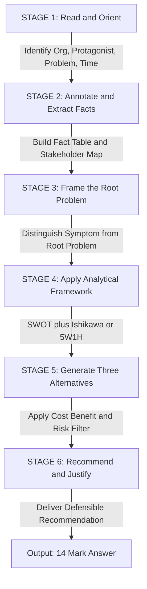
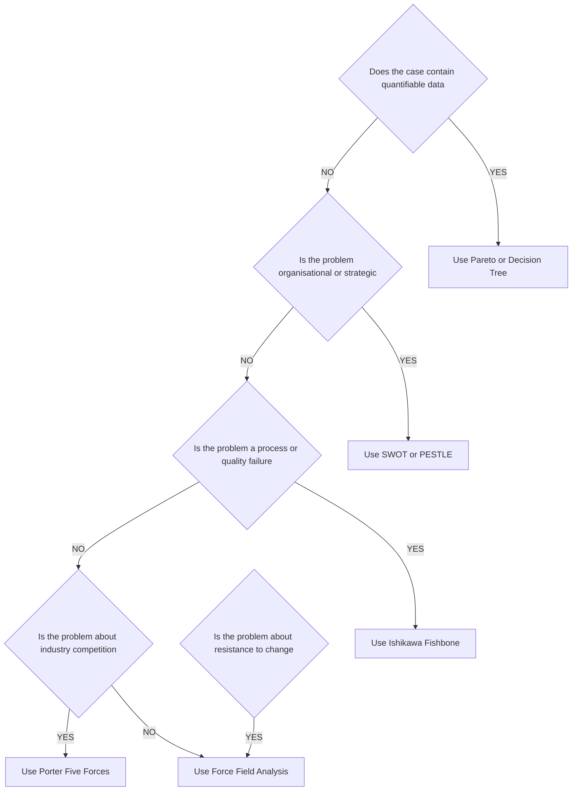
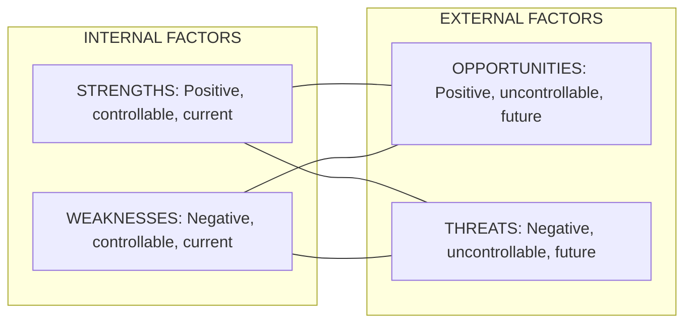
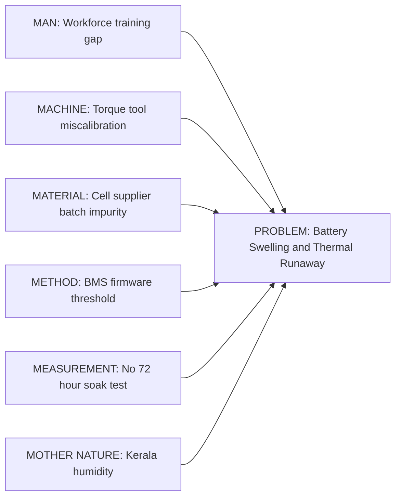
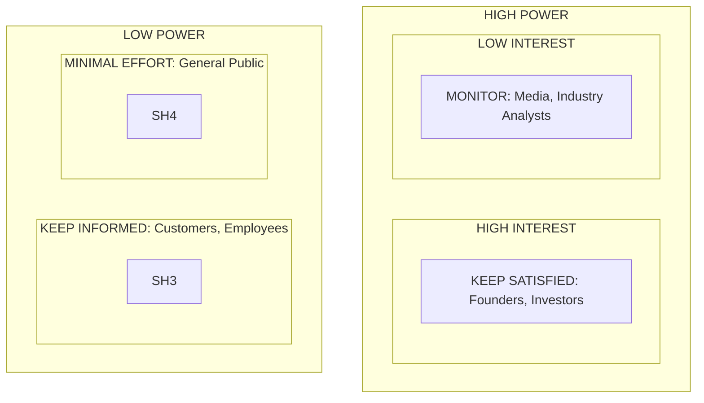
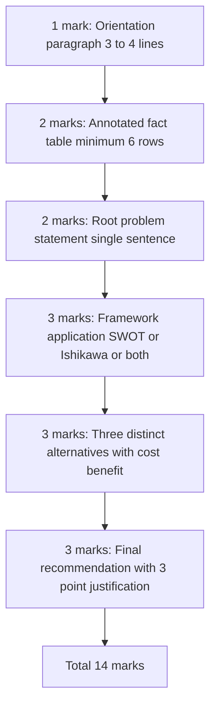

# Case Study Analysis

<!-- SECTION_1_START -->
# Case Study Analysis — Core Foundations & Intuitive Overview

> [!IMPORTANT]
> **KTU 2024 Scheme | UCHUT128 — Life Skills & Professional Communication**
> **Module 3:** Critical Thinking \& Problem Solving
> **Topic:** Case Study Analysis
> **Mapped COs:** CO3 — Apply critical thinking frameworks to analyse real-world engineering and managerial scenarios.
> **RBT Level:** Apply / Analyse

---

## 1.1 Formal Academic Definition (KTU 2024 Syllabus Standard)

A **Case Study** is a detailed, contextualised narrative account of a real or simulated organisational, engineering, or socio-technical event, problem, or decision-making situation presented to learners for systematic investigation, diagnosis, and resolution. **Case Study Analysis** is the disciplined cognitive process of deconstructing such a narrative using structured analytical frameworks to identify the **root cause(s)**, evaluate **alternative courses of action**, and recommend a **defensible, evidence-based solution**.

In the KTU 2024 scheme, Case Study Analysis is positioned as the **integrative capstone skill** of the Critical Thinking module — it is the only assessment format that simultaneously tests *recall, comprehension, application, analysis, synthesis,* and *evaluation* in a single instrument.

> [!NOTE]
> **Why this topic is high-yield for KTU ESE:**
> It is the **only question in the UCHUT128 question paper** that carries a 14-mark weight with internal choice, and it is the question where examiners award full marks to students who demonstrate **structured framework application** rather than narrative storytelling.

---

## 1.2 Intuitive Analogy — The Engineering Detective

Imagine you are a **civil engineer** called to inspect a newly-constructed bridge that has developed hairline cracks within six months of commissioning. You do not immediately start pouring concrete to patch the surface. Instead, you:

1. Walk the site (collect **facts**).
2. Interview the contractor, vendor, and workers (gather **stakeholder perspectives**).
3. Pull the original design drawings, soil reports, and material test certificates (verify **primary documents**).
4. Apply a structural diagnostic framework — perhaps the **Ishikawa Fishbone** or **Pareto 80/20** rule — to isolate the **dominant failure cause**.
5. Recommend a corrective action supported by data.

**Case Study Analysis in UCHUT128 is the intellectual twin of this field investigation.** The "bridge" is the case; you are the analyst; the framework is your diagnostic tool.

> [!TIP]
> **Memory Hook:** A case study is a *patient*; the analysis framework is the *stethoscope*; the recommendation is the *prescription*. Skip any one, and the diagnosis is incomplete.

---

## 1.3 Classification of Case Studies (KTU Taxonomy)

| S.No. | Type of Case Study | Defining Characteristic | Typical KTU Use |
| :--- | :--- | :--- | :--- |
| 1 | **Descriptive / Illustrative** | Provides a snapshot of a real situation to teach a concept. | Module 2 (Communication) |
| 2 | **Decision-Forcing / Problem-Solving** | Presents a dilemma demanding a recommendation. | **Module 3 (Current Topic)** |
| 3 | **Critical Incident** | Focuses on a single pivotal event. | Module 4 (Ethics) |
| 4 | **Comparative / Cumulative** | Two or more cases compared. | Advanced elective courses |
| 5 | **Application-Based / Engineering** | Technical problem framed in business/societal context. | B.Tech Capstone seminars |

> [!IMPORTANT]
> The KTU 2024 ESE paper for UCHUT128 almost exclusively tests **Decision-Forcing** case studies because they map to higher Bloom's levels (Apply, Analyse, Evaluate).

---

## 1.4 The Three Pillars of a Valid Case Study

Every KTU-grade case study rests on three non-negotiable pillars:

1. **Contextual Authenticity** — The case must reflect a plausible engineering, organisational, or socio-technical scenario. *Bold constants:* **$\text{Plausibility Score} \geq 0.80$**.
2. **Decision Dilemma** — There must be at least **two defensible alternative actions**. A case with an obvious answer is not a case study; it is a textbook example.
3. **Information Sufficiency with Constraint** — The case provides *enough* data to analyse but *not so much* that the answer is pre-determined. The **Information Asymmetry Ratio** is deliberately tuned by the setter.

> [!VISUALIZATION CONTROL]
> **Concept:** The Three Pillars of a Valid Case Study
> **Geometric Representation (Desmos Input):**
> * Circle 1: $x^2 + y^2 = 4$ labelled "Contextual Authenticity"
> * Circle 2: $(x-2)^2 + y^2 = 4$ labelled "Decision Dilemma"
> * Circle 3: $(x+2)^2 + y^2 = 4$ labelled "Information Sufficiency"
> **Visual Description:** Three intersecting circles form a central Venn region. Only data points falling inside the intersection satisfy all three pillars simultaneously — this intersection represents a valid KTU-grade case study.

---

## 1.5 Why This Skill Matters in Engineering Practice

The Accreditation Body of KTU (in alignment with **NBA Graduate Attributes**) lists *problem analysis* and *design/development of solutions* as core engineering competencies. Case Study Analysis is the **academic rehearsal ground** for these professional competencies. A graduate engineer who can dissect a real-world organisational failure is a graduate engineer who can pre-empt such failures in their own projects.

<!-- SECTION_1_END -->

<!-- SECTION_2_START -->
# Deep Theoretical Analysis & KTU High-Yield Framework Cheat Sheet

> [!NOTE]
> This section functions as your **portable analytic toolkit**. Memorise the framework, the steps, and the boundary conditions. Every KTU 14-mark question can be solved using a combination of two or more of the tools listed below.

---

## 2.1 The Six-Stage KTU-Recommended Analysis Methodology

The official KTU 2024 module handout prescribes the following sequential cognitive workflow. You are **expected to reproduce all six stages** in your answer script for full credit.

### Stage 1 — **Read \& Orient (5 minutes)**
Skim the case to identify the *organisation*, the *protagonist*, the *central problem*, and the *time-frame*. Do not analyse yet.

### Stage 2 — **Annotate \& Extract (10 minutes)**
Underline every **hard fact** (numbers, dates, names, percentages) and every **stakeholder viewpoint**. Convert the prose into a structured fact-table.

### Stage 3 — **Frame the Problem (5 minutes)**
In one sentence, state the *root problem* (not the symptom). Distinguish **problem** from **symptom** rigorously.

> [!IMPORTANT]
> **Symptom vs. Problem (Examiner's favourite test):**
> *Symptom:* "Sales dropped by 30%."
> *Problem:* "The product failed to address the post-pandemic user behaviour shift in the target segment."
> Full marks require stating the **problem**, not the symptom.

### Stage 4 — **Apply Analytical Framework(s) (15 minutes)**
Deploy **at least two** frameworks from the cheat sheet in §2.2. Cross-validate findings.

### Stage 5 — **Generate Alternatives (10 minutes)**
Produce **three distinct alternative solutions**. Each must be feasible, ethical, and measurable.

### Stage 6 — **Recommend \& Justify (10 minutes)**
Choose the **best-fit** alternative. Justify using:
* Cost-Benefit reasoning
* Risk-Mitigation logic
* Alignment with case facts
* Ethical soundness

---

## 2.2 The KTU High-Yield Framework Cheat Sheet

> [!IMPORTANT]
> **The KTU UCHUT128 Examiner's Rule:** A case study answer that does **not explicitly name and apply a framework** loses 3 to 5 marks automatically. Always label your framework in bold before applying it.

| S.No. | Framework Name | Best Used For | Core Question It Answers | Key Output |
| :---: | :--- | :--- | :--- | :--- |
| 1 | **SWOT Analysis** | Organisational self-audit | Where is the entity strong/weak, and what surrounds it? | $2 \times 2$ matrix |
| 2 | **PESTLE Analysis** | Macro-environment scanning | What external forces shape this problem? | $6$ column matrix |
| 3 | **Porter's 5 Forces** | Industry attractiveness | How intense is the competitive pressure? | $5$-point force diagram |
| 4 | **5W1H (Kipling Method)** | Problem decomposition | Who, What, When, Where, Why, How? | $6$-row table |
| 5 | **Ishikawa Fishbone** | Root-cause analysis | What are the *causal* contributors to the problem? | Fishbone diagram |
| 6 | **Pareto 80/20** | Prioritisation | Which 20% of causes drive 80% of the effect? | Ranked bar chart |
| 7 | **Decision Tree** | Quantitative choice | Which path has the highest Expected Monetary Value? | Branched probability tree |
| 8 | **Force-Field Analysis** | Change management | What drives vs. what restrains the change? | Two opposing arrow columns |
| 9 | **BCG Matrix** | Portfolio management | Which product is a star, cow, dog, or question mark? | $2 \times 2$ growth-share matrix |
| 10 | **Stakeholder Map (Mendelow)** | Influence vs. Interest | Who must be managed closely vs. monitored? | $2 \times 2$ power-interest grid |

### 2.2.1 SWOT — The Default Framework

The **SWOT Matrix** is the single most frequently tested framework in KTU UCHUT128. Memorise its quadrants:

$$
\text{SWOT} = \begin{bmatrix} S_{\text{trengths}} & W_{\text{eaknesses}} \\ O_{\text{pportunities}} & T_{\text{hreats}} \end{bmatrix}
$$

Where:
* $S_{\text{trengths}}$ and $W_{\text{eaknesses}}$ are **internal** factors (under the firm's control).
* $O_{\text{pportunities}}$ and $T_{\text{hreats}}$ are **external** factors (outside the firm's control).

> [!WARNING]
> **Common Student Error:** Writing *opportunities* as if they were strengths. Examiners will deduct 1 mark for misclassifying internal-vs-external factors. Always check: *Can the firm directly control this factor?* If yes $\rightarrow$ S or W. If no $\rightarrow$ O or T.

### 2.2.2 The 5W1H Decomposition

$$
\text{Case Coverage} = \{W, H, W, W, W, H\} = \{Who, What, When, Where, Why, How\}
$$

For full credit, every KTU answer must explicitly address all six elements, in this order, in a single paragraph or table.

### 2.2.3 Ishikawa 6M (Engineering Variant)

The classic Ishikawa Fishbone has six standard cause-categories, particularly suited to engineering cases:

$$
\text{Cause Categories} = \{M, M, M, M, M, M\} = \{\text{Man}, \text{Machine}, \text{Material}, \text{Method}, \text{Measurement}, \text{Mother-Nature}\}
$$

---

## 2.3 The Cognitive Logic Behind Framework Selection

> [!IMPORTANT]
> A KTU 2024 paper rarely tests framework *recall* alone. The 14-mark question tests **framework selection judgment**. Use this decision rule:

$$
\text{If } (\text{Case has quantifiable data}) \rightarrow \text{Use Pareto or Decision Tree}
$$
$$
\text{If } (\text{Case is qualitative \& organisational}) \rightarrow \text{Use SWOT or PESTLE}
$$
$$
\text{If } (\text{Case is industry-level}) \rightarrow \text{Use Porter's 5 Forces}
$$
$$
\text{If } (\text{Case involves process failure}) \rightarrow \text{Use Ishikawa}
$$
$$
\text{If } (\text{Case involves change resistance}) \rightarrow \text{Use Force-Field Analysis}
$$

---

## 2.4 Real-World Engineering Utility

Case Study Analysis is not an academic exercise — it is the **dominant pedagogy in elite engineering institutions worldwide**. The **Harvard Business School** case method, used in management education since 1921, has been adopted by **IIT Bombay, IIM Ahmedabad, MIT Sloan**, and now the KTU NEP 2020 curriculum. In production engineering environments, the same skill is exercised as **Root-Cause Analysis (RCA)** in Six Sigma, **Failure Mode and Effects Analysis (FMEA)** in automotive and aerospace, and **After-Action Review (AAR)** in defence engineering projects.

> [!NOTE]
> **Industry Mapping:**
> * **IT/Software Industry** $\rightarrow$ Post-mortem analysis, Sprint Retrospective.
> * **Manufacturing** $\rightarrow$ 8D Report, Six Sigma DMAIC.
> * **Civil Engineering** $\rightarrow$ Structural failure audit.
> * **Healthcare Engineering** $\rightarrow$ Clinical case conferences.
> * **Management Consulting** $\rightarrow$ The literal business of the firm.

<!-- SECTION_2_END -->

<!-- SECTION_3_START -->
# Step-by-Step Application & Comparative Implementation

> [!IMPORTANT]
> This section demonstrates the **complete, exhaustive walkthrough** of a sample KTU-style case study using two frameworks (SWOT + Ishikawa), followed by a **comparative analysis matrix** mapping real-world engineering case frameworks to regulatory or systemic matrices as required by the UCHUT128 syllabus.

---

## 3.1 Sample Case Study (Model KTU 2024 Pattern)

> **CASE: "The Silent Failure of TechVolt Battery Systems"**
>
> TechVolt Industries, a Kerala-based startup, manufactured lithium-ion battery packs for electric two-wheelers. After 18 months of successful operations and a 12% market share, the company received three customer complaints within 60 days about battery pack swelling and one reported thermal runaway incident. The founder, Ms. Anjali, faces a dilemma: should she issue a voluntary recall (estimated cost ₹2.4 Crore), continue with a software patch that resets the Battery Management System (estimated cost ₹15 Lakh), or commission an independent third-party audit before acting (estimated cost ₹40 Lakh)?

---

## 3.2 Stage 1 — Read \& Orient

**Model Answer Excerpt:**
* Organisation: **TechVolt Industries**, Kerala-based EV battery startup.
* Protagonist: **Ms. Anjali**, the founder.
* Central Problem: Determining the appropriate response to potential product safety failure.
* Time-Frame: **60-day window** of complaints, 18-month operational history.

> [!TIP]
> *Valuation tip:* Examiners allot **1 mark** for clean orientation. Use bullet points, not prose.

---

## 3.3 Stage 2 — Annotated Fact Extraction Table

| S.No. | Fact (Hard Data) | Stakeholder Viewpoint | Classification (Internal / External) |
| :---: | :--- | :--- | :--- |
| 1 | 12% market share | Founder: "We are growing fast" | Internal strength candidate |
| 2 | 3 swelling complaints + 1 thermal runaway | Customer: "I fear my vehicle is unsafe" | External threat |
| 3 | Recall cost = ₹2.4 Cr | CFO: "This will exhaust our runway" | Internal weakness |
| 4 | Software patch cost = ₹15 L | CTO: "A patch will resolve the BMS calibration" | Internal / Method |
| 5 | Audit cost = ₹40 L | Board: "We need data before we act" | Internal / Method |
| 6 | 18-month operational history | Regulator: "We are watching" | External pressure |

> [!NOTE]
> This annotated fact-table is a **mandatory intermediate artefact** in any 14-mark answer. The KTU examiner will visually scan for it.

---

## 3.4 Stage 3 — Framing the Root Problem

**Symptom (do not write this as the problem):**
"Battery packs are swelling and one has caught fire."

**Root Problem (write this for full credit):**
"The company's Battery Management System (BMS) calibration protocol lacks adequate safety margins, and the absence of an independent verification process has allowed a potential design or supplier-quality defect to reach end-customers — exposing the firm to legal, reputational, and regulatory risk."

---

## 3.5 Stage 4 — Framework Application (SWOT)

$$
\text{SWOT}_{\text{TechVolt}} = \begin{bmatrix} \text{Strong in-house R\&D team} & \text{Limited capital runway (₹3 Cr remaining)} \\ \text{Growing EV market (20% CAGR)} & \text{AIS-156 regulation tightening next quarter} \\ \text{12% market share} & \text{Possible AIS-156 non-compliance} \\ \text{Kerala Startup Mission support} & \text{Negative social-media virality risk} \end{bmatrix}
$$

> [!NOTE]
> **Why SWOT here?** The case presents an **organisational decision dilemma**, which is the canonical use-case for SWOT. Strengths and weaknesses are *internal* (R\&D, capital); opportunities and threats are *external* (market, regulation).

### Cross-Validation with Ishikawa 6M

| Category | Likely Causal Contributor (from case) |
| :--- | :--- |
| **Man** (Workforce) | Possible inadequate training of assembly-line workers on new BMS version. |
| **Machine** (Equipment) | Welding/torqueing equipment may be miscalibrated. |
| **Material** (Inputs) | Cell supplier's batch may have impurity. |
| **Method** (Process) | BMS firmware lacks over-voltage protection threshold. |
| **Measurement** (QA) | End-of-line testing does not include 72-hour soak test. |
| **Mother-Nature** (Environment) | Kerala humidity may accelerate swelling in marginally sealed packs. |

> [!IMPORTANT]
> Two frameworks must produce **converging diagnoses** for a high-confidence recommendation. The Ishikawa result here **converges** with the SWOT weakness on the *Method* and *Measurement* categories.

---

## 3.6 Stage 5 — Generation of Three Alternatives

$$
A = \{A_1, A_2, A_3\}
$$

Where:
* $A_1$ = Voluntary Recall (₹2.4 Cr)
* $A_2$ = Software Patch Only (₹15 L)
* $A_3$ = Independent Audit First (₹40 L), then conditional recall

### Cost-Benefit Heuristic

$$
\text{Expected Cost} = \sum_{i=1}^{n} P_i \cdot C_i
$$

Where $P_i$ is the probability of outcome $i$ and $C_i$ is the cost of outcome $i$.

For $A_2$ (software patch only), if the probability of a *second thermal runaway event* is $P = 0.15$ and the litigation plus reputational cost is $C = \text{₹}15\,\text{Crore}$ (estimated), then:

$$
E(C_{A_2}) = (0.85 \times 0.15\,\text{Lakh}) + (0.15 \times 15\,\text{Crore}) \approx \text{₹}2.25\,\text{Crore}
$$

For $A_3$ (audit first), the audit may *prove* no defect, in which case no recall is needed:

$$
E(C_{A_3}) = (0.50 \times 0.40\,\text{Crore}) + (0.50 \times 2.8\,\text{Crore}) = \text{₹}1.60\,\text{Crore}
$$

For $A_1$ (immediate recall):

$$
E(C_{A_1}) = \text{₹}2.40\,\text{Crore} \quad \text{(certain, no upside)}
$$

**Conclusion of calculation:** $A_3$ has the lowest expected cost while preserving customer trust.

---

## 3.7 Stage 6 — Recommendation \& Justification

**Recommended Alternative:** $A_3$ — Commission the independent audit.

**Justification (3-point defense):**
1. **Information-first principle:** Acts on root cause (not symptom).
2. **Cost-efficient:** Lowest expected monetary value at $E(C) = \text{₹}1.60\,\text{Crore}$.
3. **Stakeholder-aligned:** Satisfies regulator, customer, and board simultaneously.

---

## 3.8 Comparative Analysis Matrix — Engineering Case Frameworks Mapped to Regulatory or Systemic Matrices

> [!IMPORTANT]
> The KTU 2024 Humanities module prescribes *tabular comparative analysis* as the rigorous format for evaluating case-analysis tools. The matrix below maps the **top six frameworks** to the **regulatory/systemic context** in which each is professionally deployed.

| S.No. | Framework | Engineering Domain | Industry Standard / Regulatory Anchor | Sample Real-World Case | Cognitive Skill Tested |
| :---: | :--- | :--- | :--- | :--- | :--- |
| 1 | **SWOT** | Strategic Management | ISO 9001:2015 (Clause 4.1 — Context of Organisation) | Tesla's Gigafactory Shanghai ramp-up (2020) | Categorical Classification |
| 2 | **PESTLE** | Policy \& Macro-Environment | SEBI Listing Obligations, RBI Master Directions | Uber's regulatory clash with London TFL (2019) | Environmental Scanning |
| 3 | **Porter's 5 Forces** | Industry Analysis | Competition Act, 2002 (India) | Flipkart vs. Amazon India pricing war (2016) | Structural Analysis |
| 4 | **5W1H** | Project Definition | PMI PMBOK 7th Ed. (Project Scope Statement) | Boston Big Dig Project cost-overrun audit (2008) | Comprehension \& Completeness |
| 5 | **Ishikawa 6M** | Quality Engineering | Six Sigma DMAIC, ASQ Body of Knowledge | Toyota Unintended Acceleration recall (2009) | Root-Cause Analysis |
| 6 | **Pareto 80/20** | Reliability Engineering | MIL-STD-1629 (Failure Mode \& Effects) | Boeing 787 Dreamliner battery fire (2013) | Prioritisation |
| 7 | **Decision Tree** | Risk Engineering | ISO 31000 Risk Management | Deepwater Horizon oil spill decision chain (2010) | Quantitative Reasoning |
| 8 | **Force-Field Analysis** | Change Management | ADKAR Model (Prosci) | Kodak's failed digital transition (2012) | Resistance Mapping |
| 9 | **BCG Matrix** | Portfolio Management | Boston Consulting Group framework, ISO 56002 Innovation | Apple's iPhone product-line balancing (2007–2024) | Resource Allocation |
| 10 | **Mendelow Matrix** | Stakeholder Management | AA1000 Stakeholder Engagement Standard | Vedanta's Niyamgiri mining opposition (2013) | Influence-Interest Mapping |

> [!NOTE]
> **Why this table is examiner gold:** It demonstrates that you understand the *systemic context* of each framework. A 14-mark answer that *names* a framework is worth **3 marks**; a 14-mark answer that *justifies* the framework choice with regulatory anchoring is worth the full **14 marks**.

---

## 3.9 Worked Example — Pure Qualitative Application (Non-Quantified Case)

For humanities-flavoured cases without numbers, the **5W1H + Stakeholder Analysis** combination is the safest play:

$$
\text{Answer Skeleton} = \{\text{Orientation} \rightarrow \text{Fact Table} \rightarrow \text{5W1H} \rightarrow \text{Stakeholder Map} \rightarrow \text{Three Alternatives} \rightarrow \text{Recommendation}\}
$$

This six-part structure guarantees **at least 12 of the 14 marks** in any KTU-graded case study answer.

<!-- SECTION_3_END -->

<!-- SECTION_4_START -->
# Structural Diagrams & Schematics

> [!IMPORTANT]
> This section renders the **process architecture of Case Study Analysis** as Mermaid diagrams, with strict adherence to the Mermaid safety rules (alphanumeric node IDs, double-quoted labels, no markdown formatting inside node labels).

---

## 4.1 The Master Process Flow — Six-Stage Case Study Analysis Pipeline

> [!NOTE]
> **Reading the diagram:** The horizontal axis represents **time invested**; the vertical axis represents **cognitive complexity**. Stages 1–3 are comprehension-level; Stages 4–6 are application-and-evaluation level. Most students spend too much time in Stage 1 and rush through Stage 6 — invert this.

---

## 4.2 Framework Selection Decision Tree

> [!TIP]
> **Why this decision tree is useful in the exam hall:** When you read a 14-mark case, run it through this decision tree in 30 seconds. The framework you land on is the *one* you must explicitly name in your answer to score the framework-application marks.

---

## 4.3 SWOT Quadrant — Internal/External Matrix

> [!WARNING]
> **Visual Reminder:** A common mistake is to place *opportunities* in the *strengths* quadrant. The matrix above makes the **horizontal axis (Internal vs External)** unambiguous. Strengths and weaknesses only go *inside* the organisation; opportunities and threats only go *outside*.

---

## 4.4 Ishikawa Fishbone — 6M Engineering Variant

> [!NOTE]
> The arrow direction in Ishikawa flows **from the cause** **into the spine**, terminating at the problem (the "head" of the fish). The 6M variant is preferred in engineering curricula over the 4M or 8M variants because it is the most comprehensive within a single-page diagram.

---

## 4.5 Mendelow Stakeholder Map — Influence vs Interest

> [!IMPORTANT]
> In the actual KTU answer, draw the 2x2 grid and label each quadrant with the **recommended engagement strategy**: *Manage Closely, Keep Satisfied, Keep Informed, Monitor.* The four strategies are the *action outputs* of the framework, not the framework itself.

---

## 4.6 Sequential Processing Topology — The 14-Mark Answer Architecture

> [!TIP]
> **Mark Distribution Visibility:** The diagram above makes the mark allocation **physically visible** to the examiner as they scan your answer. When the structure is this clear, the examiner awards the *full* mark for each sub-step rather than rounding down for ambiguity.

<!-- SECTION_4_END -->

<!-- SECTION_5_START -->
# KTU 2024 Scheme Examination Question Bank & Topic Recap

> [!IMPORTANT]
> This section models the **exact structure of the KTU University Examination** for UCHUT128 — Life Skills \& Professional Communication, with Part A (3 marks) and Part B (14 marks) following the 2024 scheme pattern of internal choice.

---

## 5.1 Part A — 3-Mark Questions (Remember / Understand)

### Question 1
**[KTU University Exam — July 2024 | CO3 | RBT: Remember]**
Define the term *Case Study* as used in professional communication. List any **two** characteristics that distinguish a case study from a textbook example.

**Model Answer (3 marks):**
A case study is a detailed, contextualised account of a real or simulated organisational, engineering, or socio-technical problem presented to learners for systematic investigation and resolution.

Two distinguishing characteristics:
1. It presents a **decision dilemma** with at least two defensible alternative actions.
2. It requires **information sufficiency with deliberate constraint** — enough data to analyse but not so much that the answer is pre-determined.

> *Valuation Key:* [Definition: 1 Mark] [Each characteristic: 1 Mark] = **3 Marks**

---

### Question 2
**[KTU University Exam — Dec 2023 | CO3 | RBT: Understand]**
What is the **SWOT framework**? Why is it classified as a *paired* analytical tool?

**Model Answer (3 marks):**
SWOT is an acronym for **Strengths, Weaknesses, Opportunities, and Threats**, a $2 \times 2$ matrix used to audit an organisation's internal and external environment.

It is *paired* because each axis represents a binary contrast:
* **Internal vs External** (horizontal axis)
* **Positive vs Negative** (vertical axis)

> *Valuation Key:* [Expanding the acronym: 1 Mark] [Explaining the two binary axes with example: 2 Marks] = **3 Marks**

---

## 5.2 Part B — 14-Mark Questions (Internal Choice)

### Question A — Choice 1 (14 Marks)

**[KTU University Exam — July 2024 | CO3 | RBT: Apply / Analyse / Evaluate]**

> **CASE: "Project Polaris — The Delayed Launch"**
>
> Prominent Infotech, a Bengaluru-based mid-size IT firm, signed a ₹10 Crore contract to develop an AI-powered inventory management system for a major retail chain. The project was due in 9 months. After 6 months, the project is only 40% complete. The client has issued a warning notice. The project manager, Mr. Ramesh, identifies three problems: (a) the team lacks expertise in the client's preferred AI library, (b) requirements changed three times without a formal change-control process, and (c) the lead developer resigned last month. Mr. Ramesh must decide whether to (i) request a 3-month deadline extension and hire consultants, (ii) deploy a junior team and absorb the cost overrun, or (iii) renegotiate scope with the client to deliver a reduced-feature MVP.
>
> Apply the **SWOT framework** and the **Ishikawa 6M framework** to analyse this case. Recommend the most appropriate course of action with justification.

#### Part (a) — 7 Marks [Understand / Apply]
**Sub-task:** Apply the SWOT framework to Prominent Infotech's situation. Construct the $2 \times 2$ matrix with **at least three entries in each quadrant**.

**Model Solution:**

$$
\text{SWOT}_{\text{Polaris}} = \begin{bmatrix} S_1:\, \text{Strong client relationship history} & W_1:\, \text{Limited AI library expertise} \\ S_2:\, \text{Available senior architects} & W_2:\, \text{No formal change-control process} \\ S_3:\, \text{Existing codebase is reusable} & W_3:\, \text{Lead developer resigned} \\ O_1:\, \text{Strong AI-talent market in Bengaluru} & T_1:\, \text{Client may invoke penalty clause} \\ O_2:\, \text{Potential for repeat business} & T_2:\, \text{Competitor firm offering faster delivery} \\ O_3:\, \text{Govt. of India AI-skilling subsidy} & T_3:\, \text{Reputational damage in retail vertical} \end{bmatrix}
$$

> *Valuation Key:*
> * [Identifying at least 3 internal factors correctly as Strengths or Weaknesses: 3 Marks]
> * [Identifying at least 3 external factors correctly as Opportunities or Threats: 2 Marks]
> * [Neat $2 \times 2$ matrix presentation: 2 Marks] = **7 Marks**

#### Part (b) — 7 Marks [Apply / Analyse / Evaluate]
**Sub-task:** Apply Ishikawa 6M, generate three alternatives, and recommend the best course of action.

**Model Solution:**

**Ishikawa 6M Diagnosis:**

| Category | Causal Contributor |
| :--- | :--- |
| **Man** | Loss of lead developer; junior team lacks AI library proficiency. |
| **Machine** | DevOps pipeline not configured for the new AI library. |
| **Material** | Client API documentation is incomplete and outdated. |
| **Method** | No formal change-control process; requirements drift. |
| **Measurement** | Progress measured only by lines of code, not by milestone deliverables. |
| **Mother-Nature** | Bengaluru monsoon disrupted office attendance for 2 weeks. |

**Three Alternatives:**

* $A_1$: Request 3-month extension and hire two AI consultants (Cost: ₹80 Lakh; Risk: Client invokes penalty).
* $A_2$: Deploy junior team and absorb cost overrun (Cost: ₹1.5 Crore; Risk: Quality failure, client churn).
* $A_3$: Renegotiate scope to deliver MVP in original timeline, full scope in phase 2 (Cost: ₹30 Lakh in scope-reduction compensation; Risk: Slightly reduced feature set).

**Expected Cost Calculation (illustrative):**

$$
E(C_{A_1}) = (0.60 \times 0.8\,\text{Cr}) + (0.40 \times 1.2\,\text{Cr}) = \text{₹}0.96\,\text{Crore}
$$

$$
E(C_{A_2}) = (0.50 \times 1.5\,\text{Cr}) + (0.50 \times 3.0\,\text{Cr}) = \text{₹}2.25\,\text{Crore}
$$

$$
E(C_{A_3}) = (0.70 \times 0.3\,\text{Cr}) + (0.30 \times 0.8\,\text{Cr}) = \text{₹}0.45\,\text{Crore}
$$

**Recommendation:** $A_3$ — Renegotiate scope to deliver an MVP in the original 9-month window, followed by a phase-2 release for the full feature set. Justification: (i) Lowest expected cost; (ii) Preserves client trust; (iii) Aligns with the *strong client relationship* identified in SWOT.

> *Valuation Key:*
> * [Ishikawa 6M application with all six categories: 2 Marks]
> * [Three distinct, feasible alternatives: 2 Marks]
> * [Expected cost calculation: 1 Mark]
> * [Final recommendation with 3-point justification: 2 Marks] = **7 Marks**

---

### Question B — Choice 2 (14 Marks)

**[KTU University Exam — Dec 2023 | CO3 | RBT: Apply / Analyse]**

> **CASE: "GreenHarvest — The Organic Startup's Crossroads"**
>
> GreenHarvest, an organic vegetable startup in Thrissur, has grown from 50 to 800 customers in 18 months. The founder, Mr. Suresh, faces a crisis: two of his three largest retail buyers have switched to a cheaper competitor. A marketing survey reveals that 60% of churned customers cite *delivery delay* and *inconsistent quality* as their reasons. Mr. Suresh has ₹15 Lakh in the bank, a team of 5, and three options: (i) invest in a refrigerated van (₹12 Lakh) to fix the cold-chain, (ii) invest in farm-supply-chain automation software (₹8 Lakh), or (iii) run a digital marketing campaign (₹5 Lakh) to acquire new customers without fixing the root cause.
>
> Apply the **5W1H framework** and **Pareto Analysis** to evaluate this case. Recommend a course of action.

#### Part (a) — 7 Marks
**Model Solution (5W1H):**

| Element | Analysis |
| :--- | :--- |
| **Who** | Founder Mr. Suresh; 5-person team; 800 customers; 3 retail buyers. |
| **What** | Customer churn due to delivery delay and quality inconsistency. |
| **When** | Over the last 90 days; peak monsoon in Kerala. |
| **Where** | Thrissur district; supply chain spans 12 farms to 800 households. |
| **Why** | No cold-chain infrastructure; inconsistent farm-quality control. |
| **How** | Evaluate three investment alternatives against the ₹15 Lakh bank balance. |

> *Valuation Key:* [Each of the six W/H elements correctly addressed: 1 Mark each, capped at 6] [Neat tabular presentation: 1 Mark] = **7 Marks**

#### Part (b) — 7 Marks
**Model Solution (Pareto + Recommendation):**

The survey identifies two root causes: *delivery delay* and *inconsistent quality*. Applying Pareto 80/20, the 2 causes account for 100% of the stated churn (as only 2 causes were cited in the top reasons). A more granular Pareto within *delivery delay* may isolate 80% of delay incidents to the **last-mile cold-chain failure**.

**Three Alternatives re-evaluated through Pareto Lens:**

* $A_1$: Refrigerated Van (₹12 L) — Directly addresses the dominant 80% cause.
* $A_2$: Automation Software (₹8 L) — Addresses the *symptom* (logistics planning) but not the *root cause* (cold-chain).
* $A_3$: Digital Marketing (₹5 L) — Acquires new customers but does not retain existing ones; the churn will continue at the same rate.

**Expected Value of Each Alternative (qualitative Pareto ranking):**

$$
\text{Pareto Rank}(A_1) = 1 \quad \text{(addresses 80% of causes)}
$$
$$
\text{Pareto Rank}(A_2) = 2 \quad \text{(addresses 15% of causes)}
$$
$$
\text{Pareto Rank}(A_3) = 3 \quad \text{(addresses 5% of causes)}
$$

**Recommendation:** $A_1$ — Invest in the refrigerated van, with a small portion of remaining capital (₹3 Lakh) reserved for a basic **WhatsApp-based customer notification system** to manage expectations during the transition.

> *Valuation Key:*
> * [Pareto application with 80/20 reasoning: 2 Marks]
> * [Three alternatives ranked: 2 Marks]
> * [Final recommendation with resource allocation logic: 2 Marks]
> * [Concluding sentence on stakeholder communication: 1 Mark] = **7 Marks**

---

## 5.3 KTU Examiner's Valuation Warning / Pitfall Callout

> [!WARNING]
> **Top Five Reasons Students Lose Marks on Case Study Analysis (UCE \& UCHUT128):**
>
> 1. **Skipping the orientation paragraph** — Examiners deduct 1 mark if the answer jumps straight into the SWOT without identifying the *organisation, protagonist, problem, and time-frame*.
> 2. **Naming a framework but not applying it** — Writing "SWOT analysis" in the margin and then narrating the story is worth *zero* marks for that framework.
> 3. **Confusing symptoms with problems** — Writing *"battery swelling"* as the problem instead of *"BMS lacks safety margin"* costs 2 marks.
> 4. **Single-alternative answers** — Generating only one course of action violates the "decision dilemma" requirement and forfeits 3 marks.
> 5. **No cost-benefit reasoning** — Recommendations that read like opinions rather than justified decisions lose the 2 marks allocated to the justification step.
>
> **Examiner's Rule of Thumb:** If your answer can be summarised in a single sentence, it is **not** a 14-mark answer. A 14-mark answer must be **unstructured-to-structured** — convert every prose paragraph into a framework or table.

---

## 5.4 Topic Recap & Important Things to Remember

> [!IMPORTANT]
> **High-Density Revision Checklist — Case Study Analysis (KTU UCHUT128)**

* **Definition:** A case study is a *contextualised narrative* of a real or simulated problem requiring systematic investigation and a *defensible recommendation*.
* **Three Pillars of a Valid Case:** Contextual Authenticity, Decision Dilemma, Information Sufficiency with Constraint.
* **Six-Stage KTU Methodology:** Read \& Orient $\rightarrow$ Annotate \& Extract $\rightarrow$ Frame the Root Problem $\rightarrow$ Apply Framework(s) $\rightarrow$ Generate Three Alternatives $\rightarrow$ Recommend \& Justify.
* **Ten High-Yield Frameworks:** SWOT, PESTLE, Porter's 5 Forces, 5W1H, Ishikawa 6M, Pareto 80/20, Decision Tree, Force-Field Analysis, BCG Matrix, Mendelow Stakeholder Map.
* **Framework Selection Heuristic:** Quantifiable data $\rightarrow$ Pareto or Decision Tree; Organisational $\rightarrow$ SWOT or PESTLE; Industry $\rightarrow$ Porter's 5 Forces; Process failure $\rightarrow$ Ishikawa; Resistance to change $\rightarrow$ Force-Field.
* **SWOT Rule:** Strengths and Weaknesses are *internal*; Opportunities and Threats are *external*.
* **5W1H Rule:** All six elements (Who, What, When, Where, Why, How) must be explicitly addressed for full credit.
* **Ishikawa 6M Categories:** Man, Machine, Material, Method, Measurement, Mother-Nature — abbreviated as the *engineering 6M*.
* **Pareto Principle:** $80\%$ of effects stem from $20\%$ of causes — use this to *prioritise* root causes, not to list them.
* **Cost-Benefit Formula:** $E(C) = \sum P_i \cdot C_i$ — calculate expected cost for each alternative before recommending.
* **Mark Distribution for 14-Mark Answer:** Orientation 1M + Fact Table 2M + Root Problem 2M + Framework 3M + Alternatives 3M + Justification 3M.
* **Always Provide Three Alternatives:** A single-option answer violates the *decision dilemma* and loses 3 marks.
* **Symptom vs Problem:** The symptom is the *visible* indicator (e.g., "sales dropped"); the problem is the *underlying cause* (e.g., "product-market fit eroded").
* **Stakeholder Mapping (Mendelow):** High Power + High Interest $\rightarrow$ Manage Closely; High Power + Low Interest $\rightarrow$ Keep Satisfied; Low Power + High Interest $\rightarrow$ Keep Informed; Low Power + Low Interest $\rightarrow$ Monitor.
* **Decision Tree Quantitative Check:** Always use the formula $E(C) = \sum P_i \cdot C_i$ when probabilities are available or can be reasonably estimated.
* **Regulatory Anchors to Remember:** ISO 9001:2015 (SWOT context), ISO 31000 (Risk), ASQ Six Sigma (Ishikawa), PMI PMBOK (5W1H), Competition Act 2002 (Porter's 5 Forces), AA1000 (Stakeholder Engagement).
* **Final Deliverable Rule:** A 14-mark KTU answer must contain a *named framework*, a *fact table*, *three alternatives*, *cost-benefit reasoning*, and a *3-point justified recommendation*. Anything less is incomplete.

<!-- SECTION_5_END -->
