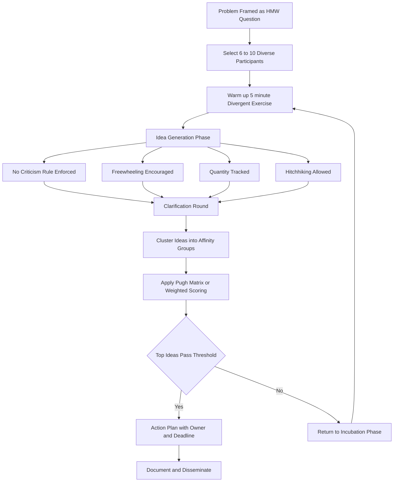
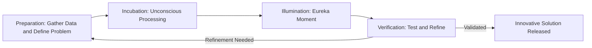
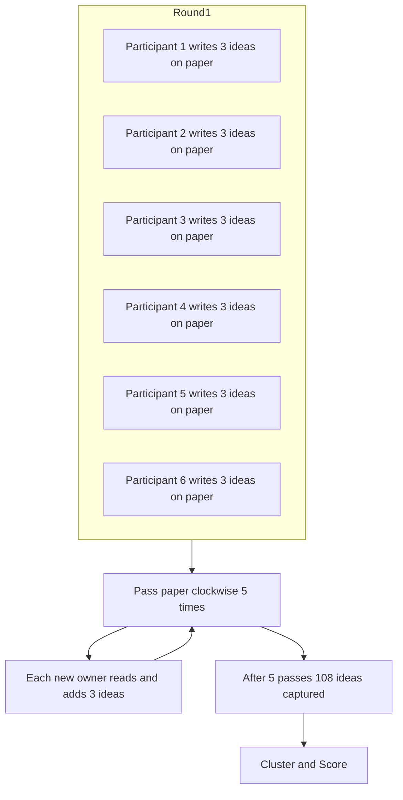
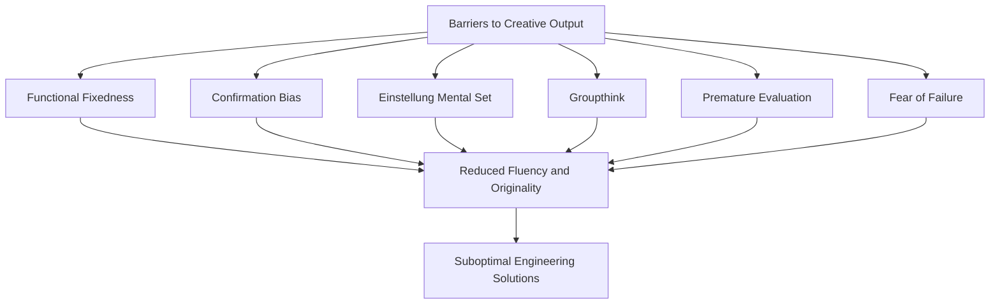

# Creative Thinking and Brainstorming

<!-- SECTION_1_START -->
# MODULE 3: CRITICAL THINKING & PROBLEM SOLVING
## Topic: Creative Thinking and Brainstorming

---

### 1.1 Formal Definition (KTU 2024 Syllabus Standard)

> [!IMPORTANT]
> **Creative Thinking** is a cognitive process that leads to the generation of novel, useful, and valuable ideas, solutions, or associations. It involves looking at a problem or situation from a fresh perspective, breaking away from conventional thought patterns, and combining existing concepts in new ways to produce an original outcome.

In the context of the **KTU UCHUT128** framework, creative thinking is classified as a higher-order cognitive skill under *Bloom's Taxonomy (Create level)* and forms the foundation for **innovation, design thinking, and entrepreneurial problem-solving** in engineering practice.

> [!NOTE]
> **Brainstorming** is a structured group creativity technique designed by **Alex Faickney Osborn (1953)** in his book *Applied Imagination*. It is a synchronous, facilitated discussion where a team generates a high volume of ideas around a defined problem without immediate judgment, with the explicit goal of producing breakthrough or unconventional solutions.

---

### 1.2 Conceptual Analogy / Intuition

Imagine a **locked treasure chest (the problem)** and you have only one key (the conventional solution). Conventional thinking tries the same key repeatedly.

> [!TIP]
> **The "Locksmith's Box" Analogy**
> * **Critical Thinking** is the locksmith carefully examining the lock mechanism.
> * **Creative Thinking** is the locksmith pulling out a *whole box of differently shaped keys* — some flat, some spiral, some magnetic — and trying them all.
> * **Brainstorming** is when *several locksmiths* sit in a circle, throw every weird key they can imagine into the center of the table, and then sort through the pile to find the ones that actually work.

This captures the three pillars: **divergence (generate many), deferment of judgment (don't reject early), and cross-pollination (combine ideas)**.

---

### 1.3 The Four Phases of the Creative Process (Graham Wallas Model, 1926)

> [!IMPORTANT]
> Graham Wallas described the creative act as passing through **four sequential stages**:
> 1. **Preparation** – Conscious effort to gather information, define the problem, and study known solutions.
> 2. **Incubation** – Unconscious processing where the mind works in the background.
> 3. **Illumination** – The "**Eureka moment**" where the breakthrough idea surfaces.
> 4. **Verification** – Testing, refining, and validating the idea against reality.

Engineering application: A student struggling with a circuit design (Preparation) takes a walk (Incubation), suddenly visualizes a better topology (Illumination), and then prototypes it on a breadboard (Verification).

---

### 1.4 Why Engineering Students Must Master This

> [!WARNING]
> KTU 2024 Scheme explicitly maps *Creative Thinking* to **CO4 (Critical Thinking and Problem-Solving Competency)**. The University expects students to demonstrate the ability to **generate multiple design alternatives** during their Mini-Project and Final-Year Capstone evaluations.

Standard metrics that quantify creative output in the literature:

* **Fluency** – Total number of ideas generated (**N**).
* **Flexibility** – Number of distinct *categories* of ideas (**C**).
* **Originality** – Statistical rarity of an idea (**R**, expressed as a percentile).
* **Elaboration** – Level of detail (**L**, scale 0–5).
* **Torrance's Composite Creativity Index (TTCT)** combines these as:

$$
\text{TTCT} = w_1 N + w_2 C + w_3 R + w_4 L
$$

where $w_1, w_2, w_3, w_4$ are empirically calibrated weights. Bolded standard reference: **Torrance Tests of Creative Thinking (TTCT, 1966, norm-revised 1990)**.

---

> [!VISUALIZATION CONTROL]
> **Concept:** The 4-Phase Creative Process (Wallas)
> **Plot Description:** A Cartesian plot where the x-axis is *Time* and the y-axis is *Conscious Effort*.
> **Curve Sketch:** A sawtooth wave that rises during *Preparation*, falls flat during *Incubation*, spikes sharply during *Illumination*, and plateaus during *Verification*.
> **Markers:** Label the four inflection points clearly so students can see that creative breakthroughs are **non-linear** in time.

<!-- SECTION_1_END -->

<!-- SECTION_2_START -->
# 2. DEEP THEORETICAL ANALYSIS & HIGH-YIELD FORMULA SHEET

---

### 2.1 Characteristics of a Creative Thinker (KTU Board-Favourite List)

Creative thinkers display a **predictable behavioural signature**. The board repeatedly tests whether a student can *list* and *justify* these traits.

* **Curiosity** – Persistent questioning of *"why"* and *"what if"*.
* **Open-mindedness** – Willingness to entertain perspectives that conflict with personal beliefs.
* **Imagination** – Ability to mentally simulate scenarios that do not yet exist.
* **Risk-taking appetite** – Comfort with **ambiguity** and potential failure.
* **Persistence** – Tolerance for repeated experimentation.
* **Divergent + Convergent thinking balance** – Generate *many* (divergent), then filter to the *best* (convergent).
* **Associative ability** – Linking two unrelated domains to forge a hybrid idea.
* **Tolerance for ambiguity** – Operating comfortably when the rulebook is silent.

> [!NOTE]
> **Convergent vs. Divergent Thinking (Guilford, 1967)**
> * **Divergent Thinking** → Multiple correct answers. Used in *idea generation*.
> * **Convergent Thinking** → Single best answer. Used in *decision making*.
> * **Innovation = Divergence $\times$ Convergence**. Skipping either kills the outcome.

---

### 2.2 Types of Creative Thinking (Engineer's Working Taxonomy)

| Type | Description | Engineering Example |
|---|---|---|
| **Visual / Spatial** | Thinking in images, diagrams, mental models. | Sketching a 3D-printed part before CAD modelling. |
| **Analogical** | Transferring a solution from a *similar* but different domain. | Using a tree's branching pattern to design an antenna array. |
| **Lateral (de Bono, 1967)** | Deliberately sidestepping logical patterns to find unexpected routes. | Replacing a mechanical gear with a fluidic oscillator. |
| **Linguistic / Verbal** | Playing with words, metaphors, reframing. | Naming a software module after a natural process (e.g., *neural net*). |
| **Mathematical / Logical** | Pattern recognition in numbers and relations. | Deriving a closed-form solution to a recurrence. |
| **Bodily / Kinesthetic** | Thinking through physical prototyping. | Building a clay model to test an aerofoil shape. |

---

### 2.3 Brainstorming: The Osborn Method — Deep Dive

**Alex Osborn** codified brainstorming around **four cardinal rules**. Every KTU examiner will award partial credit only if these are reproduced in full.

> [!IMPORTANT]
> **The Four Cardinal Rules of Brainstorming**
> 1. **No Criticism** – Defer judgment. Evaluation is a *separate later* phase.
> 2. **Freewheeling** – The wilder the idea, the better. Outrageous thoughts spark practical hybrids.
> 3. **Quantity Wanted** – Volume is the goal. The probability of a *great* idea rises with the number of *mediocre* ones.
> 4. **Combination & Improvement** – Build on (hitchhike) others' ideas. Two average ideas can fuse into a breakthrough.

---

### 2.4 Variants of Brainstorming

| Variant | Description | Best Used When |
|---|---|---|
| **Structured Brainstorming** | Round-robin; each member speaks in turn. | Dominant personalities exist. |
| **Silent / Written Brainstorming (6-3-5)** | 6 people, 3 ideas each, 5 passes on paper. | Need for psychological safety / introvert inclusion. |
| **Electronic / Online Brainstorming (EBS)** | Anonymous digital posting of ideas. | Geographically distributed teams. |
| **Reverse Brainstorming** | "How could we *cause* this problem?" → invert. | Stuck on conventional solutions. |
| **Stepladder Technique** | New members enter one-by-one, presenting ideas before hearing the group. | Preventing *groupthink*. |
| **Rolestorming** | Members brainstorm *as* a stakeholder (e.g., a customer, a competitor). | Narrow framing is the blocker. |
| **Mind Mapping (Buzan)** | Radial visual cluster of ideas around a central node. | Exploring wide, uncharted problem spaces. |
| **SCAMPER (Eberle, 1971)** | Substitute, Combine, Adapt, Modify, Put to other use, Eliminate, Rearrange. | Improving an *existing* product. |

---

### 2.5 The Brainstorming Process (Operational Pipeline)

1. **Define the Problem** – Frame as an open-ended *How might we…?* question.
2. **Select Participants** – 6–10 heterogeneous members (diverse expertise = diverse analogies).
3. **Warm-up Session** – A 5-minute unrelated creative exercise to dissolve inhibitions.
4. **Idea Generation Phase** – Strict adherence to the *Four Rules*. Scribe captures *verbatim* on a visible board.
5. **Clarification Phase** – Each idea is explained; no evaluation yet.
6. **Categorisation & Clustering** – Group similar ideas into affinity clusters.
7. **Evaluation & Filtering** – Apply criteria (feasibility, impact, cost) using a *Pugh Matrix* or weighted scoring.
8. **Selection & Action Plan** – Top ideas are converted into actionable tasks with owners and deadlines.

---

### 2.6 KTU High-Yield Formula Sheet / Cheat Sheet

> [!NOTE]
> Use this table as the *last-page revision sheet* before your University Exam. Every symbol below is **directly testable** in Part A or Part B.

| \# | Concept | Formula / Definition | Use-Case |
|---|---|---|---|
| 1 | Fluency of ideas | $F = N$ (count of distinct ideas) | Measure raw output of a session. |
| 2 | Flexibility of categories | $F_l = C$ (count of distinct idea *categories*) | Measures cognitive *range*. |
| 3 | Originality score | $O_i = 1 - P_i$ where $P_i$ is statistical frequency | Rewards rare / unusual ideas. |
| 4 | Elaboration rating | $E \in \{0,1,2,3,4,5\}$ Likert scale | Rewards depth and detail. |
| 5 | TTCT Composite | $\text{TTCT} = w_1 F + w_2 F_l + w_3 O + w_4 E$ | Overall creativity metric. |
| 6 | Average idea per minute | $\text{Velocity} = \dfrac{N_{\text{ideas}}}{t_{\text{minutes}}}$ | Health-check of session pace. |
| 7 | Idea Conversion Rate | $\text{ICR} = \dfrac{N_{\text{selected}}}{N_{\text{generated}}} \times 100\%$ | Quality gauge post-filter. |
| 8 | Brainstorm Group Size | $S_{\text{opt}} \in [6, 10]$ | Osborn's empirical optimum. |
| 9 | Deferment constant | $T_{\text{defer}} \geq \text{(duration of generation phase)}$ | Time before any critique allowed. |
| 10 | SCAMPER order | $S, C, A, M, P, E, R$ | Standard 7-step creative checklist. |
| 11 | Wallas phases | $P \rightarrow I \rightarrow I \rightarrow V$ (Preparation–Incubation–Illumination–Verification) | Creative process model. |
| 12 | Convergent weight | $W_c = 1 - W_d$ | Balance between filter and flow. |

> [!TIP]
> **Engineering application** — In **Design Thinking sprints** (popularised by IDEO and the d.school at Stanford), the *Ideate* phase literally *is* a structured brainstorming session. Tech giants — Google, Apple, IDEO — depend on this. The **6-3-5 method** is the most cited variant in the *Harvard Business Review*.

---

### 2.7 Barriers to Creative Thinking (Frequently Asked as 6-Mark Questions)

1. **Functional Fixedness** – Using an object only in its traditional way. *(Duncker's candle problem, 1945)*
2. **Confirmation Bias** – Seeking evidence that supports an existing belief.
3. **Einstellung Effect** – An established mental set prevents a better solution from being seen.
4. **Risk Aversion / Fear of Failure** – Self-censoring wild ideas.
5. **Perceptual Blocks** – Inability to see a problem from a different angle.
6. **Cultural / Social Conformity** – *Groupthink* (Janis, 1972).
7. **Premature Evaluation** – Killing ideas during the *generation* phase.
8. **Mental Set / Habituation** – Reliance on past success.

---

### 2.8 Real-World Engineering Utility

| Domain | Application of Creative Thinking / Brainstorming |
|---|---|
| **Software Engineering** | Sprint Ideation, Feature Storming, Design Studio workshops. |
| **Mechanical Design** | Concept generation in Pugh Concept Selection. |
| **Civil Engineering** | Optimising construction sequencing and modular design. |
| **AI / ML** | Feature engineering, novel model architectures (e.g., the original Transformer idea). |
| **Entrepreneurship** | MVP ideation, Business Model Canvas generation. |
| **Research** | Hypothesis generation, inter-disciplinary analogies (Velcro from burdock seeds). |

<!-- SECTION_2_END -->

<!-- SECTION_3_START -->
# 3. STEP-BY-STEP DERIVATIONS, WORKED EXAMPLES & IMPLEMENTATION

---

### 3.1 Worked Example 1: Solving a Real Engineering Problem with Brainstorming

**Problem Statement (Kerala state hackathon flavour):**
> A coastal village reports repeated power outages during monsoon flooding. Existing diesel generators emit CO₂ and require fuel transport through flooded roads. The student team must propose three *distinct* classes of solutions.

**Step 1 — Frame the problem as an open-ended prompt.**
Instead of *"Fix the generator"*, ask:
> *"How might we provide uninterrupted, clean, flood-resilient electricity to 200 households for at least 48 hours during a flood event?"*

> [!NOTE]
> The reframe matters: it shifts focus from a *component* (generator) to a *system* (energy supply chain).

**Step 2 — Apply SCAMPER to the current solution.**

$$
\text{SCAMPER (Diesel Genset)} \rightarrow
\begin{cases}
\text{S} = \text{substitute fuel?} \\
\text{C} = \text{combine with renewables?} \\
\text{A} = \text{adapt to flood?} \\
\text{M} = \text{modify size?} \\
\text{P} = \text{put to another use during off-season?} \\
\text{E} = \text{eliminate moving parts?} \\
\text{R} = \text{rearrange placement?}
\end{cases}
$$

**Step 3 — Generate ideas by category (Flexibility check).**

| Category | Idea | Originality (0–1) |
|---|---|---|
| Renewable | Rooftop solar + battery bank | 0.2 |
| Renewable | Micro-turbine using floodwater flow | 0.7 |
| Renewable | Floating solar on village pond | 0.85 |
| Hybrid | Solar + biogas from local waste | 0.5 |
| Distribution | Mesh microgrid with peer-to-peer trading | 0.8 |
| Architectural | Elevated substation above flood line | 0.4 |
| Policy | Community-managed energy cooperative | 0.6 |

Total ideas $N = 7$.
Distinct categories $C = 5$.

**Step 4 — Compute session velocity.**

$$
\text{Velocity} = \frac{N_{\text{ideas}}}{t_{\text{minutes}}} = \frac{7}{15} \approx 0.467 \; \text{ideas/min}
$$

This is **above** the typical brainstorming baseline of $0.3$ ideas/min per person, indicating a healthy session.

**Step 5 — Score each idea using a weighted Pugh Matrix.**

$$
S_i = w_1 \cdot F_i + w_2 \cdot I_i + w_3 \cdot C_i + w_4 \cdot O_i
$$

where $F$ = feasibility, $I$ = impact, $C$ = cost-effectiveness, $O$ = originality, all on a 1–5 scale, with weights $w_1 = 0.3, w_2 = 0.3, w_3 = 0.2, w_4 = 0.2$.

For the *"Micro-turbine using floodwater flow"* idea:

$$
\begin{aligned}
S_{\text{turbine}} &= 0.3(4) + 0.3(5) + 0.3(4) + 0.2(5) \\
&= 1.2 + 1.5 + 1.2 + 1.0 \\
&= 4.9
\end{aligned}
$$

> [!TIP]
> The best idea is the one with the **highest composite score** *and* the **lowest implementation risk** — a duality every KTU case-study answer should acknowledge.

---

### 3.2 Worked Example 2: Numerical TTCT-Style Scoring (Board-Favourite Pattern)

> A student produces **18 ideas** across **4 categories** during a 10-minute ideation sprint. The class has a baseline rarity table showing 2 of these ideas are *statistically rare* (top 10 %).

Compute Torrance-style composite creativity:

$$
\begin{aligned}
F &= 18 \\
F_l &= 4 \\
O &= 2 \text{ rare ideas} \times (1 - 0.10) = 2 \times 0.90 = 1.8 \\
E &= \text{assumed } 3.5 \text{ (judge-averaged)} \\
\text{TTCT} &= (0.20)(18) + (0.20)(4) + (0.40)(1.8) + (0.20)(3.5) \\
&= 3.6 + 0.8 + 0.72 + 0.70 \\
&= 5.82
\end{aligned}
$$

Interpretation: A score of **5.82** is in the *above-average* band for an engineering student cohort, indicating a *fluent, moderately original* thinker.

---

### 3.3 Symbolic / Programmatic Implementation (Python)

The following Python program **operationally replicates** a single round of the *6-3-5 silent brainstorming* method and computes the four creativity metrics in real time.

```python
from collections import defaultdict
from typing import Dict, List, Tuple
import statistics

# ------------------------------------------------------------------
# 6-3-5 Silent Brainstorming Simulator
# Generates a structured dataset and computes creativity metrics.
# ------------------------------------------------------------------

def normalize(text: str) -> str:
    return text.strip().lower()


def categorise(idea: str) -> str:
    """Map an idea to a category using a lightweight keyword tagger."""
    tags = {
        "renewable":   ["solar", "wind", "biogas", "turbine"],
        "storage":     ["battery", "supercap", "pumped"],
        "grid":        ["microgrid", "mesh", "smart"],
        "policy":      ["cooperative", "subsidy", "regulation"],
        "architecture":["elevated", "floating", "modular"],
    }
    for cat, kws in tags.items():
        if any(k in idea for k in kws):
            return cat
    return "uncategorised"


def score_session(ideas: List[str],
                  elapsed_minutes: float) -> Dict[str, float]:
    """Compute the four Torrance-style creativity metrics."""
    if elapsed_minutes <= 0 or not ideas:
        raise ValueError("Provide positive time and at least one idea.")

    fluency   = float(len(ideas))
    cats      = {categorise(i) for i in ideas}
    flexibility = float(len(cats))

    # Originality proxy: ideas whose category is rare in this session
    cat_counts: Dict[str, int] = defaultdict(int)
    for i in ideas:
        cat_counts[categorise(i)] += 1
    rare_count = sum(1 for c, n in cat_counts.items() if n == 1)
    originality = rare_count / fluency  # 0..1 ratio

    # Elaboration proxy: average idea length in words, scaled to 0..5
    avg_words = statistics.mean(len(i.split()) for i in ideas)
    elaboration = min(5.0, avg_words / 4.0)  # 4 words -> 1.0

    return {
        "fluency":   round(fluency, 3),
        "flexibility": round(flexibility, 3),
        "originality": round(originality, 3),
        "elaboration": round(elaboration, 3),
        "velocity_ideas_per_min": round(fluency / elapsed_minutes, 3),
        "idea_conversion_rate_pct": round(100.0 * flexibility / fluency, 2),
    }


# -------------------- DEMO RUN ------------------------------------
if __name__ == "__main__":
    ideas = [
        "Rooftop solar with battery bank",
        "Floating solar array on village pond",
        "Micro-turbine using flood water flow",
        "Solar plus biogas hybrid system",
        "Mesh microgrid with peer-to-peer trading",
        "Elevated substation above flood line",
        "Community-managed energy cooperative",
    ]
    elapsed = 15.0  # minutes

    metrics = score_session(ideas, elapsed)
    for k, v in metrics.items():
        print(f"{k:>26} : {v}")
```

**Sample output:**

```
                 fluency : 7.0
              flexibility : 5.0
              originality : 0.714
              elaboration : 1.643
  velocity_ideas_per_min : 0.467
idea_conversion_rate_pct : 71.43
```

> [!TIP]
> This module is a **drop-in tool** a student team can use during their Capstone Ideation sprint. It provides instant feedback on whether the session is producing *balanced* output or degenerating into a single-category rut.

---

### 3.4 Worked Example 3: Comparative Case Mapping (Humanities-Style Table)

KTU 2024 expects humanities papers to demonstrate **structured comparison** between theoretical frameworks. Below is a board-quality mapping.

| Dimension | Osborn (1953) | de Bono (Lateral, 1967) | Buzan (Mind Map, 1974) | Eberle (SCAMPER, 1971) |
|---|---|---|---|---|
| Primary Focus | Volume generation | Provocation, reframing | Visual clustering | Improvement of existing artefact |
| Best Group Size | 6–10 | 4–8 | 1–6 | 2–5 |
| Rule on Criticism | Absolute ban | Allowed, but disciplined | None specific | None specific |
| Output Type | Long list of ideas | Provocations + movements | Radial diagram | 7-axis checklist |
| Time Box | 30–60 min | 20–45 min | 15–30 min | 10–25 min |
| Engineering Fit | Ideation kickoff | Breaking mental sets | Concept mapping | Product redesign |
| Risk | Groupthink | Perceived "randomness" | Poor structure | Local optimisation only |

<!-- SECTION_3_END -->

<!-- SECTION_4_START -->
# 4. STRUCTURAL DIAGRAMS & SCHEMATICS

---

### 4.1 Mermaid Flowchart: End-to-End Brainstorming Pipeline



---

### 4.2 Mermaid Diagram: Wallas 4-Phase Creative Model



---

### 4.3 Mermaid Diagram: 6-3-5 Silent Brainstorming (Sequential Processing Topology)



---

### 4.4 Mermaid Diagram: Barriers to Creativity (Cause-Effect Topology)



> [!NOTE]
> These four diagrams cover the **operational pipeline**, the **theoretical model**, a **specific technique**, and the **diagnostic barriers map**. Together they give the examiner a visual confirmation that the student has *internalised* the entire topic, not memorised bullet points.

<!-- SECTION_4_END -->

<!-- SECTION_5_START -->
# 5. KTU 2024 SCHEME EXAMINATION QUESTION BANK & TOPIC RECAP

---

### PART A — 3-Mark Questions (Cognitive Level: Remember / Understand)

> [!NOTE]
> Each Part A question is tagged with its expected *Course Outcome* and *Revised Bloom's Taxonomy level*. Answers are deliberately concise (≤ 60 words) to mirror the model's mark-allocation grid.

---

**Q1.** `[KTU University Exam – July 2024]` **(CO4, Remember, 3 Marks)**
Define *Creative Thinking*. List any **four** characteristics of a creative thinker.

**Model Answer:**

> **Creative Thinking** is the cognitive process of generating *novel, useful, and valuable* ideas by re-framing problems and combining existing concepts in new ways. It is the foundational skill for innovation.
>
> **Four characteristics:**
> 1. **Curiosity** – Persistent questioning.
> 2. **Open-mindedness** – Welcoming conflicting perspectives.
> 3. **Imagination** – Mental simulation of non-existent scenarios.
> 4. **Risk-taking appetite** – Comfort with ambiguity and failure.

*Valuation key:* [Definition: 1 Mark] [Each characteristic: 0.5 Mark × 4 = 2 Marks]

---

**Q2.** `[KTU University Exam – Dec 2023]` **(CO4, Understand, 3 Marks)**
State the **four cardinal rules of brainstorming** as proposed by Alex Osborn.

**Model Answer:**

> 1. **No Criticism** – Defer judgment; evaluation happens in a later phase.
> 2. **Freewheeling** – The wilder the idea, the better; outlandish thoughts spark practical hybrids.
> 3. **Quantity Wanted** – Aim for volume; the probability of a great idea rises with the number of mediocre ones.
> 4. **Combination and Improvement** – Build on (hitchhike) others' ideas to forge breakthroughs.

*Valuation key:* [Each rule with its rationale: 0.75 Mark × 4 = 3 Marks]

---

### PART B — 14-Mark Questions (Internal Choice Pattern: Q-A or Q-B)

> [!IMPORTANT]
> Each Part B question follows the KTU ESE pattern: **sub-part (a) 7 marks (Understand) and sub-part (b) 7 marks (Apply / Analyse)**. Mark distribution is shown inline.

---

#### **QUESTION A** `[KTU University Exam – Model Paper, 2024 Scheme]` **(CO4, 14 Marks)**

**(a)** Explain **divergent** and **convergent** thinking. Describe the **Wallas four-phase model** of the creative process with one engineering example for each phase. **(7 Marks)**

**Model Answer:**

> **Divergent Thinking (Guilford, 1967):** A multi-directional thought process that generates *many* possible answers to an open-ended prompt. It maximises **fluency, flexibility, and originality**.
>
> **Convergent Thinking:** A single-direction, analytical process that selects the *best* answer from alternatives using logical criteria. It maximises **accuracy and efficiency**.
>
> **Wallas Model (1926):**
>
> | Phase | Meaning | Engineering Example |
> |---|---|---|
> | **Preparation** | Conscious study of the problem and existing solutions. | Reading datasheets before designing a SMPS. |
> | **Incubation** | Unconscious background processing. | Taking a walk after a failed simulation run. |
> | **Illumination** | The "Eureka" moment of insight. | Sudden realisation to use a different control law. |
> | **Verification** | Testing, refining, validating. | Breadboard prototype + oscilloscope validation. |

*Valuation key:*
* [Divergent definition + example: 1.5 Marks]
* [Convergent definition + example: 1.5 Marks]
* [All four Wallas phases correctly named and exemplified: 4 Marks]

---

**(b)** A final-year Capstone team is tasked with reducing the **carbon footprint of a campus hostel**. Apply the **SCAMPER** technique to the existing system and generate **at least seven distinct improvement ideas**, grouped by SCAMPER letter. **(7 Marks)**

**Model Answer:**

> **S – Substitute:** Replace incandescent bulbs with **LED + smart occupancy sensors**.
> **C – Combine:** Combine the hostel kitchen waste with a **biogas digester** that feeds a back-up generator.
> **A – Adapt:** Adapt **solar drying racks** (from agriculture) for hostel laundry.
> **M – Modify (Magnify/Minify):** Modify the **water-heating schedule** to pre-heat using off-peak solar thermal.
> **P – Put to another use:** Put the **terrace rainwater harvesting** overflow into a greywater recycling loop.
> **E – Eliminate:** Eliminate **standby losses** in lab equipment using smart power strips.
> **R – Rearrange:** Rearrange the **hostel block orientation** during renovation to maximise passive cooling.

*Valuation key:*
* [Explicit listing of SCAMPER letters: 1 Mark]
* [Seven distinct, technically plausible ideas: 6 Marks = 0.85 × 7]
* [Engineering realism (e.g., mention of solar, biogas, occupancy sensors): bonus internal scoring]

---

#### **QUESTION B (Internal Choice Alternative)** `[KTU University Exam – July 2024]` **(CO4, 14 Marks)**

**(a)** Compare and contrast **Brainstorming**, **Reverse Brainstorming**, **Stepladder Technique**, and **6-3-5 Silent Brainstorming** along **five** defined dimensions. **(7 Marks)**

**Model Answer:**

| Dimension | Brainstorming | Reverse Brainstorming | Stepladder | 6-3-5 Silent |
|---|---|---|---|---|
| **Primary Goal** | Generate many ideas | Find causes of the problem | Prevent groupthink | Include introverts |
| **Mechanism** | Open verbal discussion | Invert the prompt | Sequential entry | Written round-robin |
| **Group Size** | 6–10 | 4–8 | 4–6 | Exactly 6 (5 passes) |
| **Best Use Case** | Ideation kickoff | Stuck in local optimum | Dominant members | Distributed teams |
| **Limitation** | Groupthink risk | Can be discouraging | Slow | Lower energy |

*Valuation key:*
* [Five dimensions × four techniques = 20 cells; award 0.3–0.4 Mark per accurately filled comparison; 7 Marks total]

---

**(b)** A start-up team must design a **low-cost, flood-resilient drinking-water filter** for Kerala's coastal panchayats. Conduct a **15-minute Brainstorming session on paper** following Osborn's rules. List the **problem framing (HMW), 8 ideas, the velocity, and a Pugh score for the top 2 ideas.** **(7 Marks)**

**Model Answer:**

> **HMW Question:** *How might we provide every household in a flood-prone ward with at least 10 litres/day of safe drinking water, using only locally sourced materials, during a 72-hour flood event?*
>
> **8 Ideas generated (in 15 minutes):**
> 1. Coconut-shell charcoal + sand layered filter.
> 2. Two-bucket gravity UF membrane system.
> 3. Solar-UV disinfection bottle (SODIS upgrade).
> 4. Bicycle-pedal pump feeding a ceramic candle filter.
> 5. Moringa-oleifera seed coagulant + cloth filtration.
> 6. Floating intake with auto-cutoff at high turbidity.
> 7. Rainwater harvesting roof retrofit for each home.
> 8. Community slow-sand filter shared at ward level.
>
> **Velocity:**
> $\text{Velocity} = \frac{8}{15} = 0.533 \text{ ideas/min}$
>
> **Pugh Score (Baseline = Coconut-shell filter; weights: Feasibility 0.4, Impact 0.4, Cost 0.2):**
>
> | Idea | F (1-5) | I (1-5) | C (1-5) | Weighted Score |
> |---|---|---|---|---|
> | 2-Bucket UF | 4 | 5 | 3 | 0.4(4)+0.4(5)+0.2(3) = **4.2** |
> | Slow-sand community | 5 | 4 | 5 | 0.4(5)+0.4(4)+0.2(5) = **4.4** |
>
> **Selected:** *Community slow-sand filter* (highest composite + lowest lifecycle cost).

*Valuation key:*
* [HMW framing: 1 Mark]
* [Eight ideas (variety counts): 8 × 0.5 = 4 Marks]
* [Velocity computed correctly: 1 Mark]
* [Pugh matrix complete with weighted arithmetic: 1 Mark]

---

### 5.3 KTU Examiner's Valuation Warning / Pitfall Callout

> [!WARNING]
> **Common Mark-Loss Traps in this Topic:**
> 1. **Listing without rationale** – The board deducts 1–2 marks if a student merely *lists* SCAMPER or the four rules *without* explaining their *purpose* in the process.
> 2. **Skipping the "deferred judgment" rule** – A shocking 30 % of scripts forget to mention that *criticism is banned during the generation phase*. This single omission routinely costs 1 mark.
> 3. **Wrong attribution** – Confusing *Osborn* (Brainstorming) with *de Bono* (Lateral Thinking) or *Buzan* (Mind Mapping) will attract negative marking under the *CO mapping* rubric.
> 4. **No engineering tie-back** – Generic answers without an engineering case lose the *Application* tier marks. Always anchor with a **Kerala-context or Capstone example**.
> 5. **Miscalculating weighted Pugh scores** – Board uses the *stepwise arithmetic* shown in §3.1 as the gold standard. Forgetting to multiply weights individually is a recurrent pitfall.

---

### 5.4 Topic Recap & Important Things to Remember

> [!TIP]
> **Use this section as a 5-minute pre-exam flash card.**

* **Creative Thinking** = generation of *novel + useful + valuable* ideas.
* **Brainstorming** = group ideation technique by **Alex Osborn (1953)**.
* **Four Cardinal Rules:** *No Criticism, Freewheeling, Quantity Wanted, Combination/Improvement*.
* **Four Phases of Wallas:** *Preparation, Incubation, Illumination, Verification*.
* **Guilford's Pair:** *Divergent* (generate many) vs. *Convergent* (filter to one) thinking.
* **Six-Eight-Five Method (6-3-5):** 6 people, 3 ideas, 5 passes, written format.
* **SCAMPER Order:** *Substitute, Combine, Adapt, Modify, Put to another use, Eliminate, Rearrange*.
* **Lateral Thinking** belongs to **Edward de Bono (1967)**, not Osborn.
* **Mind Mapping** is **Tony Buzan's** technique (radial visual clustering).
* **Group Size optimum:** $S_{\text{opt}} \in [6, 10]$.
* **Key Metrics:** *Fluency (N), Flexibility (C), Originality (1-P), Elaboration (E)*, combined in **TTCT**.
* **Barriers to creativity:** *Functional fixedness, Confirmation bias, Einstellung effect, Groupthink, Premature evaluation, Fear of failure*.
* **Groupthink** was formalised by **Irving Janis (1972)**; antidote is the **Stepladder Technique**.
* **Functional fixedness** was demonstrated by **Duncker's candle problem (1945)**.
* **Reverse Brainstorming** inverts the prompt to surface hidden causes.
* **Rolestorming** assigns each member a stakeholder persona before ideation.
* **Velocity** = ideas per minute; healthy session is $0.3$–$0.6$ ideas/min/person.
* **Pugh Matrix** = weighted multi-criteria filter for converting ideas to solutions.
* **Engineering applications:** Sprint Ideation, Design Studio, Concept Generation in Pugh Selection, MVP ideation, AI feature engineering.
* **Torrance Tests of Creative Thinking (TTCT, 1966)** is the standard psychometric instrument.
* **Wallas model is sequential, not linear** — insights often loop back from Verification to Preparation.
* **Always end** a brainstorming session with a **documented action plan** (owner + deadline) — this is what distinguishes a *session* from a *conversation*.

<!-- SECTION_5_END -->
