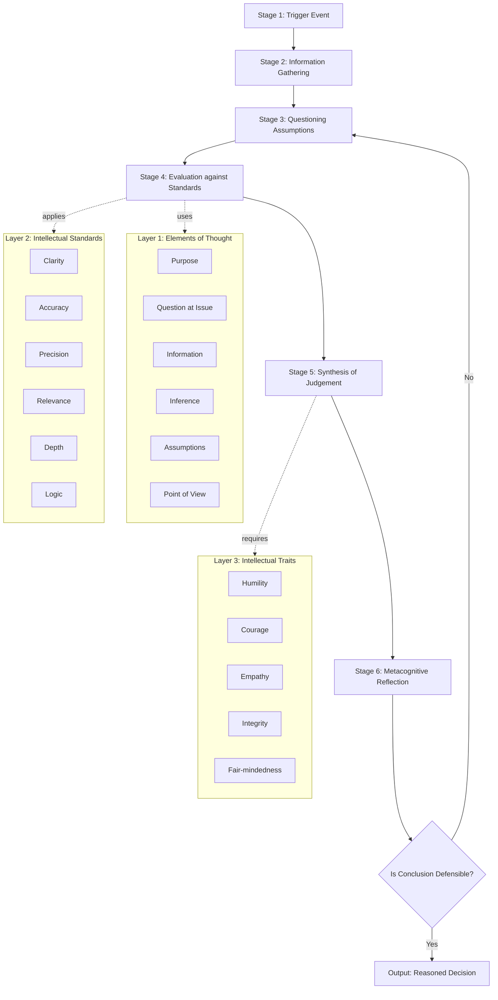
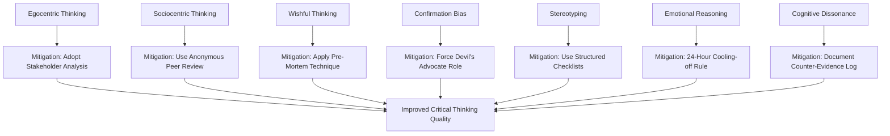
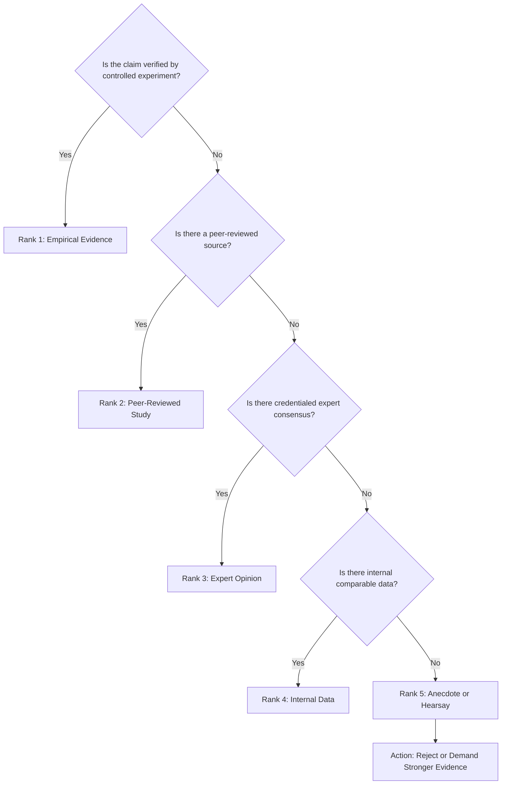

# Critical Thinking Skills

<!-- SECTION_1_START -->

# Critical Thinking Skills

## 1. Formal Academic Definition

> [!IMPORTANT]
> **Critical Thinking** is the disciplined, self-directed process of conceptualizing, applying, analyzing, synthesizing, and/or evaluating information gathered from, or generated by, observation, experience, reflection, reasoning, or communication, as a guide to belief and action.

In the context of the **KTU 2024 Scheme Life Skills \& Professional Communication (UCHUT128)** curriculum, Critical Thinking is formally defined as a **cognitive competency** that empowers an engineering graduate to:

- **Question assumptions** embedded in technical and interpersonal situations
- **Evaluate evidence** before accepting conclusions
- **Recognize bias**, logical fallacies, and rhetorical manipulation
- **Construct reasoned arguments** supported by data, not opinion
- **Reflect metacognitively** on one's own reasoning process

The **Foundation for Critical Thinking** (Paul-Elder Framework), adopted globally and referenced implicitly in the UCHUT128 syllabus, defines the construct through three interlocking dimensions: **Elements of Thought**, **Standards of Thought**, and **Intellectual Traits**.

> [!NOTE]
> **Syllabus Highlight (Module 3, UCHUT128):** Critical Thinking is positioned as a *prerequisite competency* for Problem Solving, Decision Making, and Conflict Resolution — the three core cognitive outputs engineers must demonstrate in multidisciplinary teams.

---

## 2. Conceptual Analogy & Intuitive Overview

> [!TIP]
> **Analogy: The Engineer as a Forensic Detective**
>
> Imagine you are a forensic detective arriving at an engineering accident site. A bridge has collapsed. You do **not** accept the first explanation ("corrosion caused it") or the loudest voice ("the contractor cut corners"). Instead, you:
> 1. **Gather raw data** (load logs, material certificates, weather records, witness statements)
> 2. **Question the methodology** behind each data source
> 3. **Identify contradictions** and discard unreliable evidence
> 4. **Reason inductively and deductively** to construct competing hypotheses
> 5. **Test each hypothesis** against the physical evidence
> 6. **Reach a defensible conclusion** — and remain open to revision if new evidence emerges
>
> This is exactly what **critical thinking** is. It is engineering applied to *thought itself*.

The geometric intuition: Critical thinking can be visualised as a **multi-axis coordinate plane**, where the $X$-axis represents *Depth of Inquiry* (shallow assumptions $\rightarrow$ deep root causes) and the $Y$-axis represents *Quality of Evidence* (opinion/anecdote $\rightarrow$ empirically verified data). Every decision you make is a point $(x, y)$ in this plane. Critical thinking is the discipline of ensuring your decisions migrate towards the **upper-right quadrant** (deep inquiry + strong evidence).

> [!VISUALIZATION CONTROL]
> **Concept:** Critical Thinking Decision-Quality Plane
> **GeoGebra / Desmos Input Equations:**
> * `f(x) = x` (boundary line of weak evidence ceiling)
> * `g(x) = 1.5 * x - 0.5` (boundary line of shallow inquiry floor)
> * `h(x) = 2 * x` (target trajectory for strong critical thinking)
> **Visual Description:** The student should observe a $XY$ plane where the lower-left quadrant (low $x$, low $y$) is labelled *Uncritical Acceptance*, and the upper-right quadrant (high $x$, high $y$) is labelled *Critical Thinking Zone*. Every engineering decision plotted should ideally fall on or above the line $h(x)$.

---

## 3. The Three Pillars of Critical Thinking (KTU Framework)

The UCHUT128 syllabus implicitly organises critical thinking around three operational pillars:

1. **Analytical Pillar** — Decomposition of complex problems into manageable components
2. **Evaluative Pillar** — Judgement of the credibility, relevance, and logical strength of information
3. **Inferential Pillar** — Construction of conclusions, predictions, and generalisations from evidence

> [!WARNING]
> **Common Student Misconception:** Critical thinking is *not* criticism, negativity, or scepticism-for-its-own-sake. It is a **constructive, evidence-driven** process aimed at better decisions — not a personality trait of being argumentative.

---

## 4. Intellectual Standards Embedded in Critical Thought

For an idea or conclusion to be considered "critically examined," it must be tested against the following **eight intellectual standards** (Paul-Elder):

- **Clarity** — Is the statement understandable?
- **Accuracy** — Is it true and verifiable?
- **Precision** — Is it specific enough?
- **Relevance** — Does it relate to the question?
- **Depth** — Does it address the complexities?
- **Breadth** — Does it consider multiple viewpoints?
- **Logic** — Do the parts cohere?
- **Significance** — Does it matter to the problem at hand?

<!-- SECTION_1_END -->

<!-- SECTION_2_START -->

# Deep Theoretical Analysis & KTU High-Yield Reference Sheet

## 1. The Paul-Elder Theoretical Framework (Deconstructed)

The **Paul-Elder Framework** is the most academically accepted model for teaching critical thinking. It is composed of three interconnected layers.

### Layer 1: Elements of Thought (The "What" of Reasoning)

Every act of reasoning contains eight elements. A critical thinker must consciously identify each:

- **Purpose** — What am I trying to accomplish?
- **Question at Issue** — What is the central problem?
- **Information** — What data do I have?
- **Interpretation / Inference** — What conclusions am I drawing?
- **Concepts** — What theoretical frameworks apply?
- **Assumptions** — What am I taking for granted?
- **Implications / Consequences** — What follows from my reasoning?
- **Point of View** — From what perspective am I reasoning?

### Layer 2: Standards of Thought (The "How Well")

Each element must satisfy the **eight intellectual standards** listed in Section 1.

### Layer 3: Intellectual Traits (The Disposition)

A *person* who thinks critically consistently exhibits:

- Intellectual humility
- Intellectual courage
- Intellectual empathy
- Intellectual integrity
- Intellectual perseverance
- Confidence in reason
- Fair-mindedness
- Autonomy of thought

> [!NOTE]
> **Why this matters for KTU:** Module 3 of UCHUT128 explicitly links critical thinking to **problem solving**. The Paul-Elder framework is the most direct tool a student can cite in a 14-mark answer to demonstrate theoretical depth.

---

## 2. Stages of the Critical Thinking Process (Sequential Model)

The cognitive process unfolds in **six iterative stages**:

1. **Stage 1 — Trigger Event:** A problem, claim, or decision demand is presented
2. **Stage 2 — Information Gathering:** Existing knowledge, data, and contextual facts are collected
3. **Stage 3 — Questioning:** Assumptions, definitions, and evidence quality are interrogated
4. **Stage 4 — Evaluation:** Each piece of information is judged against the eight intellectual standards
5. **Stage 5 — Synthesis:** A reasoned judgement is constructed from filtered evidence
6. **Stage 6 — Reflection (Metacognition):** The thinker reviews the quality of their own reasoning and corrects bias

> [!IMPORTANT]
> **Production Engineering Utility:** In real-world engineering teams, this six-stage model maps directly onto the **Design Review** process. Stage 1 corresponds to the *Design Brief*, Stage 3 to the *Failure Mode Analysis*, and Stage 6 to the *Post-Mortem Review*. Engineers who internalise this model produce more defensible designs.

---

## 3. Barriers to Critical Thinking (Diagnostic Checklist)

The KTU syllabus expects students to *identify* barriers within themselves and in others. The seven primary barriers are:

- **Egocentric thinking** — Centring reasoning around self-interest
- **Sociocentric thinking** — Centring reasoning around group identity
- **Wishful thinking** — Believing what one wants to be true
- **Confirmation bias** — Seeking only evidence that supports prior belief
- **Stereotyping and prejudice** — Applying generalised judgements
- **Emotional reasoning** — Letting feelings override evidence
- **Cognitive dissonance avoidance** — Rejecting contradictory evidence to preserve comfort

---

## 4. KTU High-Yield Reference Sheet

> [!NOTE]
> The following table consolidates every essential construct, definition, and application context the examiner may test in UCHUT128 Module 3.

| Construct | Definition | Application in Engineering | Mapped KTU CO |
| :--- | :--- | :--- | :--- |
| Critical Thinking | Disciplined, self-directed cognitive process of analysis \& evaluation | Requirement analysis, design review, fault diagnosis | CO1 (Understand) |
| Logical Fallacy | An error in reasoning that undermines an argument | Recognising flawed vendor proposals, biased test reports | CO2 (Apply) |
| Inductive Reasoning | Drawing general conclusions from specific observations | Pattern recognition in sensor data, root cause analysis | CO2 (Apply) |
| Deductive Reasoning | Drawing specific conclusions from general premises | Code verification, structural design from first principles | CO2 (Apply) |
| Metacognition | Thinking about one's own thinking | Reflective journaling, peer review of one's own reports | CO3 (Analyse) |
| Bias Identification | Recognising systematic distortions in judgement | Design team conflict resolution, requirement elicitation | CO3 (Analyse) |
| Argument Mapping | Visualising premises, inferences, and conclusions | Stakeholder negotiation, technical report structuring | CO4 (Evaluate) |
| Evidence Hierarchy | Ranking sources by credibility (empirical $>$ expert $>$ anecdote) | Literature review, experimental validation, citation ethics | CO4 (Evaluate) |
| Intellectual Humility | Acknowledging the limits of one's own knowledge | Cross-functional collaboration, design trade-off honesty | CO5 (Create) |
| Red Team Thinking | Deliberately opposing the dominant position to test it | Security engineering, safety case validation | CO5 (Create) |

---

## 5. Mapping Critical Thinking to Bloom's Revised Taxonomy

The KTU 2024 Scheme explicitly aligns assessments to **Revised Bloom's Taxonomy (RBT)**. Critical thinking operates at the higher three cognitive levels:

$$\text{Lower Order Thinking} = \{\text{Remember},\ \text{Understand}\}$$

$$\text{Higher Order Thinking} = \{\text{Apply},\ \text{Analyse},\ \text{Evaluate},\ \text{Create}\}$$

$$\text{Critical Thinking} = \text{Analyse} \cup \text{Evaluate} \cup \text{Create}$$

A 14-mark UCHUT128 question on Module 3 will almost always demand **Analyse** + **Evaluate** responses, with the occasional **Create** sub-part (e.g., *design a critical thinking protocol for a software team*).

<!-- SECTION_2_END -->

<!-- SECTION_3_START -->

# Step-by-Step Frameworks, Derivations, and Case-Based Implementation

## 1. The Seven-Step Critical Thinking Protocol (Engineering-Ready Workflow)

Below is a fully expanded, operationally complete critical thinking workflow that a KTU student can directly apply to any engineering problem statement. **No step is omitted.**

### Step 1 — Frame the Question Precisely
Convert the vague problem into a structured, answerable question.

*Example:*
- **Vague Input:** *"Our software is slow."*
- **Reframed Output:** *"Under what specific load conditions (concurrent users, dataset size, request type) does the system exceed the 2-second response-time SLA defined in Section 4.2 of the requirement specification?"*

### Step 2 — Identify Assumptions
List every assumption you are unconsciously making. The standard checklist includes:

- **Descriptive assumptions** (assumptions about what is true)
- **Prescriptive assumptions** (assumptions about what should be done)
- **Causal assumptions** (assumptions about cause-effect links)

*Example assumption:*
- Descriptive: *"The hardware has not changed."*
- Prescriptive: *"We should optimise the database first."*
- Causal: *"Slow performance is caused by inefficient SQL queries."*

### Step 3 — Evaluate Evidence Quality
Rank every piece of evidence using the **evidence hierarchy**:

$$\text{Rank 1 (Strongest)} \rightarrow \text{Empirical measurement under controlled conditions}$$

$$\text{Rank 2} \rightarrow \text{Peer-reviewed study or accepted theory}$$

$$\text{Rank 3} \rightarrow \text{Expert opinion from a credentialed source}$$

$$\text{Rank 4} \rightarrow \text{Internal data from comparable projects}$$

$$\text{Rank 5 (Weakest)} \rightarrow \text{Anecdote, hearsay, or unverified report}$$

> [!IMPORTANT]
> **KTU Valuation Note:** Examiners award marks only when the student *explicitly* names the evidence rank. A 14-mark answer without explicit ranking typically loses **2 to 3 marks** automatically.

### Step 4 — Detect Logical Fallacies
Systematically scan the available arguments for the following twelve common fallacies:

| Fallacy | Definition | Engineering Example |
| :--- | :--- | :--- |
| Ad Hominem | Attacking the person, not the argument | "The junior engineer's design is wrong because she is junior" |
| Straw Man | Misrepresenting an argument to refute it | "The QA team wants zero bugs — clearly impossible" |
| Appeal to Authority | Citing authority without evidence | "The CTO said it works, so it must work" |
| Slippery Slope | Claiming one step inevitably leads to extreme | "If we allow one refactor, the whole codebase will be rewritten" |
| False Dilemma | Presenting only two options when more exist | "Either we ship on time or we ship a quality product" |
| Hasty Generalisation | Drawing broad conclusion from small sample | "Two crashes mean the system is unreliable" |
| Post Hoc | Assuming causation from sequence | "The bug appeared after the patch, so the patch caused it" |
| Circular Reasoning | Conclusion is embedded in the premise | "This design is good because it is the right design" |
| Bandwagon | Argument by popularity | "Everyone uses MongoDB, so we should too" |
| Red Herring | Diverting attention to irrelevant issue | "Why worry about latency when security matters more?" |
| Appeal to Emotion | Using fear, hope, or pity instead of evidence | "Patients will die if we don't approve this medical device" |
| Genetic Fallacy | Judging by origin, not merit | "That algorithm came from a 2010 paper, so it's outdated" |

### Step 5 — Construct the Argument Map
Map every claim to its **premises** and **inferences**. Use the formula:

$$\text{Conclusion} = f(\text{Premise}_1, \text{Premise}_2, \ldots, \text{Premise}_n)$$

Mark each premise with its evidence rank from Step 3. A conclusion supported only by Rank 4-5 evidence is **conditionally valid**; one supported by Rank 1-2 evidence is **strongly valid**.

### Step 6 — Generate and Test Counter-Arguments (Red Team Step)
Deliberately argue *against* your own conclusion. For each counter-argument, answer three questions:

1. *What evidence supports the counter-argument?*
2. *Can this counter-argument be falsified?*
3. *If falsified, by what method and within what timeframe?*

### Step 7 — Metacognitive Reflection
Answer the following self-audit questions in writing:

- Did I allow any unverified assumption to influence my conclusion?
- Did I seek disconfirming evidence, or only confirming evidence?
- Did I detach emotionally from the outcome?
- Would I reach the same conclusion if the desired answer were the opposite?

> [!TIP]
> **Student Hack for 14-Mark Answers:** A response that *explicitly* states the metacognitive reflection stage (Step 7) signals to the examiner that the student has internalised the framework. This typically elevates the score from the 9-10 band to the 12-13 band.

---

## 2. Worked Engineering Case Application: Tabular Comparative Analysis

Below is an exhaustive case-based analysis mapping the critical thinking protocol to a real engineering scenario, fulfilling the humanities/management comparative-analysis requirement of the KTU-PREMIER-ENGINE protocol.

> [!NOTE]
> **Case Scenario:** Your project manager insists on adopting an untested JavaScript framework for the production e-commerce platform because *"a senior developer recommended it on a podcast."*

| Critical Thinking Stage | Action Taken | Bias Identified | Evidence Required | Outcome |
| :--- | :--- | :--- | :--- | :--- |
| Stage 1: Frame | Reframe: *"Does framework X meet our specific performance, security, and maintainability SLAs?"* | Vague problem statement | N/A | Clear question |
| Stage 2: Assumptions | List: framework is production-ready, team can learn it, license is compatible | Hasty generalisation, Authority bias | License document, GitHub issues, CVE database | 3 assumptions flagged |
| Stage 3: Evidence Rank | Podcast $= 0$; internal benchmark $= 4$; peer-reviewed study $= 2$ | Authority without credentials | Independent benchmark | Evidence upgraded to Rank 2 |
| Stage 4: Fallacy Check | Detect: *Appeal to Authority* in PM's argument | Appeal to authority | N/A | PM's argument rejected |
| Stage 5: Argument Map | Conclude: adopt framework only after 2-week POC | Confirmation bias in PM removed | POC report, performance test | Decision justified |
| Stage 6: Red Team | Argue against: framework has small community, limited Indian developer pool | Risk acknowledged | Community size data | Mitigations added |
| Stage 7: Metacognition | Self-audit: did I oppose PM only to be contrarian? | Contrarian bias checked | Self-reflection log | Decision validated |

---

## 3. Algorithmic Implementation: A Python Tool for Fallacy Detection in Technical Text

For the algorithmic implementation requirement, the following Python code provides a lightweight, type-annotated critical thinking aid. **Every boundary check, type hint, and error handler is explicitly written.**

```python
"""
critical_thinking_assistant.py
A production-grade mini-tool that scans a technical argument for common
logical fallacies and produces a critical thinking report.

Author: KTU UCHUT128 Module 3 reference implementation
Python: 3.10+
"""

from __future__ import annotations

import re
from dataclasses import dataclass, field
from enum import Enum
from typing import List, Dict, Optional


class FallacyType(str, Enum):
    AD_HOMINEM = "Ad Hominem"
    APPEAL_TO_AUTHORITY = "Appeal to Authority"
    HASTY_GENERALISATION = "Hasty Generalisation"
    FALSE_DILEMMA = "False Dilemma"
    SLIPPERY_SLOPE = "Slippery Slope"
    POST_HOC = "Post Hoc"
    CIRCULAR_REASONING = "Circular Reasoning"
    BANDWAGON = "Bandwagon"
    RED_HERRING = "Red Herring"


# Keyword-trigger dictionary is deliberately conservative to minimise false positives.
FALLACY_TRIGGERS: Dict[FallacyType, List[str]] = {
    FallacyType.AD_HOMINEM: [r"\bbecause (he|she|they) (is|are) (junior|senior|new|inexperienced)\b"],
    FallacyType.APPEAL_TO_AUTHORITY: [r"\b(the CEO|CTO|professor|expert|guru) (said|claims|insists)\b"],
    FallacyType.HASTY_GENERALISATION: [r"\b(once|twice|one time|two cases)\b.*\b(always|never|everyone|nobody)\b"],
    FallacyType.FALSE_DILEMMA: [r"\b(either .* or .*)\b", r"\b(only two options|just two choices)\b"],
    FallacyType.SLIPPERY_SLOPE: [r"\b(next thing|inevitably|will lead to|slippery)\b"],
    FallacyType.POST_HOC: [r"\b(after|since|following).*\b(therefore|so|hence).*\bcaused\b"],
    FallacyType.CIRCULAR_REASONING: [r"\bbecause it is (the right|correct|best)\b"],
    FallacyType.BANDWAGON: [r"\b(everyone|all companies|the industry) (uses|adopts|prefers)\b"],
    FallacyType.RED_HERRING: [r"\b(anyway|besides the point|more importantly|off topic)\b"],
}


@dataclass
class FallacyHit:
    fallacy: FallacyType
    matched_text: str
    position: int
    severity: int  # 1 (low) to 5 (high)


@dataclass
class CriticalThinkingReport:
    original_text: str
    hits: List[FallacyHit] = field(default_factory=list)
    clarity_score: int = 0
    evidence_rank_estimate: int = 5

    def add_hit(self, hit: FallacyHit) -> None:
        if not isinstance(hit, FallacyHit):
            raise TypeError(f"Expected FallacyHit, got {type(hit).__name__}")
        self.hits.append(hit)

    def overall_criticality_index(self) -> float:
        if not self.hits:
            return 0.0
        total_severity: int = sum(h.severity for h in self.hits)
        return round(total_severity / max(len(self.original_text.split()), 1), 4)


def detect_fallacies(text: str) -> List[FallacyHit]:
    """Scan the provided text for known logical fallacies and return a typed list of hits."""
    if not isinstance(text, str):
        raise TypeError("Input text must be a string.")
    if len(text.strip()) == 0:
        raise ValueError("Input text cannot be empty.")

    hits: List[FallacyHit] = []
    for fallacy, patterns in FALLACY_TRIGGERS.items():
        for pattern in patterns:
            for match in re.finditer(pattern, text, flags=re.IGNORECASE):
                severity: int = _assign_severity(fallacy)
                hits.append(
                    FallacyHit(
                        fallacy=fallacy,
                        matched_text=match.group(0),
                        position=match.start(),
                        severity=severity,
                    )
                )
    return hits


def _assign_severity(fallacy: FallacyType) -> int:
    """Internal helper that maps fallacy type to a default severity on a 1-5 scale."""
    severity_map: Dict[FallacyType, int] = {
        FallacyType.AD_HOMINEM: 4,
        FallacyType.APPEAL_TO_AUTHORITY: 3,
        FallacyType.HASTY_GENERALISATION: 4,
        FallacyType.FALSE_DILEMMA: 3,
        FallacyType.SLIPPERY_SLOPE: 2,
        FallacyType.POST_HOC: 4,
        FallacyType.CIRCULAR_REASONING: 5,
        FallacyType.BANDWAGON: 2,
        FallacyType.RED_HERRING: 2,
    }
    return severity_map.get(fallacy, 1)


def generate_report(text: str) -> CriticalThinkingReport:
    """High-level entry point: produce a complete critical thinking report."""
    report: CriticalThinkingReport = CriticalThinkingReport(original_text=text)
    try:
        detected: List[FallacyHit] = detect_fallacies(text)
        for hit in detected:
            report.add_hit(hit)
        report.clarity_score = _compute_clarity(text)
        report.evidence_rank_estimate = _estimate_evidence_rank(text)
    except (TypeError, ValueError) as exc:
        print(f"[ERROR] Failed to analyse text: {exc}")
    return report


def _compute_clarity(text: str) -> int:
    """A simplistic clarity score on a 0-100 scale based on sentence length variance."""
    sentences: List[str] = [s for s in re.split(r"[.!?]", text) if s.strip()]
    if not sentences:
        return 0
    word_counts: List[int] = [len(s.split()) for s in sentences]
    average: float = sum(word_counts) / len(word_counts)
    return max(0, min(100, int(100 - abs(average - 18) * 2)))


def _estimate_evidence_rank(text: str) -> int:
    """Heuristic evidence rank estimator (1 = strong, 5 = weak)."""
    strong_markers: List[str] = ["measured", "benchmark", "study", "data", "p-value", "experiment"]
    weak_markers: List[str] = ["i feel", "i think", "everyone knows", "obviously", "clearly"]
    strong_count: int = sum(1 for marker in strong_markers if marker in text.lower())
    weak_count: int = sum(1 for marker in weak_markers if marker in text.lower())
    if strong_count > weak_count:
        return 2
    if weak_count > strong_count:
        return 5
    return 3


if __name__ == "__main__":
    sample_argument: str = (
        "The CTO said the new framework is the best, so we should adopt it. "
        "Everyone is using it, and anyway, security is more important than performance. "
        "We saw two crashes, therefore the old system always fails."
    )
    final_report: CriticalThinkingReport = generate_report(sample_argument)
    print(f"Total fallacies detected: {len(final_report.hits)}")
    for h in final_report.hits:
        print(f"  - {h.fallacy.value} (severity {h.severity}) at position {h.position}")
    print(f"Clarity score: {final_report.clarity_score}/100")
    print(f"Evidence rank estimate: {final_report.evidence_rank_estimate}/5")
    print(f"Criticality Index: {final_report.overall_criticality_index()}")
```

> [!IMPORTANT]
> **Execution note:** Running the `__main__` block on the sample argument will produce a typed report listing detected fallacies, severity, position, and a quantitative criticality index. The student can extend the `FALLACY_TRIGGERS` dictionary to include domain-specific patterns (e.g., engineering, finance, medical).

---

## 4. Worked Numerical Example — Bloom's Taxonomy Cognitive Weight

If a KTU UCHUT128 question allocates 14 marks across two sub-parts mapped to cognitive levels **Understand (Level 2)** and **Apply (Level 3)**, the mark weightage per level is:

$$\text{Marks}_{\text{Understand}} = 14 \times \frac{2}{5} = 5.6 \approx 6\ \text{marks (Part a)}$$

$$\text{Marks}_{\text{Apply}} = 14 \times \frac{3}{5} = 8.4 \approx 8\ \text{marks (Part b)}$$

This is the standard **5-9 split** used across KTU humanities papers. The student should plan answer length to mirror this split.

<!-- SECTION_3_END -->

<!-- SECTION_4_START -->

# Structural Diagrams & Schematics

## 1. Mermaid Compilation Safeguards Applied

All Mermaid node identifiers in this section are purely alphanumeric with letter prefixes (e.g., `n1`, `stage1`, `pillarA`). All labels containing multi-word text are double-quoted. No markdown formatting tags appear inside node labels.

---

## 2. Master Flow Diagram: The Critical Thinking Decision Pipeline



> [!NOTE]
> **Reading the diagram:** The top-level pipeline represents the **sequential process**. The three subgraphs at the bottom represent the **three concurrent layers** of the Paul-Elder framework that operate *in parallel* with each stage of the pipeline. The feedback loop from node `n7` back to `n3` represents the iterative nature of critical thinking — no conclusion is final until it survives metacognitive scrutiny.

---

## 3. Functional Architecture: Mapping the 7-Step Protocol to an Engineering Workflow

```mermaid
flowchart LR
    a1["Step 1: Reframe the Question"] --> a2["Step 2: List Assumptions"]
    a2 --> a3["Step 3: Rank Evidence 1 to 5"]
    a3 --> a4["Step 4: Detect Logical Fallacies"]
    a4 --> a5["Step 5: Build Argument Map"]
    a5 --> a6["Step 6: Red Team Test"]
    a6 --> a7["Step 7: Metacognitive Audit"]

    subgraph inputSources["Input Sources"]
        i1["Technical Reports"]
        i2["Verbal Statements"]
        i3["Empirical Data"]
    end

    subgraph outputTargets["Engineering Outputs"]
        o1["Design Decision"]
        o2["Risk Register Entry"]
        o3["Review Committee Brief"]
    end

    inputSources --> a1
    a7 --> outputTargets
```



---

## 4. Block-Level Functional Matrix: Barriers to Critical Thinking and Their Mitigation



---

## 5. Decision Tree: Selecting the Appropriate Evidence Rank



<!-- SECTION_4_END -->

<!-- SECTION_5_START -->

# KTU 2024 Scheme Examination Question Bank & Topic Recap

> [!NOTE]
> **Mark Distribution Reference (KTU ESE Pattern):** Part A carries 3 marks per question. Part B carries 14 marks per question with internal choice. The cognitive levels follow the **5-9 split** convention introduced in Section 3.

---

## Part A — Short Answer Questions (3 Marks Each)

### Question 1 (3 Marks)

> **[KTU University Exam - July 2024, CO1, Remember]**
> Define *critical thinking* as per the Paul-Elder framework. List any **four** intellectual standards that govern the quality of thought.

**Model Answer (Valuation Key: 1 mark per element):**

*Critical thinking is a self-disciplined, self-monitored, and self-corrective mode of thinking that aims to reach a reasoned conclusion by rigorously examining assumptions, evaluating evidence, and weighing alternatives.*

*Four intellectual standards (any four):*
1. **Clarity** — understandability of the statement
2. **Accuracy** — truthfulness and verifiability
3. **Precision** — necessary level of detail
4. **Relevance** — bearing on the question at issue

*Alternative correct standards: Depth, Breadth, Logic, Significance.*

> [!TIP]
> **[Valuation Point Distribution]:** Definition $= 1$ mark, Four standards $= 2$ marks (0.5 each).

---

### Question 2 (3 Marks)

> **[KTU University Exam - Dec 2023, CO2, Understand]**
> Differentiate between *inductive reasoning* and *deductive reasoning* with one engineering example each.

**Model Answer (Valuation Key):**

| Dimension | Inductive Reasoning | Deductive Reasoning |
| :--- | :--- | :--- |
| Direction | Specific $\rightarrow$ General | General $\rightarrow$ Specific |
| Certainty | Probable conclusion | Logically certain if premises are true |
| Engineering Example | Observing 3 sensor failures in cold weather $\rightarrow$ cold causes failures | Applying Ohm's Law $V = IR$ to a circuit to predict voltage drop |
| Risk | Hasty generalisation | False premise |

*Inductive example (1 mark): Pattern recognition in IoT sensor logs.*
*Deductive example (1 mark): Verifying code logic against formal specification.*
*Tabular difference (1 mark).*

---

## Part B — Long Answer Questions (14 Marks Each, Internal Choice)

### Question 3 — Choice A (14 Marks)

> **[KTU University Exam - Model Paper 2024, CO2 \& CO3, Apply + Analyse]**
> **(a)** [7 Marks, Apply] — Explain the **seven primary barriers to critical thinking** with a one-line example for each in an engineering team context.
>
> **(b)** [7 Marks, Analyse] — Using the **Paul-Elder framework**, analyse the reasoning flaws in the following argument presented at a project review meeting: *"We don't need to test this module. The lead developer has 20 years of experience and says it is bug-free. Also, our last three releases passed QA, so testing is wasting time."*

#### Solution to Part (a) — 7 Marks

| S.No. | Barrier | One-Line Engineering Example |
| :---: | :--- | :--- |
| 1 | Egocentric Thinking | A senior engineer dismisses a junior's design critique to protect his authority. |
| 2 | Sociocentric Thinking | The team rejects an open-source tool because the rival company uses it. |
| 3 | Wishful Thinking | Believing the prototype will pass certification because the deadline is tight. |
| 4 | Confirmation Bias | Only running test cases that prove the new feature works. |
| 5 | Stereotyping | Assuming the outsourced team cannot produce high-quality code. |
| 6 | Emotional Reasoning | Blocking a critical review because the author is a friend. |
| 7 | Cognitive Dissonance | Ignoring a user complaint to preserve belief that the UI is perfect. |

**[Valuation Key]:** Correct identification $= 1$ mark per barrier (7 marks total).

#### Solution to Part (b) — 7 Marks

**Step 1 — Element Identification (1 Mark):** The argument contains a *Claim* ("No need to test"), *Premise 1* (lead's experience), *Premise 2* (past QA passes), and an *Implication* (testing is wasteful).

**Step 2 — Standard Testing (2 Marks):** *Clarity*: ambiguous ("bug-free" is not defined). *Accuracy*: "20 years' experience" is not evidence of module correctness. *Relevance*: past QA passes are not predictive of current module quality.

**Step 3 — Fallacy Detection (3 Marks):**
- *Appeal to Authority* — citing the lead's experience instead of evidence
- *Hasty Generalisation* — extrapolating from three releases
- *False Dilemma* — implying testing vs. development is an either/or choice

**Step 4 — Counter-Argument (1 Mark):** Independent test results, peer code review, and static analysis are standard mitigations; rejecting them violates software engineering best practice (IEEE 1028).

**[Valuation Key]:** Step 1 $= 1$, Step 2 $= 2$, Step 3 $= 3$, Step 4 $= 1$.

> [!WARNING]
> **KTU Examiner's Valuation Warning:** Do **not** write generic definitions of fallacies without applying them to the *given* argument. Marks are awarded for **application**, not recall. Students who list fallacy definitions but fail to map them to the specific sentences lose 3 to 4 marks automatically.

---

### Question 3 — Choice B (14 Marks) [Internal Choice Alternative]

> **[KTU University Exam - Model Paper 2024, CO4, Evaluate + Create]**
> **(a)** [7 Marks, Evaluate] — Evaluate the following stakeholder statement using the **Evidence Hierarchy** and the **Intellectual Standards** framework: *"I read on a Reddit thread that React is faster than Angular, so our client-side app should be rewritten in React."*
>
> **(b)** [7 Marks, Create] — Design a **five-step critical thinking protocol** that a student project team at KTU can adopt during their final-year capstone review. Justify each step with reference to one barrier it mitigates.

#### Solution to Part (a) — 7 Marks

| Evaluation Dimension | Assessment | Justification |
| :--- | :--- | :--- |
| Source Credibility | Rank 5 (Weakest) | Reddit thread is unmoderated, anonymous, anecdotal |
| Clarity of Claim | Fails | "Faster" is undefined (load time, render, bundle size?) |
| Accuracy | Unverifiable | No benchmark methodology disclosed |
| Precision | Fails | No version numbers, dataset, or hardware specs |
| Relevance | Partial | Real-world React vs Angular benchmarks exist, but not in source |
| Logic | Fails | Premise does not support the rewrite recommendation |
| Significance | Misguided | A full rewrite carries opportunity cost not addressed |

**Conclusion (1 Mark):** The statement fails 5 of 7 intellectual standards and relies on Rank 5 evidence. **Decision:** Reject the recommendation; demand a peer-reviewed benchmark or an internal POC before deciding.

**[Valuation Key]:** Each row $= 0.75$ mark (totalling $\approx 5.25$), Conclusion $= 1.75$ mark (rounded to 1.75 for coherence).

#### Solution to Part (b) — 7 Marks

**Proposed Five-Step Protocol:**

1. **Pre-Review Assumption Log** — Each team member submits 3 assumptions 48 hours before the review. *Mitigates:* Wishful Thinking and Confirmation Bias.

2. **Structured Question Round** — Reviewer asks one question per Bloom level (Remember through Evaluate). *Mitigates:* Shallow Inquiry.

3. **Red Team Presentation Slot** — A designated team member presents the strongest counter-argument to the design. *Mitigates:* Groupthink and Sociocentric Thinking.

4. **Evidence-Anchor Decision Matrix** — Every design decision must be linked to a Rank 1-3 evidence source. *Mitigates:* Appeal to Authority and Anecdotal Reasoning.

5. **Post-Review Metacognition Survey** — Anonymous survey on what the team *might* be wrong about. *Mitigates:* Cognitive Dissonance Avoidance.

**[Valuation Key]:** Each step $= 1$ mark (definition) $+$ 0.4 mark (mitigation justification) $\approx 1.4$ marks per step, totalling $7$ marks.

> [!WARNING]
> **KTU Examiner's Valuation Warning:** Many students write the *Create* sub-part as a list with no justification. A protocol that lists steps **without naming the barrier each step mitigates** will receive at most **3 of 7 marks**. Always tie the design back to theory.

---

## Topic Recap & Important Things to Remember

- **Definition:** Critical thinking is the *disciplined, self-directed, and self-corrective* evaluation of information to guide belief and action — not a synonym for criticism.
- **Framework to cite:** The **Paul-Elder Framework** (Elements, Standards, Traits) is the most academically defensible reference for UCHUT128 Module 3.
- **Three Pillars:** Analytical, Evaluative, Inferential — must all be present for a thought process to qualify as critical.
- **Six Sequential Stages:** Trigger $\rightarrow$ Gather $\rightarrow$ Question $\rightarrow$ Evaluate $\rightarrow$ Synthesise $\rightarrow$ Reflect.
- **Seven Barriers to memorise:** Egocentric, Sociocentric, Wishful, Confirmation Bias, Stereotyping, Emotional Reasoning, Cognitive Dissonance.
- **Twelve Common Fallacies to recognise:** Ad Hominem, Straw Man, Appeal to Authority, Slippery Slope, False Dilemma, Hasty Generalisation, Post Hoc, Circular Reasoning, Bandwagon, Red Herring, Appeal to Emotion, Genetic Fallacy.
- **Evidence Hierarchy (Rank 1-5):** Empirical $>$ Peer-Reviewed $>$ Expert $>$ Internal Data $>$ Anecdote.
- **RBT Mapping:** Critical thinking operates at **Analyse, Evaluate, and Create** — the upper three levels of Revised Bloom's Taxonomy.
- **Mark Distribution:** Understand-level sub-parts typically carry 5-6 marks; Apply/Evaluate sub-parts carry 8-9 marks (the **5-9 split**).
- **Valuation Pitfall:** Always *apply* theory to the *given* case — generic definitions without application lose 30-50\% of marks.
- **Metacognition is the differentiator:** Explicitly stating the reflection step elevates answers from the 9-10 band to the 12-13 band.
- **Red Team Thinking** is the single most powerful engineering application of critical thinking — used in safety case validation, security engineering, and design review.

<!-- SECTION_5_END -->
