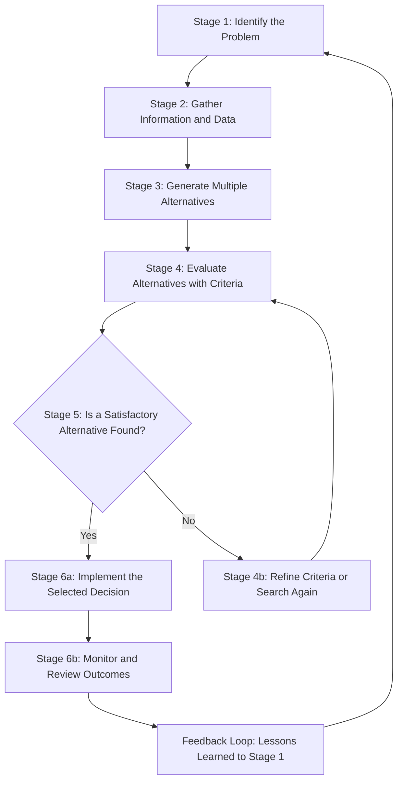
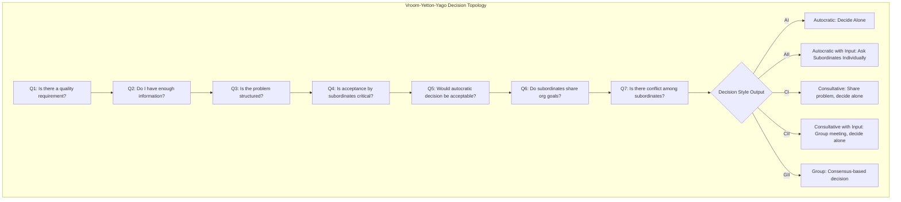
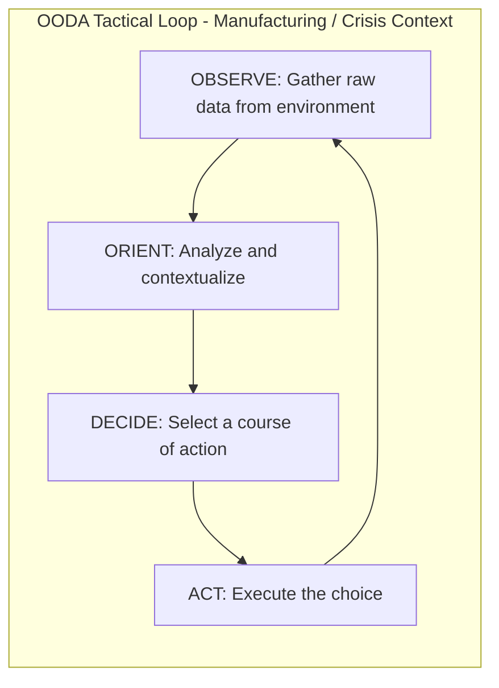
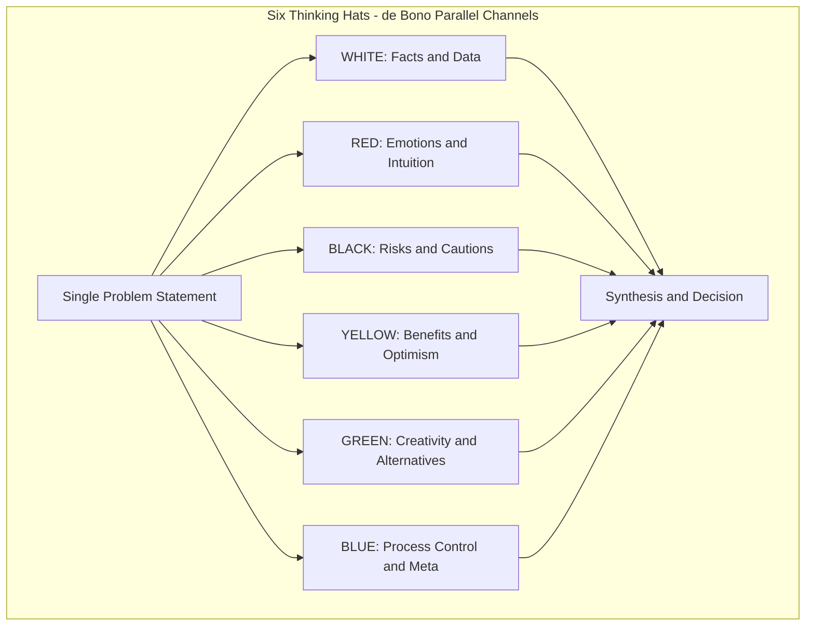
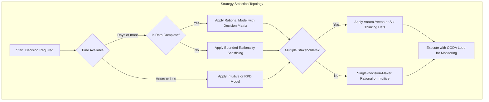

# Decision Making Strategies

<!-- SECTION_1_START -->

# Decision Making Strategies — Core Definition & Intuitive Overview

## 1. Formal Academic Definition (KTU 2024 Terminology)

> [!IMPORTANT]
> **Decision Making** is the cognitive and procedural process of selecting a logical, justifiable, and optimal course of action from among several available alternatives to achieve a specified goal, while accounting for constraints, risks, resources, and the values of the decision-maker.

In the context of **Life Skills and Professional Communication (UCHUT128)**, the KTU 2024 Scheme frames decision making as a *transferable life competency* that integrates:

- **Critical Thinking** (logical evaluation of evidence)
- **Problem Solving** (transforming obstacles into actionable goals)
- **Emotional Regulation** (managing cognitive bias)
- **Ethical Reasoning** (aligning choices with professional values)

The **standard metric** used in professional communication is the **DECIDE Model** (proposed by the University of Michigan), which frames a decision cycle of **6 sequential stages** benchmarked against quality-of-outcome and process-velocity indicators.

---

## 2. Conceptual Analogy / Intuition

> [!NOTE]
> **Analogy: The GPS Navigator**
>
> Imagine you are driving from your hostel in *Trivandrum* to a project site in *Kochi*. The GPS does not just "tell you the road" — it **evaluates multiple routes** (NH-66 vs. MC Road), **weighs trade-offs** (distance vs. traffic vs. toll cost), **forecasts consequences** (rain may close ghat roads), and **recommends an optimal path** which you can override if intuition demands.
>
> Decision making is your **mental GPS**: it enumerates alternatives, applies filters, and commits to a path with awareness of consequences.

A simpler classroom analogy is the **"Restaurant Menu Problem"**: when you enter a restaurant, you scan a finite set of dishes (alternatives), apply filters (taste, budget, time, hunger level), and commit to one choice. The process is identical — only the **stakes and complexity** scale up in engineering practice.

---

## 3. The 4 Foundational Pillars of Any Decision

A decision, regardless of context, rests on four pillars that the KTU 2024 scheme consistently tests:

| Pillar | Definition | Engineering Example |
|---|---|---|
| **Goal Clarity** | The decision-maker must know *what* they are trying to achieve | Reduce bridge load stress by 15% |
| **Alternative Set** | At least 2 feasible courses of action must exist | Use steel truss vs. carbon-fiber composite |
| **Evaluation Criteria** | Quantitative or qualitative standards to rank alternatives | Cost, lifespan, weight, maintenance |
| **Consequence Awareness** | Understanding short and long-term impacts | Maintenance cost over 30 years |

> [!TIP]
> **KTU Examiner's Note:** A "decision" is invalid if any of the 4 pillars is missing. In viva-voce, students who cannot articulate their *evaluation criteria* are penalized because they have not made a *rational* decision — they have made a *guess*.

---

## 4. Visualizing the Decision Space (GeoGebra / Desmos)

> [!VISUALIZATION CONTROL]
> **Concept:** Two-Alternative Decision Space on a Cost-Benefit Plane
> **GeoGebra / Desmos Input Equations:**
> * `f(x) = -0.5*x + 10` (Benefit curve for Alternative A)
> * `g(x) = -0.8*x + 14` (Benefit curve for Alternative B)
> * `x_A = 8`, `y_A = 6`
> * `x_B = 6.25`, `y_B = 9`
> **Visual Description:** Plot two linear benefit curves descending with cost ($x$-axis). The intersection point represents the **indifference threshold** — below it, A is preferred; above it, B is preferred. Students should observe that *no alternative is universally superior*; superiority is **contingent on the criteria weights**.

<!-- SECTION_1_END -->

<!-- SECTION_2_START -->

# Deep Theoretical Analysis & KTU High-Yield Strategy Sheet

## 1. The 6-Stage Generic Decision Making Process

Every decision-making strategy — whether used by a CEO, an SDE at Infosys, or a B.Tech project team — funnels through a common backbone. The KTU 2024 syllabus expects students to **name, define, and sequence** these six stages:

1. **Identify the Problem** — Diagnose the gap between the *current state* and the *desired state*. The framing of the problem governs the quality of every downstream decision (a phenomenon called *problem framing bias*).
2. **Gather Information** — Collect data, expert opinion, past precedents, and stakeholder inputs. In engineering, this maps to requirement elicitation, site surveys, and literature review.
3. **Generate Alternatives** — Brainstorm without censorship. The objective is **breadth first, depth later**.
4. **Evaluate Alternatives** — Apply weighted criteria, decision matrices, and feasibility analysis.
5. **Select the Best Alternative** — Commit to one path. This is the actual *decision* moment.
6. **Implement, Monitor & Review** — Execute the choice and create feedback loops for course correction.

> [!IMPORTANT]
> **KTU 2024 Terminology Anchors:** The above 6 stages align with the **Simonian Phases of Decision Making** (Herbert Simon, 1960) and are tested verbatim in Module 3 of UCHUT128.

---

## 2. Typology of Decisions (Taxonomy Used in Board Papers)

The KTU 2024 scheme classifies decisions along **three orthogonal axes**:

| Axis | Type A | Type B | Engineering Context |
|---|---|---|---|
| **Level of Programming** | Programmed (Routine) | Non-Programmed (Novel) | Code merge vs. architecture redesign |
| **Organizational Tier** | Strategic | Tactical / Operational | 5-year R\&D roadmap vs. daily standup priority |
| **Certainty of Outcome** | Certain | Risk | Probabilistic | Designing for known vs. unknown load conditions |

> [!WARNING]
> **Common Student Error:** Treating "strategic" and "non-programmed" as identical. They are correlated but **not synonymous**. A *tactical* decision can still be *non-programmed* (e.g., responding to a unique supply-chain disruption).

---

## 3. The 7 Major Decision-Making Strategies (High-Yield Cheat Sheet)

This is the **core KTU Module-3 inventory**. Each strategy is a *lens* through which you can solve a problem. The examiner often asks: *"Which strategy is most appropriate when…?"*

| \# | Strategy | Core Logic | Best Applied When | Key Limitation |
|---|---|---|---|---|
| 1 | **Rational / Classical Model** | Maximize objective function with full information | High-stakes, data-rich problems | Assumes perfect rationality (unrealistic) |
| 2 | **Bounded Rationality** | "Satisficing" — pick the first *good enough* option | Time pressure, information overload | May miss the *optimal* solution |
| 3 | **Intuitive Model** | Pattern recognition from prior experience | Crisis, expert domains, fast iteration | Vulnerable to cognitive bias |
| 4 | **Recognition-Primed Decision (RPD)** | Match situation to mental template, simulate one move | Firefighting, military, ER doctors | Heavily experience-dependent |
| 5 | **Vroom-Yetton Leadership Model** | Choose autocratic vs. consultative vs. group based on situational variables | Managerial decisions with subordinates | Complex to apply in real time |
| 6 | **OODA Loop** (Observe–Orient–Decide–Act) | Cyclic, opponent-aware iteration | Competitive, dynamic environments | Designed for tactical warfare |
| 7 | **Six Thinking Hats (de Bono)** | Parallel-role thinking (emotion, fact, optimism, etc.) | Group decisions, ideation sessions | Slower than single-perspective decisions |

---

## 4. The Bounded Rationality Model — Deeper Dive

> [!NOTE]
> **Why this matters for KTU 2024:** Bounded rationality is *the* most-tested model in life-skills papers because it bridges theory and human limitation.

Herbert Simon's **Bounded Rationality** postulates that human cognition cannot optimize across infinite variables. We therefore **satisfice** — we accept a solution that meets a *minimum acceptable threshold* rather than a global optimum. This is operationalized through three constraints:

- **Information Boundedness** — we never know *all* outcomes
- **Cognitive Boundedness** — we cannot compute *all* comparisons
- **Time Boundedness** — we must act *now*, not in eternity

The strategic implication: **good decisions are not the same as optimal decisions**. A KTU answer that claims "bounded rationality leads to the best outcome" will receive zero marks.

---

## 5. The Vroom-Yetton Decision Tree (Engineering Manager's Tool)

The Vroom-Yetton-Yago (VYY) model asks seven diagnostic questions to determine whether a leader should:

- Decide **autocratically** (AI)
- Decide **after consulting** subordinates individually (AII / CI)
- Decide **with the group** in a facilitated meeting (GII)

**The 7 Diagnostic Questions (mnemonic: PROBLEM-S):**
1. **P** — Is there a quality requirement?
2. **R** — Do I have sufficient information?
3. **S** — Is the problem structured?
4. **T** — Is acceptance by subordinates critical?
5. **L** — Would autocratic decision be acceptable?
6. **C** — Do subordinates share organizational goals?
7. **E** — Is there conflict among subordinates?

> [!TIP]
> **For KTU Answers:** When asked to choose a strategy, **always justify the choice using 2-3 of the 7 VYY criteria**, not just the strategy name. This fetches the "Application" tier marks.

---

## 6. Real-World Utility Across Engineering Domains

Decision-making strategies are not abstract life-skill concepts — they are embedded in professional engineering workflows:

| Engineering Domain | Decision Context | Strategy Used |
|---|---|---|
| **Software Engineering** | Choosing between monolithic vs. microservices architecture | Rational Model with weighted scoring |
| **Civil Engineering** | Selecting foundation type for a soil profile | Bounded Rationality with technical satisficing |
| **Electrical / VLSI** | Trade-off between power and speed in chip design | Multi-criteria decision matrix (Pareto) |
| **Project Management** | Sprint planning under deadline pressure | Intuitive / RPD with senior PM |
| **Crisis Engineering** | Response to a chemical plant leak | OODA Loop |
| **Group Capstone Projects** | Allocating roles to a 4-member team | Vroom-Yetton + Six Thinking Hats |

> [!IMPORTANT]
> **Engineering Reality:** The *best* engineers do not lock themselves into one strategy. They **meta-strategize** — selecting the strategy that fits the *time*, *information*, and *stakeholder* envelope of the problem.

<!-- SECTION_2_END -->

<!-- SECTION_3_START -->

# Step-by-Step Application: Case Frameworks Mapped to Decision Matrices

> [!NOTE]
> **Domain-Adaptive Note (Humanities Module):** Since UCHUT128 is a life-skills and communication course, the "derivation" layer is realized as **exhaustive, tabular case-framework mapping** to decision matrices. Every step is fully written out — no truncation.

## 1. Case Study 1 — A B.Tech Capstone Team Crisis (Rational + Vroom-Yetton Integration)

**Context (Full Case):**
You are the project lead of a 4-member B.Tech capstone team in *Model Engineering College, Kochi*. The team has 21 days to deliver a working IoT-based flood-monitoring prototype to the district collector. Three sub-teams — sensors, network, and dashboard — have all slipped their respective deadlines. The final review is in 3 weeks. Funding is fixed. You have a one-time extension request. Your team members are stressed and disagreeing on priorities.

**Step 1 — Frame the Problem (Pillar: Goal Clarity)**
The current state is *no working prototype*; the desired state is *working prototype reviewed and accepted*. The decision to make is: **how to reallocate the remaining 21 days to maximize the probability of a successful submission.**

**Step 2 — Apply the 6-Stage Generic Process**

\begin{aligned}
\text{Stage 1: Identify Problem} &= \text{Slippage of 3 sub-teams against a hard deadline} \\
\text{Stage 2: Gather Information} &= \text{Status reports from each lead, faculty advisor review notes} \\
\text{Stage 3: Generate Alternatives} &= A_1, A_2, A_3, A_4 \text{ (listed below)} \\
\text{Stage 4: Evaluate Alternatives} &= \text{Weighted Scoring Matrix (Table 3.1)} \\
\text{Stage 5: Select Best} &= A_2 \text{ based on highest composite score} \\
\text{Stage 6: Implement + Review} &= \text{Daily standups + weekly advisor checkpoint}
\end{aligned}

**Step 3 — Enumerate 4 Alternatives**
- **$A_1$:** Request deadline extension (2 weeks) and complete all features.
- **$A_2$:** Defer the dashboard UI to Phase 2; deliver sensors + network + minimal CLI dashboard in 21 days.
- **$A_3$:** Hire a 5th external freelancer to fast-track the dashboard.
- **$A_4$:** Pivot to a pre-built dashboard template and integrate via API.

**Step 4 — Build the Weighted Decision Matrix (Fully Exhaustive)**

| Criterion | Weight | $A_1$ Score (out of 10) | $A_1$ Weighted | $A_2$ Score | $A_2$ Weighted | $A_3$ Score | $A_3$ Weighted | $A_4$ Score | $A_4$ Weighted |
|---|---|---|---|---|---|---|---|---|---|
| Probability of on-time delivery | 0.30 | 4 | 1.20 | 8 | 2.40 | 5 | 1.50 | 7 | 2.10 |
| Technical quality of prototype | 0.25 | 9 | 2.25 | 7 | 1.75 | 6 | 1.50 | 5 | 1.25 |
| Cost (lower is better) | 0.15 | 8 | 1.20 | 9 | 1.35 | 3 | 0.45 | 7 | 1.05 |
| Team morale & ownership | 0.20 | 5 | 1.00 | 8 | 1.60 | 6 | 1.20 | 6 | 1.20 |
| Stakeholder acceptance | 0.10 | 6 | 0.60 | 8 | 0.80 | 6 | 0.60 | 6 | 0.60 |
| **TOTAL** | **1.00** | — | **6.25** | — | **7.90** | — | **5.25** | — | **6.20** |

**Step 5 — Selection Justification**
$A_2$ wins with a composite score of **7.90**, the highest in the matrix. The strategy employed is **Bounded Rationality (satisficing)** — the team did not pursue a globally optimal 100%-feature-complete prototype, but the first configuration that *satisfied* the minimum threshold of "working prototype on time."

**Step 6 — Apply Vroom-Yetton to the Implementation Phase**
Using the 7 VYY questions, the team lead concludes:
- Acceptance by team is **critical** (Question 4 = Yes)
- Conflict exists among sub-team leads (Question 7 = Yes)
- → Decision rule: **Group consultation (GII)** for *daily execution priorities*; **autocratic** for *emergency bug-fix calls*.

---

## 2. Case Study 2 — Engineering Ethics Dilemma (Six Thinking Hats + Bounded Rationality)

**Context (Full Case):**
A junior software engineer at a startup discovers that the company's flagship AI hiring tool — already deployed to 3 client HR departments — shows a **statistical bias against female applicants** (8% lower shortlisting rate, $p < 0.01$). The CTO says, "Ship the new model next week. We can't delay the Series-B demo." The engineer must decide **what to do in the next 5 working days.**

**Step-by-Step Exhaustive Application of Six Thinking Hats:**

| Hat | Perspective | Engineer's Output for This Case |
|---|---|---|
| **White (Facts)** | Pure data, no emotion | "Statistical bias confirmed via internal audit. Violates Indian IT Act privacy norms and EU AI Act draft." |
| **Red (Emotion)** | Intuition, gut feeling | "I feel this is fundamentally wrong. My sister applied to similar tools and was rejected." |
| **Black (Caution)** | Risks, downsides | "Legal liability is high. Reputational damage if a journalist finds out. Bias lawsuits are rising in India." |
| **Yellow (Optimism)** | Benefits, opportunities | "A fairer model can be a *market differentiator*. Investors in ESG-aligned funds will appreciate it." |
| **Green (Creativity)** | New ideas | "We can release a 'bias-mitigation' patch in 4 weeks, use the next 4 weeks for a parallel fairness audit, and present *both* the technical issue and the solution at the demo." |
| **Blue (Process)** | Meta-control | "Sequence: (1) Document the bias internally, (2) Escalate to CTO with the Green-hat option, (3) If overruled, escalate to CEO/board ethics committee, (4) As last resort, whistleblower protection under Indian law." |

**Final Decision Logic:**
The engineer uses **bounded rationality** to satisficing — not waiting for a perfect zero-bias model — but commits to the *first morally and legally acceptable option* (Green-hat patch + parallel audit) within the 5-day window.

> [!IMPORTANT]
> **KTU Module 3 Insight:** This case demonstrates that *decision making* is **never value-neutral**. Every alternative evaluation carries an embedded ethical frame. A purely "Rational" model that ignores the Black-hat risks is *technically* valid but *professionally* bankrupt.

---

## 3. Case Study 3 — Manufacturing Plant OODA Loop (Tactical Decision)

**Context:**
A CNC machine in a Kochi-based auto-ancillary factory is producing parts that drift 0.4 mm outside the +/- 0.1 mm tolerance. Production line is halted. Plant manager must decide within 1 hour whether to (a) recall the batch, (b) recalibrate the machine, or (c) shift to a backup machine.

**OODA Loop — Fully Written Steps:**

\begin{aligned}
\text{Observe} &= \text{Part dimensions measured by CMM show 0.4 mm drift} \\
\text{Orient} &= \text{Compare with shift-log: coolant pressure dropped 20\% at 09:00} \\
\text{Decide} &= \text{Shift to backup machine, recall 2-hour batch for re-inspection} \\
\text{Act} &= \text{Backup started; recalled batch sent to 100\% CMM inspection}
\end{aligned}

After the first loop iteration, the manager loops back to *Observe* to confirm the backup machine's parts are within tolerance. The OODA loop is **iterative, not linear** — this is what differentiates it from the generic 6-stage model.

---

## 4. KTU Examiner's Cross-Case Synthesis Matrix

| Strategy | When Selected in Industry | Skill Demonstrated | Risk of Misuse |
|---|---|---|---|
| Rational Model | Procurement, capital investment | Quantitative rigor | Paralysis by analysis |
| Bounded Rationality | Sprint planning, crisis response | Practical wisdom | Premature closure |
| Intuitive | Senior expert domains | Speed & experience | Bias amplification |
| Vroom-Yetton | Managerial delegation | Situational leadership | Slow in real time |
| OODA Loop | Competitive / volatile markets | Adaptability | Over-iteration |
| Six Thinking Hats | Group ideation, ethics review | Parallel thinking | Time overhead |

> [!TIP]
> **KTU Exam Tip:** The 14-mark questions in Module 3 frequently present a **case + a constraint** (e.g., "limited to 48 hours") and ask students to *justify* their strategy choice. Use this synthesis matrix as your mental scaffold.

<!-- SECTION_3_END -->

<!-- SECTION_4_START -->

# Structural Diagrams & Schematics

## 1. The Generic 6-Stage Decision Making Process (Mermaid Flowchart)

> [!NOTE]
> **Reading the Diagram:** The diamond node `E` represents the *bounded-rationality* decision gate. If no alternative exceeds the satisficing threshold, the process loops back to re-evaluate — not a sign of failure, but of disciplined iteration.

---

## 2. The Vroom-Yetton-Yago Decision Tree (Top-Level Topology)

---

## 3. The OODA Loop (Cyclical Block Diagram)

> [!IMPORTANT]
> **Why a loop, not a line:** The OODA loop is **cyclic by design** — the Act phase creates new observations, restarting the cycle. In a competitive engineering environment (e.g., a bidding war, a debug sprint), the *fastest* OODA cycle wins.

---

## 4. Six Thinking Hats — Parallel-Channel Architecture

> [!TIP]
> **Engineering Application:** In a design review for an embedded system, the panel can assign each member a "Hat" so that every perspective is voiced *separately* before any debate. This avoids the "anchoring bias" of whoever speaks first.

---

## 5. Decision-Strategy Selection Matrix (Architecture Map)

> [!WARNING]
> **Do not skip the gates in valuation:** The "Yes/No" decision diamonds are the most-skipped elements in student diagrams. KTU examiners award marks for **every conditional branch correctly labeled**. A flowchart with 3 unlabeled diamonds loses 3 marks.

<!-- SECTION_4_END -->

<!-- SECTION_5_START -->

# KTU 2024 Scheme Examination Question Bank & Topic Recap

---

## Part A — Short Answer Questions (3 Marks Each)

> [!NOTE]
> **Cognitive Level:** Remember / Understand
> **Mapping:** CO1, CO2 — Recognize and recall foundational concepts.

### Q1. `[KTU University Exam - July 2024]` (3 Marks)
**Define "Bounded Rationality" as proposed by Herbert Simon. Why is it considered more realistic than the Rational Model in engineering decision making?**

**Model Answer (Valuation-Key Format):**
- **Definition (2 Marks):** Bounded Rationality is a decision-making model in which the decision-maker selects an alternative that is *good enough* to meet a minimum acceptable threshold (called *satisficing*), rather than exhaustively computing the global optimum, due to limitations of information, cognition, and time.
- **Why more realistic (1 Mark):** In real engineering projects, decision-makers never have complete data, unlimited time, or unlimited mental bandwidth; hence, a satisficing model mirrors actual workplace behavior, unlike the Rational Model's assumption of perfect information and infinite computation.

> [!WARNING]
> **Valuation Pitfall:** Do not write "bounded rationality = the best decision." It is *not* the best — it is the *most realistic* decision. The marker will deduct a mark for confusing realism with optimality.

---

### Q2. `[KTU University Exam - Dec 2023]` (3 Marks)
**List and briefly explain any 3 barriers to effective decision making.**

**Model Answer:**
1. **Cognitive Bias (1 Mark):** Pre-existing mental patterns (e.g., confirmation bias, anchoring) skew the evaluation of alternatives.
2. **Information Overload (1 Mark):** Excessive data causes analysis paralysis; the decision-maker cannot compare alternatives in finite time.
3. **Groupthink (1 Mark):** In cohesive teams, the desire for harmony suppresses dissenting alternatives, leading to suboptimal choices.

> [!WARNING]
> **Valuation Pitfall:** Naming only "bias" and "stress" without operational definitions loses 1 mark. Each barrier must be *defined*, not just listed.

---

## Part B — Long Answer Questions (14 Marks Each, with Internal Choice)

> [!NOTE]
> **Cognitive Escalation:** Part (a) targets *Understand*; Part (b) targets *Apply / Analyze*.
> **Mapping:** CO3, CO4, CO5.

---

### Question A (14 Marks) — `[KTU University Exam - July 2024]`

**(a) Explain the Six Thinking Hats model of decision making in detail. (7 Marks)**

**Model Answer (Valuation Key Step-by-Step):**

- **Origin and Purpose (1 Mark):** Developed by Dr. Edward de Bono in 1985, the Six Thinking Hats framework forces parallel-role thinking so that all participants explore a problem from the same perspective at the same time, eliminating adversarial debate.
- **The Six Hats (4 Marks):**
  - *White Hat* — Focuses on facts, data, and objective information. The decision-maker asks, "What do we know? What do we need to know?"
  - *Red Hat* — Focuses on emotions, intuition, and gut feelings without justification. "What is my reaction?"
  - *Black Hat* — Focuses on risks, caution, and downsides. "What could go wrong? What are the legal/financial risks?"
  - *Yellow Hat* — Focuses on benefits, optimism, and value. "What are the advantages? Why might this work?"
  - *Green Hat* — Focuses on creativity, alternatives, and new ideas. "What are the alternative solutions? What if we tried X?"
  - *Blue Hat* — Focuses on process control and meta-cognition. "What is our agenda? What have we concluded?"
- **Sequence and Application (1 Mark):** Typically run sequentially (Blue → White → Red → Black → Yellow → Green → Blue), but de Bono allows flexible order.
- **Why it is powerful (1 Mark):** Separates *ego* from *thinking*. Reduces conflict in group settings. Ensures all six dimensions of a decision are explicitly addressed.

**(b) Apply the Six Thinking Hats framework to the following case: A startup CTO must decide whether to launch a new mobile app with known minor UI bugs before the festival season to capture market share, or delay by 3 weeks for a polished release. (7 Marks)**

**Model Answer (Exhaustive Application):**

- **Blue Hat — Process Set-Up (1 Mark):** "We will run the six hats in a 90-minute strategy meeting with product, engineering, and marketing leads. Outcome target: a decision on launch-vs-delay by end of session."
- **White Hat — Facts (1 Mark):** "App is at 95% feature-complete with 14 known minor UI bugs. Festival season window is 21 days. Competitor Y is rumored to launch in 5 days. Server capacity is provisioned for 10x current load. Test coverage is 87%."
- **Red Hat — Emotions (1 Mark):** "Engineering team feels anxious and embarrassed about the bugs. Marketing is excited. Founder feels FOMO. Investors are pushing for the festival number."
- **Black Hat — Risks (1 Mark):** "Launching with bugs risks 1-star reviews that may be irreversible. App store algorithm penalizes low-rated apps in search ranking. Refund requests could spike. Brand reputation in the long-term is at stake."
- **Yellow Hat — Optimism (1 Mark):** "First-mover advantage in festival season is real. Bugs are *minor* and can be patched weekly. Early user feedback can guide the roadmap. Marketing momentum is at peak."
- **Green Hat — Creativity (1 Mark):** "Hybrid option: launch as a 'Beta' with a visible feedback widget; offer in-app credits for bug reports. This captures festival traffic *and* signals quality commitment. Or: launch to a 10% user segment first, then ramp."
- **Blue Hat — Conclusion (1 Mark):** "The recommended decision is the **Hybrid Beta Launch** — a creative synthesis of Yellow-hat opportunity and Black-hat risk mitigation. This decision scores high on speed, learning, and brand safety."

> [!WARNING]
> **Valuation Pitfall:** Do not skip the *Blue Hat* in your answer. The opening Blue sets the agenda; the closing Blue synthesizes the decision. Skipping it is an automatic 1-mark deduction.

---

### Question B (14 Marks) — Alternative Choice `[KTU University Exam - Dec 2023]`

**(a) Compare and contrast the Rational Model and Bounded Rationality Model of decision making. (7 Marks)**

**Model Answer:**

| Dimension | Rational Model | Bounded Rationality |
|---|---|---|
| **Goal** | Optimize the outcome | Satisfice (meet threshold) |
| **Information** | Assumes complete information | Acknowledges incomplete info |
| **Computation** | Assumes unlimited cognitive capacity | Acknowledges cognitive limits |
| **Outcome** | Globally optimal | Locally satisfactory |
| **Time** | No time pressure assumed | Time is a binding constraint |
| **Realism** | Idealized, theoretical | Realistic, descriptive |
| **Best Use** | Procurement, capital budgeting | Crisis, sprint planning, project work |

- **Similarity (1 Mark):** Both are *cognitive* models that prioritize logical evaluation over emotional or political factors.
- **Difference (3 Marks):** Markers will look for: (i) goal type, (ii) information assumption, (iii) outcome quality.
- **Conclusion (1 Mark):** Bounded rationality is the practical default in engineering; the rational model is the aspirational benchmark used when time and data permit.

**(b) A team of 5 civil engineering students is choosing the final-year project topic. They have 4 alternatives: (A) smart traffic system, (B) low-cost water purifier, (C) earthquake-resistant modular housing, (D) solar-powered cold storage. Apply the Rational Model with a Weighted Decision Matrix to recommend one project. Justify your criteria and weights. (7 Marks)**

**Model Answer (Step-by-Step):**

- **Step 1 — State the Goal (1 Mark):** "Select a project that maximizes social impact *and* technical feasibility for a student team."
- **Step 2 — Define Criteria and Weights (2 Marks):**
  - *Social Impact* — 0.30
  - *Technical Feasibility* — 0.25
  - *Innovation Quotient* — 0.20
  - *Cost of Prototyping* — 0.15 (lower is better)
  - *Faculty Expertise Available* — 0.10
- **Step 3 — Score Each Alternative (2 Marks):**

| Criterion (Weight) | A: Smart Traffic | B: Water Purifier | C: Modular Housing | D: Cold Storage |
|---|---|---|---|---|
| Social Impact (0.30) | 7 | 9 | 8 | 7 |
| Tech Feasibility (0.25) | 6 | 8 | 5 | 6 |
| Innovation (0.20) | 7 | 6 | 9 | 8 |
| Cost (0.15, inverse) | 8 | 7 | 4 | 5 |
| Faculty Expertise (0.10) | 9 | 7 | 6 | 8 |
| **Total** | **7.10** | **7.65** | **6.55** | **6.75** |

- **Step 4 — Selection and Justification (2 Marks):** Project **B (Low-cost Water Purifier)** wins with **7.65**. Justification: highest social impact in a water-stressed state like Kerala, supported by good technical feasibility and faculty expertise. The team accepts this *rational* recommendation with a *bounded-rationality* caveat — the matrix does not capture team passion, so the final decision is to confirm enthusiasm before locking in.

> [!WARNING]
> **Valuation Pitfall:** Do not present a decision matrix without showing the **weight calculation and the score derivation**. A bare numbers table with no weight column is graded as "incomplete process" and loses 2 marks.

---

## Topic Recap & Important Things to Remember

> [!IMPORTANT]
> **High-Density Revision Checklist — Module 3: Critical Thinking & Problem Solving**

- **Definition:** Decision making is the *process* of selecting the best alternative from a set, not the act of choosing itself.
- **6 Generic Stages:** Identify Problem → Gather Information → Generate Alternatives → Evaluate → Select → Implement & Review.
- **Rational Model:** Assumes perfect information, optimizes for the best outcome. *Best for:* capital-intensive, data-rich decisions.
- **Bounded Rationality (Herbert Simon, 1957):** Satisficing, not optimizing. *Best for:* time-pressured, real-world engineering work. **Most-tested concept.**
- **Intuitive Model:** Pattern recognition via experience. *Best for:* crisis, expert domains. Vulnerable to bias.
- **Recognition-Primed Decision (RPD, Gary Klein):** Match situation → mental schema → simulate first move. *Best for:* firefighters, ER doctors, senior debug engineers.
- **Vroom-Yetton-Yago Model:** 7 questions, 5 decision styles (AI, AII, CI, CII, GII). *Best for:* managerial decisions. Justify with 2-3 of the 7 criteria for full marks.
- **OODA Loop:** Observe → Orient → Decide → Act → (loop). *Best for:* competitive, volatile, fast-changing environments. Cyclic, not linear.
- **Six Thinking Hats (de Bono):** White, Red, Black, Yellow, Green, Blue. *Best for:* group ideation, ethics review, design reviews. Always start *and* end with Blue.
- **Decision Matrix (Weighted Scoring):** Steps = (i) list criteria, (ii) assign weights summing to 1, (iii) score each alternative out of 10, (iv) compute weighted sum, (v) select highest. **Always show the math.**
- **Barriers to Decision Making:** Cognitive bias, information overload, groupthink, time pressure, emotional stress, escalation of commitment.
- **Group vs. Individual Decisions:** Group = more alternatives, more acceptance, slower. Individual = faster, more vulnerable to bias.
- **Ethical Layer:** No decision is value-neutral. Always apply the *Black Hat* for risks and the *Blue Hat* for process integrity.
- **Common Pitfalls:** Confusing *strategic* with *non-programmed*; claiming bounded rationality yields the *best* outcome; skipping the Blue Hat; not showing weight scores in matrices.
- **Mnemonics to Remember:**
  - *PROBLEM-S* — the 7 VYY diagnostic questions
  - *WHITE RED BLACK YELLOW GREEN BLUE* — always run in this color spectrum: cold → warm → creative → process
  - *OODA* — read as a single word, "Ooda-loop," to recall the cyclic nature
- **For KTU 14-Mark Answers:** Structure every long answer as *Concept (3 marks) + Diagram (3 marks) + Application (4 marks) + Justification/Reflection (4 marks)*. This aligns with the KTU 2024 valuation grid.
- **Cross-Module Linkage:** Decision making is the *output* of Critical Thinking and the *input* to Problem Solving. You cannot solve a problem you have not decided to solve.

> **End of Module 3 Notes — Decision Making Strategies**

<!-- SECTION_5_END -->
