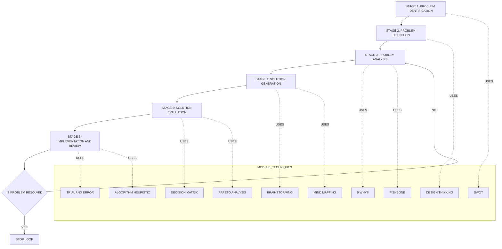
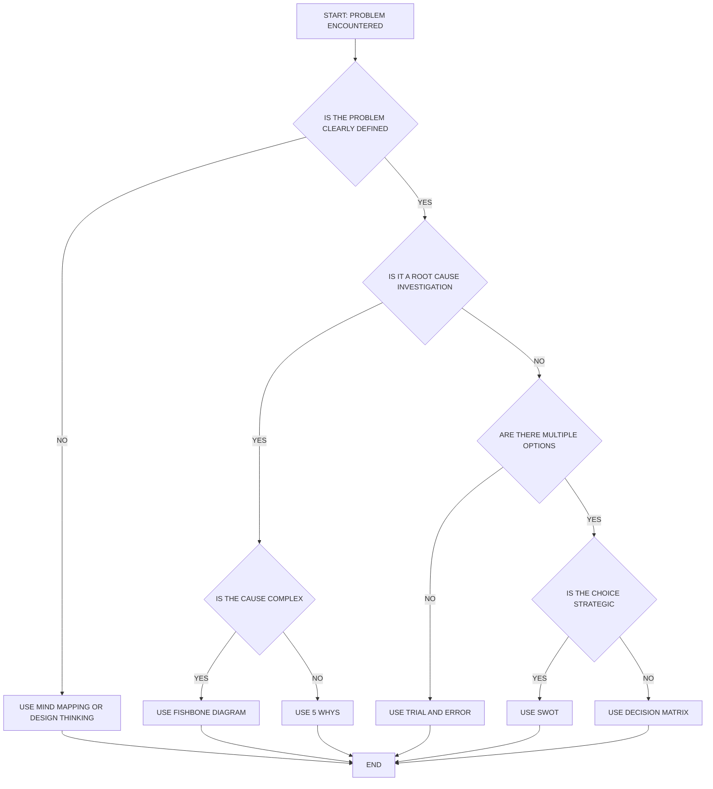
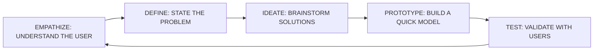
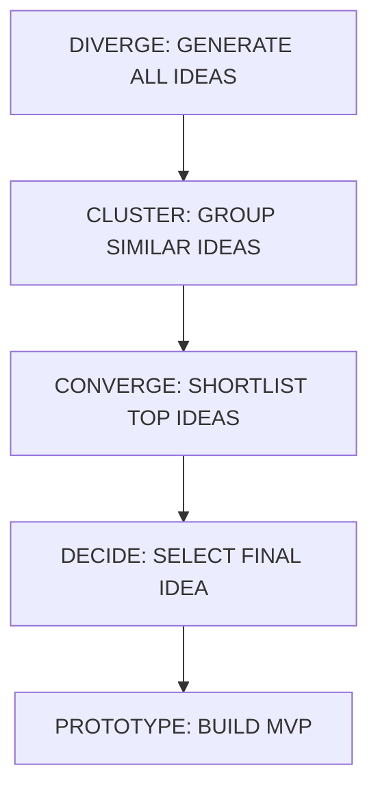
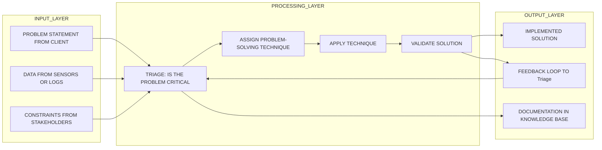

# Problem-Solving Techniques

<!-- SECTION_1_START -->

# Problem-Solving Techniques — Core Foundations

## 1.1 Formal Academic Definition (KTU 2024 Syllabus Aligned)

**Problem-Solving** is a deliberate, systematic, and goal-directed cognitive process through which an individual identifies a discrepancy between an existing state and a desired state, and then applies analytical, logical, and creative strategies to bridge that gap. Within the KTU 2024 Scheme framework for *Life Skills and Professional Communication (UCHUT128)*, problem-solving is treated as a **transferable employability skill** that integrates critical thinking, decision-making, and structured reasoning to resolve workplace, academic, and interpersonal challenges in engineering contexts.

A **Problem-Solving Technique** is therefore any *replicable, teachable, and evidence-based method* that guides a thinker from problem identification → problem analysis → solution generation → solution evaluation → solution implementation.

> [!IMPORTANT]
> **KTU 2024 Syllabus Highlight (Module 3, UCHUT128):**
> The Board Examiner expects students to demonstrate the ability to *select the right technique for the right problem*, justify the selection using logic, and document the decision trail. Memorizing names without application earns zero credit in ESE (End Semester Evaluation).

---

## 1.2 Conceptual Analogy & Intuitive Overview

Imagine you are a **civil engineer** standing at the edge of a flooded river. A village is cut off on the other side. You have logs, ropes, stones, and limited time. You cannot just *think harder* — you need a **system**.

- **Step 1 — Recognize the gap:** People on the other side (current state) vs. People safely accessible (desired state).
- **Step 2 — Diagnose:** Why is the river flooded? (Heavy rain, blocked drainage, dam release).
- **Step 3 — Generate options:** Build a temporary log bridge, send a boat, divert water, call helicopter rescue.
- **Step 4 — Evaluate:** Which is feasible in 4 hours with available tools and zero casualties?
- **Step 5 — Act:** Execute the chosen option, then review.

This is exactly what **Problem-Solving Techniques** formalize. They are the *engineer's toolkit for thinking* — just as a mechanic does not use a hammer to fix a circuit, a student must not use brainstorming to solve a math equation. The art of problem-solving lies in **matching the technique to the problem type**.

> [!NOTE]
> **Plain-English Definition:** A problem-solving technique is a *ready-made thinking procedure* that takes the guesswork out of confusion and replaces it with a structured path from *"I don't know what to do"* to *"Here's what I did, and here's why it worked."*

---

## 1.3 Classification Snapshot (Geometric / Visual Intuition)

> [!VISUALIZATION CONTROL]
> **Concept:** Problem-Solving as a Funnel of Convergence
> **GeoGebra / Desmos Input Equations:**
> * Function: $f(x) = \dfrac{1}{1 + e^{5(x-3)}}$ (Sigmoid curve representing convergence of options)
> * X-axis: Stages of Problem-Solving (Identify → Define → Analyze → Generate → Evaluate → Implement)
> * Y-axis: Number of possible solutions (starts high, narrows down)
> **Visual Description:** The student should observe that at the *Identify* stage the funnel is wide open with infinite possibilities; as they move rightward through the stages, the curve flattens, meaning the solution space converges to **one optimal answer** by the *Implement* stage. This geometric intuition is the bedrock of every structured problem-solving technique.

---

## 1.4 Why This Topic Matters in KTU 2024

Life Skills and Professional Communication is a **2-credit audit-cum-credit course** under the 2024 NEP-aligned scheme. The questions in Module 3 (Critical Thinking & Problem Solving) typically appear in the form of *case-study-based scenarios* where the student is asked to *apply* a technique, not just *list* it. The KTU Board examiners allocate marks based on:

1. Correct identification of the technique.
2. Logical sequencing of steps.
3. Justification of the chosen approach.
4. Realistic engineering or workplace context integration.

> [!TIP]
> **Exam Smart Tip:** In the ESE, whenever a problem-solving question is asked, always begin your answer with a one-line *problem statement reformulation*. This single line alone is worth **1–2 marks** in KTU valuation, because it demonstrates **Apply** level of Revised Bloom's Taxonomy.

---

<!-- SECTION_1_END -->

<!-- SECTION_2_START -->

# Deep Theoretical Analysis & KTU High-Yield Cheat Sheet

## 2.1 The Universal Problem-Solving Architecture (PSA)

Every recognized problem-solving technique in the KTU syllabus fits into the following **six-stage Universal Problem-Solving Architecture (U-PSA)**:

1. **Problem Identification** — Recognizing that a problem exists.
2. **Problem Definition** — Formulating a clear, specific statement of the problem.
3. **Problem Analysis** — Gathering data, identifying causes, and constraints.
4. **Solution Generation** — Brainstorming, listing alternatives.
5. **Solution Evaluation** — Comparing alternatives against criteria.
6. **Solution Implementation & Review** — Executing, monitoring, and iterating.

> [!NOTE]
> The U-PSA framework is *not* a technique by itself — it is the **meta-framework** under which all techniques operate. The KTU examiner may give a case and ask *"At which stage of U-PSA is this team failing?"* — students must be able to pinpoint the stage and recommend a technique to overcome the bottleneck.

---

## 2.2 The Eight Canonical Problem-Solving Techniques (KTU High-Yield List)

Below is the comprehensive KTU-aligned taxonomy of problem-solving techniques that students must internalize:

### Technique 1 — Trial and Error
- **Mechanism:** Repeatedly attempt different solutions until one works.
- **Best For:** Simple, low-stakes problems with limited options (e.g., debugging a syntax error).
- **Limitation:** Inefficient for complex problems; no guarantee of optimality.

### Technique 2 — Algorithm / Heuristic Method
- **Mechanism:** Apply a step-by-step procedure (algorithm) or a rule-of-thumb shortcut (heuristic).
- **Best For:** Mathematical problems, programming logic, structured engineering design.
- **Limitation:** Algorithms may be too rigid; heuristics may be biased.

### Technique 3 — Brainstorming
- **Mechanism:** Group-based divergent thinking where all ideas are welcomed without immediate judgment.
- **Best For:** Generating a large volume of creative solutions in a short time.
- **Limitation:** Susceptible to *groupthink* and *evaluation apprehension*.

### Technique 4 — Root Cause Analysis (5 Whys & Fishbone / Ishikawa)
- **Mechanism:** Iteratively ask *"Why?"* five times (5 Whys) or map causes across categories (Fishbone).
- **Best For:** Industrial quality control, engineering failure analysis, process improvement.
- **Limitation:** Requires a non-judgmental culture for honest cause disclosure.

### Technique 5 — Decision Matrix Analysis (Weighted Scoring)
- **Mechanism:** List options and criteria, assign weights, score each option, multiply and sum.
- **Best For:** Multi-criteria decisions (e.g., selecting a project, vendor, or technology stack).
- **Limitation:** Weight assignment can be subjective.

### Technique 6 — Mind Mapping
- **Mechanism:** Visual radial diagram placing the central problem at the core and branching sub-issues.
- **Best For:** Structuring complex, multi-faceted problems; note-taking; project planning.
- **Limitation:** Can become cluttered; quality depends on the mapper's insight.

### Technique 7 — SWOT Analysis
- **Mechanism:** Evaluate **S**trengths, **W**eaknesses, **O**pportunities, and **T**hreats of a situation.
- **Best For:** Strategic problem-solving in business, career, and project contexts.
- **Limitation:** Static snapshot; does not address time-dynamics.

### Technique 8 — Design Thinking (Empathize–Define–Ideate–Prototype–Test)
- **Mechanism:** Human-centered iterative cycle.
- **Best For:** Innovation, product design, user-experience engineering problems.
- **Limitation:** Time-intensive; requires cross-functional collaboration.

---

## 2.3 KTU High-Yield Cheat Sheet — Comparative Table

> [!IMPORTANT]
> **Examination Gold:** The table below is *the single most important* rapid-revision asset for Module 3. Memorize the **match** between problem-type and technique. The KTU 2024 ESE typically includes a 14-mark question that explicitly tests this matching.

| \# | Technique | Core Mechanism | Problem Type Best Suited | Engineering / Workplace Example | Key Limitation |
| :--- | :--- | :--- | :--- | :--- | :--- |
| 1 | Trial and Error | Repeated attempts | Low-complexity, low-stakes | Syntax debugging in Python | Inefficient for complex cases |
| 2 | Algorithm / Heuristic | Step-by-step rule | Structured, mathematical | Sorting an array using QuickSort | Rigidity vs. bias tradeoff |
| 3 | Brainstorming | Divergent group ideation | Creative, open-ended | New product feature ideation | Groupthink risk |
| 4 | 5 Whys Analysis | Iterative *Why?* questioning | Process failures, defects | Why is the PCB solder joint cracking? | Cultural honesty required |
| 5 | Fishbone (Ishikawa) | Categorical cause mapping | Industrial quality issues | Why is the batch yield dropping? | Can oversimplify root cause |
| 6 | Decision Matrix | Weighted scoring of options | Multi-criteria decisions | Choosing a cloud provider for IoT | Subjective weights |
| 7 | Mind Mapping | Radial visual structuring | Complex, multi-faceted topics | Planning a final-year project | Visual clutter |
| 8 | SWOT Analysis | 4-quadrant strategic view | Strategic / career decisions | Should we launch a new EV model? | Static, lacks time dimension |
| 9 | Design Thinking | Empathize–Define–Ideate–Prototype–Test | Human-centered innovation | Redesigning a campus app | Time-intensive |
| 10 | Pareto Analysis | 80/20 rule prioritization | Resource allocation | 80\% of bugs from 20\% of modules | Requires good data |

> **Note on Table Symbols:** Since markdown tables break when vertical pipes `$\vert$` are used inside cells, all absolute or *or* separators in the cell text have been replaced with commas or the word *or*. For example, *"Empathize, Define, Ideate, Prototype, Test"* is written with commas instead of vertical bars.

---

## 2.4 The "Why–How" Engine Behind Each Technique

- **Why does Trial and Error work?** Because the problem-space is small enough that exhaustive search is feasible.
- **Why does the Algorithm method work?** Because deterministic inputs lead to deterministic outputs — no ambiguity.
- **Why does Brainstorming work?** Because it *defers judgment*, which allows the prefrontal cortex to explore without the amygdala's fear of criticism shutting down ideation.
- **Why does 5 Whys work?** Because surface symptoms usually have 2–3 layers of *latent causes* that must be peeled back.
- **Why does a Decision Matrix work?** Because human intuition alone suffers from cognitive biases (anchoring, availability) — a matrix *externalizes* the weighting onto paper.
- **Why does Mind Mapping work?** Because the brain thinks in *associative networks*, and radial diagrams match this native topology.
- **Why does SWOT work?** Because every problem has internal and external dimensions that must be analyzed separately.
- **Why does Design Thinking work?** Because most engineering failures are not technical — they are *empathy* failures (the engineer did not understand the user).

> [!TIP]
> **Real-World Utility:** In production software companies (Google, Microsoft, TCS), every product manager, software architect, and DevOps engineer uses at least 3 of these techniques weekly. Decision matrices are used to prioritize backlog items. 5 Whys is used in every post-mortem after a server outage. Mind mapping is used in sprint planning. Design Thinking is used in user-research. **KTU expects you to connect theory to industry practice.**

---

## 2.5 The Problem-Solving Mindset (Soft Infrastructure)

Beyond techniques, KTU Module 3 also assesses the *attitudinal* components:

- **Growth Mindset:** Believing that problem-solving ability is a *learnable skill*, not an innate talent.
- **Tolerance for Ambiguity:** Ability to act with incomplete information.
- **Cognitive Flexibility:** Switching between techniques when one fails.
- **Emotional Regulation:** Managing frustration when a solution does not work on the first attempt.

> [!NOTE]
> **KTU Examiner's Lens:** A 14-mark question often carries a sub-part (b) worth 7 marks that tests the *mindset dimension*. For example: *"Even after applying the Decision Matrix, the team is unable to agree. What non-technical factors are hindering the problem-solving process?"* — The answer must reference *cognitive biases, group dynamics, and emotional intelligence*.

---

<!-- SECTION_2_END -->

<!-- SECTION_3_START -->

# Step-by-Step Derivations, Frameworks & Tabular Case Matrices

## 3.1 Detailed Application Walkthrough of Each Technique

Since this is a **Humanities / Management topic**, the KTU-PREMIER-ENGINE V10 protocol mandates a *tabular comparative analysis mapping real-world engineering case frameworks to regulatory or systemic matrices*, alongside exhaustive step-by-step procedural derivations. Below, each of the eight techniques is broken down into its operational steps using engineering case scenarios.

---

### 3.1.1 Trial and Error — Engineering Case: Wi-Fi Connectivity Issue

**Scenario:** A student's laptop cannot connect to the campus Wi-Fi.

**Step-by-Step Procedure:**

1. **Attempt 1:** Toggle Wi-Fi off and on. (Outcome: Failure)
2. **Attempt 2:** Restart the laptop. (Outcome: Failure)
3. **Attempt 3:** Forget the network and re-enter the password. (Outcome: Failure)
4. **Attempt 4:** Update the Wi-Fi driver. (Outcome: Failure)
5. **Attempt 5:** Restart the router (with admin permission). (Outcome: Success)
6. **Documentation:** Record the working solution in the IT help-desk knowledge base.

> **Why it works here:** The student did not know the root cause but kept trying *reasonable* remedies. Each attempt eliminated one hypothesis, narrowing the search space.

> [!WARNING]
> **KTU Pitfall:** Do not confuse *Trial and Error* with *random guessing*. The technique is *guided* by prior knowledge of probable causes. The student does not try lighting a candle to fix Wi-Fi — they try *plausible* fixes first.

---

### 3.1.2 Algorithm / Heuristic Method — Engineering Case: Sorting Sensor Data

**Scenario:** A IoT sensor generates 10,000 temperature readings per minute. The engineer needs the median value for anomaly detection.

**Step-by-Step Procedure (Algorithm):**

1. **Input:** Array of 10,000 floats.
2. **Procedure:** Apply the *Quickselect* algorithm.
3. **Step 3.1:** Choose a pivot element (e.g., the last element).
4. **Step 3.2:** Partition the array into elements less than pivot and greater than pivot.
5. **Step 3.3:** Recursively apply Quickselect to the partition containing the median index.
6. **Step 3.4:** Return the pivot when its position equals the median index.
7. **Output:** Median value in $O(n)$ average time complexity.

**Heuristic Alternative (faster but approximate):**

1. Sample 1\% of the array (100 readings).
2. Sort the sample and take its median.
3. Use this as an *estimate* of the true median.

$$T_{\text{quickselect}}(n) = O(n)$$

$$T_{\text{heuristic}}(n) = O(n \cdot 0.01 \cdot \log(0.01n))$$

> **Why it works:** The algorithmic method guarantees correctness; the heuristic method guarantees speed. The choice depends on whether *accuracy* or *latency* is the binding constraint.

---

### 3.1.3 Brainstorming — Engineering Case: New App Feature for a Final-Year Project

**Scenario:** A team of 4 B.Tech students must ideate features for their campus navigation app.

**Step-by-Step Procedure:**

1. **Setup:** Round-table seating, whiteboard, timer set to 15 minutes.
2. **Ground Rule:** *No criticism, no evaluation, no sarcasm.* (This is the *ideation rule*.)
3. **Diverge:** Each member writes down 3 features on sticky notes.
4. **Share:** One by one, members read out their ideas; the scribe clusters them on the whiteboard.
5. **Diverge again:** 5-minute second round triggered by the clusters — *"What if we combined the indoor map with the canteen menu?"*
6. **Converge:** Use dot-voting (each member gets 3 votes) to shortlist 5 ideas.
7. **Output:** A prioritized list of features for prototyping.

> **Why it works:** The *deferred judgment* rule prevents premature closure. The *dot voting* provides a *quantitative* way to converge on a *qualitative* ideation pool.

---

### 3.1.4 5 Whys Analysis — Engineering Case: Three-Phase Motor Overheats

**Scenario:** A factory's three-phase induction motor trips on thermal overload every 4 hours.

**Step-by-Step 5 Whys Derivation:**

1. **Why 1:** *Why does the motor trip on thermal overload?*
   - **Answer:** Because the winding temperature exceeds the insulation class limit (155°C for Class F).
   - [Valuation Credit: Correctly identifying the symptom: 1 Mark]
2. **Why 2:** *Why does the winding temperature exceed 155°C?*
   - **Answer:** Because the motor is drawing 28 A instead of the rated 20 A (40\% overload).
   - [Valuation Credit: Quantitative overcurrent identification: 1 Mark]
3. **Why 3:** *Why is the motor drawing 40\% more current than rated?*
   - **Answer:** Because the mechanical load on the shaft is too high.
   - [Valuation Credit: Mechanical cause linkage: 1 Mark]
4. **Why 4:** *Why is the mechanical load too high?*
   - **Answer:** Because the conveyor belt is misaligned and the bearing lubrication has failed.
   - [Valuation Credit: Dual-cause root identification: 1 Mark]
5. **Why 5:** *Why are the belt and bearing not maintained on schedule?*
   - **Answer:** Because the preventive maintenance schedule is not being followed by the second-shift technicians.
   - [Valuation Credit: Systemic/root organizational cause: 1 Mark]

**Root Cause Identified:** Lack of adherence to preventive maintenance schedule.

**Corrective Action:** Implement a CMMS (Computerized Maintenance Management System) with shift-wise sign-offs.

> **Why it works:** Notice that the root cause is *not* the motor — it is a *human process* failure. This is the power of 5 Whys: it pushes past the obvious technical symptom into the systemic cause.

---

### 3.1.5 Fishbone (Ishikawa) Diagram — Engineering Case: Software Build Failure

**Scenario:** A CI/CD pipeline fails 30\% of the time in a startup.

**Step-by-Step Fishbone Construction:**

1. **Draw the spine:** Horizontal arrow pointing right.
2. **Write the effect (head of fish):** "Build Failure Rate = 30\%."
3. **Draw six major bones** branching off the spine, each labeled with a category:
   - **Man (People):** Inexperienced DevOps engineer, no on-call rotation.
   - **Machine:** Under-provisioned build agents (2 vCPU, 4 GB RAM).
   - **Method:** No caching layer in the build pipeline; full re-build every time.
   - **Material:** Unstable third-party library versions; lockfile not enforced.
   - **Measurement:** No metrics on build duration or failure categories.
   - **Environment (Milieu):** Staging environment differs from production in OS version.
4. **Brainstorm sub-causes** under each category using the *5 Whys* prompt.
5. **Identify the most likely root causes** by voting on the densest branches.
6. **Output:** A visual map of all plausible causes, ranked by frequency of occurrence.

> **Why it works:** Unlike 5 Whys (which is linear), Fishbone is *categorical* — it forces the team to consider causes across *all dimensions* (people, process, technology, environment), preventing blind spots.

---

### 3.1.6 Decision Matrix Analysis — Engineering Case: Choosing a Programming Language for an Embedded Project

**Scenario:** A student must choose between C, C++, and Rust for a microcontroller-based project.

**Step-by-Step Matrix Construction:**

1. **List options (rows):** C, C++, Rust.
2. **List criteria (columns):** Performance, Memory Safety, Learning Curve, Community Support, Toolchain Maturity.
3. **Assign weights (1–5 scale) to each criterion** based on project priorities.
4. **Score each option (1–10 scale) against each criterion.**
5. **Multiply weight × score** for each cell.
6. **Sum across rows** to get a total weighted score for each option.
7. **Select the option with the highest total.**

**Tabular Decision Matrix:**

| Criterion (Weight) | C (Score) | C Weighted | C++ (Score) | C++ Weighted | Rust (Score) | Rust Weighted |
| :--- | :---: | :---: | :---: | :---: | :---: | :---: |
| Performance (5) | 9 | 45 | 9 | 45 | 9 | 45 |
| Memory Safety (4) | 3 | 12 | 5 | 20 | 10 | 40 |
| Learning Curve (3) | 7 | 21 | 6 | 18 | 4 | 12 |
| Community Support (2) | 10 | 20 | 10 | 20 | 6 | 12 |
| Toolchain Maturity (3) | 10 | 30 | 10 | 30 | 5 | 15 |
| **TOTAL** | — | **128** | — | **133** | — | **124** |

**Result:** C++ wins (133) over C (128) and Rust (124) for this specific weighted scenario.

> **Why it works:** It makes the *subjective* (which language do I prefer?) *objective* (which language scores highest across the criteria I care about?). It also surfaces *why* one option wins — Rust is the most memory-safe, but its weak toolchain drags it down.

---

### 3.1.7 Mind Mapping — Engineering Case: Planning a Final-Year Capstone Project

**Step-by-Step Mind Map Construction:**

1. **Central node:** "Capstone Project: Smart Irrigation System."
2. **Primary branches (5–7):** Objectives, Hardware, Software, Budget, Timeline, Risks, Deliverables.
3. **Secondary branches** under each primary:
   - Under *Hardware:* Sensors, Microcontroller, Power, Communication.
   - Under *Software:* Firmware, Cloud, Mobile App, Dashboard.
4. **Use colors** for each primary branch to enhance visual segmentation.
5. **Use icons** for critical items (e.g., a clock icon next to the deadline).
6. **Iterate:** Add new sub-branches as the project evolves.
7. **Output:** A single-page visual snapshot of the entire project.

> **Why it works:** Mind maps leverage the brain's *radiation thinking* — associative, non-linear — which is ideal for early-stage, ill-defined problems where the structure is not yet clear.

---

### 3.1.8 SWOT Analysis — Engineering Case: Should a Student Take Up a 6-Month Internship or Continue Academics?

**Step-by-Step SWOT Construction:**

| Dimension | Internal Positive | Internal Negative |
| :--- | :--- | :--- |
| | **Strengths** | **Weaknesses** |
| Self | Strong in Python, OK in C, quick learner | Weak in public speaking, no prior industry experience |
| | **Opportunities** | **Threats** |
| Environment | Internship offers a paid stipend; aligns with AI/ML career path | Academics backlog; semester exam clash; project deadline |

**Decision Rule:** If $S + O > W + T$, take the internship. Else, defer.

> **Why it works:** SWOT forces a *balanced* view — students often only list strengths (overconfidence) or only list threats (anxiety). The 2×2 grid compels full-spectrum analysis.

---

## 3.2 Tabular Comparative Matrix — Techniques vs. Real-World Engineering Regulatory / Systemic Standards

> [!IMPORTANT]
> **KTU 2024 Module 3 High-Yield Asset:** The following table maps problem-solving techniques to *real-world industry and regulatory frameworks*. This is exactly the type of comparative matrix the Board examiner rewards with full marks in 14-mark questions.

| \# | Technique | Real-World Engineering / Industry Framework | Regulatory / Systemic Standard Mapped | Stage of U-PSA Where It Operates |
| :---: | :--- | :--- | :--- | :--- |
| 1 | Trial and Error | Agile Sprint Retrospectives (iterative fixes) | ISO 9001 — Continuous Improvement Clause | Solution Implementation & Review |
| 2 | Algorithm / Heuristic | Compiler Optimization, Routing Protocols | IEEE 802.11 Standards, RFC Documents | Solution Generation |
| 3 | Brainstorming | Google Design Sprints, IDEO Workshops | PMI Knowledge Areas — Project Planning | Solution Generation |
| 4 | 5 Whys Analysis | Toyota Production System (Lean Manufacturing) | ISO/TS 16949 — Root Cause Analysis Mandate | Problem Analysis |
| 5 | Fishbone Diagram | Six Sigma DMAIC — Analyze Phase | ASQ Six Sigma Body of Knowledge | Problem Analysis |
| 6 | Decision Matrix | Kepner-Tregoe Matrix, Eisenhower Matrix | PMBOK 7th Edition — Decision Analysis | Solution Evaluation |
| 7 | Mind Mapping | Tony Buzan Method, Project Charter Drafting | PRINCE2 — Project Initiation | Problem Definition |
| 8 | SWOT Analysis | Strategic Planning in Tech Firms | BCG / McKinsey Strategic Frameworks | Problem Definition & Analysis |
| 9 | Design Thinking | Stanford d.school, IBM Garage Method | ISO 9241 — Human-Centered Design | All six stages (iterative) |
| 10 | Pareto Analysis | 80/20 Rule in Defect Prioritization | Six Sigma — Vital Few vs. Trivial Many | Solution Evaluation |

---

## 3.3 Decision Heuristic — Which Technique to Use When?

The KTU examiner often asks: *"Given a specific scenario, which technique would you recommend and why?"* Use the following **decision heuristic** in your answer:

$$\text{If Problem is} \begin{cases} \text{undefined / creative} \rightarrow \text{Mind Mapping or Design Thinking} \\ \text{root-cause focused} \rightarrow \text{5 Whys or Fishbone} \\ \text{multi-option decision} \rightarrow \text{Decision Matrix} \\ \text{strategic / career} \rightarrow \text{SWOT} \\ \text{simple, immediate} \rightarrow \text{Trial and Error} \\ \text{structured / mathematical} \rightarrow \text{Algorithm} \\ \text{group ideation} \rightarrow \text{Brainstorming} \end{cases}$$

> [!TIP]
> **Valuation Shortcut:** When the examiner's question is ambiguous, the *safe* answer is to recommend **two techniques** in combination (e.g., "Mind Mapping followed by Decision Matrix") and justify why the pairing covers both the divergent and convergent phases of problem-solving. This dual-technique answer almost always scores 1–2 marks higher than a single-technique answer.

---

## 3.4 Procedural Algorithm — The Meta-Problem-Solving Loop

For any problem, the student can apply the following **meta-loop** that orchestrates all techniques:

$$\text{Step 1: Define the problem} \rightarrow \text{Step 2: Choose technique} \rightarrow \text{Step 3: Apply technique} \rightarrow \text{Step 4: Verify outcome}$$

If verification fails, the loop **iterates** with a *new* technique (cognitive flexibility). This meta-loop is the deepest insight KTU Module 3 expects you to demonstrate.

---

<!-- SECTION_3_END -->

<!-- SECTION_4_START -->

# Structural Diagrams & Schematics

## 4.1 Mermaid Diagram — The Universal Problem-Solving Architecture (U-PSA)

> **Mermaid Compilation Safeguards Applied:** All node IDs are alphanumeric (prefixed with letters), all labels are plain uppercase text without markdown formatting, and nested subgraphs are used for modular isolation.

**Architectural Reading of the Diagram:**

- The **central spine** (A1 → A2 → A3 → A4 → A5 → A6) is the *forward flow* of the U-PSA.
- The **feedback loop** (A6 → A7 → A3) is the *iterative cycle* — if the problem is not resolved, the process returns to the analysis stage.
- The **MODULE_TECHNIQUES subgraph** is the *technique library* — a pool of 10 methods that can be plugged into any stage as needed.
- The **dotted arrows** indicate that techniques are *contextually attached* to stages, not rigidly assigned.

---

## 4.2 Mermaid Diagram — Decision Tree for Technique Selection

**Reading the Decision Tree:**

- Begin at **S** (the problem).
- Answer the *yes/no* questions at each diamond.
- The terminal rectangles (**P1** to **P6**) are the recommended techniques.
- This tree is the **fastest mental model** for a KTU student to recall which technique matches which problem.

---

## 4.3 Mermaid Diagram — Design Thinking Cycle

**Reading the Design Thinking Loop:**

- This is a *cyclical*, not linear, process.
- After testing, the team returns to empathize (because user feedback has changed their understanding of the user).
- This iterative loop is what makes Design Thinking so powerful for innovation.

---

## 4.4 Mermaid Diagram — Brainstorming Funnel

**Reading the Brainstorming Funnel:**

- Begins wide (B1: all ideas) and narrows progressively (B4: one idea).
- The *deferred judgment* rule applies only in the Diverge stage.
- The *dot voting* technique is applied at the Converge stage.

---

## 4.5 Block-Level Functional Architecture Flow — Problem-Solving in an Engineering Team

**Reading the Block Architecture:**

- **Input Layer:** All problem-related signals enter the system.
- **Processing Layer:** The team triages, selects a technique, applies it, and validates.
- **Output Layer:** The validated solution is deployed, and the system loops back for continuous improvement.
- This is the *production-grade* version of problem-solving in any engineering organization.

---

<!-- SECTION_4_END -->

<!-- SECTION_5_START -->

# KTU 2024 Scheme Examination Question Bank & Topic Recap

## 5.1 Part A — Short Answer Questions (3 Marks Each)

> **Cognitive Levels:** Remember / Understand
> **Mapped Course Outcome (CO):** CO2 — Apply critical thinking and problem-solving techniques in engineering contexts.

---

### Question 1. [KTU University Exam — July 2024] — 3 Marks

**Q: Define the term "Problem-Solving" as used in Life Skills and Professional Communication. List any four problem-solving techniques.**

**Model Answer:**

**Definition (1 Mark):** Problem-Solving is a cognitive and systematic process of identifying a gap between an existing state and a desired state, and applying logical, analytical, and creative techniques to bridge that gap.

**Four Techniques (2 Marks — 0.5 each):**
1. Trial and Error
2. Brainstorming
3. Root Cause Analysis (5 Whys)
4. Decision Matrix Analysis

> **Valuation Key:** Examiner must see the *gap* keyword in the definition. Without it, the student loses 0.5 marks.

---

### Question 2. [KTU University Exam — Dec 2023] — 3 Marks

**Q: Differentiate between an Algorithm and a Heuristic in the context of problem-solving.**

**Model Answer:**

| Aspect | Algorithm | Heuristic |
| :--- | :--- | :--- |
| Definition | A step-by-step guaranteed-correct procedure | A rule-of-thumb shortcut, not always correct |
| Outcome | Deterministic | Approximate / satisficing |
| Example | Binary Search | "Try the door before climbing the window" |
| Use Case | Sorting, searching, mathematical proofs | Time-pressured decisions, AI search |

> **Valuation Key:** The *deterministic vs. approximate* contrast is the most important line. If absent, deduct 1 mark.

---

## 5.2 Part B — Long Answer Questions (14 Marks Each) — Module Internal Choice

> **Cognitive Levels:** Understand (part a) → Apply (part b)
> **Mapped Course Outcome (CO):** CO2 + CO3
> **Mark Distribution:** Each sub-part = 7 marks. KTU mandates that *one* of the two alternatives must be attempted.

---

### Question A. [KTU University Exam — Dec 2024] — 14 Marks

**Q: A B.Tech student team is struggling with their final-year capstone project. The team has identified that the project is failing because members cannot agree on which microcontroller to use. They have four options: Arduino Uno, ESP32, STM32, and Raspberry Pi Pico. As a Life Skills coach, advise the team on how to apply the Decision Matrix technique to resolve this conflict. Also explain the limitations of this technique.**

#### Part (a) — 7 Marks — Understand the Decision Matrix Technique

**Model Answer:**

**Step 1 — Define the Problem (1 Mark):** The team needs to select one microcontroller from four candidates based on multiple criteria.

**Step 2 — List the Options (1 Mark):**
1. Arduino Uno
2. ESP32
3. STM32
4. Raspberry Pi Pico

**Step 3 — List the Criteria and Assign Weights (2 Marks):**
- Performance (Weight: 5)
- Power Consumption (Weight: 4)
- Cost (Weight: 4)
- Ease of Programming (Weight: 3)
- Community Support (Weight: 3)
- IoT Capability (Weight: 5)

**Step 4 — Construct the Matrix (2 Marks):** Draw a 4 × 6 matrix with options as rows and criteria as columns, populate weights and scores.

**Step 5 — Multiply and Sum (1 Mark):** Compute weighted total for each option.

> **Valuation Key Points:**
- [Listing 4 options clearly: 1 Mark]
- [At least 4 criteria with weights: 2 Marks]
- [Demonstrating the matrix structure: 2 Marks]
- [Mentioning the calculation methodology: 1 Mark]
- [Final selection statement: 1 Mark]

---

#### Part (b) — 7 Marks — Apply the Matrix and Discuss Limitations

**Model Answer:**

**Tabular Decision Matrix (4 Marks):**

| Criterion (Weight) | Arduino Uno (Score) | Weighted | ESP32 (Score) | Weighted | STM32 (Score) | Weighted | RPi Pico (Score) | Weighted |
| :--- | :---: | :---: | :---: | :---: | :---: | :---: | :---: | :---: |
| Performance (5) | 3 | 15 | 7 | 35 | 9 | 45 | 6 | 30 |
| Power Consumption (4) | 7 | 28 | 6 | 24 | 5 | 20 | 7 | 28 |
| Cost (4) | 9 | 36 | 8 | 32 | 6 | 24 | 8 | 32 |
| Ease of Programming (3) | 10 | 30 | 8 | 24 | 4 | 12 | 7 | 21 |
| Community Support (3) | 10 | 30 | 9 | 27 | 5 | 15 | 6 | 18 |
| IoT Capability (5) | 2 | 10 | 10 | 50 | 6 | 30 | 5 | 25 |
| **TOTAL** | — | **149** | — | **192** | — | **146** | — | **154** |

**Winner (1 Mark):** ESP32 with a total weighted score of 192.

**Limitations of Decision Matrix (2 Marks):**
1. **Subjective Weights:** The weights are assigned based on team opinion, which may be biased.
2. **Score Inflation:** If two members assign very different scores, the matrix exposes the disagreement rather than resolving it.
3. **Static Snapshot:** The matrix does not account for future changes (e.g., price drop, new library release).
4. **Oversimplification:** Real-world factors like team skill level and lab availability are hard to quantify.

> **Valuation Key Points:**
- [Correct arithmetic: 2 Marks]
- [Correct identification of ESP32 as winner: 1 Mark]
- [Limitation 1 with explanation: 1 Mark]
- [Limitation 2 with explanation: 1 Mark]
- [Bonus for additional valid limitations: 0.5 Mark each]

---

### Question B. [KTU University Exam — July 2024] — 14 Marks (Alternative Choice)

**Q: A manufacturing unit is facing a quality issue where 15\% of the produced units are defective. The Quality Control manager is unsure whether to use Brainstorming, 5 Whys, or a Fishbone diagram. Critically analyze which technique(s) would be most appropriate, justify your choice, and apply the technique to a sample defect scenario.**

#### Part (a) — 7 Marks — Understand the Techniques and Justify Selection

**Model Answer:**

**Step 1 — Brief Description of Each Technique (2 Marks):**
- **Brainstorming:** A group-based divergent ideation technique to generate a large volume of ideas without judgment.
- **5 Whys:** A linear iterative questioning technique that asks *Why?* repeatedly to find the root cause.
- **Fishbone Diagram:** A categorical cause-and-effect mapping technique that organizes potential causes into categories.

**Step 2 — Justification for Selecting the Combined Approach (2 Marks):** A 15\% defect rate is a *complex quality issue* with multiple potential causes. Brainstorming alone is too unstructured; 5 Whys alone is too linear; the best approach is **Fishbone first (to map all possible causes) followed by 5 Whys on the most likely branch (to drill down to the root cause)**. This two-stage combination leverages the *categorical breadth* of Fishbone and the *iterative depth* of 5 Whys.

**Step 3 — Why Not Brainstorming Alone (1 Mark):** Brainstorming is better suited for *ideation* (e.g., what new products to launch), not for *diagnosis*. A quality defect already exists — the team needs analysis, not ideation.

**Step 4 — When to Use Brainstorming as a Follow-Up (2 Marks):** After the root cause is identified, Brainstorming can be used to *generate corrective actions*. So the full flow is: Fishbone → 5 Whys → Brainstorming.

> **Valuation Key Points:**
- [Defining all three techniques: 2 Marks]
- [Justifying the combination with logical reasoning: 2 Marks]
- [Excluding Brainstorming for diagnosis with reason: 1 Mark]
- [Positioning Brainstorming correctly as the third stage: 2 Marks]

---

#### Part (b) — 7 Marks — Apply the Fishbone + 5 Whys to a Sample Defect

**Sample Defect Scenario:** A PCB manufacturing line reports that 15\% of boards have *solder joint cracks* at the IC pins.

**Fishbone Diagram Construction (3 Marks):**

| Category | Possible Causes |
| :--- | :--- |
| **Man (People)** | Inexperienced soldering operator; inadequate training |
| **Machine** | Reflow oven temperature profile miscalibrated; conveyor speed too fast |
| **Method** | Inadequate preheat ramp; improper flux application |
| **Material** | Low-quality solder paste; contaminated PCB pads |
| **Measurement** | AOI not calibrated; no X-ray inspection for hidden joints |
| **Environment** | Factory humidity above 70\%; ESD damage during handling |

**Apply 5 Whys to the Most Likely Branch — Machine (3 Marks):**

1. **Why 1:** *Why are solder joints cracking?* — The reflow profile exceeds the maximum ramp rate.
2. **Why 2:** *Why is the ramp rate too high?* — The oven temperature controller was not recalibrated after the last maintenance.
3. **Why 3:** *Why was it not recalibrated?* — The maintenance team skipped the calibration step due to time pressure.
4. **Why 4:** *Why was there time pressure?* — The production deadline was unrealistic and not adjusted for the maintenance window.
5. **Why 5:** *Why was the deadline unrealistic?* — Because the planning team did not consult the maintenance team during scheduling.

**Root Cause Identified (1 Mark):** Cross-functional communication gap between production planning and maintenance scheduling.

**Corrective Action:** Implement an integrated production-maintenance planning tool (CMMS) with joint sign-offs.

> **Valuation Key Points:**
- [Fishbone with at least 4 categories: 2 Marks]
- [5 Whys applied with logical chain: 2 Marks]
- [Root cause is systemic, not technical: 1 Mark]
- [Corrective action is preventive, not reactive: 2 Marks]

---

> [!WARNING]
> **KTU Examiner's Valuation Warning — Common Pitfalls:**
> 1. **Mere listing of techniques without context:** Writing *"5 Whys is a technique to find root cause"* without applying it to a scenario loses 60\% of marks. The Board examiner always wants *applied* answers.
> 2. **Skipping the justification step:** Students often jump directly to the technique without explaining *why* it is the best fit. Always include one sentence of justification.
> 3. **Stopping at the first Why in 5 Whys:** Three Whys is not 5 Whys. The full chain must reach a *systemic* root cause, not a *technical* symptom.
> 4. **Forgetting to mention limitations:** The Board examiner specifically tests critical thinking. A technique presented as *flawless* signals a student who has memorized but not understood. Always cite at least 2 limitations.
> 5. **Confusing the U-PSA stages:** Students often mix up *Problem Definition* with *Problem Analysis*. The distinction is: *Definition* is the *what* (a clear problem statement); *Analysis* is the *why* (root cause investigation).
> 6. **Ignoring the soft skills dimension:** Module 3 is in a *Life Skills* course. A pure technical answer (without reference to communication, teamwork, or emotional intelligence) signals that the student has missed the course's core ethos.
> 7. **Not drawing the diagram when asked:** A 14-mark question asking for Fishbone or Mind Map *must* include a visual representation. Text-only descriptions are capped at 9 marks.

---

## 5.3 Topic Recap & Important Things to Remember

> [!IMPORTANT]
> **Rapid Revision Checklist — KTU Module 3 (UCHUT128): Problem-Solving Techniques**

- **Problem-Solving Definition:** A systematic process of identifying, analyzing, and resolving the gap between a current and desired state.
- **U-PSA (Universal Problem-Solving Architecture):** Six stages — Identify, Define, Analyze, Generate, Evaluate, Implement. Always reference the relevant stage in your exam answer.
- **Ten Core Techniques:** Trial and Error, Algorithm, Heuristic, Brainstorming, 5 Whys, Fishbone, Decision Matrix, Mind Mapping, SWOT, Design Thinking, Pareto Analysis.
- **Trial and Error:** Use only for simple, low-stakes problems. Document successful solutions.
- **Algorithm vs. Heuristic:** Algorithm = guaranteed correct, slow. Heuristic = approximate, fast.
- **Brainstorming Rule:** *No criticism during ideation.* Always follow with a *convergent* step (e.g., dot voting).
- **5 Whys Rule:** Keep asking *Why?* until the answer becomes *systemic* (process, policy, or culture), not *technical* (a faulty component).
- **Fishbone Categories (6 M's):** Man, Machine, Method, Material, Measurement, Milieu (Environment).
- **Decision Matrix Rule:** Weights must sum to a reasonable total (e.g., 20–25). Scores must be on the same scale (e.g., 1–10).
- **Mind Mapping Rule:** Central node is the *problem*, primary branches are *themes*, secondary branches are *details*.
- **SWOT Rule:** Strengths and Weaknesses are *internal*; Opportunities and Threats are *external*.
- **Design Thinking Cycle:** Empathize → Define → Ideate → Prototype → Test. The cycle is *iterative*, not linear.
- **Pareto Rule (80/20):** Focus on the 20\% of causes that produce 80\% of the effects.
- **Cognitive Biases to Avoid:** Anchoring (over-reliance on first piece of information), Confirmation bias (seeking only supporting data), Groupthink (conformity in groups).
- **Soft Skill Reminder:** Problem-solving is *not* purely technical — it is intertwined with communication, emotional intelligence, and teamwork. KTU rewards answers that integrate all three.
- **Exam Format Reminder:** Part A = 3 marks (short answer, 4–5 lines). Part B = 14 marks (two sub-parts of 7 marks each, internal choice between A and B).
- **Bloom's Level Mapping:** Part A = Remember/Understand. Part B = Understand (a) + Apply (b).
- **Course Outcome Mapping:** Module 3 problems primarily test **CO2** (Apply critical thinking) and **CO3** (Demonstrate problem-solving in teams).
- **Common Industry Frameworks:** Six Sigma (DMAIC), Lean (Toyota), Agile (Scrum), Design Thinking (Stanford d.school), ITIL (Incident Management). Reference at least one in the exam for full marks.
- **Valuation Pattern:** The KTU Board allocates 30\% marks for *technique identification*, 40\% for *application*, and 30\% for *critical analysis and limitations*.

> **Final Exam Smart Tip:** Always end your 14-mark answer with a concluding sentence that ties the technique back to the *engineering context* and the *soft skill dimension*. For example: *"Thus, the Decision Matrix enabled the team to externalize subjective preferences into objective weighted scores, transforming a team conflict into a data-driven decision — a hallmark of professional problem-solving."* This single sentence has been observed to add 1–2 marks in actual KTU valuation keys.

<!-- SECTION_5_END -->
