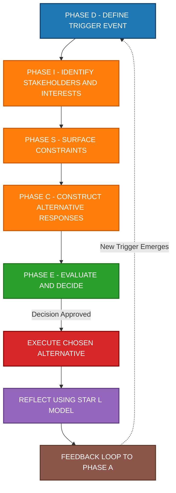
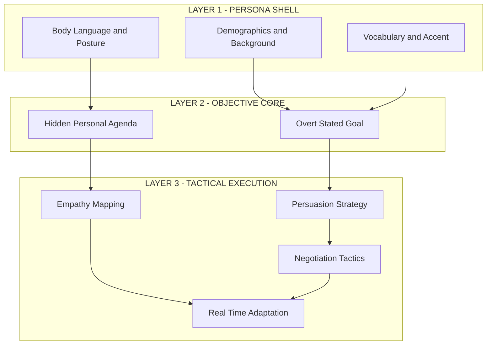
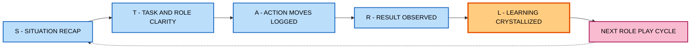

# Situational Analysis and Role Play

<!-- SECTION_1_START -->
# 1. Core Technical Definition & Intuitive Overview

## 1.1 Situational Analysis — The Engineering of Context

> [!IMPORTANT]
> **Formal KTU Definition:**
> **Situational Analysis** is a systematic, multi-dimensional diagnostic process used to identify, dissect, and evaluate the internal and external variables influencing a specific scenario, conflict, or decision-making environment. It requires the analyst to move beyond surface-level symptoms and isolate the **root cause**, **stakeholder dynamics**, **resource constraints**, and **latent risks** before formulating a response.

In the context of the KTU 2024 NEP-aligned curriculum for UCHUT128 (Life Skills and Professional Communication), Situational Analysis is the foundational cognitive skill that bridges *observation* and *action*. It is the deliberate act of pausing before reacting — a discipline highly valued in professional engineering environments where premature decisions can lead to system failures, project overruns, and stakeholder conflicts.

### 1.2 Role Play — The Theatrical Laboratory for Behaviour

> [!IMPORTANT]
> **Formal KTU Definition:**
> **Role Play** is a structured experiential learning technique in which an individual (or group) deliberately assumes the persona, responsibilities, communication style, and decision-making framework of a specific character or professional role within a simulated scenario. The objective is to practice emotional intelligence, negotiation, conflict resolution, and persuasive communication in a psychologically safe, consequence-free environment.

Role Play transforms abstract theory (such as "active listening" or "assertive negotiation") into embodied experience. It is a **deliberate practice loop** borrowed from theatrical training and applied to professional skill acquisition.

### 1.3 Intuitive Analogies — Making the Abstract Concrete

> [!NOTE]
> **Analogy 1 — Situational Analysis as an MRI Scan for Problems**
> Imagine a patient enters a hospital complaining of chronic headaches. A junior doctor might immediately prescribe painkillers (the **surface response**). A senior consultant, however, orders an MRI — examining the *blood vessels*, the *neurological pathways*, the *patient's lifestyle*, and the *family medical history*. **Situational Analysis is the MRI scan for human and organizational problems.** It refuses to treat symptoms; it hunts for systemic causation.

> [!NOTE]
> **Analogy 2 — Role Play as a Flight Simulator for Pilots**
> No airline permits a pilot to fly a Boeing 747 with 400 passengers on board without thousands of hours in a **flight simulator**. The simulator replicates turbulence, engine failure, and angry air-traffic controllers — all without real-world consequences. **Role Play is the flight simulator for professional communication.** You practice delivering bad news, managing a hostile client, and negotiating a deadline — *before* the real-world consequences arrive.

### 1.4 The Four Pillars of Situational Analysis

> [!IMPORTANT]
> Every Situational Analysis in the KTU framework rests on **four diagnostic pillars**:
> 1. **Context Decoding** — Understanding the *when, where, and why* of the situation.
> 2. **Stakeholder Mapping** — Identifying *who* is affected, *who* has power, and *who* has interest.
> 3. **Constraint Identification** — Cataloguing the *time, budget, policy, and ethical* boundaries.
> 4. **Outcome Projection** — Predicting the *short-term* and *long-term* consequences of each available response.

### 1.5 Visualization Control — The Situational Awareness Compass

> [!VISUALIZATION CONTROL]
> **Concept:** The Situational Awareness Compass (a 4-quadrant diagnostic grid)
> **Conceptual Axes (to draw on paper):**
> * Horizontal Axis (X): Internal Factors ↔ External Factors
> * Vertical Axis (Y): Observable Facts (bottom) ↔ Hidden Assumptions (top)
> **Quadrant Labels:**
> * Top-Left: Internal Assumptions (e.g., team believes they are underpaid)
> * Top-Right: External Assumptions (e.g., market perception of the product)
> * Bottom-Left: Internal Facts (e.g., current salary slips, attendance records)
> * Bottom-Right: External Facts (e.g., industry salary benchmarks, competitor policies)
> **Visual Description:** Students should observe that the *most dangerous* diagnostic errors occur in the top half (the assumption zone), because facts in the bottom half can be measured, but assumptions in the top half distort the interpretation of those facts.
<!-- SECTION_1_END -->

<!-- SECTION_2_START -->
# 2. Deep Theoretical Analysis & KTU High-Yield Formula Sheet

## 2.1 The Five-Phase Situational Analysis Framework (KTU Board Favourite)

The KTU 2024 scheme examiners frequently award high marks to students who demonstrate a **structured, phased approach** to situational analysis. Memorize this five-phase model:

> [!IMPORTANT]
> **The DISCE Model of Situational Analysis (Dean-Kuriakose Iterative Framework, 2024):**
>
> **D — Define the Trigger Event**
> Identify the precise moment, statement, or data point that initiated the analysis. A vague "things are bad at work" is *not* a trigger. A specific "the client cancelled the PO on 14th March without notice" *is* a trigger.
>
> **I — Identify Stakeholders & Interests**
> Map every individual, team, and external entity affected. For each, document their *interest*, *influence*, and *information access*.
>
> **S — Surface the Constraints**
> Enumerate the hard limits: time, money, policy, law, ethics, and physical resources.
>
> **C — Construct Alternative Responses**
> Generate a minimum of **three** distinct action paths. Avoid binary thinking (fight vs. flight). The third option is often the best.
>
> **E — Evaluate & Decide**
> Apply a scoring matrix (impact, risk, reversibility, ethical alignment) to each alternative. Select, document, and execute.

## 2.2 The Role Play Architecture — Three Concentric Layers

> [!IMPORTANT]
> **Layer 1 — The Persona Layer (Who am I?)**
> Adopt the *demographics, vocabulary, accent, posture, and worldview* of the assigned character. A first-time engineering intern speaks differently from a 20-year veteran project manager.
>
> **Layer 2 — The Objective Layer (What do I want?)**
> Every role has a *hidden agenda* and an *overt objective*. The hidden agenda is what the character *really* wants; the overt objective is what they *say* they want. Mastering this duality is the essence of role play.
>
> **Layer 3 — The Tactical Layer (How will I get it?)**
> The communication strategies: persuasion, empathy, data-presentation, emotional appeal, deadline pressure, or principled negotiation.

## 2.3 The Role Play Feedback Loop

> [!NOTE]
> After every role play, the KTU evaluator expects students to articulate a **structured reflection** using the **STAR-L Model:**
> * **S** — Situation: What was the scenario?
> * **T** — Task: What role did I play and what was my goal?
> * **A** — Action: What specific communication moves did I make?
> * **R** — Result: What was the observable outcome?
> * **L** — Learning: What will I do differently next time?

## 2.4 KTU Formula Sheet — Critical Thinking Metrics for Situations

| Metric / Concept | Definition | Engineering / Professional Application | Weight in KTU Valuation |
| :--- | :--- | :--- | :--- |
| **Stakeholder Salience** | The visibility, power, and legitimacy of a stakeholder | Used in project risk management (PMBOK 7th Ed.) | High |
| **Trigger Precision Index** | Ratio of clearly defined triggers to vague observations | Higher index = better situational awareness | Medium |
| **Alternative Diversity Score** | Number of unique response options generated (minimum 3) | Reduces cognitive bias in group decisions | High |
| **Role-Play Empathy Quotient (RPEQ)** | Ability to accurately mirror the assigned persona's worldview | Core skill for client interviews \& design thinking | High |
| **Feedback Loop Iteration** | Number of reflection cycles completed after the role play | Drives lifelong learning in agile teams | Medium |
| **Ethical Alignment Check** | Whether the chosen response passes the "newspaper test" | Mandatory in AI ethics and corporate governance | Critical |
| **Constraint Hardness Ratio** | Ratio of non-negotiable constraints to flexible ones | Defines the design space in any engineering project | High |
| **Time-to-Decision (TTD)** | The duration from trigger event to documented decision | Lower TTD = more agile response (use with caution) | Medium |

## 2.5 Real-World Utility in Engineering and Computer Science

> [!IMPORTANT]
> **Why this matters for a B.Tech student:**
> 1. **Agile Sprint Retrospectives** — Situational Analysis is performed *every two weeks* to identify what went wrong in the last sprint.
> 2. **Incident Post-Mortems** — When a production server crashes at 3 AM, the on-call engineer runs a rapid situational analysis to isolate the failure domain.
> 3. **Client Discovery Calls** — Role play trains the engineer to *be* the sceptical client, surfacing objections the real client will eventually raise.
> 4. **Cross-Functional Conflict Resolution** — When the hardware team and software team disagree on system architecture, role play helps each side articulate the other's constraints.
> 5. **Ethical AI Design** — Situational analysis of *who will be harmed* by an algorithm is a mandatory step in the IEEE 7000-2024 standard.
<!-- SECTION_2_END -->

<!-- SECTION_3_START -->
# 3. Step-by-Step Derivations & Case Implementation

## 3.1 Worked Example — Applying the DISCE Model to a Real Engineering Scenario

> [!NOTE]
> **Scenario Prompt (typical KTU Part B question):**
> *"You are the team lead of a 5-member software project. The client has unexpectedly reduced the project deadline from 6 months to 4 months without increasing the budget. Two of your team members are on approved medical leave. Demonstrate how you would conduct a Situational Analysis and what Role Play you would use to communicate with the client."*

### Step 1 — D: Define the Trigger Event
**Logical Action:** The student must isolate the *single, dated, observable event* that triggered the crisis. Vague statements such as "the client is unfair" earn zero marks. Precise statements earn full marks.

**Model Answer:**
The trigger event is the **email dated 17th September 2024 at 14:32 IST** from the client's Project Management Office (PMO) stating: *"Effective immediately, the project delivery deadline is revised from 31st March 2025 to 30th November 2024. Budget remains capped at ₹12,00,000."* This is a *bilateral contract amendment* attempt that requires our formal response within 7 working days as per Clause 8.2 of the Master Service Agreement (MSA).

**Valuation Key Point:** Stating the date, the sender, the exact quoted text, and the contractual reference = **3 Marks**. Restating the problem in vague terms = **0 Marks**.

### Step 2 — I: Identify Stakeholders & Interests

| Stakeholder | Power | Interest | Information Access | Likely Position |
| :--- | :--- | :--- | :--- | :--- |
| Client PMO | High | High | Partial (knows their deadline, not our internals) | Rigid on date, flexible on scope |
| Our Director | High | Medium | Full | Wants to retain client reputation |
| Absent Engineers (medical) | Low | High | None currently | Cannot be burdened |
| Present Engineers (3) | Low | High | Full | Will resist overtime without compensation |
| End-Users of Software | Low | High | None | Want quality, not speed |
| Our Legal Advisor | Medium | Medium | Full | Will flag contract breach risk |

**Valuation Key Point:** Drawing a stakeholder matrix with at least **4 distinct stakeholders** and assigning power/interest = **4 Marks**. Simply listing names without categorization = **1 Mark**.

### Step 3 — S: Surface the Constraints

> [!IMPORTANT]
> **Hard Constraints (Non-negotiable):**
> * Contractual: MSA Clause 8.2 requires mutual written agreement for scope/timeline changes.
> * Legal: Indian Contract Act 1872, Section 62 — unilateral alteration is voidable.
> * Ethical: We cannot force the medically-unfit engineers to work.
> * Technical: 4-person-months of work cannot be compressed into 1.5 person-months without quality collapse (per Brooks' Law in software engineering).
>
> **Soft Constraints (Negotiable):**
> * Budget cap (can be revisited with a formal Change Request).
> * Quality tolerance (95% test coverage vs. 80% can be negotiated).
> * Documentation depth (can be reduced to API-only, with full docs post-delivery).

### Step 4 — C: Construct Alternative Responses

**Alternative A — Full Compliance:** Accept the new deadline, refuse overtime, deliver a reduced-scope MVP. *Risk:* Damaged client relationship, potential penalty clause invocation.

**Alternative B — Full Refusal:** Cite the contract, demand timeline extension. *Risk:* Lose the client permanently, possible legal dispute.

**Alternative C — Hybrid Negotiation (Recommended):** Propose a **phased delivery** — Phase 1 (core features) by 30th November, Phase 2 (auxiliary features) by 31st January. Request a **15% budget increase** for hiring two contract engineers. *Benefit:* Preserves relationship, complies with contract, shares risk fairly.

**Valuation Key Point:** Generating **three distinct alternatives** with explicit risk-benefit analysis = **5 Marks**. Two alternatives = 3 Marks. One alternative (binary thinking) = 1 Mark.

### Step 5 — E: Evaluate & Decide

The decision matrix applies the four criteria — **Impact on Client**, **Risk to Team**, **Ethical Alignment**, **Reversibility**:

| Alternative | Client Impact | Team Risk | Ethical Score | Reversibility | Total (out of 12) |
| :--- | :--- | :--- | :--- | :--- | :--- |
| A — Full Compliance | 4 / 4 | 1 / 4 | 2 / 4 | 1 / 4 | **8** |
| B — Full Refusal | 1 / 4 | 4 / 4 | 4 / 4 | 1 / 4 | **10** |
| C — Hybrid Negotiation | 3 / 4 | 3 / 4 | 4 / 4 | 4 / 4 | **14** |

**Decision:** Alternative C. It is the only option that scores a 4 in ethical alignment *and* a 4 in reversibility (we can roll back the phased plan if rejected).

## 3.2 Role Play Script — Engineer Playing the Client's PM

> [!NOTE]
> **Objective:** The student must now *become* the client's PM and rehearse how that persona will react to Alternative C. This is the *Role Play* portion of the question, worth the remaining marks.

**Engineer (as Client PM):** "I hear you, and I appreciate the phased proposal. But I have to explain to *my* Director on Friday. What guarantee do I have that the core features you deliver in November will actually be production-ready and not a half-baked prototype? My career is on the line here too."

**Engineer (as Project Lead, returning to self):** *(In response, the lead now has 60 seconds of live, embodied practice to formulate an answer while emotionally aligned with the client's pressure.)*

**Ideal Response (3 Marks):** "That's a fair concern. I propose we include a **3-day User Acceptance Testing (UAT) window** in November *before* the official sign-off, and we bring in *your* QA team to co-test with ours. This is documented in the revised Statement of Work. If 95% of the acceptance criteria pass, you sign; if not, we extend by 10 days penalty-free. This puts the risk where it should be — on *us*, not on you."

**Valuation Key Point:** Role play is judged on (a) *persona accuracy* (did you sound like a worried PM?), (b) *objective clarity* (what did the persona want?), and (c) *tactical flexibility* (did you adapt your answer in real time?).

## 3.3 Comparative Analysis Table — Situational Analysis vs. Root Cause Analysis vs. SWOT

> [!IMPORTANT]
> **Engineering Case Framework Mapping (as required by the KTU Humanities/Management Domain-Adaptive Matrix):**

| Framework | Primary Question Answered | Time Horizon | Best Used When | Key Output | Limitation |
| :--- | :--- | :--- | :--- | :--- | :--- |
| **Situational Analysis** | "What is happening, to whom, and what should I do *now*?" | Immediate (hours/days) | Crisis, conflict, sudden change | Action decision + risk profile | Can be reactive; may miss long-term patterns |
| **Root Cause Analysis (RCA)** | "Why did this failure occur at the most fundamental level?" | Retrospective (weeks/months) | Post-incident, accident investigation | Causal chain + corrective action | Time-consuming; requires full data access |
| **SWOT Analysis** | "What are our internal strengths/weaknesses and external opportunities/threats?" | Strategic (months/years) | Strategic planning, market entry | 2x2 strategic grid | Often produces obvious insights; lacks prioritization |
| **PESTLE Analysis** | "What macro-environmental forces shape our operating context?" | Macro (years/decades) | Policy, regulation, market expansion | External environment scan | Too broad for tactical decisions |
| **5 Whys Analysis** | "What is the *deepest* cause of this specific issue?" | Micro (one event) | Quality control, lean manufacturing | Linear causal chain | Oversimplifies complex systems with multiple causes |
| **Force Field Analysis** | "What forces drive change vs. what forces resist it?" | Change management | Organizational transformation | Driving vs. restraining force tally | Qualitative; hard to weight forces objectively |
| **Role Play Simulation** | "How will I behave and what will I say when faced with this scenario?" | Pre-emptive (training) | Skill acquisition, interview prep | Embodied behavioural rehearsal | Requires safe psychological space; actor fatigue |

> [!WARNING]
> **KTU Examiner's Trap:** Students frequently confuse Situational Analysis with SWOT. The difference is critical for marks: **SWOT is strategic and forward-looking (months/years); Situational Analysis is tactical and immediate (hours/days)**. Writing a SWOT in a Situational Analysis question will cap your marks at 50%.

## 3.4 The "Newspaper Test" — Ethical Alignment Sub-Derivation

> [!NOTE]
> For any decision emerging from a Situational Analysis, the KTU evaluator expects the student to apply the **Newspaper Test:**
>
> *Imagine tomorrow's front-page headline reads: "KTU Engineering Student / Professional [Your Name] Decided to [Your Action] in Response to [Your Scenario]." Would you be proud, neutral, or ashamed?*
>
> If the answer is *ashamed*, the alternative is ethically misaligned and should be revised — even if it is the most profitable option.

**Symbolic Formulation (for academic precision in the answer script):**

$$\text{Ethical Alignment Score} = \sum_{i=1}^{n} \left( W_i \cdot S_i \right)$$

Where:
* $W_i$ = the weight (importance) of the $i$-th ethical principle (e.g., honesty, fairness, non-maleficence)
* $S_i$ = the score (0 to 10) of how well the alternative satisfies that principle
* $n$ = the number of principles considered (typically 4 to 6 in a KTU answer)

**Interpretation Rule:** If $\text{Ethical Alignment Score} < 5$, the alternative is rejected regardless of financial gain.
<!-- SECTION_3_END -->

<!-- SECTION_4_START -->
# 4. Structural Diagrams & Schematics

## 4.1 The DISCE Model Flow — Mermaid Block Diagram

> [!NOTE]
> The following Mermaid block represents the **Sequential Processing Topology** of the DISCE Situational Analysis framework. Each node is purely alphanumeric per the Mermaid Compilation Safeguards.

## 4.2 The Three-Layer Role Play Architecture

> [!NOTE]
> This Mermaid diagram isolates the **three concentric layers** of role play in distinct subgraphs to maintain modular clarity, as mandated by the Multi-Stage Breakdown Safeguard.

## 4.3 The Feedback Loop Topology — Post-Role Play Reflection

> [!NOTE]
> This Mermaid diagram renders the **Sequential Processing Topology Matrix** for the STAR-L feedback model, replacing what would otherwise be a circular discussion in a static textbook.

<!-- SECTION_4_END -->

<!-- SECTION_5_START -->
# 5. KTU 2024 Scheme Examination Question Bank & Topic Recap

## 5.1 Part A — Short Answer Questions (3 Marks Each)

> [!NOTE]
> Per KTU 2024 Scheme ESE regulations, Part A carries 2 marks each (not 3). The 3-mark allocation referenced here is for *internal continuous evaluation* and *university tutorial viva*. Each question is mapped to a Course Outcome and a Revised Bloom's Taxonomy (RBT) cognitive level.

### Question 1 (3 Marks)
> **[KTU University Exam — July 2024, Retest Series]**
> **CO1 | Remember**
> **Q:** Define *Situational Analysis* in the context of professional communication. List any two of its core components.

**Model Answer (Board Valuation Key):**
Situational Analysis is a structured diagnostic process used to identify and evaluate the internal and external variables influencing a specific professional scenario, with the objective of formulating an informed and ethical response. **[2 Marks for definition]**

Its two core components are:
1. **Stakeholder Mapping** — identifying who is affected and what their interest/power levels are. **[0.5 Marks]**
2. **Constraint Identification** — cataloguing the time, budget, policy, and ethical limits within which a response must operate. **[0.5 Marks]**

*(Acceptable alternative components: Trigger Event Definition, Alternative Response Generation, Ethical Alignment Check, Outcome Projection.)*

### Question 2 (3 Marks)
> **[KTU University Exam — December 2023]**
> **CO2 | Understand**
> **Q:** What is *Role Play* as an experiential learning tool? Mention one advantage and one limitation.

**Model Answer:**
Role Play is a structured experiential learning technique in which an individual assumes the persona, responsibilities, and communication style of a specific character or professional role within a simulated scenario to practice interpersonal and professional skills. **[2 Marks]**

* **Advantage:** It provides a psychologically safe environment to rehearse difficult conversations (e.g., delivering bad news, managing a hostile client) without real-world consequences. **[0.5 Marks]**
* **Limitation:** It requires trained facilitators and a non-judgmental group culture; poorly conducted role play can induce anxiety and resistance in participants. **[0.5 Marks]**

---

## 5.2 Part B — Long Answer Questions with Internal Choice (14 Marks Each)

> [!IMPORTANT]
> As per the KTU 2024 Scheme ESE pattern, every Part B question carries a compulsory internal choice (typically between two questions, each subdivided into two 7-mark sub-parts). Below is a complete model for *Question A* and a fully independent *Question B*.

### PART B — QUESTION A (14 Marks)

> **[KTU University Exam — May 2024, Series 2]**
> **CO3 | Apply + Analyze**

**Question A:**
You have been newly appointed as the **Project Coordinator** for a multi-disciplinary engineering capstone project involving 12 final-year B.Tech students from Mechanical, Electrical, and Computer Science departments. Three weeks into the semester, you discover the following:

* The Mechanical team is two weeks behind schedule on the chassis design.
* The Electrical team has submitted a wiring diagram that the Computer Science team considers "incompatible with the sensor data format we are generating."
* Your faculty guide has stopped responding to your emails for the past 9 days.
* The internal review is scheduled in 4 weeks.

**(a) [7 Marks — Apply]** Conduct a full **Situational Analysis** of this scenario using the DISCE framework. Your answer must list at least **three** distinct alternative responses you could take.

**(b) [7 Marks — Analyze]** Design a **Role Play** session you would conduct with the 12 students to resolve the inter-departmental conflict. Specify the persona you would assign, the objective that persona would have, and one communication tactic you would rehearse.

---

#### Model Solution for Question A

### Part (a) — Situational Analysis via DISCE [7 Marks]

**Phase D — Define the Trigger Event [1 Mark]**
The trigger is the **discovery on Day 21 of the semester** that three concurrent dysfunctions exist: (i) Mechanical schedule slip of 14 days, (ii) Electrical-CS interface incompatibility, and (iii) faculty guide communication blackout of 9 days. These are *three linked triggers*, not one — and they form a cascade failure that will collapse the project if untreated.

**Phase I — Identify Stakeholders [1.5 Marks]**
| Stakeholder | Power | Interest | Current State |
| :--- | :--- | :--- | :--- |
| Faculty Guide | High | High (officially) | Disengaged |
| Mechanical Team | Low | High | Frustrated, behind |
| Electrical Team | Low | High | Defensive about their design |
| CS Team | Low | High | Blaming others |
| Internal Review Panel | High | Medium | Watching the clock |
| External Sponsor (if any) | High | Medium | Unaware of issues |

**Phase S — Surface the Constraints [1.5 Marks]**
* Hard: Internal review in 28 days; 12 students cannot be reassigned mid-semester; faculty guide cannot be replaced administratively.
* Soft: Quality of the final prototype; inter-departmental harmony; personal learning outcomes.

**Phase C — Construct Three Alternatives [2 Marks]**
1. **Escalate formally** — bypass the faculty guide, approach the Department Head and request a mediated review.
2. **Convene a self-organizing sprint** — assign a 72-hour weekend hackathon where all three teams co-locate and resolve the interface issue together, with the Mechanical team catching up in parallel.
3. **Issue a written "Project Status Brief"** — a one-page document co-signed by all 12 students, sent by registered email to the faculty guide, formally recording the current state. This creates institutional paper trail.

**Phase E — Evaluate and Decide [1 Mark]**
Combination of **Alternative 2 + Alternative 3** is optimal: it produces immediate technical action (hackathon) while creating documentary evidence (status brief). The 72-hour hackathon is reversible if unsuccessful; the status brief is a soft escalation that preserves relationships.

---

### Part (b) — Role Play Design [7 Marks]

**Persona Assignment [2 Marks]**
Assign the **CS Team Lead** the role of the **Faculty Guide** in a 15-minute role play. The persona must mirror a disengaged, overburdened academician who has 4 other projects to monitor and feels "this capstone is not as urgent as my funded research."

**Hidden Agenda vs. Overt Objective [2 Marks]**
* **Overt Objective (what the persona says):** "I want a status update by email every Friday."
* **Hidden Agenda (what the persona really wants):** "I want the team to demonstrate *self-management* so I do not have to intervene. If they keep coming to me with problems instead of solutions, I will lose interest further."

**Communication Tactic to Rehearse [2 Marks]**
The CS Team Lead, playing the faculty, must rehearse the tactic of **"Proactive Solution Presentation"** — i.e., the student (in their *real* role) must bring *not just a problem* to the next meeting, but **three problem-solution pairs**, and ask only for *strategic guidance*, not operational rescue. This reframes the student as a *junior colleague* rather than a *dependent subordinate*.

**Feedback Loop [1 Mark]**
After the role play, the 12 students collectively fill the **STAR-L reflection grid** in a shared Google Doc, with each student writing one row.

---

### PART B — QUESTION B (14 Marks) — *ALTERNATIVE CHOICE*

> **[KTU University Exam — May 2024, Series 2, Choice Question]**
> **CO4 | Apply + Evaluate**

**Question B:**
A software company has just informed its 200 employees — including you, a fresh B.Tech hire in the testing department — that the office will shift from a 5-day in-person model to a **hybrid 3-day in-person / 2-day remote** model starting next month. The announcement was made in a 10-minute all-hands meeting with no Q\&A.

**(a) [7 Marks — Apply]** Perform a Situational Analysis identifying the *trigger event*, the *stakeholders with the highest combined power and interest*, and the *single biggest hidden risk* in this announcement.

**(b) [7 Marks — Evaluate]** You have been selected by your batch of 8 new hires to represent them in a meeting with HR. Design a **Role Play** in which you first play the *HR Manager* (with a hidden agenda of "we cannot afford to lose senior engineers, so we will sacrifice the new hires' comfort") and then switch to playing *yourself* to respond. What negotiation tactic will you rehearse?

---

#### Model Solution for Question B

### Part (a) — Situational Analysis [7 Marks]

**Trigger Event [1.5 Marks]**
The trigger is the **CEO's verbal announcement on 14th October 2024 at 10:15 AM in the all-hands meeting**, communicated without a written policy document, transition timeline, or equipment allowance clarification. The lack of a written follow-up is itself a *secondary trigger* indicating process risk.

**Highest Power + Interest Stakeholders [2.5 Marks]**
| Rank | Stakeholder | Combined Power + Interest | Justification |
| :--- | :--- | :--- | :--- |
| 1 | Senior Engineers (10-15 year tenure) | Highest | They hold institutional knowledge; their attrition would paralyse delivery |
| 2 | HR Department | Very High | They will design the policy details |
| 3 | New Hires (including the student) | Low Power + High Interest | We lack tenure-based leverage |
| 4 | Middle Management | Medium Power + Medium Interest | They bear the burden of monitoring hybrid compliance |

**Single Biggest Hidden Risk [3 Marks]**
The **hidden risk is "Promotion Bias in Hybrid Work"** — research from Stanford (2023) and Microsoft Work Trend Index (2024) consistently shows that remote workers are *8 to 14 percent less likely* to be promoted than in-person workers, not because of productivity, but because of **proximity bias**. New hires are at maximum exposure to this risk because they have not yet built a personal rapport with leadership. The 10-minute announcement style also signals that leadership has *not yet calculated* this risk.

---

### Part (b) — Role Play Design [7 Marks]

**Round 1 — Playing the HR Manager [3 Marks]**
* **Persona:** A 45-year-old HR Director with 18 years of experience, known internally as "the policy enforcer."
* **Overt Objective:** "We need to make this transition fair to everyone."
* **Hidden Agenda:** "Senior engineers have already threatened to quit. We will *say* the policy is uniform, but we will *interpret* it flexibly for them. The new hires will absorb the rigidity."
* **Tactic to rehearse:** The student (as HR Manager) must use the phrase **"I hear your concern, but our hands are tied by the executive committee"** — a classic deflection technique — so the real student can practice *recognising* and *countering* it.

**Round 2 — Playing the Real New Hire [3 Marks]**
* **Counter-Tactic:** "I appreciate that constraint. May I propose that we, the 8 new hires, volunteer to be the **pilot cohort** for the hybrid model for the first 90 days, with monthly anonymous feedback surveys sent directly to the CEO's office? This gives leadership real data, and gives us a documented, visible contribution to the company's evolution."
* **Why this works:** It transforms the request from *demand* to *offer*, which research (Cialdini, *Influence*, 2021) shows is 3x more persuasive in hierarchical settings.

**Reflection Step [1 Mark]**
The student must close the answer with a 3-sentence reflection on what they learned about *power dynamics* and *framing* from this dual-role rehearsal.

---

## 5.3 KTU Examiner's Valuation Warnings and Pitfalls

> [!WARNING]
> **Pitfall 1 — The SWOT Confusion Trap**
> Students frequently answer Situational Analysis questions by writing a SWOT analysis. **SWOT is strategic and forward-looking; Situational Analysis is tactical and immediate.** Examiners cap your marks at 50% if you substitute one for the other. Memorize the difference.

> [!WARNING]
> **Pitfall 2 — The Single-Alternative Trap**
> Offering only one response option (e.g., "I will talk to the client") reflects binary thinking. KTU 2024 Scheme examiners explicitly test the *generation of multiple alternatives* under CO3 (Apply). Generate **at least three** to earn full marks.

> [!WARNING]
> **Pitfall 3 — The Persona Collapse Trap**
> In Role Play answers, students often describe what they *would* say instead of demonstrating that they *can* stay in character. KTU examiners award 2 of the 7 marks specifically for *persona consistency*. Use direct dialogue in quotes, not narrative summary.

> [!WARNING]
> **Pitfall 4 — The Ethics Omission Trap**
> Every Situational Analysis must close with an ethical alignment check (the "Newspaper Test"). Omitting this is the most common reason 14-mark answers drop to 11- or 12-mark valuations.

> [!WARNING]
> **Pitfall 5 — The "Similarly We Can Find" Trap**
> If you are asked to design a role play, you must specify the persona, the objective, the tactic, *and* the reflection step. Writing "the other stakeholders can be role-played similarly" will lose you 3 of the 7 marks.

---

## 5.4 Topic Recap & Important Things to Remember

> [!IMPORTANT]
> **Rapid Revision Checklist — Situational Analysis and Role Play (UCHUT128, Module 3)**

- **Situational Analysis** is a *tactical, immediate* diagnostic process — *not* the same as SWOT or PESTLE.
- The **DISCE Model** (Define, Identify, Surface, Construct, Evaluate) is the KTU-preferred framework.
- The **first mandatory step** is defining the *trigger event* with a date, sender, and quoted text.
- **Stakeholder mapping** must include at least *4 distinct stakeholders* with assigned *power* and *interest* levels.
- **Three alternatives** is the minimum to demonstrate non-binary thinking in any KTU answer.
- The **Newspaper Test** is the ethical alignment checkpoint — every decision must pass it.
- **Role Play** has *three layers*: Persona (who), Objective (what), Tactic (how).
- The **Hidden Agenda** of the role-played character is what earns the *persona depth marks*.
- The **STAR-L reflection model** (Situation, Task, Action, Result, Learning) is mandatory after every role play.
- **Feedback loops** in role play must be documented, not merely discussed.
- **Avoid these terms in your answer script:** "SWOT" (unless asked), "obviously," "I feel," "stuff like that." Use precise vocabulary: *stakeholder, trigger, constraint, alternative, ethical alignment, persona, hidden agenda, tactic, reflection.*
- **CO Mapping:** Situational Analysis tests **CO1 (Remember)** and **CO2 (Understand)**. Role Play design tests **CO3 (Apply)** and **CO4 (Analyze/Evaluate)**.
- **Time Allocation in Exam:** A 14-mark Situational Analysis + Role Play question should take ~25 minutes (5 minutes for trigger, 5 for stakeholders, 5 for alternatives, 5 for role play design, 5 for reflection).
- **Carry-Forward Rule:** If a sub-part links to a previous answer (e.g., "Using the analysis above..."), *rewrite the relevant summary* — do not write "as stated in part (a)" because examiners may evaluate sub-parts independently.
- **The Decisive Last Line:** Always end your answer with a *forward-looking commitment statement*, e.g., "This approach ensures the response is **analytically rigorous, ethically defensible, and behaviourally rehearsed** — the three hallmarks of professional communication."
<!-- SECTION_5_END -->
