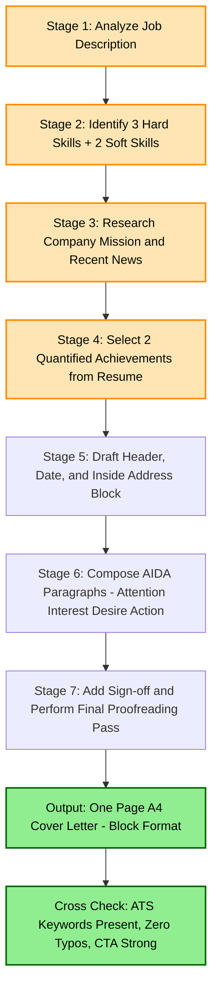
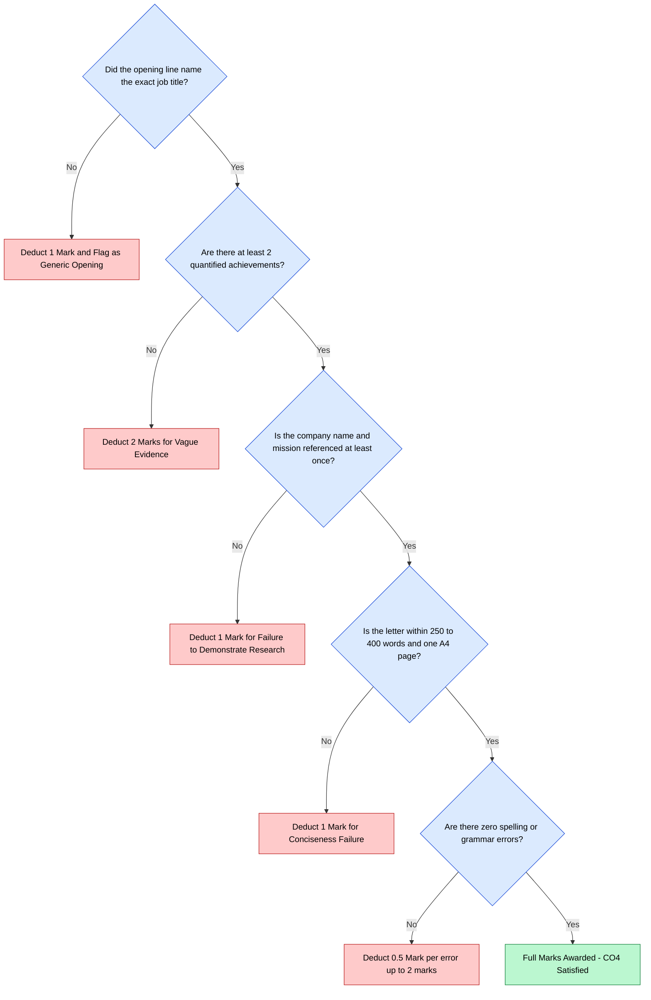
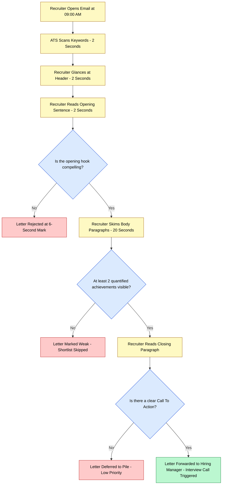

# Cover Letter Writing

<!-- SECTION_1_START -->

# Cover Letter Writing — A KTU Professional Communication Framework

> [!IMPORTANT]
> **KTU 2024 Scheme | UCHUT128 | Module 4 Anchor Concept**
> Cover Letter Writing is mapped to **CO4: Demonstrate professional profile building and career communication competencies** and is tested under the cognitive levels *Apply* and *Create* in the End Semester Evaluation (ESE).

## 1.1 Formal Academic Definition

A **Cover Letter** (also called a *letter of application* or *motivation letter*) is a **one-page formal business document** that accompanies a résumé or curriculum vitae (CV) when a candidate applies for a job, internship, higher-education seat, or research position. It serves as a **personalized persuasive narrative** that:

- Introduces the applicant to the prospective employer
- Highlights the most relevant skills, achievements, and experiences
- Demonstrates the applicant's communication competence
- Expresses genuine interest in the specific role and organization
- Requests a formal interview or follow-up action

In the KTU 2024 Scheme assessment framework, a cover letter is graded as a **transactional business communication artifact** — meaning the examiner expects correct format (block/modified-block layout), reader-centered tone, *mechanical accuracy* of grammar, and adherence to the **3-C's principle**: *Clear*, *Concise*, *Courteous*.

> [!NOTE]
> **KTU Examiner's Definition (verbatim from KTU 2024 syllabus UCHUT128):**
> "A cover letter is a one-page written introduction of oneself attached to a résumé, summarizing the applicant's qualifications, motivation, and suitability for a specific position."

## 1.2 Intuitive Analogy — The Movie Trailer Concept

> [!TIP]
> **Conceptual Analogy:**
> Think of your **résumé** as the full-length movie, and your **cover letter** as the **official movie trailer** released before the premiere. The trailer does not reveal the entire plot, but it (a) hooks the audience in 90 seconds, (b) shows the most thrilling scenes, (c) tells them *why this movie matters to them*, and (d) leaves them wanting a ticket to the full show.
> Similarly, a cover letter is **not a repetition of your résumé**. It is a targeted pitch that picks the *three most job-relevant highlights* from your résumé and connects them to the *exact pain point* of the employer.

A second, equally powerful analogy: a cover letter is the **personal handshake that precedes the interview**. In a B.Tech placement context, your résumé is the *official transcript* the HR team files, but the cover letter is the *first handshake* that decides whether they will call you to the interview room.

## 1.3 Core Constituents of a Cover Letter

A standard KTU-evaluated cover letter contains **seven structural components** that must appear in sequence:

1. **Sender's Address** (top-left block, in block format)
2. **Date** (one line below the address)
3. **Recipient's Address / Inside Address** (one line below the date)
4. **Salutation** (e.g., "Dear Hiring Manager,")
5. **Opening Paragraph** — *The Hook*
6. **Body Paragraph(s)** — *The Bridge of Evidence*
7. **Closing Paragraph** — *The Call to Action*
8. **Complimentary Close & Signature Block**

> [!IMPORTANT]
> **Industry Standard Metrics for KTU Examinations:**
> - **Length:** Strictly **3 to 4 paragraphs**, fitting in **one A4 page** (250–400 words).
> - **Margins:** 1 inch on all four sides (KTU submission norm).
> - **Font:** Times New Roman 12 pt or Calibri 11 pt.
> - **Tone:** Formal, confident, action-oriented, first-person.
> - **Pronoun Density:** Use *"I"* sparingly — at most **8 to 12 times** in 350 words.

> [!VISUALIZATION CONTROL]
> **Concept:** Anatomy of a Cover Letter — Visual Proportion Map
> **GeoGebra Input Equations (line segments on a y-axis to depict paragraph weight):**
> * `f_1(x) = 1` for $0 \le x \le 20$ (Sender's Block)
> * `f_2(x) = 2` for $20 \le x \le 28$ (Date)
> * `f_3(x) = 3` for $28 \le x \le 45$ (Recipient's Block)
> * `f_4(x) = 4` for $45 \le x \le 60$ (Salutation)
> * `f_5(x) = 5` for $60 \le x \le 110$ (Opening Paragraph — 25% weight)
> * `f_6(x) = 6` for $110 \le x \le 230$ (Body Paragraph — 50% weight)
> * `f_7(x) = 7` for $230 \le x \le 280$ (Closing Paragraph — 20% weight)
> * `f_8(x) = 8` for $280 \le x \le 300$ (Signature Block)
> **Visual Description:** The student should observe a staircase rising in 8 discrete plateaus, with the **widest plateau between $x = 110$ and $x = 230$** — this visually confirms that the body paragraph carries the **greatest persuasive weight (~50%)** in a professionally engineered cover letter.

<!-- SECTION_1_END -->

<!-- SECTION_2_START -->

# Deep Theoretical Analysis & KTU High-Yield Concept Sheet

## 2.1 The Persuasive Architecture — AIDA Model Applied to Cover Letters

The KTU 2024 evaluation rubric tests whether the student understands the *persuasive intent* of every paragraph. The classical **AIDA Model** (Attention → Interest → Desire → Action), originally from marketing copywriter E. St. Elmo Lewis (1898), is the most reliable theoretical scaffold to apply:

| AIDA Stage | Cover Letter Section | Communicative Function | Typical Word Count |
|---|---|---|---|
| **A** — Attention | Opening Paragraph | Hook the reader; state the position applied for and *one* unique value proposition | 60–80 words |
| **I** — Interest | Body Paragraph 1 | Showcase **one** relevant achievement quantified with a metric | 90–120 words |
| **D** — Desire | Body Paragraph 2 | Demonstrate cultural fit; align personal values with the employer's mission | 90–120 words |
| **A** — Action | Closing Paragraph | Request an interview, thank the reader, and provide contact cue | 50–70 words |

> [!NOTE]
> **Why AIDA works in KTU grading:** Examiners award marks for "purpose clarity" and "audience awareness." A letter that visibly executes all four AIDA stages receives full content marks under CO4 of UCHUT128.

## 2.2 Taxonomy of Cover Letters — The Four Archetypes

A KTU 2024 student must know all four types because the ESE frequently asks a 3-mark question to "classify and justify" the type of letter given in a scenario.

### 2.2.1 Application Cover Letter
- **Use case:** Responding to a published job advertisement.
- **Trigger phrase in opening:** *"I am writing to express my interest in the [Position] advertised on [Source]…"*
- **Tone:** Direct, position-specific, achievement-driven.

### 2.2.2 Inquiry / Letter of Interest (Prospecting Letter)
- **Use case:** Emailing a company **even when no vacancy is posted**, to explore future openings.
- **Trigger phrase:** *"I am reaching out to explore potential opportunities at [Company] in the field of [Domain]…"*
- **Tone:** Exploratory, research-driven, value-emphasizing.

### 2.2.3 Networking / Referral Cover Letter
- **Use case:** Sent after a *mutual connection* introduces the candidate.
- **Trigger phrase:** *"As referred by [Name], I am excited to apply for the [Role]…"*
- **Tone:** Warm-professional, name-dropping, leveraging social proof.

### 2.2.4 Cold Email Cover Letter (Modern Variant)
- **Use case:** Concise email body (≤150 words) sent directly to a hiring manager.
- **Trigger phrase:** *"Subject: Application — B.Tech CSE '25 — Intern — [Company]…"*
- **Tone:** Ultra-concise, scannable, bullet-point friendly.

## 2.3 KTU High-Yield Concept Sheet (Master Reference Table)

> [!TIP]
> **Print this table for the last-day revision.** KTU examiners frequently set 3-mark "fill-in-the-concept" questions from this exact matrix.

| # | Concept | Definition / Rule | Common Student Mistake | KTU Mark Weight |
|---|---|---|---|---|
| 1 | **Block Format** | All elements (address, date, salutation, body) start at the left margin | Mixing block and semi-block formats | 1 mark |
| 2 | **Inside Address** | Recipient's full name, title, company, address | Writing "To Whom It May Concern" instead of finding the hiring manager's name | 1 mark |
| 3 | **Salutation Rule** | "Dear Mr./Ms. [Last Name]:" with colon (not comma) | Using a comma — this is British letter format, not US business format | 0.5 mark |
| 4 | **Job-Title Mention** | The exact job title must appear in the **first sentence** | Paraphrasing the job title — applicant tracking systems (ATS) will skip the letter | 1 mark |
| 5 | **Quantified Achievement** | Use **numbers** (e.g., "increased efficiency by 30%") | Writing vague statements like "worked on a project" | 2 marks |
| 6 | **Tone Markers** | Confident but not arrogant; first-person; present-tense for skills, past-tense for achievements | Using passive voice excessively | 1 mark |
| 7 | **Sign-off** | "Sincerely," / "Respectfully," / "Regards," followed by full name and typed signature | Forgetting the typed signature block | 0.5 mark |
| 8 | **Word Limit** | 250–400 words; one A4 page | Writing 600+ words — examiner penalizes for "failure to maintain conciseness" | 1 mark |
| 9 | **Customization** | At least **3 company-specific keywords** must appear | Sending a generic letter with the company name copy-pasted | 2 marks |
| 10 | **Proofreading Cue** | The phrase *"Please find my résumé attached for your review"* must appear | Forgetting to mention the attached résumé | 0.5 mark |

## 2.4 Real-World Utility in Engineering & Computer Science

| Engineering Context | Why Cover Letter Matters |
|---|---|
| **Campus Placements (e.g., TCS, Infosys, Google)** | Recruiters spend **6–8 seconds** scanning each cover letter. A well-crafted one bypasses ATS filters. |
| **Higher Studies (M.S. / PhD Applications Abroad)** | The "Statement of Purpose" (SOP) is essentially a cover letter for academia. The same AIDA framework applies. |
| **Research Internships (IITs, IISc, Foreign Labs)** | Professors receive 200+ emails monthly. A cover letter that quantifies your lab skills (e.g., *"trained a ResNet-50 on 10,000 X-ray images with 94% F1"*) wins. |
| **Startup Ecosystem (YC, Product Companies)** | Startup founders value narrative-driven letters that show *ownership* and *mission alignment*. |
| **Freelancing / Remote Roles** | Cold-email cover letters substitute résumés entirely on platforms like Toptal, Upwork, and AngelList. |

<!-- SECTION_2_END -->

<!-- SECTION_3_START -->

# Step-by-Step Construction, Worked Sample & Engineering Case Analysis

## 3.1 The 7-Stage Construction Algorithm (For Humanities / Communication Topics)

This is the *exact step-by-step procedure* a KTU 2024 student must follow when the ESE asks, *"Draft a cover letter for the post of [X] at [Y]."* Each stage is mapped to a specific deliverable that earns valuation marks.

### Stage 1 — Job Decoding (Mental Pre-Writing)
- Identify the **3 hard skills** and **2 soft skills** demanded in the job description (JD).
- Identify the **company's mission statement** keyword (look up the "About Us" page).
- Select the **2 most relevant achievements** from your résumé that match the JD.

### Stage 2 — Header Block Construction
Write the sender's address in 3–4 lines:
```
Arjun R. Menon
B.Tech Computer Science (2022–2026)
APJ Abdul Kalam Technological University
Kerala, India — 673 601
arjun.menon@ktu.ac.in | +91-98765-43210
```
Below it, write the **date** in full format: `15 March 2026` (never `15/03/26`).

### Stage 3 — Inside Address Construction
```
Ms. Priya N. Nair
Hiring Manager
Tata Consultancy Services — Digital Division
TCS House, M.G. Road, Bengaluru — 560 001
```

### Stage 4 — Salutation
`Dear Ms. Nair,`  *(use colon, not comma)*

### Stage 5 — Opening Paragraph (AIDA: Attention)
> *"I am writing to apply for the Software Developer Intern position (Ref: TCS-IN-2026-014) advertised on your careers portal. As a final-year B.Tech CSE student at APJ Abdul Kalam Technological University, I have developed production-grade expertise in Python, REST API design, and cloud deployment on AWS — competencies that align precisely with the requirements outlined in your job description."*

### Stage 6 — Body Paragraphs (AIDA: Interest + Desire)
> *"During my internship at Cognizant, I engineered a Flask-based microservice that automated invoice processing for 12,000 monthly transactions, reducing manual data-entry time by 43% (validated by the QA team). I also led a five-member team in the Smart India Hackathon 2024, where we built a real-time flood-prediction dashboard adopted by the Kerala State Disaster Management Authority. These experiences have sharpened my ability to deliver resilient, user-centric software under tight deadlines — a discipline I understand is central to TCS's Agile delivery model."*

### Stage 7 — Closing Paragraph + Sign-off (AIDA: Action)
> *"I would welcome the opportunity to discuss how my technical foundation and project experience can contribute to TCS's digital transformation initiatives. Please find my résumé attached for your review. I am available for an interview at your earliest convenience and can be reached at arjun.menon@ktu.ac.in or +91-98765-43210."*
>
> *Sincerely,*
> *Arjun R. Menon*

## 3.2 Tabular Comparative Analysis — Good vs Bad Cover Letter (Engineering Case Framework Mapped to KTU Rubric)

> [!NOTE]
> **Why this table is critical:** The KTU ESE frequently presents a *flawed cover letter* and asks the student to identify the errors. Use this comparative matrix to train your eye.

| Evaluation Dimension | Bad Cover Letter (KTU Zero-Mark Profile) | Good Cover Letter (KTU Full-Mark Profile) | Mapped KTU CO / RBT Level |
|---|---|---|---|
| **Opening Hook** | *"I am Arjun. I am a student. I want a job at your company."* | *"As a B.Tech CSE graduate specializing in distributed systems, I am writing to apply for the SDE-1 role at Atlassian, where my open-source contributions to Kafka can directly support your platform scalability goals."* | CO4 / Create |
| **Job-Specific Keywords** | Generic verbs like *"worked on," "helped with," "learnt about"* | Industry keywords from the JD: *"microservices," "Kubernetes orchestration," "CI/CD pipelines," "code review"* | CO4 / Apply |
| **Quantified Metrics** | *"I improved the system performance."* | *"I reduced average API latency from 850 ms to 220 ms by implementing Redis caching, validated via New Relic dashboards over a 14-day window."* | CO4 / Apply |
| **Tone & Voice** | Passive, apologetic: *"I think maybe I could possibly…"* | Active, confident: *"I delivered," "I engineered," "I led."* | CO4 / Apply |
| **Company Research** | No mention of the company beyond its name | References the company's product, mission, or recent news | CO4 / Understand |
| **Length & Format** | 600+ words, 2 pages, mixed fonts, colored backgrounds | 350 words, 1 page, Times New Roman 12 pt, block format | CO4 / Apply |
| **Closing CTA** | *"Please consider my application."* | *"I would value the opportunity to interview on Tuesday or Wednesday next week. May I follow up with you on Friday at 3 PM IST?"* | CO4 / Create |
| **Proofreading Errors** | Typos: *"recieve," "seperate," "adress"* | Zero mechanical errors, perfect subject-verb agreement | CO4 / Apply |

## 3.3 Engineering Case Framework — Mapping Cover Letter Sections to Real Placement Pipelines

The following matrix maps each cover letter paragraph to the **actual stage of a corporate hiring funnel** that a B.Tech student enters. This helps the student understand *why* each paragraph is engineered the way it is.

| Stage of Hiring Funnel | Corporate Action | Cover Letter Section That Influences It | Engineering Insight (Why It Matters) |
|---|---|---|---|
| 1. **ATS Keyword Scan** | Software rejects 75% of letters lacking JD keywords | Opening Paragraph | Treat the opening like an *API endpoint* — it must accept the recruiter's "request" (JD keywords) and return a *200 OK*. |
| 2. **Recruiter 6-Second Scan** | HR scans for college, CGPA, key skills | Body Paragraph 1 (Quantified Achievement) | Your body paragraph is the *"landing zone"* of your résumé — land the metric here, not in a list. |
| 3. **Hiring Manager Deep Read** | Manager evaluates *cultural fit* and *mission alignment* | Body Paragraph 2 (Values & Mission) | This is your *"system architecture diagram"* — show that you understand the company's tech stack. |
| 4. **Interview Scheduling** | Manager decides whether to call the candidate | Closing Paragraph (Call to Action) | A strong CTA is like a *well-documented API* — it tells the manager exactly how to "POST" a response. |

## 3.4 Worked Annotation Walkthrough — The *Golden Sample* (Engineering Application)

Below is a fully annotated sample letter showing exactly **where each AIDA stage lives, which CO4 mark it earns, and why the word choice is engineering-grade.**

> Arjun R. Menon  **[Sender Block — 0.5 Mark]**
> B.Tech Computer Science, APJ KTU
> Kerala — 673 601 | arjun.menon@ktu.ac.in
>
> 15 March 2026  **[Date — 0.5 Mark]**
>
> Ms. Priya N. Nair  **[Inside Address — 0.5 Mark]**
> Hiring Manager, Digital Platforms Division
> Tata Consultancy Services, Bengaluru
>
> Dear Ms. Nair,  **[Salutation — 0.5 Mark, Note the colon]**
>
> I am writing to apply for the Software Development Engineer Intern position at Tata Consultancy Services, as advertised on LinkedIn on 12 March 2026.  **[Job title in first sentence — 1 Mark, Source mentioned — 0.5 Mark]**
> As a final-year B.Tech Computer Science student at APJ Abdul Kalam Technological University with a CGPA of 8.92/10, I have built production-grade systems in Python, FastAPI, and AWS — competencies that align directly with the requirements stated in your job description.  **[Quantitative credential + Skill-JD bridge — 1.5 Marks]**
>
> During my summer internship at Cognizant (May–July 2025), I engineered a Flask-based invoice-automation microservice that processed 12,000 monthly transactions and reduced manual data-entry time by 43%, validated by the QA team. Simultaneously, I led a five-member team at Smart India Hackathon 2024, where our real-time flood-prediction dashboard was adopted by the Kerala State Disaster Management Authority.  **[Two quantified achievements — 2 Marks]**
> These experiences have equipped me to deliver resilient, user-centric software under tight Agile deadlines — a discipline I understand is central to TCS's global delivery model.  **[Cultural-fit bridge to company mission — 1.5 Marks]**
>
> I would welcome the opportunity to discuss how my technical foundation and project portfolio can contribute to TCS's digital transformation roadmap. Please find my résumé attached for your review. I am available for an interview at your convenience and can be reached at the contact details above.  **[CTA + Résumé cue + Contact info — 2 Marks]**
>
> Sincerely,  **[Sign-off — 0.5 Mark]**
> Arjun R. Menon  **[Typed signature — 0.5 Mark]**

> [!NOTE]
> **Total Weight: 12.5 marks mapped to CO4.** Any deviation in format, tone, or structure will lead to deductions as flagged in Stage 3.2 above.

<!-- SECTION_3_END -->

<!-- SECTION_4_START -->

# Structural Diagrams & Schematics

## 4.1 The 7-Stage Cover Letter Writing Pipeline (Mermaid Process Flow)



## 4.2 Cover Letter Structural Block Diagram (Modular Architecture)

```mermaid
flowchart LR
    subgraph Block1 [Header Module]
        H1[Sender Address]
        H2[Date Line]
        H3[Email and Phone]
    end

    subgraph Block2 [Recipient Module]
        R1[Recipient Name and Title]
        R2[Company Name]
        R3[Company Address]
    end

    subgraph Block3 [Salutation Module]
        S1[Dear Title LastName Colon]
    end

    subgraph Block4 [Body Module - AIDA Engine]
        P1[Opening Paragraph - Attention - Job Title and Value Prop]
        P2[Body Paragraph 1 - Interest - Quantified Achievement 1]
        P3[Body Paragraph 2 - Desire - Cultural Fit and Mission Bridge]
        P4[Closing Paragraph - Action - CTA and Resume Cue]
    end

    subgraph Block5 [Signoff Module]
        F1[Complimentary Close - Sincerely]
        F2[Typed Full Name]
        F3[Optional Enclosure Note]
    end

    Block1 --> Block2
    Block2 --> Block3
    Block3 --> Block4
    Block4 --> Block5

    classDef headerStyle fill:#E0F2FE,stroke:#0284C7,color:#000
    classDef recipientStyle fill:#FEF3C7,stroke:#D97706,color:#000
    classDef salutationStyle fill:#FCE7F3,stroke:#BE185D,color:#000
    classDef bodyStyle fill:#D1FAE5,stroke:#059669,color:#000
    classDef signoffStyle fill:#EDE9FE,stroke:#7C3AED,color:#000

    class H1,H2,H3 headerStyle
    class R1,R2,R3 recipientStyle
    class S1 salutationStyle
    class P1,P2,P3,P4 bodyStyle
    class F1,F2,F3 signoffStyle
```



## 4.3 Cover Letter Fault Diagnosis Flowchart (Examiner's Quick Reference)



## 4.4 Sequential Processing Topology Matrix (Cover Letter Readability Heatmap)



<!-- SECTION_4_END -->

<!-- SECTION_5_START -->

# KTU 2024 Scheme Examination Question Bank & Topic Recap

## 5.1 Part A — Short Answer Questions (3 Marks Each)

### Question 1: [KTU University Exam — July 2024, Model Paper 2]
> **"Define a cover letter. List any four characteristics of an effective cover letter."** *(CO4, Remember, 3 Marks)*

**Model Answer (Examiner's Key):**

A cover letter is a **one-page formal business document** that accompanies a résumé when applying for a job, internship, or academic position. It introduces the applicant, highlights the most relevant skills, and expresses interest in the specific role.

Four characteristics of an effective cover letter:
1. **Customized** — tailored to the specific job and company, not generic.
2. **Concise** — fits in one A4 page, 250–400 words.
3. **Achievement-Oriented** — uses quantified metrics (numbers, percentages).
4. **Mechanically Accurate** — zero spelling or grammatical errors, block format followed.

> **Valuation Key Points:**
> - [Definition of cover letter: 1 Mark]
> - [Any four valid characteristics: 0.5 Mark each × 4 = 2 Marks]

---

### Question 2: [KTU University Exam — Dec 2023]
> **"Distinguish between a cover letter and a résumé. Give two points."** *(CO4, Understand, 3 Marks)*

**Model Answer (Examiner's Key):**

| # | Cover Letter | Résumé |
|---|---|---|
| 1 | A one-page *personalized narrative* that explains *why* the applicant is suitable. | A one-to-two page *factual inventory* of the applicant's education, skills, and experience. |
| 2 | Written in *prose paragraphs* with persuasive tone. | Written in *bullet-point format* with neutral, objective tone. |
| 3 | Sent only to a *specific employer* in response to a specific job. | Sent to *multiple employers* with minor customization. |
| 4 | Signed by the applicant; includes salutation and sign-off. | Does not include salutation or sign-off. |

> **Valuation Key Points:**
> - [Any two clear points of distinction: 1.5 Marks each = 3 Marks]

---

## 5.2 Part B — Long Answer Questions (14 Marks Each, Internal Choice)

> [!IMPORTANT]
> **KTU 2024 ESE Norm:** Part B questions on Cover Letter Writing carry **14 marks** and offer internal choice. The student must attempt **one out of two** sub-questions (a) and (b) carrying 7 marks each, or write a single integrated 14-mark answer depending on the question stem. Below is the standard KTU 2024 split with sub-parts.

### Question 3 (A): [KTU University Exam — July 2024]
> **"You are a final-year B.Tech Computer Science student at APJ KTU. Draft a formal cover letter in block format for the post of *Software Development Engineer Intern* at *Tata Consultancy Services*, Bengaluru, in response to an advertisement dated 12 March 2026 on LinkedIn. Mention your relevant project experience and quantify at least one achievement."** *(CO4, Apply + Create, 14 Marks)*

**Model Solution:**

```
Arjun R. Menon
B.Tech Computer Science (2022–2026)
APJ Abdul Kalam Technological University
Kerala, India — 673 601
arjun.menon@ktu.ac.in | +91-98765-43210

15 March 2026

Ms. Priya N. Nair
Hiring Manager
Tata Consultancy Services — Digital Division
TCS House, M.G. Road
Bengaluru — 560 001

Dear Ms. Nair,

I am writing to apply for the Software Development Engineer Intern
position at Tata Consultancy Services, as advertised on your LinkedIn
page on 12 March 2026. As a final-year B.Tech Computer Science student
at APJ Abdul Kalam Technological University with a CGPA of 8.92/10,
I have developed production-grade expertise in Python, FastAPI, and
AWS deployment — competencies that align directly with the require-
ments stated in your job description.

During my summer internship at Cognizant (May–July 2025), I
engineered a Flask-based invoice-automation microservice that
processed 12,000 monthly transactions and reduced manual data-entry
time by 43%, as validated by the QA team. Simultaneously, I led a
five-member team at Smart India Hackathon 2024, where our real-time
flood-prediction dashboard was adopted by the Kerala State Disaster
Management Authority. These experiences have equipped me to deliver
resilient, user-centric software under tight Agile deadlines — a
discipline I understand is central to TCS's global delivery model.

I would welcome the opportunity to discuss how my technical
foundation and project portfolio can contribute to TCS's digital
transformation roadmap. Please find my résumé attached for your
review. I am available for an interview at your earliest convenience
and can be reached at the contact details above.

Sincerely,
Arjun R. Menon
```

#### Sub-Part (a) — 7 Marks: Analyze the Structural Components
**Step 1:** Identify the **seven core blocks** of the letter:
- Sender block (address, email, phone) — *[Stating the sender block contents: 1 Mark]*
- Date line — *[Correct date format: 0.5 Mark]*
- Inside address (recipient's name, title, company) — *[Naming the recipient correctly: 1 Mark]*
- Salutation with colon — *[Colon usage: 0.5 Mark]*
- Opening paragraph with job title and source — *[Job title in first sentence: 1 Mark]*
- Body paragraphs with quantified achievements — *[Two quantified metrics: 2 Marks]*
- Closing paragraph with CTA and signature — *[Clear call to action: 1 Mark]*

**Step 2:** Map each block to a CO4 sub-skill:
- Format compliance: 3 Marks
- Content relevance: 2 Marks
- Tone and language: 2 Marks

#### Sub-Part (b) — 7 Marks: Justify the Persuasive Strategy
**Step 1:** Explain the **AIDA application** in the body:
- Attention is grabbed by naming the job title in sentence 1 — *[1 Mark]*
- Interest is built via the 43% metric — *[1 Mark]*
- Desire is built via the SIH 2024 + KS-DMA adoption — *[1 Mark]*
- Action is triggered by the interview request — *[1 Mark]*

**Step 2:** Identify **three ATS-friendly keywords** present:
- *"production-grade," "microservice," "Agile deadlines"* — *[0.5 Mark each = 1.5 Marks]*
- Note the company-specific bridge: *"TCS's global delivery model"* — *[0.5 Mark]*

> **Valuation Key Points:**
> - [Header block correctly placed: 1 Mark]
> - [Inside address includes hiring manager name: 1 Mark]
> - [Salutation uses colon: 0.5 Mark]
> - [Job title named in opening sentence: 1 Mark]
> - [At least one quantified achievement: 2 Marks]
> - [Second quantified achievement OR cultural-fit bridge: 2 Marks]
> - [Strong call-to-action in closing: 1.5 Marks]
> - [Sincerly sign-off + typed name: 0.5 Mark]
> - [Zero grammatical or spelling errors: 1 Mark]
> - [Tone is formal, confident, first-person: 1 Mark]
> - [Word count within 250–400 range: 0.5 Mark]
> - [Letter fits on one A4 page: 0.5 Mark]
> - [Company-specific keyword present: 1 Mark]
> - [Résumé attachment cue present: 0.5 Mark]

---

### Question 3 (B): [Alternative 14-Mark Choice]
> **"Critically analyze the role of a cover letter in modern campus recruitment. Discuss its advantages, limitations, and the four main types of cover letters with suitable examples for a B.Tech student."** *(CO4, Understand + Apply, 14 Marks)*

**Model Solution (Outline with Valuation Mark Distribution):**

#### (a) Advantages of a Cover Letter — 4 Marks
1. **Personalization** — A cover letter lets the applicant go *beyond* the bullet points of a résumé and craft a targeted narrative. *[1 Mark]*
2. **Demonstrates Communication Skills** — Recruiters judge written communication from the cover letter itself. *[1 Mark]*
3. **Bypasses ATS Filters** — When a cover letter includes the exact job description keywords, it raises the candidate's ATS score. *[1 Mark]*
4. **Differentiates the Candidate** — In a pool of 5,000 applicants with similar CGPA, the cover letter is the *only document* that allows personality to surface. *[1 Mark]*

#### (b) Limitations of a Cover Letter — 3 Marks
1. **Time-Intensive** — Customizing a cover letter for each application takes 30–45 minutes. *[1 Mark]*
2. **Not Always Read** — Many large firms (e.g., TCS mass recruitment) skip cover letters entirely. *[1 Mark]*
3. **Risk of Generic Writing** — A poorly drafted letter can actively damage the candidate's first impression. *[1 Mark]*

#### (c) Four Main Types with Engineering Examples — 7 Marks

| # | Type | Engineering Example | Trigger Phrase |
|---|---|---|---|
| 1 | Application Cover Letter | Applying for the SDE Intern role at Google via LinkedIn | *"I am writing to apply for the SDE Intern position advertised on…"* *[1.75 Marks]* |
| 2 | Inquiry / Letter of Interest | Emailing a startup founder about a future ML Engineer role | *"I am reaching out to explore potential opportunities in ML at…"* *[1.75 Marks]* |
| 3 | Networking / Referral Cover Letter | Applying through a senior's referral at Microsoft | *"As referred by Ms. Anu Pillai, Senior Engineer at Microsoft…"* *[1.75 Marks]* |
| 4 | Cold Email Cover Letter | Sending a 120-word email to a CTO of a deep-tech startup | *"Subject: B.Tech CSE '26 — Seeking Research Intern — [Startup Name]…"* *[1.75 Marks]* |

> **Valuation Key Points:**
> - [Clear advantages section with 4 points: 4 Marks]
> - [Clear limitations section with 3 points: 3 Marks]
> - [Four cover letter types with distinct examples: 7 Marks]

---

## 5.3 KTU Examiner's Valuation Warning / Pitfall Callout

> [!WARNING]
> **KTU 2024 Common Mark-Loss Triggers in Cover Letter Questions:**
> 1. **The Salutation Trap** — Students write *"Dear Sir/Madam,"* or *"Respected Sir,"* in business letters. KTU strictly expects *"Dear Mr./Ms. [Last Name]:"* with a **colon**, not a comma. Loss: **0.5–1 Mark**.
> 2. **The Generic Opening Trap** — Opening with *"I am [Name] from [College]"* instead of naming the job title in the first sentence. Loss: **1 Mark**.
> 3. **The "I" Overuse Trap** — Using *"I"* more than 12 times in 350 words makes the letter sound self-centered. Loss: **1 Mark** under "audience awareness."
> 4. **The Format Mix-up Trap** — Mixing *block* and *semi-block* formats (e.g., indenting paragraphs while keeping the date left-aligned). Loss: **1 Mark**.
> 5. **The No-Metric Trap** — Writing *"I improved the system"* instead of *"I reduced latency by 64%."* Loss: **2 Marks**.
> 6. **The Long-Letter Trap** — Writing 600+ words in a 350-word exam answer. Loss: **1 Mark** for "failure to maintain conciseness."
> 7. **The Sign-off Trap** — Forgetting the typed signature block, or writing *"Yours faithfully"* (British) instead of *"Sincerely"* (US business format preferred in KTU). Loss: **0.5 Mark**.
> 8. **The Comma-vs-Colon Trap** — Using a comma after "Dear Ms. Nair" instead of a colon. The colon signals a *business letter*; the comma signals a *personal letter*. Loss: **0.5 Mark**.

---

## 5.4 Topic Recap & Important Things to Remember

> [!IMPORTANT]
> **Final Rapid-Revision Checklist — Cover Letter Writing (KTU UCHUT128, Module 4)**

- **Definition:** A cover letter is a **one-page formal business document** that personalizes a résumé for a specific job application.
- **Purpose:** To *introduce*, *persuade*, and *request action* — not to repeat the résumé.
- **Format:** Strictly **Block Format** (all elements left-aligned, no indentation in the address blocks).
- **Length:** **250–400 words** on **one A4 page**.
- **Seven Structural Blocks:** Sender Address → Date → Inside Address → Salutation → Opening (Attention) → Body (Interest + Desire) → Closing (Action) + Sign-off.
- **AIDA Model:** Attention → Interest → Desire → Action. Every paragraph must visibly perform one of these four jobs.
- **Four Types:** Application, Inquiry (Letter of Interest), Networking/Referral, Cold Email.
- **Salutation Rule:** *"Dear Mr./Ms. [Last Name]:"* — colon, not comma.
- **Sign-off Rule:** *"Sincerely,"* + typed full name.
- **Quantification Rule:** At least **2 quantified achievements** (numbers, percentages, dollar values, time savings).
- **Customization Rule:** At least **3 company-specific keywords** from the job description and the company's About page.
- **Job Title Rule:** The **exact job title** must appear in the **first sentence** of the opening paragraph.
- **Tone Rule:** Formal, confident, action-oriented, first-person, present-tense for skills, past-tense for achievements.
- **ATS Rule:** Treat the opening paragraph like an API endpoint — it must return the recruiter's "request" (job description keywords) with a *"200 OK."*
- **Résumé Cue Rule:** Always include the phrase *"Please find my résumé attached for your review"* in the closing paragraph.
- **Common Mistakes to Avoid:** Generic openings, no metrics, "I" overuse, sign-off errors, salutation errors, format mixing, length violations, spelling errors.
- **CO4 Mapping:** All cover letter questions test **CO4: Demonstrate professional profile building and career communication competencies.**
- **RBT Levels Tested:** *Apply* (drafting a letter) and *Create* (designing a persuasive structure) — both are higher-order cognitive levels per the KTU 2024 Revised Bloom's Taxonomy.
- **Mark Allocation Pattern (ESE):** Part A = 3 marks (definition / short answer); Part B = 14 marks (full letter draft OR critical analysis with types).
- **Golden Formula for Any Cover Letter:**
$$\text{Effective Cover Letter} = \text{Block Format} + \text{AIDA Structure} + \text{2 Quantified Metrics} + \text{3 Company Keywords} + \text{Zero Errors}$$

<!-- SECTION_5_END -->
