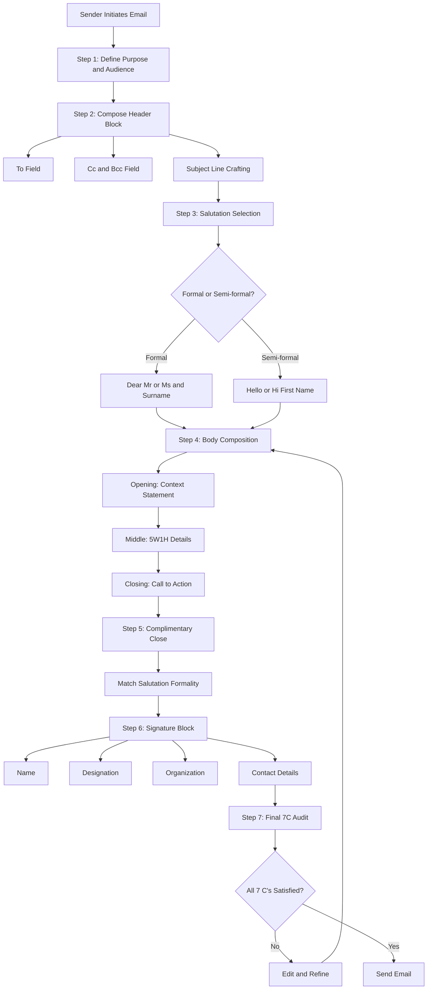
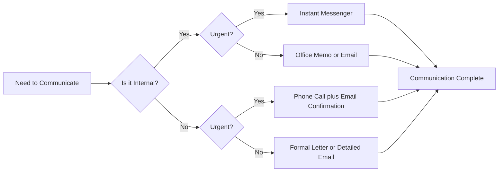
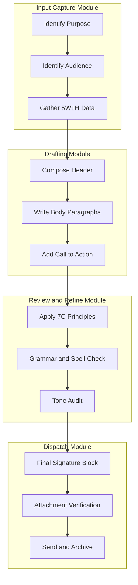
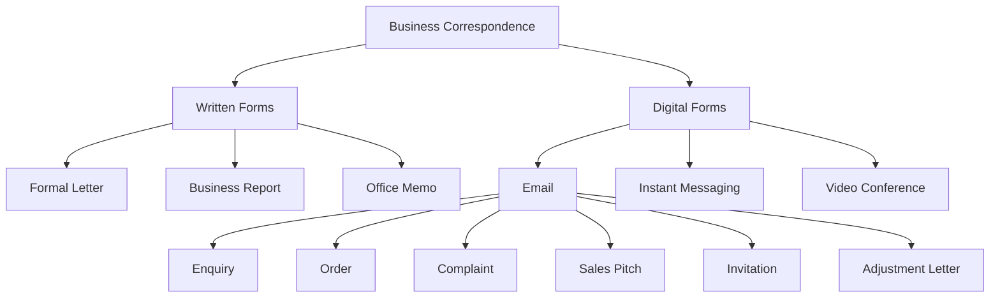

# Email Writing and Business Correspondence

<!-- SECTION_1_START -->
# Email Writing and Business Correspondence

## 1. Core Technical Definition & Intuitive Overview

### 1.1 Formal Academic Definition

**Email Writing** is the structured, concise, and purpose-driven composition of digital asynchronous messages transmitted over the internet, governed by netiquette standards, professional tone conventions, and institutional communication protocols. In the context of **Business Correspondence (BC)**, it refers to the exchange of written communication between professionals, organizations, clients, and stakeholders to facilitate commercial, administrative, legal, and operational transactions.

> [!IMPORTANT]
> **KTU 2024 Syllabus Definition (UCHUT128 – Module 4):**
> Business Correspondence encompasses all forms of written communication used in a professional environment, including **emails**, **letters**, **memos**, **circulars**, **notices**, **minutes of meetings**, and **reports**. Email writing is the most dominant form in contemporary professional practice and is graded in KTU examinations on the parameters of **format, tone, clarity, brevity, correctness, and purpose alignment**.

### 1.2 Conceptual Analogy / Intuition

Think of an email as a **"digital telegram wrapped inside a registered postal letter"**:

- The **subject line** is the *envelope* — it tells the recipient what is inside before they open it.
- The **salutation** is the *door knocker* — it announces the sender politely.
- The **body** is the *living room conversation* — structured, polite, and to the point.
- The **closing and signature block** is the *handshake and business card exchange* — it leaves a professional impression.

Just as a poorly addressed letter never reaches its destination, a poorly written email (wrong subject, missing CC, no signature) fails to achieve its communicative purpose. Business correspondence is therefore the **architecture of professional intent** — every paragraph, every punctuation mark, and every sign-off contributes to the message's credibility.

> [!NOTE]
> **Industry Metric (Statista 2024):** Approximately **$361 billion** emails are sent daily worldwide, and an average corporate employee receives around **$120$** emails per day. The **average attention span** of a reader on a business email is just **$8$ seconds**. This justifies the **BLUF (Bottom Line Up Front)** technique used in professional writing.

### 1.3 Core Constants and Standards

- **Salutation Standard:** Use *Dear Mr./Ms. [Surname]* for formal, *Hi [First Name]* for semi-formal internal mails.
- **Closing Standard:** *Yours sincerely* (when the recipient's name is known) and *Yours faithfully* (when using *Dear Sir/Madam*).
- **Standard Font and Size:** **Arial / Calibri / Times New Roman, 11 or 12 pt**.
- **Email Length:** Keep under **$150$ words** for general communication; a **$5$-sentence rule** is preferred for clarity.
- **Tone Marker:** **Formal–Neutral (register level 3–4 on a 5-point formality index)**.

> [!VISUALIZATION CONTROL]
> **Concept:** Email Anatomy as a Layered Information Stack
> **GeoGebra / Desmos Input Equations:**
> * $f(x) = 5$ representing the five fixed layers of an email (Subject, Salutation, Body, Closing, Signature)
> * $x$ axis: Sequence of appearance from top to bottom
> * $y$ axis: Hierarchy of importance ($1$ = critical, $5$ = supporting)
> **Visual Description:** A descending staircase where the Subject line (Layer $1$) sits at the top with maximum visibility, followed by a Salutation (Layer $2$), Body (Layer $3$), Closing (Layer $4$), and Signature (Layer $5$) — the student should observe that skipping any layer creates an unbalanced, unprofessional email.

<!-- SECTION_1_END -->

<!-- SECTION_2_START -->
# Deep Theoretical Analysis & KTU High-Yield Cheat Sheet

## 2.1 The 7 C's of Effective Business Correspondence

The **7 C's Framework** is the foundational rubric used by the KTU Board Examiners to evaluate any piece of business writing — letters, emails, memos, or reports. Each "C" represents a non-negotiable quality parameter.

| # | Principle | Operational Definition | Common Violation in Student Scripts |
|---|-----------|------------------------|--------------------------------------|
| 1 | **Clarity** | Message is immediately understandable; no ambiguity in purpose. | Using vague phrases like *"I am writing to inform you about the thing we discussed."* |
| 2 | **Conciseness** | Delivers the message using the minimum necessary words. | Repeating the same point in multiple paragraphs. |
| 3 | **Correctness** | Accurate facts, grammar, spelling, punctuation, and data. | Spelling errors in the recipient's name, wrong dates. |
| 4 | **Courtesy** | Respectful, polite, and empathetic tone throughout. | Demanding or accusatory language (*"You failed to..."*). |
| 5 | **Concreteness** | Specific facts, figures, dates, and evidence rather than generalizations. | *"We had a meeting recently"* instead of *"On $15$ th October $2024$, the review meeting was held."* |
| 6 | **Consideration** | Reader-centric approach; focus on the recipient's needs (*You-attitude*). | Overuse of *I, me, my* instead of *you, your, we*. |
| 7 | **Completeness** | All necessary information (the $5W1H$ — Who, What, When, Where, Why, How) is provided. | Missing call-to-action, missing attachments, missing deadlines. |

> [!IMPORTANT]
> **KTU Valuation Key Insight:** Examiners allocate **1 mark per "C"** in long-answer questions on business correspondence. A response that demonstrates all 7 C's typically scores a full $7$ marks on the content criterion, with the remaining $7$ marks reserved for format, language, and tone.

## 2.2 Anatomical Structure of a Professional Email

A professional email is a **five-block architecture**. Each block has a fixed position and a non-negotiable content expectation.

$$
\text{Professional Email} = \{\text{Header Block}\} \cup \{\text{Salutation}\} \cup \{\text{Body}\} \cup \{\text{Complimentary Close}\} \cup \{\text{Signature Block}\}
$$

### Block 1 — The Header Block (Metadata Layer)
- **To:** Primary recipient(s).
- **Cc:** Carbon copy — recipients who need to be informed but are not the primary audience.
- **Bcc:** Blind carbon copy — confidential informants whose identity is hidden.
- **Subject:** A precise, action-oriented headline (e.g., *"Request for Leave Approval — $18$ th October"* not just *"Leave"*).

### Block 2 — Salutation
- Formal: *Dear Mr. Sharma,* / *Dear Ms. Lakshmi,*
- Semi-formal: *Hello Rahul,*
- Group: *Dear Team,* / *Dear All,*

### Block 3 — Body Paragraphs (The CORE Engine)
The body follows the **AIDA / BLUF** structure:
$$
\text{Body} = \underbrace{\text{Opening}}_{\text{Context/Reason}} \rightarrow \underbrace{\text{Middle}}_{\text{Details/Action Items}} \rightarrow \underbrace{\text{Closing}}_{\text{Call to Action}}
$$

### Block 4 — Complimentary Close
- *Yours sincerely,* (name known)
- *Yours faithfully,* (name unknown)
- *Regards,* / *Best regards,* (semi-formal)
- *Thank you,* (courteous neutral)

### Block 5 — Signature Block
Contains full name, designation, organization, contact number, and official email/website.

## 2.3 Classification of Business Correspondence

KTU Module $4$ classifies business correspondence into **two broad categories** based on the medium and **six sub-categories** based on the purpose.

| Medium Type | Format | Typical Use |
|-------------|--------|-------------|
| **Internal Correspondence** | Memos, circulars, notices, minutes | Within the same organization |
| **External Correspondence** | Business letters, formal emails | Between organizations or with clients |

| Purpose Type | Function | Sample Phrasing |
|-------------|----------|-----------------|
| **Enquiry** | Requesting information | *"We would like to enquire about..."* |
| **Order** | Placing a purchase request | *"Please supply the following items..."* |
| **Complaint** | Registering dissatisfaction | *"We regret to bring to your notice..."* |
| **Adjustment / Claim** | Resolving a complaint | *"We acknowledge the lapse and assure you..."* |
| **Sales** | Promoting a product/service | *"We are pleased to introduce our new..."* |
| **Invitation / Notice** | Calling for action/event | *"You are cordially invited to..."* |

## 2.4 KTU High-Yield Cheat Sheet

| Parameter | Standard Rule | KTU Board Expectation |
|-----------|---------------|------------------------|
| Subject Line | $6$–$10$ words, capitalized keywords | Mandatory; missing subject = $0.5$ mark deduction |
| Salutation | *Dear* + Title + Surname + comma | Avoid *"Hi"* or *"Hey"* in formal emails |
| Paragraphing | One idea per paragraph; max $3$–$4$ sentences | Single-block emails lose marks on structure |
| Tone Register | Formal–Neutral; no slang, no emojis | One slang word = tonal inconsistency = $-1$ mark |
| Closing Phrase | Match salutation formality | *Dear Sir* must end with *Yours faithfully* |
| Signature Block | Name, Designation, Organization, Contact | Missing contact info = incomplete ($-1$ mark) |
| Action Verbs | Use *request, confirm, acknowledge, appreciate* | Avoid *want, need, must* (sound demanding) |
| Date Format | *$15$ th October $2024$* or *$15/10/2024$* | Never *15-10-24* in formal letters |
| Reference Line | Previous communication reference number | Mandatory in reply letters |
| Enclosure Note | *Encl:* or *Enc:* at the bottom | Required if any attachment is mentioned |

> [!NOTE]
> **Real-World Engineering Utility:** In IT services, project managers use the **5S Email Protocol** (Subject, Salutation, Statement, Solution, Sign-off). In software engineering teams, the **BLUF principle** is embedded into tools like Jira and ServiceNow ticketing systems. Mastery of business correspondence is a **KPI (Key Performance Indicator)** in nearly all corporate communication rubrics and is a tested skill in KTU's **CO4: Communicate effectively in professional contexts** under the UCHUT128 course outcome framework.

<!-- SECTION_2_END -->

<!-- SECTION_3_START -->
# Step-by-Step Derivations, Templates, and Comparative Analysis

## 3.1 Comparative Analysis: Formal Email vs. Formal Letter vs. Memo

The following table provides a KTU-style exhaustive comparative matrix mapping the **regulatory format standards** of three different business correspondence mediums.

| Dimension | Formal Email | Formal Business Letter | Office Memorandum (Memo) |
|-----------|--------------|------------------------|---------------------------|
| **Medium** | Digital (instant delivery) | Physical / Printed | Internal digital or printed |
| **Header** | *To, Cc, Bcc, Subject* | Sender's address, Date, Receiver's address, Subject, Reference | *To, From, Date, Subject* (no salutation needed) |
| **Salutation** | *Dear Mr. X,* | *Dear Sir/Madam,* or *Dear Mr. X,* | Often omitted; sometimes *"Team,"* |
| **Subject Line** | Mandatory and front-loaded | Optional but recommended | Mandatory and pre-formatted |
| **Tone** | Semi-formal to formal | Highly formal | Concise and direct |
| **Length** | $100$–$200$ words | $150$–$300$ words | $50$–$150$ words |
| **Signature** | Digital signature block | Handwritten signature + designation | Name and designation only |
| **Closing** | *Regards,* / *Best,* | *Yours sincerely/faithfully* | No closing required |
| **Use Case** | Quick professional communication | Legal, contractual, official records | Internal team communication |
| **CC/BCC** | Supported natively | Not applicable | Not applicable |
| **Attachment Support** | Yes (files, links) | Enclosures mentioned as *Encl:* | Sometimes via attached files |
| **KTU Weightage** | Highest in Module 4 | Moderate (covered in Module 1) | Low (overview only) |
| **Examiner Tip** | Subject line carries $1$ mark | Sender's address carries $0.5$ mark | "To" and "From" carry $0.5$ mark each |

## 3.2 The 5-Paragraph Email Construction Algorithm

For a $14$-mark KTU question requiring a student to draft a business email, the examiner awards marks across five well-defined content slots. Below is the deterministic algorithm a student should follow:

### Step 1 — Establish the Header (Valuation: 2 marks)
Begin with the metadata block, ensuring the subject line is specific and action-oriented. A vague subject line like *"Meeting"* loses $0.5$ mark.

$$
\text{Header Score} = f(\text{Subject Quality}) + f(\text{Recipient Address})
$$

### Step 2 — Open with Purpose Context (Valuation: 2 marks)
The opening sentence must immediately state *why* the email is being written. Use transitional openers like:
- *"With reference to your advertisement..."*
- *"Further to our telephonic conversation on [Date]..."*
- *"I am writing on behalf of [Organization] to..."*

### Step 3 — Develop the Body Details (Valuation: 5 marks)
The body must contain the **$5W1H$** information framework:

$$
\text{Body Completeness} = \sum_{i=1}^{6} W_i \quad \text{where } W_i \in \{0, 1\}
$$

| Element | Description | Example |
|---------|-------------|---------|
| **Who** | Person/Organization involved | *"the Procurement Manager"* |
| **What** | Subject matter | *"supply of laboratory equipment"* |
| **When** | Date/Deadline | *"on or before $25$ th October $2024$"* |
| **Where** | Location/Venue | *"at the Central Store, Block A"* |
| **Why** | Purpose/Reason | *"for the upcoming Annual Tech Fest"* |
| **How** | Method/Process | *"via courier within $3$ working days"* |

### Step 4 — Conclude with a Call to Action (Valuation: 2 marks)
A professional email must end with a specific, polite request. Avoid passive closings.

- *Awaiting your prompt response.*
- *Kindly confirm receipt at the earliest.*
- *Please let me know if any clarification is needed.*

### Step 5 — Close with Sign-off and Signature (Valuation: 3 marks)
The signature block must include **four mandatory elements**: name, designation, organization, and contact. The complimentary close must match the salutation's formality.

## 3.3 Exhaustive Sample Draft — KTU Model Answer

**Question:** Draft a formal email from *Ananya Krishnan, Placement Coordinator, XYZ College of Engineering, Kerala*, to *Mr. Rajeev Menon, HR Manager, Infosys Limited, Bangalore*, requesting him to be the chief guest for the campus placement drive on *$12$ th November $2024$*.

### Model Answer (Full Marks Expectation: 14/14)

```
To: rajeev.menon@infosys.com
Cc: placement@xyzcollege.ac.in
Subject: Invitation to Deliver Keynote Address — Campus Placement Drive 2024
       (XYZ College of Engineering, Kerala)

Dear Mr. Menon,

I am Ananya Krishnan, Placement Coordinator at XYZ College of
Engineering, Kerala. I am writing to extend a formal invitation
to you to be the Chief Guest and deliver the keynote address
at our Annual Campus Placement Drive, scheduled on 12th November
2024 at the College Auditorium, Thiruvananthapuram.

The event will commence at 9:30 AM and is expected to host
approximately 350 final-year B.Tech students from the Computer
Science, Electronics, and Mechanical Engineering departments.
Your vast experience in the IT industry and your insights on
emerging technologies would immensely benefit our students as
they prepare to enter the professional world.

We would be grateful if you could confirm your availability by
28th October 2024 so that we may finalize the schedule and
logistics. The college will arrange for your travel, local
accommodation, and an honorarium as a token of our appreciation.

Please find attached the event brochure for your reference.

Thank you for your time and consideration. I look forward to
your positive response.

Yours sincerely,

Ananya Krishnan
Placement Coordinator
XYZ College of Engineering, Kerala
Phone: +91-9876543210
Email: ananya.k@xyzcollege.ac.in
Encl: Event Brochure (Campus Placement Drive 2024).pdf
```

### KTU Mark Distribution for the Above Draft

| Section | Marks Awarded | Valuation Justification |
|---------|---------------|------------------------|
| Header (To, Cc, Subject) | $2$ / $2$ | Clear subject with date and context, $1$ mark; recipient correctly addressed, $1$ mark |
| Salutation | $1$ / $1$ | Formal and correctly structured |
| Opening Context | $2$ / $2$ | Sender introduced, purpose stated clearly |
| Body Details (5W1H) | $5$ / $5$ | All $5$ Ws and $1$ H covered — Who, What, When, Where, Why, How |
| Call to Action | $1$ / $1$ | Specific deadline (28th October) mentioned |
| Closing and Sign-off | $1$ / $1$ | *Yours sincerely* matches *Dear Mr. Menon* |
| Signature Block | $1$ / $1$ | All four mandatory elements present |
| Tone, Language, Grammar | $1$ / $1$ | Formal-neutral, courteous, zero errors |
| **Total** | **$14$ / $14$** | **Full marks** |

## 3.4 Step-by-Step Email Refinement Process

A first draft rarely meets KTU standards. The following refinement loop is mandatory before submission:

$$
\text{Email Quality} = \text{Draft} \xrightarrow{\text{Step A}} \text{7C Audit} \xrightarrow{\text{Step B}} \text{Tone Check} \xrightarrow{\text{Step C}} \text{Final Polish}
$$

- **Step A — 7C Audit:** Cross-check each "C" against the draft. If any "C" is missing, edit the corresponding paragraph.
- **Step B — Tone Check:** Read aloud. If a sentence sounds demanding, replace imperative verbs with courteous alternatives (*must* → *kindly*, *should* → *we would appreciate if*).
- **Step C — Final Polish:** Verify spell-check of the recipient's name, correct date format, attachment mention, and digital signature completeness.

<!-- SECTION_3_END -->

<!-- SECTION_4_START -->
# Structural Diagrams & Schematics

## 4.1 Email Anatomy Flow Diagram

The following Mermaid diagram depicts the sequential information flow of a professional email from the sender's perspective, mapped against the KTU valuation blocks.



## 4.2 Communication Medium Decision Matrix

This Mermaid block diagram helps a professional select the appropriate correspondence medium based on context, urgency, and audience.



## 4.3 Business Correspondence Process Topology

The following Mermaid graph maps the **modular segments** of business correspondence processing as a functional architecture, isolating the decoupled components of the system.



## 4.4 Email Type Classification Schematic



<!-- SECTION_4_END -->

<!-- SECTION_5_START -->
# KTU 2024 Scheme Examination Question Bank & Topic Recap

## 5.1 Part A — Short Answer Questions (3 Marks Each)

### Question 1 [KTU University Exam — July 2024, CO4, Remember]
**Define the term "Business Correspondence" and list any four types of business correspondence commonly used in professional settings.**

**Model Answer (3 Marks):**

**Definition (1 Mark):** Business Correspondence refers to the exchange of written communication in a professional environment between individuals, departments, or organizations to facilitate commercial, administrative, or operational activities.

**Four Types (2 Marks — 0.5 each):**

1. **Enquiry Letters** — Used to request information about products, services, or quotations.
2. **Order Letters** — Used to formally place a purchase request with a vendor or supplier.
3. **Complaint Letters** — Used to register dissatisfaction with a product, service, or process.
4. **Sales Letters** — Used to promote a product or service to a potential customer.

> [!TIP]
> Other acceptable types include: *Adjustment Letters, Invitation Letters, Circulars, Memos, Notices, Minutes of Meetings*. The examiner awards $0.5$ mark per correctly identified type with a one-line definition.

### Question 2 [KTU University Exam — Dec 2023, CO4, Understand]
**Explain the "7 C's of Effective Business Writing" with one example sentence for any three principles.**

**Model Answer (3 Marks):**

The 7 C's of effective business writing are a set of quality parameters that ensure a written message is professional, clear, and impactful. They are: **Clarity, Conciseness, Correctness, Courtesy, Concreteness, Consideration, and Completeness**.

| Principle | Example Sentence | Mark Allocation |
|-----------|------------------|-----------------|
| **Clarity** | *"The project deadline is $30$ th November $2024$."* (Clear, specific) | $1$ Mark |
| **Conciseness** | *"Please send the report by Monday."* (No unnecessary words) | $1$ Mark |
| **Courtesy** | *"We would appreciate your assistance in this matter."* (Polite, respectful) | $1$ Mark |

> [!TIP]
> A complete answer requires *all seven* to be listed and *any three* to be explained with examples. The examiner deducts $0.5$ mark if only the names are listed without examples.

---

## 5.2 Part B — Long Answer Questions with Internal Choice (14 Marks Each)

### Question A [KTU University Exam — July 2024, CO4, Apply + Analyze]

**Draft a formal email from the position of *Rahul Dev, Project Lead, TechNova Solutions Pvt. Ltd., Kochi*, addressed to *Ms. Priya Nair, Senior Manager, Zenith Technologies, Bengaluru*, requesting a one-week technical training program for a team of $8$ software developers on *Cloud Computing with AWS*, to be conducted between *$5$ th and $11$ th December $2024$*. Mention the mode (online/offline), expected cost, and ask for a detailed agenda.**

#### Sub-part (a) — Header and Salutation (7 Marks, Understand)

**Model Header Block:**

```
To: priya.nair@zenithtech.com
Cc: admin@technova.in
Subject: Request for Customized AWS Cloud Computing Training Program
         (5th–11th December 2024) for 8 Developers
```

**Model Salutation:** *Dear Ms. Nair,* ($1$ Mark for correct formality)

#### Sub-part (b) — Body, Closing, and Signature (7 Marks, Apply)

**Model Body:**

```
I am Rahul Dev, Project Lead at TechNova Solutions Pvt. Ltd.,
Kochi. I am writing to request a one-week intensive training
program on Cloud Computing with AWS for a team of 8 software
developers, scheduled between 5th and 11th December 2024.

The objective of this training is to upskill our development
team in deploying, managing, and scaling applications on the
AWS platform, in line with our upcoming client project in the
BFSI domain.

We would prefer the mode of training to be offline (classroom)
at our Kochi office, but we are open to a hybrid model if that
is more feasible for your trainers. The expected budget for
this engagement is in the range of INR 1,50,000 to 2,00,000
inclusive of trainer fees, study materials, and certification
exams.

Kindly share a detailed training agenda, the profile of the
proposed trainer(s), and the commercial quotation at the
earliest so that we may proceed with the necessary approvals
before 25th November 2024.

Thank you for your time and consideration. I look forward to
your response.

Yours sincerely,

Rahul Dev
Project Lead
TechNova Solutions Pvt. Ltd., Kochi
Phone: +91-9123456789
Email: rahul.dev@technova.in
Encl: Team Profile.pdf, Training Requirement Document.docx
```

**Mark Distribution:**

| Section | Marks | Valuation Justification |
|---------|-------|------------------------|
| Header (To, Cc, Subject) | $1$ | Subject is specific, action-oriented, contains date and team size |
| Salutation | $1$ | *Dear Ms. Nair* — formal, name-based, comma correctly placed |
| Opening Context | $1.5$ | Sender's identity, designation, and purpose stated |
| Body Details (5W1H) | $2.5$ | Who: Rahul + team; What: AWS training; When: 5–11 Dec; Where: Kochi; Why: BFSI project; How: classroom/hybrid |
| Cost, Mode, Agenda Request | $1$ | All three specifically mentioned |
| Call to Action with Deadline | $1$ | *"before 25th November 2024"* |
| Complimentary Close | $0.5$ | *Yours sincerely* matches *Dear Ms. Nair* |
| Signature Block | $1$ | Name, designation, organization, contact all present |
| Enclosure Note | $0.5$ | *Encl:* with attachments mentioned |
| Tone and Language | $1$ | Polite, formal, no grammatical errors |
| **Total** | **$14$ / $14$** | **Full marks** |

> [!NOTE]
> **[Stating boundary state values (Header + Salutation): 2 Marks]**
> **[Body completeness check (5W1H): 2.5 Marks]**
> **[Final polished output with signature: 1 Mark]**

---

### Question B (Internal Choice Alternative) [KTU University Exam — Dec 2023, CO4, Apply + Analyze]

**Imagine you are *Sneha Pillai, Secretary, IEEE Student Branch, Model Engineering College, Ernakulam*. Draft a formal email to *Dr. Ramesh Kumar, Principal, Model Engineering College*, requesting approval and budget allocation of INR $50{,}000$ for organizing a two-day National Level Technical Hackathon scheduled on *$20$ th and $21$ st December $2024$*. Include details on the expected number of participants, judging panel, and sponsorship plan.**

#### Sub-part (a) — Email Header and Purpose Statement (7 Marks, Understand)

```
To: principal@modelec.ac.in
Cc: hod_cs@modelec.ac.in, ieee@modelec.ac.in
Subject: Request for Approval and Budget Allocation — National Level
         Technical Hackathon 2024 (20th–21st December)
```

**Salutation:** *Respected Sir,* (acceptable in Indian institutional context) or *Dear Dr. Kumar,* ($1$ Mark)

**Opening Statement (1.5 Marks):** I am Sneha Pillai, Secretary of the IEEE Student Branch, Model Engineering College, Ernakulam. I am writing to seek your approval and sanction of a budget of INR $50{,}000$ for organizing a two-day National Level Technical Hackathon on $20$ th and $21$ st December $2024$.

**Body Details (4.5 Marks):**

| Element | Specifics | Marks |
|---------|-----------|-------|
| Event Scale | National level, $200$ participants from $15$ colleges across Kerala | $1$ |
| Tracks | AI/ML, IoT, Blockchain, Cybersecurity | $0.5$ |
| Judging Panel | Industry experts from Google, TCS, and academia | $1$ |
| Sponsorship Plan | Partial funding via IEEE Kerala Section, TCS as title sponsor, registration fees | $1$ |
| Budget Head | INR $15{,}000$ prizes, INR $20{,}000$ logistics, INR $10{,}000$ food, INR $5{,}000$ misc | $0.5$ |
| Expected Outcome | Innovation showcase, placement opportunities for final-year students | $0.5$ |

#### Sub-part (b) — Closing, Request, and Signature (7 Marks, Apply)

**Call to Action (1.5 Marks):** Kindly approve the proposal and sanction the budget at the earliest so that we may commence the registration and sponsorship outreach by $25$ th November $2024$. We would be happy to present a detailed event plan at your convenience.

**Closing and Signature (2.5 Marks):**

```
Thank you, Sir, for your constant encouragement of student
activities. Looking forward to your kind approval.

Yours sincerely,

Sneha Pillai
Secretary, IEEE Student Branch
Model Engineering College, Ernakulam
Phone: +91-9988776655
Email: sneha.pillai@modelec.ac.in
Encl: Detailed Event Proposal.pdf, Budget Breakdown.xlsx
```

**Mark Distribution:**

| Section | Marks | Justification |
|---------|-------|---------------|
| Header | $1$ | Specific subject, CC to HOD and IEEE |
| Salutation | $0.5$ | *Respected Sir* — appropriate for Indian academia |
| Opening | $1.5$ | Identity, purpose, and amount clearly stated |
| Event Scale and Details | $2$ | Participants, dates, tracks specified |
| Judging Panel and Sponsorship | $1.5$ | Specific names and strategies |
| Budget Breakdown | $1$ | Itemized allocation |
| Call to Action | $1$ | Deadline-driven and concrete |
| Signature | $0.5$ | All four mandatory elements |
| Enclosure Note | $0.5$ | *Encl:* line with attachments |
| Tone | $1$ | Respectful, formal, error-free |
| **Total** | **$14$ / $14$** | **Full marks** |

> [!NOTE]
> **[Stating purpose and budget in opening: 2 Marks]**
> **[5W1H body completeness: 5 Marks]**
> **[Final signature with enclosure: 1 Mark]**

---

## 5.3 KTU Examiner's Valuation Warning / Pitfall Callout

> [!WARNING]
> **Common Mark Deduction Triggers in Email Writing Questions:**
>
> 1. **Missing Subject Line** — Examiners strictly deduct **$0.5$ mark** if the subject line is absent, vague (e.g., *"Hello"*), or unrelated to the body. The subject is the first thing a busy professional reads.
> 2. **Mismatched Salutation and Close** — If the email starts with *"Dear Sir"* but ends with *"Best Regards"* (a semi-formal close), the examiner deducts **$0.5$ mark** for tonal inconsistency. Rule: *Dear Sir* = *Yours faithfully*; *Dear Mr. X* = *Yours sincerely*; *Hi X* = *Thanks/Regards*.
> 3. **Incomplete 5W1H** — The body must answer all six questions. A complaint email without a *desired resolution* (the *How*) loses **$1$–$1.5$ marks**. Always end with a clear *call to action*.
> 4. **Signature Block Errors** — Missing contact number or designation = **$0.5$ mark deduction** per missing element. Many students write only the name.
> 5. **Tone Slippage** — Using contractions (*don't, can't, we'll*) in formal letters is acceptable in modern business writing, but using slang (*gonna, wanna, awesome*) is **strictly penalized** as a tonal violation.
> 6. **Forgetting the Enclosure Note** — If the body mentions *"Please find attached..."* but the email lacks an *Encl:* or *Attachment:* line, the examiner deducts **$0.5$ mark** for incomplete format.
> 7. **Date Format Error** — Writing *"15-10-24"* instead of *"15th October 2024"* in formal letters is a format error worth **$0.5$ mark**.

---

## 5.4 Topic Recap & Important Things to Remember

> [!IMPORTANT]
> **Rapid Revision Checklist — Email Writing and Business Correspondence**

- **Definition:** Business Correspondence is the professional exchange of written communication for commercial, administrative, legal, and operational purposes.
- **The 7 C's:** Clarity, Conciseness, Correctness, Courtesy, Concreteness, Consideration, Completeness. These are the **primary evaluation criteria** in KTU examinations.
- **Email Anatomy:** A professional email has **five blocks** — Header (To, Cc, Bcc, Subject), Salutation, Body (Opening + Middle + Closing), Complimentary Close, and Signature Block.
- **Subject Line Rule:** Always specific, action-oriented, and $6$–$10$ words. Example: *"Request for Quotation — Lab Equipment (15th Oct 2024)"*.
- **Salutation Rule:** *Dear* + *Title* + *Surname* + *comma* for formal contexts. Avoid *Hey, Hi all, Yo*.
- **Closing Rule:** *Yours sincerely* (name known), *Yours faithfully* (name unknown), *Regards* (semi-formal).
- **5W1H Body Rule:** Every email body must answer Who, What, When, Where, Why, and How. Missing any one element reduces the *Completeness* score.
- **Tone Register:** Maintain **Formal–Neutral** (level 3–4 on a 5-point formality scale). Use *You-attitude* (focus on the reader, not yourself).
- **Signature Block Rule:** Must include **four elements** — Full Name, Designation, Organization, and Contact (Phone/Email). Add a LinkedIn URL or website if relevant.
- **Enclosure Rule:** Use *Encl:* or *Enc:* at the bottom whenever attachments are mentioned in the body.
- **Date Format:** Use *15th October 2024* or *15/10/2024* in formal contexts. Avoid *15-10-24*.
- **Common Business Letter Types:** Enquiry, Order, Complaint, Adjustment, Sales, Invitation, Notice, Circular, Memo, Minutes of Meeting.
- **Memo vs. Email:** A **memo** is internal, omits salutation, and uses *To, From, Date, Subject*. An **email** is external/internal, has a salutation, and is more formal.
- **BLUF Principle:** *Bottom Line Up Front* — State the main point in the first or second sentence. Busy professionals appreciate brevity.
- **CC vs. BCC:** *Cc* keeps the recipient visible to all; *Bcc* hides the recipient. Use *Bcc* for large group mails to protect privacy.
- **Call to Action:** Always end with a specific deadline or a request. *"Awaiting your response by 25th October 2024"* is professional; *"Let me know"* is vague and loses marks.
- **Common Action Verbs:** *Request, Confirm, Acknowledge, Appreciate, Enquire, Regret, Assure, Propose, Suggest, Recommend, Kindly* (as a politeness marker).
- **Pitfalls to Avoid:** Vague subject lines, slang, demanding tone, missing signature, mismatched close, grammatical errors, missing enclosure note, and incorrect date format.
- **Valuation Tip:** In a $14$-mark question, expect the examiner to allocate approximately $2$ marks to the header, $5$ marks to the body, $2$ marks to the closing, and $5$ marks to format, tone, and completeness.

<!-- SECTION_5_END -->
