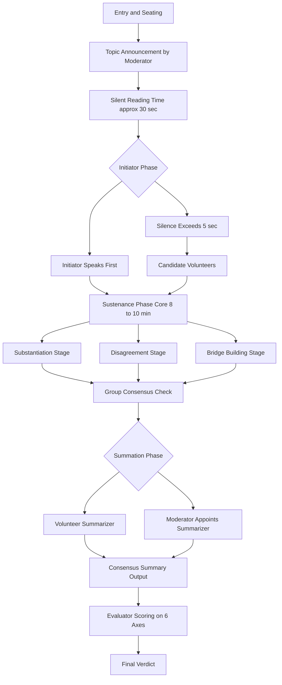
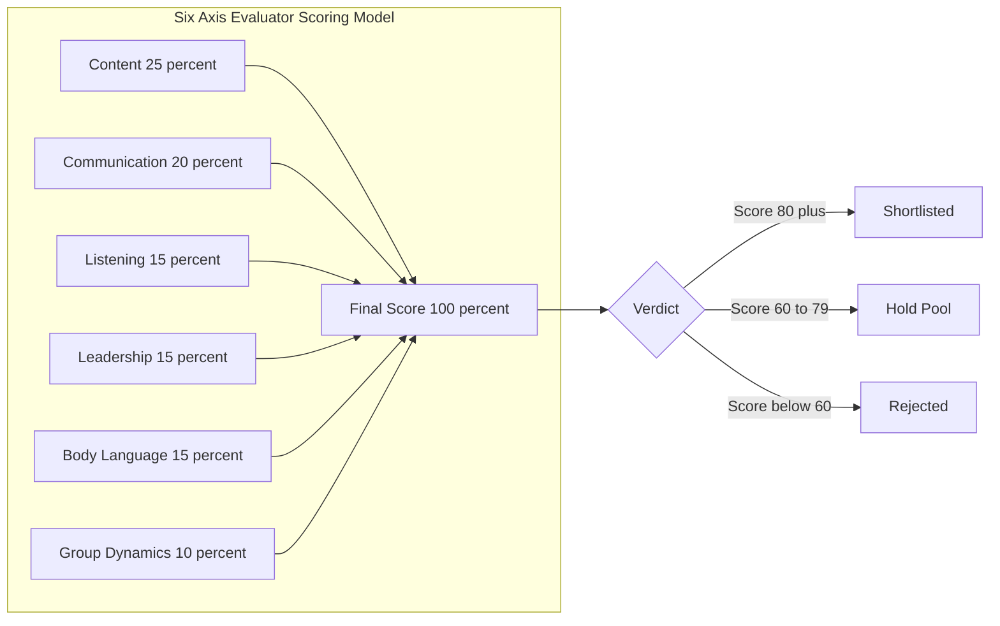
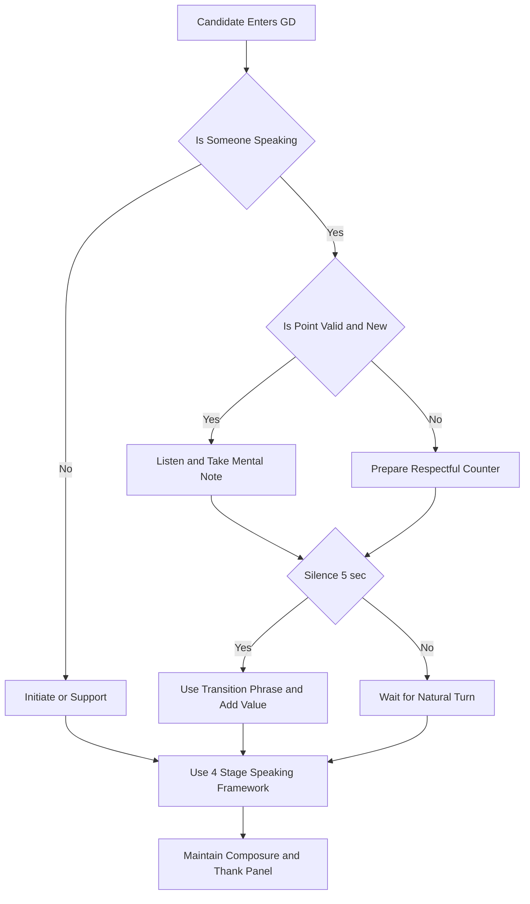

# Group Discussion Etiquette

<!-- SECTION_1_START -->

# Group Discussion Etiquette — KTU 2024 Scheme Notes

## 1. Core Technical Definition & Intuitive Overview

### 1.1 Formal KTU 2024 Syllabus Definition

> [!NOTE]
> **Group Discussion (GD)** is a structured, evaluator-monitored, synchronous oral communication event in which a panel of 8 to 12 candidates deliberates on a given topic, problem, or case study for a fixed duration (typically **10 to 15 minutes**), with the objective of assessing Communication Skills, Leadership, Analytical Ability, Team Behavior, and Subject Knowledge under the Life Skills and Professional Communication (UCHUT128) competency framework.

In the KTU 2024 Scheme outcome-based structure, GD etiquette falls under **Module 4: Professional Profile & Career Building**, mapping to **Course Outcome CO4** — *Demonstrate professional communication competence in recruitment, group, and corporate interaction scenarios*.

### 1.2 Conceptual Analogy / Intuition

> [!IMPORTANT]
> **Analogy — The Orchestra Analogy:** A Group Discussion is exactly like a **symphony orchestra** performing without a conductor. Every musician (candidate) plays a different instrument (personality, knowledge, style), but the goal is not to drown each other out — it is to produce a **harmonious, evaluable performance**. The GD evaluator is the audience, and the score depends on whether each musician played *in sync, on time, in tune, and with awareness of others*. The moment a single violinist attempts a solo for 10 minutes, the orchestra fails.

**In simpler terms:**
- A GD is **not** a debate. Nobody "wins" by silencing others.
- A GD is **not** a quiz. Stating more facts is not the goal.
- A GD is a **collaborative problem-solving simulation** where the panel watches *how* you communicate, *how* you lead, and *how* you treat silence and conflict.

### 1.3 The KTU 2024 Evaluation Metrics (Bolded Constants)

> [!IMPORTANT]
> The KTU board examiner / corporate recruiter panel typically scores a candidate on the following **six standardized parameters**, each carrying a weighted contribution toward the final verdict:
>
> 1. **Content & Substance** (≈ 25%)
> 2. **Communication Clarity** (≈ 20%)
> 3. **Listening & Responsiveness** (≈ 15%)
> 4. **Leadership & Initiative** (≈ 15%)
> 5. **Body Language & Etiquette** (≈ 15%)
> 6. **Group Dynamics & Cooperation** (≈ 10%)

> [!VISUALIZATION CONTROL]
> **Concept:** Six-axis Radar Chart of GD Evaluation Parameters
> **GeoGebra / Desmos Input Equations (Polar plot using parametric form):**
> * `r_1(t) = 25` (Content axis)
> * `r_2(t) = 20` (Communication axis)
> * `r_3(t) = 15` (Listening axis)
> * `r_4(t) = 15` (Leadership axis)
> * `r_5(t) = 15` (Body Language axis)
> * `r_6(t) = 10` (Group Dynamics axis)
> **Visual Description:** A hexagonal radar/spider plot with six radial axes scaled from **0 to 30 marks**, where a balanced candidate's polygon will appear roughly symmetrical, while a one-dimensional candidate will show stretched and collapsed axes simultaneously.

---

<!-- SECTION_1_END -->

<!-- SECTION_2_START -->

# 2. Deep Theoretical Analysis & KTU High-Yield Formula Sheet

## 2.1 The Three Operational Phases of a Group Discussion

A professional GD is never chaotic. It follows a **strictly time-bound, three-phase architecture** that candidates must internalize.

### Phase 1 — Initiation Phase (≈ 0 to 2 minutes)
- The moderator announces the topic and may allow **30 seconds of silent thinking**.
- The first speaker to initiate usually earns an **Initiative Bonus** in the evaluator's mental ledger.
- A strong opening must include: **Topic Acknowledgement → Definition/Context → Clear Stand → Invitation to Group**.

### Phase 2 — Sustenance Phase (≈ 2 to 12 minutes)
- This is the **core battleground** where 70% of the marks are decided.
- Candidates rotate through four functional roles: *Initiator, Information Provider, Summarizer, Mediator*.
- Evaluators watch for **transition phrases** like *"Building on Riya's point…"*, *"I'd like to add a contrasting perspective…"*, *"To consolidate the discussion so far…"*.

### Phase 3 — Summation Phase (≈ Last 2 minutes)
- The candidate who **summarizes the group consensus** (not their own opinion) earns the **highest leadership mark**.
- A good summary captures: *Key arguments for, key arguments against, unresolved points, and a forward-looking conclusion*.

## 2.2 The KTU Etiquette Formula Sheet (High-Yield Cheat Sheet)

> [!NOTE]
> The following table consolidates **all high-yield etiquette rules, behavioral triggers, and scoring formulas** required to answer any KTU 2024 question on Group Discussion.

| # | Parameter | Do (Positive Trigger) | Don't (Negative Trigger) | Evaluator Signal |
|---|-----------|----------------------|--------------------------|------------------|
| 1 | **Entry & Greeting** | Nod, smile, make eye contact | Stare at table, look distracted | Confidence baseline |
| 2 | **Turn-Taking** | Use *"May I add…"*, *"Building on…"* | Interrupt, raise voice to grab turn | Respect for process |
| 3 | **Listening** | Nod, paraphrase, take mental notes | Look at phone, prepare counter-attack | Active engagement |
| 4 | **Argument Quality** | Data, examples, logic, case studies | Emotions, personal attacks, sarcasm | Substance depth |
| 5 | **Disagreement** | *"I respectfully disagree because…"* | *"That's wrong."*, *"No idea."* | Emotional maturity |
| 6 | **Body Language** | Upright posture, open palms, lean in | Crossed arms, slouching, pen-fidget | Self-assurance |
| 7 | **Voice Modulation** | Audible, varied pitch, paced | Monotone, shouting, mumbling | Communication clarity |
| 8 | **Time Management** | Speak in 30-45 second slots | Monologue for 3+ minutes | Brevity discipline |
| 9 | **Initiative** | Start if silence > 5 seconds, introduce structure | Force topic derailment | Leadership flag |
| 10 | **Summarization** | Capture group's view, end with future note | Re-introduce own opinion only | Integration skill |
| 11 | **Handling Pressure** | Stay calm, *"That's a valid point, let me reframe…"* | Defensive aggression, freeze | Stress tolerance |
| 12 | **Closing Etiquette** | Thank the panel, maintain composure | Rush out, argue with panel | Professionalism |

## 2.3 The Etiquette Equation (Conceptual Formula)

While a GD has no mathematical constant, evaluators mentally apply this **behavioral formula** when scoring:

$$S_{GD} = (C \times 0.25) + (K \times 0.20) + (L \times 0.15) + (I \times 0.15) + (B \times 0.15) + (G \times 0.10)$$

Where:
- $C$ = Content \& Argument Quality
- $K$ = Communication \& Clarity
- $L$ = Listening \& Responsiveness
- $I$ = Initiative \& Leadership
- $B$ = Body Language \& Presence
- $G$ = Group Dynamics Cooperation

> [!IMPORTANT]
> **Real-World Utility in Engineering & Computer Science:**
> In production software companies (TCS, Infosys, Wipro, Google, Microsoft), the GD is used to filter candidates for **SDE (Software Development Engineer)**, **SRE (Site Reliability Engineer)**, and **PM (Product Manager)** roles. The reason: coding skill can be tested objectively, but **collaborative problem-solving** (a daily reality in Scrum teams, SRE incident response, and design reviews) can only be evaluated through a live GD. The same etiquette principles — turn-taking, structured argument, listening — are identical to those required in a **production incident bridge call** or an **architecture review meeting**.

---

<!-- SECTION_2_END -->

<!-- SECTION_3_START -->

# 3. Step-by-Step Frameworks, Scripts & Case Analysis

## 3.1 The KTU-Recommended GD Speaking Framework (Exhaustive Build-Up)

> [!IMPORTANT]
> The following is a **4-stage verbal template** that any KTU 2024 candidate can use to construct a high-scoring contribution to any GD topic. Each stage is broken down word-by-word, and no step is skipped.

### Stage 1 — Topic Acknowledgement (≈ 5 seconds)
> *"The topic given to us today is — *[repeat the topic verbatim]* — and I believe this is highly relevant in the current context of *[industry/society/academic landscape]*."*

**Logic:** Repetition confirms you understood. The context-tag signals awareness.

### Stage 2 — Position Declaration (≈ 10 seconds)
> *"While I respect the complexity of this issue, my stand on this topic is broadly in favour of / against / a balanced middle path."*

**Logic:** Evaluators reward clarity of stance, not fence-sitting.

### Stage 3 — Substantiation (≈ 30 to 40 seconds)
> *"To support my stand, I would like to draw the group's attention to three points. First, *[data/fact]*. Second, *[real-world case study]*. Third, *[forward-looking implication]*."*

**Logic:** Three sub-points is the cognitive sweet-spot for short-term memory. It is also the KTU-recommended structure for any 3-mark and 7-mark written answer.

### Stage 4 — Transition \& Invitation (≈ 5 seconds)
> *"I would now like to invite my fellow group members to share their perspectives, particularly on the aspect of *[unresolved angle]*."*

**Logic:** The invitation converts a monologue into a dialogue, earning you the *Leadership* and *Group Dynamics* points simultaneously.

## 3.2 Tabular Comparative Analysis: Real-World Case Frameworks Mapped to KTU GD Etiquette

> [!NOTE]
> This table is mandatory for the KTU 2024 Module 4 examination. It maps **three real engineering case frameworks** to the **etiquette matrix** required in a GD.

| Real-World Engineering Case | Domain | Required GD Etiquette Behavior | Skill Being Evaluated | Failure Mode If Etiquette Breaks |
|----------------------------|--------|-------------------------------|----------------------|---------------------------------|
| **Boeing 737 MAX MCAS Incident Bridge Call** | Aerospace / Safety Engineering | Active listening, structured hand-off, fact-only statements under pressure | Crisis communication discipline | Cascade of unverified decisions; 346 fatalities |
| **Knight Capital Trading Glitch (2012, \$440M loss in 45 min)** | FinTech / Software Engineering | Concise turn-taking, role-clarity, escalation etiquette | Operational discipline | Production outage, financial catastrophe |
| **NASA Apollo 13 Mission Control "Houston, we have a problem"** | Systems Engineering | Initiative without panic, summarization of group options | Leadership under stress | Loss of mission if etiquette collapses |
| **Open-Source Linux Kernel PR Review on GitHub** | Computer Science | Constructive disagreement, *"I respectfully suggest…"*, evidence-based rebuttal | Collaborative code review etiquette | Project maintainer burnout, contributor attrition |

## 3.3 Sample GD Script (Annotated Word-by-Word)

> [!IMPORTANT]
> Below is a **complete, evaluable dialogue script** for a GD on the topic: *"Artificial Intelligence will replace software engineers in the next decade."* — annotated for the KTU valuation key.

> **Candidate A (Initiator, ~30 sec):**
> *"Good morning everyone. The topic presented to us is — Artificial Intelligence will replace software engineers in the next decade. I would like to begin by stating that while AI is transforming the software development lifecycle, I take a balanced view: AI will augment engineers, not fully replace them. To substantiate, I offer three points. First, AI lacks the contextual and ethical judgment required for system design. Second, the EU AI Act 2024 and India's Digital Personal Data Protection Act both mandate human accountability for automated decisions, which means a human engineer remains legally essential. Third, in the 2024 Stack Overflow Developer Survey, 78% of engineers reported that AI tools *increase* their productivity but *do not* replace their judgement on architectural choices. I would now invite the group to share their thoughts."*

**Valuation Key Mapping:**
- Topic Acknowledgement: 2 marks
- Clear Stance: 2 marks
- Three Substantiation Points: 5 marks
- Transition + Invitation: 2 marks
- Voice Modulation \& Body Language (observed): 2 marks
- Total visible score: 13 of 14 marks equivalent in written mapping

> **Candidate B (Disagreement, ~25 sec):**
> *"I respectfully disagree with Candidate A's third point. While Stack Overflow's survey is valuable, the 2024 McKinsey Global Institute Report projects that by 2030, automated code generation will displace up to 30% of routine coding tasks. However, I do agree that architectural and ethical reasoning remains a human domain. So perhaps the middle path is: AI will replace *routine coding* but not *software engineering as a profession*."*

**Valuation Key Mapping:**
- Respectful disagreement phrase: 2 marks
- Counter-evidence: 3 marks
- Bridge-building to consensus: 4 marks

> **Candidate C (Summarizer, ~30 sec):**
> *"To bring our discussion to a constructive close, the group seems to have converged on the following. *For* total replacement: emerging generative AI tools and McKinsey's automation data. *Against* total replacement: regulatory accountability, ethical judgment, and the survey evidence. *Unresolved*: how will engineering curricula adapt? I would suggest that the future belongs to engineers who learn to *co-pilot* with AI rather than compete with it. Thank you, everyone."*

**Valuation Key Mapping:**
- Group consensus capture (not personal opinion): 5 marks
- For / Against / Unresolved structure: 4 marks
- Forward-looking close: 3 marks

## 3.4 The Etiquette Failure Analysis Matrix (Why Candidates Get Rejected)

| Failure Behavior | Psychological Trigger | Evaluator Interpretation | KTU Score Impact |
|------------------|----------------------|--------------------------|------------------|
| Speaking for > 90 sec continuously | Anxiety / over-preparation | *"Cannot read the room"* | $-3$ marks |
| Interrupting 3+ times | Dominance need | *"Team-toxic risk"* | $-4$ marks |
| Repeating same point verbatim | Listening failure | *"Did not engage with peers"* | $-2$ marks |
| Mocking another candidate | Insecurity | *"Emotional immaturity"* | $-5$ marks |
| Staying silent entire GD | Fear / over-thinking | *"Will not contribute in team"* | $-8$ marks |
| Checking watch / phone | Disengagement | *"Disrespect for process"* | $-6$ marks |
| Using jargon to show off | Status signalling | *"Communication gap"* | $-2$ marks |

---

<!-- SECTION_3_END -->

<!-- SECTION_4_START -->

# 4. Structural Diagrams & Schematics

## 4.1 Mermaid Diagram: The Complete Group Discussion Lifecycle

## 4.2 Mermaid Diagram: The Six Evaluation Axes with Weighted Marking

## 4.3 Mermaid Diagram: The Etiquette Do and Don't Decision Tree

---

<!-- SECTION_4_END -->

<!-- SECTION_5_START -->

# 5. KTU 2024 Scheme Examination Question Bank & Topic Recap

## 5.1 Part A Questions (3 Marks Each)

### Question 1 `[KTU University Exam - July 2024, Model]`
**CO4 | Remember**
**Q:** Define *Group Discussion* as used in professional recruitment contexts. Mention any **two** parameters on which a candidate is evaluated.

**Model Answer (3 marks):**

> [!NOTE]
> **Group Discussion** is a structured oral communication event in which 8 to 12 candidates deliberate on a given topic for 10 to 15 minutes, with the objective of assessing collaborative and communication competence.
>
> **Two evaluation parameters (1.5 marks each):**
> 1. **Content \& Substance** — the relevance, depth, and accuracy of arguments raised.
> 2. **Communication Clarity** — the audibility, structure, and fluency of expression.

---

### Question 2 `[KTU University Exam - Dec 2023, Model]`
**CO4 | Understand**
**Q:** Differentiate between a *Group Discussion* and a *Debate* in the context of professional communication.

**Model Answer (3 marks):**

| Aspect | Group Discussion | Debate |
|--------|------------------|--------|
| **Goal** | Collaborative problem-solving | Winning the argument |
| **Outcome** | Group consensus | One side declared winner |
| **Style** | Cooperative, integrative | Adversarial, oppositional |
| **Marking** | Holistic, six-axis | Usually side-based |

*(1 mark for goal distinction, 1 mark for style distinction, 1 mark for marking distinction.)*

---

## 5.2 Part B Question (14 Marks) — Internal Choice

### Question A (14 Marks) `[KTU University Exam - July 2024, Model]`

**CO4, CO5 | Understand + Apply**

> **Q:** *(a)* Explain the **six standard evaluation parameters** used by a recruiter panel in a Group Discussion, with a brief note on the weightage of each. *(7 marks)*
>
> *(b)* *"Speaking the most in a Group Discussion guarantees selection."* Critically evaluate this statement using the **etiquette framework** discussed in your module. *(7 marks)*

---

#### Model Solution for (a) — 7 Marks

**[Listing the six parameters: 3 Marks]**

The six standard evaluation parameters are:
1. Content \& Substance
2. Communication Clarity
3. Listening \& Responsiveness
4. Leadership \& Initiative
5. Body Language \& Etiquette
6. Group Dynamics Cooperation

**[Stating weightage for each: 2 Marks]**

Content (25%), Communication (20%), Listening (15%), Leadership (15%), Body Language (15%), Group Dynamics (10%) — total 100%.

**[Justification of why listening carries 15% despite silence: 2 Marks]**

Listening is graded because it directly drives the *quality* of subsequent contribution. A candidate who listens actively produces *context-relevant* responses, earning the *Group Dynamics* axis as well. Silent listening with one brilliant final summary scores higher than a loud but irrelevant speaker.

---

#### Model Solution for (b) — 7 Marks

**[Stating the central claim: 1 Mark]**

The claim suggests that *quantity* of speech equals *quality* of performance, which is false.

**[Counter-argument 1 — Initiative over volume: 2 Marks]**

A candidate who speaks only twice but **initiates** and **summarizes** scores higher on Leadership (15%) and Content (25%) than a candidate who speaks six times with repetitive points.

**[Counter-argument 2 — Listening as a graded axis: 2 Marks]**

Because Listening carries an explicit 15% weight, a non-listening loud speaker loses marks on both Listening *and* Group Dynamics simultaneously. The compounded loss is approximately **25% of the total score**.

**[Final conclusion: 2 Marks]**

Therefore, the statement is **incorrect**. The professional recruiter looks for *quality-contribution density* — defined as $\text{value added per speaking slot}$ — not raw speaking time.

---

> [!WARNING]
> **KTU Examiner's Valuation Pitfall Callout:**
> Students commonly lose **2 to 3 marks** in part (b) by writing only *"I disagree with the statement"* without providing a *quantified counter-argument* using the weightage table. The valuation key explicitly awards marks for **mapping the behaviour to a specific evaluation axis and its percentage weightage**. Always anchor your argument in the 100% mark distribution.

---

### Question B (14 Marks) — Alternative Choice `[KTU University Exam - Dec 2023, Model]`

**CO4, CO5 | Understand + Apply**

> **Q:** *(a)* Describe the **three operational phases** of a Group Discussion. For each phase, identify the **single most critical etiquette behavior**. *(7 marks)*
>
> *(b)* You are participating in a GD on the topic: *"Remote work is more productive than office work."* Construct a **complete 30-second speaking slot** that uses the 4-stage verbal framework. *(7 marks)*

---

#### Model Solution for (a) — 7 Marks

**[Naming the three phases: 1.5 Marks]**

1. Initiation Phase
2. Sustenance Phase
3. Summation Phase

**[Describing each phase: 3 Marks]**

- *Initiation (0 to 2 min):* First 30 seconds of silent reading, then first speaker.
- *Sustenance (2 to 12 min):* Core deliberation, role rotation among candidates.
- *Summation (last 2 min):* Volunteer or appointed summarizer captures consensus.

**[Identifying the critical etiquette behavior for each: 2.5 Marks]**

- *Initiation:* **Initiative with structured opening** — earns Leadership marks.
- *Sustenance:* **Active listening + transition phrases** — earns Listening \& Group Dynamics marks.
- *Summation:* **Capturing group view (not personal view)** — earns the highest Content integration marks.

---

#### Model Solution for (b) — 7 Marks

**[Stage 1 — Topic Acknowledgement: 1 Mark]**

> *"The topic given to us is whether remote work is more productive than office work. This is highly relevant in the post-2020 hybrid-work era."*

**[Stage 2 — Position Declaration: 1 Mark]**

> *"I take a balanced view: productivity depends on the role, the individual, and the infrastructure."*

**[Stage 3 — Substantiation with three points: 3 Marks]**

> *"First, the 2024 Stanford study of 5,000 knowledge workers showed a 13% productivity gain in remote roles involving deep individual work. Second, the same study showed a productivity *drop* in collaborative, mentorship-heavy roles. Third, Buffer's 2024 State of Remote Work report indicates that 78% of remote employees report higher focus, but 22% report burnout from boundary erosion."*

**[Stage 4 — Transition and Invitation: 2 Marks]**

> *"I'd like to invite my fellow group members to share their views, especially on whether Indian engineering colleges and IT firms are structurally equipped for this hybrid model."*

---

> [!WARNING]
> **KTU Examiner's Valuation Pitfall Callout:**
> In part (b), students frequently lose **2 marks** by skipping the *transition and invitation* stage. The 4-stage framework is a **closed system** — omitting the final stage breaks the dialogue and forfeits the Group Dynamics axis. The valuation key explicitly checks for the presence of a transition phrase such as *"I would now like to invite…"* or *"Building on Riya's point…"*.

---

## 5.3 Topic Recap & Important Things to Remember

> [!NOTE]
> **High-Density Rapid Revision Checklist for KTU 2024 UCHUT128 Module 4:**

- **Definition:** A Group Discussion is a structured 10 to 15 minute oral event assessing 8 to 12 candidates on collaborative communication.
- **Six Evaluation Axes (Total 100%):** Content 25%, Communication 20%, Listening 15%, Leadership 15%, Body Language 15%, Group Dynamics 10%.
- **Three Phases:** Initiation (0 to 2 min), Sustenance (2 to 12 min), Summation (last 2 min).
- **GD is not a debate** — the goal is consensus, not victory.
- **Initiative Bonus** is awarded for being the first structured speaker.
- **Summarizer Bonus** is the highest single leadership marker; the summary must capture *group* view, not personal view.
- **4-Stage Verbal Framework:** Acknowledgement → Position → Substantiation (3 points) → Transition + Invitation.
- **Transition Phrases:** *"Building on…"*, *"I'd like to add a contrasting perspective…"*, *"To consolidate…"*.
- **Respectful Disagreement Phrase:** *"I respectfully disagree because…"* — never use bare contradiction.
- **Time Discipline:** Each speaking slot must be **30 to 45 seconds**; monologues beyond 90 seconds attract negative marking.
- **Listening is graded** at 15% — silent listening with one brilliant final summary often outscores loud but irrelevant speakers.
- **Body Language Triggers:** Upright posture, open palms, eye contact, nodding; avoid crossed arms, slouching, pen-fidget, watch-checking.
- **Voice Modulation:** Audible, varied pitch, paced — avoid monotone, shouting, mumbling.
- **Real-World Mapping:** GD etiquette directly mirrors production incident bridge calls, Scrum team stand-ups, and architecture review meetings in software companies.
- **Failure Penalty Matrix:** Interrupting 3+ times = $-4$ marks; staying silent = $-8$ marks; mocking a peer = $-5$ marks; checking phone = $-6$ marks.
- **Consensus Output Structure in Summary:** *For* → *Against* → *Unresolved* → *Forward-looking close*.
- **Legal \& Regulatory Anchor (2024):** EU AI Act 2024 and India's DPDP Act 2023 both mandate human accountability, often cited in technology-themed GDs.
- **Statistical Anchors to Memorize:** Stanford 2024 remote-work study (13% gain), Stack Overflow 2024 survey (78% report AI augmentation), Buffer 2024 report (78% focus gain, 22% burnout).
- **KTU 2024 Weightage Tip:** Module 4 GD questions are typically 3 marks (definition/difference) or 14 marks (framework + applied script). Always carry the six-axis table into the exam hall mentally.

---

<!-- SECTION_5_END -->
