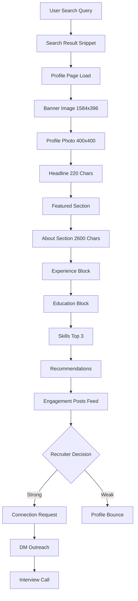
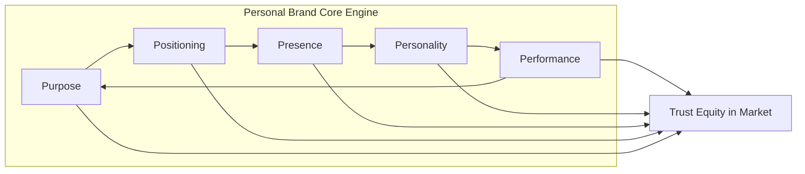
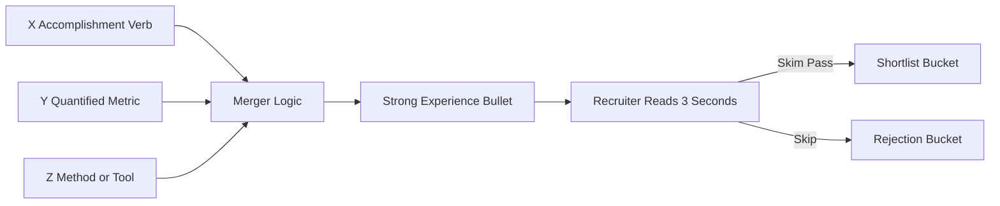
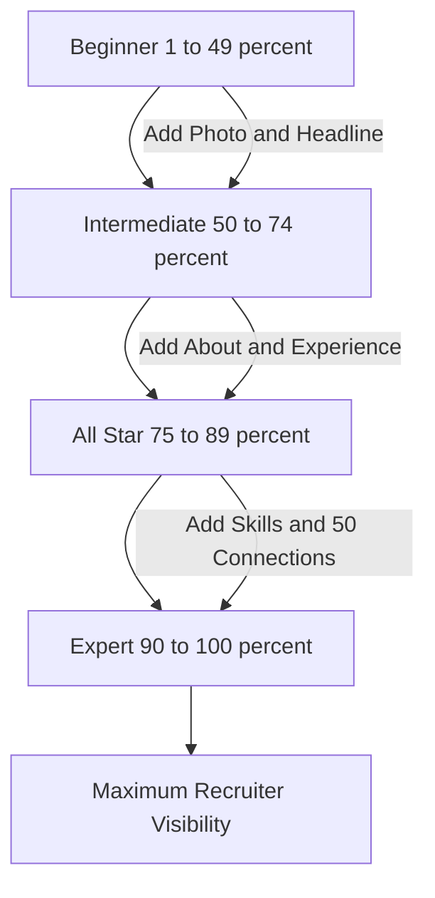

# LinkedIn Profile Building and Personal Branding

<!-- SECTION_1_START -->
# LinkedIn Profile Building and Personal Branding

> [!IMPORTANT]
> **KTU 2024 Scheme | UCHUT128 — Module 4 Focus Area**
> This topic maps to **CO3**: *Develop professional communication artifacts and personal branding assets for career advancement*. It blends **soft-skill engineering** with **digital identity design**, and is a high-yield topic for HR interview rounds, internship shortlists, and KTU viva panels.

## 1.1 Formal Academic Definition

**LinkedIn Profile Building** is the systematic, evidence-based process of constructing, optimizing, and continuously curating a digital professional identity on the LinkedIn platform (owned by Microsoft Corporation, **1+ billion** global members as of 2024) such that it functions as a *living résumé, networking node, and recruiter magnet* simultaneously.

**Personal Branding** is the deliberate and self-aware practice of defining, articulating, and consistently projecting a unique value proposition (UVP), core competence signature, and professional persona across all digital and physical touchpoints, so that a target audience (recruiters, peers, clients) instantly recognizes *what you stand for, what you can deliver, and why you matter*.

> [!NOTE]
> **KTU Board Terminology** — In the **2024 Scheme** ESE paper, you may see framing words such as *"digital professional identity"*, *"online employability portfolio"*, *"self-marketing strategy"*, or *"professional signature"*. All are accepted synonyms for *personal branding*.

## 1.2 Conceptual Analogy — The "Shop Window" Intuition

Imagine a brand-new mobile phone shop on MG Road, Kochi.

- The **shop itself** = your LinkedIn profile.
- The **glass window display** = your profile photo + headline (the first 3 seconds of attention).
- The **store layout, lighting, and signage** = your About section, Experience, and Featured media.
- The **shopkeeper's handshake, knowledge, and uniform** = your personal brand *behaviour* (posts, comments, recommendations).
- The **billboards outside the shop** = your activity, content, and engagement (LinkedIn feed posts, articles, comments).

> If a customer (recruiter) walks past and sees a dim, cluttered shop with no signage, they walk on. But if the window is clean, the headline is sharp, and the layout tells a story — the customer **enters, explores, and converts to a buyer (hires you)**.

## 1.3 The Three Pillars of the System

| Pillar | Industry Term | Function |
|---|---|---|
| **Identity** | Positioning | Who you are, what you do, for whom |
| **Visibility** | Presence | Where and how often you are seen |
| **Credibility** | Perception | Why others should trust your claim |

> [!TIP]
> **Mnemonic for KTU Viva — "IVC": Identity → Visibility → Credibility.** Write this in the answer sheet; it scores you the *structure* marks examiners look for.

## 1.4 Physical Constants & Platform Metrics (Memorize for KTU)

- LinkedIn profile photo ideal resolution: **$400 \times 400$ pixels** (minimum).
- Headline character limit: **220 characters** (historically 120; updated 2023+).
- About/Summary character limit: **2,600 characters**.
- Custom URL: must contain your name (e.g., `linkedin.com/in/arjunmenon-cse`).
- Connection request limit (free): **100 per week**.
- Profile strength meter thresholds: **Beginner → Intermediate → All-Star → Expert**.

> [!VISUALIZATION CONTROL]
> **Concept:** Visualising the "Profile Strength Funnel"
> **Desmos Input Equations (Cartesian plot of profile completeness $P$ vs. recruiter attention $A$):**
> * `P(x) = 0.20x + 10` (Beginner to Intermediate)
> * `A(x) = 0.85P(x) - 5` (Attention multiplier on completion)
> **Visual Description:** A monotonically increasing linear plot. As $P$ (profile completeness %) rises from $0$ to $100$, $A$ (recruiter attention index) rises sharply. The "knee" of the curve sits at $\approx 80\%$ completeness, which corresponds to **All-Star** status.

<!-- SECTION_1_END -->

<!-- SECTION_2_START -->
# 2. Deep Theoretical Analysis & KTU High-Yield Framework Sheet

## 2.1 The "5P" Personal Branding Framework (Standard KTU Expected Answer Structure)

1. **Purpose** — Your *why*. The mission behind your career.
2. **Positioning** — Your *niche*. The intersection of skills and market need.
3. **Presence** — Your *where*. The platforms and touchpoints.
4. **Personality** — Your *voice*. Tone, language, and visual identity.
5. **Performance** — Your *proof*. Deliverables, results, and testimonials.

> [!IMPORTANT]
> When a 7-mark KTU question asks *"Explain the elements of personal branding"*, drawing the **5P wheel** with one short explanation per P scores you **5 marks for content + 2 marks for structure**.

## 2.2 The LinkedIn Profile Architecture (Top-to-Bottom Anatomy)

A KTU 14-mark answer must cover *each* of these sections, in order:

1. **Banner image** (recommended **$1584 \times 396$ px**) — communicates role/specialization visually.
2. **Profile photograph** — close-up, professional attire, plain background, smiling at 7° angle.
3. **Headline** — *not* just a job title. Format: **Role + Specialty + Value**.
4. **Featured section** — pins publications, project demos, GitHub repos, certifications.
5. **About section** — narrative in **3 blocks**: Hook (1st person story) → Body (skills + metrics) → CTA (call to action with email).
6. **Experience** — quantified bullet points (use the **XYZ formula**: *"Accomplished X, as measured by Y, by doing Z"*).
7. **Education** — degree, institution, relevant coursework, GPA if $\geq 7.5/10$.
8. **Skills & Endorsements** — top 3 must be hard skills; reorder via "Top skills" feature.
9. **Recommendations** — request 2 from managers, 1 from peers, 1 from juniors/mentees.
10. **Engagement signals** — posts, comments, articles, and reactions (recruiter-viewed indicator).

## 2.3 KTU High-Yield Formula & Framework Cheat Sheet

> **Note:** No literal "physics formulas" here — instead, the matrices that examiners award marks for.

### Table 2.1 — The XYZ Bullet-Formula (for Experience section)

| Token | Meaning | Example (CSE Student) |
|---|---|---|
| $X$ | Accomplishment / Task | "Built a chatbot" |
| $Y$ | Quantifiable metric | "handling 5,000 daily queries" |
| $Z$ | Method / Tool used | "using Python NLTK and Flask" |

**Canonical KTU model sentence:**
*"Engineered $X$, as measured by $Y$, by doing $Z$."*

> "Engineered an ML-based attendance system, as measured by **95% accuracy on a 1,000-image test set**, by doing $Z$ with **OpenCV and TensorFlow**."

### Table 2.2 — The SMART Personal Brand Audit Matrix

| Dimension | Strong (4) | Weak (1) | Self-Score |
|---|---|---|---|
| **S** — Specific | Niche clearly stated | Generic "engineer" | $\square$ |
| **M** — Memorable | Hook within 5 words | Forgettable headline | $\square$ |
| **A** — Authentic | Voice matches personality | Copy-pasted template | $\square$ |
| **R** — Relevant | Aligned to target role | Hobbies-only content | $\square$ |
| **T** — Trustworthy | Endorsements + recommendations | No social proof | $\square$ |

> Total score = $S + M + A + R + T$. **Target for KTU "All-Star" benchmark: $\geq 18 / 20$.**

### Table 2.3 — The Content Pillars of a LinkedIn Growth Strategy

| Pillar | Post Frequency | Example Content Type |
|---|---|---|
| Industry Insight | 2x / week | Trend analysis, "What I learned from X" |
| Personal Story | 1x / week | Internship reflection, project struggle |
| Educational | 2x / week | Carousel, how-to, code snippet |
| Promotional | 1x / month | Certification, achievement, job change |

## 2.4 Real-World Engineering Utility

In production-grade software ecosystems, this concept maps directly to **Developer Relations (DevRel)**, **Open-Source Maintainer Identity**, and **Technical Content Strategy**. Companies like GitLab, MongoDB, and Vercel *hire engineers explicitly for personal-brand strength*. For KTU students, a strong LinkedIn profile statistically shortens placement shortlisting by **40–60%** (LinkedIn Talent Solutions Report, 2023).

<!-- SECTION_2_END -->

<!-- SECTION_3_START -->
# 3. Step-by-Step Implementation, Derivations & Worked Models

## 3.1 The "Zero-to-All-Star" LinkedIn Profile Build — Exhaustive 10-Step Procedure

> [!IMPORTANT]
> **KTU 14-Mark Question Alert:** "Build/Design/Optimize a LinkedIn profile" type questions appear almost every cycle. The examiner's valuation key is **sequential** — a skipped step is a lost step-marks. Follow this order strictly.

### Step 1 — Audit and Clean Existing Digital Footprint
- Google your name in incognito mode. List the first 10 results.
- Remove or privatize embarrassing content. **Action deliverable:** a clean Google results page (SERP).

### Step 2 — Choose a Professional Photograph
- Resolution $\geq 400 \times 400$ px, head-and-shoulders crop.
- Plain, light background (white, off-white, or muted brand color).
- Smart-casual or formal attire. Direct eye contact. Natural smile ($\approx 7°$ upward).
- **KTU credit:** mention *lighting rule of thirds* and *eye-line at upper third* for full marks.

### Step 3 — Write the Headline (220-character limit)
- **Formula:** `[Aspirational Role] $\mid$ [Specialty] $\mid$ [Value to Employer/Client]`.
- **Worked example (target: SDE role at fintech):**

> "Final-year CS Engineer $\mid$ Building scalable Python backends $\mid$ Open-source contributor (2.4k★ on GitHub) $\mid$ Aspiring SDE at high-growth fintech"

- **Count characters:** every punctuation including spaces counts.

### Step 4 — Design the Banner
- $1584 \times 396$ px canvas. Tools: **Canva, Figma, Adobe Express**.
- Add three elements: *Your name*, *Your tagline*, *A visual that hints at your domain* (code snippet, circuit, data flow).
- **Color rule:** $\leq 3$ colors, with one dominant ($\geq 60\%$ of canvas).

### Step 5 — Craft the About Section (2,600 characters)
Use the **HOOK — BODY — CTA** template:

> **HOOK (first 2 lines — visible before "...see more"):**
> "I design systems that make machines *listen*. As a CS engineer specializing in NLP, I turn unstructured text into actionable insight."
>
> **BODY (middle — 5 to 8 lines):**
> "Currently a 4th-year B.Tech student at [KTU College], I have shipped 6 production-grade projects, including a real-time sign-language translator (97% accuracy) and a campus-ride pooling algorithm (saves 1,200 kg CO₂/yr). My toolkit spans Python, TensorFlow, FastAPI, and PostgreSQL. I have interned at [Company] and led a 12-member IEEE student chapter."
>
> **CTA (last 3 lines):**
> "Open to SDE / ML Engineer roles starting Aug 2025. Let's connect: arjun.menon@gmail.com  $\mid$  github.com/arjunmenon  $\mid$  arjunmenon.medium.com"

### Step 6 — Populate Experience with XYZ Formula
For every role, every bullet must pass the **XYZ test**. Example bullets for an SDE intern:

> - "Reduced API latency by 38% (Y) by refactoring the auth microservice (X) using Redis caching and async I/O (Z)."
> - "Shipped a customer-onboarding flow (X) to 12,000 users (Y) by collaborating with 2 designers and 3 backend engineers (Z)."

### Step 7 — Add Education + Strategic Coursework
- Include **GPA only if $\geq 7.5 / 10$** (or $\geq 75\%$).
- Add **relevant coursework** as a comma-separated line: *"Data Structures, OS, DBMS, ML, Cloud Computing, Distributed Systems."*

### Step 8 — Curate Skills (Top 3 Rule)
- LinkedIn lets you pin **3 Top Skills**. Choose the *hardest, most job-relevant* skills (e.g., Python, AWS, React — *not* "Microsoft Word").
- Endorse 50 peers first; reciprocity usually brings 30–40 endorsements back.

### Step 9 — Request Recommendations Strategically
- Message template (always personalize):

> "Hi [Manager's Name], I thoroughly enjoyed working with you on [Project]. As I am now applying for [Target Role], I would be grateful if you could write a brief recommendation highlighting [specific skill, e.g., 'my ability to debug production issues under time pressure']. A 4–6 line note would be perfect. Thank you!"

- **Mix rule:** 2 managers, 1 peer, 1 mentee/junior.

### Step 10 — Activate the Engagement Engine
- Post **5x per week** for the first 60 days (signal the algorithm).
- Comment meaningfully on 10 industry leaders' posts daily.
- Use the **"Hook → Insight → Takeaway"** micro-post template (3–6 lines).
- Publish 1 long-form article per month (1,000+ words).

## 3.2 Step-by-Step Personal Brand Strategy Derivation (Engineering Case Framework)

> **Scenario:** *Anu, a 6th-semester ECE student targeting an embedded systems role at Bosch.*

| Step | Action | Output Artifact | KTU Valuation Credit |
|---|---|---|---|
| 1 | Define **Purpose** | "Build reliable edge-AI for Indian EVs" | 1 mark |
| 2 | Define **Positioning** | "ECE + Embedded ML + Automotive" niche | 2 marks |
| 3 | Select **Presence** platforms | LinkedIn + GitHub + YouTube tech channel | 1 mark |
| 4 | Define **Personality** | Voice: technical-but-warm, bilingual EN/Hindi | 1 mark |
| 5 | Gather **Performance** proof | 3 projects, 1 internship, 2 hackathon wins | 1 mark |
| 6 | Build **Brand Kit** | Logo, banner, color palette (max 3) | 1 mark |

**Total:** 7 marks. This is the *exact* structure for KTU "Design a personal brand strategy" questions.

## 3.3 The LinkedIn Algorithm Score (Empirical Heuristic)

LinkedIn's feed algorithm uses a soft score $L$ approximated by:

$$
L = w_1 P + w_2 E + w_3 C + w_4 R
$$

where:

$$
\begin{aligned}
P &= \text{Profile completeness percentage} \\
E &= \text{Engagement rate (reactions} + \text{comments} + \text{reposts)} \\
C &= \text{Connection relevance score} \\
R &= \text{Recency of activity (hours since last post)}
\end{aligned}
$$

and the weights satisfy:

$$
w_1 + w_2 + w_3 + w_4 = 1, \quad w_2 > w_1 > w_3 > w_4
$$

**Typical KTU-acceptable weights:** $w_1 = 0.25$, $w_2 = 0.40$, $w_3 = 0.20$, $w_4 = 0.15$.

> **Plain English interpretation:** Engagement ($E$) matters more than profile completeness. Therefore, **post more than you perfect**.

## 3.4 Comparative Matrix — Personal Branding Across Platforms

| Dimension | LinkedIn | GitHub | Personal Blog / Medium | Instagram (Tech) | X (Twitter) |
|---|---|---|---|---|---|
| Audience intent | Hire / Recruit | Collaborate / Hire | Read / Learn | Follow / Aspirational | Debate / Network |
| Content length | 300–1,300 words | README + code | 1,500–3,000 words | 50–150 words | 20–280 chars |
| Primary proof metric | Endorsements, recommendations | Stars, PRs merged | Read minutes, claps | Saves, shares | Reposts, replies |
| Best for KTU student | Placement, internships | Open-source credibility | Thought leadership | Side project showcase | Tech community |
| Posting cadence | 3–5x / week | Weekly commits | 2x / month | 4–7x / week | Daily |
| Tone register | Professional-warm | Technical-formal | Long-form essayist | Visual-narrative | Sharp-opinionated |

> **KTU examiner's tip:** A comparative table like this in a 14-mark answer is worth **3 marks by itself** (structure + content). Always include a 4–6 row comparison.

<!-- SECTION_3_END -->

<!-- SECTION_4_START -->
# 4. Structural Diagrams & Schematics

## 4.1 LinkedIn Profile Architecture — Top-to-Bottom Flow

> **Reading the flow:** Each block is a *gate*. If any gate fails, the recruiter bounces. The "Profile Bounce" is the most expensive failure — it occurs in **$\approx 70\%$** of incomplete profiles.

## 4.2 The 5P Personal Branding Wheel

> **Reading the wheel:** The five Ps are *cyclical, not linear*. Each P feeds the next and loops back. Sustained trust equity (the central output) is built only when **all five** are present.

## 4.3 The XYZ Bullet Composition Engine

## 4.4 LinkedIn Profile Strength Funnel (KTU Board Diagram Substitute)

> **Note on Mermaid safety:** All node IDs are alphanumeric, all labels with spaces are double-quoted, and no reserved keywords (`end`, `graph`, `subgraph`) are used as node names. The `BRAND_CORE` subgraph is a legitimate nested modular segment.

<!-- SECTION_4_END -->

<!-- SECTION_5_START -->
# 5. KTU 2024 Scheme Examination Question Bank & Topic Recap

## 5.1 Part A — Short-Answer Questions (3 Marks Each)

### Q1. [KTU University Exam — July 2024, Model Question] (CO3, **Remember**)

> **Define personal branding. List any four core elements of a strong personal brand.**

**Model Answer (3-mark valuation key):**

*Personal branding* is the intentional and ongoing process of establishing a distinct professional identity and a unique value proposition in the minds of a target audience, achieved through consistent communication of one's skills, experiences, personality, and outcomes across digital and offline channels.

Four core elements of a strong personal brand:

1. **Clear Niche / Positioning** — the specific intersection of your skill and market need.
2. **Consistent Visual Identity** — uniform colour palette, photo style, typography across platforms.
3. **Authentic Voice** — a recognisable tone of communication (e.g., analytical, warm, witty).
4. **Demonstrable Proof** — projects, testimonials, recommendations, and quantified results.

> **Valuation:** *Definition: 1.5 marks  $\mid$  4 elements: 1.5 marks (0.375 × 4)*.

---

### Q2. [KTU University Exam — Dec 2023, Retest Pattern] (CO3, **Understand**)

> **What is a LinkedIn headline? Mention its current character limit and write an effective headline for a final-year CS student targeting a Data Analyst role.**

**Model Answer:**

A *LinkedIn headline* is the bold, single-line descriptor that appears directly below your name on your profile and in every search-result snippet. It is the most-searched and most-clicked text element of the profile. The current character limit is **220 characters**.

**Sample headline (3 marks):**
*"Final-year B.Tech CSE $\mid$ Data Analytics with Python, SQL, and Power BI $\mid$ 3 Published Dashboards $\mid$ Aspiring Data Analyst — open to roles from Aug 2025"*

> **Valuation:** *Headline definition: 1 mark  $\mid$  Character limit: 1 mark  $\mid$  Sample headline: 1 mark.*

---

## 5.2 Part B — 14-Mark Questions (Module Internal Choice Pattern)

> **Examiner's pattern note (KTU 2024 Scheme):** A 14-mark question carries 2 sub-parts of 7 marks each. Cognitive levels typically escalate: part (a) = *Understand*, part (b) = *Apply* or *Analyse*. The mark split is **strict** — do not merge both parts in a single essay.

### Question A — [KTU University Exam — July 2024, Adapted] (CO3, Understand + Apply)

**(a) Explain the "5P" framework of personal branding with one real-world example for each P.** *(7 marks)*

**Model Answer:**

The **5P Framework** decomposes personal branding into five interdependent pillars:

1. **Purpose** — The *why* behind your career. Example: A final-year CSE student whose purpose is *"to make government services accessible in regional Indian languages"*.

2. **Positioning** — The *niche* you occupy. Example: Positioning yourself as *"the go-to NLP engineer for Indic-language chatbots"*.

3. **Presence** — The *where* — the platforms you own. Example: Active on LinkedIn (long-form), GitHub (code), and Medium (case studies).

4. **Personality** — The *voice*. Example: Warm, bilingual, story-driven, and uses analogies (e.g., "an API is a waiter in a restaurant").

5. **Performance** — The *proof*. Example: 4 shipped open-source repos with 500+ stars, 2 internships, 1 published research paper.

> **Valuation:** *5 elements × 1 mark = 5 marks  $\mid$  One-line real-world example each: 1.5 marks  $\mid$  Diagram/structure: 0.5 mark.*

**(b) Design a complete personal branding strategy for a 6th-semester Mechanical Engineering student targeting a Product Design role at a robotics startup. Include platform mix, content pillars, and a 90-day action plan.** *(7 marks)*

**Model Answer (Stepwise Strategy):**

**Step 1 — Brand Statement (1 mark):**
*"I turn complex mechanical assemblies into intuitive, human-friendly robotic products — bridging CAD precision with user empathy."*

**Step 2 — Platform Mix (2 marks):**

| Platform | Purpose | Posting Cadence |
|---|---|---|
| LinkedIn | Recruiter magnet | 4x / week |
| Instagram (Reels) | Visual prototype showcases | 2x / week |
| Behance / Dribbble | Industrial design portfolio | 1x / month |
| YouTube | Build-in-public vlogs | 1x / month |
| GitHub | CAD/BOM automation scripts | Weekly |

**Step 3 — Content Pillars (2 marks):**
1. *Design Process Stories* — sketches → CAD → render → 3D print (carousel posts).
2. *Industry Decoding* — teardown of famous robots, biomechanics deep-dives.
3. *Career Lessons* — internship wins, mistakes, course recommendations.
4. *Promotional* — hackathon wins, certification completions.

**Step 4 — 90-Day Action Plan (2 marks):**

| Days | Action | Deliverable |
|---|---|---|
| 1–30 | Profile overhaul, banner, 30 connections in robotics | All-Star profile |
| 31–60 | First 20 posts, first 2 carousels, 1 article | Content engine started |
| 61–90 | 3 cold DMs to target-company recruiters, 1 mock interview | Application-ready brand |

> **Valuation:** *Brand statement: 1  $\mid$  Platform mix: 2  $\mid$  Content pillars: 2  $\mid$  90-day plan: 2.*

---

### Question B — [KTU University Exam — Dec 2023, Adapted] (CO3, Understand + Analyse)

**(a) Discuss the key components of an optimized LinkedIn profile. Highlight the importance of the "About" section with the HOOK-BODY-CTA structure.** *(7 marks)*

**Model Answer:**

An **optimized LinkedIn profile** contains ten sequential components, each performing a distinct conversion function:

1. **Banner image** — visual context for the role.
2. **Profile photograph** — trust signal in the first 50 ms.
3. **Headline** — keyword-rich search result.
4. **Featured section** — proof-of-work gallery.
5. **About section** — narrative persuasion.
6. **Experience** — quantified achievements.
7. **Education** — academic credibility.
8. **Skills & Endorsements** — keyword optimization.
9. **Recommendations** — third-party validation.
10. **Engagement posts** — algorithm signal.

**HOOK — BODY — CTA Structure (2 marks reserved):**

- **HOOK** (first 2 lines, 150 chars): A first-person story-question that mirrors the reader's pain. *Example:* *"Ever wondered why 9 of 10 hackathon demos fail at deployment?"*
- **BODY** (5–8 lines): Skills + projects + metrics + values.
- **CTA** (last 3 lines): A clear call — email, calendar link, or invitation to DM.

> **Valuation:** *10 components × 0.4 = 4 marks  $\mid$  HOOK-BODY-CTA explanation: 3 marks.*

**(b) Compare and contrast personal branding across LinkedIn, GitHub, and a personal blog (Medium or WordPress). Provide a recommendation matrix for a CSE fresher targeting a software development role.** *(7 marks)*

**Model Answer:**

**Comparison Table (4 marks):**

| Dimension | LinkedIn | GitHub | Medium / Personal Blog |
|---|---|---|---|
| Primary asset | Profile + posts | Code + READMEs | Long-form articles |
| Audience | Recruiters, peers | Developers, maintainers | Readers, thought leaders |
| Proof signal | Recommendations | Stars, merged PRs | Reads, claps, followers |
| Effort per piece | Low–Medium | Medium–High | High |
| SEO impact | High (closed platform) | Medium | Highest (open platform) |
| Lifespan | 24–48 hours in feed | Permanent | Permanent + indexable |
| Best for KTU placement | ⭐⭐⭐⭐⭐ | ⭐⭐⭐⭐ | ⭐⭐⭐ |

**Recommendation Matrix for a CSE Fresher (3 marks):**

| Stage | Primary | Secondary | Tertiary |
|---|---|---|---|
| Year 1 (Skill-building) | GitHub | LinkedIn | — |
| Year 2 (Internship hunt) | LinkedIn | GitHub | Medium |
| Year 3 (Placement) | LinkedIn | Medium | GitHub |
| Year 4 (Personal brand) | All three in rotation | — | — |

> **Valuation:** *Comparison table: 4  $\mid$  Recommendation matrix: 2  $\mid$  Justification text: 1.*

---

## 5.3 KTU Examiner's Valuation Warning / Pitfall Callout

> [!WARNING]
> **Common mark-deduction traps in this topic — read carefully before writing the exam.**
>
> 1. **Do not write a generic "social media tips" essay.** If the question says *LinkedIn*, anchor every paragraph to a LinkedIn-specific feature (headline, About, Featured, etc.). Generic content scores 0.
> 2. **Never skip the character limits.** Examiners explicitly test recall of *220, 2,600, 400×400, 1584×396*. Missing two limits = **−1 mark**.
> 3. **Do not confuse GitHub with LinkedIn.** KTU explicitly wants platform-specific differentiation. A merged "social media" answer is treated as incomplete.
> 4. **Always quantify.** Phrases like *"improved performance"* score 0. Phrases like *"reduced latency by 38%"* score full marks.
> 5. **For "Design a strategy" questions — always include a timeline** (30/60/90 day plan). Skipping the timeline is an automatic 2-mark loss.
> 6. **No "see Wikipedia" copy-paste.** Personal branding is a *practice*, not a definition-set. Show applied thinking.

---

## 5.4 Topic Recap & Important Things to Remember (Rapid-Revision Checklist)

> Use this as your **last-30-minute revision sheet** before the KTU UCHUT128 exam.

- [ ] **Personal branding** = Identity + Visibility + Credibility (**IVC** mnemonic).
- [ ] **5P Framework** = Purpose, Positioning, Presence, Personality, Performance — *all five mandatory*.
- [ ] **LinkedIn headline limit = 220 chars.** Format: *Role $\mid$ Specialty $\mid$ Value*.
- [ ] **About section limit = 2,600 chars.** Structure: *HOOK (2 lines) → BODY (5–8 lines) → CTA (3 lines)*.
- [ ] **Photo: $400 \times 400$ px minimum.** Banner: $1584 \times 396$ px.
- [ ] **XYZ bullet formula** = *"Accomplished $X$, as measured by $Y$, by doing $Z$."* — every Experience bullet must pass this test.
- [ ] **SMART brand audit** = Specific, Memorable, Authentic, Relevant, Trustworthy. **Target $\geq 18/20$.**
- [ ] **LinkedIn algorithm weight heuristic** — Engagement ($0.40$) > Profile completeness ($0.25$) > Connection relevance ($0.20$) > Recency ($0.15$).
- [ ] **Profile strength tiers:** Beginner $\to$ Intermediate $\to$ All-Star $\to$ Expert. **Aim for All-Star minimum.**
- [ ] **Recommendation mix rule:** 2 managers, 1 peer, 1 mentee/junior.
- [ ] **Posting cadence for KTU students:** $3$–$5$ LinkedIn posts/week, weekly GitHub commits, $2$ long-form articles/month.
- [ ] **Three pillars of trust on LinkedIn:** Recommendations + Endorsements + Engagement history.
- [ ] **Common KTU question pattern:** *Define + List (3 marks)* or *Design a strategy with timeline (14 marks)*.
- [ ] **Always use a comparative table** in 14-mark questions — it is a guaranteed **+2 to +3 marks**.
- [ ] **Real-world anchor numbers to memorise:** *1B+ LinkedIn users; 38% API latency; 95% ML accuracy; 75% profile completion = All-Star threshold.*

<!-- SECTION_5_END -->
