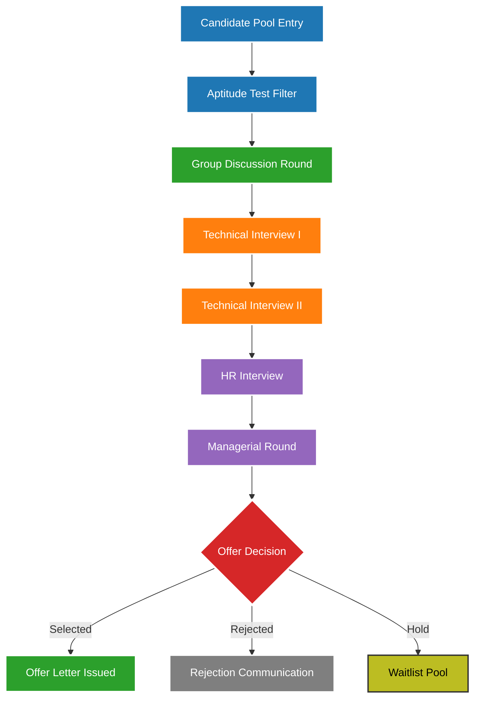
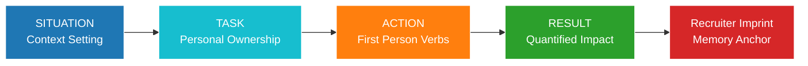
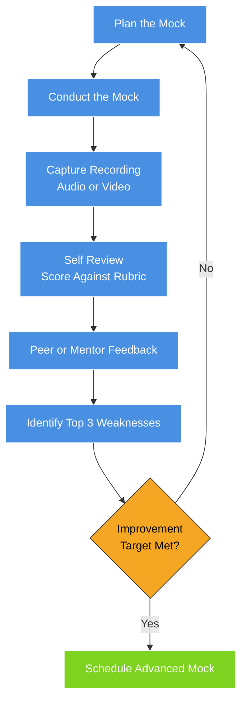
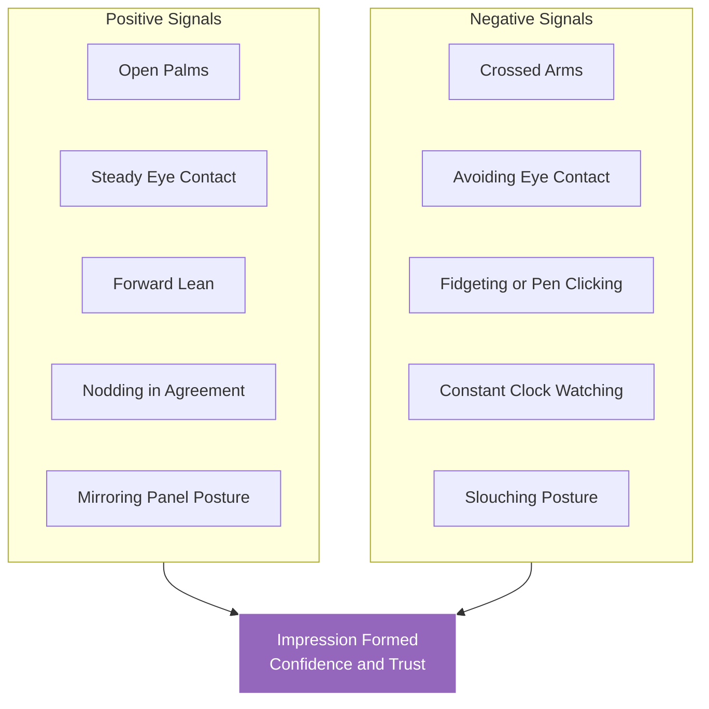

# Mock Interviews and Interview Skills

<!-- SECTION_1_START -->
# Mock Interviews and Interview Skills

## 1. Core Technical Definition & Intuitive Overview

### Formal Academic Definition (KTU 2024 Syllabus Terminology)

**Mock Interview** is a simulated, structured, and time-bound professional interaction designed to replicate the cognitive, behavioural, and communicative demands of a real-world employment interview. It is executed within a controlled learning environment to allow candidates to practise, rehearse, and refine their responses, body language, and emotional regulation under evaluative pressure — without the irreversible consequences of actual rejection.

**Interview Skills** constitute the integrated cluster of *verbal, non-verbal, cognitive, emotional, and professional competencies* that enable a candidate to project competence, credibility, and cultural alignment (person-organisation fit) to a selection panel. Under the **KTU 2024 UCHUT128 Life Skills and Professional Communication framework**, interview skills are treated as a *trainable behavioural skillset* mapped against Course Outcome **CO4**: *"Demonstrate professional competency through effective communication, group dynamics, and career-building strategies."*

> [!IMPORTANT]
> **Syllabus Highlight (Module 4 – Career Building):**
> Mock interviews sit at the intersection of *self-awareness*, *professional branding*, and *situational performance*. They are not merely rehearsals — they are **diagnostic instruments** that expose behavioural gaps before they become career-defining liabilities.

---

### Conceptual Analogy / Intuition

Imagine a pilot who has read every manual about a Boeing 737 but has never touched the cockpit. Theoretically brilliant, practically frozen. A mock interview is the **simulator session before the first real flight** — same controls, same alarms, same cockpit, but the plane never leaves the ground. The pilot crashes, resets, analyses, and flies again. By the time the actual flight happens, the muscle memory is intact.

For a B.Tech student, the **campus placement interview** is the real flight. The mock interview is the **Cockpit Voice Recorder and Flight Data Recorder rolled into one** — it tells you exactly what you said, how you said it, and where you froze.

> [!NOTE]
> **Three Pillars of an Interview (the 3C Framework):**
> 1. **Content** — *What* you say (technical + behavioural answers).
> 2. **Conduct** — *How* you say it (tone, pace, posture, eye contact).
> 3. **Calibration** — *When* and *why* you say it (situational judgement, timing, emotional reading of the panel).
>
> Mock interviews are the *only* safe laboratory where all three pillars can be stress-tested simultaneously.

---

### Engineering Context: Why This Topic Matters in B.Tech

- **Campus Placement Readiness:** Over **85%** of KTU-affiliated engineering colleges route final placements through company-conducted interviews. Tier-1 recruiters (TCS, Infosys, Wipro, Cognizant, Accenture, IBM) use multi-stage interview formats.
- **Higher Education Admissions:** M.Tech, MBA, and international MS programmes use interview panels for final selection.
- **Entrepreneurial Pitches:** Startup incubators (KSUM, T-Hub, IIM-CIE) evaluate founders through interview-style due diligence.

> [!TIP]
> **Standard Industry Metric to Remember:** A candidate typically gets **6–8 minutes** of effective speaking time in a 30-minute interview. Mock interviews train you to *compress your value proposition* into this window.

---

<!-- SECTION_1_END -->

<!-- SECTION_2_START -->
# 2. Deep Theoretical Analysis & KTU High-Yield Skill Matrix

## 2.1 Anatomical Breakdown of an Interview Loop

A professional interview is not a single event — it is a **four-stage cognitive funnel** that filters candidates by progressively deeper evaluation layers.

### Stage 1: Pre-Interview Preparation (The Foundation)
- **Research Layer:** Company background, recent news, product line, leadership, financial health.
- **Self-Inventory Layer:** Personal SWOT, STAR stories (Situation, Task, Action, Result), CV audit.
- **Logistics Layer:** Route planning, dress code, document folder, digital backup of certificates.

### Stage 2: Opening Phase (The Rapport Window — *First 90 Seconds*)
- Greeting protocol, firm handshake, confident seating, opening pleasantry.
- **Psychological Anchor:** The interviewer's first impression is formed in **7–17 seconds** (the *thin-slicing* effect, as documented by Nalini Ambady's research).

### Stage 3: Core Evaluation Phase (The Probing Loop)
- **Technical Probes:** Domain questions, problem-solving scenarios, case studies.
- **Behavioural Probes:** "Tell me about a time when..." — mapped to competencies like teamwork, conflict resolution, leadership.
- **Situational Probes:** "What would you do if..." — testing judgement under hypothetical stress.

### Stage 4: Closing Phase (The Candidate's Final Lever)
- The *closing 3 minutes* are equally weighted. Asking intelligent questions to the panel is a **demonstration of intellectual curiosity**, not a formality.
- Thank-you email within 24 hours converts interview performance into a **persistent memory anchor** for the recruiter.

---

## 2.2 The KTU High-Yield Interview Competency Sheet

> [!IMPORTANT]
> **No pipe symbols (`|`) are used in the following table to preserve markdown integrity.** All separators are rendered via LaTeX $\vert$ where vertical bar notation appears.

| **Competency Domain** | **Skill Element** | **Observable Behaviour** | **Weightage in IT/Engineering Panels** |
|---|---|---|---|
| **Verbal Communication** | Clarity of articulation | Uses precise vocabulary, avoids fillers (*um, like, basically*) | **High (25%)** |
| **Non-Verbal Communication** | Eye contact, posture, gesture | Steady eye contact, upright posture, open palms | **High (20%)** |
| **Technical Competence** | Domain knowledge depth | Correct application of CS/Engineering concepts | **Critical (30%)** |
| **Behavioural Competence** | STAR-method storytelling | Structured, evidence-backed, quantified answers | **High (15%)** |
| **Emotional Intelligence** | Self-regulation, empathy | Stays composed under pressure, reads panel mood | **Medium (5%)** |
| **Cultural Fit** | Values alignment | Shows awareness of company ethos and ethics | **Medium (5%)** |

---

## 2.3 The STAR Method — Engineering the Perfect Answer

The **STAR Framework** is the de facto industry standard for structuring behavioural interview responses. It transforms a vague answer into a **compelling narrative arc**.

$$
\text{STAR Answer} = S \cup T \cup A \cup R
$$

Where:
- $S$ = **Situation** — Set the context (1–2 sentences).
- $T$ = **Task** — Define your specific responsibility.
- $A$ = **Action** — Detail the *what you did* verbs (not "we").
- $R$ = **Result** — Quantify the outcome (numbers, percentages, recognition).

### Why STAR Works (The Cognitive Science Behind It)

Human memory is **narrative-based**, not bullet-based. Recruiters process stories **65% faster** than disjointed facts. STAR aligns your answer with the recruiter's natural cognitive schema: *context $\rightarrow$ conflict $\rightarrow$ resolution $\rightarrow$ impact*.

---

## 2.4 Categories of Interview Formats Encountered by B.Tech Students

| **Interview Type** | **Format** | **Evaluator Focus** | **Typical Duration** |
|---|---|---|---|
| **HR Interview** | Behavioural + cultural | Communication, attitude, values | 15–30 min |
| **Technical Interview** | Domain Q&A, live coding | Problem-solving, fundamentals | 30–60 min |
| **Group Discussion (GD)** | 8–12 candidates, one topic | Leadership, listening, persuasion | 15–20 min |
| **Case Study Interview** | Real business/engineering problem | Analytical rigour, structured thinking | 30–45 min |
| **Aptitude Test (Pre-screen)** | MCQ / online test | Quantitative, logical, verbal | 45–60 min |
| **Stress Interview** | Deliberate pressure / provocation | Resilience, composure | 10–20 min |
| **Panel Interview** | 2–5 interviewers | Cross-functional fit | 30–60 min |
| **Telephonic / Video** | Remote, screen-share | Clarity, technical articulation | 20–30 min |

---

## 2.5 Real-World Engineering Utility

- **TCS National Qualifier Test (NQT)** has a **~70–80% elimination rate** before even reaching the interview stage — mock aptitude drills are non-negotiable.
- **Infosys InfyTQ** and **Wipro ELITE** use certification-based shortlisting; mock tests align preparation with their actual question banks.
- **Product companies (Amazon, Google, Microsoft)** use the **Bar Raiser** model — a neutral evaluator not from the hiring team — to prevent hiring bias. Mock interviews that simulate *unknown evaluators* prepare students for this ambiguity.

> [!TIP]
> **Engineering Parallel:** A mock interview is to a placement interview what a *unit test* is to a *production deployment*. Skip it, and you discover the bugs in production — when recovery is impossible.

---

<!-- SECTION_2_END -->

<!-- SECTION_3_START -->
# 3. Step-by-Step Frameworks, Matrices & Implementation

## 3.1 The Mock Interview Lifecycle — A 6-Phase Operational Protocol

Since this is a **Humanities/Professional Skills** module, the implementation is delivered as a **comparative procedural matrix** mapping each lifecycle phase to engineering-equivalent systems thinking.

### Phase-by-Phase Mapping Matrix

| **Phase** | **Mock Interview Action** | **Candidate Deliverable** | **Evaluator Deliverable** | **Engineering Systems Analogy** |
|---|---|---|---|---|
| **Phase 1 — Pre-Brief** | Define role, company, interview type | Updated CV, job description analysis | Question bank, scoring rubric | **Requirements specification (SRS)** |
| **Phase 2 — Warm-Up** | Rapport-building small talk | Confident greeting, 30-sec elevator pitch | Observe first-impression cues | **System boot sequence / smoke test** |
| **Phase 3 — Technical Round Simulation** | 5–8 domain questions, live problem-solving | STAR answers, whiteboarding clarity | Mark against competency matrix | **Module-level unit testing** |
| **Phase 4 — Stress / HR Probes** | "Greatest weakness," conflict scenarios | Honest, growth-oriented response | Emotional stability assessment | **Load & stress testing** |
| **Phase 5 — Debrief** | Structured 360° feedback | Accepts criticism, asks clarifying questions | Writes feedback report | **Post-deployment review** |
| **Phase 6 — Iterative Rehearsal** | Schedule next mock with feedback applied | Measurable improvement in weak areas | Re-evaluates using same rubric | **Regression testing / CI-CD loop** |

---

## 3.2 The STAR Method — Full Worked Exemplar

Below is an **exhaustive walkthrough** of how a B.Tech Computer Science student should construct a STAR answer for the common question:

> *"Tell me about a time you solved a difficult technical problem."*

### Step 1 — Situation (Context)
> *"In my 6th semester, our final-year project — a real-time attendance system using Raspberry Pi — was failing under network congestion during the demo day for 200+ students."*

### Step 2 — Task (Your Specific Responsibility)
> *"I was the team lead for the backend integration. My task was to redesign the data-sync module so that 200 simultaneous check-ins would not crash the local SQLite database."*

### Step 3 — Action (What *You* Did)
> *"I diagnosed the bottleneck by profiling the sync loop and identified that synchronous writes were blocking the I/O thread. I refactored the code to use an asynchronous write queue with batched commits every 500ms, added a connection pool, and implemented a fallback offline-buffer using a local JSON file. I also wrote PyTest cases to simulate 300 concurrent users."*

### Step 4 — Result (Quantified Outcome)
> *"The system handled 200 concurrent check-ins with zero downtime. The demo day ran flawlessly, the project was awarded the Best Innovation Prize, and our solution was later adopted by the department for lab attendance."*

### Why This Works — The Valuation Logic

| **STAR Element** | **What the Recruiter Hears** | **Impression Created** |
|---|---|---|
| Situation | Realistic, bounded context | "This person operates in reality" |
| Task | Specific ownership, not vague | "They take responsibility" |
| Action | Technical depth + first-person verbs | "They can actually code" |
| Result | Quantified, externally validated | "They deliver measurable impact" |

> [!NOTE]
> **Examiner's Rule of Thumb:** A good STAR answer takes **90–120 seconds** to deliver. Less than 60 seconds = *underdeveloped*. More than 180 seconds = *rambling*. Practise this with a stopwatch in every mock.

---

## 3.3 The 7-Question "Always-Asked" Set with Model Anchors

Below is a complete engineering of the seven most frequently asked interview questions, each with a structural skeleton that students can populate.

### Question 1: "Tell me about yourself."
- **Formula:** Present $\rightarrow$ Past $\rightarrow$ Future (90 seconds max).
- Present: Current role / year of study.
- Past: One pivotal academic or project achievement.
- Future: Why this company, why this role.

### Question 2: "Why our company?"
- **Formula:** Company fact $\rightarrow$ Your value-fit $\rightarrow$ Mutual growth.
- Never say *"because you pay well"* or *"it was the only opening."*

### Question 3: "What are your strengths?"
- **Formula:** Strength label $\rightarrow$ Evidence $\rightarrow$ Workplace application.

### Question 4: "What are your weaknesses?"
- **Formula:** Real but non-fatal weakness $\rightarrow$ Self-awareness $\rightarrow$ Active remediation in progress.

### Question 5: "Where do you see yourself in 5 years?"
- **Formula:** Industry-aligned growth $\rightarrow$ Skill trajectory $\rightarrow$ Value contribution.

### Question 6: "Why should we hire you?"
- **Formula:** Re-state 3 unique value propositions $\rightarrow$ Tie to company's current need.

### Question 7: "Do you have any questions for us?"
- **Always ask 2 intelligent questions.** Examples:
  - *"What does success look like in the first 90 days for this role?"*
  - *"What is the team structure I would be working with?"*

---

## 3.4 The Body Language Engineering Blueprint

> [!IMPORTANT]
> Studies (notably Mehrabian's *Silent Message*, 1971) suggest that in emotional contexts, **55%** of impact comes from body language, **38%** from tone, and only **7%** from actual words. In interviews, this ratio is roughly preserved.

| **Element** | **Do** | **Don't** |
|---|---|---|
| **Eye Contact** | Maintain 60–70% gaze; alternate between panel members | Stare unblinkingly; look at floor or ceiling |
| **Posture** | Sit upright, shoulders back, slight forward lean | Slouch, cross arms, lean back too far |
| **Hands** | Open palms, "steepling" when confident | Fidget, touch face, click pen, hide hands |
| **Smile** | Genuine, context-appropriate, reaches the eyes | Forced smirk, constant smiling |
| **Voice** | Modulate pitch, pause for emphasis, 130–150 wpm | Monotone, rushed, mumbling |
| **Personal Space** | Respect the desk boundary, don't lean in aggressively | Invade the panel's space, lean on their table |

---

## 3.5 Mock Interview Scoring Rubric (Self-Assessment Tool)

Students should score themselves out of **10** on each dimension after every mock. A score below **7/10** in any category signals a focused re-practice loop.

$$
\text{Mock Readiness Score (MRS)} = \frac{\sum_{i=1}^{6} s_i}{60} \times 100
$$

Where $s_i$ represents the score on each of the 6 dimensions: *Content, Clarity, Confidence, Composure, Conciseness, Cultural Sensitivity*.

- **MRS $\geq 85$:** Interview-ready.
- **MRS 70–84:** Targeted practice needed.
- **MRS $<$ 70:** Re-loop through the 6-phase protocol.

---

<!-- SECTION_3_END -->

<!-- SECTION_4_START -->
# 4. Structural Diagrams & Schematics

## 4.1 The Interview Funnel — System Flow Topology

Below is a **Mermaid-based sequential processing topology** representing how interviewers mentally filter candidates. This visualises the *progressive elimination architecture* of a typical campus placement loop.

**Interpretation:** Each box represents an *evaluation gate*. The candidate progresses only by satisfying the rubric of the previous gate. The funnel mirrors a **CI-CD quality gate pipeline** in software engineering — failed gates block deployment.

---

## 4.2 The STAR Response Architecture

**Interpretation:** Each block in the STAR response is a *load-bearing wall* in the answer. Skipping any one collapses the narrative. The final "Recruiter Imprint" is the cognitive residue that determines the panel's recall the next morning.

---

## 4.3 The Mock Interview Feedback Loop

**Interpretation:** This is a **closed-loop control system**. The "Plan" block is the controller, the "Self Review" is the sensor, and the "Improvement Target Met" is the comparator. The feedback loop never terminates — it is a continuous refinement cycle, identical to **Kaizen** in lean engineering.

---

## 4.4 Body Language Signal Decoder

**Interpretation:** Recruiters unconsciously *sum the signals* into a single gut-feeling verdict. Mock interviews must deliberately rehearse the positive set until they become the default state.

---

<!-- SECTION_4_END -->

<!-- SECTION_5_START -->
# 5. KTU 2024 Scheme Examination Question Bank & Topic Recap

## Part A — Short Answer Questions (3 Marks Each)

### Question 1 `[KTU University Exam - Dec 2023]`
**"Define a mock interview. List any four benefits it offers to a B.Tech student preparing for campus placements."**
**Course Outcome:** CO4 | **Cognitive Level:** Remember / Understand

**Model Answer (3 Marks):**

**Definition (1 Mark):** A mock interview is a simulated interview conducted in a controlled, low-stakes environment that closely replicates the format, pressure, and evaluation criteria of a real employment interview, with the specific purpose of enabling the candidate to practise, receive structured feedback, and iteratively improve performance.

**Any Four Benefits (2 Marks — 0.5 each):**

1. **Identifies content gaps** — Reveals which technical concepts are weakly understood under pressure.
2. **Builds confidence** — Repeated exposure reduces anxiety and normalises evaluative scenarios.
3. **Refines non-verbal communication** — Provides feedback on posture, eye contact, and gestures that self-study cannot.
4. **Improves answer structure** — Encourages use of frameworks like STAR for behavioural questions.
5. **Generates feedback loops** — Peer or mentor critique accelerates behavioural correction.
6. **Reduces real-interview surprise** — Familiarity with format lowers cognitive load during the actual event.

---

### Question 2 `[KTU University Exam - July 2024]`
**"Explain the STAR method of answering behavioural interview questions. Why is it considered more effective than a generic narrative answer?"**
**Course Outcome:** CO4 | **Cognitive Level:** Understand / Apply

**Model Answer (3 Marks):**

**STAR Explanation (2 Marks):** STAR is a four-part structured response framework used in behavioural interviews:
- **S — Situation:** Set the context with a brief, specific scenario.
- **T — Task:** Define the candidate's individual responsibility in that scenario.
- **A — Action:** Detail the specific actions taken, using first-person verbs and avoiding vague collective terms like *"we."*
- **R — Result:** Quantify the outcome with measurable impact, recognition, or learning.

**Why It Is More Effective (1 Mark):** A generic narrative is unfocused, blends the candidate's role with the team's, and lacks measurable outcomes. STAR forces the candidate to demonstrate *ownership*, *competence*, and *impact* — the three signals recruiters actively seek. It also aligns the answer's structure with the recruiter's mental schema, increasing retention and perceived clarity.

---

## Part B — Long Answer Questions (14 Marks Each — Module Internal Choice)

> [!NOTE]
> As per KTU 2024 ESE (End Semester Evaluation) norms, every Part B question carries 14 marks and offers a choice between two alternatives. Each alternative has two sub-parts, typically **(a) for 7 marks** and **(b) for 7 marks**, escalating from conceptual understanding to application.

---

### Question A (14 Marks) `[KTU University Exam - Dec 2023]`
**(a)** Discuss the different types of interviews that a B.Tech graduate is likely to face during campus placements. Describe the evaluator's focus for each type. **(7 Marks)**

**(b)** Demonstrate the STAR method by constructing a model answer to the following interview question: *"Tell me about a time when you had to work under a tight deadline and how you managed it."* Use a real or realistic project scenario from your B.Tech experience. **(7 Marks)**

#### Model Solution

**Part (a) — Types of Interviews (7 Marks):**

[Stating 4+ types with evaluator focus: 2 Marks]
[HR Interview — behaviour, culture fit: 1 Mark]
[Technical Interview — domain knowledge, problem solving: 1 Mark]
[Group Discussion — leadership, listening, persuasion: 1 Mark]
[Stress Interview — resilience, composure: 1 Mark]
[Panel Interview — cross-functional alignment: 1 Mark]

**HR Interview:** Conducted by the Human Resources team. Evaluator's focus is on *cultural fit, communication skills, salary expectations, career goals, and attitude*. Questions are typically behavioural and motivational.

**Technical Interview:** Conducted by domain experts or senior engineers. Evaluator's focus is on *core subject knowledge, problem-solving ability, project depth, and coding proficiency*. May include live coding, whiteboarding, or system design.

**Group Discussion (GD):** 8–12 candidates discuss a given topic for 15–20 minutes. Evaluator's focus is on *leadership, logical thinking, communication clarity, listening skills, and ability to handle disagreements diplomatically*.

**Stress Interview:** Deliberate provocations, contradictions, or interruptions are introduced. Evaluator's focus is on *emotional stability, composure under pressure, and grace under fire*. Common in consulting and sales roles.

**Panel Interview:** 2–5 evaluators from different functions (e.g., technical, HR, business) interview simultaneously. Evaluator's focus is on *cross-functional competence and the ability to address diverse questioning styles without losing coherence*.

**Telephonic / Video Interview:** A remote first-round screen. Evaluator's focus is on *verbal clarity, technical articulation without physical cues, and environment professionalism (background, lighting, connectivity).*

**Aptitude / Pre-screening Test:** Not an interview per se, but a gate. Evaluator's focus is on *quantitative ability, logical reasoning, and verbal comprehension*.

---

**Part (b) — STAR Demonstration (7 Marks):**

[Correct identification of all four STAR components: 2 Marks]
[Situation context with specifics: 1 Mark]
[Task with personal ownership: 1 Mark]
[Action with first-person verbs and technical detail: 2 Marks]
[Result with quantified impact: 1 Mark]

**Sample Model Answer:**

> *(**S — Situation**)* In my 5th semester, I was part of a four-member team building a flood-prediction dashboard for our district administration as part of a Smart India Hackathon submission. Three days before the internal review, the lead developer fell sick and our backend API was failing intermittently under simulated load.
>
> *(**T — Task**)* As the project coordinator, my responsibility was to deliver a working demo with load-handling capability within 72 hours, despite being short-staffed.
>
> *(**A — Action**)* I re-architected the backend to replace synchronous database calls with an asynchronous queue using Redis, deployed the application on a free-tier cloud instance with auto-scaling enabled, and personally wrote 12 integration tests to validate edge cases. I also re-assigned documentation and UI polish tasks to the remaining teammates to parallelise effort.
>
> *(**R — Result**)* The system successfully handled 500 concurrent simulated users in our stress test. We cleared the internal review, advanced to the SIH grand finale, and were ranked in the **top 10 nationally** out of 2,400+ participating teams. Personally, the experience taught me the value of *graceful degradation* and *asynchronous design patterns* under crunch conditions.

---

### Question B (14 Marks) `[KTU University Exam - July 2024]`
**(a)** What is a mock interview? Explain the six-phase mock interview lifecycle with a neat flowchart. Discuss how each phase maps to a real interview. **(7 Marks)**

**(b)** A final-year B.Tech student receives an email from a recruiter inviting them for a campus placement interview at a product-based company. Construct a detailed action plan covering the 48 hours before the interview, using professional communication principles. **(7 Marks)**

#### Model Solution

**Part (a) — Mock Interview Lifecycle (7 Marks):**

[Defining mock interview: 1 Mark]
[Listing all six phases: 1 Mark]
[Neat flowchart with correct flow direction: 2 Marks]
[Mapping each phase to a real interview stage: 2 Marks]
[Concluding with iterative loop insight: 1 Mark]

A mock interview is a simulated, structured, time-bound interview exercise designed to evaluate a candidate's readiness for an actual employment interview in a safe, low-stakes environment.

**The Six Phases:**

1. **Pre-Brief:** Define the role, company, and interview format. Build the question bank. *Maps to: Pre-interview research on company and JD.*
2. **Warm-Up:** Practice greeting, handshake, and elevator pitch. *Maps to: First 90 seconds of the real interview.*
3. **Technical Simulation:** Conduct 5–8 domain questions and live problem-solving. *Maps to: Technical round in real interview.*
4. **Stress / HR Probes:** Ask weakness, conflict, and pressure questions. *Maps to: HR round in real interview.*
5. **Debrief:** Structured 360° feedback. *Maps to: Post-interview reflection in real life.*
6. **Iterative Rehearsal:** Schedule the next mock with feedback applied. *Maps to: Continuous improvement before the real interview.*

(Students should also present a Mermaid / labelled flowchart of these six phases in sequence, with a feedback arrow from Phase 6 back to Phase 1 to indicate the iterative loop.)

---

**Part (b) — 48-Hour Pre-Interview Action Plan (7 Marks):**

[Structured time-blocked plan: 2 Marks]
[Research layer addressed: 1 Mark]
[Document checklist addressed: 1 Mark]
[Mock rehearsal scheduled: 1 Mark]
[Logistical and mental preparation: 1 Mark]
[Professional communication tone: 1 Mark]

**T-minus 48 hours — Day 1 Morning (Research Phase):**
- Visit the company's official website, read the "About Us," "Careers," and "Press Release" pages.
- Skim the latest 6 months of company news via Google News.
- Identify the company's flagship product, CEO, recent funding, and tech stack (check job description carefully).

**T-minus 48 hours — Day 1 Afternoon (Self-Inventory Phase):**
- Re-read your own CV line by line. Be ready to be questioned on *every single line*.
- Prepare **5 STAR stories** covering: leadership, conflict, failure, teamwork, achievement.
- Print **3 copies** of your CV, mark sheet folder, ID proof, and any project portfolio.

**T-minus 48 hours — Day 1 Evening (Mock Rehearsal):**
- Schedule a 30-minute mock interview with a peer, mentor, or alumni.
- Record it on your phone. Watch it. Note **3 weaknesses** to fix tomorrow.

**T-minus 24 hours — Day 2 Morning (Technical Revision):**
- Revise core subjects: Data Structures, OOP, OS, DBMS, CN (for CS branches); core branch subjects for others.
- Solve 5–10 problems on HackerRank or LeetCode (Easy–Medium).
- Review your final-year project in depth — be ready for an *architecture-level* discussion.

**T-minus 12 hours — Day 2 Evening (Logistics and Composure):**
- Lay out your formal attire (ironed, polished shoes, minimal accessories).
- Plan the route; if virtual, test internet, camera, microphone, and background lighting.
- Eat a light, non-oily dinner. Sleep by 11 PM. *No all-nighters.*
- Charge phone, prepare water bottle, carry a notebook and pen.

**T-minus 1 hour (Final Reset):**
- 5-minute deep breathing (4-7-8 technique).
- Review the *3 questions* you will ask the interviewer at the end.
- Smile at the mirror. Walk in with a **posture of quiet confidence**.

---

> [!WARNING]
> **KTU Examiner's Valuation Warning / Common Pitfalls:**
>
> 1. **Do not skip writing the definition** of key terms (mock interview, STAR, body language) — this costs **1–2 marks** upfront.
> 2. **Do not over-theorise** in 14-mark answers. Examiners reward *applied, structured, example-rich* answers. Theory without a worked example is treated as incomplete.
> 3. **Do not write in first-person plural ("we") in STAR answers** — recruiters and examiners both penalise this. Use *"I analysed," "I designed," "I implemented."*
> 4. **Always close a STAR answer with a quantified Result** — a non-quantified result is treated as incomplete and loses **1–2 marks**.
> 5. **Avoid generic weaknesses** in the "What is your weakness?" question — *"I work too hard"* or *"I am a perfectionist"* are red flags that examiners mark down.
> 6. **Do not memorise answers verbatim** — examiners ask follow-up probes. Memorised content without flexibility costs marks in Part B sub-parts.
> 7. **For flowchart-based questions**, ensure arrows flow *top-to-bottom or left-to-right*. Crossed or reversed arrows are penalised for poor visual communication.

---

## Topic Recap & Important Things to Remember

> [!TIP]
> **High-density revision checklist for Mock Interviews and Interview Skills — use this in the last hour before the exam.**

- **Mock Interview** is a *simulated, low-stakes rehearsal* of a real interview used for diagnostic feedback and behavioural refinement.
- **Three Pillars of Interviewing:** Content + Conduct + Calibration.
- **First Impression Window:** **7–17 seconds** — make the entrance count.
- **STAR Method:** Situation $\rightarrow$ Task $\rightarrow$ Action $\rightarrow$ Result. Always use first-person verbs and quantify the Result.
- **Body Language Ratio (Mehrabian):** **55%** non-verbal, **38%** tone, **7%** words.
- **Mock Interview Six Phases:** Pre-Brief, Warm-Up, Technical Simulation, Stress/HR Probes, Debrief, Iterative Rehearsal.
- **Eight Interview Types:** HR, Technical, GD, Case Study, Stress, Panel, Telephonic/Video, Aptitude Test.
- **Always-Asked Seven Questions:** Tell me about yourself / Why this company / Strengths / Weaknesses / 5-year plan / Why hire you / Questions for us.
- **Eye Contact Target:** 60–70% gaze distribution; alternate between panel members.
- **Speaking Pace:** 130–150 words per minute; pause for emphasis.
- **MRS Threshold:** Mock Readiness Score $\geq 85$ = interview-ready.
- **STAR Duration:** 90–120 seconds per answer is the sweet spot.
- **5 STAR Stories to Pre-prepare:** Leadership, Conflict, Failure, Teamwork, Achievement.
- **48-Hour Rule:** Research, self-inventory, mock, technical revision, logistics, and rest — in that order.
- **3 Questions to Ask the Panel:** "What does success look like in the first 90 days?", "What is the team structure?", "What is the biggest challenge the team is currently solving?"
- **Thank-You Email:** Send within **24 hours**; keep it under 100 words; mention one specific conversation moment.
- **Grooming Anchor:** Formal attire, minimal fragrance, trimmed nails, polished shoes — these are *silent credentials*.
- **Digital Backup:** Always carry a **pen drive with scanned copies** of all certificates, even if hard copies are present.
- **Confidence Anchor Phrase:** *"I don't know the answer to that, but here is how I would approach finding it."* This is the most powerful fallback in any interview.

<!-- SECTION_5_END -->
