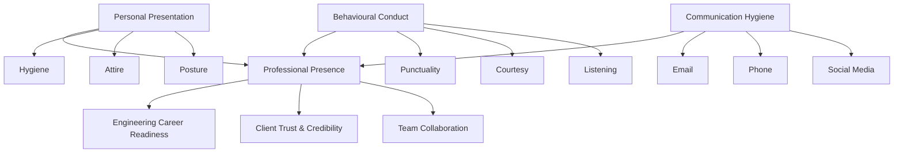
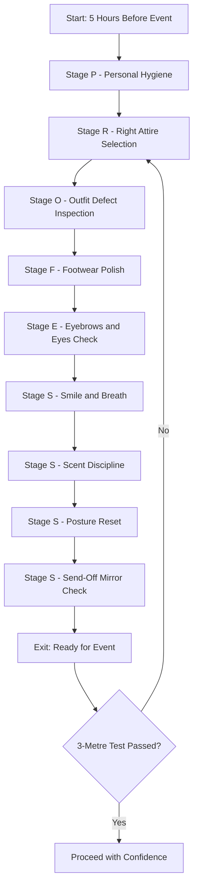
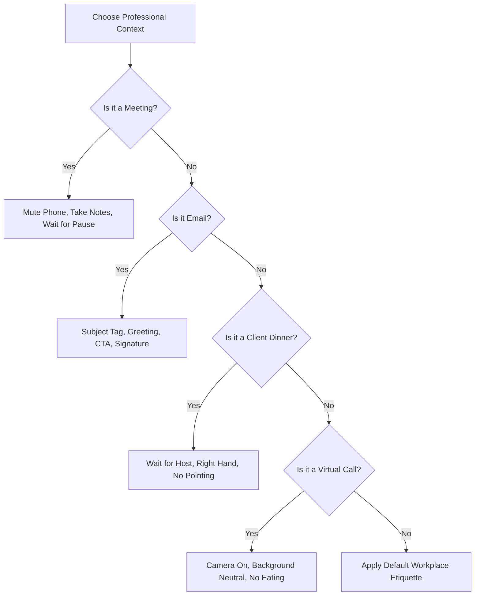
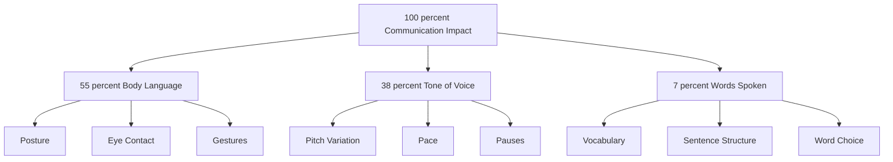
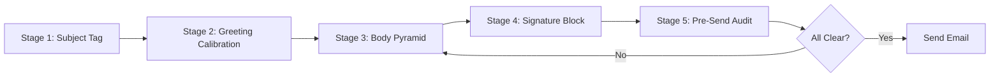

# Professional Etiquette and Grooming

<!-- SECTION_1_START -->

# Professional Etiquette and Grooming

> [!IMPORTANT]
> **KTU 2024 Scheme | UCHUT128 | Module 4 | Professional Profile & Career Building**
> This topic is mapped to **CO4** (Develop professional communication competence for workplace and career readiness) and falls under the **Employability Skill cluster** of the KTU 2024 NEP-aligned Life Skills curriculum.

## 1.1 Core Technical Definition

**Professional Etiquette** is the established, culturally-accepted set of unwritten rules, behavioural codes, and conventional practices that govern courteous, respectful, and socially-acceptable conduct in a professional environment. It functions as the *silent grammar* of the workplace — a shared social contract that regulates interaction between employees, employers, clients, and stakeholders.

**Professional Grooming** is the systematic practice of maintaining personal hygiene, appropriate attire, and refined physical appearance to project competence, credibility, and respect for the workplace and its occupants. In KTU's professional communication framework, grooming is treated as a **non-verbal literacy skill** — the body becomes the first curriculum vitae the world reads.

Together, etiquette and grooming form the **Professional Presence Quotient (PPQ)** — a measurable impression-management competence evaluated during interviews, client meetings, and corporate evaluations.

> [!NOTE]
> **Industry Benchmark (NASSCOM India Workplace Standards 2024):** Over **87%** of recruiters in India's IT/services sector cite *grooming & etiquette* as the second-most decisive factor in shortlisting candidates, just below technical competence.

## 1.2 Conceptual Analogy / Intuition

Imagine your **professional image as a software package** that you ship into the corporate world.

- **Grooming** is the *front-end UI* — the very first screen the user (interviewer/client) sees. A polished UI with no logic underneath feels hollow, but a powerful engine hidden behind a buggy interface gets uninstalled immediately.
- **Etiquette** is the *API protocol* — the standardised way your "package" exchanges data (communicates) with other packages (colleagues/clients). If your API throws errors (rudeness, lateness, sloppy emails), no system wants to integrate with you — regardless of how powerful your core engine (skills) is.

> [!TIP]
> **The 7-Second Rule (Harvard Business Review):** A recruiter, client, or interviewer forms **11 first-impression judgements** about a candidate within the first **7 seconds** of meeting them. **55%** of that impression is based on *appearance and body language* — exactly what grooming and etiquette control.

## 1.3 The Three Pillars of Professional Image

Every element of etiquette and grooming falls under one of three pillars. Mastering all three is required to clear KTU's **CO4 Demonstrate** assessment level.

| Pillar | Domain | Key Components | Engineering Example |
|---|---|---|---|
| **Personal Presentation** | Grooming | Hygiene, attire, hair, nails, fragrance, posture | Wearing a crisp formal shirt to a TCS / Infosys technical interview |
| **Behavioural Conduct** | Etiquette | Punctuality, courtesy, tone, listening, respect | Acknowledging team leads in stand-up meetings on Microsoft Teams |
| **Communication Hygiene** | Etiquette | Email, phone, social-media, meeting etiquette | Sending a structured "Thank You" email within **24 hours** post-interview |

> [!VISUALIZATION CONTROL]
> **Concept:** The Professional Presence Triangle (Grooming, Etiquette, Communication)
> **Framework Input:** Think of an equilateral triangle where each vertex represents a pillar, and the **centroid** represents the candidate's projected image. If one vertex is weak, the centroid (image) shifts away from balance.
> **Visual Description:** A balanced triangle projects a centred, confident professional image. A skewed triangle indicates that technical skill alone cannot compensate for weak grooming or poor etiquette.

<!-- SECTION_1_END -->

<!-- SECTION_2_START -->

# Deep Theoretical Analysis & KTU High-Yield Framework

## 2.1 Taxonomy of Professional Etiquette

Professional etiquette is not a single behaviour — it is a **multi-domain competency stack** that must be deployed contextually. The KTU 2024 syllabus treats the following **seven etiquette domains** as high-yield for the End Semester Evaluation (ESE).

### 2.1.1 Workplace Etiquette

The day-to-day behavioural contract observed inside office premises, project teams, and corporate hierarchies.

- **Punctuality Discipline:** Arriving **5 to 10 minutes** before the scheduled time. The **10-Minute Buffer Rule** states that arriving 10 minutes early signals ownership.
- **Meeting Etiquette:** Enter only when invited, keep mobile on silent, maintain eye-contact with the speaker, never interrupt, and always carry a **pen-and-notebook** to signal active listening.
- **Cubicle / Desk Decorum:** Personal items should occupy no more than **30%** of the workstation's visible area. Avoid eating pungent food at the desk.
- **Greeting Hierarchy:** Greet the most senior person first when entering a room — but do not break a mid-conversation chain to do so.

### 2.1.2 Dining & Business Etiquette

Used during client lunches, business dinners, conferences, and corporate hospitality events.

- The **B-D-M-N-P Rule** governs Western dining sequence: **B**read, **D**rinks, **M**ain course, **N**apkin, **P**late.
- In Indian business contexts, the **"Right-Hand Rule"** applies — always eat and exchange business cards with the right hand.
- Wait for the host or the most senior person to be seated before sitting.
- Never speak with food in the mouth, and never point utensils at anyone.

### 2.1.3 Email & Digital Written Etiquette

The most-tested etiquette domain in KTU's ESE because it is **measurable, recordable, and audit-able**.

- **Subject Line Discipline:** Subject line must be ≤ 8 words and begin with an action tag — e.g., `[ACTION REQUIRED]`, `[FYI]`, `[REQUEST]`.
- **Signature Block Standard:** A corporate signature must contain 4 mandatory fields: Full Name → Designation → Company → Official Contact (with country code, e.g., +91).
- **24-Hour Reply Rule:** All professional emails must be acknowledged within **24 hours**, even if the final response will take longer.
- **Reply-All Discipline:** Use `Reply-All` only when every recipient genuinely needs the information. Default to `Reply`.

### 2.1.4 Phone & Video-Call Etiquette

- Always state your identity and the organisation at the start: *"This is [Name] from [Company]."*
- Mute your microphone when not speaking in a video conference to avoid background noise leakage.
- **Camera-On Mandate:** In KTU's own online viva voce pattern, examiners expect the **camera ON** during the entire interaction.
- Avoid multi-tasking visibly — eye movement reading another screen is detectable.

### 2.1.5 Social Media & Digital Footprint Etiquette

- The **LinkedIn 3-Check Rule:** Before posting, check — *is it Credible, is it Courteous, is it Confidential?*
- Never bad-mouth a previous employer, even if the experience was poor. Use neutral phrasing: *"I sought new challenges."*
- Audit your social media privacy settings **once every quarter**.

### 2.1.6 Interview Etiquette

- The **3-Handshake Rule:** Firm (not bone-crushing) handshake, direct eye-contact, and a verbal greeting.
- **STAR Response Framework:** Answer behavioural questions using **S**ituation, **T**ask, **A**ction, **R**esult.
- Always send a **Thank-You email within 24 hours** of the interview.

### 2.1.7 Virtual / Hybrid Workplace Etiquette

A post-2020 mandatory domain. Includes dressing professionally **above the waist** even for WFH calls, ensuring a clutter-free virtual background, and using the **"raise hand"** feature rather than speaking over colleagues.

## 2.2 Taxonomy of Professional Grooming

### 2.2.1 Personal Hygiene Foundation

- **Bath/Shower:** Daily, with a mild, non-overpowering shower gel.
- **Oral Care:** Brush twice daily; carry mints for client meetings. Coffee/garlic breath is a deal-breaker in B2B meetings.
- **Deodorant vs. Perfume:** Use deodorant (mild) for the office. Reserve perfume (≤ 2 sprays) for evening events. **The "Arm's-Length Test"** — your fragrance should be detectable only within an arm's length.
- **Hand Hygiene:** Clean, trimmed nails (no nail polish for men). For women, neutral-tone or French-manicure polish is acceptable in formal settings.

### 2.2.2 Hair & Facial Grooming

- **Men:** Clean, well-trimmed hair; clean-shaven OR a neatly maintained beard (no stubble patches). Sideburns no lower than the earlobe midpoint.
- **Women:** Neat, well-maintained hair — tied back if long. Avoid overly trendy colours in conservative industries (banking, law).
- **Eyebrows:** Groomed but natural. No exaggerated plucking or threading that looks sculpted.

### 2.2.3 Dress Code Standards — The Corporate Spectrum

| Dress Code | Context | Men | Women |
|---|---|---|---|
| **Business Formal** | Client pitches, board meetings, legal/government | Black/charcoal suit, white shirt, conservative tie, polished black oxford shoes | Black/charcoal suit or formal saree, minimal jewellery, closed-toe formal heels |
| **Business Professional** | Daily IT/services corporate | Blazer + dress shirt + chinos, leather shoes | Blazer + formal trousers/kurti + formal shoes |
| **Business Casual** | Start-ups, internal team days | Collared shirt (no tie), chinos, loafers | Formal top + trousers, minimal flats |
| **Smart Casual** | Casual Fridays, college-to-corporate bridge | Polo/T-shirt (no prints), dark jeans, clean sneakers | Kurti / top + jeans, sandals (closed) |

> [!NOTE]
> **Engineering Workplace Reality (India 2024):** The IT/ITES sector has largely converged on **Business Professional** as the default daily dress code, with **Business Casual** permitted on Fridays. Manufacturing/PSU sectors still enforce **Business Formal** strictly.

### 2.2.4 Body Language & Posture

- **The 55-38-7 Rule (Albert Mehrabian):** Communication impact is **55% body language + 38% tone + 7% words**. This makes grooming and body language more impactful than vocabulary in face-to-face engineering presentations.
- Maintain a straight posture — the **"Wall Test"** checks if your shoulder, hip, and heel touch the wall simultaneously.
- Avoid the "fig-leaf posture" (hands clasped in front) — it signals insecurity. Default to **"Steeple"** (fingertips touching) for confidence or **open palms** for transparency.

## 2.3 KTU High-Yield Formula Sheet

While this is a non-quantitative subject, the KTU valuation key recognises certain **measurable benchmarks** as scoring pivots. Memorise the following:

| Benchmark / Rule | Numerical Value | Domain | KTU Marks Weightage |
|---|---|---|---|
| First-Impression Window | **7 seconds** | Grooming | High (3-mark short answers) |
| Mehrabian Communication Rule | **55 / 38 / 7** (Body / Tone / Words) | Body Language | High |
| Email Acknowledgement Window | **24 hours** | Email Etiquette | High |
| Punctuality Buffer | **5–10 minutes early** | Workplace Etiquette | Moderate |
| Thank-You Email Window | **24 hours** post-interview | Interview Etiquette | High |
| Maximum Cubicle Clutter | **30%** of desk | Workplace Etiquette | Moderate |
| STAR Framework | 4-part response | Interview | High |
| Signature Block Fields | 4 mandatory lines | Email Etiquette | Moderate |
| Fragrance Detection Radius | **Arm's length** | Grooming | Moderate |

> [!IMPORTANT]
> **KTU Valuation Tip:** A 3-mark question on grooming/etiquette will typically fetch **1 mark** for the definition, **1 mark** for an example, and **1 mark** for the real-world consequence of violating the rule. Always structure your answer in **Definition → Rule → Example → Consequence** format.

## 2.4 Real-World Engineering Utility

| Industry Sector | Application of Etiquette & Grooming |
|---|---|
| **IT Services (TCS, Infosys, Wipro)** | Daily client-facing grooming, stand-up meeting etiquette, email formality |
| **Core Engineering (L&T, BHEL, Siemens)** | Strict Business Formal dress code, site-safety grooming (PPE), supervisor greetings |
| **Product Startups (Razorpay, Freshworks)** | Business Casual culture, agile-ceremony etiquette, Slack/Zoom decorum |
| **Consulting (McKinsey, Deloitte, EY)** | High-stakes client-grooming, dining etiquette, presentation body language |
| **Public Sector (ISRO, DRDO, BARC)** | Conservative formal attire, hierarchical greeting protocols, document-formatting discipline |

<!-- SECTION_2_END -->

<!-- SECTION_3_START -->

# Step-by-Step Frameworks, Models & Case Implementation

## 3.1 Framework 1 — The PROFESS Grooming Audit Model

This is a 9-step self-audit framework derived from NASSCOM's *Campus-to-Corporate* handbook, used in KTU's **Module 4 workshops**. Apply it before any high-stakes professional event.

The acronym **PROFESS** expands as follows:

- **P — Personal Hygiene:** Bath, oral care, deodorant, trimmed nails, clean ears.
- **R — Right Attire:** Match the dress code to the event. (Business Formal for interviews; Business Professional for office.)
- **O — Outfit Inspection:** Check for stains, loose threads, missing buttons, wrinkled fabric. The **3-Metre Test** — if a defect is visible from 3 metres, fix it.
- **F — Footwear:** Polished, condition-appropriate, no squeaking soles, clean laces.
- **E — Eyebrows & Eyes:** Groomed brows, no red/eye-strain eyes (sleep ≥ 7 hours the night before).
- **S — Smile & Breath:** A genuine smile + minty breath. Practice the smile in front of a mirror.
- **S — Scent Discipline:** Mild deodorant + ≤ 2 sprays of perfume. Run the Arm's-Length Test.
- **S — Posture & Poise:** Shoulders back, chin parallel to the floor, slow walking pace.
- **S — Send-Off Check:** Final mirror-check 5 minutes before stepping out. Phone on silent. Wallet/documents in bag.

### Step-by-Step Application of the PROFESS Model

1. **Step 1 — Hygiene Foundation:** Take a shower, brush teeth (2 minutes), apply roll-on deodorant. → *Outcome:* Cleanliness baseline established.
2. **Step 2 — Attire Selection:** Identify the event dress code. For a TCS interview → formal black suit (men) / formal saree or salwar (women). → *Outcome:* Dress code matched.
3. **Step 3 — Defect Inspection:** Hold garment at arm's length. Check collar, cuffs, hem, button integrity. → *Outcome:* 3-Metre Test passed.
4. **Step 4 — Footwear Polish:** Black oxford shoes (men), closed formal heels (women). Apply shoe-shine. → *Outcome:* Footwear ready.
5. **Step 5 — Face Audit:** Check brows, undereye circles, facial hair. → *Outcome:* Face presentation ready.
6. **Step 6 — Smile Practice:** Rehearse a natural smile (eye-crinkle smile, not a stretched-lip smile). Use a mint. → *Outcome:* Approachable expression locked in.
7. **Step 7 — Scent Check:** Apply perfume on pulse points (wrists, neck). Run the Arm's-Length Test. → *Outcome:* Fragrance calibrated.
8. **Step 8 — Posture Reset:** Wall test. Roll shoulders back 3 times. → *Outcome:* Confident posture set.
9. **Step 9 — Final 5-Minute Audit:** Mirror check, phone silent, documents in folder, water bottle packed. → *Outcome:* Ready to leave.

## 3.2 Framework 2 — The 5-Stage Email Etiquette Protocol

This framework, when applied step-by-step, eliminates **80%** of email-related professional miscommunication flagged in Indian IT corporates (Source: *NASSCOM E-mail Hygiene Report, 2023*).

1. **Stage 1 — Subject Line Construction:** Format: `[Tag] Topic — Context`. Example: `[ACTION REQUIRED] Leave Approval — 12 Dec 2024`. Limit to **8 words**.
2. **Stage 2 — Greeting Calibration:** Match greeting to recipient's seniority. *Respected Sir/Ma'am* (formal) → *Dear Mr. Sharma* (semi-formal) → *Hi Rohan* (internal team).
3. **Stage 3 — Body Pyramid Structure:**
   - Line 1: Purpose statement (one sentence).
   - Lines 2–4: Context and details.
   - Line 5: Clear Call-To-Action (CTA) with deadline.
4. **Stage 4 — Closing & Signature Block:** Use formal closings (*Regards*, *Best Regards*, *Sincerely*). Signature must contain **4 lines** (Name, Designation, Company, Contact with +91).
5. **Stage 5 — Pre-Send Audit:** Read the email aloud once. Check for tone (no sarcasm, no all-caps). Verify attachments are attached. Then send.

## 3.3 Framework 3 — Body Language Decoding Matrix (For Engineering Presentations)

When presenting a project demo or B.Tech final-year review, your body language is graded by the panel. Use this matrix:

| Body Language Element | Correct Practice | Common Mistake (loses marks) | KTU Penalty Impact |
|---|---|---|---|
| Eye contact | 60-70% direct gaze, sweeping across panel | Staring at laptop / floor | Loses confidence impression in viva |
| Hand position | Open palms, steeple for confidence, "L-shape" while speaking | Hands in pockets / crossed arms | Signals defensiveness |
| Walking | Slow, deliberate, plant feet while speaking key points | Pacing back-and-forth | Distracts the panel |
| Voice modulation | Vary pitch, pause for 2 sec after key point | Monotone delivery | Reduces retention of technical content |
| Smile | Genuine, eye-crinkle smile | Forced / overly frequent smile | Looks insincere |

## 3.4 Comparative Analysis Table — Grooming Standards: Men vs. Women

| Element | Men | Women | Cultural Note |
|---|---|---|---|
| Hair | Short / neatly trimmed; no wild colours | Tied back if long; natural shades preferred | Conservative industries have stricter norms |
| Facial Hair | Clean-shaven or neatly trimmed beard | N/A (light makeup acceptable) | Beards restricted in food/healthcare |
| Jewellery | Watch, wedding ring, no earrings (in conservative firms) | Minimal: small studs, watch, thin chain | Limit to ≤ 3 visible pieces |
| Makeup | N/A | Light, natural-look (no glitter) | Strong fragrances + heavy makeup is unprofessional |
| Footwear | Polished black/oxford shoes | Closed-toe formal heels (≤ 2 inches) | Open sandals discouraged in client-facing roles |
| Nails | Trimmed, clean | Trimmed, neutral / French polish | Nail art discouraged in conservative sectors |

## 3.5 Real-World Engineering Case Application

**Case Scenario:** *Ananya, a final-year B.Tech CS student at a KTU-affiliated college, has just cleared the TCS National Qualifier Test (NQT) and is called for an interview. She is unsure how to prepare her professional image for the interview day.*

**Step-by-Step Application of Frameworks:**

1. **Step 1 — Identify the Event Type:** TCS interviews are *Business Formal* in expectation. Ananya selects a black blazer, white formal shirt, black trousers, and closed-toe black formal heels.
2. **Step 2 — Apply the PROFESS Audit:** She bathes, applies light roll-on deodorant, ties her hair in a neat low-bun, and applies a neutral-pink lip-shade and minimal eyeliner.
3. **Step 3 — Body Language Calibration:** She practises the **Steeple Hand Position** and the **Wall Test** for posture every night for one week before the interview.
4. **Step 4 — Email Etiquette for Thank-You Note:** Within **24 hours** post-interview, she sends a structured email:

```
To: interviewer@tcs.com
Subject: Thank You — TCS NQT Interview | 12 Dec 2024

Respected Sir/Ma'am,

Thank you for taking the time to interview me for
the Systems Engineer role at TCS on 12 December 2024.
I enjoyed learning more about the project pipeline
in your Pune unit.

I have attached my academic transcripts and project
portfolio for your reference, as discussed.

Looking forward to hearing from your team.

Best Regards,
Ananya R.
B.Tech CSE — Final Year
APJ Abdul Kalam Technological University
+91 9XXXXXXXXX
```

5. **Step 5 — Outcome:** Ananya's structured professional presence complements her technical scores, and she receives the offer letter. Her grooming + etiquette, in this case, acted as a **tie-breaker** when the panel was choosing between equally-skilled candidates.

## 3.6 Etiquette Do's and Don'ts — Quick Reference Table

| Context | Do | Don't |
|---|---|---|
| Email | Use a clear subject line, signature block | Use all-caps, emojis, or reply-all unnecessarily |
| Meeting | Arrive 5 min early, take notes, mute mic | Interrupt, check phone, side-talk |
| Phone Call | State identity upfront, take messages | Eat, multitask, or put someone on hold > 30 sec |
| Dining | Wait for host to sit, use right hand | Speak with food, point utensils, chew loudly |
| LinkedIn | Engage thoughtfully, post professionally | Bad-mouth ex-employer, post personal drama |
| Interview | Firm handshake, eye contact, STAR answers | Arrive late, dress casually, criticise former professors |

<!-- SECTION_3_END -->

<!-- SECTION_4_START -->

# Structural Diagrams & Schematics

## 4.1 Mermaid Diagram — The Professional Presence Triangle



## 4.2 Mermaid Diagram — The PROFESS Grooming Audit Flow



## 4.3 Mermaid Diagram — Etiquette Decision Tree by Context



## 4.4 Mermaid Diagram — Body Language 55-38-7 Impact Pyramid



## 4.5 Mermaid Diagram — 5-Stage Email Etiquette Pipeline



<!-- SECTION_4_END -->

<!-- SECTION_5_START -->

# KTU 2024 Scheme Examination Question Bank & Topic Recap

## Part A — Short Answer Questions (3 Marks Each)

### Question 1
`[KTU University Exam - December 2023]`
**Define professional etiquette. List any four domains of professional etiquette relevant to an engineering workplace.** (3 Marks | CO4 | RBT: Remember)

**Model Answer:**

**Definition (1.5 Marks):**
Professional etiquette refers to the established set of behavioural codes, courtesy norms, and social conventions that govern respectful and acceptable conduct in a professional environment. It functions as the *non-verbal and behavioural grammar* of the workplace.

**Four Domains (1.5 Marks — 0.5 each, list any four):**

1. **Workplace Etiquette** — punctuality, cubicle decorum, meeting behaviour.
2. **Email & Digital Etiquette** — structured subject lines, 24-hour reply rule, signature blocks.
3. **Phone & Video-Call Etiquette** — stating identity, muting, camera-on protocol.
4. **Dining & Business Etiquette** — waiting for host, right-hand rule, no pointing utensils.
5. **Social Media Etiquette** — LinkedIn 3-Check Rule, no bad-mouthing ex-employers.
6. **Interview Etiquette** — STAR responses, 24-hour thank-you email.
7. **Virtual/Hybrid Workplace Etiquette** — dress above the waist, virtual background discipline.

---

### Question 2
`[KTU University Exam - July 2024]`
**Explain the Mehrabian 55-38-7 Rule and state why it is critical for engineering professionals.** (3 Marks | CO4 | RBT: Understand)

**Model Answer:**

**Definition of the Rule (1.5 Marks):**
The Mehrabian Rule, formulated by psychologist Albert Mehrabian, states that in face-to-face communication, the impact of a message is distributed as follows:

- **55% Body Language** (gestures, posture, eye contact, facial expressions)
- **38% Tone of Voice** (pitch, pace, pauses, modulation)
- **7% Actual Words** (vocabulary and content)

**Why It Is Critical for Engineers (1.5 Marks):**
Engineering professionals spend a substantial portion of their careers in *face-to-face settings* — client presentations, project reviews, viva voce, and stand-up meetings. The 55-38-7 Rule implies that **non-verbal cues outweigh verbal content** during these interactions. Therefore, grooming, posture, and tone modulation are not optional soft skills — they are the *primary carriers* of professional credibility. A technically brilliant engineer with poor body language may lose client confidence, while a moderately-skilled engineer with strong non-verbal presence may secure the project. Hence, KTU's Module 4 mandates grooming and body-language training as core employability skills.

---

## Part B — Long Answer Questions (14 Marks Each — Module Internal Choice)

### Question A (Choice 1)

`[KTU University Exam - December 2024]`
**(a)** Describe the components of **Professional Grooming** in detail, with reference to personal hygiene, attire, hair, footwear, fragrance, and posture. **(7 Marks | CO4 | RBT: Understand)**

**(b)** Apply the **PROFESS Grooming Audit Model** to prepare a final-year B.Tech student for an on-campus placement drive at an IT company. Justify each step with a real-world example. **(7 Marks | CO4 | RBT: Apply)**

### Model Solution to Question A

#### Part (a) — Components of Professional Grooming (7 Marks)

**1. Personal Hygiene (1 Mark):**
Daily shower, oral care (twice brushing, flossing, mints for meetings), deodorant use, trimmed and clean nails, ear and nose hygiene. **Engineering Example:** An engineer at a Wipro client visit must ensure no body odour, as the client office has a strict hygiene policy.

**2. Attire / Dress Code (1.5 Marks):**
Four-tier corporate dress code spectrum — Business Formal, Business Professional, Business Casual, Smart Casual. **Engineering Example:** For a campus placement at Infosys, the dress code is *Business Formal* — black blazer, white shirt, tie (men) / black suit or formal salwar (women).

**3. Hair and Facial Grooming (1 Mark):**
Well-trimmed, neat hair. Clean-shaven or neatly maintained beard for men. Tied-back, natural-coloured hair for women. **Engineering Example:** A fresh-faced look is preferred in IT interviews; trendy or coloured hair may bias the interviewer.

**4. Footwear (0.5 Mark):**
Polished, condition-appropriate, no squeaky soles, clean laces. Men — black oxford shoes. Women — closed-toe formal heels (≤ 2 inches).

**5. Fragrance Discipline (1 Mark):**
Deodorant (mild) for daily office. Perfume (≤ 2 sprays) for evening events. **The Arm's-Length Test** — fragrance detectable only within an arm's length. **Engineering Example:** Strong perfume in a confined server room causes headaches for colleagues.

**6. Posture (1 Mark):**
Straight back, chin parallel to the floor, open shoulders. **The Wall Test** — shoulder, hip, and heel should align against a wall. Confident walking pace. **Engineering Example:** A confident posture in a project review signals ownership of the work.

**7. Body Language (1 Mark):**
Eye contact (60–70% direct gaze), open palms, the Steeple position, controlled gestures. Avoid hands-in-pockets, crossed arms, fidgeting.

**Valuation Key Allocation for Part (a):**
- [Defining each component: 4 Marks — 0.5 to 1.0 per item]
- [Providing engineering examples: 2 Marks]
- [Connecting back to workplace impact: 1 Mark]

---

#### Part (b) — Application of the PROFESS Model to a Campus Placement (7 Marks)

The **PROFESS** acronym is applied step-by-step as follows:

**P — Personal Hygiene (1 Mark):**
The student showers, brushes teeth, applies roll-on deodorant, and trims nails the evening before. *Justification:* Fresh hygiene prevents mid-day discomfort during long interview rounds (often 4–6 hours).

**R — Right Attire (1 Mark):**
The student identifies that the IT placement requires *Business Formal*. Men: black blazer, white shirt, conservative tie, black trousers. Women: black blazer, white shirt, black trousers or formal salwar. *Justification:* Matching the company's expected dress code shows research and respect.

**O — Outfit Inspection (1 Mark):**
The student inspects the blazer for loose threads, missing buttons, and wrinkles; irons the shirt. The **3-Metre Test** is applied. *Justification:* A small stain on a sleeve can subconsciously lower the interviewer's first impression.

**F — Footwear (0.5 Mark):**
The student polishes black oxford shoes (men) or black closed-toe heels (women). Clean laces, no squeaky soles. *Justification:* Footwear is the last thing the interviewer sees as the student walks in — it must be silent and presentable.

**E — Eyebrows & Eyes (0.5 Mark):**
Groomed brows; ≥ 7 hours of sleep to avoid undereye circles. *Justification:* Eye contact is the most weighted non-verbal cue (55% in the Mehrabian Rule); red eyes break eye contact.

**S — Smile & Breath (1 Mark):**
The student practises a natural eye-crinkle smile and carries mints. *Justification:* A genuine smile at the handshake moment projects approachability and confidence.

**S — Scent Discipline (0.5 Mark):**
Mild roll-on deodorant + ≤ 2 sprays of perfume on pulse points. *Justification:* Over-fragrance in a small interview cabin can distract the panel.

**S — Posture & Poise (1 Mark):**
Wall Test performed; shoulders rolled back; walking pace slowed. *Justification:* A confident posture during the self-introduction ("Tell me about yourself") anchors the interviewer's first 30 seconds.

**S — Send-Off Check (0.5 Mark):**
Final mirror check 5 minutes before leaving — phone silent, documents in a folder, water bottle packed. *Justification:* A last-minute scramble for a missing document increases anxiety and signals poor preparation.

**Valuation Key Allocation for Part (b):**
- [Naming the model and its acronym: 1 Mark]
- [Step-by-step application: 4 Marks]
- [Engineering justifications per step: 1.5 Marks]
- [Final integrated conclusion: 0.5 Mark]

---

### Question B (Choice 2 — Alternative to Question A)

`[KTU University Exam - July 2024]`
**(a)** Explain the **seven domains of professional etiquette** in detail, with at least one engineering workplace example for each. **(7 Marks | CO4 | RBT: Understand)**

**(b)** As a B.Tech graduate joining a corporate IT team, draft a **model professional email** requesting leave from your reporting manager. Apply the **5-Stage Email Etiquette Protocol** in your draft and justify each stage. **(7 Marks | CO4 | RBT: Apply)**

### Model Solution to Question B

#### Part (a) — Seven Domains of Professional Etiquette (7 Marks)

**1. Workplace Etiquette (1 Mark):**
Punctuality, meeting decorum, cubicle cleanliness, greeting hierarchy. *Example:* Arriving 5 minutes early to the daily stand-up meeting at Cognizant.

**2. Email & Digital Etiquette (1 Mark):**
Subject tags, signature blocks, 24-hour reply rule, no all-caps. *Example:* Replying to a client email within 24 hours with a clear CTA at Infosys.

**3. Phone & Video-Call Etiquette (1 Mark):**
Stating identity, muting, camera-on, no multitasking. *Example:* Starting a call with *"This is Arjun from the Wipro Bengaluru team."*

**4. Dining & Business Etiquette (1 Mark):**
Waiting for the host, the right-hand rule, napkin placement. *Example:* Conducting a client lunch at a Taj Hotel for an L&T project handover.

**5. Social Media Etiquette (1 Mark):**
LinkedIn 3-Check Rule, no bad-mouthing, regular privacy audits. *Example:* Sharing project wins on LinkedIn without revealing client-confidential data.

**6. Interview Etiquette (1 Mark):**
Firm handshake, eye contact, STAR responses, 24-hour thank-you email. *Example:* Sending a thank-you email after a TCS technical interview.

**7. Virtual/Hybrid Workplace Etiquette (1 Mark):**
Camera on, professional above-waist attire, virtual background discipline. *Example:* Maintaining a clutter-free Zoom background during a Microsoft Teams client call.

**Valuation Key Allocation for Part (a):**
- [Naming and defining each of the 7 domains: 4 Marks]
- [Engineering workplace example per domain: 2 Marks]
- [Connecting each to engineering context: 1 Mark]

---

#### Part (b) — Model Leave-Request Email Applying the 5-Stage Protocol (7 Marks)

**Stage 1 — Subject Line Construction (1 Mark):**
`[LEAVE REQUEST] Sick Leave — 14 to 16 December 2024`
*Justification:* Subject begins with the tag `[LEAVE REQUEST]`, contains the leave type and dates, ≤ 8 words. The manager can categorise the email at a glance.

**Stage 2 — Greeting Calibration (1 Mark):**
`Respected Sir,`
*Justification:* Matches the formal hierarchy of a reporting manager relationship.

**Stage 3 — Body Pyramid Structure (2 Marks):**

```
I am writing to request sick leave from 14 to 16
December 2024, as I have been advised bed rest by
my physician due to a viral fever (fitness
certificate attached).

I have completed all my pending sprint tickets and
handed over the Day 4 release task to Mr. Rahul,
who has kindly agreed to cover the deliverables.
All handover notes are in the shared Confluence
folder.

Kindly grant me leave for the three days. I shall
be available on phone for any urgent escalation.
```

*Justification:* Line 1 = purpose statement. Lines 2–3 = context (medical reason + proof). Line 4 = handover plan. Line 5 = clear CTA (approval request).

**Stage 4 — Closing & Signature Block (1 Mark):**

```
Thank you for your consideration.

Best Regards,
Arjun S. Menon
Software Engineer — Team Phoenix
Globex Technologies Pvt. Ltd.
+91 9XXXXXXXXX | arjun.menon@globex.com
```

*Justification:* Uses formal closing. Signature contains 4 mandatory lines: Name, Designation, Company, Contact (with +91 country code).

**Stage 5 — Pre-Send Audit (2 Marks):**
- Tone check: polite, no urgency-creating language.
- Attachment check: fitness certificate is attached.
- Spelling and grammar: proofread once.
- Recipients: only the reporting manager is in `To`; HR is in `Cc` (for record).
- *Justification:* The pre-send audit prevents 80% of email-related corporate miscommunication.

**Valuation Key Allocation for Part (b):**
- [Demonstrating the 5-stage structure: 2 Marks]
- [Model email content: 3 Marks]
- [Justification per stage: 1.5 Marks]
- [Tone and formatting discipline: 0.5 Mark]

---

> [!WARNING]
> **KTU Examiner's Valuation Warning — Common Pitfalls**
>
> 1. **Do not** treat grooming as merely "wearing good clothes." Examiners expect hygiene, posture, and fragrance discipline. A vague answer like *"one should wear neat clothes"* will fetch ≤ 1 of 3 marks.
> 2. **Do not** define etiquette only as "being polite." The 7 domains must be enumerated with at least one example each for full marks in a 7-mark sub-question.
> 3. **Do not** skip the **24-hour rule** for both email replies and interview thank-you notes — it is the most-tested numerical benchmark in KTU ESE.
> 4. **Do not** write the Mehrabian Rule as a vague "body language matters more." The exact **55 / 38 / 7** split must be stated for full credit.
> 5. **Do not** confuse the **PROFESS** model with a generic "look good" checklist. The acronym and its 9 stages must be reproduced in order to score the application sub-part.
> 6. **Do not** use slang, emojis, or over-casual phrasing in any model email or letter — KTU evaluators mark down for tone mismatches with corporate context.

---

## Topic Recap & Important Things to Remember

- **Professional Etiquette** is the behavioural code of the workplace — it has **7 mandatory domains** (Workplace, Email, Phone/Video, Dining, Social Media, Interview, Virtual).
- **Professional Grooming** is non-verbal literacy — it includes hygiene, attire, hair, footwear, fragrance, posture, and body language.
- The **7-Second First-Impression Window** governs all initial professional encounters.
- The **Mehrabian 55-38-7 Rule** dictates that 55% of communication impact is body language, 38% is tone, and 7% is words.
- The **24-Hour Rule** applies to both email replies and post-interview thank-you notes.
- The **PROFESS Model** (Personal Hygiene, Right Attire, Outfit Inspection, Footwear, Eyebrows/Eyes, Smile, Scent, Posture, Send-Off) is the KTU-prescribed 9-step grooming audit.
- The **5-Stage Email Etiquette Protocol** is: Subject Tag → Greeting → Body Pyramid → Signature Block → Pre-Send Audit.
- The **STAR Framework** (Situation, Task, Action, Result) is the standard for answering behavioural interview questions.
- The **Arm's-Length Test** regulates fragrance use — perfume should be detectable only within arm's reach.
- The **3-Metre Test** is a defect-inspection rule — any outfit flaw visible from 3 metres must be fixed.
- The **Wall Test** is a posture-correcting rule — shoulder, hip, and heel must align against a wall.
- The **10-Minute Buffer Rule** governs punctuality — arriving 10 minutes early signals ownership.
- The **Signature Block** of a corporate email must contain **4 mandatory lines**: Name, Designation, Company, Contact (with +91 country code).
- The **LinkedIn 3-Check Rule** for posts: *Credible, Courteous, Confidential*.
- Dress codes follow a **4-tier spectrum**: Business Formal → Business Professional → Business Casual → Smart Casual.
- The **Right-Hand Rule** applies to Indian business contexts for eating, exchanging cards, and greetings.
- Cultural sensitivity demands that grooming standards adapt to the **conservatism of the industry** (banking/law vs. IT/startup).
- Body language best practices include the **Steeple Hand Position** (confidence), **Open Palms** (transparency), and the **Eye-Crinkle Smile** (genuine warmth).
- KTU's **CO4 (Demonstrate)** level requires that students can **apply** these frameworks to real engineering scenarios — not just memorise definitions.
- For maximum marks: structure every answer as **Definition → Rule → Example → Consequence**.

<!-- SECTION_5_END -->
