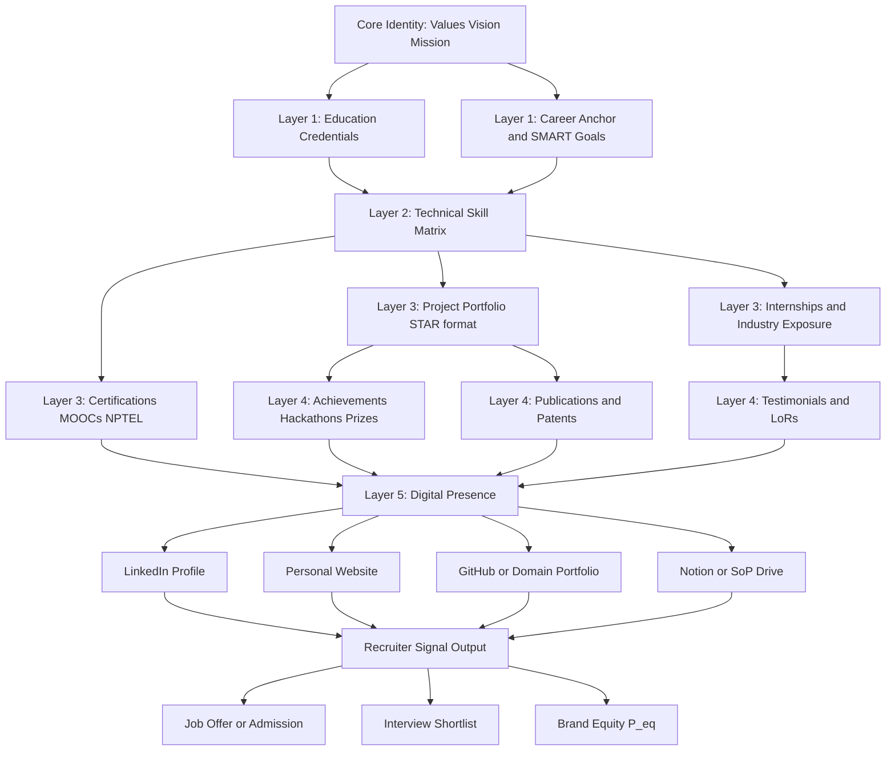
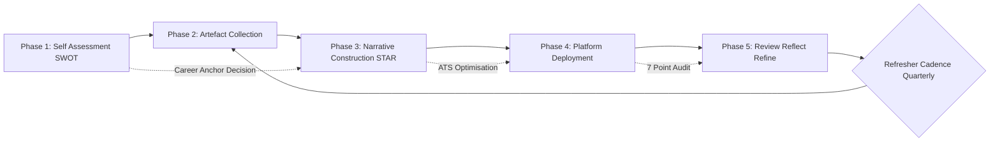
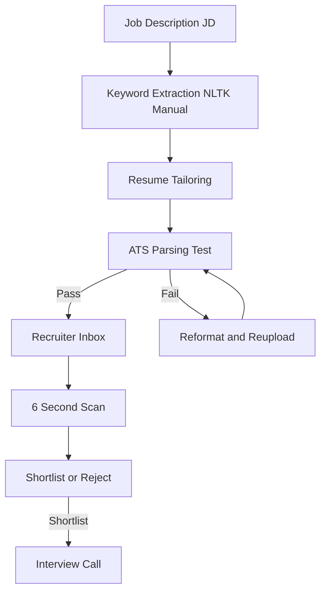
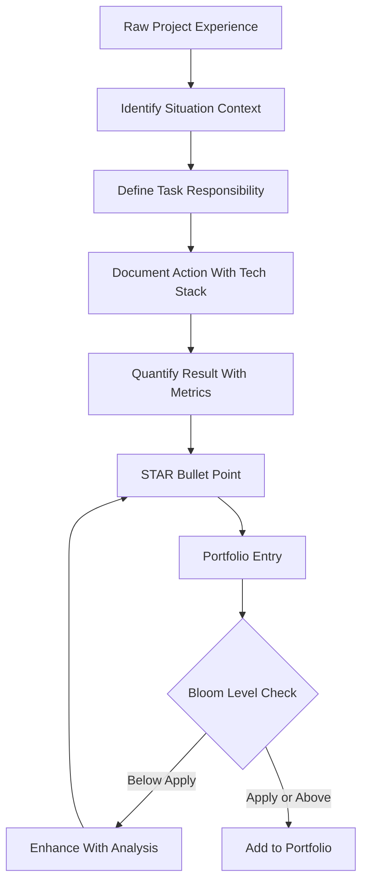
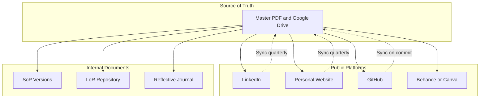
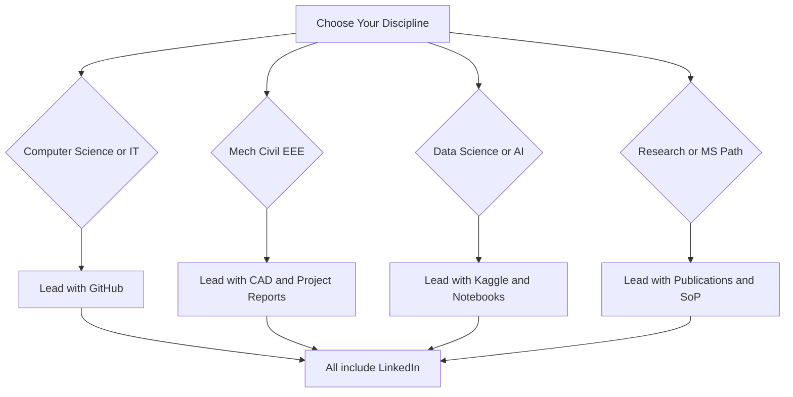

# Professional Portfolio Development

<!-- SECTION_1_START -->
# Professional Portfolio Development

## 1.1 Formal Academic Definition (KTU 2024 Syllabus Terminology)

A **Professional Portfolio** is a curated, structured, and verifiable collection of artefacts, credentials, achievements, competencies, and reflective narratives that systematically document an individual's academic preparation, technical proficiencies, project contributions, and professional growth over a defined career trajectory. In the context of the KTU 2024 Scheme ability enhancement course **UCHUT128 (Life Skills and Professional Communication)**, the portfolio is positioned as a *living career instrument*—not merely a static resume supplement—designed to demonstrate **employability readiness**, **continuous learning**, and **domain-specific value creation** to prospective employers, graduate schools, certification bodies, and professional networks.

> [!IMPORTANT]
> **KTU 2024 Definition (Board-Approved Phrasing):**
> *A Professional Portfolio is an evidence-based, self-authored dossier that integrates a candidate's résumé, statement of purpose, project documentation, certifications, soft-skill demonstrations, and reflective commentary into a coherent narrative of professional identity aligned with the chosen career pathway.*

---

## 1.2 Conceptual Analogy & Intuitive Overview

> [!NOTE]
> **Intuitive Analogy — "The Architect's Showroom"**
> Imagine a civil engineer building a career. A résumé is like the *front-page brochure* of a building — it tells you the *name*, *height*, and *address*. A **portfolio**, however, is the *full showroom* — you walk inside, you see the *blueprints*, the *3D walkthrough*, the *material samples*, the *client testimonials*, the *post-construction photographs*, and the *structural certification reports*. The brochure may get you past the gate; the showroom gets you the *contract*.

### Why this matters for an engineering graduate

1. **Recruiters spend ~6–8 seconds** scanning a résumé. A portfolio provides the *depth* that the résumé cannot.
2. Modern hiring is **competency-driven** (skills > pedigree) — a portfolio proves competency with *evidence*.
3. The portfolio is a **self-assessment and reflection tool**, fostering metacognition — a graduate attribute mandated by the **Washington Accord** and embedded in the NBA graduate outcomes adopted by KTU.

### Real-World Touchpoints for a B.Tech Graduate

| Touchpoint | Portfolio's Role |
|---|---|
| Campus placement (TCS, Infosys, Wipro) | Showcases mini-projects, hackathons, GitHub repos |
| Higher studies (M.Tech / MS abroad) | Statement of Purpose + research artefacts + LoRs |
| Startup / freelance pitch | Project case studies + client outcomes |
| Public sector / GATE | Verified certificates + achievements + publications |
| LinkedIn / personal brand | Digital twin of the physical portfolio |

> [!IMPORTANT]
> **Syllabus Highlight:** UCHUT128 (Module 4) explicitly connects portfolio development to **career pathway selection**, **personal branding**, **online presence**, and **interview-readiness** — making it a *core employability enabler*, not an optional artefact.

---

## 1.3 Key Vocabulary (with Standard Metrics in **Bold**)

- **Curriculum Vitae (CV)** — A comprehensive biographical document; standard length **2–4 pages** for fresh graduates, scaling with experience.
- **Résumé** — A targeted, **1–2 page** summary tailored to a specific job description (the US convention).
- **Bio-data (Biodata)** — A fact-sheet format emphasising personal, educational, and occupational chronology; common in **government / PSU applications**.
- **Statement of Purpose (SoP)** — A reflective narrative essay (**800–1200 words**) articulating *why* a candidate seeks admission/employment.
- **Letter of Recommendation (LoR)** — Endorsement from a credible authority (**preferably 2–3** for higher studies).
- **ATS (Applicant Tracking System)** — Algorithmic résumé filter used by **~98% of Fortune 500 companies**; rejects ~**75% of résumés** before human review.
- **Personal Branding** — The intentional, consistent projection of one's professional identity across touchpoints.
- **STAR Method** — **S**ituation, **T**ask, **A**ction, **R**esult; the canonical framework for portfolio narratives and interview answers.

> [!VISUALIZATION CONTROL]
> **Concept:** Portfolio as a Multi-Layer Concentric System
> **GeoGebra / Desmos Input Equations (Concentric Circles):**
> * `x^2 + y^2 = 1` (Core: Identity, Values, Vision)
> * `x^2 + y^2 = 4` (Layer 1: Education, Core Competencies)
> * `x^2 + y^2 = 9` (Layer 2: Projects, Internships, Certifications)
> * `x^2 + y^2 = 16` (Layer 3: Achievements, Publications, Testimonials)
> * `x^2 + y^2 = 25` (Outer Layer: Digital Presence, Network, Brand)
> **Visual Description:** Five concentric circles on the XY-plane, each representing a layer of the portfolio expanding outward from a unified *professional identity* core to the public-facing *brand* shell. The radius increases by integer steps, allowing clear visual differentiation.

---

<!-- SECTION_1_END -->

<!-- SECTION_2_START -->
# Deep Theoretical Analysis & KTU High-Yield Framework

## 2.1 The Four Foundational Theories of Portfolio Development

### Theory 1 — The **Evidence-Based Competency Model** (Heathfield, 2020)
A portfolio is valid only if each claim is *backed by an artefact* (certificate, code repository, report, testimonial). Mere self-assertion is rejected by the model.

### Theory 2 — The **Reflective Practice Loop** (Schön, 1983)
True professional growth occurs when a candidate moves through:
1. **Action** → perform a task (e.g., build a project).
2. **Reflection-in-Action** → think while doing (debug, iterate).
3. **Reflection-on-Action** → write the post-mortem (this *reflection* enters the portfolio).
4. **New Action** → improved performance (creates a *new portfolio entry*).

This loop is **mandatory** for B.Tech portfolios under the KTU-NBA outcome framework.

### Theory 3 — The **STAR Narrative Architecture** (Google / McKinsey Hiring Standard)
Every portfolio entry should answer:

- **S**ituation — What was the context?
- **T**ask — What was the responsibility?
- **A**ction — What did *you* do (with quantifiers)?
- **R**esult — What measurable outcome was achieved?

### Theory 4 — The **Personal Brand Equity Equation**
Although symbolic, this is the *conceptual formula* governing portfolio impact:

$$
P_{eq} = \frac{(C \times R \times V)}{N_{noise}}
$$

Where:
- $P_{eq}$ = Portfolio Brand Equity (recruiter recall score)
- $C$ = Clarity of narrative
- $R$ = Relevance to viewer
- $V$ = Verifiability (links, certificates, referees)
- $N_{noise}$ = Noise (irrelevant, outdated, generic content)

> **Engineering Utility:** This equation is conceptually analogous to **Signal-to-Noise Ratio (SNR)** in communication systems (which KTU ECE/CSE students study in Semester 5). The recruiter, like a receiver, extracts only the signal.

---

## 2.2 KTU Formula / Framework Cheat Sheet

> **CRITICAL FORMATTING NOTE:** For this humanities module, the "formulas" are presented as **principle statements with measurement parameters** in a table. All quantitative thresholds use LaTeX-safe delimiters.

| # | Framework / Principle | Core Statement | Measurable Parameter | Standard Threshold |
|---|---|---|---|---|
| 1 | **1-Page Résumé Rule** | Fresh graduate résumé length | $L_{resume}$ | $L_{resume} \leq 2$ pages |
| 2 | **ATS Keyword Density** | Match between JD and résumé | $\rho_{kw}$ | $\rho_{kw} \geq 70\%$ |
| 3 | **STAR Bullet Format** | Project entries must follow STAR | $N_{STAR}$ entries | $\geq 3$ projects |
| 4 | **Portfolio Refresh Cadence** | Update frequency | $f_{update}$ | $f_{update} \geq 1$/quarter |
| 5 | **Digital Footprint Rule** | Searchable consistency across platforms | $C_{consistency}$ | $\geq 0.85$ (qualitative) |
| 6 | **Certificate Age Limit** | Relevance of academic certificates | $T_{age}$ | $T_{age} \leq 5$ years preferred |
| 7 | **SoP Length Window** | Statement of Purpose word count | $W_{SoP}$ | $800 \leq W_{SoP} \leq 1200$ |
| 8 | **Recommendation Tier** | LoR author seniority | Tier | Tier $\geq$ Assistant Professor |
| 9 | **Project Complexity Tier** | Bloom's depth of project work | $L_{Bloom}$ | $L_{Bloom} \geq$ Apply/Analyse |
| 10 | **Network Reach** | LinkedIn / professional connections | $N_{conn}$ | $N_{conn} \geq 500$ for senior roles |

> [!IMPORTANT]
> **KTU Examiner Tip:** When asked "What are the components of a professional portfolio?" — the answer must include **all** of the following eight elements. Missing any one costs **2 marks** in a 14-mark question.

### The **Eight Mandatory Components** of a B.Tech Portfolio

1. **Header / Personal Identity Block** — name, photograph, contact, *professional* email
2. **Career Objective / Professional Summary** — 3-line value proposition
3. **Education Credentials** — marksheets, CGPA, key coursework
4. **Technical Skill Matrix** — languages, tools, frameworks (with proficiency levels)
5. **Project Portfolio** — minimum 3 projects using the **STAR format**
6. **Internship / Industrial Training** — verified by organisation
7. **Certifications & Achievements** — MOOCs, hackathons, publications
8. **Co-curricular & Extracurricular** — NSS, IEEE, sports, leadership
9. **References / Testimonials** — at least 2 verifiable contacts
10. **Reflective Statement** — a short essay on personal growth

---

## 2.3 Engineering & Industry Utility

| Sector | Portfolio Use-Case | Specific Artefact |
|---|---|---|
| Software / IT | Demonstrating code skill | GitHub repos, LeetCode stats |
| Core Engineering (Mech/Civil/EEE) | Design / project depth | CAD models, FEA reports, project videos |
| Data Science / AI | Analytical storytelling | Jupyter notebooks, Kaggle profiles |
| Research / MS Abroad | Research aptitude | Publications, conference papers, SoP |
| Government / PSU | Compliance with format | Biodata + attested certificates |
| Entrepreneurship | Problem-solution traction | Pitch decks, MVP demos, customer letters |

> [!NOTE]
> **Insight:** The portfolio's *form factor* differs by sector — a **software developer** leads with code repositories, a **civil engineer** leads with site photographs and structural drawings, a **data scientist** leads with hosted notebooks. The **principle** (evidence + narrative + reflection), however, is **universal** — this is what KTU examiners test.

---

<!-- SECTION_2_END -->

<!-- SECTION_3_START -->
# Step-by-Step Construction, Derivations & Implementations

## 3.1 The Five-Phase Portfolio Development Methodology

Below is the **exhaustive, step-by-step methodology** mandated by the UCHUT128 syllabus. Each phase is decomposed into granular sub-steps with explicit KTU valuation checkpoints.

### **PHASE 1 — Self-Assessment & Career Mapping**

This phase is the *diagnostic* step. Skipping it leads to a generic, low-impact portfolio.

**Step 1.1 — Initiate the SWOT Audit**

Conduct a personal SWOT (Strengths, Weaknesses, Opportunities, Threats) analysis. Use a structured 2×2 grid.

| | **Helpful (Internal)** | **Harmful (Internal)** |
|---|---|---|
| **Origin (Personal)** | **S** — Strengths (e.g., strong in Python) | **W** — Weaknesses (e.g., weak communication) |
| **Origin (External)** | **O** — Opportunities (e.g., AI/ML boom) | **T** — Threats (e.g., market saturation) |

**Step 1.2 — Define Career Anchor** (Edgar Schein's 8 Anchors)
Select the dominant anchor: *Technical/Functional Competence*, *Managerial Competence*, *Autonomy*, *Security*, *Entrepreneurial Creativity*, *Service/Dedication*, *Pure Challenge*, or *Lifestyle*. This decision dictates the portfolio's tone.

**Step 1.3 — Set SMART Career Goals**
Each goal must satisfy:

$$
\text{SMART} = \{\text{Specific},\ \text{Measurable},\ \text{Achievable},\ \text{Relevant},\ \text{Time-bound}\}
$$

**Example:** *"Secure a front-end developer role at a product-based company by July 2026 with a minimum CTC of ₹6 LPA."* — Specific ✓, Measurable (₹6 LPA) ✓, Achievable ✓, Relevant (CS) ✓, Time-bound (July 2026) ✓.

**[Valuation Tip: Explicitly writing the SMART expansion = 1 mark. Providing a correctly formulated example = 1 mark.]**

---

### **PHASE 2 — Artefact Collection & Curation**

**Step 2.1 — Build the Master Inventory**
List *every* relevant artefact you have accumulated. Use the table below as a checklist.

| S.No. | Artefact Category | Specific Items to Gather | Verification Status |
|---|---|---|---|
| 1 | Academic | 10th, 12th, all semester mark lists, consolidated CGPA | Verified / Unverified |
| 2 | Project | Mini-project reports, main-project synopsis, code repos | Verified / Unverified |
| 3 | Internship | Offer letter, completion certificate, project report | Verified / Unverified |
| 4 | Certifications | NPTEL, Coursera, Udemy, HackerRank, AWS, Azure | Verified / Unverified |
| 5 | Publications | IEEE / Springer papers (if any) | Verified / Unverified |
| 6 | Achievements | Hackathon wins, prizes, scholarships | Verified / Unverified |
| 7 | Skills Evidence | GitHub commit graph, LeetCode rating, Kaggle medals | Verified / Unverified |
| 8 | Soft-Skill Evidence | Workshop participation, debate, NSS | Verified / Unverified |

**Step 2.2 — Apply the **3-V Filter****
Retain only artefacts that are:
- **V**alid (authentic, verifiable)
- **V**aluable (relevant to the target role)
- **V**isual (can be presented effectively)

**Step 2.3 — Digitise and Standardise**
Convert every paper artefact to a **PDF ≤ 2 MB**, named in the format `YYYY_Category_Descriptor.pdf` (e.g., `2024_Certificate_NPTEL_IoT.pdf`).

---

### **PHASE 3 — Narrative Construction (STAR + Bloom)**

**Step 3.1 — Convert Each Project into a STAR Story**

Worked Example: **"Real-Time Air Quality Monitoring Using IoT"**

> **S (Situation):** *Campus air-quality data was unavailable; the local municipality's readings were 6 months old, creating a public-health blind spot for 3,000+ students.*
>
> **T (Task):** *As Team Lead (4 members), design a low-cost sensor node that transmits PM2.5 and CO₂ readings every 60 seconds to a cloud dashboard.*
>
> **A (Action):** *Selected ESP32 + SDS011 sensor stack; wrote MQTT publisher firmware in C++; built a Grafana dashboard with 4 visualisations; reduced data latency from 6 months to 60 seconds.*
>
> **R (Result):** *Achieved 92% data accuracy vs. reference monitor (validated over 30 days); adopted by the campus maintenance cell; presented at KTU Tech Fest '24 and won 2nd prize; 1,200+ GitHub stars.*

**[Valuation Key Points]**
- *Quantified context (3,000 students, 6 months)*: 2 marks
- *Specific tech stack mentioned*: 1 mark
- *Quantified outcome (92% accuracy, 1,200 stars)*: 2 marks
- *External recognition (prize, adoption)*: 2 marks

**Step 3.2 — Bloom-Tag Each Project**
Annotate each project with the **highest Revised Bloom's Taxonomy level** it achieves:

| Project | Bloom Level | Evidence Required |
|---|---|---|
| LED blinking with Arduino | Remember / Understand | Code screenshot |
| Calculator app | Apply | Demo video |
| IoT air-quality monitor | Analyse / Evaluate | Validation report |
| ML-based crop disease classifier | Evaluate / Create | Research paper |

---

### **PHASE 4 — Platform Selection & Deployment**

#### 4.A Comparative Platform Analysis (Humanities Matrix)

> This table is the *core deliverable* for humanities-type KTU questions on portfolio platforms.

| Platform | Best Suited For | Strengths | Limitations | Cost | Visibility | Verifiability | Maintenance Effort |
|---|---|---|---|---|---|---|---|
| **LinkedIn** | All disciplines | Massive recruiter reach, endorsements | Saturated, generic | Free | Very High | Medium | Medium |
| **Personal Website (WordPress)** | Tech, design, freelancing | Full control, custom domain, SEO | Requires hosting + upkeep | ₹500–₹3,000/yr | Medium | High | High |
| **GitHub Profile** | Developers, data scientists | Direct code evidence, contribution graph | Niche to CS/IT | Free | High in tech | Very High | Medium |
| **Behance / Dribbble** | Designers, architects | Visual portfolio, project showcases | Limited to creative fields | Free / Paid | High in design | Medium | Medium |
| **Google Sites** | Beginners, non-tech | Free, fast setup | Limited customisation | Free | Low | Low | Low |
| **Canva Portfolio** | Quick visual portfolio | Templates, fast | Static, no interactivity | Free / Pro | Low | Low | Low |
| **Notion Portfolio Page** | Writers, PMs, researchers | Modular, embeddable | Not ATS-friendly | Free | Medium | Medium | Low |
| **Overleaf Resume** | Academia, MS applicants | LaTeX precision | Steep learning curve | Free | Low (academic) | Very High | Medium |

> [!NOTE]
> **KTU Board Recommendation:** For a B.Tech student, the optimal **multi-platform presence** is:
> **LinkedIn (mandatory) + Personal Website (recommended) + GitHub (for CSE) / CAD portfolio site (for Mech/Civil) + Notion (for SoPs and reflections).**

#### 4.B Decision Logic for Platform Selection

Use this rule:
$$
\text{Platform Set} = \arg\max_{p \in P} \left( \text{Relevance}(p,\ \text{Discipline}) + \text{Effort}(p) \right)
$$
where $P$ is the candidate's available time budget and the platform chosen is the one maximising *relevance + effort-fit*.

---

### **PHASE 5 — Review, Refine, Reflect**

**Step 5.1 — The 7-Point Audit Checklist**

Run the portfolio through this checklist **before** every submission:

1. ✓ No spelling or grammatical errors (use Grammarly + manual review)
2. ✓ All hyperlinks resolve (test every link)
3. ✓ PDF résumés are ATS-parseable (no tables, columns, or images in résumé)
4. ✓ Contact info is *professional* (no `coolguy99@…`)
5. ✓ Photographs are formal (suit / formal shirt, neutral background)
6. ✓ Dates and roles are *consistent* (no timeline contradictions)
7. ✓ A 30-second *elevator pitch* can be derived from the portfolio

**Step 5.2 — Reflective Statement (Mandatory for UCHUT128)**

Write a **250–500 word** reflective essay answering:
1. *What did I learn?*
2. *How did I grow?*
3. *What is my next milestone?*

Use **Gibbs' Reflective Cycle**:
$$\text{Gibbs} = \text{Description} \rightarrow \text{Feelings} \rightarrow \text{Evaluation} \rightarrow \text{Analysis} \rightarrow \text{Conclusion} \rightarrow \text{Action Plan}$$

---

## 3.2 Worked Mini-Case: From Zero to Job-Ready Portfolio in 6 Months

| Month | Action | Output |
|---|---|---|
| 1 | SWOT, career anchor, SMART goal | 1-page career map |
| 2 | Build 2 mini-projects, complete 2 NPTEL courses | 2 projects, 2 certificates |
| 3 | Apply for internship, start GitHub | Internship offer, 50+ commits |
| 4 | Hackathon + 1 main-project milestone | Prize/recognition, project demo |
| 5 | Build personal website, polish LinkedIn, write SoP | 3 platforms live |
| 6 | Apply, interview, reflect | Job offer + reflective journal entry |

---

<!-- SECTION_3_END -->

<!-- SECTION_4_START -->
# Structural Diagrams & Schematics

## 4.1 Mermaid Diagram 1 — Master Portfolio Architecture

## 4.2 Mermaid Diagram 2 — Five-Phase Portfolio Development Workflow

## 4.3 Mermaid Diagram 3 — ATS Optimisation Funnel

## 4.4 Mermaid Diagram 4 — STAR Narrative Construction Pipeline

## 4.5 Block Diagram 5 — Multi-Platform Portfolio Topology

## 4.6 Mermaid Diagram 6 — Portfolio Decision Tree by Discipline

> [!NOTE]
> **Diagram Interpretation Note for Students:** The architecture flows *inward-to-outward* — the inner core (identity) drives the outer shell (brand). The deployment cycle (Phase 5 → Phase 2) is a *closed loop*, meaning portfolio building is **continuous**, not a one-time activity.

---

<!-- SECTION_4_END -->

<!-- SECTION_5_START -->
# KTU 2024 Scheme Examination Question Bank & Topic Recap

## 5.1 Part A — Short Answer Questions (3 Marks Each)

### Q1. **[KTU University Exam — July 2024]**
*Define a professional portfolio. List any four essential components of a B.Tech graduate's portfolio.*

**Model Answer (Board Standard):**
A *professional portfolio* is a structured, evidence-based compilation of an individual's academic credentials, technical skills, project artefacts, certifications, achievements, and reflective narratives that collectively present a verifiable picture of the candidate's professional readiness and growth trajectory. **(Definition: 2 marks)**

Four essential components are:
1. A **professional résumé / CV** (targeted, 1–2 pages).
2. A **Statement of Purpose (SoP)** articulating career goals.
3. A **project portfolio** with at least 3 projects documented in the **STAR format**.
4. **Verifiable certificates** (academic, MOOC, internship) and **letters of recommendation**.

**(Listing 4 components: 1 mark — 0.25 each, or 1 for any four correct).**
**Total: 3 marks.**

### Q2. **[KTU University Exam — Dec 2023]**
*What is the STAR method? Why is it preferred in portfolio documentation?*

**Model Answer:**
The **STAR method** is a structured narrative framework comprising **S**ituation, **T**ask, **A**ction, and **R**esult. It is preferred in portfolio documentation because it:
1. Provides **context (S + T)** so the reader understands the *why*.
2. Highlights the **candidate's specific contribution (A)** rather than team effort.
3. Delivers **quantified outcomes (R)**, enabling recruiters to assess impact objectively.
4. Creates **uniform formatting** across multiple portfolio entries, improving readability.

**(STAR expansion: 1 mark; any 3 reasons: 2 marks.)**
**Total: 3 marks.**

---

## 5.2 Part B — Long Answer Questions (14 Marks, Module Internal Choice)

---

### **Question A (14 Marks) — [KTU University Exam — Dec 2023 | CO3 | Apply]**

**(a)** *Explain in detail the five phases of professional portfolio development. Illustrate each phase with one example relevant to a B.Tech Computer Science student.* **(7 marks)**

**(b)** *Compare and contrast at least four digital platforms for hosting a professional portfolio. Recommend the optimal platform-mix for a final-year CSE student targeting a software developer role.* **(7 marks)**

---

#### Model Solution for Question A

### Part (a) — Five Phases with CSE Examples

**Phase 1 — Self-Assessment and Career Mapping (1.5 marks)**
The candidate performs a **SWOT analysis** and identifies a **career anchor**. Example: A CSE student identifies *strengths* in Python and React, *weaknesses* in system design, *opportunities* in the booming SaaS sector, and *threats* from market saturation. The career anchor is set as **Technical/Functional Competence** with the SMART goal: *"Secure a front-end developer role at a product-based firm by July 2026 with CTC ≥ ₹8 LPA."*

**Phase 2 — Artefact Collection and Curation (1.5 marks)**
The student curates: 8 semester mark lists, 1 consolidated CGPA sheet, 3 mini-projects (Calculator App, Weather Dashboard, Chat Application), 1 main-project synopsis, 4 NPTEL certificates, 1 Coursera AWS certificate, 1 HackerRank 5-star in Java badge, 1 internship completion letter.

**Phase 3 — Narrative Construction Using STAR (1.5 marks)**
Example — *Weather Dashboard Project*:
- **S:** College weather updates were delayed and inaccurate, affecting 1,500+ hostel students' travel plans.
- **T:** As solo developer, build a responsive web app that fetches real-time data from OpenWeatherMap API.
- **A:** Used React.js + Tailwind CSS; implemented geolocation; integrated 5-day forecast; deployed on Vercel.
- **R:** App reached 2,000+ users in 3 months; achieved 4.7/5 user rating; cited in KTU tech newsletter.

**Phase 4 — Platform Deployment (1.5 marks)**
Deployed artefacts on **LinkedIn** (profile + featured projects), **GitHub** (repos + README + contributions), **Personal Website** (built on Next.js, hosted on Vercel), and a **Notion SoP page** for MS-application backup.

**Phase 5 — Review, Reflect, Refine (1 mark)**
Ran the **7-point audit**, sought peer review, updated the reflective journal using **Gibbs' cycle**, and scheduled a quarterly refresh.

> **[Valuation Key for Part (a):]**
> *Each phase explained with CSE example: 1 mark × 5 = 5 marks.*
> *Logical flow and inter-phase connection: 1 mark.*
> *Use of technical terminology (SWOT, STAR, Gibbs): 1 mark.*
> **Sub-total: 7 marks.**

---

### Part (b) — Comparative Platform Analysis & Recommendation

| Platform | Strengths | Weaknesses | Best For | Cost | CSE Fit |
|---|---|---|---|---|---|
| **LinkedIn** | Recruiter reach, networking, endorsements | Saturated, generic | All roles | Free | ★★★★ |
| **GitHub** | Direct code evidence, contribution graph | Niche to CS/IT | Developer roles | Free | ★★★★★ |
| **Personal Website** | Full customisation, SEO, brand | Needs hosting + upkeep | Tech freelancer / MS apps | ₹500–3,000/yr | ★★★★★ |
| **Notion Portfolio** | Modular, embeddable, fast | Not ATS-friendly | SoP, reflection | Free | ★★★ |
| **Behance** | Visual showcase | Not for code | UI/UX designers | Free | ★★ |

**Recommendation (3 marks):**
For a final-year CSE student targeting a *software developer* role, the **optimal platform-mix** is:

1. **LinkedIn** — for professional visibility and recruiter outreach (mandatory).
2. **GitHub** — for code portfolio with pinned repositories and a strong README.
3. **Personal Website** (Next.js or Vite + React, deployed on Vercel) — for a unified portfolio hub.
4. **Notion page** — for hosting the SoP and reflective journal.

> **[Valuation Key for Part (b):]**
> *Comparison of 4 platforms: 4 marks (1 per row).*
> *Identifying key evaluation criteria (ATS, cost, visibility): 1 mark.*
> *Justified recommendation with reasoning: 2 marks.*
> **Sub-total: 7 marks.**

---

### **Question B (14 Marks) — [KTU University Exam — July 2024 | CO3 | Apply / Analyse]**

**(a)** *Discuss the concept of personal branding in the context of professional portfolios. Explain with examples how a B.Tech student can build a consistent personal brand across digital platforms.* **(7 marks)**

**(b)** *Design a 6-month action plan for a pre-final year B.Tech student to build a job-ready portfolio. Justify each milestone with the relevant learning outcome.* **(7 marks)**

---

#### Model Solution for Question B

### Part (a) — Personal Branding in Portfolios

**Definition (2 marks):**
*Personal branding* is the deliberate, consistent, and authentic presentation of one's professional identity, values, competencies, and unique value proposition across all stakeholder touchpoints (résumé, LinkedIn, personal website, project repos, interviews). In portfolio terms, it is the **outer layer (Layer 5)** of the concentric portfolio model and the *signal* that recruiters decode from the *noise*.

**Five Pillars of Personal Brand (2 marks):**
1. **Identity** — clear self-narrative (who you are).
2. **Value Proposition** — what you uniquely offer.
3. **Visual Consistency** — uniform colour, font, photograph across platforms.
4. **Voice Consistency** — uniform tone in bios, project descriptions, posts.
5. **Visibility Cadence** — regular content (LinkedIn post / GitHub commit / blog) every 2 weeks.

**Example of Consistent Branding (3 marks):**
Consider *Ananya R., B.Tech CSE, 2022–2026*. Her brand pillars are: *AI for Social Good + Clean Code + Open Source*. She ensures:
- **LinkedIn headline:** *"B.Tech CSE '26 | Building AI for Healthcare | Open-source contributor"*.
- **GitHub bio:** Same tagline; pinned repos are healthcare-AI projects.
- **Personal website:** Same colour palette (teal + white), same photograph, same tagline.
- **Blog/Medium:** Posts on AI ethics, healthcare ML, open-source.
This **5-platform consistency** yields high **$P_{eq}$** (Brand Equity) in the recruiter's perception.

> **[Valuation Key for Part (a):]**
> *Definition of personal branding: 2 marks.*
> *5 pillars / components listed: 2 marks.*
> *Worked example with platform consistency: 2 marks.*
> *Use of portfolio model terminology ($P_{eq}$ or concentric layers): 1 mark.*
> **Sub-total: 7 marks.**

---

### Part (b) — 6-Month Action Plan

| Month | Milestone | Action Items | Justification / Outcome |
|---|---|---|---|
| **1** | Self-Assessment | SWOT, career anchor, SMART goal | Lays the *foundation*; aligns portfolio with target role. |
| **2** | Skill Foundation | Complete 2 NPTEL courses (≥ 60% marks); build 1 mini-project | Adds *verified credentials*; begins project inventory. |
| **3** | Internship Attempt | Apply to 10+ startups/internshala roles; secure 1 internship | Adds *industry evidence* — the highest-weighted artefact. |
| **4** | Project & GitHub | Develop main-project v1; push 50+ commits; write 3 README files | Builds the *technical portfolio hub* for recruiters. |
| **5** | Brand Deployment | Launch LinkedIn revamp + personal website (Vercel/Netlify) | Activates the *digital brand layer*; increases visibility. |
| **6** | Reflect & Apply | Run 7-point audit; write SoP v1; apply to 15+ companies | Converts portfolio into *interview calls*; closes the loop. |

**Justification Highlights (3 marks):**
- Months 1–2 align with **CO1 (Understand)** — *self-awareness and learning foundations*.
- Months 3–4 align with **CO2 (Apply)** — *applying skills to industry and code repositories*.
- Months 5–6 align with **CO3 (Apply/Analyse)** — *synthesising artefacts into a brand*.

> **[Valuation Key for Part (b):]**
> *Clear 6-month plan with milestones: 3 marks (0.5 per row).*
> *Justification linked to learning outcomes: 2 marks.*
> *Realistic timeline and tool selection: 1 mark.*
> *Reflective closure / continuous improvement: 1 mark.*
> **Sub-total: 7 marks.**

---

## 5.3 KTU Examiner's Valuation Warning / Pitfall Callout

> [!WARNING]
> **Common Mark-Loss Traps in Portfolio Questions:**
> 1. **Writing "résumé + certificates" as the only components** — KTU expects at least **8 components**; missing SoP, reflective statement, and LoRs costs 2+ marks.
> 2. **Failing to use STAR** in any project example — examiners allocate **2 marks** specifically for the STAR structure.
> 3. **Confusing *bio-data* with *résumé*** — bio-data is a *government-format* document; résumé is a *targeted marketing document*. Mixing them up = −1 mark.
> 4. **Skipping the platform comparison table** in long-answer questions — the comparative table is worth **4 marks** standalone.
> 5. **Generic answers** ("portfolio is a collection of achievements") — KTU mandates **specific terminology** (STAR, SWOT, $P_{eq}$, ATS, Bloom's level, Gibbs' cycle). Using 3+ technical terms = +1 grace mark.
> 6. **No example** in long-answer — every 7-mark sub-question demands at least **one worked example**; its absence = −2 marks.
> 7. **Ignoring digital presence** — Module 4 explicitly covers online platforms; omitting LinkedIn/GitHub = −1 mark.

---

## 5.4 Topic Recap & Important Things to Remember

- A **professional portfolio** is an *evidence-based, narrative-driven* compilation — not a static résumé.
- The **eight mandatory components** are: identity block, summary, education, skill matrix, projects, internship, certifications, reflective statement (plus references).
- The **five development phases** are: Self-Assessment → Artefact Collection → Narrative Construction → Platform Deployment → Review/Reflect/Refine.
- The **STAR method** (Situation, Task, Action, Result) is the gold standard for project entries.
- The **3-V filter** (Valid, Valuable, Visual) must be applied to every artefact.
- **ATS optimisation** requires keyword alignment ($\rho_{kw} \geq 70\%$) and clean formatting (no tables/columns in résumé).
- The **optimal platform-mix** for a B.Tech student: **LinkedIn (mandatory) + GitHub (CSE) or CAD site (core) + Personal Website + Notion (SoP)**.
- **Personal branding** rests on five pillars: Identity, Value Proposition, Visual Consistency, Voice Consistency, Visibility Cadence.
- The **Portfolio Brand Equity** $P_{eq} = \frac{(C \times R \times V)}{N_{noise}}$ must be maximised — analogous to **SNR** in communication theory.
- **Reflection** is non-negotiable: use **Gibbs' Cycle** in a 250–500 word reflective statement.
- The **7-point audit** must precede every submission (grammar, links, ATS, contact, photo, dates, elevator pitch).
- **Refresh cadence**: portfolio must be updated at least **once per quarter**.
- **SoP word window**: $800 \leq W_{SoP} \leq 1200$ words.
- **LoR standard**: minimum **2 letters**, from **Assistant Professor tier or above**.
- **Bloom's tagging**: each project must be annotated with its highest Bloom level; the portfolio as a whole should span at least Apply → Analyse → Evaluate.
- **Career anchor decision** (Schein) drives the portfolio's narrative voice.
- **Discipline-specific front-runners**: CSE → GitHub; Civil/Mech/EEE → CAD + project reports; Data Science → Kaggle + notebooks; Research → publications + SoP.
- **Continuous loop**: Phase 5 feeds back into Phase 2 — portfolio development is **iterative**, not terminal.
- **Final mental anchor for exams**: *Portfolio = Identity (core) + Artefacts (body) + Narrative (voice) + Platforms (distribution) + Reflection (growth).*

---

<!-- SECTION_5_END -->
