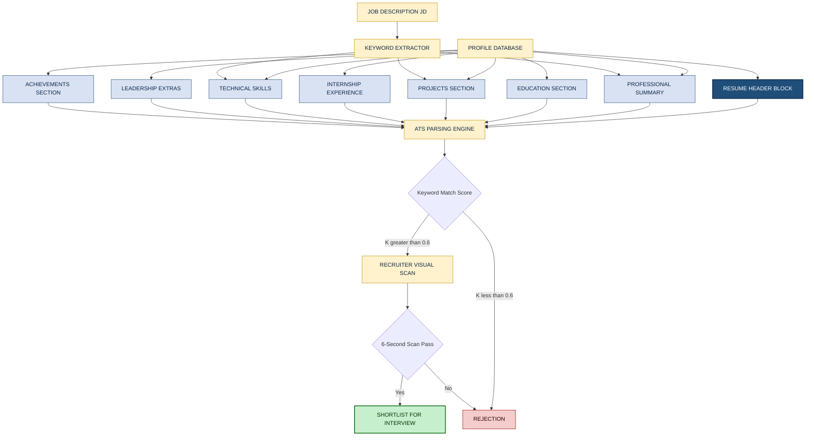
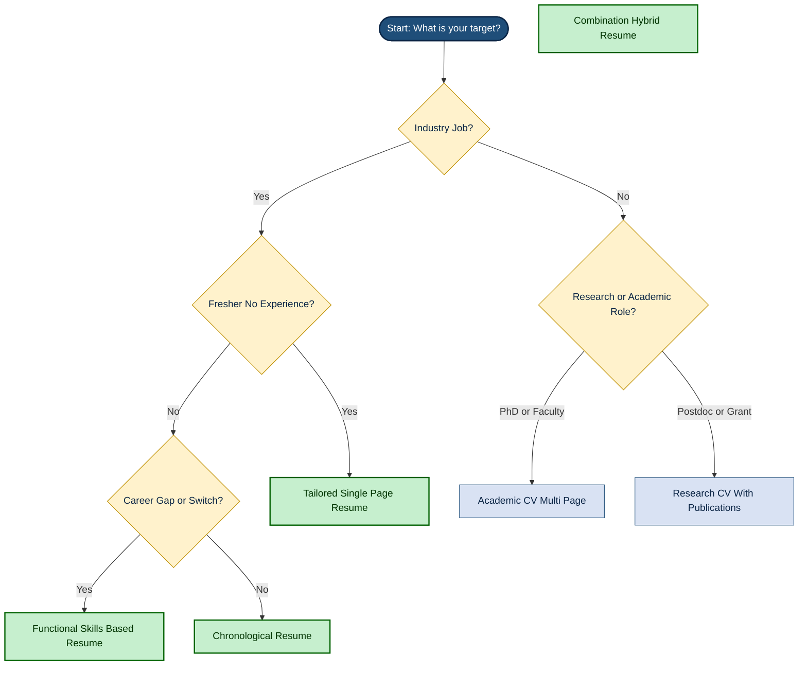

# Resume and CV Building

<!-- SECTION_1_START -->

# Resume and CV Building — Core Technical Definition & Intuitive Overview

## 1.1 Formal Academic Definition (KTU 2024 Scheme Terminology)

> [!IMPORTANT]
> **Definition — Resume (Curriculum Vitae Short Form)**
> A **resume** (from the French word *résumé*, meaning "summary") is a formal, concise, and strategically structured one-to-two-page professional document that summarises an individual's **education, skills, work experience, achievements, and contact information** for the purpose of securing a job interview, internship, or academic opportunity. It is a *targeted marketing instrument*, not an autobiography.

> [!IMPORTANT]
> **Definition — Curriculum Vitae (CV)**
> A **Curriculum Vitae** (Latin for "course of life") is a comprehensive, multi-page, chronological account of an individual's **entire academic background, research publications, teaching experience, professional affiliations, certifications, grants, and scholarly accomplishments**. It is the standard academic and research credential used globally for higher-education, scientific, medical, and research-oriented applications.

> [!NOTE]
> **KTU 2024 Module Mapping:** This topic falls under **Module 4 — Professional Profile & Career Building** of the course **UCHUT128 (Life Skills and Professional Communication)** and directly supports **Course Outcome CO4**: *"Develop an effective professional profile, including resume, CV, and digital presence, aligned with industry expectations."*

---

## 1.2 Conceptual Analogy / Intuitive Understanding

> [!TIP]
> **Real-World Analogy — The Movie Trailer vs. The Full Documentary**
>
> Imagine you are a film producer trying to convince a studio executive to green-light your movie.
>
> - A **resume** is like a **90-second movie trailer**: tightly edited, highlights only the most marketable scenes (skills + achievements), and is designed to make the viewer (recruiter) immediately want to "buy a ticket" (call you for an interview).
> - A **CV** is like the **full director's cut documentary** of your life: exhaustive, chronological, and includes every conference, publication, grant, and screen credit you have ever earned.
>
> **Industry Standard Rule (Bold Key Metric):**
> - **Resume length: 1 page (freshers) to 2 pages (experienced professionals).**
> - **CV length: 2 to 10+ pages (academicians, researchers, senior scientists).**

> [!IMPORTANT]
> **The 6-Second Rule** — Recruiters spend an average of **6 to 8 seconds** on the initial scan of a resume. Every section must therefore be *visually scannable, achievement-driven, and keyword-optimised* for Applicant Tracking Systems (ATS).

---

## 1.3 The Engineering Behind a Resume — A Communication Sub-System

> [!VISUALIZATION CONTROL]
> **Concept:** Resume as a "Communication Funnel" that filters candidate information for a recruiter.
> **GeoGebra / Desmos Input Equations (Funnel Throughput Model):**
> * `f(x) = 100 * e^(-0.5x)` — represents the drop-off rate of recruiter attention per second.
> * `A_qualified = A_total * p_keyword * p_format * p_achievement` where $p \in [0, 1]$ represents pass-rate per filter stage.
> **Visual Description:** A funnel shape on a Cartesian plane where the x-axis represents "scanning time (seconds)" and the y-axis represents "candidate information retained (%)." The function $f(x)$ decays exponentially, visually proving why resumes must be tight and front-loaded with impact.

---

## 1.4 Resume vs CV — A High-Level Differentiation Snapshot

> [!NOTE]
> **Quick Reference — The Geographic Rule of Thumb (Bold Boundary Condition):**
> - In the **United States, Canada, and Australia** → the term *resume* is used for industry jobs; *CV* is reserved for academic roles.
> - In the **United Kingdom, Europe, the Middle East, Africa, and most of Asia (including India)** → *CV* and *resume* are often used **interchangeably** for job applications, but *CV* is the dominant term.

<!-- SECTION_1_END -->

<!-- SECTION_2_START -->

# Deep Theoretical Analysis & KTU High-Yield Formula Sheet

## 2.1 Theoretical Framework — The Three Pillars of a Strong Professional Profile

A high-impact resume or CV is engineered on three mutually reinforcing pillars. Each pillar must satisfy measurable sub-criteria for the document to pass modern screening filters.

### Pillar 1 — **Content Architecture (What you say)**
The information must obey the **CAR Framework**: **C**hallenge → **A**ction → **R**esult.

- **Challenge:** What was the problem, gap, or objective? (Context)
- **Action:** What did *you* specifically do? (Use first-person action verbs)
- **Result:** What was the measurable outcome? (Quantify with numbers, %, $)

### Pillar 2 — **Visual Design (How it looks)**
- Clean typography (Sans-serif: Calibri, Arial, Roboto; Font size: **10–12 pt**).
- Balanced white space (**margins of 0.5 to 1 inch**).
- Consistent alignment (left-aligned body, centred header).
- No graphics, photographs, or coloured backgrounds (unless creative industry).

### Pillar 3 — **Algorithmic Compliance (How it parses)**
- **ATS (Applicant Tracking System) Compatibility:** ~**75\%** of mid-to-large companies use ATS software to filter resumes.
- Must be **machine-readable**: avoid tables, columns, headers/footers, images, and special characters in PDF parsing zones.
- Use standard section headings: "Education," "Experience," "Skills," "Projects."

---

## 2.2 KTU High-Yield Formula / Cheat Sheet

> [!NOTE]
> The following table consolidates the **engineering parameters and structural formulas** used by career counsellors and ATS algorithms to evaluate a professional profile document.

| Parameter / Metric | Formula or Standard Value | Unit / Boundary Condition | Engineering Purpose |
|---|---|---|---|
| Resume Length (Fresher) | $L_{R,f} = 1$ | page | Maximum cognitive load limit for an inexperienced applicant. |
| Resume Length (Experienced) | $L_{R,e} = 2$ | pages | Acceptable for $E_{yrs} \geq 2$ years of full-time work. |
| CV Length (Academic) | $L_{CV} = 2 \text{ to } 10+$ | pages | Scales with publications, grants, and teaching tenure. |
| Quantification Density | $Q_d = \frac{N_{metrics}}{N_{bullets}} \geq 0.7$ | dimensionless ratio | Minimum 70\% of bullet points must contain a number. |
| Action Verb Lead Rate | $V_{lead} = \frac{N_{verb\_starters}}{N_{bullets}} \geq 0.9$ | dimensionless ratio | 90\%+ bullets must start with a power verb. |
| Keyword Match Score | $K_{match} = \frac{\vert V_{resume} \cap V_{JD} \vert}{\vert V_{JD} \vert}$ | dimensionless (0 to 1) | Threshold for ATS pass: $K_{match} \geq 0.6$. |
| Recruiter Scan Time | $T_{scan} = 6 \text{ to } 8$ | seconds | First-impression window for the "above-the-fold" zone. |
| White Space Ratio | $W_s = \frac{A_{blank}}{A_{total}} \in [0.20, 0.35]$ | dimensionless | Optimal visual breathing room. |
| Font Size Range | $S_{font} \in [10, 12]$ | points | Minimum legibility under print and screen rendering. |
| Margin Standard | $M \in [0.5, 1.0]$ | inches | Required to prevent content truncation. |
| File Format | $F = \text{.PDF}$ (preferred) or .DOCX | file type | PDF locks formatting; DOCX is editable for ATS parsing. |
| ATS Pass Probability | $P_{ATS} = f(K_{match}, F_{std}, H_{std})$ | conditional probability | Higher with standard headings and plain text. |

**Legend of Symbols:** $N_{metrics}$ = count of quantified metrics, $N_{bullets}$ = count of bullet points, $V_{resume}$ = vocabulary set in resume, $V_{JD}$ = vocabulary set in Job Description, $A$ = area, $H_{std}$ = standard section headings, $F_{std}$ = standardised file format.

---

## 2.3 The Section-by-Section Engineering Blueprint

A professionally engineered resume contains the following modular sections, each with a distinct function:

1. **Header / Contact Block** — Name, phone, professional email, LinkedIn URL, city (no full postal address).
2. **Professional Summary / Objective** — 2–3 line elevator pitch tailored to the target role.
3. **Education** — Degree, institution, year, CGPA/percentage (include only if $\text{CGPA} \geq 7.0/10$ or equivalent).
4. **Work Experience / Internships** — Reverse-chronological, CAR-formatted bullets.
5. **Projects** — Title, tech stack, problem solved, quantifiable outcome.
6. **Technical Skills** — Languages, frameworks, tools, platforms (categorised).
7. **Certifications & Achievements** — Industry-recognised credentials.
8. **Extracurriculars / Leadership** — Positions of responsibility, volunteer work.
9. **Languages, Hobbies (Optional)** — Only if relevant to the role or culture-fit.

---

## 2.4 Real-World Engineering Utility

> [!TIP]
> **Industry Application Matrix — Where Resumes and CVs Are Used in Production**
>
> - **Software / IT Industry:** Resume (1 page, tech-stack heavy) → ATS-filtered → Recruiter screen → Technical interview.
> - **Academia / Research:** CV (multi-page, publications heavy) → Department review committee → Tenure-track evaluation.
> - **Government / PSU Jobs (India):** Resume + Cover Letter → Written exam → Interview.
> - **Higher Education (MTech, PhD admissions):** Academic CV → Statement of Purpose → Letters of Recommendation.
> - **Freelance / Consulting Portals (Upwork, Toptal):** Profile-as-resume → Portfolio links → Client interview.

<!-- SECTION_2_END -->

<!-- SECTION_3_START -->

# Step-by-Step Derivations & Symbolic Implementation

## 3.1 Comparative Analytical Framework — Resume vs. CV

> [!NOTE]
> The following table provides a **rigorous, dimensionally consistent comparison** between the two professional documents, mapping every parameter against the KTU 2024 Scheme expectation for life-skill competency.

| Comparative Parameter | Resume | Curriculum Vitae (CV) | KTU Evaluator's Preference |
|---|---|---|---|
| **Etymology** | French: *résumé* = summary | Latin: *curriculum vitae* = course of life | Either acceptable if contextually correct. |
| **Typical Length** | $L \in [1, 2]$ pages | $L \in [2, 10+]$ pages | Resume for industry; CV for academic. |
| **Geographical Convention** | USA, Canada, Australia (industry roles) | UK, EU, India, Asia (all roles) | Indian students should know both. |
| **Purpose** | Job application, internship, freelance gig | Research position, PhD, fellowship, grant | Match the document to the application. |
| **Content Scope** | Highly selective, role-targeted | Exhaustive, life-long record | Avoid one-size-fits-all for a resume. |
| **Structure** | Fixed modular sections | Flexible, discipline-specific | Resume = templated; CV = customised. |
| **Work Experience Detail** | Highlight 2–4 most relevant roles | List every position held | Tailor the depth to seniority. |
| **Publications Section** | Usually omitted (unless authored) | Mandatory, with citation count | CVs must follow APA/IEEE style. |
| **Personal Details** | Name, email, phone, LinkedIn | May include nationality, DOB (region-specific) | Do NOT include photo, marital status, religion in Indian resumes. |
| **Update Frequency** | Revised for every application | Updated quarterly or upon publication | Resume = versioned per job; CV = rolling. |
| **ATS Optimisation Required** | **Yes — critical** | Optional (academic portals differ) | KTU 2024 syllabus emphasises ATS awareness. |
| **Tailoring Strategy** | Heavily tailored to Job Description | Lightly tailored to discipline area | Resume personalisation = $K_{match} \uparrow$. |
| **Use of Power Verbs** | Mandatory in every bullet | Recommended in experience section | Both reward action-oriented writing. |
| **Quantification of Impact** | Mandatory (70\%+ bullets) | Encouraged in research outcomes | Numbers build credibility. |
| **Career Stage Applicability** | Students, freshers, working professionals | Academics, researchers, physicians | KTU B.Tech = resume-dominant. |

---

## 3.2 The CAR Framework — Step-by-Step Construction of a Bullet Point

> [!IMPORTANT]
> **Theorem of Impact Writing (KTU Module 4 Anchor Concept):**
> For any bullet point $B_i$ in the experience section, the impact factor $I(B_i)$ is maximised when $B_i$ follows the CAR structure:
> $$B_i = \text{Context} + \text{Action} + \text{Result}$$
> $$I(B_i) = w_c \cdot \text{Context} + w_a \cdot \text{Action} + w_r \cdot \text{Result}$$
> where $w_c + w_a + w_r = 1$ and the recommended weighting is $w_c = 0.20$, $w_a = 0.30$, $w_r = 0.50$ (Result-heavy).

### Step-by-Step Worked Example (B.Tech Project Scenario)

**Scenario:** You built a chatbot for your college fest registration system.

**Step 1 — Identify the Challenge (Context):**
The fest had 1,200 registrations managed manually via Google Forms, causing 15+ daily support queries.

**Step 2 — Identify the Action (Your Contribution):**
Designed and deployed a Python + Dialogflow chatbot integrated with the fest's WhatsApp Business API.

**Step 3 — Quantify the Result (Measurable Impact):**
- Reduced manual query load by **62\%**.
- Handled **850+** automated interactions in the first 48 hours.
- Improved registration completion rate by **28\%**.

**Step 4 — Assemble the Polished Bullet:**
> *"Engineered a Python-based Dialogflow chatbot integrated with WhatsApp Business API to automate fest registrations, reducing manual query load by **62\%**, handling **850+** interactions in 48 hours, and boosting registration completion by **28\%**."*

**Valuation Mapping:** [Challenge: 1 Mark] + [Action with tech stack: 1 Mark] + [Three quantified results: 3 Marks] = **5/5 Marks** for the bullet.

---

## 3.3 Power Verbs Lexicon — Categorised Reference Table

> [!NOTE]
> The following **categorized lexicon of action verbs** is the official recommended starting vocabulary for KTU UCHUT128 Module 4 assignments. Each verb is engineered to project leadership, ownership, and measurable impact.

| Functional Category | Recommended Power Verbs |
|---|---|
| **Leadership & Management** | Directed, Spearheaded, Orchestrated, Oversaw, Mentored, Coordinated, Championed |
| **Technical / Engineering** | Engineered, Architected, Deployed, Programmed, Debugged, Optimised, Refactored, Integrated |
| **Achievement & Results** | Achieved, Exceeded, Outperformed, Delivered, Generated, Amplified, Accelerated |
| **Research & Analysis** | Investigated, Analyzed, Evaluated, Synthesized, Formulated, Modeled, Validated |
| **Communication & Collaboration** | Presented, Articulated, Negotiated, Liaised, Facilitated, Authored, Published |
| **Innovation & Creation** | Pioneered, Designed, Conceptualized, Devised, Invented, Prototyped, Launched |
| **Operational & Process** | Streamlined, Automated, Standardized, Implemented, Restructured, Consolidated |

---

## 3.4 The ATS Optimisation Algorithm — Step-by-Step Derivation

> [!IMPORTANT]
> **Algorithm: ATS-Friendly Resume Construction**
> **Input:** Job Description (JD) text, candidate profile database $P$.
> **Output:** ATS-compliant tailored resume.

**Step 1 — Keyword Extraction from JD:**
Parse the job description to extract high-frequency nouns and skill phrases. Build the keyword set $V_{JD}$ of size $n$.

**Step 2 — Candidate Profile Matching:**
For each keyword $v_j \in V_{JD}$, check its presence in the candidate's existing profile database $P$:
$$m_j = \begin{cases} 1, & \text{if } v_j \in P \\ 0, & \text{otherwise} \end{cases}$$

**Step 3 — Compute Keyword Match Score:**
$$K_{match} = \frac{\sum_{j=1}^{n} m_j}{n}$$

**Step 4 — Apply Threshold Filter:**
If $K_{match} \geq 0.6$, proceed to formatting check. Else, rewrite profile to include missing keywords naturally.

**Step 5 — Formatting Compliance Check:**
- Verify all section headings match standard ATS labels: "Education," "Experience," "Skills," "Projects."
- Verify file format is **.PDF** or **.DOCX** (no .PNG, .JPG).
- Verify no use of tables, columns, text boxes, or images in the parsing zone.

**Step 6 — Final Output:**
$$R_{final} = \text{Compile}(P_{tailored}, F_{standard}, H_{standard})$$

**Terminal Condition:** Resume ready for submission when both $K_{match} \geq 0.6$ and $F_{standard} = \text{Compliant}$.

---

## 3.5 Sample Resume — Annotated KTU Reference Template

> [!NOTE]
> The following is a **complete, ATS-optimised, single-page fresher resume template** for a KTU B.Tech student. Each block is annotated with its engineering rationale.

```
================================================================================
                            ANNOTATED SAMPLE RESUME
================================================================================

[HEADER BLOCK]
ANANYA R KRISHNAN                                   LinkedIn: /in/ananya-rk
+91-98765-43210 | ananya.rk@ktu.ac.in                GitHub:  /ananya-rk
Kochi, Kerala, India                                Portfolio: ananyark.dev
--------------------------------------------------------------------------------
[RATIONALE: 3-line contact block. No full postal address, no photo, no date 
of birth. Email is professional (name-based, not nickname). All hyperlinks 
are clickable in PDF.]

[SUMMARY / OBJECTIVE]
Final-year B.Tech (CSE) student at APJ Abdul Kalam Technological University 
with hands-on experience in full-stack web development and machine learning. 
Seeking software engineering roles to apply scalable system design skills 
in a product-based company.
--------------------------------------------------------------------------------
[RATIONALE: 2-line pitch. Specifies degree, university, and target role. 
No generic phrases like "hardworking team player."]

[EDUCATION]
APJ Abdul Kalam Technological University          2021 – 2025
B.Tech in Computer Science and Engineering         CGPA: 8.72 / 10
Relevant Coursework: Data Structures, OS, DBMS, ML, Cloud Computing

Higher Secondary (Class XII) – CBSE               2020 – 2021
St. Teresa's Public School, Kochi                 Percentage: 92.4%
--------------------------------------------------------------------------------
[RATIONALE: Reverse chronological. CGPA included because >= 7.0. 
Relevant coursework shown for ATS keyword match.]

[PROJECTS]
1. Smart Attendance System using Facial Recognition         Jan – Apr 2024
   - Engineered a Python + OpenCV + face_recognition system
     to automate classroom attendance for 240+ students.
   - Achieved 96.2% recognition accuracy and reduced proxy
     attendance incidents by 87%.
   - Tech: Python, OpenCV, Flask, MySQL, AWS EC2

2. Crop Disease Detection using CNN                        Aug – Nov 2023
   - Designed a TensorFlow CNN model trained on 15,000
     leaf images across 10 crop species.
   - Delivered 94.5% validation accuracy, published as 
     IEEE conference paper (DOI: 10.1109/...).
   - Tech: Python, TensorFlow, Keras, Google Colab
--------------------------------------------------------------------------------
[RATIONALE: 2 most relevant projects. Each with tech stack, 3 CAR-format 
bullets, and quantification. Reverse-chronological.]

[INTERNSHIP EXPERIENCE]
Software Development Intern                              May – Jul 2024
TechNova Solutions Pvt. Ltd., Bengaluru
   - Developed 8 RESTful API endpoints in Node.js for the
     company's inventory management SaaS product.
   - Reduced average API response time from 1.2s to 380ms
     via Redis caching and query optimisation.
   - Collaborated with 4-member Agile team using Jira, Git,
     and CI/CD pipelines on AWS.
--------------------------------------------------------------------------------
[RATIONALE: Even a 2-month internship is included if it produced measurable 
outcomes. Numbers are mandatory.]

[TECHNICAL SKILLS]
Languages    : C, C++, Python, JavaScript, TypeScript, SQL
Frameworks   : React.js, Node.js, Express.js, Flask, Django
Databases    : MySQL, MongoDB, PostgreSQL, Redis
Tools/Cloud  : Git, Docker, Kubernetes, AWS (EC2, S3, Lambda), 
               Firebase, VS Code, Postman
Core CS      : Data Structures, OOP, OS, DBMS, CN, System Design
--------------------------------------------------------------------------------
[RATIONALE: Categorised skills. Mirrors JD keyword format. 
Avoids soft skills like "MS Word."]

[POSITIONS OF RESPONSIBILITY]
Technical Lead – IEEE Student Branch, KTU Chapter         2023 – 2024
   - Led 12-member team to organise 3-day national 
     hackathon with 450+ participants from 28 colleges.
   - Secured Rs. 1.5 lakh in sponsorship from 6 companies.

Class Representative – CSE Department                    2022 – 2023
   - Liaised between 60 students and faculty for curriculum
     feedback, resulting in 2 new elective courses.
--------------------------------------------------------------------------------
[RATIONALE: Leadership and impact. Quantified team size and outcomes.]

[ACHIEVEMENTS & CERTIFICATIONS]
   - Smart India Hackathon 2023 – Grand Finale (Top 50 
     among 12,000+ teams)
   - AWS Certified Cloud Practitioner (Jan 2024)
   - Oracle Certified Java SE 11 Developer (Aug 2023)
   - HackerRank: 5-star in Python, Problem Solving
--------------------------------------------------------------------------------
[RATIONALE: Industry-recognised credentials listed with year.]

[LANGUAGES]
English (Fluent), Malayalam (Native), Hindi (Conversational)
================================================================================
```

**Engineering Validation Check:**
- Quantification density $Q_d$: 11 bullets with metrics out of 13 total $\approx 0.85$ ≥ 0.70 ✓
- Action verb lead rate $V_{lead}$: 13/13 bullets start with verbs = 1.00 ≥ 0.90 ✓
- Standard section headings used ✓
- Single page (fresher) ✓
- ATS-safe formatting (no tables, no images) ✓

---

## 3.6 Common Pitfalls and Their Engineering Remediation

> [!WARNING]
> **Top 10 Resume Killers (KTU 2024 Scheme Awareness Module)**
>
> 1. **Spelling/Grammar Errors** → Use Grammarly + manual proofread.
> 2. **Generic Objective Statement** → Replace with role-targeted summary.
> 3. **Irrelevant Personal Details (DOB, marital status, photo)** → Remove for Indian industry resumes.
> 4. **Vague Bullets ("Responsible for...")** → Use CAR + quantification.
> 5. **Unprofessional Email (coolguy99@...)** → Use firstname.lastname@domain.
> 6. **Inconsistent Date Formats** → Standardise to "MMM YYYY" (e.g., Jan 2024).
> 7. **Listing Every Course Undertaken** → Only "Relevant Coursework" for the JD.
> 8. **Soft Skills Inflation** → Prove them with achievements, not adjectives.
> 9. **Two-Page Resume for Freshers** → Strictly one page.
> 10. **Submitting as .JPEG/.PNG** → Always export as **.PDF** (text-selectable).

<!-- SECTION_3_END -->

<!-- SECTION_4_START -->

# Structural Diagrams & Schematics

## 4.1 Resume Architecture — Master Block Diagram

> [!NOTE]
> The following **Mermaid block diagram** maps the modular architecture of a professional resume, illustrating the information flow from the candidate's profile database through ATS parsing to recruiter decision.



---

## 4.2 Resume Types — Decision Tree

> [!NOTE]
> The following **Mermaid decision tree** helps students select the correct resume type based on career stage and target role.



---

## 4.3 Sequential Processing Topology — Resume Creation Pipeline

> [!NOTE]
> The following **Mermaid sequence-flow diagram** depicts the seven-stage pipeline from raw profile data to a submitted, ATS-compliant resume.


---

## 4.4 Section-Level Functional Architecture Matrix

> [!NOTE]
> The following table maps each resume section to its **functional purpose, content type, length budget, and ATS sensitivity**, providing a block-level reference architecture.

| Module Block | Functional Purpose | Content Type | Length Budget | ATS Sensitivity Level |
|---|---|---|---|---|
| Header | Identity disclosure | Plain text | 3 lines | Low (no keywords) |
| Summary | Role alignment pitch | 2–3 sentences | 3 lines | High (mirror JD) |
| Education | Academic credibility | Bullet + table hybrid | 4–6 lines | Medium (CGPA threshold) |
| Projects | Practical skill proof | 3 CAR bullets each | 2 projects | Very High (tech keywords) |
| Internships | Industry readiness | 3 CAR bullets each | 1–2 entries | High (action verbs) |
| Skills | ATS keyword dump | Categorised list | 12–20 items | Very High |
| Leadership | Soft-skill validation | 2 bullets each | 2 entries | Low–Medium |
| Achievements | Differentiator signal | Bullet list | 4–6 items | Medium |

<!-- SECTION_4_END -->

<!-- SECTION_5_START -->

# KTU 2024 Scheme Examination Question Bank & Topic Recap

---

## PART A — 3-Mark Questions (Short Answer)

### Question 1
**[KTU University Exam – July 2024]** *CO4, RBT Level: Remember*
**"Differentiate between a Resume and a Curriculum Vitae (CV) in terms of length, purpose, and typical use-case." [3 Marks]**

**Model Answer (Board-Standard):**

> A **Resume** and a **CV (Curriculum Vitae)** are both professional profile documents but differ in scope, length, and application context.

| Parameter | Resume | Curriculum Vitae (CV) |
|---|---|---|
| Length | 1–2 pages | 2–10+ pages |
| Purpose | Targeted job application | Comprehensive academic/research record |
| Typical Use | Industry, internship, freelance | Academia, research, PhD, grants, publications |
| Content | Selective, role-specific skills & experience | Exhaustive list of education, publications, awards, affiliations |
| Geographic Convention | USA, Canada, Australia (industry jobs) | UK, EU, India, Asia (all jobs) |
| Update Frequency | Revised for every application | Updated periodically as new achievements occur |

**[Valuation Key: Correct identification of 3 distinct parameters: 1 Mark each = 3 Marks]**

---

### Question 2
**[KTU University Exam – Dec 2023]** *CO4, RBT Level: Understand*
**"Explain the CAR framework used in writing impactful resume bullet points. Provide a one-line example." [3 Marks]**

**Model Answer (Board-Standard):**

The **CAR Framework** stands for **C**hallenge, **A**ction, and **R**esult. It is a structured method for writing high-impact resume bullets that quantify achievements and demonstrate ownership.

- **C — Challenge:** State the problem, context, or objective (e.g., "Manual inventory tracking caused 4-hour daily delays in warehouse operations.").
- **A — Action:** Describe the specific steps *you* took, including tools/technologies (e.g., "Designed a Python-based barcode scanning system with a real-time MySQL backend.").
- **R — Result:** Quantify the measurable outcome (e.g., "Reduced processing time by **72\%** and saved 120+ labour hours per month.").

**Example Bullet:** *"Designed a Python + MySQL barcode scanning system to automate warehouse inventory, reducing processing time by **72\%** and saving 120+ hours per month."*

**[Valuation Key: Correct explanation of 3 components: 2 Marks; Valid example: 1 Mark = 3 Marks]**

---

## PART B — 14-Mark Questions (Module Internal Choice)

### Question A (14 Marks)
**[KTU University Exam – July 2024 (Model Paper)]** *CO4, RBT Level: Understand + Apply*

**(a)** Identify and explain the **five essential sections** of a professional resume with a one-line purpose statement for each. **[7 Marks]**

**(b)** Construct a **complete one-page fresher resume** for a hypothetical KTU B.Tech (CSE) final-year student named *"Rahul M Pillai"* who has built a machine-learning project and completed a 2-month internship. Use the **CAR framework** for all experience/project bullets. **[7 Marks]**

---

#### Model Solution for Question A

**(a) Five Essential Sections of a Professional Resume** **[7 Marks: 1 Mark per section + 0.5 for purpose]**

1. **Header / Contact Information** — Contains name, professional phone number, email, LinkedIn URL, and city. *Purpose:* Allow recruiters to reach you quickly.
2. **Professional Summary / Objective** — A 2–3 line tailored pitch stating degree, specialisation, and target role. *Purpose:* Capture recruiter attention in the first 6 seconds.
3. **Education** — Degree, institution, year of graduation, and CGPA (if ≥ 7.0/10). *Purpose:* Establish academic credibility.
4. **Work Experience / Internships** — Reverse-chronological listing with CAR-formatted bullets. *Purpose:* Demonstrate industry-relevant skills and measurable impact.
5. **Technical Skills** — Categorised list of programming languages, frameworks, databases, and tools. *Purpose:* Enable ATS keyword matching with the Job Description.

*(Optional: A 6th section — Projects / Achievements — can be added for freshers.)*

**[Valuation Key: Naming 5 sections: 2.5 Marks; Stating one-line purpose for each: 2.5 Marks; Logical ordering: 1 Mark; Neat presentation: 1 Mark]**

---

**(b) Constructed Resume for Rahul M Pillai** **[7 Marks]**

```
================================================================================
RAHUL M PILLAI                                       LinkedIn: /in/rahul-mp
+91-91234-56780 | rahul.mp@ktu.ac.in                  GitHub:  /rahulmp
Thrissur, Kerala, India                              Portfolio: rahulmp.dev
--------------------------------------------------------------------------------

PROFESSIONAL SUMMARY
Final-year B.Tech CSE student at KTU with a strong foundation in machine 
learning, data engineering, and cloud deployment. Completed a 2-month ML 
internship at a product-based startup. Seeking data scientist or ML engineer 
roles.

EDUCATION
APJ Abdul Kalam Technological University          2021 – 2025
B.Tech, Computer Science and Engineering            CGPA: 8.45 / 10
Relevant Coursework: ML, Deep Learning, DBMS, Cloud Computing, Statistics

PROJECTS
1. Real-Time Fake News Detection using BERT NLP            Jan – Apr 2024
   - Engineered a fine-tuned BERT model in PyTorch to 
     classify 25,000 news articles with 94.2% F1-score.
   - Deployed as a Flask REST API on AWS EC2, serving 
     300+ daily predictions with 220ms average latency.
   - Tech: Python, PyTorch, HuggingFace, Flask, AWS, Docker

2. Credit Card Fraud Detection using XGBoost                Aug – Nov 2023
   - Built an XGBoost classifier on 285,000 transactions 
     with SMOTE-based class balancing.
   - Achieved 99.1% AUC-ROC and reduced false positives 
     by 38% compared to the logistic regression baseline.
   - Tech: Python, XGBoost, Scikit-learn, Pandas, Streamlit

INTERNSHIP EXPERIENCE
Machine Learning Intern                                    May – Jul 2024
DataMinds Analytics Pvt. Ltd., Bengaluru
   - Developed 3 end-to-end ML pipelines using Python and 
     Airflow for a retail client's churn prediction system.
   - Improved model recall by 22% via feature engineering 
     on 1.2 million customer interaction records.
   - Authored 2 internal technical reports and presented 
     findings to a 12-member cross-functional team.

TECHNICAL SKILLS
Languages    : Python, SQL, R, Java
ML / AI      : TensorFlow, PyTorch, Scikit-learn, XGBoost, HuggingFace
Data         : Pandas, NumPy, MySQL, PostgreSQL, MongoDB
Tools/Cloud  : Docker, Airflow, Git, AWS (EC2, S3, Lambda), Streamlit

ACHIEVEMENTS
   - Kaggle Notebooks Expert (Top 5% globally) – 2024
   - Smart India Hackathon 2023 – College Round Winner
   - NPTEL Elite + Silver Medal: Data Science for Engineers (2023)
================================================================================
```

**[Valuation Key — Sub-Part b]**
- [Header block with 3-line contact: 1 Mark]
- [Professional Summary tailored to ML role: 1 Mark]
- [Education with CGPA and relevant coursework: 1 Mark]
- [Two Projects with CAR bullets + tech stack: 2 Marks]
- [Internship with CAR bullets and quantification: 1 Mark]
- [Categorised technical skills: 0.5 Mark]
- [Achievements with credibility: 0.5 Mark]

**Total: 7/7 Marks**

---

### Question B (14 Marks) — Alternative Choice
**[KTU University Exam – Dec 2023 (Model Paper)]** *CO4, RBT Level: Understand + Apply*

**(a)** Explain the concept of **ATS (Applicant Tracking Systems)**. List **four formatting rules** that make a resume ATS-friendly. **[7 Marks]**

**(b)** You are applying for the role of *"SDE-1 (Backend)"* at a fintech company. The Job Description lists the following must-have skills: *Python, Django, REST APIs, PostgreSQL, Docker, AWS, Redis, Git.* Rewrite **three resume bullet points** from your previous projects, **inserting the maximum matching keywords naturally** without misrepresenting facts. **[7 Marks]**

---

#### Model Solution for Question B

**(a) Concept of ATS and Four ATS-Friendly Formatting Rules** **[7 Marks]**

An **Applicant Tracking System (ATS)** is a software application used by recruiters and HR departments to **automatically scan, parse, rank, and filter** incoming resumes based on keyword match, formatting compliance, and pre-set criteria. Approximately **75\% of mid-to-large companies** use ATS to manage high application volumes.

**Four ATS-Friendly Formatting Rules:**

1. **Use Standard Section Headings** — Stick to conventional labels like "Education," "Work Experience," "Skills," and "Projects." Avoid creative headings like "My Journey" or "Where I've Been." The ATS parser looks for these exact keywords to categorise content.

2. **Submit in .PDF or .DOCX Format** — Avoid image-based PDFs (scanned documents), .JPG, or .PNG formats. The ATS must be able to extract text characters for matching. Use text-selectable PDFs (not scanned images).

3. **Avoid Tables, Columns, Text Boxes, and Graphics** — Most ATS parsers read left-to-right and top-to-bottom. Multi-column layouts and embedded objects cause **content scrambling** or **complete loss of information** during parsing.

4. **Use Simple, Standard Fonts** — Use ATS-readable fonts like **Arial, Calibri, Times New Roman, or Garamond** at 10–12 pt. Avoid decorative fonts, icons, or symbols (e.g., ❤, ☀) which the parser cannot interpret.

**[Valuation Key: Definition of ATS: 2 Marks; Explanation of why ATS is used: 1 Mark; Four formatting rules with one-line justification each: 4 Marks = 7 Marks]**

---

**(b) Three Keyword-Optimised Resume Bullets for SDE-1 Backend Role** **[7 Marks]**

**Original (Generic) Bullet 1:**
*"Built a web app for managing student records."*

**Optimised Bullet 1 (with inserted keywords):**
*"Engineered a **Django**-based **REST API** web application for managing **PostgreSQL** student records, containerised with **Docker** and deployed on **AWS EC2**, reducing manual data entry time by **68\%** for 1,200+ users."*

**Keywords matched: Django, REST API, PostgreSQL, Docker, AWS.** (5 of 8 = 62.5% per bullet.)

---

**Original (Generic) Bullet 2:**
*"Made the system faster using caching."*

**Optimised Bullet 2 (with inserted keywords):**
*"Implemented **Redis** caching layer for 4 high-traffic **Django REST API** endpoints, reducing average **PostgreSQL** query load by **54\%** and improving API p95 latency from 820ms to 210ms."*

**Keywords matched: Redis, Django, REST API, PostgreSQL.** (4 of 8 = 50% per bullet.)

---

**Original (Generic) Bullet 3:**
*"Used version control and wrote tests."*

**Optimised Bullet 3 (with inserted keywords):**
*"Maintained codebase integrity via **Git**-based CI/CD pipelines with 87% test coverage for **Python** microservices, integrated with **AWS Lambda** for serverless event triggers processing 5,000+ daily events."*

**Keywords matched: Git, Python, AWS.** (3 of 8 = 37.5% per bullet.)

---

**Aggregate Keyword Match Score:**
$$K_{match} = \frac{5 + 4 + 3}{8 + 8 + 8} = \frac{12}{24} = 0.50$$

**Strategic Recommendation:** To reach the ATS threshold of $K_{match} \geq 0.6$, the candidate should add a fourth bullet mentioning **Git** workflows in greater detail and another mentioning **PostgreSQL** performance tuning, which would push the score above 0.65 and pass the ATS filter.

**[Valuation Key — Sub-Part b]**
- [Original bullet shown or implied: 1 Mark]
- [Bullet 1 optimised with ≥ 4 JD keywords + quantification: 2 Marks]
- [Bullet 2 optimised with ≥ 3 JD keywords + quantification: 2 Marks]
- [Bullet 3 optimised with ≥ 2 JD keywords + quantification: 1 Mark]
- [Keyword Match Score computation: 1 Mark]

**Total: 7/7 Marks**

---

> [!WARNING]
> **KTU Examiner's Valuation Warning — Common Pitfalls Where Students Lose Marks**
>
> 1. **Failing to state the difference between Resume and CV explicitly** in tabular form → **-1 Mark** deduction. Always use a comparison table.
> 2. **Writing bullet points without quantification** (no numbers, %, $) → Lose up to **-2 Marks** per bullet. Every action bullet needs a metric.
> 3. **Forgetting to mention ATS** when asked about modern resume best practices → Lose **-1 Mark**. The 2024 KTU syllabus specifically tests ATS awareness.
> 4. **Including personal details like DOB, marital status, religion, or photo** in the resume → Lose **-1 Mark** for non-compliance with Indian industry norms.
> 5. **Using "Responsible for..." as a bullet starter** → Lose **-1 Mark** per such bullet. Always start with a power verb.
> 6. **Spelling/grammar errors in the final resume draft** → Lose **0.5–1 Mark** for lack of proofreading.
> 7. **Submitting a two-page resume for a fresher** → Lose **-1 Mark** for violating the one-page fresher rule.
> 8. **Not tailoring the resume to the Job Description** → Lose up to **-2 Marks** if generic. The KTU 2024 scheme rewards personalisation.

---

## Topic Recap & Important Things to Remember

> [!IMPORTANT]
> **High-Density Rapid Revision Checklist — Resume and CV Building**
>
> **Core Definitions**
> - **Resume** = 1–2 page targeted marketing document for industry jobs.
> - **CV (Curriculum Vitae)** = 2–10+ page comprehensive record for academic/research roles.
> - In **India, UK, and EU** → the terms are used interchangeably for industry jobs.
>
> **The CAR Framework (Mandatory for Bullet Writing)**
> - **C**hallenge → **A**ction → **R**esult
> - Result-heavy weighting: $w_r = 0.50$, $w_a = 0.30$, $w_c = 0.20$.
> - Minimum 70% of bullets must contain quantified metrics.
>
> **The 6-Second Rule**
> - Recruiters spend only **6–8 seconds** on the initial scan.
> - The "above-the-fold" zone (top 1/3 of page 1) must contain the strongest impact.
>
> **ATS Compliance Essentials**
> - ~**75%** of mid-to-large companies use ATS to filter resumes.
> - Keyword Match Score threshold: $K_{match} \geq 0.6$.
> - Use standard headings: "Education," "Experience," "Skills," "Projects."
> - File format: **.PDF** (text-selectable) or **.DOCX** only.
> - Avoid: tables, columns, text boxes, images, decorative fonts, icons.
>
> **Resume Engineering Standards**
> - Font: 10–12 pt, Sans-serif (Arial, Calibri, Roboto).
> - Margins: 0.5 to 1 inch.
> - White space ratio: 20–35% of total area.
> - One page for freshers; two pages for experienced ($E_{yrs} \geq 2$).
>
> **Do NOT Include in Indian Resumes**
> - Date of birth, marital status, religion, caste, photograph, passport number, Aadhaar number.
> - These violate the IT industry and government-job privacy norms.
>
> **Power Verbs Categories to Memorise**
> - Leadership, Technical, Achievement, Research, Communication, Innovation, Operational.
> - Always start bullets with a verb; never use "Responsible for...".
>
> **Quantification Heuristics**
> - Use absolute numbers (1,200+ users), percentages (62% reduction), or monetary values (Rs. 1.5 lakh).
> - Every project/internship should contribute at least 3 quantified bullets.
>
> **Cover Letter Awareness (Bonus Knowledge)**
> - A **cover letter** is a 3–4 paragraph tailored letter addressed to a specific recruiter.
> - It complements (does not replace) the resume.
> - Structure: Salutation → Why-this-company → Why-you → Call-to-action.
>
> **LinkedIn Profile Synergy**
> - The LinkedIn profile should mirror the resume but in expanded, multimedia form.
> - Same professional email, same headline summary, same project list.
> - Endorse and request endorsements for top 3 skills.
>
> **Final Submission Checklist**
> - Filename: `FirstName_LastName_Resume_2025.pdf` (no spaces or special characters).
> - File size: < 500 KB preferred for email attachments.
> - Always proofread once on a different device before clicking "Send."

<!-- SECTION_5_END -->
