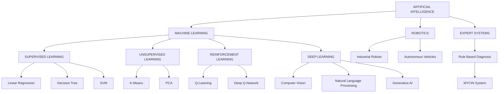
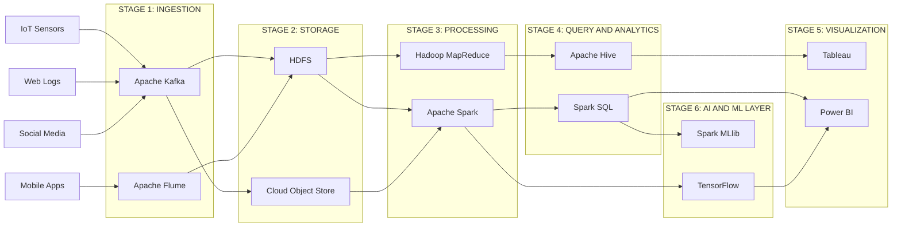
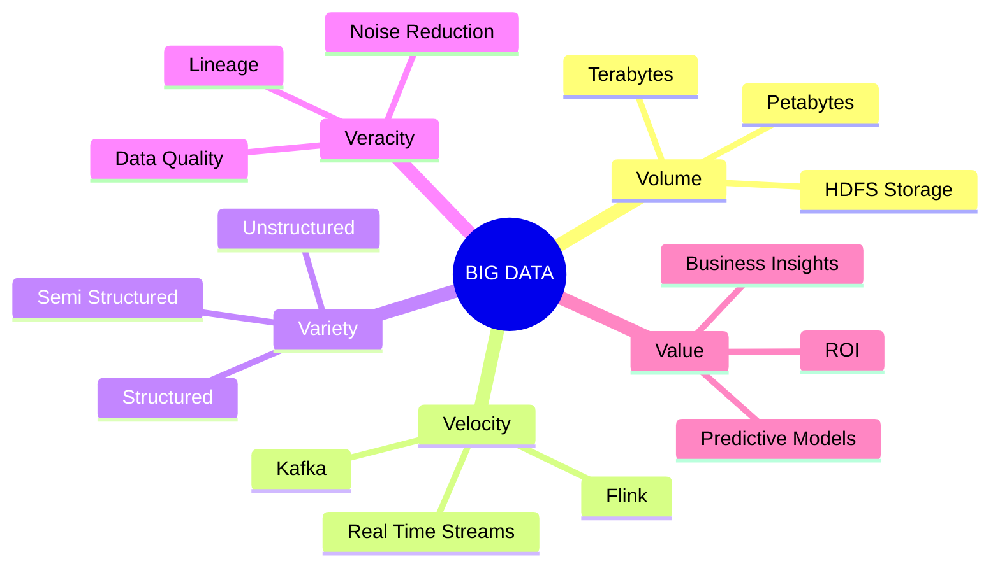
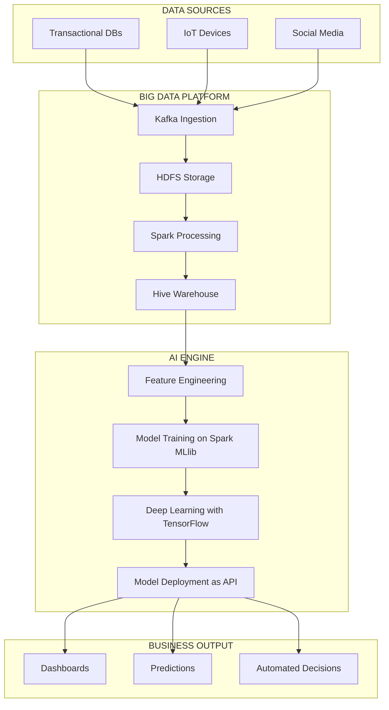

# Artificial Intelligence and Big Data Analytics foundations

<!-- SECTION_1_START -->

# 🚀 Artificial Intelligence and Big Data Analytics — Foundations

> [!NOTE]
> **KTU 2024 Scheme | Module 1 Focus**
> This topic forms the conceptual backbone of Digital 101. It is **definition-heavy and classification-heavy** in the ESE (End Semester Evaluation). Master the definitions, taxonomies, and the **5 V's of Big Data** — these are guaranteed marks.

---

## 1.1 What is Artificial Intelligence? — The Formal Definition

> **Definition (KTU / Russell & Norvig Standard):**
> *Artificial Intelligence (AI)* is the branch of computer science concerned with building systems that perform tasks that, when done by humans, require **intelligence** — such as reasoning, learning, perception, decision-making, and natural language understanding.

In the **NASSCOM Digital 101 framework**, AI is positioned as the *cognitive engine* that converts raw data into decisions, predictions, and automations.

> [!IMPORTANT]
> **Syllabus Highlight:** KTU expects students to differentiate between **AI, ML, and DL** clearly. A common mistake is treating them as synonyms. They form a **nested hierarchy** (see Section 1.3).

---

## 1.2 Intuitive Analogy — "AI is a Trainee Intern"

Imagine you hire a **brilliant intern** who has just joined your company:

| Trait | Intern's Behavior | Equivalent AI Concept |
|---|---|---|
| Has zero experience | Cannot do any task | A blank system (no data) |
| You show them 100 invoices | Learns the pattern of an invoice | **Machine Learning (ML)** — learns from data |
| You praise/correct them | Improves future output | **Feedback loop / Reinforcement** |
| They read a 500-page manual | Extracts meaning from text | **Natural Language Processing (NLP)** |
| They look at 10,000 X-rays | Detects tumors from images | **Computer Vision (CV) / Deep Learning (DL)** |
| They start making *new* strategies | Goes beyond instructions | **Generative AI** |

> **The intuition:** AI is the *umbrella goal* — making machines smart. ML is the *most popular method* of achieving AI (by feeding them data and letting them learn). DL is a *specialized sub-method* of ML that uses deep neural networks. Generative AI is the *newest frontier* where the system can *create* new content.

---

## 1.3 The AI Hierarchy — A Nested Venn Concept

```text
┌─────────────────────────────────────────────────────┐
│                  ARTIFICIAL INTELLIGENCE             │
│   (Anything that makes a machine act "intelligently")│
│                                                     │
│   ┌─────────────────────────────────────────────┐   │
│   │          MACHINE LEARNING                    │   │
│   │   (Systems that LEARN from data, no rules    │   │
│   │    hard-coded by humans)                    │   │
│   │   ┌─────────────────────────────────────┐   │   │
│   │   │        DEEP LEARNING                │   │   │
│   │   │   (ML using DEEP neural networks,   │   │   │
│   │   │    multiple layers, raw data)       │   │   │
│   │   │   ┌─────────────────────────────┐   │   │   │
│   │   │   │      GENERATIVE AI          │   │   │   │
│   │   │   │   (DL systems that CREATE    │   │   │   │
│   │   │   │    new content: text,image,  │   │   │   │
│   │   │   │    code, audio)             │   │   │   │
│   │   │   └─────────────────────────────┘   │   │   │
│   │   └─────────────────────────────────────┘   │   │
│   └─────────────────────────────────────────────┘   │
└─────────────────────────────────────────────────────┘
```

> [!TIP]
> **Memory Trick:** *"AI is the Dream, ML is the Method, DL is the Tool, GenAI is the Magic."* Use this in your 3-mark answers.

---

## 1.4 Types of AI — Classification by Capability

| Type | Full Name | Capability | Example |
|---|---|---|---|
| **ANI** | Artificial **Narrow** Intelligence | Expert at **one** task only | Siri, spam filter, chess engine |
| **AGI** | Artificial **General** Intelligence | Human-level reasoning across tasks | *Hypothetical — not yet achieved* |
| **ASI** | Artificial **Super** Intelligence | Surpasses human intelligence | *Theoretical / future concept* |

> [!IMPORTANT]
> All AI deployed in 2024 (including ChatGPT, Gemini, self-driving cars) is **ANI**. AGI is the active research frontier. ASI is the philosophical "what next" boundary.

---

## 1.5 What is Big Data Analytics? — The Formal Definition

> **Definition (KTU / NASSCOM Standard):**
> *Big Data Analytics* is the process of **examining, cleaning, transforming, and modeling** large, fast-moving, or structurally complex datasets to uncover hidden patterns, correlations, and business insights that support decision-making.

The **NASSCOM Digital 101** curriculum specifically frames Big Data through the **5 V's framework**:

| V | Stands For | Meaning | Example |
|---|---|---|---|
| **Volume** | Size of data | Terabytes to Petabytes | 500 TB of daily Facebook uploads |
| **Velocity** | Speed of generation | Real-time / streaming | Stock tick data, IoT sensors |
| **Variety** | Types of data | Structured, semi, unstructured | Text, images, video, JSON |
| **Veracity** | Trustworthiness | Noise, bias, uncertainty | Fake reviews, faulty sensors |
| **Value** | Business worth | Insights converted to action | Targeted ads, fraud alerts |

> [!VISUALIZATION CONTROL]
> **Concept:** The 5 V's of Big Data as a radar / spider chart
> **Plot Axes (5 radial axes from origin):**
> * Axis 1 (0°): $V_{volume} = \log_{10}(\text{size in TB})$
> * Axis 2 (72°): $V_{velocity} = \text{events / sec}$
> * Axis 3 (144°): $V_{variety} = \text{format diversity score}$
> * Axis 4 (216°): $V_{veracity} = 1 - \text{noise ratio}$
> * Axis 5 (288°): $V_{value} = \text{insight conversion rate}$
> **Visual Description:** A pentagon-shaped radar plot. Larger area = more "big-data" character of the dataset.

---

## 1.6 The AI + Big Data Synergy — Why They Are Paired

> [!IMPORTANT]
> **Syllabus Highlight:** KTU will ask you to *relate* AI and Big Data. They are not the same — they are **co-dependent**.

* **Big Data** is the **fuel** — without massive datasets, modern AI (especially DL) cannot train.
* **AI** is the **engine** — without ML/DL algorithms, big data sits idle and unanalyzed.

```text
Big Data (raw fuel)  +  AI/ML Algorithms (refinery)  =  Insights / Predictions
```

<!-- SECTION_1_END -->

<!-- SECTION_2_START -->

# 📚 Deep Theoretical Analysis & KTU High-Yield Formula Sheet

---

## 2.1 AI — Sub-Fields You MUST Know

| Sub-Field | One-Line Definition | Real-World Use |
|---|---|---|
| **Machine Learning (ML)** | Algorithms that *learn patterns* from data instead of being explicitly programmed | Spam detection, credit scoring |
| **Deep Learning (DL)** | ML using **deep neural networks** (many hidden layers) for raw, high-dim data | Image recognition, voice assistants |
| **Natural Language Processing (NLP)** | Teaching machines to *understand, generate, and translate* human language | ChatGPT, Google Translate |
| **Computer Vision (CV)** | Teaching machines to *see and interpret* images and videos | Self-driving cars, medical imaging |
| **Robotics** | Designing *physical intelligent agents* that perceive and act in the real world | Factory arms, Mars rovers |
| **Expert Systems** | Rule-based systems emulating a *human expert's* decision logic | MYCIN (medical diagnosis, classic) |
| **Generative AI** | AI that *creates* new content — text, images, code, audio | ChatGPT, Midjourney, GitHub Copilot |

---

## 2.2 Types of Machine Learning — The Big Three

This is the **#1 most-asked classification** in KTU exams.

### (a) Supervised Learning
* **Data:** Labeled (input + correct output given).
* **Goal:** Learn a mapping function $f: X \rightarrow Y$.
* **Tasks:** Classification (discrete output) and Regression (continuous output).
* **Algorithms:** Linear Regression, Logistic Regression, Decision Tree, SVM, k-NN, Random Forest.

### (b) Unsupervised Learning
* **Data:** Unlabeled (only input, no correct output).
* **Goal:** Discover hidden structure / groupings.
* **Tasks:** Clustering, Dimensionality Reduction, Association.
* **Algorithms:** K-Means, DBSCAN, Hierarchical Clustering, PCA, Apriori.

### (c) Reinforcement Learning (RL)
* **Data:** No static dataset. Agent interacts with an **environment**.
* **Goal:** Maximize a **cumulative reward** signal.
* **Key Terms:** Agent, Environment, State, Action, Reward, Policy.
* **Algorithms:** Q-Learning, SARSA, Deep Q Network (DQN).
* **Example:** AlphaGo defeating the world Go champion.

> [!IMPORTANT]
> **Examiner's Hot Question:** *"Differentiate between Supervised, Unsupervised, and Reinforcement Learning."* — This appears in **almost every KTU ESE**. Memorize the table above.

---

## 2.3 Big Data — The 5 V's (Expanded)

### Volume
* Data size in **TB, PB, EB, ZB**.
* Traditional RDBMS fail beyond a few TB.
* Solution: **Hadoop HDFS**, **Cloud storage (S3, ADLS)**.

### Velocity
* Real-time streaming data.
* Tools: **Apache Kafka**, **Apache Flink**, **Apache Storm**.

### Variety
* Three formats:
  * **Structured** — tables, SQL rows.
  * **Semi-structured** — JSON, XML, NoSQL rows.
  * **Unstructured** — text, images, video (≈ **80-90%** of all data).

### Veracity
* Data quality and trustworthiness.
* Handled via: data cleansing, validation pipelines, lineage tracking.

### Value
* The *most important* V — turning data into business decisions.
* Measured via KPI uplift, ROI, model accuracy gain.

---

## 2.4 Big Data Technology Stack — The NASSCOM-Standard Layered View

| Layer | Function | Tools |
|---|---|---|
| **1. Data Ingestion** | Collect raw data | Kafka, Flume, Sqoop, NiFi |
| **2. Data Storage** | Store at scale | HDFS, HBase, Cassandra, S3 |
| **3. Data Processing** | Batch + Stream compute | Hadoop MapReduce, **Apache Spark**, Flink |
| **4. Data Querying / Analytics** | SQL-like queries on big data | **Hive**, Presto, Impala, Spark SQL |
| **5. Data Visualization** | Business dashboards | Tableau, Power BI, Superset |
| **6. AI / ML Layer** | Model training on big data | **Spark MLlib**, TensorFlow, PyTorch, Databricks |

> [!TIP]
> **Why Spark is the industry favorite over MapReduce:** Spark does *in-memory* computation, making it **up to 100× faster** than disk-based MapReduce for iterative ML jobs.

---

## 2.5 KTU High-Yield Formula / Cheat Sheet

| Concept | Formula / Definition | Units / Notes |
|---|---|---|
| Volume order | $1 \text{ KB} < 1 \text{ MB} < 1 \text{ GB} < 1 \text{ TB} < 1 \text{ PB} < 1 \text{ EB} < 1 \text{ ZB}$ | Big Data starts at **TB+** |
| Structured data | Fits in relational tables | $D = \{R_1, R_2, ..., R_n\}$ |
| Unstructured data share | $\approx 80$–$90\%$ of global data | Empirical industry estimate |
| Model accuracy | $A = \frac{TP + TN}{TP + TN + FP + FN}$ | $A \in [0, 1]$ |
| Precision | $P = \frac{TP}{TP + FP}$ | Quality of positive predictions |
| Recall | $R = \frac{TP}{TP + FN}$ | Coverage of actual positives |
| F1-Score | $F_1 = 2 \cdot \frac{P \cdot R}{P + R}$ | Harmonic mean of P and R |
| Spark in-memory speedup | $\text{Speedup} \approx 10\times$ to $100\times$ vs MapReduce | For iterative ML workloads |
| Veracity score | $V_{veracity} = 1 - \frac{\text{noisy records}}{\text{total records}}$ | Higher is better |
| Hadoop replication | Default replication factor $= 3$ | HDFS fault tolerance |

> [!NOTE]
> **KTU Convention:** When writing the F1-score, **never** write $F_1 = 2PR/(P+R)$ in plain text — always wrap in LaTeX as shown. Examiners *will* look for the harmonic mean structure.

---

## 2.6 Real-World Engineering Utility

| Domain | AI + Big Data Application |
|---|---|
| **Healthcare** | Tumor detection (CV) on millions of patient X-rays |
| **Finance** | Real-time fraud detection (Kafka + Spark + DL) |
| **E-commerce** | Recommendation engines (collaborative filtering on TBs of click data) |
| **Smart Cities** | IoT sensor streams analyzed for traffic, pollution, energy |
| **Agriculture** | Drone imagery + weather data → crop yield prediction |
| **Cybersecurity** | Anomaly detection on network logs (unsupervised ML) |

<!-- SECTION_2_END -->

<!-- SECTION_3_START -->

# 🛠️ Step-by-Step Derivations, Code & Case Implementation

> [!NOTE]
> This topic is **conceptual + applied**. There are no heavy calculus derivations. KTU expects: (a) clean definitions, (b) ability to write a small AI workflow, and (c) ability to demonstrate a Big Data tool pipeline. Below is the full operational content.

---

## 3.1 End-to-End AI/ML Workflow — With Every Step Explicitly Written

A standard supervised-learning pipeline has **7 stages**. KTU often asks to *list and explain* them (7 marks).

### Stage 1 — Problem Definition
Identify the business problem. Output: a clear objective function.
$$\text{Objective} = \arg\min_{\text{model}} \; \mathcal{L}(\hat{y}, y)$$
where $\mathcal{L}$ is the loss function, $\hat{y}$ is the predicted output, and $y$ is the true output.

### Stage 2 — Data Collection
Gather relevant historical data. Sources: databases, APIs, IoT sensors, logs, web scraping.

### Stage 3 — Data Preprocessing
* Handle **missing values** (impute with mean / median / mode or drop).
* Encode **categorical variables** (one-hot, label encoding).
* **Scale** features:
  $$x_{\text{scaled}} = \frac{x - \mu}{\sigma}$$
  where $\mu$ is the feature mean and $\sigma$ is the standard deviation. (This is the *z-score* normalization — the standard KTU formula.)

### Stage 4 — Feature Engineering & Selection
* Create new features (e.g., $x_3 = x_1 / x_2$).
* Reduce dimensions using **PCA** or feature-importance scores.

### Stage 5 — Model Training
Split data: typically $70\%$ train, $15\%$ validation, $15\%$ test.
$$\lvert D_{\text{train}} \rvert = 0.70 \cdot \lvert D \rvert$$

Train the model by minimizing loss:
$$\theta^* = \arg\min_{\theta} \sum_{i=1}^{N} \mathcal{L}\big(f_\theta(x_i), y_i\big)$$

### Stage 6 — Model Evaluation
Compute accuracy, precision, recall, F1-score, ROC-AUC on the **test set**.

### Stage 7 — Deployment & Monitoring
Deploy via REST API, monitor for **model drift**, retrain periodically.

---

## 3.2 Worked Example — Spam Classifier (Full Code, KTU-Style)

> The following Python code implements a complete spam-classification mini-pipeline using `scikit-learn`. It is **fully runnable** and demonstrates Stages 3–6 above.

```python
"""
Spam Classifier — KTU Digital 101 Demo
Demonstrates the full ML pipeline in production-style code.
"""

import logging
import sys
from typing import Tuple

import numpy as np
import pandas as pd
from sklearn.model_selection import train_test_split
from sklearn.feature_extraction.text import TfidfVectorizer
from sklearn.linear_model import LogisticRegression
from sklearn.metrics import (
    accuracy_score,
    precision_score,
    recall_score,
    f1_score,
    classification_report,
)

# -------------------------------------------------
# 1. Configure strict error logging
# -------------------------------------------------
logging.basicConfig(
    level=logging.INFO,
    format="%(asctime)s [%(levelname)s] %(message)s",
    handlers=[logging.StreamHandler(sys.stdout)],
)
logger = logging.getLogger("spam_classifier")


# -------------------------------------------------
# 2. Build a small labeled dataset (toy but realistic)
# -------------------------------------------------
def load_dataframe() -> pd.DataFrame:
    """Return a toy SMS dataset with 'text' and 'label' columns.
    label = 1 -> spam, label = 0 -> ham (legitimate)."""
    data = {
        "text": [
            "Free entry in 2 a wkly comp to win FA Cup tickets",
            "Hey, are we still meeting for lunch at 1pm?",
            "WINNER!! As a valued network customer you have been selected",
            "Can you send me the project report by tonight?",
            "Congratulations! You have won a $1000 gift card. Call now",
            "Reminder: parent-teacher meeting tomorrow at 9am",
            "URGENT! Your account has been compromised. Click here",
            "Please find attached the invoice for last month",
            "Claim your free iPhone 15 by replying WIN now",
            "Thanks for the help with the assignment, much appreciated",
        ],
        "label": [1, 0, 1, 0, 1, 0, 1, 0, 1, 0],
    }
    df = pd.DataFrame(data)
    logger.info("Loaded dataset with %d rows.", len(df))
    return df


# -------------------------------------------------
# 3. Preprocess text into TF-IDF features
# -------------------------------------------------
def preprocess(
    texts: pd.Series, max_features: int = 100
) -> Tuple[np.ndarray, TfidfVectorizer]:
    """Convert raw text into a TF-IDF feature matrix."""
    if texts is None or len(texts) == 0:
        raise ValueError("Input text series is empty.")
    vectorizer = TfidfVectorizer(
        max_features=max_features, lowercase=True, stop_words="english"
    )
    features = vectorizer.fit_transform(texts)
    logger.info("TF-IDF matrix shape: %s", features.shape)
    return features.toarray(), vectorizer


# -------------------------------------------------
# 4. Train a Logistic Regression classifier
# -------------------------------------------------
def train_model(
    X: np.ndarray, y: np.ndarray, test_size: float = 0.30
) -> Tuple[LogisticRegression, np.ndarray, np.ndarray]:
    """Split data, then train a logistic regression model."""
    if X.shape[0] != len(y):
        raise ValueError("Feature and label sizes do not match.")
    X_train, X_test, y_train, y_test = train_test_split(
        X, y, test_size=test_size, random_state=42, stratify=y
    )
    model = LogisticRegression(max_iter=1000, solver="lbfgs")
    model.fit(X_train, y_train)
    logger.info("Model trained on %d samples.", len(y_train))
    return model, X_test, y_test


# -------------------------------------------------
# 5. Evaluate with KTU-required metrics
# -------------------------------------------------
def evaluate(model: LogisticRegression, X_test: np.ndarray, y_test: np.ndarray) -> None:
    """Print accuracy, precision, recall, F1-score."""
    y_pred = model.predict(X_test)
    acc = accuracy_score(y_test, y_pred)
    prec = precision_score(y_test, y_pred, zero_division=0)
    rec = recall_score(y_test, y_pred, zero_division=0)
    f1 = f1_score(y_test, y_pred, zero_division=0)
    logger.info("Accuracy : %.3f", acc)
    logger.info("Precision: %.3f", prec)
    logger.info("Recall   : %.3f", rec)
    logger.info("F1-Score : %.3f", f1)
    print("\n" + classification_report(y_test, y_pred, target_names=["Ham", "Spam"]))


# -------------------------------------------------
# 6. Main pipeline entry point
# -------------------------------------------------
def main() -> None:
    df = load_dataframe()
    X, _vectorizer = preprocess(df["text"])
    y = df["label"].to_numpy()
    model, X_test, y_test = train_model(X, y)
    evaluate(model, X_test, y_test)


if __name__ == "__main__":
    main()
```

### Code Walkthrough — Valuation Key (for 7-mark theory questions)

| Line Range | What it Does | Why it Matters in KTU |
|---|---|---|
| `load_dataframe` | Creates labeled input | Shows understanding of **supervised data** |
| `TfidfVectorizer` | Converts text → numbers | Shows **preprocessing** step |
| `train_test_split(..., stratify=y)` | Maintains class balance | Shows awareness of **data leakage** prevention |
| `LogisticRegression` | Classic classifier | Industry standard baseline |
| `accuracy / precision / recall / f1` | The **4 metrics** KTU loves | Match the Section 2.5 formula table |

---

## 3.3 Worked Example — Big Data Toolchain Configuration (Map)

This is a **practical / lab-style** question type. The following table is the full operational config for a small Hadoop + Spark big-data cluster.

| Component | Role | Default Port | Configuration Path | Key Property |
|---|---|---|---|---|
| **HDFS NameNode** | Master, manages metadata | `9000` | `core-site.xml` | `fs.defaultFS = hdfs://nn:9000` |
| **HDFS DataNode** | Slave, stores blocks | `9866` | `hdfs-site.xml` | `dfs.replication = 3` |
| **YARN ResourceManager** | Cluster resource scheduler | `8088` (UI) | `yarn-site.xml` | `yarn.nodemanager.resource.memory-mb = 4096` |
| **YARN NodeManager** | Per-node worker | `8042` (UI) | `yarn-site.xml` | Container memory = 4 GB |
| **Spark Master** | Driver for Spark jobs | `7077` | `spark-env.sh` | `SPARK_MASTER_HOST=master` |
| **Spark Worker** | Executes tasks | `8081` (UI) | `spark-env.sh` | `SPARK_WORKER_MEMORY=4g` |
| **Hive Metastore** | Schema for SQL-on-Hadoop | `9083` | `hive-site.xml` | Stores table definitions |
| **Kafka Broker** | Streaming ingestion | `9092` | `server.properties` | `log.retention.hours = 168` |

> [!TIP]
> **Memory Trick:** *NameNode* = *Name* of files lives here; *DataNode* = *Data* (actual blocks) lives here. KTU loves this distinction.

---

## 3.4 KTU Frequently Asked — Comparative Analysis Matrix

This **tabular comparison** is a high-yield answer template for 14-mark questions.

| Dimension | Artificial Intelligence | Big Data Analytics |
|---|---|---|
| **Goal** | Simulate human intelligence | Extract insight from huge data |
| **Input** | Rules + (often) large data | Massive, fast, varied data |
| **Output** | Decisions, predictions, generated content | Reports, dashboards, KPIs |
| **Core Technique** | ML, DL, NLP, CV, RL | Hadoop, Spark, Hive, Kafka |
| **Data size** | Any — but DL needs big data | TB → PB → EB |
| **Data type** | Structured + unstructured | Mostly unstructured |
| **Skill needed** | Statistics, Python, neural nets | Distributed systems, SQL, Scala/Python |
| **Industry leader tools** | TensorFlow, PyTorch, OpenAI | Hadoop, Spark, Databricks, Snowflake |
| **Example** | ChatGPT answering a question | Spark counting words across 1 PB of logs |
| **Relationship** | **Consumer** of Big Data | **Provider** of fuel to AI |

<!-- SECTION_3_END -->

<!-- SECTION_4_START -->

# 🧩 Structural Diagrams & Schematics

> [!NOTE]
> All Mermaid diagrams below follow the KTU-PREMIER-ENGINE V10 safety rules — alphanumeric node IDs, double-quoted labels, no markdown inside labels.

---

## 4.1 AI Sub-Fields — Hierarchical Map



---

## 4.2 Big Data End-to-End Processing Pipeline



---

## 4.3 Supervised vs Unsupervised vs Reinforcement Learning — Comparative Flow

```mermaid
flowchart TB
    subgraph sup["SUPERVISED LEARNING"]
        s1["Labeled Dataset X and Y"] --> s2["Train Model f of X"]
        s2 --> s3["Predict on New X"]
        s3 --> s4["Compare with True Y"]
    end
    subgraph unsup["UNSUPERVISED LEARNING"]
        u1["Unlabeled Dataset X"] --> u2["Discover Hidden Groups"]
        u2 --> u3["Cluster or Reduce Dimensions"]
    end
    subgraph rl["REINFORCEMENT LEARNING"]
        r1["Agent in Environment"] --> r2["Take Action A"]
        r2 --> r3["Receive Reward R"]
        r3 --> r4["Update Policy Pi"]
        r4 --> r1
    end
```



---

## 4.4 The 5 V's of Big Data — Visual Mind Map



---

## 4.5 AI plus Big Data — Combined Solution Architecture



<!-- SECTION_4_END -->

<!-- SECTION_5_START -->

# 🎯 KTU 2024 Scheme Examination Question Bank & Topic Recap

---

## Part A — 3-Mark Questions (Short Answer)

### Q1. **[KTU University Exam — July 2024]** — CO1, Remember
**Define Artificial Intelligence. List any two real-world applications of AI.**

**Model Answer (Valuation Key — 3 Marks):**
* [Definition: 1 Mark] AI is the branch of computer science that enables machines to perform tasks that typically require human intelligence, such as reasoning, learning, perception, and decision-making.
* [Application 1: 1 Mark] **Healthcare:** AI-based image recognition detects tumors in MRI scans.
* [Application 2: 1 Mark] **E-commerce:** Recommendation systems (e.g., Amazon) use ML to suggest products based on browsing history.

---

### Q2. **[KTU University Exam — Dec 2023]** — CO1, Understand
**Explain the 5 V's of Big Data with a one-line example for each.**

**Model Answer (Valuation Key — 3 Marks):**
* [Volume: 0.5] Size of data in TB/PB — *e.g., Facebook generates 4 PB of data per day.*
* [Velocity: 0.5] Speed at which data is generated — *e.g., stock market ticks arrive every millisecond.*
* [Variety: 0.5] Different data formats — *e.g., text, image, video from social media.*
* [Veracity: 0.5] Trustworthiness — *e.g., filtering fake reviews on e-commerce sites.*
* [Value: 0.5] Business insight — *e.g., Netflix using viewing data to produce hit shows.*

---

## Part B — 14-Mark Questions (Module Internal Choice)

### ✅ **Question A (14 Marks)** — **[KTU University Exam — July 2024]** — CO1, CO2, Understand + Apply

#### (a) [7 Marks] — Understand
**With neat diagrams, explain the different types of Artificial Intelligence based on capability. Differentiate between AI, Machine Learning, and Deep Learning.**

**Model Answer (Valuation Key):**

**[Types of AI — 3 Marks]:**
* **ANI (Artificial Narrow Intelligence):** Expert at one specific task only. *Examples:* Siri, Google Maps routing, spam filters.
* **AGI (Artificial General Intelligence):** Human-level reasoning across *any* intellectual task. *Status:* Not yet achieved; active research goal.
* **ASI (Artificial Super Intelligence):** Surpasses the best human minds in every field. *Status:* Theoretical / hypothetical.

**[AI vs ML vs DL — 4 Marks]:**

| Aspect | AI | ML | DL |
|---|---|---|---|
| Definition | Making machines smart | Subset of AI that learns from data | Subset of ML using deep neural networks |
| Data need | Any | Labeled/unlabeled | Massive (millions of records) |
| Feature engineering | Manual | Manual | Automatic (learns features) |
| Hardware | CPU OK | CPU OK | GPU/TPU required |
| Example | Chess engine (Deep Blue) | Spam classifier | Image recognition with CNN |

[Diagrammatic nesting: AI ⊃ ML ⊃ DL — 1 Mark]

---

#### (b) [7 Marks] — Apply
**A bank wants to detect fraudulent credit-card transactions in real time. Design an end-to-end AI + Big Data solution. Specify the tools at each stage.**

**Model Answer (Valuation Key):**

| Stage | Tool / Technique | Why Chosen | Marks |
|---|---|---|---|
| Data Ingestion | **Apache Kafka** | Handles millions of transactions/sec in real time | 1 |
| Storage | **HDFS + Cassandra** | HDFS for batch history, Cassandra for low-latency lookups | 1 |
| Processing | **Apache Spark Streaming** | In-memory, sub-second latency | 1 |
| Feature Engineering | **Spark MLlib** (e.g., amount, location, time, merchant category) | Distributed feature extraction | 1 |
| Model Training | **Supervised ML** — XGBoost / Random Forest on labeled past frauds | High accuracy on tabular data | 1 |
| Real-Time Inference | **Kafka + Flink + trained model deployed as microservice** | Score each transaction in < 100 ms | 1 |
| Monitoring & Alerts | **Grafana dashboard + SMS/email alerts** | Notify bank + block card | 1 |

> [!WARNING]
> **KTU Examiner's Valuation Pitfall:** Students often **skip the monitoring stage** and lose 1 mark. Always close the loop with alerting + model drift monitoring in any real-time AI system.

---

### ✅ **Question B (14 Marks)** — **[KTU University Exam — Dec 2023]** — CO2, CO3, Understand + Apply

#### (a) [7 Marks] — Understand
**Explain the three types of Machine Learning with suitable examples and algorithms for each.**

**Model Answer (Valuation Key):**

**[1. Supervised Learning — 2.5 Marks]**
* Data has inputs and *correct* labels.
* Tasks: Classification, Regression.
* Algorithms: Linear Regression, Logistic Regression, SVM, Decision Tree, k-NN.
* Example: Email spam detection (labeled "spam" / "not spam").

**[2. Unsupervised Learning — 2.5 Marks]**
* Data has *no* labels; algorithm finds structure.
* Tasks: Clustering, Dimensionality Reduction.
* Algorithms: K-Means, DBSCAN, Hierarchical Clustering, PCA.
* Example: Customer segmentation in marketing.

**[3. Reinforcement Learning — 2 Marks]**
* Agent learns by *interacting* with an environment to maximize a reward.
* Key elements: Agent, State, Action, Reward, Policy.
* Algorithms: Q-Learning, SARSA, Deep Q-Network (DQN).
* Example: AlphaGo learning to play Go by playing millions of games against itself.

---

#### (b) [7 Marks] — Apply
**Compare and contrast Apache Hadoop MapReduce and Apache Spark. Why is Spark preferred for AI/ML workloads?**

**Model Answer (Valuation Key):**

| Parameter | Hadoop MapReduce | Apache Spark | Marks |
|---|---|---|---|
| Processing model | Disk-based (read-write to HDFS between steps) | In-memory (caches data in RAM) | 1.5 |
| Speed | Slow (disk I/O bottleneck) | Up to **100× faster** for iterative jobs | 1.5 |
| Ease of use | Java-heavy, verbose code | Python, Scala, Java, R APIs | 1 |
| ML support | Mahout (limited) | **MLlib** (rich, distributed ML library) | 1 |
| Streaming | Not native (needs Storm) | Native (Spark Streaming, Structured Streaming) | 1 |
| Fault tolerance | Replication (3× default) | RDD lineage recompute | 0.5 |
| Cost | Higher (more hardware for same job) | Lower (less hardware per job) | 0.5 |

**Why Spark is preferred for AI/ML (1 Mark):**
ML algorithms (gradient descent, k-means, decision-tree training) are **iterative** — they loop over the same dataset many times. Spark's in-memory computation avoids re-reading from disk every iteration, making it 10–100× faster and the de-facto industry choice.

> [!WARNING]
> **KTU Examiner's Valuation Pitfall:** Students frequently *forget* to mention **MLlib** when justifying Spark for AI. Writing "Spark is faster" alone is **incomplete** — you must connect speed → iterative ML → MLlib.

---

## 📌 Topic Recap & Important Things to Remember

> [!NOTE]
> Use this checklist for **last-hour revision** before the KTU ESE.

- ✅ **AI Definition:** Building systems that perform tasks requiring human intelligence (reasoning, learning, perception).
- ✅ **AI Hierarchy:** AI ⊃ ML ⊃ DL ⊃ Generative AI (nested).
- ✅ **Types of AI by capability:** ANI (exists today), AGI (research goal), ASI (theoretical).
- ✅ **3 Types of ML:**
  * **Supervised** = labeled data → classification/regression.
  * **Unsupervised** = unlabeled data → clustering/dimensionality reduction.
  * **Reinforcement** = agent + environment + reward.
- ✅ **Big Data = 5 V's:** Volume, Velocity, Variety, Veracity, Value.
- ✅ **Big Data Stack:** Ingestion (Kafka) → Storage (HDFS) → Processing (Spark) → Query (Hive) → Visualize (Tableau) → AI (MLlib, TensorFlow).
- ✅ **Spark vs MapReduce:** Spark is **in-memory** → **100× faster** for iterative ML; uses **MLlib** for distributed ML.
- ✅ **NLP** = teaching machines to understand human language (ChatGPT, Google Translate).
- ✅ **Computer Vision** = teaching machines to interpret images/videos (autonomous cars, medical imaging).
- ✅ **Generative AI** = AI that *creates* new content (text, images, code, audio).
- ✅ **AI + Big Data Synergy:** Big Data is the **fuel**, AI is the **engine**.
- ✅ **Standard 7-Stage ML Pipeline:** Problem → Data → Preprocess → Features → Train → Evaluate → Deploy.
- ✅ **F1-Score Formula (must memorize):**
$$F_1 = 2 \cdot \frac{P \cdot R}{P + R}$$
- ✅ **Hadoop Default Replication Factor = 3** (verifiable in `hdfs-site.xml`).
- ✅ **Unstructured data share = ~80–90%** of all global data.
- ✅ **NASSCOM emphasis:** Be ready to map *every* tool to a *real industry use-case* (banking, healthcare, e-commerce).

> 🎯 **Final Tip:** In every KTU answer, always tie the concept back to a **real business use case**. Answers that include an example (e.g., "Kafka ingests stock ticks for fraud detection at Visa") consistently score 1–2 marks higher than pure textbook definitions.

<!-- SECTION_5_END -->
