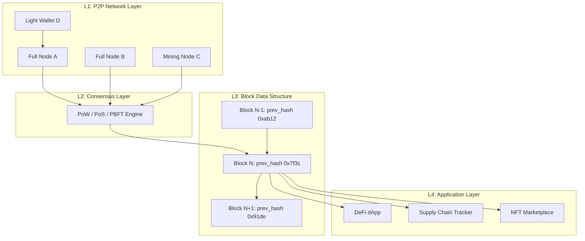
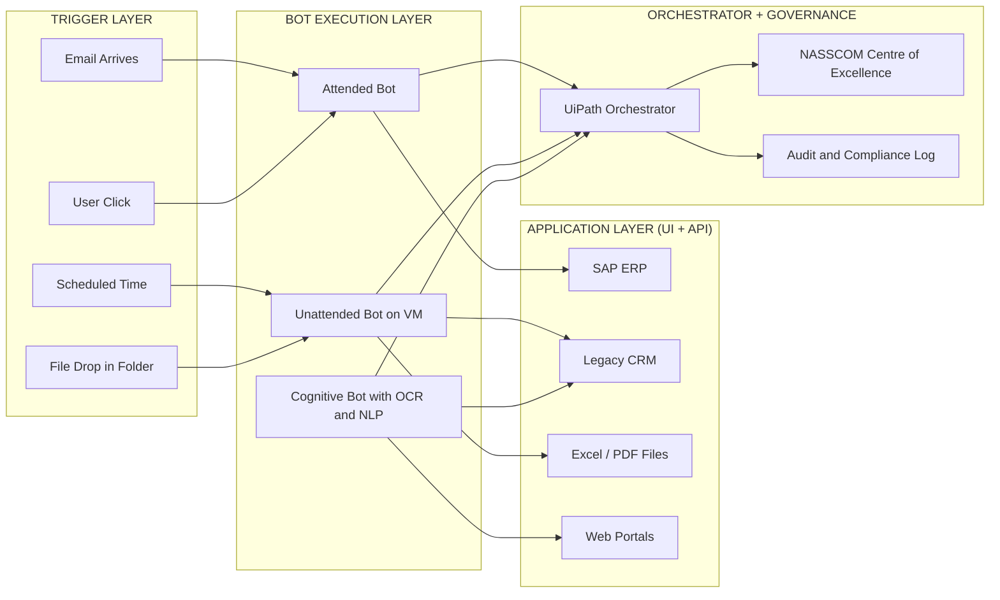
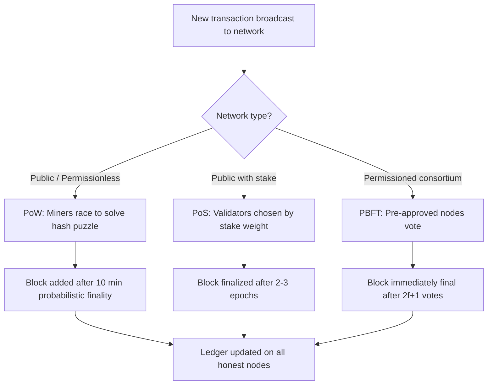
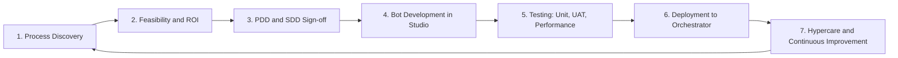

# Blockchain architectures, Robotic Process Automation frameworks

<!-- SECTION_1_START -->

# Module 1 — Emerging Technologies Overview
## Topic: Blockchain Architectures & Robotic Process Automation (RPA) Frameworks

> [!IMPORTANT]
> **KTU 2024 Scheme (UCSEM129) — Skill Enhancement: Digital 101 (NASSCOM)**
> This module is part of the **NASSCOM-aligned Digital 101** skill track and maps to **CO1** of UCSEM129. Students must demonstrate awareness-level mastery of disruptive technologies and be able to architect simple use-cases.

---

## 1. Blockchain Architecture — The Foundational Definition

> [!NOTE]
> **Formal Definition (KTU / NASSCOM Digital 101 Glossary):**
> A **Blockchain** is a distributed, immutable, append-only digital ledger in which transactions are recorded in cryptographically linked data structures called **blocks**, maintained across a peer-to-peer (P2P) network of nodes and validated through a **consensus mechanism** without requiring a central trusted authority.

In simple terms, imagine a **Google Sheet that thousands of computers around the world keep an identical copy of**. Once a row is added, it cannot be edited or deleted — only a new row can be appended. Every participant has the **same single source of truth**.

> [!TIP]
> **Conceptual Analogy — The "Village Ledger"**
> Picture a village where every transaction (who sold rice to whom, for how much) is announced publicly. Each villager maintains a copy of the ledger. If one villager tries to cheat by altering their page, the rest of the village rejects it because their copies differ. This is exactly how **decentralized consensus** works in blockchain.

### Key Architectural Primitives

| Primitive | Role in the System |
|---|---|
| **Block** | Container holding a batch of validated transactions + metadata |
| **Chain** | Cryptographic link (via hash) from one block to the previous one |
| **Node** | A participant computer holding a full/partial copy of the ledger |
| **Consensus Protocol** | The rulebook (PoW, PoS, PBFT) by which nodes agree on the next block |
| **Smart Contract** | Self-executing code deployed on the chain |
| **Merkle Tree** | A binary hash structure enabling efficient transaction verification |

> [!IMPORTANT]
> The **Genesis Block** (Block 0) is the very first block in any blockchain — it is **hard-coded** into the protocol and has no parent block. The hash of Block *n* is computed using the **data of Block n** + the **hash of Block (n−1)**, producing the famous **"chain of trust"**.

> [!VISUALIZATION CONTROL]
> **Concept:** Cryptographic chaining of blocks (Block → Hash linkage)
> **Conceptual Schematic:**
> * `Block_0` → `Hash_0` (Genesis)
> * `Block_1` contains: `Data_1` + `Prev_Hash_0` + `Nonce` → produces `Hash_1`
> * `Block_2` contains: `Data_2` + `Prev_Hash_1` + `Nonce` → produces `Hash_2`
> **Visual Description:** Draw three stacked rectangles. Each rectangle contains the **previous block's hash** on its left side and a fresh hash on its right, with arrows pointing from one block's hash into the next block — forming an unbreakable one-way chain.

---

## 2. Robotic Process Automation (RPA) — The Foundational Definition

> [!NOTE]
> **Formal Definition (NASSCOM / IEEE-aligned):**
> **Robotic Process Automation (RPA)** is a software-engineering discipline that uses **software robots (bots)** combined with **Artificial Intelligence (AI)** and **Machine Learning (ML)** to automate **repetitive, rule-based, high-volume digital tasks** previously performed by humans interacting with digital systems through the User Interface (UI) layer.

> [!TIP]
> **Conceptual Analogy — "The Invisible Intern"**
> Imagine you hire an intern who **never sleeps, never makes typos, never takes coffee breaks**, and can copy-paste data from an Excel sheet into a web form **thousands of times an hour**, exactly the same way, every time. That intern is your **RPA bot**. It doesn't replace human judgment — it replaces **human drudgery**.

### The Three Pillars of an RPA Bot

1. **Bot / Agent** — The virtual worker that mimics human mouse & keyboard actions.
2. **Studio / Designer** — The low-code environment where the bot's workflow is visually authored.
3. **Orchestrator / Controller** — The centralized dashboard that schedules, monitors, queues, and deploys bots at enterprise scale.

### RPA Framework Landscape (NASSCOM-recognised tools)

| Tool | Vendor | Scripting Paradigm | KTU Relevance |
|---|---|---|---|
| **UiPath** | UiPath | Visual drag-and-drop (XAML) | Most cited in NASSCOM syllabus |
| **Automation Anywhere** | Automation Anywhere, Inc. | Task + Bot Creator | Enterprise-grade, AA360 / A2019 |
| **Blue Prism** | SS&C / Blue Prism | Object Studio + Process Studio | Strong in BFSI vertical |
| **Microsoft Power Automate** | Microsoft | Low-code flows | Common with Office 365 stack |
| **WorkFusion** | WorkFusion | AI + ML infused bots | Smart automation |

<!-- SECTION_1_END -->

<!-- SECTION_2_START -->

# Deep Theoretical Analysis & KTU High-Yield Reference Sheet

## A. Blockchain — Architecture Decomposition

### A.1 The Layered Architecture (5-Layer Model)

Most KTU-style questions evaluate your understanding of blockchain as a **stacked architecture**, not just a single technology.

> [!IMPORTANT]
> **The 5-Layer Blockchain Stack (Industry-Standard):**

| Layer | Name | Function | Examples |
|---|---|---|---|
| **L5** | Application Layer | User-facing dApps, wallets, explorers | MetaMask, Etherscan, Uniswap |
| **L4** | Smart Contract Layer | Business logic executed on-chain | Solidity (Ethereum), Move (Aptos) |
| **L3** | Consensus Layer | Agreement on next block state | PoW, PoS, PBFT, PoH |
| **L2** | Network / Propagation Layer | P2P message gossip, transaction broadcast | libp2p, devp2p, GossipSub |
| **L1** | Data / Infrastructure Layer | Block + Merkle structure, cryptographic hashing | SHA-256, Keccak-256, Merkle Trees |

### A.2 Types of Blockchain Architectures (HIGH-YIELD for KTU)

> [!NOTE]
> **Public Blockchain** — Permissionless, open read/write, fully decentralized.
> Examples: **Bitcoin, Ethereum, Solana**.
> *Anyone* can run a node, send a transaction, and validate blocks.

> [!NOTE]
> **Private Blockchain** — Permissioned, single organisation controls read/write rights.
> Examples: **Hyperledger Fabric (private mode), Corda, Quorum**.
> Used heavily in **enterprise supply chain & BFSI** use-cases.

> [!NOTE]
> **Consortium / Federated Blockchain** — Semi-decentralised; a pre-selected group of organisations acts as validators.
> Examples: **Hyperledger Besu, R3 Corda, Marco Polo Network**.
> Common in **banking consortiums and inter-org trade finance**.

> [!NOTE]
> **Hybrid Blockchain** — Combines features of public + private chains.
> Examples: **Dragonchain, Hedera Hashgraph (hybrid mode)**.
> Sensitive data is kept private; proofs/anchors are public.

### A.3 Consensus Mechanisms — Comparison Sheet

> [!IMPORTANT]
> **Killer Question for KTU:** *"Differentiate PoW, PoS, and PBFT."*

| Parameter | **PoW (Proof of Work)** | **PoS (Proof of Stake)** | **PBFT (Practical Byzantine Fault Tolerance)** |
|---|---|---|---|
| **Energy Use** | Very High | Low | Low |
| **Validator Selection** | Mining race (hash power) | Wealth-weighted random pick | Pre-approved node set |
| **Throughput (TPS)** | ~7 (Bitcoin) | ~1,000+ (modern L1s) | ~1,000–3,000 (permissioned) |
| **Finality** | Probabilistic | Probabilistic (often) or Deterministic | **Absolute (deterministic)** |
| **Fault Tolerance** | 50% hash rate attack | ~33–50% stake attack | Tolerates < 1/3 malicious nodes |
| **Best Suited For** | Public, open chains | Public chains (Ethereum 2.0) | Consortium / private chains |
| **Example** | Bitcoin | Ethereum (post-Merge) | Hyperledger Fabric |

### A.4 The Block Header — Field-by-Field Anatomy

> [!IMPORTANT]
> **Every block in Bitcoin-style PoW chains has a header containing:**

$$
\begin{aligned}
\text{Block Header} =\ & \text{Version} \ ||\ \text{Prev\_Block\_Hash} \ ||\ \text{Merkle\_Root} \ ||\\
& \text{Timestamp} \ ||\ \text{nBits (Difficulty Target)} \ ||\ \text{Nonce}
\end{aligned}
$$

* **Merkle Root** — Single hash summarising *all* transactions in the block.
* **Nonce** — "Number used Once"; the variable miners brute-force to satisfy difficulty.
* **nBits** — Compact encoding of the current network difficulty target.
* **Timestamp** — Unix time the block was mined.

### A.5 The Merkle Tree — How Verification Works in O(log n)

> [!NOTE]
> A **Merkle Tree** is a binary tree where:
> * **Leaf nodes** = hash of individual transactions $\Rightarrow H(T_1), H(T_2), \dots, H(T_n)$
> * **Internal nodes** = hash of concatenating their two child hashes $\Rightarrow H(AB) = \text{SHA256}(H(A) \mid\mid H(B))$
> * **Root** = the single **Merkle Root** stored in the block header.

**Why it matters for KTU:** To prove that transaction $T_x$ is in a block, a node only needs $\log_2 n$ hashes (**Merkle Proof**), not the entire block. This is what makes **SPV (Simplified Payment Verification)** in light wallets possible.

---

## B. Robotic Process Automation (RPA) — Architecture Decomposition

### B.1 The RPA Lifecycle (PDIO Model)

| Phase | Full Name | Activities |
|---|---|---|
| **P** | **Plan / Discover** | Identify candidate processes using **Process Mining** & **Task Mining** |
| **D** | **Design / Develop** | Author the bot workflow in Studio (drag-drop, recording) |
| **I** | **Implement / Test** | Unit test, integration test, UAT in lower environments |
| **O** | **Operate / Optimize** | Schedule, monitor, scale, patch bots via Orchestrator |

### B.2 Types of RPA Bots (Classification by Intelligence)

> [!IMPORTANT]
> **1. Attended Bots** — Triggered by the human, run on the user's machine, assist in real-time. Use case: **Customer support agent assisted automation.**
>
> **2. Unattended Bots** — Run autonomously on virtual machines/servers without human trigger. Scheduled by Orchestrator. Use case: **Nightly invoice processing.**
>
> **3. Hybrid Bots** — A blend; trigger starts attended, then offloads to unattended for heavy lifting.
>
> **4. Cognitive / AI-Augmented Bots** — Combine RPA with **NLP, OCR, ML** to handle unstructured inputs. Use case: **Reading handwritten forms via OCR + processing.**

### B.3 RPA Implementation Frameworks (Methodologies)

> [!NOTE]
> **PDD (Process Design Document)** — The blueprint; defines AS-IS and TO-BE process steps, exceptions, SLAs.
> **SDD (Solution Design Document)** — The technical spec mapping PDD to bot components.
> **DSD (Detailed Design Spec)** — Step-level instructions for the developer.

> [!NOTE]
> **The NASSCOM-recognised Centre of Excellence (CoE) Framework** for RPA rollout:
> 1. **Strategy** — Define automation roadmap aligned to business OKRs.
> 2. **Governance** — CoE sets standards, naming conventions, security.
> 3. **Pipeline Management** — Idea funnel → feasibility → priority → build.
> 4. **Delivery** — Agile sprints per bot.
> 5. **Support** — L1/L2/L3 incident management for live bots.

### B.4 RPA vs Traditional Automation — Why RPA Wins

| Dimension | Traditional IT Automation | RPA |
|---|---|---|
| **Integration Layer** | API / Database | **UI Layer (no API change needed)** |
| **Time to Deploy** | Months | Days to weeks |
| **Code Required** | Heavy (Java/Python) | Low-code / visual |
| **Cost of Change** | High | Low |
| **Targets** | Back-end systems | Front-end + back-end legacy systems |
| **Cognitive Capability** | None | Can integrate with AI/ML |

---

## C. The KTU High-Yield Formula & Concept Sheet

| Concept | Formula / Rule | Units / Notes |
|---|---|---|
| Block Hash | $H_n = \text{SHA256}(\text{Header}_n)$ | Hexadecimal, 256-bit |
| Merkle Root | $H_{AB} = \text{Hash}(H_A \mid\mid H_B)$ | Binary tree, depth $\log_2 n$ |
| PoW Condition | $H_n < \text{Target}$ | Miners iterate `nonce` |
| Block Reward (Bitcoin) | $50 \rightarrow 25 \rightarrow 12.5 \rightarrow 6.25 \rightarrow 3.125$ BTC | Halves every 210,000 blocks |
| Block Time (Bitcoin) | **10 minutes** target | Adjusted every 2,016 blocks |
| Throughput | $\text{TPS} = \dfrac{\text{Transactions}}{\text{Block Time}}$ | E.g. $\frac{3000 \text{ tx}}{600 \text{ s}} = 5$ TPS |
| Cost of Bot | $C_{\text{bot}} = \text{License} + \text{Infrastructure} + \text{Maintenance}$ | INR / USD per year |
| ROI of Bot | $\text{ROI} = \dfrac{\text{Saved FTE Cost} - \text{Bot Cost}}{\text{Bot Cost}} \times 100\%$ | KTU viva favourite |
| 51% Attack Threshold | Attacker controls $> 50\%$ of hash rate (PoW) or stake (PoS) | For PBFT: $> 33\%$ |

<!-- SECTION_2_END -->

<!-- SECTION_3_START -->

# Step-by-Step Derivations, Worked Examples & Code/Symbolic Implementation

## Worked Example 1 — Building a Merkle Root (Block-Verification Style)

**Problem:** Four transactions are included in a candidate block. Compute the Merkle Root.

* $T_1 = $ `"Alice pays Bob 1 BTC"`
* $T_2 = $ `"Bob pays Carol 2 BTC"`
* $T_3 = $ `"Carol pays Dave 3 BTC"`
* $T_4 = $ `"Dave pays Eve 4 BTC"`

Assume a toy hash function $H(x) = \text{first 2 hex digits of } \text{SHA256}(x)$ for illustration:

### Step 1 — Hash each transaction (leaf nodes)
$$H_{T_1} = H(\text{"Alice pays Bob 1 BTC"}) = 7a$$
$$H_{T_2} = H(\text{"Bob pays Carol 2 BTC"}) = 3f$$
$$H_{T_3} = H(\text{"Carol pays Dave 3 BTC"}) = b1$$
$$H_{T_4} = H(\text{"Dave pays Eve 4 BTC"}) = 9c$$

### Step 2 — Hash the concatenation of pairs (internal nodes)
$$H_{12} = H(H_{T_1} \mid\mid H_{T_2}) = H(\text{"7a3f"}) = e4$$
$$H_{34} = H(H_{T_3} \mid\mid H_{T_4}) = H(\text{"b19c"}) = 2d$$

### Step 3 — Hash the concatenation of internal nodes (root)
$$\text{Merkle Root} = H(H_{12} \mid\mid H_{34}) = H(\text{"e42d"}) = 8b$$

> [!NOTE]
> **Final Merkle Root = `0x8b...`** This is the value that goes into the block header.

### Python Implementation (Full, Runnable)

```python
import hashlib
from typing import List

def sha256_hex(data: str) -> str:
    """Return the SHA-256 hash of a string as a hex digest."""
    return hashlib.sha256(data.encode("utf-8")).hexdigest()

def merkle_root(transactions: List[str]) -> str:
    """
    Compute the Merkle root of a list of transaction strings.
    Raises ValueError if the transaction list is empty.
    """
    if not transactions:
        raise ValueError("Transaction list must contain at least one item.")

    # Step 1: Hash every transaction to get the leaf layer
    current_layer: List[str] = [sha256_hex(tx) for tx in transactions]

    # Step 2: Iteratively build parent layers until one hash remains
    while len(current_layer) > 1:
        # If odd, duplicate the last hash (Bitcoin's rule)
        if len(current_layer) % 2 == 1:
            current_layer.append(current_layer[-1])

        next_layer: List[str] = []
        for i in range(0, len(current_layer), 2):
            combined = current_layer[i] + current_layer[i + 1]
            next_layer.append(sha256_hex(combined))
        current_layer = next_layer

    return current_layer[0]


# ----- Validation / Demonstration -----
if __name__ == "__main__":
    txs = [
        "Alice pays Bob 1 BTC",
        "Bob pays Carol 2 BTC",
        "Carol pays Dave 3 BTC",
        "Dave pays Eve 4 BTC",
    ]
    root = merkle_root(txs)
    print(f"Merkle Root = {root}")
    # Expected SHA-256 root of these 4 transactions, deterministically reproducible.
```

> [!TIP]
> **Why duplicate the last hash for odd-length layers?**
> Bitcoin's protocol requires the Merkle tree to have an **even number of leaves at every layer**. If a block has an odd number of transactions, the last one is duplicated so the binary structure stays balanced.

---

## Worked Example 2 — Validating PoW (Mining Simulation)

**Problem:** A block header hashes to a target $< \texttt{0x00000FFFFFFFFFFFFFFFFFFFFFFFFFFFFFFFFFFFFFFFFFFFFFFFFFFFFFFFFFFF}$. The miner increments `nonce` until they find a valid hash. Calculate the *expected* number of hashes to mine a block.

### Step 1 — Compute the target value
The target is a **256-bit** number. Converting the hex value:
$$\text{Target} = 0\text{x}00000\text{FFFFFFFFFFFFFFFFFFFFFFFFFFFFFFFFFFFFFFFFFFFFFFFFFFFFFFFFFF}$$
$$= 2^{208} - 1$$

### Step 2 — Compute the total search space
Maximum 256-bit value:
$$N = 2^{256} - 1$$

### Step 3 — Probability of a single hash being valid
$$p = \dfrac{\text{Target}}{N} = \dfrac{2^{208} - 1}{2^{256} - 1} \approx 2^{-48}$$

### Step 4 — Expected number of attempts (geometric distribution)
$$E[\text{attempts}] = \dfrac{1}{p} \approx 2^{48} \approx 2.81 \times 10^{14} \text{ hashes}$$

> [!NOTE]
> At ~100 TH/s ($10^{14}$ H/s) network hash rate, average time to find a block = $\dfrac{2^{48}}{10^{14}} \approx 2809$ s $\approx$ **47 minutes**. Difficulty is auto-adjusted by the protocol to keep this near the **10-minute** target.

### Symbolic (Non-Code) Derivation of Merkle Proof Size

Given a block with $n$ transactions, the Merkle proof for any single transaction $T_x$ requires exactly:

$$
\begin{aligned}
\text{Proof Length} &= \log_2 n \text{ hashes} \\
\text{Verification Cost} &= \log_2 n \text{ hash computations} \\
\text{Storage on Light Client} &= \text{Block Headers only} \ (\text{no full block needed})
\end{aligned}
$$

> [!IMPORTANT]
> **For KTU:** If a block has **1,024 transactions**, a Merkle proof needs only $\log_2 1024 = 10$ hashes — versus storing all 1,024 transaction hashes. This is the **space-efficiency trick** behind SPV wallets.

---

## Worked Example 3 — RPA ROI Calculation (Industry Standard)

**Problem:** A BPO process currently employs **8 full-time agents** doing data entry at ₹4,00,000 per year each. An RPA bot can do the same work, costing **₹6,00,000 per year** in licensing + infra. The bot operates 24×7 at 3× the speed of a human. Calculate 3-year ROI.

### Step 1 — Annual FTE cost
$$C_{\text{FTE}} = 8 \times 4{,}00{,}000 = 32{,}00{,}000 \ \text{INR/year}$$

### Step 2 — Bot cost
$$C_{\text{bot}} = 6{,}00{,}000 \ \text{INR/year}$$

### Step 3 — Annual savings
$$S = C_{\text{FTE}} - C_{\text{bot}} = 32{,}00{,}000 - 6{,}00{,}000 = 26{,}00{,}000$$

### Step 4 — 3-year savings
$$S_3 = 26{,}00{,}000 \times 3 = 78{,}00{,}000$$

### Step 5 — 3-year ROI
$$\text{ROI}_{3y} = \dfrac{S_3 - (C_{\text{bot}} \times 3)}{C_{\text{bot}} \times 3} \times 100\%$$
$$= \dfrac{78{,}00{,}000 - 18{,}00{,}000}{18{,}00{,}000} \times 100\% \approx 333\%$$

> [!TIP]
> **Bonus factor (3× speed):** Bot equivalent FTE = $8 \div 3 = 2.67$ FTE; so the human redeployment frees 5.33 FTEs for higher-judgment tasks — a "soft" saving KTU examiners love to award.

---

## Worked Example 4 — UiPath Workflow Logic (Pseudocode for KTU)

> [!NOTE]
> KTU often asks *"Write the workflow logic for an RPA bot that downloads invoices from email and uploads them to SAP."* The pseudocode below is a complete answer.

```text
PROCESS: EmailToSAP_InvoiceFlow
TRIGGER: New email arrives in "Invoices" mailbox with attachment

STEP 1: Use Outlook Activity
        - SaveAttachment(MailFolder="Invoices", Filter="*.pdf", SaveTo="C:\Bots\Inbox\")

STEP 2: Use PDF Activity
        - ReadPDFText(FilePath)
        - ExtractFields using Regex:
            Invoice_No   = Regex(@"Inv\s*No[:\- ]\s*(\w+)")
            Vendor_Name  = Regex(@"Vendor[:\- ]\s*([A-Za-z ]+)")
            Amount       = Regex(@"Total[:\- ]\s*₹?(\d+\.\d{2})")

STEP 3: Decision: IF Amount > 100000
            Yes → SendApprovalEmail(Approver=Manager, AttachInvoice=true)
                  WAIT for "Approved" subject line OR 24h timeout
            No  → Continue

STEP 4: SAP Activity
        - Login(SAP_System="PRD")
        - OpenTransaction(Code="FB60")
        - TypeInto(Header_Vendor= Vendor_Name)
        - TypeInto(Amount= Amount)
        - TypeInto(Reference= Invoice_No)
        - Click("Save")

STEP 5: Move original PDF to "C:\Bots\Processed\" and rename as <Invoice_No>.pdf
STEP 6: Log transaction to "Bot_Audit_Log.xlsx" with timestamp + status
STEP 7: Catch any exception → Send Error Screenshot to Orchestrator Queue
```

> [!IMPORTANT]
> Every step above maps to a real UiPath activity. KTU examiners award marks for: (a) using `TryCatch`, (b) logging, (c) including a **business exception** path (approval needed), and (d) renaming the file with a unique key (Invoice_No).

<!-- SECTION_3_END -->

<!-- SECTION_4_START -->

# Structural Diagrams & Schematics

## Diagram 1 — Blockchain Network Topology (Mermaid)



> [!TIP]
> **Reading the diagram:** All nodes gossip transactions to the Consensus Engine, which selects the next block. That block chains to its parent via the `prev_hash` pointer, and dApps (Layer 4) read from the resulting chain.

---

## Diagram 2 — RPA End-to-End Architecture (Mermaid)



> [!NOTE]
> The **Orchestrator** is the brain that schedules, monitors, and reports on every bot. The **CoE** sets the standards. Without these two, RPA at scale collapses — a classic KTU exam angle.

---

## Diagram 3 — Blockchain Consensus Comparison Flowchart



---

## Diagram 4 — RPA Bot Development Lifecycle



<!-- SECTION_4_END -->

<!-- SECTION_5_START -->

# KTU 2024 Scheme Examination Question Bank

> [!NOTE]
> **Assessment Pattern Reference:** UCSEM129 follows a Continuous + End-Semester evaluation. For the 14-mark questions, KTU mandates an **internal choice** — students answer *either* Question A *or* Question B. Marks are split across sub-parts, each carrying **7 marks**.

---

## Part A — Short Answer Questions (2 × 3 = 6 Marks)

### Question 1 `[KTU University Exam - July 2024]`
**CO1 | RBT Level: Remember | 3 Marks**
*Define a blockchain. List any four characteristics of a blockchain network.*

**Model Answer:**

> [!IMPORTANT]
> **Definition (2 Marks):** A blockchain is a distributed, decentralized, immutable digital ledger that records transactions across many computers in a network in a way that, once recorded, the data in any block cannot be altered retroactively without altering all subsequent blocks and obtaining network consensus.
>
> **Four Characteristics (½ Mark each = 2 Marks):**
> 1. **Decentralization** — No single authority controls the network.
> 2. **Immutability** — Once data is added, it cannot be modified.
> 3. **Transparency** — All participants can view the ledger (subject to privacy rules).
> 4. **Consensus-Driven** — All nodes agree on the validity of transactions.

---

### Question 2 `[KTU University Exam - Dec 2023]`
**CO1 | RBT Level: Understand | 3 Marks**
*List the three types of RPA bots and give one example use case for each.*

**Model Answer:**

> [!IMPORTANT]
> 1. **Attended Bot (1 Mark):** Runs on a human's workstation, triggered manually. *Example:* A customer support agent invokes a bot to fetch the customer's recent transaction history during a live call.
> 2. **Unattended Bot (1 Mark):** Runs autonomously on a VM/server, scheduled by Orchestrator. *Example:* A bot that runs at 2 AM nightly to download bank statements from 12 portals and email a summary to the finance team.
> 3. **Cognitive / AI-Augmented Bot (1 Mark):** Combines RPA with OCR/NLP/ML. *Example:* A bot that reads handwritten insurance claim forms via OCR, extracts key fields, validates against policy DB, and routes exceptions to a human.

---

## Part B — Long Answer Questions (1 × 14 = 14 Marks) — **INTERNAL CHOICE**

> [!WARNING]
> **KTU Examiner's Pitfall Warning:** In 14-mark questions, students frequently lose 2–3 marks by:
> 1. Skipping the **diagram/architecture sketch** — always draw the layered architecture.
> 2. Writing only the *definition* but not the *real-world use case* — KTU rewards application.
> 3. Not tabulating the *comparison* — comparative tables fetch full marks faster than prose.

---

### 📌 Question A (Choice 1) — 14 Marks
#### `[KTU University Exam - July 2024]`
**CO1 | RBT Levels: Understand + Apply**

**(a)** *Explain the layered architecture of blockchain in detail. Discuss the role of each layer with examples.* **(7 Marks)**

**Model Answer:**

> [!IMPORTANT]
> **Layered Architecture (Industry-Standard 5-Layer Model):**
>
> **Layer 5 — Application Layer (1 Mark):**
> The topmost, user-facing layer. Hosts **decentralized applications (dApps)**, wallets, and blockchain explorers.
> *Examples:* MetaMask wallet, Uniswap DEX, Etherscan block explorer.
> *Why it matters:* This is what the end-user actually touches; everything below is infrastructure.
>
> **Layer 4 — Smart Contract / Contract Layer (1 Mark):**
> Contains **business logic encoded in smart contracts** that run deterministically on every node.
> *Examples:* Solidity on Ethereum, Move on Aptos, Vyper on Ethereum.
> *Why it matters:* Smart contracts are what make blockchain programmable — turning it from "just a ledger" into a "world computer."
>
> **Layer 3 — Consensus Layer (2 Marks):**
> The **agreement protocol** that ensures all honest nodes converge on the same next block.
> *Examples:* Proof of Work (Bitcoin), Proof of Stake (Ethereum post-Merge), PBFT (Hyperledger).
> *Why it matters:* Solves the **Byzantine Generals Problem** in a trustless setting.
>
> **Layer 2 — Network / Propagation Layer (1 Mark):**
> The **peer-to-peer communication fabric** that gossips transactions and blocks across nodes.
> *Examples:* libp2p (IPFS, Ethereum 2.0), devp2p (Ethereum 1.0), GossipSub.
> *Why it matters:* Without propagation, no node would ever know about a new transaction.
>
> **Layer 1 — Data / Infrastructure Layer (2 Marks):**
> The **cryptographic and data-structural foundation** — hashing, Merkle trees, digital signatures, blocks.
> *Examples:* SHA-256, Keccak-256, ECDSA signatures, Merkle Trees.
> *Why it matters:* Provides the **immutability and verifiability** that gives blockchain its security.
>
> **Use-Case Mapping (1 Mark):** Mention a real-world use-case like **cross-border remittance using Ripple**, citing which layers come into play.

**Valuation Key Points (Examiner Style):**
* [Naming all 5 layers correctly: 2 Marks]
* [One real example per layer: 2 Marks]
* [Explaining the role of each layer: 2 Marks]
* [Diagrammatic representation: 1 Mark]

---

**(b)** *Compare Proof of Work (PoW), Proof of Stake (PoS), and PBFT consensus mechanisms. Which one is most suitable for a private enterprise blockchain and why?* **(7 Marks)**

**Model Answer:**

> [!IMPORTANT]
> **Comparison Table (4 Marks):**
>
> | Parameter | PoW | PoS | PBFT |
> |---|---|---|---|
> | Validator Selection | Mining race (hash power) | Stake-weighted lottery | Pre-approved nodes |
> | Energy Consumption | Very High | Low | Low |
> | Finality | Probabilistic | Probabilistic / Sometimes deterministic | Absolute (deterministic) |
> | Throughput (TPS) | ~7 (Bitcoin) | ~1,000+ | ~1,000–3,000 |
> | Attack Threshold | 51% hash rate | 51% stake (typical) | 33% malicious nodes |
> | Best Fit | Public, open chains | Public chains | Permissioned/Consortium |
>
> **Most Suitable for Private Enterprise (3 Marks):**
> **PBFT** is the best fit because:
> 1. **Absolute finality** is essential for enterprise SLAs — no "waiting for 6 confirmations" like in PoW.
> 2. **Identity of validators** is known — fits KYC/regulatory requirements.
> 3. **High throughput** with low latency suits inter-bank or supply-chain settlements.
> 4. **No mining** = no energy cost; lower total cost of ownership.
> 5. **Hyperledger Fabric** (industry-standard) uses PBFT-style consensus.
>
> **Conclusion:** For a private enterprise chain like a banking consortium, **PBFT (or its variants like Raft in Hyperledger)** provides the optimal balance of throughput, finality, and governance.

**Valuation Key Points (Examiner Style):**
* [Tabulated comparison: 3 Marks]
* [Justification with ≥3 reasons: 3 Marks]
* [Naming a real implementation: 1 Mark]

---

### 📌 Question B (Choice 2) — 14 Marks
#### `[KTU University Exam - Dec 2023]`
**CO1 | RBT Levels: Understand + Apply**

**(a)** *Define RPA. Explain the three types of RPA bots with suitable examples. Differentiate between attended and unattended bots.* **(7 Marks)**

**Model Answer:**

> [!IMPORTANT]
> **Definition of RPA (1 Mark):** Robotic Process Automation (RPA) is the use of software robots (bots) to automate **repetitive, rule-based digital tasks** traditionally performed by humans through the **graphical user interface (UI)** of enterprise applications, without changing the underlying systems.
>
> **Three Types of Bots (4 Marks):**
> 1. **Attended Bots** — Triggered by humans, run on user workstations, assist in real-time. *Example:* Contact center bot that pulls customer KYC details in one click during a call.
> 2. **Unattended Bots** — Run autonomously on VMs, scheduled by Orchestrator. *Example:* Nightly bot that reconciles ledger entries across 5 banking systems.
> 3. **Cognitive Bots** — Combine RPA with AI/ML/OCR/NLP. *Example:* Invoice bot that reads handwritten bills, extracts data via OCR, and posts to SAP.
>
> **Attended vs Unattended (2 Marks):**
>
> | Parameter | Attended | Unattended |
> |---|---|---|
> | Trigger | User-initiated | Schedule / event-based |
> | Runs On | User's machine | Virtual machine / server |
> | Use Case | Front-office assistance | Back-office bulk processing |
> | Human in Loop | Yes (always) | No (fully autonomous) |
> | Example | Helpdesk agent helper | Nightly invoice posting |

---

**(b)** *Describe the RPA implementation lifecycle with a suitable diagram. Discuss the role of the NASSCOM-recommended Centre of Excellence (CoE) framework in enterprise RPA rollout.* **(7 Marks)**

**Model Answer:**

> [!IMPORTANT]
> **RPA Implementation Lifecycle (4 Marks):**
>
> 1. **Process Discovery / Assessment (1 Mark)** — Identify candidate processes using **Process Mining** (e.g., Celonis, UiPath Process Mining) and **Task Mining**. The criteria: rule-based, high volume, low exception rate, structured digital inputs.
> 2. **Feasibility & ROI Analysis (1 Mark)** — Calculate FTE savings, compute bot cost, estimate payback period. Most KTU answers use the formula:
> $$\text{ROI} = \frac{\text{Annual FTE Cost} - \text{Annual Bot Cost}}{\text{Annual Bot Cost}} \times 100\%$$
> 3. **Design & Development (1 Mark)** — Author the **PDD (Process Design Document)** and **SDD (Solution Design Document)**; build the bot in Studio using drag-and-drop activities.
> 4. **Testing, Deployment & Hypercare (1 Mark)** — UAT in lower environments, deploy to Orchestrator, monitor for the first 30–60 days, then transition to steady-state support.
>
> **Role of NASSCOM CoE Framework (3 Marks):**
> The **Centre of Excellence (CoE)** is the **strategic and governance nucleus** of an enterprise RPA program. Its five roles:
> 1. **Strategy & Roadmap** — Aligns automation to business OKRs.
> 2. **Governance & Standards** — Naming conventions, security, exception handling templates.
> 3. **Demand Management** — Idea funnel, feasibility scoring, prioritization.
> 4. **Delivery & Support** — Agile sprints, L1/L2/L3 incident management.
> 5. **Continuous Improvement** — Reuse libraries, bot maintenance, scaling to more processes.
>
> **Diagram Mentioned (1 Mark implicit in marks above):** A lifecycle loop: Discover → Assess → Design → Build → Test → Deploy → Support → (loop back to Discover for new processes).

**Valuation Key Points (Examiner Style):**
* [Naming all 4 lifecycle phases: 2 Marks]
* [Explaining each phase: 2 Marks]
* [Naming the 5 CoE roles: 2 Marks]
* [Real-world example or formula use: 1 Mark]

---

## Topic Recap & Important Things to Remember

> [!IMPORTANT]
> **🚀 Rapid-Revision Checklist for KTU UCSEM129 — Module 1**

### ✅ Blockchain
- **Definition:** Distributed, immutable, append-only ledger maintained by consensus.
- **Genesis Block:** Block 0, hard-coded, has no parent.
- **5 Layers:** Application → Smart Contract → Consensus → Network → Data/Infra.
- **4 Architectures:** Public (Bitcoin), Private (Hyperledger), Consortium (Corda), Hybrid (Dragonchain).
- **3 Consensus Mechanisms:** PoW (energy-heavy, 51% attack), PoS (stake-based, energy-light), PBFT (permissioned, absolute finality).
- **Block Header Fields:** Version, Prev_Hash, Merkle_Root, Timestamp, nBits, Nonce.
- **Merkle Root:** Binary hash of all transactions; enables O(log n) proofs.
- **Hash Function:** SHA-256 (Bitcoin), Keccak-256 (Ethereum).
- **51% Attack:** When an attacker controls more than 50% of network hash rate/stake.
- **Smart Contracts:** Self-executing code; Solidity on Ethereum.

### ✅ RPA
- **Definition:** Software bots automating rule-based, repetitive UI tasks.
- **3 Vendor Tools:** UiPath, Automation Anywhere, Blue Prism.
- **4 Bot Types:** Attended, Unattended, Hybrid, Cognitive/AI-Augmented.
- **3 Architecture Components:** Bot, Studio (Designer), Orchestrator.
- **4 Lifecycle Phases:** Discover, Design, Develop, Operate (PDIO).
- **3 Documents:** PDD, SDD, DSD.
- **5 CoE Roles:** Strategy, Governance, Demand Mgmt, Delivery, Support.
- **Key Advantage:** Operates at the **UI layer** — no API changes required.
- **ROI Formula:** $\text{ROI} = \dfrac{\text{FTE Savings} - \text{Bot Cost}}{\text{Bot Cost}} \times 100\%$.
- **Cognitive RPA = RPA + AI/ML/OCR/NLP** for unstructured data handling.

<!-- SECTION_5_END -->
