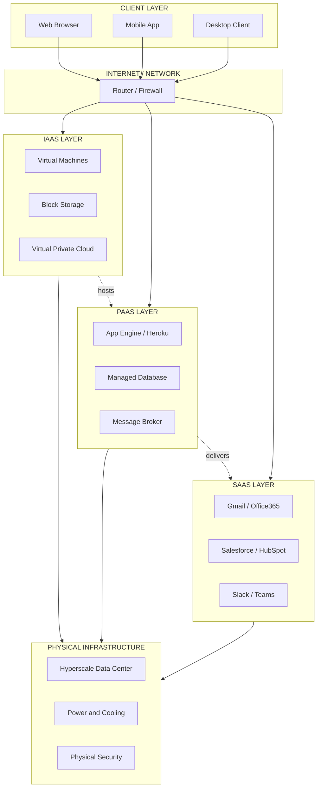
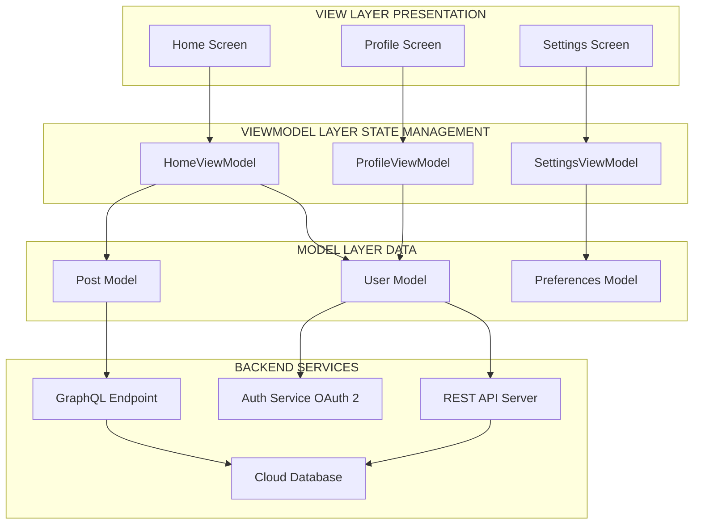
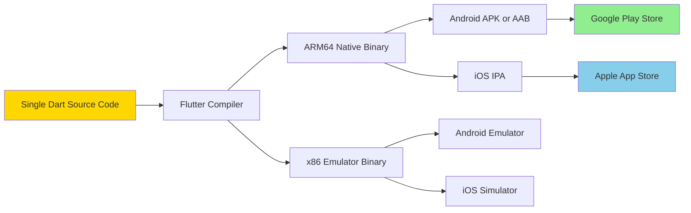

# Cloud Computing, 3D Printing, Mobile Device App Architectures

<!-- SECTION_1_START -->

# Module 1: Emerging Technologies Overview

## 1. Cloud Computing

### Formal Definition
> [!NOTE]
> **Cloud Computing** is a paradigm that enables ubiquitous, on-demand network access to a shared pool of configurable computing resources (e.g., networks, servers, storage, applications, and services) that can be rapidly provisioned and released with minimal management effort or service provider interaction.  
> — *NIST Special Publication 800-145*

### Conceptual Analogy / Intuition
Think of cloud computing like **electricity from the power grid**. You don't build your own power plant at home; you simply plug into a socket and pay for what you consume. Similarly, cloud computing lets you "plug into" remote servers over the internet and pay only for the compute, storage, and networking you use — no need to buy, install, or maintain physical hardware yourself.

> [!IMPORTANT]
> **Five Essential Characteristics of Cloud Computing (NIST):**
> 1. On-demand self-service
> 2. Broad network access
> 3. Resource pooling
> 3. Rapid elasticity
> 5. Measured service

### Service Models
| Model | Full Form | What You Manage | What Provider Manages | Example |
| :--- | :--- | :--- | :--- | :--- |
| **IaaS** | Infrastructure as a Service | OS, Apps, Data | Servers, Storage, Networking | **AWS EC2**, Google Compute Engine |
| **PaaS** | Platform as a Service | Apps, Data | OS, Middleware, Runtime | **Heroku**, Google App Engine |
| **SaaS** | Software as a Service | Only User Data | Everything else | **Gmail**, Microsoft 365, Salesforce |

### Deployment Models
> [!TIP]
> **Public Cloud** → Shared infrastructure open to the public (AWS, Azure)  
> **Private Cloud** → Dedicated infrastructure for a single organization  
> **Hybrid Cloud** → Combination of public and private with orchestration  
> **Community Cloud** → Shared by organizations with common concerns (e.g., government agencies)

---

## 2. 3D Printing (Additive Manufacturing)

### Formal Definition
> [!NOTE]
> **3D Printing (Additive Manufacturing)** is a process of creating three-dimensional solid objects from a digital file by successively adding material layer by layer, as opposed to subtractive manufacturing methodologies which remove material.

### Conceptual Analogy / Intuition
Imagine **building a sandcastle one thin slice at a time** rather than carving it from a single rock. A 3D printer slices a digital 3D model into hundreds or thousands of horizontal layers (like a CT scan in reverse), then deposits or fuses material — plastic, metal, resin — one layer atop the other until the full object emerges.

### Key Process Steps
1. **CAD Modeling** → Create a 3D design in software (e.g., Fusion 360, Blender, SolidWorks)
2. **File Conversion** → Export to STL (Standard Tessellation Language) or OBJ format
3. **Slicing** → Use slicer software (e.g., Cura, PrusaSlicer) to generate G-code
4. **Printing** → Printer executes G-code to deposit material layer-by-layer
5. **Post-Processing** → Remove supports, sand, cure, or paint the part

> [!IMPORTANT]
> **Standard 3D File Formats:** **STL**, **OBJ**, **AMF**, **3MF**  
> **Common Materials:** PLA, ABS, PETG (plastics); Resin (SLA); Titanium, Stainless Steel (SLM)

> [!VISUALIZATION CONTROL]
> **Concept:** Layer-by-Layer Additive Manufacturing  
> **GeoGebra / Desmos Input Equations:**
> * `z_n = n \cdot \Delta h` for n = 0, 1, 2, ..., N (where Δh is layer height)  
> **Visual Description:** Visualize horizontal cross-sections stacked vertically — each thin rectangle representing one printed layer, building up to form a cylindrical object.

---

## 3. Mobile Device App Architectures

### Formal Definition
> [!NOTE]
> A **Mobile Application Architecture** is the structural design pattern that defines how the application's components (UI, business logic, data layer, and external services) interact with each other, the operating system, and the network to deliver functionality to the end user.

### Three Core Architecture Patterns

| Architecture | Description | Pros | Cons |
| :--- | :--- | :--- | :--- |
| **Native** | Built specifically for one OS using platform-specific languages (Swift for iOS, Kotlin for Android) | Best performance, full device API access | High development cost, separate codebases |
| **Hybrid** | Single codebase wrapped in a native container (Cordova, Ionic) | Code reuse, faster development | Performance overhead, limited native feel |
| **Cross-Platform** | Single codebase compiled to native code (React Native, Flutter, Xamarin) | Near-native performance, shared logic | Some platform-specific quirks |

### Conceptual Analogy / Intuition
Think of mobile app architectures like **building a house**:
- **Native** → Custom-built mansion (perfect for one site, expensive to duplicate)
- **Hybrid** → Prefabricated home shipped in parts (cheap, assembled quickly, but generic)
- **Cross-Platform** → Modular smart home (looks custom but uses standardized modules)

<!-- SECTION_1_END -->

<!-- SECTION_2_START -->

# Deep Theoretical Analysis

## 1. Cloud Computing — Detailed Breakdown

### The Cloud Service Stack (Layered View)

| Layer | Service Type | Who Uses It | Analogy |
| :--- | :--- | :--- | :--- |
| **Application** | SaaS | End users | Renting a fully furnished apartment |
| **Platform** | PaaS | Developers | Renting an empty apartment + utilities |
| **Infrastructure** | IaaS | Sysadmins / DevOps | Renting the land and building materials |
| **Server** | Bare-Metal | Specialized ops | Renting the physical land itself |

### Key Concepts Explained

#### Virtualization
The foundation of cloud computing. A **hypervisor** (e.g., VMware ESXi, KVM, Hyper-V) divides one physical server into multiple isolated **Virtual Machines (VMs)**, each running its own OS.

$$
\text{Server Utilization} = \frac{\text{Actual Workload CPU Used}}{\text{Allocated vCPU Capacity}} \times 100\%
$$

#### Containerization (Lightweight Alternative)
Containers (Docker, containerd) share the host OS kernel but isolate the application processes. They start in **seconds** versus minutes for VMs.

$$
\text{Startup Time}_{\text{Container}} \ll \text{Startup Time}_{\text{VM}}
$$

> [!TIP]
> **Kubernetes** is the de-facto standard for orchestrating containers at scale. It automates deployment, scaling, and management of containerized applications.

### Cloud Storage Models
- **Object Storage** → S3, Azure Blob (for unstructured data, images, backups)
- **Block Storage** → EBS, Azure Disks (for databases, OS disks)
- **File Storage** → EFS, Azure Files (shared file systems, NAS-style)

### Real-World Utility
> [!IMPORTANT]
> Cloud powers **Netflix's** video streaming (AWS), **Instagram's** photo storage (Facebook's data centers), **Uber's** real-time ride matching, and **COVID-19 vaccine research** through massive parallel compute on AWS.

---

## 2. 3D Printing — Detailed Breakdown

### Common 3D Printing Technologies

| Technology | Full Form | Material | Precision | Use Case |
| :--- | :--- | :--- | :--- | :--- |
| **FDM** | Fused Deposition Modeling | Thermoplastic filament | ±0.2 mm | Prototyping, hobbyist |
| **SLA** | Stereolithography | Photopolymer resin | ±0.05 mm | Jewelry, dental, miniatures |
| **SLS** | Selective Laser Sintering | Nylon powder | ±0.1 mm | Functional parts, complex geometry |
| **SLM** | Selective Laser Melting | Metal powder (Ti, Al, SS) | ±0.05 mm | Aerospace, medical implants |
| **DLP** | Digital Light Processing | Resin | ±0.05 mm | High-detail resin printing |

### The Slicing Mathematics

The slicer software converts a 3D model into **G-code** instructions. The print head must follow a path where:

$$
\text{Position}(t) = \begin{pmatrix} x(t) \\ y(t) \\ z(t) \end{pmatrix} = \begin{pmatrix} x_0 + v_x \cdot t \\ y_0 + v_y \cdot t \\ n \cdot \Delta h \end{pmatrix}
$$

where $n$ is the current layer number and $\Delta h$ is the layer height (typically **0.1 mm to 0.3 mm**).

> [!TIP]
> **Rule of thumb:** Smaller $\Delta h$ → smoother surface but longer print time.  
> Layer time $T \approx \frac{\text{Volume per layer}}{\text{Nozzle flow rate}}$

### Real-World Utility
- **Medical:** Custom prosthetics, dental crowns, organ scaffolds (bioprinting)
- **Aerospace:** GE LEAP fuel nozzle — 20 parts consolidated into 1, 25% lighter
- **Automotive:** Bugatti's titanium brake caliper (8 of the world's largest printers)
- **Construction:** Full houses printed in 24 hours (ICON, Texas)

---

## 3. Mobile App Architectures — Detailed Breakdown

### MVC vs MVP vs MVVM

| Pattern | Full Form | Layer Role | Best For |
| :--- | :--- | :--- | :--- |
| **MVC** | Model-View-Controller | Controller mediates Model & View | Web apps, simple mobile |
| **MVP** | Model-View-Presenter | Presenter holds all UI logic | Android legacy, testability |
| **MVVM** | Model-View-ViewModel | ViewModel exposes observable state | iOS (SwiftUI), Android (Jetpack) |

> [!IMPORTANT]
> **Modern Standard (2024+):** Most production apps use **MVVM** with reactive streams (Combine, Kotlin Flow) or **MVI (Model-View-Intent)** for unidirectional data flow.

### Mobile Backend Communication
Mobile apps typically use:
- **REST APIs** → Stateless HTTP/JSON endpoints
- **GraphQL** → Query language that returns exactly the data requested
- **gRPC** → High-performance binary protocol (mobile-to-microservice)
- **WebSockets** → Full-duplex persistent connections (chat, live tracking)

### Real-World Utility
- **Instagram (Native iOS/Android):** Swift + Kotlin, handles 2 billion+ users
- **Airbnb (React Native → Native):** Initially cross-platform, migrated to native for performance
- **Google Ads (Flutter):** Cross-platform, single team, faster release cycles

<!-- SECTION_2_END -->

<!-- SECTION_3_START -->

# Step-by-Step Implementation

## 1. Cloud Computing — Hands-On Implementation

### Spinning Up a Virtual Server (Conceptual Walkthrough)

Let's walk through provisioning a cloud VM using AWS CLI principles:

```bash
# Step 1: Configure credentials
aws configure
# AWS Access Key ID: AKIAxxxxxxxxxxxxxxx
# AWS Secret Access Key: xxxxxxxxxxxxxxxxxxxxxxxxxxxxxxxx
# Default region: ap-south-1
# Default output format: json

# Step 2: Create a key pair for SSH access
aws ec2 create-key-pair \
    --key-name MyCloudKey \
    --query 'KeyMaterial' \
    --output text > MyCloudKey.pem
chmod 400 MyCloudKey.pem

# Step 3: Launch a t2.micro instance (Free Tier eligible)
aws ec2 run-instances \
    --image-id ami-0c1a7f89451a34cfc \
    --count 1 \
    --instance-type t2.micro \
    --key-name MyCloudKey \
    --security-groups launch-wizard-1

# Step 4: Get the public IP
aws ec2 describe-instances \
    --query 'Reservations[].Instances[].PublicIpAddress' \
    --output text

# Step 5: Connect via SSH
ssh -i MyCloudKey.pem ec2-user@<PUBLIC_IP>
```

> [!TIP]
> **Production tip:** Never hardcode AWS keys. Use **IAM Roles**, **AWS SSO**, or environment variables from **AWS Secrets Manager**.

---

## 2. 3D Printing — Slicer G-Code Walkthrough

A sample G-code snippet for a 2-layer print (explanatory comments inline):

```gcode
; === INITIALIZATION ===
G21              ; Set units to millimeters
G90              ; Absolute positioning
M104 S210        ; Set extruder temp to 210°C
M140 S60         ; Set bed temp to 60°C
M109 S210        ; Wait for extruder to reach 210°C
M190 S60         ; Wait for bed to reach 60°C
G28              ; Home all axes
G92 E0           ; Reset extruder position

; === LAYER 1 (z = 0.2 mm) ===
G1 Z0.2 F600     ; Move Z to first layer height
G1 X10 Y10 F3000 ; Move to start corner
G1 X90 Y10 E1.5  ; Print line to (90,10), extrude 1.5mm filament
G1 X90 Y90 E3.0  ; Print line to (90,90), extrude 3.0mm
G1 X10 Y90 E4.5  ; Print line to (10,90), extrude 4.5mm
G1 X10 Y10 E6.0  ; Close the square

; === LAYER 2 (z = 0.4 mm) ===
G1 Z0.4 F600     ; Raise Z by 0.2mm (layer height)
G1 X10 Y10 F3000 ; Repeat pattern
G1 X90 Y10 E7.5
G1 X90 Y90 E9.0
G1 X10 Y90 E10.5
G1 X10 Y10 E12.0

; === FINISH ===
M104 S0          ; Cool down extruder
M140 S0          ; Cool down bed
M84              ; Disable motors
```

### Total Filament Calculation
For a solid 20mm × 20mm × 20mm cube with 25% infill:

$$
V_{\text{filament}} = (L \times W \times H) \times \text{Infill}_{\%} \times \text{Flow Rate Factor}
$$

$$
V_{\text{filament}} = (20 \times 20 \times 20) \times 0.25 \times 1.0 = 2000\ \text{mm}^3
$$

> [!IMPORTANT]
> Always account for **support material** (5–15% extra) and **brim/raft adhesion** structures.

---

## 3. Mobile App Architecture — Cross-Platform Implementation (Flutter)

A complete Flutter mobile app demonstrating the **MVVM pattern** with REST API integration:

```dart
// === MODEL: data_structure.dart ===
class User {
  final int id;
  final String name;
  final String email;
  
  const User({
    required this.id,
    required this.name,
    required this.email,
  });
  
  factory User.fromJson(Map<String, dynamic> json) {
    return User(
      id: json['id'] as int,
      name: json['name'] as String,
      email: json['email'] as String,
    );
  }
  
  Map<String, dynamic> toJson() => {
    'id': id,
    'name': name,
    'email': email,
  };
}
```

```dart
// === VIEWMODEL: user_viewmodel.dart ===
import 'package:flutter/foundation.dart';
import '../models/data_structure.dart';

class UserViewModel extends ChangeNotifier {
  final List<User> _users = [];
  bool _isLoading = false;
  String? _errorMessage;
  
  List<User> get users => List.unmodifiable(_users);
  bool get isLoading => _isLoading;
  String? get errorMessage => _errorMessage;
  
  Future<void> fetchUsers() async {
    _isLoading = true;
    _errorMessage = null;
    notifyListeners();
    
    try {
      // Simulated REST call — replace with real http.get()
      await Future.delayed(const Duration(seconds: 2));
      _users.addAll([
        const User(id: 1, name: "Arjun", email: "arjun@ktu.edu"),
        const User(id: 2, name: "Priya", email: "priya@ktu.edu"),
        const User(id: 3, name: "Rahul", email: "rahul@ktu.edu"),
      ]);
    } catch (e) {
      _errorMessage = "Failed to load users: $e";
      debugPrint("Fetch error: $e");
    } finally {
      _isLoading = false;
      notifyListeners();
    }
  }
}
```

```dart
// === VIEW: home_screen.dart ===
import 'package:flutter/material.dart';
import 'package:provider/provider.dart';
import '../viewmodels/user_viewmodel.dart';

class HomeScreen extends StatelessWidget {
  const HomeScreen({super.key});
  
  @override
  Widget build(BuildContext context) {
    return Scaffold(
      appBar: AppBar(title: const Text("KTU Digital 101")),
      body: Consumer<UserViewModel>(
        builder: (context, viewModel, child) {
          if (viewModel.isLoading) {
            return const Center(child: CircularProgressIndicator());
          }
          if (viewModel.errorMessage != null) {
            return Center(
              child: Text(
                viewModel.errorMessage!,
                style: const TextStyle(color: Colors.red),
              ),
            );
          }
          return ListView.builder(
            itemCount: viewModel.users.length,
            itemBuilder: (context, index) {
              final user = viewModel.users[index];
              return ListTile(
                leading: CircleAvatar(child: Text("${user.id}")),
                title: Text(user.name),
                subtitle: Text(user.email),
              );
            },
          );
        },
      ),
      floatingActionButton: FloatingActionButton(
        onPressed: () => context.read<UserViewModel>().fetchUsers(),
        child: const Icon(Icons.refresh),
      ),
    );
  }
}
```

> [!TIP]
> **Architecture flow:** `View` (UI) → observes `ViewModel` (state) → fetches from `Model` (data) → updates `View` reactively. The `Provider` package injects the ViewModel into the widget tree.

<!-- SECTION_3_END -->

<!-- SECTION_4_START -->

# Structural Diagrams & Schematics

## 1. Cloud Computing — Service & Deployment Architecture



## 2. 3D Printing — Process Flow Topology

```mermaid
flowchart LR
    Start([Start]) --> CAD["Step 1: CAD Modeling"]
    CAD --> Export["Step 2: Export to STL or OBJ"]
    Export --> Slicer["Step 3: Slicer Software Cura or PrusaSlicer"]
    Slicer --> GCode["Step 4: Generate G-code"]
    GCode --> Printer["Step 5: 3D Printer Execution"]
    Printer --> Layer1["Layer 1 deposited"]
    Layer1 --> LayerN{"More layers?"}
    LayerN -- Yes --> Layer1
    LayerN -- No --> Post["Step 6: Post Processing"]
    Post --> Supports["Remove supports"]
    Supports --> Finish["Sand and cure"]
    Finish --> Done([Finished 3D Object])
    
    style Start fill:#90EE90
    style Done fill:#FFB6C1
    style Slicer fill:#FFD700
    style Printer fill:#87CEEB
```



## 3. Mobile App Architecture — MVVM with Backend



## 4. Cross-Platform Mobile Build Pipeline



<!-- SECTION_4_END -->

<!-- SECTION_5_START -->

# KTU 2024 Scheme Examination Question Bank

## Part A — Short Answer Questions (3 Marks Each)

### Question 1
> **[KTU University Exam — July 2024]**  
> **CO1 | Remember**  
> Define cloud computing and list any **four essential characteristics** as per the NIST definition.

**Model Answer (3 Marks):**
> Cloud computing is a model for enabling ubiquitous, convenient, on-demand network access to a shared pool of configurable computing resources that can be rapidly provisioned and released with minimal management effort.  
> 
> **Four Essential Characteristics:**  
> 1. On-demand self-service *(1 mark)*  
> 2. Broad network access *(1 mark)*  
> 3. Resource pooling *(0.5 marks)*  
> 4. Measured service *(0.5 marks)*

---

### Question 2
> **[KTU University Exam — Dec 2023]**  
> **CO2 | Understand**  
> Differentiate between **IaaS, PaaS, and SaaS** with one example each.

**Model Answer (3 Marks):**

| Aspect | IaaS | PaaS | SaaS |
| :--- | :--- | :--- | :--- |
| **Full Form** | Infrastructure as a Service | Platform as a Service | Software as a Service |
| **User Manages** | Apps, Data, OS | Apps, Data | Only data input |
| **Example** | AWS EC2 *(1 mark)* | Google App Engine *(1 mark)* | Microsoft 365 *(1 mark)* |

---

## Part B — Long Answer Questions (14 Marks Each — Internal Choice)

### Question A (Option 1)
> **[KTU University Exam — July 2024]**  
> **CO1, CO2 | Understand, Apply**  
> 
> **(a)** Explain the **three service models** of cloud computing with neat diagrams and suitable examples. *(7 marks)*
> 
> **(b)** Describe the **process of 3D printing** (Additive Manufacturing) from CAD design to the final finished object, including any **two common printing technologies**. *(7 marks)*

### Model Solution for Question A

#### Part (a) — Cloud Service Models *(7 marks)*

**[Defining IaaS: 2 Marks]**
IaaS provides virtualized computing resources over the internet. The user rents **virtual machines**, storage, and networks.  
*Example: AWS EC2 — user chooses OS, installs apps, manages runtime.*  
*Analogy: Renting an empty plot of land and building materials.*

**[Defining PaaS: 2 Marks]**
PaaS provides a platform with pre-configured runtime, middleware, and OS. Developers focus only on **code and data**.  
*Example: Heroku — push code via Git, platform handles deployment.*  
*Analogy: Renting a furnished apartment with utilities connected.*

**[Defining SaaS: 2 Marks]**
SaaS delivers ready-to-use software over the internet via browser or thin client.  
*Example: Gmail — provider manages everything; user only sends/receives emails.*  
*Analogy: Taking a taxi — you just ride, the driver and fuel are managed.*

**[Layered diagram mention: 1 Mark]** → As shown in Section 4, Diagram 1.

---

#### Part (b) — 3D Printing Process *(7 marks)*

**[Step 1 — CAD Modeling: 1 Mark]**
A 3D model is designed using CAD software (Fusion 360, SolidWorks) or scanned via photogrammetry.

**[Step 2 — File Export: 1 Mark]**
Model is exported to **STL** (Standard Tessellation Language) format, representing the surface as triangles.

**[Step 3 — Slicing: 1 Mark]**
Slicer software (Cura) slices the model into layers of thickness $\Delta h$ (typically 0.1–0.3 mm) and generates **G-code** instructions.

**[Step 4 — Printing: 1 Mark]**
The 3D printer executes G-code, depositing or fusing material layer by layer.

**[Step 5 — Post-Processing: 1 Mark]**
Remove support structures, sand rough edges, cure resin parts, or apply paint/finish.

**[Two Technologies: 2 Marks]**
1. **FDM (Fused Deposition Modeling):** Extrudes thermoplastic filament through a heated nozzle. Cheap, widely used for prototyping.  
2. **SLA (Stereolithography):** Uses UV laser to cure photopolymer resin layer by layer. High resolution (±0.05 mm), used in dental and jewelry.

---

### Question B (Option 2 — Alternative Choice)
> **[KTU University Exam — Dec 2023]**  
> **CO1, CO3 | Understand, Apply**  
> 
> **(a)** With a neat block diagram, explain the **MVVM architecture pattern** for mobile applications. List **two advantages** of MVVM over MVC. *(7 marks)*
> 
> **(b)** Compare **Native, Hybrid, and Cross-Platform** mobile app development approaches. Which one would you recommend for a startup building its first iOS + Android app, and why? *(7 marks)*

### Model Solution for Question B

#### Part (a) — MVVM Architecture *(7 marks)*

**[Defining MVVM: 2 Marks]**
MVVM stands for **Model–View–ViewModel**. It separates UI (View) from business logic (ViewModel) and data (Model), enabling testable, maintainable code.

**[Role of each layer: 3 Marks]**
- **Model** → Data structures and business logic (e.g., User class, API calls)
- **View** → UI components (e.g., HomeScreen widget in Flutter)
- **ViewModel** → Holds UI state, exposes observable data, handles user actions

**[Block diagram reference: 1 Mark]** → See Section 4, Diagram 3 (MVVM with Backend).

**[Two advantages of MVVM over MVC: 1 Mark]**
1. Better separation of concerns → easier unit testing of ViewModel
2. Reactive data binding → View auto-updates when ViewModel state changes

---

#### Part (b) — Mobile App Approaches Comparison *(7 marks)*

| Criteria | Native | Hybrid | Cross-Platform |
| :--- | :--- | :--- | :--- |
| **Languages** | Swift, Kotlin | HTML, CSS, JS | Dart (Flutter), JS (RN) |
| **Performance** | Excellent | Average | Near-Native |
| **Code Reuse** | None | ~80% | ~90% |
| **Cost** | High | Low | Medium |
| **Device API Access** | Full | Limited | Mostly Full |
| **Examples** | Instagram | Ionic apps | Google Ads |

**[Comparison table: 4 Marks]**

**[Recommendation for startup: 3 Marks]**
> **Recommendation: Cross-Platform (Flutter or React Native).**  
> **Justification:**  
> 1. **Single codebase** → faster development and lower initial cost (crucial for a startup).  
> 2. **Near-native performance** → satisfies 95% of user expectations.  
> 3. **Easier to hire** → one team can target both iOS and Android.  
> 
> *Trade-off:* If the app requires heavy native features (ARKit, advanced camera processing), start with native.

---

> [!WARNING]
> **KTU Examiner's Valuation Warning — Common Pitfalls:**
> - **Cloud questions:** Students often confuse **PaaS vs SaaS** (remember: in SaaS, you don't write any code). Listing **5 essential characteristics** in Part A when only 4 are asked → wastes time.
> - **3D Printing questions:** Failing to mention the **slicing step** or confusing **FDM with SLA** (FDM uses filament + heat; SLA uses resin + UV light). Never skip the **post-processing** step.
> - **Mobile Architecture questions:** Drawing MVVM without labeling the **direction of data flow** loses 2 marks. Always mention **at least one real-world example** of the framework in your answer.

---

## Topic Recap & Important Things to Remember

> [!TIP]
> **Rapid Revision Checklist — Module 1**

### ☁️ Cloud Computing
- **NIST Definition** → On-demand, networked, pooled, elastic, measured (memorize the 5 characteristics).
- **Service Models** → **IaaS** (you manage OS), **PaaS** (you manage code), **SaaS** (you only use it).
- **Deployment Models** → Public, Private, Hybrid, Community.
- **Key providers** → AWS, Microsoft Azure, Google Cloud Platform (GCP).
- **Key concepts** → Virtualization (VMs via hypervisor), Containerization (Docker + Kubernetes).

### 🖨️ 3D Printing
- **Core principle** → Additive (add layer by layer), NOT subtractive.
- **Workflow** → **C**AD → **E**xport (STL) → **S**lice (Cura) → **P**rint → **P**ost-process.
- **Technologies to remember** → **FDM** (filament), **SLA** (resin + UV), **SLS** (powder + laser), **SLM** (metal).
- **File format** → **STL** is the universal standard.
- **Key application** → Aerospace part consolidation, medical implants, rapid prototyping.

### 📱 Mobile App Architectures
- **Three approaches** → **Native** (best perf, costly), **Hybrid** (web in wrapper), **Cross-Platform** (single codebase, near-native).
- **Key frameworks** → **Flutter** (Dart), **React Native** (JavaScript), **Swift** (iOS), **Kotlin** (Android).
- **MVVM pattern** → Model (data) + View (UI) + ViewModel (state logic).
- **Modern trend** → **MVVM with reactive streams** (Kotlin Flow, SwiftUI Combine) or **MVI** (unidirectional).
- **Backend communication** → REST, GraphQL, gRPC, WebSockets.

### 🎯 Cross-Cutting Exam Tips
- Always include **real-world examples** (Netflix on AWS, Instagram native, Bugatti 3D-printed brakes).
- For any architecture question, **draw a block diagram** — KTU awards 1–2 marks extra for neat diagrams.
- Use **analogies** (cloud = electricity grid, 3D printing = building a sandcastle slice-by-slice) in your answers to demonstrate conceptual clarity.
- Map every answer to the relevant **Course Outcome (CO)** and **Bloom's Level** as shown in the question tags.

<!-- SECTION_5_END -->
