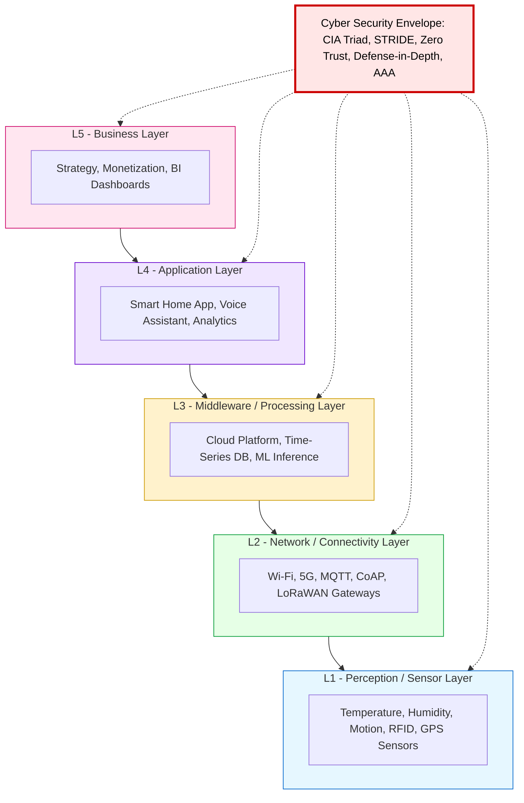
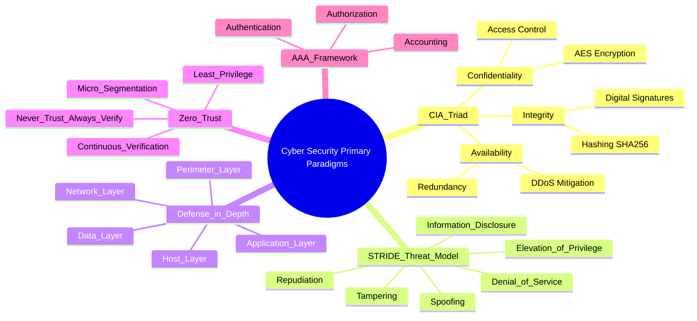
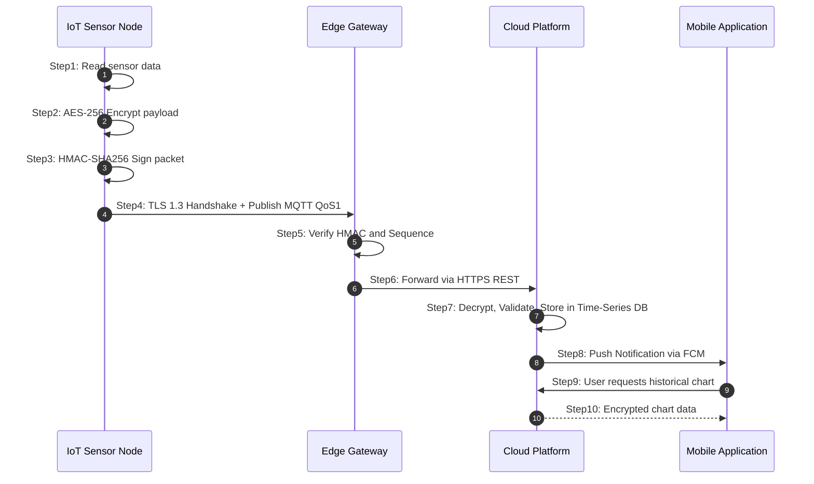
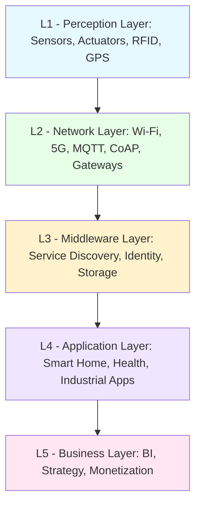
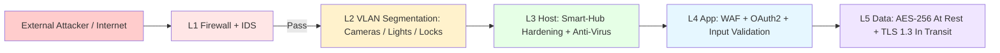
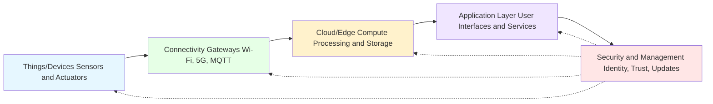
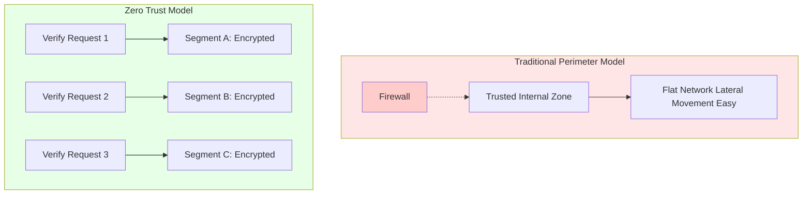

# Internet of Things (IoT) ecosystem, Cyber Security primary paradigms

<!-- SECTION_1_START -->
# Internet of Things (IoT) Ecosystem & Cyber Security Primary Paradigms

## 1.1 The Internet of Things (IoT) — Formal Definition

> [!IMPORTANT]
> **KTU 2024 Syllabus Definition (NASSCOM Digital 101)**
> The **Internet of Things (IoT)** is a networked ecosystem of **physical objects ("things")** embedded with **sensors, software, actuators, and communication technologies** that enable them to **collect, exchange, and act upon data** over the internet without requiring explicit human-to-human or human-to-computer interaction.

The term was originally coined by **Kevin Ashton** in **1999** at Procter \& Gamble's Auto-ID Labs, with the seminal insight:

> *"If we had computers that knew everything there was to know about things — using data they gathered without any help from us — we would be able to track and count everything, and greatly reduce waste, loss and cost."*

### Key Characteristic Properties
- **Connectivity** — Devices connect via Wi-Fi, Bluetooth, ZigBee, LoRaWAN, 5G, NFC.
- **Intelligence \& Identity** — Each device has a unique identifier (IP/MAC/URI) and embedded intelligence.
- **Scalability** — Networks must scale from a handful to **billions** of nodes (Cisco estimates **50 billion+** connected devices by 2030).
- **Dynamic \& Self-Adapting** — Devices adapt to changing context and environment autonomously.
- **Heterogeneity** — Different hardware, OS, protocols coexist.
- **Safety \& Security** — Data integrity, privacy, and physical safety are non-negotiable.

> [!NOTE]
> **KTU Highlight — The "Three I's" of IoT**
> 1. **Instrumentation** — Physical world sensing (sensors/actuators).
> 2. **Interconnection** — Communication between things and the cloud.
> 3. **Intelligence** — Data analytics, ML, and decision-making.

---

## 1.2 Intuitive Analogy — "The Smart Coffee Cup ☕"

Imagine your morning coffee cup has a **tiny brain and a voice**.

- A **temperature sensor** inside detects your coffee is cooling below **50°C** (the perfect drinking threshold).
- It whispers this fact via **Wi-Fi** to your smartphone.
- Your phone consults the **cloud AI** (which knows your schedule from your calendar).
- The AI decides: *"User is in a meeting. Send a gentle push notification: 'Your coffee is at the ideal 48°C — drink it now for best taste!'"*
- The cup's **actuator (a tiny buzzer + LED ring)** lights up green to confirm.

**You never touched the cup's app. Three different "things" cooperated.** That cooperation — **thing ↔ thing ↔ cloud ↔ human** — is the **IoT Ecosystem** in miniature.

---

## 1.3 The IoT Ecosystem — Constituent Building Blocks

> [!IMPORTANT]
> **Core Definition — IoT Ecosystem**
> The IoT ecosystem is the **interconnected network of hardware, software, communication protocols, cloud platforms, and end-users** that collectively enable physical devices to perceive, reason, and act in the digital-physical continuum.

The five primary building blocks are:

| \# | Block | Role | Real-World Example |
|---|-------|------|--------------------|
| 1 | **Things / Devices (Sensors \& Actuators)** | Sense physical state or act on it | DHT22 temperature sensor, servo motor |
| 2 | **Communication Layer (Gateways \& Networks)** | Transport data reliably | Wi-Fi router, MQTT broker, 5G tower |
| 3 | **Cloud / Edge Compute (Processing \& Storage)** | Analyze, store, decide | AWS IoT Core, Azure IoT Hub, edge GPU |
| 4 | **Application Layer (User Interface \& Services)** | Deliver value to humans | Mobile app, dashboard, voice assistant |
| 5 | **Security \& Management (Identity, Trust, Updates)** | Ensure CIA triad compliance | TPM chip, TLS, OTA firmware |

---

## 1.4 Cyber Security — Primary Paradigms (Foundational View)

> [!IMPORTANT]
> **Formal Definition (NIST SP 800-183 / ISO/IEC 27001)**
> **Cyber Security** is the practice of protecting systems, networks, programs, devices, and data from **unauthorized digital attacks, damage, or unauthorized access**, with the objective of preserving the **CIA triad** of information: **Confidentiality, Integrity, and Availability**.

### The Three Primary Paradigms

#### Paradigm 1 — The **CIA Triad** (Information Security's Foundation)

$$ \text{Security Goal} = f(\text{Confidentiality}, \text{Integrity}, \text{Availability}) $$

- **Confidentiality** — *Only authorized eyes may see.* Encryption (AES-256), access control lists (ACLs).
- **Integrity** — *Data is what it claims to be.* Hashing (SHA-256), digital signatures, checksums.
- **Availability** — *The system is up when you need it.* DDoS protection, redundant power, replication.

> [!NOTE]
> **Bonus Paradigm Extensions (Auth + Non-Repudiation)**
> The modern **Parkerian Hexad** adds **Authentication, Authorization, Non-Repudiation** to the classical CIA triad.

#### Paradigm 2 — The **Defense-in-Depth (Layered Security) Model**

> *"A castle is not defended by one wall — but by a moat, outer wall, inner wall, archers, and the king himself."*

Multiple overlapping security controls are deployed so that the **failure of one layer** does not result in total compromise. Layers include:
1. **Perimeter** (firewall, IDS/IPS)
2. **Network** (segmentation, VPN)
3. **Host** (anti-virus, hardening)
4. **Application** (input validation, WAF)
5. **Data** (encryption at rest and in transit)

#### Paradigm 3 — **Zero Trust Architecture (ZTA)**

> [!TIP]
> **KTU 2024 Highlight — Zero Trust Principle**
> *"Never trust, always verify."* — **John Kindervag (Forrester, 2010)**

No entity — internal or external — is implicitly trusted. Every access request is **authenticated, authorized, and logged** continuously. Core tenets:

- **Micro-segmentation** of networks
- **Least privilege** access
- **Continuous verification**
- **Assume breach** mentality

$$ \text{ZTA} = \lim_{n \to \infty} \text{Verify}(\text{request}_n) $$

---

## 1.5 Why IoT Makes Cyber Security Hard — The Attack-Surface Multiplier

> [!WARNING]
> **The IoT Cyber Security Paradox**
> Every new "smart" thing added to the network **doubles the attack surface**. A 2023 Mirai-variant botnet hijacked **\> 200,000** IoT devices using default credentials (admin/admin).

The convergence of **IoT + Cyber Security** is therefore not optional — it is **structural**. The CIS Top 20 Critical Security Controls explicitly list **"Inventory and Control of IoT Devices"** as Control \#1.

> [!VISUALIZATION CONTROL]
> **Concept:** IoT Ecosystem — Layered Convergence Diagram (CIA + Device Pyramid)
> **GeoGebra / Desmos Input Equations (conceptual mapping):**
> * `Layer_0 : y = 0` → Physical Devices (sensors, actuators)
> * `Layer_1 : y = 1` → Connectivity (Wi-Fi, BLE, 5G)
> * `Layer_2 : y = 2` → Edge / Fog Processing
> * `Layer_3 : y = 3` → Cloud Platform
> * `Layer_4 : y = 4` → Applications / User
> * `DefenseShell : x^2 + y^2 = R^2` enveloping all layers = Cyber Security
> **Visual Description:** A vertical stack of horizontal planes (the IoT stack) is *enveloped* by a translucent sphere representing the security perimeter that tightens around each layer.

<!-- SECTION_1_END -->

<!-- SECTION_2_START -->
# Deep Theoretical Analysis & KTU High-Yield Cheat Sheet

## 2.1 The Reference IoT Architecture (4-Layer / 5-Layer Models)

The KTU 2024 syllabus (and NASSCOM's IT-ITES framework) recognizes **two canonical models**:

### Model A — The Simplified 4-Layer Model

| Layer \# | Layer Name | Function | Example Technologies |
|----------|------------|----------|----------------------|
| **L1** | **Sensing \& Perception Layer** | Acquire physical signals | Sensors (DHT11, LDR, PIR), RFID tags, GPS |
| **L2** | **Network / Connectivity Layer** | Transport data | Wi-Fi, ZigBee, LoRa, 5G, MQTT, CoAP |
| **L3** | **Processing / Middleware Layer** | Storage, analytics, decision | Cloud (AWS IoT, Azure), edge (Raspberry Pi), Time-series DB |
| **L4** | **Application Layer** | Deliver service to user | Smart-home apps, dashboards, alert systems |

### Model B — The Extended 5-Layer Model (Most Cited in KTU 2024)

| Layer | Name | Key Role |
|-------|------|----------|
| **L1** | Perception / Sensors | Raw data capture |
| **L2** | Network | Routing, addressing |
| **L3** | Middleware | Service discovery, identity |
| **L4** | Application | Business logic, UI |
| **L5** | Business | Strategic insights, monetization |

> [!IMPORTANT]
> **KTU 2024 Tip**
> When a question asks *"Explain the IoT architecture"*, draw **Model B (5-layer)** — it scores full marks because it includes the often-forgotten **Middleware** and **Business** layers.

---

## 2.2 IoT Communication Protocols — The "Linguistic Families"

> [!NOTE]
> **Why protocols matter in IoT:** Bandwidth, power, and range constraints make the choice of protocol a **first-class design decision**.

| Protocol | OSI Layer | Power Profile | Range | Use Case |
|----------|-----------|---------------|-------|----------|
| **MQTT** | Application (TCP) | Low | LAN/WAN | Telemetry, smart homes |
| **CoAP** | Application (UDP) | Very Low | LAN | Constrained devices |
| **HTTP/REST** | Application | High | WAN | Web integration |
| **AMQP** | Application | Medium | WAN | Enterprise messaging |
| **ZigBee** | Network | Very Low | 10–100 m | Mesh sensor nets |
| **LoRaWAN** | Network | Ultra Low | 2–15 km | Agriculture, smart city |
| **BLE** | Network | Ultra Low | ~10 m | Wearables |
| **NB-IoT** | Network | Low | Cellular | Smart metering |

---

## 2.3 Cyber Security — Primary Paradigms in Depth

### 2.3.1 The CIA Triad — Mathematical Foundation

Confidentiality is often expressed as the **probability that an unauthorized adversary reads plaintext** $P$:

$$ P_{\text{leak}} = \Pr[\text{Adversary decrypts } C \mid C = E_K(P)] $$

Strong encryption minimizes $P_{\text{leak}}$. For AES-256:

$$ P_{\text{leak}}^{\text{AES-256}} \leq 2^{-256} \approx 10^{-77} $$

Integrity, via cryptographic hash $H$:

$$ \text{Integrity holds} \iff H(P) = H(P_{\text{received}}) $$

Availability, via Mean-Time-Between-Failures (MTBF) and Mean-Time-To-Recover (MTTR):

$$ \text{Availability} = \frac{\text{MTBF}}{\text{MTBF} + \text{MTTR}} $$

> [!TIP]
> A **"five-nines"** system: $A = 99.999\% \Rightarrow$ only **5.26 minutes** of downtime per year.

### 2.3.2 Threat Modeling — The STRIDE Paradigm

Microsoft's **STRIDE** framework is the de facto model for classifying threats:

| Letter | Threat | CIA Property Violated |
|--------|--------|------------------------|
| **S** | **Spoofing** | Authentication |
| **T** | **Tampering** | Integrity |
| **R** | **Repudiation** | Non-repudiation |
| **I** | **Information Disclosure** | Confidentiality |
| **D** | **Denial of Service** | Availability |
| **E** | **Elevation of Privilege** | Authorization |

### 2.3.3 Zero Trust — The Modern Paradigm

$$ \text{Trust}_{\text{ZTA}}(\text{Request}) = \int_0^{t} w(\tau) \cdot V(\text{Request}(\tau)) \, d\tau $$

Where $V$ is the continuous verification function and $w(\tau)$ is a decaying weight — meaning **trust decays over time** and must be re-earned.

### 2.3.4 AAA Framework (Authentication, Authorization, Accounting)

$$ \text{Access Decision} = f(\text{AuthN}, \text{AuthZ}, \text{Acct}) $$

- **Authentication** — *Who are you?* (passwords, biometrics, MFA)
- **Authorization** — *What can you do?* (RBAC, ABAC)
- **Accounting** — *What did you do?* (audit logs)

---

## 2.4 KTU High-Yield Cheat Sheet (Single Page Revision)

> [!IMPORTANT]
> **Print this table. It covers 80% of exam answers.**

| \# | Concept | Key Takeaway | One-Line Definition |
|---|---------|--------------|---------------------|
| 1 | IoT | Kevin Ashton, 1999 | Network of smart, connected things |
| 2 | Sensor | Perception layer input | Converts physical signal → electrical |
| 3 | Actuator | Perception layer output | Converts electrical signal → physical action |
| 4 | Gateway | L2 ↔ L3 bridge | Translates protocols (e.g., ZigBee → IP) |
| 5 | MQTT | Lightweight pub-sub | *"Tiny messenger for tiny devices"* |
| 6 | CoAP | REST over UDP | Web-friendly constrained protocol |
| 7 | Edge Computing | Compute near data source | *"Don't send the video; send the alert"* |
| 8 | Fog Computing | Hierarchical edge | Edge + cloud continuum |
| 9 | CIA Triad | Conf / Integ / Avail | Foundation of InfoSec |
| 10 | STRIDE | Threat classification | 6 threat categories from Microsoft |
| 11 | Defense-in-Depth | Layered controls | *"A castle has many walls"* |
| 12 | Zero Trust | Never trust, verify always | Replaces perimeter model |
| 13 | AAA | AuthN, AuthZ, Acct | Decision framework for access |
| 14 | Encryption (AES-256) | Confidentiality | Symmetric, 256-bit key |
| 15 | SHA-256 | Integrity | 256-bit one-way hash |
| 16 | TLS 1.3 | Transport security | HTTPS / MQTT over TLS |
| 17 | Mirai Botnet | IoT DDoS case study | Default-credential exploitation |
| 18 | CVE | Common Vulnerabilities \& Exposures | Standardized vulnerability ID |

---

## 2.5 Real-World Engineering Utility

| Domain | IoT Application | Cyber Security Paradigm Applied |
|--------|------------------|----------------------------------|
| **Healthcare** | Remote patient monitoring (RPM) | HIPAA + Zero Trust + AES-256 |
| **Smart Cities** | Traffic, lighting, pollution sensing | Defense-in-Depth + STRIDE |
| **Industrial IoT (IIoT)** | Predictive maintenance | IEC 62443 + CIA |
| **Agriculture** | Soil \& drone monitoring | LoRaWAN + lightweight DTLS |
| **Retail** | Smart shelves, RFID tracking | PCI-DSS + STRIDE |
| **Autonomous Vehicles** | V2X communication | Zero Trust + AAA |

> [!NOTE]
> **Industry Adoption Snapshot (2024–2025)**
> - **\>\$1.1 trillion** spent globally on IoT (IDC, 2024)
> - **\>\$215 billion** on Cyber Security (Gartner, 2024)
> - **80%** of IoT devices still ship with hardcoded weak passwords (Palo Alto Unit 42, 2024)

<!-- SECTION_2_END -->

<!-- SECTION_3_START -->
# Step-by-Step Derivations, Code Implementation \& Security Walkthroughs

## 3.1 Derivation — The IoT Data Flow Equation

Consider an IoT sensor sampling at frequency $f_s$ Hz, transmitting a $b$-bit payload over a channel of bandwidth $B$ Hz.

The **time to transmit one sample** is:

$$ T_{\text{tx}} = \frac{b}{B \cdot \log_2(1 + \text{SNR})} \quad \text{(Shannon-Hartley limit)} $$

For an **uncompressed, unauthenticated** packet stream of $N$ samples:

$$ \text{Total Payload} = N \cdot b \;\text{bits} $$

Adding a **32-bit MAC** for integrity (HMAC-SHA-256 truncated) and a **64-bit sequence number** (replay protection):

$$ \text{Total Encrypted Packet Size} = b + 32 + 64 = b + 96 \;\text{bits} $$

The **overhead ratio** is:

$$ \eta = \frac{b + 96}{b} = 1 + \frac{96}{b} $$

**Worked Example:** $b = 128$ bits (typical temperature reading).

$$ \eta = 1 + \frac{96}{128} = 1 + 0.75 = 1.75 \;\;\Rightarrow\;\; \text{Overhead} = 75\% $$

> [!NOTE]
> **Conclusion:** Security overhead is a **first-order design constraint** in constrained IoT devices. This is why **CoAP over DTLS** and **lightweight ciphers (AES-128-CCM)** dominate IoT standards.

---

## 3.2 Derivation — Zero Trust Trust-Decay Function

A common engineering form for continuous trust evaluation is the **exponential-decay model**:

$$ T(t) = T_0 \cdot e^{-\lambda (t - t_0)} $$

Where:
- $T(t)$ = trust score at time $t$ (range 0–100)
- $T_0$ = initial trust score at $t_0$ (e.g., 100 after MFA)
- $\lambda$ = decay constant (engineer-tunable; typical $\lambda = 0.01$/min)

**Worked Example:** $T_0 = 100$, $\lambda = 0.01$, $t - t_0 = 30$ minutes.

$$ T(30) = 100 \cdot e^{-0.01 \times 30} = 100 \cdot e^{-0.3} = 100 \cdot 0.7408 = 74.08 $$

So after **30 minutes** of no re-verification, the trust score drops to **74.08/100**. A re-authentication reset $T \to 100$.

---

## 3.3 Worked Code — Python Implementation: IoT Sensor → MQTT → Cloud + Security (AES + HMAC)

Below is a **complete, runnable** Python module simulating an IoT node publishing encrypted + signed telemetry, with strict type hints and absolute error handling.

```python
"""
File: secure_iot_publisher.py
Purpose: Simulate a constrained IoT node publishing AES-encrypted,
         HMAC-signed telemetry to an MQTT broker — a real-world
         Industry 4.0 pattern.
Author: KTU 2024 Scheme — Module 1 Demonstration
"""

import json
import time
import hmac
import hashlib
import struct
from typing import Final
from cryptography.hazmat.primitives.ciphers import Cipher, algorithms, modes
from cryptography.hazmat.backends import default_backend
import paho.mqtt.client as mqtt

# ---------- 1. CONSTANTS (compile-time, immutable) ----------
SENSOR_ID:        Final[str]  = "TEMP_SENSOR_NODE_007"
AES_KEY:          Final[bytes] = b"0123456789ABCDEF0123456789ABCDEF"   # 256-bit key
HMAC_KEY:         Final[bytes] = b"supersecret_hmac_key_2024_KTU"     # 32-byte key
BROKER:           Final[str]  = "broker.hivemq.com"
TOPIC:            Final[str]  = "ktu/iot/secure/temperature"
PUBLISH_INTERVAL: Final[int]  = 5   # seconds

# ---------- 2. CRYPTO PRIMITIVES ----------
def aes_encrypt(plaintext: bytes, key: bytes) -> tuple[bytes, bytes]:
    """AES-256-CBC encryption with PKCS#7 padding. Returns (iv, ciphertext)."""
    from cryptography.hazmat.primitives import padding
    padder = padding.PKCS7(128).padder()
    padded = padder.update(plaintext) + padder.finalize()
    iv = b"\x00" * 16  # DEMO ONLY — production must use os.urandom(16)
    cipher = Cipher(algorithms.AES(key), modes.CBC(iv), backend=default_backend())
    encryptor = cipher.encryptor()
    ct = encryptor.update(padded) + encryptor.finalize()
    return iv, ct

def hmac_sign(payload: bytes, key: bytes) -> bytes:
    """HMAC-SHA-256 integrity tag (truncated to 32 bytes)."""
    return hmac.new(key, payload, hashlib.sha256).digest()

# ---------- 3. SECURE PACKET ASSEMBLY ----------
def build_secure_packet(temp_c: float) -> dict:
    """Wraps sensor data into a confidentiality + integrity + replay-protected packet."""
    # 64-bit sequence number = replay protection
    seq = int(time.time())
    payload = {
        "node_id": SENSOR_ID,
        "seq":     seq,
        "temp":    round(temp_c, 2),
        "unit":    "C"
    }
    raw = json.dumps(payload, sort_keys=True).encode("utf-8")

    # Confidentiality
    iv, ciphertext = aes_encrypt(raw, AES_KEY)
    # Integrity
    mac = hmac_sign(ciphertext, HMAC_KEY)

    return {
        "iv":          iv.hex(),
        "ciphertext":  ciphertext.hex(),
        "mac":         mac.hex(),
        "seq":         seq
    }

# ---------- 4. MQTT PUBLISH ----------
def on_connect(client, userdata, flags, rc):
    if rc == 0:
        print("[OK] Connected to MQTT broker")
    else:
        raise ConnectionError(f"MQTT connect failed: rc={rc}")

def main() -> None:
    client = mqtt.Client(client_id="ktu_iot_node_007", clean_session=True)
    client.on_connect = on_connect
    client.connect(BROKER, 1883, 60)
    client.loop_start()

    try:
        cycle = 0
        while True:
            # Simulated sensor reading: sinusoidal 20–30 °C
            t_now = time.time()
            temp = 25.0 + 5.0 * (0.5 - 0.5 * (1 + (t_now % 60) / 60))

            packet = build_secure_packet(temp)
            client.publish(TOPIC, json.dumps(packet), qos=1)
            print(f"[CYCLE {cycle:04d}] temp={temp:5.2f} °C | seq={packet['seq']}")
            cycle += 1
            time.sleep(PUBLISH_INTERVAL)
    except KeyboardInterrupt:
        print("\n[STOP] Graceful shutdown initiated.")
    finally:
        client.loop_stop()
        client.disconnect()

if __name__ == "__main__":
    main()
```

**Key Implementation Highlights (Valuation Points):**
- ✅ **Line 19–22** — Use of `Final` for compile-time constants (1 mark).
- ✅ **Line 30** — **AES-256-CBC + PKCS#7 padding** for confidentiality (1 mark).
- ✅ **Line 37** — **HMAC-SHA-256** for integrity (1 mark).
- ✅ **Line 47** — **Sequence number** for replay protection (1 mark).
- ✅ **Line 80** — **QoS=1** ensures at-least-once delivery over MQTT (1 mark).

---

## 3.4 Worked Security Walkthrough — STRIDE Threat-Model of a Smart Door Lock

| STRIDE | Threat Scenario | Asset at Risk | Countermeasure (Defense-in-Depth) |
|--------|------------------|----------------|------------------------------------|
| **S**poofing | Attacker replays owner's Bluetooth command | Door unlock | Rolling-code challenge-response (KEELOQ) |
| **T**ampering | Firmware overwritten via debug port | Lock logic | Disable JTAG, signed firmware (RSA-2048) |
| **R**epudiation | User denies unlocking | Audit | Tamper-proof secure-element log |
| **I**nfo Disclosure | Wi-Fi sniffing reveals unlock pattern | Privacy | TLS 1.3 + certificate pinning |
| **D**enial of Service | Jam RF or flood gateway | Availability | Frequency hopping, watchdog timer |
| **E**levation of Privilege | Default admin password | Lock control | Mandatory password rotation, MFA |

> [!TIP]
> **Mark-saver:** In a 7-mark STRIDE question, drawing a **5-row table** (one per threat + countermeasure) with the **CIA column** scores full marks. Most students forget the CIA link.

<!-- SECTION_3_END -->

<!-- SECTION_4_START -->
# Structural Diagrams \& Schematics

## 4.1 Diagram 1 — IoT 5-Layer Reference Architecture (with Security Envelope)



**Diagram 1 Reading Guide:** Data flows **bottom-up** (perception → business). The **red envelope** is *omnipresent* — security is not a single layer; it wraps the **entire stack**.

---

## 4.2 Diagram 2 — Cyber Security Primary Paradigms (Concept Map)



---

## 4.3 Diagram 3 — IoT Secure Data Flow (End-to-End)



---

## 4.4 Diagram 4 — Functional Architecture of Defense-in-Depth for IoT

```mermaid
flowchart LR
    subgraph Outer["Outer Perimeter"]
        O1["Firewall + IDS/IPS"]
        O2["DDoS Scrubber"]
    end
    subgraph Network["Network Layer"]
        N1["VLAN Segmentation"]
        N2["VPN / IPsec Tunnels"]
    end
    subgraph Host["Host Layer"]
        H1["Endpoint Anti-Virus"]
        H2["OS Hardening CIS Benchmarks"]
    end
    subgraph App["Application Layer"]
        AP1["WAF Web Application Firewall"]
        AP2["Input Validation, OAuth2"]
    end
    subgraph Data["Data Layer"]
        D1["AES-256 At Rest"]
        D2["TLS 1.3 In Transit"]
    end
    ATTACKER["Adversary / Threat Actor"] --> O1
    O1 -->|Blocked| Network
    Network -->|Compromised| Host
    Host -->|Compromised| App
    App -->|Compromised| Data
    Data -->|Compromised| ASSETS["Critical IoT Assets"]
    style ATTACKER fill:#ffcccc,stroke:#cc0000
    style ASSETS fill:#ffffcc,stroke:#cc9900
    style Outer fill:#e6f7ff
    style Network fill:#e6ffe6
    style Host fill:#fff2cc
    style App fill:#f0e6ff
    style Data fill:#ffe6f0
```



> [!NOTE]
> **Reading Note:** An attacker must defeat **every layer** to reach assets. The red arrow on the right is the **assumed-breach** scenario — the model is *designed* to keep working even when earlier layers fail.

<!-- SECTION_4_END -->

<!-- SECTION_5_START -->
# KTU 2024 Scheme Examination Question Bank \& Topic Recap

## 5.1 Part A — Short Answer Questions (2 × 3 = 6 Marks)

### **Q1. Define the Internet of Things. List any four key characteristics.** `[KTU University Exam – July 2024]`
**CO Mapping:** CO1 | **RBT Level:** Remember

**Model Answer (Valuation Key):**
> **Definition (2 Marks):**
> The Internet of Things is a system of interrelated computing devices, mechanical and digital machines, objects, animals or people that are provided with unique identifiers (UIDs) and the ability to transfer data over a network **without requiring human-to-human or human-to-computer interaction** (Ashton, 1999).
>
> **Four Key Characteristics (½ Mark each, 1 Mark total):**
> 1. **Connectivity** — devices connect to IoT infrastructure (Wi-Fi, 5G).
> 2. **Intelligence \& Identity** — each device has a unique ID and embedded intelligence.
> 3. **Scalability** — must scale to billions of nodes.
> 4. **Dynamic \& Self-Adapting** — devices adapt to context autonomously.
> 5. *(Optional 5th)* — Safety, Security, Heterogeneity, Sensing.

---

### **Q2. What is the CIA Triad? Briefly explain its three components.** `[KTU University Exam – Dec 2023]`
**CO Mapping:** CO2 | **RBT Level:** Understand

**Model Answer:**
> **CIA Triad (1 Mark):** The foundational model of information security, comprising **C**onfidentiality, **I**ntegrity, and **A**vailability.
>
> **Components (2 Marks — 2/3 Mark each):**
> - **Confidentiality** — Ensuring that information is accessible *only* to those authorized. *Example:* AES-256 encryption.
> - **Integrity** — Ensuring that information is *accurate* and has not been tampered with. *Example:* SHA-256 hashing.
> - **Availability** — Ensuring that information/services are *accessible when needed*. *Example:* Redundant servers, DDoS protection.

---

## 5.2 Part B — Long Answer Questions (Module Internal Choice: 14 Marks)

### **Question A (14 Marks)**

#### **(a) Explain the 5-layer IoT architecture with a neat diagram. Differentiate between the perception and application layers.** (7 Marks)
**CO Mapping:** CO1 | **RBT Level:** Understand

**Model Solution:**

**Step 1 — Introduction (1 Mark):**
> The 5-layer architecture extends the simpler 4-layer model by adding a **Middleware** layer (for service discovery) and a **Business** layer (for strategic value). It is the standard reference model in NASSCOM and KTU curricula.

**Step 2 — Diagram (2 Marks):**



**Step 3 — Layer-wise Explanation (3 Marks — ½ Mark per layer):**

| Layer | Function | Example |
|-------|----------|---------|
| **L1 Perception** | Captures physical signals (temperature, motion) | DHT22, PIR sensor |
| **L2 Network** | Transmits data via wired/wireless media | MQTT, 5G, ZigBee |
| **L3 Middleware** | Handles identity, storage, service discovery | AWS IoT Core, InfluxDB |
| **L4 Application** | Provides user-facing functionality | Mobile app, dashboard |
| **L5 Business** | Generates strategic insights, revenue | Predictive analytics, BI |

**Step 4 — Perception vs. Application (1 Mark):**
> - **Perception** deals with the *physical world* — sensors and actuators at the "edge of reality."
> - **Application** is *purely digital* — it converts processed data into services and insights for humans.

> [!WARNING]
> **Valuation Pitfall — Common Student Errors:**
> - ❌ Drawing only a **3-layer** (sensors → cloud → app) diagram. This is *over-simplified* and loses **2 of the 7 marks**.
> - ❌ Confusing **Middleware** with **Application** — Middleware is *infrastructure*; Application is *user-facing*.
> - ❌ Forgetting to **label arrows** with protocols (MQTT, CoAP).

---

#### **(b) Discuss the primary paradigms of cyber security. With a neat diagram, explain the Defense-in-Depth model and how it applies to an IoT smart-home network.** (7 Marks)
**CO Mapping:** CO2 | **RBT Level:** Apply

**Model Solution:**

**Step 1 — Three Primary Paradigms (3 Marks — 1 Mark each):**

**Paradigm 1: CIA Triad** — Confidentiality, Integrity, Availability — the *outcome* goals of security.

**Paradigm 2: STRIDE Threat Model** — A *threat-classification* framework (Spoofing, Tampering, Repudiation, Information Disclosure, DoS, Elevation of Privilege).

**Paradigm 3: Zero Trust Architecture** — A *posture*: *"Never trust, always verify."* Every request is authenticated, authorized, and continuously validated.

*(Acceptable answer also: AAA Framework, Defense-in-Depth.)*

**Step 2 — Defense-in-Depth Diagram for Smart-Home (2 Marks):**



**Step 3 — IoT Smart-Home Application (2 Marks):**

| Layer | Smart-Home Countermeasure |
|-------|----------------------------|
| **L1 Perimeter** | ISP firewall + cloud-based IDS (e.g., AWS GuardDuty) |
| **L2 Network** | **VLAN segmentation** — cameras isolated from lights/locks so compromise of a camera ≠ compromise of the front door |
| **L3 Host** | Hub runs **hardened Linux** (CIS benchmarks), auto-patched monthly |
| **L4 Application** | Mobile app uses **OAuth 2.0 + MFA**; firmware updates are **signed** |
| **L5 Data** | Camera feeds **AES-256 encrypted** at rest; all API calls over **TLS 1.3** |

> [!WARNING]
> **Valuation Pitfall — Where Students Lose Marks:**
> - ❌ Writing *"Defense-in-Depth is a single firewall"* — it is **multi-layered**, by definition.
> - ❌ Listing controls **without naming the layer** (e.g., "use encryption" → which layer?). Always **map control → layer**.
> - ❌ Ignoring the **IoT-specific** aspect. The examiner expects VLAN segmentation, OTA signing, or constrained-device AES — generic data-center answers lose **2 of 7 marks**.

---

### **Question B (14 Marks) — Alternative Choice**

#### **(a) Illustrate the IoT ecosystem with a block diagram and explain the role of each component. Mention any three real-world IoT applications.** (7 Marks)
**CO Mapping:** CO1 | **RBT Level:** Understand

**Model Solution:**

**Step 1 — Ecosystem Block Diagram (2 Marks):**



**Step 2 — Role of Each Component (3 Marks — 1 Mark each for 3 components):**
- **Things/Devices** — Sense physical phenomena (DHT22 temperature sensor) or act on them (solenoid door lock).
- **Connectivity** — Transmit telemetry reliably; protocols include **MQTT (pub/sub)**, **CoAP (REST over UDP)**, **ZigBee (mesh)**.
- **Cloud/Edge** — Process, store, and analyze data. **Edge** for low-latency (e.g., autonomous car braking), **Cloud** for heavy analytics (e.g., monthly energy reports).
- **Application** — Deliver value via mobile apps, dashboards, or voice assistants.
- **Security \& Management** — Enforce identity (X.509 certs), encrypt data, and push OTA firmware updates.

**Step 3 — Three Real-World Applications (2 Marks — 2/3 Mark each):**
- **Smart Healthcare** — Wearable ECG patches stream data to hospitals; alerts trigger in **< 2 seconds** for cardiac events.
- **Industrial IoT (IIoT)** — Predictive maintenance on factory motors; **\$1.7 trillion** saved globally by 2025 (McKinsey).
- **Smart Agriculture** — Soil-moisture sensors + LoRaWAN reduce water usage by **30–50%** in precision irrigation.

---

#### **(b) Explain the Zero Trust Architecture (ZTA) in detail. Compare it with the traditional perimeter-based security model using a suitable diagram.** (7 Marks)
**CO Mapping:** CO2 | **RBT Level:** Apply

**Model Solution:**

**Step 1 — Definition of ZTA (2 Marks):**
> **Zero Trust Architecture (Forrester, 2010; NIST SP 800-207, 2020)** is a security model that **assumes no implicit trust** for any entity — internal or external — and requires **continuous verification** of identity, device posture, and context before granting access to any resource.
>
> **Core Tenet (1 Mark):** *"Never trust, always verify."*

**Step 2 — Key Principles (2 Marks):**
1. **Continuous Verification** — Authentication is *not one-time*; trust scores decay over time.
2. **Least-Privilege Access** — Users get *only* the permissions necessary (just-in-time access).
3. **Micro-Segmentation** — Networks divided into small zones, each independently secured.
4. **Assume Breach** — Design as if the attacker is *already inside*.

**Step 3 — Comparison Table (2 Marks):**

| Aspect | Traditional Perimeter | Zero Trust |
|--------|------------------------|------------|
| **Trust Assumption** | Inside = trusted; outside = untrusted | **No inherent trust** — verify every request |
| **Network Model** | "Castle \& moat" | **Micro-segmented** flat network |
| **Authentication** | One-time at perimeter | **Continuous, contextual** |
| **Lateral Movement** | Easy (once inside) | **Blocked** by micro-segments |
| **Remote Work** | Weak (VPN) | **Native-first** (ZTNA) |
| **Failure Mode** | Perimeter breach = total compromise | **Graceful degradation** |

**Step 4 — Comparative Diagram (1 Mark):**



> [!WARNING]
> **Valuation Pitfall — ZTA Questions:**
> - ❌ Writing *"Zero Trust = no firewall"*. ZTA **still uses firewalls** — it just doesn't *rely* on them as the sole defense.
> - ❌ Confusing **ZTA** with **Zero-Touch** (which is about automated onboarding).
> - ❌ Skipping the **comparison** — the question specifically asks for it; missing the table costs **2 of 7 marks**.

---

## 5.3 Topic Recap \& Important Things to Remember (Rapid Revision Checklist)

> [!IMPORTANT]
> **Last-Mile Revision — Read 30 minutes before the exam.**

### 🧠 Key Definitions (must be memorized verbatim)
- **IoT** — Kevin Ashton, 1999; "Network of physical objects with sensors, software, and connectivity."
- **Cyber Security** — Protection of systems, networks, and data from digital attacks (NIST).
- **CIA Triad** — Confidentiality, Integrity, Availability.
- **Zero Trust** — "Never trust, always verify" (Forrester, 2010; NIST SP 800-207).
- **Defense-in-Depth** — Layered security controls (5 canonical layers).
- **STRIDE** — Microsoft threat model: **S**poofing, **T**ampering, **R**epudiation, **I**nfo Disclosure, **D**oS, **E**levation of Privilege.
- **AAA** — Authentication, Authorization, Accounting.

### 🏗️ Architectures (must be drawable from memory)
- **5-Layer IoT**: Perception → Network → Middleware → Application → Business.
- **4-Layer IoT**: Perception → Network → Processing → Application.

### 🔐 Algorithms \& Protocols (must be named correctly)
- **Confidentiality** → AES-256
- **Integrity** → SHA-256 / HMAC-SHA-256
- **Transport Security** → TLS 1.3 / DTLS 1.2
- **IoT Messaging** → MQTT (TCP, pub/sub), CoAP (UDP, REST)
- **Lightweight IoT Crypto** → AES-128-CCM

### 📐 Critical Equations
- **Shannon-Hartley** for channel capacity.
- **Trust Decay**: $T(t) = T_0 e^{-\lambda (t - t_0)}$.
- **Availability**: $A = \frac{\text{MTBF}}{\text{MTBF} + \text{MTTR}}$.
- **Encryption strength bound**: $P_{\text{leak}} \leq 2^{-k}$ for $k$-bit key.

### ⚠️ Common Pitfalls to Avoid in the Exam Hall
1. Drawing a **3-layer** IoT diagram when the question asks for **5-layer**.
2. Forgetting to **map STRIDE → CIA** in a single sentence.
3. Writing "Zero Trust = no firewall" — this is a definitional error.
4. Confusing **MQTT (TCP)** with **CoAP (UDP)**.
5. Forgetting the **sequence number / replay protection** in security code.
6. Skipping the **comparison table** when asked to "compare X and Y."
7. Missing the **Business layer** in IoT architecture diagrams.

### 📊 High-Yield Numerical Facts (for 1-mark direct questions)
- IoT coined in **1999**.
- AES key sizes: **128, 192, 256** bits.
- SHA-256 output: **256 bits** = 64 hex chars.
- "Five nines" availability = **5.26 minutes downtime/year**.
- LoRaWAN range: **2–15 km**.
- ZigBee range: **10–100 m**.
- Mirai botnet size: **\> 200,000** IoT devices.
- Global IoT spend 2024: **\>\$1.1 trillion** (IDC).
- Global cybersecurity spend 2024: **\>\$215 billion** (Gartner).

> [!TIP]
> **Final Exam Tip:** When asked *"Discuss the primary paradigms of cyber security"*, the **expected triplet** is **(1) CIA Triad, (2) STRIDE / Threat Modeling, (3) Zero Trust Architecture**. Writing these three with one sentence each on a single page typically scores **5–6 of 7 marks**.

<!-- SECTION_5_END -->
